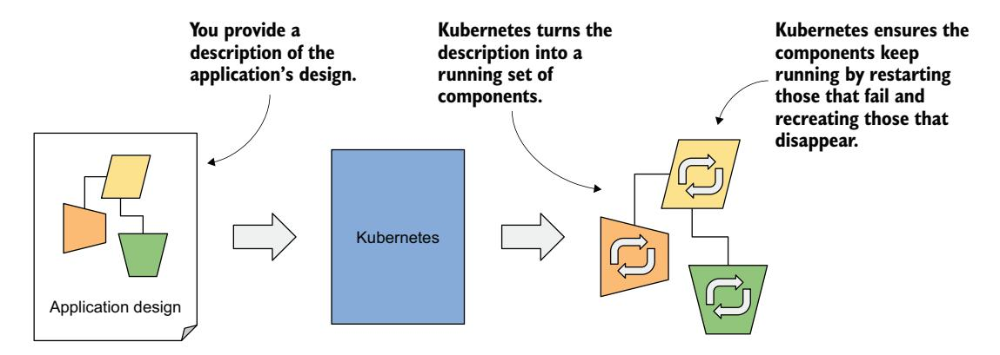
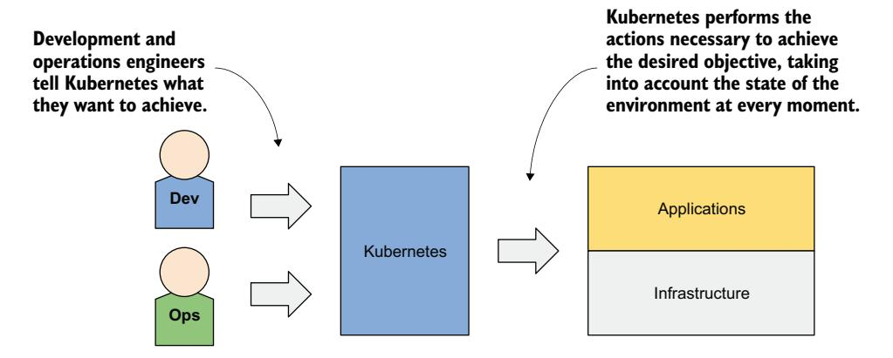
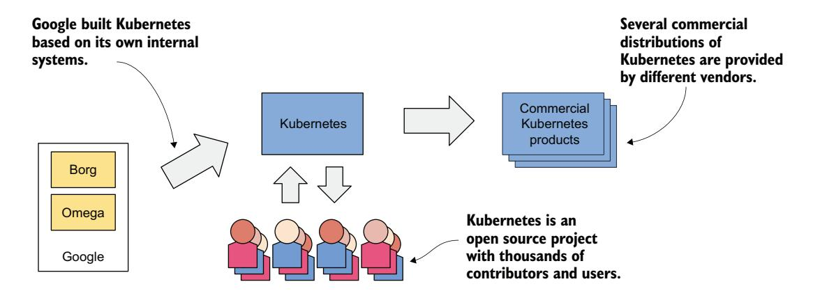
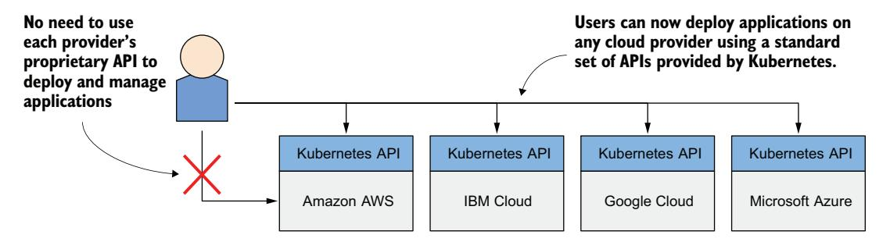
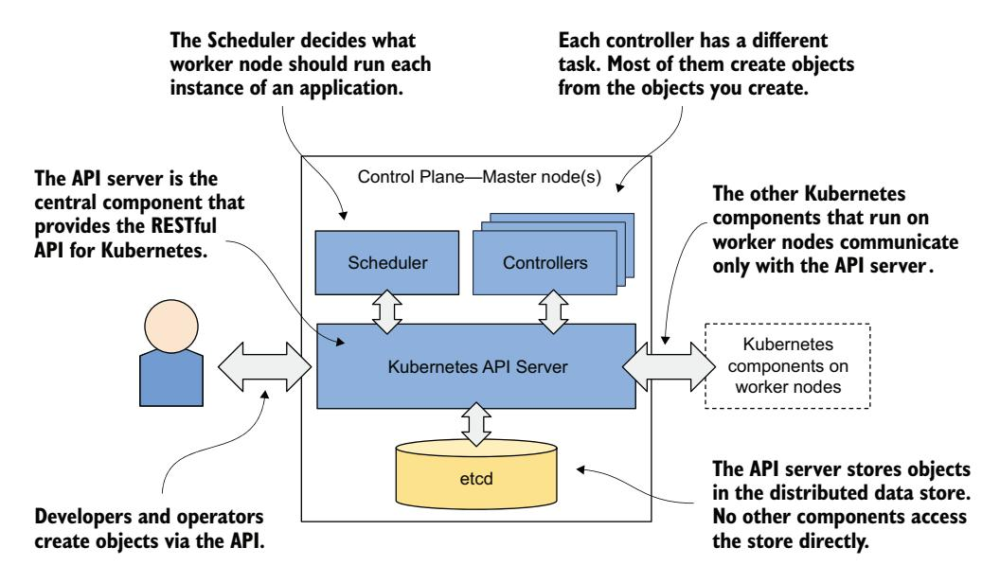
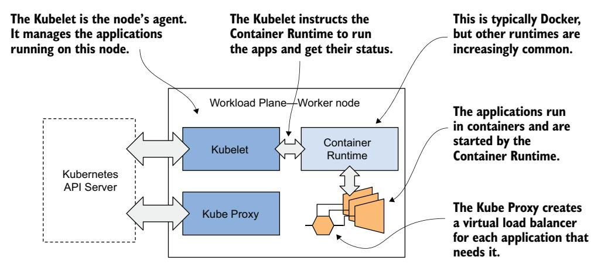
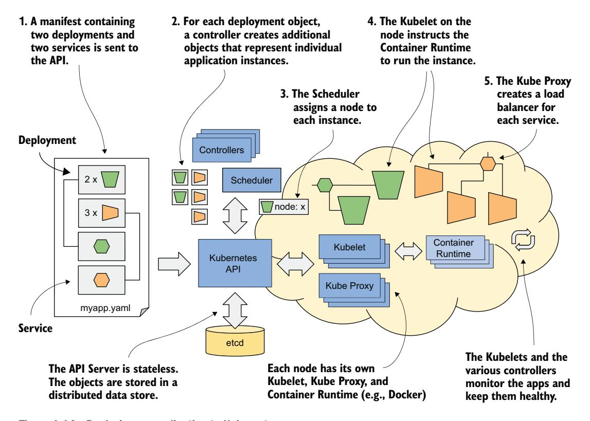

# *Introducing Kubernetes*

# *This chapter covers*

- Introducing Kubernetes and its origins
- Why Kubernetes has seen such wide adoption
- How Kubernetes transforms your data center
- An overview of its architecture and operation
- How and if you should integrate Kubernetes into your own organization

Kubernetes has become widely recognized as the go-to platform for running modern applications. The initial hype has settled, and while some might now call Kubernetes boring, the truth is that almost everyone uses it today.

 At first glance, Kubernetes seems complicated—like an unnecessary layer of complexity added to your infrastructure. But anyone who has actually used it knows the benefits are real. And the truth is, Kubernetes isn't that hard to understand once you start working with it.

 At its core, Kubernetes is simply an API and a set of relatively straightforward controllers that keep your containerized applications running smoothly. It decides where your applications should run, restarts them when something goes wrong, and ensures they remain accessible. If you've ever used Docker Compose, Nomad, or even traditional virtual machines, Kubernetes operates in a similar space, but it automates far more of the everyday work. You define the desired state of your applications, and Kubernetes handles everything necessary to achieve and maintain that state.

 Kubernetes takes care of tasks that developers and system administrators would rather avoid tackling manually, such as scheduling, networking, configuration, and ensuring consistent behavior across environments. Of course, Kubernetes isn't perfect for every situation. Small organizations running simple applications requiring minimal scaling might be better off with simpler tools. That said, even smaller teams can use managed Kubernetes services, which lets them avoid the hardest part—managing Kubernetes itself.

 This book is designed to make you proficient in Kubernetes through hands-on experience, not just theory. We'll build a small microservice application from the ground up and deploy it step by step. Along the way, you'll learn the basic concepts that both developers and cluster administrators must understand, including pods, deployments, services, volumes, configuration, and more. You don't need prior experience with containers, Docker, or even Linux, as we'll cover everything you need as we go.

 While future Kubernetes administrators will find valuable insights here, this book focuses on the basics of developing and running applications on a development cluster. Topics such as control-plane high availability, security, cluster installation, and addons are outside the scope of this book but are covered in our follow-up volume.

 By the end of this book, you'll understand how Kubernetes works, how to package and deploy your own applications, and how to use both local clusters (via Kind) and cloud-based ones such as Google Kubernetes Engine. Most importantly, you'll gain the confidence to navigate Kubernetes without feeling overwhelmed.

# *1.1 Introducing Kubernetes*

The word *Kubernetes* is a Greek term for "pilot" or "helmsman," the person who steers the ship—the person standing at the helm (the ship's wheel). A helmsman is not necessarily the same as a captain. A captain is responsible for the ship, while the helmsman is the one who steers it.

 After learning more about what Kubernetes does, you'll find that the name fits perfectly. A helmsman maintains the course of the ship, carries out the orders given by the captain, and reports back the ship's heading. Kubernetes steers your applications and reports on their status while you—the captain—decide where you want the system to go.

## How to pronounce Kubernetes, and what is k8s?

The correct Greek pronunciation of Kubernetes, which is *kie-ver-nee-tees*, is different from the English pronunciation you normally hear in technical conversations. Most often it's *koo-ber-netties* or *koo-ber-nay'-tace*, but you may also hear *koo-ber-nets*, although rarely.

In both written and oral conversations, it's also referred to as *Kube* or *K8s,* pronounced *kates*, where the 8 signifies the number of letters omitted between the first and last letter.

## *1.1.1 Kubernetes in a nutshell*

Kubernetes is a software system for automating the deployment and management of complex, large-scale application systems composed of computer processes running in containers. Let's learn what it does and how.

## ABSTRACTING THE INFRASTRUCTURE AWAY

When software developers or operators decide to deploy an application, they do this through Kubernetes instead of deploying the application to individual computers. Kubernetes provides an abstraction layer over the underlying hardware to both users and applications.

 As shown in figure 1.1, the underlying infrastructure, meaning the computers, the network, and other components, is hidden from the applications, making it easier to develop and configure them.

Figure 1.1 Infrastructure abstraction using Kubernetes

## STANDARDIZING HOW WE DEPLOY APPLICATIONS

Because the details of the underlying infrastructure no longer affect the deployment of applications, you deploy applications to your corporate data center the same way you do in the cloud. A single manifest that describes the application can be used for local deployment and for deploying on any cloud provider. All differences in the underlying infrastructure are handled by Kubernetes, so you can focus on the application and the business logic it contains.

## DEPLOYING APPLICATIONS DECLARATIVELY

Kubernetes uses a declarative model to define an application, as shown in figure 1.2. You describe the components that make up your application, and Kubernetes turns this description into a running application. It then keeps the application healthy by restarting or recreating parts of it as needed.

Figure 1.2 The declarative model of application deployment

Whenever you change the description, Kubernetes will take the necessary steps to reconfigure the running application to match the new description, as shown figure 1.3.

Figure 1.3 Changes in the description are reflected in the running application.

## TAKING ON THE DAILY MANAGEMENT OF APPLICATIONS

As soon as you deploy an application to Kubernetes, it takes over the daily management of the application. If the application fails, Kubernetes will automatically restart it. If the hardware fails or the infrastructure topology changes so that the application needs to be moved to other machines, Kubernetes does this all by itself. The

engineers responsible for operating the system can focus on the big picture instead of wasting time on the details (figure 1.4). To circle back to the sailing analogy: the development and operations engineers are the ship's officers who make high-level decisions while sitting comfortably in their armchairs, and Kubernetes is the helmsman who takes care of the low-level tasks of steering the system through the rough waters your applications and infrastructure sail through.

Figure 1.4 Kubernetes takes over the management of applications.

Everything that Kubernetes does and all the advantages it brings requires a longer explanation, which we'll discuss later. Before we do that, it might help you to know how it all began and where the Kubernetes project currently stands.

## *1.1.2 About the Kubernetes project*

Kubernetes was originally developed by Google who has practically always run applications in containers. As early as 2014, it was reported that they would start two billion containers every week. That's over 3,000 containers per second, and the figure is much higher today. These containers are run on thousands of computers distributed across dozens of data centers around the world. Now imagine doing all this manually. It's clear that you need automation, and at this massive scale, it better be perfect.

## BORG AND OMEGA: THE PREDECESSORS OF KUBERNETES

The sheer scale of Google's workload has forced them to develop solutions to make the development and management of thousands of software components manageable and cost-effective. Over the years, Google developed an internal system called *Borg* (and later a new system called *Omega*) that helped both application developers and operators manage these thousands of applications and services.

 In addition to simplifying development and management, these systems have also helped them achieve better utilization of their infrastructure. This is important in any organization, but when you operate hundreds of thousands of machines, even tiny improvements in utilization mean savings in the millions, so the incentives for developing such a system are clear.

 Over time, your infrastructure grows and evolves. Every new data center is state-ofthe-art. Its infrastructure differs from those built in the past. Despite the differences, the deployment of applications in one data center should not differ from deployment in another. This is especially important when you deploy your application across multiple zones or regions to reduce the likelihood that a regional failure will cause application downtime. To do this effectively, it's worth having a consistent method for deploying applications.

## KUBERNETES AS THE OPEN SOURCE PROJECT AND COMMERCIAL PRODUCTS DERIVED FROM IT

Based on the experience they gained while developing Borg, Omega, and other internal systems, Google introduced Kubernetes in 2014, an open source project that can now be used and further improved by everyone (figure 1.5). As soon as Kubernetes was announced, long before version 1.0 was officially released, other companies, such as Red Hat, who has always been at the forefront of open source software, quickly stepped on board and helped develop the project.

Figure 1.5 The origins and state of the Kubernetes open source project

Kubernetes eventually grew far beyond the expectations of its founders and today is arguably one of the world's leading open source projects, with dozens of organizations and thousands of individuals contributing to it. In addition, several companies are offering enterprise-quality Kubernetes products built from the open source project. These include Red Hat OpenShift, Pivotal Container Service, Rancher and many others.

## HOW KUBERNETES GREW A WHOLE NEW CLOUD-NATIVE ECO-SYSTEM

Kubernetes has also spawned many other related open source projects. Most of them are now under the umbrella of the *Cloud Native Computing Foundation* (CNCF), which is part of the *Linux Foundation*.

 CNCF organizes several KubeCon–CloudNativeCon conferences annually, in North America, Europe, and China. In 2023, over 30,000 engineers attended these conferences either in-person or virtually. This number shows that Kubernetes has had an incredibly positive effect on the way companies around the world deploy applications today. It wouldn't have been so widely adopted if that wasn't the case.

## *1.1.3 Understanding why Kubernetes is so popular*

Recently, the way applications are developed has changed considerably. This has led to the development of new tools such as Kubernetes, which in turn have fed back and fuelled further changes in application architecture and the way we develop them. Let's look at concrete examples.

## AUTOMATING THE MANAGEMENT OF MICROSERVICES

In the past, most applications were large monoliths. The components of the application were tightly coupled, and they all ran in a single computer process. The application was developed as a unit by a large team of developers, and the deployment of the application was straightforward. You installed it on a powerful computer and provided the little configuration it required. Scaling the application horizontally was rarely possible, so whenever you needed to increase the capacity of the application, you had to upgrade the hardware (i.e., scale the application vertically).

 Then came the microservices paradigm. The monoliths were divided into dozens, sometimes hundreds, of separate processes, as shown in figure 1.6. This allowed organizations to divide their development departments into smaller teams where each team developed only a part of the entire system—just some of the microservices.

Figure 1.6 Comparing monolithic applications with microservices

Each microservice is now a separate application with its own development and release cycle. The dependencies of different microservices will inevitably diverge over time. One microservice requires one version of a library, while another microservice requires another, possibly incompatible, version of the same library. Running the two applications in the same operating system becomes difficult.

 Fortunately, containers alone solve this problem where each microservice requires a different environment, but each microservice is now a separate application that must be managed individually. The increased number of applications makes this much more difficult.

 Individual parts of the entire application no longer need to run on the same computer, which makes it easier to scale the entire system, but also means that the applications need to be configured to communicate with each other. For systems with only a handful of components, this can usually be done manually, but it's now common to see deployments with well over a hundred microservices.

 When the system consists of many microservices, automated management is crucial. Kubernetes provides this automation. The features it offers make the task of managing hundreds of microservices almost trivial.

## BRIDGING THE DEV AND OPS DIVIDE

Along with these changes in application architecture, we've also seen changes in the way teams develop and run software. It used to be normal for a development team to build the software in isolation and then throw the finished product over the wall to the operations team, who would then deploy it and manage it from there.

 With the advent of the Dev-Ops paradigm, the two teams now work much more closely together throughout the entire life of the software product. The development team is now much more involved in the daily management of the deployed software. But that means that they now need to know about the infrastructure on which it's running.

 As a software developer, your primary focus is on implementing the business logic. You don't want to deal with the details of the underlying servers. Fortunately, Kubernetes hides these details.

## STANDARDIZING THE CLOUD

Over the past decade or two, many organizations have moved their software from local servers to the cloud. The benefits seem to have outweighed the fear of being locked-in to a particular cloud provider, which is caused by relying on the provider's proprietary APIs to deploy and manage applications.

 Any company that wants to be able to move its applications from one provider to another will have to make additional, initially unnecessary efforts to abstract the infrastructure and APIs of the underlying cloud provider from the applications. This requires resources that could otherwise be focused on building the primary business logic.

 Kubernetes has also helped in this respect. The popularity of Kubernetes has forced all major cloud providers to integrate Kubernetes into their offerings. Customers can now deploy applications to any cloud provider through a standard set of APIs provided by Kubernetes.

 If the application is built on the APIs of Kubernetes instead of directly on the proprietary APIs of a specific cloud provider, it can be transferred relatively easily to any other provider.

Figure 1.7 Kubernetes has standardized how you deploy applications on cloud providers.

# *1.2 Understanding Kubernetes*

The previous section explained the origins of Kubernetes and the reasons for its wide adoption. This section takes a closer look at what exactly Kubernetes is.

## *1.2.1 Understanding how Kubernetes transforms a computer cluster*

Let's take a closer look at how the perception of the data center changes when you deploy Kubernetes on your servers.

## KUBERNETES—AN OPERATING SYSTEM FOR COMPUTER CLUSTERS

One can imagine Kubernetes as an operating system for the cluster. Figure 1.8 illustrates the analogies between an operating system running on a computer and Kubernetes running on a cluster of computers.

Figure 1.8 Kubernetes is to a computer cluster what an operating system is to a computer.

Just as an operating system supports the basic functions of a computer, such as scheduling processes onto its CPUs and acting as an interface between the application and the computer's hardware, Kubernetes schedules the components of a distributed application onto individual computers in the underlying computer cluster and acts as an interface between the application and the cluster.

 It frees application developers from the need to implement infrastructure-related mechanisms in their applications; instead, they rely on Kubernetes to provide them. This includes things such as

- *Service discovery*—A mechanism that allows applications to find other applications and use the services they provide
- *Horizontal scaling*—Replicating your application to adjust to fluctuations in load
- *Load-balancing*—Distributing load across all the application replicas
- *Self-healing*—Keeping the system healthy by automatically restarting failed applications and moving them to healthy nodes after their nodes fail
- *Leader election*—A mechanism that decides which instance of the application should be active while the others remain idle but is ready to take over if the active instance fails

By relying on Kubernetes to provide these features, application developers can focus on implementing the core business logic instead of wasting time integrating applications with the infrastructure.

## HOW KUBERNETES FITS INTO A COMPUTER CLUSTER

For a concrete example of how Kubernetes is deployed onto a cluster of computers, see figure 1.9.

Figure 1.9 Computers in a Kubernetes cluster are divided into the control and the workload plane.

You start with a fleet of machines that you divide into two groups: the control plane and the worker nodes. The control plane nodes are the brain of your system and control the cluster, while the worker nodes will run your applications, your workloads, and will therefore represent the workload plane.

NOTE The workload plane is sometimes referred to as the data plane, but this term could be confusing because the plane doesn't host data but applications. Don't be confused by the term "plane" either. In this context you can think of it as the "surface" the applications run on.

Non-production clusters can use a single control plane node, but highly available clusters use at least three physical control plane nodes to host the control plane. The number of worker nodes depends on the number of applications you'll deploy.

## HOW ALL CLUSTER NODES BECOME ONE LARGE DEPLOYMENT AREA

After Kubernetes is installed on the computers, you no longer need to think about individual computers when deploying applications. Regardless of the number of worker nodes in your cluster, they all become a single space where you deploy your applications. You do this using the Kubernetes API, which is provided by the Kubernetes Control Plane (figure 1.10).

Figure 1.10 Kubernetes exposes the cluster as a uniform deployment area.

When I say that all worker nodes become one space, I don't want you to think that you can deploy an extremely large application that is spread across several small machines. Kubernetes doesn't do magic tricks like this. Each application must be small enough to fit on one of the worker nodes.

 What I mean is that when deploying applications, it doesn't matter which worker node they end up on. Kubernetes may later move the application from one node to another. You may not even notice when that happens, and you shouldn't care.

## *1.2.2 The benefits of using Kubernetes*

You've already learned why many organizations worldwide have welcomed Kubernetes into their data centers. Now, let's take a closer look at the specific benefits it brings to both development and IT operations teams.

## SELF-SERVICE DEPLOYMENT OF APPLICATIONS

Because Kubernetes presents all its worker nodes as a single deployment surface, it no longer matters which node you deploy your application to. This means that developers can now deploy applications on their own, even if they don't know anything about the number of nodes or the characteristics of each node.

 In the past, the system administrators were the ones who decided where each application should be placed. This task is now left to Kubernetes, which allows a developer to deploy applications without having to rely on other people to do so. When a developer deploys an application, Kubernetes chooses the best node on which to run the application based on the resource requirements of the application and the resources available on each node.

## REDUCING COSTS VIA BETTER INFRASTRUCTURE UTILIZATION

If you don't care which node your application lands on, it also means that it can be moved to any other node at any time without you having to worry about it. Kubernetes may need to do this to make room for a larger application that someone wants to deploy. This ability to move applications allows the applications to be packed tightly together so that the resources of the nodes can be utilized in the best possible way.

 Finding optimal combinations can be challenging and time consuming, especially when the number of all possible options is huge, such as when you have many application components and many server nodes on which they can be deployed. Computers can perform this task much better and faster than humans. Kubernetes does it very well. By combining different applications on the same machines, Kubernetes improves the utilization of your hardware infrastructure so you can run more applications on fewer servers.

## AUTOMATICALLY ADJUSTING TO CHANGING LOAD

Using Kubernetes to manage your deployed applications also means that the operations team doesn't have to constantly monitor the load of each application to respond to sudden load peaks. Kubernetes takes care of this also. It can monitor the resources consumed by each application and other metrics and adjust the number of running instances of each application to cope with increased load or resource usage.

 When you run Kubernetes on cloud infrastructure, it can even increase the size of your cluster by provisioning additional nodes through the cloud provider's API. This way, you never run out of space to run additional instances of your applications.

## KEEPING APPLICATIONS RUNNING SMOOTHLY

Kubernetes also makes every effort to ensure that your applications run smoothly. If your application crashes, Kubernetes will restart it automatically. So even if you have a broken application that runs out of memory after running for more than a few hours, Kubernetes will ensure that your application continues to provide the service to its users by automatically restarting it in this case.

 Kubernetes is a self-healing system in that it deals with software errors like the one just described, but it also handles hardware failures. As clusters grow in size, the frequency of node failure also increases. For example, in a cluster with one hundred nodes and a MTBF (mean-time-between-failure) of 100 days for each node, you can expect one node to fail every day.

 When a node fails, Kubernetes automatically moves applications to the remaining healthy nodes. The operations team no longer needs to manually move the application and can instead focus on repairing the node itself and returning it to the pool of available hardware resources.

 If your infrastructure has enough free resources to allow normal system operation without the failed node, the operations team doesn't even have to react immediately to the failure. If it occurs in the middle of the night, no one from the operations team even has to wake up. They can sleep peacefully and deal with the failed node during regular working hours.

## SIMPLIFYING APPLICATION DEVELOPMENT

The improvements described in the previous section mainly concern application deployment. But what about the process of application development? Does Kubernetes bring anything to their table? It definitely does.

 As mentioned previously, Kubernetes offers infrastructure-related services that would otherwise have to be implemented in your applications. This includes the discovery of services and/or peers in a distributed application, leader election, centralized application configuration, and others. Kubernetes provides this while keeping the application Kubernetes-agnostic, but when required, applications can also query the Kubernetes API to obtain detailed information about their environment. They can also use the API to change the environment.

## *1.2.3 The architecture of a Kubernetes cluster*

As you've already learned, a Kubernetes cluster consists of nodes divided into two groups:

- A set of *control plane nodes* to host the *control plane* components, which are the brains of the system, since they control the entire cluster
- A set of *worker nodes* that form the *workload plane*, which is where your workloads (or applications) run

Figure 1.11 shows the two planes and the different nodes they consist of.

Figure 1.11 The two planes that make a Kubernetes cluster

The two planes, and hence the two types of nodes, run different Kubernetes components. The next two sections of the book introduce them, summarizing their functions without going into details. These components will be mentioned several times in the next part of the book where I explain the fundamental Kubernetes concepts. An indepth look at the components and their internals follows in the third part of the book.

## CONTROL PLANE COMPONENTS

The control plane is what controls the cluster. It consists of several components that run on a single node or are replicated across multiple nodes to ensure high availability. Figure 1.12 shows the control plane's components.

Figure 1.12 The components of the Kubernetes control plane

These are the components and their functions:

- The *Kubernetes API Server* exposes the RESTful Kubernetes API. Engineers using the cluster and other Kubernetes components create objects via this API.
- The *etcd* distributed datastore persists the objects created through the API, since the API Server itself is stateless. The server is the only component that talks to etcd.
- The *Scheduler* decides on which worker node each application instance should run.
- *Controllers* bring to life the objects created through the API. Most of them simply create other objects, but some also communicate with external systems (for example, the cloud provider via its API).

The components of the control plane hold and control the state of the cluster, but they don't run your applications. This is done by the (worker) nodes.

#### **WORKER NODE COMPONENTS**

The worker nodes are the computers on which your applications run. They form the cluster's workload plane. In addition to applications, several Kubernetes components also run on these nodes. They perform the task of running, monitoring, and providing connectivity between your applications, as shown in figure 1.13.

Figure 1.13 The Kubernetes components that run on each node

Each node runs the following set of components:

- The *Kubelet*, an agent that talks to the API server and manages the applications running on its node. It reports the status of these applications and the node via the API.
- The *container runtime*, which can be Docker or any other runtime compatible with Kubernetes. It runs your applications in containers as instructed by the Kubelet.
- The *Kubernetes Service Proxy* (*kube-proxy*) load-balances network traffic between applications.

#### **ADD-ON COMPONENTS**

Most Kubernetes clusters also contain several other components—a DNS server, network plugins, logging agents, and many others. They typically run on the worker nodes but can also be configured to run on the control plane node(s).

#### **GAINING A DEEPER UNDERSTANDING OF THE ARCHITECTURE**

For now, I only expect you to be vaguely familiar with the names of these components and their function, as I'll mention them many times throughout the following chapters. In addition,I'm not a fan of explaining how things work until I first explain *what* something does and teach you how to use it. It's like learning to drive. You don't want to know what's under the hood. At first, you just want to learn how to get from point A to B. Only then will you be interested in how the car makes this possible. Knowing

what's under the hood may one day help you get your car moving again after it has broken down, and you are stranded on the side of the road. I hate to say it, but you'll have many moments like this when dealing with Kubernetes due to its sheer complexity.

## *1.2.4 How Kubernetes runs an application*

With a general overview of the components that make up Kubernetes, I can finally explain how to deploy an application.

## DEFINING YOUR APPLICATION

Everything in Kubernetes is represented by an object. You create and retrieve these objects via the Kubernetes API. Your application consists of several types of these objects—one type represents the application deployment as a whole, another represents a running instance of your application or the service provided by a set of these instances and allows reaching them at a single IP address, and there are many others.

 All these types are explained in detail in the second part of the book. At the moment, it's enough to know that you define your application through several types of objects. These objects are usually defined in one or more manifest files in either YAML or JSON format.

DEFINITION YAML was initially said to mean "Yet Another Markup Language," but it was later changed to the recursive acronym "YAML Ain't Markup Language." It's one of the ways to serialize an object into a human-readable text file.

DEFINITION JSON is short for JavaScript Object Notation. It's a different way of serializing an object, but more suitable for exchanging data between applications.

Figure 1.14 shows an example of deploying an application by creating a manifest with two deployments exposed using two services.

The following actions take place when you deploy the application:

- 1 You submit the application manifest to the Kubernetes API. The API Server writes the objects defined in the manifest to etcd.
- 2 A controller notices the newly created objects and creates several new objects one for each application instance.
- 3 The scheduler assigns a node to each instance.
- 4 The Kubelet notices that an instance is assigned to the Kubelet's node. It runs the application instance via the container runtime.
- 5 The kube-proxy notices that the application instances are ready to accept connections from clients and configures a load balancer for them.
- 6 The Kubelets and the controllers monitor the system and keep the applications running.

The procedure is explained in more detail in the following sections.

Figure 1.14 Deploying an application to Kubernetes

## SUBMITTING THE APPLICATION TO THE API

After you've created your YAML or JSON file(s), you submit the file to the API, usually via the Kubernetes command-line tool called *kubectl*.

NOTE Kubectl is pronounced *kube-control*, but the softer souls in the community prefer to call it *kube-cuddle*. Some refer to it as *kube-C-T-L*.

Kubectl splits the file into individual objects and creates each of them by sending an HTTP PUT or POST request to the API, as is usually the case with RESTful APIs. The API Server validates the objects and stores them in the etcd datastore. In addition, it notifies all interested components that these objects have been created. Controllers, which are explained next, are one of these components.

## ABOUT THE CONTROLLERS

Most object types have an associated controller. A controller is interested in a particular object type. It waits for the API server to notify it that a new object has been created and then performs operations to bring that object to life. Typically, the controller just creates other objects via the same Kubernetes API. For example, the controller responsible for application deployments creates one or more objects that represent individual instances of the application. The number of objects created by the controller depends on the number of replicas specified in the application deployment object.

## ABOUT THE SCHEDULER

The scheduler is a special type of controller whose only task is to schedule application instances onto worker nodes. It selects the best worker node for each new application instance object and assigns it to the instance by modifying the object via the API.

## ABOUT THE KUBELET AND THE CONTAINER RUNTIME

The Kubelet that runs on each worker node is also a type of controller. Its task is to wait for application instances to be assigned to the node on which it is located and run the application. This is done by instructing the container runtime to start the application's container.

## ABOUT THE KUBE-PROXY

Because an application deployment can consist of multiple application instances, a load balancer is required to expose them at a single IP address. The kube-proxy, another controller running alongside the Kubelet, is responsible for setting up the load balancer.

## KEEPING THE APPLICATIONS HEALTHY

Once the application is up and running, the Kubelet keeps the application healthy by restarting it when it terminates. It also reports the status of the application by updating the object that represents the application instance. The other controllers monitor these objects and ensure that applications are moved to healthy nodes if their nodes fail.

 You're now roughly familiar with the architecture and functionality of Kubernetes. You don't need to understand or remember all the details at this moment, because internalizing this information will be easier when you learn about each individual object type and the controllers that bring them to life in the second part of the book.

# *1.3 Introducing Kubernetes into your organization*

To close this chapter, let's see what options are available to you if you decide to introduce Kubernetes in your own IT environment.

## *1.3.1 Running Kubernetes on-premises and in the cloud*

If you want to run your applications on Kubernetes, you have to decide whether you want to run them locally, in your organization's own infrastructure (on-premises), or with one of the major cloud providers, or perhaps both (in a hybrid cloud solution).

## RUNNING KUBERNETES ON-PREMISES

Running Kubernetes on your own infrastructure may be your only option if regulations require you to run applications on site. This usually means that you'll have to manage Kubernetes yourself, but we'll come to that later.

 Kubernetes can run directly on your bare-metal machines or in virtual machines running in your data center. In either case, you won't be able to scale your cluster as easily as when you run it in virtual machines provided by a cloud provider.

## DEPLOYING KUBERNETES IN THE CLOUD

If you have no on-premises infrastructure, you have no choice but to run Kubernetes in the cloud. This has the advantage that you can scale your cluster at any time at short notice if required. As mentioned earlier, Kubernetes itself can ask the cloud provider to provision additional virtual machines when the current size of the cluster is no longer sufficient to run all the applications you want to deploy.

 When the number of workloads decreases and some worker nodes are left without running workloads, Kubernetes can ask the cloud provider to destroy the virtual machines of these nodes to reduce your operational costs. This elasticity of the cluster is certainly one of the main benefits of running Kubernetes in the cloud.

## USING A HYBRID CLOUD SOLUTION

A more complex option is to run Kubernetes on-premises, but also allow it to spill over into the cloud. It's possible to configure Kubernetes to provision additional nodes in the cloud if you exceed the capacity of your own data center. This way, you get the best of both worlds. Most of the time, your applications run locally without the cost of virtual machine rental, but in short periods of peak load that may occur only a few times a year, your applications can handle the extra load by using the additional resources in the cloud.

 If your use-case requires it, you can also run a Kubernetes cluster across multiple cloud providers or a combination of any of the options mentioned. This can be done using a single control plane or one control plane in each location.

# *1.3.2 To manage or not to manage Kubernetes yourself*

If you are considering introducing Kubernetes in your organization, the most important question you need to answer is whether you'll manage Kubernetes yourself or use a Kubernetes-as-a-Service type offering where someone else manages it for you.

## MANAGING KUBERNETES YOURSELF

If you already run applications on-premises and have enough hardware to run a production-ready Kubernetes cluster, your first instinct is probably to deploy and manage it yourself. If you ask anyone in the Kubernetes community if this is a good idea, you'll usually get a very resonant no.

 Figure 1.14 was a very simplified representation of what happens in a Kubernetes cluster when you deploy an application. Even that figure should have scared you. Kubernetes brings an enormous amount of additional complexity. Anyone who wants to run a Kubernetes cluster must be intimately familiar with its inner workings.

 The management of production-ready Kubernetes clusters is a multibillion-dollar industry. Before you decide to manage one yourself, it's essential that you consult with engineers who have already done it to learn about the problems most teams run into. If you don't, you may be setting yourself up for failure. However, trying out Kubernetes for non-production use-cases or using a managed Kubernetes cluster is much less problematic.

## USING A MANAGED KUBERNETES CLUSTER IN THE CLOUD

Using Kubernetes is ten times easier than managing it. Most major cloud providers now offer Kubernetes-as-a-Service. They take care of managing Kubernetes and its components while you simply use the Kubernetes API like any of the other APIs the cloud provider offers.

The top managed Kubernetes offerings include

- Google Kubernetes Engine (GKE)
- Azure Kubernetes Service (AKS)
- Amazon Elastic Kubernetes Service (EKS)
- IBM Cloud Kubernetes Service
- Red Hat OpenShift Online and Dedicated
- VMware Cloud PKS
- Alibaba Cloud Container Service for Kubernetes (ACK)

The first half of this book focuses on just using Kubernetes. You'll run the exercises in a local development cluster and on a managed GKE cluster, as it is the easiest to use and offers the best user experience. The second part of the book gives you a solid foundation for managing Kubernetes, but to truly master it, you'll need to gain additional experience.

# *1.3.3 Using vanilla or extended Kubernetes*

The final question is whether to use a vanilla open source version of Kubernetes or an extended, enterprise-quality Kubernetes product.

## USING A VANILLA VERSION OF KUBERNETES

The open source version of Kubernetes is maintained by the community and represents the cutting edge of Kubernetes development. This also means that it may not be as stable as the other options. It may also lack good security defaults. Deploying the vanilla version requires a lot of fine tuning to set everything up for production use.

## USING ENTERPRISE-GRADE KUBERNETES DISTRIBUTIONS

A better option for using Kubernetes in production is to use an enterprise-quality Kubernetes distribution such as OpenShift or Rancher. In addition to the increased security and performance provided by better defaults, they offer additional object types in addition to those provided in the upstream Kubernetes API. For example, vanilla Kubernetes does not contain object types that represent cluster users, whereas commercial distributions do. They also provide additional software tools for deploying and managing well-known third-party applications on Kubernetes.

 Of course, extending and hardening Kubernetes takes time, so these commercial Kubernetes distributions usually lag one or two versions behind the upstream version of Kubernetes. It's not as bad as it sounds. The benefits usually outweigh the disadvantages.

*Summary* **23**

## *1.3.4 Should you even use Kubernetes?*

I hope this chapter has made you excited about Kubernetes and you can't wait to squeeze it into your IT stack. But to close this chapter properly, we need to say a word or two about when introducing Kubernetes is not a good idea.

## DO YOUR WORKLOADS REQUIRE AUTOMATED MANAGEMENT?

The first thing you need to be honest about is whether you need to automate the management of your applications at all. If your application is a large monolith, you definitely don't need Kubernetes.

 Even if you deploy microservices, using Kubernetes may not be the best option, especially if the number of your microservices is very small. It's difficult to provide an exact number when the scales tip over, since other factors also influence the decision. But if your system consists of less than 5 microservices, throwing Kubernetes into the mix is probably not a good idea. If your system has more than 20 microservices, you will most likely benefit from the integration of Kubernetes. If the number of your microservices falls somewhere in between, other factors, such as the ones described next, should be considered.

## CAN YOU AFFORD TO INVEST YOUR ENGINEERS' TIME INTO LEARNING KUBERNETES?

Kubernetes is designed to allow applications to run without them knowing that they are running in Kubernetes. While the applications themselves don't need to be modified to run in Kubernetes, development engineers will inevitably spend a lot of time learning how to use Kubernetes, even though the operators are the only ones that actually need that knowledge.

 It would be hard to tell your teams that you're switching to Kubernetes and expect only the operations team to start exploring it. Developers like shiny new things. At the time of writing, Kubernetes is still a very shiny thing.

## ARE YOU PREPARED FOR INCREASED COSTS IN THE INTERIM?

While Kubernetes reduces long-term operational costs, introducing Kubernetes in your organization initially involves increased costs for training, hiring new engineers, building and purchasing new tools and possibly additional hardware. Kubernetes requires additional computing resources in addition to the resources that the applications use.

 So far, you've only observed the ship from the pier. It's time to come aboard. But before you leave the docks, you should inspect the shipping containers it's carrying. We'll do this next.

# *Summary*

- Kubernetes is the Greek word for "helmsman." Just like a ship's captain oversees the ship while the helmsman steers it, you oversee your computer cluster, while Kubernetes performs the everyday management tasks.
- Kubernetes is pronounced *koo-ber-netties*. Kubectl, the Kubernetes command-line tool, is pronounced *kube-control*.