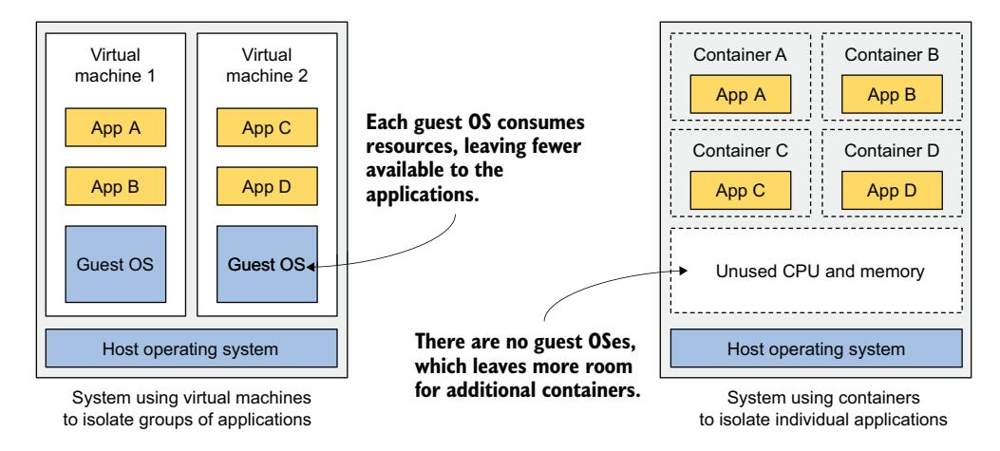
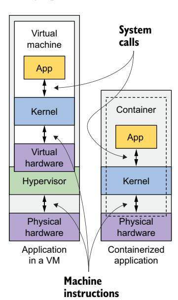
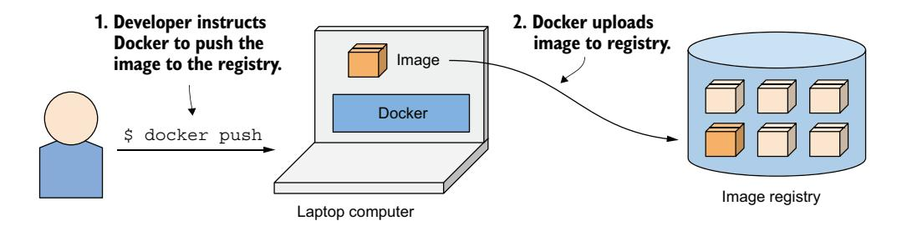
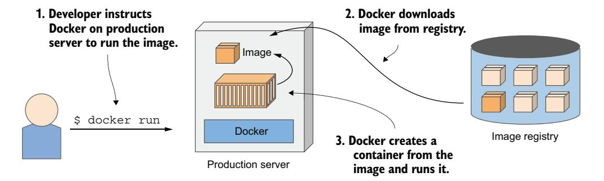
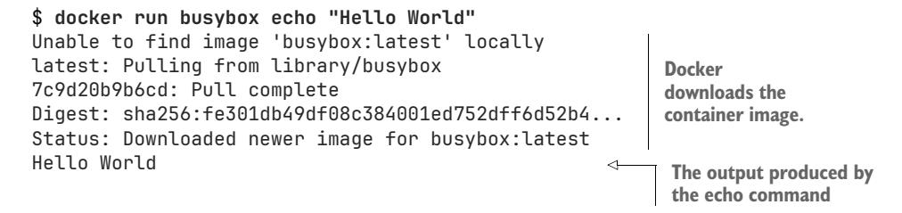
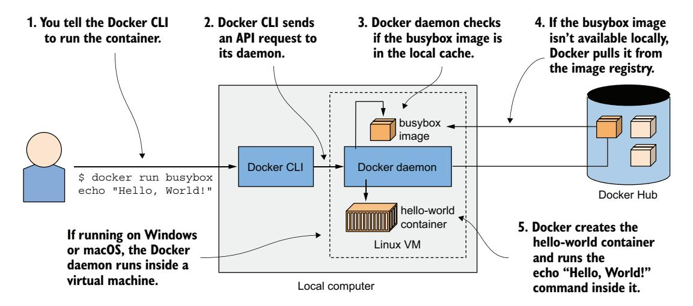
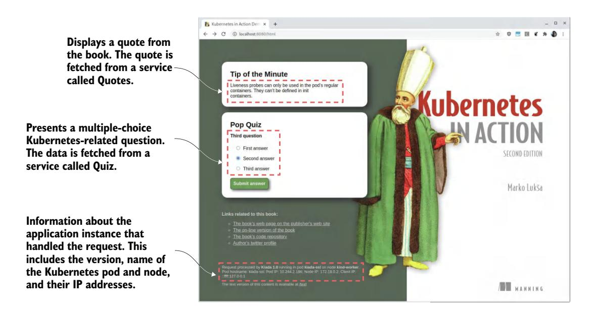
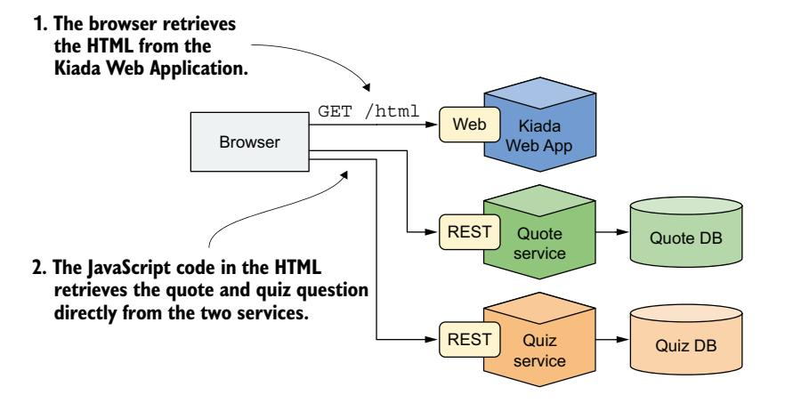
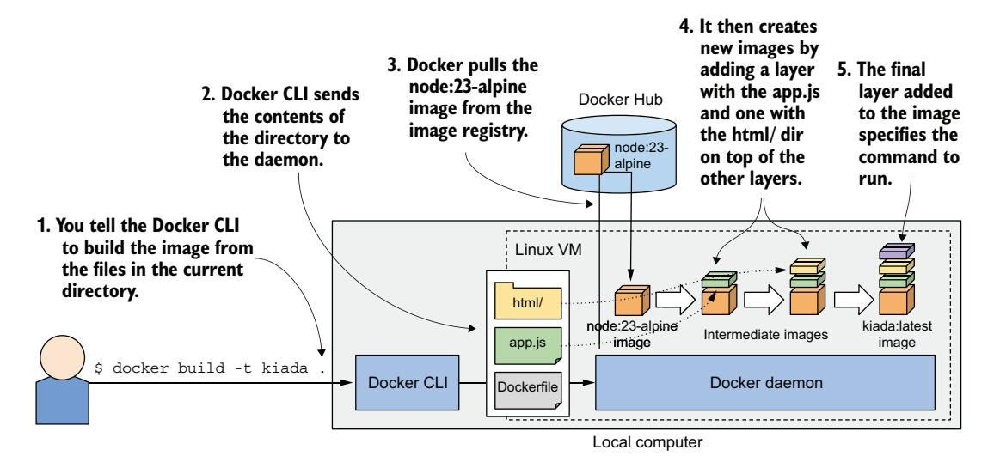
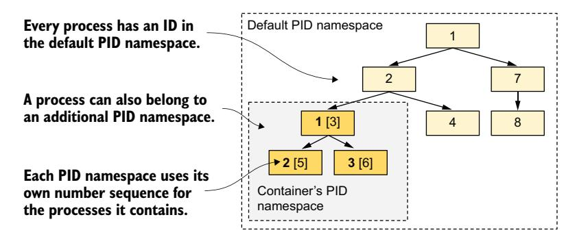

# *Understanding containers and containerized applications*

# *This chapter covers*

- Introducing containers
- Differences between containers and virtual machines
- Creating, running, and sharing a container image with Docker
- Linux kernel features that make containers possible

Kubernetes primarily manages applications that run in containers, so before you start exploring Kubernetes, you need to have a good understanding of what a container is. This chapter explains the basics of Linux containers that a typical Kubernetes user needs to know.

# *2.1 Introducing containers*

In chapter 1, you learned how different microservices that run in the same operating system may require different, potentially conflicting versions of dynamically linked libraries or have different environment requirements.

 When a system consists of a small number of applications or services, it's okay to assign a dedicated virtual machine (VM) to each and have it run in its own operating system. But for systems that run many applications, you may not be able to afford giving each application or service its own VM if you want to keep your hardware costs low.

 It's not just a matter of wasting hardware resources—each VM typically needs to be individually configured and managed, which means that running a higher number of VMs also results in higher staffing requirements and the need for a more complicated automation system. The shift to microservice architectures, with systems including hundreds of deployed application instances, prompted the search for a more suitable alternative to VMs. This is where containers come in.

## *2.1.1 Comparing containers to VMs*

Instead of using VMs to isolate the environments of individual microservices (or software processes in general), most development and operations teams now prefer to use containers. They allow running multiple services on the same host computer, while keeping them isolated from each other—like VMs, but with less overhead.

 Unlike VMs, each running a separate operating system with several system processes, a process running in a container takes place within the existing host operating system. Because there is only one operating system, no duplicate system processes exist. Although all the application processes run in the same operating system, their environments are isolated, although not as well as when running in separate VMs. From the perspective of the process running in the container, this isolation creates the illusion that it is the only process on the entire system. Before we explore how this is possible in the upcoming sections, let's dive deeper into the differences between containers and virtual machines.

## OVERHEAD

While each VM usually runs its own set of system processes, which may require substantial computing resources in addition to those required by the user application's own process, a container is nothing more than an additional process running in the existing host OS. A container thus virtually has no overhead.

 Figure 2.1 compares two computers, where one runs applications in two VMs, while the other runs each application in its own container. The latter could run additional containers, as it has more unused CPU and memory compared to the former. This is because the second computer runs a single operating system, while the first runs three (one host and two guest operating systems), which collectively consume more resources.

 Because of the resource overhead of VMs, multiple applications are often grouped into each VM. You may not be able to afford to dedicate a whole VM to each app. But since containers introduce no overhead, you are free to create a separate container for each application. In fact, you should never run multiple applications in the same container, as this makes managing the processes in the container much more difficult. Moreover, all existing software dealing with containers, including Kubernetes itself, is



Figure 2.1 Running applications in VMs vs. containers

designed under the premise that there's only one application in a container. Designing your system to work against this principle is asking for trouble.

## START-UP TIME OF CONTAINERS AND VMS

In addition to the lower runtime overhead, containers also start the application faster, because only the application process itself needs to be started. No additional system processes need to be initiated first, as is the case when booting up a new VM.

## ISOLATION OF CONTAINERS AND VMS

You'll agree that containers are clearly better when it comes to the use of resources, but there's also a disadvantage. When you run applications in virtual machines, each VM runs its own operating system and kernel. Underneath those VMs is the hypervisor (and possibly an additional operating system), which splits the physical hardware resources into smaller sets of virtual resources for each VM. As figure 2.2 shows, applications running in these VMs make system calls (*syscalls*) to the guest OS kernel in the VM, and the machine instructions that the kernel then executes on the virtual CPUs are then forwarded to the host's physical CPU via the hypervisor.

NOTE There are two types of hypervisors: type 1 hypervisors don't require running a host OS, while type 2 hypervisors do.

Containers, in contrast, all make system calls on the single kernel running in the host OS. This single



Figure 2.2 How apps use the hardware when running in a VM vs. in a container

kernel is the only one that executes instructions on the host's CPU, removing the need for CPU virtualization.

 Take a look at figure 2.3 to see the difference between running three applications on bare metal, in two separate VMs, and in three containers. In the first case, all three applications use the same kernel and aren't isolated at all. In the second case, applications A and B run in the same VM and thus share the kernel, while application C is isolated from the other two since it uses its own kernel.


Figure 2.3 The difference between running applications on bare metal, in VMs, and in containers

The third case in figure 2.3 shows the same three applications running in containers. Although they all use the same kernel, they are isolated from each other and unaware of the others' existence. The isolation is provided by the kernel itself. Each application sees only a part of the physical hardware and behaves as the only process running in the OS, although they all run in the same OS.

## Understanding the security implications of container isolation

The main advantage of using VMs over containers is the complete isolation they provide, since each VM has its own Linux kernel, while containers all use the same kernel. This can clearly pose a security risk. If there's a bug in the kernel, an application in one container might use it to read the memory of applications in other containers. If the apps run in different VMs and therefore share only the hardware, the probability of such attacks is much lower. Of course, complete isolation is only achieved by running applications on separate physical machines.

Additionally, containers share memory space, whereas each VM uses its own chunk of memory. Therefore, if you don't limit the amount of memory that a container can use, this could cause other containers to run out of memory or cause their data to be swapped out to disk.

**NOTE** While VMs rely on CPU virtualization support and hypervisor software on the host, containers are enabled by container technologies supported by the Linux kernel. But instead of interacting with these technologies directly, you typically rely on tools such as Docker or Podman, which offer user-friendly interfaces for managing containers.

## 2.1.2 Introducing the Docker container platform

While container technologies have existed for a long time, they only became widely known with the rise of Docker. Docker was the first container system that made containers easily portable across different computers. It simplifies the process of packaging up the application and its dependencies into a single package that can be deployed on any computer running Docker.

#### **CONTAINERS, IMAGES, AND REGISTRIES**

Docker is a platform for packaging, distributing, and running applications. As mentioned earlier, it allows you to package your application along with its entire environment. This can include only a few dynamically linked libraries required by the app or all the files that are usually shipped with an operating system. Docker allows you to distribute this package via a public repository to any other Docker-enabled computer. Figure 2.4 shows three main Docker concepts that appear in the process I've just described.


Figure 2.4 The three main Docker concepts are images, registries, and containers.

A *container image* is the packaged bundle that includes your application and its environment, similar to a zip file or tarball. It consists of the entire filesystem needed by your application, and metadata, such as which executable file to run, the ports the application listens on, and other information about the image.

 An *image registry* is a repository for storing and sharing container images between different people and computers. After you build your image, you can either run it locally or upload (*push*) the image to a registry and then download (*pull*) it to another computer. Some registries are public, allowing anyone to pull images from it, while others are private and only accessible to individuals, organizations, or computers that have the required authentication credentials.

 A *container* is created from a container image and runs as a regular process on the host operating system. However, its environment is isolated from the host and the other processes. The container's filesystem is derived from the container image, but additional filesystems can also be mounted into the container. Containers are typically resource restricted, meaning they are allocated specific amounts of resources, such as CPU and memory, and can't exceed these limits.

## BUILDING, DISTRIBUTING, AND RUNNING A CONTAINER IMAGE

To understand how containers, images, and registries relate to each other, let's look at how to build a container image, distribute it through a registry, and create a running container from the image. These three processes are shown in figures 2.5–2.7. The developer first builds an image (figure 2.5). The image is stored locally until the developer pushes it to a registry (figure 2.6). Now, anyone with access to the registry can pull the


Figure 2.5 Building a container image



Figure 2.6 Uploading a container image to a registry

image to any other computer running Docker and run it there (figure 2.7). Docker creates an isolated container based on the image and runs the specified executable within it.



Figure 2.7 Running a container on a different computer

Running the application on any computer is made possible because the application's environment is decoupled from the host's environment.

## UNDERSTANDING THE ENVIRONMENT THAT THE APPLICATION SEES

When you run an application in a container, it interacts with the files bundled into the container image, along with files in additional filesystems you mount into the container. The application sees the same files, whether it's running on your laptop or a production server, even if the production server uses a completely different Linux distribution than your laptop. As the application typically can't access the files in the host's filesystem, it doesn't matter if the software libraries installed on the production server differ from those on your laptop.

 This is similar to creating a VM image by setting up a new VM, installing an operating system and your app, and then distributing this image to different hosts. However, Docker achieves the same outcome without including all the components typically found in an OS filesystem.

## UNDERSTANDING IMAGE LAYERS

Unlike VM images, container images are composed of thin layers that can be reused across multiple images. This characteristic allows efficient transfer of images, as only certain layers need to be downloaded if the rest had been downloaded to the host previously, for example, as part of another image containing the same layers.

 Layers make image distribution very efficient but also help reduce the storage footprint of images. Docker stores each layer only once. As shown in figure 2.8, two containers created from two images that encompass the same layers use the same files.

 The figure shows that containers A and B share an image layer, which means that applications A and B read some of the same files. In addition, they also share the underlying layer with container C. But if all three containers have access to the same files, how can they be completely isolated from each other? Are the changes that


Figure 2.8 Containers can share image layers.

application A makes to a file stored in the shared layer not visible to application B? They aren't. Here's why.

The filesystems are isolated by the copy-on-write (CoW) mechanism. The filesystem of a container consists of read-only layers from the container image and an additional read/write layer stacked on top. When an application running in container A changes a file in one of the read-only layers, the entire file is copied into the container's read/write layer, and the file contents are changed there. Since each container has its own writable layer, changes to shared files are not visible in any other container.

When you delete a file, it is only marked as deleted in the read/write layer, but it's still present in one or more of the layers below. However, this means that deleting files does not reduce the size of the image.

**WARNING** Even seemingly harmless operations, such as changing permissions or ownership of a file, result in a new copy of the entire file being created in the read/write layer. If you perform this type of operation on a large file or many files, the image size may swell significantly.

#### UNDERSTANDING THE PORTABILITY LIMITATIONS OF CONTAINER IMAGES

In theory, a Docker-based container image can be run on any Linux computer running Docker, but one small caveat exists since the Linux kernel is not bundled with the image. If a containerized application requires a particular kernel version, it may not work on every computer. If a computer is running a different version of the Linux kernel or doesn't load the required kernel modules, the app can't run on it. This scenario is illustrated in figure 2.9.

Container B requires a specific kernel module to run properly. This module is loaded in the kernel in the first computer, but not in the second. You can run the container image on the second computer, but it will break when it tries to use the missing module.

Also, the kernel isn't the only thing that might prevent a container from being compatible with a specific host. A containerized app built for a specific hardware


Figure 2.9 If a container requires specific kernel features or modules, it may not work everywhere.

architecture can only run on computers with the same architecture. You can't put an application compiled for the x86 CPU architecture into a container and expect to run it on an ARM-based computer just because it has Docker installed. For this, you would need a VM to emulate the x86 architecture.

## *2.1.3 Installing Docker and running a "Hello, World!" container*

You should now have a basic understanding of what a container is, so let's use Docker to run one. You'll install Docker and run a "Hello, World!" container.

NOTE Instead of Docker, you can also use Podman to create and run the container in these examples. Podman is an open source container engine that provides an experience similar to Docker. Most Docker commands are generally compatible with Podman and can be executed in the same way.

## INSTALLING DOCKER

Ideally, you'll install Docker directly on a Linux computer, so you won't have to deal with the additional complexity of running containers inside a VM running within your host OS. But, if you're using macOS or Windows and don't know how to set up a Linux VM, the Docker Desktop application will set it up for you. The Docker command line (CLI) tool that you'll use to run containers will be installed in your host OS, but the Docker daemon will run inside the VM, as will all the containers it creates.

 The Docker Platform consists of many components, but you only need to install Docker Engine to run containers. If you use macOS or Windows, install Docker Desktop. Follow the instructions available at<http://docs.docker.com/install>.

NOTE Docker Desktop for Windows can run either Windows or Linux containers. Make sure that you configure it to use Linux containers, as all the examples in this book assume that's the case.

## RUNNING A "HELLO, WORLD!" CONTAINER

After the installation is complete, you use the docker CLI tool to run Docker commands. Let's try pulling and running an existing image from Docker Hub, the public image registry that contains ready-to-use container images for many well-known software packages. One of them is the busybox image, which you'll use to run a simple echo "Hello, World!" command in your first container.

 If you're unfamiliar with busybox, it's a single executable file that combines many of the standard UNIX CLI tools, such as echo, ls, gzip, and so on. Instead of the busybox image, you could also use any other full-fledged OS container image such as Fedora, Ubuntu, or any other image that contains the echo executable file.

 Once you've got Docker installed, you don't need to download or install anything else to run the busybox image. You can do everything with a single docker run command, by specifying the image to download and the command to run in it. To run the "Hello, World!" container, the command and its output are as follows:



NOTE To run this command with Podman, replace docker with podman. This applies to all the following commands as well.

With this single command, you told Docker what image to create the container from and what command to run in the container. This may not look so impressive, but keep in mind that the entire application was downloaded and executed with a single command, without you having to install the application or any of its dependencies.

 In this example, the application was trivial, but it could also have been a complex application with dozens of libraries and additional files. The entire process of setting up and running the application would be the same. What isn't obvious is that it ran in a container, isolated from the other processes on the computer. You'll see that this is true in the remaining exercises in this chapter.

## UNDERSTANDING WHAT HAPPENS WHEN YOU RUN A CONTAINER

Figure 2.10 shows exactly what happens when you execute the docker run command. The docker CLI tool sends an instruction to run the container to the Docker daemon, which checks whether the busybox image is already present in its local image cache. If it isn't, the daemon pulls it from the Docker Hub registry.

 After downloading the image to your computer, the Docker daemon creates a container from that image and executes the echo command in it. The command prints the text to the standard output. The process then terminates, and the container stops.



Figure 2.10 Running **echo** "Hello, World!" in a container based on the **busybox** container image

If your local computer runs a Linux OS, the Docker CLI tool and the daemon both run in this OS. If it runs macOS or Windows, the daemon and the containers run in the Linux VM.

## RUNNING OTHER IMAGES

Running other existing container images is much the same as running the busybox image. In fact, it's often even simpler since you don't normally need to specify what command to execute, as with the echo command in the previous example. The command that should be executed is usually written in the image itself, but you can override it when you run it.

 For example, if you want to run the Redis datastore, you can find the image name on <http://hub.docker.com> or another public registry. In the case of Redis, one of the images is called redis:alpine, so you'd run it like this:

## \$ **docker run redis:alpine**

To stop and exit the container, press Ctrl-C.

NOTE If you want to run an image from a different registry, you must specify the registry's address along with the image name. For example, to run an image from Quay.io, a publicly accessible image registry similar to Docker Hub, you would use docker run quay.io/some/image.

## UNDERSTANDING IMAGE TAGS

If you've searched for the Redis image on Docker Hub, you've noticed that there are many image *tags* you can choose from. For Redis, the tags are latest, bookworm, and alpine, as well as 7.4.1-bookworm, 7.4.1-alpine, and so on.

 Docker allows having multiple versions and variants of the same image under the same name. Each variant has a unique tag. If you refer to images without explicitly specifying the tag, Docker assumes that you're referring to the special latest tag. When uploading a new version of an image, image authors usually tag it with both the actual version number and with latest. When you want to run the latest version of an image, use the latest tag instead of specifying the version.

NOTE The docker run command only pulls the image if it hasn't already pulled it before. Using the latest tag ensures that you get the latest version when you first run the image. The locally cached image is used from that point on.

Even for a single version, there are usually several variants of an image. For Redis, I mentioned 7.4.1-bookworm and 7.4.1-alpine. They both contain the same version of Redis but are built on top of different base images. 7.4.1-bookworm is based on Debian version "Bookworm", while 7.4.1-alpine is based on the Alpine Linux base image, a very stripped-down image that is only 3 MB in total—it contains only a small set of the binaries you see in a typical Linux distribution.

 To run a specific version and/or variant of the image, specify the tag in the image name. For example, to run the 7.4.1-alpine tag, you'd execute the following command:

#### \$ **docker run redis:7.4.1-alpine**

As you can see, running any version of Redis with Docker is incredibly simple. And Redis is just one example—you can now run most popular software just by typing a single docker run command.

# *2.1.4 Introducing the Open Container Initiative and Docker alternatives*

Docker was the first container platform to make containers mainstream. I hope I've made it clear that Docker itself is not what provides the process isolation. The actual isolation of containers takes place at the Linux kernel level using the mechanisms it provides. Docker is just a tool utilizing those mechanisms, but it's by no means the only one.

## THE OPEN CONTAINER INITIATIVE

After the success of Docker, the Open Container Initiative (OCI) was born to create open industry standards around container formats and runtime. Docker is part of this initiative, as are other container runtimes and several organizations with interest in container technologies.

 OCI members created the *OCI Image Format Specification*, which prescribes a standard format for container images, and the *OCI Runtime Specification*, which defines a standard interface for container runtimes with the aim of standardizing the creation, configuration, and execution of containers.

## THE CONTAINER RUNTIME INTERFACE, CRI-O, AND CONTAINERD

Kubernetes initially used Docker as the container runtime. However, Kubernetes now supports different container runtimes through the Container Runtime Interface (CRI), which defines a set of methods for creating, starting, stopping, and managing containers.

 One implementation of CRI is CRI-O, a lightweight container runtime optimized for Kubernetes, which allows it to run containers without using Docker. Another commonly used CRI implementation is *containerd*, a high-performance container runtime developed by Docker.

 Thanks to the OCI and the CRI, the choice of container runtime in a Kubernetes cluster becomes irrelevant. You can build your container images with Docker and then run them in a cluster that employs any other OCI-compliant container runtime.

# *2.2 Deploying the Kubernetes in Action Demo Application*

Now that you've got a working Docker setup, you can start building a more complex application. You'll build a microservices-based application called *Kiada*—the Kubernetes in Action Demo Application.

 In this chapter, you'll use Docker to run this application. In the next and remaining chapters, you'll run the application in Kubernetes. Over the course of this book, you'll iteratively expand it and learn about individual Kubernetes features that'll help you solve typical problems you face when running applications.

## *2.2.1 Introducing the Kiada Application*

The Kiada is a web-based application that shows quotes from this book, asks you Kubernetes-related questions to help you check how your knowledge is progressing, and provides a list of hyperlinks to external websites related to Kubernetes or this book.

## THE LOOK AND OPERATION OF THE APPLICATION

A screenshot of the web application is presented in figure 2.11. The architecture of the Kiada application is shown in figure 2.12. The HTML is served by a web application running in a Node.js server. The client-side JavaScript code then retrieves the quote and question from the Quote and the Quiz RESTful services. Together, the Node.js application and the services make up the complete Kiada application.

 The web browser talks directly to three different services. If you're familiar with microservice architecture, you might wonder why no API gateway exists in the system. This is so we can demonstrate the problems and solutions for systems where many different services are deployed in Kubernetes (services that may not belong behind the same API gateway).



Figure 2.11 A screenshot of the Kubernetes in Action Demo Application (Kiada)



Figure 2.12 The architecture and operation of the Kiada application

## THE LOOK AND OPERATION OF THE PLAIN-TEXT VERSION

You'll spend a lot of time interacting with Kubernetes via a terminal, so you may not want to continuously switch back and forth between the terminal and your web browser. For this reason, the application can also be used in plain-text mode.

 The plain-text mode allows you to use the application directly from the terminal by employing a tool such as curl. In that case, the response sent by the application looks like the following example:

#### ==== TIP OF THE MINUTE

Liveness probes can only be used in the pod's regular containers. They can't be defined in init containers.

==== POP QUIZ

Third question

- 0) First answer
- 1) Second answer
- 2) Third answer

Submit your answer to /question/0/answers/<index of answer> using the POST method.

```
==== REQUEST INFO
```

Request processed by Kubia 1.0 running in pod "kiada-ssl" on node "kind-worker". Pod hostname: kiada-ssl; Pod IP: 10.244.2.188; Node IP: 172.18.0.2; Client IP: 127.0.0.1

The HTML version is accessible at the request URI /html, whereas the text version is at /text. If the client requests the root URI path /, the application inspects the Accept request header to guess whether the client is a graphical web browser, in which case it redirects it to /html, or a text-based tool like curl, in which case it sends the plain-text response.

 An important distinction exists between the HTML and plain-text versions of the application. Unlike the HTML version, the plain-text response is entirely generated on the server side, as shown in figure 2.13. When you request the plain-text response, it is the Node.js application that calls the Quote and the Quiz services, not the browser.


Figure 2.13 The operation when the client requests the text version

From a networking standpoint, the plain-text mode differs significantly from the HTML mode. Here, the Quote and the Quiz service are accessed within the cluster, whereas in the HTML mode, they are accessed from outside of the cluster. To support both operation modes, the services must therefore be exposed both internally and externally.

NOTE The initial version of the application will not connect to any services. You'll build and incorporate the services in later chapters.

## *2.2.2 Building the application*

With the general overview of the application behind us, it's time to start building the application. Instead of going straight to the full-blown version, we'll take things slow and build the application iteratively.

## INTRODUCING THE INITIAL VERSION OF THE APPLICATION

The initial version of the application that you'll run in this chapter, while supporting both HTML and plain-text modes, will not display the quote and pop quiz, but merely the information about the application and the request. This includes the version of the application, the network hostname of the server that processed the client's request, and the IP of the client. Here's the plain-text response that it sends:

```
Kiada version 0.1. Request processed by "<server-hostname>". Client IP: 
     <client-IP>
```

The application source code is available in the book's code repository on GitHub. You'll find the code of the initial version in the directory Chapter02/kiada-0.1. The JavaScript code is in the app.js file, and the HTML and other resources are in the html subdirectory. The template for the HTML response is in index.html. For the plain-text response, it's in index.txt.

 You could now download and install Node.js locally and test the application directly on your computer, but that's not necessary. Since you already have Docker installed, it's easier to package the application into a container image and run it in a container. This way, you don't need to install anything, and you'll be able to run the same image with Kubernetes in the next chapter.

## CREATING THE DOCKERFILE FOR THE CONTAINER IMAGE

To package your app into an image, you need a file called Dockerfile, which contains a list of instructions that Docker performs when building the image. The following listing shows the contents of the file, which you'll find in Chapter02/kiada-0.1/Dockerfile.

Listing 2.1 A minimal Dockerfile for building a container image

```
FROM node:23-alpine 
COPY app.js /app.js 
COPY html/ /html 
ENTRYPOINT ["node", "app.js"] 
                                              The base image to build on
                                                      Adds the app.js file into 
                                                      the container image
                                                    Copies the files in the html/ directory 
                                                    to the container image at /html/
                                                  Specifies the command to execute 
                                                  when the image is run
```

The FROM line defines the container image that you'll use as the starting point (the base image you're building on top of). The base image used in the listing is the node container image with the tag 23-alpine. In the second line, the app.js file is copied from your local directory into the root directory of the image. Likewise, the third line copies the html directory into the image. Finally, the last line specifies the command that Docker should run when you start the container. In the listing, the command is node app.js.

## Choosing a base image

You may wonder why use this specific image as your base. Because your app is a Node.js app, you need your image to contain the node binary file to run the app. You could have used any image containing this binary, or you could have even used a Linux distribution base image such as fedora or ubuntu and installed Node.js into the container when building the image. But since the node image already contains everything needed to run Node.js apps, it doesn't make sense to build the image from scratch. In some organizations, however, the use of a specific base image and adding software to it at build-time may be mandatory.

## BUILDING THE CONTAINER IMAGE

The Dockerfile, the app.js file, and the files in the html directory is all you need to build your image. With the following command, you'll build the image and tag it as kiada:latest:

```
$ docker build -t kiada:latest .
[+] Building 6.7s (8/8) FINISHED
 => [internal] load build definition from Dockerfile
 => => transferring dockerfile: 182B
 => [internal] load metadata for docker.io/library/node:23-alpine 
 => [internal] load .dockerignore
 => => transferring context: 2B
 => [1/3] FROM docker.io/library/node:23-alpine... 
 => => resolve docker.io/library/node:23-alpine...
 => => sha256:dd44ec6132f29f... 6.49kB / 6.49kB 
 => => sha256:18b16449d0c592... 1.93kB / 1.93kB 
 => => ... 
 => [2/3] COPY app.js /app.js 
 => [3/3] COPY html/ /html 
 => exporting to image
 => => exporting layers
 => => writing image sha256:afeb94f9465c... 
 => => naming to docker.io/library/kiada:latest 
                                                                This corresponds to the 
                                                                first line of your Dockerfile.
                                                            Docker downloads the individual 
                                                            layers of the base image.
                                                                     The app.js is copied 
                                                                     into the image.
                                                                   The html directory is 
                                                                   copied into the image.
                                                                 The final image ID 
                                                              The final image tag
```

The -t option specifies the desired image name and tag, and the dot at the end specifies the Dockerfile and the artifacts needed to build the image are in the current directory. This is the so-called build context.

 When the build process is complete, the newly created image is available in your computer's local image store. You can see it by listing local images using the following command:

```
$ docker images
REPOSITORY TAG IMAGE ID CREATED VIRTUAL SIZE
kiada latest afeb94f9465c 7 minutes ago 161MB
...
```

## UNDERSTANDING HOW THE IMAGE IS BUILT

Figure 2.14 shows what happens during the build process. You tell Docker to build an image called kiada based on the contents of the current directory. Docker reads the Dockerfile in the directory and builds the image based on the directives in the file.



Figure 2.14 Building a new container image using a Dockerfile

The build itself isn't performed by the docker CLI tool. Instead, the contents of the entire directory are uploaded to the Docker daemon, and the image is built by it. You've already learned that the CLI tool and the daemon aren't necessarily on the same computer. If you're using Docker on a non-Linux system such as macOS or Windows, the client is in your host OS, but the daemon runs inside a Linux VM. But it could also run on a remote computer.

TIP Don't add unnecessary files to the build directory, as they will slow down the build processes, especially if the Docker daemon is located on a remote system.

To build the image, Docker first pulls the base image (node:23-alpine) from the public image repository, unless the image is already stored locally. It then creates a new container from the image and executes the next directive from the Dockerfile. The container's final state yields a new image with its own ID. The build process continues by handling the remaining directives in the Dockerfile. Each one creates a new image. The final image is then tagged with the tag you specified with the -t flag in the docker build command.

## UNDERSTANDING THE IMAGE LAYERS

Some pages ago, you learned that images consist of several layers. One might think that each image consists of only the layers of the base image and a single new layer on top, but that's not the case. When building an image, a new layer is created for each individual directive in the Dockerfile.

 During the building of the kiada image, after it pulls all the layers of the base image, Docker creates a new layer and adds the app.js file into it. It then adds another layer with the files from the html directory and finally creates the last layer, which specifies the command to run when the container is started. This last layer is then tagged as kiada:latest.

 You can see the layers of an image and their size by running docker history. The command and its output are shown next (note that the top-most layers are printed first):

| \$ docker history kiada:latest |         |                                          |        |               |  |  |  |  |
|--------------------------------|---------|------------------------------------------|--------|---------------|--|--|--|--|
| IMAGE                          | CREATED | CREATED BY                               | SIZE   |               |  |  |  |  |
| afeb94f9465c 13m ago           |         | ENTRYPOINT ["node" "app.js"]             | 0B     | The three     |  |  |  |  |
| <missing></missing>            | 13m ago | COPY html/ /html                         | 533kB  | layers that   |  |  |  |  |
| <missing></missing>            | 13m ago | COPY app.js /app.js                      | 2.9kB  | you added     |  |  |  |  |
| <missing></missing>            | 17h ago | CMD ["node"]                             | 0B     |               |  |  |  |  |
| <missing></missing>            | 17h ago | ENTRYPOINT ["docker-entrypoint.sh"] 0B   |        |               |  |  |  |  |
| <missing></missing>            | 17h ago | COPY docker-entrypoint.sh /usr/l 388B    |        | The layers of |  |  |  |  |
| <missing></missing>            | 17h ago | RUN /bin/sh -c set -ex<br>&& save 7.18MB |        | the node:23-  |  |  |  |  |
| <missing></missing>            | 17h ago | ENV YARN_VERSION=1.22.22                 | 0B     | alpine image  |  |  |  |  |
| <missing></missing>            | 17h ago | RUN /bin/sh -c ARCH= OPENSSL_ARC 143MB   |        | and its base  |  |  |  |  |
| <missing></missing>            | 17h ago | ENV NODE_VERSION=23.4.0                  |        | image(s)      |  |  |  |  |
| <missing></missing>            | 17h ago | RUN /bin/sh -c groupaddgid 10 8.9kB      |        |               |  |  |  |  |
| <missing></missing>            | 9d ago  | # debian.sharch 'amd64' out/             | 74.8MB |               |  |  |  |  |

The first three layers correspond to the COPY and ENTRYPOINT directives in the Dockerfile, and the rest come from the node:23-alpine image and its base image(s).

 As you can see in the CREATED BY column, each layer is created by executing a command in the container. Some layers are created by adding files with the COPY directive, and others are created by executing a build-time command within the container using the RUN directive. In the previous listing, you'll find several layers like this. To learn about RUN and other directives, refer to the Dockerfile reference at [https://docs](https://docs.docker.com/engine/reference/builder/) [.docker.com/engine/reference/builder/](https://docs.docker.com/engine/reference/builder/).

TIP Each directive creates a new layer. As mentioned previously, deleting a file only marks the file as deleted in the new layer and doesn't actually remove the file from the underlying layers. Therefore, you must ensure that the command you run with the RUN directive deletes all temporary files it creates before completing. Deleting those files in the next RUN directive is pointless.

## *2.2.3 Running the container*

With the image built and ready, you can now run the container with the following command:

\$ **docker run --name kiada-container -p 1234:8080 -d kiada** 9d62e8a9c37e056a82bb1efad57789e947df58669f94adc2006c087a03c54e02

It tells Docker to run a new container called kiada-container from the kiada image. The container is detached from the console (-d flag) and runs in the background. Port 1234 on the host computer is mapped to port 8080 in the container (specified by the -p 1234:8080 option), so you can access the app at [http://localhost:1234.](http://localhost:1234)

 Figure 2.15 illustrates how everything fits together. Note that the Linux VM exists only if you use macOS or Windows. If you use Linux directly, there is no VM, and the box depicting port 1234 is at the edge of the local computer.


Figure 2.15 Visualizing your running container

## ACCESSING YOUR APP

Now access the application at <http://localhost:1234>using curl or your internet browser:

```
$ curl localhost:1234
Kiada version 0.1. Request processed by "44d76963e8e1". Client IP: 
     ::ffff:172.17.0.1
```

NOTE If the Docker daemon runs on a different machine, you must replace localhost with the IP of that machine. You can look it up in the DOCKER\_HOST environment variable.

If all goes well, you should see the response sent by the application. In my case, it returns 44d76963e8e1 as its hostname. In your case, you'll see a different hexadecimal number. That's the ID of the container. You'll also see it displayed when you list the running containers next.

## LISTING ALL RUNNING CONTAINERS

To list all the containers that are running on your computer, run the following command. Its output has been edited to make it more readable—the last two lines of the output are the continuation of the first two:

```
$ docker ps
CONTAINER ID IMAGE COMMAND CREATED ...
44d76963e8e1 kiada:latest "node app.js" 6 minutes ago ...
... STATUS PORTS NAMES
... Up 6 minutes 0.0.0.0:1234->8080/tcp kiada-container
```

Docker prints the ID and name of each container, the image the container was created from, and the command running in the container. It also shows when the container was created, its status, and which host ports are mapped to the container.

## GETTING ADDITIONAL INFORMATION ABOUT A CONTAINER

The docker ps command shows the most basic information about the containers. To see additional information, you can use docker inspect:

#### \$ **docker inspect kiada-container**

Docker prints a long JSON-formatted document containing a lot of information about the container, such as its state, config, and network settings, including its IP address.

## INSPECTING THE APPLICATION LOG

Docker captures and stores everything the application writes to the standard output and error streams. This is typically the place where applications write their logs. You can use the docker logs command to see the output:

```
$ docker logs kiada-container
Kiada - Kubernetes in Action Demo Application
---------------------------------------------
Kiada 0.1 starting...
Local hostname is 44d76963e8e1
Listening on port 8080
Received request for / from ::ffff:172.17.0.1
```

You now know the basic commands for executing and inspecting an application in a container. Next, you'll learn how to distribute the container image through an image registry.

## *2.2.4 Distributing the container image*

The image you've built is only available locally. To run it on other computers, you must first push it to an external image registry. Let's push it to the public Docker Hub registry so that you don't need to set up a private one. You can also use other registries, such as Quay.io, which I've already mentioned, or Google Container Registry.

 Before you push the image, you must re-tag it according to Docker Hub's image naming schema. The image name must include your Docker Hub ID, which you choose when you register at [http://hub.docker.com.](http://hub.docker.com) I'll use my own ID (luksa) in the following examples, so remember to replace it with your ID when trying the commands yourself.

## TAGGING AN IMAGE UNDER AN ADDITIONAL TAG

Once you have your ID, you're ready to add an additional tag for your image. Its current name is kiada, and you'll now tag it also as yourid/kiada:0.1 (replace yourid with your actual Docker Hub ID). This is the command I used:

#### \$ **docker tag kiada luksa/kiada:0.1**

Run docker images again to confirm that your image now has two names:

#### \$ **docker images**

| REPOSITORY  | TAG    | IMAGE ID     | CREATED           | VIRTUAL SIZE |
|-------------|--------|--------------|-------------------|--------------|
| luksa/kiada | 0.1    | b0ecc49d7a1d | About an hour ago | 161MB        |
| kiada       | latest | b0ecc49d7a1d | About an hour ago | 161MB        |
|             |        |              |                   |              |

As you can see, both kiada and luksa/kiada:0.1 point to the same image ID, meaning that these aren't two images, but a single image with two tags.

## PUSHING THE IMAGE TO DOCKER HUB

Before you can push the image to Docker Hub, you must log in with your user ID using the docker login command as follows:

```
$ docker login -u yourid docker.io
```

The command will ask you to enter your Docker Hub password. After you're logged in, push the yourid/kiada:0.1 image to Docker Hub with the following command:

```
$ docker push yourid/kiada:0.1
```

## RUNNING THE IMAGE ON OTHER HOSTS

You can run the image on any Docker-enabled host by running the following command:

```
$ docker run --name kiada-container -p 1234:8080 -d luksa/kiada:0.1
```

If the container runs correctly on your computer, it should run on any other Linux computer.

## *2.2.5 Stopping, resuming, and deleting the container*

If you've run the container on the other host, you can now terminate it, as you'll only need the one on your local computer for the rest of this chapter.

## STOPPING A CONTAINER

Instruct Docker to stop the container with this command:

```
$ docker stop kiada-container
```

This sends a termination signal to the main process in the container so that it can shut down gracefully. If the process doesn't respond to the termination signal or doesn't shut down in time, Docker kills it. When the top-level process in the container terminates, no other process runs in the container, so the container is stopped.

## RESUMING A CONTAINER

The container is no longer running, but it still exists, frozen in the state it was in when it was stopped. You can see stopped containers by running docker ps -a. The -a option prints all containers, both running and stopped. Docker allows you to resume a stopped container. For example, to start the kiada-container again, run

## \$ **docker start kiada-container**

Keep this container running for future use.

## DELETING A CONTAINER

You can safely delete the container on the other host by running the following command:

#### \$ **docker rm kiada-container**

This completely deletes the container. All its state is removed, and it can no longer be started. However, the container image is still stored on the host and will be reused if you decide to create the container again.

## DELETING A CONTAINER IMAGE

To delete the container image and free up disk space, use the docker rmi command:

#### \$ **docker rmi kiada:latest**

Alternatively, you can remove all unused images with the docker image prune command.

# *2.3 Understanding containers*

In this section, you'll examine how containers enable process isolation without using virtual machines. Several features of the Linux kernel make this possible, and it's time to get to know them.

## *2.3.1 Customizing the process environment with Kernel Namespaces*

The first feature, called *Linux Namespaces* (also known as *Kernel Namespaces*), ensures that each process has its own view of the system. This means that a process running in a container will only see some of the files, processes, and network interfaces on the system, and even a different system hostname, just as if it were running in a separate virtual machine.

 Initially, all the system resources available in a Linux OS, such as filesystems, process IDs, user IDs, network interfaces, and others, are all in the same bucket that all processes see and use. But the Linux Kernel allows you to create additional buckets known as namespaces and organize the resources into smaller sets. You can make each set visible only to one process or a group of processes. When you create a new process, you can specify which namespace it belongs to. The process only sees resources in this namespace and not in any other namespace.

## INTRODUCING THE AVAILABLE NAMESPACE TYPES

There are, in fact, several types of namespaces, one for each resource type. A process thus uses not only a single namespace, but a namespace for each type.

The following types of namespaces exist:

- The Mount namespace (mnt) isolates mount points (filesystems).
- The Process ID namespace (pid) isolates process IDs.
- The Network namespace (net) isolates network devices, stacks, ports, etc.
- The Inter-process communication namespace (ipc) isolates the communication between processes (this includes isolating message queues, shared memory, and others).
- The UNIX Time-sharing System (UTS) namespace isolates the system hostname and the Network Information Service (NIS) domain name.
- The User ID namespace (user) isolates user and group IDs.
- The Time namespace allows each container to have its own offset to the system clocks.
- The Cgroup namespace isolates the Control Groups root directory. You'll learn about cgroups later in this chapter.

## USING NETWORK NAMESPACES TO GIVE A CONTAINER ITS OWN NETWORK INTERFACES

The network namespace in which a process runs determines what network interfaces the process can see. Each network interface belongs to exactly one namespace but can be moved from one namespace to another. If each container uses its own network namespace, each container sees its own set of network interfaces.

 Examine figure 2.16 for a better overview of how network namespaces are used to create a container. Imagine you want to run a containerized process and provide it with a dedicated set of network interfaces that can be used by this process only.

 Initially, only the default network namespace exists. You then create two new network interfaces for the container and a new network namespace. The interfaces can then be moved from the default to the new namespace. Once there, they can be renamed, because names must only be unique within each namespace. Finally, the process can be started in this network namespace, allowing it to see only the two interfaces that are in this namespace.

 By looking solely at the available network interfaces, the process can't tell whether it's in a container or a VM or an OS running directly on a bare-metal machine.


Figure 2.16 The network namespace limits the accessibility of network interfaces.

## USING THE UTS NAMESPACE TO GIVE A PROCESS A DEDICATED HOSTNAME

Another example of how to make it appear as though a process is running on its own host is to use the UTS namespace. It determines what hostname and domain name the process running inside this namespace sees. By assigning two different UTS namespaces to two different processes, you can make them see different system hostnames. To these two processes, it looks as if they run on two different computers.

## UNDERSTANDING HOW NAMESPACES ISOLATE PROCESSES FROM EACH OTHER

By creating dedicated namespaces for all available namespace types and assigning them to a process, you can make the process believe that it's running in its own OS. The process can only see and use the resources in its own namespaces. It can't use any resources in other namespaces. This is how containers isolate the environments of the processes that run within them from those running in other containers.

## SHARING NAMESPACES BETWEEN MULTIPLE PROCESSES

In the next chapter you'll learn that you don't always want to isolate the containers completely. Related containers may need to share certain resources. For example, figure 2.17 shows two processes that share the same network interfaces and the host and domain name, but they use separate filesystems.

 The two processes see and use the same two network devices (eth0 and lo) because they use the same network namespace. This allows them to bind to the same IP address and communicate through the loopback device, just as they could if they were running on a machine that doesn't use containers. The two processes also use the


Figure 2.17 Each process is associated with multiple namespace types, some of which can be shared.

same UTS namespace and therefore see the same system hostname. In contrast, each uses its own mount namespace, which means that each has its own filesystem.

In summary, processes may want to share some resources but not others. This is possible because of separate namespace *types*. A process has an associated namespace for each type. Because some resources are shared between multiple processes, this raises the question what exactly is a container then? A process that runs "in a container" isn't really enclosed in anything the way it is when running in a VM; it's simply a process to which several namespaces are assigned (one namespace for each namespace type). As some namespaces are shared with other processes, the boundaries between the processes do not always overlap.

In a later chapter, you'll learn how to debug a container by running a new process directly on the host OS, but by using the network namespace of an existing container, while using the host's default namespaces for everything else. This will allow you to debug the container's networking system with tools available on the host that may not be available in the container.

## 2.3.2 Exploring the environment of a running container

What if you want to see what the environment inside the container looks like? What is the system hostname, what is the local IP address, what binaries and libraries are available on the filesystem, and so on?

To explore these features in the case of a VM, you typically connect to it remotely via ssh and use a shell to execute commands. With containers, you run a shell in the container.

**NOTE** The shell's executable file must be present in the container's filesystem. This isn't always the case with containers running in production.

## RUNNING A SHELL INSIDE AN EXISTING CONTAINER

The Node.js image includes the sh shell, allowing you to run it alongside the Node.js server in the same container by using the following command:

```
$ docker exec -it kiada-container sh
root@44d76963e8e1:/# 
                                                  This is the shell's 
                                                  command prompt.
```

This command runs sh as an additional process in the existing kiada-container container. The process has the same Linux namespaces as the main container process (the running Node.js server). This way you can explore the container from within and see how Node.js and your app see the system when running in the container. The -it option is shorthand for two options:

- -i tells Docker to run the command in interactive mode.
- -t tells it to allocate a pseudo terminal (TTY) so you can use the shell properly.

You need both if you want to use the shell the way you're accustomed to. If you omit the first, you can't execute any commands, and if you omit the second, the command prompt doesn't appear, and some commands may complain that the TERM variable is not set.

## LISTING RUNNING PROCESSES IN A CONTAINER

Let's list the processes running in the container by executing the ps aux command inside the shell that you ran in the container:

```
root@44d76963e8e1:/# ps aux
PID USER TIME COMMAND
 1 root 0:00 node app.js
 19 root 0:00 sh
 31 root 0:00 ps aux
```

The list shows only three processes. These are the only ones that run in the container. You can't see the other processes that run in the host OS or in other containers because the container runs in its own Process ID namespace.

## SEEING CONTAINER PROCESSES IN THE HOST'S LIST OF PROCESSES

If you now open another terminal and list the processes in the host OS itself, you *will* also see the processes that run in the container. This will confirm that the processes in the container are in fact regular processes that run in the host OS. Here's the command and its output:

```
$ ps aux | grep app.js | grep -v grep
root 3175580 0.0 0.0 682968 50456 ? Ssl 15:13 0:00 node app.js
```

NOTE If you use macOS or Windows, you must list the processes in the VM that hosts the Docker daemon, as that's where your containers run. In Docker Desktop, you can enter the VM using the command wsl -d docker-desktop or with docker run --net=host --ipc=host --uts=host --pid=host -it --securityopt=seccomp=unconfined --privileged --rm -v /:/host alpine chroot /host. Have you noticed that the ID of the Node.js process differs from the one shown when you ran the ps command inside the container? Inside the container, the process ID (PID) is 1, but on the host, it is 3175580. This difference exists because the container operates within its own Process ID namespace, maintaining an independent process tree and its own sequence of IDs. As figure 2.18 shows, the tree is a subtree of the host's full process tree. Each process thus has two IDs.



Figure 2.18 The PID namespace makes a process sub-tree appear as a separate process tree with its own numbering sequence.

## UNDERSTANDING CONTAINER FILESYSTEM ISOLATION

As with an isolated process tree, each container also has an isolated filesystem. If you list the contents of the container's root directory, only the files in the container are displayed. This includes files from the container image and any files created while the container is running, such as log files. The following command lists the files in the kiada container's root file directory:

```
root@44d76963e8e1:/# ls /
app.js boot etc lib media opt root sbin sys usr
bin dev home lib64 mnt proc run srv tmp var
```

It contains the app.js file and other system directories that are part of the node:23 alpine base image. You are free to browse the container's filesystem. You'll see that there is no way to view files from the host's filesystem. This is great because it prevents a potential attacker from gaining access to the host's files through vulnerabilities in the Node.js server.

 When you're done inspecting the container's interior, exit the shell by running the exit command or pressing Ctrl-D. This will return you to your host computer (similar to logging out from an ssh session).

TIP Entering a running container like this is useful when you want to debug an app running in a container. When something breaks, the first thing you'll want to investigate is the actual state of the system your application sees.

## *2.3.3 Limiting the resources available to a process using cgroups*

Linux namespaces make it possible for processes to access only some of the host's resources, but they don't limit how much of a single resource each process can consume. For example, you can use namespaces to allow a process to access only a particular network interface, but you can't limit the network bandwidth the process consumes. Likewise, you can't use namespaces to limit the CPU time or memory available to a process. But you may need to do this to prevent one process from consuming all the CPU time and preventing critical system processes from running properly. For that, we need another feature of the Linux kernel.

## INTRODUCING CGROUPS

The second Linux kernel feature that makes containers possible is called *Linux Control Groups* (*cgroups*). It limits, accounts for, and isolates system resources such as CPU, memory, as well as disk and network bandwidth. When using cgroups, a process or group of processes can only use the allotted CPU time, memory, and network bandwidth. This way, processes cannot consume resources reserved for others.

 At this point, you don't need to know how Control Groups do all this, but it may be worth seeing how you can ask Docker to limit the amount of CPU and memory a container can use.

## LIMITING A CONTAINER'S USE OF THE CPU

If you don't impose any restrictions on the container's use of the CPU, it has unrestricted access to all CPU cores on the host. You can explicitly specify which cores a container can use with Docker's --cpuset-cpus option. For example, to allow the container to only use cores one and two, you can run the container by using

```
$ docker run --cpuset-cpus="1,2" ...
```

You can also limit the available CPU time using options --cpus, --cpu-period, --cpuquota, and --cpu-shares. For example, to allow the container to use only half of a CPU core, run the container as follows:

```
$ docker run --cpus="0.5" ...
```

## LIMITING A CONTAINER'S USE OF MEMORY

As with CPU, a container can use all the available system memory, just like any regular OS process, but you may want to limit this. Docker provides the following options to limit container memory and swap usage: --memory, --memory-reservation, --kernelmemory, --memory-swap, and --memory-swappiness.

 For example, to set the maximum memory size available in the container to 100 MB, run the container as follows (m stands for megabyte):

```
$ docker run --memory="100m" ...
```

Behind the scenes, all these Docker options merely configure the cgroups of the process. It's the Kernel that enforces these limits. See the Docker documentation for more information about the other memory and CPU limit options.

## *2.3.4 Strengthening isolation between containers*

Linux namespaces and cgroups separate the containers' environments and prevent one container from starving the other containers of compute resources. But the processes in these containers use the same system kernel, so we can't say that they are fully isolated. A rogue container could make malicious system calls that would affect its neighbors.

 Imagine a Kubernetes node on which several containers run. Each container has its own network devices and files and can only consume a limited amount of CPU and memory. At first glance, a rogue program in one of these containers can't cause damage to the other containers. But what if the rogue program modifies the system clock shared by all containers?

 Depending on the application, changing the time may not be too much of a problem, but allowing programs to make any system call to the kernel allows them to do virtually anything. Syscalls allow them to modify the kernel memory, add or remove kernel modules, and many other things that containers aren't supposed to do.

 This brings us to the third set of technologies that make containers possible. Explaining them fully is outside the scope of this book, so please refer to other resources that focus specifically on containers or the technologies used to secure them. This section provides a brief introduction to these technologies.

## GIVING CONTAINERS FULL PRIVILEGES TO THE SYSTEM

The operating system kernel provides a set of syscalls that programs use to interact with the operating system and underlying hardware. These include calls to create processes, manipulate files and devices, establish communication channels between applications, and others.

 Some of these syscalls are safe and available to any process, but others are reserved for processes with elevated privileges only. If you look at the example presented earlier, applications running on the Kubernetes node should be allowed to open their local files, but not change the system clock or modify the kernel in a way that breaks the other containers.

 Most containers should therefore run without elevated privileges to enhance security. However, if an application requires elevated privileges and you trust its provider, it can be run in a *privileged* container. But keep in mind that processes in privileged containers are not restricted and can execute any system call. Therefore, running a privileged container should be approached with caution and only when absolutely necessary.

NOTE With Docker, create a privileged container by using the --privileged flag.

## USING CAPABILITIES TO GIVE CONTAINERS A SUBSET OF ALL PRIVILEGES

If an application only requires a subset of syscalls that need elevated privileges, creating a fully privileged container is not ideal. Fortunately, the Linux kernel breaks privileges into units called *capabilities*. Some examples of these capabilities include

*Summary* **55**

- CAP\_NET\_ADMIN—Allows the process to perform network-related operations
- CAP\_NET\_BIND\_SERVICE—Allows it to bind to port numbers less than 1024
- CAP\_SYS\_TIME—Allows it to modify the system clock, and so on

Capabilities can be added or removed (*dropped*) from a container when you create it. Each capability represents a set of privileges available to the processes in the container. Docker and Kubernetes drop all capabilities except those required by typical applications, but users can add or drop other capabilities.

NOTE Always follow the *principle of least privilege* when running containers. Don't give them any capabilities that they don't need. This prevents attackers from using them to gain access to the host's operating system.

## USING SECCOMP PROFILES TO FILTER INDIVIDUAL SYSCALLS

If you need fine-grained control over what syscalls a program can make, you can use *seccomp* (Secure Computing Mode). You can create a custom seccomp profile by creating a JSON file that lists the syscalls the container is allowed to make. You then provide the file to Docker when you create the container.

## HARDENING CONTAINERS USING APPARMOR AND SELINUX

Containers can also be secured by using two additional mandatory access control (MAC) mechanisms: SELinux (Security-Enhanced Linux) and AppArmor (Application Armor).

 With SELinux, you attach labels to files and system resources, as well as to users and processes. A user or process can only access a file or resource if the labels of all subjects and objects involved match a set of policies. AppArmor is similar but uses file paths instead of labels and focuses on processes rather than users. Both SELinux and AppArmor considerably improve the security of an operating system.

 Don't be overwhelmed by all these security mechanisms. The goal of this section was to clarify the various aspects of container isolation. For now, a basic understanding of namespaces is all you need.

# *Summary*

- Containers are regular processes that are isolated from each other and all other processes in the host OS.
- Containers are much lighter than VMs, but because they use the same Linux kernel, they are not as isolated.
- Docker was the first container platform to make containers popular and the first container runtime supported by Kubernetes. Now, other containers are supported through the Container Runtime Interface (CRI).
- A container image contains the user application and all its dependencies. It is distributed through a container registry and used to create running containers.
- Containers can be downloaded and executed with a single docker run command.