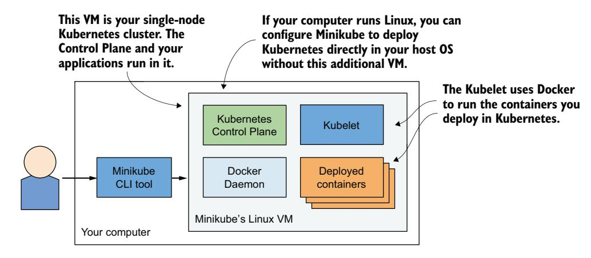
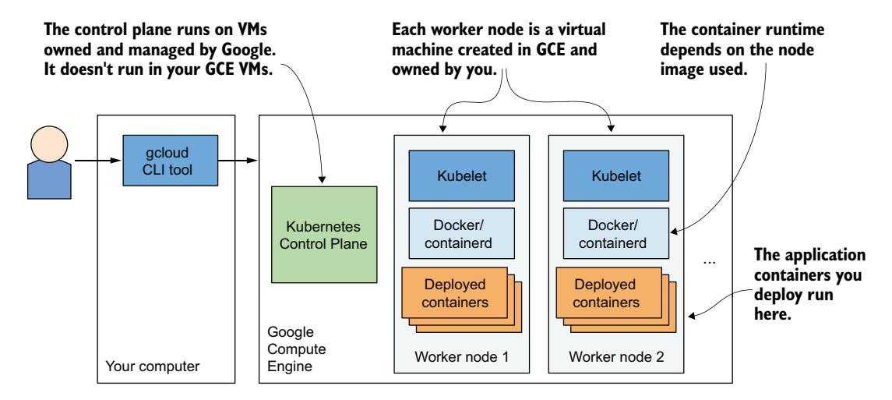
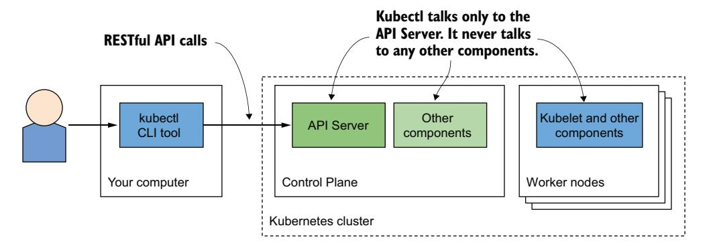
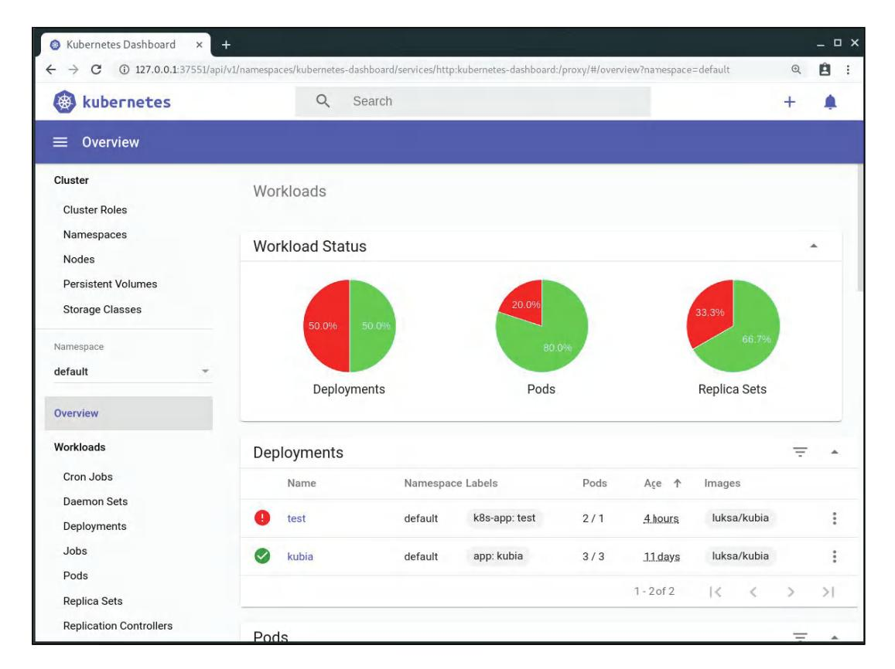
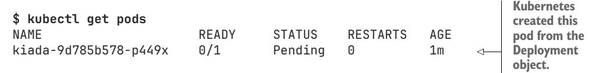
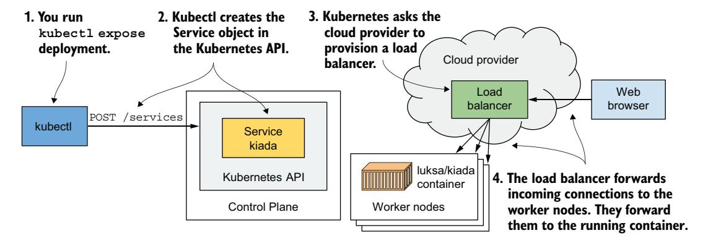
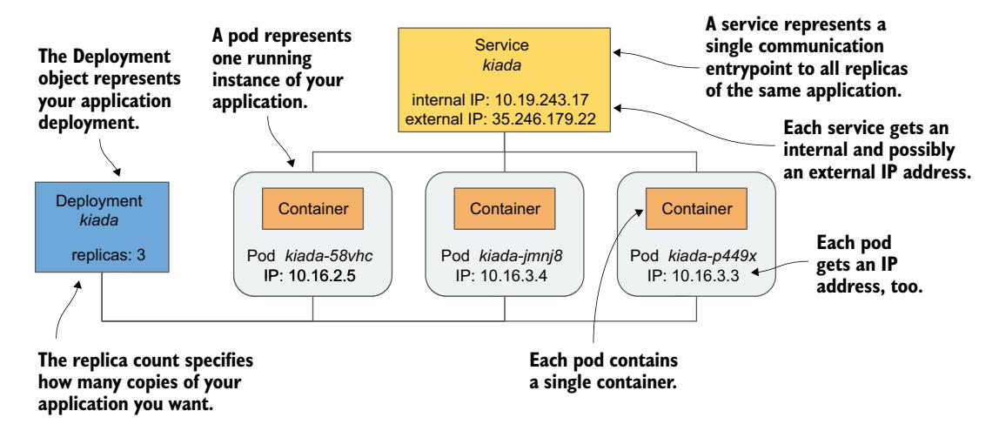

# *Deploying your first application on Kubernetes*

# *This chapter covers*

- Running a local Kubernetes cluster
- Setting up a cluster in the cloud
- Setting up and using kubectl

This chapter illustrates how to run a local single-node development Kubernetes cluster or set up a proper, managed multi-node cluster in the cloud. Once your cluster is up and running, you'll use it to deploy the container you created in the previous chapter.

NOTE The code files for this chapter are available at [https://mng.bz/26xa.](https://mng.bz/26xa)

# *3.1 Deploying a Kubernetes cluster*

Setting up a full-fledged, multi-node Kubernetes cluster isn't a simple task, especially if you're not familiar with Linux and network administration. A proper Kubernetes installation spans multiple physical or virtual machines (VMs), and it requires a proper network setup to allow all containers in the cluster to communicate with each other.

 You can install Kubernetes on your laptop computer, your organization's infrastructure, or VMs provided by cloud providers (Google Compute Engine, Amazon EC2, Microsoft Azure, etc.). Alternatively, you can let the cloud provider manage your Kubernetes cluster. Here's a short list of the largest and most popular managed Kubernetes options:

- Google Kubernetes Engine (GKE)
- Amazon Elastic Kubernetes Service (EKS)
- Microsoft Azure Kubernetes Service (AKS)
- IBM Cloud Kubernetes Service
- Oracle Cloud Infrastructure Container Engine for Kubernetes
- DigitalOcean Kubernetes (DOKS)
- Alibaba Cloud Container Service

Installing and managing Kubernetes is much more difficult than just using it, especially until you get familiar with its architecture and operation. If you are new to Kubernetes, I suggest using one of the following options described in this chapter:

- Docker Desktop
- Minikube
- Kubernetes in Docker (Kind)
- Google Kubernetes Engine

I primarily use Kind for development because of its minimal resource footprint. However, I recommend exploring different options rather than sticking to your first choice, as each has its own strengths and use cases. Additionally, visit the official Kubernetes website at [kubernetes.io](http://kubernetes.io) to find more available options for running Kubernetes locally or in the cloud.

NOTE If you have access to an existing cluster, you can skip the following sections and go directly to section 3.2 where you'll learn how to interact with the cluster.

# *3.1.1 Using the built-in Kubernetes cluster in Docker Desktop*

If you use macOS or Windows, you've most likely installed Docker Desktop to run the exercises in the previous chapter. Docker Desktop provides a single-node Kubernetes cluster that you can enable via its Settings dialog box. This may be the easiest way to start your Kubernetes journey, but keep in mind that the version of Kubernetes may not be as recent as when using the other options.

NOTE Although technically not a cluster, the single-node Kubernetes system provided by Docker Desktop should be enough to explore most of the topics discussed in this book. I'll specify when an exercise involves setting up a multinode cluster.

# ENABLING KUBERNETES IN DOCKER DESKTOP

Assuming Docker Desktop is already installed on your computer, you can start the Kubernetes cluster by clicking the whale icon in the system tray and opening the Settings dialog box. Click the Kubernetes tab and make sure the Enable Kubernetes switch is turned on. The components that make up the Kubernetes Control Plane run as Docker containers, but Docker hides them unless you select the "Show system containers" checkbox (see figure 3.1).

NOTE The initial installation of the cluster may take several minutes, as all container images for the Kubernetes components must be downloaded.


Figure 3.1 The Settings dialog box in Docker Desktop for Windows

## VISUALIZING THE SYSTEM

You learned that Kubernetes includes several components. Figure 3.2 shows where those components run in the Kubernetes cluster provided by Docker Desktop.

 Docker Desktop sets up a Linux virtual machine that hosts the Docker Daemon and all the containers. This VM also runs the Kubelet—the Kubernetes agent that manages the node. The components of the control plane run in containers, as do all the applications you deploy.

 To list the running containers, you don't need to log on to the VM because the docker CLI tool available in your host OS displays them.


Figure 3.2 Kubernetes running in Docker Desktop

#### **EXPLORING THE VIRTUAL MACHINE FROM THE INSIDE**

At the time of writing, Docker Desktop provides no command to log into the VM if you want to explore it from the inside. However, you can run a special container configured to use the VM's namespaces to run a remote shell, which is virtually identical to using SSH to access a remote server. To run the container, execute the following command:

```
$ docker run --net=host --ipc=host --uts=host --pid=host --privileged \
    --security-opt=seccomp=unconfined -it --rm -v /:/host alpine chroot /host
```

This long command requires clarification:

- The container is created from the alpine image.
- The --net, --ipc, --uts, and --pid flags make the container use the host's name-spaces instead of being sandboxed, and the --privileged and --security-opt flags give the container unrestricted access to all sys-calls.
- The -it flag runs the container interactive mode, and the --rm flags ensures the container is deleted when it terminates.
- The -v flag mounts the host's root directory to the /host directory in the container. The chroot /host command then makes this directory the root directory in the container.

After you run the command, you are in a shell that's effectively the same as if you had used SSH to enter the VM. Use this shell to explore the VM—try listing processes by executing the ps aux command or explore the network interfaces by running ip addr.

# *3.1.2 Running a local cluster using Minikube*

Another way to create a Kubernetes cluster is to use *Minikube*, a tool maintained by the Kubernetes community. The version of Kubernetes that Minikube deploys is usually more recent than the version deployed by Docker Desktop. The cluster consists of a single node and is suitable for both testing Kubernetes and developing applications locally. It normally runs Kubernetes in a Linux VM, but if your computer is Linux based, it can also deploy Kubernetes directly in your host OS via Docker.

NOTE If you configure Minikube to use a VM, you don't need Docker, but you do need a hypervisor such as VirtualBox. In the other case, you need Docker, but not the hypervisor.

## INSTALLING MINIKUBE

Minikube supports macOS, Linux, and Windows. It has a single binary executable file, which you'll find in the Minikube repository on GitHub [\(http://github.com/](http://github.com/kubernetes/minikube) [kubernetes/minikube](http://github.com/kubernetes/minikube)). It's best to follow the current installation instructions published there, but generally speaking, you install it as follows.

 On macOS you can install it using the Brew Package Manager; on Windows, there's an installer that you can download; and on Linux, you can either download a .deb or .rpm package or simply download the binary file and make it executable with the following command:

```
$ curl -LO https://storage.googleapis.com/minikube/releases/latest/minikube-
     linux-amd64 && \
 sudo install minikube-linux-amd64 /usr/local/bin/minikube
```

For details on your specific OS, please refer to the installation guide online.

#### STARTING A KUBERNETES CLUSTER WITH MINIKUBE

After Minikube is installed, start the Kubernetes cluster as shown next:

```
$ minikube start
minikube v1.11.0 on Fedora 31
Using the virtualbox driver based on user configuration
Downloading VM boot image ...
> minikube-v1.11.0.iso.sha256: 65 B / 65 B [-------------] 100.00% ? p/s 0s
> minikube-v1.11.0.iso: 174.99 MiB / 174.99 MiB [] 100.00% 50.16 MiB p/s 4s
Starting control plane node minikube in cluster minikube
Downloading Kubernetes v1.18.3 preload ...
> preloaded-images-k8s-v3-v1.18.3-docker-overlay2-amd64.tar.lz4: 526.01 MiB
Creating virtualbox VM (CPUs=2, Memory=6000MB, Disk=20000MB) ...
Preparing Kubernetes v1.18.3 on Docker 19.03.8 ...
Verifying Kubernetes components...
Enabled addons: default-storageclass, storage-provisioner
Done! kubectl is now configured to use "minikube"
```

The process may take several minutes, because the VM image and the container images of the Kubernetes components must be downloaded.

TIP If you use Linux, you can reduce the resources required by Minikube by creating the cluster without a VM. Use the command minikube start --vm-driver none.

#### CHECKING MINIKUBE'S STATUS

When the minikube start command is complete, you can check the status of the cluster by running the minikube status command:

#### \$ minikube status

host: Running kubelet: Running apiserver: Running kubeconfig: Configured

The output of the command shows that the Kubernetes host (the VM that hosts Kubernetes) is running, and so are the Kubelet (the agent responsible for managing the node) and the Kubernetes API server. The last line shows that the kubectl command-line tool (CLI) is configured to use the Kubernetes cluster that Minikube has provided. Minikube doesn't install the CLI tool, but it does create its configuration file. Installation of the CLI tool is explained in section 3.2.

#### **VISUALIZING THE SYSTEM**

The architecture of the system, which is shown in figure 3.3, is practically identical to the one in Docker Desktop. The control plane components run in containers in the VM or directly in your host OS if you used the --vm-driver none option to create the cluster. The Kubelet runs directly in the VM's or your host's operating system. It runs the applications you deploy in the cluster via the Docker Daemon.

You can run minikube ssh to log into the Minikube VM and explore it from inside. For example, you can see what's running in the VM by running ps aux to list running processes or docker ps to list running containers.



Figure 3.3 Running a single-node Kubernetes cluster using Minikube

TIP If you want to list containers using your local docker CLI instance, as in the case of Docker Desktop, run the command eval \$(minikube docker-env).

## 3.1.3 Running a local cluster using kind (Kubernetes in Docker)

An alternative to Minikube, although not as mature, is *kind* (Kubernetes-in-Docker). Instead of running Kubernetes in a virtual machine or directly on the host, kind runs each Kubernetes cluster node inside a container. Unlike Minikube, this feature allows it to create multi-node clusters by starting several containers. The actual application containers that you deploy to Kubernetes then run within these node containers. The system is shown in figure 3.4.


Figure 3.4 Running a multi-node Kubernetes cluster using kind

In the previous chapter, I mentioned that a process that runs in a container actually runs in the host OS. This means that when you run Kubernetes using kind, all Kubernetes components run in your host OS. The applications you deploy to the Kubernetes cluster also run in your host OS.

This makes kind the perfect tool for development and testing, as everything runs locally, and you can debug running processes as easily as when you run them outside of a container. I prefer to use this approach when I develop apps on Kubernetes because it allows me to do magical things like run network traffic analysis tools such as Wireshark or even my web browser inside the containers that run my applications. I use a tool called nsenter, which allows me to run these tools in the network or other namespaces of the container.

If you're new to Kubernetes, the safest bet is to start with Minikube, but if you're feeling adventurous, here's how to get started with kind.

#### INSTALLING KIND

Just like Minikube, kind consists of a single binary executable file. To install it, refer to the installation instructions at [https://kind.sigs.k8s.io/docs/user/quick-start/.](https://kind.sigs.k8s.io/docs/user/quick-start/) On macOS and Linux, the commands to install it are as follows:

```
$ curl -Lo ./kind https://kind.sigs.k8s.io/dl/v0.11.1/kind-$(uname)-amd64
$ chmod +x ./kind 
$ mv ./kind /some-dir-in-your-PATH/kind
```

Check the documentation to see what the latest version is and use it instead of v0.7.0 in the previous example. Also, replace /some-dir-in-your-PATH/ with an actual directory in your path.

NOTE Docker must be installed on your system to use kind.

#### STARTING A KUBERNETES CLUSTER WITH KIND

Starting a new cluster is as easy as it is with Minikube. Execute the following command:

#### \$ **kind create cluster**

Like Minikube, kind configures kubectl to use the cluster that it creates.

#### STARTING A MULTI-NODE CLUSTER WITH KIND

Kind runs a single-node cluster by default. If you want to run a cluster with multiple worker nodes, you must first create a configuration file. The following listing shows the contents of this file (Chapter03/kind-multi-node.yaml).

#### Listing 3.1 Config file for running a three-node cluster with the kind tool

```
kind: Cluster
apiVersion: kind.sigs.k8s.io/v1alpha4
nodes:
- role: control-plane
- role: worker
- role: worker
```

With the file in place, create the cluster using the following command:

```
$ kind create cluster --config kind-multi-node.yaml
```

#### LISTING WORKER NODES

At the time of this writing, kind doesn't provide a command to check the status of the cluster, but you can list cluster nodes using kind get nodes:

```
$ kind get nodes
kind-worker2
kind-worker
kind-control-plane
```

Since each node runs as a container, you can also see the nodes by listing the running containers using docker ps:

## \$ **docker ps** CONTAINER ID IMAGE ... NAMES 45d0f712eac0 kindest/node:v1.18.2 ... kind-worker2 d1e88e98e3ae kindest/node:v1.18.2 ... kind-worker 4b7751144ca4 kindest/node:v1.18.2 ... kind-control-plane

#### LOGGING INTO CLUSTER NODES PROVISIONED BY KIND

Unlike Minikube, where you use minikube ssh to log into the node if you want to explore the processes running inside of it, with kind, you use docker exec. For example, to enter the node called kind-control-plane, run:

#### \$ **docker exec -it kind-control-plane bash**

Instead of using Docker to run containers, nodes created by kind use the CRI-O container runtime, which I mentioned in the previous chapter as a lightweight alternative to Docker. The crictl CLI tool is used to interact with CRI-O. Its use is very similar to that of the docker tool. After logging into the node, list the containers running in it by using crictl ps instead of docker ps. Here's an example of the command and its output:

## **root@kind-control-plane:/# crictl ps** CONTAINER ID IMAGE CREATED STATE NAME c7f44d171fb72 eb516548c180f 15 min ago Running coredns ...

cce9c0261854c eb516548c180f 15 min ago Running coredns ... e6522aae66fcc d428039608992 16 min ago Running kube-proxy ... 6b2dc4bbfee0c ef97cccdfdb50 16 min ago Running kindnet-cni ... c3e66dfe44deb be321f2ded3f3 16 min ago Running kube-apiserver ...

# *3.1.4 Creating a managed cluster with Google Kubernetes Engine*

If you want to use a full-fledged multi-node Kubernetes cluster instead of a local one, you can use a managed cluster, such as the one provided by Google Kubernetes Engine (GKE). This way, you don't have to manually set up all the cluster nodes and networking, which is usually too hard for someone taking their first steps with Kubernetes. Using a managed solution such as GKE ensures that you don't end up with an incorrectly configured cluster.

# SETTING UP GOOGLE CLOUD AND INSTALLING THE GCLOUD CLIENT BINARY

Before you can set up a new Kubernetes cluster, you must set up your GKE environment. The process may change in the future, so I'll only give you a few general instructions here. For complete instructions, refer to [https://mng.bz/15xq.](https://mng.bz/15xq)

Roughly, the whole procedure includes

- <sup>1</sup> Signing up for a Google account if you don't have one already.
- <sup>2</sup> Creating a project in the Google Cloud Platform Console.

- <sup>3</sup> Enabling billing. This does require your credit card info, but Google provides a 12-month free trial with a free \$300 credit. And they don't start charging automatically after the free trial is over.
- <sup>4</sup> Downloading and installing the Google Cloud SDK, which includes the gcloud tool.
- <sup>5</sup> Creating the cluster using the gcloud command-line tool.

NOTE Certain operations (the one in step 2, for example) may take a few minutes to complete, so relax and grab a coffee in the meantime.

#### CREATING A GKE KUBERNETES CLUSTER WITH THREE NODES

Before you create your cluster, you must decide in which geographical region and zone it should be created. Refer to <https://mng.bz/Pw9R>to see the list of available locations. In the following examples, I use the europe-west3 region based in Frankfurt, Germany. It has three different zones, and I'll use the zone europe-west3-c. The default zone for all gcloud operations can be set with the following command:

#### \$ **gcloud config set compute/zone europe-west3-c**

Create the Kubernetes cluster like this:

```
$ gcloud container clusters create kiada --num-nodes 3
Creating cluster kiada in europe-west3-c... 
...
kubeconfig entry generated for kiada.
NAME LOCAT. MASTER_VER MASTER_IP MACH_TYPE ... NODES STATUS
kiada eu-w3-c 1.13.11... 5.24.21.22 n1-standard-1 ... 3 RUNNING
```

NOTE I'm creating all three worker nodes in the same zone, but you can also spread them across all zones in the region by setting the compute/zone config value to an entire region instead of a single zone. If you do so, note that --numnodes indicates the number of nodes *per zone*. If the region contains three zones and you only want three nodes, you must set --num-nodes to 1.

You should now have a running Kubernetes cluster with three worker nodes. Each node is a virtual machine provided by the Google Compute Engine (GCE) infrastructure-as-aservice platform. You can list GCE virtual machines using the following command:

# \$ **gcloud compute instances list**

```
NAME ZONE MACHINE_TYPE INTERNAL_IP EXTERNAL_IP STATUS
...-ctlk eu-west3-c n1-standard-1 10.156.0.16 34.89.238.55 RUNNING
...-gj1f eu-west3-c n1-standard-1 10.156.0.14 35.242.223.97 RUNNING
...-r01z eu-west3-c n1-standard-1 10.156.0.15 35.198.191.189 RUNNING
```

TIP Each VM incurs costs. To reduce the cost of your cluster, you can reduce the number of nodes to one, or even to zero while not using it. See the next section for details.

The system is shown figure 3.5. Note that only your worker nodes run in GCE virtual machines. The control plane runs elsewhere—you can't access the machines hosting it.



Figure 3.5 Your Kubernetes cluster in Google Kubernetes Engine

#### SCALING THE NUMBER OF NODES

Google allows you to easily increase or decrease the number of nodes in your cluster. For most exercises in this book, you can scale it down to just one node if you want to save money. You can even scale it down to zero so that your cluster doesn't incur any costs. To scale the cluster to zero, use the following command:

#### \$ gcloud container clusters resize kiada --size 0

The nice thing about scaling to zero is that none of the objects you create in your Kubernetes cluster, including the applications you deploy, are deleted. Granted, if you scale down to zero, the applications will have no nodes to run on, so they won't run. But as soon as you scale the cluster back up, they will be redeployed. And even with no worker nodes, you can still interact with the Kubernetes API (you can create, update, and delete objects).

#### INSPECTING A GKE WORKER NODE

If you're interested in what's running on your nodes, you can log into them with the following command (use one of the node names from the output of the previous command):

#### \$ gcloud compute ssh gke-kiada-default-pool-9bba9b18-4glf

While logged into the node, you can try to list all running containers with docker ps. You haven't run any applications yet, so you'll only see Kubernetes system containers. What they are isn't important right now—you'll learn about them in later chapters.

# *3.1.5 Creating a cluster using Amazon Elastic Kubernetes Service*

If you prefer to use Amazon instead of Google to deploy your Kubernetes cluster in the cloud, you can try the Amazon Elastic Kubernetes Service (EKS). Let's go over the basics. First, you have to install the eksctl command-line tool by following the instructions at [https://mng.bz/JwOZ.](https://mng.bz/JwOZ)

#### CREATING AN EKS KUBERNETES CLUSTER

Creating an EKS Kubernetes cluster using eksctl does not differ significantly from how you create a cluster in GKE. All you must do is run the following command:

\$ **eksctl create cluster --name kiada --region eu-central-1 --nodes 3 --ssh-access**

This command creates a three-node cluster in the eu-central-1 region. The regions are listed at [https://mng.bz/wZd5.](https://mng.bz/wZd5)

## INSPECTING AN EKS WORKER NODE

If you're interested in what's running on those nodes, you can use SSH to connect to them. The --ssh-access flag used in the command that creates the cluster ensures that your SSH public key is imported to the node.

 As with GKE and Minikube, once you've logged into the node, you can try to list all running containers with docker ps. You can expect to see similar containers as in the clusters we covered earlier.

# *3.1.6 Deploying a multi-node cluster from scratch*

Until you get a deeper understanding of Kubernetes, I strongly recommend that you don't try to install a multi-node cluster from scratch. If you are an experienced systems administrator, you may be able to do it without much pain and suffering, but most people may want to try one of the methods described in the previous sections first. Proper management of Kubernetes clusters is incredibly difficult. The installation alone is a task not to be underestimated.

 Once you've successfully deployed one or two clusters using kubeadm, you can then try to deploy it completely manually, by following Kelsey Hightower's *Kubernetes the Hard Way* tutorial at [github.com/kelseyhightower/Kubernetes-the-hard-way.](http://github.com/kelseyhightower/Kubernetes-the-hard-way) Though you may run into several problems, figuring out how to solve them can be a great learning experience.

# *3.2 Interacting with Kubernetes*

You've now learned about several possible methods to deploy a Kubernetes cluster. Now's the time to learn how to use the cluster. To interact with Kubernetes, you use a command-line tool called kubectl, pronounced *kube-control*, *kube-C-T-L*, or *kube-cuddle*.

 As figure 3.6 shows, the tool communicates with the Kubernetes API server, which is part of the Kubernetes Control Plane. The control plane then triggers the other components to do whatever needs to be done based on the changes you made via the API.



Figure 3.6 Interacting with a Kubernetes cluster

## 3.2.1 Setting up kubectl, the Kubernetes command-line client

Kubectl is a single executable file that you must download to your computer and place into your path. It loads its configuration from a configuration file called *kubeconfig*. To use kubectl, you must install it and prepare the kubeconfig file so kubectl knows what cluster to talk to.

#### DOWNLOADING AND INSTALLING KUBECTL

The latest stable release for Linux can be downloaded and installed with the following commands:

- \$ curl -L0 "https://dl.k8s.io/release/\$(curl -L -s https://dl.k8s.io/release/
- \$ chmod +x kubectl
- \$ sudo mv kubectl /usr/local/bin/

To install kubectl on macOS, you can either run the same command, but replace linux in the URL with darwin, or install the tool via Homebrew by running brew install kubectl.

On Windows, download kubectl.exe from https://mng.bz/qR8x. To download the latest version, first go to https://mng.bz/7Q7Q to see what the latest stable version is and then replace the version number in the first URL with this version. To check if you've installed it correctly, run kubectl --help. Note that kubectl may or may not yet be configured to talk to your Kubernetes cluster, which means most commands may not work yet.

TIP You can always append --help to any kubectl command to get more information.

#### SETTING UP A SHORT ALIAS FOR KUBECTL

You'll use kubectl often. Having to type the full command every time is needlessly time-consuming, but you can speed things up by setting up an alias and tab completion for it.

 Most users of Kubernetes use k as the alias for kubectl. If you haven't used aliases yet, here's how to define it in Linux and macOS. Add the following line to your ~/.bashrc or equivalent file:

#### **alias k=kubectl**

In Windows, if you use the Command Prompt, define the alias by executing doskey k=kubectl \$\*. If you use PowerShell, execute set-alias -name k -value kubectl.

NOTE You may not need an alias if you used gcloud to set up the cluster. It installs the k binary in addition to kubectl.

#### CONFIGURING TAB COMPLETION FOR KUBECTL

Even with a short alias like k, you'll still have to type a lot. Fortunately, the kubectl command can also output shell completion code for both the bash and the zsh shell. It enables tab completion of not only command names but also the object names. For example, later you'll learn how to view details of a particular cluster node by executing the following command:

#### \$ **kubectl describe node gke-kiada-default-pool-9bba9b18-4glf**

That's a lot of typing that you'll repeat all the time. With tab completion, things are much easier. You just press TAB after typing the first few characters of each token:

#### \$ **kubectl desc<TAB> no<TAB> gke-ku<TAB>**

To enable tab completion in bash, you must first install a package called bash-completion and then run the following command (you can also add it to ~/.bashrc or equivalent):

#### \$ **source <(kubectl completion bash)**

NOTE This command enables completion in bash. You can also run this command with a different shell. At the time of writing, the available options are bash, zsh, fish, and powershell.

However, this will only complete your commands when you use the full kubectl command name. It won't work when you use the k alias. To enable completion for the alias, you must run the following command:

```
$ complete -o default -F __start_kubectl k
```

# *3.2.2 Configuring kubectl to use a specific Kubernetes cluster*

The kubeconfig configuration file is located at ~/.kube/config. If you deployed your cluster using Docker Desktop, Minikube, or GKE, the file was created for you. If you've been given access to an existing cluster, you should have received the file. Other tools, such as kind, may have written the file to a different location. Instead of moving the file to the default location, you can also point kubectl to it by setting the KUBECONFIG environment variable as follows:

#### \$ **export KUBECONFIG=/path/to/custom/kubeconfig**

# *3.2.3 Using kubectl*

Assuming you've installed and configured kubectl, you can now use it to talk to your cluster.

#### VERIFYING THAT THE CLUSTER IS UP AND THAT KUBECTL CAN TALK TO IT

To verify that your cluster is working, use the kubectl cluster-info command:

#### \$ **kubectl cluster-info**

```
Kubernetes master is running at https://192.168.99.101:8443
KubeDNS is running at https://192.168.99.101:8443/api/v1/namespaces/...
```

This indicates that the API server is active and responding to requests. The output lists the URLs of the various Kubernetes cluster services running in your cluster. The previous example shows that besides the API server, the KubeDNS Service, which provides domain-name services within the cluster, is another service that runs in the cluster.

#### LISTING CLUSTER NODES

Now use the kubectl get nodes command to list all nodes in your cluster. Here's the output generated when you run the command in a cluster provisioned by kind:

#### \$ **kubectl get nodes**

| NAME          |       | STATUS ROLES      | AGE | VERSION |
|---------------|-------|-------------------|-----|---------|
| control-plane | Ready | <none> 12m</none> |     | v1.18.2 |
| kind-worker   | Ready | <none> 12m</none> |     | v1.18.2 |
| kind-worker2  | Ready | <none> 12m</none> |     | v1.18.2 |

Everything in Kubernetes is represented by an object and can be retrieved and manipulated via the RESTful API. The kubectl get command retrieves a list of objects of the specified type from the API. You'll use this command all the time, but it only displays summary information about the listed objects.

#### RETRIEVING ADDITIONAL DETAILS OF AN OBJECT

To see more detailed information about an object, use the kubectl describe command, which shows much more:

#### \$ **kubectl describe node gke-kiada-85f6-node-0rrx**

I omit the actual output of the describe command because it's quite wide and would be completely unreadable here in the book. If you run the command yourself, you'll see that it displays the status of the node, information about its CPU and memory usage, system information, containers running on the node, and much more.

 If you run the kubectl describe command without specifying the resource name, information of all nodes will be printed.

TIP Executing the describe command without specifying the object name is useful when only one object of a certain type exists. You don't have to type or copy/paste the object name.

You'll learn more about the numerous other kubectl commands throughout the book.

# *3.2.4 Interacting with Kubernetes through web dashboards*

If you prefer using graphical web user interfaces, you'll be happy to hear that Kubernetes also comes with a nice web dashboard. Note, however, that the functionality of the dashboard may lag significantly behind kubectl, which is the primary tool for interacting with Kubernetes.

 Nevertheless, the dashboard shows different resources in context and can be a good start to get a feel for what the main resource types in Kubernetes are and how they relate to each other. The dashboard also offers the possibility to modify the deployed objects and displays the equivalent kubectl command for each action—a feature most beginners will appreciate.

 Figure 3.7 shows the dashboard with two workloads deployed in the cluster. Although you won't use the dashboard in this book, you can always open it to quickly



Figure 3.7 Screenshot of the Kubernetes web-based dashboard

see a graphical view of the objects deployed in your cluster after you create them via kubectl.

#### ACCESSING THE DASHBOARD IN DOCKER DESKTOP

Unfortunately, Docker Desktop does not install the Kubernetes dashboard by default. Accessing it is also not trivial, but here's how you can do it. First, you need to install it using the following command:

```
$ kubectl apply -f https://raw.githubusercontent.com/kubernetes/dashboard/
     v2.0.0-rc5/aio/deploy/recommended.yaml
```

Refer to [github.com/kubernetes/dashboard](http://github.com/kubernetes/dashboard) to find the latest version number. After installing the dashboard, the next command you must run is

#### \$ **kube+ctl proxy**

This command runs a local proxy to the API server, allowing you to access the services through it. Let the proxy process run and use the browser to open the dashboard at the following URL:

```
http://localhost:8001/api/v1/namespaces/kubernetes-dashboard/services/
     https:kubernetes-dashboard:/proxy/
```

You'll be presented with an authentication page. You must then run the following command to retrieve an authentication token:

```
PS C:\> kubectl -n kubernetes-dashboard describe secret $(kubectl -n kubernetes-
dashboard get secret | sls admin-user | ForEach-Object { $_ -Split '\s+' } | 
Select -First 1)
```

NOTE This command must be run in Windows PowerShell.

Find the token listed under kubernetes-dashboard-token-xyz and paste it into the token field on the authentication page shown in your browser. After you do this, you should be able to use the dashboard. When you're finished using it, terminate the kubectl proxy process using Ctrl-C.

# ACCESSING THE DASHBOARD WHEN USING MINIKUBE

If you're using Minikube, accessing the dashboard is much easier. Run the following command and the dashboard will open in your default browser:

#### \$ **minikube dashboard**

#### ACCESSING THE DASHBOARD WHEN RUNNING KUBERNETES ELSEWHERE

The Google Kubernetes Engine no longer provides access to the open source Kubernetes Dashboard, but it offers an alternative web-based console. The same applies to other cloud providers. For information on how to access the dashboard, please refer to the documentation of the respective provider.

 If your cluster runs on your own infrastructure, you can deploy the dashboard by following the guide at <https://mng.bz/mZK8>.

# *3.3 Running your first application on Kubernetes*

Now is the time to finally deploy something to your cluster. Usually, to deploy an application, you'd prepare a JSON or YAML file describing all the components that your application consists of and apply that file to your cluster. This would be the declarative approach.

 Since this may be your first time deploying an application to Kubernetes, let's choose an easier way to do this. We'll use simple, one-line imperative commands to deploy your application.

# *3.3.1 Deploying your application*

The imperative way to deploy an application is to use the kubectl create deployment command. As the command itself suggests, it creates a *Deployment* object, which represents an application deployed in the cluster. By using the imperative command, you avoid the need to know the structure of Deployment objects as when you write YAML or JSON manifests.

## CREATING A DEPLOYMENT

In the previous chapter, you created a Node.js application called Kiada that you packaged into a container image and pushed to Docker Hub to make it easily distributable to any computer.

NOTE If you skipped chapter 2 because you are already familiar with Docker and containers, you might want to go back and read section 2.2.1 that describes the application you'll deploy here and in the rest of this book.

Let's deploy the Kiada application to your Kubernetes cluster. Here's the command that does this:

\$ **kubectl create deployment kiada --image=luksa/kiada:0.1** deployment.apps/kiada created

In the command, you specify the following three things:

- You want to create a deployment object.
- You want the object to be called kiada.
- You want the Deployment to use the container image luksa/kiada:0.1.

By default, the image is pulled from Docker Hub, but you can also specify the image registry in the image name (for example, quay.io/luksa/kiada:0.1).

NOTE Make sure that the image is stored in a public registry and can be pulled without access authorization. You'll learn how to provide credentials for pulling private images in chapter 8.

The Deployment object is now stored in the Kubernetes API. The existence of this object tells Kubernetes that the luksa/kiada:0.1 container must run in your cluster. You've stated your *desired* state. Kubernetes must now ensure that the *actual* state reflects your wishes.

#### LISTING DEPLOYMENTS

The interaction with Kubernetes consists mainly of the creation and manipulation of objects via its API. Kubernetes stores these objects and then performs operations to bring them to life. For example, when you create a Deployment object, Kubernetes runs an application. Kubernetes then keeps you informed about the current state of the application by writing the status to the same Deployment object. You can view the status by reading back the object. One way to do this is to list all Deployment objects as follows:

```
$ kubectl get deployments
NAME READY UP-TO-DATE AVAILABLE AGE
kiada 0/1 1 0 6s
```

The kubectl get deployments command lists all Deployment objects that currently exist in the cluster. You have only one Deployment in your cluster. It runs one instance of your application, as shown in the UP-TO-DATE column, but the AVAILABLE column indicates that the application is not yet available. That's because the container isn't ready, as shown in the READY column. You can see that zero of a total of one container are ready.

 You may wonder if you can ask Kubernetes to list all the running containers by running kubectl get containers. Let's try this:

```
$ kubectl get containers
error: the server doesn't have a resource type "containers"
```

The command fails because Kubernetes doesn't have a "Container" object type. This may seem odd, since Kubernetes is all about running containers, but there's a twist. A container is not the smallest unit of Deployment in Kubernetes. So, what is the smallest unit?

## INTRODUCING PODS

In Kubernetes, instead of deploying individual containers, you deploy groups of colocated containers, so-called *pods*. You know, as in a *pod of whales* or a *pea pod*. A pod is a group of one or more closely related containers (not unlike peas in a pod) that run together on the same worker node and need to share certain Linux namespaces so that they can interact more closely than with other pods.

 In the previous chapter, I showed an example where two processes use the same namespaces. By sharing the network namespace, both processes use the same network interfaces and share the same IP address and port space. By sharing the UTS namespace, both see the same system hostname. This is exactly what happens when you run containers in the same pod. They use the same network and UTS namespaces, as well as others, depending on the pod's spec (figure 3.8).


Figure 3.8 The relationship between containers, pods, and worker nodes

As illustrated in the figure, each pod can be seen as a separate logical computer that contains one application. The application can consist of a single process running in a container, or a main application process and additional supporting processes, each running in a separate container. Pods are distributed across all the worker nodes of the cluster.

 Each pod has its own IP, hostname, processes, network interfaces, and other resources. Containers that are part of the same pod think that they're the only ones running on the computer. They don't see the processes of any other pod, even if located on the same node.

#### LISTING PODS

Since containers aren't a top-level Kubernetes object, you can't list them, but you can list pods. As the following output of the kubectl get pods command shows, by creating the Deployment object, you've deployed one pod:



This is the pod that houses the container running your application. To be precise, since the status is still Pending, the application, or rather the container, isn't running yet. This is also expressed in the READY column, which indicates that the pod has a single container that's not ready.

 The reason the pod is pending is because the worker node to which the pod has been assigned must first download the container image before it can run it. When the download is complete, the pod's container is created, and the pod enters the Running state.

 If Kubernetes can't pull the image from the registry, the kubectl get pods command will indicate this in the STATUS column. If you're using your own image, ensure it's marked as public on Docker Hub. Try pulling the image manually with the docker pull command on another computer.

 If another problem is causing your pod not to run, or if you simply want to see more information about the pod, you can also use the kubectl describe pod command, like you did earlier to see the details of a worker node. If there are any problems with the pod, they should be displayed by this command. Look at the events shown at the bottom of its output. For a running pod, they should be close to the following:

| Type | Reason               | Age | From                  | Message                                                                   |
|------|----------------------|-----|-----------------------|---------------------------------------------------------------------------|
|      |                      |     |                       |                                                                           |
|      | Normal Scheduled 25s |     | default-scheduler     | Successfully assigned<br>default/kiada-9d785b578-p449x<br>to kind-worker2 |
|      | Normal Pulling       | 23s | kubelet, kind-worker2 | Pulling image "luksa/kiada:0.1"                                           |
|      | Normal Pulled        | 21s | kubelet, kind-worker2 | Successfully pulled image                                                 |
|      | Normal Created       | 21s | kubelet, kind-worker2 | Created container kiada                                                   |
|      | Normal Started       | 21s | kubelet, kind-worker2 | Started container kiada                                                   |

#### UNDERSTANDING WHAT HAPPENS BEHIND THE SCENES

To visualize what happened when you created the Deployment, see figure 3.9.


Figure 3.9 How creating a Deployment object results in a running application container

When you ran the kubectl create command, it created a new Deployment object in the cluster by sending an HTTP request to the Kubernetes API server. Kubernetes then created a new Pod object, which was then assigned or *scheduled* to one of the worker nodes. The Kubernetes agent on the worker node (the Kubelet) became aware of the newly created Pod object, saw that it was scheduled to its node, and instructed Docker to pull the specified image from the registry, create a container from the image, and execute it.

DEFINITION The term *scheduling* refers to the assignment of the pod to a node. The pod runs immediately, not at some point in the future. Just like how the CPU scheduler in an operating system selects what CPU to run a process on, the scheduler in Kubernetes decides what worker node should execute each container. Unlike an OS process, once a pod is assigned to a node, it runs only on that node. Even if it fails, this instance of the pod is never moved to other nodes, as is the case with CPU processes, but a new pod instance may be created to replace it.

Depending on what you use to run your Kubernetes cluster, the number of worker nodes in your cluster may vary. Figure 3.9 shows only the worker node that the pod was scheduled to. In a multi-node cluster, none of the other worker nodes are involved in the process.

# *3.3.2 Exposing your application to the world*

Your application is now running, so the next question to answer is how to access it. I mentioned that each pod gets its own IP address, but this address is internal to the cluster and not accessible from the outside. To make the pod accessible externally, you'll *expose* it by creating a Service object.

 There are several types of Service objects. You decide what type you need. Some expose pods only within the cluster, while others expose them externally. A service with the type LoadBalancer provisions an external load balancer, which makes the service accessible via a public IP. This is the type of service we'll create now.

#### CREATING A SERVICE

The easiest way to create the service is to use the following imperative command:

\$ **kubectl expose deployment kiada --type=LoadBalancer --port 8080** service/kiada exposed

The create deployment command that you ran previously creates a object, whereas the expose deployment command creates a Service object. This is what running the previous command tells Kubernetes:

- You want to expose all pods that belong to the kiada Deployment as a new Service.
- You want the pods to be accessible from outside the cluster via a load balancer.
- The application listens on port 8080, so you want to access it via that port.

You didn't specify a name for the Service object, so it inherits the name of the Deployment.

#### LISTING SERVICES

Services are API objects, just like Pods, Deployments, Nodes, and virtually everything else in Kubernetes, so you can list them by executing kubectl get services:

#### \$ **kubectl get svc**

| NAME       | TYPE      | CLUSTER-IP                | EXTERNAL-IP         | PORT(S)           | AGE |
|------------|-----------|---------------------------|---------------------|-------------------|-----|
| kubernetes | ClusterIP | 10.19.240.1               | <none></none>       | 443/TCP           | 34m |
| kiada      |           | LoadBalancer 10.19.243.17 | <pending></pending> | 8080:30838/TCP 4s |     |

NOTE Notice the use of the abbreviation svc instead of services. Most resource types have a short name that you can use instead of the full object type (for example, po is short for pods, no for nodes, and deploy for deployments).

The list shows two services with their types, IPs and the ports they expose. Ignore the kubernetes Service for now and take a close look at the kiada Service. It doesn't yet have an external IP address. Whether it gets one depends on how you've deployed the cluster.

# Listing the available object types with kubectl api-resources

You've used the kubectl get command to list various things in your cluster: Nodes, Deployments, Pods, and now Services. These are all Kubernetes object types. You can display a list of all supported types by running kubectl api-resources. The list also shows the short name for each type and some other information you need to define objects in JSON/YAML files, which you'll learn in the following chapters.

#### UNDERSTANDING LOADBALANCER SERVICES

While Kubernetes allows you to create so-called LoadBalancer Services, it doesn't provide the load balancer itself. If your cluster is deployed in the cloud, Kubernetes can ask the cloud infrastructure to provision a load balancer and configure it to forward traffic into your cluster. The infrastructure tells Kubernetes the IP address of the load balancer, and this becomes the external address of your service. The process of creating the Service object, provisioning the load balancer, and how it forwards connections into the cluster is shown in figure 3.10.

 Provisioning of the load balancer takes some time, so let's wait a few more seconds and check again whether the IP address is already assigned. This time, instead of listing all services, you'll display only the kiada Service as follows:

#### \$ **kubectl get svc kiada**

| NAME  | TYPE | CLUSTER-IP | EXTERNAL-IP | PORT(S)                                                    | AGE |
|-------|------|------------|-------------|------------------------------------------------------------|-----|
| kiada |      |            |             | LoadBalancer 10.19.243.17 35.246.179.22 8080:30838/TCP 82s |     |

The external IP is now displayed. This means that the load balancer is ready to forward requests to your application for clients around the world.



Figure 3.10 What happens when you create a Service object of type LoadBalancer

**NOTE** If you deployed your cluster with Docker Desktop, the load balancer's IP address is shown as localhost, referring to your Windows or macOS machine, not the VM where Kubernetes and the application runs. If you use Minikube to create the cluster, no load balancer is created, but you can access the service in another way. More on this later.

#### ACCESSING YOUR APPLICATION THROUGH THE LOAD BALANCER

You can now send requests to your application through the external IP and port of the service:

```
$ curl 35.246.179.22:8080
Kiada version 0.1. Request processed by "kiada-9d785b578-p449x". Client IP:
```

**NOTE** If you use Docker Desktop, the service is available at localhost:8080 from within your host operating system. Use curl or your browser to access it.

Congratulations! If you use Google Kubernetes Engine, you've successfully published your application to users across the globe. Anyone who knows its IP and port can now access it. If you don't count the steps needed to deploy the cluster itself, only two simple commands were needed to deploy your application:

- kubectl create deployment and
- kubectl expose deployment.

#### **ACCESSING YOUR APPLICATION THROUGH A NODE PORT**

Not all Kubernetes clusters have mechanisms to provide a load balancer. When you create a service of LoadBalancer type, the service itself works, but there is no load balancer through which you can access the service from outside the cluster. When this is the case, kubectl shows the external IP as <pending>, and you must use a different method to access the service. You'll need to do this if you use Minikube, Docker Desktop, or the kind tool to run your cluster. Here's how.

When you create a LoadBalancer-type Service, it's also assigned a so-called node port. That's a network port on the cluster nodes that forwards traffic to the service. Figure 3.11 shows how external clients use this node port to access the application.


Figure 3.11 Connection routing through a service's node port

To access the application, you therefore need two pieces of information: the node port number and the IP of one of the cluster nodes.

When you created the service, Kubernetes found an unused node port and assigned it to your service. You can see the port number in the PORT(S) column when you run the kubectl get services command:

# \$ kubectl get svc kiada

| NAME  | TYPE         | CLUSTER-IP   | EXTERNAL-IP         | PORT(S)        | AGE |
|-------|--------------|--------------|---------------------|----------------|-----|
| kiada | LoadBalancer | 10.19.243.17 | <pending></pending> | 8080:30838/TCP | 82s |

In the example above, 8080 is the internal service port, and 30838 is the node port. Instead of letting Kubernetes choose the node port number, you can also specify it yourself. You'll learn how to do that in chapter 11.

In addition to the node port number, you also need to get the IP address of one of your cluster nodes. You can do this by listing the nodes with the kubectl get nodes -o wide command as follows:

| \$ kubectl get nodes | -o wide |                      |     |         |             |  |
|----------------------|---------|----------------------|-----|---------|-------------|--|
| NAME                 | STATUS  | ROLES                | AGE | VERSION | INTERNAL-IP |  |
| kind-control-plane   | Ready   | control-plane,master | 18h | v1.21.1 | 172.18.0.2  |  |
| kind-worker          | Ready   | <none></none>        | 18h | v1.21.1 | 172.18.0.3  |  |
| kind-worker2         | Ready   | <none></none>        | 18h | v1.21.1 | 172.18.0.4  |  |

Here, the cluster consists of three nodes. Their IPs are shown in the INTERNAL-IP column. You can choose any of the three IPs and combine it with the node port to access the service. For example, you can take the first node's IP address, which is 172.18.0.2, and combine it with the node port 30838 that you looked up earlier. You can use this IP:port combination to access the application through curl or your web browser:

#### \$ curl 172.18.0.2:30838

Kiada version 0.1. Request processed by "kiada-9d785b578-p449x". Client IP: ::ffff:1.2.3.4

# Accessing the service

Firewall rules may be preventing access to the node port. If your cluster nodes are running on your local machine, this is usually not the case, but if your cluster is running in the cloud, it likely is. However, if your cluster is running in the cloud, I recommend you access the service through the load balancer's IP instead.

If you use Minikube, you can access the service by running the command minikube service kiada. This command navigates your browser to the service URL. If you add the --url option, the command prints the URL without opening the browser.

If you use Docker Desktop, the cluster node runs in a virtual machine. You may not be able to reach it through its IP from your host OS, but you can access the service through the node port from within the VM by logging into it using a special container as described in section 3.1.1.

# *3.3.3 Horizontally scaling the application*

You now have a running application that is represented by a Deployment object and exposed to the world by a Service object. Now let's create some additional magic.

 One of the major benefits of running applications in containers is the ease with which you can scale your application deployments. You're currently running a single instance of your application. Imagine you suddenly see many more users using your application. The single instance can no longer handle the load. You need to run additional instances to distribute the load and provide service to your users. This is known as *scaling out*. With Kubernetes, it's trivial to do.

#### INCREASING THE NUMBER OF RUNNING APPLICATION INSTANCES

To deploy your application, you've created a Deployment object. By default, it runs a single instance of your application. To run additional instances, you only need to scale the Deployment object with the following command:

\$ **kubectl scale deployment kiada --replicas=3** deployment.apps/kiada scaled

You've now told Kubernetes that you want to run three exact copies or *replicas* of your pod. Note that you haven't instructed Kubernetes what to do. You haven't told it to add two more pods. You just set the new desired number of replicas and let Kubernetes determine what action it must take to reach the new desired state.

 This is one of the most fundamental principles in Kubernetes. Instead of telling it what to do, you simply set a new desired state of the system and let Kubernetes achieve it. To do this, it examines the current state, compares it with the desired state, identifies the differences, and determines what it must do to reconcile them.

#### SEEING THE RESULTS OF THE SCALE-OUT

Although it's true that the kubectl scale deployment command seems imperative, since it apparently tells Kubernetes to scale your application, what the command does is modify the specified Deployment object. As you'll see later, you could have simply edited the object instead of giving the imperative command. Let's view the Deployment object again to see how the scale command has affected it:

#### \$ **kubectl get deploy** NAME READY UP-TO-DATE AVAILABLE AGE kiada 3/3 3 3 18m

Three instances are now up to date and available, and three of three containers are ready. This isn't clear from the command output, but the three containers are not part of the same pod instance. There are three pods with one container each, and it can be confirmed by listing pods:

## \$ **kubectl get pods** NAME READY STATUS RESTARTS AGE kiada-9d785b578-58vhc 1/1 Running 0 17s kiada-9d785b578-jmnj8 1/1 Running 0 17s kiada-9d785b578-p449x 1/1 Running 0 18m

As you can see, three pods now exist. As indicated in the READY column, each has a single container, and all the containers are ready. All the pods are Running.

## DISPLAYING THE PODS' HOST NODE WHEN LISTING PODS

If you use a single-node cluster, all your pods run on the same node. But in a multinode cluster, the three pods should be distributed throughout the cluster. To see which nodes the pods were scheduled to, you can use the -o wide option to display a more detailed pod list:

| \$ kubectl get pods -o wide                   |  |    |      | Pod scheduled      |
|-----------------------------------------------|--|----|------|--------------------|
| NAME                                          |  | IP | NODE | to one node        |
| kiada-9d785b578-58vhc 10.244.1.5 kind-worker  |  |    |      |                    |
| kiada-9d785b578-jmnj8 10.244.2.4 kind-worker2 |  |    |      | Two pods scheduled |
| kiada-9d785b578-p449x 10.244.2.3 kind-worker2 |  |    |      | to another node    |

NOTE You can also use the -o wide output option to see additional information when listing other object types.

The wide output shows that one pod was scheduled to one node, whereas the other two were both scheduled to a different node. The scheduler usually distributes pods evenly, but it depends on how it's configured.

# Does the host node matter?

Regardless of the node they run on, all instances of your application have an identical OS environment, because they run in containers created from the same container image. You may remember from the previous chapter that the only thing that might be different is the OS kernel, but this only happens when different nodes use different kernel versions or load different kernel modules.

## *(continued)*

In addition, each pod gets its own IP and can communicate in the same way with any other pod, regardless of whether that pod resides on the same worker node, elsewhere in the same rack, or in a different data center entirely.

So far, we have not set any resource requirements for the pods, but if we had, each pod would have been allocated the requested amount of compute resources. It shouldn't matter to the pod which node provides these resources, as long as the pod's requirements are met.

Therefore, you shouldn't care where a pod is scheduled. It's also why the default kubectl get pods command doesn't display information about the worker nodes for the listed pods. In the world of Kubernetes, it's just not that important.

As you can see, scaling an application is incredibly easy. Once your application is in production and there is a need to scale it, you can add additional instances with a single command without having to manually install, configure, and run additional copies.

NOTE The app itself must support horizontal scaling. Kubernetes doesn't magically make your app scalable; it merely makes it trivial to replicate it.

#### OBSERVING REQUESTS HITTING ALL THREE PODS WHEN USING THE SERVICE

Now that multiple instances of your app are running, let's see what happens when you hit the service URL again. Will the response come from the same instance every time? Here's the answer:

```
$ curl 35.246.179.22:8080
Kiada version 0.1. Request processed by "kiada-9d785b578-58vhc". Client IP: 
     ::ffff:1.2.3.4 
$ curl 35.246.179.22:8080
Kiada version 0.1. Request processed by "kiada-9d785b578-p449x". Client IP: 
     ::ffff:1.2.3.4 
$ curl 35.246.179.22:8080
Kiada version 0.1. Request processed by "kiada-9d785b578-jmnj8". Client IP: 
     ::ffff:1.2.3.4 
$ curl 35.246.179.22:8080
Kiada version 0.1. Request processed by "kiada-9d785b578-p449x". Client IP: 
     ::ffff:1.2.3.4 
                                                            Request reaches the first pod.
                                                            Request reaches the third pod.
                                                            Request reaches the second pod.
                                                         Request reaches the third pod again.
```

If you look closely at the responses, you'll see that they correspond to the names of the pods. Each request arrives at a different pod in random order. This is what Services in Kubernetes do when more than one pod instance is behind. They act as load balancers in front of the pods. Figure 3.12 illustrates the system.

 As the figure shows, you shouldn't confuse this load-balancing mechanism, which is provided by the Kubernetes Service itself, with the additional load balancer provided by the infrastructure when running in GKE or another cluster running in the cloud. Even if you use Minikube and have no external load balancer, your requests are


Figure 3.12 Load balancing across multiple pods backing the same service

still distributed across the three pods by the service itself. If you use GKE, there are actually *two* load balancers in play. The figure shows that the load balancer provided by the infrastructure distributes requests across the nodes, and the service then distributes requests across the pods.

 I know this may sound very confusing right now, but it should all become clear in chapter 11.

# *3.3.4 Understanding the deployed application*

To conclude this chapter, let's review the parts of your system. There are two ways to look at your system: the logical and the physical view. You've just seen the physical view in figure 3.12. There are three running containers that are deployed on three worker nodes (a single node when using Minikube). If you run Kubernetes in the cloud, the cloud infrastructure has also created a load balancer for you. Docker Desktop also creates a type of local load balancer. Minikube doesn't create a load balancer, but you can access your service directly through the node port.

 While there are differences in the physical view of the system in different clusters, the logical view is always the same, whether you use a small development cluster or a large production cluster with thousands of nodes. If you're not the one who manages the cluster, you don't even need to worry about the physical view. If everything works as expected, the logical view is all you need to worry about. Let's take a closer look at this view.

#### UNDERSTANDING THE API OBJECTS REPRESENTING YOUR APPLICATION

The logical view consists of the objects you've created in the Kubernetes API—either directly or indirectly. Figure 3.13 shows how the objects relate to each other.



Figure 3.13 Your deployed application consists of a Deployment, several pods, and a service.

# The objects are

- The Deployment object you created
- The Pod objects that were created automatically based on the Deployment
- The Service object created manually

There are other objects between the three just mentioned, but you don't need to know them yet. You'll learn about them in the following chapters.

 Remember when I explained in chapter 1 that Kubernetes abstracts the infrastructure? The logical view of your application is a great example of this. There are no nodes, no complex network topology, no physical load balancers but just a simple view that contains only your applications and the supporting objects. Let's look at how these objects fit together and what role they play in your small setup.

 The Deployment object represents an application deployment. It specifies which container image contains your application and how many replicas of the application Kubernetes should run. Each replica is represented by a Pod object. The Service object represents a single communication entry point to these replicas.

## UNDERSTANDING THE PODS

The essential and most important part of your system are the pods. Each pod definition contains one or more containers that make up the pod. When Kubernetes brings a pod to life, it runs all the containers specified in its definition. As long as a Pod object exists, Kubernetes will do its best to ensure that its containers keep running. It only shuts them down when the Pod object is deleted.

#### UNDERSTANDING THE ROLE OF THE DEPLOYMENT

When you first created the Deployment object, only a single Pod object was created. But when you increased the desired number of replicas on the Deployment, Kubernetes created additional replicas. Kubernetes ensures that the actual number of pods always matches the desired number.

 If one or more pods disappear or their status is unknown, Kubernetes replaces them to bring the actual number of pods back to the desired number of replicas. A pod disappears when someone or something deletes it, whereas a pod's status is unknown when the node it is running on no longer reports its status due to a network or node failure.

 Strictly speaking, a Deployment object results in nothing more than the creation of a certain number of Pod objects. You may wonder if you can create pods directly instead of having the Deployment create them for you. You can certainly do this, but if you wanted to run multiple replicas, you'd have to manually create each pod individually and make sure you give each a unique name. You'd then also have to keep a constant eye on your pods to replace them if they suddenly disappear or the node on which they run fails. And that's exactly why you almost never create pods directly but use a Deployment instead.

## UNDERSTANDING WHY YOU NEED A SERVICE

The third component of your system is the Service object. By creating it, you tell Kubernetes that you need a single communication entry point to your pods. The service gives you a single IP address to talk to your pods, regardless of how many replicas are currently deployed. If the service is backed by multiple pods, it acts as a load balancer. But even if there is only one pod, you still want to expose it through a service. To make sense of this, it's essential to understand a key aspect of how pods work.

 Pods are ephemeral. A pod may disappear at any time. This can happen when its host node fails, when someone inadvertently deletes the pod, or when the pod is evicted from an otherwise healthy node to make room for other, more important pods. As explained in the previous section, when pods are created through a Deployment, a missing pod is immediately replaced with a new one. This new pod is not the same as the one it replaces. It's a completely new pod, with a new IP address.

 If you weren't using a service and had configured your clients to connect directly to the IP of the original pod, you would now need to reconfigure all these clients to connect to the IP of the new pod. This is not necessary when using a service. Unlike pods, services aren't ephemeral. When you create a service, it is assigned a static IP address that never changes during the service lifetime.

 Instead of connecting directly to the pod, clients should connect to the IP of the service. This step ensures that their connections are always routed to a healthy pod, even if the set of pods behind the service is constantly changing. It also ensures that the load is distributed evenly across all pods should you decide to scale the Deployment horizontally.

# *Summary*

- Virtually all cloud providers offer a managed Kubernetes option. They take on the burden of maintaining your Kubernetes cluster, while you only use its API to deploy your applications.
- You can also install Kubernetes in the cloud yourself, but this may not be the best idea until you master all aspects of managing Kubernetes.
- You can install Kubernetes locally, even on your laptop, using tools such as Docker Desktop or Minikube, which run Kubernetes in a Linux VM, or kind, which runs the master and worker nodes as Docker containers and the application containers inside those containers.
- Kubectl, the command-line tool, is the usual way you interact with Kubernetes. A web-based dashboard also exists, but it is not as stable and up to date as the CLI tool.
- To work faster with kubectl, it is useful to create a short alias for it and enable shell completion.
- An application can be deployed using kubectl create deployment. It can then be exposed to clients by running kubectl expose deployment. Horizontally scaling the application is trivial: kubectl scale deployment instructs Kubernetes to add new replicas or removes existing ones to reach the number of replicas you specify.
- The basic unit of Deployment is not a container, but a pod, which can contain one or more related containers.
- Deployments, Services, Pods, and Nodes are Kubernetes objects/resources. You can list them with kubectl get and inspect them with kubectl describe.
- The Deployment object deploys the desired number of pods, while the Service object makes them accessible under a single, stable IP address.
- Each service provides internal load balancing in the cluster, but if you set the type of service to LoadBalancer, Kubernetes will ask the cloud infrastructure it runs in for an additional load balancer to make your application available at a publicly accessible address.