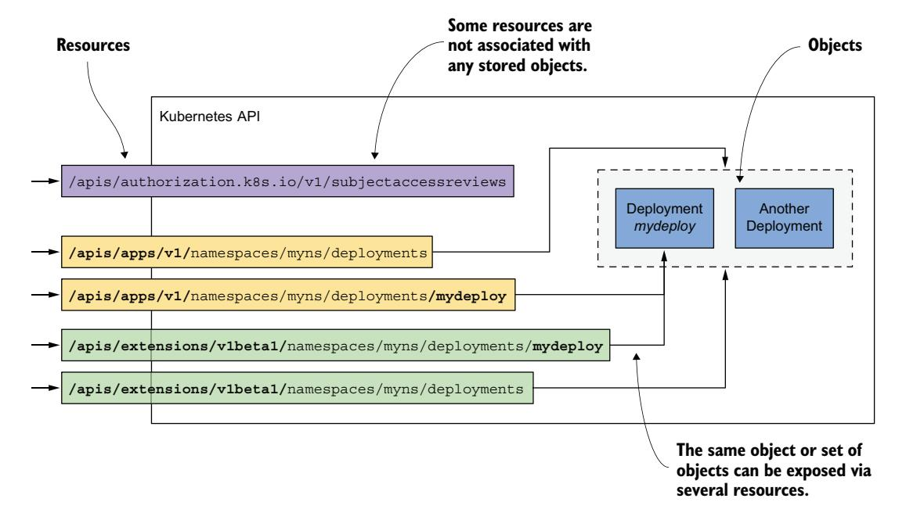
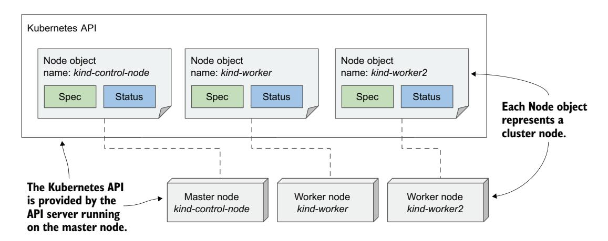

# *Navigating the Kubernetes API and object model*

# *This chapter covers*

- Managing a Kubernetes cluster and the applications it hosts via its API
- The structure of Kubernetes API objects
- Retrieving and understanding an object's YAML or JSON manifest
- Inspecting the status of cluster nodes via Node objects
- Inspecting cluster events through Event objects

The previous chapter introduced three fundamental objects that make up a deployed application. You created a Deployment object that spawned multiple Pod objects representing individual instances of your application and exposed them to the world by creating a Service object that deployed a load balancer in front of them.

 The chapters in the second part of this book explain these and other object types in detail. In this chapter, the common features of Kubernetes objects are presented using the example of Node and Event objects.

# 4.1 Getting familiar with the Kubernetes API

In a Kubernetes cluster, both users and Kubernetes components interact with the cluster by manipulating objects through the Kubernetes API, as shown in figure 4.1. These objects represent the configuration of the entire cluster. They include the applications running in the cluster, their configuration, the load balancers through which they are exposed within the cluster or externally, the underlying servers and the storage used by these applications, the security privileges of users and applications, and many other infrastructure details.


Figure 4.1 A Kubernetes cluster is configured by manipulating objects in the Kubernetes API.

## **4.1.1** Introducing the API

The Kubernetes API is the central point of interaction with the cluster, so much of this book is dedicated to explaining this API. The most important API objects are described in the following chapters, but a basic introduction to the API is presented here.

#### UNDERSTANDING THE ARCHITECTURAL STYLE OF THE API

The Kubernetes API is an HTTP-based RESTful API where the state is represented by *resources* on which CRUD operations (create, read, update, delete) are performed using standard HTTP methods such as POST, GET, PUT/PATCH, or DELETE.

**DEFINITION** REST stands for Representational State Transfer, an architectural style for implementing interoperability between computer systems via

web services using stateless operations, as described by Roy Thomas Fielding in his doctoral dissertation. To learn more, read the dissertation at [https://](https://mng.bz/5vx7) [mng.bz/5vx7](https://mng.bz/5vx7).

It is these resources (or objects) that represent the cluster configuration. Cluster administrators and engineers who deploy applications into the cluster therefore influence the configuration by manipulating these objects.

 In the Kubernetes community, the terms "resource" and "object" are used interchangeably, but there are subtle differences that warrant an explanation.

#### UNDERSTANDING THE DIFFERENCE BETWEEN RESOURCES AND OBJECTS

The essential concept in RESTful APIs is the resource, and each resource is assigned a URI, or Uniform Resource Identifier, that uniquely identifies it. For example, in the Kubernetes API, application deployments are represented by deployment resources.

 The collection of all deployments in the cluster is a REST resource exposed at /api/v1/deployments. When you use the GET method to send an HTTP request to this URI, you receive a response that lists all deployment instances in the cluster.

 Each individual deployment instance also has its own unique URI through which it can be manipulated. The individual deployment is thus exposed as another REST resource. You can retrieve information about the deployment by sending a GET request to the resource URI, and you can modify it using a PUT request.

 An object can therefore be exposed through more than one resource. As shown in figure 4.2, the Deployment object instance named mydeploy is returned both as an



Figure 4.2 A single object can be exposed by two or more resources.

element of a collection when you query the deployments resource and as a single object when you query the individual resource URI directly.

 In addition, a single object instance can also be exposed via multiple resources if multiple API versions exist for an object type. Up to Kubernetes version 1.15, two different representations of Deployment objects were exposed by the API. In addition to the apps/v1 version, exposed at /apis/apps/v1/deployments, an older version, extensions/v1beta1, exposed at /apis/extensions/v1beta1/deployments was available in the API. These two resources didn't represent two different sets of Deployment objects, but a single set represented in two different ways, with small differences in the object schema. You could create an instance of a Deployment object via the first URI and then read it back using the second.

 In some cases, a resource doesn't represent any object at all. An example would be the way the Kubernetes API allows clients to verify whether a subject (a person or a service) is authorized to perform an API operation. This is done by submitting a POST request to the /apis/authorization.k8s.io/v1/subjectaccessreviews resource. The response indicates whether the subject is authorized to perform the operation specified in the request body. The key thing here is that no object is created by the POST request.

 The examples described above show that a resource isn't the same as an object. If you are familiar with relational database systems, you can compare resources and object types with views and tables. Resources are views through which you interact with objects.

NOTE Because the term "resource" can also refer to compute resources, such as CPU and memory, to avoid confusion, the term "objects" is used in this book to refer to API resources.

#### UNDERSTANDING HOW OBJECTS ARE REPRESENTED

When you make a GET request for a resource, the Kubernetes API server returns the object in structured text form. The default data model is JSON, but you can also tell the server to return YAML instead. When you update the object using a POST or PUT request, you also specify the new state with either JSON or YAML.

 The individual fields in an object's manifest depend on the object type, but the general structure and many fields are shared by all Kubernetes API objects. You'll learn about them next.

# *4.1.2 Understanding the structure of an object manifest*

Before you engage with the complete manifest of a Kubernetes object, let me first explain its major parts, because this will help you to find your way through hundreds of lines it is sometimes composed of.

#### INTRODUCING THE MAIN PARTS OF AN OBJECT

The manifest of most Kubernetes API objects consists of the following four sections:

- *Type metadata*—Contains information about the type of object the manifest describes. It specifies the object type, the group to which the type belongs, and the API version.
- *Object metadata*—Holds the basic information about the object instance, including its name, time of creation, owner of the object, and other identifying information. The fields in the object metadata are the same for all object types.
- *Spec*—The part in which you specify the desired state of the object. Its fields differ for different object types. For pods, this is the part that specifies the pod's containers, storage volumes, and other information related to its operation.
- *Status*—Contains the current actual state of the object. For a pod, it tells you the condition of the pod, the status of each of its containers, its IP address, the node it's running on, and other information that reveals what's happening to your pod.

Figure 4.3 illustrates an object manifest and its four sections.


Figure 4.3 The main sections of a Kubernetes API object

NOTE Although the figure shows that users write to the object's spec section and read its status, the API server always returns the entire object when you perform a GET request; to update the object, you also send the entire object in the PUT request.

A later example will show which fields exist in these sections, but let me first explain the spec and status sections, as they represent the flesh of the object.

#### UNDERSTANDING THE SPEC AND STATUS SECTIONS

As you may have noticed in the previous figure, the two most important parts of an object are the spec and status sections. You use the spec to specify the desired state of the object and read the actual state of the object from the status section. So, you are the one who writes the spec and reads the status, but who or what reads the spec and writes the status?

 The Kubernetes Control Plane runs several components called *controllers* that manage the objects you create. Each controller is usually only responsible for one object type. For example, the *deployment controller* manages Deployment objects.

 As shown in figure 4.4, the task of a controller is to read the desired object state from the object's Spec section, perform the actions required to achieve this state, and report back the actual state of the object by writing to its Status section.


Figure 4.4 How a controller manages an object

Essentially, you tell Kubernetes what it has to do by creating and updating API objects. Kubernetes controllers use the same API objects to tell you what they have done and what the status of their work is. Remember that almost every object type has an associated controller and that this controller is what reads the spec and writes the status of the object.

## Not all objects have the spec and status sections

All Kubernetes API objects contain the two metadata sections, but not all have the spec and status sections. Those that don't typically contain just static data and don't have a corresponding controller, so it is not necessary to distinguish between the desired and the actual state of the object.

An example of such an object is the Event object, created by various controllers to provide additional information about what is happening with an object that the controller is managing. The Event object is explained in section 4.3.

You now have the general outline of an object, so the next section finally explores the individual fields of an object.

# *4.2 Examining an object's individual properties*

To examine Kubernetes API objects up close, we'll need a concrete example. Let's take the Node object, which should be easy to understand because it represents something you might be relatively familiar with—a computer in the cluster.

 My Kubernetes cluster provisioned by the kind tool has three nodes: one master and two workers. They are represented by three Node objects in the API. I can query the API and list these objects using kubectl get nodes:

| \$ kubectl get nodes |        |               |     |         |
|----------------------|--------|---------------|-----|---------|
| NAME                 | STATUS | ROLES         | AGE | VERSION |
| kind-control-plane   | Ready  | master        | 1h  | v1.18.2 |
| kind-worker          | Ready  | <none></none> | 1h  | v1.18.2 |
| kind-worker2         | Ready  | <none></none> | 1h  | v1.18.2 |

Figure 4.5 shows the three Node objects and the actual cluster machines that make up the cluster. Each Node object instance represents one host. In each instance, the spec section contains (part of) the configuration of the host, and the status section contains the state of the host.



Figure 4.5 Cluster nodes are represented by Node objects.

NOTE Node objects are slightly different from other objects because they are usually created by the Kubelet (i.e., the node agent running on the cluster node) rather than by users. When you add a machine to the cluster, the Kubelet registers the node by creating a Node object that represents the host. Users can then edit (some of) the fields in the spec section.

## *4.2.1 Exploring the full manifest of a Node object*

Let's take a close look at one of the Node objects. List all Node objects in your cluster by running the kubectl get nodes command and select one you want to inspect. Then, execute the kubectl get node <node-name> -o yaml command, where you replace <node-name> with the name of the node:

```
$ kubectl get node kind-control-plane -o yaml
apiVersion: v1 
kind: Node 
metadata: 
 annotations: ...
 creationTimestamp: "2020-05-03T15:09:17Z" 
 labels: ... 
 name: kind-control-plane 
 resourceVersion: "3220054"
 selfLink: /api/v1/nodes/kind-control-plane
 uid: 16dc1e0b-8d34-4cfb-8ade-3b0e91ec838b
spec: 
 podCIDR: 10.244.0.0/24 
 podCIDRs: 
 - 10.244.0.0/24 
 taints:
 - effect: NoSchedule
 key: node-role.kubernetes.io/master
status: 
 addresses: 
 - address: 172.18.0.2 
 type: InternalIP 
 - address: kind-control-plane 
 type: Hostname 
 allocatable: ...
 capacity: 
 cpu: "8" 
 ephemeral-storage: 401520944Ki 
 hugepages-1Gi: "0" 
 hugepages-2Mi: "0" 
 memory: 32720824Ki 
 pods: "110" 
 conditions:
 - lastHeartbeatTime: "2020-05-17T12:28:41Z"
 lastTransitionTime: "2020-05-03T15:09:17Z"
 message: kubelet has sufficient memory available
 reason: KubeletHasSufficientMemory
 status: "False"
 type: MemoryPressure
 ...
                                                        The type metadata specifies 
                                                        the type of object and the API 
                                                        version of this object manifest.
                                                            The object metadata 
                                                            section begins here.
                                                          The object name (the 
                                                          node's name)
                                                        The node's desired state is specified 
                                                        in the spec section, which begins here.
                                                     The IP range reserved for 
                                                     the pods on this node
                                                     The node's actual state is shown in the 
                                                     status section, which begins here and 
                                                     extends to the end of this listing.
                                                 The IP(s) and 
                                                 hostname of 
                                                 the node
                                                       The node's capacity 
                                                       (the amount of compute 
                                                       resources it has)
```

```
 daemonEndpoints:
 kubeletEndpoint:
 Port: 10250
 images: 
 - names: 
 - k8s.gcr.io/etcd:3.4.3-0 
 sizeBytes: 289997247 
 ... 
 nodeInfo: 
 architecture: amd64 
 bootID: 233a359f-5897-4860-863d-06546130e1ff 
 containerRuntimeVersion: containerd://1.3.3-14-g449e9269 
 kernelVersion: 5.5.10-200.fc31.x86_64 
 kubeProxyVersion: v1.18.2 
 kubeletVersion: v1.18.2 
 machineID: 74b74e389bb246e99abdf731d145142d 
 operatingSystem: linux 
 osImage: Ubuntu 19.10 
 systemUUID: 8749f818-8269-4a02-bdc2-84bf5fa21700 
                                                     The list of cached 
                                                     container images 
                                                     on this node
                                                                   Information 
                                                                   about the 
                                                                   node's 
                                                                   operating 
                                                                   system and 
                                                                   the Kubernetes 
                                                                   components 
                                                                   running on it
```

NOTE Use the -o json option to display the object in JSON instead of YAML.

In the YAML manifest, the four main sections of the object definition and the more important properties of the node are annotated to help you distinguish between the more and less important fields. Some lines have been omitted to reduce the length of the manifest.

## Accessing the API directly

You may be interested in trying to access the API directly instead of through kubectl. As explained earlier, the Kubernetes API is web-based, so you can use a web browser or the curl command to perform API operations, but the API server uses TLS, and you typically need a client certificate or token for authentication. Fortunately, kubectl provides a special proxy that takes care of this, allowing you to talk to the API through the proxy using plain HTTP.

To run the proxy, execute

```
$ kubectl proxy
Starting to serve on 127.0.0.1:8001
```

You can now access the API using HTTP at 127.0.0.1:8001. For example, to retrieve the Node object, open the URL http://127.0.0.1:8001/api/v1/nodes/kind-controlplane (replace kind-control-plane with one of your nodes' names).

Now let's take a closer look at the fields in each of the four main sections.

## THE TYPE METADATA FIELDS

As you can see, the manifest starts with the apiVersion and kind fields, which specify the API version and type of the object that this object manifest specifies. The API version is the schema used to describe this object. As mentioned before, an object type can be associated with more than one schema, with different fields in each schema being used to describe the object. However, usually only one schema exists for each type.

 The apiVersion in the previous manifest is v1, but you'll see in the following chapters that the apiVersion in other object types contains more than just the version number. For Deployment objects, for example, the apiVersion is apps/v1. Whereas the field was originally used only to specify the API version, it is now also used to specify the API group to which the resource belongs. Node objects belong to the core API group, which is conventionally omitted from the apiVersion field.

 The type of object defined in the manifest is specified by the field kind. The object kind in the previous manifest is Node. In the previous chapters, you created objects of the Deployment, Service, and Pod kind.

## FIELDS IN THE OBJECT METADATA SECTION

The metadata section contains the metadata of this object instance. It contains the name of the instance, along with additional attributes such as labels and annotations, which are explained in chapter 10, and fields such as resourceVersion, managedFields, and other low-level fields.

#### FIELDS IN THE SPEC SECTION

Next comes the spec section, which is specific to each object kind. It is relatively short for Node objects compared to what you find for other object kinds. The podCIDR fields specify the pod IP range assigned to the node. Pods running on this node are assigned IPs from this range. The taints field is not important at this point.

 Typically, an object's spec section contains many more fields used to configure the object.

## FIELDS IN THE STATUS SECTION

The status section also differs between the different kinds of object, but its purpose is always the same—it contains the last observed state of the thing the object represents. For Node objects, the status reveals the node's IP address(es), host name, capacity to provide compute resources, the current conditions of the node, the container images it has already downloaded and which are now cached locally, and information about its operating system and the version of Kubernetes components running on it.

# *4.2.2 Understanding individual object fields*

To learn more about individual fields in the manifest, you can refer to the API reference documentation at <http://kubernetes.io/docs/reference/>or use the kubectl explain command as described next.

### USING KUBECTL EXPLAIN TO EXPLORE API OBJECT FIELDS

The kubectl tool has a nice feature that allows you to look up the explanation of each field for each object type (kind) from the command line. Usually, you start by asking it to provide the basic description of the object kind by running kubectl explain <kind>:

#### \$ **kubectl explain nodes**

KIND: Node VERSION: v1

#### DESCRIPTION:

 Node is a worker node in Kubernetes. Each node will have a unique identifier in the cache (i.e. in etcd).

#### FIELDS:

 apiVersion <string> APIVersion defines the versioned schema of this representation of an

kind <string>

 Kind is a string value representing the REST resource this object represents. Servers may infer this from the endpoint the client...

object. Servers should convert recognized schemas to the latest...

 metadata <Object> Standard object's metadata. More info: ...

 spec <Object> Spec defines the behavior of a node...

status <Object>

 Most recently observed status of the node. Populated by the system. Read-only. More info: ...

The command prints the explanation of the object and lists the top-level fields that the object can contain.

#### DRILLING DEEPER INTO AN API OBJECT'S STRUCTURE

You can then drill deeper to find subfields under each specific field. For example, you can use the following command to explain the node's spec field:

#### \$ **kubectl explain node.spec**

KIND: Node VERSION: v1

RESOURCE: spec <Object>

#### DESCRIPTION:

Spec defines the behavior of a node.

NodeSpec describes the attributes that a node is created with.

### FIELDS:

configSource <Object>

 If specified, the source to get node configuration from The DynamicKubeletConfig feature gate must be enabled for the Kubelet...

externalID <string>

Deprecated. Not all kubelets will set this field...

```
 podCIDR <string>
 PodCIDR represents the pod IP range assigned to the node.
```

Note the API version given at the top. As explained earlier, multiple versions of the same kind can exist. Different versions can have different fields or default values. If you want to display a different version, specify it with the --api-version option.

NOTE If you want to see the complete structure of an object (the complete hierarchical list of fields without the descriptions), try kubectl explain pods --recursive.

## *4.2.3 Understanding an object's status conditions*

The set of fields in both the spec and status sections is different for each object kind, but the conditions field is found in many of them. It gives a list of conditions the object is currently in. They are very useful when you need to troubleshoot an object, so let's examine them more closely. Since the Node object is used as an example, this section also shows how to easily identify problems with a cluster node.

#### INTRODUCING THE NODE'S STATUS CONDITIONS

message: kubelet is posting ready status

reason: KubeletReady

Let's print out the YAML manifest of a Node object, but this time, we'll only focus on the conditions field in the object's status. The command to run and its output are as follows:

```
$ kubectl get node kind-control-plane -o yaml
...
status:
 ...
 conditions:
 - lastHeartbeatTime: "2020-05-17T13:03:42Z"
 lastTransitionTime: "2020-05-03T15:09:17Z"
 message: kubelet has sufficient memory available
 reason: KubeletHasSufficientMemory
 status: "False" 
 type: MemoryPressure 
 - lastHeartbeatTime: "2020-05-17T13:03:42Z"
 lastTransitionTime: "2020-05-03T15:09:17Z"
 message: kubelet has no disk pressure
 reason: KubeletHasNoDiskPressure
 status: "False" 
 type: DiskPressure 
 - lastHeartbeatTime: "2020-05-17T13:03:42Z"
 lastTransitionTime: "2020-05-03T15:09:17Z"
 message: kubelet has sufficient PID available
 reason: KubeletHasSufficientPID
 status: "False" 
 type: PIDPressure 
 - lastHeartbeatTime: "2020-05-17T13:03:42Z"
 lastTransitionTime: "2020-05-03T15:10:15Z"
                                                        Node is not running 
                                                        out of memory.
                                                        Node is not running 
                                                        out of disk space.
                                                        Node has not run out of 
                                                        unused process IDs.
```

 **status: "True" type: Ready Node is ready.**

TIP The jq tool is very handy if you want to see only a part of the object's structure. For example, to display the node's status conditions, you can run kubectl get node <name> -o json | jq .status.conditions. The equivalent tool for YAML is yq.

There are four conditions that reveal the state of the node. Each condition has a type and a status field, which can be True, False, or Unknown, as shown in figure 4.6. A condition can also specify a machine-facing reason for the last transition of the condition and a human-facing message with details about the transition. The lastTransition-Time field indicates when the condition moved from one status to another, whereas the lastHeartbeatTime field reveals the last time the controller received an update on the given condition.


Figure 4.6 The status conditions indicating the state of a Node object

Although it's the last condition in the list, the Ready condition is probably the most important, as it signals whether the node is ready to accept new workloads (pods). The other conditions (MemoryPressure, DiskPressure, and PIDPressure) signal whether the node is running out of resources. Remember to check these conditions if a node starts to behave strangely (e.g., if the applications start running out of resources and/or crash).

#### UNDERSTANDING CONDITIONS IN OTHER OBJECT KINDS

A condition list such as that in Node objects is also used in many other object kinds. The conditions explained earlier are a good example of why the state of most objects is represented by multiple conditions instead of a single field.

NOTE Conditions are usually orthogonal, meaning that they represent unrelated aspects of the object.

If the state of an object were represented as a single field, it would be very difficult to subsequently extend it with new values, as this would require updating all clients that monitor the state of the object and perform actions based on it. Some object kinds originally used such a single field, and some still do, but now, most use a list of conditions instead.

 Since this chapter aims to introduce the common features of the Kubernetes API objects, we've focused only on the conditions field, but it is far from being the only field in the status of the Node object. To explore the others, use the kubectl explain command as described in section 4.2.2. The fields that are not immediately easy to understand should become clear after reading the remaining chapters in this part of the book.

NOTE As an exercise, use the command kubectl get <kind> <name> -o yaml to explore the other objects you've created so far (Deployments, Services, and Pods).

## *4.2.4 Inspecting objects using the kubectl describe command*

To help you understand the entire structure of the Kubernetes API objects, it was necessary to show the complete YAML manifest of an object. While I personally often use this method to inspect an object, a more user-friendly way to inspect an object is the kubectl describe command, which typically displays the same information or sometimes even more.

## UNDERSTANDING THE KUBECTL DESCRIBE OUTPUT FOR A NODE OBJECT

Let's try running the kubectl describe command on a Node object. To keep things interesting, let's use it to describe one of the worker nodes instead of the master. This is the command and its output:

#### \$ **kubectl describe node kind-worker-2**

Name: kind-worker2 Roles: <none>

Labels: beta.kubernetes.io/arch=amd64

 beta.kubernetes.io/os=linux kubernetes.io/arch=amd64

kubernetes.io/hostname=kind-worker2

kubernetes.io/os=linux

Annotations: kubeadm.alpha.kubernetes.io/cri-socket: /run/contain...

node.alpha.kubernetes.io/ttl: 0

volumes.kubernetes.io/controller-managed-attach-deta...

CreationTimestamp: Sun, 03 May 2020 17:09:48 +0200

Taints: <none> Unschedulable: false

Lease:

 HolderIdentity: kind-worker2 AcquireTime: <unset>

RenewTime: Sun, 17 May 2020 16:15:03 +0200

```
Conditions:
 Type Status ... Reason Message
 ---- ------ --- ------ -------
 MemoryPressure False ... KubeletHasSufficientMemory ...
 DiskPressure False ... KubeletHasNoDiskPressure ...
 PIDPressure False ... KubeletHasSufficientPID ...
 Ready True ... KubeletReady ...
Addresses:
 InternalIP: 172.18.0.4
 Hostname: kind-worker2
Capacity:
 cpu: 8
 ephemeral-storage: 401520944Ki
 hugepages-1Gi: 0
 hugepages-2Mi: 0
 memory: 32720824Ki
 pods: 110
Allocatable:
 ...
System Info:
 ...
PodCIDR: 10.244.1.0/24
PodCIDRs: 10.244.1.0/24
Non-terminated Pods: (2 in total)
 Namespace Name CPU Requests CPU Limits ... AGE
 --------- ---- ------------ ---------- ... ---
 kube-system kindnet-4xmjh 100m (1%) 100m (1%) ... 13d
 kube-system kube-proxy-dgkfm 0 (0%) 0 (0%) ... 13d
Allocated resources:
 (Total limits may be over 100 percent, i.e., overcommitted.)
 Resource Requests Limits
 -------- -------- ------
 cpu 100m (1%) 100m (1%)
 memory 50Mi (0%) 50Mi (0%)
 ephemeral-storage 0 (0%) 0 (0%)
 hugepages-1Gi 0 (0%) 0 (0%)
 hugepages-2Mi 0 (0%) 0 (0%)
Events:
 Type Reason Age From Message
 ---- ------ ---- ---- -------
 Normal Starting 3m50s kubelet, kind-worker2 ...
 Normal NodeAllocatableEnforced 3m50s kubelet, kind-worker2 ...
 Normal NodeHasSufficientMemory 3m50s kubelet, kind-worker2 ...
 Normal NodeHasNoDiskPressure 3m50s kubelet, kind-worker2 ...
 Normal NodeHasSufficientPID 3m50s kubelet, kind-worker2 ...
 Normal Starting 3m49s kube-proxy, kind-worker2 ...
```

The kubectl describe command displays all the information you previously found in the YAML manifest of the Node object, but in a more readable form. You can see the name, IP address, and hostname, as well as the conditions and available capacity of the node.

#### INSPECTING OTHER OBJECTS RELATED TO THE NODE

In addition to the information stored in the Node object itself, the kubectl describe command also displays the pods running on the node and the total amount of allocated compute resources. Below is also a list of events related to the node.

 This additional information isn't found in the Node object itself but is collected by the kubectl tool from other API objects. For example, the list of pods running on the node is obtained by retrieving Pod objects via the pods resource.

 If you run the describe command yourself, no events may be displayed. This is because only events that have occurred recently are shown. For Node objects, unless the node has resource capacity problems, you'll only see events if you've recently (re)started the node.

 Virtually, every API object kind has events associated with it. Since they are crucial for debugging a cluster, they warrant a closer look before you start exploring other objects.

# *4.3 Observing cluster events via Event objects*

As controllers perform their task of reconciling the actual state of an object with the desired state, as specified in the object's spec field, they generate events to reveal what they have done. Two types of events exist: Normal and Warning. Events of the latter type are usually generated by controllers when something prevents them from reconciling the object. By monitoring these types of events, you can be quickly informed of any problems that the cluster encounters.

## *4.3.1 Introducing the Event object*

Like everything else in Kubernetes, events are represented by Event objects that are created and read via the Kubernetes API. As shown in figure 4.7, they contain information


Figure 4.7 The relationship between Event objects, controllers, and other API objects

about what happened to the object and what the source of the event was. Unlike other objects, each Event object is deleted one hour after its creation to reduce the burden on etcd, the data store for Kubernetes API objects.

NOTE The amount of time to retain events is configurable via the API server's command-line options.

#### LISTING EVENTS USING KUBECTL GET EVENTS

The events displayed by kubectl describe refer to the object specified as the argument to the command. Due to their nature and the fact that many events can be created for an object in a short time, they aren't part of the object itself. You won't find them in the object's YAML manifest, as they exist on their own, just like nodes and the other objects you've seen so far.

NOTE If you want to follow the exercises in this section in your own cluster, you may need to restart one of the nodes to ensure that the events are recent enough to be still present in etcd. If you can't do this, don't worry. Just skip these exercises, as we'll also be generating and inspecting events in the exercises in the next chapter.

Because events are standalone objects, you can list them using kubectl get events:

## \$ **kubectl get ev**

| LAST |           |                                                                 |        |                                     |
|------|-----------|-----------------------------------------------------------------|--------|-------------------------------------|
|      | SEEN TYPE | REASON                                                          | OBJECT | MESSAGE                             |
| 48s  |           | Normal Starting                                                 |        | node/kind-worker2 Starting kubelet. |
| 48s  |           | Normal NodeAllocatableEnforced node/kind-worker2 Updated Node A |        |                                     |
| 48s  |           | Normal NodeHasSufficientMemory node/kind-worker2 Node kind-work |        |                                     |
| 48s  |           | Normal NodeHasNoDiskPressure                                    |        | node/kind-worker2 Node kind-work    |
| 48s  |           | Normal NodeHasSufficientPID                                     |        | node/kind-worker2 Node kind-work    |
| 47s  |           | Normal Starting                                                 |        | node/kind-worker2 Starting kube     |

NOTE The previous listing uses the short name ev in place of events.

You'll notice that some events displayed in the listing match the status conditions of the node. This is often the case, but you'll also find additional events. The two events with the reason Starting are two such examples. In the case at hand, they signal that the Kubelet and the Kube Proxy components have been started on the node. You don't need to worry about these components yet. They are explained in the third part of the book.

## UNDERSTANDING WHAT'S IN AN EVENT OBJECT

As with other objects, the kubectl get command only outputs the most important object data. To display additional information, you can enable additional columns by executing the command with the -o wide option:

#### \$ **kubectl get ev -o wide**

The output of this command is extremely wide and is not listed here. Instead, the displayed information is explained in table 4.1.

| Table 4.1 | Properties of the Event object |  |  |  |
|-----------|--------------------------------|--|--|--|
|-----------|--------------------------------|--|--|--|

| Property   | Description                                                                                                                                                          |
|------------|----------------------------------------------------------------------------------------------------------------------------------------------------------------------|
| Name       | The name of this Event object instance. Useful only if you want to retrieve the given<br>object from the API.                                                        |
| Type       | The type of the event. Either Normal or Warning.                                                                                                                     |
| Reason     | The machine-facing description of why the event occurred.                                                                                                            |
| Source     | The component that reported this event. This is usually a controller.                                                                                                |
| Object     | The object instance to which the event refers (e.g., node/xyz).                                                                                                      |
| Sub-object | The sub-object to which the event refers. For example, what container of the pod.                                                                                    |
| Message    | The human-facing description of the event.                                                                                                                           |
| First seen | The first time this event occurred. Remember that each Event object is deleted after a<br>while, so this may not be the first time that the event actually occurred. |
| Last seen  | Events often occur repeatedly. This field indicates when this event last occurred.                                                                                   |
| Count      | The number of times the event has occurred.                                                                                                                          |

TIP As you complete the exercises throughout this book, you may find it useful to run the kubectl get events command each time you make changes to one of your objects. This will help you learn what happens beneath the surface.

#### DISPLAYING ONLY WARNING EVENTS

Unlike the kubectl describe command, which only displays events related to the object you're describing, the kubectl get events command displays all events. This is useful if you want to check whether there are events you should be concerned about. You may want to ignore events of the Normal type and focus on Warning only.

 The API provides a way to filter objects through *field selectors*. Only objects where the specified field matches the specified selector value are returned. You can use this to display only Warning events. The kubectl get command lets you specify the field selector with the --field-selector option. To list only events that represent warnings, execute the following command:

## \$ **kubectl get ev --field-selector type=Warning** No resources found in default namespace.

If the command does not print any events, as in the previous case, no warnings have been recorded in your cluster recently.

 You may wonder how I knew the exact name of the field to be used in the field selector and what its exact value should be (perhaps it should have been lower case). Hats off if you guessed that this information is provided by the kubectl explain events command. Since events are regular API objects, you can use it to look up documentation on the Event objects' structure. There, you'll learn that the type field can have two values, either Normal or Warning.

## *4.3.2 Examining the YAML of the Event object*

To inspect the events in your cluster, the commands kubectl describe and kubectl get events should be sufficient. Unlike other objects, you'll probably never have to display the complete YAML of an Event object. But I'd like to take this opportunity to show you an annoying thing about Kubernetes object manifests that the API returns.

#### EVENT OBJECTS HAVE NO SPEC AND STATUS SECTIONS

If you use the kubectl explain to explore the structure of the Event object, you'll notice that it has no spec or status sections. Unfortunately, this means that its fields are not as nicely organized as in the Node object, for example.

 Inspect the following YAML and see whether you can easily find the object's kind, metadata, and other fields:

```
apiVersion: v1 
count: 1
eventTime: null
firstTimestamp: "2020-05-17T18:16:40Z"
involvedObject:
 kind: Node
 name: kind-worker2
 uid: kind-worker2
kind: Event 
lastTimestamp: "2020-05-17T18:16:40Z"
message: Starting kubelet.
metadata: 
 creationTimestamp: "2020-05-17T18:16:40Z"
 name: kind-worker2.160fe38fc0bc3703 
 namespace: default
 resourceVersion: "3528471"
 selfLink: /api/v1/namespaces/default/events/kind-worker2.160f...
 uid: da97e812-d89e-4890-9663-091fd1ec5e2d
reason: Starting
reportingComponent: ""
reportingInstance: ""
source:
 component: kubelet
 host: kind-worker2
type: Normal
                                       The apiVersion field 
                                       is easy to spot.
                                                    The kind field 
                                                    is hard to find.
                                                        The object's metadata 
                                                        appears in the metadata 
                                                        section, which begins here.
                                                           The object's name 
                                                           is hidden here.
```

You will surely agree that the YAML manifest in the listing is disorganized. The fields are listed alphabetically instead of being organized into coherent groups, which makes it difficult for us humans to read. It looks so chaotic that it's no wonder that many people hate to deal with Kubernetes YAML or JSON manifests, since both suffer from this problem.

 In contrast, the earlier YAML manifest of the Node object was relatively easy to read, because the order of the top-level fields is what one would expect: apiVersion, kind, metadata, spec, and status. You'll notice that this is simply because the alphabetical order of the five fields just happens to make sense. But the fields under those fields suffer from the same problem, as they are also sorted alphabetically.

 YAML is designed to be easy to read, but the alphabetical field order in Kubernetes YAML breaks this. Fortunately, most objects contain the spec and status sections, so at least the top-level fields in these objects are well organized. As for the rest, you'll just have to accept this unfortunate aspect of dealing with Kubernetes manifests.

# *Summary*

- Kubernetes provides a RESTful API for interaction with a cluster. API objects map to actual components that make up the cluster, including applications, load balancers, nodes, storage volumes, and many others.
- An object instance can be represented by many resources. A single object type can be exposed through several resources that are just different representations of the same thing.
- Kubernetes API objects are described in YAML or JSON manifests. Objects are created by posting a manifest to the API. The status of the object is stored in the object itself and can be retrieved by requesting the object from the API using a GET request.
- All Kubernetes API objects contain type and object metadata, and most have a spec and status sections. A few object types don't have these two sections as they only contain static data.
- Controllers bring objects to life by constantly watching for changes in their spec, updating the cluster state and reporting the current state via the object's status field.
- As controllers manage Kubernetes API objects, they emit events to show what actions they have performed. Like everything else, events are represented by objects and can be retrieved through the API. Events signal what is happening to a Node or other object. They show what has recently happened to the object and can provide clues as to why it is broken.
- The kubectl explain command provides a quick way to look up documentation on a specific object kind and its fields from the command line.
- The status in a Node object contains information about the node's IP address and hostname, its resource capacity, conditions, cached container images, and other information about the node. Pods running on the node are not part of the node's status, but the kubectl describe node commands get this information from the pods resource.
- Many object types use status conditions to signal the state of the component that the object represents. For nodes, these conditions are MemoryPressure, DiskPressure, and PIDPressure. Each condition is either True, False, or Unknown and has an associated reason and message that explain why the condition is in the specified state.