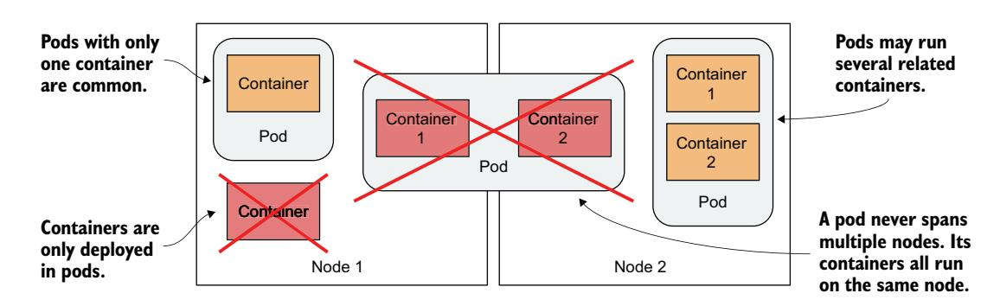
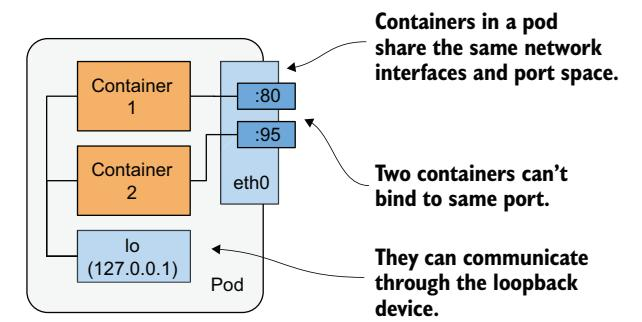
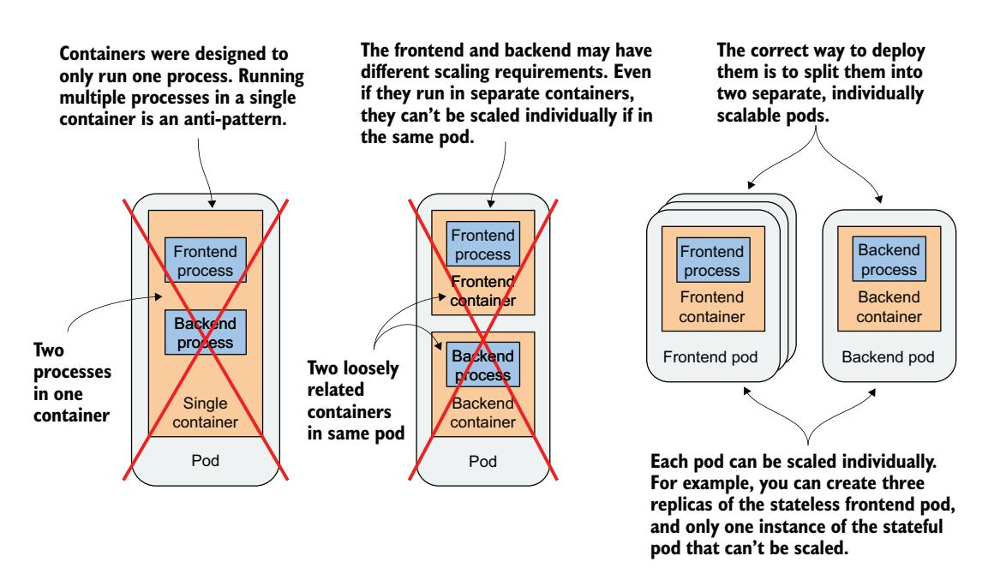
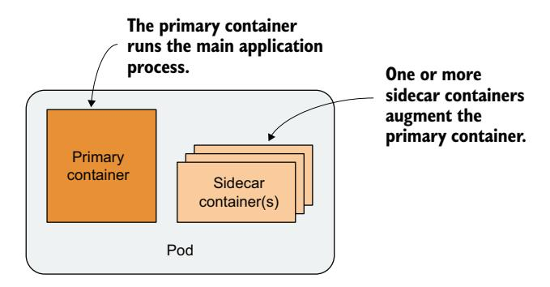
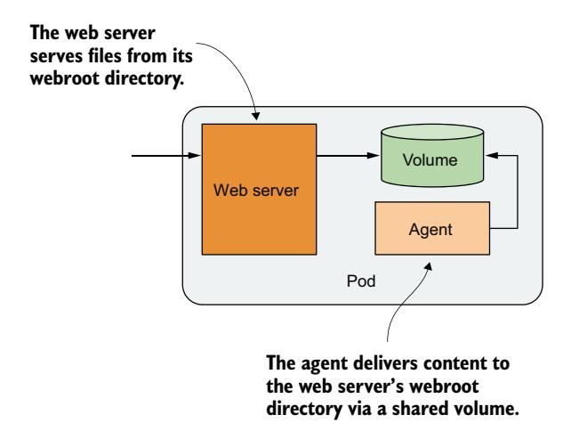
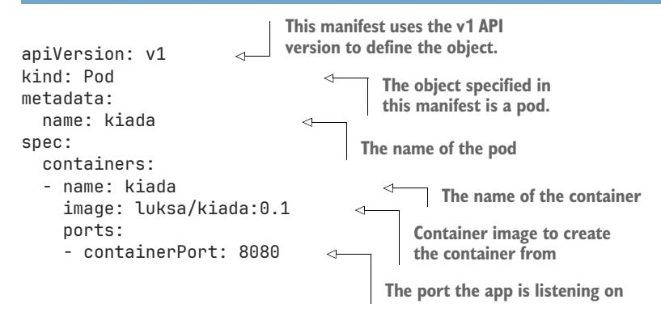
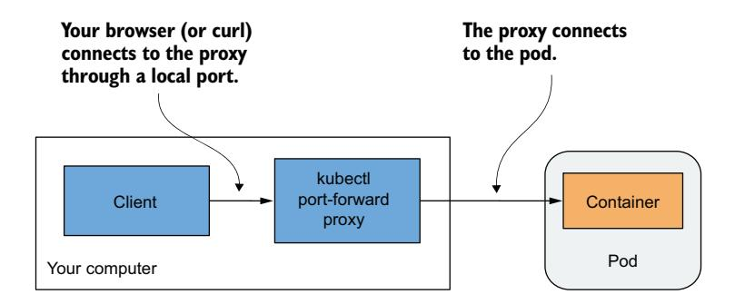
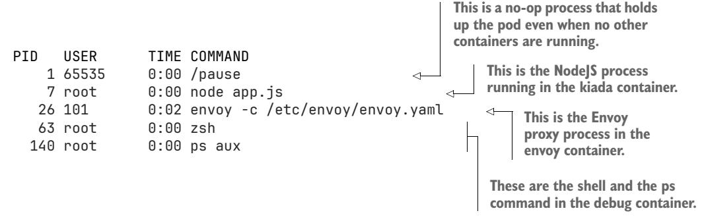
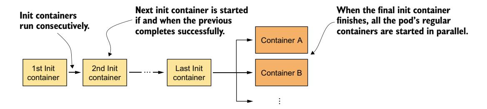

# *Running applications with pods*

# *This chapter covers*

- How and when to group containers
- Running an application by creating a Pod object from a YAML file
- Communicating with an application, viewing its logs, and exploring its environment
- Adding a sidecar container to extend the pod's main container
- Initializing pods by running init containers at pod startup

Let's quickly revisit the three types of objects created in chapter 3 to deploy a minimal application on Kubernetes. Figure 5.1 shows their relationship and the functions they have in the system.

 You now have a basic understanding of how these objects are exposed via the Kubernetes API. In this and the following chapters, you'll learn about each of them and many others that are typically used to deploy a full application. Let's start with the Pod object, as it represents the central, most important concept in Kubernetes—a running instance of your application.


Figure 5.1 Three basic object types comprising a deployed application

NOTE The code files for this chapter are available at [https://mng.bz/64JR.](https://mng.bz/64JR)

# *5.1 Understanding pods*

You've already learned that a pod is a co-located group of containers and the basic building block in Kubernetes. Instead of deploying containers individually, you deploy and manage a group of containers as a single unit—a pod. Although pods may host several containers, it's quite typical for a pod to run with only one. When a pod has multiple containers, all of them run on the same worker node—a single pod instance never spans multiple nodes. Figure 5.2 shows this information.



Figure 5.2 All containers of a pod run on the same node. A pod never spans multiple nodes.

# *5.1.1 Understanding the purpose of pods*

Let's discuss why we need to run multiple containers together, as opposed to running multiple processes in the same container.

#### UNDERSTANDING WHY ONE CONTAINER SHOULDN'T CONTAIN MULTIPLE PROCESSES

Imagine an application that consists of several processes that communicate with each other via *IPC* (Inter-Process Communication) or shared files, which requires them to run on the same computer. In chapter 2, you learned that each container is like an

isolated computer or virtual machine. A computer typically runs several processes; containers can also do this. You can run all the processes that make up an application in just one container, but that makes the container very difficult to manage.

 Containers are *designed* to run only a single process, not counting any child processes that it spawns. Both container tooling and Kubernetes were developed around this fact. For example, a process running in a container is expected to write its logs to standard output. Docker and Kubernetes commands that you use to display the logs only show what has been captured from this output. If a single process is running in the container, it's the only writer, but if you run multiple processes in the container, they all write to the same output. Their logs are therefore intertwined, and it's difficult to tell which process each line belongs to.

 Another reason containers are typically designed to run a single process is the fact that the container runtime only restarts the container when the container's root process dies. It doesn't care about any child processes created by this root process. If it spawns child processes, it is alone responsible for keeping all these processes running.

 To take full advantage of the features provided by the container runtime, you should consider running only one process in each container.

#### UNDERSTANDING HOW A POD COMBINES MULTIPLE CONTAINERS

Since we shouldn't run multiple processes in a single container, it's evident we need another higher-level construct that would allow running related processes together, even when divided into multiple containers. These processes must be able to communicate with each other like those in a normal computer. And that is why pods were introduced.

 With a pod, you can run closely related processes together, giving them (almost) the same environment as if they were all running in a single container. These processes are somewhat isolated, but not completely—they share some resources. This gives us the best of both worlds. You can use all the features that containers offer, but also allow processes to work together. A pod makes these interconnected containers manageable as one unit.

 In chapter 2, you learned that a container uses its own set of Linux namespaces, but it can also share some with other containers. This sharing of namespaces is exactly how Kubernetes and the container runtime combine containers into pods. As shown in figure 5.3, all containers in a pod share the same Network namespace and thus the network interfaces, IP address(es), and port space that belong to it.

 Because of the shared port space, processes running in containers of the same pod can't be bound to the same port numbers, whereas processes in other pods have their own network interfaces and port spaces, which eliminates port conflicts between different pods. All the containers in a pod also see the same system hostname, because they share the UTS namespace, and can communicate through the usual IPC mechanisms because they share the IPC namespace. A pod can also be configured to use a single PID namespace for all its containers, which makes them share a single process tree, but you must explicitly enable this for each pod individually.



Figure 5.3 Containers in a pod share the same network interfaces.

NOTE When containers of the same pod use separate PID namespaces, they can't see each other or send process signals such as SIGTERM or SIGINT between them.

It's this sharing of certain namespaces that gives the processes running in a pod the impression that they run together, even though they run in separate containers. In contrast, each container always has its own Mount namespace, giving it its own file system, but when two containers must share a part of the file system, you can add a *volume* to the pod and mount it into both containers. The two containers still use two separate Mount namespaces, but the shared volume is mounted to both. We'll talk more about volumes in chapter 8.

## *5.1.2 Organizing containers into pods*

You can think of each pod as a separate computer. Unlike virtual machines, which typically host multiple applications, you usually run only one application in each pod. You never need to combine multiple applications in a single pod, as pods have almost no resource overhead. You can have as many pods as you need, so instead of stuffing all your applications into a single pod, you should divide them so that each pod runs only closely related application processes. Let me illustrate this with a concrete example.

#### SPLITTING A MULTI-TIER APPLICATION STACK INTO MULTIPLE PODS

Imagine a simple system composed of a frontend web server and a backend database. I've already explained that the frontend server and the database shouldn't run in the same container, as all the features built into containers were designed around the expectation that not more than one process runs in a container. If not in a single container, should you then run them in separate containers that are all in the same pod?

 Although nothing prevents us from running both the frontend server and the database in a single pod, this isn't the best approach. I've explained that all containers of a pod always run co-located, but do the web server and the database have to run on the same computer? The answer is obviously no, as they can easily communicate over the network. Therefore, you shouldn't run them in the same pod.

 If both the frontend and the backend are in the same pod, both run on the same cluster node. If you have a two-node cluster and only create one pod, you are using only a single worker node and aren't taking advantage of the computing resources available on the second node. This means wasted CPU, memory, disk storage, and bandwidth. Splitting the containers into two pods allows Kubernetes to place the frontend pod on one node and the backend pod on the other, thereby improving the hardware utilization.

#### SPLITTING INTO MULTIPLE PODS TO ENABLE INDIVIDUAL SCALING

Another reason not to use a single pod has to do with horizontal scaling. A pod is not only the basic unit of Deployment, but also the basic unit of scaling. In chapter 2 you scaled the Deployment object, and Kubernetes created additional pods—additional replicas of your application. Kubernetes doesn't replicate containers in a pod, but it replicates the entire pod.

Frontend components usually have different scaling requirements than backend components, so we typically scale them individually. When your pod contains both the frontend and backend containers and Kubernetes replicates it, you end up with multiple instances of both the frontend and backend containers, which isn't always what you want. Stateful backends, such as databases, usually can't be scaled, at least not as easily as stateless frontends. If a container must be scaled separately from the other components, this is a clear indication that it must be deployed in a separate pod. Figure 5.4 illustrates this concept.

Splitting application stacks into multiple pods is the correct approach. But then, when does one run multiple containers in the same pod?



Figure 5.4 Splitting an application stack into pods

#### INTRODUCING SIDECAR CONTAINERS

Placing several containers in a single pod is only appropriate if the application consists of a primary process and one or more processes that complement the operation of the primary process. The container in which the complementary process runs is called a *sidecar container* because it's analogous to a motorcycle sidecar, which makes the motorcycle more stable and offers the possibility of carrying an additional passenger. But unlike motorcycles, a pod can have more than one sidecar, as shown in figure 5.5.



Figure 5.5 A pod with a primary and sidecar container(s)

It's difficult to imagine what constitutes a complementary process, so I'll give you some examples. In chapter 2, you deployed pods with one container that runs a Node.js application. The Node.js application only supports the HTTP protocol. To make it support HTTPS, we could add a bit more JavaScript code, but we can also do it without changing the existing application at all by adding an additional container to the pod—a reverse proxy that converts HTTPS traffic to HTTP and forwards it to the Node.js container. The Node.js container is thus the primary container, whereas the container running the proxy is the sidecar container. Figure 5.6 shows this example.


Figure 5.6 A sidecar container that converts HTTPS traffic to HTTP

## NOTE You'll create this pod in section 5.4.

Another example, shown in figure 5.7, is a pod where the primary container runs a web server that serves files from its webroot directory. The other container in the pod is an agent that periodically downloads content from an external source and stores it in the web server's webroot directory. As I mentioned earlier, two containers can share files by sharing a volume. The webroot directory would be located on this volume.



Figure 5.7 A sidecar container that delivers content to the web server container via a volume

Other examples of sidecar containers are log rotators and collectors, data processors, communication adapters, and others.

 Unlike changing the application's existing code, adding a sidecar increases the pod's resources requirements because an additional process must run in the pod. But keep in mind that adding code to legacy applications can be very difficult. This could be because its code is difficult to modify, it's difficult to set up the build environment, or the source code itself is no longer available. Extending the application by adding an additional process is sometimes a cheaper and faster option.

## DECIDING WHETHER TO SPLIT CONTAINERS INTO MULTIPLE PODS

When deciding whether to use the sidecar pattern and place containers in a single pod, or to place them in separate pods, ask yourself the following:

- Do these containers have to run on the same host?
- Do I want to manage them as a single unit?
- Do they form a unified whole instead of being independent components?
- Do they have to be scaled together?
- Can a single node meet their combined resource needs?

If the answer to all these questions is yes, put them all in the same pod. As a rule of thumb, always place containers in separate pods, unless a specific reason requires them to be part of the same pod.

# *5.2 Creating pods from YAML or JSON files*

With the information you learned in the previous sections, you can now start creating pods. In chapter 3, you created them using the imperative command kubectl create, but pods and other Kubernetes objects are usually created by creating a JSON or YAML manifest file and posting it to the Kubernetes API, as you've already learned in the previous chapter.

NOTE The decision whether to use YAML or JSON to define your objects is yours. Most people prefer to use YAML because it's slightly more humanfriendly and allows adding comments to the object definition.

By using YAML files to define the structure of your application, you don't need shell scripts to make the process of deploying your applications repeatable, and you can keep a history of all changes by storing these files in a VCS (Version Control System), just like you store code. In fact, the application manifests of the exercises in this book are all stored in a VCS. You can find them on GitHub at [github.com/luksa/kubernetes](http://github.com/luksa/kubernetes-in-action-2nd-edition) [-in-action-2nd-edition.](http://github.com/luksa/kubernetes-in-action-2nd-edition)

## *5.2.1 Creating a YAML manifest for a pod*

In the previous chapter, you learned how to retrieve and examine the YAML manifests of existing API objects. Now you'll create an object manifest from scratch.

 You'll start by creating a file called pod.kiada.yaml on your computer, in a location of your choosing. You can also find the file in the book's code archive in the Chapter05/ directory. The following listing shows the contents of the file.

Listing 5.1 A basic pod manifest file



I'm sure you'll agree that this pod manifest is much easier to understand than the mammoth of a manifest representing the Node object, which you saw in the previous chapter. But once you post this Pod object manifest to the API and then read it back, it won't be much different.

 The manifest in listing 5.1 is short only because it does not yet contain all the fields a Pod object gets after it is created through the API. For example, you'll notice that the metadata section contains only a single field and that the status section is completely missing. Once you create the object from this manifest, this will no longer be the case. But we'll get to that later.

 Before you create the object, let's examine the manifest in detail. It uses version v1 of the Kubernetes API to describe the object. The object kind is Pod and the name of the object is kiada. The pod consists of a single container, also called kiada, based on the luksa/kiada:0.1 image. The pod definition also specifies that the application in the container listens on port 8080.

TIP Whenever you want to create a pod manifest from scratch, you can also use the following command to create the file and then edit it to add more fields: kubectl run kiada --image=luksa/kiada:0.1 --dry-run=client -o yaml > mypod.yaml. The --dry-run=client flag tells kubectl to output the definition instead of actually creating the object via the API.

The fields in the YAML file are self-explanatory, but if you want more information about each field or want to know what additional fields you can add, remember to use the kubectl explain pods command.

## *5.2.2 Creating the Pod object from the YAML file*

After you've prepared the manifest file for your pod, you can now create the object by posting the file to the Kubernetes API.

#### CREATING OBJECTS BY APPLYING THE MANIFEST FILE TO THE CLUSTER

When you post the manifest to the API, you are directing Kubernetes to *apply* the manifest to the cluster. That's why the kubectl sub-command that does this is called apply. Let's use it to create the pod:

```
$ kubectl apply -f pod.kiada.yaml
pod "kiada" created
```

#### UPDATING OBJECTS BY MODIFYING THE MANIFEST FILE AND RE-APPLYING IT

The kubectl apply command is used for creating objects as well as for making changes to existing objects. If you later decide to make changes to your Pod object, you can simply edit the pod.kiada.yaml file and run the apply command again. Some of the pod's fields aren't mutable, so the update may fail, but you can always delete the pod and recreate it. You'll learn how to delete pods and other objects at the end of this chapter.

# Retrieving the full manifest of a running pod

The Pod object is now part of the cluster configuration. You can read it back from the API to see the full object manifest with the following command:

```
$ kubectl get po kiada -o yaml
```

#### *(continued)*

Upon running this command, you'll notice that the manifest has grown considerably, compared to the one in the pod.kiada.yaml file. You'll see that the metadata section is now much bigger, and the object has a status section. The spec section has also grown by several fields. You can use kubectl explain to learn more about these new fields, but most of them will be explained in this and the following chapters.

## *5.2.3 Checking the newly created pod*

Let's use the basic kubectl commands to see how the pod is doing before we start interacting with the application running inside of it.

#### QUICKLY CHECKING THE STATUS OF A POD

Your Pod object has been created, but how do you know if the container in the pod is actually running? You can use the kubectl get command to see a summary of the pod:

#### \$ **kubectl get pod kiada**

NAME READY STATUS RESTARTS AGE kiada 1/1 Running 0 32s

You can see that the pod is running, but not much else. To find more, you can try the kubectl get pod -o wide or the kubectl describe command that you learned in the previous chapter.

#### USING KUBECTL DESCRIBE TO SEE POD DETAILS

To display a more detailed view of the pod, use the kubectl describe command:

#### \$ **kubectl describe pod kiada**

Name: kiada Namespace: default Priority: 0

Node: worker2/172.18.0.4

Start Time: Mon, 27 Jan 2020 12:53:28 +0100

...

The listing doesn't show the entire output, but if you run the command yourself, you'll see virtually all information that you'd see if you print the complete object manifest using the kubectl get -o yaml command.

#### INSPECTING EVENTS TO FIND WHAT HAPPENS BENEATH THE SURFACE

As in the previous chapter where you used the describe node command to inspect a Node object, the describe pod command displays several events related to the pod at the bottom of the output. If you remember, these events aren't part of the object itself but separate objects. Let's print them to learn more about what happens when you create the Pod object. These are the events logged after the pod was created:

| \$ kubectl get events |        |           |           |                                |  |  |
|-----------------------|--------|-----------|-----------|--------------------------------|--|--|
| LAST SEEN             | TYPE   | REASON    | OBJECT    | MESSAGE                        |  |  |
| <unknown></unknown>   | Normal | Scheduled | pod/kiada | Successfully assigned default/ |  |  |
|                       |        |           |           | kiada to kind-worker2          |  |  |
| 5m                    | Normal | Pulling   | pod/kiada | Pulling image luksa/kiada:0.1  |  |  |
| 5m                    | Normal | Pulled    | pod/kiada | Successfully pulled image      |  |  |
| 5m                    | Normal | Created   | pod/kiada | Created container kiada        |  |  |
| 5m                    | Normal | Started   | pod/kiada | Started container kiada        |  |  |

These events are printed in chronological order. The most recent event is at the bottom. You see that the pod was first assigned to one of the worker nodes. Then, the container image was pulled, and the container was created and finally started.

 No warning events are displayed, so everything seems to be fine. If this is not the case in your cluster, you should read section 5.4 to learn how to troubleshoot pod failures.

# *5.3 Interacting with the application and the pod*

Your container is now running. In this section, you'll learn how to communicate with the application, inspect its logs, and execute commands in the container to explore the application's environment. Let's confirm that the application running in the container responds to your requests.

## *5.3.1 Sending requests to the application in the pod*

In chapter 2, you used the kubectl expose command to create a service that provisioned a load balancer so you could talk to the application running in your pod(s). We'll now take a different approach. For development, testing and debugging purposes, you may want to communicate directly with a specific pod, rather than using a service that forwards connections to randomly selected pods.

 You've learned that each pod is assigned its own IP address, where it can be accessed by every other pod in the cluster. This IP address is typically internal to the cluster. You can't access it from your local computer, except when Kubernetes is deployed in a specific way—for example, when using kind or Minikube without a VM to create the cluster.

 In general, to access pods, you must use one of the methods described in the following sections. First, let's determine the pod's IP address.

#### GETTING THE POD'S IP ADDRESS

You can get the pod's IP address by retrieving the pod's full YAML and searching for the podIP field in the status section. Alternatively, you can display the IP with kubectl describe, but the easiest way is to use kubectl get with the wide output option:

```
$ kubectl get pod kiada -o wide
NAME READY STATUS RESTARTS AGE IP NODE ...
kiada 1/1 Running 0 35m 10.244.2.4 worker2 ...
```

As indicated in the IP column, my pod's IP is 10.244.2.4. Now I need to determine the port number the application is listening on.

#### GETTING THE PORT NUMBER USED BY THE APPLICATION

If I wasn't the author of the application, it would be difficult for me to determine which port the application listens on. I could inspect its source code or the Dockerfile of the container image, as the port is usually specified there, but I might not have access to either. If someone else had created the pod, how would I know which port it was listening on?

 Fortunately, you can specify a list of ports in the pod definition itself. It isn't necessary to specify any ports, but it is a good idea to always do so.

## Why specify container ports in pod definitions

Specifying ports in the pod definition is purely informative. Their omission has no effect on whether clients can connect to the pod's port. If the container accepts connections through a port bound to its IP address, anyone can connect to it, even if the port isn't explicitly specified in the pod spec or if you specify an incorrect port number.

Despite this, it's a good idea to always specify the ports so that anyone who has access to your cluster can see which ports each pod exposes. By explicitly defining ports, you can also assign a name to each port, which is very useful when you expose pods via services.

The pod manifest says that the container uses port 8080, so you now have everything you need to talk to the application.

#### ACCESSING THE APPLICATION FROM THE WORKER NODES

The Kubernetes network model dictates that each pod is accessible from any other pod and that each *node* can reach any pod on any node in the cluster. Because of this, one way to communicate with your pod is to log into one of your worker nodes and talk to the pod from there.

 You've already learned that the way you log on to a node depends on what you used to deploy your cluster. If you're using kind, run docker exec -it kind-worker bash, or minikube ssh if you're using Minikube. On GKE, use the command gcloud compute ssh <node-name>. For other clusters, refer to their documentation.

 Once you have logged into the node, use the curl command with the pod's IP and port to access your application. My pod's IP is 10.244.2.4 and the port is 8080, so I run the following command:

```
$ curl 10.244.2.4:8080
```

Kiada version 0.1. Request processed by "kiada". Client IP: ::ffff:10.244.2.1

Normally, you don't use this method to talk to your pods, but you may need to use it if there are communication problems and you want to find the cause by first trying the shortest possible communication route. In this case, it's best to log into the node where the pod is located and run curl from there. Communication between it and the pod takes place locally, so this method always has the highest chances of success.

#### ACCESSING THE APPLICATION FROM A ONE-OFF CLIENT POD

The second way to test the connectivity of your application is to run curl in another pod that you create specifically for this task. Use this method to test whether other pods will be able to access your pod. Even if the network works perfectly, this may not be the case. It is also possible to lock down the network by isolating pods from each other. In such a system, a pod can only talk to the pods it's allowed to. To run curl in a one-off pod, use the following command:

```
$ kubectl run --image=curlimages/curl -it --restart=Never --rm client-pod 
     curl 10.244.2.4:8080
Kiada version 0.1. Request processed by "kiada". Client IP: ::ffff:10.244.2.5
```

pod "client-pod" deleted

This command runs a pod with a single container created from the curlimages/curl image. You can also use any other image that provides the curl binary executable. The -it option attaches your console to the container's standard input and output, the --restart=Never option ensures that the pod is considered Completed when the curl command and its container terminate, and the --rm options removes the pod at the end. The name of the pod is client-pod, and the command executed in its container is curl 10.244.2.4:8080.

NOTE You can also modify the command to run the sh shell in the client pod and then run curl from the shell.

Creating a pod just to see whether it can access another pod is useful when you're specifically testing pod-to-pod connectivity. If you only want to know whether your pod is responding to requests, you can also use the method explained in the next section.

#### ACCESSING THE POD WITH KUBECTL PORT FORWARDING

During development, the easiest way to talk to applications running in your pods is to use the kubectl port-forward command, which allows you to communicate with a specific pod through a proxy bound to a network port on your local computer, as shown in figure 5.8.



Figure 5.8 Connecting to a pod through the kubectl port-forward proxy

To open a communication path with a pod, you don't even need to look up the pod's IP, as you only need to specify its name and the port. The following command starts a proxy that forwards your computer's local port 8080 to the kiada Pod's port 8080:

```
$ kubectl port-forward kiada 8080
... Forwarding from 127.0.0.1:8080 -> 8080
... Forwarding from [::1]:8080 -> 8080
```

The proxy now waits for incoming connections. Run the following curl command in another terminal:

```
$ curl localhost:8080
Kiada version 0.1. Request processed by "kiada". Client IP: ::ffff:127.0.0.1
```

As you can see, curl has connected to the local proxy and received the response from the pod. While the port-forward command is the easiest method for communicating with a specific pod during development and troubleshooting, it's also the most complex method in terms of what happens underneath. Communication passes through several components, so if anything is broken in the communication path, you won't be able to talk to the pod, even if the pod itself is accessible via regular communication channels.

NOTE The kubectl port-forward command can also forward connections to services instead of pods and has several other useful features. Run kubectl port-forward --help to learn more.

Figure 5.9 shows how the network packets flow from the curl process to your application and back.


Figure 5.9 The long communication path between curl and the container when using port forwarding

As shown in the figure, the curl process connects to the proxy, which connects to the API server, which then connects to the Kubelet on the node that hosts the pod, and the Kubelet then connects to the container through the pod's loopback device (in other words, through the localhost address). I'm sure you'll agree that the communication path is exceptionally long.

NOTE The application in the container must be bound to a port on the loopback device for the Kubelet to reach it. If it listens only on the pod's eth0 network interface, you won't be able to reach it with the kubectl port-forward command.

## ACCESSING THE APPLICATION THROUGH THE API SERVER

A lesser-known but quick way to access an HTTP application running in a pod is by using the kubectl get --raw command. This sends a request to the Kubernetes API server, which then proxies it to the pod. There's no need to run any additional commands or set up port-forwarding. This method is typically used by developers and system administrators—not by end users or external clients.

 To access the Kiada application running in your kiada Pod, run the following command:

```
$ kubectl get --raw /api/v1/namespaces/default/pods/kiada/proxy/
Kiada version 0.1. Request processed by "kiada". Client IP: ::ffff:172.18.0.5
```

In this example, you're requesting the root path. If you want to request a different URL path, append it to the end of the URI.

## *5.3.2 Viewing application logs*

Your Node.js application writes its log to the standard output stream. Instead of writing the log to a file, containerized applications usually log to the standard output (*stdout*) and standard error streams (*stderr*). This allows the container runtime to intercept the output, store it in a consistent location (usually /var/log/containers), and provide access to the log without having to know where each application stores its log files.

 When you run an application in a container using Docker, you can display its log with docker logs <container-id>. When you run your application in Kubernetes, you could log into the node that hosts the pod and display its log using docker logs, but Kubernetes provides an easier way to do this with the kubectl logs command.

#### RETRIEVING A POD'S LOG WITH KUBECTL LOGS

To view the log of your pod (more specifically, the container's log), run the following command:

```
$ kubectl logs kiada
Kiada - Kubernetes in Action Demo Application
---------------------------------------------
Kiada 0.1 starting...
```

```
Local hostname is kiada
Listening on port 8080
Received request for / from ::ffff:10.244.2.1 
Received request for / from ::ffff:10.244.2.5 
Received request for / from ::ffff:127.0.0.1 
                                                                 Request you sent 
                                                                 from within the node
                                                                Request from the 
                                                                one-off client pod
                                                             Request sent through 
                                                             port forwarding
```

#### STREAMING LOGS USING KUBECTL LOGS -F

If you want to stream the application log in real-time to see each request as it comes in, you can run the command with the --follow option (or the shorter version -f):

#### \$ **kubectl logs kiada -f**

Now send some additional requests to the application and have a look at the log. Press Ctrl-C to stop streaming the log when you're done.

## DISPLAYING THE TIMESTAMP OF EACH LOGGED LINE

You may have noticed that we forgot to include the timestamp in the log statement. Logs without timestamps have limited usability. Fortunately, the container runtime attaches the current timestamp to every line produced by the application. You can display these timestamps by using the --timestamps=true option as follows:

```
$ kubectl logs kiada --timestamps=true
2020-02-01T09:44:40.954641934Z Kiada - Kubernetes in Action Demo Application
2020-02-01T09:44:40.954843234Z ---------------------------------------------
2020-02-01T09:44:40.955032432Z Kiada 0.1 starting...
2020-02-01T09:44:40.955123432Z Local hostname is kiada
2020-02-01T09:44:40.956435431Z Listening on port 8080
2020-02-01T09:50:04.978043089Z Received request for / from ...
2020-02-01T09:50:33.640897378Z Received request for / from ...
2020-02-01T09:50:44.781473256Z Received request for / from ...
```

TIP You can display timestamps by only typing --timestamps without the value. For boolean options, merely specifying the option name sets the option to true. This applies to all kubectl options that take a Boolean value and default to false.

#### DISPLAYING RECENT LOGS

The previous feature is great if you run third-party applications that don't include the timestamp in their log output, but the fact that each line is timestamped brings another benefit: filtering log lines by time. Kubectl provides two ways of filtering the logs by time.

 The first option is when you want to only display logs from the past several seconds, minutes, or hours. For example, to see the logs produced in the last 2 minutes, run

```
$ kubectl logs kiada --since=2m
```

The other option is to display logs produced after a specific date and time using the --since-time option. The time format to be used is RFC3339. For example, the following command is used to print logs produced after February 1st, 2020 at 9:50 a.m.:

\$ **kubectl logs kiada --since-time=2020-02-01T09:50:00Z**

#### DISPLAYING THE LAST SEVERAL LINES OF THE LOG

Instead of using time to constrain the output, you can also specify how many lines from the end of the log you want to display. To display the last 10 lines, try

\$ **kubectl logs kiada --tail=10**

NOTE Kubectl options that take a value can be specified with an equal sign or with a space. Instead of --tail=10, you can also type --tail 10.

## UNDERSTANDING THE AVAILABILITY OF THE POD'S LOGS

Kubernetes keeps a separate log file for each container. They are usually stored in /var/log/containers on the node that runs the container. A separate file is created for each container. If the container is restarted, its logs are written to a new file. Because of this, if the container is restarted while you're following its log with kubectl logs -f, the command will terminate, and you'll need to run it again to stream the new container's logs.

 The kubectl logs command displays only the logs of the current container. To view the logs from the previous container, use the --previous (or -p) option.

NOTE Depending on your cluster configuration, the log files may also be rotated when they reach a certain size. In this case, kubectl logs will only display the current log file. When streaming the logs, you must restart the command to switch to the new file when the log is rotated.

When you delete a pod, all its log files are also deleted. To make pods' logs available permanently, you need to set up a central, cluster-wide logging system.

## WHAT ABOUT APPLICATIONS THAT WRITE THEIR LOGS TO FILES?

If your application writes its logs to a file instead of stdout, you may be wondering how to access that file. Ideally, you'd configure the centralized logging system to collect the logs so you can view them in a central location, but sometimes, you just want to keep things simple and don't mind accessing the logs manually. In the next two sections, you'll learn how to copy log and other files from the container to your computer and vice versa, and how to run commands in running containers. You can use either method to display the log files or any other file inside the container.

# *5.3.3 Attaching to a running container*

The kubectl logs command shows what the application has written to the standard and error outputs. With the kubectl logs -f option, you can see what is being written in real time. Another way to see the application's output is by connecting to its standard and error outputs using the kubectl attach command. But this command also lets you attach to the application's standard input, enabling interaction through this mechanism.

#### USING KUBECTL ATTACH TO SEE WHAT THE APPLICATION PRINTS TO STANDARD OUTPUT

If the application doesn't read from standard input, the kubectl attach command is no more than an alternative way to stream the application logs, as these are typically written to the standard output and error streams, and the attach command streams them just like the kubectl logs -f command does. Let's see this in action.

Attach to your kiada Pod by running the following command:

#### \$ **kubectl attach kiada**

If you don't see a command prompt, try pressing enter.

Now, when you send new HTTP requests to the application using curl in another terminal, you'll see the lines that the application logs to standard output also printed in the terminal where the kubectl attach command is executed.

#### USING KUBECTL ATTACH TO WRITE TO THE APPLICATION'S STANDARD INPUT

The Kiada application version 0.1 doesn't read from the standard input stream, but you'll find the source code of version 0.2 that does this in the book's code archive. This version allows you to set a status message by writing it to the standard input stream of the application. This status message will be included in the application's response. Let's deploy this version of the application in a new pod and use the kubectl attach command to set the status message.

 You can find the artifacts required to build the image in the kiada-0.2/ directory. You can also use the pre-built image docker.io/luksa/kiada:0.2. The pod manifest is in the file Chapter05/pod.kiada-stdin.yaml and is shown in the following listing. It contains one additional line compared to the previous manifest (this line is set to bold).

## Listing 5.2 Enabling standard input for a container

```
apiVersion: v1
kind: Pod
metadata:
 name: kiada-stdin 
spec:
 containers:
 - name: kiada
 image: luksa/kiada:0.2 
 stdin: true 
 ports:
 - containerPort: 8080
                                   This pod is named 
                                   kiada-stdin.
                                           It uses the 0.2 version of 
                                           the Kiada application.
                                             The application needs to 
                                             read from the standard 
                                             input stream.
```

As visible, if the application running in a pod wants to read from standard input, you must indicate this in the pod manifest by setting the stdin field in the container definition to true. This tells Kubernetes to allocate a buffer for the standard input stream—otherwise the application will always receive an EOF when it tries to read from it. Create the pod from this manifest file using the kubectl apply command:

```
$ kubectl apply -f pod.kiada-stdin.yaml
pod/kiada-stdin created
```

To enable communication with the application, use the kubectl port-forward command again, but because the local port 8080 is still being used by the previously executed port-forward command, you must either terminate it or choose a different local port to forward to the new pod. You can do this as follows:

```
$ kubectl port-forward kiada-stdin 8888:8080
Forwarding from 127.0.0.1:8888 -> 8080
Forwarding from [::1]:8888 -> 8080
```

The command-line argument 8888:8080 instructs the command to forward local port 8888 to the pod's port 8080.

You can now reach the application at http://localhost:8888:

```
$ curl localhost:8888
Kiada version 0.2. Request processed by "kiada-stdin". Client IP: 
     ::ffff:127.0.0.1
```

Let's set the status message by using kubectl attach to write to the standard input stream of the application. Run the following command:

```
$ kubectl attach -i kiada-stdin
```

Note the use of the additional option -i in the command. It instructs kubectl to pass its standard input to the container.

NOTE Like the kubectl exec command, kubectl attach also supports the --tty or -t option, which indicates that the standard input is a terminal (TTY), but the container must be configured to allocate a terminal through the tty field in the container definition.

You can now enter the status message into the terminal and press the Enter key. For example, type the following message:

```
This is my custom status message.
```

The application prints the new message to the standard output:

```
Status message set to: This is my custom status message.
```

To see whether the application now includes the message in its responses to HTTP requests, re-execute the curl command or refresh the page in your web browser:

```
$ curl localhost:8888
Kiada version 0.2. Request processed by "kiada-stdin". Client IP: 
     ::ffff:127.0.0.1
This is my custom status message. 
                                                    Here's the message you set via 
                                                    the kubectl attach command.
```

You can change the status message again by typing another line in the terminal running the kubectl attach command. To exit the attach command, press Ctrl-C or the equivalent key.

NOTE An additional field in the container definition, stdinOnce, determines whether the standard input channel is closed when the attach session ends. It's set to false by default, which allows you to use the standard input in every kubectl attach session. If you set it to true, standard input remains open only during the first session.

## *5.3.4 Executing commands in running containers*

When debugging an application running in a container, it may be necessary to examine the container and its environment from the inside. Kubectl provides this functionality, too. You can execute any binary file present in the container's file system using the kubectl exec command.

#### INVOKING A SINGLE COMMAND IN THE CONTAINER

For example, you can list the processes running in the container in the kiada Pod by running the following command:

```
$ kubectl exec kiada -- ps aux
USER PID %CPU %MEM VSZ RSS TTY STAT START TIME COMMAND
root 1 0.0 1.3 812860 27356 ? Ssl 11:54 0:00 node app.js 
root 120 0.0 0.1 17500 2128 ? Rs 12:22 0:00 ps aux 
                                                                       The Node.js 
                                                                       server
                                                                  The command 
                                                                  you've just invoked
```

This is the Kubernetes equivalent of the Docker command you used to explore the processes in a running container in chapter 2. It allows you to remotely run a command in any pod without having to log in to the node that hosts the pod. If you've used ssh to execute commands on a remote system, you'll see that kubectl exec is not much different.

 In section 5.3.1, you executed the curl command in a one-off client pod to send a request to your application, but you can also run the command inside the kiada Pod itself:

```
$ kubectl exec kiada -- curl -s localhost:8080
Kiada version 0.1. Request processed by "kiada". Client IP: ::1
```

#### RUNNING AN INTERACTIVE SHELL IN THE CONTAINER

The two previous examples showed how a single command can be executed in the container. When the command completes, you are returned to your shell. If you want to run several commands in the container, you can run a shell in the container as follows:

```
$ kubectl exec -it kiada -- bash
root@kiada:/# 
                                                 The command prompt 
                                                 of the shell running in 
                                                 the container
```

The -it is short for two options, -i and -t, which indicate that you want to execute the bash command interactively by passing the standard input to the container and marking it as a terminal (TTY).

 You can now explore the inside of the container by executing commands in the shell. For example, you can view the files in the container by running ls -la, view its network interfaces with ip link, or test its connectivity with ping. You can run any tool available in the container. If the container does not provide a shell or a tool you need, you can either copy the binary into the container, or add an additional, ephemeral container to the pod. We'll explore these options in the next two sections.

## *5.3.5 Copying files to and from containers*

Sometimes you may want to add a file to a running container or retrieve a file from it. Modifying files in running containers isn't something you normally do—at least not in production—but it can be useful during development.

## COPYING A FILE FROM THE CONTAINER

Kubectl offers the cp command to copy files or directories from your local computer to a container of any pod or from the container to your computer. For example, if you'd like to modify the HTML file that the kiada Pod serves, you can use the following command to copy it to your local file system:

```
$ kubectl cp kiada:html/index.html /tmp/index.html -c kiada
```

This command copies the file /html/index.html file from the kiada container in the kiada pod to the /tmp/index.html file on your computer. The -c flag is used to specify the container to copy the file from.

TIP You don't need to specify the container name if the pod contains a single container or if you want to copy the file from the default container. The default container can be specified in the pod's kubectl.kubernetes.io/ default-container annotation. Refer to chapter 7 to learn about annotations.

Once you've copied the file, you can edit it locally and then copy it back to the container.

#### COPYING A FILE TO THE CONTAINER

To copy a file back to the container, specify the local path first and the pod name and path second. You can also specify the target container name with the -c flag, if necessary. For example, the following command copies the local file /tmp/index.html into the kiada pod's /html directory in the kiada container:

```
$ kubectl cp /tmp/index.html kiada:html/ -c kiada
```

After you've copied the file, refresh your browser to see the changes to the HTML file.

NOTE The kubectl cp command requires the tar binary to be present in your container, but this requirement may change in the future.

You can use kubectl cp to copy binaries needed to debug your container in cases where those binaries aren't available in the container image. However, you can only do this if the tar binary is present, which isn't always true. Also, a better alternative to copying binaries is attaching a debug container to your pod, as explained next.

## *5.3.6 Debugging pods using ephemeral containers*

Container images that you deploy to Kubernetes don't always contain all the possible debugging tools you may need. Sometimes they don't even contain any shell binaries. To keep images small and improve security in the container, most containers used in production don't contain any binary files other than those required for the container's primary process. This significantly reduces the attack surface but also means that you can't run shells or other tools in production containers. Fortunately, *ephemeral* containers allow you to debug running containers by attaching a debug container to the pod.

 Let's take the kiada application as an example. The kiada:0.1 container image does contain a shell, and it does contain a bunch of standard tools such as curl, ping, and ip, but it doesn't provide tools such as netcat or tcpdump.

 Now imagine that your application exhibits some strange behavior, and you'd like to capture the network packets so that you can figure out what's happening. You could rebuild the container image to include the tcpdump tool in it and then redeploy the application, but what if the strange behavior only happens sporadically after the application has been running for several days? Ideally, you want to immediately debug the exact pod exhibiting the strange behavior.

 Fortunately, you can do this by attaching another container to the existing pod. You can add an ephemeral debug container to the pod without having to recreate the pod.

#### ADDING AN EPHEMERAL CONTAINER USING KUBECTL DEBUG

The easiest way to add an ephemeral container to an existing pod is by using the kubectl debug command. First, you need a container image with the tools you need. The nicolaka/netshoot image is a popular choice. To add a debug container based on this image to your kiada Pod, run the following command:

```
$ kubectl debug kiada -it --image nicolaka/netshoot
Defaulting debug container name to debugger-d6hdd.
If you don't see a command prompt, try pressing enter.
Welcome to Netshoot! (github.com/nicolaka/netshoot)
Version: 0.13
 kiada > ~ >
```

As you can see in the command output, a debug container named debugger-d6hdd was added to your pod. You can see this container in the pod manifest by running the following command in another terminal:

```
$ kubectl get pod kiada -o yaml | grep ephemeralContainers: -A 5
 ephemeralContainers:
 - image: nicolaka/netshoot
 imagePullPolicy: Always
 name: debugger-d6hdd
 resources: {}
 stdin: true
```

## DEBUGGING THE POD FROM WITHIN THE EPHEMERAL CONTAINER

The kubectl debug container attaches to the new container and allows you to run commands inside it. For example, you can now run tcpdump in your pod to capture network traffic:

#### \$ **tcpdump -i any**

Now use curl to generate an HTTP request to your application, as explained earlier, and observe the output of the tcpdump command. As you can see, ephemeral containers are an incredibly useful tool, especially in production environments, where the container images are slimmed down to a minimum and often contain nothing but the application binary with no additional tools.

NOTE The kubectl debug command can also be used to create a copy of a pod with some or all container images replaced with alternative versions, and it can be used to debug the cluster nodes themselves by creating a new pod and running its container in the node's network and other namespaces. Run kubectl debug --help to learn more about this.

#### DEBUGGING PROCESSES BY SHARING A SINGLE PROCESS NAMESPACE

By default, every container in a pod uses its own PID or process namespace, which means that each container has its own process tree, as explained in chapter 2. This makes it impossible to see processes from other containers in the ephemeral container. However, you can configure the pod to use a single process (PID) namespace for all containers by setting shareProcessNamespace to true in the pod's spec:

```
apiVersion: v1
kind: Pod
metadata:
 name: kiada-ssl
spec:
 shareProcessNamespace: true 
 containers:
 ...
                                               Makes all containers in the 
                                               pod use the same process 
                                               namespace and have a 
                                               single process tree
```

Try running the ps aux command in the current pod's debug container. Then add this field to your kiada-ssl pod manifest, recreate the pod and re-run the kubectl debug command. If you run the ps aux command in this new pod, you will see all the processes that run. The command's output will look like the following example:



# *5.4 Running multiple containers in a pod*

The Kiada application you deployed in section 5.2 only supports HTTP. Let's add TLS support so it can also serve clients over HTTPS. You could do this by adding code to the app.js file, but there is an easier option where you don't need to touch the code at all.

 You can run a reverse proxy alongside the Node.js application in a sidecar container, as explained in section 5.1.2, and let it handle HTTPS requests on behalf of the application. A very popular software package that can provide this functionality is *Envoy*. The Envoy proxy is a high-performance open source service proxy, originally built by Lyft and has since been contributed to the Cloud Native Computing Foundation. Let's add it to your pod.

# *5.4.1 Extending the Kiada Node.js application using the Envoy proxy*

Let me briefly explain what the new architecture of the application will look like. As shown in the next figure, the pod will have two containers: the Node.js and the new Envoy container. The Node.js container will continue to handle HTTP requests directly, but the HTTPS requests will be handled by Envoy. As shown in figure 5.10, for each incoming HTTPS request, Envoy will create a new HTTP request it will then send to the Node.js application via the local loopback device (i.e., via the localhost IP address).

 It's obvious that if you implement TLS support within the Node.js application itself, the application will consume fewer computing resources and have lower latency because no additional network hop is required, but adding the Envoy proxy could be a faster and easier solution. It also provides a good starting point from which you can add many other features provided by Envoy that you would probably never implement in the application code itself. Refer to the Envoy proxy documentation at [envoyproxy.io](https://envoyproxy.io) to learn more. Envoy also provides a web-based administration interface that will prove handy in some of the exercises in the next chapter.


Figure 5.10 Detailed view of the pod's containers and network interfaces

## *5.4.2 Adding Envoy proxy to the pod*

In this section, you'll create a new pod with two containers. You've already got the Node.js container, but you also need a container that will run Envoy.

#### CREATING THE ENVOY CONTAINER IMAGE

The authors of the proxy have published the official Envoy proxy container image at Docker Hub. You could use this image directly, but you would need to somehow provide the configuration, certificate, and private key files to the Envoy process in the container. You'll learn how to do this in chapter 8. For now, we'll use an image that already contains all three files.

 I've already created the image and made it available at docker.io/luksa/kiadassl-proxy:0.1, but if you want to build it yourself, you can find the files in the kiadassl-proxy-0.1 directory in the book's code archive. The directory contains the Dockerfile, as well as the private key and certificate that the proxy will use to serve HTTPS. It also contains the envoy.yaml config file. In it, you'll see that the proxy is configured to listen on port 8443, terminate TLS, and forward requests to port 8080 on localhost, which is where the Node.js application is listening. The proxy is also configured to provide an administration interface on port 9901, as explained earlier.

#### CREATING THE POD MANIFEST

After building the image, you must create the manifest for the new pod. The following listing shows the contents of the pod manifest file pod.kiada-ssl.yaml.

#### Listing 5.3 Manifest of Pod **kiada-ssl**

apiVersion: v1 kind: Pod metadata:

name: kiada-ssl

```
spec:
```

```
 containers:
 - name: kiada
```

image: luksa/kiada:0.2

 ports: - name: http

containerPort: 8080

 **- name: envoy** 

 **image: luksa/kiada-ssl-proxy:0.1** 

 **ports:** 

 **- name: https** 

 **containerPort: 8443 - name: admin** 

 **containerPort: 9901** 

**The container running the Node.js server, which listens on port 8080**

> **The container running the Envoy proxy on ports 8443 (HTTPS) and 9901 (admin)**

The name of this pod is kiada-ssl. It has two containers: kiada and envoy. The manifest is only slightly more complex than the manifest in section 5.2.1. The only new fields are the port names, which are included so that anyone reading the manifest can understand what each port number stands for.

#### CREATING THE POD

Create the pod from the manifest using the command kubectl apply -f pod.kiadassl.yaml. Then use the kubectl get and kubectl describe commands to confirm that the pod's containers were successfully launched.

## *5.4.3 Interacting with the two-container pod*

When the pod starts, you can begin using the application in the pod, inspect its logs, and explore the containers from within.

#### COMMUNICATING WITH THE APPLICATION

As before, you can use the kubectl port-forward to enable communication with the application in the pod. Because it exposes three different ports, you enable forwarding to all three ports as follows:

#### \$ **kubectl port-forward kiada-ssl 8080 8443 9901**

Forwarding from 127.0.0.1:8080 -> 8080 Forwarding from [::1]:8080 -> 8080 Forwarding from 127.0.0.1:8443 -> 8443 Forwarding from [::1]:8443 -> 8443 Forwarding from 127.0.0.1:9901 -> 9901 Forwarding from [::1]:9901 -> 9901

First, confirm that you can communicate with the application via HTTP by opening the URL http://localhost:8080 in your browser or by using curl:

```
$ curl localhost:8080
```

Kiada version 0.2. Request processed by "kiada-ssl". Client IP: ::ffff:127.0.0.1

If this works, you can also try to access the application over HTTPS at https://localhost:8443. With curl, you can do this as follows:

```
$ curl https://localhost:8443 --insecure
Kiada version 0.2. Request processed by "kiada-ssl". Client IP: ::ffff:127.0.0.1
```

Success! The Envoy proxy handles the task perfectly. Your application now supports HTTPS using a sidecar container.

## Why use the --insecure option?

There are two reasons to use the --insecure option when accessing the service. The certificate used by the Envoy proxy is self-signed and was issued for the domain name example.com. You're accessing the service through localhost, where the local kubectl proxy process is listening. Therefore, the hostname doesn't match the name in the server certificate.

To make the names match, you can tell curl to send the request to example.com, but resolve it to 127.0.0.1 with the --resolve flag. This will ensure that the certificate matches the requested URL, but since the server's certificate is self-signed, curl will still not accept it as valid. You can fix the problem by telling curl the certificate to use to verify the server with the --cacert flag. The whole command then looks like this:

```
$ curl https://example.com:8443 --resolve example.com:8443:127.0.0.1 --
     cacert kiada-ssl-proxy-0.1/example-com.crt
```

That's a lot of typing. That's why I prefer to use the --insecure option or the shorter -k variant.

## DISPLAYING LOGS OF PODS WITH MULTIPLE CONTAINERS

The kiada-ssl pod contains two containers, so if you want to display the logs, you must specify the name of the container using the --container or -c option. For example, to view the logs of the kiada container, run the following command:

#### \$ **kubectl logs kiada-ssl -c kiada**

The Envoy proxy runs in the container named envoy, so you display its logs as follows:

#### \$ **kubectl logs kiada-ssl -c envoy**

Alternatively, you can display the logs of both containers with the --all-containers option:

#### \$ **kubectl logs kiada-ssl --all-containers**

You can also combine these commands with the other options explained in section 5.3.2.

#### RUNNING COMMANDS IN CONTAINERS OF MULTI-CONTAINER PODS

If you'd like to run a shell or another command in one of the pod's containers using the kubectl exec command, you also specify the container name using the --container or -c option. For example, to run a shell inside the envoy container, run the following command:

\$ kubectl exec -it kiada-ssl -c envoy -- bash

**NOTE** If you don't provide the name, kubectl exec defaults to the first container specified in the pod manifest.

# 5.5 Running additional containers at pod startup

When a pod contains more than one container, all the containers are started in parallel. Kubernetes doesn't provide a mechanism to specify whether a container depends on another container, which would allow you to ensure that one is started before the other. However, Kubernetes allows you to run a sequence of containers to initialize the pod before its main containers start. This special type of container is explained in this section.

## **5.5.1** Introducing init containers

A pod manifest can specify a list of containers to run when the pod starts and before the pod's normal containers are started. These containers are intended to initialize the pod and are appropriately called *init containers*. As figure 5.11 shows, they run one after the other and must all finish successfully before the main containers of the pod are started.



Figure 5.11 Time sequence showing how a pod's init and regular containers are started

Init containers are like the pod's regular containers, but they don't run in parallel—only one init container runs at a time.

#### UNDERSTANDING WHAT INIT CONTAINERS CAN DO

Init containers are typically added to pods to

• *Initialize files in the volumes used by the pod's main containers*—This includes retrieving certificates and private keys used by the main container from secure certificate stores, generating config files, downloading data, and so on.

- *Initialize the pod's networking system*—Because all containers of the pod share the same network namespaces, and thus the network interfaces and configuration, any changes made to it by an init container also affect the main container.
- *Delay the start of the pod's main containers until a precondition is met*—For example, if the main container relies on another service being available before the container is started, an init container can block until this service is ready.
- *Notify an external service that the pod is about to start running*—In special cases where an external system must be notified when a new instance of the application is started, an init container can be used to deliver this notification.

You could perform these operations in the main container itself but using an init container is sometimes a better option and can have other advantages. Let's see why.

### UNDERSTANDING WHEN MOVING INITIALIZATION CODE TO INIT CONTAINERS MAKES SENSE

Using an init container to perform initialization tasks doesn't require the main container image to be rebuilt and allows a single init container image to be reused with many different applications. This is especially useful if you want to inject the same infrastructure-specific initialization code into all your pods. Using an init container also ensures that this initialization is complete before any of the (possibly multiple) main containers start.

 Another important reason is security. By moving tools or data that could be used by an attacker to compromise your cluster from the main container to an init container, you reduce the pod's attack surface.

 For example, imagine that the pod must be registered with an external system. The pod needs some sort of secret token to authenticate against this system. If the registration procedure is performed by the main container, this secret token must be present in its filesystem. If the application running in the main container has a vulnerability that allows an attacker to read arbitrary files on the filesystem, the attacker may be able to obtain this token. By performing the registration from an init container, the token must be available only in the filesystem of the init container, which an attacker can't easily compromise.

## *5.5.2 Adding init containers to a pod*

In a pod manifest, init containers are defined in the initContainers field in the spec section, just as regular containers are defined in its containers field.

## DEFINING INIT CONTAINERS IN A POD MANIFEST

Let's look at an example of adding two init containers to the kiada Pod. The first init container emulates an initialization procedure. It runs for 5 seconds, while printing a few lines of text to standard output.

 The second init container performs a network connectivity test by using the ping command to check whether a specific IP address is reachable from within the pod. The IP address is configurable via a command-line argument that defaults to 1.1.1.1.

NOTE An init container that checks whether specific IP addresses are reachable could be used to block an application from starting until the services it depends on become available.

You'll find the Dockerfiles and other artifacts for both images in the book's code archive, if you want to build them yourself. Alternatively, you can use the images that I've built.

 A pod manifest file containing these two init containers is pod.kiada-init.yaml. Its contents are shown in the following listing.

## Listing 5.4 Defining init containers in a pod manifest

```
apiVersion: v1
kind: Pod
metadata:
 name: kiada-init
spec:
 initContainers: 
 - name: init-demo 
 image: luksa/init-demo:0.1 
 - name: network-check 
 image: luksa/network-connectivity-checker:0.1 
 containers: 
 - name: kiada 
 image: luksa/kiada:0.2 
 stdin: true 
 ports: 
 - name: http 
 containerPort: 8080 
 - name: envoy 
 image: luksa/kiada-ssl-proxy:0.1 
 ports: 
 - name: https 
 containerPort: 8443 
 - name: admin 
 containerPort: 9901 
                                   Init containers are 
                                   specified in the 
                                   initContainers field.
                                             This container runs first.
                                                           This container runs after 
                                                           the first one completes.
                                                        These are the pod's 
                                                        regular containers. They 
                                                        run simultaneously.
```

As you can see, the definition of an init container is almost trivial. It's sufficient to specify only the name and image for each container.

NOTE Container names must be unique within the union of all init and regular containers.

## DEPLOYING A POD WITH INIT CONTAINERS

Before you create the pod from the manifest file, run the following command in a separate terminal so you can see how the pod's status changes as the init and regular containers start:

```
$ kubectl get pods -w
```

You'll also want to watch events in another terminal using the following command:

#### \$ **kubectl get events -w**

When ready, create the pod by running the apply command:

#### \$ **kubectl apply -f pod.kiada-init.yaml**

#### INSPECTING THE STARTUP OF A POD WITH INIT CONTAINERS

As the pod starts up, inspect the events shown by the kubectl get events -w command:

| TYPE   | REASON    | MESSAGE                               |                                                   |  |
|--------|-----------|---------------------------------------|---------------------------------------------------|--|
| Normal | Scheduled | Successfully assigned pod to worker2  |                                                   |  |
| Normal | Pulling   | Pulling image "luksa/init-demo:0.1"   |                                                   |  |
| Normal | Pulled    | Successfully pulled image             | The first init container's                        |  |
| Normal | Created   | Created container init-demo           | image is pulled, and the<br>container is started. |  |
| Normal | Started   | Started container init-demo           |                                                   |  |
| Normal | Pulling   | Pulling image "luksa/network-connec   |                                                   |  |
| Normal | Pulled    | Successfully pulled image             | After the first init                              |  |
| Normal | Created   | Created container network-check       | container completes,<br>the second is started.    |  |
| Normal | Started   | Started container network-check       |                                                   |  |
| Normal | Pulled    | Container image "luksa/kiada:0.1"     |                                                   |  |
|        |           | already present on machine            |                                                   |  |
| Normal | Created   | Created container kiada               |                                                   |  |
| Normal | Started   | Started container kiada               | The pod's two main                                |  |
| Normal | Pulled    | Container image "luksa/kiada-ssl-     | containers are then<br>started in parallel.       |  |
|        |           | proxy:0.1" already present on machine |                                                   |  |
| Normal | Created   | Created container envoy               |                                                   |  |
| Normal | Started   | Started container envoy               |                                                   |  |

The listing shows the order in which the containers are started. The init-demo container is started first. When it completes, the network-check container is started, and upon completion, the two main containers, kiada and envoy, are started.

 Now inspect the transitions of the pod's status in the other terminal. They should look like this:

| NAME       | READY | STATUS          | RESTARTS | AGE | The first init                                      |
|------------|-------|-----------------|----------|-----|-----------------------------------------------------|
| kiada-init | 0/2   | Pending         | 0        | 0s  | container is running.                               |
| kiada-init | 0/2   | Pending         | 0        | 0s  |                                                     |
| kiada-init | 0/2   | Init:0/2        | 0        | 0s  | The first init container                            |
| kiada-init | 0/2   | Init:0/2        | 0        | 1s  | is complete; the second                             |
| kiada-init | 0/2   | Init:1/2        | 0        | 6s  | is now running.                                     |
| kiada-init | 0/2   | PodInitializing | 0        | 7s  |                                                     |
| kiada-init | 2/2   | Running         | 0        | 8s  | All init containers have<br>completed successfully. |
|            |       |                 |          |     | The pod's main<br>containers are running.           |

So, when the init containers run, the pod's status shows the number of init containers that have completed and the total number. When all init containers are done, the pod's status is displayed as PodInitializing. At this point, the images of the main containers are pulled. When the containers start, the status changes to Running.

## *5.5.3 Inspecting init containers*

As with regular containers, you can run additional commands in a running init container using kubectl exec and display the logs using kubectl logs.

#### DISPLAYING THE LOGS OF AN INIT CONTAINER

The standard and error output, into which each init container can write, are captured exactly as they are for regular containers. The logs of an init container can be displayed using the kubectl logs command by specifying the name of the container with the -c option, either while the container runs or after it has completed. To display the logs of the network-check container in the kiada-init pod, run the next command:

```
$ kubectl logs kiada-init -c network-check
Checking network connectivity to 1.1.1.1 ...
Host appears to be reachable
```

The logs show that the network-check init container ran without errors. In the next chapter, you'll see what happens when an init container fails.

#### ENTERING A RUNNING INIT CONTAINER

You can use the kubectl exec command to run a shell or a different command inside an init container the same way you can with regular containers, but you can only do this before the init container terminates. If you'd like to try this yourself, create a pod from the pod.kiada-init-slow.yaml file, which makes the init-demo container run for 60 seconds. When the pod starts, run a shell in the container with the following command:

```
$ kubectl exec -it kiada-init-slow -c init-demo -- sh
```

You can use the shell to explore the container from the inside, but only for a short time. When the container's main process exits after 60 seconds, the shell process is also terminated.

 You typically enter a running init container only when it fails to complete in time, and you want to find the cause. During normal operation, the init container terminates before you can run the kubectl exec command.

## *5.5.4 Kubernetes native sidecar containers*

You previously learned that it is possible to run additional containers when you want to augment the operation of the main container. And you can use init containers to initialize the pod before the main and sidecar containers run. But what if the service provided by a sidecar container is also required by the init containers? And what if you want to ensure that the sidecar container starts before the main containers and stops only after the main containers have fully stopped?

 For example, imagine that you want all the outgoing traffic from a pod to flow through a network proxy running in a sidecar container. As you've just learned, init containers run before any of the regular containers are started. Also, the init containers run one after the other. So, how could a sidecar container provide its service to an init container if it hasn't even been started yet?

#### INTRODUCING NATIVE SIDECAR CONTAINERS

Since version 1.28, Kubernetes has supported sidecars natively. If you set an init container's restartPolicy to Always, this marks the container as a native sidecar container. Such containers aren't truly init containers, but they do start up in the pod's init phase, and this is why they are defined in the initContainers list. A native sidecar container starts just like the other init containers when its turn comes, but Kubernetes then doesn't wait for it to terminate. Instead, it runs the remaining init containers and then starts the pod's regular containers. The sidecar container keeps running for the pod's entire lifetime. This allows the sidecar container to provide services not just to the regular containers, but also all init containers that come after the sidecar.

 According to the restart policy, Kubernetes will restart the sidecar container whenever it terminates. This is usually exactly what you want for a sidecar, since it is supposed to provide its services the entire time the pod is running.

 Marking an init container as a sidecar also affects the pod's shutdown sequence. For normal containers, Kubernetes signals all containers to terminate at the same time, which means that your sidecar container may terminate before your other containers do. But native sidecars are treated differently. Kubernetes will first signal the normal containers to terminate when it's time for them to do so, and only then signal the native sidecars to terminate. This process ensures that the native sidecars aren't stopped when they are still needed.

 For example, if the sidecar provides network connectivity, then it obviously shouldn't stop until all the other containers have stopped. Another example is a log processing sidecar that must process the other containers' logs from start to finish. If this sidecar is terminated before the other containers, it wouldn't capture all their logs.

NOTE Kubernetes terminates native sidecars in the reverse order of their appearance in the initContainers list.

#### DEFINING A NATIVE SIDECAR IN THE POD MANIFEST

Let's run a quick example of a pod with a proper native sidecar container. The sidecar container will log the pod's inbound and outbound traffic every 10 seconds. If we were to run this container as a normal container, it wouldn't capture the traffic produced by the network-checker init container, and it would also possibly terminate while the kiada or the envoy containers were still processing a request.

 The following listing shows how to define a native sidecar container. You can find the pod manifest in the file pod.kiada-native-sidecar.yaml.

#### Listing 5.5 Defining a native sidecar container

apiVersion: v1 kind: Pod

```
metadata:
 name: kiada-native-sidecar
spec:
 initContainers: 
 - name: init-demo 
 image: luksa/init-demo:0.1 
 - name: traffic-meter 
 image: luksa/network-traffic-meter:0.1 
 restartPolicy: Always 
 - name: network-check
 image: luksa/network-connectivity-checker:0.1
 containers:
 - name: kiada
 image: luksa/kiada:0.2
 stdin: true
 ports:
 - name: http
 containerPort: 8080
 - name: envoy
 image: luksa/kiada-ssl-proxy:0.1
 ports:
 - name: https
 containerPort: 8443
 - name: admin
 containerPort: 9901
                                           Native sidecar containers 
                                           are specified in the 
                                           initContainers list.
                                                  The sidecar's name is traffic-meter, and it 
                                                  runs the network-traffic-meter:0.1 image.
                                                           Setting the restartPolicy 
                                                           to Always makes this a 
                                                           native sidecar container.
```

As the listing shows, the traffic-meter sidecar container is defined as an init container with restartPolicy set to Always. It is somewhat odd that sidecars need to be defined as init containers, but the Kubernetes developers were forced to take this awkward approach to avoid having to modify the existing API.

 If you run this pod by applying the manifest file pod.kiada-native-sidecar.yaml using kubectl apply, you'll see that it contains three running containers:

```
$ kubectl get pod kiada-native-sidecar
NAME READY STATUS RESTARTS AGE
kiada-native-sidecar 3/3 Running 0 1m
```

You probably noticed that the traffic-meter container is defined before the networkcheck init container. This ensures that the meter captures the network checker's traffic, as you can see by inspecting the traffic-meter container's logs as follows:

```
$ kubectl logs -f kiada-native-sidecar -c traffic-meter
[traffic-meter] Starting traffic meter...
[traffic-meter] Inbound: 182 bytes, Outbound: 252 bytes (last 10s) 
                                                                This traffic was generated
                                                                 by the network-checker
                                                                            container.
```

#### DECIDING WHETHER TO RUN A SIDECAR AS A NORMAL OR AS A NATIVE SIDECAR CONTAINER

As you've seen, the kiada-native-sidecar Pod runs three long-running containers. The main container called kiada runs the Kiada application, while the two other containers, envoy and traffic-meter, run as sidecars. The envoy container is not a proper native sidecar, unlike the traffic-meter container, which is. So why the distinction? Why don't we run the envoy container as a native sidecar as well?

 You certainly could run envoy as a native sidecar, but it's not truly necessary, since it doesn't need to start before the kiada container and can also terminate at the same time as kiada. In contrast, when a sidecar container is required for the pod to work at all, then it should be defined as a proper native sidecar. If that's not the case, then it's okay to run it as a regular container.

NOTE In chapter 18, you'll learn about batch-processing pods. These pods don't run indefinitely but instead perform a task and then complete. When adding a sidecar to such pods, you must run the sidecar as a native sidecar so that it doesn't prevent the pod from completing when the main container completes its task.

# *5.6 Deleting pods and other objects*

If you've tried the exercises in this chapter and in chapter 2, several pods and other objects now exist in your cluster. To wrap up this chapter, you'll learn various ways to delete them. Deleting a pod will terminate its containers and remove them from the node. Deleting a Deployment object causes the deletion of its pods, whereas deleting a LoadBalancer-typed service deprovisions the load balancer if one was provisioned.

## *5.6.1 Deleting a pod by name*

The easiest way to delete an object is to delete it by name.

#### DELETING A SINGLE POD

Use the following command to remove the kiada Pod from your cluster:

```
$ kubectl delete po kiada
pod "kiada" deleted
```

By deleting a pod, you state that you no longer want the pod or its containers to exist. The Kubelet shuts down the pod's containers, removes all associated resources, such as log files, and notifies the API server after this process is complete. The Pod object is then removed.

TIP By default, the kubectl delete command waits until the object no longer exists. To skip the wait, run the command with the --wait=false option.

While the pod is in the process of shutting down, its status changes to Terminating:

```
$ kubectl get po kiada
NAME READY STATUS RESTARTS AGE
kiada 1/1 Terminating 0 35m
```

Knowing exactly how containers are shut down is important if you want your application to provide good experience for its clients. This is explained in the next chapter, where we dive deeper into the life cycle of the pod and its containers.

TIP The kubectl delete Pod command waits until the pod is fully deleted, which can take some time depending on how quickly the application shuts down. If you don't want to wait for the process to complete, add the --wait=false flag to the command.

NOTE If you're familiar with Docker, you may wonder if you can stop a pod and start it again later, as you can with Docker containers. The answer is no. With Kubernetes, you can only remove a pod completely and create it again later.

## DELETING MULTIPLE PODS WITH A SINGLE COMMAND

You can also delete multiple pods with a single command. If you ran the kiada-init and the kiada-init-slow Pods, you could delete them both by specifying their names separated by a space, as follows:

```
$ kubectl delete po kiada-init kiada-init-slow
pod "kiada-init" deleted
pod "kiada-init-slow" deleted
```

## *5.6.2 Deleting objects defined in manifest files*

Whenever you create objects from a file, you can also delete them by passing the file to the delete command instead of specifying the name of the pod.

#### DELETING OBJECTS BY SPECIFYING THE MANIFEST FILE

You can delete the kiada-ssl Pod, which you created from the pod.kiada-ssl.yaml file, with the following command:

```
$ kubectl delete -f pod.kiada-ssl.yaml
pod "kiada-ssl" deleted
```

In your case, the file contains only a single pod object, but you'll typically come across files that contain several objects of different types that represent a complete application. This makes deploying and removing the application as easy as executing kubectl apply -f app.yaml and kubectl delete -f app.yaml, respectively.

## DELETING OBJECTS FROM MULTIPLE MANIFEST FILES

Sometimes, an application is defined in several manifest files. You can specify multiple files by separating them with a comma. For example,

```
$ kubectl delete -f pod.kiada.yaml,pod.kiada-ssl.yaml
```

```
NOTE You can also apply several files at the same time using this syntax (e.g.,
kubectl apply -f pod.kiada.yaml,pod.kiada-ssl.yaml).
```

I've never actually used this approach in the many years I've been using Kubernetes, but I often deploy all the manifest files from a file directory by specifying the directory name instead of the names of individual files. For example, you can deploy all the pods you created in this chapter again by running the following command in the base directory of this book's code archive:

#### \$ **kubectl apply -f Chapter05/**

This applies to all files in the directory that have the correct file extension (.yaml, .json, and similar). You can then delete the pods using the same method:

#### \$ **kubectl delete -f Chapter05/**

NOTE If your manifest files are stored in subdirectories, you must use the --recursive flag (or -R).

## *5.6.3 Deleting all pods*

You've now removed all pods except kiada-stdin and the pods you created in chapter 3 using the kubectl create deployment command. Depending on how you've scaled the Deployment, some of these pods should still be running:

## **\$ kubectl get pods**

| NAME                  | READY | STATUS  | RESTARTS | AGE |
|-----------------------|-------|---------|----------|-----|
| kiada-stdin           | 1/1   | Running | 0        | 10m |
| kiada-9d785b578-58vhc | 1/1   | Running | 0        | 1d  |
| kiada-9d785b578-jmnj8 | 1/1   | Running | 0        | 1d  |

Instead of deleting these pods by name, we can delete them all using the --all option:

```
$ kubectl delete po --all
pod "kiada-stdin" deleted
pod "kiada-9d785b578-58vhc" deleted
pod "kiada-9d785b578-jmnj8" deleted
```

Now confirm that no pods exist by executing the kubectl get pods command again:

| \$ kubectl get po     |       |         |          |     |
|-----------------------|-------|---------|----------|-----|
| NAME                  | READY | STATUS  | RESTARTS | AGE |
| kiada-9d785b578-cc6tk | 1/1   | Running | 0        | 13s |
| kiada-9d785b578-h4gml | 1/1   | Running | 0        | 13s |

That was unexpected! Two pods are still running. If you look closely at their names, you'll see that these aren't the two you've just deleted. The AGE column also indicates that these are *new* pods. You can try to delete them as well, but you'll see that no matter how often you delete them, new pods are created to replace them.

 The reason why these pods keep popping up is because of the Deployment object. The controller responsible for bringing Deployment objects to life must ensure that the number of pods always matches the desired number of replicas specified in the object. When you delete a pod associated with the Deployment, the controller immediately creates a replacement pod.

 To delete these pods, you must either scale the Deployment to zero or delete the object altogether. This would indicate that you no longer want this Deployment or its pods to exist in your cluster.

## *5.6.4 Deleting objects using the "all" keyword*

You can delete everything you've created so far—including the Deployment, its pods, and the service—with the following command:

```
$ kubectl delete all --all
pod "kiada-9d785b578-cc6tk" deleted
pod "kiada-9d785b578-h4gml" deleted
service "kubernetes" deleted
service "kiada" deleted
deployment.apps "kiada" deleted
replicaset.apps "kiada-9d785b578" deleted
```

The first all in the command indicates that you want to delete objects of all types. The --all option indicates that you want to delete all instances of each object type. We used this option in the previous section when we tried to delete all pods.

 When deleting objects, kubectl prints the type and name of each deleted object. In the previous listing, you should see that it deleted the Pods, the Deployment, and the Service, but also a so-called ReplicaSet object. You'll learn more about it in chapter 14.

 You'll notice that the delete command also deletes the built-in kubernetes service. Don't worry about this, as the service is automatically recreated after a few moments.

 Certain objects aren't deleted when using this method, because the keyword all does not include all object kinds. This is a precaution to prevent you from accidentally deleting objects that contain important information. The Event object kind is an example of this.

NOTE You can specify multiple object types in the delete command. For example, you can use kubectl delete events,all --all to delete events along with all object kinds included in all.

TIP To see which objects will be deleted and confirm the deletion before it occurs, run the kubectl delete command with the --interactive flag.

# *Summary*

- Pods run one or more containers as a co-located group. They are the unit of Deployment and horizontal scaling. A typical container runs only one process. Sidecar containers complement the primary container in the pod.
- Containers should only be part of the same pod if they must run together. A frontend and a backend process should run in separate pods. This allows them to be scaled individually.

*Summary* **149**

 When a pod starts, its init containers run one after the other. When the last init container completes, the pod's main containers are started. You can use an init container to configure the pod from within, delay startup of its main containers until a precondition is met, or notify an external service that the pod is about to start running.

 The kubectl tool is used to create pods, view their logs, copy files to/from their containers, execute commands in those containers, and enable communication with individual pods during development.