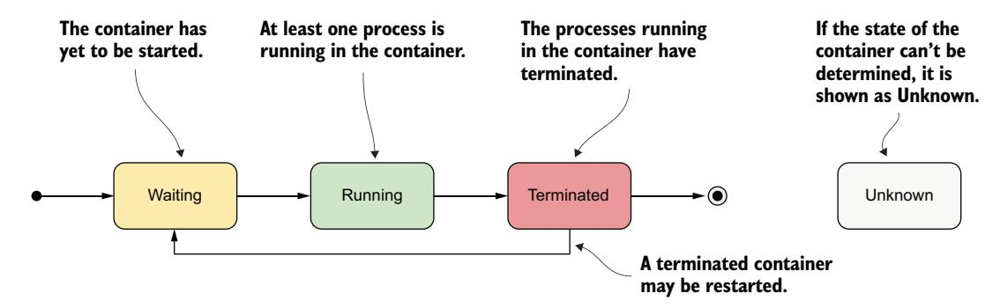
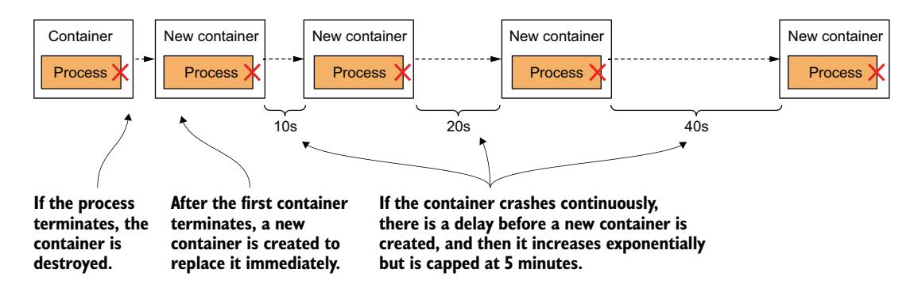
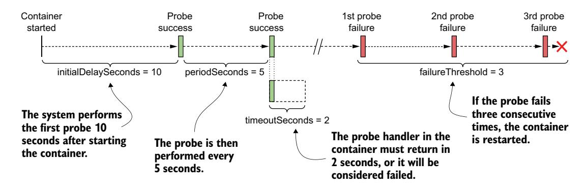
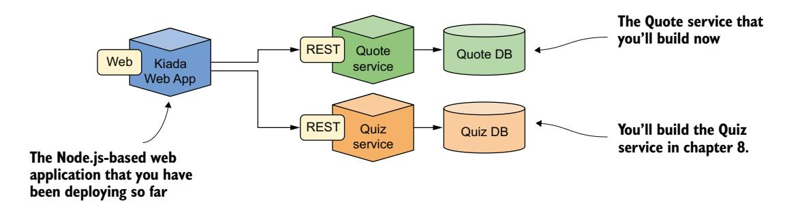
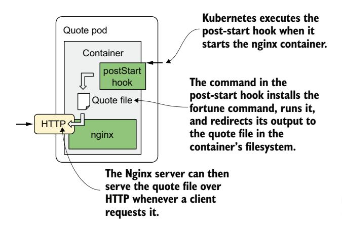
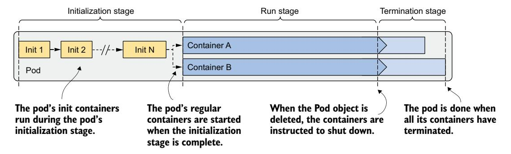
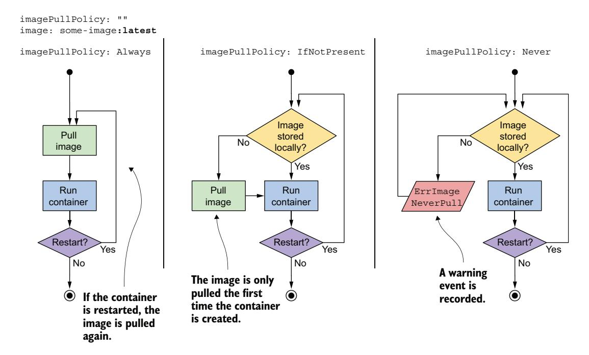
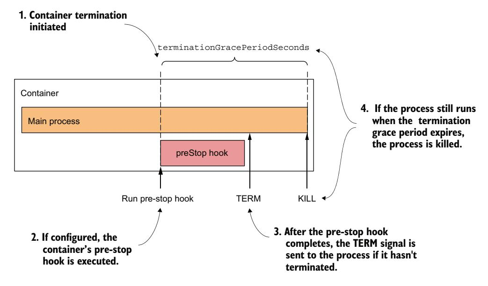
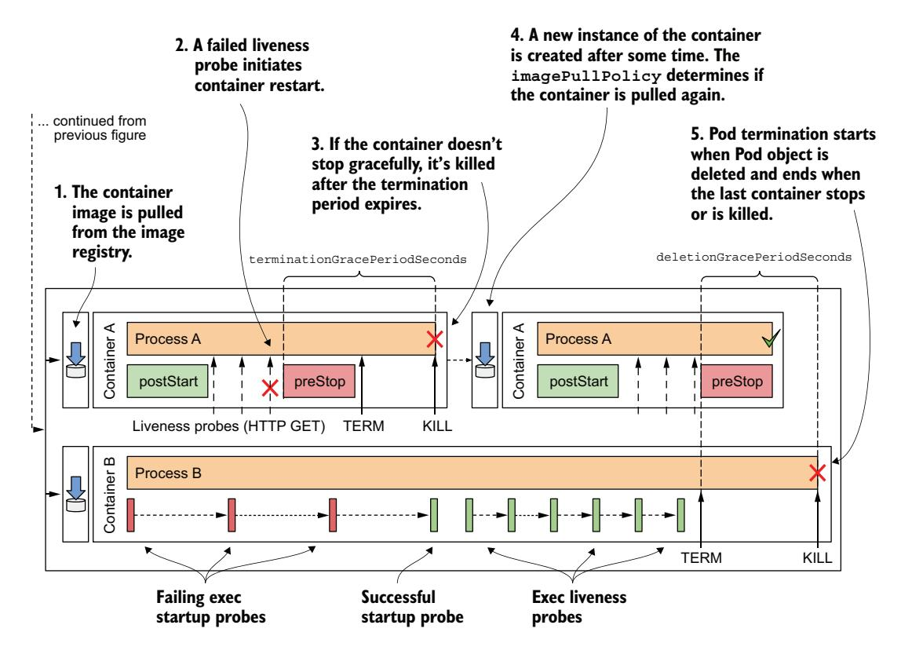

# *Managing the pod life cycle and container health*

# *This chapter covers*

- Inspecting the pod's status
- Keeping containers healthy using liveness probes
- Using lifecycle hooks to perform actions at container startup and shutdown
- The complete life cycle of the pod and its containers

After reading the previous chapter, you should be able to deploy, inspect, and communicate with pods containing one or more containers. This chapter provides a much deeper understanding of how the pod and its containers operate.

NOTE The code files for this chapter are available at [https://mng.bz/oZjD.](https://mng.bz/oZjD)

# *6.1 Understanding the pod's status*

After you create a Pod object and it runs, you can see what's going on with the pod by reading the Pod object back from the API. As discussed in chapter 4, the Pod object manifest, as well as the manifests of most other kinds of objects, contain a section that provides the status of the object. A pod's status section contains the following information:

- The IP addresses of the pod and the worker node that hosts it
- The time the pod was started
- The pod's quality-of-service (QoS) class
- The phase the pod is in
- The conditions of the pod
- The state of its individual containers

The IP addresses and the start time don't need any further explanation, and the QoS class isn't relevant now. However, the phase and conditions of the pod, as well as the states of its containers, are important for understanding the pod life cycle.

# *6.1.1 Understanding the pod phase*

In any moment of its life, a Kubernetes Pod is in one of the five phases shown in the figure 6.1.


Figure 6.1 The phases of a Kubernetes Pod

Table 6.1 explains the meaning of each phase.

Table 6.1 List of phases a pod can be in

| Pod phase | Description                                                                                                                                                                           |
|-----------|---------------------------------------------------------------------------------------------------------------------------------------------------------------------------------------|
| Pending   | The initial phase starts after the Pod object is created. Until the pod is scheduled to a<br>node, and the images of its containers are pulled and started, it remains in this phase. |
| Running   | At least one of the pod's containers is running.                                                                                                                                      |
| Succeeded | Pods that aren't intended to run indefinitely are marked as Succeeded when all their<br>containers complete successfully.                                                             |
| Failed    | When a pod is not configured to run indefinitely and at least one of its containers<br>terminates unsuccessfully, the pod is marked as Failed.                                        |

Table 6.1 List of phases a pod can be in *(continued)*

| Pod phase | Description                                                                                                                                                                                   |
|-----------|-----------------------------------------------------------------------------------------------------------------------------------------------------------------------------------------------|
| Unknown   | The state of the pod is unknown because the Kubelet has stopped reporting communi<br>cating with the API server. Possibly the worker node has failed or has disconnected<br>from the network. |

The pod's phase provides a quick summary of what's happening with the pod. Let's deploy the kiada Pod again and inspect its phase. Create the pod by applying the manifest file to your cluster again, as in the previous chapter (you'll find it in Chapter06/ pod.kiada.yaml):

\$ **kubectl apply -f pod.kiada.yaml**

#### DISPLAYING A POD'S PHASE

The pod's phase is one of the fields in the Pod object's status section. You can see it by displaying its manifest and optionally grepping the output to search for the field:

```
$ kubectl get po kiada -o yaml | grep phase
phase: Running
```

TIP Remember the jq tool? You can use it to print out the value of the phase field like this: kubectl get po kiada -o json | jq .status.phase

You can also see the pod's phase using kubectl describe. The pod's status is shown close to the top of the output:

#### \$ **kubectl describe po kiada**

Name: kiada Namespace: default

**...**

Status: Running

...

Although it may appear that the STATUS column displayed by kubectl get pods also shows the phase, this is only true for pods that are healthy:

#### \$ **kubectl get po kiada** NAME READY STATUS RESTARTS AGE kiada 1/1 Running 0 40m

For unhealthy pods, the STATUS column indicates what's wrong with the pod. We'll discuss this later in this chapter.

# *6.1.2 Understanding pod conditions*

The phase of a pod says little about the condition of the pod. You can learn more by looking at the pod's list of conditions, just like you did for the Node object in chapter 4. A pod's conditions indicate whether a pod has reached a certain state and why.

 In contrast to the phase, a pod has several conditions at the same time. There are four known condition *types* at the time of writing. They are explained in table 6.2.

Table 6.2 List of pod conditions

| Pod condition   | Description                                                                                                                                                                                      |
|-----------------|--------------------------------------------------------------------------------------------------------------------------------------------------------------------------------------------------|
| PodScheduled    | Indicates whether the pod has been scheduled to a node.                                                                                                                                          |
| Initialized     | The pod's init containers have all completed successfully.                                                                                                                                       |
| ContainersReady | All containers in the pod indicate that they are ready. This is a necessary but not<br>sufficient condition for the entire pod to be ready.                                                      |
| Ready           | The pod is ready to provide services to its clients. The containers in the pod and<br>the pod's readiness gates are all reporting that they are ready. Note: This is<br>explained in chapter 11. |

Each condition is either fulfilled or not. As shown in figure 6.2, the PodScheduled and Initialized conditions start as unfulfilled, but they are soon fulfilled and remain so throughout the life of the pod. In contrast, the Ready and ContainersReady conditions can change many times during the pod's lifetime.


Figure 6.2 The transitions of the pod's conditions during its life cycle

Do you remember the conditions you can find in a Node object? They are Memory-Pressure, DiskPressure, PIDPressure, and Ready. As you can see, each object has its own set of condition types, but many contain the generic Ready condition, which typically indicates whether everything is fine with the object.

#### INSPECTING THE POD'S CONDITIONS

To see the conditions of a pod, you can use kubectl describe as shown here:

#### \$ **kubectl describe po kiada** ...

```
Conditions:
 Type Status
 Initialized True 
 Ready True 
 ContainersReady True 
 PodScheduled True 
...
                                   The pod has 
                                   been initialized.
                                  The pod and its 
                                  containers are ready.
                                  The pod has been 
                                  scheduled to a node.
```

The kubectl describe command shows only whether each condition is true. To find out why a condition is false, you must look for the status.conditions field in the pod manifest:

```
$ kubectl get po kiada -o json | jq .status.conditions
[
 {
 "lastProbeTime": null,
 "lastTransitionTime": "2020-02-02T11:42:59Z",
 "status": "True",
 "type": "Initialized"
 },
 ...
```

Each condition has a status field that indicates whether the condition is True, False, or Unknown. In the case of the kiada Pod, the status of all conditions is True, which means they are all fulfilled. The condition can also contain a reason field that specifies a machine-facing reason for the last change of the condition's status, and a message field that explains the change in detail. The lastTransitionTime field shows when the change occurred, while the lastProbeTime indicates when this condition was last checked.

## *6.1.3 Understanding the container status*

Also, the status of the pod contains the status of each of pod containers. Inspecting the status provides better insight into the operation of each individual container.

 The status contains several fields. The state field indicates the container's current state, whereas the lastState field shows the state of the previous container after it has terminated. The container status also indicates the internal ID of the container (containerID), the image and imageID the container is running, whether the container is ready, and how often it has been restarted (restartCount).

#### UNDERSTANDING THE CONTAINER STATE

The most important part of a container's status is its state. A container can be in one of the states shown in figure 6.3.



Figure 6.3 The possible states of a container

Individual states are explained in table 6.3.

Table 6.3 Possible container states

| Container state | Description                                                                                                                                                                                                                                                       |
|-----------------|-------------------------------------------------------------------------------------------------------------------------------------------------------------------------------------------------------------------------------------------------------------------|
| Waiting         | The container is waiting to be started. The reason and message fields indicate why<br>the container is in this state.                                                                                                                                             |
| Running         | The container has been created, and processes are running in it. The startedAt<br>field indicates the time at which this container was started.                                                                                                                   |
| Terminated      | The processes that had been running in the container have terminated. The<br>startedAt and finishedAt fields indicate when the container was started and<br>when it terminated. The exit code with which the main process terminated is in the<br>exitCode field. |
| Unknown         | The state of the container couldn't be determined.                                                                                                                                                                                                                |

#### DISPLAYING THE STATUS OF THE POD'S CONTAINERS

The pod list displayed by kubectl get pods shows only the number of containers in each pod and how many of them are ready. To see the status of individual containers, you can use kubectl describe:

#### \$ **kubectl describe po kiada**

```
...
Containers:
 kiada:
 Container ID: docker://c64944a684d57faacfced0be1af44686...
 Image: luksa/kiada:0.1
 Image ID: docker-pullable://luksa/kiada@sha256:3f28...
 Port: 8080/TCP
 Host Port: 0/TCP
 State: Running 
 Started: Sun, 02 Feb 2020 12:43:03 +0100 
 Ready: True 
                                                 The current state of the container 
                                                 and when it was started
                                             Whether the container is
```

**ready to provide its services**

```
 Restart Count: 0 
 Environment: <none>
...
                                      The number of times the 
                                      container has been restarted
```

Focus on the annotated lines in the listing, as they indicate whether the container is healthy. The kiada container is Running and is Ready. It was never restarted.

TIP You can also display the container status(es) using jq like this: kubectl get po kiada -o json | jq .status.containerStatuses.

#### INSPECTING THE STATUS OF AN INIT CONTAINER

In the previous chapter, you learned that in addition to regular containers, a pod can also have init containers that run when the pod starts. As with regular containers, the status of these containers is available in the status section of the Pod object manifest, but in the initContainerStatuses field.

#### Inspecting the status of the kiada-init Pod

As an additional exercise you can try on your own, create the kiada-init Pod from the previous chapter and inspect its phase, conditions, and the status of its two regular and two init containers. Use the kubectl describe command and the kubectl get po kiada-init -o json | jq .status command to find the information in the object definition.

# *6.2 Keeping containers healthy*

The pods you created in the previous chapter ran without any problems. But what if one of the containers dies? What if all the containers in a pod die? How do you keep the pods healthy and their containers running? That's the focus of this section.

# *6.2.1 Understanding container auto-restart*

When a pod is scheduled to a node, the Kubelet on that node starts its containers and from then on keeps them running for as long as the Pod object exists. If the main process in the container terminates for any reason, the Kubelet restarts the container. If an error in your application causes it to crash, Kubernetes automatically restarts it, so even without doing anything special in the application itself, running it in Kubernetes automatically gives the app an ability to heal itself.

#### OBSERVING A CONTAINER FAILURE

In the previous chapter, you created the kiada-ssl Pod, which contains the Node.js and the Envoy containers. Create the pod again and enable communication with the pod by running the following two commands:

```
$ kubectl apply -f pod.kiada-ssl.yaml
$ kubectl port-forward kiada-ssl 8080 8443 9901
```

You'll now make the Envoy container terminate to see how Kubernetes deals with the situation. Run the following command in a separate terminal so you can see how the pod's status changes when one of its containers terminates:

#### \$ **kubectl get pods -w**

You'll also want to watch events in another terminal using the following command:

#### \$ **kubectl get events -w**

You could emulate a crash of the container's main process by sending it the KILL signal, but you can't do this from inside the container because the Linux Kernel doesn't let you kill the root process (the process with PID 1). You would have to SSH to the pod's host node and kill the process from there. Fortunately, Envoy's administration interface allows you to stop the process via its HTTP API.

 To terminate the envoy container, open the URL http://localhost:9901 in your browser and click the *quitquitquit* button or run the following curl command in another terminal:

#### \$ **curl -X POST http://localhost:9901/quitquitquit** OK

To see what happens with the container and the pod it belongs to, examine the output of the kubectl get pods -w command you ran earlier. This is its output:

| \$ kubectl get po -w |       |          |          |       |
|----------------------|-------|----------|----------|-------|
| NAME                 | READY | STATUS   | RESTARTS | AGE   |
| kiada-ssl            | 2/2   | Running  | 0        | 1s    |
| kiada-ssl            | 1/2   | NotReady | 0        | 9m33s |
| kiada-ssl            | 2/2   | Running  | 1        | 9m34s |

The pod's STATUS changes from Running to NotReady, while the READY column indicates that only one of the two containers is ready. Immediately thereafter, Kubernetes restarts the container, and the pod's STATUS returns to Running. The RESTARTS column indicates that one container has been restarted.

NOTE If one of the pod's containers fails, the other containers continue to run.

Now examine the output of the kubectl get events -w command you ran earlier. Here's the command and its output:

| \$ kubectl get ev -w |        |         |               |                                               |  |  |  |
|----------------------|--------|---------|---------------|-----------------------------------------------|--|--|--|
| LAST SEEN            | TYPE   | REASON  | OBJECT        | MESSAGE                                       |  |  |  |
| 0s                   | Normal | Pulled  | pod/kiada-ssl | Container image already<br>present on machine |  |  |  |
| 0s                   | Normal | Created | pod/kiada-ssl | Created container envoy                       |  |  |  |
| 0s                   | Normal | Started | pod/kiada-ssl | Started container envoy                       |  |  |  |

The events show that the new envoy container has been started. You should be able to access the application via HTTPS again. Confirm with your browser or curl.

 The events in the listing also expose an important detail about how Kubernetes restarts containers. The second event indicates that the entire envoy container has been recreated. Kubernetes never restarts a container, but instead discards it and creates a new container. Regardless, we call this *restarting* a container.

NOTE Any data that the process writes to the container's filesystem is lost when the container is recreated. This behavior is sometimes undesirable. To persist data, you must add a storage volume to the pod, as explained in the next chapter.

NOTE If init containers are defined in the pod, and one of the pod's regular containers is restarted, the init containers are not executed again.

#### CONFIGURING THE POD'S RESTART POLICY

By default, Kubernetes restarts the container regardless of whether the process in the container exits with a zero or non-zero exit code, that is, whether the container completes successfully or fails. This behavior can be changed by setting the restartPolicy field in the pod's spec.

There are three restart policies. They are presented in figure 6.4.


Figure 6.4 The pod's **restartPolicy** determines whether its containers are restarted.

Table 6.4 describes the three restart policies.

Table 6.4 Pod restart policies

| Restart policy | Description                                                                                                                              |
|----------------|------------------------------------------------------------------------------------------------------------------------------------------|
| Always         | Container is restarted regardless of the exit code the process in the container termi<br>nates with. This is the default restart policy. |
| OnFailure      | The container is restarted only if the process terminates with a non-zero exit code,<br>which by convention indicates failure.           |
| Never          | The container is never restarted, not even when it fails.                                                                                |

NOTE Surprisingly, the restart policy is configured at the pod level and applies to all its containers. It can't be configured for each container individually.

#### UNDERSTANDING THE TIME DELAY INSERTED BEFORE A CONTAINER IS RESTARTED

If you call Envoy's /quitquitquit endpoint several times, you'll notice that each time, it takes longer to restart the container after it terminates. The pod's status is displayed as either NotReady or CrashLoopBackOff. Here's what it means.

 As shown in figure 6.5, the first time a container terminates, it is restarted immediately. The next time, however, Kubernetes waits 10 seconds before restarting it. This delay is then doubled to 20, 40, 80, and then to 160 seconds after each subsequent termination. From then on, the delay is kept at 5 minutes. This delay, which doubles between attempts, is called *exponential back-off*.



Figure 6.5 Exponential back-off between container restarts

In the worst case, a container can therefore be prevented from starting for up to 5 minutes.

NOTE The delay is reset to zero when the container has run successfully for 10 minutes. If the container must be restarted later, it is restarted immediately.

Check the container status in the pod manifest as follows:

```
$ kubectl get po kiada-ssl -o json | jq .status.containerStatuses
...
"state": {
 "waiting": {
 "message": "back-off 40s restarting failed container=envoy ...",
 "reason": "CrashLoopBackOff"
```

As you can see in the output, while the container is waiting to be restarted, its state is Waiting, and the reason is CrashLoopBackOff. The message field tells you how long it will take for the container to be restarted.

NOTE When you tell Envoy to terminate, it terminates with exit code zero, which means it hasn't crashed. The CrashLoopBackOff status can therefore be misleading.

#### *6.2.2 Checking the container's health using liveness probes*

In the previous section, you learned that Kubernetes keeps your application healthy by restarting it when its process terminates. But applications can also become unresponsive without terminating. For example, a Java application with a memory leak eventually starts spewing out OutOfMemoryErrors, but its JVM process continues to run. Ideally, Kubernetes should detect this kind of error and restart the container.

 The application could catch these errors by itself and immediately terminate, but what about the situations where your application stops responding because it gets into an infinite loop or deadlock? What if the application can't detect this? To ensure that the application is restarted in such cases, it may be necessary to check its state from the outside.

#### INTRODUCING LIVENESS PROBES

Kubernetes can be configured to check whether an application is still alive by defining a *liveness probe*. You can specify a liveness probe for each container in the pod. Kubernetes runs the probe periodically to ask the application if it's still alive and well. If the application doesn't respond, an error occurs, or the response is negative, the container is considered unhealthy and is terminated. The container is then restarted if the restart policy allows it.

NOTE Liveness probes can only be used in the pod's regular containers. They can't be defined in init containers.

#### TYPES OF LIVENESS PROBES

Kubernetes can probe a container with one of the following three mechanisms:

- *An HTTP GET probe sends a GET request to the container's IP address, on the network port and path you specify.* If the probe receives a response, and the response code doesn't represent an error (i.e., if the HTTP response code is 2xx or 3xx), the probe is considered successful. If the server returns an error response code, or if it doesn't respond in time, the probe is considered to have failed.
- *A TCP Socket probe attempts to open a TCP connection to the specified port of the container.* If the connection is successfully established, the probe is considered successful. If the connection can't be established in time, the probe is considered failed.
- *An Exec probe executes a command inside the container and checks the exit code it terminates with.* If the exit code is zero, the probe is successful. A non-zero exit code is considered a failure. The probe is also considered to have failed if the command fails to terminate in time.

NOTE In addition to a liveness probe, a container may also have a *startup* probe, which is discussed in section 6.2.6, and a *readiness* probe, which is explained in chapter 11.

# *6.2.3 Creating an HTTP GET liveness probe*

Let's look at how to add a liveness probe to each of the containers in the kiada-ssl Pod. Because they both run applications that understand HTTP, it makes sense to use an HTTP GET probe in each. The Node.js application doesn't provide any endpoints to explicitly check the health of the application, but the Envoy proxy does. In realworld applications, you'll encounter both cases.

#### DEFINING LIVENESS PROBES IN THE POD MANIFEST

The following listing shows an updated manifest for the pod, which defines a liveness probe for each of the two containers, with different levels of configuration (file pod.kiada-liveness.yaml).

#### Listing 6.1 Adding a liveness probe to a pod

```
apiVersion: v1
kind: Pod
metadata:
 name: kiada-liveness
spec:
 containers:
 - name: kiada
 image: luksa/kiada:0.1
 ports:
 - name: http
 containerPort: 8080
 livenessProbe: 
 httpGet: 
 path: / 
 port: 8080 
 - name: envoy
 image: luksa/kiada-ssl-proxy:0.1
 ports:
 - name: https
 containerPort: 8443
 - name: admin
 containerPort: 9901
 livenessProbe: 
 httpGet: 
 path: /ready 
 port: admin 
 initialDelaySeconds: 10 
 periodSeconds: 5 
 timeoutSeconds: 2 
 failureThreshold: 3 
                            The liveness probe definition for 
                            the container running Node.js
                                 The liveness probe 
                                 for the Envoy proxy
```

These liveness probes are explained in the next two sections.

#### DEFINING A LIVENESS PROBE USING THE MINIMUM REQUIRED CONFIGURATION

The liveness probe for the kiada container is the simplest version of a probe for HTTP-based applications. The probe simply sends an HTTP GET request for the path / on port 8080 to determine whether the container can still serve requests. If the application responds with an HTTP status between 200 and 399, the application is considered healthy.

The probe doesn't specify any other fields, so the default settings are used. The first request is sent 10 seconds after the container starts and is repeated every 5 seconds. If the application doesn't respond within 2 seconds, the probe attempt is considered failed. If it fails three times in a row, the container is considered unhealthy and is terminated.

#### UNDERSTANDING LIVENESS PROBE CONFIGURATION OPTIONS

The administration interface of the Envoy proxy provides the special endpoint /ready through which it exposes its health status. Instead of targeting port 8443, which is the port through which Envoy forwards HTTPS requests to Node.js, the liveness probe for the envoy container targets this special endpoint on the admin port, which is port number 9901.

**NOTE** As you can see in the envoy container's liveness probe, you can specify the probe's target port by name instead of by number.

The liveness probe for the envoy container also contains additional fields. These are explained in figure 6.6.



Figure 6.6 The configuration and operation of a liveness probe

The parameter initialDelaySeconds determines how long Kubernetes should delay the execution of the first probe after starting the container. The periodSeconds field specifies the amount of time between the execution of two consecutive probes, whereas the timeoutSeconds field specifies how long to wait for a response before the probe attempt counts as failed. The failureThreshold field specifies how many times the probe must fail for the container to be considered unhealthy and potentially restarted.

#### *6.2.4 Observing the liveness probe in action*

To see Kubernetes restart a container when its liveness probe fails, create the pod from the pod.kiada-liveness.yaml manifest file using kubectl apply, and run kubectl port-forward to enable communication with the pod. You'll need to stop the kubectl port-forward command still running from the previous exercise. Confirm that the pod is running and is responding to HTTP requests.

#### OBSERVING A SUCCESSFUL LIVENESS PROBE

The liveness probes for the pod's containers start firing soon after the start of each individual container. Since the processes in both containers are healthy, the probes continuously report success. As this is the normal state, the fact that the probes are successful is not explicitly indicated anywhere in the status of the pod nor in its events.

 The only indication that Kubernetes is executing the probe is found in the container logs. The Node.js application in the kiada container prints a line to the standard output every time it handles an HTTP request. This includes the liveness probe requests, so you can display them using the following command:

#### \$ **kubectl logs kiada-liveness -c kiada -f**

The liveness probe for the envoy container is configured to send HTTP requests to Envoy's administration interface, which doesn't log HTTP requests to the standard output, but to the file /tmp/envoy.admin.log in the container's filesystem. To display the log file, you use the following command:

```
$ kubectl exec kiada-liveness -c envoy -- tail -f /tmp/envoy.admin.log
```

#### OBSERVING THE LIVENESS PROBE FAIL

A successful liveness probe isn't interesting, so let's cause Envoy's liveness probe to fail. To see what will happen behind the scenes, start watching events by executing the following command in a separate terminal:

#### \$ **kubectl get events -w**

Using Envoy's administration interface, you can configure its health check endpoint to succeed or fail. To make it fail, open URL http://localhost:9901 in your browser and click the *healthcheck/fail* button, or use the following curl command:

#### \$ **curl -X POST localhost:9901/healthcheck/fail**

Immediately after executing the command, observe the events that are displayed in the other terminal. When the probe fails, a Warning event is recorded, indicating the error and the HTTP status code returned:

Warning Unhealthy Liveness probe failed: HTTP probe failed with code 503

Because the probe's failureThreshold is set to three, a single failure is not enough to consider the container unhealthy, so it continues to run. You can make the liveness probe succeed again by clicking the *healthcheck/ok* button in Envoy's admin interface, or by using curl as follows:

#### \$ **curl -X POST localhost:9901/healthcheck/ok**

If you are fast enough, the container won't be restarted.

#### OBSERVING THE LIVENESS PROBE REACH THE FAILURE THRESHOLD

If you let the liveness probe fail multiple times, the kubectl get events -w command should print the following events (note that some columns are omitted due to page width constraints):

```
$ kubectl get events -w
TYPE REASON MESSAGE
Warning Unhealthy Liveness probe failed: HTTP probe failed with code 503 
Warning Unhealthy Liveness probe failed: HTTP probe failed with code 503 
Warning Unhealthy Liveness probe failed: HTTP probe failed with code 503 
Normal Killing Container envoy failed liveness probe, will be restarted
Normal Pulled Container image already present on machine
Normal Created Created container envoy
Normal Started Started container envoy
                                                               The liveness probe
                                                                 fails three times.
                                                                    When the failure
                                                              threshold is reached, the
                                                                container is restarted.
```

Remember that the probe failure threshold is set to three, so when the probe fails three times in a row, the container is stopped and restarted. This is indicated by the events in the listing.

The kubectl get pods command shows that the container has been restarted:

```
$ kubectl get po kiada-liveness
NAME READY STATUS RESTARTS AGE
kiada-liveness 2/2 Running 1 5m
```

The RESTARTS column shows that one container restart has taken place in the pod.

#### UNDERSTANDING HOW A CONTAINER THAT FAILS ITS LIVENESS PROBE IS RESTARTED

If you're wondering whether the main process in the container was stopped gracefully or killed forcibly, you can check the pod's status by retrieving the full manifest using kubectl get or using kubectl describe:

```
$ kubectl describe po kiada-liveness
Name: kiada-liveness
...
Containers:
 ...
 envoy:
 ...
 State: Running 
 Started: Sun, 31 May 2020 21:33:13 +0200 
                                                     This is the state of 
                                                     the new container.
```

```
 Last State: Terminated 
 Reason: Completed 
 Exit Code: 0 
 Started: Sun, 31 May 2020 21:16:43 +0200 
 Finished: Sun, 31 May 2020 21:33:13 +0200 
                                                    The previous 
                                                    container terminated 
                                                    with exit code 0.
```

The exit code zero shown in the listing implies that the application process gracefully exited on its own. Had it been killed, the exit code would have been 137.

NOTE Exit code 128+n indicates that the process exited due to external signal n. Exit code 137 is 128+9, where 9 represents the KILL signal. You'll see this exit code whenever the container is killed. Exit code 143 is 128+15, where 15 is the SIGTERM signal. You'll typically see this exit code when the container runs a shell that has terminated gracefully.

Examine Envoy's log to confirm that it caught the SIGTERM signal and has terminated by itself. You must use the kubectl logs command with the --container or the shorter -c option to specify what container you're interested in.

 Also, because the container has been replaced with a new one due to the restart, you must request the log of the previous container using the --previous or -p flag. Here's the command to use and the last four lines of its output:

```
$ kubectl logs kiada-liveness -c envoy -p
```

...

```
...
...[warning][main] [source/server/server.cc:493] caught SIGTERM
...[info][main] [source/server/server.cc:613] shutting down server instance
...[info][main] [source/server/server.cc:560] main dispatch loop exited
...[info][main] [source/server/server.cc:606] exiting
```

The log confirms that Kubernetes sent the SIGTERM signal to the process, allowing it to shut down gracefully. Had it not terminated by itself, Kubernetes would have killed it forcibly.

 After the container is restarted, its health check endpoint responds with HTTP status 200 OK again, indicating that the container is healthy.

# *6.2.5 Using the exec and the tcpSocket liveness probe types*

For applications that don't expose HTTP health-check endpoints, the tcpSocket or the exec liveness probes should be used.

#### ADDING A TCPSOCKET LIVENESS PROBE

For applications that accept non-HTTP TCP connections, a tcpSocket liveness probe can be configured. Kubernetes tries to open a socket to the TCP port and if the connection is established, the probe is considered a success; otherwise, it's considered a failure.

An example of a tcpSocket liveness probe is shown here:

```
livenessProbe:
tcpSocket:
port: 1234
periodSeconds: 2
failureThreshold: 1

This tcpSocket probe\nuses TCP port 1234.

The probe runs every 2 seconds.

A single probe failure is enough
to restart the container.
```

The probe in the listing is configured to check whether the container's network port 1234 is open. An attempt to establish a connection is made every 2 seconds, and a single failed attempt is enough to consider the container as unhealthy.

#### **ADDING AN EXEC LIVENESS PROBE**

Applications that do not accept TCP connections may provide a command to check their status. For these applications, an exec liveness probe is used. As shown in figure 6.7, the command is executed inside the container and must therefore be available on the container's file system.


Figure 6.7 The exec liveness probe runs the command inside the container.

The following is an example of a probe that runs /usr/bin/healthcheck every 2 seconds to determine whether the application running in the container is still alive:

# livenessProbe: exec: command: - /usr/bin/healthcheck periodSeconds: 2 timeoutSeconds: 1 failureThreshold: 1 A single probe failure is enough to restart the container.

If the command returns exit code zero, the container is considered healthy. If it returns a non-zero exit code or fails to complete within 1 second as specified in the timeoutSeconds field, the container is terminated immediately, as configured in the failureThreshold field, which indicates that a single probe failure is sufficient to consider the container unhealthy.

# *6.2.6 Using a startup probe when an application is slow to start*

The default liveness probe settings give the application between 20 and 30 seconds to start responding to liveness probe requests. If the application takes longer, it is restarted and must start again. If the second start also takes as long, it is restarted again. If this continues, the container never reaches the state where the liveness probe succeeds and gets stuck in an endless restart loop.

 To prevent this, you can increase the initialDelaySeconds, periodSeconds, or failureThreshold settings to account for the long start time, but this will have a negative effect on the normal operation of the application. The higher the result of periodSeconds \* failureThreshold, the longer it takes to restart the application if it becomes unhealthy. For applications that take minutes to start, increasing these parameters enough to prevent the application from being restarted prematurely may not be a viable option.

#### INTRODUCING STARTUP PROBES

To deal with the discrepancy between the start and the steady-state operation of an application, Kubernetes also provides *startup probes*.

 If a startup probe is defined for a container, only the startup probe is executed when the container is started. The startup probe can be configured to consider the slow start of the application. When the startup probe succeeds, Kubernetes switches to using the liveness probe, which is configured to quickly detect when the application becomes unhealthy.

#### ADDING A STARTUP PROBE TO A POD'S MANIFEST

Imagine that the Kiada Node.js application needs more than a minute to warm up, but you want it to be restarted within 10 seconds when it becomes unhealthy during normal operation. The following listing shows how you configure the startup and liveness probes (you can find it in the file pod.kiada-startup-probe.yaml).

#### Listing 6.2 Using a combination of a startup and a liveness probe

```
...
 containers:
 - name: kiada
 image: luksa/kiada:0.1
 ports:
 - name: http
 containerPort: 8080
 startupProbe:
 httpGet:
 path: / 
 port: http 
 periodSeconds: 10 
 failureThreshold: 12 
 livenessProbe:
 httpGet:
                                  The startup and the liveness probes 
                                  typically use the same endpoint.
                                The application gets 120 seconds to start.
```

```
path: /
port: http
periodSeconds: 5
failureThreshold: 2

The startup and the liveness probes
typically use the same endpoint.

After startup, the application's health is checked\nevery 5 seconds, and the application is restarted
when it fails the liveness probe twice.
```

When the container defined in the listing starts, the application has 120 seconds to start responding to requests. Kubernetes performs the startup probe every 10 seconds and makes a maximum of 12 attempts.

As shown in figure 6.8, unlike liveness probes, it's perfectly normal for a startup probe to fail. Failure only indicates that the application hasn't yet been completely started. A successful startup probe indicates that the application has started successfully, and Kubernetes should switch to the liveness probe. The liveness probe is then typically executed using a shorter period, which allows for faster detection of nonresponsive applications.


Figure 6.8 Fast detection of application health problems using a combination of startup and liveness probe

**NOTE** If the startup probe fails often enough to reach the failureThreshold, the container is terminated as if the liveness probe had failed.

Usually, the startup and liveness probes are configured to use the same HTTP endpoint, but different endpoints can be used. You can also configure the startup probe as an exec or tcpSocket probe instead of an httpGet probe.

# **6.2.7** Creating effective liveness probe handlers

You should define a liveness probe for all your pods. Without one, Kubernetes has no way of knowing whether your app is still alive, apart from checking whether the application process has terminated.

#### CAUSING UNNECESSARY RESTARTS WITH BADLY IMPLEMENTED LIVENESS PROBE HANDLERS

When you implement a handler for the liveness probe, either as an HTTP endpoint in your application or as an additional executable command, be very careful to implement it correctly. If a poorly implemented probe returns a negative response even though the application is healthy, the application will be restarted unnecessarily. Many Kubernetes users learn this the hard way. If you can make sure that the application process terminates by itself when it becomes unhealthy, it may be safer not to define a liveness probe.

#### WHAT A LIVENESS PROBE SHOULD CHECK

The liveness probe for the kiada container isn't configured to call an actual healthcheck endpoint, but it only checks that the Node.js server responds to simple HTTP requests for the root URI. This may seem overly simple, but even such a liveness probe works wonders because it causes a restart of the container if the server no longer responds to HTTP requests, which is its main task. If no liveness probe were defined, the pod would remain in an unhealthy state where it doesn't respond to any requests and would have to be restarted manually. A simple liveness probe like this is better than nothing.

 To provide a better liveness check, web applications typically expose a specific health-check endpoint, such as /healthz. When this endpoint is called, the application performs an internal status check of all the major components running within the application to ensure that none of them have died or are no longer doing what they should.

TIP Make sure that the /healthz HTTP endpoint doesn't require authentication, or the probe will always fail, causing your container to be restarted continuously.

Make sure that the application checks only the operation of its internal components and nothing that is influenced by an external factor. For example, the health-check endpoint of a frontend service should never respond with failure when it can't connect to a backend service. If the backend service fails, restarting the frontend will not solve the problem. Such a liveness probe will fail again after the restart, so the container will be restarted repeatedly until the backend is repaired. If there are many services interdependent in this way, the failure of a single service can result in cascading failures across the entire system.

#### KEEPING PROBES LIGHT

The handler invoked by a liveness probe shouldn't use too much computing resources and shouldn't take too long to complete. By default, probes are executed relatively often and only given a second to complete.

 Using a handler that consumes a lot of CPU or memory can seriously affect the main process of your container. Later in the book, you'll learn how to limit the CPU time and total memory available to a container. The CPU and memory consumed by the probe handler invocation count toward the resource quota of the container, so using a resource-intensive handler will reduce the CPU time available to the main process of the application.

TIP When running a Java application in your container, you may want to use an HTTP GET probe instead of an exec liveness probe that starts an entire JVM. The same applies to commands that require considerable computing resources.

#### AVOIDING RETRY LOOPS IN YOUR PROBE HANDLERS

You've learned that the failure threshold for the probe is configurable. Instead of implementing a retry loop in your probe handlers, keep it simple and instead set the failureThreshold field to a higher value so that the probe must fail several times before the application is considered unhealthy. Implementing your own retry mechanism in the handler is a waste of effort and represents another potential point of failure.

# *6.3 Executing actions at container start-up and shutdown*

In the previous chapter, you learned that it is possible to use init containers to run containers at the start of the pod life cycle. You may also want to run additional processes every time a container starts and just before it stops. You can do this by adding *lifecycle hooks* to the container. Two types of hooks are currently supported:

- *Post-start hooks*—Executed when the container starts
- *Pre-stop hooks*—Executed shortly before the container stops

These lifecycle hooks are specified per container, as opposed to init containers, which are specified at the pod level. Figure 6.9 illustrates how lifecycle hooks fit into the life cycle of a container.


Figure 6.9 How the post-start and pre-stop hook fit into the container's life cycle

Like liveness probes, lifecycle hooks can be used to either execute a command inside the container, or send an HTTP GET request to the application in the container.

NOTE As with liveness probes, lifecycle hooks can only be applied to regular containers and not init containers. Unlike probes, lifecycle hooks do not support tcpSocket handlers.

Let's take a look at the two types of hooks individually to see what they can be used for.

# *6.3.1 Using post-start hooks to perform actions when the container starts*

The post-start lifecycle hook is invoked immediately after the container is created. You can use the exec type of the hook to execute an additional process as the main process starts, or you can use the httpGet hook to send an HTTP request to the application running in the container to perform some type of initialization or warm-up procedure.

 If you're the author of the application, you could perform the same operation within the application code itself, but if you need to add it to an existing application that you didn't create yourself, you may not be able to do so. A post-start hook provides a simple alternative that doesn't require you to change the application or its container image.

Here is an example of how a post-start hook can be used in a new service you'll create.

#### INTRODUCING THE QUOTE SERVICE

You may remember from section 2.2.1 that the final version of the Kubernetes in Action Demo Application (Kiada) Suite will contain the Quote and Quiz services in addition to the Node.js application. The data from those two services will be used to show a random quote from the book and a multiple-choice pop quiz to help you test your Kubernetes knowledge. To refresh your memory, figure 6.10 shows the three components that make up the Kiada Suite.



Figure 6.10 The Kubernetes in Action Demo Application Suite

During my first steps with Unix in the 1990s, one of the things I found most amusing was the random, sometimes funny message that the fortune command displayed every time I logged into our high school's Sun Ultra server. Nowadays, you'll rarely see the fortune command installed on Unix/Linux systems anymore, but you can still install it and run it whenever you're bored. Here's an example of what it may display:

#### \$ **fortune**

Dinner is ready when the smoke alarm goes off.

The command gets the quotes from files that are packaged with it, but you can also use your own file(s). So why not use fortune to build the Quote service? Instead of using the default files, I'll provide a file with quotes from this book.

 But there is a caveat. The fortune command prints to the standard output. It can't serve the quote over HTTP. However, this isn't a hard problem to solve. We can combine the fortune program with a web server such as Nginx to get the result we want.

#### USING A POST-START CONTAINER LIFECYCLE HOOK TO RUN A COMMAND IN THE CONTAINER

For the first version of the service, the container will run the fortune command when it starts up. The output will be redirected to a file in Nginx' web-root directory so that it can serve it. Although this means that the same quote is returned to every request, this is a perfectly good start. You'll later improve the service iteratively.

 The Nginx web server is available as a container image, so let's use it. Because the fortune command is not available in the image, you'd normally build a new image that uses that image as the base and installs the fortune package on top of it. But we'll keep things even simpler for now.

 Instead of building a completely new image, you'll use a post-start hook to install the fortune software package, download the file containing the quotes from this book, and finally run the fortune command and write its output to a file that Nginx can serve. The operation of the quote-poststart Pod is presented in figure 6.11.



Figure 6.11 The operation of the **quote-poststart** Pod

The following listing shows how to define the hook (file pod.quote-poststart.yaml).

#### Listing 6.3 Pod with a post-start lifecycle hook

apiVersion: v1 kind: Pod metadata: name: quote-poststart spec: containers: **The name of this pod is quote-poststart.**

 - name: nginx image: nginx:alpine

**The nginx:alpine container image is used in this single-container pod.**

```
 ports: 
 - name: http 
 containerPort: 80 
 lifecycle: 
 postStart: 
 exec: 
 command: 
 - sh 
 - -c 
 - | 
 apk add fortune && \ 
 curl -O https://luksa.github.io/kiada/book-quotes.txt && \ 
 curl -O https://luksa.github.io/kiada/book-quotes.txt.dat && \ 
 fortune book-quotes.txt > /usr/share/nginx/html/quote 
                           The Nginx server 
                           runs on port 80.
                             A post-start lifecycle hook is 
                             used to run a command when 
                             the container starts.
                                                       This is the command.
                                                         This is its first argument.
                                                           The second argument is the 
                                                           multi-line string that follows.
                                          The second argument consists of these lines.
```

The YAML in the listing is not simple, so let me make sense of it. First, the easy parts. The pod is named quote-poststart and contains a single container based on the nginx:alpine image. A single port is defined in the container. A postStart lifecycle hook is also defined for the container. It specifies what command to run when the container starts. The tricky part is the definition of this command, but I'll break it down for you.

 It's a list of commands that are passed to the sh command as an argument. This is because multiple commands cannot be defined in a lifecycle hook. The solution is to invoke a shell as the main command and let it run the list of commands by specifying them in the command string:

```
sh -c "the command string"
```

In the previous listing, the third argument (the command string) is rather long, so it must be specified over multiple lines to keep the YAML legible. Multi-line string values in YAML can be defined by typing a pipeline character followed by properly indented lines. The command string in the previous listing is therefore as follows:

```
apk add fortune && \
curl -O https://luksa.github.io/kiada/book-quotes.txt && \
curl -O https://luksa.github.io/kiada/book-quotes.txt.dat && \
fortune book-quotes.txt > /usr/share/nginx/html/quote
```

As you can see, the command string consists of four commands. Here's what they do:

- The apk add fortune command runs the Alpine Linux package management tool, which is part of the image that nginx:alpine is based on, to install the fortune package in the container.
- The first curl command downloads the book-quotes.txt file.
- The second curl command downloads the book-quotes.txt.dat file.
- The fortune command selects a random quote from the book-quotes.txt file and prints it to standard output. That output is redirected to the /usr/share/ nginx/html/quote file.

The lifecycle hook command runs parallel to the main process. The postStart name is somewhat misleading, because the hook isn't executed after the main process is fully started, but as soon as the container is created, at around the same time the main process starts.

 When the postStart hook in this example completes, the quote produced by the fortune command is stored in the /usr/share/nginx/html/quote file and can be served by Nginx.

 Use the kubectl apply command to create the pod from the pod.quote-poststart.yaml file, and you should then be able to use curl or your browser to get the quote at URI /quote on port 80 of the quote-poststart Pod. You've already learned how to use the kubectl port-forward command to open a tunnel to the container, but you may want to refer to the sidebar because a caveat exists.

# Accessing the quote-poststart Pod

To retrieve the quote from the quote-poststart Pod, you must first run the kubectl port-forward command, which may fail as shown here:

#### \$ **kubectl port-forward quote-poststart 80**

```
Unable to listen on port 80: Listeners failed to create with the 
     following errors: [unable to create listener: Error listen tcp4 
     127.0.0.1:80: bind: permission denied unable to create listener: 
     Error listen tcp6 [::1]:80: bind: permission denied]
error: unable to listen on any of the requested ports: [{80 80}]
```

The command fails if your operating system doesn't allow you to run processes that bind to port numbers 0–1023. To fix this, you must use a higher local port number as follows:

```
$ kubectl port-forward quote-poststart 1080:80
```

The last argument tells kubectl to use port 1080 locally and forward it to port 80 of the pod. You can now access the Quote service at http://localhost:1080/quote.

If everything works as intended, the Nginx server will return a random quote from this book as in the following example:

#### \$ **curl localhost:1080/quote**

```
The same as with liveness probes, lifecycle hooks can only be applied to 
     regular containers and 
not to init containers. Unlike probes, lifecycle hooks do not support tcp-
     Socket handlers.
```

The first version of the Quote service is now done, but you'll improve it in the next chapter. Now let's learn about the caveats of using post-start hooks before we move on.

#### UNDERSTANDING HOW A POST-START HOOK AFFECTS THE CONTAINER

Although the post-start hook runs asynchronously with the main container process, it affects the container in two ways. First, the container remains in the Waiting state with the reason ContainerCreating until the hook invocation is completed. The phase of the pod is Pending. If you run the kubectl logs command at this point, it refuses to show the logs, even though the container is running. The kubectl port-forward command also refuses to forward ports to the pod.

 If you want to see this for yourself, deploy the pod.quote-poststart-slow.yaml Pod manifest file. It defines a post-start hook that takes 60 seconds to complete. Immediately after the pod is created, inspect its state and display the logs with the following command:

```
 $ kubectl logs quote-poststart-slow
Error from server (BadRequest): container "nginx" in pod "quote-poststart-
     slow" is waiting to start: ContainerCreating
```

The error message returned implies that the container hasn't started yet, which isn't the case. To prove this, use the following command to list processes in the container:

```
$ kubectl exec quote-poststart-slow -- ps x
  PID USER TIME COMMAND
   1 root 0:00 nginx: master process nginx -g daemon off; 
   7 root 0:00 sh -c apk add fortune && \ sleep 60 && \ curl... 
   13 nginx 0:00 nginx: worker process 
  ... 
   20 nginx 0:00 nginx: worker process 
   21 root 0:00 sleep 60 
   22 root 0:00 ps x
                                                          Nginx is running.
The processes that run as part of the post-start hook
```

The other way a post-start hook could affect the container is when the command used in the hook can't be executed or returns a non-zero exit code. When this happens, the entire container is restarted. For an example of a post-start hook that fails, deploy the pod manifest pod.quote-poststart-fail.yaml.

 If you watch the pod's status using kubectl get pods -w, you'll see the following status:

```
quote-poststart-fail 0/1 PostStartHookError: command 'sh -c echo 'Emu-
    lating a post-start hook failure'; exit 1' exited with 1:
```

It shows the command that was executed and the code with which it terminated. When you review the pod events, you'll see a FailedPostStartHook warning event that indicates the exit code and what the command printed to the standard or error output. This is the event:

```
Warning FailedPostStartHook Exec lifecycle hook ([sh -c ...]) for Container 
"nginx" in Pod "quote-poststart-fail_default(...)" failed - error: command '...' 
exited with 1: , message: "Emulating a post-start hook failure\n"
```

The same information is also contained in the containerStatuses field in the pod's STATUS field, but only for a short time, as the container status changes to CrashLoop-BackOff shortly afterwards.

TIP Because the state of a pod can change quickly, inspecting its status only may not tell you everything you need to know. Rather than inspecting the state at a particular moment in time, reviewing the pod's events is usually a better way to get the full picture.

#### CAPTURING THE OUTPUT PRODUCED BY THE PROCESS INVOKED VIA A POST-START HOOK

As you've just learned, the output of the command defined in the post-start hook can be inspected if it fails. In cases where the command completes successfully, the output of the command is not logged anywhere. To see the output, the command must log to a file instead of the standard or error output. You can then view the contents of the file with

\$ **kubectl exec my-pod -- cat logfile.txt**

#### USING AN HTTP GET POST-START HOOK

In the previous example, you configured the post-start hook to execute a command inside the container. Alternatively, you can have Kubernetes send an HTTP GET request when it starts the container by using an httpGet post-start hook.

NOTE You can't specify both an exec and an httpGet post-start hook for a container. They are mutually exclusive.

You can configure the lifecycle hook to send the request to a process running in the container itself, a different container in the pod, or a different host altogether.

 For example, you can use an httpGet post-start hook to tell another service about your pod. The following listing shows an example of a post-start hook definition that does this. You'll find it in file pod.poststart-httpget.yaml.

Listing 6.4 Using an **httpGet** post-start hook to warm up a web server

```
 lifecycle: 
 postStart: 
 httpGet: 
 host: myservice.example.com 
 port: 80 
 path: /container-started 
                                            This is a post-start lifecycle hook 
                                            that sends an HTTP GET request.
                                                The host and port where 
                                                the request is sent
                                              The URI requested in 
                                              the HTTP request
```

The example in the listing shows an httpGet post-start hook that calls the following URL when the container starts: http://myservice.example.com/container-started.

 In addition to the host, port, and path fields shown in the listing, you can also specify the scheme (HTTP or HTTPS) and the httpHeaders to be sent in the request. The host field defaults to the pod IP. Don't set it to localhost unless you want to send the request to the node hosting the pod. That's because the request is sent from the host node, not from within the container.

 Just like command-based post-start hooks, the HTTP GET post-start hook is executed at the same time as the container's main process. And this is what makes these types of lifecycle hooks applicable only to a limited set of use-cases.

 If you configure the hook to send the request to the container its defined in, you'll be in trouble if the container's main process isn't yet ready to accept requests. In that case, the post-start hook will fail, which will then cause the container to be restarted. On the next run, the same thing will happen. The result is a container that keeps restarting.

 To see this for yourself, try creating the pod defined in pod.poststart-httpgetslow.yaml. I've made the container wait 1 second before starting the web server. This ensures that the post-start hook never succeeds. But the same thing could also happen if the pause didn't exist. There is no guarantee that the web server will always start up fast enough. It might start fast on your own computer or a server that's not overloaded, but on a production system under considerable load, the container may never start properly.

WARNING Using an HTTP GET post-start hook might cause the container to enter an endless restart loop. Never configure this type of lifecycle hook to target the same container or any other container in the same pod.

Another problem with HTTP GET post-start hooks is that Kubernetes doesn't treat the hook as failed if the HTTP server responds with status code such as 404 Not Found. Make sure you specify the correct URI in your HTTP GET hook. Otherwise, you might not even notice that the post-start hook missed its mark.

# *6.3.2 Using pre-stop hooks to run a process just before the container terminates*

In addition to executing a command or sending an HTTP request at container startup, Kubernetes also allows the definition of a *pre-stop* hook in your containers. A pre-stop hook is executed immediately before a container is terminated. To terminate a process, the SIGTERM signal is usually sent to it. This tells the application to finish what it's doing and shut down. The same happens with containers. Whenever a container needs to be stopped or restarted, the SIGTERM signal is sent to the main process in the container. Before this happens, however, Kubernetes first executes the pre-stop hook, if one is configured for the container. The SIGTERM signal is not sent until the pre-stop hook completes, unless the process has already terminated due to the invocation of the pre-stop hook handler itself.

NOTE When container termination is initiated, the liveness and other probes are no longer invoked.

A pre-stop hook can be used to initiate a graceful shutdown of the container or to perform additional operations without having to implement them in the application itself. As with post-start hooks, you can either execute a command within the container or send an HTTP request to the application running in it.

#### USING A PRE-STOP LIFECYCLE HOOK TO SHUT DOWN A CONTAINER GRACEFULLY

The Nginx web server used in the Quote pod responds to the SIGTERM signal by immediately closing all open connections and terminating the process. This is not ideal, as the client requests being processed at this time aren't allowed to complete.

 Fortunately, you can instruct Nginx to shut down gracefully by running the command nginx -s quit. When you run this command, the server stops accepting new connections, waits until all in-flight requests have been processed, and then quits.

 When you run Nginx in a Kubernetes Pod, you can use a pre-stop lifecycle hook to run this command and ensure that the pod shuts down gracefully. The following listing shows the definition of this pre-stop hook (you'll find it in the file pod.quoteprestop.yaml).

Listing 6.5 Defining a pre-stop hook for Nginx

```
 lifecycle: 
 preStop: 
 exec: 
 command: 
 - nginx 
 - -s 
 - quit 
                      This is a pre-stop lifecycle hook.
                         Executes a command
                      This is the command 
                      that gets executed.
```

Whenever a container using this pre-stop hook is terminated, the command nginx -s quit is executed in the container before the main process of the container receives the SIGTERM signal.

 Unlike the post-start hook, the container is terminated regardless of the result of the pre-stop hook—a failure to execute the command or a non-zero exit code does not prevent the container from being terminated. If the pre-stop hook fails, you'll see a FailedPreStopHook warning event among the pod events, but you might not see any indication of the failure if you are only monitoring the status of the pod.

TIP If successful completion of the pre-stop hook is critical to the proper operation of your system, make sure that it runs successfully. I've experienced situations where the pre-stop hook didn't run at all, but the engineers weren't even aware of it.

Like post-start hooks, you can also configure the pre-stop hook to send an HTTP GET request to your application instead of executing commands. The configuration of the HTTP GET pre-stop hook is the same as for a post-start hook. For more information, see section 6.3.1.

 The third possible pre-stop hook action is to make the container sleep before being terminated. Instead of specifying exec or httpGet, you specify sleep and within it the number of seconds the container should sleep.

#### Why doesn't my application receive the SIGTERM signal?

Many developers make the mistake of defining a pre-stop hook just to send a SIGTERM signal to their applications in the pre-stop hook. They do this when they find that their application never receives the SIGTERM signal. The root cause is usually not that the signal is never sent, but that it is swallowed by something inside the container. This typically happens when you use the *shell* form of the ENTRYPOINT or the CMD directive in your Dockerfile. Two forms of these directives exist:

- The *exec* form is ENTRYPOINT ["/myexecutable", "1st-arg", "2nd-arg"].
- The *shell* form is ENTRYPOINT /myexecutable 1st-arg 2nd-arg.

When you use the exec form, the executable file is called directly. The process it starts becomes the root process of the container. When you use the shell form, a shell runs as the root process, and the shell runs the executable as its child process. In this case, the shell process is the one that receives the SIGTERM signal. Unfortunately, it doesn't pass this signal to the child process.

In such cases, instead of adding a pre-stop hook to send the SIGTERM signal to your app, the correct solution is to use the exec form of ENTRYPOINT or CMD.

Note that the same problem occurs if you use a shell script in your container to run the application. In this case, you must either intercept and pass signals to the application or use the exec shell command to run the application in your script.

Pre-stop hooks are only invoked when the container is requested to terminate, either because it has failed its liveness probe or because the pod must shut down. They are not called when the process running in the container terminates by itself.

#### UNDERSTANDING THAT LIFECYCLE HOOKS TARGET CONTAINERS, NOT PODS

As a final consideration on the post-start and pre-stop hooks, I would like to emphasize that these lifecycle hooks apply to containers and not to pods. You shouldn't use a pre-stop hook to perform an action that needs to be performed when the entire pod is shut down because pre-stop hooks run every time the container needs to terminate. This can happen several times during the pod's lifetime, not just when the pod shuts down.

# *6.4 Understanding the pod life cycle*

So far in this chapter you've learned a lot about how the containers in a pod run. Now let's take a closer look at the entire life cycle of a pod and its containers.

 When you create a Pod object, Kubernetes schedules it to a worker node that then runs its containers. The pod's life cycle is divided into the three stages shown in figure 6.12.

The three stages of the pod's life cycle are

- <sup>1</sup> The initialization stage, during which the pod's init containers run.
- <sup>2</sup> The run stage, in which the regular containers of the pod run.
- <sup>3</sup> The termination stage, in which the pod's containers are terminated.



Figure 6.12 The three stages of the pod's life cycle

Let's see what happens in each of these stages.

# *6.4.1 Understanding the initialization stage*

As you've already learned, the pod's init containers run first. They run in the order specified in the initContainers field in the pod's spec. Let me explain how everything unfolds.

#### PULLING THE CONTAINER IMAGE

Before each init container is started, its container image is pulled to the worker node. The imagePullPolicy field in the container definition in the pod specification determines whether the image is pulled every time, only the first time, or never (table 6.5).

Table 6.5 List of image-pull policies

| Image-pull policy | Description                                                                                                                                                                                                                                                                                |
|-------------------|--------------------------------------------------------------------------------------------------------------------------------------------------------------------------------------------------------------------------------------------------------------------------------------------|
| Not specified     | If the imagePullPolicy is not explicitly specified, it defaults to Always if the<br>:latest tag is used in the image. For other image tags, it defaults to<br>IfNotPresent.                                                                                                                |
| Always            | The image is pulled every time the container is (re)started. If the locally cached<br>image matches the one in the registry, it is not downloaded again, but the registry<br>still needs to be contacted.                                                                                  |
| Never             | The container image is never pulled from the registry. It must exist on the worker<br>node beforehand. Either it was stored locally when another container with the<br>same image was deployed, or it was built on the node itself, or simply down<br>loaded by someone or something else. |
| IfNotPresent      | Image is pulled if it is not already present on the worker node. This ensures that<br>the image is only pulled the first time it's required.                                                                                                                                               |

The image-pull policy is also applied every time the container is restarted, so a closer look is warranted. Figure 6.13 illustrates the behavior of these three policies.



Figure 6.13 An overview of the three different image-pull policies

**WARNING** If the imagePullPolicy is set to Always and the image registry is offline, the container will not run even if the same image is already stored locally. A registry that is unavailable may therefore prevent your application from (re)starting.

#### **RUNNING THE CONTAINERS**

When the first container image is downloaded to the node, the container is started. When the first init container is complete, the image for the next init container is pulled and the container is started. This process is repeated until all init containers are successfully completed. Containers that fail might be restarted, as shown in figure 6.14.


Figure 6.14 All init containers must run to completion before the regular containers can start.

#### RESTARTING FAILED INIT CONTAINERS

If an init container terminates with an error and the pod's restart policy is set to Always or OnFailure, the failed init container is restarted. If the policy is set to Never, the subsequent init containers and the pod's regular containers are never started. The pod's status is displayed as Init:Error indefinitely. You must then delete and recreate the Pod object to restart the application. To try this yourself, deploy the file pod.kiada-init-fail-norestart.yaml.

NOTE If the container needs to be restarted and imagePullPolicy is set to Always, the container image is pulled again. If the container had terminated due to an error and you push a new image with the same tag that fixes the error, you don't need to recreate the pod, as the updated container image will be pulled before the container is restarted.

#### RE-EXECUTING THE POD'S INIT CONTAINERS

Init containers are normally only executed once. Even if one of the pod's main containers is terminated later, the pod's init containers are not re-executed. However, in exceptional cases, such as when Kubernetes must restart the entire pod, the pod's init containers might be executed again. This means that the operations performed by your init containers must be idempotent.

#### *6.4.2 Understanding the run stage*

When all init containers are successfully completed, the pod's regular containers are all created in parallel. In theory, the life cycle of each container should be independent of the other containers in the pod, but this is not quite true. See the sidebar for more information.

# A container's post-start hook blocks the creation of the subsequent container

The Kubelet doesn't start all containers of the pod at the same time. It creates and starts the containers synchronously in the order they are defined in the pod's spec. If a post-start hook is defined for a container, it runs asynchronously with the main container process, but the execution of the post-start hook handler blocks the creation and start of the subsequent containers.

This is an implementation detail that might change in the future.

In contrast, the termination of containers is performed in parallel. A long-running prestop hook does block the shutdown of the container in which it is defined, but it does not block the shutdown of other containers. The pre-stop hooks of the containers are all invoked at the same time.

The following sequence runs independently for each container. First, the container image is pulled, and the container is started. When the container terminates, it is restarted, if this is provided for in the pod's restart policy. The container continues to run until the termination of the pod is initiated. A more detailed explanation of this sequence is presented next.

#### PULLING THE CONTAINER IMAGE

Before the container is created, its image is pulled from the image registry, following the pod's imagePullPolicy. Once the image is pulled, the container is created.

NOTE Even if a container image can't be pulled, the other containers in the pod are started nevertheless.

WARNING Containers don't necessarily start at the same moment. If pulling the image takes time, the container may start long after all the others have already started. Consider this if a containers depends on others.

#### RUNNING THE CONTAINER

The container starts when the main container process starts. If a post-start hook is defined in the container, it is invoked in parallel with the main container process. The post-start hook runs asynchronously and must be successful for the container to continue running.

 Together with the main container and the potential post-start hook process, the startup probe, if defined for the container, is started. When the startup probe is successful, or if the startup probe is not configured, the liveness probe is started.

#### TERMINATING AND RESTARTING THE CONTAINER ON FAILURES

If the startup or the liveness probe fails so often that it reaches the configured failure threshold, the container is terminated. As with init containers, the pod's restart-Policy determines whether the container is then restarted or not.

 Perhaps surprisingly, if the restart policy is set to Never and the startup hook fails, the pod's status is shown as Completed even though the post-start hook failed. You can see this for yourself by creating the pod defined in the file pod.quote-poststart-failnorestart.yaml.

#### INTRODUCING THE TERMINATION GRACE PERIOD

If a container must be terminated, the container's pre-stop hook is called so that the application can shut down gracefully. When the pre-stop hook is completed, or if no pre-stop hook is defined, the SIGTERM signal is sent to the main container process. This is another hint to the application that it should shut down.

NOTE You can configure Kubernetes to send a different signal to a container when it needs to stop it. To do this, set the lifecycle.stopSignal field in the container definition within the pod manifest.

The application is given a certain amount of time to terminate. This time can be configured using the terminationGracePeriodSeconds field in the pod's spec and defaults to 30 seconds. The timer starts when the pre-stop hook is called or when the SIGTERM signal is sent if no hook is defined. If the process is still running after the termination grace period has expired, it's terminated by force via the KILL signal. This action terminates the container. Figure 6.15 illustrates the container termination sequence.



Figure 6.15 A container's termination sequence

After the container has terminated, it will be restarted if the pod's restart policy allows it. If not, the container will remain in the Terminated state, but the other containers will continue running until the entire pod is shut down or until they fail as well.

# *6.4.3 Understanding the termination stage*

The pod's containers continue to run until you finally delete the Pod object. When this happens, termination of all containers in the pod is initiated, and its status is changed to Terminating.

#### INTRODUCING THE DELETION GRACE PERIOD

The termination of each container at pod shutdown follows the same sequence as when the container is terminated because it has failed its liveness probe, except that instead of the termination grace period, the pod's *deletion grace period* determines how much time is available to the containers to shut down on their own.

 This grace period is defined in the pod's metadata.deletionGracePeriodSeconds field, which gets initialized when you delete the pod. By default, it gets its value from the spec.terminationGracePeriodSeconds field, but you can specify a different value in the kubectl delete command. You'll see how to do this later.

#### UNDERSTANDING HOW THE POD'S CONTAINERS ARE TERMINATED

As shown in figure 6.16, the pod's containers are terminated in parallel. For each of the pod's containers, the container's pre-stop hook is called, the SIGTERM signal is then sent to the main container process, and finally, the process is terminated using the KILL signal if the deletion grace period expires before the process stops by itself. After all the containers in the pod have stopped running, the Pod object is deleted.


Figure 6.16 The termination sequence inside a pod

#### INSPECTING THE SLOW SHUTDOWN OF A POD

Let's look at this last stage of the pod's life on one of the pods you created previously. If the kiada-ssl Pod doesn't run in your cluster, please create it again. Now delete the pod by running kubectl delete pod kiada-ssl.

 It takes surprisingly long to delete the pod, doesn't it? I counted at least 30 seconds. This is neither normal nor acceptable, so let's fix it.

 Considering what you've learned in this section, you may already know what's causing the pod to take so long to finish. If not, let me help you analyze the situation.

 The kiada-ssl Pod has two containers. Both must stop before the Pod object can be deleted. Neither container has a pre-stop hook defined, so both containers should receive the SIGTERM signal immediately when you delete the pod. The 30s I mentioned earlier match the default termination grace period value, so it looks like one of the containers, if not both, doesn't stop when it receives the SIGTERM signal and is killed after the grace period expires.

#### CHANGING THE TERMINATION GRACE PERIOD

You can try setting the pod's terminationGracePeriodSeconds field to a lower value to see if it terminates sooner. The following listing shows how to add the field in the pod manifest (file pod.kiada-ssl-shortgraceperiod.yaml).

Listing 6.6 Setting a lower **terminationGracePeriodSeconds** for faster pod shutdown

```
apiVersion: v1
kind: Pod
metadata:
 name: kiada-ssl-shortgraceperiod
spec:
 terminationGracePeriodSeconds: 5 
 containers:
 ...
                                                    This pod's containers have 5 seconds to 
                                                    terminate after receiving the SIGTERM 
                                                    signal or they will be killed.
```

In the listing above, the pod's terminationGracePeriodSeconds is set to 5. If you create and then delete this pod, you'll see that its containers are terminated within 5 seconds of receiving the SIGTERM signal.

TIP A reduction of the termination grace period is rarely necessary. However, it is advisable to extend it if the application usually needs more time to shut down gracefully.

#### SPECIFYING THE DELETION GRACE PERIOD WHEN DELETING THE POD

Any time you delete a pod, the pod's terminationGracePeriodSeconds determines the amount of time the pod is given to shut down, but you can override this time when you execute the kubectl delete command using the --grace-period command line option. For example, to give the pod 10 seconds to shut down, run the following command:

```
$ kubectl delete po kiada-ssl --grace-period 10
```

NOTE If you set this grace period to zero, the pod's pre-stop hooks are not executed.

#### FIXING THE SHUTDOWN BEHAVIOR OF THE KIADA APPLICATION

Considering that the shortening of the grace period leads to a faster shutdown of the pod, it's clear that at least one of the two containers doesn't terminate by itself after it receives the SIGTERM signal. To see which one, recreate the pod, then run the following commands to stream the logs of each container before deleting the pod again:

```
$ kubectl logs kiada-ssl -c kiada -f
$ kubectl logs kiada-ssl -c envoy -f
```

The logs show that the Envoy proxy catches the signal and immediately terminates, whereas the Node.js application doesn't respond to the signal. To fix this, you need to add the code in the following listing to the end of your app.js file. You'll find the updated file in Chapter06/kiada-0.3/app.js.

#### Listing 6.7 Handling the SIGTERM signal in the kiada application

```
process.on('SIGTERM', function () {
  console.log("Received SIGTERM. Server shutting down...");
  server.close(function () {
    process.exit(0):
  });
});
```

After you make the change to the code, create a new container image with the tag :0.3, push it to your image registry, and deploy a new pod that uses the new image. You can also use the image docker.io/luksa/kiada:0.3 that I've built. To create the pod, apply the manifest file pod.kiada-ssl-0.3.yaml.

If you delete this new pod, you'll see that it shuts down considerably faster. From the logs of the kiada container, you can see that it begins to shut down as soon as it receives the SIGTERM signal.

TIP Don't forget to ensure that your init containers also handle the SIGTERM signal so that they shut down immediately if you delete the Pod object while it's still being initialized.

#### 6.4.4 Visualizing the full life cycle of the pod's containers

To conclude this chapter on what goes on in a pod, I present a final overview of everything that happens during the life of a pod. Figures 6.17 and 6.18 summarize everything that has been explained in this chapter. The initialization of the pod is shown in the next figure.


Continues in

Figure 6.17 Complete overview of the pod's initialization stage

<sup>▼</sup> next figure...

NOTE If an init container's restartPolicy is set to Always, the init container is a sidecar container and is not expected to terminate. Thus, the next init container is started after the sidecar container fully starts.

When initialization is complete, normal operation of the pod's containers begins. This is shown in the next figure.



Figure 6.18 Complete overview of the pod's normal operation

NOTE If the Pod contains native sidecar containers, they are terminated after all the regular containers have terminated. The sidecars are terminated in the reverse order of their appearance in the initContainers list.

# *Summary*

 The status of the pod contains information about the phase of the pod, its conditions, and the status of each of its containers. You can view the status by running the kubectl describe command or by retrieving the full pod manifest using the command kubectl get -o yaml.

*Summary* **189**

 Depending on the pod's restart policy, its containers can be restarted after they are terminated. In reality, a container is never actually restarted. Instead, the old container is destroyed, and a new container is created in its place.

- If a container is repeatedly terminated, an exponentially increasing delay is inserted before each restart. There is no delay for the first restart, then the delay is 10 seconds, and it then doubles before each subsequent restart. The maximum delay is 5 minutes and is reset to zero when the container has been running properly for at least twice this time.
- An exponentially increasing delay is also used after each failed attempt to download a container image.
- Adding a liveness probe to a container ensures that the container is restarted when it stops responding. The liveness probe checks the state of the application via an HTTP GET request, by executing a command in the container, or opening a TCP connection to one of the network ports of the container.
- If the application needs a long time to start, a startup probe can be defined with settings that are more forgiving than those in the liveness probe to prevent premature restarting of the container.
- You can define lifecycle hooks for each of the pod's main containers. A poststart hook is invoked when the container starts, whereas a pre-stop hook is invoked when the container must shut down. A lifecycle hook is configured to either send an HTTP GET request or execute a command within the container.
- If a pre-stop hook is defined in the container and the container must terminate, the hook is invoked first. The SIGTERM signal is then sent to the main process in the container. If the process doesn't stop within terminationGracePeriodSeconds after the start of the termination sequence, the process is killed.
- When you delete a Pod object, all its regular containers are terminated in parallel, and any native sidecars are terminated afterward, once all regular containers have stopped. The pod's deletionGracePeriodSeconds is the time given to the containers to shut down. By default, it's set to the termination grace period but can be overridden using the kubectl delete command.
- If shutting down a pod takes a long time, it is likely that one of the processes running in it doesn't handle the SIGTERM signal. Adding a SIGTERM signal handler is a better solution than shortening the termination or deletion grace period.