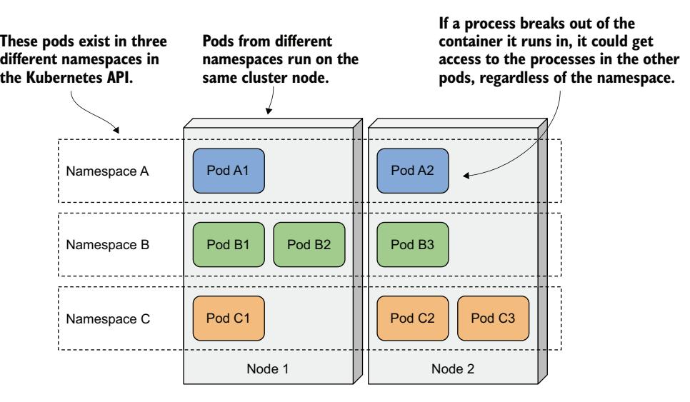
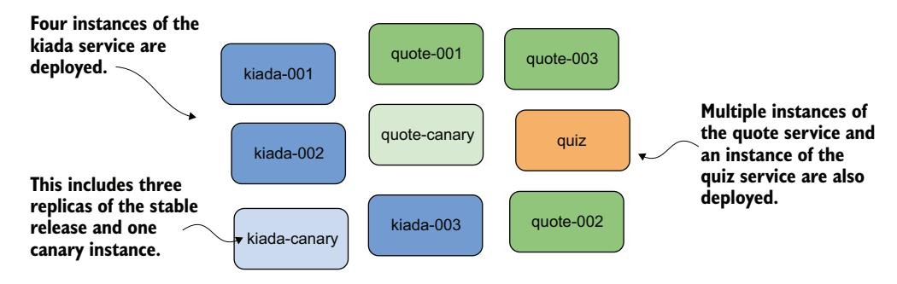
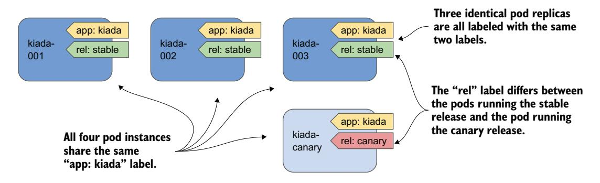
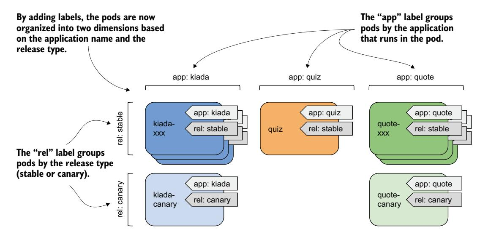
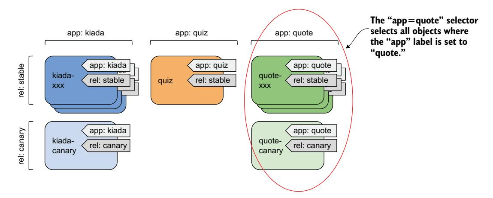

# *Organizing pods and other resources using namespaces and labels*

# *This chapter covers*

- Using namespaces to split a physical cluster into virtual clusters
- Organizing objects using labels
- Using label selectors to perform operations on subsets of objects
- Using label selectors to schedule pods onto specific nodes
- Using field selectors to filter objects based on their properties
- Annotating objects with additional nonidentifying information

A Kubernetes cluster is usually used by many teams. So, how should these teams deploy objects to the same cluster and organize them so that one team doesn't accidentally modify the objects created by other teams? And how can a large team deploying hundreds of microservices organize them so that each team member, even if new to the team, can quickly see where each object belongs and what its role in the system is (e.g., to which application a pod belongs)?

These are two different problems. Kubernetes solves the first with object namespaces and the other with object labels. Both are explained in this chapter.

**NOTE** You'll find the code files for this chapter at https://mng.bz/nZ9d.

# 7.1 Organizing objects into namespaces

Imagine that your organization is running a single Kubernetes cluster used by multiple engineering teams. Each of these teams deploys the entire Kiada application suite to develop and test it. You want each team to only deal with their own instance of the application suite—each team only wants to see the objects they've created and not those created by the other teams. This is achieved by creating objects in separate Kubernetes namespaces.

**NOTE** Namespaces in Kubernetes help organize Kubernetes API objects into non-overlapping groups. They have nothing to do with Linux namespaces, which help isolate processes running in one container from those in another, as you learned in chapter 2.

As shown in figure 7.1, you can use namespaces to divide a single physical Kubernetes cluster into many virtual clusters. Instead of everyone creating their objects in a single location, each team gets access to one or more namespaces in which to create their objects. Because namespaces provide a scope for object names, different teams can use the same names for their objects when they create them in their respective namespaces. Some namespaces can be shared between different teams or individual users.


Figure 7.1 Splitting a physical cluster into several virtual clusters by utilizing Kubernetes Namespaces

#### UNDERSTANDING WHEN TO ORGANIZE OBJECTS INTO NAMESPACES

Using multiple namespaces allows dividing complex systems with numerous components into smaller groups managed by different teams. They can also be used to separate objects in a multitenant environment. For example, you can create a separate namespace (or a group of namespaces) for each client and deploy the entire application suite for that client in that namespace (or group).

NOTE Most Kubernetes API object types are namespaced, but some are not. Pods, ConfigMaps, Secrets, PersistentVolumeClaims, and Events are all namespaced. Nodes, PersistentVolumes, StorageClasses, and Namespaces themselves are not. To see whether a resource is namespaced or cluster scoped, check the NAMESPACED column when running kubectl api-resources.

Without namespaces, each user of the cluster would have to prefix their object names with a unique prefix or each user would have to use their own Kubernetes cluster (figure 7.2). Namespaces also provide a scope for user privileges. A user may have permission to manage objects in one namespace but not in others. Because of this, namespaces are very important in production clusters that are typically shared by many different users and teams.


Figure 7.2 Some Kubernetes API types are namespaced, whereas others are cluster scoped.

# 7.1.1 Listing namespaces and the objects they contain

Every Kubernetes cluster you create contains a few common namespaces. Let's see what they are.

#### LISTING NAMESPACES

Since each namespace is represented by the *Namespace object*, you can display them with the kubectl get command, as you would any other Kubernetes API object. To see the namespaces in your cluster, run the following command:

#### \$ **kubectl get namespaces**

| NAME               | STATUS | AGE |
|--------------------|--------|-----|
| default            | Active | 1h  |
| kube-node-lease    | Active | 1h  |
| kube-public        | Active | 1h  |
| kube-system        | Active | 1h  |
| local-path-storage | Active | 1h  |

NOTE The short form for namespace is ns. You can also list namespaces with kubectl get ns.

Up to this point, you've been working in the default namespace. Every time you created an object, it was created in that namespace. Similarly, when you list objects, such as pods, with the kubectl get command, the command only displays the objects in that namespace. You may be wondering if there are pods in the other namespaces. Let's take a look.

NOTE Namespaces prefixed with kube- are reserved for Kubernetes system namespaces.

#### LISTING OBJECTS IN A SPECIFIC NAMESPACE

To list the pods in the kube-system namespace, run kubectl get with the --namespace option as follows:

#### **\$ kubectl get pods --namespace kube-system**

| NAME                     | READY | STATUS  | RESTARTS | AGE |
|--------------------------|-------|---------|----------|-----|
| coredns-558bd4d5db-4n5zg | 1/1   | Running | 0        | 1h  |
| coredns-558bd4d5db-tnfws | 1/1   | Running | 0        | 1h  |
| etcd-kind-control-plane  | 1/1   | Running | 0        | 1h  |
| kindnet-54ks9            | 1/1   | Running | 0        | 1h  |

...

## TIP You can also use -n instead of --namespace.

You'll learn more about these pods later in this book. Don't worry if the pods shown here don't exactly match the ones in your cluster. As the namespace name implies, these are the Kubernetes system pods. By having them in this separate namespace, everything stays neatly nice and clear. If they were all in the default namespace, mixed in with the pods you create yourself, it would be hard to tell what belongs where, and you could accidentally delete system objects.

## LISTING OBJECTS ACROSS ALL NAMESPACES

Instead of listing objects in each namespace individually, you can also tell kubectl to list objects in all namespaces. List all the pods in the cluster by running the following command:

## **\$ kubectl get pods --all-namespaces**

| NAMESPACE | NAME      | READY | STATUS  | RESTARTS | AGE  |
|-----------|-----------|-------|---------|----------|------|
| default   | kiada-ssl | 2/2   | Running | 0        | 6m3s |

| kube-system | gke-metrics-agent-jqz98   | 2/2 | Running | 0 | 21h |
|-------------|---------------------------|-----|---------|---|-----|
| kube-system | kube-dns-5f6d887967-6sg6m | 4/4 | Running | 0 | 21h |
|             |                           |     |         |   |     |

As you can see, the NAMESPACE column is displayed to show the namespace of each object.

TIP You can also type -A instead of --all-namespaces.

The --all-namespaces option is handy when you want to see all objects in the cluster, regardless of namespace, or when you can't remember which namespace an object is in.

## *7.1.2 Creating namespaces*

Now that you know the other namespaces in your cluster, you'll create two new namespaces.

#### CREATING A NAMESPACE WITH KUBECTL CREATE NAMESPACE

The fastest way to create a namespace is to use the kubectl create namespace command. Create a namespace named kiada-test1 as follows:

#### **\$ kubectl create namespace kiada-test1** namespace/kiada-test1 created

NOTE The names of most objects must conform to the naming conventions for DNS subdomain names, as specified in RFC 1123, that is, they may contain only lowercase alphanumeric characters, hyphens, and dots, and must start and end with an alphanumeric character. The same applies to namespaces, but they may not contain dots.

You've just created the namespace kiada-test1. You'll now create another one using a different method.

#### CREATING A NAMESPACE FROM A MANIFEST FILE

As mentioned earlier, Kubernetes namespaces are represented by Namespace objects. As such, you can list them with the kubectl get command, as you've already done, but you can also create them from a YAML or JSON manifest file that you post to the Kubernetes API.

 Use this method to create another namespace called kiada-test2. First, create a file named ns.kiada-test2.yaml with the contents of the following listing.

**of the namespace.**

#### Listing 7.1 A YAML definition of a Namespace object

apiVersion: v1 kind: Namespace metadata: name: kiada-test2 **This manifest contains a Namespace object. This is the name** 

Now, use kubectl apply to post the file to the Kubernetes API:

```
$ kubectl apply -f ns.kiada-test2.yaml
namespace/kiada-test2 created
```

Developers don't usually create namespaces this way, but operators do. For example, if you want to create a set of manifest files for a suite of applications that will be distributed across multiple namespaces, you can add the necessary Namespace objects to those manifests so that everything can be deployed without having to first create the namespaces with kubectl create and then apply the manifests.

 Before you continue, you should run kubectl get ns to list all namespaces again to see that your cluster now contains the two namespaces you created.

## *7.1.3 Managing objects in other namespaces*

You've now created two new namespaces—kiada-test1 and kiada-test2—but as mentioned earlier, you're still in the default namespace. If you create an object such as a pod without explicitly specifying the namespace, the object is created in the current namespace. Unless you've configured kubectl to use a different namespace, the current namespace is the namespace called default.

#### CREATING OBJECTS IN A SPECIFIC NAMESPACE

In section 7.1.1, you learned that you can specify the --namespace flag (or the shorter -n option) to list objects in a particular namespace. You can use the same argument when applying an object manifest to the API.

 To create the kiada-ssl Pod in the kiada-test1 namespace, run the following command:

```
$ kubectl apply -f kiada-ssl.yaml -n kiada-test1
pod/kiada-ssl created
```

You can now list pods in the kiada-test1 namespace to confirm that the Pod object was created there and not in the default namespace:

```
$ kubectl -n kiada-test1 get pods
NAME READY STATUS RESTARTS AGE
kiada-ssl 2/2 Running 0 1m
```

## SPECIFYING THE NAMESPACE IN THE OBJECT MANIFEST

The object manifest can specify the namespace of the object in the namespace field in the manifest's metadata section. When you apply the manifest with the kubectl apply command, the object is created in the specified namespace. You don't need to specify the namespace with the --namespace option.

 The manifest shown in listing 7.2 contains the same three objects as before, but with the namespace specified in the manifest.

#### Listing 7.2 Specifying the namespace in the object manifest

```
apiVersion: v1
kind: Pod
metadata:
 name: kiada-ssl
 namespace: kiada-test2 
spec:
...
                                            This Pod object specifies the namespace. 
                                            When you apply the manifest, this pod is 
                                            created in the kiada-test2 namespace.
```

When you apply this manifest with the following command, the pod is created in the kiada-test2 namespace:

```
$ kubectl apply -f kiada-ssl.kiada-test2-namespace.yaml
pod/kiada-ssl created
```

Notice that you didn't specify the --namespace option this time. If you had, the namespace would have to match the namespace specified in the object manifest, or kubectl would display an error like in the following example:

**\$ kubectl apply -f kiada-ssl.kiada-test2-namespace.yaml -n kiada-test1** the namespace from the provided object "kiada-test2" does not match the namespace "kiada-test1". You must pass '--namespace=kiada-test2' to perform this operation.

#### MAKING KUBECTL DEFAULT TO A DIFFERENT NAMESPACE

In the previous two examples, you learned how to create and manage objects in namespaces other than the namespace that kubectl is currently using as the default. You'll use the --namespace option frequently—especially when you want to quickly check what's in another namespace. However, you'll do most of your work in the current namespace.

 After you create a new namespace, you'll usually run many commands in it. To make your life easier, you can tell kubectl to switch to that namespace. The current namespace is a property of the current kubectl context, which is configured in the kubeconfig file.

NOTE You learned about the kubeconfig file in chapter 3.

To switch to a different namespace, you must update the current context. For example, to switch to the kiada-test1 namespace, run the following command:

```
$ kubectl config set-context --current --namespace kiada-test1
Context "kind-kind" modified.
```

Every kubectl command you run from now on will use the kiada-test1 namespace. For example, you can now list the pods in this namespace by simply typing kubectl get pods.

TIP To quickly switch to a different namespace, you can set up the following alias: alias kns='kubectl config set-context --current --namespace '. You can then switch between namespaces with kns some-namespace. Alternatively, you can install a kubectl plugin that does the same thing. It is available at [https://github.com/ahmetb/kubectx.](https://github.com/ahmetb/kubectx)

There's not much more to learn about creating and managing objects in different namespaces. But before you wrap up this section, I need to explain how well Kubernetes isolates workloads running in different namespaces.

## *7.1.4 Understanding the (lack of) isolation between namespaces*

You created several pods in different namespaces so far. You already know how to use the --all-namespaces option (or -A for short) to list pods across all namespaces, so please do so now:

| \$ kubectl get pods -A |           |       |         |          |     |                               |
|------------------------|-----------|-------|---------|----------|-----|-------------------------------|
| NAMESPACE              | NAME      | READY | STATUS  | RESTARTS | AGE |                               |
| default                | kiada-ssl | 2/2   | Running | 0        | 8h  |                               |
| default                | quiz      | 2/2   | Running | 0        | 8h  | Three pods<br>named kiada-ssl |
| default                | quote     | 2/2   | Running | 0        | 8h  | exist in different            |
| kiada-test1            | kiada-ssl | 2/2   | Running | 0        | 2m  | namespaces.                   |
| kiada-test2            | kiada-ssl | 2/2   | Running | 0        | 1m  |                               |
|                        |           |       |         |          |     |                               |

In the output of the command, you should see at least two pods named kiada-ssl: One in the kiada-test1 namespace and the other in the kiada-test2 namespace. You may also have another pod named kiada-ssl in the default namespace from the exercises in the previous chapter. In this case, there are three pods in your cluster with the same name, all of which you were able to create without problems thanks to namespaces. Other users of the same cluster could deploy many more of these pods without stepping on each other's toes.

## UNDERSTANDING THE RUNTIME ISOLATION BETWEEN PODS IN DIFFERENT NAMESPACES

When users use namespaces in a single physical cluster, it's as if they each use their own virtual cluster. But this is only true up to the point of being able to create objects without running into naming conflicts. The physical cluster nodes are shared by all users in the cluster. This means that the isolation between their pods is not the same as if they were running on different physical clusters and therefore on different physical nodes (see figure 7.3).

 When two pods created in different namespaces are scheduled to the same cluster node, they both run in the same OS kernel. Although they are isolated from each other with container technologies, an application that breaks out of its container or consumes too much of the node's resources can affect the operation of the other application. Kubernetes namespaces play no role here.



Figure 7.3 Pods from different namespaces may run on the same cluster node.

#### UNDERSTANDING NETWORK ISOLATION BETWEEN NAMESPACES

Unless explicitly configured to do so, Kubernetes doesn't provide network isolation between applications running in pods in different namespaces. An application running in one namespace can communicate with applications running in other namespaces. By default, there is no network isolation between namespaces. However, you can use the NetworkPolicy object to configure which applications within specific namespaces are permitted to connect to applications in other namespaces.

## USING NAMESPACES TO SEPARATE PRODUCTION, STAGING, AND DEVELOPMENT ENVIRONMENTS

Because namespaces don't provide true isolation, you should not use them to split a single physical Kubernetes cluster into the production, staging, and development environments. Hosting each environment on a separate physical cluster is a much safer approach.

## *7.1.5 Deleting namespaces*

Let's conclude this section on namespaces by deleting the two namespaces you created. When you delete the Namespace object, all the objects you created in that namespace are automatically deleted. You don't need to delete them first.

Delete the kiada-test2 namespace as follows:

**\$ kubectl delete ns kiada-test2** namespace "kiada-test2" deleted

The command blocks until everything in the namespace and the namespace itself are deleted. But, if you interrupt the command and list the namespaces before the deletion is complete, you'll see that the namespace's status is Terminating:

## **\$ kubectl get ns** NAME STATUS AGE default Active 2h kiada-test1 Active 2h kiada-test2 Terminating 2h

...

The reason I show this is because you will eventually run the delete command, and it will never finish. You'll probably interrupt the command and check the namespace list, as shown here. Then you'll wonder why the namespace termination doesn't complete.

TIP You can use the --wait=false option to make the kubectl delete command exit immediately instead of waiting for an object to be fully deleted.

#### DIAGNOSING WHY NAMESPACE TERMINATION IS STUCK

In short, the reason a namespace can't be deleted is because one or more objects created in it can't be deleted. You may think to yourself, "Oh, I'll list the objects in the namespace with kubectl get all to see which object is still there," but that usually doesn't get you any further because kubectl doesn't return any results.

NOTE Remember that the kubectl get all command lists only some types of objects. For example, it doesn't list Secrets. Even though the command doesn't return anything, this doesn't mean the namespace is empty.

In most, if not all, cases where I've seen a namespace get stuck this way, the problem was caused by a custom object and its custom controller not processing the object's deletion and removing a finalizer from the object.

 Here I just want to show you how to figure out which object is causing the namespace to be stuck. Here's a hint: Namespace objects also have a status field. While the kubectl describe command normally also displays the status of the object, at the time of writing, this is not the case for namespaces. I consider this to be a bug that will likely be fixed at some point. Until then, you can check the status of the namespace as follows:

```
$ kubectl get ns kiada-test2 -o yaml
...
status:
 conditions:
 - lastTransitionTime: "2021-10-10T08:35:11Z"
 message: All resources successfully discovered
 reason: ResourcesDiscovered
 status: "False"
 type: NamespaceDeletionDiscoveryFailure
 - lastTransitionTime: "2021-10-10T08:35:11Z"
 message: All legacy kube types successfully parsed
 reason: ParsedGroupVersions
 status: "False"
 type: NamespaceDeletionGroupVersionParsingFailure
```

**All objects in the namespace were marked for deletion, but some haven't been fully deleted yet.**

**the specified finalizer from the object.**

```
 - lastTransitionTime: "2021-10-10T08:35:11Z" 
 message: All content successfully deleted, may be waiting on finalization
 reason: ContentDeleted 
 status: "False" 
 type: NamespaceDeletionContentFailure 
 - lastTransitionTime: "2021-10-10T08:35:11Z" 
 message: 'Some resources are remaining: pods. has 1 resource instances'
 reason: SomeResourcesRemain 
 status: "True" 
 type: NamespaceContentRemaining 
 - lastTransitionTime: "2021-10-10T08:35:11Z" 
 message: 'Some content in the namespace has finalizers remaining: 
 xyz.xyz/xyz-finalizer in 1 resource instances' 
 reason: SomeFinalizersRemain 
 status: "True" 
 type: NamespaceFinalizersRemaining 
 phase: Terminating
                                                             One pod remains in
                                                                the namespace.
                                                The pod hasn't been fully deleted
                                            because a controller has not removed
```

When you delete the kiada-test2 namespace, you won't see the output in this example. The command output in this example is hypothetical. I forced Kubernetes to produce it to demonstrate what happens when the delete process gets stuck. If you look at the output, you'll see that the objects in the namespace were all successfully marked for deletion, but one pod remains in the namespace due to a finalizer that was not removed from the pod. Don't worry about finalizers for now. You'll learn about them soon enough.

Before proceeding to the next section, please also delete the kiada-test1 namespace.

# *7.2 Organizing pods with labels*

In this book, you will build and deploy the full Kiada application suite, which is composed of several services. At least one Pod object, but also several other objects, will be associated with each service. As you can imagine, the number of these objects will increase as the book progresses. Before things get out of hand, you need to start organizing these objects so that you and all the other users in your cluster can easily figure out which objects are associated with each service.

 In other systems that use microservices, the number of services can exceed 100 or more. Some of these services are replicated, which means that multiple copies of the same pod are deployed. Also, at certain points in time, multiple versions of a service are running simultaneously. This results in hundreds or even thousands of pods in the system.

 Imagine you, too, start replicating and running multiple releases of the pods in your Kiada suite. For example, suppose you are running both the stable and canary release of the Kiada service.

DEFINITION A *canary release* is a deployment pattern where a new version of an application is deployed alongside the stable version and direct only a small portion of requests to the new version to see how it behaves before rolling it out to all users. This prevents a bad release from being made available to too many users.

Imagine running three replicas of the stable Kiada version and one canary instance. Similarly, you run three instances of the stable release of the Quote service, along with a canary release of the Quote service. You run a single, stable release of the Quiz service. All these pods are shown in figure 7.4.



Figure 7.4 Unorganized pods of the Kiada application suite

Even with only nine pods in the system, the system diagram is challenging to understand. And it doesn't even show any of the other API objects required by the pods. It's obvious that you need to organize them into smaller groups. You could split these three services into three namespaces, but that's not the real purpose of namespaces. A more appropriate mechanism for this case is object *labels*.

## *7.2.1 Introducing labels*

Labels are an incredibly powerful yet simple feature for organizing Kubernetes API objects. A label is a key–value pair you attach to an object that allows any user of the cluster to identify the object's role in the system. Both the key and the value are simple strings that you can specify as you wish. An object can have more than one label, but the label keys must be unique within that object. You normally add labels to objects when you create them, but you can also change an object's labels later.

#### USING LABELS TO PROVIDE ADDITIONAL INFORMATION ABOUT AN OBJECT

To illustrate the benefits of adding labels to objects, let's take the pods shown in figure 7.4. These pods run three different services: the Kiada service, the Quote, and the Quiz service. Additionally, the pods behind the Kiada and Quote services run different releases of each application. There are three pod instances running a stable release and one running a canary release.

To help identify the application and the release running in each pod, we use pod labels. Kubernetes does not care what labels you add to your objects. You can choose the keys and values however you want. In the case at hand, the following two labels make sense:

- The app label indicates to which application the pod belongs.
- The rel label indicates whether the pod is running the stable or canary release of the application.

As shown in figure 7.5, the value of the app label is set to kiada in all three kiada-xxx Pods and the kiada-canary Pod, since all these pods are running the Kiada application. The rel label differs between the pods running the stable release and the pod running the canary release.



Figure 7.5 Labeling pods with the app and rel label

The illustration shows only the kiada Pods, but imagine adding the same two labels to the other pods as well. With these labels, users that come across these pods can easily tell what application and what kind of release is running in the pod.

#### UNDERSTANDING HOW LABELS KEEP OBJECTS ORGANIZED

If you haven't yet realized the value of adding labels to an object, consider that by adding the app and rel labels, you've organized your pods in two dimensions (horizontally by application and vertically by release), as shown in figure 7.6.

This may seem abstract until you see how these labels make it easier to manage these pods with kubectl, so let's get practical.

## 7.2.2 Adding labels to pods

The book's code archive contains a set of manifest files with all the pods from the previous example. All the stable pods are already labeled, but the canary pods aren't. You'll label them manually.



Figure 7.6 All the pods of the Kiada suite organized by two criteria

#### **SETTING UP THE EXERCISE**

To get started, create a new namespace called kiada as follows:

\$ kubectl create namespace kiada
namespace/kiada created

Configure kubectl to use this new namespace like this:

\$ kubectl config set-context --current --namespace kiada
Context "kind-kind" modified.

The manifest files are organized into three subdirectories within Chapter10/kiada-suite/. Instead of applying each manifest individually, you can apply them all with the following command:

```
$ kubectl apply -f kiada-suite/ -R
pod/kiada-001 created
...
pod/quote-003 created
pod/quote-canary created
Applies all the manifests in the
kiada-suite/ directory and its
subdirectories
```

You're used to applying a manifest file, but here you use the -f option to specify a directory name. Kubectl will apply all manifest files it finds in that directory.

**NOTE** The -R option (short for --recursive) instructs kubectl to search for manifests in all subdirectories of the specified directory, rather than limiting the search to the directory itself.

As you can see, this command creates several pods. Adding labels will help keep them organized.

#### DEFINING LABELS IN OBJECT MANIFESTS

Examine the manifest file kiada-suite/kiada/pod.kiada-001.yaml shown in the following listing. Look at the metadata section. Besides the name field, which you've seen many times before, this manifest also contains the labels field. It specifies two labels: app and rel.

#### Listing 7.3 A pod with labels

```
apiVersion: v1
kind: Pod
metadata:
 name: kiada-001
 labels: 
 app: kiada 
 rel: stable 
spec:
 ...
                                 The object's labels 
                                 are defined in the 
                                 metadata.labels field.
                                 The "app" label is set to "kiada."
                               The "rel" label is set to "stable."
```

Labels are supported by all object kinds. You specify them in the metadata.labels map.

#### DISPLAYING OBJECT LABELS

You can see the labels of a particular object by running the kubectl describe command. View the labels of the Pod kiada-001 as follows:

#### **\$ kubectl describe pod kiada-001**

Name: kiada-001 Namespace: kiada Priority: 0

rel=stable

Node: kind-worker2/172.18.0.2

Start Time: Sun, 10 Oct 2021 21:58:25 +0200

Labels: app=kiada **These are the two labels that are** 

Annotations: <none> ...

**Annotations are explained in section 7.5.**

TIP To display just the object's labels, use the command kubectl get pod <name> -o yaml | yq .metadata.labels.

**defined in this pod's manifest file.**

The kubectl get pods command doesn't display labels by default, but you can display them with the --show-labels option. Check the labels of all pods in the namespace as follows:

| \$ kubectl get podsshow-labels |       |         |          |     | These are the stable kiada Pods. |  |
|--------------------------------|-------|---------|----------|-----|----------------------------------|--|
| NAME                           | READY | STATUS  | RESTARTS | AGE | LABELS                           |  |
| kiada-001                      | 2/2   | Running | 0        | 12m | app=kiada,rel=stable             |  |
| kiada-002                      | 2/2   | Running | 0        | 12m | app=kiada,rel=stable             |  |
| kiada-003                      | 2/2   | Running | 0        | 12m | app=kiada,rel=stable             |  |

| kiada-canary               | 2/2 | Running | 0                                | 12m<br><none></none>         |
|----------------------------|-----|---------|----------------------------------|------------------------------|
| quiz                       | 2/2 | Running | 0                                | 12m<br>app=quiz,rel=stable   |
| quote-001                  | 2/2 | Running | 0                                | 12m<br>app=quote,rel=stable  |
| quote-002                  | 2/2 | Running | 0                                | 12m<br>app=quote,rel=stable  |
| quote-003                  | 2/2 | Running | 0                                | 12m<br>app=quote,rel=stable  |
| quote-canary               | 2/2 | Running | 0                                | 12m<br><none></none>         |
| These pods have no labels. |     |         | These are the stable Quote pods. |                              |
|                            |     |         |                                  | This is the stable Quiz pod. |

Instead of showing all labels with --show-labels, you can also show specific labels with the --label-columns option (or the shorter option -L). Each label is displayed in its own column. List all pods along with their app and rel labels as follows:

| \$ kubectl get pods -L app,rel |       |         |          |     |       |        |
|--------------------------------|-------|---------|----------|-----|-------|--------|
| NAME                           | READY | STATUS  | RESTARTS | AGE | APP   | REL    |
| kiada-001                      | 2/2   | Running | 0        | 14m | kiada | stable |
| kiada-002                      | 2/2   | Running | 0        | 14m | kiada | stable |
| kiada-003                      | 2/2   | Running | 0        | 14m | kiada | stable |
| kiada-canary                   | 2/2   | Running | 0        | 14m |       |        |
| quiz                           | 2/2   | Running | 0        | 14m | quiz  | stable |
| quote-001                      | 2/2   | Running | 0        | 14m | quote | stable |
| quote-002                      | 2/2   | Running | 0        | 14m | quote | stable |
| quote-003                      | 2/2   | Running | 0        | 14m | quote | stable |
| quote-canary                   | 2/2   | Running | 0        | 14m |       |        |

You can see that the two canary pods have no labels. Let's add them.

#### ADDING LABELS TO AN EXISTING OBJECT

To add labels to an existing object, you can edit the object's manifest file, add labels to the metadata section, and reapply the manifest using kubectl apply. You can also edit the object definition directly in the API using kubectl edit. However, the simplest method is to use the kubectl label command.

Add the labels app and rel to the kiada-canary Pod using the following command:

**\$ kubectl label pod kiada-canary app=kiada rel=canary** pod/kiada-canary labeled

Now do the same for the pod quote-canary:

**\$ kubectl label pod quote-canary app=kiada rel=canary** pod/quote-canary labeled

Did you spot the error in the second kubectl label command? If not, you will probably notice it when you list the pods again with their labels. The app label of the Pod quote-canary is set to the wrong value (kiada instead of quote). Let's fix this.

## CHANGING LABELS OF AN EXISTING OBJECT

You can use the same command to update object labels. To change the label you set incorrectly, run the following command:

```
$ kubectl label pod quote-canary app=quote
error: 'app' already has a value (kiada), and --overwrite is false
```

To prevent accidentally changing the value of an existing label, you must explicitly tell kubectl to overwrite the label with --overwrite. Here's the correct command:

```
$ kubectl label pod quote-canary app=quote --overwrite
pod/quote-canary labeled
```

List the pods again to check that all the labels are now correct.

#### LABELING ALL OBJECTS OF A KIND

Now, imagine that you want to deploy another application suite in the same namespace. Before doing this, it is useful to add the suite label to all existing pods so that you can tell which pods belong to one suite and which belong to the other. Run the following command to add the label to all pods in the namespace:

```
$ kubectl label pod --all suite=kiada-suite
pod/kiada-canary labeled
pod/kiada-001 labeled
...
pod/quote-003 labeled
```

List the pods again with the --show-labels or the -L suite option to confirm that all pods now contain this new label.

## REMOVING A LABEL FROM AN OBJECT

Okay, I lied. You will not be setting up another application suite. Therefore, the suite label is redundant. To remove the label from an object, run the kubectl label command with a minus sign after the label key as follows:

```
$ kubectl label pod kiada-canary suite-
pod/kiada-canary unlabeled
                                                           The minus sign signifies 
                                                           the removal of a label.
```

To remove the label from all other pods, specify --all instead of the pod name:

```
$ kubectl label pod --all suite-
pod/kiada-001 unlabeled
pod/kiada-002 unlabeled
pod/kiada-003 unlabeled
label "suite" not found. 
pod/kiada-canary not labeled 
...
pod/quote-canary unlabeled
                                        The kiada-canary Pod doesn't 
                                        have the suite label.
```

NOTE If you set the label value to an empty string, the label key is not removed. To remove it, you must use the minus sign after the label key.

## *7.2.3 Label syntax rules*

While you can label your objects however you like, there are some restrictions on both the label keys and the values.

#### VALID LABEL KEYS

In the examples, you used the label keys app, rel, and suite. These keys have no prefix and are considered private to the user. Common label keys that Kubernetes itself applies or reads always start with a prefix. This also applies to labels used by Kubernetes components outside of the core, as well as other commonly accepted label keys.

 An example of a prefixed label key used by Kubernetes is kubernetes.io/arch. You can find it on Node objects to identify the architecture type used by the node.

|  |  |  |  |  | \$ kubectl get node -L kubernetes.io/arch |  |
|--|--|--|--|--|-------------------------------------------|--|
|--|--|--|--|--|-------------------------------------------|--|

| NAME               | STATUS | ROLES         | AGE | VERSION | ARCH  |
|--------------------|--------|---------------|-----|---------|-------|
| kind-control-plane | Ready  | control-plane | 31d | v1.21.1 | amd64 |
| kind-worker        | Ready  | <none></none> | 31d | v1.21.1 | amd64 |
| kind-worker2       | Ready  | <none></none> | 31d | v1.21.1 | amd64 |

**The kubernetes.io/arch label is set to amd64 on all three nodes.**

The label prefixes kubernetes.io/ and k8s.io/ are reserved for Kubernetes components. If you want to use a prefix for your labels, use your organization's domain name to avoid conflicts.

 When choosing a key for your labels, some syntax restrictions apply to both the prefix and the name part. Table 7.1 provides examples of valid and invalid label keys.

| Table 7.1 | Examples of valid and invalid label keys |  |  |  |  |  |  |
|-----------|------------------------------------------|--|--|--|--|--|--|
|-----------|------------------------------------------|--|--|--|--|--|--|

| Valid label keys    | Invalid label keys                         |  |  |  |  |
|---------------------|--------------------------------------------|--|--|--|--|
| foo                 | _foo                                       |  |  |  |  |
| foo-bar_baz         | foo%bar*baz                                |  |  |  |  |
| example/foo         | /foo                                       |  |  |  |  |
| example/FOO         | EXAMPLE/foo                                |  |  |  |  |
| example.com/foo     | examplecom/foo                             |  |  |  |  |
| my_example.com/foo  | my@example.com/foo                         |  |  |  |  |
| example.com/foo-bar | example.com/-foo-bar                       |  |  |  |  |
| my.example.com/foo  | a.very.long.prefix.over.253.characters/foo |  |  |  |  |

The following syntax rules apply to the prefix:

- Must be a DNS subdomain (i.e., must contain only lowercase alphanumeric characters, hyphens, underscores, and dots)
- Must be no more than 253 characters long (not including the slash character)
- Must end with a forward slash

The prefix must be followed by the label name, which

- Must begin and end with an alphanumeric character
- May contain hyphens, underscores, and dots
- May contain uppercase letters
- May not be longer than 63 characters

#### VALID LABEL VALUES

Remember that labels are used to add identifying information to your objects. As with label keys, there are certain rules you must follow for label values. For example, label values can't contain spaces or special characters. Table 7.2 provides examples of valid and invalid label values.

Table 7.2 Examples of valid and invalid label values

| Valid label values | Invalid label values            |
|--------------------|---------------------------------|
| foo                | _foo                            |
| foo-bar_baz        | foo%bar*baz                     |
| FOO                | value.longer.than.63.characters |
| ""                 | value with spaces               |

# A label value

- May be empty
- Must begin with an alphanumeric character if not empty
- May contain only alphanumeric characters, hyphens, underscores, and dots
- Must not contain whitespace
- Must be no more than 63 characters long

If you need to add values that don't follow these rules, you can add them as annotations instead of labels. You'll learn more about annotations later in this chapter.

# *7.2.4 Using standard label keys*

While you can always choose your own label keys, there are some standard keys you should know. Some of these are used by Kubernetes itself to label system objects, while others have become common for use in user-created objects.

#### WELL-KNOWN LABELS USED BY KUBERNETES

Kubernetes doesn't usually add labels to the objects you create. However, it does use various labels for system objects such as nodes, especially if the cluster is running in a cloud environment. Table 7.3 lists some well-known labels you might find on these objects.

NOTE You can also find some of these labels under the older prefix beta.kubernetes.io, in addition to kubernetes.io.

The zone in which the node or persistent volume is located

when using cloud-provided

infrastructure

| Label key                         | Example value | Applied to               | Description                                                        |
|-----------------------------------|---------------|--------------------------|--------------------------------------------------------------------|
| kubernetes.io/arch                | amd64         | Node                     | The architecture of the node                                       |
| kubernetes.io/os                  | linux         | Node                     | The operating system running<br>on the node                        |
| kubernetes.io/hostname            | worker-node1  | Node                     | The node's hostname                                                |
| topology.kubernetes.io/<br>region | eu-west3      | Node<br>PersistentVolume | The region in which the node<br>or persistent volume is<br>located |

PersistentVolume

micro-1 Node The node instance type. Set

eu-west3-c Node

Table 7.3 Well-known labels on nodes and PersistentVolumes

topology.kubernetes.io/

node.kubernetes.io/ instance-type

zone

Cloud providers can provide additional labels for nodes and other objects. For example, Google Kubernetes Engine adds the labels cloud.google.com/gke-nodepool and cloud.google.com/gke-os-distribution to provide further information about each node. You can also find more standard labels on other objects.

## RECOMMENDED LABELS FOR DEPLOYED APPLICATION COMPONENTS

The Kubernetes community has agreed on a set of standard labels you can add to your objects so that other users and tools can understand them. Table 7.4 lists these standard labels.

| Table 7.4 | Recommended labels used in the Kubernetes community |
|-----------|-----------------------------------------------------|
|-----------|-----------------------------------------------------|

| Label                            | Example         | Description                                                                                                                                                                    |
|----------------------------------|-----------------|--------------------------------------------------------------------------------------------------------------------------------------------------------------------------------|
| app.kubernetes.io/<br>name       | quotes          | The name of the application. If the application consists<br>of multiple components, this is the name of the entire<br>application, not the individual components.              |
| app.kubernetes.io/<br>instance   | quotes-foo      | The name of this application instance. If you create multi<br>ple instances of the same application for different pur<br>poses, this label helps you distinguish between them. |
| app.kubernetes.io/<br>component  | database        | The role that this component plays in the application<br>architecture                                                                                                          |
| app.kubernetes.io/<br>part-of    | kubia-demo      | The name of the application suite to which this application<br>belongs                                                                                                         |
| app.kubernetes.io/<br>version    | 1.0.0           | The version of the application                                                                                                                                                 |
| app.kubernetes.io/<br>managed-by | quotes-operator | The tool that manages the deployment and update of this<br>application                                                                                                         |

All objects belonging to the same application instance should have the same set of labels. This way, anyone using the Kubernetes cluster can see which components belong together and which do not. Also, you can manage these components using bulk operations by using label selectors, which are explained in the next section.

# 7.3 Filtering objects with label selectors

The labels you added to the pods in the previous exercises allow you to identify each object and understand its place in the system. So far, these labels have only provided additional information when you list objects. But the real power of labels comes when you use *label selectors* to filter objects based on their labels.

Label selectors allow you to select a subset of pods or other objects that contain a particular label and perform an operation on those objects. A label selector is a criterion that filters objects based on whether they contain a particular label key with a particular value.

There are two types of label selectors:

- equality-based selectors, and
- set-based selectors.

#### **INTRODUCING EQUALITY-BASED SELECTORS**

An equality-based selector can filter objects based on whether the value of a particular label is equal to or not to a particular value. For example, applying the label selector app=quote to all pods in our previous example selects all quote pods (all stable instances plus the canary instance), as shown in figure 7.7.



Figure 7.7 Selecting objects using an equality-based selector

Similarly, the label selector app!=quote selects all pods except the Quote pods.

#### INTRODUCING SET-BASED SELECTORS

Set-based selectors are more powerful and allow you to specify

- A set of values that a particular label must have—for example, app in (quiz, quote)
- A set of values that a particular label must not have—for example, app notin (kiada),
- A particular label key that should be present in the object's labels—for example, to select objects that have the app label, the selector is simply app,
- A particular label key that should not be present in the object's labels—for example, to select objects that do not have the app label, the selector is !app.

#### **COMBINING MULTIPLE SELECTORS**

When you filter objects, you can combine multiple selectors. To be selected, an object must match all the specified selectors. As shown in figure 7.8, the selector app=quote, rel=canary selects the Pod quote-canary.


Figure 7.8 Combining two label selectors

You use label selectors when managing objects with kubectl, but they are also used internally by Kubernetes when an object references a subset of other objects. These scenarios are covered in the next two sections.

## 7.3.1 Using label selectors for object management with kubectl

If you've been following the exercises in this book, you've used the kubectl get command many times to list objects in your cluster. When you run this command without specifying a label selector, it prints all the objects of a particular kind. Fortunately, you never had more than a few objects in the namespace, so the list was never too long. In real-world environments, however, you can have hundreds of objects of a particular kind in the namespace. That's when label selectors come in.

#### FILTERING THE LIST OF OBJECTS USING LABEL SELECTORS

You'll use a label selector to list the pods you created in the kiada namespace in the previous section. Let's try the example in figure 7.7, where the selector app=quote was used to select only the pods running the quote application. To apply a label selector to kubectl get, specify it with the --selector argument (or the short equivalent -l) as follows:

# **\$ kubectl get pods -l app=quote**

| NAME         | READY | STATUS  | RESTARTS | AGE |
|--------------|-------|---------|----------|-----|
| quote-001    | 2/2   | Running | 0        | 2h  |
| quote-002    | 2/2   | Running | 0        | 2h  |
| quote-003    | 2/2   | Running | 0        | 2h  |
| quote-canary | 2/2   | Running | 0        | 2h  |

Only the quote pods are shown. Other pods are ignored. Now, as another example, try listing all the canary pods:

#### **\$ kubectl get pods -l rel=canary**

| NAME         | READY | STATUS  | RESTARTS | AGE |
|--------------|-------|---------|----------|-----|
| kiada-canary | 2/2   | Running | 0        | 2h  |
| quote-canary | 2/2   | Running | 0        | 2h  |

Let's also try the example from figure 7.8, combining the two selectors app=quote and rel=canary:

# **\$ kubectl get pods -l app=quote,rel=canary**

| NAME         | READY | STATUS  | RESTARTS | AGE |
|--------------|-------|---------|----------|-----|
| quote-canary | 2/2   | Running | 0        | 2h  |

Only the labels of the quote-canary Pod match the label selector, so only this pod is shown. Now try using a set-based selector. To display all Quiz and Quote pods, use the selector 'app in (quiz, quote)' as follows:

#### **\$ kubectl get pods -l 'app in (quiz, quote)' -L app** NAME READY STATUS RESTARTS AGE APP

| quiz         | 2/2 | Running | 0 | 2h | quiz  |
|--------------|-----|---------|---|----|-------|
| quote-canary | 2/2 | Running | 0 | 2h | quote |
| quote-001    | 2/2 | Running | 0 | 2h | quote |
| quote-002    | 2/2 | Running | 0 | 2h | quote |
| quote-003    | 2/2 | Running | 0 | 2h | quote |

You'd get the same result if you used the equality-based selector 'app!=kiada' or the set-based selector 'app notin (kiada)'. The -L app option in the command displays the value of the app label for each pod (see the APP column in the output).

 The only two selectors you haven't tried yet are the ones that test only for the presence (or absence) of a particular label key. If you want to try them, first remove the rel label from the Quiz pod with the following command:

## **\$ kubectl label pod quiz rel**pod/quiz labeled

You can now list pods that do not have the rel label:

```
$ kubectl get pods -l '!rel'
NAME READY STATUS RESTARTS AGE
quiz 2/2 Running 0 2h
```

**NOTE** Make sure to use single quotes around !rel, so your shell doesn't evaluate the exclamation mark.

And to list all pods that do have the rel label, run the following command:

#### \$ kubectl get pods -l rel

The command should show all pods except the Quiz pod.

If your Kubernetes cluster is running in the cloud and distributed across multiple regions or zones, you can also try listing nodes of a particular type or in a particular region or zone. Table 7.3 shows what label key to specify in the selector.

You've now mastered the use of label selectors when listing objects. Do you have the confidence to use them for deleting objects as well?

#### **DELETING OBJECTS USING A LABEL SELECTOR**

There are currently two canary releases in use in your system. It turns out that they aren't behaving as expected and need to be terminated. You could list all canaries in your system and remove them one by one. A faster method is to use a label selector to delete them in a single operation, as illustrated in figure 7.9.


Figure 7.9 Selecting and deleting all canary pods using the rel=canary label selector

Delete the canary pods with the following command:

```
$ kubectl delete pods -l rel=canary
pod "kiada-canary" deleted
pod "quote-canary" deleted
```

The output of the command shows that both the kiada-canary and quote-canary pods have been deleted. However, because the kubectl delete command does not ask for

confirmation, you should be very careful when using label selectors to delete objects, especially in a production environment.

## *7.3.2 Using label selectors in object manifests*

You've learned how to use labels and selectors with kubectl to organize your objects and filter them, but selectors are also used within Kubernetes API objects. For example, you can specify a node selector in each Pod object to specify the nodes the pod can be scheduled to. In chapter 11, which teaches you about the Service object, you'll learn that you need to define a pod selector in this object to specify a set of pods to which the service will forward traffic. In later chapters, you'll see how pod selectors are used by objects such as Deployment, ReplicaSet, DaemonSet, and StatefulSet to define the set of pods that belong to these objects.

#### USING LABEL SELECTORS TO SCHEDULE PODS TO SPECIFIC NODES

All the pods you've created so far have been randomly distributed across your entire cluster. Normally, it doesn't matter which node a pod is scheduled to, because each pod gets exactly the amount of compute resources it requests (CPU, memory, etc.). Also, other pods can access this pod regardless of which node this and the other pods are running on. However, there are scenarios where you may want to deploy certain pods only on a specific subset of nodes.

 A good example is when your hardware infrastructure isn't homogenous. If some of your worker nodes use spinning disks while others use SSDs, you may want to schedule pods that require low-latency storage only to the nodes that can provide it. Another example is if you want to schedule frontend pods to some nodes and backend pods to others, or if you want to deploy a separate set of application instances for each customer and want each set to run on its own set of nodes for security reasons.

 In all these cases, rather than scheduling a pod to a particular node, allow Kubernetes to select a node out from a set of nodes that meet the required criteria. Typically, you'll have more than one node that meets the specified criteria so that if one node fails, the pods running on it can be moved to the other nodes.

The mechanisms used to do this are labels and selectors.

### ATTACHING LABELS TO NODES

The Kiada application suite consists of the Kiada, Quiz, and Quote services. Let's consider the Kiada service as the frontend and the Quiz and Quote services as the backend services. Imagine that you want the Kiada Pods to be scheduled only to the cluster nodes that you reserve for frontend workloads. To do this, you first label some of the nodes as such.

 First, list all the nodes in your cluster and select one of the worker nodes. If your cluster consists of only one node, use that one.

## **\$ kubectl get node**

NAME STATUS ROLES AGE VERSION kind-control-plane Ready control-plane 1d v1.21.1

```
kind-worker Ready <none> 1d v1.21.1
kind-worker2 Ready <none> 1d v1.21.1
```

In this example, I choose the kind-worker node as the node for the frontend workloads. After selecting your node, add the node-role: front-end label to it as follows:

```
$ kubectl label node kind-worker node-role=front-end
node/kind-worker labeled
```

Now list the nodes with a label selector to confirm that this is the only frontend node:

```
$ kubectl get node -l node-role=front-end
NAME STATUS ROLES AGE VERSION
kind-worker Ready <none> 1d v1.21.1
```

If your cluster has many nodes, you can label multiple nodes this way.

#### SCHEDULING PODS TO NODES WITH SPECIFIC LABELS

To schedule a pod to the node(s) you designated as frontend nodes, you must add a node selector to the pod manifest before you create the pod. The following listing shows the contents of the pod.kiada-front-end.yaml manifest file. The node selector is specified in the spec.nodeSelector field.

## Listing 7.4 Using a node selector to schedule a pod to a specific node

```
apiVersion: v1
kind: Pod
metadata:
 name: kiada-front-end
spec:
 nodeSelector: 
 node-role: front-end 
 containers: ...
                                   This pod may only be scheduled to nodes 
                                   with the node-role=front-end label.
```

In the nodeSelector field, you can specify one or more label keys and values that the node must match to be eligible to run the pod. Note that this field only supports specifying an equality-based label selector. The label value must match the value in the selector. You can't use a not-equal or set-based selector in the nodeSelector field.

 When you create the pod from the previous listing by applying the manifest with kubectl apply, you'll see that the pod is scheduled to the node(s) that you have labeled with the label node-role: front-end. You can confirm this by displaying the pod with the -o wide option to show the pod's node as follows:

```
$ kubectl get pod kiada-front-end -o wide
```

```
NAME READY STATUS RESTARTS AGE IP NODE 
kiada-front-end 2/2 Running 0 1m 10.244.2.20 kind-worker
```

You can delete and recreate the pod several times to make sure that it always lands on the frontend node(s).

#### USING SET-BASED LABEL SELECTORS

The nodeSelector field is an example of an equality-based label selector. An example of a set-based label selector can be found in the pod's nodeAffinity field, which serves a similar purpose—placing the pod on a node with certain labels. However, set-based selectors are much more expressive, because they also allow you to exclude nodes with certain labels.

 The following listing shows an alternative way of scheduling the kiada-front-end Pod to a node that has the node-role: front-end and does not have the skip-me label. You can find the manifest in the file pod.kiada-front-end-affinity.yaml.

#### Listing 7.5 Using a set-based label selector

```
apiVersion: v1
kind: Pod
metadata:
 name: kiada-front-end-affinity
spec:
 affinity:
 nodeAffinity:
 requiredDuringSchedulingIgnoredDuringExecution:
 nodeSelectorTerms:
 - matchExpressions: 
 - key: node-role 
 operator: In 
 values: 
 - front-end 
 - key: skip-me 
 operator: DoesNotExist 
 ...
                                             This is a set-based selector. 
                                      The Node must have a label 
                                      with the key node-role and 
                                      the value front-end.
                                        The Node must not have a 
                                        label with the key skip-me.
```

As you can see in the listing, the nodeSelectorTerms field can accept multiple node selector terms. A node must match at least one of the terms to be selected. However, each term can specify multiple matchExpressions, and the node's labels must match all the expressions defined in the term.

 Each set-based label selector match expression specifies the key, operator, and values. The key is the label key to which the selector is applied. The operator must be one of the following:

- In—The label value must match one of the values in the values field.
- NotIn—The label value must not match any of the values in the values field.
- Exists—The label key must exist, but the value doesn't matter.
- DoesNotExist—The label key must not be present on the object.
- Lt—The label value must be less than the single value specified in the values field.
- Gt—The label value must be greater than the single value specified in the values field.

The values field specifies a list of values that the label must or must not have. For the Exists and DoesNotExist operators, the field must be omitted. For the Lt and Gt operators, the values list must contain exactly one item.

 To see the set-based label selector in nodeAffinity in action, you'll create the kiada-front-end-affinity Pod. But before you do that, add the skip-me label to the front-end Nodes by running the following command:

#### \$ **kubectl label nodes -l node-role=front-end skip-me=true**

This command adds a skip-me: true label to all nodes that have the node-role: front-end label.

 Now create the pod by applying the pod.kiada-front-end-affinity.yaml file with kubectl apply. Unlike the kiada-front-end Pod, this new pod should not be scheduled to any node, because none matches the selector. You can confirm this by listing the pods with kubectl get pods:

### \$ **kubectl get pods**

| NAME                     | READY | STATUS  | RESTARTS | AGE | This pod has |
|--------------------------|-------|---------|----------|-----|--------------|
| kiada-front-end          | 2/2   | Running | 0        | 5m  | not been     |
| kiada-front-end-affinity | 0/2   | Pending | 0        | 20s | scheduled.   |

Checking the pods events with kubectl describe pod should tell you why the pod hasn't been scheduled. Leave the pod alone for now, as you'll need it in the next exercise.

# *7.4 Filtering objects with field selectors*

Kubernetes initially only allowed filtering objects with label selectors. Then it became clear that users want to filter objects by other properties as well. One such example is filtering pods based on the cluster node they are running on. This can now be accomplished with *field selectors*.

 The set of fields you can use in a field selector depends on the object kind. The metadata.name and metadata.namespace fields are always supported.

# *7.4.1 Using a field selector in kubectl*

Field selectors can be used to filter objects with kubectl. Let's look at two useful examples.

#### LISTING PODS SCHEDULED TO A SPECIFIC NODE

As an example of using field selectors with kubectl, run the following command to list pods on the kind-worker node (if your cluster wasn't provisioned with the kind tool, use a different node name):

| \$ kubectl get podsfield-selector spec.nodeName=kind-worker |       |         |          |     |
|-------------------------------------------------------------|-------|---------|----------|-----|
| NAME                                                        | READY | STATUS  | RESTARTS | AGE |
| kiada-front-end                                             | 2/2   | Running | 0        | 15m |
| kiada-002                                                   | 2/2   | Running | 0        | 3h  |
| quote-002                                                   | 2/2   | Running | 0        | 3h  |

Instead of displaying all the pods in the current namespace, kubectl only displays pods whose spec.nodeName field is set to kind-worker.

 How do you know which field to use in the selector? By looking up the field names with kubectl explain, of course. You learned this in chapter 4. For example: kubectl explain pod.spec shows the fields in the spec section of Pod objects. It doesn't show which fields are supported in field selectors, but you can try using a field, and kubectl will tell you if it isn't supported.

#### LISTING PODS THAT AREN'T RUNNING

Another example of using field selectors is to find pods that aren't currently running. You accomplish this by using the status.phase!=Running field selector as follows:

```
$ kubectl get pods --field-selector status.phase!=Running
NAME READY STATUS RESTARTS AGE
kiada-front-end-affinity 0/2 Pending 0 41m
```

The kiada-front-end-affinity Pod you created in the previous exercise was not scheduled to any node, so it's obviously not running.

TIP Run kubectl get pods –field-selector status.phase!=Running -A to list nonrunning pods in the entire cluster. The -A flag is short for --all-namespaces, so nonrunning pods from all namespaces are displayed.

# *7.4.2 Using field selectors in object manifests*

...

Selecting objects based on field values can also be done within some object manifests. For example, a pod's nodeAffinity can also match nodes based on their field values. To do this, you use matchFields instead of matchExpressions. For example, you could use matchFields to prevent the pod from being scheduled to a specific node.

#### Listing 7.6 Using a field selector in **nodeAffinity**

```
apiVersion: v1
kind: Pod
metadata:
 name: kiada-front-end-skip-specific-node
spec:
 affinity:
 nodeAffinity:
 requiredDuringSchedulingIgnoredDuringExecution:
 nodeSelectorTerms:
 - matchFields: 
 - key: metadata.name 
 operator: NotIn 
 values: 
 - node-a 
                                         This node selector term matches against 
                                         the node's fields rather than labels.
                                    The node matches all nodes except 
                                    the node with the name node-a.
```

# *7.5 Annotating objects*

Adding labels to your objects makes them easier to manage. In some cases, objects must have labels because Kubernetes uses them to identify which objects belong to the same set. But as you learned in this chapter, you can't just store anything you want in the label value. For example, the maximum length of a label value is only 63 characters, and the value can't contain whitespace at all.

 Kubernetes also allows you to add annotations to an object for this reason. Annotations are like labels, but they differ in purpose and use.

# *7.5.1 Introducing object annotations*

Like labels, annotations are also key–value pairs, but they don't store identifying information and can't be used to filter objects. Unlike labels, an annotation value can be much longer (up to 256 KB at the time of this writing) and can contain any character.

### UNDERSTANDING ANNOTATIONS ADDED BY KUBERNETES

Tools such as kubectl and the various controllers that run in Kubernetes may add annotations to your objects if the information can't be stored in one of the object's fields. Annotations are often used when new features are introduced to Kubernetes. If a feature requires a change to the Kubernetes API (for example, a new field needs to be added to an object's schema), that change is usually deferred for a few Kubernetes releases until it's clear that the change makes sense. After all, changes to any API should always be made with great care, because after you add a field to the API, you can't just remove it, or you'll break everyone that use the API.

 Changing the Kubernetes API requires careful consideration, and each change must first be proven in practice. For this reason, instead of adding new fields to the schema, usually a new object annotation is introduced first. The Kubernetes community is given the opportunity to use the feature in practice. After a few releases, when everyone's happy with the feature, a new field is introduced, and the annotation is deprecated. Then a few releases later, the annotation is removed.

## ADDING YOUR OWN ANNOTATIONS

As with labels, you can add your own annotations to objects. A great use of annotations is to add a description to each pod or other object so that all users of the cluster can quickly see information about an object without having to look it up elsewhere.

 For example, storing the name of the person who created the object and their contact information in the object's annotations can greatly facilitate collaboration between cluster users.

 Similarly, you can use annotations to provide more details about the application running in a pod. For example, you can attach the URL of the Git repository, the Git commit hash, the build timestamp, and similar information to your pods.

 You can also use annotations to add the information that certain tools need to manage or augment your objects. For example, a particular annotation value set to true could signal to the tool whether it should process and modify the object.

#### UNDERSTANDING ANNOTATION KEYS AND VALUES

The same rules that apply to label keys also apply to annotations keys. For more information, see section 7.2.3. Annotation values, on the other hand, have no special rules. An annotation value can contain any character and can be up to 256 KB long. It must be a string, but can contain plain text, YAML, JSON, or even a Base64-Encoded value.

## *7.5.2 Adding annotations to objects*

Like labels, annotations can be added to existing objects or included in the object manifest file you use to create the object. Let's look at how to add an annotation to an existing object.

#### SETTING OBJECT ANNOTATIONS

The simplest way to add an annotation to an existing object is to use the kubectl annotate command. Let's add an annotation to one of the pods. You should still have a pod named kiada-front-end from one of the previous exercises in this chapter. If not, you can use any other pod or object in your current namespace. Run the following command:

```
$ kubectl annotate pod kiada-front-end created-by='Marko Luksa 
     <marko.luksa@xyz.com>'
pod/kiada-front-end annotated
```

This command adds the annotation created-by with the value 'Marko Luksa <marko.luksa@xyz.com>' to the kiada-front-end Pod.

#### SPECIFYING ANNOTATIONS IN THE OBJECT MANIFEST

You can also add annotations to your object manifest file before you create the object. The following listing shows an example. You can find the manifest in the pod.podwith-annotations.yaml file.

#### Listing 7.7 Annotations in an object manifest

```
apiVersion: v1
kind: Pod
metadata:
 name: pod-with-annotations
 annotations:
 created-by: Marko Luksa <marko.luksa@xyz.com> 
 contact-phone: +1 234 567 890 
 managed: 'yes' 
 revision: '3' 
spec:
 ... 
                                                                     Here's one 
                                                                     annotation.
                                                               Here's another one.
                                             A third annotation. Value must be quoted. 
                                             See next warning for explanation.
                                   Another annotation value that must be 
                                   quoted or an error would occur.
```

WARNING Make sure you enclose the annotation value in quotes if the YAML parser would otherwise treat it as something other than a string. If you don't,

**These are the four annotations that were defined in the manifest file.**

a cryptic error will occur when you apply the manifest. For example, if the annotation value is a number like 123 or a value that could be interpreted as a Boolean (true, false, but also words like yes and no), enclose the value in quotes (examples: "123", "true", "yes") to avoid the following error: "unable to decode yaml ... ReadString: expects " or n, but found t".

Apply the manifest from the previous listing by executing the following command:

**\$ kubectl apply -f pod.pod-with-annotations.yaml**

# *7.5.3 Inspecting an object's annotations*

Unlike labels, the kubectl get command does not provide an option to display annotations in the object list. To see the annotations of an object, you should use kubectl describe or find the annotation in the object's YAML or JSON definition.

#### VIEWING OBJECT ANNOTATIONS WITH KUBECTL DESCRIBE

To see the annotations of the pod-with-annotations Pod you created, use kubectl describe:

#### **\$ kubectl describe pod pod-with-annotations**

Name: pod-with-annotations

Namespace: kiada Priority: 0

Node: kind-worker/172.18.0.4

Start Time: Tue, 12 Oct 2021 16:37:50 +0200

Labels: <none>

Annotations: contact-phone: +1 234 567 890

created-by: Marko Luksa <marko.luksa@xyz.com>

 managed: yes revision: 3

Status: Running

...

#### DISPLAYING OBJECT ANNOTATIONS IN THE OBJECT'S JSON DEFINITION

Alternatively, you can use the jq command to extract the annotations from the JSON definition of the pod:

```
$ kubectl get pod pod-with-annotations -o json | jq .metadata.annotations
{
 "contact-phone": "+1 234 567 890",
 "created-by": "Marko Luksa <marko.luksa@xyz.com>",
 "kubectl.kubernetes.io/last-applied-configuration": "..." 
 "managed": "yes",
 "revision": "3"
}
                                                                         This annotation 
                                                                         is added by 
                                                                         kubectl. It could 
                                                                         be deprecated 
                                                                         and removed in 
                                                                         the future.
```

You'll notice that there's an additional annotation in the object with the key kubectl.kubernetes.io/last-applied-configuration. It isn't shown by the kubectl describe command, because it's only used internally by kubectl and would also make the output too long. In the future, this annotation may become deprecated and then be removed. Don't worry if you don't see it when you run the command yourself.

## *7.5.4 Updating and removing annotations*

If you want to use the kubectl annotate command to change an existing annotation, you must also specify the --overwrite option, just as you would when changing an existing object label. For example, to change the annotation created-by, the full command is as follows:

**\$ kubectl annotate pod kiada-front-end created-by='Humpty Dumpty' --overwrite**

To remove an annotation from an object, add the minus sign to the end of the annotation key you want to remove:

**\$ kubectl annotate pod kiada-front-end created-by-**

# *Summary*

- Objects in a Kubernetes cluster are typically divided into many namespaces. Within a namespace, object names must be unique, but you can give two objects the same name if you create them in different namespaces.
- Namespaces allow different users and teams to use the same cluster as if they were using separate Kubernetes clusters.
- Each object can have several labels. Labels are key–value pairs that help identify the object. By adding labels to objects, you can effectively organize objects into groups.
- Label selectors allow you to filter objects based on their labels. You can easily filter pods that belong to a specific application, or by any other criteria if you've previously added the appropriate labels to those pods.
- Field selectors are like label selectors, but they allow filtering objects based on specific fields in the object manifest. For example, a field selector can be used to list pods that run on a particular node. Unfortunately, you can't use them to filter on annotations.
- Instead of performing an operation on each pod individually, you can use a label selector to perform the same operation on a set of objects that match the label selector.
- Labels and selectors are also used internally by some object types. You can add labels to node objects and define a node selector in a pod to schedule that pod only to those nodes that meet the specified criteria.
- In addition to labels, you can also add annotations to objects. An annotation can contain a much larger amount of data and can include whitespace and other special characters that aren't allowed in labels. Annotations are typically used to add additional information used by tools and cluster users. They are also used to defer changes to the Kubernetes API.