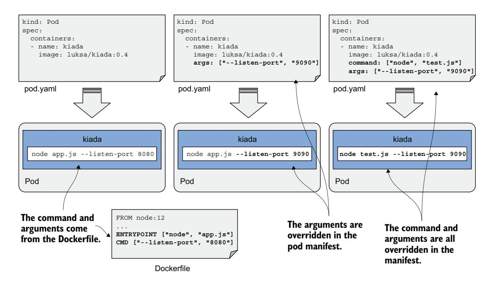
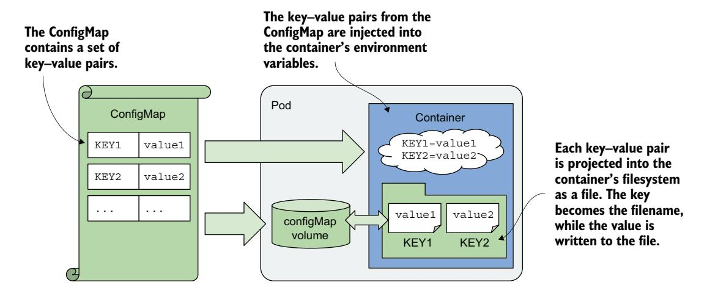
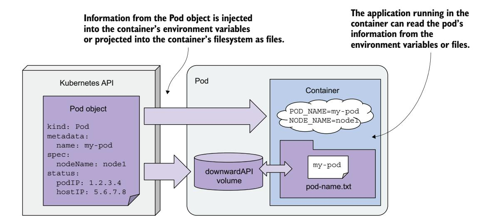

# *Configuring applications with ConfigMaps and Secrets*

# *This chapter covers*

- Setting the command and arguments for the container's main process
- Setting environment variables
- Storing configuration in ConfigMaps
- Storing sensitive information in Secrets
- Using the Downward API to expose pod metadata to the application

In the previous chapters, you learned how to run an application process in Kubernetes. Now, you'll learn how to configure the application—either directly in the pod manifest or through decoupled resources referenced by it. You'll also learn how to inject pod metadata into the environment of the containers within the pod.

NOTE The code files for this chapter are available at [https://mng.bz/vZBa.](https://mng.bz/vZBa)

# *8.1 Setting the command, arguments, and environment variables*

Like regular applications, containerized applications can be configured using commandline arguments, environment variables, and files.

 You learned that the command that gets executed in the container is typically defined in the container image. You specify the command in the container's Dockerfile using the ENTRYPOINT directive and the arguments with the CMD directive. Environment variables can also be specified; you do this with the ENV directive. If the application is configured using configuration files, these can be added to the container image using the COPY directive. You've seen several examples of this in the previous chapters.

 Let's take the Kiada application and make it configurable via command-line arguments and environment variables. The previous versions of the application all listen on port 8080. Let's make this configurable via the --listen-port command line argument. And let's also make the initial status message configurable through an environment variable called INITIAL\_STATUS\_MESSAGE. Instead of just returning the hostname, the application will now also return the pod name and IP address, as well as the name of the cluster node on which it is running. The application obtains this information through environment variables. You can find the updated code in the book's code repository. The container image for this new version is available at docker.io/luksa/ kiada:0.4.

 The updated Dockerfile, which you can also find in the code repository, is shown in the following listing.

Listing 8.1 A sample Dockerfile using several application configuration methods

```
FROM node:12
COPY app.js /app.js
COPY html/ /html
ENV INITIAL_STATUS_MESSAGE="This is the default status message" 
ENTRYPOINT ["node", "app.js"] 
CMD ["--listen-port", "8080"] 
                                                                                Sets an 
                                                                                environment 
                                                                                variable
                                                  Sets the command to run 
                                                  when the container is started
                                                Sets the default command-line arguments
```

The environment variable, command, and arguments defined in the Dockerfile are just the defaults used when you run the container without specifying any options. But Kubernetes allows you to override these defaults in the pod manifest. Let's see how.

## *8.1.1 Setting the command and arguments*

As already mentioned, the command and arguments for a container are specified using the ENTRYPOINT and CMD directives in the Dockerfile. They each accept an array of values. When the container is executed, the two arrays are concatenated to produce the full command.

 Kubernetes provides two fields that are analogous to these two directives. The two pod manifest fields are called command and args. You specify them in the container definition stanza of your pod manifest. As with Docker, the two fields accept array values, and the resulting command that's executed in the container is derived by concatenating the two arrays, as shown figure 8.1.



Figure 8.1 Overriding the command and arguments in the pod manifest

When writing a Dockerfile, you typically use the ENTRYPOINT directive to specify the bare command and the CMD directive to specify the arguments. This allows you to run the container with different arguments without having to specify the command itself. But you can still override the command if the need arises. And you can do it without overriding the arguments, so it's great that the command and arguments are split across two different Dockerfile directives and pod manifest fields.

 Table 8.1 shows the equivalent pod manifest field for each of the two Dockerfile directives.

| Table 8.1 |  | Specifying the command and arguments in the Dockerfile vs. the pod manifest |  |  |  |  |  |
|-----------|--|-----------------------------------------------------------------------------|--|--|--|--|--|
|-----------|--|-----------------------------------------------------------------------------|--|--|--|--|--|

| Dockerfile | Pod manifest | Description                                                                                                                         |
|------------|--------------|-------------------------------------------------------------------------------------------------------------------------------------|
| ENTRYPOINT | command      | The executable file that runs in the container. This may contain argu<br>ments in addition to the executable but typically doesn't. |
| CMD        | args         | Additional arguments passed to the command specified with the<br>ENTRYPOINT directive or the command field                          |

Let's look at two examples of setting the command and args fields.

#### SETTING THE COMMAND

Imagine you want to run the Kiada application with CPU and heap profiling enabled. With Node.JS, you can enable profiling by running the node command with the --cpuprof and --heap-prof flags. Instead of modifying the Dockerfile and rebuilding the image, you can enable profiling in your pod by modifying the pod manifest, as shown in the following listing.

Listing 8.2 A container definition with the command specified

```
kind: Pod
spec:
  containers:
  - name: kiada
 image: luksa/kiada:0.4
   command: ["node", "--cpu-prof", "--heap-prof", "app.js"] 
                                                       When the container is started, this
                                                      command is executed instead of the
                                                       one defined in the container image.
```

When you deploy the pod in the listing, the node --cpu-prof --heap-prof app.js command is run instead of the default command specified in the Dockerfile (node app.js).

 As you can see in the listing, the command field, just like its Dockerfile counterpart, accepts an array of strings representing the command to be executed. The array notation used in the listing is great when the array contains only a few elements, but it becomes difficult to read as the number of elements increases. In this case, you're better off using the following notation:

#### command:

- node
- --cpu-prof
- --heap-prof
- app.js

TIP Values that the YAML parser might interpret as something other than a string must be enclosed in quotes. This includes numeric values such as 1234, and Boolean values such as true and false. Unfortunately, YAML also treats some common words as Boolean values, so you must quote these as well when using them in the command array: yes, no, on, off, y, n, t, f, null, and others.

## SETTING COMMAND ARGUMENTS

As mentioned before, command-line arguments can also be overridden in the pod manifest. This is done in the args field in the container definition, as shown in the following listing.

#### Listing 8.3 A container definition with the **args** fields set

kind: Pod spec:

```
containers:
  - name: kiada
 image: luksa/kiada:0.4
   args: ["--listen-port", "9090"] 
                                                    This overrides the 
                                                    arguments set in the 
                                                    container image.
```

The pod manifest in the listing overrides the default --listen-port 8080 arguments set in the Dockerfile with --listen-port 9090. When you deploy this pod, the full command that runs in the container is node app.js --listen-port 9090. The command is a concatenation of the ENTRYPOINT in the Dockerfile and the args field in the pod manifest.

## *8.1.2 Setting environment variables in a container*

Containerized applications are often configured using environment variables. Just like the command and arguments, you can set environment variables for each container in the pod, as shown in figure 8.2.


Figure 8.2 Environment variables are set per container.

NOTE As I write this, environment variables can only be set for each container individually. It isn't possible to set a global set of environment variables for the entire pod and have them inherited by all its containers.

You can set an environment variable to a literal value, reference another environment variable, or obtain the value from an external source. Let's see how.

#### SETTING AN ENVIRONMENT VARIABLE TO A LITERAL VALUE

Version 0.4 of the Kiada application displays the name of the pod, which it reads from the environment variable POD\_NAME. It also allows you to set the status message using the environment variable INITIAL\_STATUS\_MESSAGE. Let's set these two variables in the pod manifest. Use the env field as shown in listing 8.4. You can find this pod manifest in the file pod.kiada.env-value.yaml.

Listing 8.4 Setting environment variables in the pod manifest

```
kind: Pod
metadata:
 name: kiada
spec:
 containers:
 - name: kiada
 image: luksa/kiada:0.4
 env: 
 - name: POD_NAME 
 value: kiada 
 - name: INITIAL_STATUS_MESSAGE 
 value: This status message is set in the pod spec. 
 ...
                                        The env field contains a list 
                                        of environment variables 
                                        for the container.
                                           The environment variable 
                                           POD_NAME is set to "kiada."
                                                                    Another environment 
                                                                    variable is set here.
```

As you can see in the listing, the env field takes a list of entries. Each entry specifies the name of the environment variable and its value.

NOTE Since environment variables values must be strings, you must enclose values that aren't strings in quotes to prevent the YAML parser from treating them as anything other than a string. As explained in section 8.1.1, this also applies to numbers as well as strings such as yes, no, true, false, and so on.

TIP You can see a list of environment variables defined in a pod by running the command kubectl set env pod <pod-name> --list. This only displays the environment variables defined in the pod manifest, not the actual variables inside the container.

When you deploy the pod in the listing and send an HTTP request to the application, you should see the pod name and status message that you set in the manifest. You can also run the following command to examine the environment variables in the container. You'll find the two environment variables in the following output:

```
$ kubectl exec kiada -- env
PATH=/usr/local/sbin:/usr/local/bin:/usr/sbin:/usr/bin:/sbin:/bin 
HOSTNAME=kiada 
NODE_VERSION=12.19.1 
YARN_VERSION=1.22.5 
POD_NAME=kiada 
INITIAL_STATUS_MESSAGE=This status message is set in the pod spec. 
KUBERNETES_SERVICE_HOST=10.96.0.1 
... 
KUBERNETES_SERVICE_PORT=443 
                                                                            Set by the system
                                                                    Set in the container image
                                                                              Set in the 
                                                                              pod manifest
                                                                             Set by 
                                                                             Kubernetes
```

As you can see, there are a few other variables set in the container. They come from different sources—some are defined in the container image, some are added by Kubernetes, and the rest come from elsewhere. While there is no way to know where each of the variables comes from, you'll learn to recognize some of them. For example, the ones added by Kubernetes relate to the Service object, which is covered in chapter 11. To determine where the rest come from, you can inspect the pod manifest and the Dockerfile of the container image.

#### INLINING OTHER ENVIRONMENT VARIABLES

In the previous example, you set a fixed value for the environment variable INITIAL\_ STATUS\_MESSAGE, but you can also reference other environment variables in the value by using the syntax \$(VAR\_NAME).

 For example, you can reference the variable POD\_NAME within the status message variable as in the following listing, which shows part of the file pod.kiada.env-valueref.yaml.

#### Listing 8.5 Referring to an environment variable in another variable

env: - name: POD\_NAME value: kiada - name: INITIAL\_STATUS\_MESSAGE value: My name is \$(POD\_NAME). I run NodeJS version \$(NODE\_VERSION). **The value includes a reference to the POD\_NAME and NODE\_VERSION environment variables.**

Notice that one of the references points to the environment variable POD\_NAME defined in the listing, whereas the other points to the variable NODE\_VERSION set in the container image. You saw this variable when you ran the env command in the container earlier. When you deploy the pod, the status message it returns is the following:

My name is kiada. I run NodeJS version \$(NODE\_VERSION).

As you can see, the reference to NODE\_VERSION isn't resolved. This is because you can only use the \$(VAR\_NAME) syntax to refer to variables defined in the same manifest. The referenced variable must be defined *before* the variable that references it. Since NODE\_VERSION is defined in the Node.js image's Dockerfile and not in the pod manifest, it can't be resolved.

NOTE If a variable reference cannot be resolved, the reference string remains unchanged.

NOTE When you want a variable to contain the literal string \$(VAR\_NAME) and don't want Kubernetes to resolve it, use a double dollar sign as in \$\$(VAR\_NAME). Kubernetes will remove one of the dollar signs and skip resolving the variable.

#### USING VARIABLE REFERENCES IN THE COMMAND AND ARGUMENTS

You can refer to environment variables defined in the manifest not only in other variables, but also in the command and args fields you learned about in the previous section. For example, the file pod.kiada.env-value-ref-in-args.yaml defines an environment variable named LISTEN\_PORT and references it in the args field. Listing 8.6 shows the relevant part of this file.

#### Listing 8.6 Referring to an environment variable in the **args** field

```
spec:
 containers:
 - name: kiada
 image: luksa/kiada:0.4
 args:
 - --listen-port
 - $(LISTEN_PORT) 
 env:
 - name: LISTEN_PORT
 value: "8080"
                               Resolved to the 
                               LISTEN_PORT variable 
                               set below
```

This isn't the best example, since there's no good reason to use a variable reference instead of just specifying the port number directly. But later, you'll learn how to get the environment variable value from an external source. You can then use a reference as shown in the listing to inject that value into the container's command or arguments.

#### REFERRING TO ENVIRONMENT VARIABLES THAT AREN'T IN THE MANIFEST

Just like using references in environment variables, you can only use the \$(VAR\_NAME) syntax in the command and args fields to reference variables that are defined in the pod manifest. You can't reference environment variables defined in the container image, for example.

 However, you can use a different approach. If you run the command through a shell, you can have the shell resolve the variable. If you are using the bash shell, you can do this by referring to the variable using the syntax \$VAR\_NAME or \${VAR\_NAME} instead of \$(VAR\_NAME). Note the difference in the use of curly braces and parentheses.

 For example, the command in the following listing correctly prints the value of the HOSTNAME environment variable even though it's not defined in the pod manifest but is initialized by the operating system. You can find this example in the file pod.env-varreferences-in-shell.yaml.

## Listing 8.7 Referring to environment variables in a shell command

```
containers:
- name: main
 image: alpine
 command:
 - sh 
 - -c 
 - 'echo "Hostname is $HOSTNAME."; sleep infinity' 
                             The top command 
                             executed in this 
                             container is the shell.
                                                                       The shell resolves 
                                                                       the reference to the 
                                                                       HOSTNAME environment 
                                                                       variable before executing 
                                                                       the commands echo and 
                                                                       sleep.
```

## Setting the pod's fully qualified domain name

While we're on the subject, it's a good time to explain that the pod's hostname and subdomain are configurable in the pod manifest. By default, the hostname is the same as the pod's name, but you can override it using the hostname field in the pod's spec. You can also set the subdomain field so that the fully qualified domain name (FQDN) of the pod is as follows: <hostname>.<subdomain>.<pod namespace>.svc .<cluster domain>.

This is only the internal FQDN of the pod. It isn't resolvable via DNS without additional steps, which are explained in chapter 11. You can find a sample pod that specifies a custom hostname for the pod in the file pod.kiada.hostname.yaml.

# *8.2 Using a ConfigMap to decouple configuration from the pod manifest*

In the previous section, you learned how to hardcode configuration directly into your pod manifests. While this is much better than hardcoding it in the container image, it's still not ideal because it means you might need a separate version of the pod manifest for each environment you deploy the pod to, such as your development, staging, or production cluster.

 To reuse the same pod definition in multiple environments, it's better to decouple the configuration from the pod manifest. One way to do this is to move the configuration into a ConfigMap object, which you then reference in the pod. This is what you'll do next.

## *8.2.1 Introducing ConfigMaps*

A ConfigMap is a Kubernetes API object that simply contains a list of key–value pairs. The values can range from short strings to large blocks of structured text that you typically find in an application configuration file. Pods can reference one or more of these key–value entries in the ConfigMap. A pod can refer to multiple ConfigMaps, and multiple pods can use the same ConfigMap.

 To keep applications Kubernetes-agnostic, you don't typically have them read the ConfigMap object via the Kubernetes REST API. Instead, the key–value pairs in the ConfigMap are passed to containers as environment variables or mounted as files in the container's filesystem via a configMap volume, as shown in figure 8.3. In this chapter, we'll focus on the former; the latter will be covered in the next chapter, which explains several different types of volumes.

 In the previous section, you learned how to reference environment variables in command-line arguments. You can use this technique to pass a ConfigMap entry that you've exposed as an environment variable into a command-line argument.

 Regardless of how an application consumes ConfigMaps, storing the configuration in a separate object instead of the pod allows you to keep the configuration separate for different environments by simply keeping separate ConfigMap manifests and applying each to the environment for which it is intended. Because pods reference the ConfigMap by name, you can deploy the same pod manifest across all your environments and still have a different configuration for each environment by using the same ConfigMap name, as shown in figure 8.4.



Figure 8.3 Pods use ConfigMaps through environment variables and ConfigMap volumes.


Figure 8.4 Deploying the same pod manifest and different ConfigMap manifests in different environments

## 8.2.2 Creating a ConfigMap object

Let's create a ConfigMap and use it in a pod. The following is a simple example where the ConfigMap contains a single entry for the environment variable INITIAL\_STATUS\_MESSAGE for the kiada pod.

## CREATING A CONFIGMAP WITH THE KUBECTL CREATE CONFIGMAP COMMAND

As with pods, you can create the ConfigMap object from a YAML manifest, but a faster way is to use the kubectl create configmap command as follows:

**\$ kubectl create configmap kiada-config \ --from-literal status-message="This status message is set in the kiada-config ConfigMap"** configmap "kiada-config" created

NOTE Keys in a ConfigMap may only consist of alphanumeric characters, dashes, underscores, and dots. Other characters are not allowed.

Running this command creates a ConfigMap object called kiada-config containing a single entry. The key and value are specified with the --from-literal argument.

 In addition to --from-literal, the kubectl create configmap command also supports sourcing the key–value pairs from files. Table 8.2 explains the available methods.

| Table 8.2 |  |  | Options for creating ConfigMap entries using kubectl |  | create configmap |
|-----------|--|--|------------------------------------------------------|--|------------------|
|-----------|--|--|------------------------------------------------------|--|------------------|

| Option        | Description                                                                                                                                                                                                                                                                                                                                    |
|---------------|------------------------------------------------------------------------------------------------------------------------------------------------------------------------------------------------------------------------------------------------------------------------------------------------------------------------------------------------|
| from-literal  | Inserts a key and a literal value into the ConfigMap (e.g.,from-literal<br>mykey=myvalue).                                                                                                                                                                                                                                                     |
| from-file     | Inserts the contents of a file into the ConfigMap. The behavior depends on the<br>argument that comes afterfrom-file.                                                                                                                                                                                                                          |
|               | If only the filename is specified (example:from-file myfile.txt), the<br>base name of the file is used as the key and the entire contents of the file are<br>used as the value.                                                                                                                                                                |
|               | If key=file is specified (e.g.,from-file mykey=myfile.txt), the con<br>tents of the file are stored under the specified key.                                                                                                                                                                                                                   |
|               | If the filename represents a directory, each file contained in the directory is<br>included as a separate entry. The base name of the file is used as the key, and<br>the contents of the file are used as the value. Subdirectories, symbolic links,<br>devices, pipes, and files whose base name isn't a valid ConfigMap key are<br>ignored. |
| from-env-file | Inserts each line of the specified file as a separate entry (e.g.,from-env<br>file myfile.env). The file must contain lines with the following format:<br>key=value.                                                                                                                                                                           |

ConfigMaps usually contain multiple entries. You can repeat the arguments --fromliteral, --from-file, and --from-env-file multiple times. You can also combine --from-literal and --from-file, but at the time of writing, you can't combine them with --from-env-file.

#### CREATING A CONFIGMAP FROM A YAML MANIFEST

Alternatively, you can create the ConfigMap from a YAML manifest file. Listing 8.8 shows the contents of an equivalent manifest file named cm.kiada-config.yaml, which is available in the code repository. You can create the ConfigMap by applying this file using kubectl apply.

#### Listing 8.8 A ConfigMap manifest file

```
apiVersion: v1 
kind: ConfigMap 
metadata:
 name: kiada-config 
data: 
 status-message: This status message is set in the kiada-config ConfigMap 
                               This manifest defines a 
                               ConfigMap object.
                                          The name of this ConfigMap
                                                                         Key–value pairs are
                                                                             specified in the
                                                                                 data field.
```

## CREATING A CONFIGMAP FROM FILES

As explained in table 8.2, you can also use the kubectl create configmap command to create a ConfigMap from files. This time, instead of creating the ConfigMap directly in the cluster, you'll learn how to use this command to generate a YAML manifest for the ConfigMap so that you can store it in a version control system alongside your Pod manifest. The following command generates a ConfigMap called dummy-config from the dummy.txt and dummy.bin files and stores it in a file called dummy-configmap.yaml.

```
$ kubectl create configmap dummy-config \
 --from-file=dummy.txt \
 --from-file=dummy.bin \
 --dry-run=client -o yaml > dummy-configmap.yaml
```

The ConfigMap will contain two entries, one for each file specified in the command. One is a text file, while the other is just some random data to demonstrate that binary data can also be stored in a ConfigMap.

 When using the --dry-run option, the command doesn't create the object in the Kubernetes API server but only generates the object definition. The -o yaml option prints the YAML definition of the object to standard output, which is then redirected to the dummy-configmap.yaml file. The following listing shows the contents of this file.

#### Listing 8.9 A ConfigMap manifest created from two files

```
apiVersion: v1
binaryData:
 dummy.bin: n2VW39IEkyQ6Jxo+rdo5J06Vi7cz5... 
data:
 dummy.txt: |- 
 This is a text file with multiple lines 
 that you can use to test the creation of 
 a ConfigMap in Kubernetes. 
kind: ConfigMap
metadata:
 creationTimestamp: null
 name: kiada-envoy-config 
                                                          Base64-encoded 
                                                          content of the 
                                                          dummy.bin file
                                                            Contents of the 
                                                            dummy.txt file
                                          The name of this 
                                          ConfigMap
```

As you can see in the listing, the binary file ends up in the binaryData field. If a ConfigMap item contains non-UTF-8 byte sequences, it must be defined in the binary-Data field. The kubectl create configmap command automatically determines where to put the item. The values in the binaryData field are Base64 encoded, which is how binary values are represented in YAML and JSON.

 In contrast, the contents of the dummy.txt file are clearly visible in the data field. In YAML, you can specify multiline values using a pipeline character and appropriate indentation. See the YAML specification on YAML.org for more ways to do this.

## Mind your whitespace hygiene when creating ConfigMap manifests

When creating ConfigMaps from files, make sure that none of the lines in the file contain trailing whitespace. If any line ends with whitespace, the ConfigMap item is formatted as a quoted string, making it much harder to read.

Compare the formatting of the two values in the following ConfigMap:

```
$ kubectl create configmap dummy-config \
 --from-file=dummy.yaml \
 --from-file=dummy-bad.yaml \
 --dry-run=client -o yaml
apiVersion: v1
data:
 dummy-bad.yaml: dummy: \n name: dummy-bad.yaml\n note: This 
 file has a space at the end of the first line. 
 dummy.yaml: | 
 dummy: 
 name: dummy.yaml 
 note: This file is correctly formatted with no trailing spaces. 
kind: ConfigMap
metadata:
 creationTimestamp: null
 name: dummy-config
                                                       Item created from
                                                       a file with trailing
                                                            whitespace
                                                 Item created from a clean file
                                                   with no trailing whitespace
```

Notice that the file dummy-bad.yaml has an unnecessary space at the end of the first line. This causes the config map entry to be presented in a not very human-friendly format. In contrast, the dummy.yaml file has no trailing whitespace and is presented as an unescaped multiline string, which makes it easy to read and modify in place.

## LISTING CONFIGMAPS AND DISPLAYING THEIR CONTENTS

ConfigMaps are Kubernetes API objects that live alongside pods, nodes, and other resources you've learned about so far. You can use various kubectl commands to perform CRUD operations on them. For example, you can list ConfigMaps with

#### \$ **kubectl get cm**

NOTE The shorthand for configmaps is cm.

You can display the entries in the ConfigMap by instructing kubectl to print the ConfigMap's YAML manifest:

#### \$ **kubectl get cm kiada-config -o yaml**

NOTE Because YAML fields are output in alphabetical order, you'll find the data field at the top of the output.

TIP To display only the key–value pairs, combine kubectl with jq—for example, kubectl get cm kiada-config -o json | jq .data. Display the value of a given entry as follows: kubectl... | jq '.data["status-message"]'.

## *8.2.3 Injecting ConfigMap values into environment variables*

In the previous section, you created the kiada-config ConfigMap. Let's use it in the kiada Pod.

#### INJECTING A SINGLE CONFIGMAP ENTRY

To inject the single ConfigMap entry into an environment variable, you just need to replace the value field in the environment variable definition with the valueFrom field and refer to the ConfigMap entry. The following listing shows the relevant part of the pod manifest. The full manifest can be found in the file pod.kiada.env-value-From.yaml.

#### Listing 8.10 Setting an environment variable from a ConfigMap entry

```
kind: Pod
...
spec:
 containers:
 - name: kiada
 env: 
 - name: INITIAL_STATUS_MESSAGE 
 valueFrom: 
 configMapKeyRef: 
 name: kiada-config 
 key: status-message 
 optional: true 
 volumeMounts:
 - ...
                                              You're setting the 
                                              environment variable 
                                              INITIAL_STATUS_MESSAGE.
                                           Instead of using a fixed value, the value 
                                           is obtained from a ConfigMap key.
                                             The name of the ConfigMap 
                                             that contains the value
                                            The ConfigMap key you're referencing
                                         The container may run even If the 
                                         ConfigMap or key is not found.
```

Instead of specifying a fixed value for the variable, you declare that the value should be obtained from a ConfigMap. The name field specifies the ConfigMap name, and the key field specifies the key within that map.

 Create the pod from this manifest and inspect its environment variables using the following command:

```
$ kubectl exec kiada -- env
...
INITIAL_STATUS_MESSAGE=This status message is set in the kiada-config 
     ConfigMap
...
```

The status message should also appear in the pod's response when you access it via curl or your browser.

#### MARKING A REFERENCE OPTIONAL

In the previous listing, the reference to the ConfigMap key is marked as optional so that the container can be executed even if the ConfigMap or key is missing. When that's the case, the environment variable isn't set. You can mark the reference as optional because the Kiada application will run fine without it. You can delete the ConfigMap and deploy the pod again to confirm this.

NOTE If a ConfigMap or key referenced in the container definition is missing and not marked as optional, the pod will still be scheduled normally, and the other containers in the pod are started normally. The container that references the missing ConfigMap key is blocked from starting until you create the ConfigMap with the referenced key.

## INJECTING THE ENTIRE CONFIGMAP

The env field in a container definition takes a list of name–value pairs, so you can set as many environment variables as you need. However, when you want to set more than a few variables, it can become tedious and error prone to specify them individually. Fortunately, using the envFrom instead of the env field allows you to inject all the entries from the ConfigMap at once.

 The downside to this approach is that you lose the ability to transform the key to the environment variable name, so the keys must already have the proper form. The only transformation that you can do is to prepend a prefix to each key.

 For example, the Kiada application reads the environment variable INITIAL\_STATUS\_ MESSAGE, but the key you used in the ConfigMap is status-message. You must change the ConfigMap key to match the expected environment variable name if you want it to be read by the application when using the envFrom field. I've already done this in the cm.kiada-config.envFrom.yaml file. In addition to the INITIAL\_STATUS\_MESSAGE key, it contains two other keys to demonstrate that they will all be injected into the container's environment.

Replace the ConfigMap with the one in the file by running the following command:

#### \$ **kubectl replace -f cm.kiada-config.envFrom.yaml**

The pod manifest in the pod.kiada.envFrom.yaml file uses the envFrom field to inject the entire ConfigMap into the pod. Listing 8.11 shows the relevant part of the manifest.

Listing 8.11 Using **envFrom** to inject the entire ConfigMap into environment variables

```
kind: Pod
...
spec:
 containers:
 - name: kiada
 envFrom: 
 - configMapRef: 
 name: kiada-config 
 optional: true 
                                     Using envFrom instead 
                                     of env to inject the 
                                     entire ConfigMap
                                         The name of the ConfigMap to inject. 
                                         Unlike before, no key is specified.
                                        The container should run even if 
                                        the ConfigMap does not exist.
```

Instead of specifying both the ConfigMap name and the key as in the previous example, only the name must be specified. If you create the pod from this manifest and inspect its environment, you'll see that it contains the variable INITIAL\_STATUS\_MESSAGE as well as the other two keys defined in the ConfigMap.

 Just like configMapKeyRef, configMapRef allows you to mark the reference as optional, allowing the container to run even if the ConfigMap doesn't exist. By default, this isn't the case. Containers that reference ConfigMaps are prevented from starting until the referenced ConfigMaps exist.

#### INJECTING MULTIPLE CONFIGMAPS

You may have noticed in listing 8.11 that the envFrom field takes a list of values, which means you can combine entries from multiple ConfigMaps. If two ConfigMaps contain the same key, the last one takes precedence. You can also combine the envFrom field with the env field if you wish to inject all entries of one ConfigMap and particular entries of another.

NOTE When an environment variable is configured in the env field, it takes precedence over environment variables set in the envFrom field.

#### PREFIXING KEYS

Regardless of whether you inject a single ConfigMap or multiple ConfigMaps, you can set an optional prefix for each ConfigMap. When their entries are injected into the container's environment, the prefix is prepended to each key to produce the environment variable name.

## *8.2.4 Updating and deleting ConfigMaps*

As with most Kubernetes API objects, you can update a ConfigMap at any time by modifying the manifest file and reapplying it to the cluster using kubectl apply. There's also a quicker way, which you'll mostly use during development.

#### IN-PLACE EDITING OF API OBJECTS USING KUBECTL EDIT

When you want to make a quick change to an API object, such as a ConfigMap, you can use the kubectl edit command. For example, to edit the kiada-config Config-Map, run the following command:

\$ kubectl edit configmap kiada-config

This opens the object manifest in your default text editor, allowing you to change the object directly. When you close the editor, kubectl posts your changes to the Kubernetes API.

TIP If you prefer to edit the object manifest in the JSON format instead of YAML, run the kubectl edit command with the -o json option.

## Configuring kubectl edit to use a different text editor

You can tell kubectl to use a text editor of your choice by setting the KUBE\_EDITOR environment variable. For example, if you'd like to use nano for editing Kubernetes resources, execute the following command (or put it into your ~/.bashrc or an equivalent file):

export KUBE\_EDITOR="/usr/bin/nano"

If the KUBE\_EDITOR environment variable isn't set, kubectl edit falls back to using the default editor, usually configured through the EDITOR environment variable.

#### WHAT HAPPENS WHEN YOU MODIFY A CONFIGMAP

When you update a ConfigMap, the environment variable values in existing pods are not updated. However, if the container is restarted (either because it crashed or because it was terminated externally due to a failed liveness probe), the new container will use the new values. This raises the question of whether you want this behavior. Let's see why.

NOTE In the next chapter, you'll learn that when ConfigMap entries are exposed in a container as files rather than environment variables, they *are updated* in all running containers that reference the ConfigMap. There is no need to restart the container.

#### UNDERSTANDING THE CONSEQUENCES OF UPDATING A CONFIGMAP

One of the most important properties of containers is their immutability, which allows you to be sure that there are no differences between multiple instances of the same container (or pod). Shouldn't the ConfigMaps from which these instances get their configuration also be immutable?

 Let's think about this for a moment. What happens if you change a ConfigMap used to inject environment variables into an application? The changes you make to the ConfigMap don't affect any of these running application instances. However, if some of these instances are restarted or if you create additional instances, they will use the new configuration.

 You end up with pods that are configured differently and may cause parts of your system to behave differently than the rest. You need to take this into account when deciding whether to allow changes to a ConfigMap while it's being used by running pods.

#### PREVENTING A CONFIGMAP FROM BEING UPDATED

To prevent users from changing the values in a ConfigMap, you can mark the Config-Map as immutable, as shown in the following listing.

#### Listing 8.12 Creating an immutable ConfigMap

apiVersion: v1 kind: ConfigMap metadata:

name: my-immutable-configmap

data:

 mykey: myvalue another-key: another-value

immutable: true

**This prevents this ConfigMap's values from being updated.**

If someone tries to change the data or binaryData fields in an immutable ConfigMap, the API server will prevent it. This ensures that all pods using this ConfigMap use the same configuration values. If you want to run a set of pods with a different configuration, you typically create a new ConfigMap and use it in these new pods.

 Immutable ConfigMaps prevent users from accidentally changing application configuration but also help improve the performance of your Kubernetes cluster. When a ConfigMap is marked as immutable, the Kubelets on the worker nodes don't have to be notified of changes to the ConfigMap object. This reduces the load on the API server.

## DELETING A CONFIGMAP

ConfigMap objects can be deleted with the kubectl delete command. The running pods that reference the ConfigMap continue to run unaffected, but only until their containers must be restarted. If the ConfigMap reference in the container definition isn't marked as optional, the container will fail to run.

# *8.3 Using Secrets to pass sensitive data to containers*

In the previous section, you learned how to store configuration data in ConfigMap objects and make it available to the application via environment variables. You may think that you can use ConfigMaps to also store sensitive data such as credentials and encryption keys, but this isn't the best approach. For any data that needs to be kept secure, Kubernetes provides another type of object—*Secrets*.

## *8.3.1 Introducing Secrets*

Secrets are not very different from ConfigMaps, as they also contain key–value pairs and can be used to inject environment variables and files into containers. So why do we need Secrets at all?

 Secrets were in fact introduced long before ConfigMaps. However, Secrets were initially not user-friendly when it came to storing plain-text data, because the values in the Secret were Base64-encoded. You even had to encode the value yourself before putting it into the YAML manifest. For this reason, ConfigMaps were later introduced. Over time, both Secrets and ConfigMaps evolved to support both plain-text and binary Base64-encoded data. The functionality provided by these two types of objects converged. If they were added now, I'm certain they would be introduced as a single object type. However, because they each evolved gradually, there are some differences between them.

#### DIFFERENCES IN FIELDS BETWEEN CONFIGMAPS AND SECRETS

The structure of a Secret is slightly different from that of a ConfigMap. Table 8.3 shows the fields in each of the two object types.

| Secret     | ConfigMap  | Description                                                                                                                  |
|------------|------------|------------------------------------------------------------------------------------------------------------------------------|
| data       | binaryData | A map of key–value pairs. The values are Base64-encoded strings.                                                             |
| stringData | data       | A map of key–value pairs. The values are plain text strings. The<br>stringData field in Secrets is write-only.               |
| immutable  | immutable  | A Boolean value indicating whether the data stored in the object<br>can be updated.                                          |
| type       | N/A        | A string indicating the type of Secret. It can be any string value,<br>but several built-in types have special requirements. |

Table 8.3 Differences in the structure of Secrets and ConfigMaps

As you can see from the table, the data field in Secrets corresponds to the binaryData field in ConfigMaps. It can contain binary values as Base64-encoded strings. The stringData field in Secrets is equivalent to the data field in ConfigMaps and is used to store plain text values.

NOTE The values in the data field must be Base64-encoded, since the YAML and JSON formats don't inherently support binary data. However, these binary values are only encoded within the manifest. When you inject the Secret into a container, Kubernetes decodes the values before initializing the environment variable or writing the value to a file. Thus, the application running in the container can read these values in their original, unencoded form.

This stringData field in Secrets is write-only. You can use it to add plain text values to the Secret without having to encode them manually. When you retrieve the Secret object from the API, it contains no stringData field. Anything you've added to the field now appears in the data field as a Base64-encoded string. This is different from the behavior of the data and binaryData fields in a ConfigMap. Whatever key–value pair you add to one of these fields is physically stored in that field and appears there when you read back the ConfigMap object from the API.

 Like ConfigMaps, Secrets can be marked immutable by setting the immutable field to true. While ConfigMaps don't have a type, Secrets do; it's specified in the type field. This field is mainly used for programmatic handling of the Secret. You can set it to whatever you want, but there are several built-in types with specific semantics.

#### UNDERSTANDING BUILT-IN SECRET TYPES

When you create a Secret and set its type to one of the built-in types, it must meet the requirements defined for that type, because they are used by various Kubernetes components that expect them to contain values in specific formats under specific keys. Table 8.4 explains the built-in Secret types that exist at the time of writing.

Table 8.4 Types of Secrets

| Built-in Secret type                   | Description                                                                                                                                                                                                                                                                                      |
|----------------------------------------|--------------------------------------------------------------------------------------------------------------------------------------------------------------------------------------------------------------------------------------------------------------------------------------------------|
| Opaque                                 | This type of Secret can contain secret data stored under arbitrary<br>keys. If you create a Secret with no type field, an Opaque Secret<br>is created.                                                                                                                                           |
| bootstrap.kubernetes.io/<br>token      | This type of Secret is used for tokens that are used when bootstrap<br>ping new cluster nodes.                                                                                                                                                                                                   |
| kubernetes.io/basic-auth               | This type of Secret stores the credentials required for basic authenti<br>cation. It must contain the username and password keys.                                                                                                                                                                |
| kubernetes.io/dockercfg                | This type of Secret stores the credentials required for accessing a<br>Docker image registry. It must contain a key called .dockercfg,<br>where the value is the contents of the ~/.dockercfg configuration<br>file used by legacy versions of Docker.                                           |
| kubernetes.io/<br>dockerconfigjson     | Like above, this type of Secret stores the credentials for accessing a<br>Docker registry but uses the newer Docker configuration file format.<br>The Secret must contain a key called .dockerconfigjson. The<br>value must be the contents of the ~/.docker/config.json file<br>used by Docker. |
| kubernetes.io/service<br>account-token | This type of Secret stores a token that identifies a Kubernetes ser<br>vice account.                                                                                                                                                                                                             |
| kubernetes.io/ssh-auth                 | This type of Secret stores the private key used for SSH authentica<br>tion. The private key must be stored under the key ssh-privatekey<br>in the Secret.                                                                                                                                        |
| kubernetes.io/tls                      | This type of Secrets stores a TLS certificate and the associated pri<br>vate key. They must be stored in the Secret under the key tls.crt<br>and tls.key, respectively.                                                                                                                          |

## UNDERSTANDING HOW KUBERNETES STORES SECRETS AND CONFIGMAPS

In addition to the small differences in the field names in ConfigMaps or Secrets, Kubernetes also treats them differently. Secrets are handled in specific ways in all Kubernetes components to improve their security. For example, Kubernetes ensures that the data in a Secret is distributed only to the node that runs the pod that needs the Secret. Also, Secrets on the worker nodes themselves are always stored in memory and never written to physical storage. This makes it less likely for sensitive data to leak.

 For this reason, it's important that you store sensitive data only in Secrets and not ConfigMaps.

## *8.3.2 Creating a Secret*

In section 8.2, you used a ConfigMap to set the INITIAL\_STATUS\_MESSAGE environment variable. Now imagine that this value represents sensitive data. Instead of storing it in a ConfigMap, it's better to store it in a Secret.

#### CREATING A GENERIC (OPAQUE) SECRET WITH KUBECTL CREATE SECRET

As with ConfigMaps, you can create Secrets using the kubectl create command. The items in the resulting Secret would be the same; the only difference would be its type. Here's the command to create the Secret:

```
$ kubectl create secret generic kiada-secret-config \
 --from-literal status-message="This status message is set in the kiada-
     secret-config Secret"
secret "kiada-secret-config" created
```

Unlike when creating a ConfigMap, you must specify the Secret type immediately after kubectl create secret. Here you're creating a generic secret.

NOTE Like ConfigMaps, the maximum size of a Secret is approximately 1MB.

## CREATING SECRETS FROM YAML MANIFESTS

The kubectl create secret command creates the Secret directly in the cluster, but since Secrets are Kubernetes API objects, you can also create them from a YAML manifest.

 For obvious security reasons, it's not the best idea to create YAML manifests for your Secrets and store them in your version control system, as you do with Config-Maps. So, you will use the kubectl create secret command much more often to create Secrets than ConfigMaps. However, if you need to create a YAML manifest instead of creating the Secret directly, you can again use the kubectl create --dry-run=client -o yaml trick that you learned in section 8.2.2.

 Suppose you want to create a Secret YAML manifest containing user credentials under the keys user and pass. You can use the following command to create the YAML manifest:

```
$ kubectl create secret generic my-credentials \ 
 --from-literal user=my-username \ 
 --from-literal pass=my-password \ 
                                                                Creates a generic Secret
                                                               Stores the credentials 
                                                               in keys user and pass
```

```
 --dry-run=client -o yaml 
apiVersion: v1
data:
 pass: bXktcGFzc3dvcmQ= 
 user: bXktdXNlcm5hbWU= 
kind: Secret
metadata:
 creationTimestamp: null
 name: my-credentials
                                           Prints the YAML manifest instead of 
                                           posting the Secret to the API server
                                      Base64-encoded 
                                      credentials
```

Creating the manifest using the kubectl create trick as shown here is much easier than creating it from scratch and manually entering the Base64-encoded credentials. Alternatively, you could avoid encoding the entries by using the stringData field as explained next.

#### USING THE STRINGDATA FIELD

Since not all sensitive data is in binary form, Kubernetes also allows you to specify plain text values in Secrets by using stringData instead of the data field. The following listing shows how you'd create the same Secret that you created in the previous example.

#### Listing 8.13 Adding plain text entries to a Secret using the **stringData** field

apiVersion: v1 kind: Secret stringData: user: my-username pass: my-password **The stringData is used to enter plain text values without encoding them. These credentials aren't encoded using Base64 encoding.**

The stringData field is write-only and can only be used to set values. If you create this Secret and read it back with kubectl get -o yaml, the stringData field is no longer present. Instead, any entries you specified in it will be displayed in the data field as Base64-encoded values.

TIP Since entries in a Secret are always represented as Base64-encoded values, working with Secrets (especially reading them) is not as human-friendly as working with ConfigMaps, so use ConfigMaps wherever possible. But you should never sacrifice security for the sake of comfort.

## CREATING A TLS SECRET

The kiada-ssl Pod from the previous chapters runs the Envoy proxy in a sidecar container. The proxy requires a TLS certificate and private key to run. The certificate and private key are stored in the container image, which isn't ideal, as already discussed. A better place to store the certificate and key is in a Secret. You can then pass the certificate and the key to the proxy as environment variables or files, as you'll see in the next chapter.

 Since we're talking about creating Secrets, let's learn how to create this Secret now, even though you won't use it until the next chapter. To create it, run the following command:

```
$ kubectl create secret tls kiada-tls \ 
 --cert example-com.crt \ 
 --key example-com.key 
                                                            Creating a TLS Secret 
                                                            called kiada-tls
                                                              The path to the 
                                                              certificate file
                                                   The path to the private key file
```

This command instructs kubectl to create a tls Secret named kiada-tls. The certificate and private key are read from the file example-com.crt and example-com.key, respectively. The resulting Secret should look very similar to the manifest in the file secret.kiada-tls.yaml.

#### CREATING A DOCKER REGISTRY SECRET

The last Secret type you can create with the kubectl create secret command is a Docker registry secret, which will allow you to pull images from private container registries. You may have already noticed that when you push a container image to a private container repository, Kubernetes is not able to start pods with a container that uses that image. That's because Kubernetes doesn't have the credentials needed to pull the private image from the registry. To allow it to do so, you must create a pull Secret and reference it in your pod manifest.

Here's how you create the Secret:

```
$ kubectl create secret docker-registry pull-secret \
 --docker-server=<your-container-registry-server> \
 --docker-username=<your-name> \
 --docker-password=<your-password> \
 --docker-email=<your-email>
```

You can also create the pull secret from the contents of your local \$HOME/.docker/config.json file. You can do this with the following command:

```
$ kubectl create secret docker-registry \
 --from-file $HOME/.docker/config.json
```

After the Secret is created, you can reference it in any pods that need it to authenticate with the container registry. You reference the Secret by name in the spec.image-PullSecrets field in the pod's manifest, as in the following listing:

#### Listing 8.14 Adding a pull secret to a pod

apiVersion: v1 kind: Pod metadata:

name: private-image

```
spec:
 imagePullSecrets: 
 - name: pull-secret 
 containers: 
 - name: private 
 image: docker.io/me/my-private-image 
                                  You specify the name of the 
                                  Docker registry secret here.
                                                                Kubernetes uses the credentials 
                                                                in the pull secret to pull the 
                                                                private image for this container.
```

## *8.3.3 Using Secrets in containers*

As explained earlier, you can use Secrets in containers the same way you use Config-Maps—you can use them to set environment variables or create files in the container's filesystem. You'll learn how to do the latter in the next chapter, so we'll only look at the former approach here.

#### INJECTING SECRETS INTO ENVIRONMENT VARIABLES

To inject an entry from a Secret into an environment variable, use the value-From.secretKeyRef field as in the following listing, which shows part of the manifest from the file pod.kiada.env-valueFrom-secretKeyRef.yaml.

#### Listing 8.15 Exposing data from a Secret as an environment variable

```
 containers:
 - name: kiada
 env:
 - name: INITIAL_STATUS_MESSAGE
 valueFrom: 
 secretKeyRef: 
 name: kiada-secret-config 
 key: status-message 
                                               The value is obtained 
                                               from a Secret.
                                                    The name of the Secret 
                                                    that contains the key.
                                               The key associated with the value that you 
                                               want to initialize the environment variable to.
```

Instead of using env.valueFrom, you could also use envFrom to inject the entire Secret instead of injecting its entries individually, as you did in section 8.2.3. Instead of configMapRef, you'd use the secretRef field.

#### SHOULD YOU INJECT SECRETS INTO ENVIRONMENT VARIABLES?

As you can see, injecting Secrets into environment variables is no different from injecting ConfigMaps. But even if Kubernetes allows you to expose secrets in this way, it may not be the best idea, as it can pose a security risk. Applications typically output environment variables in error reports or even write them to the application log at startup, so injecting Secrets into environment variables may inadvertently expose them. Also, child processes inherit all environment variables from the parent process. So, if your application calls a third-party child process, your secret information could be compromised. A better approach is to inject Secrets into containers via files, as described in the next chapter.

TIP Instead of injecting Secrets into environment variables, project them into the container as files in a secret volume. This reduces the likelihood that the Secrets will inadvertently be exposed to attackers.

## *8.3.4 Understanding why Secrets aren't always secure*

Although using Secrets to store sensitive data is better than storing it in a ConfigMap, it is important to understand that Secrets are not as secure as one might assume. The real security challenge is in controlling who has access to these Secrets and how they are stored.

## VALUES IN A SECRET MANIFEST ARE ENCODED, NOT ENCRYPTED

One common misconception is that the values in a Secret are encrypted, which isn't the case. As mentioned before, they are Base64-encoded strings—a method of encoding, not encryption. Anyone with access to the Secret can easily decode and read the underlying sensitive data.

#### SECRETS MAY BE STORED UNENCRYPTED

Secrets are stored in etcd, the key–value store behind the Kubernetes API server, along with all the other resources. Unless encryption is enabled, Secrets are stored unencrypted on disk. If an attacker gains access to this disk or etcd directly, they can see all your secrets.

#### OTHER USERS MAY BE ABLE TO READ SECRETS VIA THE KUBERNETES API

Access to Secrets and other Kubernetes API resources is controlled by RBAC (Role-Based Access Control). A misconfiguration of RBAC rules or overly permissive user roles can unintentionally expose Secrets to unauthorized users. Also, once a Secret is injected into a pod, either as an environment variable or a file, the sensitive data can be leaked if the application in the pod is compromised. I've already mentioned that the simple action of an application writing its environment variables to its logs could easily cause secret information to be leaked.

#### NO AUTOMATIC ROTATION OF SECRETS

One way to improve security of authentication tokens and other secrets is to automatically rotate them at regular intervals. Kubernetes Secrets don't provide any such features, other than automatically updating the files in a secret volume when the associated Secret is updated. You must rotate the secrets in your Secrets manually.

#### ENHANCING SECRETS WITH EXTERNAL SECRET MANAGEMENT TOOLS

The recommended solution for the mentioned problems is to complement Kubernetes Secrets with dedicated external secret management tools, such as HashiCorp Vault. These systems offer robust encryption, fine-grained access control, automatic secret rotation, detailed audit logs, and dynamic secret generation. However, this topic is beyond the scope of this book, so please refer to the documentation of these tools for more information.

# *8.4 Exposing metadata to containers via the Downward API*

So far in this chapter, you've learned how to pass configuration data to your application. But that data was always static. The values were known before you deployed the pod, and if you deployed multiple copies of the same pod, they would all use the same values.

 But what about data that isn't known until the pod is created and scheduled to a cluster node, such as the IP of the pod, the name of the cluster node, or even the name of the pod itself? And what about data that is already specified elsewhere in the pod manifest, such as the amount of CPU and memory allocated to the container? As an engineer, you usually don't want to duplicate code; the same goes for the information in Kubernetes manifests.

## *8.4.1 Introducing the Downward API*

In the remaining chapters of the book, you'll learn about several other configuration options that you can set in your pod manifests. There are cases where you need to pass the same information to your application. You could repeat this information when defining the container's environment variables, but a better option is to use what's called the Kubernetes *Downward API*, which allows you to inject both the pod and container metadata into your containers via environment variables or files.

## UNDERSTANDING WHAT THE DOWNWARD API IS

The Downward API isn't a REST endpoint that your app needs to call to get the data. It's simply a way to inject values from the metadata, spec, or status fields of the pod manifest down into the container. Hence the name. An illustration of the Downward API is shown in figure 8.5.



Figure 8.5 The Downward API exposes pod metadata through environment variables or files.

As you can see, this is no different from setting environment variables or projecting files from ConfigMaps and Secrets, except that the values come from the Pod object itself.

#### UNDERSTANDING HOW THE METADATA IS INJECTED

Earlier in this chapter, you learned that you can initialize environment variables from external sources using the valueFrom field. To get the value from a ConfigMap, you use the configMapKeyRef field, and to get it from a Secret, you use secretKeyRef. To get the value via the Downward API, you use either the fieldRef or the resourceField-Ref field, depending on what information you want to inject. The former is used to refer to the pod's general metadata, whereas the latter is used to refer to the container's compute resource constraints.

 Alternatively, you can project the pod's metadata as files into the container's filesystem by adding a downwardAPI volume to the pod, just as you'd add a configMap or secret volume. You'll learn how to do this in the next chapter. Let's see what information you can inject.

#### UNDERSTANDING WHAT METADATA CAN BE INJECTED

You can't use the Downward API to inject any field from the Pod object. Only certain fields are supported. Table 8.5 shows the fields you can inject via fieldRef, and whether they can only be exposed via environment variables, files, or both.

Table 8.5 Downward API fields injected via the **fieldRef** field

| Field                               | Description                                                           | Allowed<br>in env | Allowed<br>in volume |
|-------------------------------------|-----------------------------------------------------------------------|-------------------|----------------------|
| metadata.name                       | The pod's name                                                        | Yes               | Yes                  |
| metadata.namespace                  | The pod's namespace                                                   | Yes               | Yes                  |
| metadata.uid                        | The pod's UID                                                         | Yes               | Yes                  |
| metadata.labels                     | All the pod's labels, one label per line,<br>formatted as key="value" | No                | Yes                  |
| metadata.labels['key']              | The value of the specified label                                      | Yes               | Yes                  |
| metadata.annotations                | All the pod's annotations, one per line,<br>formatted as key="value"  | No                | Yes                  |
| metadata.annotations['key']         | The value of the specified annotation                                 | Yes               | Yes                  |
| spec.nodeName                       | The name of the worker node the pod<br>runs on                        | Yes               | No                   |
| spec.serviceAccountName             | The name of the pod's service account                                 | Yes               | No                   |
| status.podIP and<br>status.podIPs   | The pod's IP address(es)                                              | Yes               | No                   |
| status.hostIP and<br>status.hostIPs | The worker node's IP address(es)                                      | Yes               | No                   |

As you can see, some fields can only be injected into environment variables, whereas others can only be projected into files, and some can be used either way.

 Information about the container's computational resource constraints is injected via the resourceFieldRef field. They can all be injected into environment variables and via a downwardAPI volume. Table 8.6 lists them.

Table 8.6 Downward API resource fields injected via the **resourceFieldRef** field

| Resource field             | Description                                  | Allowed<br>in env | Allowed<br>in vol |
|----------------------------|----------------------------------------------|-------------------|-------------------|
| requests.cpu               | The container's CPU request                  | Yes               | Yes               |
| requests.memory            | The container's memory request               | Yes               | Yes               |
| requests.ephemeral-storage | The container's ephemeral storage<br>request | Yes               | Yes               |
| requests.hugepages-*       | The container's hugepages request            | Yes               | Yes               |
| limits.cpu                 | The container's CPU limit                    | Yes               | Yes               |
| limits.memory              | The container's memory limit                 | Yes               | Yes               |
| limits.ephemeral-storage   | The container's ephemeral storage limit      | Yes               | Yes               |
| limits.hugepages-*         | The container's hugepages limit              | Yes               | Yes               |

Resource requests and limits are useful when running applications in a production Kubernetes cluster, where limiting a pod's compute resources is critical.

 A practical example of using the Downward API in the Kiada application is presented next.

## *8.4.2 Injecting pod metadata into environment variables*

At the beginning of this chapter, a new version of the Kiada application was introduced. This version includes the pod and node names, as well as their IP addresses, in the HTTP response. You'll use the Downward API to make this information available to the application.

#### INJECTING POD OBJECT FIELDS

The application expects the pod's name and IP, as well as the node name and IP, to be passed in via the environment variables POD\_NAME, POD\_IP, NODE\_NAME, and NODE\_IP, respectively. You can find a pod manifest that uses the Downward API to provide these variables to the container in the pod.kiada.downward-api.yaml file. The contents of this file are shown in the following listing.

#### Listing 8.16 Using the Downward API to set environment variables

apiVersion: v1 kind: Pod

```
metadata:
 name: kiada
spec:
 ...
 containers:
 - name: kiada
 image: luksa/kiada:0.4
 env: 
 - name: POD_NAME 
 valueFrom: 
 fieldRef: 
 fieldPath: metadata.name 
 - name: POD_IP 
 valueFrom: 
 fieldRef: 
 fieldPath: status.podIP 
 - name: NODE_NAME 
 valueFrom: 
 fieldRef: 
 fieldPath: spec.nodeName 
 - name: NODE_IP 
 valueFrom: 
 fieldRef: 
 fieldPath: status.hostIP 
 ports:
 ...
                                       These are the 
                                       environment variables 
                                       for this container.
                                            The POD_NAME environment variable 
                                            gets its value from the Pod object's 
                                            metadata.name field.
                                          The POD_IP environment variable gets 
                                          the value from the Pod object's 
                                          status.podIP field.
                                            The NODE_NAME variable gets the 
                                            value from the spec.nodeName field.
                                          The NODE_IP variable is initialized 
                                          from the status.hostIP field.
```

After you create this pod, you can examine its log using kubectl logs. The application prints the values of the three environment variables at startup. You can also send a request to the application and you should get a response like the following:

```
Request processed by Kiada 0.4 running in pod "kiad" on node "kind-worker". 
Pod hostname: kiada; Pod IP: 10.244.2.15; Node IP: 172.18.0.4. Client IP: 
     ::ffff:127.0.0.1.
This is the default status message
```

Compare the values in the response with the values in the pod manifest displayed by the command kubectl get po kiada -o yaml. Alternatively, you can compare them with the output of the following commands:

```
$ kubectl get po kiada -o wide
NAME READY STATUS RESTARTS AGE IP NODE ...
kiada 1/1 Running 0 7m41s 10.244.2.15 kind-worker ... 
$ kubectl get node kind-worker -o wide
NAME STATUS ROLES AGE VERSION INTERNAL-IP ... 
kind-worker Ready <none> 26h v1.19.1 172.18.0.4 ...
```

You can also inspect the container's environment by running kubectl exec kiada -- env.

#### INJECTING CONTAINER RESOURCE FIELDS

Even if you haven't yet learned how to constrain the compute resources available to a container, let's take a quick look at how to pass those constraints to the application.

 You can set the number of CPU cores and the amount of memory a container may consume. These settings are called CPU and memory resource *limits*. Kubernetes ensures that the container can't use more than the allocated amount.

 Some applications need to know how much CPU time and memory they have been given to run optimally within the given constraints. This is another scenario where the Downward API is useful. The following listing shows how to expose the CPU and memory limits in environment variables.

Listing 8.17 Using the Downward API to inject the container's compute resource limits

```
 env:
 - name: MAX_CPU_CORES 
 valueFrom: 
 resourceFieldRef: 
 resource: limits.cpu 
 - name: MAX_MEMORY_KB 
 valueFrom: 
 resourceFieldRef: 
 resource: limits.memory 
 divisor: 1k
```

**The MAX\_CPU\_CORES environment variable will contain the CPU resource limit.**

**The MAX\_MEMORY\_KB variable will contain the memory limit in kilobytes.**

To inject container resource fields, use valueFrom.resourceFieldRef. The resource field specifies the resource value to inject.

 Each resourceFieldRef can also specify a divisor, which specifies which unit to use for the value. In the listing, the divisor is set to 1k. This means that the memory limit value is divided by 1000, and the result is then stored in the environment variable. So, the memory limit value in the environment variable will use kilobytes as the unit. If you don't specify a divisor, as is the case in the MAX\_CPU\_CORES variable definition in the listing, the value defaults to 1.

 The divisor for memory limits/requests can be 1 (byte), 1k (kilobyte) or 1Ki (kibibyte), 1M (megabyte) or 1Mi (mebibyte), and so on. The default divisor for CPU is 1, which is a whole core, but you can also set it to 1m, which is a milli core or a thousandth of a core.

 Because environment variables are defined within a container definition, the resource constraints of the enclosing container are used by default. In cases where a container needs to know the resource limits of another container in the pod, you can specify the name of the other container using the containerName field within resourceFieldRef.

*Summary* **255**

# *Summary*

 The default command and arguments specified in the container image can be overridden in the pod manifest.

- Environment variables for each container can be defined in the pod manifest. Their values can be hardcoded or sourced from other Kubernetes API objects.
- ConfigMaps are Kubernetes API objects used to store configuration data as key– value pairs.
- Secrets, like ConfigMaps, are Kubernetes API objects, but they are used to store sensitive data such as credentials, certificates, and authentication keys.
- Entries from both ConfigMaps and Secrets can be injected into a container as environment variables or mounted as files.
- ConfigMaps and other API objects can be edited in place using the kubectl edit command.
- A pod manifest can specify image pull secrets to allow pulling images from private container registries.
- The Downward API provides a way to expose the pod metadata to the application running within. Like ConfigMaps and Secrets, this data can be injected into environment variables.