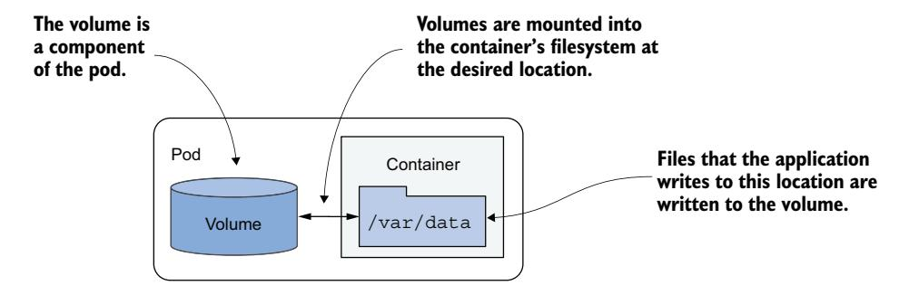
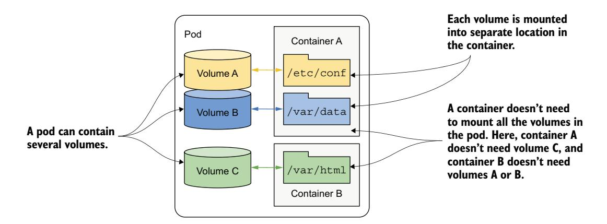
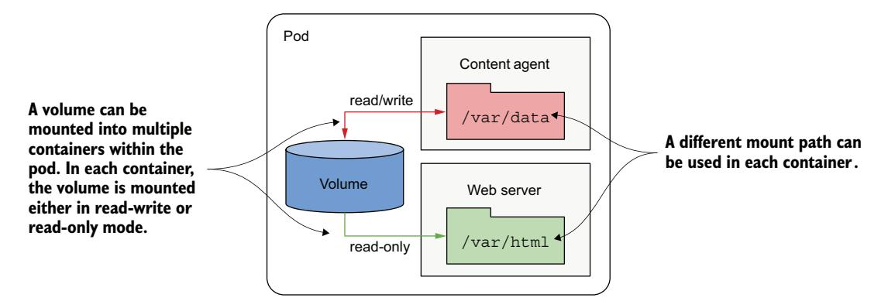
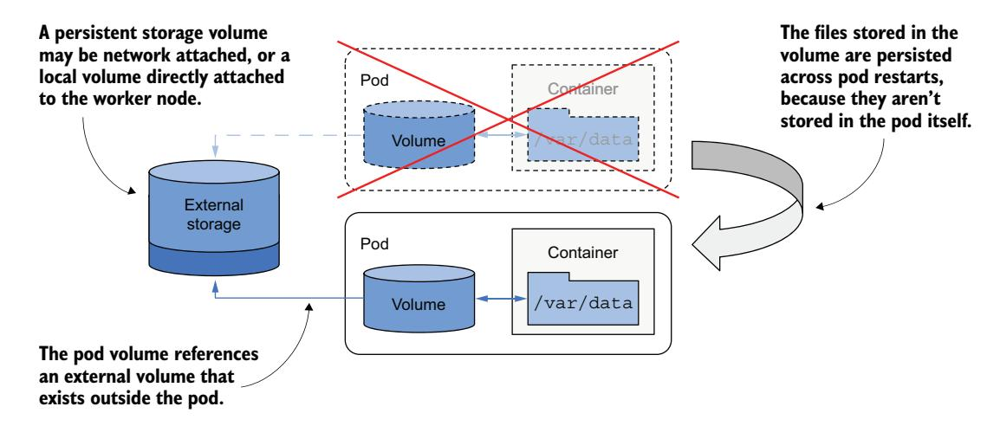
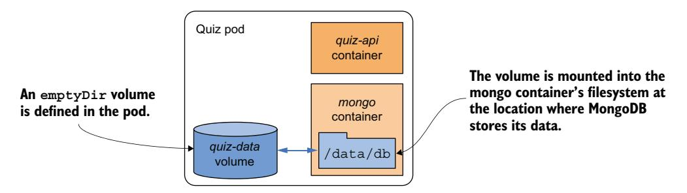
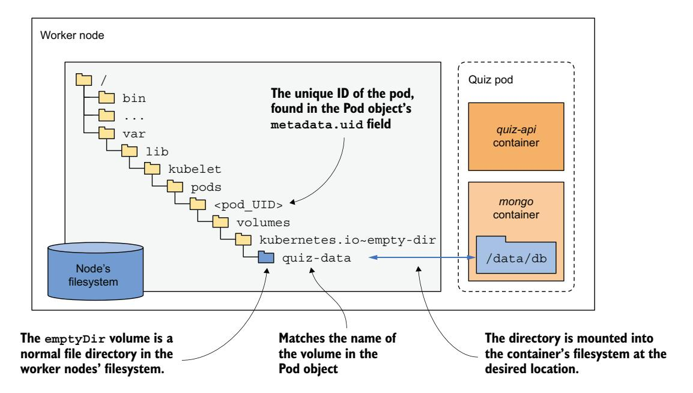
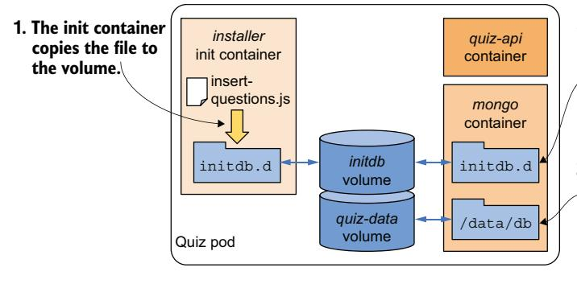
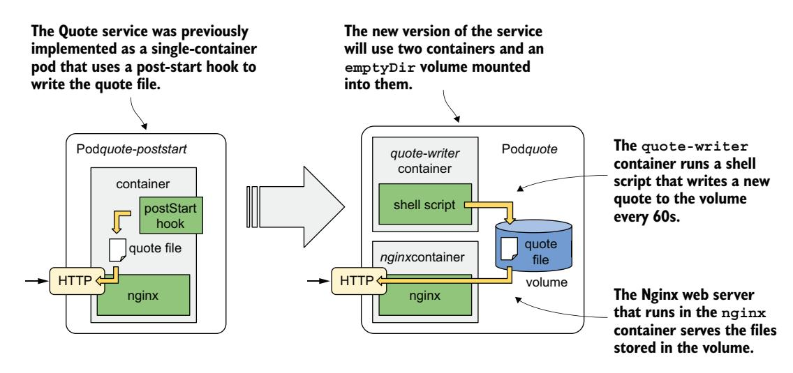
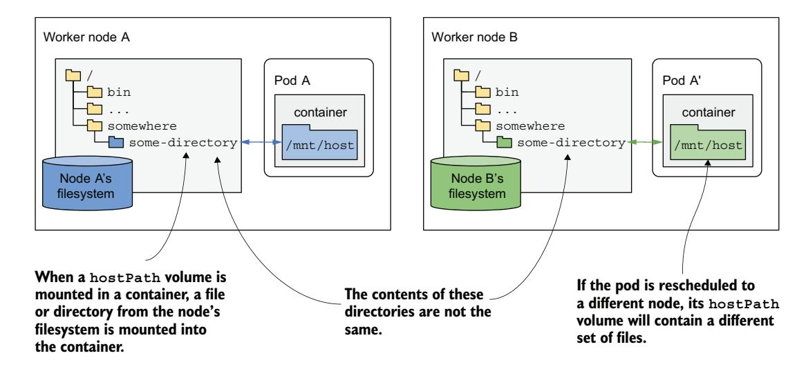
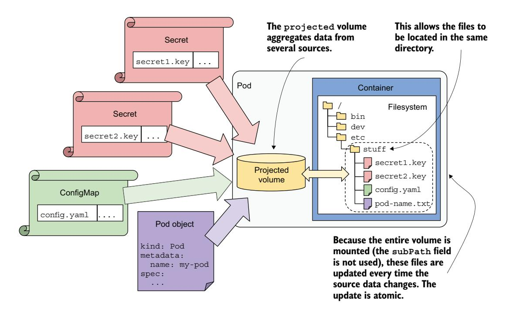

# *Adding volumes for storage, configuration, and metadata*

# *This chapter covers*

- Adding a volume to a pod and mount it into its containers
- Persisting state across container restarts using an emptyDir volume
- Sharing files between containers within the same pod
- Mounting files into a container from another container image
- Accessing the host node's filesystem from within a pod
- Exposing ConfigMaps, Secrets, and the pod metadata through volumes

The previous chapters focused on the pod's containers, but they are only half of what a pod typically contains. Containers in a pod are typically accompanied by storage volumes that allow them to store data for the lifetime of the pod or beyond, or to share files with the other containers of the pod, which is the focus of this chapter.

NOTE The code files for this chapter are available at <https://mng.bz/4nxQ>.

# *9.1 Introducing volumes*

A pod is like a small logical computer that runs a single application. This application can consist of one or more containers that run the application processes. These processes share computing resources such as CPU, RAM, network interfaces, and others. In a typical computer, the processes use the same filesystem, but this isn't the case with containers. Instead, each container has its own isolated filesystem provided by the container image.

 When a container starts, the files in its filesystem are those that were added to its image during build time. The process running in the container can then modify those files or create new ones. When the container is terminated and restarted, all the file changes are lost, because the previous container is not really restarted but replaced with a new instance of the container, as discussed in chapter 6, which covered the pod life cycle. Therefore, when a containerized application is restarted, it cannot resume from where it left off. While this may be acceptable for some types of applications, others may require the entire filesystem—or at least part of it—to be preserved across restarts. Fortunately, this can be achieved by adding a *volume* to the pod and *mounting* it into the container (figure 9.1).


Figure 9.1 Mounting a filesystem into the file tree

DEFINITION *Mounting* is the act of attaching the filesystem of some storage device or volume into a specific location in the operating system's file tree. The contents of the volume are then available at that location.

# *9.1.1 Understanding when to use a volume*

In this chapter, you'll build a new Quiz service for the Kiada application. This service needs persistent data storage. To support this, the pod running the service will need to include a volume. But before we get to that point, let's take a closer look at the service itself and give you a chance to see firsthand why it can't function without a volume.

## INTRODUCING THE QUIZ SERVICE

This book aims to teach you about the main Kubernetes concepts by showing how to deploy the Kubernetes in Action Demo Application (KiADA) Suite. You already know the three components that comprise it. If not, figure 9.2 should refresh your memory.


Figure 9.2 How the Quiz service fits into the architecture of the Kiada Suite

You've already built the initial version of the Kiada web application and the Quote service. Now you'll create the Quiz service. It will provide multiple-choice questions that the Kiada web application displays and will also store your responses to those questions.

 The Quiz service consists of a RESTful API frontend and a MongoDB database as the backend. Initially, you'll run these two components in separate containers of the same pod, as shown in the figure 9.3.


Figure 9.3 The Quiz API and the MongoDB database run in the same pod.

As explained in chapter 5, creating pods like this is not the best idea, as it doesn't allow the containers to be scaled individually. The reason we'll use a single pod is because you haven't yet learned the correct way to make pods communicate with each other. You'll learn this in chapter 11 when you split the two containers into separate pods.

## BUILDING THE QUIZ API CONTAINER

The source code and the artifacts for the Quiz API container image are in the directory Chapter08/quiz-api-0.1/. The code is written in Go and is not only packaged into a container but is also built using a container. This may need further explanation for some readers. Instead of having to install the Go environment on your own computer to build the binary file from the Go source code, you build it in a container that already contains the Go environment. The result of the build is the quiz-api binary executable file, which is stored in the Chapter08/quiz-api-0.1/app/bin/ directory.

 This file is then packaged into the quiz-api:0.1 container image using a separate docker build command. If you'd like, you can try building the binary and the container image yourself, or you can also use the prebuilt image that I've provided, available at docker.io/luksa/quiz-api:0.1.

#### RUNNING THE QUIZ SERVICE IN A POD WITHOUT A VOLUME

The following listing shows the YAML manifest of the quiz pod. You can find it in the file Chapter08/pod.quiz.novolume.yaml.

# Listing 9.1 The **quiz** pod with no volume

```
apiVersion: v1
kind: Pod
metadata:
 name: quiz
spec: 
 containers:
 - name: quiz-api 
 image: luksa/quiz-api:0.1 
 ports:
 - name: http 
 containerPort: 8080 
 - name: mongo 
 image: mongo 
                             This pod manifest 
                             defines containers, 
                             but no volumes.
                                          The quiz-api container runs 
                                          the API server written in Go.
                                    The mongo container runs 
                                    the MongoDB database and 
                                    represents the backend.
```

The listing shows that two containers are defined in the pod. The quiz-api container runs the Quiz API component explained earlier, and the mongo container runs the MongoDB database that the API component uses to store data.

 Create the pod from the manifest and use kubectl port-forward to open a tunnel to the pod's port 8080 so that you can talk to the Quiz API. To get a random question, send a GET request to the /questions/random URI as follows:

```
$ curl localhost:8080/questions/random
ERROR: Question random not found
```

The database is still empty. You need to add questions to it.

## ADDING QUESTIONS TO THE DATABASE

The Quiz API doesn't provide a way to add questions to the database, so you'll have to insert them directly. You can do this via the Mongo shell, available in the mongo container. Use kubectl exec to run the shell:

```
$ kubectl exec -it quiz -c mongo -- mongosh
...
test>
```

The Quiz API reads the questions from the questions collection in the kiada database. To add a question to that collection, type the following two commands (printed in bold):

```
> use kiada
switched to db kiada
> db.questions.insertOne({
... id: 1,
... text: "What does k8s mean?",
... answers: ["Kates", "Kubernetes", "Kooba Dooba Doo!"],
... correctAnswerIndex: 1})
WriteResult({ "nInserted" : 1 })
```

NOTE Instead of typing all these commands, you can simply run the Chapter08/ insert-question.sh shell script on your local computer to insert the question.

Feel free to add additional questions, but it's okay if you don't. We'll insert additional questions later.

#### READING QUESTIONS FROM THE DATABASE AND THE QUIZ API

To confirm that the questions that you've just inserted are now stored in the database, run the following command:

```
> db.questions.find()
{ "_id" : ObjectId("5fc249ac18d1e29fed666ab7"), "id" : 1, "text" : "What does 
     k8s mean?", "answers" : [ "Kates", "Kubernetes", "Kooba Dooba Doo!" ], 
     "correctAnswerIndex" : 1 }
```

Okay, there is at least one question in the database now. You can now exit the Mongo shell by pressing Ctrl-D or typing the exit command.

Now try to retrieve a random question through the Quiz API:

```
$ curl localhost:8080/questions/random
{"id":1,"text":"What does k8s mean?","correctAnswerIndex":1,
"answers":["Kates","Kubernetes","Kooba Dooba Doo!"]}
```

Good. The quiz pod provides the service it's supposed to. But will this always be the case or is the service fragile when it comes to data persistence?

## RESTARTING THE MONGODB DATABASE

Because the MongoDB database runs in a container, it writes its files to the container's filesystem. As you've already learned, if this container is restarted, its filesystem will be reset to whatever is defined in the container image. This means that all the questions would be lost. You can confirm this by telling the database to shut down with the following command:

```
 $ kubectl exec -it quiz -c mongo -- mongosh admin --eval "db.shutdownServer()"
```

When the database shuts down, the container terminates, and Kubernetes starts a new one in its place. Because this is now a new container, with a fresh filesystem, it doesn't contain the questions you entered earlier. You can confirm this is true with the following command:

```
$ kubectl exec -it quiz -c mongo -- mongosh kiada --quiet --eval "db.ques-
     tions.countDocuments()"
0 
                                        There are no questions 
                                        in the database.
```

Keep in mind that the quiz pod is still the same pod as before. The quiz-api container has been running fine this whole time, and only the mongo container was restarted. To be more accurate, it was recreated, not restarted. This was caused by shutting down MongoDB, but it could happen for any reason. In any case, losing data like this is unacceptable.

 To ensure that data survives container restarts, it needs to be stored outside the container—in a volume.

# *9.1.2 Understanding how volumes fit into pods*

Like containers, volumes aren't top-level resources like pods or nodes but are a component within the pod and thus share its life cycle. As shown in figure 9.4, a volume is defined at the pod level and then mounted at the desired location in the container.



Figure 9.4 Volumes are defined at the pod level and mounted in the pod's containers.

The life cycle of a volume is tied to the life cycle of the entire pod and is independent of the life cycle of the container in which it is mounted. Because of this, volumes can be used to persist data across container restarts.

#### PERSISTING FILES ACROSS CONTAINER RESTARTS

All volumes in a pod are created when the pod is set up—before any of its containers are started. They are torn down when the pod is shut down.

 Each time a container is (re)started, the volumes that the container is configured to use are mounted in the container's filesystem. The application running in the container can read from the volume and write to it if the volume and mount are configured to be writable.

 A typical reason for adding a volume to a pod is to persist data across container restarts. If no volume is mounted in the container, the entire filesystem of the container is ephemeral. Since a container restart replaces the entire container, its filesystem is also recreated from the container image. Consequently, all files written by the application are lost. If, conversely, the application writes data to a volume mounted inside the container, as shown in figure 9.5, the application process in the new container can access the same data after the container is restarted.


Figure 9.5 Volumes ensure that part of the container's filesystem is persisted across restarts.

It is up to the author of the application to determine which files must be retained on restart. Normally, you want to preserve data representing the application's state, but you may not want to preserve files that contain the application's locally cached data, as this prevents the container from starting fresh when it's restarted. Starting fresh every time may allow the application to heal itself when corruption of the local cache causes it to crash. Just restarting the container and using the same corrupted files could result in an endless crash loop.

TIP Before you mount a volume in a container to preserve files across container restarts, consider how this affects the container's self-healing capability.

#### MOUNTING MULTIPLE VOLUMES IN A CONTAINER

A pod can have multiple volumes, and each container can mount zero, one, or more of these volumes in different locations, as shown in figure 9.6. The reason why you might want to mount multiple volumes in one container is that these volumes may serve different purposes and can be of different types with different performance characteristics.



Figure 9.6 A pod can contain multiple volumes, and a container can mount multiple volumes.

In pods with more than one container, some volumes can be mounted in some containers but not in others. This is especially useful when a volume contains sensitive information that should only be accessible to some containers.

#### SHARING FILES BETWEEN MULTIPLE CONTAINERS

A volume can be mounted in more than one container so that applications running in these containers can share files. As discussed in chapter 5, a pod can combine a main application container with sidecar containers that extend the behavior of the main application. In some cases, the containers must read or write the same files.

 For example, you could create a pod that combines a web server running in one container with a content-producing agent running in another container. The content agent container generates the static content that the web server then delivers to its clients. Each of the two containers performs a single task that has little value on its own. However, as shown in figure 9.7, by adding a volume to the pod and mounting it in both containers, you enable them to function as a complete system—one that is worth more than the sum of its parts because it provides a valuable service the individual containers alone cannot.



Figure 9.7 A volume can be mounted into more than one container.

The same volume can be mounted at different places in each container, depending on the needs of the container itself. If the content agent writes content to /var/data, it makes sense to mount the volume there. Since the web server expects the content to be in /var/html, the container running it has the volume mounted at this location.

 In the figure you'll also notice that the volume mount in each container can be configured either as read/write or as read-only. Because the content agent needs to write to the volume whereas the web server only reads from it, the two mounts are configured differently. In the interest of security, it's advisable to prevent the web server from writing to the volume, since this could allow an attacker to compromise the system if the web server software has a vulnerability that allows attackers to write arbitrary files to the filesystem and execute them.

 Other scenarios where a single volume is shared by two containers is when a sidecar container processes or rotates the web server logs or when an init container initializes data for the main application container.

#### PERSISTING DATA ACROSS POD INSTANCES

A volume is tied to the life cycle of the pod and only exists for as long as the pod exists. However, depending on the volume type, the files in the volume can remain intact after the pod and volume disappear and can later be mounted into a new volume.

 As figure 9.8 shows, a pod volume can map to persistent storage outside the pod. In this case, the file directory representing the volume isn't a local file directory that persists data only for the duration of the pod, but instead a volume mount to an existing, typically network-attached storage volume (NAS) whose life cycle isn't tied to any pod. The data stored in the volume is thus persistent and can be used by the application even after the pod it runs in is replaced with a new pod running on a different worker node.



Figure 9.8 Pod volumes can also map to storage volumes that persist across pod restarts.

If the pod is deleted and a new pod is created to replace it, the same network-attached storage volume can be attached to the new pod instance so that it can access the data stored there by the previous instance.

#### SHARING DATA BETWEEN PODS

Depending on the technology that provides the external storage volume, the same external volume can be attached to multiple pods simultaneously, allowing them to share data. Figure 9.9 shows a scenario where three pods each define a volume that is mapped to the same external persistent storage volume.


Figure 9.9 Using volumes to share data between pods

In the simplest case, the persistent storage volume could be a simple local directory on the worker node's filesystem, and the three pods have volumes that map to that directory. If all three pods are running on the same node, they can share files through this directory.

 If the persistent storage is a network-attached storage volume, the pods may be able to use it even when they are deployed to different nodes. However, this depends on whether the underlying storage technology supports concurrently attaching the network volume to multiple computers.

 Technologies like Network File System (NFS) support mounting a volume in read/ write mode across multiple machines. Other technologies typically available in cloud environments, such as the Google Compute Engine Persistent Disk, allow the volume to be used either in read/write mode on a single cluster node, or in read-only mode on many nodes.

## INTRODUCING THE AVAILABLE VOLUME TYPES

When you add a volume to a pod, you must specify the volume type. A wide range of volume types is available. Some are generic, while others are specific to the storage technologies used underneath. Here's a non-exhaustive list of the supported volume types:

- emptyDir—A simple directory that allows the pod to store data for the duration of its life cycle. The directory is created just before the pod starts and is initially empty— hence the name.
- hostPath—Used for mounting files from the worker node's filesystem into the pod.
- configMap, secret, downwardAPI, and the projected volume type—Special types of volumes used to expose the data in a ConfigMap or Secret, or the pod's own metadata.
- image—Used to mount the file system of another container image as a volume.
- ephemeral—An ephemeral volume provided by a Container Storage Interface (CSI) driver that exists only for the lifetime of a pod.
- persistentVolumeClaim—A portable way to integrate external storage into pods. Instead of pointing directly to an external storage volume, this volume type points to a PersistentVolumeClaim object that points to a PersistentVolume object referencing the actual storage. This volume type requires a more detailed explanation, so it will be covered separately in the following chapter.

Kubernetes used to directly provide many other technology-specific volume types, such as nfs, gcePersistentDisk, awsElasticBlockStore, azureFile/azureDisk, and so on. These volume types are now deprecated, as they have been moved outside of the Kubernetes codebase and are now accessible via CSI drivers. They are generally not defined in pods anymore—a persistentVolumeClaim volume is used instead. As mentioned, this is a topic for the next chapter. In this chapter, we'll focus on volume types that can still be defined directly in the pod.

# *9.2 Using an emptyDir volume*

The simplest volume type is emptyDir. As the name suggests, a volume of this type starts as an empty directory. When this type of volume is mounted in a container, files written to the volume are preserved for the duration of the pod's existence, but they can't be shared with other pods.

 This volume type is used in single-container pods when data must be preserved even if the container is restarted. It's also used when the container's filesystem is marked read-only, but the container still needs a place to write data temporarily. In pods with two or more containers, an emptyDir volume can also be used to share data between them.

# *9.2.1 Persisting files across container restarts*

Let's add an emptyDir volume to the quiz pod from the start of this chapter to ensure that its data isn't lost when the MongoDB container restarts.

#### ADDING AN EMPTYDIR VOLUME TO A POD

You'll modify the definition of the quiz pod so that the MongoDB process writes its files to the volume instead of the filesystem of the container it runs in, which is perishable. A visual representation of the pod is given in figure 9.10.



Figure 9.10 The **quiz** pod with an **emptyDir** volume for storing MongoDB data files

Two changes to the pod manifest are required to achieve this:

- <sup>1</sup> An emptyDir volume must be added to the pod.
- <sup>2</sup> The volume must be mounted into the container.

The following listing shows the new pod manifest with these two changes highlighted in bold. You'll find the manifest in the file pod.quiz.emptydir.yaml.

#### Listing 9.2 The **quiz** pod with an **emptyDir** volume for the **mongo** container

apiVersion: v1 kind: Pod metadata: name: quiz

spec:  **volumes: - name: quiz-data emptyDir: {}**  containers: - name: quiz-api image: luksa/quiz-api:0.1 ports: - name: http containerPort: 8080 - name: mongo image: mongo  **volumeMounts: - name: quiz-data mountPath: /data/db An emptyDir volume with the name quizdata is defined. The quiz-data volume is mounted into the mongo container's filesystem at the location /data/db.**

The listing shows that an emptyDir volume named quiz-data is defined in the spec.volumes array of the pod manifest and that it is mounted into the mongo container's filesystem at the location /data/db. The following two sections explain more about the volume and the volume mount definitions.

#### CONFIGURING THE EMPTYDIR VOLUME

In general, each volume definition must include a name and a type, which is indicated by the name of the nested field (emptyDir in the current example). This field typically contains several sub-fields for configuring the volume. The set of available sub-fields depends on the volume type.

 For example, the emptyDir volume type supports two fields for configuring the volume, as explained in table 9.1.

Table 9.1 Configuration options for an **emptyDir** volume

| Field     | Description                                                                                                                                                                                                                                                                                                                                                  |
|-----------|--------------------------------------------------------------------------------------------------------------------------------------------------------------------------------------------------------------------------------------------------------------------------------------------------------------------------------------------------------------|
| medium    | The type of storage medium to use for the directory. If left empty, the default medium of<br>the host node is used (the directory is created on one of the node's disks). The only<br>other supported option is Memory, which causes the volume to use tmpfs, a virtual<br>memory filesystem where the files are kept in memory instead of on the hard disk. |
| sizeLimit | The total amount of local storage required for the directory, whether on disk or in mem<br>ory. For example, to set the maximum size to 10 mebibytes, set this field to 10Mi.                                                                                                                                                                                |

NOTE The emptyDir field in the volume definition defines neither of these properties. The curly braces {} have been added to indicate this explicitly, but they can be omitted.

## MOUNTING THE VOLUME IN A CONTAINER

Defining a volume in the pod is only half of what you need to do to make it available in a container. The volume must also be mounted in the container. This is done by referencing the volume by name in the volumeMounts array in the container definition.

 In addition to the name, a volume mount definition must also include the mount-Path—the path within the container where the volume should be mounted. In listing 9.2, the volume is mounted at /data/db because that's where MongoDB stores its files. This ensures that the data is written to the volume instead of the container's filesystem. The full list of supported fields in a volume mount definition is presented in table 9.2.

Table 9.2 Configuration options for a volume mount

| Field             | Description                                                                                                                                                                                                                                                                                                    |
|-------------------|----------------------------------------------------------------------------------------------------------------------------------------------------------------------------------------------------------------------------------------------------------------------------------------------------------------|
| name              | The name of the volume to mount. This must match one of the volumes<br>defined in the pod.                                                                                                                                                                                                                     |
| mountPath         | The path within the container at which to mount the volume.                                                                                                                                                                                                                                                    |
| readOnly          | Whether to mount the volume as read-only. Defaults to false. Note that set<br>ting this to true doesn't ensure that all the sub-paths are read-only as well,<br>but this can be configured via the recursiveReadOnly field.                                                                                    |
| recursiveReadOnly | Whether read-only-mounted volumes are truly read only, including all the sub<br>paths below the mount path.                                                                                                                                                                                                    |
| mountPropagation  | Specifies what should happen if additional filesystem volumes are mounted<br>inside the volume.                                                                                                                                                                                                                |
|                   | Defaults to None, which means that the container won't receive any mounts<br>that are mounted by the host, and the host won't receive any mounts that are<br>mounted by the container.                                                                                                                         |
|                   | HostToContainer means that the container will receive all mounts that are<br>mounted into this volume by the host, but not the other way around.                                                                                                                                                               |
|                   | Bidirectional means that the container will receive mounts added by the<br>host, and the host will receive mounts added by the container.                                                                                                                                                                      |
| subPath           | Defaults to "", which indicates that the entire volume is to be mounted into<br>the container. When set to a non-empty string, only the specified subPath<br>within the volume is mounted into the container.                                                                                                  |
| subPathExpr       | Just like subPath but can have environment variable references using the syn<br>tax \$(ENV_VAR_NAME). Only environment variables that are explicitly defined<br>in the container definition are applicable. Implicit variables such as HOSTNAME<br>will not be resolved, as explained in the previous chapter. |

In most cases, you only specify the name, mountPath, and whether the mount should be readOnly. As explained in the table, setting readOnly doesn't always suffice and should be combined with recursiveReadOnly when required. The mountPropagation option comes into play for advanced use-cases where additional mounts are added to the volume's file tree later, either from the host or from the container. The subPath and subPathExpr options are useful when you need to use a single volume with multiple directories you want to mount to different containers instead of using multiple volumes.

 The subPathExpr option can also be used when a volume is shared by multiple pod replicas. In the previous chapter, you learned how to use the Downward API to inject the name of the pod into an environment variable. By referencing this variable in sub-PathExpr, you can configure each replica to use its own subdirectory.

#### UNDERSTANDING THE LIFESPAN OF AN EMPTYDIR VOLUME

If you replace the quiz pod with the one in pod.quiz.emptydir.yaml and insert questions into the database, you'll notice that the questions you add to the database are preserved even when you restart the MongoDB container. Use the shell script in the file Chapter08/insert-question.sh so that you don't have to type the entire question document in JSON again. After you add the question, count the number of questions in the database as follows:

```
$ kubectl exec -it quiz -c mongo -- mongosh kiada --quiet --eval "db.ques-
     tions.countDocuments()"
1 
                                           The number of questions 
                                           in the database
```

Now shut down the MongoDB server:

```
$ kubectl exec -it quiz -c mongo -- mongosh admin --eval "db.shutdownServer()"
```

Check that the mongo container was restarted:

```
$ kubectl get po quiz
NAME READY STATUS RESTARTS AGE
quiz 2/2 Running 1 10m 
                                                   The restart count shows that 
                                                   one container was restarted.
```

After the container restarts, recheck the number of questions in the database:

```
$ kubectl exec -it quiz -c mongo -- mongosh kiada --quiet --eval "db.ques-
     tions.countDocuments()"
1 
                                            The data has survived the 
                                            container restart.
```

Restarting the container no longer causes the files to disappear because they no longer reside in the container's filesystem. They are stored in the volume. But where exactly? Let's find out.

#### UNDERSTANDING WHERE THE FILES IN AN EMPTYDIR VOLUME ARE STORED

As you can see in figure 9.11, the files in an emptyDir volume are stored in a directory in the host node's filesystem. It's nothing but a normal file directory. This directory is mounted into the container at the desired location.

The directory is typically located at the following location in the node's filesystem:

```
/var/lib/kubelet/pods/<pod_UID>/volumes/kubernetes.io~empty-dir/<volume_name>
```

The pod\_UID is the unique ID of the pod, which you'll find the Pod object's metadata section. If you want to see the directory for yourself, run the following command to get the pod\_UID:

```
$ kubectl get po quiz -o json | jq -r .metadata.uid
4f49f452-2a9a-4f70-8df3-31a227d020a1
```



Figure 9.11 The emptyDir is a normal file directory in the node's filesystem mounted into the container.

The volume\_name is the name of the volume in the pod manifest— in the quiz pod, the name is quiz-data. To get the name of the node that runs the pod, use kubectl get po quiz -o wide or the following alternative:

#### \$ **kubectl get po quiz -o json | jq .spec.nodeName**

Now you have everything you need. Try to log into the node and inspect the contents of the directory. You'll notice that the files match those in the mongo container's /data/db directory.

 Although the data survives across container restarts, it does not survive when the pod is deleted. If you delete the pod, the directory is deleted as well. To properly persist the data, you'll need to use a persistent volume, which is explained in the next chapter.

#### CREATING THE EMPTYDIR VOLUME IN MEMORY

The emptyDir volume in the previous example created a directory on the actual drive of the worker node that runs your pod, so its performance depends on the type of drive installed on the node. If you want the I/O operations on the volume to be as fast as possible, you can instruct Kubernetes to create the volume using the *tmpfs* filesystem, which keeps files in memory. To do this, set the medium field to Memory as in the following snippet:

#### volumes:

- name: content

 **emptyDir: medium: Memory This directory should be stored in memory.**

Creating the emptyDir volume in memory is also a good idea whenever it's used to store sensitive data. Because the data is not written to disk, there is less chance that the data will be compromised and persisted longer than desired. As explained in the previous chapter, Kubernetes uses the same in-memory approach when it exposes the data from the Secret object kind in the container.

### SPECIFYING THE SIZE LIMIT FOR THE EMPTYDIR VOLUME

The size of an emptyDir volume can be limited by setting the sizeLimit field. Setting this field is especially important for in-memory volumes when the overall memory usage of the pod is limited by so-called *resource limits*.

 Next, let's see how an emptyDir volume is used to share files between containers of the same pod.

# *9.2.2 Initializing an emptyDir volume*

Every time you create the quiz pod with the emptyDir volume, the MongoDB database is empty, and you must insert the questions manually. Let's fix this by automatically populating the database when the pod starts.

 Many ways of doing this exist. You could run the MongoDB container locally, insert the data, commit the container state into a new image, and use that image in your pod. But then you'd have to repeat the process every time a new version of the MongoDB container image is released.

 Fortunately, the MongoDB container image provides a mechanism to populate the database the first time it's started. On start-up, if the database is empty, it invokes any .js and .sh files found in the /docker-entrypoint-initdb.d/ directory. All you need to do is get the file containing the questions into that location before the MongoDB container starts.

 Again, you could build a new MongoDB image with the file in that location, but you'd run into the same problem as described previously. An alternative solution is to use a volume to inject the file into that location of the MongoDB container's filesystem. But how do you get the file into the volume in the first place?

#### INITIALIZING AN EMPTYDIR VOLUME WITH AN INIT CONTAINER

One way to initialize an emptyDir volume is using an init container. The init container can get the files from wherever it wants. It could, for example, use the git clone command to clone a Git repository and checkout its files. However, this action requires the pod to make a network call to fetch the data every time it starts. The init container could also simply store the files in its own image. The aim of this section is to show how an init container can be used to initialize the volume, rather than detailing the origin of the data itself, so we'll use this approach.

 You'll create a new container image that stores the quiz questions in a JSON file and copies this file to a shared volume so that the MongoDB container can read it when it starts. You'll add this new container as an init container along with a new volume and the require volume mounts to the quiz pod as shown in the following figure.



- **2. The volume is mounted into the mongo container at location /docker-entrypoint-initdb.d, which is where MongoDB looks for database initialization scripts.**
- **3. When MongoDB executes the initialization script, the questions are stored in the database files in the quiz-data volume.**

Figure 9.12 Using an init container to initialize an **emptyDir** volume

#### UNDERSTANDING WHAT HAPPENS WHEN THE POD STARTS

When the pod starts, the volumes are created first, and then the init container is started. This is the case in all pods, regardless of whether you define the volumes before or after the init containers in the pod manifest.

 Before the init container is started, the initdb volume is mounted into it. The container image contains the insert-questions.js file, which the container copies to the volume when it runs. When the copy operation is complete, the init container terminates, and the pod's main containers are started. The initdb volume is mounted into the mongo container at the location where MongoDB looks for database initialization scripts. On first start-up, MongoDB executes the insert-questions.js script, and this, as the filename suggests, inserts the questions into the database. As in the previous version of the pod, the database files are stored in another volume called quiz-data so that the data survives across container restarts.

## BUILDING THE INIT CONTAINER IMAGE

You'll find the insert-questions.js file and the Dockerfile required to build the init container image in the book's code repository under Chapter08/quiz-initdb-scriptinstaller-0.1. The following listing shows part of the insert-questions.js file.

#### Listing 9.3 The contents of the **insert-questions.js** file

```
db.getSiblingDB("kiada").questions.insertMany( 
[{ 
 "id": 1, 
 "text": "The three sections in most Kubernetes API objects are:", 
 "correctAnswerIndex": 1, 
 "answers": [ 
                                                           This command inserts documents 
                                                           into the questions collection of 
                                                           the kiada database.
                                             This is the first document that gets inserted.
```

```
 "`info`, `config`, `status`", 
 "`metadata`, `spec`, `status`", 
 "`data`, `spec`, `status`", 
 "`pod`, `deployment`, `service`", 
 ] 
}, 
...
                                                 This is the first document 
                                                 that gets inserted.
```

The Dockerfile for the container image is shown in the next listing. As you can see from the CMD directive, a simple cp command is used to copy the insert-questions.js file to the path where the shared volume is mounted.

Listing 9.4 Dockerfile for the **quiz-initdb-script-installer:0.1** container image

```
FROM busybox
COPY insert-questions.js / 
CMD cp /insert-questions.js /initdb.d/ \ 
 && echo "Successfully copied insert-questions.js to /initdb.d" \ 
 || echo "Error copying insert-questions.js to /initdb.d" 
                                                       Adds the file to the container image
                                                             When the container runs, it copies 
                                                             the file to the /initdb.d directory
                                                           A status message is printed
                                                         when the cp command is done
```

Use these two files to build the image or use the pre-built image at docker.io/luksa/ quiz-initdb-script-installer:0.1.

#### ADDING THE VOLUME AND INIT CONTAINER TO THE QUIZ POD

After you've got the container image, modify the Pod manifest from the previous section so its contents match the next listing or open the file pod.quiz.emptydir .init.yaml, where I've already made the same changes. The changes are highlighted in bold.

Listing 9.5 Using an init container to initialize an **emptyDir** volume

```
apiVersion: v1
kind: Pod
metadata:
 name: quiz
spec:
 volumes:
 - name: initdb 
 emptyDir: {} 
 - name: quiz-data
 emptyDir: {}
 initContainers:
 - name: installer 
 image: luksa/quiz-initdb-script-installer:0.1 
 volumeMounts: 
 - name: initdb 
 mountPath: /initdb.d 
                                The initdb emptyDir 
                                volume is defined here.
                                                             The volume is mounted in the 
                                                             init container at the location 
                                                             to which the container copies 
                                                             the insert-questions.js file.
```

```
 containers:
 - name: quiz-api
 image: luksa/quiz-api:0.1
 ports:
 - name: http
 containerPort: 8080
 - name: mongo
 image: mongo
 volumeMounts:
 - name: quiz-data
 mountPath: /data/db
 - name: initdb 
 mountPath: /docker-entrypoint-initdb.d/ 
 readOnly: true 
                                                 The same volume is also mounted in the 
                                                 mongo container at the location where 
                                                 MongoDB looks for initialization scripts.
```

The listing shows that the initdb volume is mounted into the installer init container. After this container copies the insert-questions.js file to the volume, it terminates and allows the mongo and quiz-api containers to start. Because the initdb volume is mounted in the /docker-entrypoint-initdb.d/ directory in the mongo container, MongoDB executes the .js file, which populates the database with questions.

 You can delete the old quiz pod and deploy this new version of the pod. You'll see that the database gets populated with questions automatically.

## INITIALIZING A VOLUME WITH FILE CONTENT DEFINED INLINE IN THE POD MANIFEST

A neat trick you can use when you want to initialize an emptyDir volume with a short file is to define the file contents in the pod manifest directly as in the following listing. You can find the entire manifest in the file pod.emptydir-inline-example.yaml.

#### Listing 9.6 Creating a file from inline contents

```
spec:
 initContainers: 
 - name: my-volume-initializer 
 image: busybox 
 command: 
 - sh 
 - -c 
 - | 
 cat <<EOF > /mnt/my-volume/my-file.txt 
 line 1: This is a multi-line file 
 line 2: Written from an init container 
 line 3: Defined inline in the Pod manifest 
 EOF 
 volumeMounts: 
 - name: my-volume 
 mountPath: /mnt/my-volume 
 containers:
 ...
                                          The volume is initialized with 
                                          a simple init container.
                                                      The init container uses the cat 
                                                      command to print to a file in 
                                                      the emptyDir volume.
                                                            The file contents 
                                                            are defined here.
                                                        This marks the end of the text 
                                                        that is written to the file.
                                              The emptyDir volume is 
                                              mounted in the init container.
```

The approach shown in the listing is a quick and easy way to add one or two files to a volume in a pod. You can use this approach to provide a short configuration file for your application without having to use any other resources to store the file contents.

# *9.2.3 Sharing files between containers*

As illustrated in the previous section, an emptyDir volume can be initialized with an init container and then used by one of the pod's main containers. But a volume can also be used by multiple main containers concurrently. The quiz-api and the mongo containers in the quiz pod don't need to share files, so let's use a different example to learn how volumes are shared between containers.

#### TRANSFORMING THE QUOTE POD INTO A MULTI-CONTAINER POD WITH A SHARED VOLUME

Remember the quote pod from the previous chapter? The one that uses a post-start hook to run the fortune command? The command writes a quote from this book into a file that is then served by the Nginx web server. The problem is that this pod currently serves the same quote every time. Let's build a new version of the pod that serves a new quote every minute.

 You'll retain Nginx as the web server but will replace the post-start hook with a container that periodically runs the fortune command to update the file where the quote is stored. Let's call this container quote-writer. The Nginx server will continue to live in the nginx container.

 As illustrated in figure 9.13, the pod now has two containers instead of one. To allow the nginx container to see the file that the quote-writer creates, a volume must be defined in the pod and mounted into both containers.



Figure 9.13 The new version of the Quote service uses two containers and a shared volume.

The image for the quote-writer container is available at docker.io/luksa/quotewriter:0.1, but you can also build it yourself from the files in the Chapter08/quotewriter-0.1 directory. The nginx container will continue to use the existing nginx:alpine image.

#### UPDATING THE QUOTE POD MANIFEST

The pod manifest for the new quote pod is shown in the next listing. You can find it in the file pod.quote.yaml.

#### Listing 9.7 A pod with two containers that share a volume

```
apiVersion: v1
kind: Pod
metadata:
 name: quote
spec:
 volumes: 
 - name: shared 
 emptyDir: {} 
 containers:
 - name: quote-writer 
 image: luksa/quote-writer:0.1 
 volumeMounts: 
 - name: shared 
 mountPath: /var/local/output 
 - name: nginx 
 image: nginx:alpine 
 volumeMounts: 
 - name: shared 
 mountPath: /usr/share/nginx/html 
 readOnly: true 
 ports:
 - name: http
 containerPort: 80
                          An emptyDir volume 
                          with the name shared 
                          is defined.
                                              The quote-writer container 
                                              writes the quote to a file.
                                           The shared volume is mounted 
                                           into the quote-writer container.
                                             The nginx container 
                                             serves the quote file.
                                                The shared volume is 
                                                mounted into the nginx 
                                                container.
```

The pod consists of two containers and a single volume, mounted in both containers but at different locations in each container's filesystem. The reason for using two different locations is that the quote-writer container writes to its /var/local/output directory, whereas the nginx container serves files from its /usr/share/nginx/html directory.

NOTE Since the two containers start at the same time, there can be a short period where nginx is already running, but the quote hasn't been generated yet. One way of making sure this doesn't happen is to generate the initial quote using an init container, as explained in section 9.2.2.

#### RUNNING THE POD AND VERIFYING ITS BEHAVIOR

Create the pod from the manifest file. Check the pod's status to confirm that the two containers start and continue running. The quote-writer container writes a new quote to the file every minute, and the nginx container serves this file. After you create the pod, use the kubectl port-forward command to open a communication tunnel to the pod:

#### \$ **kubectl port-forward quote 1080:80**

In another terminal, fetch the quote, wait at least a minute, and then fetch the quote again using the following command:

#### \$ **curl localhost:1080/quote**

Alternatively, you can also display the contents of the file using either of the following two commands:

```
$ kubectl exec quote -c quote-writer -- cat /var/local/output/quote
$ kubectl exec quote -c nginx -- cat /usr/share/nginx/html/quote
```

As you can see, one of these commands prints the file from within the quote-writer container, whereas the other prints it from within the nginx container. Because both paths point to the same quote file on the shared volume, the outputs of the commands are identical. You've now successfully used a volume to share files between two containers in the same pod.

# *9.3 Mounting a container image as a volume*

Containers often need access to data that has been prepared in advance. You saw an example of this in section 9.2.2, where the quiz pod's database had to be prepopulated with questions. This is a common scenario. For instance, AI model-serving containers require access to the weights of a large language model, which are typically stored in large files. While it's possible to include these files directly in the modelserving container image, it's more common to package the model weights and the model-serving binaries separately.

 In the quiz pod example, you created a container image that contains the questions in a file that it copies to a new location when the container is started. A volume is mounted in this new location so that the other containers in the pod can access the file. This seems like a lot of work for a simple task of using a container image to provide files to another container.

 Fortunately, there is now a simpler way of doing this. However, at the time of writing, this feature is not yet enabled by default and must be enabled through the Image-Volume feature gate.

NOTE Before a feature becomes generally available in Kubernetes, it is typically hidden behind a feature gate. The Kubernetes cluster administrator must explicitly enable this feature gate. When not enabled, the feature will simply not work, even though the fields associated with it will be visible in the API, and users will be able to set these fields.

NOTE If you're using Kind to run the examples in this book, make sure to start your cluster with this feature gate enabled. You can use the Chapter08/ kind-multi-node-with-image-volume.yaml configuration file to do so.

# *9.3.1 Introducing the image volume type*

The image volume type exposes the files in an OCI (Open Container Initiative) image as a volume that can be mounted into other containers of the same pod. As you might expect, other containers can read from this volume and can't write to it.

NOTE Throughout this book, we often use the term *container image*. However, this term is reserved for images that encapsulate an application and its software dependencies. The term *OCI image* is broader, as an image can bundle other types of files, not only applications. The image volume type allows you to use any OCI-compliant image as a volume.

Although you could use the existing quiz-initdb-script-installer container image to create the volume, I've created a new image containing only the insert-questions.js file. You can build the image yourself by using the files in the Chapter08/quiz-questions directory, or you can use the existing image at docker.io/luksa/quiz-questions:latest.

NOTE As of this writing, only image artifacts are supported. However, the plan is to support all OCI artifacts eventually. This means that pushing an artifact to a registry will be even easier, creating a Dockerfile won't be necessary to do so.

#### DEFINING AN IMAGE VOLUME IN THE POD MANIFEST

Let's update the quiz pod manifest so that it provides the questions to MongoDB via an image volume instead of the emptyDir volume initialized by the quiz-initdb-scriptinstaller init container. The following listing shows the new manifest. You can find it in the file pod.quiz.imagevolume.yaml.

#### Listing 9.8 Defining an image volume in a pod manifest

```
apiVersion: v1
kind: Pod
metadata:
 name: quiz
spec:
 volumes:
 - name: initdb 
 image: 
 reference: luksa/quiz-questions:latest 
 pullPolicy: Always 
 - name: quiz-data
 emptyDir: {}
 containers:
 - name: quiz-api
 image: luksa/quiz-api:0.1
                                                         Defines an image volume 
                                                         with the name initdb
                                                               The questions-artifact:latest 
                                                               is the OCI artifact that will be 
                                                               used to populate the volume.
                                                            You can specify the image pull 
                                                            policy for image volumes just as 
                                                            you do for container images.
```

```
 imagePullPolicy: IfNotPresent
 ports:
 - name: http
 containerPort: 8080
 - name: mongo
 image: mongo:7
 volumeMounts:
 - name: quiz-data
 mountPath: /data/db
 - name: initdb 
 mountPath: /docker-entrypoint-initdb.d/ 
 readOnly: true 
                                                   The image volume is mounted 
                                                   into the mongo container just 
                                                   as in the previous example.
```

The manifest in the listing is not very different from the one that used the emptyDir volume and init container. As you can see, there is no need for the init container anymore, and the emptyDir volume has been replaced with an image volume. The volume is mounted into the mongo container exactly as before.

#### RUNNING AND INSPECTING THE NEW POD

Delete the old quiz pod and create the new version by applying the manifest in the file pod.quiz.imagevolume.yaml. Then run kubectl describe pod quiz to see the events associated with the new pod. They should look like the following (output edited for brevity):

| Events: |                |         |                                                                                                                   |
|---------|----------------|---------|-------------------------------------------------------------------------------------------------------------------|
| Type    | Reason         | From    | Message                                                                                                           |
|         |                |         |                                                                                                                   |
|         | Normal Pulled  | kubelet | Normal Scheduled scheduler Successfully assigned kiada/quiz to node<br>Successfully pulled image "quiz-questions: |
|         |                |         | latest" in 1.007s (1.007s including waiting).                                                                     |
|         |                |         | Image size: 1816 bytes.                                                                                           |
|         | Normal Pulled  | kubelet | Image "quiz-api:0.1" already present                                                                              |
|         | Normal Created | kubelet | Created container: quiz-api                                                                                       |
|         | Normal Started | kubelet | Started container quiz-api                                                                                        |
|         | Normal Pulled  | kubelet | Image "mongo:7" already present on machine                                                                        |
|         | Normal Created | kubelet | Created container: mongo                                                                                          |
|         | Normal Started | kubelet | Started container mongo                                                                                           |
|         |                |         |                                                                                                                   |

You can see that the quiz-questions image was the first image to be pulled. As you've already learned, this is because pod volumes are created before any of the pod's containers are started.

 Now confirm that the insert-questions.js file is available in the mongo container by running the following command:

```
$ kubectl exec -it quiz -c mongo -- ls -la /docker-entrypoint-initdb.d/
total 4
drwxr-xr-x. 1 root root 0 Jul 1 08:59 .
drwxr-xr-x. 1 root root 60 Jul 1 08:59 ..
-rw-rw-r--. 1 root root 2361 Mar 14 2022 insert-questions.js
```

MongoDB should have executed this file on startup, so the questions stored in this file should now be stored in the database, and you can fetch them through the Quiz API as before:

#### \$ **curl localhost:8080/questions/random**

NOTE Don't forget to use kubectl port-forward to open a tunnel to port 8080 of the quiz pod before running the curl command.

# *9.4 Accessing files on the worker node's filesystem*

Most pods shouldn't care which host node they are running on, and they shouldn't access any files on the node's filesystem. System-level pods are the exception. They may need to read the node's files or use the node's filesystem to access the node's devices or other components via the filesystem. Kubernetes makes this possible through the hostPath volume type.

# *9.4.1 Introducing the hostPath volume*

A hostPath volume points to a specific file or directory in the filesystem of the host node, as shown in figure 9.14. Pods running on the same node and using the same path in their hostPath volume have access to the same files, whereas pods on other nodes do not.



Figure 9.14 A **hostPath** volume mounts a file or directory from the worker node's filesystem into the container.

A hostPath volume is not a good place to store the data of a database unless you ensure that the pod running the database always runs on the same node. Because the contents of the volume are stored on the filesystem of a specific node, the database pod will not be able to access the data if it gets rescheduled to another node. Typically, a hostPath volume is used in cases where the pod needs to read or write files in the node's filesystem that the processes running on the node read or generate, such as system-level logs.

 The hostPath volume type is one of the most dangerous volume types in Kubernetes and is usually reserved for use in privileged pods only. If you allow unrestricted use of the hostPath volume, users of the cluster can do anything they want on the node. For example, they can use it to mount the Docker socket file (typically /var/ run/docker.sock) in their container and then run the Docker client within the container to run any command on the host node as the root user.

# *9.4.2 Using a hostPath volume*

To demonstrate how dangerous hostPath volumes are, let's deploy a pod that allows you to explore the entire filesystem of the host node from within the pod. The pod manifest is shown in the following listing.

Listing 9.9 Using a **hostPath** volume to gain access to the host node's filesystem

```
apiVersion: v1
kind: Pod
metadata:
 name: node-explorer
spec:
 volumes:
 - name: host-root 
 hostPath: 
 path: / 
 containers:
 - name: node-explorer
 image: alpine
 command: ["sleep", "9999999999"]
 volumeMounts: 
 - name: host-root 
 mountPath: /host 
                                       The hostPath volume points 
                                       to the root directory on the 
                                       node's filesystem.
                                           The volume is mounted in 
                                           the container at /host.
```

As you can see in the listing, a hostPath volume must specify the path on the host that it wants to mount. The volume in the listing will point to the root directory on the node's filesystem, providing access to the entire filesystem of the node the pod is scheduled to.

 After creating the pod from this manifest using kubectl apply, run a shell in the pod with the following command:

```
$ kubectl exec -it node-explorer -- sh
```

You can now navigate to the root directory of the node's filesystem by running the following command:

```
/ # cd /host
```

From here, you can explore the files on the host node. Since the container and the shell command are running as root, you can modify any file on the worker node. Be careful not to break anything.

NOTE If your cluster has more than one worker node, the pod runs on a randomly selected one. If you'd like to deploy the pod on a specific node, edit the file node-explorer.specific-node.pod.yaml, which you'll find in the book's code archive, and set the .spec.nodeName field to the name of the node you'd like to run the pod on.

Now imagine you're an attacker that has gained access to the Kubernetes API and are able to deploy this type of pod in a production cluster. Unfortunately, at the time of writing, Kubernetes doesn't prevent regular users from using hostPath volumes in their pods and is therefore totally unsecure.

## SPECIFYING THE TYPE FOR A HOSTPATH VOLUME

In the previous example, you only specified the path for the hostPath volume, but you can also specify the type to ensure that the path represents what the process in the container expects (a file, a directory, or something else). Table 9.3 explains the supported hostPath types.

Table 9.3 Supported **hostPath** volume types

| Type              | Description                                                                                                                                                                                                               |  |  |
|-------------------|---------------------------------------------------------------------------------------------------------------------------------------------------------------------------------------------------------------------------|--|--|
| <empty></empty>   | Kubernetes performs no checks before it mounts the volume.                                                                                                                                                                |  |  |
| Directory         | Kubernetes checks if a directory exists at the specified path. You use this type<br>if you want to mount a preexisting directory into the pod and want to prevent<br>the pod from running if the directory doesn't exist. |  |  |
| DirectoryOrCreate | Same as Directory, but if nothing exists at the specified path, an empty<br>directory is created.                                                                                                                         |  |  |
| File              | The specified path must be a file.                                                                                                                                                                                        |  |  |
| FileOrCreate      | Same as File, but if nothing exists at the specified path, an empty file<br>is created.                                                                                                                                   |  |  |
| BlockDevice       | The specified path must be a block device.                                                                                                                                                                                |  |  |
| CharDevice        | The specified path must be a character device.                                                                                                                                                                            |  |  |
| Socket            | The specified path must be a UNIX socket.                                                                                                                                                                                 |  |  |

If the specified path doesn't match the type, the pod's containers don't run. The pod's events explain why the hostPath type check failed.

NOTE When the type is FileOrCreate or DirectoryOrCreate and Kubernetes needs to create the file/directory, the file permissions are set to 644 (rw-r--r--) and 755 (rwxr-xr-x), respectively. In either case, the file/directory is owned by the user and group used to run the Kubelet.

# *9.5 ConfigMap, Secret, Downward API, and projected volumes*

You learned about ConfigMaps, Secrets, and the Downward API in the previous chapter. However, you only learned how to inject information from those sources into environment variables and command-line arguments, but I did also mention that this information could also be presented as files in a volume. Since the current chapter is all about volumes, let's see how to do this.

 In chapter 5, you deployed the kiada Pod with an Envoy sidecar that handles TLS traffic for the pod. Because volumes weren't explained at that point, the configuration file, TLS certificate, and private key that Envoy uses were stored in the container image directly, which isn't the correct approach. It's better to store these files in a ConfigMap and Secret and inject them into the container as files. That way, you can update them without having to rebuild the image. Since the Envoy config file and the certificate and private key files must be handled differently due to having different security implications, it's best to use a ConfigMap for the config, and a Secret for the certificate and private key. Let's focus on the ConfigMap first.

# *9.5.1 Using a configMap volume to expose ConfigMap entries as files*

Environment variables are typically used to pass small single-line values to the application, while long, multiline values are better presented through files. You can pass these larger ConfigMap entries to the applications running in your containers by using a configMap volume.

NOTE The amount of information that can fit in a ConfigMap or Secret is dictated by etcd, the underlying data store used to store API objects. At this point, the maximum size is in the order of 1 megabyte.

A configMap volume makes the ConfigMap entries available as individual files. The process running in the container can read these files to get the value. This mechanism is most often used to pass large config files to the container, but it can also be used for smaller values, or combined with the env or envFrom fields to pass large entries as files and others as environment variables.

#### ADDING A CONFIGMAP VOLUME TO A POD MANIFEST

To make ConfigMap entries available as files in the container's filesystem, you define a configMap volume and mount it in the container, as in the following listing, which shows the relevant parts of the pod.kiada-ssl.configmap-volume.yaml file.

#### Listing 9.10 Defining a **configMap** volume in a pod

apiVersion: v1 kind: Pod metadata:

name: kiada-ssl

```
spec:
 volumes:
 - name: envoy-config 
 configMap: 
 name: kiada-ssl-config 
 ...
 containers:
 ...
 - name: envoy
 image: luksa/kiada-ssl-proxy:0.1
 volumeMounts: 
 - name: envoy-config 
 mountPath: /etc/envoy 
 ...
                                    The definition of the 
                                    configMap volume
                                           The volume is mounted 
                                           into the container.
```

As you can see, the envoy-config volume is a configMap volume that points to the kiada-ssl-config ConfigMap. This volume is mounted in the envoy container under /etc/envoy.

Create the pod from the manifest file and check its status. Here's what you'll see:

```
$ kubectl get po
NAME READY STATUS RESTARTS AGE
kiada-ssl 0/2 ContainerCreating 0 2m
```

Because the pod's configMap volume references a ConfigMap that doesn't exist, and the reference isn't marked as optional, the container can't run.

#### MARKING A CONFIGMAP VOLUME AS OPTIONAL

Previously, you learned that if a container contains an environment variable definition that refers to a ConfigMap that doesn't exist, the container is prevented from starting until that ConfigMap is created. You also learned that this doesn't prevent the other containers from starting. What about the case at hand where the missing ConfigMap is referenced in a volume?

 Because all the pod's volumes must be set up before its containers can be started, referencing a missing ConfigMap in a volume prevents all the containers in the pod from starting, not just the container in which the volume is mounted. An event is generated indicating the problem. You can display it with the kubectl describe pod or kubectl get events command, as explained in the previous chapters.

NOTE A configMap volume can be marked as optional by adding the line optional: true to the volume definition. If a volume is optional and the ConfigMap doesn't exist, the volume is not created, and the container is started without mounting the volume.

To enable the pod's containers to start, create the ConfigMap by applying the cm.kiada-ssl-config.yaml file from the book's code archive. The ConfigMap contains two entries: status-message and envoy.yaml. Use the kubectl apply command. After doing this, the pod should start, and you should be able to confirm that both entries from the ConfigMap have been mounted as files in the container by listing the contents of the /etc/envoy directory as follows:

```
$ kubectl exec kiada-ssl -c envoy -- ls /etc/envoy
envoy.yaml
status-message
```

#### HOW CONFIGMAP UPDATES AUTOMATICALLY REFLECT IN FILES

As mentioned in the previous chapter, updating the ConfigMap doesn't update any environment variables injected into the container from that ConfigMap. However, when you use a configMap volume to inject the ConfigMap entries as files, changes to the ConfigMap are reflected in the files automatically. Try modifying the statusmessage entry in the kiada-ssl-config ConfigMap using kubectl edit, then verify that the /etc/envoy/status-message file in the envoy container is updated by running the following command:

\$ kubectl exec kiada-ssl -c envoy – cat /etc/envoy/status-message

NOTE It can take up to a minute for the files in a configMap volume to be updated after the ConfigMap is modified.

#### PROJECTING ONLY SPECIFIC CONFIGMAP ENTRIES

Envoy doesn't really need the status-message file, but we can't remove it from the ConfigMap, because it's required by the kiada container. Having this file appear in /etc/envoy is not ideal, so let's fix this.

 Fortunately, configMap volumes let you specify which ConfigMap entries to project into files. The following listing shows how. You can find the manifest in the file pod.kiada-ssl.configmap-volume-clean.yaml.

#### Listing 9.11 Specifying which ConfigMap entries to include in a **configMap** volume

```
 volumes:
 - name: envoy-config
 configMap:
 name: kiada-ssl-config
 items: 
 - key: envoy.yaml 
 path: envoy.yaml 
                                             Only the following 
                                             ConfigMap entry should be 
                                             included in the volume.
                                    The ConfigMap entry value stored under the key envoy.yaml 
                                    should be included in the volume as file envoy.yaml.
```

The items field specifies the list of ConfigMap entries to include in the volume. Each item must specify the key and the file name in the path field. Entries not listed here aren't included in the volume. This way, you can have a single ConfigMap for a pod with some entries showing up as environment variables and others as files.

# *9.5.2 How configMap volumes work*

Before you start using configMap volumes in your own pods, it's important to understand how they work. Otherwise, you may end up spending a lot of time troubleshooting unexpected behavior.

 You might think that when you mount a configMap volume in a directory in the container, Kubernetes merely creates some files in that directory, but things are more complicated than that. There are two caveats that you need to keep in mind. One is how volumes are mounted in general, and the other is how Kubernetes uses symbolic links to ensure that files are updated atomically.

#### UNDERSTANDING HOW MOUNTING A VOLUME AFFECTS EXISTING FILES

If you mount any volume to a directory in the container's filesystem, any files originally present in that directory from the container image will no longer be accessible. This includes subdirectories!

 For example, if you mount a configMap volume into the /etc directory—which typically contains important configuration files on Unix systems—the applications running in the container will only see the files provided by the ConfigMap. As a result, all other files that would normally be in /etc will be hidden, and the application may fail to run. However, this problem can be mitigated by using the subPath field when mounting the volume.

 Imagine you have a configMap volume that contains a file named my-app.conf, and you want to place it in the /etc directory without overwriting or hiding any existing files in that directory. Instead of mounting the entire volume in /etc, you mount only the specific file by using a combination of the mountPath and subPath fields, as shown in the following listing.

#### Listing 9.12 Mounting an individual file into a container

#### spec: containers: - name: my-container volumeMounts: - name: my-volume subPath: my-app.conf mountPath: /etc/my-app.conf **Instead of mounting the entire volume, you mount only the my-app.conf file. Since you're mounting a single file, the mountPath needs to specify the file path.**

To make it easier to understand how all this works, inspect figure 9.15.

#### UNDERSTANDING THE CONFIGMAP VOLUME'S USE OF SYMBOLIC LINKS FOR ATOMIC UPDATES

Some applications monitor their configuration files for changes and automatically reload them when updates are detected. However, if the application uses a large file or multiple files, it might detect a change before all updates are fully written. If the application reads a partially updated file, it may not function correctly.


**The files existing.conf and third.conf, which are stored in the container image, are preserved.**

Figure 9.15 Using **subPath** to mount a single file from the volume

To prevent this, Kubernetes ensures that all files in a configMap volume are updated atomically, meaning that all updates are done instantaneously. This is achieved with the use of symbolic file links, as visible if you list all the files in the /etc/envoy directory:

```
$ kubectl exec kiada-ssl -c envoy -- ls -lA /etc/envoy
total 4
drwxr-xr-x ... ..2020_11_14_11_47_45.728287366 
lrwxrwxrwx ... ..data -> ..2020_11_14_11_47_45.728287366 
lrwxrwxrwx ... envoy.yaml -> ..data/envoy.yaml 
                                                                         Sub-directory 
                                                                         that contains 
                                                                         the actual files
                                                                          A symbolic 
                                                                          link to the 
                                                 subdirectory A symbolic link for each
                                                       ConfigMap entry
```

As shown in the listing, the ConfigMap entries projected into the volume are symbolic links that point to file paths inside a subdirectory named ..data, which itself is also a symbolic link. This ..data link points to a directory whose name includes a timestamp. Therefore, the file paths the application reads resolve to the actual files through two successive symbolic links.

 This may look unnecessary, but it enables atomic updates of all files. Each time you change the ConfigMap, Kubernetes creates a new timestamped directory, writes the updated files there, and then updates the ..data symbolic link to point to this new directory, effectively replacing all files at once.

NOTE If you use subPath in your volume mount definition, this mechanism isn't used. Instead, the file is written directly to the target directory and isn't updated when you modify the ConfigMap.

TIP To get around the subPath problem in a configMap volume, you can mount the entire volume in another directory and create a symbolic link in the desired location pointing to the file in the other directory. You can create this symbolic link beforehand in the container image itself.

# *9.5.3 Using Secret volumes*

As you already know, Secrets are not very different from ConfigMaps, so if there's a configMap volume, then there must also be a secret volume. And that's exactly the case. Furthermore, adding a secret volume to a pod is virtually identical to adding a configMap volume.

 In the previous section, you injected the envoy.yaml configuration file from the kiada-ssl-config ConfigMap into the envoy container. You will now also inject the TLS certificate and private key stored in the kiada-tls Secret that you created in the previous chapter. If this Secret doesn't currently exist in your cluster, you can add it by applying the Secret manifest file secret.kiada-tls.yaml.

 With the config, certificate, and key files all sourced from outside the container image, you can now replace the custom kiada-ssl-proxy image in the kiada-ssl Pod with the generic envoyproxy/envoy image. This is a big improvement, since removing custom images from the system means that you no longer need to maintain them.

#### DEFINING A SECRET VOLUME IN THE POD MANIFEST

To project the TLS certificate and private key into the envoy container of the kiada-ssl Pod, you need to define a new volume and a new volumeMount, as shown in the next listing, which contains the relevant parts of the pod.kiada-ssl.secret-volume.yaml file.

#### Listing 9.13 Using a **secret** volume in a pod

```
apiVersion: v1
kind: Pod
metadata:
 name: kiada-ssl
spec:
 volumes:
 - name: cert-and-key 
 secret: 
 secretName: kiada-tls 
 items: 
 - key: tls.crt 
 path: example-com.crt 
 - key: tls.key 
 path: example-com.key 
 ...
 containers:
```

- name: kiada

**Defines a secret volume that projects the entries of the kiada-tls Secret into files**

**The keys in the Secret need to be mapped to the correct filenames configured in the Envoy configuration file.**

```
 ...
 - name: envoy
 image: envoyproxy/envoy:v1.14.1
 volumeMounts: 
 - name: cert-and-key 
 mountPath: /etc/certs 
 readOnly: true 
 ...
 ports:
 ...
                                       The secret volume is 
                                       mounted in /etc/certs.
```

The volume definition in this listing should look familiar since it's almost the same as the configMap volume definition that you added in the previous section. The only two differences are that the volume type is secret instead of configMap and that the name of the referenced Secret is specified in the secretName instead of the name field.

NOTE As with configMap volumes, you can set the file permissions on secret volumes with the defaultMode and mode fields. Also, you can set the optional field to true if you want the pod to start even if the referenced Secret doesn't exist. If you omit the field, the pod won't start until you create the Secret.

To visualize how the pod, secret volume, and the referenced Secret in the previous listing relate to each other, examine figure 9.16.


Figure 9.16 Projecting a Secret's entries into the container's filesystem via a **secret** volume

## READING FILES IN THE SECRET VOLUME

After you deploy the pod from the previous listing, you can use the following command to inspect the certificate file in the secret volume:

```
$ kubectl exec kiada-ssl -c envoy -- cat /etc/certs/example-com.crt
-----BEGIN CERTIFICATE-----
...
```

As you can see, when you project the entries of a Secret into a container via a secret volume, even though the entry in the Secret object's YAML is Base64-encoded, the value is decoded when the file is written. The application thus doesn't need to decode the file when reading it. The same is true when a Secret entry is injected into an environment variable.

NOTE The files in a secret volume are stored in an in-memory filesystem (tmpfs), so they are less likely to be compromised.

# *9.5.4 Setting file permissions and ownership in a secret/configMap volume*

To enhance security, it's advisable to restrict file permissions in a configMap, and especially in a secret volume. However, if you change the permissions, the process running in your container might not be able to access the files unless the group ownership is also set correctly, as explained next.

#### UNDERSTANDING DEFAULT FILE PERMISSIONS

The default file permissions in a secret and configMap volume are rw-r--r-- (or 0644 in octal notation).

NOTE If you aren't familiar with Unix file permissions, 0644 in the octal is equivalent to 110100100 in binary, which maps to the permissions triplet rw-,r--,r--. These represent permissions for three categories of users: the file owner, the owning group, and others. The owner can read (r) and write (w) the file but can't execute it (- instead of x), while the owning group and other users can only read the file (r--), with no write or execute permissions.

#### CHANGING THE DEFAULT FILE PERMISSIONS

You can change the default permissions for the files in the volume by setting the defaultMode field in the volume definition. In YAML, the field takes either an octal or decimal value. For example, to set permissions to rwxr-----, add defaultMode: 0740 to the volume definition.

TIP When specifying file permissions in YAML manifests, be sure to include the leading zero, which indicates that the value is in octal notation. Omitting this zero causes the value to be interpreted as decimal, potentially resulting in unintended permissions. In JSON manifests, you must use decimal notation.

IMPORTANT When you use kubectl get -o yaml to display the YAML definition of a pod, note that the file permissions are represented as decimal values. For example, you'll regularly see the value of 420. This is the decimal equivalent of the octal value 0644, which matches the default file permissions.

Don't forget that files in a secret or configMap volume are symbolic links. To see the permissions of the actual underlying files, you must follow these links. Symbolic links themselves always show permissions as rwxrwxrwx, but these are not meaningful—the system uses the permissions of the target file instead.

TIP Use ls -lL to make the ls command follow symbolic links and show the target file permissions instead of the links' permissions.

#### SETTING PERMISSIONS ON INDIVIDUAL FILES

To set permissions on individual files, set the mode field next to each item's key and path. For example, the following snippet sets the permissions for the example-com.key file in the cert-and-key volume from one of the previous examples to 0640 (rw-r-----):

#### volumes:

```
 - name: cert-and-key
 secret:
 secretName: kiada-tls
 items:
 - key: tls.key
 path: example-com.key
 mode: 0640 
                                   Sets the permissions for 
                                   the example-com.key file 
                                   to rw-r-----
```

# CHANGING THE FILES' GROUP OWNERSHIP

The default file permissions (rw-r--r--) allow anyone to read the files in the config-Map or secret volume. However, restricting these permissions may prevent the process running in your container from reading the files if the process's UID (user ID) and GID (group ID) of the process don't match the user or group owner of the file.

 For example, the Envoy proxy running in the kiada-ssl Pod runs with the UID of the envoy user, as you can see here:

```
$ kubectl exec kiada-ssl -c envoy -- ps -p 1 -f
UID PID PPID C STIME TTY TIME CMD
envoy 1 0 0 06:11 ? 00:00:04 envoy -c /etc/envoy/envoy.yaml
```

The envoy user belongs to the envoy group:

```
$ kubectl exec kiada-ssl -c envoy -- id envoy
uid=101(envoy) gid=101(envoy) groups=101(envoy)
```

However, the files in the volume are owned by the root user and the root group:

```
$ kubectl exec kiada-ssl -c envoy -- ls -lL /etc/certs
total 8
-rw-r--r--. 1 root root 1992 Jul 2 07:02 example-com.crt
-rw-r-----. 1 root root 3268 Jul 2 07:02 example-com.key
```

Since the envoy user is not part of the root group and is obviously not the root user itself, the Envoy proxy process won't be able to access the example-com.key file now that you've made it readable only by the file owner and group. Only the root user and members of the root group can read this file, so if you run the pod with the custom file permissions, the Envoy proxy will fail to start, as it won't be able to read the private key file.

 You can fix this by setting the securityContext.fsGroup field in the pod spec. This field allows you to change the group ownership of the volume and its files. By setting fsGroup to 101, you set the supplemental group for all containers in the pod, but it also affects volume permissions. The volume and its files will be owned by the envoy group, as 101 is the group's ID. The following snippet shows how you set this in the pod manifest.

```
apiVersion: v1
kind: Pod
metadata:
 name: kiada-ssl
spec:
 securityContext: 
 fsGroup: 101 
 volumes:
 ...
                             Sets the supplemental group for all 
                             containers in the pod as well as the volumes
```

Try deleting the kiada-ssl Pod and creating it again from the pod.kiada-ssl.secretvolume-permissions.yaml manifest file. Check the pod's status to confirm that both containers start successfully. If the pod is shown as Running, this means that the Envoy proxy was able to read the private key file. You can also check file ownership and permissions again to confirm that the files in the volume are now owned by the envoy group, as follows:

```
$ kubectl exec kiada-ssl -c envoy -- ls -lL /etc/certs
total 8
-rw-r--r--. 1 root envoy 1992 Jul 1 14:53 example-com.crt
-rw-r-----. 1 root envoy 3268 Jul 1 14:53 example-com.key
```

You might wonder if it's possible to change the user ownership of the volume. As of the time of writing, this is not possible; you can only change group ownership.

# *9.5.5 Using a downwardAPI volume to expose Pod metadata as files*

As with ConfigMaps and Secrets, Pod metadata can also be projected as files into the container's filesystem using the downwardAPI volume type.

### ADDING A DOWNWARDAPI VOLUME TO THE POD MANIFEST

Suppose you need to provide the pod name in a file inside the container. The following listing shows the volume and volumeMount definitions you would add to the pod to have the pod name written to the file /etc/pod/name.txt.

#### Listing 9.14 Injecting Pod metadata into the container's filesystem

```
...
 volumes: 
 - name: metadata 
 downwardAPI: 
                            Defines a downwardAPI 
                            volume named "metadata"
```

```
 items: 
 - path: name.txt 
 fieldRef: 
 fieldPath: metadata.name 
 containers:
 - name: foo
 ...
 volumeMounts: 
 - name: metadata 
 mountPath: /etc/pod 
                                             A single file will appear in the volume. 
                                             The name of the file is name.txt and it 
                                             contains the name of the pod.
                                  The volume is mounted 
                                  into the /etc/pod path 
                                  in the container.
```

The pod manifest in the listing contains a single volume of type downwardAPI. The volume definition contains a single file named name.txt, which contains the pod's name, read from the metadata.name field of the Pod object. This volume is mounted in the container's filesystem at /etc/pod.

 As with configMap and secret volumes, you can set the default file permissions using the defaultMode field or per-file permissions using the mode field, as explained earlier.

#### PROJECTING METADATA FIELDS AND RESOURCE FIELDS

As when using the Downward API to inject environment variables into a container, each item projected in a downwardAPI volume uses either fieldRef to refer to the Pod object's fields, or resourceFieldRef to refer to the container's resource fields.

 For resource fields, the containerName field must be specified because volumes are defined at the pod level and it isn't obvious which container's resources are being referenced. As with environment variables, a divisor can be specified to convert the value into the expected unit.

# *9.5.6 Using projected volumes to combine volumes into one*

You've so far learned how to use three different volume types to inject values from ConfigMaps, Secrets, and the Pod object itself. Unless you use the subPath field in your volumeMount definition, you can't inject the files from these different sources into the same file directory.

 For example, you can't combine the keys from different Secrets into a single volume and mount them into a single file directory. While the subPath field allows you to inject individual files from multiple volumes, using it may not be ideal, since it prevents the files from being updated when the source values change. This is where the projected volume comes in.

### INTRODUCING THE PROJECTED VOLUME TYPE

A projected volume allows you to combine information from multiple ConfigMaps, Secrets, and the Downward API into a single volume. It provides the same features as the configMap, secret, and downwardAPI volumes you learned about in the previous sections of this chapter. Figure 9.17 shows a projected volume that aggregates information from two Secrets, a ConfigMap, and the Downward API in a single directory.



Figure 9.17 Using a **projected** volume with several sources

NOTE A projected volume can also expose the token associated with the pod's ServiceAccount. You haven't learned about ServiceAccounts yet. However, each pod is linked to a ServiceAccount, and the pod can use its ServiceAccount token to authenticate with the Kubernetes API. You can use a projected volume to mount this token inside the container at the desired location.

#### USING A PROJECTED VOLUME IN A POD

To see projected volumes in action, you'll modify the kiada-ssl pod to use this volume type in the envoy container. The previous version of the pod used a configMap volume mounted in /etc/envoy to inject the envoy.yaml config file and a secret volume mounted in /etc/certs to inject the TLS certificate and key. You'll now replace these two volumes with a single projected volume. This will allow you to keep all three files in the same directory, /etc/envoy.

 First, you need to change the TLS certificate paths in the envoy.yaml configuration file inside the kiada-ssl-config ConfigMap so that the certificate and key are read from the /etc/envoy/certs rather than the /etc/certs directory. Use the kubectl edit configmap command and change the two lines so that they are as follows:

```
 tls_certificates:
 - certificate_chain:
 filename: "/etc/envoy/certs/example-com.crt" 
                                           This used to be "/etc/certs/
                                                example-com.crt".
```

```
 private_key:
 filename: "/etc/envoy/certs/example-com.key" 
                                 This used to be "/etc/certs/example-com.key".
```

Now delete the kiada-ssl Pod and create it again from the manifest file pod.kiadassl.projected-volume.yaml. The relevant parts of this file are shown in the next listing.

Listing 9.15 Using a **projected** volume instead of a **configMap** and **secret** volume

```
apiVersion: v1
kind: Pod
metadata:
 name: kiada-ssl
spec:
 ...
 volumes:
 - name: etc-envoy 
 projected: 
 sources: 
 - configMap: 
 name: kiada-ssl-config 
 items: 
 - key: envoy.yaml 
 path: envoy.yaml 
 - secret: 
 name: kiada-tls 
 items: 
 - key: tls.crt 
 path: example-com.crt 
 - key: tls.key 
 path: example-com.key 
 mode: 0600 
 containers:
 - name: kiada
 image: luksa/kiada:1.2
 env:
 ...
 - name: envoy
 image: envoyproxy/envoy:v1.14.1
 volumeMounts: 
 - name: etc-envoy 
 mountPath: /etc/envoy 
 readOnly: true 
 ports:
 ...
                                   A single volume is required instead of the 
                                   separately defined configMap and secret volumes.
                                       The first volume source is the ConfigMap. 
                                       Only the envoy.yaml entry is projected 
                                       into the volume.
                                          The second source is the Secret. 
                                          The certificate and private key are 
                                          projected into the volume.
                                        Set restricted file 
                                        permissions for the 
                                        private key file.
                                        As there is now only a single volume, 
                                        only one volume mount is required. 
                                        The volume is mounted into the 
                                        envoy container at /etc/envoy.
```

The listing shows that a single projected volume named etc-envoy is defined in the pod. Two sources are used for this volume. The first is the kiada-ssl-config Config-Map. Only the envoy.conf entry from this ConfigMap is projected into the volume. The second source is the kiada-tls Secret. Two of its entries become files in the

volume—the tls.crt entry is projected into the file example-com.crt, and the tls.key entry is projected into example-com.key. The volume is mounted in read-only mode in the envoy container at /etc/envoy.

 As you can see, the source definitions in the projected volume are not much different from the configMap and secret volumes you created in the previous sections. Therefore, further explanation of the projected volumes is unnecessary. Everything you learned about the other volumes also applies to this new volume type, but you can now create a single volume and fill it with information from multiple sources.

 After you create the pod, verify that it behaves like the previous version and check the contents of the projected volume with the following command:

```
$ kubectl exec kiada-ssl -c envoy -- ls -LR /etc/envoy
/etc/envoy: 
certs 
envoy.yaml 
/etc/envoy/certs: 
example-com.crt 
example-com.key 
                                 The /etc/envoy directory contains a 
                                 subdirectory and the file from the ConfigMap.
                                 The /etc/envoy/certs subdirectory 
                                 contains the files from the Secret.
```

#### ABOUT THE BUILT-IN KUBE-API-ACCESS VOLUME IN EVERY POD

While working through the exercises in this book, you've used the kubectl get pod -o yaml command several times to display a pod's manifest. If you've looked closely at the output, you may have noticed that each pod receives a built-in projected volume mounted in all its containers. If you haven't seen it yet, run the following command to display the volumes in the kiada-ssl Pod:

```
$ kubectl get pod kiada-ssl -o yaml | yq .spec.volumes
```

You'll notice that the pod contains two projected volumes, even though you only defined one in the manifest file. A volume like the one shown in the following listing is automatically added to almost every pod.

Listing 9.16 The **kube-api-access** volume built into almost every pod

```
volumes:
- name: kube-api-access-gc7lf 
 projected: 
 defaultMode: 420
 sources: 
 - serviceAccountToken: 
 expirationSeconds: 3607 
 path: token 
 - configMap: 
 items: 
 - key: ca.crt 
 path: ca.crt 
 name: kube-root-ca.crt 
                                        The built-in projected volume is named 
                                        kube-api-access-<random string>.
                                          The volume has three sources.
                                            The file named token contains the 
                                            ServiceAccount token mentioned 
                                            earlier in this chapter.
                                       The ca.crt file contains the Certificate 
                                       Authority (CA) certificate, which is sourced 
                                       from the kube-root-ca.crt ConfigMap.
```

```
 - downwardAPI: 
 items: 
 - fieldRef: 
 apiVersion: v1 
 fieldPath: metadata.namespace 
 path: namespace
```

**The file named namespace contains the pod's namespace. You'll learn more about namespaces in chapter 10.**

As the volume name kube-api-access suggests, this volume contains the information the pod needs to access the Kubernetes API. As shown in the listing, the projected volume includes three files—token, ca.crt, and namespace—each sourced from a different location.

NOTE The kube-api-access projected volume can be disabled for an individual pod by setting the automountServiceAccountToken field to false in the pod's spec.

TIP Most pods don't need to access the Kubernetes API. Following the principle of least privilege, it's a good idea to set automountServiceAccountToken to false for those pods. Alternatively, you can configure this setting in the ServiceAccount itself.

# *9.6 Other volume types at a glance*

If you run the kubectl explain pod.spec.volumes command, you will find a list of many other volume types that haven't been explained in this chapter. In the list, you will find the following volume types:

- persistentVolumeClaim allows a pod to request persistent storage by referencing a PersistentVolumeClaim resource, which signals Kubernetes to bind to an existing PersistentVolume or create a new one.
- ephemeral is used to create a temporary volume that exists only for the lifetime of the pod. Unlike the volume types described earlier in this chapter, an ephemeral volume defines an inline template for a PersistentVolumeClaim, which Kubernetes then uses to dynamically provision and bind a PersistentVolume. Functionally, it behaves like a persistentVolumeClaim volume but is intended for use by a single pod instance. When the pod is deleted, the volume is automatically deleted as well.
- awsElasticBlockStore, azureDisk, azureFile, gcePersistentDisk, vsphereVolume, and other volume types were previously used to directly reference volumes backed by the respective storage technologies. Storage drivers for these storage volumes were previously implemented in the Kubernetes codebase. But due to the number of different technologies, most of these volume types are now deprecated. Instead, these storage volumes are now meant to be used through the persistentVolumeClaim and ephemeral volume types, which then use a CSI driver to provision the actual storage volume.
- csi stands for Container Storage Interface and refers to a volume type that allows you to configure a CSI driver directly within the pod manifest, without

*Summary* **299**

requiring a separate PersistentVolumeClaim or PersistentVolume. However, only certain CSI drivers support this usage. In most cases, it's recommended to use a persistentVolumeClaim or ephemeral volume instead, as they provide better abstraction and portability.

As you've probably gathered from this list, we've only scratched the surface of how to use volumes in Kubernetes. This chapter focuses on ephemeral volumes—those that do not persist beyond the life cycle of a pod. Persistent storage is a much broader and more complex topic, and it deserves a dedicated chapter. That's exactly what we'll explore next.

# *Summary*

- Pods consist of containers and volumes. Each volume can be mounted at the desired location in the container's filesystem.
- Volumes are used to persist data across container restarts, share data between the containers in the pod, and even share data between the pods.
- An emptyDir volume is used to store data for the lifetime of the pod. It starts as an empty directory that's created just before the pod's containers are started and is deleted when the pod terminates.
- An init container can be used to add files to the emptyDir volume before the pod's regular containers are started. Regular containers can then add additional files or modify existing files in the volume.
- An image volume can be used to mount an Open Container Initiative (OCI) image or artifact into a container. This is used for static, possibly large files that the container needs for its operation.
- The hostPath volume allows a pod to access any path in the file system of the host node. This volume type is dangerous because it allows users to make changes to the configuration of the host node and run any process on the node.
- The configMap, secret, and downwardAPI volumes are used to project Config-Map and Secret entries as well as pod metadata into a container. Alternatively, the same can be done with a single projected volume.
- Many other volume types are no longer meant to be directly configured in pods. Instead, a persistentVolumeClaim, ephemeral, or csi volume must be used, which is explained in the next chapter.