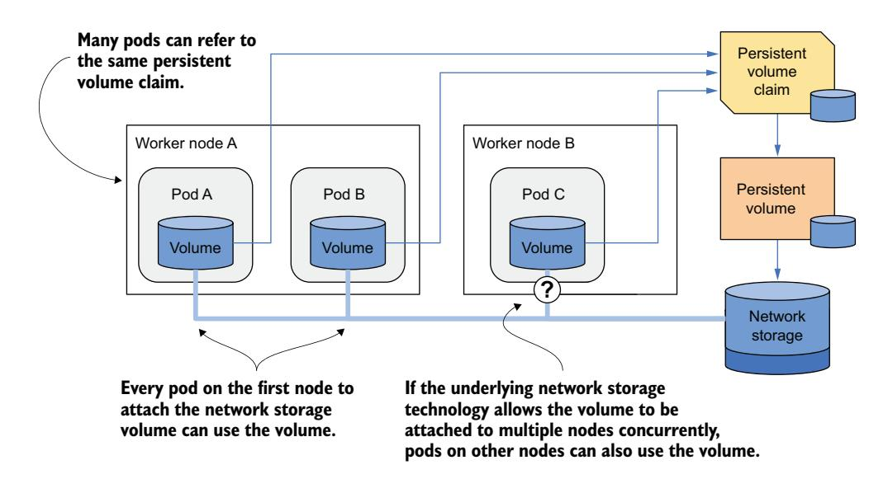
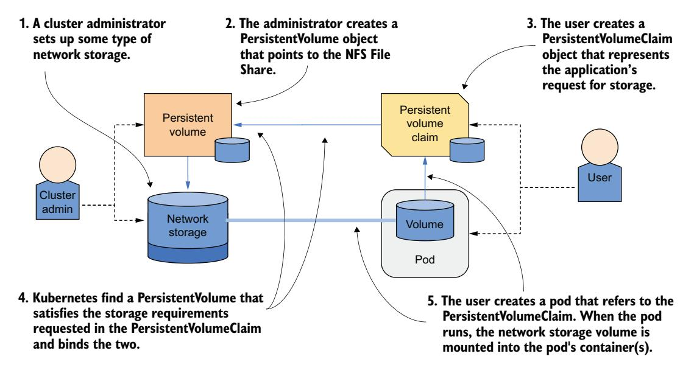
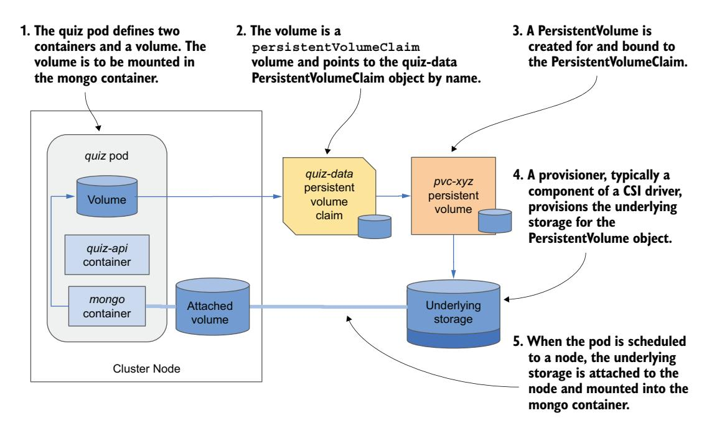
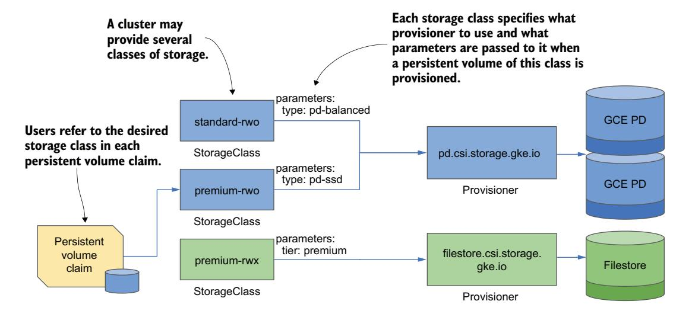
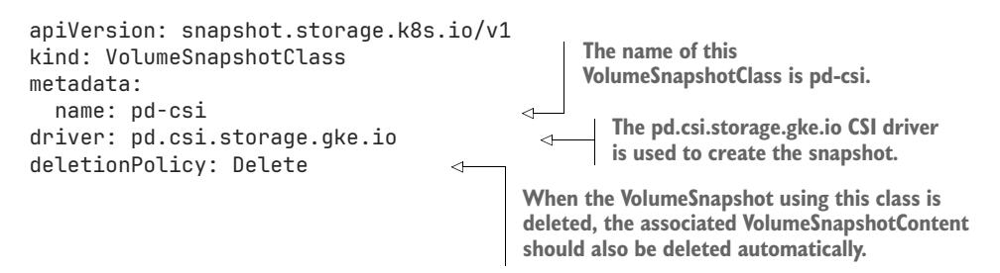

# *Persisting data with PersistentVolumes*

# *This chapter covers*

- Using PersistentVolume objects to represent persistent storage
- Claiming PersistentVolumes with PersistentVolumeClaims
- Static and dynamic provisioning of PersistentVolumes
- Node-local versus network-attached storage
- Snapshotting, cloning, and restoring volumes using the VolumeSnapshot resource
- Long-lived versus ephemeral PersistentVolumes

The previous chapter taught you how to mount ephemeral storage volumes into your pods. In this chapter, you'll learn how to do the same for persistent storage volumes, which can be either node local or network attached.

NOTE The code files for this chapter are available at<https://mng.bz/Qwj4>.

# *10.1 Introducing persistent storage in Kubernetes*

Ideally, developers deploying their applications on Kubernetes shouldn't need to know what storage technology the cluster provides, just as they don't need to know the properties of physical servers running the pods. Infrastructure details should be managed by the people who operate the cluster.

 For this reason, when deploying an application on Kubernetes, you typically don't refer to a specific persistent storage volume. Instead, you specify that you need persistent storage with certain properties, and the cluster either finds an existing volume that matches those properties or provisions a new one.

# *10.1.1 Introducing PersistentVolumeClaims and PersistentVolumes*

When your pod needs a persistent storage volume, you create a PersistentVolume-Claim object and reference it in your pod manifest. Your cluster supports one or more classes of storage, represented by StorageClass objects. You specify the desired StorageClass by name in your PersistentVolumeClaim.

 The cluster finds a matching PersistentVolume object or creates a new one and then binds it to the PersistentVolumeClaim. The PersistentVolume object represents the underlying network storage volume. To better understand the relationship between these objects, examine figure 10.1.


Figure 10.1 Using PersistentVolumes and PersistentVolumeClaims to attach network storage to pods

Let's now take a closer look at the three API resources.

# INTRODUCING PERSISTENTVOLUMES

As the name suggests, a PersistentVolume object represents a storage volume used to persist application data. As shown in the previous figure, the PersistentVolume object represents underlying storage.

 The provisioning of the underlying storage for PersistentVolumes is generally handled by CSI (Container Storage Interface) drivers deployed in the Kubernetes cluster. A CSI driver typically consists of a controller component, which dynamically provisions PersistentVolumes, and a per-node component that mounts and unmounts the underlying storage volume.

 There are many CSI drivers available, and each supports one specific storage technology. For example, the Network File System (NFS) driver allows Kubernetes to access a NFS server, the Azure Disk driver supports Microsoft Azure Disks, the GCE Persistent Disk driver supports Google Compute Engine Persistent Disks, and so on.

TIP The list of CSI drivers is available at<https://mng.bz/X7BE>.

# INTRODUCING PERSISTENTVOLUMECLAIMS

A pod doesn't refer directly to the PersistentVolume object. Instead, it points to a PersistentVolumeClaim object, which then points to the PersistentVolume.

 As its name suggests, a PersistentVolumeClaim object represents a user's claim on the PersistentVolume. Because its life cycle is typically not tied to that of the pod, it allows the ownership of the PersistentVolume to be decoupled from the pod. Before a user can use a PersistentVolume in their pods, they must first claim the volume by creating a PersistentVolumeClaim object. After claiming the volume, the user has exclusive rights to it and can use it in their pods. They can delete the pod at any time, and they won't lose ownership of the PersistentVolume. When the volume is no longer needed, the user releases it by deleting the PersistentVolumeClaim object.

# INTRODUCING STORAGECLASSES

A Kubernetes cluster can provide different classes of persistent storage, represented by the StorageClass resource. A StorageClass defines the provisioner used to create volumes of that class, along with additional parameters for those volumes.

 When creating a PersistentVolumeClaim, users specify the name of the Storage-Class they want to use. If storage classes are named consistently—such as standard, fast, and so on—the PersistentVolumeClaim manifests become portable across different clusters, even if each cluster uses a different underlying storage technology.

IMPORTANT PersistentVolumeClaims manifests are often written by application developers and are usually bundled together with pod and other manifests. This is not the case for PersistentVolumes.

# USING A PERSISTENTVOLUMECLAIM IN A POD

In the previous chapter, you learned about different volume types you can use in a pod. One of the types that wasn't explained in detail is the persistentVolumeClaim volume type. Now that you know what a PersistentVolumeClaim is, it should be obvious what this pod volume type does.

 In the persistentVolumeClaim volume definition, you specify the name of the PersistentVolumeClaim object that you created beforehand to bind the associated PersistentVolume into your pod. For example, if you create a PersistentVolumeClaim named my-nfs-share that is bound to a PersistentVolume backed by an NFS file share, you can attach the NFS file share to your pod by adding a persistentVolumeClaim volume definition that references the my-nfs-share PersistentVolumeClaim object. The volume definition does not need to include any infrastructure-specific information, such as the IP address of the NFS server.

 As shown in figure 10.2, when this pod is scheduled to a cluster node, Kubernetes finds the PersistentVolume that is bound to the claim referenced in the pod and uses the information in the PersistentVolume object to mount the network storage volume in the pod's container.


Figure 10.2 Mounting a PersistentVolume into the pod's container(s)

# USING A PERSISTENTVOLUMECLAIM IN MULTIPLE PODS

Multiple pods can use the same storage volume by referencing the same Persistent-VolumeClaim, which in turn is bound to the same PersistentVolume, as illustrated in the figure 10.3.



Figure 10.3 Using the same PersistentVolumeClaim in multiple pods

Whether these pods must run on the same cluster node or can access the underlying storage from different nodes depends on the storage technology. If the storage supports attaching the volume to multiple nodes concurrently, pods on different nodes can use it. Otherwise, all pods must be scheduled on the node that initially attached the storage volume.

### 10.1.2 Dynamic vs. static provisioning of PersistentVolumes

PersistentVolumes can either be provisioned dynamically or statically. Today, most Kubernetes clusters use dynamic provisioning, which automates the creation of storage volumes as needed. However, static provisioning remains useful in certain scenarios, such as when administrators pre-provision local storage. A single cluster can also support both approaches simultaneously.

#### HOW DYNAMIC PROVISIONING WORKS

In dynamic provisioning of PersistentVolumes, these volumes are created on demand. To support this, one or more CSI drivers are deployed in the cluster by the cluster administrator and registered in the Kubernetes API via the CSIDriver resource. Additionally, one or more StorageClasses referencing each driver are also created. When a cluster user creates a PersistentVolumeClaim, the provisioner creates the Persistent-Volume object and provisions the underlying storage, as shown in figure 10.4.

The cluster administrator does not need to pre-provision any PersistentVolume objects or the underlying storage. Instead, they are provisioned on demand and automatically destroyed when no longer required.


Figure 10.4 Dynamic provisioning of PersistentVolumes

The life cycle of a dynamically provisioned PersistentVolume is shown in figure 10.5. Moments after a user creates a PersistentVolumeClaim, the PersistentVolume and underlying storage are provisioned. Multiple pods can then use the same PersistentVolumeClaim and thus the PersistentVolume. The life cycle of the PersistentVolumeClaim and the PersistentVolume is not tied to that of the pods, so they remain in place even when no pods reference the PersistentVolumeClaim. When the PersistentVolumeClaim object is deleted, the PersistentVolume and the underlying storage are usually deleted, but they can also be retained if necessary.


Figure 10.5 The life cycle of dynamically provisioned PersistentVolumes, claims, and the pods using them

#### HOW STATIC PROVISIONING WORKS

In static provisioning, the cluster administrator must manually provision the underlying storage volumes and create a corresponding PersistentVolume object for each one, as shown in the figure 10.6. Users then claim these pre-provisioned Persistent-Volumes by creating Persistent-VolumeClaims. The life cycle of statically provisioned Persistent-Volumes is shown in figure 10.7.

First, the cluster administrator provisions the actual storage volumes. Then they create the PersistentVolume objects. A user then creates a PersistentVolumeClaim object in which they can either reference a specific PersistentVolume by name or specify requirements such as the minimum volume size and desired access mode. Kubernetes then attempts to match the PersistentVolumeClaim to an available PersistentVolume that meets these criteria.



Figure 10.6 Static provisioning of PersistentVolumes


Figure 10.7 The life cycle of statically provisioned PersistentVolumes, claims, and the pods using them

Once a suitable match is found, the PersistentVolume is bound to the PersistentVolume-Claim, and it becomes unavailable for binding to any other PersistentVolumeClaim.

 When a pod that references the PersistentVolumeClaim is scheduled, the storage volume defined in the bound PersistentVolume is attached to the appropriate node and mounted into the pod's containers. As with dynamically provisioned volumes, multiple pods can use the same PersistentVolumeClaim and the associated PersistentVolume. When each pod runs, the underlying volume is mounted in the pod's containers.

 After all the pods are finished and the PersistentVolumeClaim is no longer needed, it can be deleted. When this happens, the associated PersistentVolume is released. However, the underlying storage volume is not automatically cleaned up. The cluster administrator must do this manually and, if desired, make the PersistentVolume available for reuse.

# *10.2 Dynamically provisioning a PersistentVolume*

Now that you have a basic understanding of PersistentVolumes, PersistentVolume-Claims, and their relationship to the pods, let's revisit the quiz Pod from the previous chapter. You may recall that this pod currently uses an emptyDir volume to store data. As this volume's life cycle is tied to the pod's, all the data is lost every time the pod is deleted and recreated. That's not what you want. You want your responses to the questions stored persistently.

 You'll modify the quiz Pod's manifest to make it use a dynamically provisioned PersistentVolume. To do this, you first need to create a PersistentVolumeClaim.

# *10.2.1 Creating a PersistentVolumeClaim*

Most clusters these days come with at least one StorageClass. And those that contain more than one typically mark it as the default, so you should be able to create a PersistentVolumeClaim without worrying about storage classes in most clusters. As this is the simplest way to create a PersistentVolumeClaim, you'll start with it. You'll learn about StorageClasses later in the chapter.

# CREATING A PERSISTENTVOLUMECLAIM MANIFEST

Creating a PersistentVolumeClaim without explicitly specifying a storage class makes the manifest as minimal as possible and portable across all clusters, assuming they define a default StorageClass. The following listing shows the PersistentVolumeClaim manifest from the file pvc.quiz-data.default.yaml file.

#### Listing 10.1 A minimal PVC definition using the default storage class

apiVersion: v1

kind: PersistentVolumeClaim

metadata:

name: quiz-data

spec:

**The default storage class is used for this claim because the storageClassName field isn't set.**

```
 resources: 
 requests: 
 storage: 1Gi 
 accessModes: 
 - ReadWriteOncePod 
                            The minimum size 
                            of the volume
                               The desired access mode
```

This PersistentVolumeClaim in the listing defines only the minimum size of the volume and the desired access modes. These are the only required values in a Persistent-VolumeClaim, but the storageClassName field is arguably the most important.

# SPECIFYING THE STORAGECLASS NAME

Clusters typically provide several classes of storage. They are represented by the StorageClass resource, which means you can see the available options by running the following command (output reformatted due to space constraints):

# \$ **kubectl get sc** NAME PROVISIONER RECLAIMPOLICY ... premium-rwo pd.csi.storage.gke.io Delete ... standard kubernetes.io/gce-pd Delete ... standard-rwo (default) pd.csi.storage.gke.io Delete ... ... VOLUMEBINDINGMODE ALLOWVOLUMEEXPANSION AGE ... WaitForFirstConsumer true 4h44m ... Immediate true 4h44m ... WaitForFirstConsumer true 4h44m

NOTE The shorthand for storageclass is sc.

At the time of writing, GKE provides three StorageClasses, with the standard-rwo StorageClass as the default. Clusters created by Kind provide a single StorageClass:

```
$ kubectl get sc
NAME PROVISIONER RECLAIMPOLICY ...
standard (default) rancher.io/local-path Delete ... 
                                                                The standard 
                                                                storage class 
                                                                in a cluster 
                                                                created with 
                                                                the kind tool
```

When creating a PersistentVolumeClaim, you specify which StorageClass to use as shown in the following listing; if you don't, the cluster's default StorageClass is used.

#### Listing 10.2 A PersistentVolumeClaim requesting a specific storage class

```
apiVersion: v1
kind: PersistentVolumeClaim
metadata:
 name: quiz-data
spec:
 storageClassName: premium-rwo 
 resources:
 requests:
 storage: 1Gi
                                                This claim requests that this 
                                                specific storage class be used 
                                                to provision the volume.
```

#### accessModes:

- ReadWriteOncePod

NOTE If a PersistentVolumeClaim refers to a nonexistent StorageClass, the claim remains Pending. Kubernetes attempts to bind the claim at regular intervals, generating a ProvisioningFailed event each time. You can see the event if you run the kubectl describe command on the PersistentVolumeClaim.

# SPECIFYING THE MINIMUM VOLUME SIZE

The resources.requests.storage field in a PersistentVolumeClaim's spec specifies the required minimum size of the underlying volume. For dynamically provisioned PersistentVolumes, the provisioned volume will typically be exactly the size requested. In case of static provisioning, Kubernetes will only consider PersistentVolumes whose capacity is equal to or greater than the requested size when selecting a volume to bind to the PersistentVolumeClaim.

# SPECIFYING ACCESS MODES

A PersistentVolumeClaim must specify the access mode that the volume must support. Depending on the underlying technology, a PersistentVolume may or may not support being mounted by multiple nodes or pods simultaneously in read/write or read-only mode.

 There are four access modes. They are explained in the table 10.1, along with their abbreviated form displayed by kubectl.

| Access Mode      | Abbr. | Description                                                                                                                                                                                                                   |
|------------------|-------|-------------------------------------------------------------------------------------------------------------------------------------------------------------------------------------------------------------------------------|
| ReadWriteOncePod | RWOP  | The volume can be mounted in read/write mode by a single pod<br>across the entire cluster.                                                                                                                                    |
| ReadWriteOnce    | RWO   | The volume can be mounted by a single cluster node in read/<br>write mode. While it's mounted to the node, other nodes can't<br>mount the volume. However, multiple pods on the node can all<br>read and write to the volume. |
| ReadWriteMany    | RWX   | The volume can be mounted in read/write mode on multiple<br>worker nodes at the same time.                                                                                                                                    |
| ReadOnlyMany     | ROX   | The volume can be mounted on multiple worker nodes simultane<br>ously in read-only mode.                                                                                                                                      |

Table 10.1 Persistent volume access modes

NOTE The ReadOnlyOnce option doesn't exist. If you use a ReadWriteOnce volume in a pod that doesn't need to write to it, you can mount the volume in read-only mode.

The quiz Pod needs to read from and write to the volume, and you will only run one pod instance, so you request the ReadWriteOncePod access mode in the Persistent-VolumeClaim.

# SPECIFYING THE VOLUME MODE

A PersistentVolume's underlying storage volume can either be formatted with a filesystem or not and will therefore be used as a raw block device. The PersistentVolume-Claim can specify what type of volume is required by specifying the volumeMode field in the spec. Two options are supported, as explained in table 10.2.

Table 10.2 Configuring the volume mode for the PersistentVolume

| Volume Mode | Description                                                                                                                                                                                                                                                                                                                                            |
|-------------|--------------------------------------------------------------------------------------------------------------------------------------------------------------------------------------------------------------------------------------------------------------------------------------------------------------------------------------------------------|
| Filesystem  | When the PersistentVolume is mounted in a container, it is mounted to a directory in<br>the file tree of the container. This is the default volume mode.                                                                                                                                                                                               |
| Block       | When a pod uses a PersistentVolume with this mode, the volume is made available<br>to the application in the container as a raw block device (without a filesystem). This<br>allows the application to read and write data without any filesystem overhead. This<br>mode is typically used by special types of applications, such as database systems. |

The quiz-data PersistentVolumeClaim manifest in the previous listing does not specify a volumeMode field, so it is assumed that it calls for a filesystem volume.

# CREATING THE PERSISTENTVOLUMECLAIM FROM THE MANIFEST

Create the PersistentVolumeClaim by applying the manifest file with kubectl apply. Then check which StorageClass it's using by inspecting the PersistentVolumeClaim with kubectl get. Here's what the output on GKE looks like at the time of writing (some columns omitted due to space constraints):

# \$ **kubectl get pvc**

```
NAME STATUS ... STORAGECLASS ... AGE
quiz-data Pending ... standard-rwo ... 20s
```

TIP Use pvc as a shorthand for persistentvolumeclaim.

Pay attention to the STATUS and the STORAGECLASS columns in the output. The following three things can happen:

- If the STATUS is shown as Bound, this means that the PersistentVolumeClaim has been bound to a PersistentVolume.
- If the STATUS is shown as Pending and the STORAGECLASS is not empty, then obviously the PersistentVolumeClaim has not been bound, but your cluster does provide a default StorageClass.
- If the STATUS is shown as Pending and the STORAGECLASS is empty, then your cluster does not provide a default StorageClass. Please try using a different Kubernetes cluster that provides a default StorageClass.

The reason the PersistentVolumeClaim is immediately bound to a PersistentVolume in some clusters but not others is because different StorageClasses use a different volume binding mode. Some immediately provision the PersistentVolume, while others wait until the first pod that uses the PersistentVolumeClaim is scheduled. This is explained later in the section about StorageClasses. For now, let's create the pod so that the PersistentVolume is provisioned if it hasn't been already.

# *10.2.2 Using PersistentVolumeClaims*

A PersistentVolumeClaim is a standalone object representing a claim on a Persistent-Volume. This claim can then be used to provide the PersistentVolume to one or more pods.

# DEFINING A PERSISTENTVOLUMECLAIM VOLUME IN THE POD MANIFEST

To use a PersistentVolume in a pod, you define a persistentVolumeClaim volume that references the PersistentVolumeClaim object. To try this, you'll modify the quiz Pod from the previous chapter and make it use the quiz-data PersistentVolumeClaim you created in the previous section. The changes to the Pod manifest are highlighted in the next listing. You'll find the full manifest in the file pod.quiz.yaml.

# Listing 10.3 A pod using a persistentVolumeClaim volume

```
apiVersion: v1
kind: Pod
metadata:
 name: quiz
spec:
 volumes:
 - name: quiz-data
 persistentVolumeClaim: 
 claimName: quiz-data 
 containers:
 - name: quiz-api
 image: luksa/quiz-api:0.1
 ports:
 - name: http
 containerPort: 8080
 - name: mongo
 image: mongo
 volumeMounts: 
 - name: quiz-data 
 mountPath: /data/db 
                                    The volume refers to a 
                                    PersistentVolumeClaim named quiz-data.
                                 The volume is mounted the 
                                 same way other volumes 
                                 types are mounted.
```

As you can see in the listing, adding a persistentVolumeClaim volume to a pod is trivial. You only need to specify the name of the PersistentVolumeClaim in the claimName field and that's it. The only other field you can set is the readOnly field, which forces all mounts for this volume to be read-only.

 When you create the pod, the PersistentVolumeClaim you created earlier should finally be bound to a PersistentVolume, if that wasn't previously the case. Let's check:

```
$ kubectl get pvc quiz-data
NAME STATUS VOLUME CAPACITY ACCESS MODES ... 
quiz-data Bound pvc-5d9b8a8b-... 1Gi RWOP ...
```

Now check the underlying PersistentVolume with the following command (note: output reformatted due to space constraints):

# \$ **kubectl get pv**

```
NAME CAPACITY ACCESS MODES RECLAIM POLICY STATUS
pvc-5d9b8a8b-... 1Gi RWOP Delete Bound
CLAIM STORAGECLASS VOLUMEATTRIBUTESCLASS REASON AGE
default/quiz-data standard-rwo <unset> 27m
```

# TIP Use pv as a shorthand for persistentvolume.

The PersistentVolume was created on demand, and its properties perfectly match the requirements specified in the PersistentVolumeClaim and the associated Storage-Class. The volume capacity is 1Gi, and the access mode is RWOP (ReadWriteOncePod).

 The PersistentVolume is also shown as Bound. The bound PersistentVolumeClaim name is also displayed, so you can always see where each PersistentVolume is being used when you list them.

 As this is a new volume, the database is empty. Run the insert-questions.sh script to initialize it and then make sure that the quiz Pod can return a random question from the database as follows:

#### \$ **kubectl get --raw /api/v1/namespaces/default/pods/quiz/proxy/questions/random**

If the command displays a question object in JSON format, everything's working fine. The quiz Pod uses a storage volume attached to the pod's host node and mounted into the mongo container. Figure 10.8 shows the pod, PersistentVolumeClaim, Persistent-Volume, and the underlying storage volume.

# DETACHING A PERSISTENTVOLUMECLAIM AND PERSISTENTVOLUME

When you delete a pod that uses a PersistentVolume via a PersistentVolumeClaim, the underlying storage volume is detached from the cluster node, if it was the only pod using it on that node. If other pods use the same PersistentVolumeClaim, the Persistent-Volume remains attached to the node. Try deleting the quiz Pod now, then check the PersistentVolumeClaim.

 Even when all the pods using a PersistentVolumeClaim are deleted, the Persistent-VolumeClaim continues to exist until you delete it. The PersistentVolume object remains bound to the PersistentVolumeClaim until this happens. This means that you can use the same PersistentVolumeClaim in a different pod.



Figure 10.8 The quiz Pod and its PersistentVolume

#### REUSING A PERSISTENT VOLUME CLAIM IN A NEW POD

When you create another pod that refers to the same PersistentVolumeClaim, the new pod gets access to the same storage represented by the PersistentVolume and the files it contains. Usually, it doesn't matter if the pod is scheduled to the same node or not. Let's see this in action. Recreate the quiz Pod by running the following command:

\$ kubectl apply -f pod.quiz.yaml
pod/quiz created

Wait for the pod to be scheduled, then check that it returns a random question from the database, implying that the volume's files are now available in this new pod. Remember that pods are ephemeral; they get replaced all the time. The quiz Pod now uses a PersistentVolume, which ensures that the data and available to the newest quiz Pod instance regardless of how many times the pod is moved across nodes.

# 10.2.3 Deleting a PersistentVolumeClaim and PersistentVolume

When you no longer plan to deploy pods that will use a certain PersistentVolume-Claim, you can delete it to release the associated PersistentVolume. You might wonder if you can then recreate the claim and access the same volume and data. Let's find out. Delete the pod and the claim as follows to see what happens:

\$ kubectl delete pod quiz
pod "quiz" deleted

```
$ kubectl delete pvc quiz-data
persistentvolumeclaim "quiz-data" deleted
```

Now check the status of the PersistentVolume:

```
$ kubectl get pv quiz-data
NAME ... RECLAIM POLICY STATUS CLAIM ...
quiz-data ... Delete Released default/quiz-data ...
```

The STATUS column shows the volume as Released rather than Available, as was the case initially. The CLAIM column shows the quiz-data PersistentVolumeClaim from which the PersistentVolume was released. The PersistentVolume's RECLAIM POLICY is set to Delete, which means that Kubernetes will delete it.

# ABOUT THE PERSISTENTVOLUME RECLAIM POLICY

What happens to a PersistentVolume when it's released is determined by the Persistent-Volume's reclaim policy? This policy is configured using the field persistentVolume-ReclaimPolicy in the PersistentVolume object's spec. The reclaim policy is also specified in the StorageClass's reclaimPolicy field. The field can have one of the three values explained in table 10.3.

Table 10.3 Persistent volume reclaim policies

| Reclaim policy | Description                                                                                                                                                                                                                                                                        |
|----------------|------------------------------------------------------------------------------------------------------------------------------------------------------------------------------------------------------------------------------------------------------------------------------------|
| Retain         | When the PersistentVolume is released (this happens when you delete the claim<br>that's bound to it), Kubernetes retains the volume. The cluster administrator must<br>manually reclaim the volume. This is the default policy for manually created<br>PersistentVolumes.          |
| Delete         | The PersistentVolume object and the underlying storage are automatically deleted<br>upon release. This is the default policy for dynamically provisioned PersistentVolumes,<br>which are discussed in the next section.                                                            |
| Recycle        | This option is deprecated and shouldn't be used as it may not be supported by the<br>underlying volume plugin. This policy typically causes all files on the volume to be<br>deleted and makes the PersistentVolume available again without the need to delete<br>and recreate it. |

TIP You can change the reclaim policy of an existing PersistentVolume at any time. If it's initially set to Delete, but you don't want to lose your data when deleting the claim, change the volume's policy to Retain before doing so.

WARNING If a PersistentVolume is Released and you subsequently change its reclaim policy from Retain to Delete, the PersistentVolume object and the underlying storage will be deleted.

# *10.2.4 Understanding access modes*

PersistentVolumes in Kubernetes support four access modes, listed in table 10.1. They warrant a closer look.

# THE READWRITEONCEPOD ACCESS MODE

The PersistentVolume used in the quiz Pod is only used by one pod instance at a time, as specified by the ReadWriteOncePod access mode in the PersistentVolumeClaim. The volume is attached to a single node, mounted into a single pod that can both read and write files in the volume.

 If you attempt to run a second quiz Pod that uses the same PersistentVolumeClaim, the pod's status will remain Pending, as shown in the following command output:

# \$ **kubectl get pods**

| NAME  | READY | STATUS  | RESTARTS | AGE |
|-------|-------|---------|----------|-----|
| quiz  | 2/2   | Running | 0        | 20m |
| quiz2 | 0/2   | Pending | 0        | 12m |

NOTE If you want to try this yourself, deploy the pod from the file pod .quiz2.yaml.

This behavior is expected, since the ReadWriteOncePod access mode, unlike other access modes, doesn't allow the volume to be used by multiple pods simultaneously.

# THE READWRITEONCE ACCESS MODE

The ReadWriteOnce access mode may seem identical to ReadWriteOncePod, but it's not; this mode allows a single *node* rather than pod to attach the volume. Multiple pods can use the volume if they run on the same node.

 Try creating the PersistentVolumeClaim from the file pvc.demo-read-writeonce.yaml. Then create several pods from the pod.demo-read-write-once.yaml file, as shown in the following listing.

#### Listing 10.4 Demo-read-write-once pod manifest

```
apiVersion: v1
kind: Pod
metadata:
 generateName: demo-read-write-once- 
 labels: 
 app: demo-read-write-once 
spec:
 volumes: 
 - name: volume 
 persistentVolumeClaim: 
 claimName: demo-read-write-once 
 containers:
 - name: main
```

image: busybox

**This pod manifest doesn't set a name for the pod. The generateName field allows a random name with this prefix to be generated for each pod you create from this manifest.**

**Since we will create multiple pods from this manifest, we use a label to group them.**

**All pods created from this manifest will use the demo-read-write-once PersistentVolumeClaim.**

```
 command:
 - sh
 - -c
 - |
 echo "I can read from the volume; these are its files:" ;
 ls /mnt/volume ;
 echo ;
 echo "Created by pod $HOSTNAME." > /mnt/volume/$HOSTNAME.txt && 
 echo "I can also write to the volume." &&
 echo "Wrote file /mnt/volume/$HOSTNAME" ;
 sleep infinity
 volumeMounts:
 - name: volume
 mountPath: /mnt/volume
                                                       The pod writes a short message
                                                       to a file in the PersistentVolume.
                                                   The filename is the pod's hostname. If
                                                   the file creation succeeds, a message
                                                    is printed to the standard output of
                                                      the container. The container then
                                                             waits for 9999 seconds.
```

Create pods from this manifest by running kubectl create -f pod.demo-read-writeonce.yaml command several times.

NOTE You can't use kubectl apply when the manifest uses the generateName field instead of specifying the pod name. You must use kubectl create instead.

Now display the list of pods with the -o wide option as follows, so that you see which node each pod is deployed on:

```
$ kubectl get pods -l app=demo-read-write-once -o wide
NAME READY STATUS NODE 
demo-read-write-once-4ltgn 1/1 Running node-36xk 
demo-read-write-once-4qjqx 1/1 Running node-36xk 
demo-read-write-once-8msr4 1/1 Running node-36xk 
demo-read-write-once-w8wkj 0/1 ContainerCreating node-334g 
demo-read-write-once-5j24w 0/1 ContainerCreating node-334g 
                                       These pods run on the same node and
                                          all can read/write to the volume.
                                  These pods can't mount the volume, because
```

NOTE Command output edited for brevity.

If all your pods are located on the same node, create a few more. Then look at the STATUS of these pods. You'll notice that all the pods scheduled to the same node run fine, whereas the pods on other nodes are all stuck in the status ContainerCreating.

**they're scheduled to a different node.**

 If you use kubectl describe to display the events related to one of these pods, you'll see that it doesn't run because the PersistentVolume can't be attached to the node that the pod is on

# \$ **kubectl describe po data-writer-97t9j** ...

 Warning FailedAttachVolume 16m attachdetach-controller Multi-Attach error for volume "pvc-fcc8236e-dd68-466b-9fc3-96bcf96d3a21" Volume is already used by pod(s) demo-read-write-once-8msr4, demo-read-write-once-p92gw, demoread-write-once-4qjqx, demo-read-write-once-4ltgn, demo-read-write-once-ld9k6

The reason the volume can't be attached is because it's already attached to the first node in read-write mode. This means that only a single node can attach the volume in read-write mode. When the second node tries to do the same, the operation fails.

 All the pods on the first node run fine. Check their logs to confirm that they were all able to write a file to the volume. Here's the log of one of them:

```
$ kubectl logs demo-read-write-once-4ltgn
I can read from the volume; these are its files:
demo-read-write-once-4qjqx.txt
demo-read-write-once-8msr4.txt
I can also write to the volume.
Wrote file /mnt/volume/demo-read-write-once-4ltgn
```

You'll find that all the pods on the first node successfully wrote their files to the volume. You can delete these pods now, but leave the PersistentVolumeClaim, as you'll need it later. The easiest way to delete these pods is by using kubectl delete with a label selector as follows:

```
$ kubectl delete pods -l app=demo-read-write-once
```

# THE READWRITEMANY ACCESS MODE

As the name of the ReadWriteMany access mode suggests, volumes that support this mode can be attached to many cluster nodes concurrently yet still allow read and write operations to be performed on the volume. However, not all storage technologies support this mode.

 For example, at the time of writing, none of the default StorageClasses in Google Kubernetes Engine support ReadWriteMany. But when you enable the GcpFilestore-CsiDriver with the following command, several new StorageClasses that do support ReadWriteMany will appear:

```
$ gcloud container clusters update <cluster-name> \
 --update-addons=GcpFilestoreCsiDriver=ENABLED
```

NOTE You also need to enable the Cloud Filestore API in your Google console.

As this mode has no restrictions on the number of nodes or pods that can use the PersistentVolume in either read-write or read-only mode, it doesn't need any further explanation. If you'd like to try it out, deploy the PersistentVolumeClaim by setting the correct storageClassName in the pvc.demo-read-write-many.yaml manifest file and applying it to your cluster. Then create a few pods from the pod.demo-read-writemany.yaml file to see if they can all read and write to the volume despite being scheduled to different nodes.

TIP You can delete the pods as well as the PersistentVolumeClaim with kubectl delete pods,pvc -l app=demo-read-write-many.

# THE READONLYMANY ACCESS MODE AND CLONING A PERSISTENTVOLUMECLAIM

The final access mode we need to cover is ReadOnlyMany, which is a bit different from the others when dynamic provisioning is used. You obviously can't write to a Read-OnlyMany volume but only read from it. But as you know, in dynamic provisioning, a *new* PersistentVolume is created for your PersistentVolumeClaim. A new volume is of course empty, so there's no point in using it in read-only mode unless you can somehow prepopulate it. This is exactly what you need to do when using the ReadOnlyMany access mode with dynamically provisioned volumes.

 Kubernetes allows you to define a data source in your PersistentVolumeClaim. When the PersistentVolume is provisioned, it's initialized with data from the data source and only then mounted into your pods. Different types of data sources are supported. Here, we focus only on using another PersistentVolumeClaim or rather the associated PersistentVolume as the source. Let's see an example.

 You'll use the demo-read-write-once PersistentVolumeClaim as the data source. The following listing shows the manifest for the demo-read-only-many PersistentVolume-Claim. You'll find it in the file pvc.demo-read-only-many.yaml.

# Listing 10.5 Initializing a PersistentVolumeClaim with another PersistentVolumeClaim

```
apiVersion: v1
kind: PersistentVolumeClaim
metadata:
 name: demo-read-only-many
 labels:
 app: demo-read-only-many
spec:
 resources:
 requests:
 storage: 1Gi
 accessModes: 
 - ReadOnlyMany 
 dataSourceRef: 
 kind: PersistentVolumeClaim 
 name: demo-read-write-once 
                                      This claim requires the 
                                      ReadOnlyMany access mode.
                                          The demo-read-write-once 
                                          PersistentVolumeClaim should be used as a 
                                          data source to initialize the PersistentVolume.
```

As you can see in the listing, using another PersistentVolumeClaim as the data source is trivial. You only need to specify the kind and the name of the object you want to use as the data source in the dataSourceRef field.

NOTE You can use this approach to clone any PersistentVolume to a new PersistentVolume regardless of their access modes.

NOTE In addition to the dataSourceRef field, PersistentVolumeClaim also accepts a similar field called dataSource exists, but this field is expected to be deprecated in the future.

To mount a PersistentVolume into your pod in read-only mode, set the readOnly field in the persistentVolumeClaim volume definition, as in the following listing from the file pod.demo-read-only-many.yaml.

#### Listing 10.6 A pod using a shared PersistentVolume in read-only mode

```
apiVersion: v1
kind: Pod
metadata:
 generateName: demo-read-only-many-
 labels:
 app: demo-read-only-many
spec:
 volumes:
 - name: volume
 persistentVolumeClaim: 
 claimName: demo-read-only-many 
 readOnly: true 
 containers:
 - name: main
 image: busybox
 command:
 - sh
 - -c
 - |
 echo "I can read from the volume; these are its files:" ; 
 ls /mnt/volume ; 
 sleep infinity 
 volumeMounts:
 - name: volume
 mountPath: /mnt/volume ...
                                           The demo-read-only-many 
                                           PersistentVolumeClaim's volume will 
                                           be mounted in read-only mode.
                                              The command in this pod only
                                                reads the volume; it doesn't
                                                            write to it.
```

Use the kubectl create command to create as many of these reader pods as necessary to ensure that at least two different nodes run an instance of this pod. Use the kubectl get po -o wide command to see how many pods are on each node.

 Pick a pod and check its logs to confirm that the volume contains files from the PersistentVolumeClaim used as the data source. You should see files created by the demo-read-write-once pods as in the following example:

```
$ kubectl logs demo-read-only-many-2mxjp
I can read from the volume; these are its files:
demo-read-write-once-4ltgn.txt
demo-read-write-once-4qjqx.txt
...
```

You can now delete all the demo Pods and PersistentVolumeClaims, as you're done using them.

# *10.2.5 Understanding StorageClasses*

As mentioned earlier, storageClassName is arguably the most important property of a PersistentVolumeClaim. It specifies which class of persistent storage should be provisioned. A cluster will typically provide several classes, represented by StorageClass objects. Additional storage classes may be available when additional CSI drivers are installed. More on those later.

Here's a list of available StorageClasses on GKE when the GcpFilestoreCsiDriver add-on is installed:

| \$ kubectl get sc         |                              |               |
|---------------------------|------------------------------|---------------|
| NAME                      | PROVISIONER                  | RECLAIMPOLICY |
| enterprise-multishare-rwx | filestore.csi.storage.gke.io | Delete        |
| enterprise-rwx            | filestore.csi.storage.gke.io | Delete        |
| premium-rwo               | pd.csi.storage.gke.io        | Delete        |
| premium-rwx               | filestore.csi.storage.gke.io | Delete        |
| standard                  | kubernetes.io/gce-pd         | Delete        |
| standard-rwo (default)    | pd.csi.storage.gke.io        | Delete        |
| standard-rwx              | filestore.csi.storage.gke.io | Delete        |
| zonal-rwx                 | filestore.csi.storage.gke.io | Delete        |

**NOTE** The shorthand for storageclass is sc.

Three other columns (VOLUMEBINDINGMODE, ALLOWVOLUMEEXPANSION, and AGE) are not shown due to space constraints. You already know AGE; the other two are explained later.

As you can see, GKE provides roughly three groups of StorageClasses: standard, premium, and enterprise. These are then further split into whether they support the rwx (ReadWriteMany) or rwo (ReadWriteOnce) access mode. Different clusters will provide different StorageClasses, but one will usually be the default.

As shown figure 10.9, each storage class specifies what provisioner to use and the parameters that should be passed to it when provisioning the volume. The user decides which StorageClass to use for each of their PersistentVolumeClaims.



Figure 10.9 The relationship between StorageClasses, PersistentVolumeClaims, and volume provisioners

# INSPECTING THE DEFAULT STORAGE CLASS

Let's get to know the StorageClass resource a bit more by inspecting the YAML of the standard-rwo StorageClass object in GKE with the kubectl get command:

```
$ kubectl get sc standard-rwo -o yaml 
allowVolumeExpansion: true
apiVersion: storage.k8s.io/v1
kind: StorageClass
metadata:
 annotations:
 components.gke.io/component-name: pdcsi
 components.gke.io/component-version: 0.21.32
 components.gke.io/layer: addon
 storageclass.kubernetes.io/is-default-class: "true" 
 creationTimestamp: "2025-07-07T07:31:57Z"
 labels:
 addonmanager.kubernetes.io/mode: EnsureExists
 k8s-app: gcp-compute-persistent-disk-csi-driver
 name: standard-rwo
 resourceVersion: "1751873517609007007"
 uid: 6a6a1c0c-48e7-4c10-ab3c-63ad23e0a9a3
parameters: 
 type: pd-balanced 
provisioner: pd.csi.storage.gke.io 
reclaimPolicy: Delete 
volumeBindingMode: WaitForFirstConsumer 
                                                      This command was run against a 
                                                      GKE cluster. The output may be 
                                                      different in your cluster.
                                                                        This marks the 
                                                                        storage class 
                                                                        as default.
                                                      The parameters for 
                                                      the provisioner
                                                          The name of the provisioner 
                                                          that gets called to provision 
                                                          PersistentVolumes of this class
                                                        The reclaim policy for 
                                                        PersistentVolumes of this class
                       When PersistentVolumes of this
                       class are provisioned and bound
```

NOTE You'll notice that StorageClass objects have no spec or status sections. This is because the object only contains static information. Since the object's fields aren't organized in the two sections, the YAML manifest may be more difficult to read. This is also compounded by the fact that fields in YAML are typically displayed in alphabetical order, which means that some fields may appear above the apiVersion, kind, or metadata fields. Don't overlook them.

As specified in the manifest, when you create a PersistentVolumeClaim that references the standard-rwo class in GKE, the provisioner pd.csi.storage.gke.io is called to provision the PersistentVolume. The parameters specified in the StorageClass are passed to the provisioner, so even if multiple StorageClasses use the same provisioner, they can provide different types of storage by specifying a different set of parameters.

# UNDERSTANDING WHEN A DYNAMICALLY PROVISIONED VOLUME IS ACTUALLY PROVISIONED

The volumeBindingMode in a StorageClass indicates whether the PersistentVolume is bound immediately when the PersistentVolumeClaim is created or only when the first pod using the claim is scheduled. The standard StorageClass on GKE uses Immediate, whereas all others use the WaitForFirstConsumer volume binding mode. These two modes are explained in table 10.4.

Table 10.4 Supported volume binding modes

| Volume binding mode  | Description                                                                                                                                                                                                                                                                      |
|----------------------|----------------------------------------------------------------------------------------------------------------------------------------------------------------------------------------------------------------------------------------------------------------------------------|
| Immediate            | The provision and binding of the PersistentVolume takes place immedi<br>ately after the PersistentVolumeClaim is created. Because the consumer<br>of the claim is unknown at this point, this mode is only applicable to vol<br>umes that can be accessed from any cluster node. |
| WaitForFirstConsumer | The PersistentVolume is provisioned and bound to the PersistentVolume<br>Claim when the first pod referencing this claim is created. Many Storage<br>Classes now use this mode.                                                                                                  |

# OTHER STORAGECLASS FIELDS

StorageClass objects also support several other fields that we have not covered. The allowVolumeExpansion, and reclaimPolicy are explained later, and you can use kubectl explain to learn about the others.

# CREATING ADDITIONAL STORAGE CLASSES

As already mentioned, multiple StorageClasses may use the same provisioner, but different parameters. This means you can usually add additional StorageClasses to the cluster if you know the parameters supported by the provisioner. Furthermore, you can install provisioners to add support for other storage technologies in your cluster. These are typically part of the CSI driver, which you'll learn about next.

# *10.2.6 About CSI drivers*

In the early days of PersistentVolumes, the Kubernetes codebase contained support for many different storage technologies. Most of this code has now moved "out-oftree" or outside the core Kubernetes code and now lives in various CSI drivers. This allows support for new storage technologies to be added without changing the Kubernetes code or APIs.

 As explained in the introduction, each CSI driver typically consists of a controller component that dynamically provisions PersistentVolumes, and a per-node component that mounts and unmounts the underlying storage volume.

# INTRODUCING THE CSIDRIVER RESOURCE

One or more CSI drivers may be installed in your Kubernetes cluster. They are represented by the CSIDriver resource, which means you can easily list the supported drivers with the kubectl get command. For example, my GKE cluster currently provides two:

#### \$ **kubectl get csidrivers**

| NAME                         | <br>MODES      | AGE |
|------------------------------|----------------|-----|
| filestore.csi.storage.gke.io | <br>Persistent | 17h |
| pd.csi.storage.gke.io        | <br>Persistent | 25h |

You'll notice that the CSIDriver names match the provisioner field values in the StorageClasses you inspected earlier.

# INSPECTING A CSIDRIVER OBJECT

Let's quickly examine the pd.csi.storage.gke.io CSIDriver, which is available in all GKE clusters:

```
$ kubectl get csidriver pd.csi.storage.gke.io -o yaml
apiVersion: storage.k8s.io/v1
kind: CSIDriver
metadata:
 annotations:
 components.gke.io/component-name: pdcsi
 components.gke.io/component-version: 0.21.32
 components.gke.io/layer: addon
 creationTimestamp: "2025-07-07T07:31:55Z"
 labels:
 addonmanager.kubernetes.io/mode: Reconcile
 k8s-app: gcp-compute-persistent-disk-csi-driver
 name: pd.csi.storage.gke.io
 resourceVersion: "1751873515365679015"
 uid: 064f5216-2d7c-441a-af81-8a30982c9a7c
spec:
 attachRequired: true
 fsGroupPolicy: ReadWriteOnceWithFSType
 podInfoOnMount: false
 requiresRepublish: false
 seLinuxMount: false
 storageCapacity: false
 volumeLifecycleModes:
 - Persistent
```

The information in the CSIDriver spec section is mostly used to tell Kubernetes how to interact with the driver and is very low-level, so I won't explain it further. You can use the kubectl explain csidriver.spec command to learn more about them.

 You typically don't create CSIDriver objects manually. Instead, each CSIDriver vendor provides the appropriate manifest, and it may get created automatically as part of the driver installation process.

# ABOUT THE CONTROLLER AND THE NODE-LEVEL AGENT

A CDI driver typically consists of two components. One is the controller that handles the management of the PersistentVolumes associated with the StorageClass that uses the CSI driver; the other is an agent that runs on every cluster node and takes care of attaching and detaching the storage volume to and from the node when a pod uses a PersistentVolume handled by this CSI driver.

 You can usually find the node-level pods in the kube-system or other namespace in the cluster. For example, in GKE you will find one pod named pdcsi-node-xyz for each node of your cluster.

# *10.3 Statically provisioning a PersistentVolume*

Static provisioning entails pre-provisioning one or more persistent storage volumes, creating PersistentVolume objects to represent them, and then letting Kubernetes find an appropriate existing PersistentVolume for every PersistentVolumeClaim that a user creates. You can pre-provision a PersistentVolume using any supported storage technology. It's similar to how it's done by the automatic provisioners referenced in StorageClasses. The difference is that the PersistentVolume is created before the PersistentVolumeClaim that later claims it.

 As an example, this section will teach you how to statically provision node-local PersistentVolumes. These typically use the node's own devices to provide storage. The procedure for static provisioning of network-attached storage is similar, so you should be able to understand how to do it by roughly following the same instructions.

# *10.3.1 Creating a node-local PersistentVolume*

In the previous sections of this chapter, you used PersistentVolumes and claims to provide network-attached storage volumes to your pods. However, some applications work best with locally attached storage, and this is where node-local PersistentVolumes are used.

 In the previous chapter, you learned that you can use a hostPath volume in a pod if you want the pod to access part of the host's file system. Now you'll learn how to do the same with PersistentVolumes.

 You might remember that when you add a hostPath volume to a pod, the data that the pod sees depends on which node the pod is scheduled to. In other words, if the pod is deleted and recreated, it might end up on another node and no longer have access to the same data.

 If you use a local PersistentVolume instead, this problem is resolved. The Kubernetes scheduler ensures that the pod is always scheduled on the node to which the local volume is attached.

NOTE Local PersistentVolumes are also better than hostPath volumes because they offer much better security. As explained in the previous chapter, you don't want to allow regular users to use hostPath volumes at all. Because PersistentVolumes are managed by the cluster administrator, regular users can't use them to access arbitrary paths on the host node.

# CREATING LOCAL PERSISTENTVOLUMES

Imagine you are a cluster administrator and you have just installed an ultra-lowlatency disk in one of the cluster nodes. If you're using GKE, you can emulate the addition of this disk by creating a new directory on one of the nodes. Run the following command to log into one of the nodes:

Then, create the directory by running the following command on that node: \$ **mkdir /tmp/my-disk**

If you're using a Kubernetes cluster created with the kind tool to run this exercise, you can create the directory as follows:

#### \$ **docker exec kind-worker mkdir /tmp/my-disk**

If you're using a different cluster, the procedure to create the directory should be very similar. Refer to your cluster provider's documentation on how to ssh into one of your nodes.

# CREATING A STORAGE CLASS TO REPRESENT LOCAL STORAGE

This new disk represents a new class of storage in the cluster, so it makes sense to create a new StorageClass object that represents it. Create a new StorageClass manifest as shown in the following listing. You can find it in the file sc.local.yaml.

#### Listing 10.7 Defining the local storage class

apiVersion: storage.k8s.io/v1 kind: StorageClass metadata: name: local provisioner: kubernetes.io/no-provisioner volumeBindingMode: WaitForFirstConsumer **Let's call this storage class local-storage. Persistent volumes of this class are provisioned manually. The PersistentVolumeClaim should be bound only when the first pod that uses the claim is deployed.**

Since you will be provisioning the storage manually, set the provisioner field to kubernetes.io/no-provisioner, as shown in the listing. Because this StorageClass represents locally attached volumes that can only be accessed within the nodes to which they are physically connected, the volumeBindingMode is set to WaitForFirstConsumer, so the binding of the claim is delayed until the pod is scheduled.

# CREATING A PERSISTENTVOLUME FOR THE LOCAL FILE DIRECTORY

After attaching the disk to one of the nodes, you must tell Kubernetes about this storage volume by creating a PersistentVolume object. The manifest for the PersistentVolume is in the file pv.local-disk-on-my-node.yaml and shown in the following listing.

# Listing 10.8 Defining a local PersistentVolume

kind: PersistentVolume apiVersion: v1 metadata:

name: local-disk-on-my-node

spec:

 accessModes: - ReadWriteOnce **This PersistentVolume represents the local disk, hence the name.**

```
 storageClassName: local 
 capacity:
 storage: 10Gi
 local: 
 path: /tmp/my-disk 
 nodeAffinity: 
 required: 
 nodeSelectorTerms: 
 - matchExpressions: 
 - key: kubernetes.io/hostname 
 operator: In 
 values: 
 - insert-the-name-of-the-node-with-the-disk 
                                            This volume belongs to 
                                            the local storage class. 
                                              This volume is mounted in the node's 
                                              filesystem at the specified path.
                                                                This section tells 
                                                                Kubernetes which nodes 
                                                                can access this volume. 
                                                                Since the disk is attached 
                                                                only to one specific node, 
                                                                it is only accessible on 
                                                                this node.
```

The spec section in a PersistentVolume object specifies the storage capacity of the volume, the access modes it supports, and the underlying storage technology it uses, along with all the information required to use the underlying storage.

 Because this PersistentVolume represents a local disk attached to a particular node, you give it a name that conveys this information. It refers to the local storage class that you created previously. Unlike previous PersistentVolumes, this volume represents storage space that is directly attached to the node. You therefore define it as a local volume. Within the local volume configuration, you also specify the path where it's mounted (/tmp/my-disk).

 At the bottom of the manifest, you'll find several lines that indicate the volume's node affinity. A volume's node affinity defines which nodes can access this volume.

NOTE You learned a bit about a pod's node affinity in chapter 7.

After you create the PersistentVolume object, confirm that it is Available by running the following command:

```
$ kubectl get pv local-disk-on-my-node
NAME ... STATUS CLAIM STORAGECLASS ...
local-disk-on-my-node ... Available local ...
```

The PersistentDisk is not bound to any PersistentVolumeClaim, as indicated by the empty CLAIM column. As a cluster administrator responsible for pre-provisioning a PersistentVolume, your work is now done. Users can now claim this volume with a PersistentVolumeClaim object.

# *10.3.2 Claiming a pre-provisioned PersistentVolume*

Claiming a pre-provisioned PersistentVolume is similar to claiming a new Persistent-Volume through dynamic provisioning. You create a PersistentVolumeClaim object.

# CREATING THE PERSISTENTVOLUMECLAIM FOR A LOCAL VOLUME

As an application developer, you can now deploy your pod and its associated Persistent-VolumeClaim. As with the pod, creating the claim for a local PersistentVolume is no different than creating any other PersistentVolumeClaim.

 Let's deploy a PersistentValumeClaim called quiz-data-local, which you will later use in your quiz-local Pod. You can find the manifest in the file pvc.quiz-datalocal.yaml. Its content is shown in the next listing.

#### Listing 10.9 Persistent volume claim using the local storage class

```
apiVersion: v1
kind: PersistentVolumeClaim
metadata:
 name: quiz-data-local
spec:
 storageClassName: local 
 resources:
 requests:
 storage: 1Gi
 accessModes:
 - ReadWriteOnce
                                      The claim requests a 
                                      PersistentVolume from 
                                      the local storage class.
```

When you create this PersistentVolumeClaim, it is not immediately bound to the PersistentVolume you created earlier, because the local StorageClass specifies the WaitForFirstConsumer volume binding mode. You must also create the pod.

# BINDING THE PERSISTENTVOLUMECLAIM BY CREATING THE POD

You'll create a pod called quiz-local, which uses the quiz-data-local Persistent-VolumeClaim. The relevant part of the pod definition is shown in the following listing. You can find the entire manifest in the file pod.quiz-local.yaml.

#### Listing 10.10 Using a locally attached PersistentVolume

```
spec:
 volumes:
 - name: quiz-data
 persistentVolumeClaim:
 claimName: quiz-data-local 
                                               The pod uses 
                                               the quiz-data-local 
                                               PersistentVolumeClaim.
```

Create the pod from the manifest file. The following events take place next:

- <sup>1</sup> The PersistentVolumeClaim is bound to the PersistentVolume.
- <sup>2</sup> The scheduler determines that the volume bound to the claim that is used in the pod can only be accessed from a specific node, so it schedules the pod there.
- <sup>3</sup> The pod's containers are started with the local volume mounted in it.

Check the PersistentVolumeClaim again to ensure that it is now bound to the PersistentVolume:

```
$ kubectl get pvc quiz-data-local
NAME STATUS VOLUME ...
quiz-data-local Bound local-disk-on-my-node ...
```

You can now check the /tmp/my-disk directory on the node to confirm that MongoDB has created files there.

# USING OTHER TYPES OF PRE-PROVISIONED PERSISTENTVOLUMES

In the previous example, you created a local PersistentVolume, but the same procedure could be used to create a network-attached PersistentVolume. Instead of using the local field in the PersistentVolume, you could use any of the other supported volume types, or the csi field to provision the volume via CSI. You would also need to create a different StorageClass.

 When users create a PersistentVolumeClaim that utilizes the StorageClass, Kubernetes binds it to the PersistentVolume you created beforehand.

# *10.3.3 Releasing and recycling a manually provisioned PersistentVolume*

As you already know, deleting a pod that uses a PersistentVolumeClaim doesn't affect the claim or the associated PersistentVolume and underlying storage. Deleting a PersistentVolumeClaim, however, may affect the PersistentVolume.

 With dynamic provisioning, the PersistentVolume is typically deleted along with the PersistentVolumeClaim, because the provisioner sets the PersistentVolume's persistentVolumeReclaimPolicy to Delete. However, statically provisioned Persistent-Volumes will typically use the Retain policy. This is also the case in our local-disk-onmy-node PersistentVolume example.

# RELEASING A PERSISTENTVOLUME

If you delete the quiz-local Pod and the quiz-data-local PersistentVolumeClaim, the associated PersistentVolume's status changes from Bound to Released, as you can see here:

```
$ kubectl get pv local-disk-on-my-node
NAME RECLAIM POLICY STATUS CLAIM
local-disk-on-my-node Retain Released default/quiz-data-local
```

The quiz-data-local PersistentVolumeClaim is still displayed in the CLAIM column, but the PersistentVolume is no longer bound to it, as evident by its Released status. Let's create the PersistentVolumeClaim again to see what happens.

# BINDING TO A RELEASED PERSISTENTVOLUME

What happens if you create a claim for a released PersistentVolume? Run the following commands to find out:

```
$ kubectl apply -f pod.quiz-local.yaml -f pvc.quiz-data-local.yaml
pod/quiz-local created
persistentvolumeclaim/quiz-data-local created
```

| \$ kubectl get pod/quiz-local pvc/quiz-data-local |       |         |          |     |            |
|---------------------------------------------------|-------|---------|----------|-----|------------|
| NAME                                              | READY | STATUS  | RESTARTS | AGE | The pod is |
| pod/quiz-local                                    | 0/2   | Pending | 0        | 37s | Pending.   |

```
NAME STATUS VOLUME ...
persistentvolumeclaim/quiz-data-local Pending 
                                               The PersistentVolumeClaim 
                                               is also Pending.
```

Both the pod and the PersistentVolumeClaim are Pending. Earlier, the Persistent-VolumeClaim was bound to the PersistentVolume and the pod was started, so why not now?

 The reason behind this is that the volume has previously been used and might contain data that should be erased before another PersisentVolumeClaim can claim it. This is also the reason why the status of the volume is Released instead of Available and why the claim name is still shown on the PersistentVolume, as this helps the cluster administrator know whether the data can be safely deleted.

# MAKING A RELEASED PERSISTENTVOLUME AVAILABLE FOR RE-USE

To make the volume available again, you must delete and recreate the Persistent-Volume object. But will this cause the data stored in the volume to be lost?

 With a pre-provisioned PersistentVolume like the one at hand, deleting the object is equivalent to deleting a data pointer. The PersistentVolume object merely *points* to some storage—it doesn't store the data. If you delete and recreate the object, you end up with a new pointer to the same storage and thus the same data. Try deleting the PersistentVolume and creating it again from the pv.local-disk-on-my-node.yaml file.

NOTE An alternative way of making a PersistentVolume available again is to edit the PersistentVolume object and remove the claimRef from the spec section.

If you check the new PersistentVolume immediately after you recreate or release it, you may be able to see the PersistentVolume's status shown as Available as in the following example:

```
$ kubectl get pv local-disk-on-my-node
NAME ... RECLAIM POLICY STATUS CLAIM ...
local-disk-on-my-node ... Retain Available ...
```

Since the quiz-local Pod and the quiz-data-local PersistentVolumeClaim are waiting for a suitable PersistentVolume to pop up, the PersistentVolume's status then soon changes to Bound, as it's bound by the aforementioned claim:

```
$ kubectl get pv quiz-data
NAME ... STATUS CLAIM ...
local-disk-on-my-node ... Bound default/quiz-data-local ... 
                                         The PersistentVolume is again bound
                                             to the PersistentVolumeClaim.
```

The pod is now able to access the MongoDB files in the PersistentVolume created by the previous pod.

# DELETING A PERSISTENTVOLUME WHILE IT'S BOUND

You're done playing with the quiz-local Pod, the quiz-data-local PersistentVolume-Claim, and the local-disk-on-my-node PersistentVolume, so you'll now delete them. Have you wondered what happens if a cluster administrator deletes a Persistent-Volume while it's in use (while still bound to a claim)? Let's find out. Delete the PersistentVolume like this:

```
$ kubectl delete pv local-disk-on-my-node
persistentvolume "local-disk-on-my-node " deleted 
                                                                   The command blocks 
                                                                   after printing this 
                                                                   message.
```

This command tells the Kubernetes API to delete the PersistentVolume object and then waits for Kubernetes controllers to complete the process. But this can't happen until you release the PersistentVolume from the PersistentVolumeClaim.

 You can cancel the wait by pressing Ctrl-C. This doesn't cancel the deletion, as its already underway. You can confirm this as follows:

```
$ kubectl get pv local-disk-on-my-node
NAME ... STATUS CLAIM ...
Local-disk-on-my-node ... Terminating default/quiz-data-local 
                                              The PersistentVolume is
                                                     terminating.
```

As you can see, the PersistentVolume's status shows that it's being terminated. It'll remain in this state until you delete PersistentVolumeClaim object.

# DELETING A PERSISTENTVOLUMECLAIM WHILE A POD IS USING IT

The claim is still being used by the quiz-local Pod, but let's try deleting it anyway:

```
$ kubectl delete pvc quiz-data-local
persistentvolumeclaim "quiz-data-local" deleted 
                                                                   The command blocks after 
                                                                   printing this message
```

Like the kubectl delete pv command, this command also waits until the deletion process is complete. You can interrupt the execution of the command, but this won't cancel the deletion, as you can see with the following command:

```
$ kubectl get pvc quiz-data-local
NAME STATUS VOLUME ...
quiz-data-local Terminating local-disk-on-my-node 
                                                      The PersistentVolumeClaim 
                                                      is being terminated
```

The deletion of the PersistentVolumeClaim is blocked by the pod. Unsurprisingly, deleting a PersistentVolume or a PersistentVolumeClaim has no immediate effect on the pod that's using it. The application running in the pod continues to run unaffected. Kubernetes never kills pods just because the cluster administrator wants their disk space back.

 To allow the termination of the PersistentVolumeClaim and the PersistentVolume to complete, delete the pod by running kubectl delete po quiz-local.

# DELETING THE UNDERLYING STORAGE

As you learned in the previous section, deleting a statically provisioned Persistent-Volume does not delete the underlying storage, such as the /tmp/my-disk directory on your chosen node. This may also be true for cloud-based storage volumes. Make sure to manually delete the storage volume to prevent incurring unnecessary costs. For example, in GKE, list the storage disks with gcloud compute disks list and delete any unnecessary disks with gcloud compute disks delete <name>.

NOTE Dynamically provisioned disks are usually deleted automatically when you delete the associated PersistentVolume object.

# *10.4 Managing PersistentVolumes*

Computer storage is a very broad topic. You've already learned how to provision storage statically as well as dynamically and attach it to your applications running in pods. You've also learned how to clone a storage volume by referencing an existing PersistentVolumeClaim in a new PersistentVolumeClaim's dataSourceRef field.

 In this section, you'll learn how to resize an existing PersistentVolume without cloning it, create a snapshot of a PersistentVolume, and create a new Persistent-Volume from this snapshot.

# *10.4.1 Resizing PersistentVolumeClaims*

A cluster user can self-provision a storage volume with the properties and size specified in the PersistentVolumeClaim and the referenced StorageClass. If the user later wants to switch to a different StorageClass for their volume, they must, as you might expect, create a new PersistentVolumeClaim. Kubernetes does not support modifying the storageClassName field in a PersistentVolumeClaim. If you try to do so, you'll receive the following error message:

\* spec: Forbidden: spec is immutable after creation except resources.requests and volumeAttributesClassName for bound claims

The error indicates that most of the fields in the PersistentVolumeClaim's spec section are immutable. However, the spec.resources.requests, which determines the size of the volume, can be modified even after the PersistentVolumeClaim has been bound to a PersistentVolume.

 In the previous MongoDB examples, you requested 1 GiB of storage space. Now imagine that the database size increases and it's almost out of space. Let's see if you can resize the volume without restarting the pod and application.

# REQUESTING A LARGER VOLUME IN AN EXISTING PERSISTENTVOLUMECLAIM

Remember the ALLOWVOLUMEEXPANSION column in the output of the command kubectl get storageclasses? It's the StorageClass that determines whether a Persistent-Volume can be expanded. All the StorageClasses available in GKE were shown as having allowed this.

 For the next exercise, you'll increase the size of the volume by modifying the quiz-data PersistentVolumeClaim, which should still exist in your cluster. Create a copy of the original manifest file pvc.quiz-data.default.yaml and edit it so that the spec.resources.requests.storage field is set to 10Gi, as shown in the following listing. You can also find this manifest in the file pvc.quiz-data.default-10gib.yaml).

# Listing 10.11 Requesting a larger volume

```
apiVersion: v1
kind: PersistentVolumeClaim
metadata:
 name: quiz-data 
spec: 
 resources: 
 requests: 
 storage: 10Gi 
 accessModes: 
 - ReadWriteOncePod
                                      Ensure that the name 
                                      matches the name of 
                                      the existing claim.
                                Request a larger 
                                amount of storage.
```

NOTE The volume size can only be increased, not reduced.

When you apply this file with the kubectl apply command, if the StorageClass supports volume expansion, the existing PersistentVolumeClaim object is updated; otherwise the command returns an error. Use the kubectl get pvc command to see if the volume's capacity has increased:

```
$ kubectl get pvc quiz-data
NAME STATUS VOLUME CAPACITY ACCESS MODES ...
quiz-data Bound pvc-ed36b... 1Gi RWO ...
```

You may recall that when claims are listed, the CAPACITY column displays the size of the bound volume and not the size requirement specified in the claim. According to the output, this means that the size of the volume hasn't changed. Let's find out why.

# DETERMINING WHY THE VOLUME HASN'T BEEN RESIZED

To find out why the size of the volume has remained the same regardless, the first thing you might do is inspect the PersistentVolumeClaim using kubectl describe. You'll find that one of the conditions in the PersistentVolumeClaim status clearly explains why the volume has not yet been resized:

```
$ kubectl describe pvc quiz-data
```

```
...
Conditions:
 Type Status ... Message
 ---- ------ ... -------
 FileSystemResizePending True Waiting for user to (re-)start a 
 pod to finish file system resize of 
 volume on node.
```

To resize the PersistentVolume, you need to delete and recreate the pod that uses the PersistentVolumeClaim. After doing this, the claim and the volume will display the new size:

```
$ kubectl get pvc quiz-data
NAME STATUS VOLUME CAPACITY ACCESS MODES ...
quiz-data Bound pvc-ed36b... 10Gi RWO ...
```

As you probably expected, resizing a PersistentVolume in Kubernetes is trivial. You just specify a new size and restart your pods.

# *10.4.2 Creating a snapshot of a PersistentVolumeClaim*

For backup and cloning purposes, Kubernetes allows you to create a snapshot of a PersistentVolume, if the underlying CSI driver supports it. You create a snapshot by creating a VolumeSnapshot object and pointing to the PersistentVolumeClaim whose PersistentVolume you want to use as the source. But first, you need to create a VolumeSnapshotClass.

# CREATING A VOLUMESNAPSHOTCLASS

A VolumeSnapshotClass, like the StorageClass, specifies the driver and parameters that the CSI driver should use when creating a volume snapshot. Let's create a simple VolumeSnapshotClass that you can use in a GKE cluster. The following listing shows the manifest. You can find it in the file vsclass.pd-csi.yaml.

### Listing 10.12 A VolumeSnapshotClass manifest



As you can see, there's not much to a simple VolumeSnapshotClass. It must specify the driver but can also specify parameters and the deletionPolicy for the VolumeSnapshot-Content object that will be created for this snapshot.

 Create the VolumeSnapshotClass from this manifest now by running kubectl apply -f vsclass.pd-csi.yaml.

# REQUESTING A VOLUME SNAPSHOT BY CREATING A VOLUMESNAPSHOT OBJECT

When you want to ask the CSI driver to create a snapshot of a PeristentVolume, you create a VolumeSnapshot object. The following listing shows an example of such an object in which you request a snapshot of the quiz-data PersistentVolumeClaim to be created. You can find the manifest in the file vs.quiz-data-1.yaml.

#### Listing 10.13 Requesting a volume snapshot by a creating a VolumeSnapshot object

```
apiVersion: snapshot.storage.k8s.io/v1
kind: VolumeSnapshot
metadata:
 name: quiz-data-1 
spec:
 volumeSnapshotClassName: pd-csi 
 source: 
 persistentVolumeClaimName: quiz-data 
                                                  The name of this snapshot
                                                    A VolumeSnapshot request must 
                                                    specify the desired snapshot class.
                                                     The snapshot should be created from 
                                                     the quiz-data PersistentVolumeClaim.
```

A VolumeSnapshot must specify either the VolumeSnapshotClass name and the name of the PersistentVolumeClaim object representing the volume from which a snapshot should be created, or the name of a preexisting VolumeSnapshotContent object representing an existing volume snapshot.

 As you'll see later, when a VolumeSnapshot request is processed by the CSI driver, the actual snapshot is represented by a VolumeSnapshotContent object created in the snapshotting process.

 Create the VolumeSnapshot object from the manifest and then check its status as follows:

```
$ kubectl get vs
NAME READYTOUSE SOURCEPVC RESTORESIZE SNAPSHOTCONTENT 
quiz-data-1 false quiz-data snapcontent-36356...
```

NOTE You can use the shorthand vs for volumesnapshot.

As you can see, the READYTOUSE column indicates that the snapshot is not yet ready to use. That's because it's in the process of being created. The SNAPSHOTCONTENT column shows the name of the VolumeSnapshotContent object that will represent the snapshot.

 After a while, the snapshot process is complete, and the status of the VolumeSnapshot object is updated:

```
$ kubectl get vs
NAME READYTOUSE ... RESTORESIZE ... CREATIONTIME AGE
quiz-data-1 true ... 10Gi ... 63s 66s
```

The VolumeSnapshot is now ready and shows the size of the snapshot in the RESTORE-SIZE column. The CREATIONTIME column shows how long ago the actual snapshot was created, whereas the AGE column shows when the VolumeSnapshot request object was created.

# UNDERSTANDING VOLUMESNAPSHOTS AND VOLUMESNAPSHOTCONTENTS

As mentioned, the VolumeSnapshot object represents a request for a snapshot. The actual volume snapshots are represented by VolumeSnapshotContent objects. This is analogous to PersistentVolumeClaims, which represent a request for storage, and PersistentVolumes, which represent the actual storage.

 Also, VolumeSnapshots, such as PersistentVolumeClaims, are namespaced objects, whereas VolumeSnapshotContent and PersistentVolume objects are cluster scoped and thus meant to be managed by cluster administrators and not regular cluster users. Cluster administrators can list VolumeSnapshotContent objects with the kubectl get vsc command.

NOTE vsc is short for volumesnapshotcontent.

As already explained, a VolumeSnapshot can either be created from a Persistent-VolumeClaim or from an existing pre-provisioned VolumeSnapshotContent object. Every VolumeSnapshot is associated with one VolumeSnapshotContent. Every time you want to make another snapshot, you must create a new VolumeSnapshot, and you'll also get a new VolumeSnapshotContent object.

# *10.4.3 Restoring a PersistentVolume from a snapshot*

Once you've got a VolumeSnapshot and the VolumeSnapshotContent objects, you can use them to restore a PersistentVolumeClaim from the snapshot. You already learned to create a PersistentVolumeClaim from another PersistentVolumeClaim, and this is not much different. Instead of specifying the PersistentVolumeClaim as the data source, you specify the VolumeSnapshot.

 Let's create a new PersistentVolumeClaim called quiz-data-from-snapshot from the snapshot you created earlier. The following listing shows the PersistentVolume-Claim manifest. You can find it in the file pvc.quiz-data-from-snapshot.yaml.

#### Listing 10.14 Creating a PersistentVolumeClaim from a VolumeSnapshot

```
apiVersion: v1
kind: PersistentVolumeClaim
metadata:
 name: quiz-data-from-snapshot
spec:
 resources:
 requests:
 storage: 1Gi
 accessModes:
 - ReadWriteOncePod
 dataSourceRef: 
 apiGroup: snapshot.storage.k8s.io 
 kind: VolumeSnapshot 
 name: quiz-data-1
```

**This PersistentVolumeClaim will be initialized from the quiz-data-1 VolumeSnapshot.**

IMPORTANT When referencing a VolumeSnapshot in a PersistentVolume-Claim's dataSourceRef, you must specify snapshot.storage.k8s.io as the api-Group. In contrast, you can omit apiGroup when using a PersistentVolumeClaim as the source.

Try creating this PersistentVolumeClaim from the manifest file. Since the Persistent-VolumeClaim doesn't specify the storageClassName, the default StorageClass is used. If this StorageClass uses the WaitForFirstConsumer volume binding policy, you will also need to create a pod to start the restoration process. You apply the manifest file pod.quiz-from-snapshot.yaml to deploy this pod.

# *10.5 Creating ephemeral PersistentVolumes for individual pods*

The focus of this chapter is on persistent storage that isn't tied to one specific pod but is instead meant to have a life cycle independent of the pods that use it. Also, the name PersistentVolume implies that the underlying storage is meant to be persistent. It's a bit unexpected that there is now also such a thing as an ephemeral PersistentVolume.

# *10.5.1 Introducing the ephemeral volume type*

In the previous chapter, you learned about several volume types that can be defined in the pod manifest. Then, in this chapter, you learned about the persistentVolumeClaim volume type, which references a PersistentVolumeClaim and allows you to mount a PersistentVolume in the pod. The ephemeral volume type is much like the persistent-VolumeClaim type, but as the name suggests, is meant to create an ephemeral volume for the pod.

# ADDING AN EPHEMERAL VOLUME TO THE POD MANIFEST

As shown in the following listing (you can find the manifest in the file pod.demoephemeral.yaml), an ephemeral volume definition must include a volumeClaimTemplate. When the pod is created, this template is used to create a PersistentVolumeClaim object, which will be used exclusively by this pod and whose life cycle is tied to the life cycle of the pod.

#### Listing 10.15 Defining an ephemeral volume in a pod manifest

```
apiVersion: v1
kind: Pod
metadata:
 name: demo-ephemeral
spec:
 volumes:
 - name: my-volume 
 ephemeral: 
 volumeClaimTemplate: 
 spec: 
 accessModes: 
 - ReadWriteOnce 
 resources: 
 requests: 
 storage: 1Gi 
 containers:
 - name: main
 image: busybox
                                 This is a definition of 
                                 an ephemeral volume.
                               The ephemeral volume must 
                               specify a template for the 
                               PersistentVolumeClaim.
```

```
 command:
 - sh
 - -c
 - | 
 echo "This is a demo of a Pod using an ephemeral volume." ;
 touch /mnt/ephemeral/file-created-by-$HOSTNAME.txt ;
 sleep infinity
 volumeMounts:
 - mountPath: /mnt/ephemeral
 name: my-volume
 terminationGracePeriodSeconds: 0
```

The listing shows a manifest for a pod named demo-ephemeral. It includes a single ephemeral volume named my-volume with a PersistentVolumeClaim template. The template contains the same fields as you'd find in a PersistentVolumeClaim manifest. In the listing, the PersistentVolumeClaim template requests the ReadWriteOnce access mode and a size of 1Gi. It calls for the cluster's default StorageClass, since no storage-ClassName field is specified.

# CREATING THE POD AND OBSERVING THE AUTOMATIC CREATION OF THE PERSISTENTVOLUMECLAIM

Create this pod by applying the manifest file pod.demo-ephemeral.yaml. When Kubernetes tries to schedule this pod, it will determine that it requires a PersistentVolume-Claim named demo-ephemeral-my-volume. You can see this in the pod's events:

#### \$ **kubectl describe pod demo-ephemeral**

...

```
Events:
 Type Reason Age From Message
 ---- ------ ---- ---- -------
```

 Warning FailedScheduling 10s default-scheduler 0/1 nodes are available: **waiting for ephemeral volume controller to create the persistentvolumeclaim "demo-ephemeral-my-volume"**. preemption: 0/1 nodes are available: 1 Preemption is not helpful for scheduling.

As you might have noticed, the name of the PersistentVolumeClaim created for an ephemeral volume consists of the pod and the volume name, as defined in the pod manifest. In the example, the pod name is demo-ephemeral, and the volume name is myvolume, so the resulting PersistentVolumeClaim is called demo-ephemeral-my-volume.

Use the kubectl get command to see this PersistentVolumeClaim:

```
$ kubectl get pvc demo-ephemeral-my-volume
NAME STATUS VOLUME CAPACITY ...
demo-ephemeral-my-volume Bound pvc-1856b... 1Gi ...
```

The PersistentVolumeClaim is bound to a PersistentVolume, so let's check it out:

```
$ kubectl get pv pvc-1856bd99-2738-4640-bc09-ba46ca154e07
NAME CAPACITY ACCESS MODES RECLAIM POLICY STATUS ...
pvc-1856b... 1Gi RWO Delete Bound ...
```

When the PersistentVolumeClaim and the PersistentVolume are created, the pod is scheduled and the PersistentVolume is mounted in the main container at /mnt/ ephemeral path. The application in the pod can now write files to the volume. List the files in the directory to confirm that the pod was able to do so. Use the following command:

```
$ kubectl exec demo-ephemeral -- ls /mnt/ephemeral
file-created-by-demo-ephemeral.txt 
                                                                 As the name suggests, 
                                                                 this file was created by 
                                                                 the demo-ephemeral Pod.
```

# DELETING THE POD AND OBSERVING THE AUTOMATIC DELETION OF THE PERSISTENTVOLUMECLAIM

As explained earlier, an ephemeral PersistentVolumeClaim's life cycle is tied to the pod's, so when you delete the pod, the PersistentVolumeClaim is deleted as well. In turn, because the PersistentVolume's retain policy is Delete, the PersistentVolume is also deleted. Delete the pod now and confirm that the PersistentVolumeClaim and PersistentVolume are also gone.

# *10.5.2 Understanding the benefits of using an ephemeral volume*

An ephemeral volume is like an emptyDir volume, since it provides a file directory that the pod has exclusive access to and can use for storing scratch data. After the pod is finished, this data is typically thrown away.

 So why do we even need ephemeral volumes, given that we must go through the trouble of creating a volumeClaimTemplate and needing the additional objects PersistentVolumeClaim and PersistentVolume instead of just having the pod and its emptyDir volume?

 The PersistentVolume created through a pod's ephemeral volume is a normal PersistentVolume that can either be local or network attached. It also provides all the features that standard PersistentVolumes and PersistentVolumeClaims provide. You can create snapshots from the volume and initialize the volume from different data sources. Additionally, ephemeral volumes allow you to set a fixed size that the pod can't exceed, whereas an emptyDir volume can. Of course, ephemeral volumes can later also be resized.

 With this discussion, we conclude this chapter on PersistentVolumeClaims and PersistentVolumes. Storage is a large topic, so we've only scratched the surface. Use the kubectl explain command or refer to the Kubernetes online documentation to learn more about the PersistentVolumeClaims, PersistentVolumes, StorageClasses, VolumeSnapshots, CSIDrivers, and other storage-related resources.

# *Summary*

- The management of persistent storage is done by both Kubernetes itself and by the Container Storage Interface (CSI) drivers installed in the cluster.
- A PersistentVolume object represents a local or network-attached storage volume that is available to applications within the cluster.