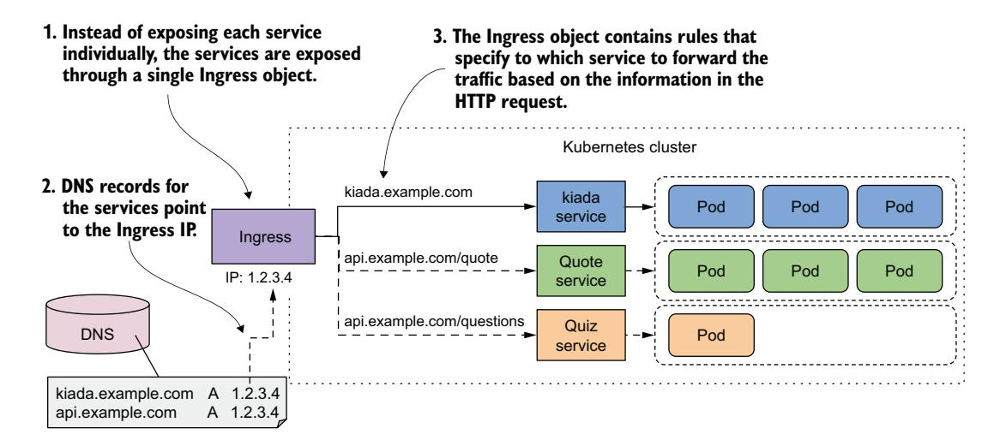
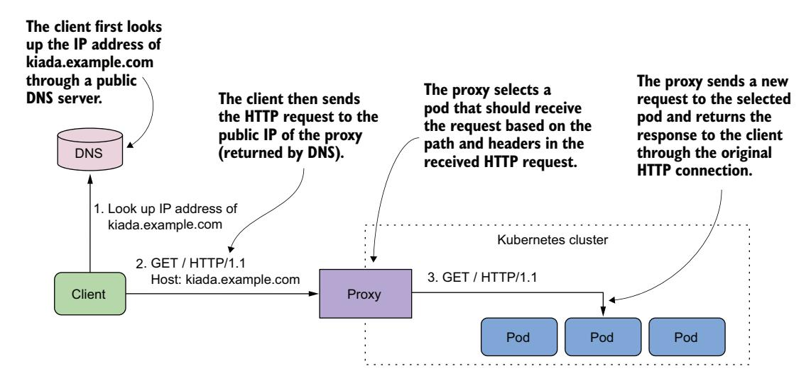
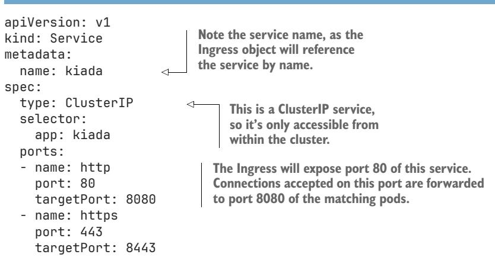
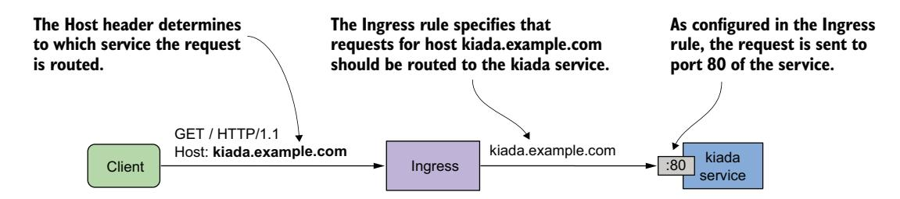
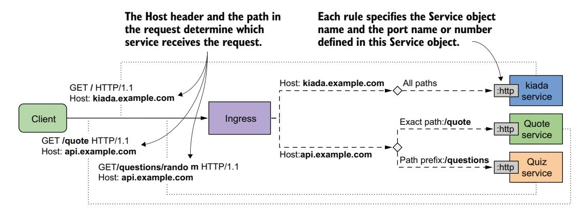
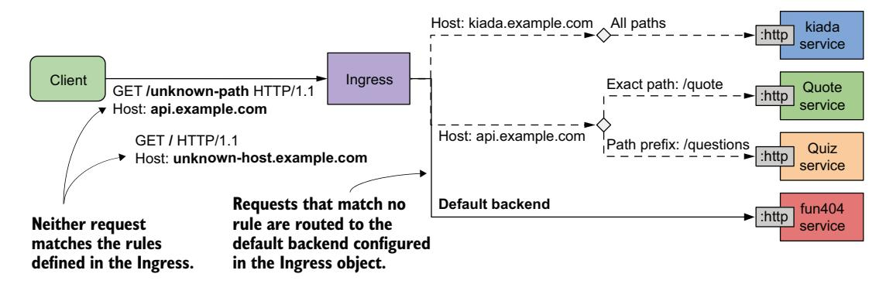
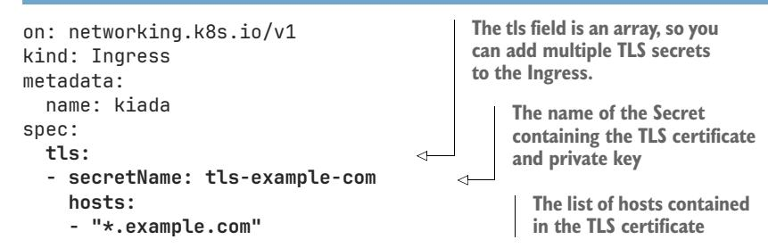
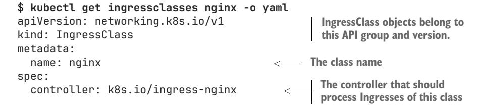

# *Using Ingress to route traffic to services*

# *This chapter covers*

- Creating Ingress objects
- Ingress controllers and how to deploy them
- Securing Ingresses with Transport Layer Security
- Adding additional configuration to an Ingress
- Using IngressClasses when multiple controllers are installed
- Using Ingresses with nonservice backends

In the previous chapter, you learned how to use the Service object to expose a group of pods at a stable IP address. If you use the LoadBalancer service type, the service is made available to clients outside the cluster through a load balancer. This approach is fine if you only need to expose a single service externally, but it becomes problematic when the number of services is large, since each service needs its own public IP address.

 Fortunately, when exposing these services through an *Ingress* object, you only need a single IP address. Additionally, the Ingress provides other features such as HTTP authentication, cookie-based session affinity, URL rewriting, and others that Service objects can't.

NOTE The code files for this chapter are available at [https://github.com/](https://github.com/luksa/kubernetes-in-action-2nd-edition/tree/master/Chapter12) [luksa/kubernetes-in-action-2nd-edition/tree/master/Chapter12.](https://github.com/luksa/kubernetes-in-action-2nd-edition/tree/master/Chapter12)

# *12.1 Introducing Ingresses*

Before I explain what an Ingress is in the Kubernetes context, defining the general term *ingress* may help readers who are not native speakers of English.

DEFINITION *Ingress* (noun)—The act of going in or entering; the right to enter; a means or place of entering; entryway.

In Kubernetes, an Ingress is a way for external clients to access the services of applications running in the cluster. The Ingress function consists of the following three components:

- *The Ingress API object*—Used to define and configure an Ingress
- *An L7 load balancer or reverse proxy*—Routes traffic to the backend services
- The *ingress controller*—Monitors the Kubernetes API for Ingress objects and deploys and configures the load balancer or reverse proxy

NOTE L4 and L7 refer to layer 4 (Transport Layer; TCP, UDP) and layer 7 (Application Layer; HTTP) of the Open Systems Interconnection Model (OSI Model).

NOTE Unlike a forward proxy, which routes and filters outgoing traffic and is typically located in the same location as the clients it serves, a reverse proxy handles incoming traffic and routes it to one or more backend servers. A reverse proxy is located near those servers.

In most online content, the term *ingress controller* is often used to refer to the load balancer/reverse proxy and the actual controller as one entity, but they're two different components. For this reason, I refer to them separately in this chapter.

 I also use the term *proxy* for the L7 load balancer, so you don't confuse it with the L4 load balancer that handles the traffic for LoadBalancer-type services. Keep in mind that if the Ingress routes traffic only to a single backend pod, there's no load balancing.

# *12.1.1 Introducing the Ingress object kind*

When you want to expose a set of services externally, you create an Ingress object and reference the Service objects in it. Kubernetes uses this Ingress object to configure an L7 load balancer (an HTTP reverse proxy) that makes the services accessible to external clients through a common entrypoint.

NOTE If you expose a Service through an Ingress, you can usually leave the Service type set to ClusterIP. However, some ingress implementations require the Service type to be NodePort. Refer to the ingress controller's documentation to see whether this is the case.

## EXPOSING SERVICES THROUGH AN INGRESS OBJECT

While an Ingress object can be used to expose a single Service, it's typically used in combination with multiple Service objects, as shown in figure 12.1. The figure shows how a single Ingress object makes all three services in the Kiada suite accessible to external clients.



Figure 12.1 An Ingress forwards external traffic to multiple services.

The Ingress object contains rules for routing traffic to the three services based on the information in the HTTP request. The public DNS entries for the services all point to the same Ingress. The Ingress determines which service should receive the request from the request itself. If the client request specifies the host kiada.example.com, the Ingress forwards it to the pods that belong to the kiada service, whereas requests that specify the host api.example.com are forwarded to the quote or quiz services, depending on which path is requested.

## USING MULTIPLE INGRESS OBJECTS IN A CLUSTER

An Ingress object typically handles traffic for all Service objects in a particular Kubernetes namespace, but multiple Ingresses are also an option. Normally, each Ingress object gets its own IP address, but some ingress implementations use a shared entrypoint for all Ingress objects you create in the cluster.

# *12.1.2 Introducing the Ingress controller and the reverse proxy*

Not all Kubernetes clusters support Ingresses out of the box. This functionality is provided by a cluster add-on component called the Ingress controller. This controller is the link between the Ingress object and the actual physical ingress (the reverse proxy). Often, the controller and the proxy run as two processes in the same container or as two containers in the same pod. That's why people use the term *ingress controller* to mean both.

Sometimes the controller or the proxy is located outside the cluster. For example, the Google Kubernetes Engine provides its own ingress controller that uses Google Cloud Platform's L7 load balancer to provide the Ingress functionality to the cluster.

If your cluster is deployed in multiple availability zones, a single ingress can handle traffic for all of them. It forwards each HTTP request to the best zone depending on where the client is located, for example.

There's a wide range of ingress controllers to choose from. The Kubernetes community maintains a list at https://kubernetes.io/docs/concepts/services-networking/ingress-controllers/. Among the most popular are the Nginx ingress controller, Ambassador, Contour, and Traefik. Most of these ingress controllers use Nginx, HAProxy, or Envoy as the reverse proxy, but some use their own proxy implementation.

#### UNDERSTANDING THE ROLE OF THE INGRESS CONTROLLER

The ingress controller is the software component that brings the Ingress object to life. As shown in figure 12.2, the controller connects to the Kubernetes API server and monitors the Ingress, Service, and Endpoints or EndpointSlice objects. Whenever you create, modify, or delete these objects, the controller is notified. It uses the information in these objects to provision and configure the reverse proxy for the Ingress.


Figure 12.2 The role of an ingress controller

When you create the Ingress object, the controller reads its spec section and combines it with the information in the Service and EndpointSlice objects it references. The controller converts this information into the configuration for the reverse proxy. It then sets up a new proxy with this configuration and performs additional steps to ensure that the proxy is reachable from outside the cluster. If the proxy is running in a pod inside the cluster, this usually means that a LoadBalancer-type service is created to expose the proxy externally.

 When you make changes to the Ingress object, the controller updates the configuration of the proxy, and when you delete it, the controller stops and removes the proxy and any other objects it created alongside it.

## UNDERSTANDING HOW THE PROXY FORWARDS TRAFFIC TO THE SERVICES

The reverse proxy (or L7 load balancer) is the component that handles incoming HTTP requests and forwards it to the services. The proxy configuration typically contains a list of virtual hosts and, for each, a list of endpoint IPs. This information is obtained from the Ingress, Service, and Endpoints/EndpointSlice objects. When clients connect to the proxy, the proxy uses this information to route the request to an endpoint such as a pod based on the request path and headers.

 Figure 12.3 shows how a client accesses the Kiada service through the proxy. The client first performs a DNS lookup of kiada.example.com. The DNS server returns the public IP address of the reverse proxy. Then the client sends an HTTP request to the proxy where the Host header contains the value kiada.example.com. The proxy maps this host to the IP address of one of the Kiada pods and forwards the HTTP request to it. Note that the proxy doesn't send the request to the service IP, but directly to the pod. This is how most ingress implementations work.



Figure 12.3 Accessing pods through an Ingress

# *12.1.3 Installing an ingress controller*

Before you start creating Ingresses, you need to make sure that an ingress controller runs in your cluster. As you learned in the previous section, not all Kubernetes clusters have one.

 If you're using a managed cluster with one of the major cloud providers, an ingress controller is already in place. In Google Kubernetes Engine, the ingress controller is GLBC (GCE L7 Load Balancer), in AWS the Ingress functionality is provided by the AWS Load Balancer Controller, while Azure provides AGIC (Application Gateway Ingress Controller). Check your cloud provider's documentation to see whether an ingress controller is provided and whether you need to enable it. Alternatively, you can install the ingress controller yourself.

 As you already know, there are many different ingress implementations to choose from. They all provide the type of traffic routing explained in the previous section, but each provides different additional features. In all the examples in this chapter, I used the Nginx ingress controller. I suggest that you use it as well unless your cluster provides a different one.

NOTE There are two implementations of the Nginx ingress controller. One is provided by the Kubernetes maintainers and the other by the authors of Nginx itself. If you're new to Kubernetes, you should start with the former. That's the one I used.

# Installing the Nginx ingress controller

Regardless of how you run your Kubernetes cluster, you should be able to install the Nginx ingress controller by following the instructions at [https://kubernetes.github.io/](https://kubernetes.github.io/ingress-nginx/deploy/) [ingress-nginx/deploy/.](https://kubernetes.github.io/ingress-nginx/deploy/)

If you use the kind tool to create the cluster, please use the Chapter12/createkind-cluster.sh script instead of the one in Chapter04/, since the ingress controller requires a different cluster config file (see the file Chapter12/kind-multinode.yaml). This updated config ensures that ports 80 and 443 are mapped to the host, and that the label ingress-ready=true is added to the control-plane node to allow the ingress controller to be scheduled there. To install the controller, run the following command:

\$ **kubectl apply -f https://raw.githubusercontent.com/kubernetes/ingressnginx/main/deploy/static/provider/kind/deploy.yaml**

If you run your cluster with Minikube, you can install the controller as follows:

\$ **minikube addons enable ingress**

You may also need to run the command minikube tunnel to access the LoadBalancer services and Ingresses from your host OS.

# *12.2 Creating and using Ingress objects*

The previous section explained the basics of Ingress objects and controllers, and how to install the Nginx ingress controller. In this section, you'll learn how to use an Ingress to expose the services of the Kiada suite.

 Before you create your first Ingress object, you must deploy the pods and services of the Kiada suite. If you followed the exercises in the previous chapter, they should already be there. If not, you can create them by creating the kiada namespace and then applying all manifests in the Chapter12/SETUP/ directory with the following command:

\$ **kubectl apply -f SETUP/ --recursive**

# *12.2.1 Exposing a service through an Ingress*

An Ingress object references one or more Service objects. Your first Ingress object exposes the kiada service, which you created in the previous chapter. Before you create the Ingress, refresh your memory by looking at the service manifest in the following listing.

#### Listing 12.1 The **kiada** service manifest



The Service type is ClusterIP because the service itself doesn't need to be directly accessible to clients outside the cluster—the Ingress will take care of that. Although the service exposes ports 80 and 443, the Ingress will forward traffic only to port 80.

## CREATING THE INGRESS OBJECT

The Ingress object manifest is shown in the following listing. You can find it in the file Chapter12/ing.kiada-example-com.yaml in the book's code repository.

Listing 12.2 An Ingress object exposing the **kiada** service at **kiada.example.com**

```
apiVersion: networking.k8s.io/v1
kind: Ingress
metadata:
 name: kiada-example-com 
spec:
 rules:
 - host: kiada.example.com 
 http:
 paths:
 - path: / 
 pathType: Prefix 
                                            Although the name of this object matches 
                                            the host, it doesn't have to. You can name 
                                            the object any way you want.
                                               This ingress rule matches all HTTP 
                                               requests where the Host header is 
                                               set to kiada.example.com.
                                      The rule matches all requests, 
                                      regardless of the path in the request.
```

backend:
service:
name: kiada
port:
number: 80

The requests are
forwarded to port 80
of the kiada service.

The manifest in the listing defines an Ingress object named kiada-example-com. While you can give the object any name you want, it's recommended that the name reflect the host and/or path(s) specified in the ingress rules.

**WARNING** In Google Kubernetes Engine, the Ingress name mustn't contain dots; otherwise, the following error message will be displayed in the events associated with the Ingress object: Error syncing to GCP: error running load balancer syncing routine: invalid loadbalancer name.

**NOTE** If you apply this manifest soon after deploying the Ingress controller, the operation may fail with the error failed calling webhook. Should this happen, wait a few seconds and retry.

The Ingress object in the listing defines a single rule. The rule states that all requests for the host kiada.example.com should be forwarded to port 80 of the kiada service, regardless of the requested path (as indicated by the path and pathType fields). This is illustrated in figure 12.4.



Figure 12.4 How the kiada-example-com Ingress object configures external traffic routing

#### INSPECTING AN INGRESS OBJECT TO GET ITS PUBLIC IP ADDRESS

After creating the Ingress object with kubectl apply, you can see its basic information by listing Ingress objects in the current namespace with kubectl get ingresses as follows:

# \$ kubectl get ingresses

| NAME              | CLASS | HOSTS             | ADDRESS     | PORTS | AGE |
|-------------------|-------|-------------------|-------------|-------|-----|
| kiada-example-com | nainx | kiada.example.com | 11.22.33.44 | 80    | 30s |

**NOTE** You can use ing as a shorthand for ingress.

To see the Ingress object in detail, use the kubectl describe command as follows:

```
$ kubectl describe ing kiada-example-com
Name: kiada-example-com 
Namespace: default 
Address: 11.22.33.44 
Default backend: default-http-backend:80 (172.17.0.15:8080) 
Rules: 
 Host Path Backends 
 ---- ---- -------- 
 kiada.example.com 
 / kiada:80 (172.17.0.4:8080,172.17.0.5:8080,172.17.0.9:8080)
Annotations: <none>
Events:
 Type Reason Age From Message
 ---- ------ ---- ---- -------
 Normal Sync 5m6s (x2 over 5m28s) nginx-ingress-controller Scheduled for 
    sync
                             The name and namespace
                                 of the Ingress object
                                                       The IP address of the 
                                                       load balancer that handles 
                                                       requests for this Ingress
                                                            If the request 
                                                            doesn't match any 
                                                            rules, it's forwarded 
                                                            to this service. See 
                                                            section 12.2.4.
                                                 For each rule, the host, path, target
                                              service, and its endpoints are displayed.
```

As you can see, the kubectl describe command lists all the rules in the Ingress object. For each rule, not only is the name of the target service shown, but also its endpoints.

NOTE The output may show the following error message related to the default backend: <error: endpoints "default-http-backend" not found>. You'll learn about default backends later in this chapter. For now, just ignore the error.

Both kubectl get and kubectl describe display the IP address of the Ingress. This is the IP address of the L7 load balancer or reverse proxy to which clients should send requests. In the example output, the IP address is 11.22.33.44, and the port is 80.

NOTE Typically, the proxy that handles the Ingress traffic listens only on ports 80 and 443, but some Ingress implementations allow you to configure the port number(s).

NOTE The address may not be displayed immediately, especially if your cluster is in the cloud. If the address isn't displayed after several minutes, it means that no ingress controller has processed the Ingress object. Check if the controller is running. Since a cluster can run multiple ingress controllers, it's possible that they'll all ignore your Ingress object if you don't specify which of them should process it. Check the documentation of your chosen ingress controller to find out if you need to add the kubernetes.io/ingress.class annotation or set the spec.ingressClassName field in the Ingress object. You'll learn more about this field later.

You can also find the IP address in the Ingress object's status field as follows:

```
$ kubectl get ing kiada-example-com -o yaml
```

...

```
status:
 loadBalancer:
 ingress:
 - ip: 11.22.33.44 
                                      The address of the Ingress 
                                      is either a hostname or an 
                                      IP address.
```

NOTE Sometimes, the displayed address can be misleading. For example, if you use Minikube and start the cluster in a VM, the ingress address will show up as localhost, but that's only true from the VM's perspective. The actual Ingress address is the IP address of the VM, which you can get with the minikube ip command.

## ADDING THE INGRESS IP TO THE DNS

After you add an Ingress to a production cluster, the next step is to add a record to your internet domain's DNS server. In these examples, we assume that you own the domain example.com. To allow external clients to access your service through the Ingress, you configure the DNS server to resolve the domain name kiada.example.com to the Ingress IP 11.22.33.44.

 In a local development cluster, you don't have to deal with DNS servers. Since you're only accessing the service from your own computer, you can get it to resolve the address by other means. This is explained next, along with instructions on how to access the service through the Ingress.

## ACCESSING SERVICES THROUGH THE INGRESS

Since Ingresses use virtual hosting to figure out where to forward the request, you won't get the desired result by simply sending an HTTP request to the Ingress' IP address and port. You need to make sure that the Host header in the HTTP request matches one of the rules in the Ingress object.

 To achieve this, you must tell the HTTP client to send the request to the host kiada.example.com. However, doing so requires resolving the host to the Ingress IP. If you use curl, it is possible to do this without having to configure your DNS server or your local /etc/hosts file. Let's take 11.22.33.44 as the Ingress IP. You can access the kiada service through the Ingress with the following command:

```
$ curl --resolve kiada.example.com:80:11.22.33.44 http://kiada.example.com -v
* Added kiada.example.com:80:11.22.33.44 to DNS cache 
* Hostname kiada.example.com was found in DNS cache 
* Trying 11.22.33.44:80... 
* Connected to kiada.example.com (11.22.33.44) port 80 (#0) 
> GET / HTTP/1.1
> Host: kiada.example.com 
> User-Agent: curl/7.76.1
> Accept: */*
...
                                                                 The --resolve option adds the
                                                                  hostname to the DNS cache.
                                                                        curl connects to 
                                                                        the IP address of 
                                                                        the Ingress.
                                          The Host header allows the 
                                          Ingress to forward the request 
                                          to the correct service.
```

The --resolve option adds the hostname kiada.example.com to the DNS cache, which ensures that kiada.example.com resolves to the Ingress IP. curl then opens the

connection to the Ingress and sends the HTTP request. The Host header in the request is set to kiada.example.com, which allows the Ingress to forward the request to the correct service.

 Of course, if you want to use your web browser, you can't use the --resolve option. Instead, you can add the following entry to your /etc/hosts file:

11.22.33.44 kiada.example.com **Replaces 11.22.33.44 with your Ingress IP address**

NOTE On Windows, the hosts file is usually located at C:\Windows\System32\ Drivers\etc\hosts.

You can now access the service at <http://kiada.example.com>with your web browser or curl without having to use the --resolve option to map the hostname to the IP.

# *12.2.2 Path-based ingress traffic routing*

An Ingress object can contain many rules and therefore map multiple hosts and paths to multiple services. You've already created an Ingress for the kiada service. Now you'll create one for the quote and quiz services.

 The Ingress object for these two services makes them available through the same host: api.example.com. The path in the HTTP request determines which service receives each request. As shown in figure 12.5, all requests with the path /quote are forwarded to the quote service, and all requests whose path starts with /questions are forwarded to the quiz service.


Figure 12.5 Path-based ingress traffic routing

The following listing shows the Ingress manifest.

#### Listing 12.3 Ingress mapping request paths to different services

apiVersion: networking.k8s.io/v1

kind: Ingress metadata:

name: api-example-com

spec:

```
 rules:
 - host: api.example.com 
 http:
 paths:
 - path: /quote 
 pathType: Exact 
 backend: 
 service: 
 name: quote 
 port: 
 name: http 
 - path: /questions 
 pathType: Prefix 
 backend: 
 service: 
 name: quiz 
 port: 
 name: http 
                                   Both services are exposed through 
                                   the host api.example.com.
                          Requests with the path 
                          /quote are forwarded 
                          to the quote service.
                            Requests whose path 
                            starts with /questions 
                            are forwarded to the 
                            quiz service.
```

In the Ingress object shown in the listing, a single rule with two paths is defined. The rule matches HTTP requests with the host api.example.com. In this rule, the paths array contains two entries. The first matches requests that ask for the /quote path and forwards them to the port named http in the quote Service object. The second entry matches all requests whose first path element is /questions and forwards them to the port http of the quiz service.

NOTE By default, no URL rewriting is performed by the Ingress proxy. If the client requests the path /quote, the path in the request that the proxy makes to the backend service is also /quote. In some Ingress implementations, you can change this by specifying a URL rewrite rule in the Ingress object.

After you create the Ingress object from the manifest in the previous listing, you can access the two services it exposes as follows (replace the IP with that of your Ingress):

```
$ curl --resolve api.example.com:80:11.22.33.44 api.example.com/quote 
$ curl --resolve api.example.com:80:11.22.33.44 api.example.com/questions/random
                                                                 Calls the quote service
                                                                        Calls the quiz service
```

If you want to access these services with your web browser, add api.example.com to the line you added earlier to your /etc/hosts file. It should now look like this:

```
11.22.33.44 kiada.example.com api.example.com 
                                                                    Replaces 11.22.33.44 with 
                                                                    your Ingress IP address
```

## UNDERSTANDING HOW THE PATH IS MATCHED

Did you notice the difference between the pathType fields in the two entries in the previous listing? The pathType field specifies how the path in the request is matched with the paths in the ingress rule. The three supported values are summarized in table 12.1.

Table 12.1 Supported values in the **pathType** field

| Path type              | Description                                                                                           |
|------------------------|-------------------------------------------------------------------------------------------------------|
| Exact                  | The requested URL path must exactly match the path specified in the<br>ingress rule.                  |
| Prefix                 | The requested URL path must begin with the path specified in the<br>ingress rule, element by element. |
| ImplementationSpecific | Path matching depends on the implementation of the ingress controller.                                |

If multiple paths are specified in the ingress rule and the path in the request matches more than one path in the rule, priority is given to paths with the Exact path type.

# MATCHING PATHS USING THE EXACT PATH TYPE

Table 12.2 shows examples of how matching works when pathType is set to Exact. The matching works as you'd expect. It's case sensitive, and the path in the request must exactly match the path specified in the ingress rule.

Table 12.2 Request paths matched when **pathType** is Exact

| Path in rule | Matches request path | Doesn't match            |
|--------------|----------------------|--------------------------|
| /            | /                    | /foo<br>/bar             |
| /foo         | /foo                 | /foo/<br>/bar            |
| /foo/        | /foo/                | /foo<br>/foo/bar<br>/bar |
| /FOO         | /FOO                 | /foo                     |

## MATCHING PATHS USING THE PREFIX PATH TYPE

When pathType is set to Prefix, things aren't as you might expect. Consider the examples in table 12.3.

Table 12.3 Request paths matched when **pathType** is **Prefix**

| Path in rule        | Matches request paths                         | Doesn't match   |
|---------------------|-----------------------------------------------|-----------------|
| /                   | All paths; for example:<br>/<br>/foo<br>/foo/ |                 |
| /foo<br>or<br>/foo/ | /foo<br>/foo/<br>/foo/bar                     | /foobar<br>/bar |
| /FOO                | /FOO                                          | /foo            |

The request path isn't treated as a string and checked to see whether it begins with the specified prefix. Instead, both the path in the rule and the request path are split by /, and then each element of the request path is compared to the corresponding element of the prefix. Take the path /foo, for example. It matches the request path /foo/bar, but not /foobar. It also doesn't match the request path /fooxyz/bar.

 When matching, it doesn't matter if the path in the rule or the one in the request ends with a forward slash. As with the Exact path type, matching is case sensitive.

## MATCHING PATHS USING THE IMPLEMENTATIONSPECIFIC PATH TYPE

The ImplementationSpecific path type is, as the name implies, dependent on the implementation of the ingress controller. With this path type, each controller can set its own rules for matching the request path. For example, in GKE you can use wildcards in the path. Instead of using the Prefix type and setting the path to /foo, you can set the type to ImplementationSpecific and the path to /foo/\*.

# *12.2.3 Using multiple rules in an Ingress object*

In the previous sections, you created two Ingress objects to access the Kiada suite services. In most Ingress implementations, each Ingress object requires its own public IP address, so you're now probably using two public IP addresses. Since this is potentially costly, it's better to consolidate the Ingress objects into one.

## CREATING AN INGRESS OBJECT WITH MULTIPLE RULES

Because an Ingress object can contain multiple rules, it's trivial to combine multiple objects into one. All you have to do is take the rules and put them into the same Ingress object, as shown in the following listing. You can find the manifest in the file ing.kiada.yaml.

#### Listing 12.4 Ingress exposing multiple services on different hosts

```
apiVersion: networking.k8s.io/v1
kind: Ingress
metadata:
 name: kiada
spec:
 rules:
 - host: kiada.example.com 
 http: 
 paths: 
 - path: / 
 pathType: Prefix 
 backend: 
 service: 
 name: kiada 
 port: 
 name: http
```

**The first rule matches the host kiada.example.com. This rule was copied from the kiada-example-com Ingress object.**

```
- host: api.example.com
  http:
    paths:
    - path: /quote
      pathType: Exact
      hackend:
         service:
                                  The second rule matches the
           name: quote
                                  host api.example.com. It was
           port:
                                  copied from the api-example-
             name: http
                                  com Ingress object.
    - path: /questions
      pathType: Prefix
      backend:
         service:
           name: quiz
           port:
             name: http
```

This single Ingress object handles all traffic for all services in the Kiada suite yet only requires a single public IP address.

The Ingress object uses virtual hosts to route traffic to the backend services. If the value of the Host header in the request is kiada.example.com, the request is forwarded to the kiada service. If the header value is api.example.com, the request is routed to one of the other two services, depending on the requested path. The Ingress and the associated Service objects are shown in figure 12.6.



Figure 12.6 An Ingress object covering all services of the Kiada suite

You can delete the two Ingress objects created earlier and replace them with the one in the previous listing. Then you can try to access all three services through this Ingress. Since this is a new Ingress object, its IP address is most likely not the same as before. Therefore, you need to update the DNS, the /etc/hosts file, or the --resolve option when you run the curl command again.

#### USING WILDCARDS IN THE HOST FIELD

The host field in the ingress rules supports the use of wildcards. This allows you to capture all requests sent to a host that matches \*.example.com and forward them to your services. Table 12.4 shows how wildcard matching works.

| Table 12.4 Examples of using wildcards in the ingress rule's host fiel | <b>Table 12.4</b> | Examples of using | wildcards in the | ingress rule's host f | field |
|------------------------------------------------------------------------|-------------------|-------------------|------------------|-----------------------|-------|
|------------------------------------------------------------------------|-------------------|-------------------|------------------|-----------------------|-------|

| Host              | Matches request hosts                                   | Doesn't match                                           |
|-------------------|---------------------------------------------------------|---------------------------------------------------------|
| kiada.example.com | kiada.example.com                                       | example.com<br>api.example.com<br>foo.kiada.example.com |
| *.example.com     | kiada.example.com<br>api.example.com<br>foo.example.com | example.com<br>foo.kiada.example.com                    |

Look at the example with the wildcard. As you can see, \*.example.com matches kiada.example.com, but it doesn't match foo.kiada.example.com or example.com. This is because a wildcard only covers a single element of the DNS name. As with rule paths, a rule that exactly matches the host in the request takes precedence over rules with host wildcards.

**NOTE** You can also omit the host field altogether to make the rule match any host.

## 12.2.4 Setting the default backend

If the client request doesn't match any rules defined in the Ingress object, the response 404 Not Found is normally returned. However, you can also define a default backend service to which the Ingress should forward the request if no rules are matched. The default backend serves as a catch-all rule.

Figure 12.7 shows the default backend in the context of the other rules in the Ingress object. A service named fun404 is used as the default backend, so let's add it to the kiada Ingress object.



Figure 12.7 The default backend handles requests that match no ingress rule.

## SPECIFYING THE DEFAULT BACKEND IN AN INGRESS OBJECT

You specify the default backend in the spec.defaultBackend field, as shown in the following listing (the full manifest can be found in the ing.kiada.defaultBackend.yaml file).

#### Listing 12.5 Specifying the default backend in the Ingress object

```
apiVersion: networking.k8s.io/v1
kind: Ingress
metadata:
 name: kiada
spec:
 defaultBackend: 
 service: 
 name: fun404 
 port: 
 name: http 
 rules:
 ...
                           The request is forwarded 
                           to the default backend if it 
                           doesn't match any rules.
```

As the listing shows, setting the default backend isn't much different from setting the backend in the rules. Just as you specify the name and port of the backend service in each rule, you also specify the name and port of the default backend service in the service field under spec.defaultBackend.

NOTE Some ingress implementations use the default-http-backend service in the kube-system namespace as the default backend if it is not explicitly specified in the Ingress object. This service may or may not exist in your cluster, but you can always create it.

## CREATING THE SERVICE AND POD FOR THE DEFAULT BACKEND

The kiada Ingress object is now configured to forward requests that don't match any rules to a service called fun404. You need to create this service and the underlying pod. You can find an object manifest with both object definitions in the file all.fun404.yaml. The contents of the file are shown in the following listing.

Listing 12.6 The Pod and Service object manifests for the default Ingress backend

```
apiVersion: v1
kind: Pod
metadata:
 name: fun404 
 labels:
 app: fun404 
spec:
 containers:
 - name: server
 image: luksa/static-http-server 
                               The pod's name 
                               is fun404.
                                  This label must match 
                                  the Service object's 
                                  label selector.
                                                     The container runs an HTTP 
                                                     server that always returns 
                                                     the same response.
```

```
 args: 
 - --listen-port=8080 
 - --response-code=404 
 - --text=This isn't the URL you're looking for. 
 ports:
 - name: http 
 containerPort: 8080 
---
apiVersion: v1
kind: Service
metadata:
 name: fun404 
 labels:
 app: fun404
spec:
 selector: 
 app: fun404 
 ports:
 - name: http 
 port: 80 
 targetPort: http 
                                                              The HTTP response is 
                                                              configured via command-
                                                              line arguments.
                                      The container listens 
                                      on port 8080.
                               The service is 
                               also called 
                               fun404.
                          The label selector defines the 
                          pods that belong to this service.
                                The service port name is http. 
                                The port number is 80.
                                  The service forwards connections to 
                                  the port named http on the pod.
```

After applying both the Ingress object manifest and the Pod and Service object manifest, you can test the default backend by sending a request that doesn't match any of the rules in the Ingress. For example,

```
$ curl api.example.com/unknown-path --resolve api.example.com:80:11.22.33.44
This isn't the URL you're looking for. 
                                                            This request doesn't match any host/
                                                         path combinations in the Ingress object.
                                                                       This response came 
                                                                       from the fun404 pod.
```

As expected, the response text matches what you configured in the fun404 pod. Of course, instead of using the default backend to return a custom 404 status, you can use it to forward all requests to a service of your choice.

 You can even create an Ingress object with only a default backend and no rules to forward all external traffic to a single service. If you're wondering why you'd do this using an Ingress object and not by simply setting the service type to LoadBalancer, it's because Ingresses can provide additional HTTP features that services can't. One example is securing the communication between the client and the service with Transport Layer Security (TLS), which is explained next.

# *12.3 Configuring TLS for an Ingress*

So far in this chapter, you've used the Ingress object to allow external HTTP traffic to your services. These days, however, you usually want to secure at least all external traffic with SSL/TLS.

 You may recall that the kiada service provides both an HTTP and an HTTPS port. When you created the Ingress, you only configured it to forward HTTP traffic to the service, but not HTTPS. You'll do this now.

 There are two ways to add HTTPS support. You can either allow HTTPS to pass through the ingress proxy and have the backend pod terminate the TLS connection, or have the proxy terminate and connect to the backend pod through HTTP.

# *12.3.1 Configuring the Ingress for TLS passthrough*

You may be surprised to learn that Kubernetes doesn't provide a standard way to configure TLS passthrough in Ingress objects. If the ingress controller supports TLS passthrough, you can usually configure it by adding annotations to the Ingress object. In the case of the Nginx ingress controller, you add the annotation shown in the following listing.

Listing 12.7 Enabling SSL passthrough when using the Nginx ingress controller

```
apiVersion: networking.k8s.io/v1
kind: Ingress
metadata:
 name: kiada-ssl-passthrough
 annotations:
 nginx.ingress.kubernetes.io/ssl-passthrough: "true" 
spec:
 ...
                                                                      Enables SSL 
                                                                      passthrough for 
                                                                      this Ingress
```

SSL passthrough support in the Nginx ingress controller isn't enabled by default. To enable it, the controller must be started with the --enable-ssl-passthrough flag.

 Since this is a nonstandard feature that depends heavily on the ingress controller you're using, let's not delve into it any further. For more information on how to enable passthrough in your case, see the documentation of the controller you're using.

 Instead, let's focus on terminating the TLS connection at the ingress proxy. This is a standard feature provided by most Ingress controllers and therefore deserves a closer look.

# *12.3.2 Terminating TLS at the Ingress*

Most, if not all, ingress controller implementations support TLS termination at the ingress proxy. The proxy terminates the TLS connection between the client and itself and forwards the HTTP request unencrypted to the backend pod, as shown in figure 12.8.

 To terminate the TLS connection, the proxy needs a TLS certificate and a private key. You provide them via a Secret that you reference in the Ingress object.


Figure 12.8 Securing connections to the Ingress using TLS

## CREATING A TLS SECRET FOR THE INGRESS

For the kiada Ingress, you can either create the Secret from the manifest file secret .tls-example-com.yaml in the book's code repository or generate the private key, certificate, and Secret with the following commands:

\$ **openssl req -x509 -newkey rsa:2048 -keyout example.key -out example.crt \ -sha256 -days 7300 -nodes \ -subj '/CN=\*.example.com' \ -addext 'subjectAltName = DNS:\*.example.com'**  \$ **kubectl create secret tls tls-example-com --cert=example.crt --key=example.key**  secret/tls-example-com created **Generates the private key and certificate Creates the secret from the key and certificate**

The certificate and the private key are now stored in a Secret named tls-example-com under the keys tls.crt and tls.key, respectively.

## ADDING THE TLS SECRET TO THE INGRESS

To add the Secret to the Ingress object, either edit the object with kubectl edit and add the lines highlighted in the next listing or apply the ing.kiada.tls.yaml file with kubectl apply.

#### Listing 12.8 Adding a TLS secret to an Ingress



```
 rules:
 ...
```

...

As shown in the listing, the tls field can contain one or more entries. Each entry specifies the secretName where the TLS certificate–key pair is stored and a list of hosts to which the pair applies.

WARNING The hosts specified in tls.hosts must match the names used in the certificate in the Secret.

## ACCESSING THE INGRESS THROUGH TLS

After you update the Ingress object, you can access the service via HTTPS as follows:

```
$ curl https://kiada.example.com --resolve kiada.example.com:443:11.22.33.44 
     -k -v
* Added kiada.example.com:443:11.22.33.44 to DNS cache
* Hostname kiada.example.com was found in DNS cache
* Trying 11.22.33.44:443...
* Connected to kiada.example.com (11.22.33.44) port 443 (#0)
...
* Server certificate: 
* subject: CN=*.example.com 
* start date: Dec 5 09:48:10 2021 GMT 
* expire date: Nov 30 09:48:10 2041 GMT 
* issuer: CN=*.example.com 
...
> GET / HTTP/2
> Host: kiada.example.com
                                                  The Ingress uses the TLS 
                                                  certificate you configured 
                                                  in the Ingress object.
```

The command's output shows that the server certificate matches the one you configured the Ingress with.

 By adding the TLS secret to the Ingress, you've not only secured the kiada service, but also the quote and quiz services, since they're all included in the Ingress object. Try to access them through the Ingress using HTTPS. Remember that the pods that provide these two services don't provide HTTPS themselves. The Ingress does that for them.

# *12.4 Additional Ingress configuration options*

I hope you haven't forgotten that you can use the kubectl explain command to learn more about a particular API object type and that you use it regularly. If not, now is a good time to use it to see what else you can configure in an Ingress object's spec field. Inspect the output of the following command:

#### \$ **kubectl explain ingress.spec**

Look at the list of fields displayed by this command. You may be surprised to see that in addition to the defaultBackend, rules, and tls fields explained in the previous sections, only one other field is supported, namely ingressClassName. This field is used to specify which ingress controller should process the Ingress object. You'll learn more about it later. For now, I want to focus on the lack of additional configuration options that HTTP proxies normally provide.

 The reason you don't see any other fields for specifying these options is that it would be nearly impossible to include all possible configuration options for every possible ingress implementation in the Ingress object's schema. Instead, these custom options are configured via annotations or in separate custom Kubernetes API objects.

 Each ingress controller implementation supports its own set of annotations or objects. I mentioned earlier that the Nginx ingress controller uses annotations to configure TLS passthrough. Annotations are also used to configure HTTP authentication, session affinity, URL rewriting, redirects, Cross-Origin Resource Sharing (CORS), and more. The list of supported annotations can be found at [https://kubernetes.github.io/](https://kubernetes.github.io/ingress-nginx/user-guide/nginx-configuration/annotations/) [ingress-nginx/user-guide/nginx-configuration/annotations/](https://kubernetes.github.io/ingress-nginx/user-guide/nginx-configuration/annotations/).

 I don't want to go into each of these annotations, since they're implementation specific, but I do want to show you an example of how you can use them.

# *12.4.1 Configuring the Ingress using annotations*

You learned in the previous chapter that Kubernetes services only support client IP-based session affinity. Cookie-based session affinity isn't supported because services operate at layer 4 of the OSI network model, whereas cookies are part of layer 7 (HTTP). However, because Ingresses operate at L7, they can support cookie-based session affinity. This is the case with the Nginx ingress controller used in the following example.

## USING ANNOTATIONS TO ENABLE COOKIE-BASED SESSION AFFINITY IN NGINX INGRESSES

The following listing shows an example of using Nginx-ingress-specific annotations to enable cookie-based session affinity and configure the session cookie name. The manifest shown in the listing can be found in the ing.kiada.nginx-affinity.yaml file.

Listing 12.9 Using annotations to configure session affinity in an Nginx ingress

```
apiVersion: networking.k8s.io/v1
kind: Ingress
metadata:
 name: kiada
 annotations:
 nginx.ingress.kubernetes.io/affinity: cookie 
 nginx.ingress.kubernetes.io/session-cookie-name: SESSION_COOKIE 
spec:
 ...
                                                                        Enables the 
                                                                        cookie-based 
                                                                        session affinity
                                                                  Overrides the default
                                                                    HTTP cookie name
```

In the listing, you can see the annotations nginx.ingress.kubernetes.io/affinity and nginx.ingress.kubernetes.io/session-cookie-name. The first annotation enables cookie-based session affinity, and the second sets the cookie name. The annotation key prefix indicates that these annotations are specific to the Nginx ingress controller and are ignored by other implementations.

## TESTING THE COOKIE-BASED SESSION AFFINITY

If you want to see session affinity in action, first apply the manifest file, wait until the Nginx configuration is updated, and then retrieve the cookie as follows:

```
$ curl -I http://kiada.example.com --resolve kiada.example.com:80:11.22.33.44
HTTP/1.1 200 OK
Date: Mon, 06 Dec 2021 08:58:10 GMT
Content-Type: text/plain
Connection: keep-alive
Set-Cookie: SESSION_COOKIE=1638781091; Path=/; HttpOnly 
                                                                    This is the session 
                                                                    cookie that Nginx adds 
                                                                    to the HTTP response.
```

You can now include this cookie in your request by specifying the Cookie header:

```
$ curl -H "Cookie: SESSION_COOKIE=1638781091" http://kiada.example.com \
 --resolve kiada.example.com:80:11.22.33.44
```

If you run this command several times, you'll notice that the HTTP request is always forwarded to the same pod, which indicates that the session affinity is using the cookie.

# *12.4.2 Configuring the Ingress using additional API objects*

Some ingress implementations don't use annotations for additional ingress configuration, but instead provide their own object kinds. In the previous section, you saw how to use annotations to configure session affinity when using the Nginx ingress controller. In the current section, you'll learn how to do the same in Google Kubernetes Engine.

# USING THE BACKENDCONFIG OBJECT TYPE TO ENABLE COOKIE-BASED SESSION AFFINITY IN GKE

In clusters running on GKE, a custom object of type BackendConfig can be found in the Kubernetes API. You create an instance of this object and reference it by name in the Service object to which you want to apply the object. You reference the object using the cloud.google.com/backend-config annotations, as shown in the following listing.

## Listing 12.10 Referring to a BackendConfig in a Service object in GKE

```
apiVersion: v1
kind: Service
metadata:
 name: kiada
 annotations:
 cloud.google.com/backend-config: '{"default": "kiada-backend-config"}' 
spec:
                                                                    Specifies the name of the
                                                                   BackendConfig object that
                                                                      applies to this service
```

You can use the BackendConfig object to configure many things. Since this object is beyond the scope of this book, use kubectl explain backendconfig.spec to learn more about it, or see the GKE documentation.

 As a quick example of how custom objects are used to configure Ingresses, I'll show you how to configure cookie-based session affinity using the BackendConfig object. You can see the object manifest in the following listing.

#### Listing 12.11 Using GKE-specific BackendConfig object to configure session affinity

```
apiVersion: cloud.google.com/v1 
kind: BackendConfig 
metadata:
 name: kiada-backend-config
spec:
 sessionAffinity: 
 affinityType: GENERATED_COOKIE 
                                            A custom Kubernetes API object that's only 
                                            available in Google Kubernetes Engine
                                                Enables cookie-based session affinity for the 
                                                service that references this BackendConfig
```

In the listing, the session affinity type is set to GENERATED\_COOKIE. Since this object is referenced in the kiada service, whenever a client accesses the service through the Ingress, the request is always routed to the same backend pod.

 The last two sections described how to add custom configuration to an Ingress object. Since the method depends on the type of the ingress controller you're using, see its documentation for more information.

# *12.5 Using multiple ingress controllers*

Since different ingress implementations provide different additional functionality, you may want to install multiple ingress controllers in a cluster. In this case, each Ingress object needs to indicate which ingress controller should process it. Originally, this was accomplished by specifying the controller name in the kubernetes.io/ ingress.class annotation of the Ingress object. This method is now deprecated, but some controllers still use it.

 Instead of using the annotation, the correct way to specify the controller is through IngressClass objects. One or more IngressClass objects are usually created when you install an ingress controller.

 When you create an Ingress object, you specify the ingress class by specifying the name of the IngressClass object in the Ingress object's spec field. Each IngressClass specifies the name of the controller and optional parameters. Thus, the class you reference in your Ingress object determines which ingress proxy is provisioned and how it's configured. As shown in figure 12.9, different Ingress objects can reference different IngressClasses, which in turn reference different ingress controllers.


Figure 12.9 The relationship between Ingresses, IngressClasses, and ingress controllers

# *12.5.1 Introducing the IngressClass object kind*

If the Nginx ingress controller is running in your cluster, an IngressClass object named nginx was created when you installed the controller. If other ingress controllers are deployed in your cluster, you may also find other IngressClasses.

## FINDING INGRESSCLASSES IN YOUR CLUSTER

To see which ingress classes your cluster offers, you can list them with kubectl get:

| \$ kubectl get ingressclasses |                      |               |     | The IngressClass specifies the |
|-------------------------------|----------------------|---------------|-----|--------------------------------|
| NAME                          | CONTROLLER           | PARAMETERS    | AGE | ingress controller and the     |
| nginx                         | k8s.io/ingress-nginx | <none></none> | 10h | parameters passed to it.       |

The output of the command shows that a single IngressClass named nginx exists in the cluster. Ingresses that use this class are processed by the k8s.io/ingress-nginx controller. You can also see that this class doesn't specify any controller parameters.

## INSPECTING THE YAML MANIFEST OF AN INGRESSCLASS OBJECT

Let's take a closer look at the nginx IngressClass object by examining its YAML definition:



This IngressClass object specifies nothing more than the name of the controller. Later you'll see how you can also add parameters for the controller to the object.

# *12.5.2 Specifying the IngressClass in the Ingress object*

When you create an Ingress object, you can specify the class of the Ingress using the ingressClassName field in the spec section of the Ingress object, as in the following listing.

## Listing 12.12 Ingress object referencing a specific IngressClass

```
apiVersion: networking.k8s.io/v1
kind: Ingress
metadata:
 name: kiada
spec:
 ingressClassName: nginx 
 rules:
 ...
                                           This is where the class 
                                           of this Ingress object 
                                           is specified.
```

The Ingress object in the listing indicates that its class should be nginx. Since this IngressClass specifies k8s.io/ingress-nginx as the controller, the Ingress from this listing is processed by the Nginx ingress controller.

## SETTING THE DEFAULT INGRESSCLASS

If multiple ingress controllers are installed in the cluster, there should be multiple IngressClass objects. If an Ingress object doesn't specify the class, Kubernetes applies the default IngressClass, marked as such by setting the ingressclass.kubernetes.io/ is-default-class annotation to "true".

# *12.5.3 Adding parameters to an IngressClass*

In addition to using IngressClasses to specify which ingress controller to use for a particular Ingress object, IngressClasses can also be used with a single ingress controller if it can provide different ingress flavors. This is achieved by specifying different parameters in each IngressClass.

## SPECIFYING PARAMETERS IN THE INGRESSCLASS OBJECT

The IngressClass object doesn't provide any fields for you to set the parameters within the object itself, as each ingress controller has its own specifics and would require a different set of fields. Instead, the custom configuration of an IngressClass is typically stored in a separate custom Kubernetes object type that's specific to each ingress controller implementation. You create an instance of this custom object type and reference it in the IngressClass object.

 For example, AWS provides an object with kind IngressClassParams in API group elbv2.k8s.aws, version v1beta1. To configure the parameters in an IngressClass object, you reference the IngressClassParams object instance, as shown in listing 12.13.

#### Listing 12.13 Referring to a custom parameters object in the IngressClass

apiVersion: networking.k8s.io/v1 kind: IngressClass metadata: name: custom-ingress-class spec: controller: ingress.k8s.aws/alb **This is a standard IngressClass object. The AWS Load Balancer controller is used to provision Ingresses of this class.**

 **parameters: apiGroup: elbv2.k8s.aws kind: IngressClassParams name: custom-ingress-params The parameters to be used when deploying an Ingress of this class are stored in the IngressClassParams object named custom-ingress-params.**

In the listing, the IngressClassParams object instance that contains the parameters for this IngressClass is named custom-ingress-params. The object kind and apiGroup are also specified.

## EXAMPLE OF A CUSTOM API OBJECT TYPE USED TO HOLD PARAMETERS FOR THE INGRESSCLASS

The following listing shows an example of an IngressClassParams object.

## Listing 12.14 Example IngressClassParams object manifest

apiVersion: elbv2.k8s.aws/v1beta1 kind: IngressClassParams metadata: name: custom-ingress-params spec: scheme: internal ipAddressType: dualstack tags: - key: org value: my-org **This is a custom object kind that's available in AWS. The object name corresponds to the name referenced in the parameter field of the IngressClass object. These fields contain the configuration for the ingress.**

With the IngressClass and IngressClassParams objects in place, cluster users can create Ingress objects with the ingressClassName set to custom-ingress-class. The objects are processed by the ingress.k8s.aws/alb controller (the AWS Load Balancer controller). The controller reads the parameters from the IngressClassParams object and uses them to configure the load balancer.

 Kubernetes doesn't care about the content of the IngressClassParams object, as it is only used by the ingress controller. Since each implementation uses its own object type, you should refer to the controller's documentation or use kubectl explain to learn more about each type.

# *12.6 Using custom resources instead of services as backends*

In this chapter, the backends referenced in the Ingress have always been Service objects. However, some ingress controllers allow you to use other resources as backends.

 Theoretically, an ingress controller could allow using an Ingress object to expose the contents of a ConfigMap or PersistentVolume, but it's more typical for controllers to use resource backends to provide an option for configuring advanced Ingress routing rules through a custom resource.

# *12.6.1 Using a custom object to configure Ingress routing*

The Citrix ingress controller provides the HTTPRoute custom object type, which allows you to configure where the Ingress should route HTTP requests. As shown in the following manifest, you don't specify a Service object as the backend, but you instead specify the kind, apiGroup, and name of the HTTPRoute object that contains the routing rules.

## Listing 12.15 Example Ingress object using a resource backend

```
apiVersion: networking.k8s.io/v1
kind: Ingress
metadata:
 name: my-ingress
spec:
 ingressClassName: citrix
 rules:
 - host: example.com
 http:
 paths:
 - pathType: ImplementationSpecific
 backend: 
 resource: 
 apiGroup: citrix.com 
 kind: HTTPRoute 
 name: my-example-route 
                                                The Ingress backend for this rule 
                                                isn't a Service, but a custom 
                                                Kubernetes resource.
                                                The resource kind and API 
                                                group are specified here.
                                             This is the name of the HTTPRoute object 
                                             instance that contains the HTTP routing rules.
```

The Ingress object in the listing specifies a single rule. It states that the ingress controller should forward traffic destined for the host example.com according to the configuration specified in the object of the kind HTTPRoute (from the API group citrix.com) named my-example-route. Since the HTTPRoute object isn't part of the Kubernetes API, its content is beyond the scope of this book, but you can probably guess that it contains rules like those in the Ingress object but specified differently and with additional configuration options.

 At the time of writing, ingress controllers that support custom resource backends are rare, but maybe you might want to implement one yourself. By the time you finish reading this book, you'll know how.

# *Summary*

- An ingress controller configures an L7 load balancer or reverse proxy based on the configuration in the Ingress object.
- While a Service is an abstraction over a set of pods, an Ingress is an abstraction over a set of services.
- An Ingress requires a single public IP regardless of the number of services it exposes, whereas each LoadBalancer service requires its own public IP.
- External clients must resolve the hostnames specified in the Ingress object to the IP address of the ingress proxy. To accomplish this, you must add the necessary records to the DNS server responsible for the domain to which the host belongs. Alternatively, for development purposes, you can modify the /etc/ hosts file on your local machine.
- An Ingress operates at Layer 7 of the OSI model and can therefore provide HTTP-related functionality that services operating at Layer 4 cannot.
- An ingress proxy usually forwards HTTP requests directly to the backend pod without going through the service IP, but this depends on the ingress implementation.
- The Ingress object contains rules that specify to which service the HTTP request received by the ingress proxy should be forwarded based on the host and path in the request. Each rule can specify an exact host or one with a wildcard and either an exact path or path prefix.
- The default backend is a catch-all rule that determines which service should handle requests that don't match any rule.
- An Ingress can be configured to expose services over TLS. The Ingress proxy can terminate the TLS connection and forward the HTTP request to the backend pod unencrypted. Some ingress implementations support TLS passthrough.
- Ingress configuration options that are specific to a particular ingress implementation are set via annotations of the Ingress object or through custom Kubernetes object kinds that the controller provides.
- A Kubernetes cluster can run multiple ingress controller implementations simultaneously. When you create an Ingress object, you specify the IngressClass. The IngressClass object specifies which controller should process the Ingress object. Optionally, the IngressClass can also specify parameters for the controller.