# *Routing traffic using the Gateway API*

# *This chapter covers*

- Differences between Ingress and Gateway APIs
- Using Istio as the Gateway API provider
- Exposing HTTP and TLS services externally
- Exposing TCP, UDP, and gRPC services externally
- Traffic routing, mirroring, and splitting

In the previous chapter, you learned how to expose services externally using the Ingress resource. However, the features supported by the standard Ingress API are limited. For real-world applications, you have to use nonstandard extensions provided by your chosen Ingress implementation. As an alternative, a new API has been introduced—the *Gateway API*.

 The Gateway API provides users with a broader set of capabilities for making Kubernetes Services accessible to the outside world by routing them through one or more gateway proxies. These proxies support not only HTTP and TLS, but also generic TCP and UDP Services. So, while Ingress is an L7 proxy, the Gateway API supports proxies down to L4. In this chapter, you'll learn more about this new API.

 Before we begin, create the kiada Namespace, switch to the Chapter13/ directory, and apply all the manifests in the SETUP/ directory by running the following commands:

- \$ **kubectl create ns kiada** \$ **kubectl config set-context --current --namespace kiada** \$ **kubectl apply -f SETUP -R**
  - NOTE The code files for this chapter are available at [https://github.com/](https://github.com/luksa/kubernetes-in-action-2nd-edition/tree/master/Chapter13) [luksa/kubernetes-in-action-2nd-edition/tree/master/Chapter13.](https://github.com/luksa/kubernetes-in-action-2nd-edition/tree/master/Chapter13)

# *13.1 Introducing the Gateway API*

The Gateway API consists of a set of Kubernetes resources that allow you to set up a gateway proxy and use it to direct traffic from outside the cluster to your services. These services don't have to be of the NodePort or LoadBalancer type, but can be standard ClusterIP Services, just as is the case of Ingress.

## *13.1.1 Comparing Gateway API to Ingress*

Since you learned about Ingress in the previous chapter, the best way to introduce the Gateway API is to compare it. Figure 13.1 shows the Kubernetes object kinds you'll find in each and how they relate to each other.


Figure 13.1 Comparing Ingress and Gateway API resources

To expose a set of services externally using the Ingress API, you create an Ingress object. Similarly, in the Gateway API, you create a Gateway object. Each gateway belongs to a particular GatewayClass, just as each Ingress object belongs to a particular IngressClass. A cluster can provide one or more of these classes, so you can choose the provider for each gateway you create.

 Up to this point, there's no difference between the two APIs, except in the names of the object types. But when it comes to connecting services to the Ingress or the Gateway object, things are different. In the Gateway API, you do this by creating a Route object of a certain type, depending on what type of service you want to expose. In the Ingress API, you specify the services directly in the Ingress object.

## UNDERSTANDING WHY HAVING SEPARATE ROUTE OBJECTS IS BETTER

An advantage of extracting traffic routing rules into separate objects is that the Gateway object remains small. Instead of specifying all the rules in a single large object, they're split across multiple Route objects of different kinds that represent the nature of the route. While Ingress only supports HTTP, the Gateway API directly supports TLS, gRPC, TCP, and UDP traffic as well.

 However, the biggest advantage of separating gateways and routes is that you can divide the management of these objects among different user roles. Each role can be given its own privileges. Gateways, for example, are usually managed by cluster admins, while routes are typically created by application developers. In the Ingress API, you can't split these responsibilities, so either the developers must manage the gateways themselves or the cluster admins must do it for them. If you use the Gateway API, you can divide these responsibilities well.

 The final advantage of routes is that a Gateway object can be shared across namespaces, as shown in figure 13.2. A route in one namespace can reference a gateway in another namespace. It can also reference services in other namespaces. This feature makes the Gateway API much more powerful than Ingress because you can use a single Gateway and a single public IP address to expose services in many namespaces.


Figure 13.2 Using gateways and HTTPRoutes across namespaces

## *13.1.2 Understanding the Gateway API implementation*

Gateway API, as the name implies, is an application programming interface (API), which is a set of rules that define the behavior of a system. These rules must be implemented by someone. As with Ingress, Kubernetes itself doesn't provide an implementation of the Gateway API. Instead, multiple third-party implementations are available.

 As you may know, multiple implementations of an API inevitably lead to differences in behavior and available functionality between those implementations. We saw this in the previous chapter, where different Ingress providers used different annotations to configure nonstandard features. The Kubernetes Network Special Interest Group (SIG), which oversees Kubernetes networking and authored the Gateway API, was careful not to repeat the same mistakes made with the Ingress API. For this reason, they organized the API to ensure consistency between different implementations. To do this, they associated each feature with the following properties:

- A *release channel* (*standard* or *experimental*)
- A *support level* (*core*, *extended*, or *implementation-specific*)

The following sections explain these properties.

## EXPERIMENTAL VS STABLE RELEASE CHANNEL

You can't use the Gateway API until you install what are called Custom Resource Definitions (CRDs) for the Gateway API resources. Each Gateway API resource and each field within that resource belongs to one of two release channels. When you install the Gateway API CRDs, you must decide which release channel to use:

- The *standard* channel contains only resources and fields that are considered stable and won't change in future versions of the API.
- The *experimental* channel contains additional resources and fields that, as the name implies, are experimental and may change in the future.

For example, as I write this, only the HTTPRoute kind is available in the standard channel, while all other route kinds are still experimental. When the Network SIG is sure that the API for these route kinds covers all use cases optimally, they'll move them to the standard channel.

## CORE VS. EXTENDED VS. IMPLEMENTATION-SPECIFIC FEATURES

The fact that a Gateway API feature is present in the standard channel simply means that this part of the API won't change in the future, but it says nothing about whether all implementations support this feature. This is because Gateway API features, whether stable or experimental, are also classified into the following three levels of support:

*Core* features are standard features that must be supported by all Gateway API implementations. These features are portable. So, if you only use them, you should be able to switch between different Gateway API implementations without any problems.

- *Extended* features are portable but may not be supported by all implementations. That is, if one implementation supports such a feature, you can assume that the behavior is the same for all other implementations. If another Gateway API implementation supports all the features you use, you should be able to switch to that implementation without worrying that the semantics will change.
- *Implementation-specific* features aren't portable, and their behavior and semantics depend on the Gateway API implementation. You can't switch to a different implementation without making changes to your configuration.

This may sound scary, but you don't have to worry about what support level a particular feature belongs to. In practice, you rarely switch to a different Gateway API provider, so it doesn't matter whether a feature is core, extended, or implementation specific.

## AVAILABLE GATEWAY API IMPLEMENTATIONS

As mentioned earlier, the Gateway API consists of a set of Kubernetes API resources that you use to configure a gateway. The implementation of this API depends on which Gateway API provider is installed in your cluster. You can choose from multiple providers and even install more than one in the same cluster. I don't want to list all the providers that currently exist, because the list is sure to change after this book is published. So, here's a list of the most popular Gateway API providers at the time of writing:

- Contour (<https://projectcontour.io/>)
- Cilium [\(https://cilium.io/](https://cilium.io/))
- Google Kubernetes Engine, which provides its own implementation of the Gateway API [\(https://cloud.google.com/kubernetes-engine/docs/concepts/](https://cloud.google.com/kubernetes-engine/docs/concepts/gateway-api) [gateway-api](https://cloud.google.com/kubernetes-engine/docs/concepts/gateway-api))
- Istio ([https://istio.io/latest/docs/tasks/traffic-management/ingress/gateway](https://istio.io/latest/docs/tasks/traffic-management/ingress/gateway-api/) [-api/](https://istio.io/latest/docs/tasks/traffic-management/ingress/gateway-api/))
- Kong [\(https://konghq.com/\)](https://konghq.com/)
- NGINX Kubernetes Gateway ([https://github.com/nginxinc/nginx-kubernetes](https://github.com/nginxinc/nginx-kubernetes-gateway)[gateway](https://github.com/nginxinc/nginx-kubernetes-gateway))

I can't give you a definitive answer on which provider to use, because it depends on your needs and can also change over time. If you use Google Kubernetes Engine or another cloud-provided cluster with its own Gateway API implementation, you may want to use that instead of installing an additional one. If your cluster doesn't provide an implementation out of the box, one of the providers mentioned above will certainly meet your needs.

 In this book, I show how to use *Istio* as the Gateway API provider. You may have heard of Istio being a Service Mesh, but it also implements the Gateway API. You can use Istio as the Gateway API provider even if you don't want to use the service mesh functionality.

NOTE A service mesh is an infrastructure layer that facilitates communication between (micro)services. It allows ops teams to improve observability, traffic management, and security between these services without code changes. You can learn more about the Istio Service Mesh in the excellent book *Istio in Action* (2022, Manning) by Christian E. Posta and Rinor Maloku.

## *13.1.3 Deploying Istio as the Gateway API provider*

Before you start using the Gateway API, you must ensure that your cluster allows you to create Gateway API resources and that they are managed by controllers. To do this, you must install the Gateway API Custom Resource Definitions (CRDs) and the controllers themselves.

## CHECKING IF GATEWAY API RESOURCES ARE INSTALLED

First, check if your cluster already knows about the Gateway API resources. You can do this by running the following command:

```
$ kubectl get crd gateways.gateway.networking.k8s.io
Error from server (NotFound): customresourcedefinitions.apiextensions.k8s.io 
     "gateways.gateway.networking.k8s.io" not found
```

The server error indicates that the gateway resource isn't supported. When it is, the command output looks like the following:

```
$ kubectl get crd gateways.gateway.networking.k8s.io
NAME CREATED AT
gateways.gateway.networking.k8s.io 2023-02-19T11:43:50Z 
                                                              This is the Custom 
                                                              Resource Definition 
                                                              (CRD) for the Gateway 
                                                              object type.
```

If your cluster already contains this CRD, you can skip the next step.

## INSTALLING THE GATEWAY API RESOURCES

If your cluster doesn't support Gateway API yet, you can install the custom resources from GitHub as follows:

\$ **kubectl apply -k github.com/kubernetes-sigs/gateway-api/config/crd/experimental** customresourcedefinition/gatewayclasses.gateway.networking.k8s.io created customresourcedefinition/gateways.gateway.networking.k8s.io created ...

NOTE You must use the -k option instead of the -f option you used in the previous chapters. The difference between these options is explained in the sidebar.

This command uses the experimental channel to install resources. You must use this channel if you want to try all the examples in this chapter.

## About Kustomize

When you call kubectl apply with the -k option instead of -f, the files are processed by the Kustomize tool before being applied to the cluster.

Kustomize was originally a standalone tool that was later integrated into kubectl. As the name suggests, you use this tool to customize Kubernetes manifests.

Customization starts with a kustomization.yaml file that contains a list of manifest files and a list of patches to apply to those manifests. The patches can be specified either in JSON Patch format (RFC 6902:<https://datatracker.ietf.org/doc/html/rfc6902>) or as partial YAML or JSON manifests. When you run the kubectl apply -k command, a list of patched manifests is generated and then applied to the cluster.

Kustomize is great if you need to make minor changes to your manifests for each Kubernetes cluster. For example, imagine you need to configure a pod differently depending on whether you deploy it in a dev, staging, or production cluster. Instead of having three different pod manifests, you only need one general manifest and three patches for each of the three environments. This way, there's no duplication, and the differences are clearly visible.

To learn more about Kustomize, refer to [https://kustomize.io/.](https://kustomize.io/)

After you install the CRDs, you can start creating the Gateway API resources, but they don't do anything yet. As you know, Kubernetes resources are just metadata. You need a controller to bring them to life. For this, you need to install Istio or another Gateway API provider.

## INSTALLING ISTIO AS THE GATEWAY API PROVIDER

The easiest way to install Istio is to use the command line tool istioctl. To learn how to download and install it, see the instructions at [https://istio.io/latest/docs/ops/](https://istio.io/latest/docs/ops/diagnostic-tools/istioctl/) [diagnostic-tools/istioctl/.](https://istio.io/latest/docs/ops/diagnostic-tools/istioctl/) At the time of writing, you can install istioctl on Linux or macOS using the following command:

```
$ curl -sL https://istio.io/downloadIstioctl | sh -
```

This command downloads istioctl and saves it to .istioctl/bin/ in your home directory. Add this directory to your PATH and then install Istio as follows:

```
$ istioctl install -y --set profile=minimal
```

If all goes well, Istio should now be installed in the istio-system namespace. List the pods in this namespace to confirm this as follows:

```
$ kubectl get pods -n istio-system
NAME READY STATUS RESTARTS AGE
istiod-7448594799-fwd44 1/1 Running 0 54s 
                                                       This is 
                                                       the Istiod 
                                                       daemon pod.
```

You should see a single pod named istiod, with a single container. This is where the controllers that manage the Gateway API resources run, so make sure the container is ready. You're now ready to deploy your first Gateway.

WARNING In addition to the Gateway resource that's part of the Gateway API, Istio installs another Gateway resource that you should ignore. The one from Gateway API is in the API group/version gateway.networking.k8s.io/v1, whereas the other is in networking.istio.io/v1.

## ENABLING GATEWAY API IN GOOGLE KUBERNETES ENGINE

If you use GKE, you don't need to install Istio. Instead, you must enable Gateway API support with the following command:

```
$ gcloud container clusters update <cluster-name> --gateway-api=standard --
     region=<region>
```

Refer to the GKE documentation at [https://cloud.google.com/kubernetes-engine/](https://cloud.google.com/kubernetes-engine/docs/how-to/deploying-gateways) [docs/how-to/deploying-gateways](https://cloud.google.com/kubernetes-engine/docs/how-to/deploying-gateways) for more information.

# *13.2 Deploying a Gateway*

At the beginning of this chapter, you learned that a Kubernetes cluster may provide multiple Gateway classes. When you create a Gateway object, you need to specify the class. So, before we get into Gateways, let's discuss gateway classes.

## *13.2.1 Understanding Gateway classes*

Each Gateway class available in the cluster is represented by a GatewayClass object, just as each Ingress class is represented by an IngressClass object. When you install Istio as a Gateway API provider, the istio GatewayClass is automatically created. You can see it by listing the classes as follows:

```
$ kubectl get gatewayclasses
NAME CONTROLLER ACCEPTED AGE
istio istio.io/gateway-controller True 2m 
                                                          This is the istio 
                                                          gateway class that Istio 
                                                          installs at startup.
```

NOTE If your cluster natively supports the Gateway API, the command will display another gateway class, perhaps more than one.

View the YAML definition of this GatewayClass object as follows:

```
$ kubectl get gatewayclass istio -o yaml
apiVersion: gateway.networking.k8s.io/v1
kind: GatewayClass
...
spec:
 controllerName: istio.io/gateway-controller 
 description: The default Istio GatewayClass 
                                                             The name of the controller 
                                                             handling the Gateways 
                                                             associated with this class
                                                               The description of 
                                                               this GatewayClass
```

As you can see, the object's spec includes a description and the name of the controller (controllerName) that manages gateways of this class. Although not present in the istio GatewayClass, the manifest can also include a reference to an object with additional parameters that the controller uses to create gateways of this class.

 When multiple GatewayClasses are present in a cluster, they typically point to a different controller or object containing the parameters. Regardless of whether there is one or more GatewayClasses in the cluster, you must reference the class in each Gateway object you create, so note the class name.

## *13.2.2 Creating a Gateway object*

Once you know the class name, you can create a Gateway object of that class. Let's start with the simplest gateway you can create.

## CREATING A GATEWAY OBJECT MANIFEST

To create a Gateway for exposing HTTP Services, you must first create a YAML manifest for the Gateway object, as shown in the following listing. You can find this manifest in the file gtw.kiada.yaml.

#### Listing 13.1 Defining a Gateway with a single listener

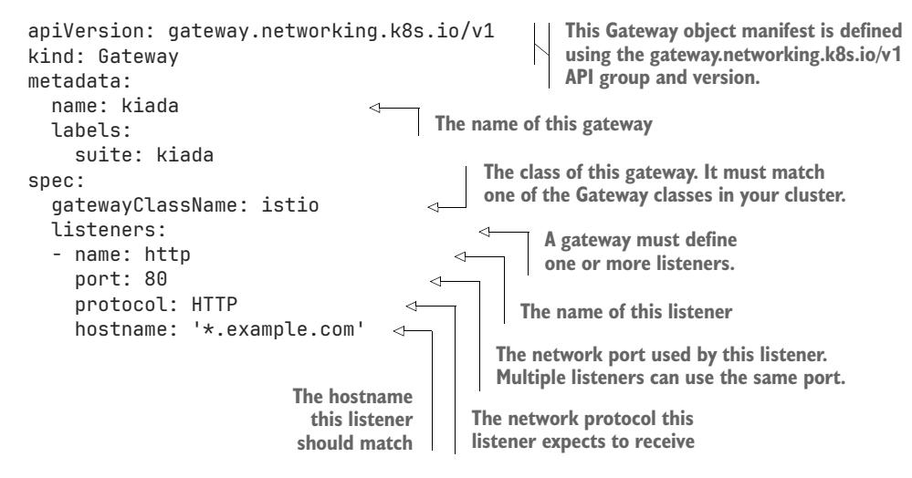

This manifest defines a gateway called kiada. You'll use it to expose all the services in the Kiada application suite. You set the gatewayClassName field to istio, as this is the only GatewayClass available in the cluster. If you're using a different Gateway API provider, you must specify a different class name.

 A gateway must also specify a list of listeners. A listener is a logical endpoint where the gateway accepts network connections. You only need a single HTTP listener to expose your services. The listener in the listing is bound to port 80 and matches all hostnames in the example.com domain.

 A Gateway object can also specify a list of addresses. If possible, the Gateway API implementation assigns these addresses to the gateway so that external clients can connect to the gateway using them.

## CREATING A GATEWAY FROM THE MANIFEST

Create the gateway from the manifest in the gtw.kiada.yaml file with the kubectl apply command:

```
$ kubectl apply -f gtw.kiada.yaml 
gateway.gateway.networking.k8s.io/kiada created
```

Since you didn't specify the address in the gateway, it's assigned automatically. Use the kubectl get command to display the address and the gateway's status as follows:

## \$ **kubectl get gtw** NAME CLASS ADDRESS PROGRAMMED AGE kiada istio 172.18.255.200 True 14s

NOTE The shorthand for gateways is gtw.

WARNING Be careful not to confuse gtw with gw. The latter is the shorthand for Istio's own gateway resource, which should be ignored, as explained earlier.

The output shows the class and address of the gateway. The ADDRESS column shows the addresses that have been bound to the gateway. If the cluster is configured correctly, this address should be reachable from outside the cluster.

## INSPECTING THE GATEWAY

When you create the Gateway object, the controller responsible for bringing that object to life usually creates a service of type LoadBalancer and associates it with the gateway. To see this Service, use the kubectl get command as follows:

## \$ **kubectl get services** NAME TYPE CLUSTER-IP EXTERNAL-IP PORT(S) kiada-istio LoadBalancer 10.96.155.20 172.18.255.200 15021:31961/ TCP,80:32313/TCP kubernetes ClusterIP 10.96.0.1 <none> 443/TCP

As you can see, the controller created the kiada-istio Service. This is a LoadBalancer Service that has been assigned an external IP of 172.18.255.200. This is the IP address that the kubectl get gtw command displayed earlier. Port 80 of the Service matches the port you defined in the Gateway's listeners list.

 Okay, you now have an externally reachable service, but where does this service forward traffic to? As you learned in previous chapters, a service forwards traffic to one or more pods that match the service's label selector. You can display this selector with the -o wide option when you run kubectl get service as follows:

```
$ kubectl get service kiada-istio -o wide
NAME TYPE ... AGE SELECTOR
kiada-istio LoadBalancer ... 14m istio.io/gateway-name=kiada
```

The kiada-istio Service sends traffic to pods with the label istio.io/gatewayname=kiada.

 Use the kubectl get pods command to find the pods that match this selector as follows:

## \$ **kubectl get pods -l istio.io/gateway-name=kiada**

```
NAME READY STATUS RESTARTS AGE
kiada-istio-86c59d8dd6-jfrnv 1/1 Running 0 16m
```

As you can see, the service forwards traffic to a pod called kiada-istio-something. This pod runs the Envoy proxy, which serves as the network gateway through which all external traffic for your Kiada Pods flows. Just like the Service, it's created by Istio when you create the Gateway object.

 The pod and the service are deployed in the same namespace in which you create the Gateway object. So, for each Gateway object you create, you get a dedicated, externally accessible proxy that's used only for your application's traffic. It's not a systemwide proxy that's used by the entire cluster.

NOTE Although Istio creates both a pod and a service for your gateway, this is an implementation detail. Other Gateway API providers may create the gateway differently.

## *13.2.3 Exploring the Gateway's status*

Most of the time, you can treat the Gateway object as a black box. You configure it using the spec field and then check its status field to see when it's ready. To see the status, you can use the kubectl describe command or the kubectl get -o yaml command as follows:

#### \$ **kubectl get gtw kiada -oyaml**

Because the output is long, I'll explain it in sections, starting with the status.addresses field.

## THE GATEWAY'S ADDRESSES

The most important part of a Gateway's status is the list of addresses at which the gateway can be reached:

#### status:

#### addresses:

 - type: IPAddress value: 172.18.255.200 **This is the list of addresses that are assigned to the gateway. These may or may not match the addresses you specify in the object's spec.**

The addresses field in the status may not match the addresses field you set in the spec. As you've already seen, you don't have to specify the spec.addresses field at all.

 Each address has a type and a value. The type can be IPAddress, Hostname, or any implementation-specific string. The value field contains the value of the address, which depends on the address type. It can be an IPv4 or IPv6 address, a hostname, or any other implementation-specific string.

## THE GATEWAY CONDITIONS

The next status section shows the Gateway object's conditions. As with all other Kubernetes objects, this is hard to read. My strategy is to first find the type field and then check the status to see whether the condition is True or False. If the condition is False, I then check the reason and message fields to find out why that's the case.

For example, let's take the Accepted condition. This is what the YAML looks like:

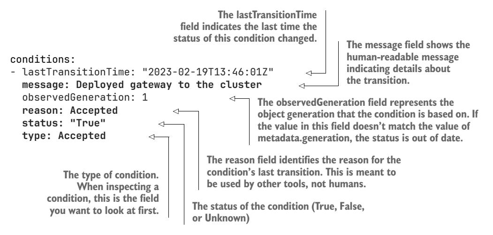

In addition to the Accepted condition, a gateway also exposes the condition type Programmed, which indicates whether some configuration has been generated for the gateway that will eventually make the gateway accessible. The condition type Ready is reserved for future use, whereas the condition type Scheduled has been deprecated.

NOTE You can learn more about each condition type by reading the comments in the code at [https://github.com/kubernetes-sigs/gateway-api/tree/](https://github.com/kubernetes-sigs/gateway-api/tree/main/apis) [main/apis](https://github.com/kubernetes-sigs/gateway-api/tree/main/apis).

## THE STATUS OF EACH LISTENER

The last part of a Gateway's status is the list of listeners and their conditions. Let's ignore the conditions for now and only focus on the rest:

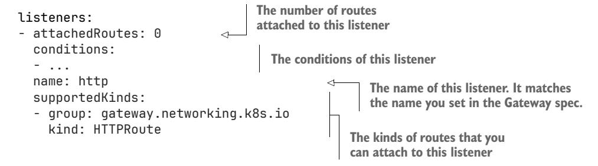

Each listener defined in the Gateway's spec.listeners array has a corresponding entry in the status.listeners array, which shows the listener's status. In this array, each entry contains an attachedRoutes field that indicates the number of routes associated with the listener, the supportedKinds field that indicates the types of routes the listener accepts, and the conditions field that indicates the detailed status of the listener. These conditions are explained in Table 13.1.

Table 13.1 Gateway listener conditions

| Condition type | Description                                                                                                                                                                                                                                                                                                                                                                                                                                                                                                                                                              |
|----------------|--------------------------------------------------------------------------------------------------------------------------------------------------------------------------------------------------------------------------------------------------------------------------------------------------------------------------------------------------------------------------------------------------------------------------------------------------------------------------------------------------------------------------------------------------------------------------|
| Accepted       | Indicates whether the listener is valid and can be configured in the Gateway. If<br>True, the reason is Accepted. If False, the reason can be PortUnavailable if<br>the port is already in use or unsupported, UnsupportedProtocol if the protocol<br>type is unsupported, or UnsupportedAddress if the requested address is already<br>in use or the address type is unsupported. If Unknown, the reason is Pending,<br>which means that the Gateway hasn't been reconciled yet.                                                                                        |
| Conflicted     | Indicates that the controller was unable to resolve conflicting specification require<br>ments for this listener. In this case, the listener's port isn't configured on any<br>network component. If True, the reason is either HostnameConflict, to indicate<br>that the hostname configured in the listener conflicts with other listeners, or<br>ProtocolConflict, to indicate that multiple conflicting protocols are configured<br>on the same port number. If the condition is False, the reason is NoConflicts.                                                   |
| Programmed     | Indicates whether the listener has created a configuration that is expected to be<br>ready. If True, the reason is Programmed. If False, the reason is either Invalid,<br>meaning that the listener configuration is invalid, or Pending, meaning that the<br>listener has yet to be configured, either because it hasn't yet been reconciled by<br>the controller or because the gateway isn't online and ready to accept traffic. If<br>Unknown, the reason is Pending.                                                                                                |
| Ready          | Indicates that the listener has been configured on the gateway and traffic is ready<br>to flow through it. If True, the reason is Ready. If False, the reason is either<br>Invalid, which means that the listener's configuration is invalid, or Pending, if<br>the listener hasn't yet been reconciled or isn't online and ready to receive traffic.<br>If the condition status is Unknown, the reason is also Pending.                                                                                                                                                 |
| ResolvedRefs   | Indicates whether the controller was able to resolve all references for the listener.<br>If True, the reason is ResolvedRefs. If False, the reason is one of the following:<br>InvalidCertificateRef if the listener is configured for TLS, but at least one<br>of the certificate references is invalid or doesn't exist, InvalidRouteKinds if an<br>invalid or unsupported route kind is specified in the listener, or RefNotPermitted<br>if the listener has a TLS configuration that references an object in a different name<br>space and has no permission for it. |

TIP If you can't connect to a service through your gateway, check the status of the corresponding listener in addition to the Gateway status.

The kiada Gateway defines a single listener. If you check the conditions of this listener in the Gateway object's status, you'll see that no errors were found. The Accepted, Attached, Programmed, ResolvedRefs, and Ready conditions are True, while the Conflicted and Detached conditions are False, as they should be. This means that the listener is okay.

 However, according to the attachedRoutes field, there are no routes associated with the listener, so you'll get a 404 Not Found error message when you connect to the gateway. In the next section, you'll create your first route to fix this error.

# *13.3 Exposing HTTP services using HTTPRoute*

Earlier in this chapter, you learned that the Gateway API supports several types of routes, configured by different kinds of Route object. The most common kind is HTTPRoute, which lets you connect an HTTP Service to one or more gateways.

## *13.3.1 Creating a simple HTTPRoute*

The following listing shows the manifest for the simplest possible HTTPRoute. The manifest defines an HTTPRoute called kiada that connects the kiada Service to the kiada Gateway you created earlier. You can find this manifest in the file httproute.kiada.yaml.

NOTE Although the kiada HTTPRoute, Gateway, and Service all have the same name, this isn't a requirement.

Listing 13.2 Attaching an HTTP Service to a Gateway using an HTTPRoute object

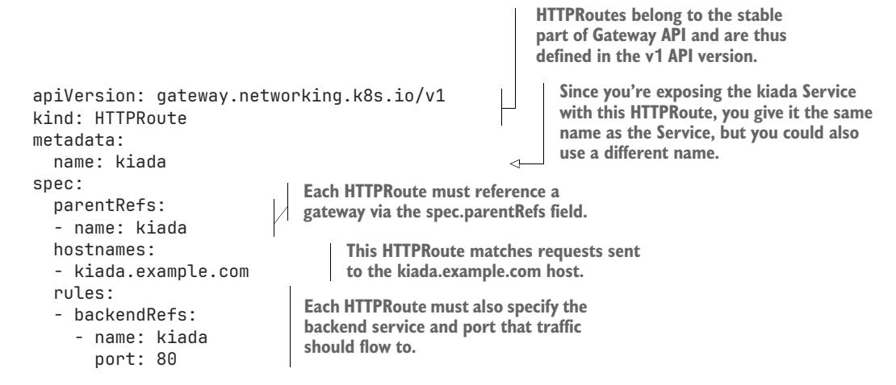

As I write this, HTTPRoute is the only route kind that is considered stable and is therefore part of the v1 API version. As you'll see later, all other kinds of routes use the v1alpha2 version.

 As the previous listing and figure 13.3 show, an HTTPRoute (like all other route kinds) connects one or more gateways to one or more services by referencing them in the parentRefs and backendRefs fields, respectively. The kiada HTTPRoute in the example connects the kiada Gateway to the kiada Service. All HTTP traffic received by the kiada Gateway that matches the hostname kiada.example.com is forwarded to the kiada backend service.

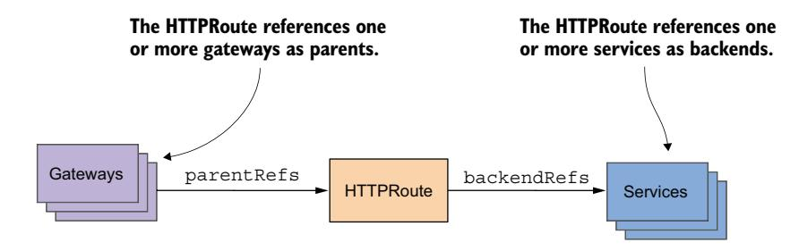

Figure 13.3 An HTTPRoute attaches one or more gateways to one or more services.

## CREATING AND TESTING THE HTTPROUTE

Create the HTTPRoute by applying the manifest file as follows:

```
$ kubectl apply -f httproute.kiada.yaml 
httproute.gateway.networking.k8s.io/kiada created
```

Check the route using kubectl get:

```
$ kubectl get httproutes
```

NAME HOSTNAMES AGE kiada ["kiada.example.com"] 18s

Use the kubectl get gtw command to display the Gateway's address again, then use curl to connect to it as follows:

```
$ curl --resolve kiada.example.com:80:172.18.255.200 http://kiada.example.com
KUBERNETES IN ACTION DEMO APPLICATION v0.5
...
```

NOTE Replace the IP address 172.18.255.200 with the IP address of your gateway.

If you'd like to access the application through your web browser, you must make sure that kiada.example.com resolves to the gateway's IP address. You can do so by adding the appropriate entry to your /etc/hosts or equivalent file.

## INSPECTING THE HTTPROUTE SPEC

The HTTPRoute you created was a good but trivial example that doesn't show the full potential of HTTPRoutes. In fact, several fields were initialized to their default values, so to get a better understanding of this basic routing example, you should examine the HTTPRoute object's YAML. Let's focus on the Object's spec first. Use the kubectl get command to display the YAML as follows:

```
$ kubectl get httproute kiada -o yaml
...
spec:
 hostnames:
 - kiada.example.com
```

```
 parentRefs: 
 - group: gateway.networking.k8s.io 
 kind: Gateway 
 name: kiada 
 rules:
 - backendRefs:
 - group: "" 
 kind: Service 
 name: kiada 
 port: 80 
 weight: 1 
 matches: 
 - path: 
 type: PathPrefix 
 value: / 
                                                  In your manifest, you only specified the 
                                                  name, but when you created the object, 
                                                  the group and kind fields were initialized 
                                                  to point to a gateway.
                               In your manifest, you only specified 
                               the name and port, but when you 
                               created the object, the group and 
                               kind were initialized to a service.
                                                                    Each backend reference 
                                                                    also gets a weight value. 
                                                                    You'll learn what this is in 
                                                                    section 13.3.1.
                                     Each rule also gets a filter that 
                                     determines which HTTP requests match 
                                     this rule. By default, a rule matches all 
                                     requests, regardless of the request path.
```

Remember the original manifest for this HTTPRoute? It didn't contain any of the fields that are shown in bold face. These fields were all initialized to their default values. Seeing this information should help you understand HTTPRoutes a bit better.

 Let's start with the parentRefs section. In the original manifest, you only specified the name of the gateway, but now, the reference clearly states that it is referencing a Gateway from the gateway.networking.k8s.io API group. You've probably guessed that this means that an HTTPRoute could also reference some other resource, which is what makes the Gateway API so powerful and extensible. You'll find that this pattern is repeated throughout the entire Gateway API. Whenever an object references another object, that reference doesn't need to point to a specific object kind, but it does default to the most common kind from either the Gateway API or core Kubernetes.

 In the backendRefs section of the original manifest, you also only specified the name of the service. In the object itself, the backend reference now explicitly points to a service from the core Kubernetes API group (by convention an empty string is used for that group). The backend reference also contains a new weight field, which is used for splitting traffic across multiple backends. You'll learn more about this in section 13.3.1.

 Your original manifest contained a single rule that indiscriminately forwarded all traffic to the single service, but a rule usually defines which requests it should match. That's what the new matches field is for. As you can see, it specifies that it matches all HTTP requests where the requested path starts with a backslash, which is true for every request. You'll learn more about request matching in section 13.3.2 where I explain traffic routing.

## INSPECTING THE HTTPROUTE STATUS

Whether or not the kiada HTTPRoute works as expected, you should also examine its status to learn how it can help you determine why traffic isn't flowing correctly when you start creating your own routes.

Let's display the YAML again to inspect the status:

```
$ kubectl get httproute kiada -o yaml
...
status:
 parents: 
 - conditions: 
 - ... 
 controllerName: istio.io/gateway-controller 
 parentRef: 
 group: gateway.networking.k8s.io 
 kind: Gateway 
 name: kiada 
                                                       The status is reported for 
                                                       each parent separately.
                                                            A set of conditions is shown for each 
                                                            parent. These are explained later.
                                                                          This is the controller 
                                                                          that handles this 
                                                                          parent. This comes 
                                                                          from the GatewayClass 
                                                                          associated with the 
                                                                          parent Gateway.
                                                      The parentRefs 
                                                      field indicates the 
                                                      name and kind of 
                                                      the parent that 
                                                      this status entry 
                                                      applies to.
```

Because an HTTPRoute can be attached to multiple gateways, the object doesn't report a single status but instead reports the status for each parent separately in individual items in the parents array.

 The gateway each entry relates to is specified in the parentRefs field. Additionally, the controllerName field indicates the controller that handles that particular Gateway or other kind of parent. You may recall that the controllerName is specified in the GatewayClass object; thus, the value of this status field comes from the GatewayClass associated with the parent Gateway. In fact, this controller wrote the entire status entry for this parent.

 The status of the HTTPRoute in the context of each parent is specified in the conditions array. This is what that array might look like:

#### conditions:

```
- lastTransitionTime: "2023-02-19T17:04:09Z" 
 message: Route was valid 
 observedGeneration: 1 
 reason: Accepted 
 status: "True" 
 type: Accepted
- lastTransitionTime: "2023-02-19T17:04:09Z" 
 message: All references resolved 
 observedGeneration: 1 
 reason: ResolvedRefs 
 status: "True" 
 type: ResolvedRefs 
                                                         The Accepted condition indicates 
                                                         whether this HTTPRoute was 
                                                         accepted by the parent Gateway.
                                                           The ResolvedRefs condition 
                                                           indicates whether all references 
                                                           in this HTTPRoute were resolved 
                                                           for the Gateway.
```

The HTTPRoute status exposes two conditions in the context of each parent. Table 13.2 explains the two condition types and the possible reasons for each condition.

TIP Whenever you run into problems with an HTTPRoute, inspect its status first. However, because this status may not give you the whole story, remember to also inspect the status of the parent Gateway.

Table 13.2 Route conditions

| Condition type | Description                                                                                                                                                                                                                                                                                                                                                                                                                                                                                                                                                                                                                                 |
|----------------|---------------------------------------------------------------------------------------------------------------------------------------------------------------------------------------------------------------------------------------------------------------------------------------------------------------------------------------------------------------------------------------------------------------------------------------------------------------------------------------------------------------------------------------------------------------------------------------------------------------------------------------------|
| Accepted       | Indicates whether the route has been accepted or rejected by a Gateway or<br>other parent. If True, the reason is Accepted. If False, the reason can be<br>NotAllowedByListeners if the route has not been accepted by the Gateway,<br>because the Gateway has no listener whose allowedRoutes criteria accepts<br>the route; NoMatchingListenerHostname if the Gateway has no listeners whose<br>hostname matches the route; NoMatchingParent when no parent matches the<br>port, for example; or UnsupportedValue when a value isn't supported. If Unknown,<br>the reason is Pending, indicating that the route has yet to be reconciled. |
| ResolvedRefs   | Indicates whether the controller was able to resolve all references for the<br>route. If True, the reason is ResolvedRefs. If False, the reason is one of<br>RefNotPermitted when one of the route's rules has a backendRef to an object in<br>another namespace that it doesn't have the permission to reference; InvalidKind<br>when one of the route's rules references an unknown or unsupported group or<br>kind; and BackendNotFound when one of the route's rules references an object,<br>such as a Service, that doesn't exist.                                                                                                    |

If you've successfully deployed this simple HTTPRoute example, you can now move on to more complex use-cases, where the route forwards traffic to different backend services.

## *13.3.2 Splitting traffic between multiple backends*

An HTTPRoute can be configured to split traffic among multiple backend services based on weights. For example, you can forward 1% of requests to a canary Service to test out a new version of your application. Should the new version misbehave, only 1% of the requests are affected.

## DEPLOYING A CANARY POD AND SERVICE

Deploy a pod named kiada-new and a service that forwards traffic only to that pod. However, because your current kiada Service forwards traffic both to the existing stable kiada Pod as well as the kiada-new Pod, you also need to create a service that forwards traffic only to the stable pod so that you can properly route traffic to these services with your desired weights.

 To deploy the kiada-new Pod and the kiada-new and kiada-stable Services, apply the manifest file pod.kiada-new.yaml using kubectl apply. Confirm that the pod is ready and that the stable and new pods appear as endpoints in each of the two services with the kubectl get endpoints command.

## CONFIGURING A HTTPROUTE RULE TO SPLIT TRAFFIC BETWEEN TWO BACKENDS

For demonstration purposes, let's configure the HTTPRoute to forward 10% of the traffic to the new, and 90% of the traffic to the stable service. The following listing shows the relevant part of the HTTPRoute manifest that you can find in the file httproute.kiada.splitting.yaml.

## Listing 13.3 Splitting HTTP traffic using weights

```
spec:
 rules:
 - backendRefs: 
 - name: kiada-stable 
 port: 80 
 weight: 9 
 - name: kiada-new 
 port: 80 
 weight: 1 
                                Two backend services are 
                                referenced in this HTTPRoute.
                                  90% of requests are sent 
                                  to the kiada-stable Service.
                               10% of requests are sent 
                               to the kiada-new Service.
```

As shown, you can split traffic in an HTTPRoute among multiple services by listing more than one service in the backendRefs list. If you omit the weight field, traffic is split evenly among all listed services. If you specify the weight in a backendRefs entry, the proportional share of requests is sent to that entry. In the example, the weight of the kiada-stable Service is 9, whereas the weight of the kiada-new Service is 1. The sum of all weights is 10, which means that kiada-stable gets nine-tenths of requests, while kiada-new gets a tenth.

 Try running curl in a loop and observe how many requests are handled by each of the two services.

## *13.3.3 Routing HTTP requests to different backends*

In addition to weight-based traffic splitting explained in the previous section, you can also configure an HTTPRoute to route traffic to different services based on the data in the HTTP request. You can route traffic based on the HTTP method, headers, the requested path, and query parameters.

 A request is forwarded to a specific backend if it matches *any* entry in the spec.rules.backendRefs.matches list. Each entry can specify the condition for the HTTP method, headers, request path, and query parameters. A request matches the entry if it satisfies **all** the conditions specified there.

## METHOD-BASED ROUTING

To route HTTP requests based on the HTTP method of the request, specify the method field as in the following listing.

#### Listing 13.4 Routing requests based on the HTTP method

```
spec:
 rules:
 - matches: 
 - method: POST 
 backendRefs: 
 - name: kiada-new 
 port: 80 
 - backendRefs: 
 - name: kiada-stable 
 port: 80 
                                Requests using the POST 
                                method are routed to the 
                                kiada-new Service.
                                  All other requests are routed 
                                  to the kiada-stable Service.
```

The HTTPRoute in the listing contains two rules, each relating to a different backend service. The first rule matches requests made using the POST method and forwards them to the kiada-new Service. The second rule does not contain specific conditions for matching requests and therefore acts as a catch-all rule. Therefore, any request that isn't a POST request is forwarded to the kiada-stable Service.

 If you now use curl to send requests to kiada.example.com using different HTTP methods, you should see that POST requests are received by the kiada-new Pod while the rest are received by the kiada-stable Pods.

## HEADER-BASED ROUTING

To forward requests based on HTTP headers, you specify a list of headers to match in the headers list. For each entry in this list, you specify the header name, matching type, and value. For example, to match requests that contain the header release with the value new, you specify the rule as shown in the following listing.3k?¸

## Listing 13.5 Matching requests based on HTTP headers

```
spec:
 rules:
 - matches: 
 - headers: 
 - type: Exact 
 name: Release 
 value: new 
 backendRefs: 
 - name: kiada-new 
 port: 80 
 - backendRefs: 
 - name: kiada-stable 
 port: 80 
                             If the request contains the HTTP 
                             header release with the value new, 
                             the request is routed to the kiada-
                             new Service.
                                 All other requests are routed 
                                 to the kiada-stable Service.
```

As in the previous example, two rules are defined in the HTTPRoute. The first rule matches requests based on HTTP headers, whereas the second matches all other requests. The first rule matches requests that look like this:

```
GET / HTTP/1.1
Host: kiada.example.com
Release: new
```

In the header match rule, the type is set to Exact, so the header value must match exactly. However, you can also match using regular expressions:

```
 matches:
 - headers:
 - type: RegularExpression 
 name: Release 
 value: new.* 
                                           A regular expression is used 
                                           for matching the HTTP header.
                                             The header name
                                      The regular expression used 
                                      to match the header value
```

Unlike in the previous example, the value field now specifies the regular expression to use to match the header value. The exact syntax depends on the Gateway API implementation, so check the documentation before using this approach.

 In both examples, a single header matching rule was used, but you can specify multiple rules in the headers field. When you do, the request must match **all** the specified rules.

## PATH-BASED ROUTING

An HTTPRoute can match requests based on the requested path, as shown in the following listing.

#### Listing 13.6 Matching requests based on the request path

```
spec:
 rules:
 - matches: 
 - path: 
 type: Exact 
 value: /quote 
 backendRefs: 
 - name: quote 
 port: 80 
                           This rule routes requests 
                           for the /quote path to the 
                           quote Service.
```

The rule in the listing matches all HTTP requests containing the exact path /quote and routes them to the quote Service.

 In addition to Exact path matching, you can also use prefix-based matching by setting the type to PathPrefix:

```
 - matches:
 - path:
 type: PathPrefix 
 value: /quiz 
 backendRefs:
 - name: quiz
 port: 80
                               The request matches if the request 
                               path starts with the specified prefix.
```

In this case, the HTTP request matches if the path starts with the prefix /quiz.

 Both the Exact and PathPrefix types should be fully supported by all Gateway API implementations, but some also support regular-expression-based path matching, as in this example:

```
 - path:
 type: RegularExpression 
 value: .*\.(css|js|png|ico) 
                                           The request matches if the request path 
                                           matches the specified regular expression.
```

Again, the regular expression syntax depends on the Gateway API implementation, so be sure to check the documentation before using this type.

## QUERY-PARAMETER-BASED ROUTING

The final method of request routing in HTTPRoutes is using the query parameters of the request. The following listing shows how you can route requests to the kiada-new Service when it contains the release=new query parameter.

## Listing 13.7 Routing requests based on query parameters

```
spec:
 rules:
 - backendRefs: 
 - name: kiada-new 
 port: 80 
 matches: 
 - queryParams: 
 - type: Exact 
 name: release 
 value: new 
 - backendRefs: 
 - name: kiada-stable 
 port: 80 
                            If the request contains the query 
                            parameter release=new, it is 
                            routed to the kiada-new Service.
                                 Otherwise, it's routed to 
                                 the kiada-stable Service.
```

In the listing, the queryParams field is used to match requests where the value of the query parameter release is new. This example is very similar to the example where you used header matching. It uses Exact matching, but you can also set the type to RegularExpression if you want to match the query parameter value using a regular expression:

```
 - queryParams:
 - type: RegularExpression 
 name: release 
 value: new.* 
                                                Set the type to RegularExpression if you 
                                                want to match the query parameter 
                                                value against a regular expression.
                                           The name of the query parameter to match
                                        The regular expression to match the value against
```

Just as with header matching, you can specify multiple query parameters in each rule, in which case, they must **all** match.

## COMBINING MULTIPLE CONDITIONS IN A RULE

In all the preceding examples, a single rule type was used in each rule. You can, however, combine these conditions. For example, you could route requests to kiada-new only if the requested path starts with /some-prefix, the Release: new header, and the specialCookie cookie is present. The rule would look something like this:

```
 rules:
 - backendRefs:
 - name: kiada-new
 port: 80
 matches:
 - path: 
 type: PathPrefix 
 value: /some-prefix 
                                The requested path must 
                                start with this prefix.
```

 - headers: - type: Exact name: Release value: new - type: RegularExpression name: Cookie value: .\*specialCookie.\* **The request must contain the header Release with the value new. The request must contain the specified cookie.**

Furthermore, you can split the traffic that matches this rule across multiple backend services by specifying more than one backend reference along with the desired weights, as you learned in section 13.3.2.

## *13.3.4 Augmenting HTTP traffic with filters*

In addition to routing HTTP requests to different backends, you can also modify the request, send it to multiple backends at the same time, redirect the client without routing the request to a backend at all, or even modify the response that the backend service sends back to the client. You do this by defining filters in the spec.rules .filters field.

## MODIFYING REQUEST HEADERS

To add, remove, or change request headers, add a RequestHeaderModifier filter to the HTTPRoute rule, as shown in the following listing.

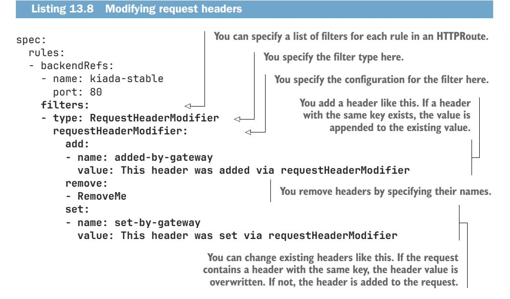

The example in the listing adds a header named added-by-gateway to the request, removes the RemoveMe header, and changes the value of the set-by-gateway header. The difference between add and set is that the former adds the specified value to the header, whereas the latter replaces the value. If the request already contains a header with the specified name, add appends the specified value to the header value.

## MODIFYING RESPONSE HEADERS

Just like you can modify the request headers, you can also modify the response headers. You can append to an existing header's value, overwrite the value, or remove the header altogether by using the add, set, and remove fields, respectively. However, you add these fields under responseHeaderModifier instead of requestHeaderModifier, and you set the filter type to RequestHeaderModifier, as shown in the following listing.

## Listing 13.9 Modifying response headers

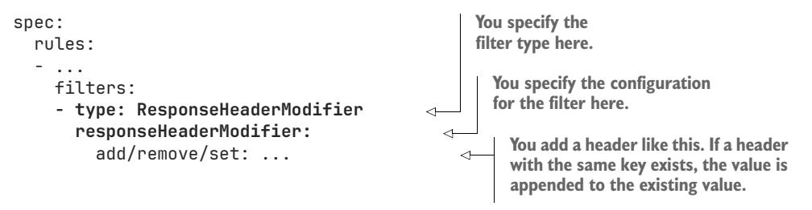

The add and set fields both add a header to the response that gets sent back to the client append if the response received by the gateway doesn't contain that header. However, if the header is present, add appends the specified value to the header value, whereas set overwrites the value.

## REWRITING THE REQUEST URL

You can also use a filter to rewrite the request URL before it's sent to the backend. This is especially useful when the HTTPRoute matches a particular request path that differs from the one that the backend expects.

 Currently, you can either replace the full request path or just the matched prefix. The following listing shows an example of the former.

#### Listing 13.10 Replacing the full request path

```
spec:
 rules:
 - backendRefs: 
 - name: kiada-stable 
 port: 80 
 matches: 
 - path: 
 type: PathPrefix 
 value: /foo 
 filters:
 - type: URLRewrite 
 urlRewrite: 
 hostname: newhost.kiada.example.com 
                                    The request is sent to the 
                                    kiada-stable Service.
                                      This rule matches only requests 
                                      where the request path starts 
                                      with the specified prefix.
                                             The filter type is specified here.
                                                 The filter config is specified under this field.
                                                           The request's host header is 
                                                           replaced with this hostname.
```

```
 path: 
 type: ReplaceFullPath 
 replaceFullPath: /new/path 
                                          The full request path is 
                                          replaced with /new/path.
```

As you can see in the manifest, any request whose path starts with /foo is sent to the kiada-stable Service, but the Host header and the request path are rewritten. The request sent to the backend service looks like this:

```
GET /new/path HTTP/1.1
Host: newhost.kiada.example.com
```

Thus, whether the request path in the client's request is /foo, /foo/bar, or anything else with the prefix /foo, the request path received by the service will be /new/path. The host is also always newhost.kiada.example.com.

NOTE The request path /foobar does not match the rule in the listing.

Alternatively, instead of replacing the full path, you can replace just the matched prefix. The following listing shows an example where the prefix /foo is rewritten to /new/path.

## Listing 13.11 Replacing the matched prefix

```
...
 matches:
 - path:
 type: PathPrefix 
 value: /foo 
 filters:
 - type: URLRewrite
 urlRewrite:
 path:
 type: ReplacePrefixMatch 
 replacePrefixMatch: /new/path 
                               When the request path 
                               starts with /foo...
                                          ...the prefix is 
                                          rewritten to /new/path.
```

If the client requests the path /foo, the path in the request sent to the Sservice is /new/ path. If the client requests the path /foo/bar, the Service receives /new/path/bar.

## REDIRECTING REQUESTS

You can use the RequestRedirect filter type if you want to redirect the client's request to a different URL. This allows you to point the client to a different location without having to implement the redirection in the application. For example, you could redirect clients from HTTP to HTTPS using the filter configuration shown in the following listing.

#### Listing 13.12 Redirecting a request

```
 rules:
 - filters:
 - type: RequestRedirect 
                                               You specify the type of 
                                               filter in the type field.
```

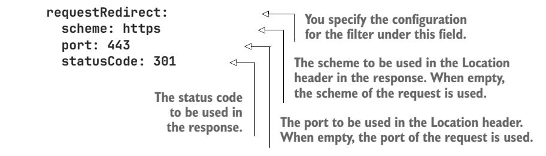

NOTE When using the RequestRedirect filter, you don't need to specify any backendRefs in the rule, since the gateway never routes the request.

In the listing, the scheme and port are set to https and 443, respectively. The status-Code is set to 302 Moved Permanently. You can also set a new hostname and path, but since you want to redirect to the same hostname and path, you can omit these fields. When you omit a field, the respective value from the original request is used.

NOTE The path field behaves just like in the URLRewrite filter explained in the previous section. You set the type to either ReplaceFullPath or Replace-PrefixMatch, depending on whether you want to replace the full path or just the matched prefix.

You can configure the HTTP status code to be sent in the redirect with the statusCode field. If you omit this field, the gateway sends the status code 302 Found.

## MIRRORING TRAFFIC TO ANOTHER SERVICE

All the filters explained so far have their place, but the most interesting filter is RequestMirror. This filter allows you to send a copy of the request to another backend, while still routing the original request to the backend defined in the rule. The client only receives the response from the backend defined in the rule, while the response from the other service is discarded.

 This is great for when you want to see how a new version of your service would behave in production, without affecting the clients. The following listing shows how to configure a rule to route traffic to the kiada-stable Service, but also mirror it to the kiada-new Service.

#### Listing 13.13 Mirroring traffic to another service

## rules: - backendRefs: - name: kiada-stable port: 80 filters:

 - type: RequestMirror requestMirror: backendRef:

 name: kiada-new port: 80

**The request is routed to the kiadastable Service and its response is sent back to the client.**

**A copy of the request is sent to the kiada-new Service, but its response is discarded.**

The backend for the rule is the kiada-stable Service, but the rule also specifies a filter that mirrors the requests to the kiada-new Service. Try applying the manifest file and sending a few requests to http://kiada.example.com. Check the response to see which pod it comes from. Also check the logs of the kiada-new Pod to see that it too receives each request:

```
$ curl --resolve kiada.example.com:80:172.18.255.200 http://kiada.example.com
    ... Request processed by Kiada 0.5 running in pod "kiada-001"... 
    $ kubectl logs kiada-001 -c kiada 
    ... 2023-03-12T12:40:32.930Z Received request for / from ::ffff:10.244.1.9 
    $ kubectl logs kiada-new -c kiada 
    ... 2023-03-12T12:40:32.931Z Received request for / from ::ffff:10.244.1.9 
                                                                  Send the request to the gateway.
                                                    The response was received from the kiada-001 Pod.
Check the logs of the pod that 
sent the response.
                                                                      This is the request you just sent.
                                                                Check the logs of the kiada-new Pod.
                                                             The kiada-new Pod received the same
                                                             request because of request mirroring.
```

## USING IMPLEMENTATION-SPECIFIC FILTERS

The filters explained so far have all proven to be common enough to be included in the Gateway API. However, each implementor of the Gateway API can also provide their own implementation-specific filters. To use a filter like this, set the filter type to ExtensionRef and specify the object that contains the filter configuration in the extensionRef field, as shown in the following listing.

## Listing 13.14 Using an implementation-specific filter

```
spec:
 rules:
 - backendRefs:
 - name: kiada-stable
 port: 80
 filters:
 - type: ExtensionRef 
 extensionRef: 
 group: networking.example.com 
 kind: SomeCustomFilter 
 name: kiada-filter 
                                             To apply an implementation-specific 
                                             filter, use the ExtensionRef type. 
                                                The filter config is specified in a 
                                                custom object provided by the 
                                                Gateway API implementation. You 
                                                must reference that object here.
                                                    Specify the API group of the object.
                                                   Specify the kind of the custom object.
                                               Specify the name of the object. The object must 
                                               be in the same namespace as the HTTPRoute.
```

Unlike the other filters, the configuration of an implementation-specific filter is not defined in the HTTPRoute directly, but in a separate object. The Gateway API implementation must register the object kind in the Kubernetes API. To use the custom filter, you create an object of this kind and reference it in the extensionRef field. In the listing, the HTTPRoute references the filter configuration in an object named kiada-filter of the kind SomeCustomFilter in the networking.example.com API group.

 At the time of writing, most Gateway API implementations don't yet provide their own custom filters. However, eventually, they surely will, with some implementations providing virtually the same filter types. When the same type of filter is provided by multiple implementations, it may become one of the standard filters in Gateway API.

# *13.4 Configuring a gateway for TLS*

In the previous sections, you exposed the kiada Service through plain, unsecure HTTP. As this is no way to expose services publicly, let's now see how you can use the Gateway API to expose services securely through TLS. You have two options:

- Terminate the TLS session at the gateway and use plain HTTP from the gateway to the backend.
- Pass the TLS session through the gateway and let the backend terminate it.

Although these options might seem similar, they are very different, because when the gateway terminates the TLS session, it can understand the underlying traffic, whereas with TLS pass-through, the gateway does not decrypt the traffic and thus doesn't know anything about the HTTP requests being sent within the TLS session. The only thing it does know is the hostname of the recipient due to the Server Name Identification (SNI) extension in the TLS protocol.

 The kiada Gateway is currently not configured to provide either of these two TLS options. You can't use HTTPS to connect to the kiada Service:

```
$ curl --resolve kiada.example.com:443:172.18.255.200 https://kiada.exam-
     ple.com -k
curl: (7) Failed to connect to kiada.example.com port 443 after 3082 ms: No
```

route to host

You'll take care of this in the next two sections.

# *13.4.1 Terminating TLS sessions at the gateway*

When the backend service doesn't support TLS, you'll want to let the gateway terminate the TLS session and use unencrypted HTTP when connecting to the backend. You may remember that each kiada Pod runs a sidecar container that handles HTTPS, but let's assume that it doesn't.

## CONFIGURING TLS TERMINATION IN A GATEWAY LISTENER

To configure the gateway to terminate TLS traffic, you set the tls.mode to Terminate in the listener within the Gateway object. However, for the gateway to decrypt the TLS packets, it needs to know what TLS certificate to use. You already have a TLS certificate and private key stored in the kiada-tls Secret. This is the certificate that the sidecar container in the kiada Pods uses, but you'll now use it in the gateway as well.

 The following listing shows the full Gateway manifest with TLS termination enabled. You can find this manifest in the file gtw.kiada.tls-terminate.yaml.

#### Listing 13.15 Configuring the gateway to terminate TLS

```
apiVersion: gateway.networking.k8s.io/v1
kind: Gateway
metadata:
 name: kiada
spec:
 gatewayClassName: istio
 listeners:
 - name: http
 port: 80
 protocol: HTTP
 - name: https 
 port: 443 
 protocol: HTTPS 
 tls: 
 mode: Terminate 
 certificateRefs: 
 - kind: Secret 
 name: kiada-tls 
                             In addition to the HTTP listener, this gateway 
                             contains a second listener for HTTPS.
                                 Tells the gateway to terminate the TLS session
                                   The certificate used to decrypt TLS packets 
                                   is specified in a Secret and referenced in 
                                   the certificateRefs field.
```

As shown in the listing, two listeners are now configured in the kiada Gateway: one for HTTP and one for HTTPS. The HTTPS listener is configured to Terminate TLS traffic using the TLS certificate and private key in the Secret named kiada-tls.

NOTE When your TLS certificate is stored in a Secret, you only need to specify the name of the Secret in certificateRefs. You can omit the kind field since it defaults to Secret.

After you apply the Gateway manifest to your cluster, you should be able to access the kiada Service at https://kiada.example.com if this hostname still resolves to the IP address of the gateway. You can use the following curl command to access the service:

```
$ curl --resolve kiada.example.com:443:172.18.255.200 https://kiada.exam-
     ple.com -k
```

NOTE Remember to replace 172.18.255.200 with the IP of your gateway.

## SPECIFYING ADDITIONAL TLS CONFIGURATION OPTIONS

Terminating TLS at the gateway is very straightforward. You just set the TLS mode and specify the name of the Secret containing the TLS certificate. However, if you need to, you can also specify additional TLS configuration options, such as the minimum TLS version or the supported cipher suites. You can do this in the options field under tls, as shown in the following example:

```
 tls:
 mode: Terminate
```

```
 certificateRefs:
 - kind: Secret
 name: kiada-tls
 options: 
 example.com/my-custom-option: my-value 
 example.com/my-other-custom-option: my-other-value 
                                                               Set TLS options 
                                                               here. The keys 
                                                               used here depend 
                                                               on the Gateway API 
                                                               implementation 
                                                               you use.
```

The options you can set here depend on what Gateway API implementation you're using, but some options may become standard.

## ATTACHING HTTPROUTES TO GATEWAYS THAT TERMINATE TLS

When you configure the gateway to terminate TLS, it knows what protocol is used underneath. For HTTP over TLS, you can therefore use HTTPRoute to route the traffic to your backends, just as with plain HTTP, since that's the protocol the gateway uses to connect to the backend. That's why the kiada HTTPRoute you created in section 13.3.1 now routes your requests to the kiada Pods whether you use HTTP or HTTPS when sending requests to the gateway.

 The request arrives at the gateway either encrypted or not, but the request sent by the gateway to the backend service is always unencrypted, which may not be desirable. For increased security, you may want your requests to stay encrypted all the way to the backend service. The next section explains how to do this.

## *13.4.2 End-to-end encryption using TLSRoutes and pass-through TLS*

As mentioned previously, each kiada Pod runs a sidecar container that can terminate TLS traffic and send it to the main container in the pod. This means that the gateway doesn't need to terminate the TLS session but can instead allow TLS packets to pass through the Gateway all the way to the backend service. This is a much safer approach, as the unencrypted HTTP is only sent through the loopback device within the pod and never over any network.

 However, because the traffic is now encrypted from the client to the backend, the gateway doesn't know anything about it, except for the hostname the traffic is destined for. This means that you can't use HTTPRoutes to route this traffic. Instead, you must use a TLSRoute object. You'll learn how to create it later, but first, you must configure the gateway for TLS pass-through.

## CONFIGURING TLS PASS-THROUGH IN A GATEWAY

To configure a listener within a gateway for pass-through TLS, set tls.mode to Passthrough, as shown in the following listing. You can find this manifest in the file gtw.kiada.tls-passthrough.yaml.

## Listing 13.16 Configuring a gateway for TLS pass-through

apiVersion: gateway.networking.k8s.io/v1

kind: Gateway metadata: name: kiada

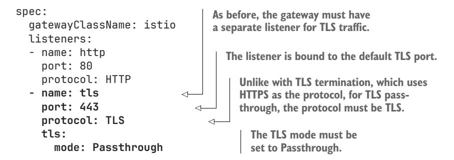

You again define two listeners in the gateway—one for HTTP, and the other for TLS. Unlike in the TLS termination example, this time, the protocol must be set to TLS, not HTTPS, which makes sense, since this listener can now be used for any type of TLS traffic, regardless of the underlying protocol. The gateway doesn't care (or know) what protocol is being used underneath, since the TLS mode is set to Passthrough.

 If you try to access the kiada Service after applying the new manifest, you'll find that you can no longer access the service:

```
$ curl --resolve kiada.example.com:443:172.18.255.200 https://kiada.exam-
     ple.com -k
curl: (7) Failed to connect to kiada.example.com port 443 after 0 ms: 
     Connection refused
```

NOTE Again, don't forget to use your Gateway's IP address instead of 172.18.255.200.

The connection is now refused. That's because the gateway doesn't know where to route it, as you haven't created the TLSRoute object yet. You'll do this now.

## CREATING A TLSROUTE

When the gateway is configured for TLS pass-through, you must use TLSRoutes to route traffic to your backends. The following listing shows a TLSRoute manifest that routes traffic to your kiada Service. You can find this manifest in the file tlsroute.kiada.yaml.

#### Listing 13.17 Creating a TLSRoute

```
apiVersion: gateway.networking.k8s.io/v1alpha2 
kind: TLSRoute 
metadata:
 name: kiada
spec:
 parentRefs: 
 - name: kiada 
 hostnames: 
 - kiada.example.com 
                                                                   TLSRoutes belong to the 
                                                                   gateway.networking.k8s.io API 
                                                                   group. Currently, they are still 
                                                                   experimental and thus use the 
                                                                   v1alpha2 API version.
                                   Like HTTPRoutes, a TLSRoute must 
                                   reference one or more parents. A 
                                   parent is typically a Gateway object.
                                      A TLSRoute can specify a list of hostnames that 
                                      the TLS connection must match to be routed 
                                      to the specified backends.
```

rules:

- backendRefs:

- name: kiada-stable

port: 443

**As with HTTPRoutes, you specify one or more rules for the TLSRoute.**

**Unlike HTTPRoute, each rule in TLSRoute only specifies the backend and an optional weight.**

The TLSRoute in the listing connects the kiada Gateway to the kiada-stable backend service. As you can see, there are no special conditions specified in the rule or the TLSRoute as a whole. That's because the gateway is oblivious to the information in the TLS packets, since most of it is encrypted. The only unencrypted piece of information the gateway can read from the TLS packets is the hostname of the recipient. It can do this because of the Server Name Identification (SNI) extension to the TLS protocol.

 So, with a TLSRoute, you can only route traffic based on the hostname. Even if the underlying protocol is HTTP, you can't use request path-based or header-based routing like you can with an HTTPRoute. And, as you saw earlier, you can't use an HTTPRoute when using TLS pass-through.

NOTE You can't route TLS traffic based on anything other than the hostname of the recipient, but you can split traffic across different backend services by defining the weight for each backend, just as in an HTTPRoute.

To see the TLSRoute in action, apply the manifest using kubectl apply and then use curl or your web browser to access the kiada Service. When you send a request, it gets wrapped into TLS packets, which flow from your web client through the gateway to the Envoy sidecar in one of the kiada Pods. Envoy decrypts the TLS packets and proxies the HTTP request to the main container running within the same pod. The response is then encrypted and sent back to the client via the gateway.

# *13.5 Exposing other types of services*

Unlike the Ingress API you learned about in the previous chapter, the Gateway API supports generic TCP and UDP services, through TCPRoutes and UDPRoutes. Additionally, with many services now using the gRPC protocol, the API also provides dedicated support for that type of services through the GRPCRoute resource. Let's take a quick look at all three.

 Before you continue, use kubectl apply to apply the manifest file podsvc.test.yaml. This file contains the manifests for a service and a pod that runs a TCP, UDP, and gRPC server.

# *13.5.1 Exposing a TCP service with a TCPRoute*

Whenever you need to expose any non-HTTP or non-TLS Service externally, you can do so via the Gateway API. This is done by adding an appropriate listener to the gateway and creating a TCPRoute object.

## ADDING A TCP LISTENER TO THE GATEWAY

To enable exposing TCPRoutes through Gateway, you add a listener with the protocol set to TCP as in the following listing (the listener is shown in bold). You can find the full manifest in the file gtw.kiada.tcp-udp-grpc.yaml.

#### Listing 13.18 Adding a TCP listener to a gateway

```
apiVersion: gateway.networking.k8s.io/v1
kind: Gateway
metadata:
 name: test-gtw
spec:
 gatewayClassName: istio
 listeners:
 - name: tcp200 
 port: 200 
 protocol: TCP 
                                   Choose a name 
                                   for the listener.
                                     Select a network port.
                                  Set the protocol to TCP.
```

In the listing, a listener named tcp200 binds to the TCP port 200. When you apply the manifest, the gateway is configured to accept TCP connections on that port, but it doesn't know where to route them until you create a TCPRoute object.

## CREATING A TCPROUTE

To route traffic from a gateway to a backend service, you must link the two by creating a TCPRoute object. The following manifest shows a TCPRoute that links the kiada Gateway to the test Service.

#### Listing 13.19 Creating a TCPRoute

```
apiVersion: gateway.networking.k8s.io/v1alpha2 
kind: TCPRoute 
metadata:
 name: test
spec:
 parentRefs: 
 - name: test-gtw 
 rules: 
 - backendRefs: 
 - name: test 
 port: 2000 
                                                               TCPRoutes belong to the 
                                                               gateway.networking.k8s.io API group. 
                                                               They are still experimental and are 
                                                               thus in the v1alpha2 API version.
                              As all Routes, a TCPRoute must reference at 
                              least one gateway or another type of parent.
                            A TCPRoute also contains a list of backends, typically 
                            services. You must specify the TCP port on the service.
```

NOTE As with other types of routes, you can specify multiple backends to split traffic among them. Specifying different weights for the backends allows you to split traffic in any way you want.

A TCPRoute is very simple. Like TLSRoutes, it merely links a set of parents to a set of backends. The TCPRoute in the manifest routes TCP connections to the backend service named test on port 2000.

 When you define multiple backends, you can assign a weight to each backend to split traffic in any way you wish, but you can't perform any kind of content-aware routing. You really can't expect that, since the gateway knows nothing about the contents of the TCP packets passing through it.

 After you apply this manifest to your cluster, you can see the TCPRoute in action by using the nc tool as follows:

#### \$ **nc 172.18.255.200 200**

NOTE Replace 172.18.255.200 with the IP of your gateway.

This command establishes a TCP connection with the gateway on port 200. The gateway in turn establishes a new connection to port 2000 of the backend. In this example, the backend is the test Service, which is backed by a single pod also named test. The pod also runs the nc tool, but in listener mode.

 After you run the nc tool, whatever you type in the console gets sent to the pod. The pod will then respond with "You said:", followed by the text you typed. Press Ctrl-C to terminate the connection.

## *13.5.2 UDPRoute*

To expose UDP services through the Gateway API, you must add a UDP listener to the gateway and create a UDPRoute object to create a link between the gateway and a backend service.

## ADDING A UDP LISTENER TO THE GATEWAY

A UDP listener definition in a gateway looks as follows:

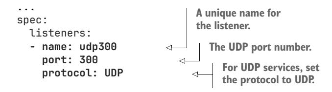

In the example, a listener named udp300 is defined. It listens on UDP port 300. Unless you applied the manifest file gtw.test.yaml in the previous section, please do so now.

## CREATING A UDPROUTE

After you configure the gateway, you must create the UDPRoute shown in the following listing. You can find the manifest in the file udproute.test.yaml.

#### Listing 13.20 Defining a UDPRoute

apiVersion: gateway.networking.k8s.io/v1alpha2 kind: UDPRoute

metadata: name: test **As all other Routes, UDPRoutes belong to the gateway.networking.k8s.io API group. As they are currently experimental, they are in the v1alpha2 API version.**

```
spec:
 parentRefs: 
 - name: test-gtw 
 rules: 
 - backendRefs: 
 - name: test 
 port: 3000 
                              This UDPRoute references the 
                              kiada Gateway as the parent.
                          This route's backend is UDP port 
                          3000 of the Service named test.
```

The UDPRoute in the listing references the kiada Gateway and routes UDP packets to port 3000 of the test Service. To test this route, use the following command:

```
$ nc --udp 172.18.255.200 300
```

NOTE Replace 172.18.255.200 with the IP of your gateway.

If everything is okay, whatever you type after you run this command should be echoed back by the test Pod. However, at the time of writing, Istio doesn't support UDPRoutes, so you won't receive any replies.

 But how do you know if UDPRoute is supported by your chosen Gateway API implementation? You check the UDPRoute object's status after you create the object. You'll notice that the test UDPRoute, unlike the test TCPRoute, has no status set. This is an indication that no controller has processed this object.

## *13.5.3 GRPCRoute*

The final Route kind we'll look at is GRPCRoute. As the name suggests, this is specifically for routing gRPC messages. At the time of writing, Istio doesn't support GRPCRoutes yet, so I'll only give a brief overview.

## DEFINING A GRPC LISTENER IN THE GATEWAY

To add a gRPC listener to the gateway, add an entry like the following to the listeners list:

```
...
spec:
 listeners:
 - name: grpc 
 port: 900 
 protocol: HTTP 
 hostname: 'test.example.com' 
                                     A unique name 
                                     for the listener.
                                        The TCP port number.
                                           For gRPC, set the protocol to HTTP.
                                                Set the hostname.
```

For gRPC, set the protocol to HTTP, select a port number, and optionally set the hostname.

## CREATING A GRPCROUTE

After you add a gRPC listener to the gateway, create a GRPCRoute object like the one in the following listing. You can find the manifest in the grpcroute.test.yaml file.

#### Listing 13.21 Defining a GRPCRoute

```
apiVersion: gateway.networking.k8s.io/v1alpha2 
kind: GRPCRoute 
metadata:
 name: test
spec:
 parentRefs: 
 - name: test 
 hostnames: 
 - test.example.com 
 rules: 
 - matches: 
 - method: 
 service: yages.Echo 
 method: Ping 
 type: Exact 
 backendRefs: 
 - name: test 
 port: 9000 
                                                            GRPCRoutes belong to the standard 
                                                            gateway.networking.k8s.io API group. 
                                                            They belong to the v1alpha2 API 
                                                            version because they are still 
                                                            experimental.
                                            A GRPCRoute must reference at least 
                                            one parent, typically a gateway.
                                           Like HTTPRoutes and TLSRoutes, 
                                           GRPCRoutes can specify a list of 
                                           hostnames to match.
                                       You must specify the gRPC 
                                       service and/or method and 
                                       match type in each rule.
                             You must specify the backend that 
                             should receive the gRPC message.
```

With the GRPCRoute in the listing applied to the cluster, whenever a client calls the Ping method on the yages.Echo gRPC service, the gateway will route the call to port 9000 of the test Service.

NOTE At the time of writing, Istio doesn't yet support GRPCRoutes. Check the status after applying the GRPCRoute object manifest to see whether it has been accepted.

To perform the gRPC call, you can use the grpcurl tool as follows:

```
$ grpcurl -proto yages-schema.proto --plaintext test.example.com:900 
     yages.Echo.Ping
{
 "text": "pong"
}
```

## MATCHING RULES AGAINST INCOMING GRPC REQUESTS

As you can see from the previous example, GRPCRoutes, like HTTPRoutes, allow you to specify conditions in the matches field for matching each rule against incoming gRPC requests. You can match against gRPC request headers, as well as the gRPC service and/or method, as you saw in the previous example. The service/method matching rule type can either be Exact, which is supported by all implementations, or RegularExpression, which is supported only by some implementations.

## MODIFYING GRPC REQUESTS USING FILTERS

As with HTTPRoutes, you can add filters to the rules in a GRPCRoute. Currently, the following filters are available:

- RequestHeaderModifier to modify the request headers sent from the client to the server.
- ResponseHeaderModifier to modify the response headers sent from the server back to the client.
- RequestMirror to mirror gRPC requests to another service.
- ExtensionRef for custom, implementation-specific filters.

These filters behave just like the ones in HTTPRoute, so refer to section 13.3.4 for more information.

# *13.6 Using Gateway API resources across namespaces*

In the previous examples, the gateway, route, and backend service were always in the same Kubernetes Namespace. However, the Gateway API allows a route to reference both a gateway and a backend service in a different namespace, and it can only do so when explicit permission is given. The way to give this permission differs between the two cases.

## *13.6.1 Sharing a gateway across namespaces*

By default, a gateway can only be referenced by routes in the same namespace. However, you can also create a gateway that is shared across multiple namespaces.

## ALLOWING A GATEWAY TO BE USED BY ROUTES IN OTHER NAMESPACES

Each listener defined in a gateway can specify which namespaces are allowed to reference it through the allowedRoutes.namespaces field.

 For example, in the following listing, the http listener can be used in All namespaces, whereas the tcp listener can only be used in namespaces with the part-of: kiada label.

## Listing 13.22 Allowed namespaces for routes referencing this gateway

```
apiVersion: gateway.networking.k8s.io/v1
kind: Gateway
metadata:
 name: shared
 namespace: gateway-namespace
spec:
 gatewayClassName: istio
 listeners:
 - name: http
 port: 80
 protocol: HTTP
 allowedRoutes: 
 namespaces: 
 from: All 
 - name: tcp
 port: 200
                          The http listener can 
                          be bound by any route 
                          from any namespace.
```

```
 protocol: TCP
 allowedRoutes: 
 namespaces: 
 from: Selector 
 selector: 
 matchLabels: 
 part-of: kiada
```

**The tcp listener can only be bound by routes in namespaces with the specified label.**

By default, the allowedRoutes.namespaces.from field is set to Same, but you can also set it to All or Selector, as shown in the listing. When using a selector, you can use either the simple equality-based matchLabels selector or the more expressive set-based matchExpressions selector, as explained in chapter 10.

TIP To specify namespaces by name, use the key kubernetes.io/metadata .name in the label selector. For a single namespace, you can use the match-Labels field. For multiple namespaces, use the matchExpressions field, set the operator to In, and specify the namespace names in the values field.

## REFERRING TO A GATEWAY IN ANOTHER NAMESPACE

When you want a route to reference a gateway from a different namespace, you must specify the namespace field in the route's parentRefs as in the following listing. You can find the manifest in the file httproute.cross-namespace-gateway.yaml.

#### Listing 13.23 Referencing a gateway in another namespace

```
apiVersion: gateway.networking.k8s.io/v1
kind: HTTPRoute
metadata:
 name: cross-namespace-gateway
spec:
 parentRefs: 
 - name: shared 
 namespace: gateway-namespace 
 ...
                                           When referring to a gateway in another 
                                           namespace, specify the namespace in 
                                           the parent reference.
```

You can create the HTTPRoute defined in the listing in the kiada Namespace. It will be bound to the shared Gateway in the Namespace gateway-namespace.

 If you try to do the same with the TCPRoute defined in the tcproute.cross-namespace-gateway.yaml file, you will find that it doesn't get bound to the shared Gateway, even though it references it just like the HTTPRoute. The TCPRoute object's status will show the following message for the Accepted condition:

```
$ kubectl get tcproute cross-namespace-gateway -o yaml
...
status:
 parents:
 - conditions:
 - lastTransitionTime: "2023-03-12T17:02:54Z"
```

```
 message: kind gateway.networking.k8s.io/v1alpha2/TCPRoute is not 
    allowed; hostnames
 matched parent hostname "", but namespace "kiada" is not allowed by 
    the parent
 observedGeneration: 1
 reason: NotAllowedByListeners
 status: "False"
 type: Accepted 
                                       Looks for the 
                                       Accepted condition
```

To fix this, add the label part-of=kiada to the kiada Namespace as follows:

```
$ kubectl label ns kiada part-of=kiada
namespace/kiada labeled
```

## *13.6.2 Routing to a service in a different namespace*

Whereas you can allow routes from other namespaces to reference a gateway in the Gateway object itself, to allow a route to reference a service in another namespace, you don't do it in the Service object, but in a separate object of kind *ReferenceGrant*. Let's see what happens if you create a service named some-service in the Namespace service-namespace that you use as the backend in an HTTPRoute in the kiada Namespace. Apply the manifest file httproute.cross-namespace-backend.yaml. It contains the HTTPRoute, the Service, and the Namespace object. As shown in the following listing, the HTTPRoute contains a single rule that refers to a backend in a different namespace.

## Listing 13.24 Referring to a backend in another namespace

```
spec:
 rules:
 - backendRefs:
 - name: some-service 
 namespace: service-namespace 
 port: 80
                                           This backend reference points to a 
                                           service in a different namespace.
```

If you check the status of the HTTPRoute, you'll see that the ResolvedRefs condition is False:

```
$ kubectl get httproute cross-namespace-backend -o yaml
...
status:
 parents:
 - conditions:
 - ...
 - lastTransitionTime: "2023-03-12T17:23:59Z"
 message: backendRef some-service/service-namespace not accessible to a 
    route
 in namespace "kiada" (missing a ReferenceGrant?)
 observedGeneration: 1
 reason: RefNotPermitted
```

 **status: "False" type: ResolvedRefs**

The condition message indicates that the backend is not accessible because of a missing ReferenceGrant, so let's create it.

## ALLOWING ROUTES TO REFERENCE A BACKEND ACROSS NAMESPACES

To allow a HTTPRoute in the kiada Namespace to refer to the Service some-service in service-namespace, you must create the ReferenceGrant in the namespace of the referent (in this case, the Service). The following listing shows the object manifest. You can find it in the file referencegrant.from-httproutes-in-kiada-to-some-service.yaml.

#### Listing 13.25 Allowing a HTTPRoute from another namespace to reference a service

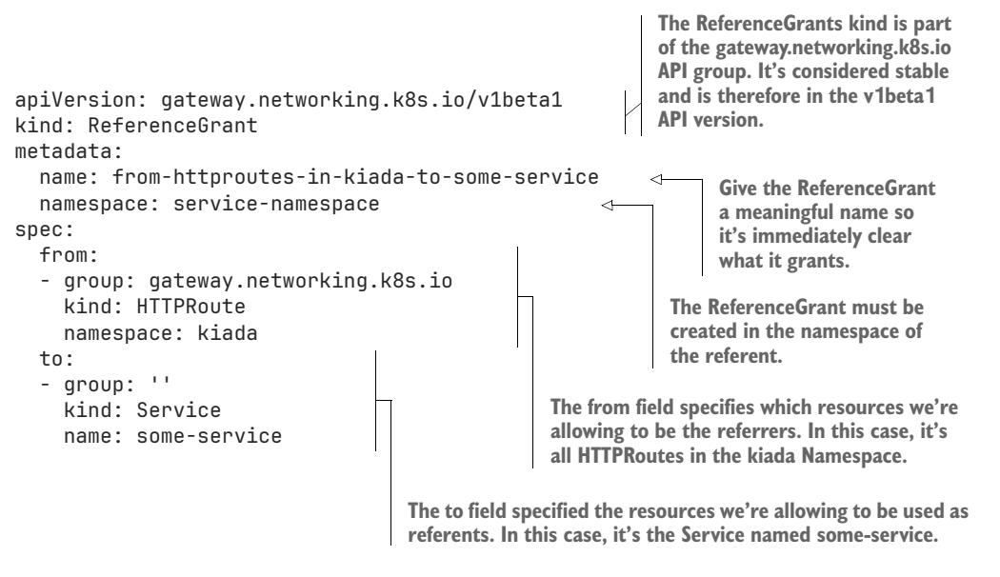

A quick glance at the listing tells you that a ReferenceGrant specifies a list of referrers (in the from field) and a list of referents (in the to field). The ReferenceGrant in the listing allows **all** HTTPRoutes in the kiada Namespace to reference the service named some-service in the namespace of the ReferenceGrant (which is service-namespace).

 For each entry in the from list, you must specify the API group, kind, and namespace. You can't specify the name of the referrer. For each entry in the to list, you must specify the API group and kind, whereas the name is optional.

NOTE If you omit the name field in the to section, you permit the referrer(s) to reference any object of the specified kind.

After you create the ReferenceGrant in the listing, the status field of the Resolved-Refs condition in the cross-namespace-backend HTTPRoute should change to True. If the service had endpoints, the HTTPRoute would successfully route the traffic to those endpoints.

# *13.7 From ingress gateways to service mesh*

You've learned how to use the Gateway API to expose services to clients outside the cluster, which is also known as north/south traffic. This is what the Gateway API was originally designed for. However, later a realization came that the same API with only minor changes could also be used to manage communication between services within a cluster. You'll see this referred to as east/west traffic. The management of interservice traffic is a key aspect in a *service mesh*.

DEFINITION A *service mesh* is a dedicated infrastructure layer for facilitating service-to-service communications.

A service mesh allows you to manage the communication between services without the need to reconfigure or redeploy the applications running in the mesh. Instead, the interservice communication is affected by the configuration of the service mesh itself.

 Initially, each service mesh implementation provided its own way of setting this configuration, but later the Service Mesh Interface (SMI) specification aimed to standardize the way service meshes are configured. Then, with the realization that the Gateway API could be extended to provide the same common way to configure service meshes, the work to standardize the configuration moved to the Gateway API Mesh Management and Administration (GAMMA) initiative within the Gateway API.

 A full explanation of service meshes and how the Gateway API can be used from that perspective is outside the scope of this book. To learn more about service meshes, I strongly recommend reading *Istio in Action*. To learn more about the GAMMA initiative, refer to <https://gateway-api.sigs.k8s.io/concepts/gamma/>.

 If you're already familiar with service meshes, you might wonder how the Gateway API is used to configure service to service traffic, since all the examples in this chapter have combined routes with one or more gateways, whereas for interservice traffic, you want that traffic to flow between services directly and not through an additional gateway. Here's how the GAMMA initiative solves this.

 You may remember that the different route objects such as HTTPRoute and TLSRoute have a parentRefs field that usually references the Gateway object. However, in addition to the name field, you can also specify the group and kind in each parentRefs entry, allowing you to set a service as the parent, like in the following example:

```
kind: HTTPRoute
metadata:
 name: my-interservice-route
spec:
 parentRefs:
 - name: destination-service
 kind: Service
 group: core
```

```
 port: 80
 rules:
 - ...
```

The HTTPRoute in the example affects traffic originating from pods that belong to the from-service Service. As with traffic coming from a gateway, the traffic from these pods is matched against the rules specified in the HTTPRoute and then routed to the specified backends, which in this example is the to-service Service. This traffic can be augmented using filters specified in the filters field, as explained in section 13.3.4.

# *Summary*

- The Gateway API replaces and improves the Ingress API explained in the previous chapter. It's more expressive and easier to manage by multiple people.
- The Gateway API requires a Gateway API implementation to be installed in the cluster. Kubernetes does not include one by default.
- A cluster administrator creates one or more Gateway objects. Each object represents one network entry point between external clients and services in the cluster, and it is typically backed by a reverse proxy. A gateway can be shared across multiple Kubernetes namespaces.
- Each cluster provides one or more gateway classes, represented by GatewayClass objects. Each class specifies the controller responsible for provisioning a proxy for each Gateway object. A GatewayClass object can also specify parameters for the proxy configuration.
- To expose an HTTP service through a gateway, an HTTPRoute object is used. It specifies the parent Gateway object, and a set of rules that the service or other backend where HTTP requests matching the specified criteria should be routed to.
- An HTTPRoute can route traffic based on the hostname, HTTP method, request path, headers, and query parameters. Traffic can also be split across multiple services with weight-based traffic splitting, or mirrored to another service.
- An HTTPRoute can also modify HTTP traffic. It can add, remove, and modify HTTP headers, rewrite the request URL, redirect requests, and modify response headers.
- Gateways can either terminate TLS encryption at the gateway itself or pass TLS traffic unmodified to a backend service. A TLSRoute object is used to route this traffic.
- A GRPCRoute is used for routing gRPC messages. Like HTTPRoutes, a GRPCRoute can forward gRPC messages to different backends based on the properties of the gRPC message, and it can also modify them.
- Gateways also support raw TCP and UDP traffic. A TCPRoute object is used to configure TCP traffic routing, whereas a UDPRoute object is used for UDP.