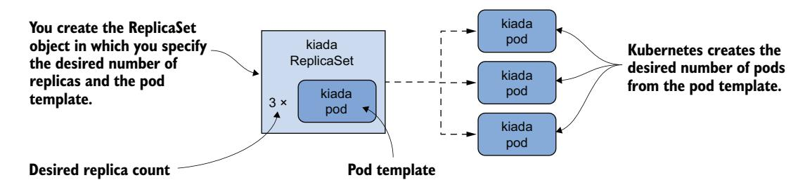
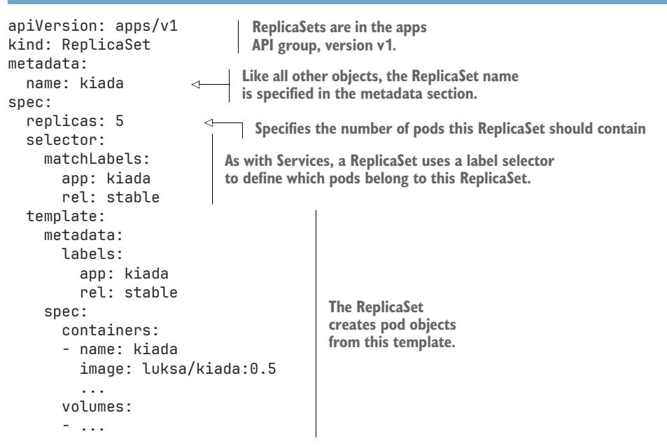
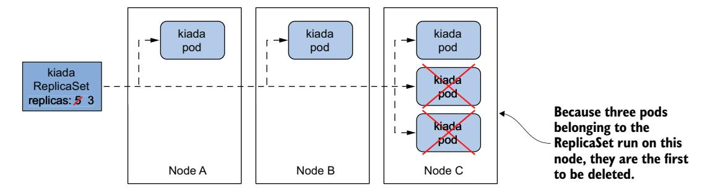
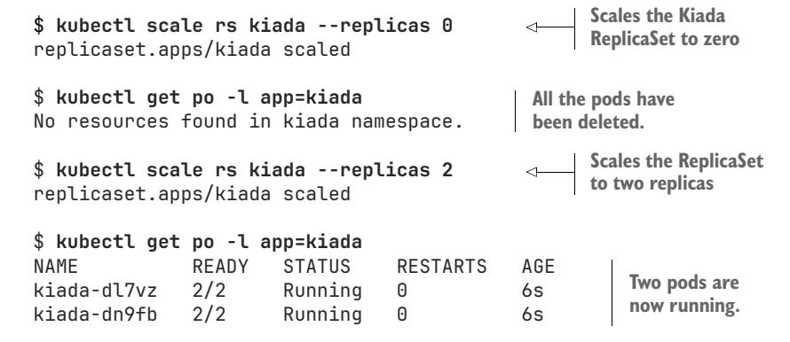
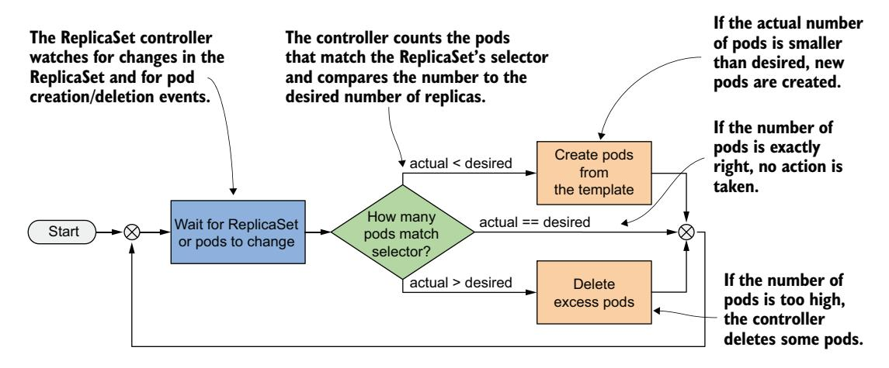

# *Scaling and maintaining pods with ReplicaSets*

# *This chapter covers*

- Replicating pods with the ReplicaSet object
- Keeping pods running when cluster nodes fail
- The reconciliation control loop in Kubernetes controllers
- API Object ownership and garbage collection

So far, you've deployed workloads by creating Pod objects directly. In a production cluster, you might need to deploy dozens or even hundreds of copies of the same pod, so creating and managing such pods would be difficult. Fortunately, in Kubernetes, you can automate the creation and management of pod replicas with the ReplicaSet object.

NOTE Before ReplicaSets were introduced, similar functionality was provided by the ReplicationController object type, which is now deprecated. A ReplicationController behaves exactly like a ReplicaSet, so everything that's explained in this chapter also applies to ReplicationControllers.

Before you begin, make sure that the Pods, Services, and other objects of the Kiada suite are present in your cluster. If you followed the exercises in the previous chapter, they should already be there. If not, you can create them by creating the kiada name-space and applying all the manifests in the Chapter14/SETUP/ directory with the following command:

#### \$ kubectl apply -f SETUP -R

**NOTE** You can find the code files for this chapter at https://github.com/luksa/kubernetes-in-action-2nd-edition/tree/master/Chapter14.

## 14.1 Introducing ReplicaSets

A ReplicaSet represents a group of pod replicas (exact copies of a pod). Instead of creating pods one by one, you can create a ReplicaSet object in which you specify a Pod template and the desired number of replicas, and then have Kubernetes create the pods, as shown in figure 14.1.



Figure 14.1 ReplicaSets in a nutshell

The ReplicaSet allows you to manage the pods as a single unit, but that's about it. If you want to expose these pods as one, you still need a Service object. As shown in figure 14.2, each set of pods that provides a particular service usually needs both a ReplicaSet and a Service object.


Figure 14.2 The relationship between services, ReplicaSets, and pods

And just as with services, the ReplicaSet's label selector and pod labels determine which pods belong to the ReplicaSet. As shown in figure 14.3, a ReplicaSet only cares about the pods that match its label selector and ignores the rest.


Figure 14.3 A ReplicaSet only cares about pods that match its label selector.

Based on the information so far, you might think that a ReplicaSet is only used to create multiple copies of a pod, but that's not the case. Even if you only need to create a single pod, it's better to do it through a ReplicaSet than to create it directly, because the ReplicaSet ensures that the pod is always there to do its job.

 Imagine creating a pod directly for an important service, and then the node running the pod fails when you're not there. Your service is down until you recreate the pod. If you'd deployed the pod via a ReplicaSet, it would automatically recreate the pod. It's clearly better to create pods via a ReplicaSet than directly.

 However, as useful as ReplicaSets can be, they don't provide everything you need to run a workload long-term. At some point, you'll want to upgrade the workload to a newer version, and that's where ReplicaSets fall short. For this reason, applications are typically deployed not through ReplicaSets, but through Deployments that let you update them declaratively. This begs the question of why you need to learn about ReplicaSets if you're not going to use them. The reason is that most of the functionality a Deployment delivers is provided by the ReplicaSets that Kubernetes creates underneath it. Deployments take care of updates, but everything else is handled by the underlying ReplicaSets. Therefore, it's important to understand what they do and how.

## *14.1.1 Creating a ReplicaSet*

Let's start by creating the ReplicaSet object for the Kiada service. The service currently runs in three pods that you created directly from three separate pod manifests, which you'll now replace with a single ReplicaSet manifest. Before you create the manifest, let's look at what fields you need to specify in the spec section.

## INTRODUCING THE REPLICASET SPEC

A ReplicaSet is a relatively simple object. Table 14.1 explains the three key fields you specify in the ReplicaSet's spec section.

 The selector and template fields are required, but you can omit the replicas field. If you do, a single replica is created.

Table 14.1 The main fields in the ReplicaSet specification

| Field name | Description                                                                                                                                                                                                                                |
|------------|--------------------------------------------------------------------------------------------------------------------------------------------------------------------------------------------------------------------------------------------|
| replicas   | The desired number of replicas. When you create the ReplicaSet object, Kubernetes cre<br>ates this number of pods from the Pod template. The same number of pods is retained<br>until you delete the ReplicaSet.                           |
| selector   | The label selector contains either a map of labels in the matchLabels subfield or a list<br>of label selector requirements in the matchExpressions subfield. Pods that match the<br>label selector are considered part of this ReplicaSet. |
| template   | The Pod template for the ReplicaSet's pods. When a new pod needs to be created, the<br>object is created using this template.                                                                                                              |

## CREATING A REPLICASET OBJECT MANIFEST

Create a ReplicaSet object manifest for the Kiada pods. The following listing shows what it looks like. You can find the manifest in the file rs.kiada.yaml.

## Listing 14.1 The Kiada ReplicaSet object manifest



ReplicaSets are part of the apps API group, version v1. As explained in Table 14.1, the replicas field specifies that this ReplicaSet should create three copies of the pod using the template in the template field.

 You'll notice that the labels in the Pod template match those in the selector field. If they don't, the Kubernetes API will reject the ReplicaSet because the pods created with the template won't count against the desired number of replicas, which would result in the creation of an infinite number of Pods.

 Did you notice that there's no pod name in the template? That's because the pod names are generated from the ReplicaSet name.

 The rest of the template exactly matches the manifests of the Kiada pods you created in the previous chapters. To create the ReplicaSet, use the same kubectl apply command that you've used many times before:

```
$ kubectl apply -f rs.kiada.yaml
replicaset.apps/kiada created
```

## *14.1.2 Inspecting a ReplicaSet and its pods*

To display basic information about the ReplicaSet you just created, use the kubectl get command:

```
$ kubectl get rs kiada
NAME DESIRED CURRENT READY AGE
kiada 5 5 5 1m
```

NOTE The shorthand for replicaset is rs.

The output of the command shows the desired number, the current number, and the number of replicas that are considered ready as reported by their readiness probes. This information is read from the replicas, fullyLabeledReplicas, and readyReplicas status fields of the ReplicaSet object, respectively. Another status field called available-Replicas indicates how many replicas are available, but its value isn't displayed by the kubectl get command.

 If you run the kubectl get replicasets command with the -o wide option, some additional very useful information is displayed. Run the following command to see it:

```
$ kubectl get rs -o wide
NAME ... CONTAINERS IMAGES SELECTOR
kiada ... kiada,envoy luksa/kiada:0.5, app=kiada,rel=stable
 envoyproxy/envoy:v1.14.1
```

In addition to the columns displayed previously, this expanded output shows not only the label selector, but also the container names and images used in the Pod template. Considering how important this information is, it's surprising that it's not displayed when listing the pods with kubectl get pods.

TIP To see container and image names, list ReplicaSets with the -o wide option instead of trying to get this information from the pods.

To see all the information about a ReplicaSet, use the kubectl describe command:

#### \$ **kubectl describe rs kiada**

The output shows the label selector used in the ReplicaSet, the number of pods and their status, and the full template used to create those pods.

## LISTING THE PODS IN A REPLICASET

Kubectl doesn't provide a direct way to list the pods in a ReplicaSet, but you can take the ReplicaSet's label selector and use it in the kubectl get pods command as follows:

| \$ kubectl get po -l app=kiada,rel=stable |       |         |          |     |                                  |
|-------------------------------------------|-------|---------|----------|-----|----------------------------------|
| NAME                                      | READY | STATUS  | RESTARTS | AGE |                                  |
| kiada-001                                 | 2/2   | Running | 0        | 12m |                                  |
| kiada-002                                 | 2/2   | Running | 0        | 12m | The three Kiada pods you         |
| kiada-003                                 | 2/2   | Running | 0        | 12m | created in the previous chapters |
| kiada-86wzp                               | 2/2   | Running | 0        | 8s  |                                  |
| kiada-k9hn2                               | 2/2   | Running | 0        | 8s  | Two new Kiada pods               |

Before you created the ReplicaSet, you had three Kiada pods from the previous chapters and now you have five, which is the desired number of replicas defined in the ReplicaSet. The labels of the three existing pods matched the ReplicaSet's label selector and were adopted by the ReplicaSet. Two additional pods were created to ensure that the number of pods in the set matched the desired number of replicas.

## UNDERSTANDING HOW PODS IN A REPLICASET ARE NAMED

As you can see, the names of the two new pods contain five random alphanumeric characters instead of continuing the sequence of numbers you used in your pod names. It's typical for Kubernetes to assign random names to the objects it creates.

 There's even a special metadata field that lets you create objects without giving the full name. Instead of the name field, you specify the name prefix in the generateName field. You first used this field in chapter 9, when you ran the kubectl create command several times to create multiple copies of a pod and give each a unique name. The same approach is used when Kubernetes creates pods for a ReplicaSet.

 When Kubernetes creates pods for a ReplicaSet, it sets the generateName field to match the ReplicaSet name. The Kubernetes API server then generates the full name and puts it in the name field. To see this, select one of the two additional pods that were created and check its metadata section as follows:

```
$ kubectl get po kiada-86wzp -o yaml
apiVersion: v1
kind: Pod
metadata:
 generateName: kiada- 
 labels:
 ...
 name: kiada-86wzp 
 ...
                                                  This field's value matches the name of the 
                                                  ReplicaSet. The presence of this field tells the 
                                                  Kubernetes API to generate the name for this 
                                                  pod, using this field's value as the prefix.
                                      The pod's name generated 
                                      by the Kubernetes API
```

In the case of ReplicaSet pods, giving the pods random names makes sense because these pods are exact copies of each other and therefore fungible. There's also no concept of order between these pods, so the use of sequential numbers is nonsensical. Even though the pod names look reasonable now, imagine what happens if you delete some of them. If you delete them out of order, the numbers are no longer consecutive. However, for stateful workloads, it may make sense to number the pods sequentially. That's what happens when you use a StatefulSet object to create the pods. You'll learn more about StatefulSets in chapter 16.

## DISPLAYING THE LOGS OF THE REPLICASET'S PODS

The random names of ReplicaSet pods make them somewhat difficult to work with. For example, to view the logs of one of these pods, it's relatively tedious to type the name of the pod when you run the kubectl logs command. If the ReplicaSet contains only a single pod, entering the full name seems unnecessary. Fortunately, in this case, you can print the pod's logs using

#### \$ **kubectl logs rs/kiada -c kiada**

So instead of specifying the pod name, you type rs/kiada, where rs is the abbreviation for ReplicaSet and kiada is the name of the ReplicaSet object. The -c kiada option tells kubectl to print the log of the kiada container. You need to use this option only if the pod has more than one container.

 If the ReplicaSet has multiple pods, as in your case, only the logs of one of the pods will be displayed, but you can display the logs from all the pods by specifying the --all-pods flag. For example, to stream the logs of the envoy containers in all kiada pods, run

#### \$ **kubect logs rs/kiada --all-pods -c envoy**

To display the logs of all containers, use the --all-containers option instead of specifying the container name:

```
$ kubectl logs rs/kiada --all-pods --all-containers
```

Viewing logs from multiple pods is very useful when traffic is split between pods and you want to view every request received, regardless of which pod handled it. For example, try streaming the logs with the following command:

```
$ kubectl logs rs/kiada --all-pods -c kiada -f
```

Now open the application in your web browser or with curl. Use the Ingress, Gateway, or the LoadBalancer or NodePort service as explained in the previous three chapters.

## *14.1.3 Understanding pod ownership*

Kubernetes created the two new pods from the template you specified in the Replica-Set object. They're owned and controlled by the ReplicaSet, just like the three pods you created manually. You can see this when you use the kubectl describe command to inspect the pods. For example, check the kiada-001 Pod as follows:

#### \$ **kubectl describe po kiada-001**

Name: kiada-001 Namespace: kiada

```
...
Controlled By: ReplicaSet/kiada 
...
                                                      This pod is now controlled 
                                                      by the kiada ReplicaSet.
```

The kubectl describe command gets this information from the metadata section of the pod's manifest. Let's take a closer look. Run the following command:

```
$ kubectl get po kiada-001 -o yaml
apiVersion: v1
kind: Pod
metadata:
 labels:
 app: kiada
 rel: stable
 name: kiada-001
 namespace: kiada
 ownerReferences: 
 - apiVersion: apps/v1 
 blockOwnerDeletion: true 
 controller: true 
 kind: ReplicaSet 
 name: kiada 
 uid: 8e19d9b3-bbf1-4830-b0b4-da81dd0e6e22 
 resourceVersion: "527511"
 uid: d87afa5c-297d-4ccb-bb0a-9eb48670673f
spec:
 ...
                                                      An object's metadata 
                                                      section may contain a 
                                                      list of the object's 
                                                      owners.
```

The metadata section in an object manifest sometimes contains the ownerReferences field, which contains references to the owner(s) of the object. This field can contain multiple owners, but most objects have only a single owner, just like the kiada-001 Pod. In the case of this pod, the kiada ReplicaSet is the *owner*, and the pod is the socalled *dependent*.

 Kubernetes has a garbage collector that automatically deletes dependent objects when their owner is deleted. If an object has multiple owners, the object is deleted when all its owners are gone. If you delete the ReplicaSet object that owns the kiada-001 and the other pods, the garbage collector would also delete the pods.

 An owner reference can also indicate which owner is the controller of the object. The kiada-001 Pod is controlled by the kiada ReplicaSet, as indicated by the controller: true line in the manifest. This means that you should no longer control the three pods directly but through the ReplicaSet object.

# *14.2 Updating a ReplicaSet*

In a ReplicaSet, you specify the desired number of replicas, a Pod template, and a label selector. The selector is immutable, but you can update the other two properties. By changing the desired number of replicas, you scale the ReplicaSet. Let's see what happens when you do that.

## *14.2.1 Scaling a ReplicaSet*

In the ReplicaSet, you've set the desired number of replicas to five, and that's the number of pods currently owned by the ReplicaSet. However, you can now update the ReplicaSet object to change this number. This can be done by changing the value in the manifest file and reapplying it, or by editing the object directly with the kubectl edit command. However, the easiest way to scale a ReplicaSet is to use the kubectl scale command.

## SCALING A REPLICASET USING THE KUBECTL SCALE COMMAND

Let's increase the number of Kiada pods to six. To do this, execute the following command:

```
$ kubectl scale rs kiada --replicas 6
replicaset.apps/kiada scaled
```

Now check the ReplicaSet again to confirm that it now has six pods:

|       | \$ kubectl get rs kiada |         |       |     |
|-------|-------------------------|---------|-------|-----|
| NAME  | DESIRED                 | CURRENT | READY | AGE |
| kiada | 6                       | 6       | 5     | 10m |

The columns indicate that the ReplicaSet is now configured with six pods, and this is also the current number of pods. One of the pods isn't ready yet, but this is only because it was just created. List the pods again to confirm that an additional pod instance has been created:

| \$ kubectl get po -l app=kiada,rel=stable |       |         |          |     |                         |
|-------------------------------------------|-------|---------|----------|-----|-------------------------|
| NAME                                      | READY | STATUS  | RESTARTS | AGE |                         |
| kiada-001                                 | 2/2   | Running | 0        | 22m |                         |
| kiada-002                                 | 2/2   | Running | 0        | 22m |                         |
| kiada-003                                 | 2/2   | Running | 0        | 22m | The AGE column          |
| kiada-86wzp                               | 2/2   | Running | 0        | 10m | indicates that this pod |
| kiada-dmshr                               | 2/2   | Running | 0        | 11s | has just been created.  |
| kiada-k9hn2                               | 2/2   | Running | 0        | 10m |                         |

As expected, a new pod was created, bringing the total number of pods to the desired six. If this application served actual users and you needed to scale to a hundred pods or more due to increased traffic, you could do so in a snap with the same command. However, your cluster may not be able to handle that many pods.

## SCALING DOWN

Just as you scale up a ReplicaSet, you can also scale it down with the same command. You can also scale a ReplicaSet by editing its manifest with kubectl edit. Let's scale it to four replicas using this method. Run the following command:

#### \$ **kubectl edit rs kiada**

The command should open the ReplicaSet object manifest in your text editor. Find the replicas field and change the value to 4. Save the file and close the editor so kubectl can post the updated manifest to the Kubernetes API. Verify that you now have four pods:

|             |       | \$ kubectl get pods -l app=kiada,rel=stable |          |      |                                                   |
|-------------|-------|---------------------------------------------|----------|------|---------------------------------------------------|
| NAME        | READY | STATUS                                      | RESTARTS | AGE  |                                                   |
| kiada-001   | 2/2   | Running                                     | 0        | 28m  |                                                   |
| kiada-002   | 2/2   | Running                                     | 0        | 28m  |                                                   |
| kiada-003   | 2/2   | Running                                     | 0        | 28m  | Two pods have been marked                         |
| kiada-86wzp | 0/2   | Terminating                                 | 0        | 16m  | for deletion and will<br>disappear when all their |
| kiada-dmshr | 2/2   | Terminating                                 | 0        | 125m | containers terminate.                             |
| kiada-k9hn2 | 2/2   | Running                                     | 0        | 16m  |                                                   |

As expected, two of the pods are being terminated and should disappear when the processes in their containers stop running. But how does Kubernetes decide which pods to remove? Does it just select them randomly?

## UNDERSTANDING WHICH PODS ARE DELETED FIRST WHEN A REPLICASET IS SCALED DOWN

When you scale down a ReplicaSet, Kubernetes follows some well-thought-out rules to decide which pod(s) to delete first. It deletes pods in the following order:

- <sup>1</sup> Pods that aren't yet assigned to a node
- <sup>2</sup> Pods whose phase is unknown
- <sup>3</sup> Pods that aren't ready
- <sup>4</sup> Pods that have a lower deletion cost
- <sup>5</sup> Pods that are collocated with a greater number of related replicas
- <sup>6</sup> Pods that have been ready for a shorter time
- <sup>7</sup> Pods with a greater number of container restarts
- <sup>8</sup> Pods that were created later than the other pods

These rules ensure that pods that haven't been scheduled yet and defective pods are deleted first, while the well-functioning ones are left alone. You can also influence which pod is deleted first by setting the annotation controller.kubernetes.io/poddeletion-cost on your pods. The value of the annotation must be a string that can be parsed into a 32-bit integer. Pods without this annotation and those with a lower value will be deleted before pods with higher values.

 Kubernetes also tries to keep the pods evenly distributed across the cluster nodes. Figure 14.4 shows an example where the ReplicaSet is scaled from five to three replicas. Because the third node runs two collocated replicas more than the other two nodes, the pods on the third node are deleted first. If this rule didn't exist, you could end up with three replicas on a single node.



Figure 14.4 Kubernetes keeps related pods distributed evenly across the cluster nodes.

## SCALING DOWN TO ZERO

In some cases, it's useful to scale the number of replicas down to zero. All pods managed by the ReplicaSet will be deleted, but the ReplicaSet object itself will remain and can be scaled back up at will. You can try this now by running the following commands:



As you'll see in the next chapter, a ReplicaSet scaled to zero is very common when the ReplicaSet is owned by a Deployment object.

TIP If you need to temporarily shut down all instances of your workload, set the desired number of replicas to zero instead of deleting the ReplicaSet object.

## *14.2.2 Updating the Pod template*

In the next chapter, you'll learn about the Deployment object, which differs from ReplicaSets in how it handles Pod template updates. This difference is why you usually manage pods with Deployments and not ReplicaSets. Therefore, it's important to see what ReplicaSets don't do.

## EDITING A REPLICASET'S POD TEMPLATE

The Kiada pods currently have labels that indicate the name of the application and the release type (whether it's a stable release or something else). It would be great if a

label indicated the exact version number, so you can easily distinguish between them when you run different versions simultaneously.

 To add a label to the pods that the ReplicaSet creates, you must add the label to its Pod template. You can't add the label with the kubectl label command, because then it would be added to the ReplicaSet itself and not to the Pod template. There's no kubectl command that does this, so you must edit the manifest with kubectl edit as you did before. Find the template field and add the label key ver with value 0.5 to the metadata.labels field in the template, as shown in the following listing.

## Listing 14.2 Adding a label to the Pod template

```
apiVersion: apps/v1
kind: ReplicaSet
metadata:
 ...
spec:
 replicas: 2
 selector: 
 matchLabels: 
 app: kiada 
 rel: stable 
 template:
 metadata:
 labels:
 app: kiada
 rel: stable
 ver: '0.5' 
 spec:
 ...
                        Do not add the label 
                        to the selector.
                             Add the label here. Label values must 
                             be strings, so you must enclose the 
                             version number in quotes.
```

Make sure you add the label in the right place. Don't add it to the selector as it is immutable, and this would cause the Kubernetes API to reject your update. The version number must be enclosed in quotes; otherwise, the YAML parser will interpret it as a decimal number and the update will fail, since label values must be strings. Save the file and close the editor so that kubectl can post the updated manifest to the API server.

NOTE Did you notice that the labels in the Pod template and those in the selector aren't identical? They don't have to be identical, but the labels in the selector must be a subset of the labels in the template.

## UNDERSTANDING HOW THE REPLICASET'S POD TEMPLATE IS USED

You updated the Pod template. Now check if the change is reflected in the pods. List the pods and their labels as follows:

```
$ kubectl get pods -l app=kiada --show-labels
NAME READY STATUS RESTARTS AGE LABELS
kiada-dl7vz 2/2 Running 0 10m app=kiada,rel=stable
kiada-dn9fb 2/2 Running 0 10m app=kiada,rel=stable
```

Since the pods still only have the two labels from the original Pod template, it's clear that Kubernetes didn't update the pods. However, if you now scale the ReplicaSet up by one, the new pod should contain the label you added:

```
$ kubectl scale rs kiada --replicas 3
replicaset.apps/kiada scaled
$ kubectl get pods -l app=kiada --show-labels
NAME READY STATUS RESTARTS AGE LABELS
kiada-dl7vz 2/2 Running 0 14m app=kiada,rel=stable
kiada-dn9fb 2/2 Running 0 14m app=kiada,rel=stable
kiada-z9dp2 2/2 Running 0 47s app=kiada,rel=stable,ver=0.5
                                                               The newly
                                                         created pod has the
                                                           additional label.
```

You should think of the Pod template as a cookie cutter that Kubernetes uses to cut out new pods. When you change the Pod template, only the cookie cutter changes and that only affects the pods created afterwards.

# *14.3 Understanding the operation of the ReplicaSet controller*

In the previous sections, you saw how changing the replicas and template within the ReplicaSet object causes Kubernetes to do something with the pods that belong to the ReplicaSet. The Kubernetes component that performs these actions is called the controller. Most of the object types you create through your cluster's API have an associated controller. For example, in the previous chapters you learned about the Ingress controller, which manages Ingress objects. There's also the Endpoints controller for the Endpoints objects, the Namespace controller for the Namespace objects, and so on.

 Not surprisingly, ReplicaSets are managed by the ReplicaSet controller. Any change you make to a ReplicaSet object is detected and processed by this controller. When you scale the ReplicaSet, the controller is the one that creates or deletes the pods. Each time it does this, it also creates an Event object that informs you of what it's done. As you learned in chapter 4, you can see the events associated with an object at the bottom of the kubectl describe command, as shown in the next code snippet, or by using the kubectl get events command to specifically list the Event objects.

#### \$ **kubectl describe rs kiada**

| <br>Events:<br>Type<br> | Reason<br>                                                                                                               | Age | From<br>                                                                                                                                                                                             | Message<br> | This event indicates<br>that the controller<br>deleted a pod. |
|-------------------------|--------------------------------------------------------------------------------------------------------------------------|-----|------------------------------------------------------------------------------------------------------------------------------------------------------------------------------------------------------|-------------|---------------------------------------------------------------|
|                         | Normal SuccessfulDelete 34m<br>Normal SuccessfulCreate 30m<br>Normal SuccessfulCreate 30m<br>Normal SuccessfulCreate 16m |     | replicaset-controller Deleted pod: kiada-k9hn2<br>replicaset-controller Created pod: kiada-dl7vz<br>replicaset-controller Created pod: kiada-dn9fb<br>replicaset-controller Created pod: kiada-z9dp2 |             |                                                               |

**These events show that the ReplicaSet controller created three pods.**

To understand ReplicaSets, you must understand the operation of their controller.

## *14.3.1 Introducing the reconciliation control loop*

As shown in figure 14.5, a controller observes the state of both the owner and the dependent objects. After each change in this state, the controller compares the state of the dependent objects with the desired state specified in the owning object. If these two states differ, the controller makes changes to the dependent object(s) to reconcile the two states. This is the so-called reconciliation control loop that you'll find in all controllers.


Figure 14.5 A controller's reconciliation control loop

The ReplicaSet controller's reconciliation control loop consists of observing Replica-Sets and Pods. Each time a ReplicaSet or pod changes, the controller checks the list of pods associated with the ReplicaSet and ensures that the actual number of pods matches the desired number specified in the ReplicaSet. If the actual number of pods is lower than the desired number, it creates new replicas from the Pod template. If the number of pods is higher than desired, it deletes the excess replicas. The flowchart in figure 14.6 explains the entire process.



Figure 14.6 The ReplicaSet controller's reconciliation loop

## *14.3.2 Understanding how the ReplicaSet controller reacts to pod changes*

You've seen how the controller responds immediately to changes in the ReplicaSet's replicas field. However, that's not the only way the desired number and the actual number of pods can differ. What if no one touches the ReplicaSet, but the actual number of pods changes? The ReplicaSet controller's job is to make sure that the number of pods always matches the specified number. Therefore, it should be applied in this situation as well.

## DELETING A POD MANAGED BY A REPLICASET

Let's look at what happens if you delete one of the pods managed by the ReplicaSet. Select one and delete it with kubectl delete:

```
$ kubectl delete pod kiada-z9dp2 
pod "kiada-z9dp2" deleted
                                                  Replace the pod name with 
                                                  one of your own pods.
```

Now list the pods again:

| \$ kubectl get pods -l app=kiada |       |         |          |     |             |
|----------------------------------|-------|---------|----------|-----|-------------|
| NAME                             | READY | STATUS  | RESTARTS | AGE |             |
| kiada-dl7vz                      | 2/2   | Running | 0        | 34m |             |
| kiada-dn9fb                      | 2/2   | Running | 0        | 34m | Newly       |
| kiada-rfkqb                      | 2/2   | Running | 0        | 47s | created pod |

The pod you deleted is gone, but a new pod has appeared to replace the missing pod. The number of pods again matches the desired number of replicas set in the Replica-Set object. As before, the ReplicaSet controller reacted immediately and reconciled the actual state with the desired state.

 Even if you delete all Kiada pods, three new ones will appear immediately so that they can serve your users. You can see this by running the following command:

```
$ kubectl delete pod -l app=kiada
```

## CREATING A POD THAT MATCHES THE REPLICASET'S LABEL SELECTOR

Just as the ReplicaSet controller creates new pods when it finds that there are fewer pods than needed, it also deletes pods when it finds too many. You've already seen this happen when you reduced the desired number of replicas, but what if you manually create a pod that matches the ReplicaSet's label selector? From the controller's point of view, one of the pods must disappear.

 Let's create a pod called one-kiada-too-many. The name doesn't match the prefix that the controller assigns to the ReplicaSet's pods, but the pod's labels match the ReplicaSet's label selector. You can find the pod manifest in the file pod.one-kiadatoo-many.yaml. Apply the manifest with kubectl apply to create the pod, and then immediately list the kiada pods as follows:

```
$ kubectl get po -l app=kiada
NAME READY STATUS RESTARTS AGE
```

| 2/2 | Running     | 0                  | 11m    |            |                                     |
|-----|-------------|--------------------|--------|------------|-------------------------------------|
|     |             |                    |        |            | Although the pod was                |
|     |             |                    |        |            | created moments                     |
| 0/2 | Terminating | 0                  | 3s     |            | ago, it's already<br>being removed. |
|     | 2/2<br>2/2  | Running<br>Running | 0<br>0 | 11m<br>11m |                                     |

As expected, the ReplicaSet controller deletes the pod as soon as it detects it. The controller intervenes when you create pods that match the label selector of a ReplicaSet. As shown, the name of the pod doesn't matter. Only the pod's labels matter.

## WHAT HAPPENS WHEN A NODE THAT RUNS A REPLICASET'S POD FAILS?

In the previous examples, you saw how a ReplicaSet controller reacts when someone tampers with the pods of a ReplicaSet. Although these examples effectively demonstrate how the ReplicaSet controller works, they don't really show the true benefit of using a ReplicaSet to run pods. The best reason to create pods via a ReplicaSet instead of directly is that the pods are automatically replaced when your cluster nodes fail.

WARNING In the next example, a cluster node is caused to fail. In a poorly configured cluster, this can cause the entire cluster to fail. Therefore, you should only perform this exercise if you're willing to rebuild the cluster from scratch if necessary.

To see what happens when a node stops responding, you can disable its network interface. If you created your cluster with the kind tool, you can disable the network interface of the kind-worker2 node with the following command:

#### \$ **docker exec kind-worker2 ip link set eth0 down**

NOTE Pick a node that has at least one of your Kiada pods running on it. List the pods with the -o wide option to see which node each pod runs on.

NOTE If you're using GKE, you can log into the node with the gcloud compute ssh command and shut down its network interface with the sudo ifconfig eth0 down command. The ssh session will stop responding, so you'll need to close it by pressing Enter, followed by "~." (tilde and dot, without the quotation marks).

Soon, the status of the Node object representing the cluster node changes to NotReady:

| \$ kubectl get node |          |                      |      |                                |  |
|---------------------|----------|----------------------|------|--------------------------------|--|
| NAME                | STATUS   | ROLES                | AGE  | VERSION                        |  |
| kind-control-plane  | Ready    | control-plane,master | 2d3h | v1.21.1                        |  |
| kind-worker         | Ready    | <none></none>        | 2d3h | v1.21.1                        |  |
| kind-worker2        | NotReady | <none></none>        | 2d3h | v1.21.1                        |  |
|                     |          |                      |      | This node is no longer online. |  |

This status indicates that the Kubelet running on the node hasn't contacted the API server for some time. Since this isn't a clear sign that the node is down, as it could just be a temporary network glitch, this doesn't immediately affect the status of the pods running on the node. They'll continue to show as Running. However, after a few minutes, Kubernetes realizes that the node is down and marks the pods for deletion.

NOTE The time that elapses between a node becoming unavailable and its pods being deleted can be configured using the *Taints and Tolerations* mechanism.

Once the pods are marked for deletion, the ReplicaSet controller creates new pods to replace them, as shown in the following output.

|             |       | \$ kubectl get pods -l app=kiada -o wide |          |     |              | New pods created to replace<br>the ones on the failed node |
|-------------|-------|------------------------------------------|----------|-----|--------------|------------------------------------------------------------|
| NAME        | READY | STATUS                                   | RESTARTS | AGE | IP           | NODE                                                       |
| kiada-ffstj | 2/2   | Running                                  | 0        | 35s | 10.244.1.150 | kind-worker                                                |
| kiada-l2r85 | 2/2   | Terminating                              | 0        | 37m | 10.244.2.173 | kind-worker2                                               |
| kiada-n98df | 2/2   | Terminating                              | 0        | 37m | 10.244.2.174 | kind-worker2                                               |
| kiada-vnc4b | 2/2   | Running                                  | 0        | 37m | 10.244.1.148 | kind-worker                                                |
| kiada-wkpsn | 2/2   | Running                                  | 0        | 35s | 10.244.1.151 | kind-worker                                                |

**The two pods on the failed node**

The two pods on the kind-worker2 node are marked as Terminating and have been replaced by two new pods scheduled to the healthy node kind-worker. Again, three pod replicas are running as specified in the ReplicaSet.

 The two pods that are being deleted remain in the Terminating state until the node comes back online. In reality, the containers in those pods are still running because the Kubelet on the node can't communicate with the API server and therefore doesn't know that they should be terminated. However, when the node's network interface comes back online, the Kubelet terminates the containers, and the pod objects are deleted. The following commands restore the node's network interface:

```
$ docker exec kind-worker2 ip link set eth0 up
$ docker exec kind-worker2 ip route add default via 172.18.0.1
```

Your cluster may be using a gateway IP other than 172.18.0.1. To find it, run the following command:

```
$ docker network inspect kind -f '{{ (index .IPAM.Config 0).Gateway }}'
```

NOTE If you're using GKE, you must remotely reset the node with the gcloud compute instances reset <node-name> command.

## WHEN DO PODS NOT GET REPLACED?

The previous sections have demonstrated that the ReplicaSet controller ensures that there are always as many healthy pods as specified in the ReplicaSet object. But is this always the case? Is it possible to get into a state where the number of pods matches the desired replica count, but the pods can't provide the service to their clients?

 Remember the liveness and readiness probes? If a container's liveness probe fails, the container is restarted. If the probe fails multiple times, there's a significant time delay before the container is restarted. This situation results from the exponential backoff mechanism explained in chapter 6. During the backoff delay, the container isn't in operation. However, it's assumed that the container will eventually be back in service. If the container fails the readiness rather than the liveness probe, it's also assumed that the problem will eventually be fixed.

 For this reason, pods whose containers continually crash or fail their probes are never automatically deleted, even though the ReplicaSet controller could easily replace them with pods that might run properly. Therefore, be aware that a Replica-Set doesn't guarantee that you'll always have as many healthy replicas as you specify in the ReplicaSet object.

 You can see this for yourself by failing one of the pods' readiness probes with the following command:

## \$ **kubectl exec rs/kiada -c kiada -- curl -X POST localhost:9901/healthcheck/fail**

NOTE If you specify the ReplicaSet instead of the Pod name when running the kubectl exec command, the specified command is run in one of the pods, not all of them, just as with kubectl logs.

After about 30 seconds, the kubectl get pods command indicates that one of the pod's containers is no longer ready:

## \$ **kubectl get pods -l app=kiada**

| NAME        | READY | STATUS  | RESTARTS | AGE | The READY column shows that   |
|-------------|-------|---------|----------|-----|-------------------------------|
| kiada-78j7m | 1/2   | Running | 0        | 21m | only one of two containers in |
| kiada-98lmx | 2/2   | Running | 0        | 21m | the pod is ready.             |
| kiada-wk99p | 2/2   | Running | 0        | 21m |                               |

The pod no longer receives any traffic from the clients, but the ReplicaSet controller doesn't delete and replace it, even though it's aware that only two of the three pods are ready and accessible, as indicated by the ReplicaSet status:

#### \$ **kubectl get rs** NAME DESIRED CURRENT **READY** AGE kiada 3 3 **2** 2h **Only two of the three pods are ready.**

NOTE A ReplicaSet only ensures that the desired number of pods are present. It doesn't ensure that their containers are actually running and ready to handle traffic.

If this happens in a real production cluster and the remaining pods can't handle all the traffic, you'll have to delete the bad pod yourself. But what if you first want to find out what's wrong with the pod? How can you quickly replace the faulty pod without deleting it so you can debug it?

 You could scale the ReplicaSet up by one replica, but then you'll have to scale back down when you finish debugging the faulty pod. Fortunately, there's a better way. It'll be explained in the next section.

## 14.3.3 Removing a pod from the ReplicaSet's control

You already know that the ReplicaSet controller is constantly ensuring that the number of pods that match the ReplicaSet's label selector also matches the desired number of replicas. So, if you remove a pod from the set of pods that match the selector, the controller replaces it. To do this, you simply change the labels of the faulty pod, as shown in figure 14.7.


Figure 14.7 Changing a pod's labels to remove it from the ReplicaSet

The ReplicaSet controller replaces the pod with a new one, and from that point on, it no longer pays attention to the faulty pod. You can troubleshoot the problem at your own pace while the new pod takes over the traffic.

Let's try this with the pod whose readiness probe you failed in the previous section. For a pod to match the ReplicaSet's label selector, it must have the labels app=kiada and rel=stable. Pods without these labels aren't considered part of the ReplicaSet. So, to remove the broken pod from the ReplicaSet, you need to remove or change at least one of these two labels. One way is to change the value of the rel label to debug as follows:

#### \$ kubectl label po kiada-78j7m rel=debug --overwrite

Since only two pods now match the label selector, one less than the desired number of replicas, the controller immediately creates another pod, as shown in the following output:

| •              |         |           | The broken pod that no longer n<br>the ReplicaSet's label s |     |       |        |   |
|----------------|---------|-----------|-------------------------------------------------------------|-----|-------|--------|---|
| \$ kubectl get | pods -l | app=kiada | -L app,rel                                                  |     |       |        |   |
| NAME           | READY   | STATUS    | RESTARTS                                                    | AGE | APP   | REL    |   |
| kiada-78j7m    | 1/2     | Running   | 0                                                           | 60m | kiada | debug  | < |
| kiada-98lmx    | 2/2     | Running   | 0                                                           | 60m | kiada | stable |   |

| kiada-wk99p<br>kiada-xtxcl | 2/2<br>2/2 | Running<br>Running | 0<br>0 | 9s | 60m<br>kiada<br>kiada | stable<br>stable |                                                    |  |
|----------------------------|------------|--------------------|--------|----|-----------------------|------------------|----------------------------------------------------|--|
|                            |            |                    |        |    |                       |                  | This pod was created to<br>replace the broken pod. |  |

As you can see from the values in the APP and REL columns, three pods match the selector, while the broken pod doesn't. This pod is no longer managed by the Replica-Set. Therefore, when you're done inspecting the pod, you need to delete it manually.

NOTE When you remove a pod from a ReplicaSet, the reference to the Replica-Set object is removed from the pod's ownerReferences field.

Now that you've seen how the ReplicaSet controller responds to all the events shown in this and previous sections, you understand everything you need to know about this controller.

# *14.4 Deleting a ReplicaSet*

A ReplicaSet represents a group of pod replicas managed as a unit. By creating a ReplicaSet object, you indicate that you want a specific number of pod replicas based on a specific Pod template in your cluster. By deleting the ReplicaSet, you indicate that you no longer want those pods to exist. So, when you delete a ReplicaSet, all the pods that belong to it are also deleted. This is done by the garbage collector, as explained earlier in this chapter.

## *14.4.1 Deleting a ReplicaSet and all associated pods*

To delete a ReplicaSet and all pods it controls, run the following command:

```
$ kubectl delete rs kiada
replicaset.apps "kiada" deleted
```

As expected, this also deletes the pods:

## \$ **kubectl get pods -l app=kiada** NAME READY STATUS RESTARTS AGE kiada-2dq4f 0/2 Terminating 0 7m29s kiada-f5nff 0/2 Terminating 0 7m29s kiada-khmj5 0/2 Terminating 0 7m29s

But in some cases, you don't want that. So how can you prevent the garbage collector from removing the pods? Before we get to that point, recreate the ReplicaSet by reapplying the rs.kiada.versionLabel.yaml file.

## *14.4.2 Deleting a ReplicaSet while preserving the pods*

At the beginning of this chapter, you learned that the label selector in a ReplicaSet is immutable. If you want to change the label selector, you must delete the ReplicaSet object and create a new one. In doing so, however, you may not want the pods to be *Summary* **485**

deleted, because that would make your service unavailable. Fortunately, you can tell Kubernetes to orphan the pods instead of deleting them.

 To preserve the pods when you delete the ReplicaSet object, use the following command:

\$ **kubectl delete rs kiada --cascade=orphan**  replicaset.apps "kiada" deleted

**The --cascade=orphan options ensures that only the ReplicaSet is deleted, while the pods are preserved.**

Now, if you list the pods, you'll find that they've been preserved. If you look at their manifests, you'll notice that the ReplicaSet object has been removed from owner-References. These pods are now orphaned, but if you create a new ReplicaSet with the same label selector, it'll take these pods under its wing. Apply the rs.kiada.version-Label.yaml file again to see this for yourself.

# *Summary*

- A ReplicaSet represents a group of identical pods that you manage as a unit. In the ReplicaSet, you specify a Pod template, the desired number of replicas, and a label selector.
- Almost all Kubernetes API object types have an associated controller that processes objects of that type. In each controller, a reconciliation control loop that runs constantly reconciles the actual state with the desired one.
- The ReplicaSet controller ensures that the actual number of pods always matches the desired number specified in the ReplicaSet. When these two numbers diverge, the controller immediately reconciles them by creating or deleting Pod objects.
- You can change the number of replicas whenever needed, and the controller will take the necessary steps to honor your request. However, when you update the Pod template, the controller won't update the existing pods.
- Pods created by a ReplicaSet are owned by that ReplicaSet. If you delete the owner, the dependents are deleted by the garbage collector, but you can tell kubectl to orphan them instead.