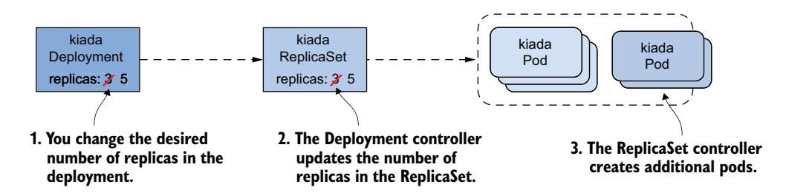
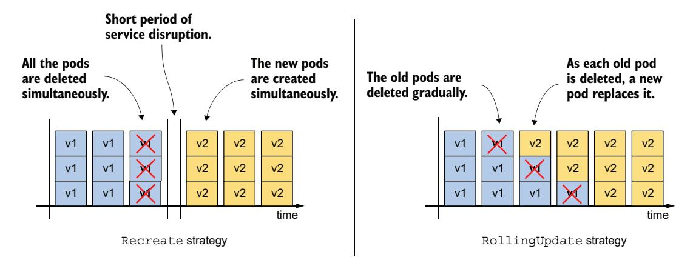
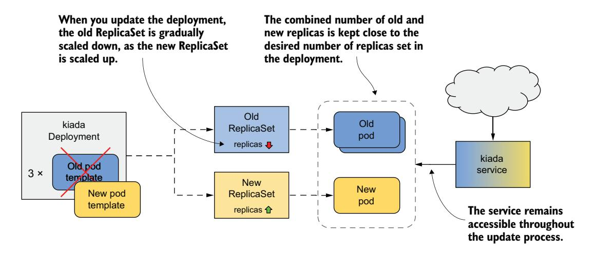
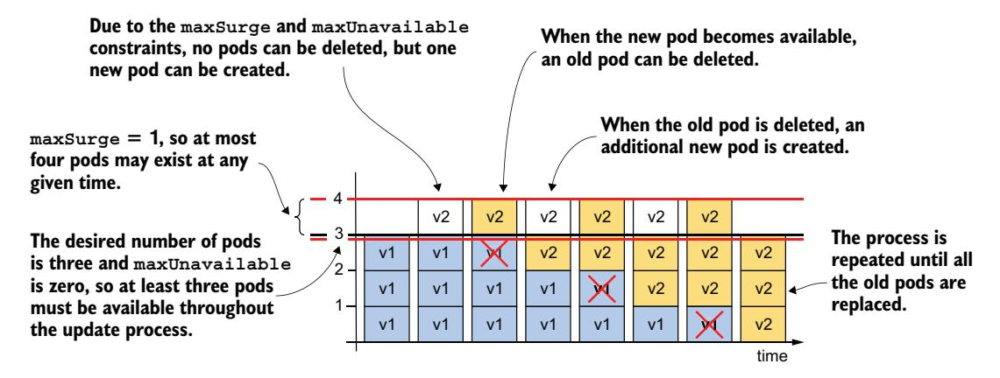
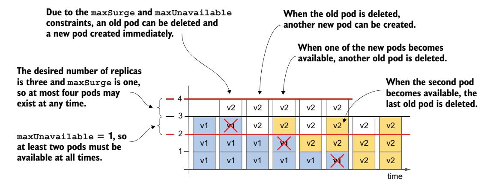
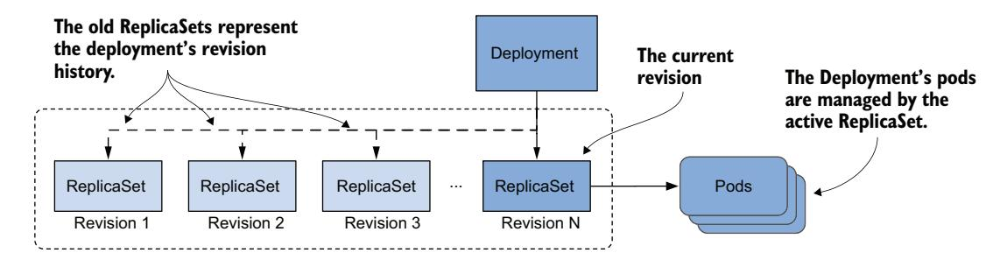
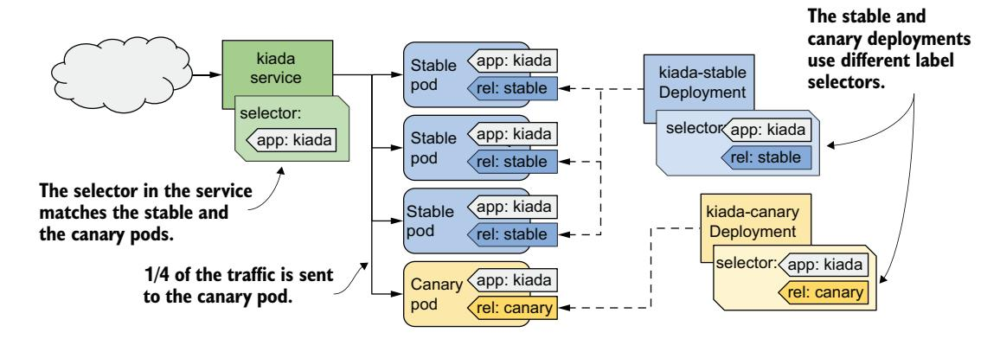
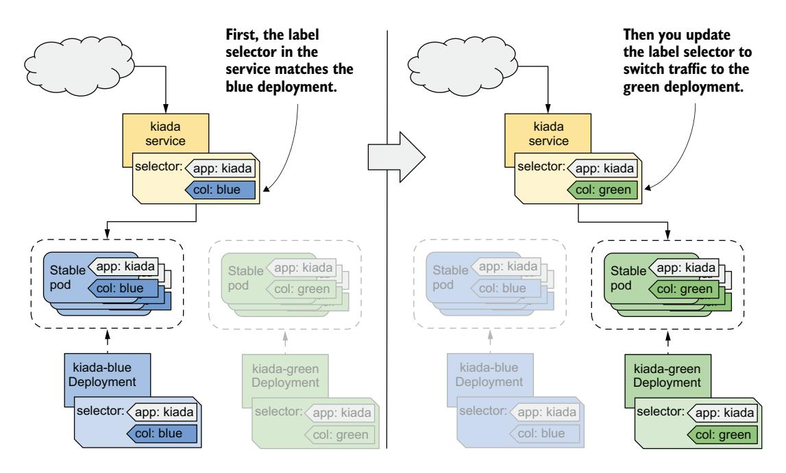

# *Automating application updates with Deployments*

# *This chapter covers*

- Deploying stateless workloads with the Deployment object
- Horizontal scaling of Deployments
- How to update workloads declaratively
- Preventing rollouts of faulty workloads
- Various deployment strategies

In the previous chapter, you learned how to deploy pods via ReplicaSets. However, workloads are rarely deployed this way because ReplicaSets don't provide the functionality for seamless pod updates. This functionality is provided by the Deployment object type. By the end of this chapter, each of the three services in the Kiada suite will have its own Deployment object.

 Before we begin, make sure that the Pods, Services, and other objects of the Kiada suite are present in your cluster. If you followed the exercises in the previous chapter, they should already be there. If not, you can create them by establishing the kiada namespace and applying all the manifests in the Chapter15/SETUP/ directory with the following command:

\$ **kubectl apply -f SETUP -R**

**NOTE** The code files for this chapter are available at https://github.com/luksa/kubernetes-in-action-2nd-edition/tree/master/Chapter15.

# 15.1 Introducing Deployments

A workload is typically deployed to Kubernetes by creating a Deployment object. A Deployment object doesn't manage the Pod objects directly but through a ReplicaSet object that's generated automatically when the Deployment is created. As shown in figure 15.1, the Deployment controls the ReplicaSet, which in turn controls the individual pods.


Figure 15.1 The relationship between Deployments, ReplicaSets and pods

A Deployment allows you to update the application declaratively, meaning that rather than manually performing a series of operations to replace a set of pods with ones running an updated version of your application, you just update the configuration in the Deployment object and let Kubernetes automate the update.

As with ReplicaSets, you specify a Pod template, the desired number of replicas, and a label selector in a Deployment. The pods created based on this Deployment are exact replicas of each other and are fungible. For this and other reasons, Deployments are mainly used for stateless workloads, but you can also use them to run a single instance of a stateful workload. However, because there's no built-in way to prevent users from scaling the Deployment to multiple instances, the application itself must ensure that only a single instance is active when multiple replicas are running simultaneously.

**NOTE** To run replicated stateful workloads, a *StatefulSet* is the better option. You'll learn about them in the next chapter.

# 15.1.1 Creating a Deployment

In this section, you'll replace the kiada ReplicaSet with a Deployment. Delete the ReplicaSet without deleting the pods using

#### \$ kubectl delete rs kiada --cascade=orphan

Let's see what you need to include in the spec section of a Deployment and how it compares to that of the ReplicaSet.

## INTRODUCING THE DEPLOYMENT SPEC

The spec section of a Deployment object isn't much different from that of a Replica-Set. As shown in table 15.1, the main fields are the same as the ones in a ReplicaSet, with only one additional field.

Table 15.1 The main fields to be specified in a Deployment's spec section

| Field name | Description                                                                                                                                                                                                                                |
|------------|--------------------------------------------------------------------------------------------------------------------------------------------------------------------------------------------------------------------------------------------|
| replicas   | The desired number of replicas. When you create the Deployment object, Kubernetes<br>creates this number of pods from the Pod template. The same number of pods is<br>retained until you delete the Deployment.                            |
| selector   | The label selector contains either a map of labels in the matchLabels subfield or a list<br>of label selector requirements in the matchExpressions subfield. Pods that match the<br>label selector are considered part of this Deployment. |
| template   | The Pod template for the Deployment's pods. When a new pod needs to be created, the<br>object is created using this template.                                                                                                              |
| strategy   | The update strategy defines how pods in this Deployment are replaced when you update<br>the Pod template.                                                                                                                                  |

The replicas, selector, and template fields serve the same purpose as those in Replica-Sets. In the additional strategy field, you can configure the update strategy that Kubernetes will apply when updating this Deployment.

#### CREATING A DEPLOYMENT MANIFEST FROM SCRATCH

When creating a new Deployment manifest, most of us usually copy an existing manifest file and modify it. However, if you don't have an existing manifest handy, there's a clever way to create the manifest file from scratch.

 You may remember that you first created a Deployment in chapter 3 using the following command:

#### \$ **kubectl create deployment kiada --image=luksa/kiada:0.1**

But since this command creates the object directly instead of the manifest file, it's not quite what you want. However, you may recall from chapter 5 that you can pass the --dry-run=client and -o yaml options to the kubectl create command if you want to create an object manifest without posting it to the API. So, to create a rough version of a Deployment manifest file, you can use

```
$ kubectl create deployment my-app --image=my-image \
 --dry-run=client -o yaml > deploy.yaml
```

The manifest file can then be edited to make final changes, such as adding additional containers and volumes or changing the existing container definition. However, since you already have a manifest file for the kiada ReplicaSet, the fastest option is to turn it into a Deployment manifest.

### CREATING A DEPLOYMENT MANIFEST FROM A POD OR REPLICASET MANIFEST

Creating a Deployment manifest is trivial if you already have the ReplicaSet manifest. You just need to copy the rs.kiada.versionLabel.yaml file to deploy.kiada.yaml, for example, and then edit it to change the kind field from ReplicaSet to Deployment. While you're at it, also change the number of replicas from two to three. Your Deployment manifest should look like the following listing.

## Listing 15.1 The kiada Deployment object manifest

```
apiVersion: apps/v1
kind: Deployment 
metadata:
 name: kiada
spec:
 replicas: 3 
 selector: 
 matchLabels: 
 app: kiada 
 rel: stable 
 template: 
 metadata: 
 labels: 
 app: kiada 
 rel: stable 
 ver: '0.5' 
 spec: 
 ... 
                                  Instead of ReplicaSet, the 
                                  object kind is Deployment.
                          You want the Deployment 
                          to run three replicas.
                            The label selector matches the one 
                            in the kiada ReplicaSet you created 
                            in the previous chapter.
                              The Pod template also 
                              matches the one in the 
                              ReplicaSet.
```

#### CREATING AND INSPECTING THE DEPLOYMENT OBJECT

To create the Deployment object from the manifest file, use the kubectl apply command. You can use the usual commands such as kubectl get deployment and kubectl describe deployment to get information about the Deployment you created. For example,

```
$ kubectl get deploy kiada
NAME READY UP-TO-DATE AVAILABLE AGE
kiada 3/3 3 3 25s
```

NOTE The shorthand for deployment is deploy.

The pod number information that the kubectl get command displays is read from the readyReplicas, replicas, updatedReplicas, and availableReplicas fields in the status section of the Deployment object. Use the -o yaml option to see the full status.

NOTE Use the wide output option (-o wide) with kubectl get deploy to display the label selector and the container names and images used in the Pod template.

If you just want to know whether the Deployment rollout was successful, you can also use the following command:

#### **\$ kubectl rollout status deployment kiada**

Waiting for deployment "kiada" rollout to finish: 0 of 3 updated replicas are available...

Waiting for deployment "kiada" rollout to finish: 1 of 3 updated replicas are available...

Waiting for deployment "kiada" rollout to finish: 2 of 3 updated replicas are available...

deployment "kiada" successfully rolled out

If you run this command immediately after creating the Deployment, you can track how the Deployment of pods is progressing. According to the output of the command, the Deployment has successfully rolled out the three pod replicas.

TIP If you're creating a Deployment in a shell script and need to wait for it to become ready before running additional commands, you can use the command kubectl wait --for condition=Available deployment/deployment-name.

Now list the pods that belong to the Deployment. It uses the same selector as the ReplicaSet from the previous chapter, so you should see three pods, right? To check, list the pods with the label selector app=kiada,rel=stable as follows:

| \$ kubectl get pods -l app=kiada,rel=stable |       |         |          |     |                                                                 |
|---------------------------------------------|-------|---------|----------|-----|-----------------------------------------------------------------|
| NAME                                        | READY | STATUS  | RESTARTS | AGE | These two pods                                                  |
| kiada-4t87s                                 | 2/2   | Running | 0        | 16h | are older than the<br>other three pods.                         |
| kiada-5lg8b                                 | 2/2   | Running | 0        | 16h |                                                                 |
| kiada-7bffb9bf96-4knb6                      | 2/2   | Running | 0        | 6m  |                                                                 |
| kiada-7bffb9bf96-7g2md                      | 2/2   | Running | 0        | 6m  | Given the age of                                                |
| kiada-7bffb9bf96-qf4t7                      | 2/2   | Running | 0        | 6m  | these pods, they like<br>the pods created by<br>the Deployment. |

Surprisingly, there are five pods that match the selector. The first two are those created by the ReplicaSet from the previous chapter, while the last three were created by the Deployment. Although the label selector in the Deployment matches the two existing pods, they weren't picked up like you would expect. How come?

 At the beginning of this chapter, I explained that the Deployment doesn't directly control the pods but delegates this task to an underlying ReplicaSet. Let's take a quick look at this ReplicaSet:

#### \$ **kubectl get rs** NAME DESIRED CURRENT READY AGE kiada-7bffb9bf96 3 3 3 17m

You'll notice that the name of the ReplicaSet isn't simply kiada—it also contains an alphanumeric suffix (-7bffb9bf96) that seems to be randomly generated like the names of the pods. Let's find out what it is. Let's take a closer look at the ReplicaSet:

#### \$ **kubectl describe rs kiada** Name: kiada-7bffb9bf96

Namespace: kiada

**The kubectl describe command doesn't require you to type the full name of an object, so just typing part of the name suffices.**

```
Selector: app=kiada,pod-template-hash=7bffb9bf96,rel=stable 
  Labels: app=kiada
   pod-template-hash=7bffb9bf96 
   rel=stable
   ver=0.5
  Annotations: deployment.kubernetes.io/desired-replicas: 3
   deployment.kubernetes.io/max-replicas: 4
   deployment.kubernetes.io/revision: 1
  Controlled By: Deployment/kiada 
  Replicas: 3 current / 3 desired
  Pods Status: 3 Running / 0 Waiting / 0 Succeeded / 0 Failed
  Pod Template:
   Labels: app=kiada
   pod-template-hash=7bffb9bf96 
   rel=stable
   ver=0.5
   Containers:
   ...
                                                               The ReplicaSet's
                                                                 label selector
                                                                 doesn't quite
                                                              match the one in
                                                               the Deployment.
An additional pod-template-hash label appears 
in both the ReplicaSet's and the pod's labels.
                                                                 This ReplicaSet 
                                                                 is owned and 
                                                                 controlled by 
                                                                 the kiada 
                                                                 Deployment.
```

The Controlled By line indicates that this ReplicaSet has been created and is owned and controlled by the kiada Deployment. You'll notice that the Pod template, selector, and the ReplicaSet itself contain an additional label key pod-template-hash that you never defined in the Deployment object. The value of this label matches the last part of the ReplicaSet's name. This additional label is why the two existing pods weren't acquired by this ReplicaSet. List the pods with all their labels to see how they differ:

```
$ kubectl get pods -l app=kiada,rel=stable --show-labels
NAME ... LABELS
kiada-4t87s ... app=kiada,rel=stable,ver=0.5 
kiada-5lg8b ... app=kiada,rel=stable,ver=0.5 
kiada-7bffb9bf96-4knb6 ... app=kiada,pod-template-
    hash=7bffb9bf96,rel=stable,ver=0.5 
kiada-7bffb9bf96-7g2md ... app=kiada,pod-template-
    hash=7bffb9bf96,rel=stable,ver=0.5 
kiada-7bffb9bf96-qf4t7 ... app=kiada,pod-template-
    hash=7bffb9bf96,rel=stable,ver=0.5 
                                                               The two Pods that 
                                                               existed before do 
                                                               not have the pod-
                                                               template-hash 
                                                               label.
                                                             The three that 
                                                             were created by 
                                                             the Deployment do.
```

As figure 15.2 shows, when the ReplicaSet was created, the ReplicaSet controller couldn't find any pods that matched the label selector, so it created three new pods. If you had added this label to the two existing pods before creating the Deployment, they'd have been picked up by the ReplicaSet.

 The value of the pod-template-hash label isn't random but calculated from the contents of the Pod template. Because the same value is used for the ReplicaSet name, the name depends on the Pod template contents. It follows that every time you change the Pod template, a new ReplicaSet is created. You'll learn more about this in section 15.2, which explains Deployment updates.


**Although the labels of these pods match the label selector defined in the deployment, they are ignored because they don't match the ReplicaSet's label selector.**

Figure 15.2 Label selectors in the Deployment and ReplicaSet, and the labels in the pods

You can now delete the two Kiada pods that aren't part of the Deployment. To do this, use the kubectl delete command with a label selector that selects only the pods that have the labels app=kiada and rel=stable and don't have the label pod-template-hash. This is what the full command looks like:

\$ **kubectl delete po -l 'app=kiada,rel=stable,!pod-template-hash'**

# Troubleshooting Deployments that fail to produce any pods

Under certain circumstances, when creating a Deployment, pods may not appear. Troubleshooting in this case is easy if you know where to look. To try this out yourself, apply the manifest file deploy.where-are-the-pods.yaml, which will create a Deployment object called where-are-the-pods. You'll notice that no pods are created for this Deployment, even though the desired number of replicas is three. To troubleshoot, you can inspect the Deployment object with kubectl describe. The Deployment's events don't show anything useful, but its conditions do:

#### \$ **kubectl describe deploy where-are-the-pods**

| <br>Conditions: |       |                            |
|-----------------|-------|----------------------------|
| Type            |       | Status Reason              |
|                 |       |                            |
| Progressing     | True  | NewReplicaSetCreated       |
| Available       | False | MinimumReplicasUnavailable |
| ReplicaFailure  | True  | FailedCreate               |

**The ReplicaFailure conditions indicate that a replica failed to be created.**

The ReplicaFailure condition is True, indicating an error. The reason for the error is FailedCreate, which doesn't mean much. However, if you look at the conditions in the status section of the Deployment's YAML manifest, you'll notice that the message field of the ReplicaFailure condition tells you exactly what happened. Alternatively, you can examine the ReplicaSet and its events to see the same message as follows:

#### \$ **kubectl describe rs where-are-the-pods-67cbc77f88**

| <br>Events:                                                                                               |        |     |                                                                     |         |  |  |
|-----------------------------------------------------------------------------------------------------------|--------|-----|---------------------------------------------------------------------|---------|--|--|
| Type                                                                                                      | Reason | Age | From                                                                | Message |  |  |
|                                                                                                           |        |     |                                                                     |         |  |  |
|                                                                                                           |        |     | Warning FailedCreate 61s (x18 over 11m) replicaset-controller Error |         |  |  |
| creating: pods "where-are-the-pods-67cbc77f88-" is forbidden: error looking                               |        |     |                                                                     |         |  |  |
| up service account default/missing-service-account: serviceaccount<br>"missing-service-account" not found |        |     |                                                                     |         |  |  |

There are many possible reasons why the ReplicaSet controller can't create a pod, but they're usually related to user privileges. In this example, the ReplicaSet controller couldn't create the pod because a service account is missing. The most important conclusion from this exercise is that if pods don't appear after you create (or update) a Deployment, you should look for the cause in the underlying ReplicaSet.

# *15.1.2 Scaling a Deployment*

Scaling a Deployment is no different from scaling a ReplicaSet. When you scale a Deployment, the Deployment controller does nothing but scale the underlying Replica-Set, leaving the ReplicaSet controller to do the rest, as shown in figure 15.3.



Figure 15.3 Scaling a Deployment

#### SCALING A DEPLOYMENT

You can scale a Deployment by editing the object with the kubectl edit command and changing the value of the replicas field, by changing the value in the manifest file and reapplying it, or by using the kubectl scale command. For example, scale the kiada Deployment to five replicas as follows:

```
$ kubectl scale deploy kiada --replicas 5
deployment.apps/kiada scaled
```

...

If you list the pods, you'll see that there are now five kiada pods. If you check the events associated with the Deployment using the kubectl describe command, you'll see that the Deployment controller has scaled the ReplicaSet.

#### \$ **kubectl describe deploy kiada**

Events: Type Reason Age From Message ---- ------ ---- ---- ------- Normal ScalingReplicaSet 4s deployment-controller Scaled up replica set kiada- 7bffb9bf96 to 5

If you check the events associated with the ReplicaSet using kubectl describe rs kiada, you'll see that it was indeed the ReplicaSet controller that created the pods.

 Everything you learned about ReplicaSet scaling and how the ReplicaSet controller ensures that the actual number of pods always matches the desired number of replicas also applies to pods deployed via a Deployment.

#### SCALING A REPLICASET OWNED BY A DEPLOYMENT

You might wonder what happens when you scale a ReplicaSet object owned and controlled by a Deployment. Let's find out. First, start watching ReplicaSets by running

#### \$ **kubectl get rs -w**

Now scale the kiada-7bffb9bf96 ReplicaSet by running the following command in another terminal:

```
$ kubectl scale rs kiada-7bffb9bf96 --replicas 7
replicaset.apps/kiada-7bffb9bf96 scaled
```

If you look at the output of the first command, you'll see that the desired number of replicas goes up to seven but is soon reverted to five. This happens because the Deployment controller detects that the desired number of replicas in the ReplicaSet no longer matches the number in the Deployment object and so it changes it back.

NOTE If you make changes to an object that is owned by another object, you should expect that your changes will be undone by the controller that manages the object.

Depending on whether the ReplicaSet controller noticed the change before the Deployment controller undid it, it may have created two new pods. But when the Deployment controller then reset the desired number of replicas back to five, the ReplicaSet controller deleted the pods.

 As you might expect, the Deployment controller will undo any changes you make to the ReplicaSet, not just when you scale it. Even if you delete the ReplicaSet object, the Deployment controller will recreate it. Feel free to try this now.

#### INADVERTENTLY SCALING A DEPLOYMENT

As we conclude this section on Deployment scaling, I need to warn you about a scenario in which you might accidentally scale a Deployment without meaning to. In the Deployment manifest you applied to the cluster, the desired number of replicas was three. Then you changed it to five with the kubectl scale command. Imagine doing the same thing in a production cluster (e.g., because you need five replicas to handle all the traffic that the application is receiving).

 Then you notice that you forgot to add the app and rel labels to the Deployment object. You added them to the Pod template inside the Deployment object, but not to the object itself. This doesn't affect the operation of the Deployment, but you want all your objects to be nicely labelled, so you decide to add the labels now. You could use the kubectl label command, but you'd rather fix the original manifest file and reapply it. This way, when you use the file to create the Deployment in the future, it'll contain the labels you want.

 To see what happens in this case, apply the manifest file deploy.kiada.labelled .yaml. The only difference from the original manifest file deploy.kiada.yaml are the labels added to the Deployment. If you list the pods after applying the manifest, you'll see that you no longer have five pods in your Deployment. Two of the pods have been deleted:

|  |  |  |  |  | \$ kubectl get pods -l app=kiada |
|--|--|--|--|--|----------------------------------|
|--|--|--|--|--|----------------------------------|

| READY | STATUS      | RESTARTS | AGE |                |
|-------|-------------|----------|-----|----------------|
| 2/2   | Running     | 0        | 46m |                |
| 2/2   | Running     | 0        | 46m |                |
| 2/2   | Terminating | 0        | 5m  |                |
| 2/2   | Running     | 0        | 46m | Two pods are   |
| 2/2   | Terminating | 0        | 5m  | being deleted. |
|       |             |          |     |                |

To see why, check the Deployment object:

#### \$ **kubectl get deploy** NAME READY UP-TO-DATE AVAILABLE AGE kiada 3/3 3 3 46m

The Deployment is now configured to have only three replicas, instead of the five it had before you applied the manifest. However, you never intended to change the number of replicas, only to add labels to the Deployment object. So, what happened?

 The reason that applying the manifest changed the desired number of replicas is that the replicas field in the manifest file is set to 3. You might think that removing this field from the updated manifest would have prevented the problem, but in fact, it would make the problem worse. Try applying the deploy.kiada.noReplicas.yaml manifest file that doesn't contain the replicas field to see what happens.

 If you apply the file, you'll only have one replica left. That's because the Kubernetes API sets the value to 1 when the replicas field is omitted. Even if you explicitly set the value to null, the effect is the same.

 Imagine this happening in your production cluster when the load on your application is so high that dozens or hundreds of replicas are needed to handle the load. An innocuous update like the one in this example would severely disrupt the service.

 You can prevent this by not specifying the replicas field in the original manifest when you create the Deployment object. If you forget to do this, you can still repair the existing Deployment object by running

#### \$ **kubectl apply edit-last-applied deploy kiada**

This command opens the contents of the kubectl.kubernetes.io/last-appliedconfiguration annotation of the Deployment object in a text editor and allows you to remove the replicas field. When you save the file and close the editor, the annotation in the Deployment object is updated. From that point on, updating the Deployment with kubectl apply no longer overwrites the desired number of replicas, as long as you don't include the replicas field.

NOTE When you use kubectl apply, the value of the kubectl.kubernetes.io/ last-applied-configuration is used to calculate the changes needed to be made to the API object.

TIP To avoid accidentally scaling a Deployment each time you reapply its manifest file, omit the replicas field in the manifest when you create the object. You initially only get one replica, but you can easily scale the Deployment to suit your needs.

# *15.1.3 Deleting a Deployment*

Before we get to Deployment updates, which are the most important aspect of Deployments, let's take a quick look at what happens when you delete a Deployment. After learning what happens when you delete a ReplicaSet, you probably already know that when you delete a Deployment object, the underlying ReplicaSet and pods are also deleted.

#### PRESERVING THE REPLICASET AND PODS WHEN DELETING A DEPLOYMENT

If you want to keep the pods, you can run the kubectl delete command with the --cascade=orphan option, as you can with a ReplicaSet. If you use this approach with a Deployment, you'll find that this not only preserves the pods, but also the ReplicaSets. The pods still belong to and are controlled by that ReplicaSet.

#### ADOPTING AN EXISTING REPLICASET AND PODS

If you recreate the Deployment, it picks up the existing ReplicaSet, assuming you haven't changed the Deployment's Pod template in the meantime. This happens because the Deployment controller finds an existing ReplicaSet with a name that matches the ReplicaSet that the controller would otherwise create.

# *15.2 Updating a Deployment*

In the previous section, where you learned about the basics of Deployments, you probably couldn't see any advantage of using a Deployment instead of a ReplicaSet. The advantage only becomes clear when you update the Pod template in the Deployment. You may recall that this has no immediate effect with a ReplicaSet. The updated template is only used when the ReplicaSet controller creates a new pod. However, when you update the Pod template in a Deployment, the pods are replaced immediately.

 The Kiada pods are currently running version 0.5 of the application, which you'll now update to version 0.6. You can find the files for this new version in the directory Chapter15/kiada-0.6. You can build the container image yourself or use the image luksa/kiada:0.6 that I created.

#### INTRODUCING THE AVAILABLE UPDATE STRATEGIES

When you update the Pod template to use the new container image, the Deployment controller stops the pods running with the old image and replaces them with the new pods. The way the pods are replaced depends on the update strategy configured in the Deployment. At the time of writing, Kubernetes supports the two strategies described in table 15.2.

Table 15.2 Update strategies supported by Deployments

| Strategy type | Description                                                                                                                                                                                                                                                                                                                                                                                                                                       |
|---------------|---------------------------------------------------------------------------------------------------------------------------------------------------------------------------------------------------------------------------------------------------------------------------------------------------------------------------------------------------------------------------------------------------------------------------------------------------|
| Recreate      | In the Recreate strategy, all pods are deleted simultaneously, and then, when<br>all their containers are finished, the new pods are created simultaneously. For<br>a short time, while the old Pods are being terminated and before the new pods<br>are ready, the service is unavailable. Use this strategy if your application<br>doesn't allow you to run the old and new versions at the same time and ser<br>vice downtime isn't a problem. |
| RollingUpdate | The RollingUpdate strategy causes old pods to be gradually removed and<br>replaced with new ones. When a pod is removed, Kubernetes waits until the<br>new pod is ready before removing the next pod. This way, the service provided<br>by the pods remains available throughout the upgrade process. This is the<br>default strategy.                                                                                                            |

Figure 15.4 illustrates the difference between the two strategies. It shows how the pods are replaced over time for each of the strategies.

 The Recreate strategy has no configuration options, while the RollingUpdate strategy lets you configure how many pods Kubernetes replaces at a time. You'll learn more about this later.



Figure 15.4 The difference between the Recreate and the RollingUpdate strategies

#### 15.2.1 The Recreate strategy

The Recreate strategy is much simpler than RollingUpdate, so we cover it first. Since you didn't specify the strategy in the Deployment object, it defaults to RollingUpdate, so you need to change it before triggering the update.

#### CONFIGURING THE DEPLOYMENT TO USE THE RECREATE STRATEGY

To configure a Deployment to use the Recreate update strategy, you must include the lines highlighted in the following listing in your Deployment manifest. You can find this manifest in the deploy.kiada.recreate.yaml file.

#### Listing 15.2 Enabling the Recreate update strategy in a Deployment

```
spec:
strategy:
type: Recreate
replicas: 3
...

This is how you enable the Recreate\nupdate strategy in a Deployment.
```

You can add these lines to the Deployment object by editing it with the kubectl edit command or by applying the updated manifest file with kubectl apply. Since this change doesn't affect the Pod template, it doesn't trigger an update. Changing the Deployment's labels, annotations, or the desired number of replicas also doesn't trigger it.

#### UPDATING THE CONTAINER IMAGE WITH KUBECTL SET IMAGE

To update the pods to the new version of the Kiada container image, you need to update the image field in the kiada container definition within the Pod template. You can do this by updating the manifest with kubectl edit or kubectl apply, but for a simple image change, you can also use the kubectl set image command. With this

command, it is possible to change the image name of any container in any API object that includes containers. This applies to Deployments, ReplicaSets, and even pods. For example, you could use the following command to update the kiada container in your kiada Deployment to use version 0.6 of the luksa/kiada container image:

#### **\$ kubectl set image deployment kiada kiada=luksa/kiada:0.6**

However, since the Pod template in your Deployment also specifies the application version in the pod labels, changing the image without also changing the label value would result in an inconsistency.

## UPDATING THE CONTAINER IMAGE AND LABELS USING KUBECTL PATCH

To change the image name and label value at the same time, you can use the kubectl patch command, which lets you update multiple manifest fields without having to manually edit the manifest or apply an entire manifest file. To update both the image name and the label value, you could run the following command:

```
$ kubectl patch deploy kiada --patch '{"spec": {"template": {"metadata": 
{"labels": {"ver": "0.6"}}, "spec": {"containers": [{"name": "kiada", 
"image": "luksa/kiada:0.6"}]}}}}'
```

This command may be hard for you to parse because the patch is given as a single-line JSON string. In this string, you'll find a partial Deployment manifest that contains only the fields you want to change. If you specify the patch in a multi-line YAML string, it'll be much clearer. The complete command then looks as follows:

```
$ kubectl patch deploy kiada --patch ' 
spec: 
 template: 
 metadata: 
 labels: 
 ver: "0.6" 
 spec: 
 containers: 
 - name: kiada 
 image: luksa/kiada:0.6' 
                                                   Note the single quote 
                                                   at the end of this line.
                                           A partial Deployment 
                                           manifest that specifies 
                                           only the fields you 
                                           want to update
```

NOTE You can also write this partial manifest to a file and use --patch-file instead of --patch.

Now run one of the kubectl patch commands to update the Deployment, or apply the manifest file deploy.kiada.0.6.recreate.yaml to get the same result.

#### OBSERVING THE POD STATE CHANGES DURING AN UPDATE

Immediately after you update the Deployment, run the following command repeatedly to observe what happens to the pods:

```
$ kubectl get po -l app=kiada -L ver
```

This command lists the kiada Pods and displays the value of their version label in the VER column. You'll notice that the status of all these pods changes to Terminating at the same time:

| NAME                   | READY | STATUS      | RESTARTS | AGE   | VER |
|------------------------|-------|-------------|----------|-------|-----|
| kiada-7bffb9bf96-7w92k | 0/2   | Terminating | 0        | 3m38s | 0.5 |
| kiada-7bffb9bf96-h8wnv | 0/2   | Terminating | 0        | 3m38s | 0.5 |
| kiada-7bffb9bf96-xgb6d | 0/2   | Terminating | 0        | 3m38s | 0.5 |

The pods soon disappear but are immediately replaced by pods that run the new version:

| NAME                   | READY | STATUS            | RESTARTS | AGE | VER |
|------------------------|-------|-------------------|----------|-----|-----|
| kiada-5d5c5f9d76-5pghx | 0/2   | ContainerCreating | 0        | 1s  | 0.6 |
| kiada-5d5c5f9d76-qfkts | 0/2   | ContainerCreating | 0        | 1s  | 0.6 |
| kiada-5d5c5f9d76-vkdrl | 0/2   | ContainerCreating | 0        | 1s  | 0.6 |

**These pods run the new version of the application.**

After a few seconds, all new pods are ready. The whole process is very fast, but you can repeat it as many times as you want. Revert the Deployment by applying the previous version of the manifest in the deploy.kiada.recreate.yaml file, wait until the pods are replaced, and then update to version 0.6 by applying the deploy.kiada.0.6.recreate .yaml file again.

#### UNDERSTANDING HOW AN UPDATE USING THE RECREATE STRATEGY AFFECTS SERVICE AVAILABILITY

In addition to watching the Pod list, try to access the service while the update is in progress via the Ingress or Gateway in your web browser, as described in chapters 12 and 13.

 You'll notice the short time interval when the Ingress proxy returns the status 503 Service Temporarily Unavailable. If you try to access the service directly using the internal cluster IP, you'll find that the connection is rejected during this time.

#### UNDERSTANDING THE RELATIONSHIP BETWEEN A DEPLOYMENT AND ITS REPLICASETS

When you list the pods, you'll notice that the names of the pods that ran version 0.5 are different from those that run version 0.6. The names of the old pods start with kiada-7bffb9bf96, while the names of the new pods start with kiada-5d5c5f9d76. You may recall that pods created by a ReplicaSet get their names from that ReplicaSet. The name change indicates that these new pods belong to a different ReplicaSet. List the ReplicaSets to confirm this as follows:

| \$ kubectl get rs -L ver |         |         |       |     |     | This is the ReplicaSet<br>that manages the |
|--------------------------|---------|---------|-------|-----|-----|--------------------------------------------|
| NAME                     | DESIRED | CURRENT | READY | AGE | VER | pods running the new                       |
| kiada-5d5c5f9d76         | 3       | 3       | 3     | 13m | 0.6 | application version.                       |
| kiada-7bffb9bf96         | 0       | 0       | 0     | 16m | 0.5 |                                            |

**This is the ReplicaSet that managed the pods with the old version. It now has no pods.**

NOTE The labels you specify in the Pod template in a Deployment are also applied to the ReplicaSet. So, if you add a label with the version number of the application, you can see the version when you list the ReplicaSets. This way, you can easily distinguish between different ReplicaSets since you can't do that by looking at their names.

When you originally created the Deployment, only one ReplicaSet was created and all pods belonged to it. When you updated the Deployment, a new ReplicaSet was created. Now all the pods of this Deployment are controlled by this ReplicaSet, as shown in figure 15.5.


Figure 15.5 Updating a Deployment

#### UNDERSTANDING HOW THE DEPLOYMENT'S PODS TRANSITIONED FROM ONE REPLICASET TO THE OTHER

If you'd been watching the ReplicaSets when you triggered the update, you'd have seen the following progression. At the beginning, only the old ReplicaSet was present:

| NAME<br>kiada-7bffb9bf96 | DESIRED<br>3 | CURRENT<br>3 | READY<br>3 | AGE<br>16m | VER<br>0.5 | This is the only<br>ReplicaSet. All three<br>pods are part of it. |  |
|--------------------------|--------------|--------------|------------|------------|------------|-------------------------------------------------------------------|--|
|--------------------------|--------------|--------------|------------|------------|------------|-------------------------------------------------------------------|--|

The Deployment controller then scaled the ReplicaSet to zero replicas, causing the ReplicaSet controller to delete all the pods:

| NAME             | DESIRED | CURRENT | READY | AGE | VER | All the pod      |
|------------------|---------|---------|-------|-----|-----|------------------|
| kiada-7bffb9bf96 | 0       | 0       | 0     | 16m | 0.5 | counts are zero. |

Next, the Deployment controller created the new ReplicaSet and configured it with three replicas.

| NAME<br>kiada-5d5c5f9d76<br>kiada-7bffb9bf96 | DESIRED<br>3<br>0 | CURRENT<br>0<br>0 | READY<br>0<br>0 | AGE<br>0s<br>16m | VER<br>0.6<br>0.5 | The desired<br>number of replicas<br>is three, but there<br>are no pods yet. |
|----------------------------------------------|-------------------|-------------------|-----------------|------------------|-------------------|------------------------------------------------------------------------------|
|                                              |                   |                   |                 |                  |                   |                                                                              |

**The old ReplicaSet is still here but has no pods.**

The ReplicaSet controller creates the three new pods, as indicated by the number in the CURRENT column. When the containers in these pods start and begin accepting connections, the value in the READY column also changes to three.

| NAME             | DESIRED | CURRENT | READY | AGE | VER |   | has three replicaset |
|------------------|---------|---------|-------|-----|-----|---|----------------------|
| kiada-5d5c5f9d76 | 3       | 3       | 0     | 1s  | 0.6 | < | but none are ready   |
| kiada-7bffb9bf96 | 0       | 0       | 0     | 16m | 0.5 |   | yet. They become     |
|                  |         |         |       |     |     |   | ready moments after. |

**NOTE** You can see what the Deployment controller and the ReplicaSet controller did by looking at the events associated with the Deployment object and the two ReplicaSets.

The update is now complete. If you open the Kiada service in your web browser, you should see the updated version. In the lower right corner, you'll see four boxes indicating the version of the pod that processed the browser's request for each of the HTML, CSS, JavaScript, and the main image file. These boxes will be useful when you perform a rolling update to version 0.7 in the next section.

#### **15.2.2** The RollingUpdate strategy

The service disruption associated with the Recreate strategy is usually not acceptable. That's why the default strategy in Deployments is RollingUpdate. When you use this strategy, the pods are replaced gradually, by scaling down the old ReplicaSet and simultaneously scaling up the new ReplicaSet by the same number of replicas. The Service is never left without pods to which to forward traffic (figure 15.6).



Figure 15.6 What happens with the ReplicaSets, pods, and the Service during a rolling update

### CONFIGURING THE DEPLOYMENT TO USE THE ROLLINGUPDATE STRATEGY

To configure a Deployment to use the RollingUpdate update strategy, you must set its strategy field as shown in the following listing. You can find this manifest in the file deploy.kiada.0.7.rollingUpdate.yaml.

Listing 15.3 Enabling the **RollingUpdate** strategy in a Deployment

```
apiVersion: apps/v1
kind: Deployment
metadata:
 name: kiada
spec:
 strategy:
 type: RollingUpdate 
 rollingUpdate: 
 maxSurge: 0 
 maxUnavailable: 1 
 minReadySeconds: 10
 replicas: 3
 selector:
 ...
                                     The RollingUpdate 
                                     strategy is enabled 
                                     through this field.
                                       The parameters for the strategy 
                                       are configured here. These two 
                                       parameters are explained later.
```

In the strategy section, the type field sets the strategy to RollingUpdate, while the maxSurge and maxUnavailable parameters in the rollingUpdate subsection configure how the update should be performed. You could omit this entire subsection and set only the type, but since the default values of the maxSurge and maxUnavailable parameters make it difficult to explain the update process, you set them to the values shown in the listing to make it easier to follow the update process. Don't worry about these two parameters for now, because they'll be explained later.

 You may have noticed that the Deployment's spec in listing 15.3 also includes the minReadySeconds field. Although this field isn't part of the update strategy, it affects how fast the update progresses. By setting this field to 10, you'll be able to follow the progression of the rolling update even better. You'll learn what this attribute does by the end of this chapter.

#### UPDATING THE IMAGE NAME IN THE MANIFEST

In addition to setting the strategy and minReadySeconds in the Deployment manifest, let's also set the image name to luksa/kiada:0.7 and update the version label, so that when you apply this manifest file, the update is triggered immediately. This is to show that you can change the strategy and trigger an update in a single kubectl apply operation. You don't have to change the strategy beforehand for it to be used in the update.

# TRIGGERING THE UPDATE AND OBSERVING THE ROLLOUT OF THE NEW VERSION

To start the rolling update, apply the manifest file deploy.kiada.0.7.rollingUpdate .yaml. You can track the progress of the rollout with the kubectl rollout status command, but it only shows the following:

#### \$ **kubectl rollout status deploy kiada**

Waiting for deploy "kiada" rollout to finish: 1 out of 3 new replicas have been updated...

Waiting for deploy "kiada" rollout to finish: 2 out of 3 new replicas have been updated...

Waiting for deploy "kiada" rollout to finish: 2 of 3 updated replicas are available...

deployment "kiada" successfully rolled out

To see exactly how the Deployment controller performs the update, it's best to look at how the state of the underlying ReplicaSets changes. First, the ReplicaSet with version 0.6 runs all three pods. The ReplicaSet for version 0.7 doesn't exist yet. The Replica-Set for the previous version 0.5 is also there, but let's ignore it, as it's not involved in this update. The initial state of 0.6 ReplicaSet is as follows:

|                  |         |         |       |     |     | All three pods are |
|------------------|---------|---------|-------|-----|-----|--------------------|
| NAME             | DESIRED | CURRENT | READY | AGE | VER | managed by the     |
| kiada-5d5c5f9d76 | 3       | 3       | 3     | 53m | 0.6 | 0.6 ReplicaSet.    |

When the update begins, the ReplicaSet running version 0.6 is scaled down by one pod, while the ReplicaSet for version 0.7 is created and configured to run a single replica:

| NAME<br>kiada-58df67c6f6 | DESIRED<br>1 | CURRENT<br>1 | READY<br>0 | AGE<br>2s | VER<br>0.7 | The replica for version<br>0.7 appears, configured<br>to run one replica. |
|--------------------------|--------------|--------------|------------|-----------|------------|---------------------------------------------------------------------------|
| kiada-5d5c5f9d76         | 2            | 2            | 2          | 53m       | 0.6        | The replica for<br>version 0.6 now<br>runs two replicas.                  |

Because the old ReplicaSet has been scaled down, the ReplicaSet controller has marked one of the old pods for deletion. This pod is now terminating and is no longer considered ready, while the other two old pods take over all the service traffic. The pod that's part of the new ReplicaSet is just starting up and therefore isn't ready. The Deployment controller waits until this new pod is ready before resuming the update process. When this happens, the state of the ReplicaSets is as follows:

| NAME             | DESIRED | CURRENT | READY | AGE | VER | The new pod is     |
|------------------|---------|---------|-------|-----|-----|--------------------|
| kiada-58df67c6f6 | 1       | 1       | 1     | 6s  | 0.7 | ready and is       |
| kiada-5d5c5f9d76 | 2       | 2       | 2     | 53m | 0.6 | receiving traffic. |

At this point, traffic is again handled by three pods. Two are still running version 0.6, and one is running version 0.7. Because you set minReadySeconds to 10, the Deployment controller waits that many seconds before proceeding with the update. It then scales the old ReplicaSet down by one replica, while scaling the new ReplicaSet up by one replica. The ReplicaSets now look as follows:

| NAME             | DESIRED | CURRENT | READY | AGE | VER | The new ReplicaSet<br>is scaled up by one.   |
|------------------|---------|---------|-------|-----|-----|----------------------------------------------|
| kiada-58df67c6f6 | 2       | 2       | 1     | 16s | 0.7 |                                              |
| kiada-5d5c5f9d76 | 1       | 1       | 1     | 53m | 0.6 | The old ReplicaSet is<br>scaled down by one. |

The service load is now handled by one old and one new pod. The second new pod isn't yet ready, so it's not yet receiving traffic. Ten seconds after the pod is ready, the Deployment controller makes the final changes to the two ReplicaSets. Again, the old ReplicaSet is scaled down by one, bringing the desired number of replicas to zero. The new ReplicaSet is scaled up so that the desired number of replicas is three:

| NAME<br>kiada-58df67c6f6<br>kiada-5d5c5f9d76 | DESIRED<br>3<br>0 | CURRENT<br>3<br>0 | READY<br>2<br>0 | AGE<br>29s<br>54m | VER<br>0.7<br>0.6 | The new ReplicaSet<br>is scaled to the final<br>replica count.<br>The old ReplicaSet is<br>now scaled to zero. |
|----------------------------------------------|-------------------|-------------------|-----------------|-------------------|-------------------|----------------------------------------------------------------------------------------------------------------|
|----------------------------------------------|-------------------|-------------------|-----------------|-------------------|-------------------|----------------------------------------------------------------------------------------------------------------|

The last remaining old pod is terminated and no longer receives traffic. All client traffic is now handled by the new version of the application. When the third new pod is ready, the rolling update is complete.

 At no time during the update was the service unavailable. There were always at least two replicas handling the traffic. You can observe the behavior directly by reverting to the old version and triggering the update again. To do this, reapply the deploy.kiada.0.6.recreate.yaml manifest file. Because this manifest uses the Recreate strategy, all the pods are deleted immediately, and then the pods with the version 0.6 are started simultaneously.

 Before you trigger the update to 0.7 again, run the following command to track the update process from the clients' point of view:

```
$ kubectl run -it --rm --restart=Never kiada-client --image curlimages/curl -
     - sh -c \
 'while true; do curl -s http://kiada | grep "Request processed by"; done'
```

When you run this command, you create a pod called kiada-client that uses curl to continuously send requests to the kiada service. Instead of printing the entire response, it prints only the line with the version number and the pod and node names.

 While the client is sending requests to the service, trigger another update by reapplying the manifest file deploy.kiada.0.7.rollingUpdate.yaml. Observe how the output of the curl command changes during the rolling update. Here's a short summary:

```
Request processed by Kiada 0.6 running in pod "kiada-5d5c5f9d76-qfx9p" 
Request processed by Kiada 0.6 running in pod "kiada-5d5c5f9d76-22zr7" 
...
Request processed by Kiada 0.6 running in pod "kiada-5d5c5f9d76-22zr7" 
Request processed by Kiada 0.7 running in pod "kiada-58df67c6f6-468bd" 
Request processed by Kiada 0.6 running in pod "kiada-5d5c5f9d76-6wb87" 
Request processed by Kiada 0.7 running in pod "kiada-58df67c6f6-468bd" 
Request processed by Kiada 0.7 running in pod "kiada-58df67c6f6-468bd" 
...
                                                Initially, all requests are processed by
                                                       the pods running version 0.6.
```

**Then, some requests are processed by pods running version 0.7, and some by the ones running the older version.**

```
Request processed by Kiada 0.7 running in pod "kiada-58df67c6f6-468bd" 
Request processed by Kiada 0.7 running in pod "kiada-58df67c6f6-fjnpf" 
Request processed by Kiada 0.7 running in pod "kiada-58df67c6f6-lssdp"
```

**Eventually, all the requests are processed by the pods running the new version.**

During the rolling update, some client requests are handled by the new pods that run version 0.6, while others are handled by the pods with version 0.6. Due to the increasing share of the new pods, an increasing number of responses come from the new version of the application. When the update is complete, the responses come only from the new version.

# *15.2.3 Configuring how many pods are replaced at a time*

In the rolling update shown in the previous section, the pods were replaced one by one. You can change this by changing the parameters of the rolling update strategy.

#### INTRODUCING THE MAXSURGE AND MAXUNAVAILABLE CONFIGURATION OPTIONS

The two parameters that affect how fast pods are replaced during a rolling update are maxSurge and maxUnavailable, which I mentioned briefly when I introduced the RollingUpdate strategy. You can set these parameters in the rollingUpdate subsection of the Deployment's strategy field, as shown in the following listing.

### Listing 15.4 Specifying parameters for the **rollingUpdate** strategy

```
spec:
 strategy:
 type: RollingUpdate
 rollingUpdate:
```

 maxSurge: 0 maxUnavailable: 1 **Parameters of the rolling update strategy**

Table 15.3 explains the effect of each parameter.

Table 15.3 About the **maxSurge** and **maxUnavailable** configuration options

| Property       | Description                                                                                                                                                                                                          |
|----------------|----------------------------------------------------------------------------------------------------------------------------------------------------------------------------------------------------------------------|
| maxSurge       | The maximum number of pods above the desired number of replicas that the<br>Deployment can have during the rolling update. The value can be an absolute<br>number or a percentage of the desired number of replicas. |
| maxUnavailable | The maximum number of pods relative to the desired replica count that can be<br>unavailable during the rolling update. The value can be an absolute number or a<br>percentage of the desired number of replicas.     |

The most important thing about these two parameters is that their values are relative to the desired number of replicas. For example, if the desired number of replicas is three, maxUnavailable is one, and the current number of pods is five, the number of pods that must be available is two, not four.

Let's look at how these two parameters affect how the Deployment controller performs the update. This is best explained by going through the possible combinations separately.

#### MAXSURGE=0, MAXUNAVAILABLE=1

When you performed the rolling update in the previous section, the desired number of replicas was three, maxSurge was zero, and maxUnavailable was one. Figure 15.7 shows how the pods were updated over time.


Figure 15.7 Replacing pods when maxSurge is 0 and maxUnavailable is 1

Because maxSurge was set to 0, the Deployment controller wasn't allowed to add pods beyond the desired number of replicas. Therefore, there were never more than three pods associated with the Deployment. Because maxUnavailable was set to 1, the Deployment controller had to keep the number of available replicas above two and therefore could only delete one old pod at a time. It couldn't delete the next pod until the new pod that replaced the deleted pod became available.

#### MAXSURGE=1. MAXUNAVAILABLE=0

What happens if you reverse the two parameters and set maxSurge to 1 and maxUnavailable to 0? If the desired number of replicas is three, there must be at least three replicas available throughout the process. Because the maxSurge parameter is set to 1, there should never be more than four pods total. Figure 15.8 shows how the update unfolds.

First, the Deployment controller can't scale the old ReplicaSet down because that would cause the number of available pods to fall below the desired number of replicas. But the controller can scale the new ReplicaSet up by one pod, because the maxSurge parameter allows the Deployment to have one pod above the desired number of replicas.

At this point, the Deployment has three old pods and one new pod. When the new pod is available, the traffic is handled by all four pods for a moment. The Deployment



Figure 15.8 Replacing pods when maxSurge is 1 and maxUnavailable is 0

controller can now scale down the old ReplicaSet by one pod, since there would still be three pods available. The controller can then scale up the new ReplicaSet. This process is repeated until the new ReplicaSet has three pods and the old ReplicaSet has none.

At all times during the update, the desired number of pods was available, and the total number of pods never exceeded one over the desired replica count.

**NOTE** You can't set both maxSurge and maxUnavailable to zero, as this wouldn't allow the Deployment to exceed the desired number of replicas or remove pods, as one pod would then be unavailable.

#### MAXSURGE=1. MAXUNAVAILABLE=1

If you set both maxSurge and maxUnavailable to 1, the total number of replicas in the Deployment can be up to four, and two must always be available. Figure 15.9 shows the progression over time.



Figure 15.9 How pods are replaced when both maxSurge and maxUnavailable are 1

The Deployment controller immediately scales the new ReplicaSet up by one replica and the old ReplicaSet down the same amount. As soon as the old ReplicaSet reports that it has marked one of the old pods for deletion, the Deployment controller scales the new ReplicaSet up by another pod.

 Each ReplicaSet is now configured with two replicas. The two pods in the old ReplicaSet are still running and available, while the two new pods are starting. When one of the new pods is available, another old pod is deleted and another new pod is created. This continues until all the old pods are replaced. The total number of pods never exceeds four, and at least two pods are available at any given time.

NOTE Because the Deployment controller doesn't count the pods itself but gets the information about the number of pods from the status of the underlying ReplicaSets, and because the ReplicaSet never counts the pods that are being terminated, the total number of pods may actually exceed four if you count the pods that are being terminated.

#### USING HIGHER VALUES OF MAXSURGE AND MAXUNAVAILABLE

If maxSurge is set to a value higher than one, the Deployment controller is allowed to add even more Pods at a time. If maxUnavailable is higher than one, the controller is allowed to remove more pods.

## USING PERCENTAGES

Instead of setting maxSurge and maxUnavailable to an absolute number, you can set them to a percentage of the desired number of replicas. The controller calculates the absolute maxSurge number by rounding up, and maxUnavailable by rounding down.

 Consider a case where replicas is set to 10 and maxSurge and maxUnavailable are set to 25%. If you calculate the absolute values, maxSurge becomes 3, and maxUnavailable becomes 2. So, during the update process, the Deployment may have up to 13 pods, at least 8 of which are always available and handling the traffic.

NOTE The default value for maxSurge and maxUnavailable is 25%.

# *15.2.4 Pausing the rollout process*

The rolling update process is fully automated. Once you update the Pod template in the Deployment object, the rollout process begins and doesn't end until all pods are replaced with the new version. However, you can pause the rolling update at any time. You may want to do this to check the behavior of the system while both versions of the application are running, or to see if the first new pod behaves as expected before replacing the other pods.

## PAUSING THE ROLLOUT

To pause an update in the middle of the rolling update process, use

**\$ kubectl rollout pause deployment kiada** deployment.apps/kiada paused

This command sets the value of the paused field in the Deployment's spec section to true. The Deployment controller checks this field before any change to the underlying ReplicaSets.

 Try the update from version 0.6 to version 0.7 again and pause the Deployment when the first pod is replaced. Open the application in your web browser and observe its behavior. Read the sidebar to learn what to look for.

# Be careful when using rolling updates with a web application

If you pause the update while the Deployment is running both the old and new versions of the application and access it through your web browser, you'll notice a problem that can occur when using this strategy with web applications.

Refresh the page in your browser several times and watch the colors and version numbers displayed in the four boxes in the lower right corner. You'll notice that you get version 0.6 for some resources and version 0.7 for others. This is because some requests sent by your browser are routed to pods running version 0.6 and some are routed to those running version 0.7. For the Kiada application, this doesn't matter, because there aren't any major changes in the CSS, JavaScript, and image files between the two versions. However, if this were the case, the HTML could be rendered incorrectly.

To prevent this, you could use session affinity or update the application in two steps. First, you'd add the new features to the CSS and other resources but maintain backwards compatibility. After you've fully rolled out this version, you can then roll out the version with the changes to the HTML. Alternatively, you can use the Blue/Green deployment strategy, explained later in this chapter.

#### RESUMING THE ROLLOUT

To resume a paused rollout, execute the following command:

**\$ kubectl rollout resume deployment kiada** deployment.apps/kiada resumed

#### USING THE PAUSE FEATURE TO BLOCK ROLLOUTS

Pausing a Deployment can also be used to prevent updates to the Deployment from immediately triggering the update process. This allows you to make multiple changes to the Deployment and not start the rollout until you've made all the necessary changes. Once you're ready for the changes to take effect, you resume the Deployment and the rollout process begins.

# *15.2.5 Updating to a faulty version*

When you roll out a new version of an application, you can use the kubectl rollout pause command to verify that the pods running the new version are working as expected before you resume the rollout. You can also let Kubernetes do this for you automatically.

## UNDERSTANDING POD AVAILABILITY

In chapter 11, you learned what it means for a pod and its containers to be considered ready. However, when you list Deployments with kubectl get deployments, you see both how many pods are ready and how many are available. For example, during a rolling update, you might see the following output:

|       |       | \$ kubectl get deploy kiada |           |     | Three pods are ready, |
|-------|-------|-----------------------------|-----------|-----|-----------------------|
| NAME  | READY | UP-TO-DATE                  | AVAILABLE | AGE | but only two are      |
| kiada | 3/3   | 1                           | 2         | 50m | available.            |

Although three pods are ready, not all three are available. For a pod to be available, it must be ready for a certain amount of time. This time is configurable via the min-ReadySeconds field I mentioned briefly when I introduced the RollingUpdate strategy.

NOTE A pod that's ready but not yet available is included in your services and thus receives client requests.

#### DELAYING POD AVAILABILITY WITH MINREADYSECONDS

When a new pod is created in a rolling update, the Deployment controller waits until the pod is available before continuing the rollout process. By default, the pod is considered available when it's ready (as indicated by the pod's readiness probe). If you specify minReadySeconds, the pod isn't considered available until the specified amount of time has elapsed after the pod is ready. If the pod's containers crash or fail their readiness probe during this time, the timer is reset.

 In one of the previous sections, you set minReadySeconds to 10 to slow down the rollout so you could track it more easily. In practice, you can set this property to a much higher value to automatically pause the rollout for a longer period after the new pods are created. For example, if you set minReadySeconds to 3600, you ensure that the update won't continue until the first pods with the new version prove that they can operate for a full hour without problems.

 Although you should obviously test your application in both a test and staging environment before moving it to production, using minReadySeconds is like an airbag that helps avoid disaster if a faulty version slips through all the tests. The downside is that it slows down the entire rollout, not just the first stage.

#### DEPLOYING A BROKEN APPLICATION VERSION

To see how the combination of a readiness probe and minReadySeconds can save you from rolling out a faulty application version, you'll deploy version 0.8 of the Kiada service. This is a special version that returns 500 Internal Server Error responses for a while after the process starts. This time is configurable via the FAIL\_AFTER\_SECONDS environment variable.

 To deploy this version, apply the deploy.kiada.0.8.minReadySeconds60.yaml manifest file. The relevant parts of the manifest are shown in listing 15.5.

...

Listing 15.5 Deployment manifest with a readiness probe and **minReadySeconds**

```
apiVersion: apps/v1
kind: Deployment
...
spec:
 strategy:
 type: RollingUpdate
 rollingUpdate:
 maxSurge: 0
 maxUnavailable: 1
 minReadySeconds: 60 
 ...
 template:
 ...
 spec:
 containers:
 - name: kiada
 image: luksa/kiada:0.8 
 env:
 - name: FAIL_AFTER_SECONDS 
 value: "30" 
 ...
 readinessProbe: 
 initialDelaySeconds: 0 
 periodSeconds: 10 
 failureThreshold: 1 
 httpGet: 
 port: 8080 
 path: /healthz/ready 
 scheme: HTTP 
                                 Each pod must be ready for 
                                 60 seconds before it is 
                                 considered available.
                                          Version 0.8 of the Kiada 
                                          service is a special version 
                                          that fails after a given 
                                          amount of time.
                                          The application reads this environment variable 
                                          and fails this many seconds after it starts.
                                     The readiness probe 
                                     is configured to run 
                                     on startup and then 
                                     every 10 seconds.
```

As you can see in the listing, minReadySeconds is set to 60, whereas FAIL\_AFTER\_SECONDS is set to 30. The readiness probe runs every 10 seconds. The first pod created in the rolling update process runs smoothly for the first 30 seconds. It's marked ready and therefore receives client requests. But after the 30 seconds, those requests and the requests made as part of the readiness probe fail. The pod is marked as not ready and is never considered available due to the minReadySeconds setting. This causes the rolling update to stop.

 Initially, some responses that clients receive will be sent by the new version. Then, some requests will fail, but soon afterward, all responses will come from the old version again.

 Setting minReadySeconds to 60 minimizes the negative effect of the faulty version. Had you not set minReadySeconds, the new pod would have been considered available immediately, and the rollout would have replaced all the old pods with the new version. All these new pods would soon fail, resulting in a complete service outage. If you'd like to see this yourself, you can try applying the deploy.kiada.0.8.minReadySeconds0.yaml manifest file later. But first, let's see what happens when the rollout gets stuck for a long time.

## CHECKING WHETHER THE ROLLOUT IS PROGRESSING

The Deployment object indicates whether the rollout process is progressing via the Progressing condition, which you can find in the object's status.conditions list. If no progress is made for 10 minutes, the status of this condition changes to false and the reason changes to ProgressDeadlineExceeded. You can see this by running the kubectl describe command as follows:

#### \$ **kubectl describe deploy kiada**

... Conditions:

 Type Status Reason ---- ------ ------ Available True MinimumReplicasAvailable Progressing False ProgressDeadlineExceeded **The deployment process is not progressing.** 

NOTE You can configure a different progress deadline by setting the spec .progressDeadlineSeconds field in the Deployment object. If you increase min-ReadySeconds to more than 600, you must set the progressDeadlineSeconds field accordingly.

If you run the kubectl rollout status command after you trigger the update, it prints a message that the progress deadline has been exceeded, and then it terminates:

```
$ kubectl rollout status deploy kiada
```

```
Waiting for "kiada" rollout to finish: 1 out of 3 new replicas have been 
     updated...
error: deployment "kiada" exceeded its progress deadline
```

Other than reporting that the rollout has stalled, Kubernetes takes no further action. The rollout process never stops completely. If the pod becomes ready and remains so for the duration of minReadySeconds, the rollout process continues. If the pod never becomes ready again, the rollout process simply doesn't continue. You can cancel the rollout as explained in the next section.

# *15.2.6 Rolling back a Deployment*

If you update a Deployment and the update fails, you can use the kubectl apply command to reapply the previous version of the Deployment manifest or tell Kubernetes to roll back the last update.

## ROLLING BACK A DEPLOYMENT

You can rollback the Deployment to the previous version by running the kubectl rollout undo command as follows:

```
$ kubectl rollout undo deployment kiada
deployment.apps/kiada rolled back
```

Running this command has a similar effect to applying the previous version of the object manifest file. The undo process follows the same steps as a normal update. It does so by respecting the update strategy specified in the Deployment object. Thus, if the RollingUpdate strategy is used, the pods are rolled back gradually.

TIP The kubectl rollout undo command can be used while the rollout process is running to cancel the rollout, or after the rollout is complete to undo it.

NOTE When a Deployment is paused with the kubectl pause command, the kubectl rollout undo command does nothing until you resume the Deployment with kubectl rollout resume.

#### DISPLAYING A DEPLOYMENT'S ROLLOUT HISTORY

Not only can you use the kubectl rollout undo command to revert to the previous version, but you can also revert to one of the previous versions. Of course, you may want to see what those versions looked like first. You can do that with the kubectl rollout history command. Unfortunately, as I write this, this command is almost useless. To understand what I mean, take a look at its output:

#### \$ **kubectl rollout history deploy kiada**

```
deployment.apps/kiada
REVISION CHANGE-CAUSE
1 <none>
2 <none>
11 <none>
```

The only information we can glean from this command is that the Deployment has gone through two revisions. The column CHANGE-CAUSE is empty, so we can't see what the reason for each change was.

 The values in this column are populated if you use the --record option when you run kubectl commands that modify the Deployment. However, this option is now deprecated and will be removed. Hopefully, another mechanism will be introduced in the future that will allow the rollout history command to display more information about each change.

 Currently, you can inspect each revision individually by running the kubectl rollout history command with the --revision option. For example, to inspect the second revision, run

```
$ kubectl rollout history deploy kiada --revision 2
deployment.apps/kiada with revision #2
Pod Template:
 Labels: app=kiada
 pod-template-hash=7bffb9bf96
 rel=stable
```

 Containers: kiada:

Image: luksa/kiada:0.6

...

You may wonder where the revision history is stored. You won't find it in the Deployment object. Instead, the history of a Deployment is represented by the ReplicaSets associated with the Deployment, as shown in figure 15.10. Each ReplicaSet represents one revision. This is the reason why the Deployment controller doesn't delete the old ReplicaSet object after the update process is complete.



Figure 15.10 A Deployment's revision history

NOTE The size of the revision history, and thus the number of ReplicaSets that the Deployment controller keeps for a given Deployment, is determined by the revisionHistoryLimit field in the Deployment's spec. The default value is 10.

As an exercise, try to find the revision number in which version 0.6 of the Kiada service was deployed. You'll need this revision number in the next section.

TIP Instead of using kubectl rollout history to view the history of a Deployment, listing ReplicaSets with -o wide is a better option, because it shows the image tags used in the pod. To find the revision number for each ReplicaSet, look at the ReplicaSet's annotations.

#### ROLLING BACK TO A SPECIFIC DEPLOYMENT REVISION

You used the kubectl rollout undo command to revert from the faulty version 0.8 to version 0.7. But the yellow background for the "Tip of the day" and "Pop quiz" sections of the user interface doesn't look as nice as the white background in version 0.6, so let's roll back to this version.

 You can revert to a specific revision by specifying the revision number in the kubectl rollout undo command. For example, if you want to revert to the first revision, run

#### **\$ kubectl rollout undo deployment kiada --to-revision=1**

If you found the revision number that contains version 0.6 of the Kiada service, use the kubectl rollout undo command to revert to it.

# UNDERSTANDING THE DIFFERENCE BETWEEN ROLLING BACK AND APPLYING AN OLDER VERSION OF THE MANIFEST FILE

You might think that using kubectl rollout undo to revert to the previous version of the Deployment manifest is equivalent to applying the previous manifest file, but that's not the case. The kubectl rollout undo command reverts only the Pod template and preserves any other changes you made to the Deployment manifest. This includes changes to the update strategy and the desired number of replicas. The kubectl apply command, however, overwrites these changes.

# Restarting pods with kubectl rollout restart

In addition to the kubectl rollout commands explained in this and previous sections, there's one more command I should mention. At some point, you may want to restart all the pods that belong to a Deployment. You can do that with the kubectl rollout restart command. This command deletes and replaces the pods using the same strategy used for updates.

If the Deployment is configured with the RollingUpdate strategy, the Pods are recreated gradually so that service availability is maintained throughout the process. If the Recreate strategy is used, all pods are deleted and recreated simultaneously

# *15.3 Implementing other deployment strategies*

In the previous sections, you learned how the Recreate and RollingUpdate strategies work. Although these are the only strategies supported by the Deployment controller, you can also implement other well-known strategies, but with a little more effort. You can do this manually or have a higher-level controller automate the process. At the time of writing, Kubernetes doesn't provide such controllers, but you can find them in projects such as Flagger [\(github.com/fluxcd/flagger](http://github.com/fluxcd/flagger)) and Argo Rollouts ([argoproj](http://argoproj.github.io/argo-rollouts) [.github.io/argo-rollouts](http://argoproj.github.io/argo-rollouts)).

 In this section, I'll just give you an overview of how the most common deployment strategies are implemented. Table 15.4 explains these strategies, while the subsequent sections explain how they're implemented in Kubernetes.

| Table 15.4 |  | Common deployment strategies |  |
|------------|--|------------------------------|--|
|------------|--|------------------------------|--|

| Strategy       | Description                                                                                                                                                                                                                                                                                                |
|----------------|------------------------------------------------------------------------------------------------------------------------------------------------------------------------------------------------------------------------------------------------------------------------------------------------------------|
| Recreate       | Stop all pods running the previous version, then create all pods with the new version.                                                                                                                                                                                                                     |
| Rolling update | Gradually replace the old pods with the new ones, either one by one or multiple at the<br>same time. This strategy is also known as ramped or incremental.                                                                                                                                                 |
| Canary         | Create one or a very small number of new pods, and redirect a small amount of traffic to<br>those pods to make sure they behave as expected. Then replace all the remaining pods.                                                                                                                          |
| A/B testing    | Create a small number of new pods and redirect a subset of users to those pods based<br>on some condition. A single user is always redirected to the same version of the appli<br>cation. Typically, you use this strategy to collect data on how effective each version is at<br>achieving certain goals. |
| Blue/Green     | Deploy the new version of the pods in parallel with the old version. Wait until the new<br>pods are ready and then switch all traffic to the new pods. Delete the old pods next.                                                                                                                           |

| Strategy  | Description                                                                                                                                                                                                                                                                                                                                                     |
|-----------|-----------------------------------------------------------------------------------------------------------------------------------------------------------------------------------------------------------------------------------------------------------------------------------------------------------------------------------------------------------------|
| Shadowing | Deploy the new version of the pods alongside the old version. Forward each request to<br>both versions, but return only the old version's response to the user, while discarding<br>the new version's response. This way, you can see how the new version behaves with<br>out affecting users. This strategy is also known as traffic mirroring or dark launch. |

Table 15.4 Common deployment strategies *(continued)*

As you know, the Recreate and RollingUpdate strategies are directly supported by Kubernetes, but you could also consider the Canary strategy as partially supported. This is explained in the following section.

# *15.3.1 The Canary deployment strategy*

If you set the minReadySeconds parameter to a value high enough, the update process resembles a Canary deployment in that the process is paused until the first new pods prove their worthiness. The difference with a true Canary deployment is that this pause applies not only to the first pod(s), but to every step of the update process.

 Alternatively, you can use the kubectl rollout pause command immediately after creating the first pod(s) and manually check those canary pods. When you're sure that the new version is working as expected, you continue the update with the kubectl rollout resume command.

 Another way to accomplish the same thing is to create a separate Deployment for the canary pods and set the desired number of replicas to a much lower number than in the Deployment for the stable version. You configure the Service to forward traffic to the pods in both Deployments. Because the Service spreads the traffic evenly across the pods and because the canary Deployment has much fewer pods than the stable Deployment, only a small amount of traffic is sent to the canary pods, while the majority is sent to the stable pods. Figure 15.11 illustrates this approach.



Figure 15.11 Implementing the Canary deployment strategy using two Deployments

When you're ready to update the other pods, you can perform a regular rolling update of the old Deployment and delete the canary Deployment.

## 15.3.2 The A/B strategy

If you want to implement the A/B deployment strategy to roll out a new version only to specific users based on a specific condition such as location, language, user agent, HTTP cookie, or header, you create two Deployments and two Services. You configure the Ingress object to route traffic to one Service or the other based on the selected condition, as shown in figure 15.12.


Figure 15.12 Implementing the A/B strategy using two Deployments, Services, and an Ingress

As of this writing, Kubernetes doesn't provide a native way to implement this deployment strategy, but some Ingress implementations do. See the documentation of your chosen Ingress implementation for more information.

## 15.3.3 The Blue/Green strategy

In the Blue/Green strategy, another Deployment, called the Green Deployment, is created alongside the first Deployment, called the Blue Deployment. The Service is configured to forward traffic only to the Blue Deployment until you decide to switch all traffic to the Green Deployment. The two groups of pods thus use different labels, and the label selector in the Service matches one group at a time. You switch the traffic from one group to the other by updating the label selector in the Service, as shown in figure 15.13.

As you know, Kubernetes provides everything you need to implement this strategy. No additional tools are needed.

# 15.3.4 Traffic shadowing

Sometimes you're not quite sure if the new version of your application will work properly in the actual production environment, or if it can handle the load. In this case, you can deploy the new version alongside the existing version by creating another



Figure 15.13 Implementing a Blue/Green deployment with labels and selectors

Deployment object and configuring the pod labels so that the pods of this Deployment don't match the label selector in the Service.

You configure the Ingress or proxy that sits in front of the pods to send traffic to the existing pods, but also mirror it to the new pods. The proxy sends the response from the existing pods to the client and discards the response from the new pods, as shown in figure 15.14.


Figure 15.14 Implementing traffic shadowing

As with A/B testing, Kubernetes doesn't natively provide the necessary functionality to implement traffic shadowing, but some Ingress implementations do.

# *Summary*

- Deployment is an abstraction over ReplicaSets. In addition to all the functionality that a ReplicaSet provides, Deployments also allow you to update pods declaratively. When you modify the Pod template, the old pods are replaced with new pods created using the updated template.
- During an update, the Deployment controller replaces pods based on the strategy configured in the Deployment. In the Recreate strategy, all pods are replaced at once, while in the RollingUpdate strategy, they're replaced gradually.
- Pods created by a ReplicaSet are owned by that ReplicaSet. The ReplicaSet is usually owned by a Deployment. If the owner is deleted, the dependents are deleted by the garbage collector, but you can tell kubectl to orphan them instead.
- Other deployment strategies aren't directly supported by Kubernetes but can be implemented by appropriately configuring Deployments, Services, and the Ingress.