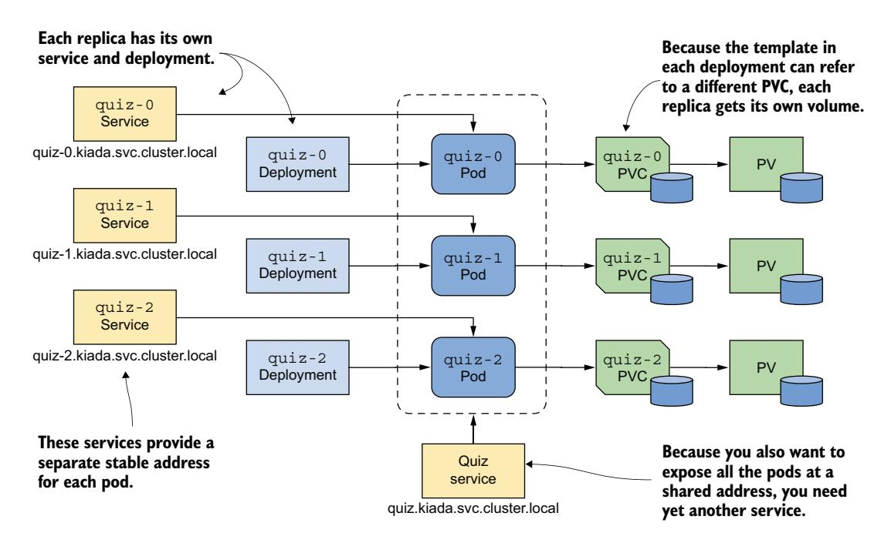
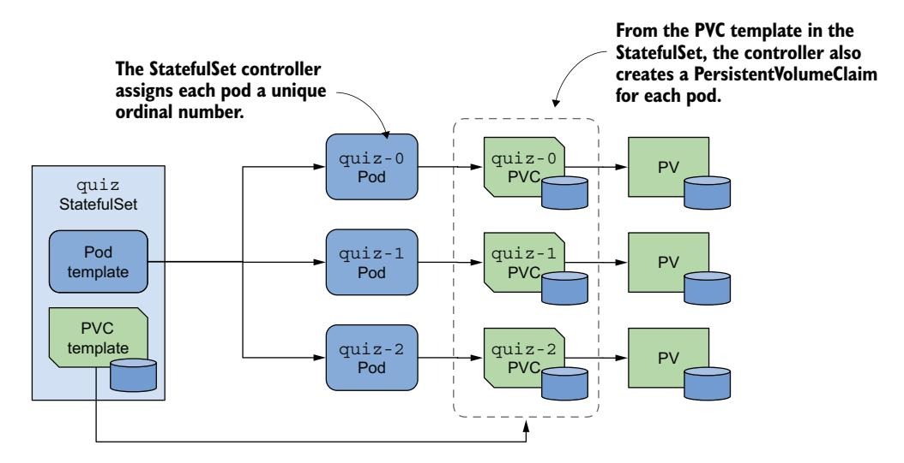
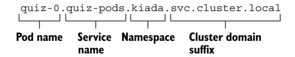
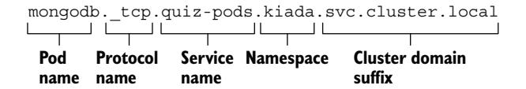
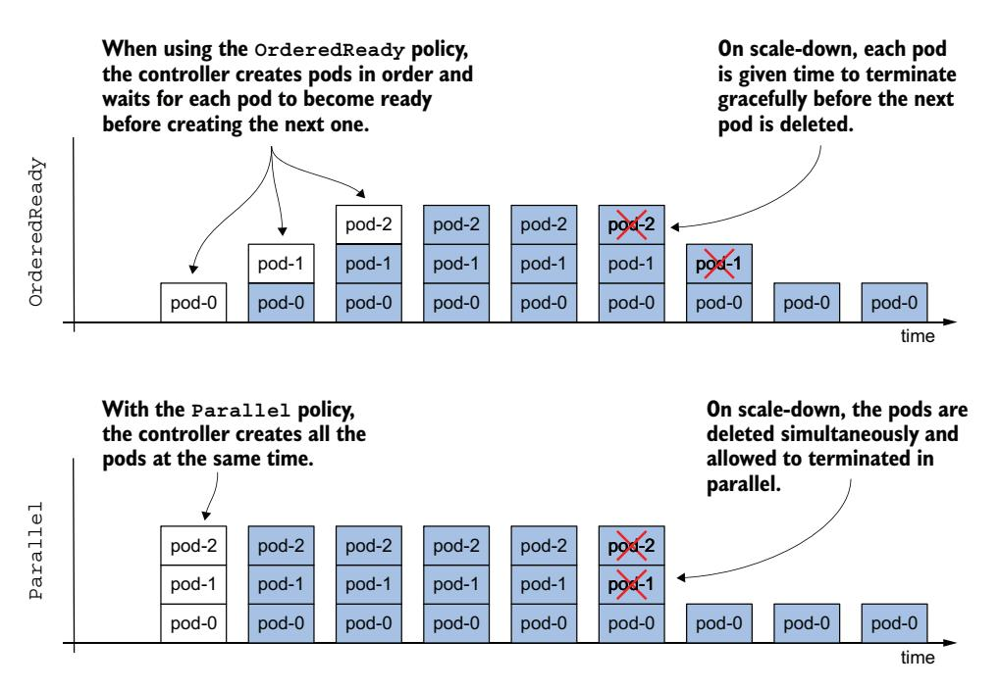
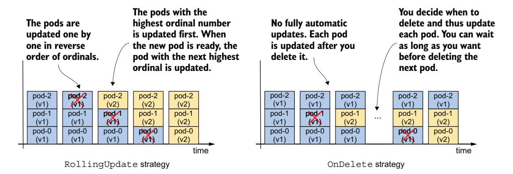

# *Handling stateful applications with StatefulSets*

# *This chapter covers*

- Managing stateful workloads via StatefulSet objects
- Exposing individual pods via headless Services
- The difference between Deployments and StatefulSets
- Automating stateful workload management with Kubernetes Operators

Each of the three services in your Kiada suite is now deployed via a Deployment object. The Kiada and Quote services each have three replicas, while the Quiz service has only one because its data doesn't allow it to scale easily. This chapter discusses how to properly deploy and scale stateful workloads such as the Quiz service with a *StatefulSet*.

 Before you begin, create the kiada Namespace, change to the Chapter16/ directory and apply all manifests in the SETUP/ directory with the following command:

\$ **kubectl apply -n kiada -f SETUP -R**

IMPORTANT The examples in this chapter assume that the objects are created in the kiada Namespace. If you create them in a different location, you must update the DNS domain names in several places.

NOTE The code files for this chapter are available at [https://github.com/](https://github.com/luksa/kubernetes-in-action-2nd-edition/tree/master/Chapter16) [luksa/kubernetes-in-action-2nd-edition/tree/master/Chapter16.](https://github.com/luksa/kubernetes-in-action-2nd-edition/tree/master/Chapter16)

# *16.1 Introducing StatefulSets*

Before you learn about StatefulSets and how they differ from Deployments, let's see how the requirements of stateful workloads differ from those of their stateless counterparts.

## *16.1.1 Understanding stateful workload requirements*

A stateful workload is a piece of software that must store and maintain state to function. This state must be maintained when the workload is restarted or relocated, which makes stateful workloads much more difficult to operate.

 Compared to stateless workloads, stateful workloads are also much harder to scale because it is not possible to simply add and remove replicas without considering their state. If the replicas can share state by reading and writing the same files, adding new replicas isn't a problem. However, for this to be possible, the underlying storage technology must support it. On the other hand, if each replica stores its state in its own files, you'll need to allocate a separate volume for each replica. With the Kubernetes resources you've encountered so far, this is easier said than done. Let's look at these two options to understand the problems associated with both.

#### SHARING STATE ACROSS MULTIPLE POD REPLICAS

In Kubernetes, you can use PersistentVolumes with the ReadWriteMany access mode to share data across multiple pods. However, in most cloud environments, the underlying storage technology typically only supports the ReadWriteOnce and ReadOnlyMany access modes, not ReadWriteMany, meaning you can't mount the volume on multiple nodes in read/write mode. Therefore, pods on different nodes can't read and write to the same PersistentVolume.

 Let's demonstrate this problem using the Quiz service. Can you scale the quiz Deployment to, say, three replicas? Let's see what happens. The kubectl scale command is as follows:

## \$ **kubectl scale deploy quiz --replicas 3** deployment.apps/quiz scaled

Now check the pods like this: \$ **kubectl get pods -l app=quiz** NAME READY STATUS RESTARTS AGE quiz-6f4968457-2c8ws 2/2 Running 0 10m quiz-6f4968457-cdw97 0/2 CrashLoopBackOff 1 (14s ago) 22s quiz-6f4968457-qdn29 0/2 Error 2 (16s ago) 22s **The first pod runs fine. The two pods that were just created are crashing.**

As you can see, only the pod that existed before the scale-up is running, while the two new pods aren't. Depending on the type of cluster you're using, these two pods may not start at all, or they may start but immediately terminate with an error message. For example, in a cluster on Google Kubernetes Engine, the containers in the pods don't start because the PersistentVolume can't be attached to the new pods as its access mode is ReadWriteOnce and the volume can't be attached to multiple nodes at once. In kind-provisioned clusters, the containers start, but the mongo container fails with an error message, as shown next:

```
$ kubectl logs quiz-6f4968457-cdw97 -c mongo 
..."msg":"DBException in initAndListen, 
terminating","attr":{"error":"DBPathInUse: Unable to lock the lock file: /
data/db/mongod.lock (Resource temporarily unavailable). Another mongod 
instance is already running on the /data/db directory"}}
                                                             Replace the pod name with 
                                                             the name of your pods.
```

The error message indicates that you can't use the same data directory in multiple instances of MongoDB. The three quiz Pods use the same directory because they all use the same PersistentVolumeClaim and therefore the same PersistentVolume, as illustrated in figure 16.1.


Figure 16.1 All pods from a Deployment use the same PersistentVolumeClaim and PersistentVolume.

Since this approach doesn't work, the alternative is to use a separate PersistentVolume for each pod replica. Let's look at what this means and whether you can do it with a single Deployment object.

#### USING A DEDICATED PERSISTENTVOLUME FOR EACH REPLICA

As you learned in the previous section, MongoDB only supports a single instance by default. If you want to deploy multiple MongoDB instances with the same data, you must create a MongoDB *replica set* that replicates the data across those instances (here, the term "replica set" is a MongoDB-specific term and doesn't refer to the Kubernetes ReplicaSet resource). Each instance needs its own storage volume and a stable address that other replicas and clients can use to connect to it. Therefore, to deploy a MongoDB replica set in Kubernetes, you need to ensure that

- Each pod has its own PersistentVolume
- Each pod is addressable by its own unique address
- When a pod is deleted and replaced, the new pod is assigned the same address and PersistentVolume

You can't do this with a single Deployment and Service, but you can do it by creating a separate Deployment, Service, and PersistentVolumeClaim for each replica, as shown in figure 16.2.



Figure 16.2 Providing each replica with its own volume and address

Each pod has its own Deployment, so the pod can use its own PersistentVolume-Claim and PersistentVolume. The Service associated with each replica gives it a stable address that always resolves to the IP address of the pod, even if the pod is deleted and recreated elsewhere. This is necessary because with MongoDB, as with many other distributed systems, the address of each replica must be specified when initializing the replica set. In addition to these per-replica Services, you may need yet another Service to make all Pods accessible to clients at a single address. So, the whole system looks daunting.

 It gets worse from here. If you need to increase the number of replicas, you can't use the kubectl scale command; you have to create additional Deployments, Services, and PersistentVolumeClaims, which adds to the complexity.

 Even though this approach is feasible, it's complex and it would be difficult to operate this system. Fortunately, Kubernetes provides a better way to do this with a single Service and a single StatefulSet object.

NOTE You don't need the quiz Deployment and the quiz-data Persistent-VolumeClaim anymore, so please delete them using kubectl delete deploy/ quiz pvc/quiz-data.

# *16.1.2 Comparing StatefulSets with Deployments*

A StatefulSet is similar to a Deployment, but is specifically tailored to stateful workloads. However, there are significant differences in the behavior of these two objects. This difference is best explained with the *Pets vs. Cattle* analogy that you may have heard of. If not, let me explain.

NOTE StatefulSets were originally called PetSets. The name comes from this Pets vs. Cattle analogy.

## THE PETS VS. CATTLE ANALOGY

We used to treat our hardware infrastructure and workloads like pets. We gave each server a name and took care of each workload instance individually. However, it turns out that it's much easier to manage hardware and software if you treat them like cattle and think of them as indistinguishable entities. That makes it easy to replace each unit without worrying that the replacement isn't exactly the unit that was there before, much like a farmer treats cattle (figure 16.3).


Figure 16.3 Treating entities as pets vs. treating them as cattle

Stateless workloads deployed via Deployments are like cattle. If a Pod is replaced, you probably won't even notice. Stateful workloads, however, are like pets. If a pet gets lost, you can't just replace it with a new one. Even if you give the replacement pet the same name, it won't behave exactly like the original. However, in the hardware/software world, this is possible if you can give the replacement the same network identity and state as the replaced instance. And this is exactly what happens when you deploy an application with a StatefulSet.

#### DEPLOYING PODS WITH A STATEFULSET

As with Deployments, in a StatefulSet you specify a Pod template, the desired number of replicas, and a label selector. However, you can also specify a PersistentVolume-Claim template. Each time the StatefulSet controller creates a new replica, it creates not only a new Pod object, but also one or more PersistentVolumeClaim objects.

The pods created from a StatefulSet aren't exact copies of each other, as is the case with Deployments, because each pod points to a different set of PersistentVolume-Claims. In addition, the names of pods aren't random. Instead, each pod is given a unique ordinal number, as is each PersistentVolumeClaim. When a StatefulSet Pod is deleted and recreated, it's given the same name as the pod it replaced. Also, a pod with a particular ordinal number is always associated with PersistentVolumeClaims with the same number. This means that the state associated with a particular replica is always the same, no matter how often the pod is recreated (figure 16.4).



Figure 16.4 A StatefulSet, its pods, and PersistentVolumeClaims

Another notable difference between Deployments and StatefulSets is that, by default, the pods of a StatefulSet aren't created concurrently. Instead, they're created one at a time, similar to a rolling update of a Deployment. When you create a StatefulSet, only

the first pod is created initially. Then the StatefulSet controller waits until the pod is ready before creating the next one.

 A StatefulSet can be scaled just like a Deployment. When you scale a StatefulSet up, new pods and PersistentVolumeClaims are created from their respective templates. When you scale down the StatefulSet, the pods are deleted, but the Persistent-VolumeClaims are either retained or deleted, depending on the policy you configure in the StatefulSet.

## *16.1.3 Creating a StatefulSet*

In this section, you'll replace the quiz Deployment with a StatefulSet. Each StatefulSet must have an associated headless Service that exposes the pods individually, so the first thing you must do is create this Service.

## CREATING THE GOVERNING SERVICE

The headless Service associated with a StatefulSet gives the pods their network identity. You may recall from chapter 11 that a headless Service doesn't have a cluster IP address, but you can still use it to communicate with the pods that match its label selector. Instead of a single A or AAAA DNS record pointing to the Service's IP, the DNS record for a headless Service points to the IPs of all the pods that are part of the Service.

 As shown in figure 16.5, when using a headless Service with a StatefulSet, an additional DNS record is created for each pod so that the IP address of each pod can be looked up by its name. This is how stateful pods maintain their stable network identity. These DNS records don't exist when the headless Service isn't associated with a StatefulSet.


Figure 16.5 A headless Service used in combination with a StatefulSet

You already have a Service called quiz that you created in the previous chapters. You could change it into a headless Service, but let's create an additional Service instead, because the new Service will expose all quiz Pods, whether they're ready or not.

 This headless Service will allow you to resolve individual pods, so let's call it quiz-pods. Create the service with the kubectl apply command. You can find the Service manifest in the svc.quiz-pods.yaml file, whose contents are shown in the following listing.

#### Listing 16.1 Headless Service for the **quiz** StatefulSet

```
apiVersion: v1
kind: Service
metadata:
 name: quiz-pods 
spec:
 clusterIP: None 
 publishNotReadyAddresses: true 
 selector: 
 app: quiz 
 ports: 
 - name: mongodb 
 port: 27017 
                                       The name of this Service is quiz-pods because 
                                       it allows you to resolve individual quiz Pods. 
                                             By setting this field, the Service becomes headless.
                                                     By setting this field, a DNS record is created for 
                                                     each pod, whether the pod is ready or not.
                                            The label selector matches all quiz Pods.
                                This Service also provides SRV entries for the pods. The MongoDB 
                                client uses them to connect to each individual MongoDB server.
```

In the listing, the clusterIP field is set to None, which makes this a headless Service. If you set publishNotReadyAddresses to true, the DNS records for each pod are created immediately when the pod is created, rather than only when the pod is ready. This way, the quiz-pods Service will include all quiz Pods, regardless of their readiness status.

## CREATING THE STATEFULSET

After you create the headless Service, you can create the StatefulSet. You can find the object manifest in the sts.quiz.yaml file. The most important parts of the manifest are shown in the following listing.

#### Listing 16.2 The object manifest for a StatefulSet

```
apiVersion: apps/v1 
kind: StatefulSet 
metadata:
 name: quiz
spec:
 serviceName: quiz-pods 
 podManagementPolicy: Parallel 
 replicas: 3 
 selector: 
 matchLabels: 
 app: quiz 
 template: 
 metadata:
                                  StatefulSets are in the apps/v1 
                                  API group and version.
                                              The name of the 
                                              headless Service that 
                                              governs this StatefulSet
                                                                         Tells the StatefulSet 
                                                                         controller to create 
                                                                         all pods at the 
                                                                         same time
                                                                           The StatefulSet is 
                                                                           configured to create 
                                                                           three replicas.
                                 The label selector determines which 
                                 pods belong to this StatefulSet. It must 
                                 match the labels in the Pod template.
                              The pods for this StatefulSet are 
                              created using this template.
```

```
 labels: 
 app: quiz 
 ver: "0.1" 
 spec:
 volumes: 
 - name: db-data 
 persistentVolumeClaim: 
 claimName: db-data 
 containers:
 - name: quiz-api
 ...
 - name: mongo
 image: mongo:5
 command: 
 - mongod 
 - --bind_ip 
 - 0.0.0.0 
 - --replSet 
 - quiz 
 volumeMounts: 
 - name: db-data 
 mountPath: /data/db 
 volumeClaimTemplates: 
 - metadata: 
 name: db-data 
 labels: 
 app: quiz 
 spec: 
 resources: 
 requests: 
 storage: 1Gi 
 accessModes: 
 - ReadWriteOnce 
                         The label selector determines which 
                         pods belong to this StatefulSet. It must 
                         match the labels in the Pod template.
                                   A single volume is defined in the pod. The 
                                   volume refers to a PersistentVolumeClaim 
                                   with the specified name.
                          MongoDB must be started 
                          with these options to enable 
                          replication.
                                   The PersistentVolumeClaim 
                                   volume is mounted here.
                                The template 
                                used to create the 
                                PersistentVolumeClaims
```

The manifest defines an object of kind StatefulSet from the API group apps, version v1. The name of the StatefulSet is quiz. In the StatefulSet spec, you'll find some fields you know from Deployments and ReplicaSets, such as replicas, selector, and template, explained in the previous chapter, but this manifest contains other fields that are specific to StatefulSets. In the serviceName field, for example, you specify the name of the headless Service that governs this StatefulSet.

 By setting podManagementPolicy to Parallel, the StatefulSet controller creates all pods simultaneously. Since some distributed applications can't handle multiple instances being launched at the same time, the default behavior of the controller is to create one pod at a time. However, in this example, the Parallel option makes the initial scale-up less involved.

 In the volumeClaimTemplates field, you specify the templates for the Persistent-VolumeClaims that the controller creates for each replica. Unlike the Pod templates, where you omit the name field, you must specify the name in the PersistentVolumeClaim template. This name must match the name in the volumes section of the Pod template.

Create the StatefulSet by applying the manifest file as follows:

```
$ kubectl apply -f sts.quiz.yaml
statefulset.apps/quiz created
```

## *16.1.4 Inspecting the StatefulSet, Pods, and PersistentVolumeClaims*

After you create the StatefulSet, you can use the kubectl rollout status command to see its status:

```
$ kubectl rollout status sts quiz
Waiting for 3 pods to be ready...
```

NOTE The shorthand for StatefulSets is sts.

After kubectl prints this message, it doesn't continue. Interrupt its execution by pressing Ctrl-C and check the StatefulSet status with the kubectl get command to investigate why.

```
$ kubectl get sts
NAME READY AGE
quiz 0/3 22s
```

NOTE As with Deployments and ReplicaSets, you can use the -o wide option to display the names of the containers and images used in the StatefulSet.

The value in the READY column shows that none of the replicas are ready. List the pods with kubectl get pods as follows:

## \$ **kubectl get pods -l app=quiz**

| NAME   | READY | STATUS  | RESTARTS | AGE |
|--------|-------|---------|----------|-----|
| quiz-0 | 1/2   | Running | 0        | 56s |
| quiz-1 | 1/2   | Running | 0        | 56s |
| quiz-2 | 1/2   | Running | 0        | 56s |

NOTE Notice the pod names? They don't include a template hash or random characters. Instead, each pod name consists of the StatefulSet name followed by an ordinal index, as explained in the introduction.

TIP By default, ordinal indexes start at zero. However, you can specify a custom starting value by setting the spec.ordinals.start field in the StatefulSet manifest.

You'll notice that only one of the two containers in each pod is ready. If you examine a pod with the kubectl describe command, you'll see that the mongo container is ready, but the quiz-api container isn't, because its readiness check fails. This is because the endpoint called by the readiness probe (/healthz/ready) checks whether the quiz-api process can query the MongoDB server. The failed readiness probe indicates that this isn't possible. If you check the logs of the quiz-api container as follows, you'll see why:

## \$ **kubectl logs quiz-0 -c quiz-api**

```
... INTERNAL ERROR: connected to mongo, but couldn't execute the ping 
command: server selection error: server selection timeout, current topology: 
{ Type: Unknown, Servers: [{ Addr: 127.0.0.1:27017, Type: RSGhost, State: 
Connected, Average RTT: 898693 }, ] }
```

As indicated in the error message, the connection to MongoDB has been established, but the server doesn't allow the ping command to be executed. The reason is that the server was started with the --replSet option configuring it to use replication, but the MongoDB replica set hasn't been initiated yet. To do this, run the following command:

```
$ kubectl exec -it quiz-0 -c mongo -- mongosh --quiet --eval 'rs.initiate({
 _id: "quiz",
 members: [
 {_id: 0, host: "quiz-0.quiz-pods.kiada.svc.cluster.local:27017"},
 {_id: 1, host: "quiz-1.quiz-pods.kiada.svc.cluster.local:27017"},
 {_id: 2, host: "quiz-2.quiz-pods.kiada.svc.cluster.local:27017"}]})'
```

NOTE Instead of typing this long command, you can also run the initiatemongo-replicaset.sh shell script, which you can find in this chapter's code directory.

If the MongoDB shell gives the following error message, you probably forgot to create the quiz-pods Service beforehand:

MongoServerError: replSetInitiate quorum check failed because not all proposed set members responded affirmatively: ... caused by :: Could not find address for quiz-2.quiz-pods.kiada.svc.cluster.local:27017: SocketException: Host not found

If the initiation of the replica set is successful, the command prints the following message:

```
 { ok: 1 }
```

All three quiz Pods should be ready shortly after the replica set is initiated. If you run the kubectl rollout status command again, you'll see the following output:

```
$ kubectl rollout status sts quiz
partitioned roll out complete: 3 new pods have been updated...
```

## INSPECTING THE STATEFULSET WITH KUBECTL DESCRIBE

As you know, you can examine an object in detail with the kubectl describe command. Here you can see what it displays for the quiz StatefulSet:

```
$ kubectl describe sts quiz
```

Selector: app=quiz

Name: quiz Namespace: kiada

CreationTimestamp: Sat, 12 Mar 2022 18:05:43 +0100

**The label selector that determines which pods belong to this StatefulSet**

```
Lahels:
                     app=quiz
Annotations:
                     <none>
                                                  The desired and the
                     3 desired | 3 total
Replicas:
                                                                              The status
                                                   actual number of replicas
                                                                              of the
Update Strategy:
                     RollingUpdate
                                                                              StatefulSet's
  Partition:
                                                                              Pods
Pods Status:
                     3 Running / O Waiting / O Succeeded / O Failed
Pod Template:
                                                             The template used to create
                                                             the pods of this StatefulSet
Volume Claims:
  Name:
                  db-data
  StorageClass:
                                                          The template used to create
  Labels:
                  app=quiz
                                                          the PersistentVolumeClaims
  Annotations: <none>
                                                          of this StatefulSet
                  1Gi
  Capacity:
  Access Modes: [ReadWriteOnce]
Events:
  Type Reason
                              Age
                                    From
                                                             Message
  ----
  Normal SuccessfulCreate 10m statefulset-controller create Claim db-data-
                                                             quiz-0
                                                             Pod quiz-0 in
                                                             StatefulSet
                                                             quiz success
  Normal SuccessfulCreate 10m statefulset-controller create Pod quiz-0 in
                                                             StatefulSet quiz
                                                             successful
                                              The events show what the StatefulSet controller
                                                   did. The list may include Warning events if
                                                                  something goes wrong.
```

As you can see, the output is very similar to that of a ReplicaSet and Deployment. The most noticeable difference is the presence of the PersistentVolumeClaim template, which you won't find in the other two object types. The events at the bottom of the output show you exactly what the StatefulSet controller did. Whenever it creates a pod or a PersistentVolumeClaim, it also creates an Event that tells you what it did.

#### INSPECTING THE PODS

namespace: kiada

Let's take a closer look at the manifest of the first pod to see how it compares to pods created by a ReplicaSet. Use the kubectl get command to print the Pod manifest:

```
$ kubectl get pod quiz-0 -o yaml
apiVersion: v1
kind: Pod
metadata:
    labels:
        app: quiz
        controller-revision-hash: quiz-7576f64fbc
        statefulset.kubernetes.io/pod-name: quiz-0
        ver: "0.1"
    name: quiz-0
The labels include the labels set\nin the StatefulSet's Pod template
and two additional labels added
by the StatefulSet controller.
```

```
 ownerReferences: 
 - apiVersion: apps/v1 
 blockOwnerDeletion: true 
 controller: true 
 kind: StatefulSet 
 name: quiz 
spec:
 containers: 
 ... 
 volumes:
 - name: db-data
 persistentVolumeClaim: 
 claimName: db-data-quiz-0 
status:
 ...
                                        This Pod object is owned 
                                        by the StatefulSet.
                                The containers match those in 
                                the StatefulSet's Pod template.
                                             Since each Pod instance gets its own 
                                             PersistentVolumeClaim, the claim name 
                                             specified in the StatefulSet's Pod template 
                                             was replaced with the name of the claim 
                                             associated with this particular Pod instance.
```

The only label you defined in the pod template in the StatefulSet manifest was app, but the StatefulSet controller added two additional labels to the pod:

- The label controller-revision-hash serves the same purpose as the label podtemplate-hash on the pods of a ReplicaSet. It allows the controller to determine to which revision of the StatefulSet a particular pod belongs.
- The label statefulset.kubernetes.io/pod-name specifies the pod name and allows you to create a Service for a specific Pod instance by using this label in the Service's label selector.

Since this Pod object is managed by the StatefulSet, the ownerReferences field indicates this fact. Unlike Deployments, where pods are owned by ReplicaSets, which in turn are owned by the Deployment, StatefulSets own the pods directly. The StatefulSet takes care of both replication and updating of the pods.

 The pod's containers match the containers defined in the StatefulSet's Pod template, but that's not the case for the pod's volumes. In the template you specified the claimName as db-data, but here in the pod it's been changed to db-data-quiz-0. This is because each Pod instance gets its own PersistentVolumeClaim. The name of the claim is made up of the claimName and the name of the pod.

## INSPECTING THE PERSISTENTVOLUMECLAIMS

Along with the pods, the StatefulSet controller creates a PersistentVolumeClaim for each pod. List them as follows:

# \$ **kubectl get pvc -l app=quiz**

| NAME                 | STATUS VOLUME   |     | CAPACITY ACCESS MODES STORAGECLASS AGE |     |
|----------------------|-----------------|-----|----------------------------------------|-----|
| db-data-quiz-0 Bound | pvc1bf8ccaf 1Gi | RWO | standard                               | 10m |
| db-data-quiz-1 Bound | pvcc8f860c2 1Gi | RWO | standard                               | 10m |
| db-data-quiz-2 Bound | pvc2cc494d6 1Gi | RWO | standard                               | 10m |

You can check the manifest of these PersistentVolumeClaims to make sure they match the template specified in the StatefulSet. Each claim is bound to a PersistentVolume that's been dynamically provisioned for it. These volumes don't yet contain any data, so the Quiz service doesn't currently return anything. You'll import the data next.

## *16.1.5 Understanding the role of the headless Service*

An important requirement of distributed applications is peer discovery—the ability for each cluster member to find the other members. If an application deployed via a StatefulSet needs to find all other pods in the StatefulSet, it could do so by retrieving the list of pods from the Kubernetes API. However, since we want applications to remain Kubernetes-agnostic, it's better for the application to use DNS and not talk to Kubernetes directly.

 For example, a client connecting to a MongoDB replica set must know the addresses of all the replicas, so it can find the primary replica when it needs to write data. You must specify the addresses in the connection string you pass to the MongoDB client. For your three quiz Pods, the following connection URI can be used:

```
mongodb://quiz-0.quiz-pods.kiada.svc.cluster.local:27017,quiz-1.quiz-
     pods.kiada.svc.
cluster.local:27017,quiz-2.quiz-pods.kiada.svc.cluster.local:27017
```

If the StatefulSet was configured with additional replicas, you'd need to add their addresses to the connection string, too. Fortunately, there's a better way.

## EXPOSING STATEFUL PODS THROUGH DNS INDIVIDUALLY

In chapter 11, you learned that a Service object not only exposes a set of pods at a stable IP address but also makes the cluster DNS resolve the Service name to this IP address. With a headless Service, on the other hand, the name resolves to the IPs of the pods that belong to the Service. However, when a headless Service is associated with a StatefulSet, each pod also gets its own A or AAAA record that resolves directly to the individual pod's IP. For example, because you combined the quiz StatefulSet with the quiz-pods headless Service, the IP of the quiz-0 Pod is resolvable at the following address:



All the other replicas created by the StatefulSet are resolvable in the same way.

## EXPOSING STATEFUL PODS VIA SRV RECORDS

In addition to the A and AAAA records, each stateful Pod also gets SRV records. These can be used by the MongoDB client to look up the addresses and port numbers used by each pod so you don't have to specify them manually. However, you must ensure that the SRV record has the correct name. MongoDB expects the SRV record to start with \_mongodb. To ensure that's the case, you must set the port name in the Service definition to mongodb like you did in Listing 16.1. This ensures that the SRV record is as follows:



Using SRV records allows the MongoDB connection string to be much simpler. Regardless of the number of replicas in the set, the connection string is always as follows:

```
mongodb+srv://quiz-pods.kiada.svc.cluster.local
```

Instead of specifying the addresses individually, the mongodb+srv scheme tells the client to find the addresses by performing an SRV lookup for the domain name \_mongodb.\_tcp.quiz-pods.kiada.svc.cluster.local. You'll use this connection string to import the quiz data into MongoDB, as explained next.

## IMPORTING QUIZ DATA INTO MONGODB

In the previous chapters, an init container was used to import the quiz data into the MongoDB store. The init container approach is no longer valid since the data is now replicated, so if you were to use it, the data would be imported multiple times. Instead, let's move the import to a dedicated pod.

 You can find the Pod manifest in the file pod.quiz-data-importer.yaml. The file also contains a ConfigMap that contains the data to be imported. The following listing shows the contents of the manifest file.

#### Listing 16.3 The manifest of the quiz-data-importer Pod

```
apiVersion: v1
kind: Pod
metadata:
 name: quiz-data-importer
spec:
 restartPolicy: OnFailure 
 volumes:
 - name: quiz-questions
 configMap:
 name: quiz-questions
 containers:
 - name: mongoimport
 image: mongo:5
 command:
 - mongoimport
 - mongodb+srv://quiz-pods.kiada.svc.cluster.local/kiada?tls=false 
 - --collection
 - questions
 - --file
                                        This pod's container needs 
                                        to run to completion 
                                        only once. 
                                                              The client uses the SRV
                                                              lookup method to find
                                                              the MongoDB replicas.
```

```
 - /questions.json
 - --drop
 volumeMounts:
 - name: quiz-questions
 mountPath: /questions.json
 subPath: questions.json
 readOnly: true
---
apiVersion: v1
kind: ConfigMap
metadata:
 name: quiz-questions
 labels:
 app: quiz
data:
 questions.json: ...
```

The quiz-questions ConfigMap is mounted into the quiz-data-importer Pod through a configMap volume. When the pod's container starts, it runs the mongoimport command, which connects to the primary MongoDB replica and imports the data from the file in the volume. The data is then replicated to the secondary replicas.

 Since the mongoimport container only needs to run once, the Pod's restartPolicy is set to OnFailure. If the import fails, the container will be restarted as many times as necessary until the import succeeds. Deploy the pod using the kubectl apply command and verify that it completed successfully. You can do this by checking the status of the pod as follows:

```
$ kubectl get pod quiz-data-importer
NAME READY STATUS RESTARTS AGE
quiz-data-importer 0/1 Completed 0 50s
```

If the STATUS column displays the value Completed, it means that the container exited without errors. The logs of the container will show the number of imported documents. You should now be able to access the Kiada suite via curl or your web browser and see that the Quiz service returns the questions you imported. You can delete the quiz-data-importer Pod and the quiz-questions ConfigMap at will.

 Now answer a few quiz questions and use the following command to check if your answers are stored in MongoDB:

```
$ kubectl exec quiz-0 -c mongo -- mongosh kiada --quiet --eval 
     'db.responses.find()'
```

When you run this command, the mongosh shell in pod quiz-0 connects to the kiada database and displays all the documents stored in the responses collection in JSON form. Each of these documents represents an answer that you submitted.

NOTE This command assumes that quiz-0 is the primary MongoDB replica, which should be the case unless you deviated from the instructions for creating the StatefulSet. If the command fails, try running it in the quiz-1 and quiz-2 Pods. You can also find the primary replica by running the MongoDB command rs.hello().primary in any quiz Pod.

# *16.2 Understanding StatefulSet behavior*

In the previous section, you created the StatefulSet and saw how the controller created the pods. You used the cluster DNS records that were created for the headless Service to import data into the MongoDB replica set. Now you'll put the StatefulSet to the test and learn about its behavior. First, you'll see how it handles missing pods and node failures.

## *16.2.1 Understanding how a StatefulSet replaces missing pods*

Unlike the pods created by a ReplicaSet, the pods of a StatefulSet are named differently and each has its own PersistentVolumeClaim (or set of PersistentVolumeClaims if the StatefulSet contains multiple claim templates). As mentioned in the introduction, if a StatefulSet Pod is deleted and replaced by the controller with a new instance, the replica retains the same identity and is associated with the same PersistentVolume-Claim. Try deleting the quiz-1 Pod as follows:

```
$ kubectl delete po quiz-1
pod "quiz-1" deleted
```

The pod that's created in its place has the same name, as you can see here:

|        |       | \$ kubectl get po -l app=quiz |          |     |                                   |
|--------|-------|-------------------------------|----------|-----|-----------------------------------|
| NAME   | READY | STATUS                        | RESTARTS | AGE | The AGE column indicates that     |
| quiz-0 | 2/2   | Running                       | 0        | 94m | this is a new pod, but it has the |
| quiz-1 | 2/2   | Running                       | 0        | 5s  | same name as the previous pod.    |
| quiz-2 | 2/2   | Running                       | 0        | 94m |                                   |

The IP address of the new pod might be different, but that doesn't matter because the DNS records have been updated to point to the new address. Clients using the pod's hostname to communicate with it won't notice any difference.

 In general, this new pod can be scheduled to any cluster node if the Persistent-Volume bound to the PersistentVolumeClaim represents a network-attached volume and not a local volume. If the volume is local to the node, the pod is always scheduled to this node.

 Like the ReplicaSet controller, its StatefulSet counterpart ensures that there are always the desired number of pods configured in the replicas field. However, there's an important difference in the guarantees that a StatefulSet provides compared to a ReplicaSet. This difference is explained next.

## *16.2.2 Understanding how a StatefulSet handles node failures*

StatefulSets provide much stricter concurrent pod execution guarantees than Replica-Sets. This affects how the StatefulSet controller handles node failures and should therefore be explained first.

#### UNDERSTANDING THE AT-MOST-ONE SEMANTICS OF STATEFULSETS

A StatefulSet guarantees at-most-one semantics for its pods. Since two pods with the same name can't be in the same namespace at the same time, the ordinal-based naming scheme of StatefulSets is sufficient to prevent two pods with the same identity from running at the same time.

 Remember what happens when you run a group of pods via a ReplicaSet and one of the nodes stops reporting to the Kubernetes control plane? A few minutes later, the ReplicaSet controller determines that the node and the pods are gone and creates replacement pods that run on the remaining nodes, even though the pods on the original node may still be running. If the StatefulSet controller also replaces the pods in this scenario, you'd have two replicas with the same identity running concurrently. Let's see if that happens.

#### DISCONNECTING A NODE FROM THE NETWORK

As in chapter 14, you'll cause the network interface of one of the nodes to fail. You can try this exercise if your cluster has more than one node. Find the name of the node running the quiz-1 Pod. Suppose it's the node kind-worker2. If you use a kindprovisioned cluster, turn off the node's network interface as follows:


If you're using a GKE cluster, use the following command to connect to the node:

```
$ gcloud compute ssh gke-kiada-default-pool-35644f7e-300l 
                                                                           Replace the node 
                                                                           name with the name 
                                                                           of your node.
```

Run the following command on the node to shut down its network interface:

#### \$ **sudo ifconfig eth0 down**

NOTE Shutting down the network interface will hang the ssh session. You can end the session by pressing Enter followed by "~." (tilde and dot, without the quotes).

Because the node's network interface is down, the Kubelet running on the node can no longer contact the Kubernetes API server and tell it that the node and all its pods are still running. The Kubernetes control plane soon marks the node as NotReady, as seen here:

## \$ **kubectl get nodes**

| NAME               | STATUS | ROLES                | AGE | VERSION |
|--------------------|--------|----------------------|-----|---------|
| kind-control-plane | Ready  | control-plane,master | 10h | v1.23.4 |

```
kind-worker Ready <none> 10h v1.23.4
kind-worker2 NotReady <none> 10h v1.23.4 
                                 The node is no longer ready because it stopped
                                     communicating with the Kubernetes API.
```

After a few minutes, the status of the quiz-1 Pod that was running on this node changes to Terminating, as you can see in the Pod list:

|        |       | \$ kubectl get pods -l app=quiz |          |       |                    |
|--------|-------|---------------------------------|----------|-------|--------------------|
| NAME   | READY | STATUS                          | RESTARTS | AGE   | This pod is being  |
| quiz-0 | 2/2   | Running                         | 0        | 12m   | terminated because |
| quiz-1 | 2/2   | Terminating                     | 0        | 7m39s | its node is down.  |
| quiz-2 | 2/2   | Running                         | 0        | 12m   |                    |

When you inspect the pod with the kubectl describe command, you see a Warning event with the message "Node is not ready" as shown here:

## \$ **kubectl describe po quiz-1**

```
...
Events:
 Type Reason Age From Message
 ---- ------ ---- ---- -------
 Warning NodeNotReady 11m node-controller Node is not ready 
                                  The NodeNotReady event indicates that the node
                                   the Pod is running on is no longer responding.
```

#### UNDERSTANDING WHY THE STATEFULSET CONTROLLER DOESN'T REPLACE THE POD

At this point I'd like to point out that the pod's containers are still running. The node isn't down, it only lost network connectivity. The same thing happens if the Kubelet process running on the node fails, but the containers keep running.

 This is an important fact because it explains why the StatefulSet controller shouldn't delete and recreate the pod. If the StatefulSet controller deletes and recreates the pod while the Kubelet is down, the new pod would be scheduled to another node and the pod's containers would start. There would then be two instances of the same workload running with the same identity. That's why the StatefulSet controller doesn't do that.

## MANUALLY DELETING THE POD

If you want the pod to be recreated elsewhere, manual intervention is required. A cluster operator must confirm that the node has indeed failed and manually delete the Pod object. However, the Pod object is already marked for deletion, as indicated by its status, which shows the Pod as Terminating. Deleting the pod with the usual kubectl delete pod command has no effect.

 The Kubernetes control plane waits for the Kubelet to report that the pod's containers have terminated. Only then is the deletion of the Pod object complete. However, since the Kubelet responsible for this pod isn't working, this never happens. To delete the pod without waiting for confirmation, you must delete it as follows:

```
$ kubectl delete pod quiz-1 --force --grace-period 0
warning: Immediate deletion does not wait for confirmation that the running 
     resource has been terminated. The resource may continue to run on the 
     cluster indefinitely.
pod "quiz-0" force deleted
```

Note the warning that the pod's containers may keep running. That's the reason why you must make sure that the node has really failed before deleting the pod in this way.

#### RECREATING THE POD

After you delete the pod, it's replaced by the StatefulSet controller, but the pod may not start. There are two possible scenarios, which depend on whether the replica's PersistentVolume is a local volume, as in *kind*, or a network-attached volume, as in GKE.

 If the PersistentVolume is a local volume on the failed node, the pod can't be scheduled and its STATUS remains Pending, as shown here:

```
$ kubectl get pod quiz-1 -o wide
NAME READY STATUS RESTARTS AGE IP NODE NOMINATED NODE
quiz-1 0/2 Pending 0 2m38s <none> <none> <none> 
                                     The pod hasn't been scheduled to any node.
```

The pod's events show why the pod can't be scheduled. Use the kubectl describe command to display them as follows:

```
$ kubectl describe pod quiz-1
...
Events:
 Type Reason Age From Message
 ---- ------ ---- ---- -------
 Warning FailedScheduling 21s default-scheduler 0/3 nodes are available:
1 node had taint {node-role.kubernetes.io/master: }, that the pod didn't tolerate,
1 node had taint {node.kubernetes.io/unreachable: }, that the pod didn't tolerate,
1 node had volume node affinity conflict. 
                                                                          The scheduler
                                                                        couldn't find any
                                                                    appropriate nodes to
                                                                       schedule the pod.
                                                           The control plane node accepts only
                                                          Kubernetes system workloads and no
                                                              regular workloads like this pod.
                                                       The kind-worker2 node is unreachable.
              The pod can't be scheduled to the kind-
           worker node because the PersistentVolume
                          can't be attached there.
```

The event message mentions taints. Without going into detail here, I'll just say that the pod can't be scheduled to any of the three nodes because one node is a control plane node, another node is unreachable (duh, you just made it so), but the most important part of the warning message is the part about the affinity conflict. The new quiz-1 Pod can only be scheduled to the same node as the previous pod instance, because that's where its volume is located. And since this node isn't reachable, the pod can't be scheduled.

 If you're running this exercise on GKE or other cluster that uses network-attached volumes, the pod will be scheduled to another node but may not be able to run if the volume can't be detached from the failed node and attached to that other node. In this case, the STATUS of the pod is as follows:

```
$ kubectl get pod quiz-1 -o wide
NAME READY STATUS RESTARTS AGE IP NODE 
quiz-1 0/2 ContainerCreating 0 38s 1.2.3.4 gke-kiada-...
```

**The pod has been scheduled, but its containers haven't been started.**

The pod's events indicate that the PersistentVolume can't be detached. Use kubectl describe as follows to display them:

```
$ kubectl describe pod quiz-1
...
Events:
 Type Reason Age From Message
 ---- ------ ---- ---- -------
 Warning FailedAttachVolume 77s attachdetach-controller Multi-Attach 
error for volume "pvc-8d9ec7e7-bc51-497c-8879-2ae7c3eb2fd2" Volume is already 
exclusively attached to one node and can't be attached to another
```

## DELETING THE PERSISTENTVOLUMECLAIM TO GET THE NEW POD TO RUN

What do you do if the pod can't be attached to the same volume? If the workload running in the pod can rebuild its data from scratch, for example by replicating the data from the other replicas, you can delete the PersistentVolumeClaim so that a new one can be created and bound to a new PersistentVolume. However, since the StatefulSet controller only creates the PersistentVolumeClaims when it creates the pod, you must also delete the pod object. You can delete both objects as follows:

```
$ kubectl delete pvc/db-data-quiz-1 pod/quiz-1
persistentvolumeclaim "db-data-quiz-1" deleted
pod "quiz-1" deleted
```

A new PersistentVolumeClaim and a new pod are created. The PersistentVolume bound to the claim is empty, but MongoDB replicates the data automatically.

#### FIXING THE NODE

Of course, you can save yourself all that trouble if you can fix the node. If you're running this example on GKE, the system does it automatically by restarting the node a few minutes after it goes offline. To restore the node when using the *kind* tool, run the following commands:

**Your cluster may use a different IP gateway. You can find it with the docker inspect network command, as described in chapter 14.**

```
$ docker exec kind-worker2 ip link set eth0 up
$ docker exec kind-worker2 ip route add default via 172.18.0.1
```

When the node is back online, the deletion of the pod is complete, and the new quiz-1 Pod is created. In a *kind* cluster, the pod is scheduled to the same node because the volume is local.

## *16.2.3 Scaling a StatefulSet*

Just like ReplicaSets and Deployments, you can also scale StatefulSets. When you scale up a StatefulSet, the controller creates both a new pod and a new PersistentVolume-Claim. But what happens when you scale it down? Are the PersistentVolumeClaims deleted along with the pods?

#### SCALING DOWN

To scale a StatefulSet, you can use the kubectl scale command or change the value of the replicas field in the manifest of the StatefulSet object. Using the first approach, scale the quiz StatefulSet down to a single replica as follows:

```
$ kubectl scale sts quiz --replicas 1
statefulset.apps/quiz scaled
```

As expected, two pods are now in the process of termination:

#### \$ **kubectl get pods -l app=quiz**

| NAME   | READY | STATUS      | RESTARTS | AGE |                               |
|--------|-------|-------------|----------|-----|-------------------------------|
| quiz-0 | 2/2   | Running     | 0        | 1h  |                               |
| quiz-1 | 2/2   | Terminating | 0        | 14m |                               |
| quiz-2 | 2/2   | Terminating | 0        | 1h  | These pods are being deleted. |

Unlike ReplicaSets, when you scale down a StatefulSet, the pod with the highest ordinal number is deleted first. You scaled down the quiz StatefulSet from three replicas to one, so the two pods with the highest ordinal numbers, quiz-2 and quiz-1, were deleted. This scaling method ensures that the ordinal numbers of the pods always start at zero and end at a number less than the number of replicas.

But what happens to the PersistentVolumeClaims? List them as follows:

#### \$ **kubectl get pvc -l app=quiz**

| NAME                 | STATUS VOLUME   |     | CAPACITY ACCESS MODES STORAGECLASS AGE |    |
|----------------------|-----------------|-----|----------------------------------------|----|
| db-data-quiz-0 Bound | pvc1bf8ccaf 1Gi | RWO | standard                               | 1h |
| db-data-quiz-1 Bound | pvcc8f860c2 1Gi | RWO | standard                               | 1h |
| db-data-quiz-2 Bound | pvc2cc494d6 1Gi | RWO | standard                               | 1h |

Unlike pods, their PersistentVolumeClaims are preserved. This is because deleting a claim would cause the bound PersistentVolume to be recycled or deleted, resulting in data loss. Retaining PersistentVolumeClaims is the default behavior, but you can configure the StatefulSet to delete them via the persistentVolumeClaimRetentionPolicy field, as you'll learn later. The other option is to delete the claims manually.

 It's worth noting that if you scale the quiz StatefulSet to just one replica, the quiz Service is no longer available, but this has nothing to do with Kubernetes. It's because you configured the MongoDB replica set with three replicas, so at least two replicas are needed to have quorum. A single replica has no quorum and therefore must deny both reads and writes. This causes the readiness probe in the quiz-api container to fail, which in turn causes the pod to be removed from the Service and the Service to be left with no Endpoints. To confirm, list the Endpoints as follows:

|           | \$ kubectl get endpoints -l app=quiz |     |                                                                                                                                                            |
|-----------|--------------------------------------|-----|------------------------------------------------------------------------------------------------------------------------------------------------------------|
| NAME      | ENDPOINTS                            | AGE | The quiz Service                                                                                                                                           |
| quiz      |                                      | 1h  | has no endpoints.                                                                                                                                          |
| quiz-pods | 10.244.1.9:27017                     | 1h  | The quiz-pods Service still has quiz-0 as an<br>endpoint because the Service is configured<br>to include all endpoints regardless of their<br>ready state. |

After you scale down the StatefulSet, you need to reconfigure the MongoDB replica set to work with the new number of replicas, but that's beyond the scope of this book. Instead, let's scale the StatefulSet back up to get the quorum again.

#### SCALING UP

Since PersistentVolumeClaims are preserved when you scale down a StatefulSet, they can be reattached when you scale back up, as shown in figure 16.6. Each pod is associated with the same PersistentVolumeClaim as before, based on the pod's ordinal number.


Figure 16.6 StatefulSets don't delete PersistentVolumeClaims when scaling down; they reattach them when scaling back up.

Scale the quiz StatefulSet back up to three replicas as follows:

```
$ kubectl scale sts quiz --replicas 3
statefulset.apps/quiz scaled
```

Now check each pod to see whether it's associated with the correct PersistentVolume-Claim. The quorum is restored, all pods are ready, and the Service is available again. Use your web browser to confirm.

 Now scale the StatefulSet to five replicas. The controller creates two additional pods and PersistentVolumeClaims, but the pods aren't ready. Confirm this as follows:

#### \$ **kubectl get pods quiz-3 quiz-4** NAME READY STATUS RESTARTS AGE quiz-3 **1/2** Running 0 4m55s quiz-4 **1/2** Running 0 4m55s **A container in each of these pods is not ready.**

As you can see, only one of the two containers is ready in each replica. There's nothing wrong with these replicas except that they haven't been added to the MongoDB replica set. You could add them by reconfiguring the replica set, but that's beyond the scope of this book, as mentioned earlier.

 You're probably starting to realize that managing stateful applications in Kubernetes involves more than just creating and managing a StatefulSet object. That's why you usually use a Kubernetes Operator for this, as explained in the last part of this chapter.

 Before I conclude this section on StatefulSet scaling, I want to point out one more thing. The quiz Pods are exposed by two Services: the regular quiz Service, which addresses only Pods that are ready, and the headless quiz-pods Service, which includes all pods, regardless of their readiness status. The kiada Pods connect to the quiz Service, and therefore all the requests sent to the Service are successful, as the requests are forwarded only to the three healthy pods.

 Instead of adding the quiz-pods Service, you could've made the quiz Service headless, but then you'd have had to choose whether the Service should publish the addresses of unready pods. From the clients' point of view, pods that aren't ready shouldn't be part of the Service. From MongoDB's perspective, all pods must be included because that's how the replicas find each other. Using two Services solves this problem. For this reason, it's common for a StatefulSet to be associated with both a regular Service and a headless Service.

# *16.2.4 Changing the PersistentVolumeClaim retention policy*

In the previous section, you learned that StatefulSets preserve the PersistentVolume-Claims by default when you scale them down. However, if the workload managed by the StatefulSet never requires data to be preserved, you can configure the StatefulSet to automatically delete the PersistentVolumeClaim by setting the persistentVolume-ClaimRetentionPolicy field. In this field, you specify the retention policy to be used during scale-down and when the StatefulSet is deleted.

 For example, to configure the quiz StatefulSet to delete the PersistentVolume-Claims when the StatefulSet is scaled but retain them when it's deleted, you must set the policy as shown in the following listing, which shows part of the sts.quiz .pvcRetentionPolicy.yaml manifest file.

#### Listing 16.4 Configuring the PersistentVolumeClaim retention policy in a StatefulSet

```
apiVersion: apps/v1
kind: StatefulSet
metadata:
 name: quiz
spec:
 persistentVolumeClaimRetentionPolicy:
 whenScaled: Delete 
 whenDeleted: Retain 
 ...
                                                       When the StatefulSet is scaled 
                                                       down, the PersistentVolumeClaims 
                                                       are deleted.
                                                         When the StatefulSet is deleted, 
                                                         the PersistentVolumeClaims are 
                                                         preserved.
```

The whenScaled and whenDeleted fields are self-explanatory. Each field can either have the value Retain, which is the default, or Delete. Apply this manifest file using kubectl apply to change the PersistentVolumeClaim retention policy in the quiz StatefulSet as follows:

```
$ kubectl apply -f sts.quiz.pvcRetentionPolicy.yaml
```

## SCALING THE STATEFULSET

The whenScaled policy in the quiz StatefulSet is now set to Delete. Scale the Stateful-Set to three replicas, to remove the two unhealthy pods and their PersistentVolume-Claims.

```
$ kubectl scale sts quiz --replicas 3
statefulset.apps/quiz scaled
```

List the PersistentVolumeClaims to confirm that there are only three left.

#### DELETING THE STATEFULSET

Now let's see if the whenDeleted policy is followed. Your aim is to delete the pods, but not the PersistentVolumeClaims. You've already set the whenDeleted policy to Retain, so you can delete the StatefulSet as follows:

```
$ kubectl delete sts quiz
statefulset.apps "quiz" deleted
```

List the PersistentVolumeClaims to confirm that all three are present. The MongoDB data files are therefore preserved.

NOTE If you want to delete a StatefulSet but keep the pods and the Persistent-VolumeClaims, you can use the --cascade=orphan option. In this case, the PersistentVolumeClaims will be preserved even if the retention policy is set to Delete.

## ENSURING DATA IS NEVER LOST

To conclude this section, I want to caution you against setting either retention policy to Delete. Consider the previous example. You set the whenDeleted policy to Retain so that the data is preserved if the StatefulSet is accidentally deleted, but since the whenScaled policy is set to Delete, the data would still be lost if the StatefulSet is scaled to zero before it's deleted.

TIP Set the persistentVolumeClaimRetentionPolicy to Delete only if the data stored in the PersistentVolumes associated with the StatefulSet is retained elsewhere or doesn't need to be retained. You can always delete the Persistent-VolumeClaims manually. Another way to ensure data retention is to set the reclaimPolicy in the StorageClass referenced in the PersistentVolumeClaim template to Retain.

## *16.2.5 Using the OrderedReady Pod management policy*

Working with the quiz StatefulSet has been easy. However, you may recall that in the StatefulSet manifest, you set the podManagementPolicy field to Parallel, which instructs the controller to create all pods simultaneously rather then one at a time. While MongoDB has no problem starting all replicas simultaneously, some stateful workloads do.

#### INTRODUCING THE TWO POD MANAGEMENT POLICIES

When StatefulSets were introduced, the pod management policy wasn't configurable, and the controller always deployed the pods sequentially. To maintain backward compatibility, this way of working had to be maintained when this field was introduced. Therefore, the default podManagementPolicy is OrderedReady, but you can relax the StatefulSet ordering guarantees by changing the policy to Parallel. Figure 16.7 shows how pods are created and deleted over time with each policy.



Figure 16.7 Comparison between the OrderedReady and Parallel Pod management policy

Table 16.1 explains the differences between the two policies in more detail.

Table 16.1 The supported **podManagementPolicy** values

| Value        | Description                                                                                                                                                                                                                                                                                                                                                                                                              |
|--------------|--------------------------------------------------------------------------------------------------------------------------------------------------------------------------------------------------------------------------------------------------------------------------------------------------------------------------------------------------------------------------------------------------------------------------|
| OrderedReady | Pods are created one at a time in ascending order. After creating each pod, the con<br>troller waits until the pod is ready before creating the next one. The same process is<br>used when scaling up and replacing pods when they're deleted or their nodes fail.<br>When scaling down, the pods are deleted in reverse order. The controller waits until<br>each deleted pod is finished before deleting the next one. |
| Parallel     | All pods are created and deleted at the same time. The controller doesn't wait for<br>individual pods to be ready.                                                                                                                                                                                                                                                                                                       |

The OrderedReady policy is convenient when the workload requires that each replica be fully started before the next one is created and/or fully shut down before the next replica is asked to quit. However, this policy has its drawbacks. Let's look at what happens when we use it in the quiz StatefulSet.

#### UNDERSTANDING THE DRAWBACKS OF THE ORDEREDREADY POD MANAGEMENT POLICY

Recreate the StatefulSet by applying the manifest file sts.quiz.orderedReady.yaml with the podManagementPolicy set to OrderedReady, as shown in the following listing.

#### Listing 16.5 Specifying the **podManagementPolicy** in the StatefulSet

```
apiVersion: apps/v1
kind: StatefulSet
metadata:
 name: quiz
spec:
 podManagementPolicy: OrderedReady 
 minReadySeconds: 10 
 serviceName: quiz-pods
 replicas: 3
 ...
                                                     The pods of this StatefulSet are created 
                                                     in order. Each pod must become ready 
                                                     before the next pod is created.
                                                   The pod must be ready for this 
                                                   many seconds before the next 
                                                   pod is created.
```

In addition to setting the podManagementPolicy, the minReadySeconds field is also set to 10 so you can better see the effects of the OrderedReady policy. This field has the same role as in a Deployment, but is used not only for StatefulSet updates, but also when the StatefulSet is scaled.

NOTE At the time of writing, the podManagementPolicy field is immutable. If you want to change the policy of an existing StatefulSet, you must delete and recreate it, like you just did. You can use the --cascade=orphan option to prevent pods from being deleted during this operation.

Observe the quiz Pods with the --watch option to see how they're created. Run the kubectl get command as follows:

```
$ kubectl get pods -l app=quiz --watch
NAME READY STATUS RESTARTS AGE
quiz-0 1/2 Running 0 22s
```

As you may recall from the previous chapters, the --watch option tells kubectl to watch for changes to the specified objects. The command first lists the objects and then waits. When the state of an existing object is updated or a new object appears, the command prints the updated information about the object.

NOTE When you run kubectl with the --watch option, it uses the same API mechanism that controllers use to wait for changes to the objects they're observing.

You'll be surprised to see that only a single replica is created when you recreate the StatefulSet with the OrderedReady policy, even though the StatefulSet is configured with three replicas. The next pod, quiz-1, doesn't show up no matter how long you wait. The reason is that the quiz-api container in pod quiz-0 never becomes ready, as was the case when you scaled the StatefulSet to a single replica. Since the first pod is never ready, the controller never creates the next pod. It can't do that because of the configured policy.

 As before, the quiz-api container isn't ready because the MongoDB instance running alongside it doesn't have quorum. Since the readiness probe defined in the quiz-api container depends on the availability of MongoDB, which needs at least two pods for quorum, and since the StatefulSet controller doesn't start the next pod until the first one's ready, the StatefulSet is now stuck in a deadlock.

 One could argue that the readiness probe in the quiz-api container shouldn't depend on MongoDB. This is debatable, but perhaps the problem lies in the use of the OrderedReady policy. Let's stick with this policy anyway, since you've already seen how the Parallel policy behaves. Instead, let's reconfigure the readiness probe to call the root URI rather than the /healthz/ready endpoint. This way, the probe only checks if the HTTP server is running in the quiz-api container, without connecting to MongoDB.

## UPDATING A STUCK STATEFULSET WITH THE ORDEREDREADY POLICY

Use the kubectl edit sts quiz command to change the path in the readiness probe definition, or use the kubectl apply command to apply the updated manifest file sts.quiz.orderedReady.readinessProbe.yaml. The following listing shows how the readiness probe should be configured:

#### Listing 16.6 Setting the readiness probe in the **quiz-api** container

apiVersion: apps/v1 kind: StatefulSet

metadata: name: quiz spec:

```
 ...
 template:
 ...
 spec:
 containers:
 - name: quiz-api
 ...
 readinessProbe:
 httpGet:
 port: 8080
 path: / 
 scheme: HTTP
 ...
                         Change the path from 
                         /healthz/ready to /.
```

After you update the Pod template in the StatefulSet, you expect the quiz-0 Pod to be deleted and recreated with the new Pod template, right? List the pods as follows to check if this happens.

```
$ kubectl get pods -l app=quiz
NAME READY STATUS RESTARTS AGE
quiz-0 1/2 Running 0 5m 
                                                    The age of the pod 
                                                    indicates that this is 
                                                    still the old pod.
```

As you can see from the age of the pod, it's still the same pod. Why hasn't the pod been updated? When you update the Pod template in a ReplicaSet or Deployment, the pods are deleted and recreated, so why not here?

 The reason for this is probably the biggest drawback of using StatefulSets with the default Pod management policy OrderedReady. When you use this policy, the Stateful-Set does nothing until the pod is ready. If your StatefulSet gets into the same state as shown here, you'll have to manually delete the unhealthy pod.

 Now delete the quiz-0 Pod and watch the StatefulSet controller create the three pods one by one as follows:

| \$ kubectl get pods -l app=quizwatch |       |                   |          |     | You deleted the                    |
|--------------------------------------|-------|-------------------|----------|-----|------------------------------------|
| NAME                                 | READY | STATUS            | RESTARTS | AGE | pod, so it's being                 |
| quiz-0                               | 0/2   | Terminating       | 0        | 20m | terminated.                        |
| quiz-0                               | 0/2   | Pending           | 0        | 0s  | This is a new pod instance         |
| quiz-0                               | 0/2   | ContainerCreating | 0        | 0s  | with the new readiness probe       |
| quiz-0                               | 1/2   | Running           | 0        | 3s  | definition. Both of its containers |
| quiz-0                               | 2/2   | Running           | 0        | 3s  | soon become ready.                 |
| quiz-1                               | 0/2   | Pending           | 0        | 0s  | The second replica is created      |
| quiz-1                               | 0/2   | ContainerCreating | 0        | 0s  | and started only after the         |
| quiz-1                               | 2/2   | Running           | 0        | 3s  | first one becomes ready.           |
| quiz-2                               | 0/2   | Pending           | 0        | 0s  | The third replica is created       |
| quiz-2                               | 0/2   | ContainerCreating | 0        | 1s  | after the second replica           |
| quiz-2                               | 2/2   | Running           | 0        | 4s  | becomes ready.                     |

As you can see, the pods are created in ascending order, one at a time. You can see that Pod quiz-1 isn't created until both containers in Pod quiz-0 are ready. What you can't see is that because of the minReadySeconds setting, the controller waits an additional 10 seconds before creating Pod quiz-1. Similarly, Pod quiz-2 is created 10 seconds after the containers in Pod quiz-1 are ready. During the entire process, at most one pod was being started. For some workloads, this is necessary to avoid race conditions.

## SCALING A STATEFULSET WITH THE ORDEREDREADY POLICY

When you scale the StatefulSet configured with the OrderedReady Pod management policy, the pods are created/deleted one by one. Scale the quiz StatefulSet to a single replica and watch as the pods are removed. First, the pod with the highest ordinal, quiz-2, is marked for deletion, while Pod quiz-1 remains untouched. When the termination of Pod quiz-2 is complete, Pod quiz-1 is deleted. The minReadySeconds setting isn't used during scale-down, so there's no additional delay.

 Just as with concurrent startup, some stateful workloads don't like it when you remove multiple replicas at once. With the OrderedReady policy, you let each replica finish its shutdown procedure before the shutdown of the next replica is triggered.

## BLOCKED SCALE-DOWNS

Another feature of the OrderedReady Pod management policy is that the controller blocks the scale-down operation if not all replicas are ready. To see this for yourself, create a new StatefulSet by applying the manifest file sts.demo-ordered.yaml. This StatefulSet deploys three replicas using the OrderedReady policy. After the pods are created, fail the readiness probe in the Pod demo-ordered-0 by running the following command:

#### \$ **kubectl exec demo-ordered-0 -- rm /tmp/ready**

Running this command removes the /tmp/ready file that the readiness probe checks for. The probe is successful if the file exists. After you run this command, the demoordered-0 Pod is no longer ready. Now scale the StatefulSet to two replicas as follows:

#### \$ **kubectl scale sts demo-ordered --replicas 2** statefulset.apps/demo-ordered scaled

If you list the pods with the app=demo-ordered label selector, you'll see that the Stateful-Set controller does nothing. Unfortunately, the controller doesn't generate any Events or update the status of the StatefulSet object to tell you why it didn't perform the scale-down.

 The controller completes the scale operation when the pod is ready. You can make the readiness probe of the demo-ordered-0 Pod succeed by recreating the /tmp/ready file as follows:

## \$ **kubectl exec demo-ordered-0 -- touch /tmp/ready**

I suggest you investigate the behavior of this StatefulSet further and compare it to the StatefulSet in the manifest file sts.demo-parallel.yaml, which uses the Parallel Pod management policy. Use the rm and touch commands as shown to affect the outcome of the readiness probe in different replicas and see how it affects the two StatefulSets.

#### ORDERED REMOVAL OF PODS WHEN DELETING THE STATEFULSET

The OrderedReady Pod management policy affects the initial rollout of StatefulSet Pods, their scaling, and how pods are replaced when a node fails. However, the policy doesn't apply when you delete the StatefulSet. If you want to terminate the Pods in order, you should first scale the StatefulSet to zero, wait until the last Pod finishes, and only then delete the StatefulSet.

# 16.3 Updating a StatefulSet

In addition to declarative scaling, StatefulSets also provide declarative updates, similar to Deployments. When you update the Pod template in a StatefulSet, the controller recreates the pods with the updated template.

You may recall that the Deployment controller can perform the update in two ways, depending on the strategy specified in the Deployment object. You can also specify the update strategy in the updateStrategy field in the spec section of the StatefulSet manifest, but the available strategies are different from those in a Deployment, as shown in table 16.2.

| Value         | Description                                                                                                                                                                                                                                                                                                                                             |
|---------------|---------------------------------------------------------------------------------------------------------------------------------------------------------------------------------------------------------------------------------------------------------------------------------------------------------------------------------------------------------|
| RollingUpdate | In this update strategy, the pods are replaced one by one. The pod with the highest ordinal number is deleted first and replaced with a pod created with the new template. When this new pod is ready, the pod with the next highest ordinal number is replaced. The process continues until all pods have been replaced. This is the default strategy. |
| OnDelete      | The StatefulSet controller waits for each pod to be manually deleted. When you delete the pod, the controller replaces it with a pod created with the new template. With this strategy, you can replace pods in any order and at any rate.                                                                                                              |

Figure 16.8 shows how the Pods are updated over time for each update strategy. The RollingUpdate strategy, which you can find in both Deployments and StatefulSets, is



Figure 16.8 How the pods are updated over time with different update strategies

similar between the two objects, but differs in the parameters you can set. The OnDelete strategy lets you replace pods at your own pace and in any order. It's different from the Recreate strategy found in Deployments, which automatically deletes and replaces all pods at once.

## *16.3.1 Using the RollingUpdate strategy*

The RollingUpdate strategy in a StatefulSet behaves similarly to the RollingUpdate strategy in Deployments, but only one pod is replaced at a time. You may recall that you can configure the Deployment to replace multiple pods at once using the maxSurge and maxUnavailable parameters. The rolling update strategy in StatefulSets has no such parameters.

 You may also recall that you can slow down the rollout in a Deployment by setting the minReadySeconds field, which causes the controller to wait a certain amount of time after the new pods are ready before replacing the other pods. You've already learned that StatefulSets also provide this field and that it affects the scaling of StatefulSets in addition to the updates.

 Let's update the quiz-api container in the quiz StatefulSet to version 0.2. Since RollingUpdate is the default update strategy type, you can omit the updateStrategy field in the manifest. To trigger the update, use kubectl edit to change the value of the ver label and the image tag in the quiz-api container to 0.2. You can also apply the manifest file sts.quiz.0.2.yaml with kubectl apply instead.

 You can track the rollout with the kubectl rollout status command as in the previous chapter. The full command and its output are as follows:

#### \$ **kubectl rollout status sts quiz**

```
Waiting for partitioned roll out to finish: 0 out of 3 new pods have been updated...
Waiting for 1 pods to be ready...
Waiting for partitioned roll out to finish: 1 out of 3 new pods have been updated...
Waiting for 1 pods to be ready...
...
```

Because the pods are replaced one at a time and the controller waits until each replica is ready before moving on to the next, the quiz Service remains accessible throughout the process. If you list the pods as they're updated, you'll see that the pod with the highest ordinal number, quiz-2, is updated first, followed by quiz-1, as shown here:

**This is the pod that's being updated now.**

**The pod with the lowest ordinal has yet to be updated.**

| \$ kubectl get pods -l app=quiz -L controller-revision-hash,ver |       |             |          |     |                          |     |  |  |  |
|-----------------------------------------------------------------|-------|-------------|----------|-----|--------------------------|-----|--|--|--|
| NAME                                                            | READY | STATUS      | RESTARTS | AGE | CONTROLLER-REVISION-HASH | VER |  |  |  |
| quiz-0                                                          | 2/2   | Running     | 0        | 50m | quiz-6c48bdd8df          | 0.1 |  |  |  |
| quiz-1                                                          | 2/2   | Terminating | 0        | 10m | quiz-6c48bdd8df          | 0.1 |  |  |  |
| quiz-2                                                          | 2/2   | Running     | 0        | 20s | quiz-6945968d9           | 0.2 |  |  |  |

**The pod with the highest ordinal was updated first.**

The update process is complete when the pod with the lowest ordinal number, quiz-0, is updated. At this point, the kubectl rollout status command reports the following status:

```
$ kubectl rollout status sts quiz
partitioned roll out complete: 3 new pods have been updated...
```

## UPDATES WITH PODS THAT AREN'T READY

If the StatefulSet is configured with the RollingUpdate strategy and you trigger the update before all pods are ready, the rollout is held back. The kubectl rollout status indicates that the controller is waiting for one or more pods to be ready.

 If a new pod fails to become ready during the update, the update is also paused, just like a Deployment update. The rollout will resume when the pod is ready again. So, if you deploy a faulty version whose readiness probe never succeeds, the update will be blocked after the first pod is replaced. If the number of replicas in the Stateful-Set is sufficient, the service provided by the pods in the StatefulSet is unaffected.

#### DISPLAYING THE REVISION HISTORY

You may recall that Deployments keep a history of recent revisions. Each revision is represented by the ReplicaSet that the Deployment controller created when that revision was active. StatefulSets also keep a revision history. You can use the kubectl rollout history command to display it as follows:

```
$ kubectl rollout history sts quiz
statefulset.apps/quiz
REVISION CHANGE-CAUSE
1 <none>
2 <none>
```

You may wonder where this history is stored, because unlike Deployments, a Stateful-Set manages pods directly. And if you look at the object manifest of the quiz StatefulSet, you'll notice that it only contains the current Pod template and no previous revisions. So where is the revision history of the StatefulSet stored?

 The revision history of StatefulSets and DaemonSets, which you'll learn about in the next chapter, is stored in ControllerRevision objects. A ControllerRevision is a generic object that represents an immutable snapshot of the state of an object at a particular point in time. You can list ControllerRevision objects as follows:

#### \$ **kubectl get controllerrevisions**

| NAME            | CONTROLLER            | REVISION | AGE |
|-----------------|-----------------------|----------|-----|
| quiz-6945968d9  | statefulset.apps/quiz | 2        | 1m  |
| quiz-6c48bdd8df | statefulset.apps/quiz | 1        | 50m |

Since these objects are used internally, you don't need to know anything more about them. However, if you want to learn more, you can use the kubectl explain command.

#### ROLLING BACK TO A PREVIOUS REVISION

If you're updating the StatefulSet and the rollout hangs, or if the rollout was successful, but you want to revert to the previous revision, you can use the kubectl rollout undo command, as described in the previous chapter. You'll update the quiz StatefulSet again in the next section, so reset it to the previous version as follows:

\$ kubectl rollout undo sts quiz
statefulset.apps/quiz rolled back

You can also use the --to-revision option to return to a specific revision. As with Deployments, pods are rolled back using the update strategy configured in the Stateful-Set. If the strategy is RollingUpdate, the pods are reverted one at a time.

## 16.3.2 RollingUpdate with partition

StatefulSets don't have a pause field that you can use to prevent a Deployment rollout from being triggered, or to pause it halfway. If you try to pause the StatefulSet with the kubectl rollout pause command, you receive the following error message:

\$ kubectl rollout pause sts quiz\nerror: statefulsets.apps "quiz" pausing is not supported

In a StatefulSet, you can achieve the same result and more with the partition parameter of the RollingUpdate strategy. The value of this field specifies the ordinal number at which the StatefulSet should be partitioned. As shown in figure 16.9, pods with an ordinal number lower than the partition value aren't updated.


Figure 16.9 Partitioning a rolling update

If you set the partition value appropriately, you can implement a canary deployment, control the rollout manually, or stage an update instead of triggering it immediately.

#### STAGING AN LIPDATE

To stage a StatefulSet update without actually triggering it, set the partition value to the number of replicas or higher, as in the manifest file sts.quiz.0.2.partition.yaml shown in the following listing.

#### Listing 16.7 Staging a StatefulSet update with the partition field

```
apiVersion: apps/v1
kind: StatefulSet
metadata:
 name: quiz
spec:
 updateStrategy:
 type: RollingUpdate
 rollingUpdate:
 partition: 3 
 replicas: 3 
 ...
                            The partition value is equal 
                            to the number of replicas.
```

Apply this manifest file and confirm that the rollout doesn't start even though the Pod template has been updated. If you set the partition value this way, you can make several changes to the StatefulSet without triggering the rollout. Now let's look at how you can trigger the update of a single pod.

#### DEPLOYING A CANARY

To deploy a canary, set the partition value to the number of replicas minus one. Since the quiz StatefulSet has three replicas, you set the partition to 2. You can do this with the kubectl patch command as follows:

```
$ kubectl patch sts quiz -p '{"spec": {"updateStrategy": {"rollingUpdate": 
     {"partition": 2 }}}}'
statefulset.apps/quiz patched
```

If you now look at the list of quiz Pods, you'll see that only the Pod quiz-2 has been updated to version 0.2 because only its ordinal number is greater than or equal to the partition value.

#### \$ **kubectl get pods -l app=quiz -L controller-revision-hash,ver**

| NAME   | READY | STATUS  | RESTARTS | AGE | CONTROLLER-REVISION-HASH | VER |
|--------|-------|---------|----------|-----|--------------------------|-----|
| quiz-0 | 2/2   | Running | 0        | 8m  | quiz-6c48bdd8df          | 0.1 |
| quiz-1 | 2/2   | Running | 0        | 8m  | quiz-6c48bdd8df          | 0.1 |
| quiz-2 | 2/2   | Running | 0        | 20s | quiz-6945968d9           | 0.2 |

**Only the quiz-2 Pod was updated because only its ordinal is greater than or equal to the partition value.**

The Pod quiz-2 is the canary that you use to check if the new version behaves as expected before rolling out the changes to the remaining pods.

 At this point, I'd like to draw your attention to the status section of the StatefulSet object. It contains information about the total number of replicas, the number of replicas that are ready and available, the number of current and updated replicas, and their revision hashes. To display the status, run the following command:

```
$ kubectl get sts quiz -o yaml
```

...

```
status:
 availableReplicas: 3 
 collisionCount: 0
 currentReplicas: 2 
 currentRevision: quiz-6c48bdd8df 
 observedGeneration: 8
 readyReplicas: 3 
 replicas: 3 
 updateRevision: quiz-6945968d9 
 updatedReplicas: 1 
                                                                           Three replicas 
                                                                           exist, and all 
                                                                           three are ready 
                                                                           and available.
                                                 Two replicas belong to 
                                                 the current revision.
                                              One replica has 
                                              been updated.
```

As you can see from the status, the StatefulSet is now split into two partitions. If a pod is deleted at this time, the StatefulSet controller will create it with the correct template. For example, if you delete one of the pods with version 0.1, the replacement pod will be created with the previous template and will run again with version 0.1. If you delete the pod that's already been updated, it'll be recreated with the new template. Feel free to try this out for yourself. You can't break anything.

#### COMPLETING A PARTITIONED UPDATE

When you're confident the canary is fine, you can let the StatefulSet update the remaining pods by setting the partition value to zero as follows:

```
$ kubectl patch sts quiz -p '{"spec": {"updateStrategy": {"rollingUpdate": 
     {"partition": 0 }}}}'
statefulset.apps/quiz patched
```

When the partition field is set to zero, the StatefulSet updates all pods. First, the pod quiz-1 is updated, followed by quiz-0. If you had more pods, you could also use the partition field to update the StatefulSet in phases. In each phase, you decide how many pods you want to update and set the partition value accordingly.

 At the time of writing, partition is the only parameter of the RollingUpdate strategy. You've seen how you can use it to control the rollout. If you want even more control, you can use the OnDelete strategy, which I'll try next. Before you continue, please reset the StatefulSet to the previous revision as follows:

```
$ kubectl rollout undo sts quiz
statefulset.apps/quiz rolled back
```

## *16.3.3 OnDelete strategy*

If you want to have full control over the rollout process, you can use the OnDelete update strategy. To configure the StatefulSet with this strategy, use kubectl apply to apply the manifest file sts.quiz.0.2.onDelete.yaml. The following listing shows how the update strategy is set.

#### Listing 16.8 Setting the OnDelete update strategy

apiVersion: apps/v1 kind: StatefulSet

```
metadata:
 name: quiz
spec:
 updateStrategy: 
 type: OnDelete 
 ...
                              To enable the OnDelete strategy, set the type field 
                              as shown. This strategy has no parameters.
```

This manifest updates the quiz-api container in the Pod template to use the :0.2 image tag. However, because it sets the update strategy to OnDelete, nothing happens when you apply the manifest.

 If you use the OnDelete strategy, the rollout is semi-automatic. You manually delete each pod, and the StatefulSet controller then creates the replacement pod with the new template. With this strategy, you can decide which pod to update and when. You don't necessarily have to delete the pod with the highest ordinal number first. Try deleting the Pod quiz-0. When its containers exit, a new quiz-0 Pod with version 0.2 appears:

> **You deleted this pod, and the controller replaced it with a pod from the updated template.**

## \$ **kubectl get pods -l app=quiz -L controller-revision-hash,ver** NAME READY STATUS RESTARTS AGE CONTROLLER-REVISION-HASH VER quiz-0 2/2 Running 0 53s quiz-6945968d9 0.2 quiz-1 2/2 Running 0 11m quiz-6c48bdd8df 0.1 quiz-2 2/2 Running 0 12m quiz-6c48bdd8df 0.1

To complete the rollout, you need to delete the remaining pods. You can do this in the order that the workloads require, or in the order that you want.

## ROLLING BACK WITH THE ONDELETE STRATEGY

Since the update strategy also applies when you use the kubectl rollout undo command, the rollback process is also semi-automatic. You must delete each pod yourself if you want to roll it back to the previous revision.

#### UPDATES WITH PODS THAT AREN'T READY

Since you control the rollout and the controller replaces any pod you delete, the pod's readiness status is irrelevant. If you delete a pod that's not ready, the controller updates it.

 If you delete a pod and the new pod isn't ready, but you still delete the next pod, the controller will update that second pod as well. It's your responsibility to consider pod readiness.

# *16.4 Managing stateful applications with Kubernetes Operators*

In this chapter, you saw that managing a stateful application can involve more than the StatefulSet object provides. In the case of MongoDB, you need to reconfigure the MongoDB replica set every time you scale the StatefulSet. If you don't, the replica set may lose quorum and stop working. Also, if a cluster node fails, manual intervention is required to move the Pods to the remaining nodes.

 Managing stateful applications is difficult. StatefulSets do a good job of automating some basic tasks, but much of the work still has to be done manually. If you want to deploy a fully automated stateful application, you need more than what StatefulSets can provide. This is where Kubernetes *operators* come into play. I'm not referring to the people running Kubernetes clusters, but the software that does it for them.

 A *Kubernetes operator* is an application-specific controller that automates the deployment and management of an application running on Kubernetes. An operator is typically developed by the same organization that builds the application, as they know best how to manage it. Kubernetes doesn't ship with operators. Instead, you must install them separately.

 Each operator extends the Kubernetes API with its own set of custom object types that you use to deploy and configure the application. You create an instance of this custom object type using the Kubernetes API and leave it to the operator to create the Deployments or StatefulSets that create the pods in which the application runs, as shown in figure 16.10.


Figure 16.10 Managing an application through custom resources and operators

In this section, you'll learn how to use the MongoDB Community Operator to deploy MongoDB. Since I don't know how the operator will change after the book is published, I won't go into too much detail, but I'll list all the steps that were necessary to install the Operator and deploy MongoDB at the time I wrote the book so you can get a feel for what's required even if you don't try it yourself.

 If you do want to try this yourself, follow the documentation in the GitHub repository of the MongoDB community operator at [https://github.com/mongodb/mongodb](https://github.com/mongodb/mongodb-kubernetes-operator) [-kubernetes-operator](https://github.com/mongodb/mongodb-kubernetes-operator).

## *16.4.1 Deploying the MongoDB community operator*

An operator is itself an application that you typically deploy in the same Kubernetes cluster as the application that the operator is to manage. At the time of writing, the MongoDB operator documentation instructs you to first clone the GitHub repository as follows:

#### \$ **git clone https://github.com/mongodb/mongodb-kubernetes-operator.git**

Then go to the mongodb-kubernetes-operator directory where you can find the source code of the operator and some Kubernetes object manifests. You can ignore the source code. You're only interested in the manifest files.

 You can decide if you want to deploy the operator and MongoDB in the same namespace, or if you want to deploy the operator so that each user in the cluster can deploy their own MongoDB instance(s). For simplicity, I'll use a single namespace.

#### EXTENDING THE API WITH THE MONGODBCOMMUNITY OBJECT KIND

First, you create a CustomResourceDefinition object that extends your cluster's Kubernetes API with an additional object type. To do this, you apply the object manifest as follows:

## \$ **kubectl apply -f config/crd/bases/mongodbcommunity.mongodb.com\_mongodbcommunity.yaml**

customresourcedefinition/mongodbcommunity.mongodbcommunity.mongodb.com created

Using your cluster's API, you can now create objects of kind MongoDBCommunity. You'll create this object later.

NOTE Unfortunately, the object kind is MongoDBCommunity, which makes it hard to understand that this object represents a MongoDB deployment and not a community. The reason it's called MongoDBCommunity is because you're using the community version of the operator. If you use the Enterprise version, the naming is more appropriate. There the object kind is MongoDB, which clearly indicates that the object represents a MongoDB deployment.

#### CREATING SUPPORTING OBJECTS

Next, you create various other security-related objects by applying their manifests. Here you need to specify the namespace in which these objects should be created. Let's use the namespace mongodb. Apply the manifests as follows:

## \$ **kubectl apply -k config/rbac/ -n mongodb**

serviceaccount/mongodb-database created serviceaccount/mongodb-kubernetes-operator created role.rbac.authorization.k8s.io/mongodb-database created role.rbac.authorization.k8s.io/mongodb-kubernetes-operator created rolebinding.rbac.authorization.k8s.io/mongodb-database created rolebinding.rbac.authorization.k8s.io/mongodb-kubernetes-operator created

#### INSTALLING THE OPERATOR

The last step is to install the operator by creating a Deployment as follows:

```
$ kubectl create -f config/manager/manager.yaml -n mongodb
deployment.apps/mongodb-kubernetes-operator created
```

Verify that the operator pod exists and is running by listing the pods in the mongodb namespace:

## \$ **kubectl get pods -n mongodb**

```
NAME READY STATUS RESTARTS AGE
mongodb-kubernetes-operator-648bf8cc59-wzvhx 1/1 Running 0 9s
```

That wasn't so hard, was it? The operator is running now, but you haven't deployed MongoDB yet. The operator is just the tool you use to do that.

## *16.4.2 Deploying MongoDB via the operator*

To deploy a MongoDB replica set, you create an instance of the MongoDBCommunity object type instead of creating StatefulSets and the other objects.

## CREATING AN INSTANCE OF THE MONGODBCOMMUNITY OBJECT TYPE

First edit the file config/samples/mongodb.com\_v1\_mongodbcommunity\_cr.yaml to replace the string <your-password-here> with the password of your choice. The file contains manifests for a MongoDBCommunity and a Secret object. The following listing shows the manifest of the former.

#### Listing 16.9 The MongoDBCommunity custom object manifest

```
apiVersion: mongodbcommunity.mongodb.com/v1 
kind: MongoDBCommunity 
metadata:
 name: example-mongodb 
spec:
 members: 3 
 type: ReplicaSet 
 version: "4.2.6" 
 security: 
 authentication: 
 modes: ["SCRAM"] 
 users: 
 - name: my-user 
 db: admin 
 passwordSecretRef: 
 name: my-user-password 
 roles: 
 - name: clusterAdmin 
 db: admin 
                                                          This object kind is 
                                                          MongoDBCommunity, which is a 
                                                          custom object kind, which is an 
                                                          extension of the core Kubernetes API.
                                          The object name is specified in the metadata section, 
                                          just like in all other Kubernetes objects types.
                                 This tells the operator to create a 
                                 MongoDB replica set with three replicas.
                                                     Here you specify which MongoDB 
                                                     version you want to deploy.
                                               You can also 
                                               specify many other 
                                               configuration options 
                                               for the MongoDB 
                                               deployment.
```

**You can also specify many other configuration options for the MongoDB deployment.**

```
 - name: userAdminAnyDatabase 
 db: admin 
 scramCredentialsSecretName: my-scram 
 additionalMongodConfig: 
 storage.wiredTiger.engineConfig.journalCompressor: zlib
```

As you can see, this custom object has the same structure as the Kubernetes API core objects. The apiVersion and kind fields specify the object type, the name field in the metadata section specifies the object name, and the spec section specifies the configuration for the MongoDB deployment, including type and version, the desired number of replica set members, and the security-related configuration.

NOTE If the custom resource definition is well done, as in this case, you can use the kubectl explain command to learn more about the fields supported in this object type.

To deploy MongoDB, you apply this manifest file with kubectl apply as follows:

\$ **kubectl apply -f config/samples/mongodb.com\_v1\_mongodbcommunity\_cr.yaml** mongodbcommunity.mongodbcommunity.mongodb.com/example-mongodb created secret/my-user-password created

#### INSPECTING THE MONGODBCOMMUNITY OBJECT

You can then see the object you created with the kubectl get command as follows:

#### \$ **kubectl get mongodbcommunity** NAME PHASE VERSION example-mongodb Running 4.2.6

undo your changes.

Just like the other Kubernetes controllers, the object you created is now processed in the reconciliation loop running in the operator. Based on the MongoDBCommunity object, the operator creates several objects: a StatefulSet, two Services, and some Secrets. If you check the ownerReferences field in these objects, you'll see that they're all owned by the example-mongodb MongoDBCommunity object. If you make direct changes to these objects, such as scaling the StatefulSet, the operator will immediately

 After the operator creates the Kubernetes core objects, the core controllers do their part. For example, the StatefulSet controller creates the pods. Use kubectl get to list them as follows:

## \$ **kubectl get pods -l app=example-mongodb-svc** NAME READY STATUS RESTARTS AGE example-mongodb-0 2/2 Running 0 3m example-mongodb-1 2/2 Running 0 2m

example-mongodb-2 2/2 Running 0 1m

The MongoDB operator not only creates the StatefulSet but also makes sure that the MongoDB replica set is initiated automatically. You can use it right away. No additional manual configuration is required.

## MANAGING THE MONGODB DEPLOYMENT

You control the MongoDB deployment through the MongoDBCommunity object. The operator updates the configuration every time you update this object. For example, if you want to resize the MongoDB replica set, you change the value of the members field in the example-mongodb object. The operator then scales the underlying StatefulSet and reconfigures the MongoDB replica set. This makes scaling MongoDB trivial.

NOTE At the time of writing, you can't use the kubectl scale command to scale the MongoDBCommunity object, but I'm sure the MongoDB operator developers will fix this soon.

## *16.4.3 Cleaning up*

To uninstall MongoDB, delete the MongoDBCommunity object as follows:

```
$ kubectl delete mongodbcommunity example-mongodb
mongodbcommunity.mongodbcommunity.mongodb.com "example-mongodb" deleted
```

As you might expect, this orphans the underlying StatefulSet, Services, and other objects. The garbage collector then deletes them. To remove the operator, you can delete the entire mongodb Namespace as follows:

```
$ kubectl delete ns mongodb
namespace "mongodb" deleted
```

As a last step, you also need to delete the CustomResourceDefinition to remove the custom object type from the API as follows:

```
$ kubectl delete crd mongodbcommunity.mongodbcommunity.mongodb.com
customresourcedefinition "mongodbcommunity.mongodbcommunity.mongodb.com" deleted
```

# *Summary*

- Stateful workloads are harder to manage than their stateless counterparts because managing state is difficult. However, with StatefulSets, managing stateful workloads becomes much easier because the StatefulSet controller automates most of the work.
- With StatefulSets you can manage a group of pods as pets, whereas Deployments treat the pods like cattle. The pods in a StatefulSet use ordinal numbers instead of random names.
- A StatefulSet ensures that each replica gets its own stable identity and its own PersistentVolumeClaim(s). These claims are always associated with the same pods.
- In combination with a StatefulSet, a headless Service ensures that each pod receives a DNS record that always resolves to the pod's IP address, even if the pod is moved to another node and receives a new IP address.
- StatefulSet Pods are created in the order of ascending ordinal numbers and deleted in reverse order.