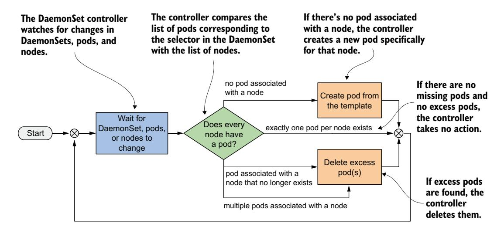
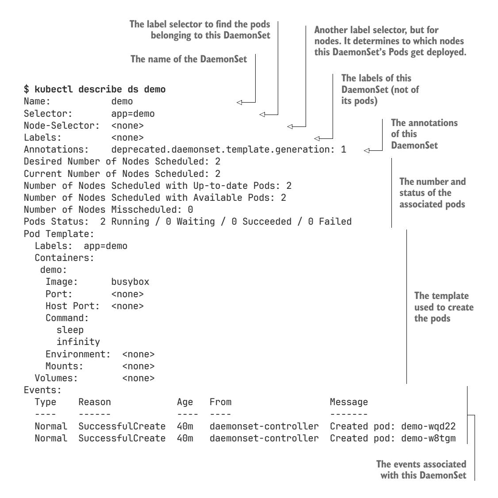
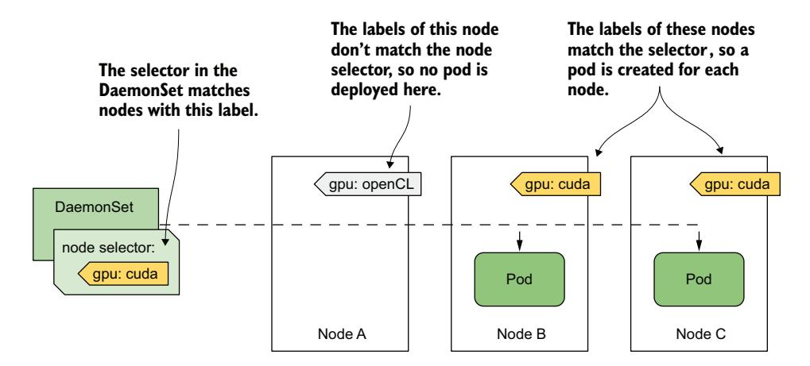
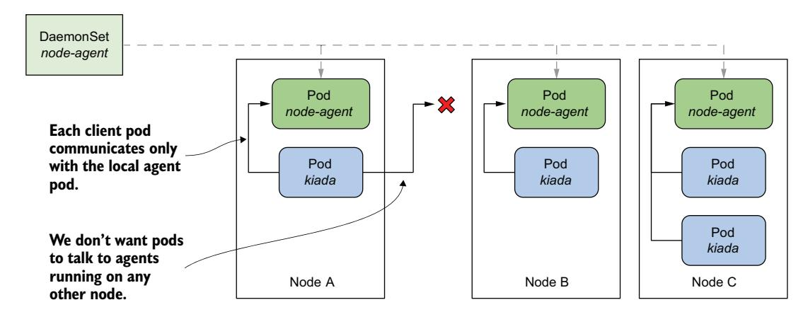
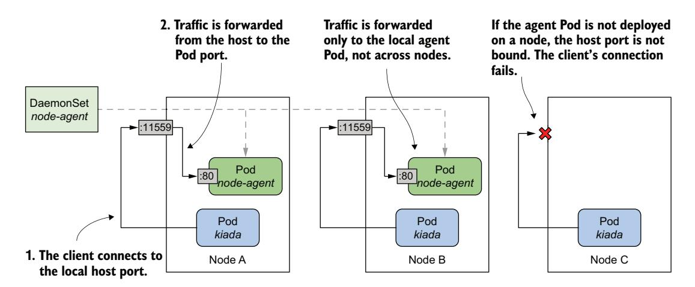
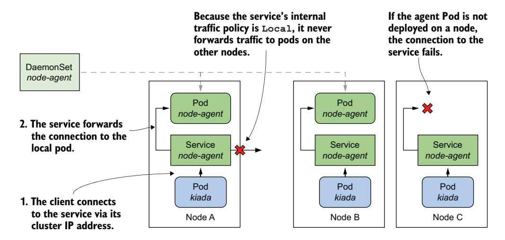

# *Deploying per-node workloads with DaemonSets*

# *This chapter covers*

- Running an agent Pod on each cluster node
- Running agent Pods on a subset of nodes
- Allowing pods to access the host node's resources
- Assigning a priority class to a pod
- Communicating with the local agent Pod

In the previous chapters, you learned how to use Deployments or StatefulSets to distribute multiple replicas of a workload across the nodes of your cluster. But what if you want to run exactly one replica on each node? For example, you might want each node to run an agent or daemon that provides a system service such as metrics collection or log aggregation for that node. To deploy these types of workloads in Kubernetes, we use a DaemonSet.

 Before you begin, create the kiada Namespace, switch to the Chapter17/ directory, and apply all manifests in the SETUP/ directory by running the following commands:

```
$ kubectl create ns kiada
$ kubectl config set-context --current --namespace kiada
$ kubectl apply -f SETUP -R
```

NOTE You can find the code files for this chapter at [https://github.com/](https://github.com/luksa/kubernetes-in-action-2nd-edition/tree/master/Chapter17) [luksa/kubernetes-in-action-2nd-edition/tree/master/Chapter17.](https://github.com/luksa/kubernetes-in-action-2nd-edition/tree/master/Chapter17)

# *17.1 Introducing DaemonSets*

A DaemonSet is an API object that ensures that exactly one replica of a pod is running on each cluster node. By default, daemon Pods are deployed on every node, but you can use a node selector to restrict deployment to some of the nodes.

## *17.1.1 Understanding the DaemonSet object*

A DaemonSet contains a Pod template and uses it to create multiple pod replicas, just like Deployments, ReplicaSets, and StatefulSets. However, with a DaemonSet, you don't specify the desired number of replicas as you do with the other objects. Instead, the DaemonSet controller creates as many pods as there are nodes in the cluster. It ensures that each pod is scheduled to a different node, unlike pods deployed by a ReplicaSet, where multiple pods can be scheduled to the same node, as shown in figure 17.1.


Figure 17.1 DaemonSets run a pod replica on each node, whereas ReplicaSets scatter them around the cluster.

#### WHAT TYPE OF WORKLOADS ARE DEPLOYED VIA DAEMONSETS AND WHY

A DaemonSet is typically used to deploy infrastructure pods that provide some sort of system-level service to each cluster node. This includes the log collection for the node's system processes, as well as its pods, daemons to monitor these processes; tools that provide the cluster's network and storage, manage the installation and update of software packages; and services that provide interfaces to the various devices attached to the node.

 The Kube Proxy component, which is responsible for routing traffic for the Service objects you create in your cluster, is usually deployed via a DaemonSet in the kube-system Namespace. The Container Network Interface (CNI) plugin that provides the network over which the pods communicate is also typically deployed via a DaemonSet.

 Although you could run system software on your cluster nodes using standard methods such as init scripts or systemd, using a DaemonSet ensures that you manage all workloads in your cluster in the same way.

## UNDERSTANDING THE OPERATION OF THE DAEMONSET CONTROLLER

Just like ReplicaSets and StatefulSets, a DaemonSet contains a Pod template and a label selector that determines which pods belong to the DaemonSet. In each pass of its reconciliation loop, the DaemonSet controller finds the pods that match the label selector, checks that each node has exactly one matching pod, and creates or removes pods to ensure that this is the case. This is illustrated in figure 17.2.



Figure 17.2 The DaemonSet controller's reconciliation loop

When you add a node to the cluster, the DaemonSet controller creates a new pod and associates it with that node. When you remove a node, the DaemonSet deletes the Pod object associated with it. If one of these daemon Pods disappears, for example, because it was deleted manually, the controller immediately recreates it. If an additional pod appears, for example, if you create a pod that matches the label selector in the DaemonSet, the controller immediately deletes it.

## *17.1.2 Deploying pods with a DaemonSet*

A DaemonSet object manifest looks very similar to that of a ReplicaSet, Deployment, or StatefulSet. Let's look at a DaemonSet example called demo, which you can find in the book's code repository in the file ds.demo.yaml. The following listing shows the full manifest.

## Listing 17.1 A DaemonSet manifest example

```
apiVersion: apps/v1 
kind: DaemonSet 
metadata:
 name: demo 
spec:
 selector: 
 matchLabels: 
 app: demo 
 template: 
 metadata: 
 labels: 
 app: demo 
 spec: 
 containers: 
 - name: demo 
 image: busybox 
 command: 
 - sleep 
 - infinity 
                            DaemonSets are in the apps/v1 
                            API group and version.
                            This DaemonSet is called demo.
                         A label selector defines which pods 
                         belong to this DaemonSet.
                              This is the Pod 
                              template used to 
                              create the pods for 
                              this DaemonSet.
```

The DaemonSet object kind is part of the apps/v1 API group/version. In the object's spec, you specify the label selector and a Pod template, just like a ReplicaSet, for example. The metadata section within the template must contain labels that match the selector.

NOTE The selector is immutable, but you can change the labels as long as they still match the selector. If you need to change the selector, you must delete the DaemonSet and recreate it. You can use the --cascade=orphan option to preserve the pods while replacing the DaemonSet.

As you can see in the listing, the demo DaemonSet deploys pods that do nothing but execute the sleep command. That's because the goal of this exercise is to observe the behavior of the DaemonSet itself, not its pods. Later in this chapter, you'll create a DaemonSet whose pods perform meaningful work.

## QUICKLY INSPECTING A DAEMONSET

Create the DaemonSet by applying the ds.demo.yaml manifest file with kubectl apply and then list all DaemonSets in the current namespace as follows:

## \$ **kubectl get ds** NAME DESIRED CURRENT READY UP-TO-DATE AVAILABLE NODE SELECTOR AGE demo 2 2 2 2 2 <none> 7s

NOTE The shorthand for DaemonSet is ds.

The command's output shows that two pods were created by this DaemonSet. In your case, the number may be different because it depends on the number and type of nodes in your cluster, as I'll explain later in this section.

Just as with ReplicaSets, Deployments, and StatefulSets, you can run kubectl get with the -o wide option to also display the names and images of the containers and the label selector.

```
$ kubectl get ds -o wide
NAME DESIRED CURRENT ... CONTAINERS IMAGES SELECTOR
Demo 2 2 ... demo busybox app=demo
```

#### INSPECTING A DAEMONSET IN DETAIL

The -o wide option is the fastest way to see what's running in the pods created by each DaemonSet. But if you want to see even more details about the DaemonSet, you can use the kubectl describe command, which gives the following output:



The output of the kubectl describe commands includes information about the object's labels and annotations, the label selector used to find the pods of this DaemonSet, the number and state of these pods, the template used to create them, and the events associated with this DaemonSet.

#### UNDERSTANDING A DAEMONSET'S STATUS

During each reconciliation, the DaemonSet controller reports the state of the Daemon-Set in the object's status section. Let's look at the demo DaemonSet's status. Run the following command to print the object's YAML manifest:

## \$ **kubectl get ds demo -o yaml**

... status:

 currentNumberScheduled: 2 desiredNumberScheduled: 2 numberAvailable: 2

 numberMisscheduled: 0 numberReady: 2 observedGeneration: 1 updatedNumberScheduled: 2

As you can see, the status of a DaemonSet consists of several integer fields. Table 17.1 explains what the numbers in those fields mean.

Table 17.1 DaemonSet status fields

| Value                  | Description                                                                                          |
|------------------------|------------------------------------------------------------------------------------------------------|
| currentNumberScheduled | The number of nodes that run at least one pod associated with<br>this DaemonSet.                     |
| desiredNumberScheduled | The number of nodes that should run the daemon pod, regardless<br>of whether they actually run it    |
| numberAvailable        | The number of nodes that run at least one daemon Pod that's<br>available                             |
| numberMisscheduled     | The number of nodes that are running a daemon Pod but<br>shouldn't be running it                     |
| numberReady            | The number of nodes that have at least one daemon Pod running<br>and ready                           |
| updatedNumberScheduled | The number of nodes whose daemon Pod is current with respect<br>to the Pod template in the DaemonSet |

The status also contains the observedGeneration field, which has nothing to do with DaemonSet Pods. You can find this field in virtually all other objects that have a spec and a status.

 You'll notice that all the status fields explained in the previous table indicate the number of nodes, not pods. Some field descriptions also imply that more than one daemon pod could be running on a node, even though a DaemonSet is supposed to run exactly one pod on each node. The reason for this is that when you update the DaemonSet's Pod template, the controller runs a new pod alongside the old pod until the new pod is available. When you observe the status of a DaemonSet, you aren't interested in the total number of pods in the cluster, but in the number of nodes that the DaemonSet serves.

#### UNDERSTANDING WHY THERE ARE FEWER DAEMON PODS THAN NODES

In the previous section, you saw that the DaemonSet status indicates that two pods are associated with the demo DaemonSet. This is unexpected because my cluster has three nodes, not just two.

 I mentioned that you can use a node selector to restrict the pods of a DaemonSet to some of the nodes. However, the demo DaemonSet doesn't specify a node selector, so you'd expect three pods to be created in a cluster with three nodes. What's going on here? Let's get to the bottom of this mystery by listing the daemon Pods with the same label selector defined in the DaemonSet.

NOTE Don't confuse the label selector with the node selector; the former is used to associate pods with the DaemonSet, while the latter is used to associate pods with nodes.

The label selector in the DaemonSet is app=demo. Pass it to the kubectl get command with the -l (or --selector) option. Additionally, use the -o wide option to display the node for each pod. The full command and its output are as follows:

## \$ **kubectl get pods -l app=demo -o wide** NAME READY STATUS RESTARTS AGE IP NODE ... demo-w8tgm 1/1 Running 0 80s 10.244.2.42 kind-worker ... demo-wqd22 1/1 Running 0 80s 10.244.1.64 kind-worker2 ...

Now list the nodes in the cluster and compare the two lists:

| \$ kubectl get nodes |        |                      |     |         |
|----------------------|--------|----------------------|-----|---------|
| NAME                 | STATUS | ROLES                | AGE | VERSION |
| kind-control-plane   | Ready  | control-plane,master | 22h | v1.23.4 |
| kind-worker          | Ready  | <none></none>        | 22h | v1.23.4 |
| kind-worker2         | Ready  | <none></none>        | 22h | v1.23.4 |

It looks like the DaemonSet controller has only deployed pods on the worker nodes, but not on the master node running the cluster's control plane components. Why is that?

 In fact, if you're using a multinode cluster, it's very likely that none of the pods you deployed in the previous chapters were scheduled to the node hosting the control plane, such as the kind-control-plane Node in a cluster created with the kind tool. As the name implies, this node is meant to only run the Kubernetes components that control the cluster. In chapter 2, you learned that containers help isolate workloads, but this isolation isn't as good as when you use multiple separate virtual or physical machines. A misbehaving workload running on the control plane node can negatively affect the operation of the entire cluster. For this reason, Kubernetes only schedules workloads to control plane nodes if you explicitly allow it. This rule also applies to workloads deployed through a DaemonSet.

#### DEPLOYING DAEMON PODS ON CONTROL PLANE NODES

The mechanism that prevents regular pods from being scheduled to control plane nodes is called *taints and tolerations*. Here, you'll only learn how to get a DaemonSet to deploy pods to all nodes. This may be necessary if the daemon pods provide a critical service that needs to run on all nodes in the cluster. Kubernetes itself has at least one such service—the Kube Proxy. In most clusters today, the Kube Proxy is deployed via a DaemonSet. You can check if this is the case in your cluster by listing DaemonSets in the kube-system namespace as follows:

## \$ **kubectl get ds -n kube-system**

| NAME         |   |   |   |   |   | DESIRED CURRENT READY UP-TO-DATE AVAILABLE NODE SELECTOR | AGE |
|--------------|---|---|---|---|---|----------------------------------------------------------|-----|
| kindnet      | 3 | 3 | 3 | 3 | 3 | <none></none>                                            | 23h |
| kube-proxy 3 |   | 3 | 3 | 3 | 3 | kubernetes.io 23h                                        |     |

If, like me, you use the kind tool to run your cluster, you'll see two DaemonSets. Besides the kube-proxy DaemonSet, you'll also find a DaemonSet called kindnet. This DaemonSet deploys the pods that provide the network between all the pods in the cluster via CNI, the Container Network Interface.

 The numbers in the output of the previous command indicate that the pods of these DaemonSets are deployed on all cluster nodes. Their manifests reveal how they do this. Display the manifest of the kube-proxy DaemonSet as follows and look for the lines I've highlighted:

```
$ kubectl get ds kube-proxy -n kube-system -o yaml
apiVersion: apps/v1
kind: DaemonSet
...
spec:
 template:
 spec:
 ...
 tolerations: 
 - operator: Exists 
 volumes:
 ...
                               This tells Kubernetes that the pods created 
                               with this template tolerate all node taints.
```

The highlighted lines aren't self-explanatory, and it's hard to explain them without going into the details of taints and tolerations. In short, some nodes may specify taints, and a pod must tolerate a node's taints to be scheduled to that node. The two lines in the previous example allow the pod to tolerate all possible taints, so consider them a way to deploy daemon Pods on absolutely all nodes.

 As you can see, these lines are part of the Pod template and not direct properties of the DaemonSet. Nevertheless, they're considered by the DaemonSet controller, because it wouldn't make sense to create a pod that the node rejects.

#### INSPECTING A DAEMON POD

Now let's turn back to the demo DaemonSet to learn more about the pods it creates. Take one of these pods and display its manifest as follows:

```
$ kubectl get po demo-w8tgm -o yaml 
apiVersion: v1
kind: Pod
metadata:
 creationTimestamp: "2022-03-23T19:50:35Z"
 generateName: demo-
 labels: 
 app: demo 
 controller-revision-hash: 8669474b5b 
 pod-template-generation: "1" 
 name: demo-w8tgm
 namespace: bookinfo
 ownerReferences: 
 - apiVersion: apps/v1 
 blockOwnerDeletion: true 
 controller: true 
 kind: DaemonSet 
 name: demo 
 uid: 7e1da779-248b-4ff1-9bdb-5637dc6b5b86 
 resourceVersion: "67969"
 uid: 2d044e7f-a237-44ee-aa4d-1fe42c39da4e
spec:
 affinity: 
 nodeAffinity: 
 requiredDuringSchedulingIgnoredDuringExecution: 
 nodeSelectorTerms: 
 - matchFields: 
 - key: metadata.name 
 operator: In 
 values: 
 - kind-worker 
 containers:
 ...
                                                 Replace the pod 
                                                 name with a pod 
                                                 in your cluster.
                                                One label is from the Pod 
                                                template, whereas two are added 
                                                by the DaemonSet controller.
                                                   Daemon Pods 
                                                   are owned by the 
                                                   DaemonSet directly.
                                                            Each pod has 
                                                            affinity for a 
                                                            particular node.
```

Each pod in a DaemonSet gets the labels you define in the Pod template, plus some additional labels that the DaemonSet controller itself adds. You can ignore the podtemplate-generation label because it's obsolete. It's been replaced by the label controller-revision-hash. You may remember seeing this label in StatefulSet Pods in the previous chapter. It serves the same purpose—it allows the controller to distinguish between pods created with the old and the new Pod template during updates.

 The ownerReferences field indicates that daemon Pods belong directly to the DaemonSet object, just as stateful Pods belong to the StatefulSet object. There's no object between the DaemonSet and the pods, as is the case with Deployments and their pods.

 The last item in the manifest of a daemon Pod I want to draw your attention to is the spec.affinity section. You should be able to tell that the nodeAffinity field indicates that this particular pod needs to be scheduled to the Node kind-worker. This part of the manifest isn't included in the DaemonSet's Pod template but is added by the DaemonSet controller to each pod it creates. The node affinity of each pod is configured differently to ensure that the pod is scheduled to a specific node.

 In older versions of Kubernetes, the DaemonSet controller specified the target node in the Pod's spec.nodeName field, which meant that the DaemonSet controller scheduled the pod directly without involving the Kubernetes Scheduler. Now, the DaemonSet controller sets the nodeAffinity field and leaves the nodeName field empty. This leaves scheduling to the Scheduler, which also takes into account the Pod's resource requirements and other properties.

## *17.1.3 Deploying to a subset of Nodes with a node selector*

A DaemonSet deploys pods to all cluster nodes that don't have taints that the pod doesn't tolerate, but you may want a particular workload to run only on a subset of those nodes. For example, if only some of the nodes have special hardware, you might want to run the associated software only on those nodes and not on all of them. With a DaemonSet, you can do so by specifying a node selector in the Pod template. Note the difference between a node selector and a pod selector. The DaemonSet controller uses the former to filter eligible nodes, whereas it uses the latter to know which pods belong to the DaemonSet. As shown in figure 17.3, the DaemonSet creates a pod for a particular node only if the node's labels match the node selector.



Figure 17.3 A node selector is used to deploy DaemonSet Pods on a subset of cluster nodes.

The figure shows a DaemonSet that deploys pods only on nodes that contain a CUDAenabled GPU and are labelled with the label gpu: cuda. The DaemonSet controller deploys the pods only on nodes B and C, but ignores node A, because its label doesn't match the node selector specified in the DaemonSet.

NOTE CUDA or Compute Unified Device Architecture is a parallel computing platform and API that allows software to use compatible Graphics Processing Units (GPUs) for general purpose processing.

#### SPECIFYING A NODE SELECTOR IN THE DAEMONSET

You specify the node selector in the spec.nodeSelector field in the Pod template. The following listing shows the same demo DaemonSet you created earlier, but with a node-Selector configured so that the DaemonSet only deploys pods to nodes with the label gpu: cuda. You can find this manifest in the file ds.demo.nodeSelector.yaml.

## Listing 17.2 A DaemonSet with a node selector

```
apiVersion: apps/v1
kind: DaemonSet
metadata:
 name: demo
 labels:
 app: demo
spec:
 selector:
 matchLabels:
 app: demo
 template:
 metadata:
 labels:
 app: demo
 spec:
 nodeSelector: 
 gpu: cuda 
 containers:
 - name: demo
 image: busybox
 command:
 - sleep
 - infinity
                       Pods of this DaemonSet are deployed 
                       only on nodes that have this label.
```

Use the kubectl apply command to update the demo DaemonSet with this manifest file. Use the kubectl get command to see the status of the DaemonSet:

```
$ kubectl get ds
NAME DESIRED CURRENT READY UP-TO-DATE AVAILABLE NODE SELECTOR AGE
demo 0 0 0 0 0 gpu=cuda 46m
```

As you can see, there are now no pods deployed by the demo DaemonSet because no nodes match the node selector specified in the DaemonSet. You can confirm this by listing the nodes with the node selector as follows:

```
$ kubectl get nodes -l gpu=cuda
No resources found
```

## MOVING NODES IN AND OUT OF SCOPE OF A DAEMONSET BY CHANGING THEIR LABELS

Now imagine you just installed a CUDA-enabled GPU to the Node kind-worker2. You add the label to the node as follows:

```
$ kubectl label node kind-worker2 gpu=cuda
node/kind-worker2 labeled
```

The DaemonSet controller watches not just DaemonSet and Pod, but also Node objects. When it detects a change in the labels of the kind-worker2 Node, it runs its reconciliation loop and creates a pod for this node, since it now matches the node selector. List the pods to confirm:

```
$ kubectl get pods -l app=demo -o wide
NAME READY STATUS RESTARTS AGE IP NODE ...
demo-jbhqg 1/1 Running 0 16s 10.244.1.65 kind-worker2 ...
```

When you remove the label from the node, the controller deletes the pod:

```
$ kubectl label node kind-worker2 gpu-
node/kind-worker2 unlabeled
$ kubectl get pods -l app=demo
NAME READY STATUS RESTARTS AGE
demo-jbhqg 1/1 Terminating 0 71s 
                                                  You remove the gpu 
                                                  label from the Node.
                                                          The DaemonSet controller 
                                                          deletes the Pod.
```

## USING STANDARD NODE LABELS IN DAEMONSETS

Kubernetes automatically adds some standard labels to each node. Use the kubectl describe command to see them. For example, the labels of my kind-worker2 node are as follows:

## \$ **kubectl describe node kind-worker2** Name: kind-worker2 Roles: <none>

Labels: gpu=cuda

kubernetes.io/arch=amd64

kubernetes.io/hostname=kind-worker2

kubernetes.io/os=linux

You can use these labels in your DaemonSets to deploy pods based on the properties of each node. For example, if your cluster consists of heterogeneous nodes that use different operating systems or architectures, you configure a DaemonSet to target a specific OS and/or architecture by using the kubernetes.io/arch and kubernetes.io/os labels in its node selector.

 Suppose your cluster consists of AMD- and ARM-based nodes. You have two versions of your node agent container image. One is compiled for AMD CPUs and the other for ARM CPUs. You can create a DaemonSet to deploy the AMD-based image to the AMD nodes, and a separate DaemonSet to deploy the ARM-based image to the other nodes. The first DaemonSet would use the following node selector:

```
 nodeSelector:
 kubernetes.io/arch: amd64
```

The other DaemonSet would use the following node selector:

```
 nodeSelector:
 kubernetes.io/arch: arm
```

This multiple DaemonSets approach is ideal if the configuration of the two pod types differs not only in the container image, but also in the amount of compute resources you want to provide to each container.

NOTE You don't need multiple DaemonSets if you just want each node to run the correct variant of your container image for the node's architecture and there are no other differences between the pods. In this case, using a single DaemonSet with multiarch container images is the better option.

## UPDATING THE NODE SELECTOR

Unlike the pod label selector, the node selector is mutable. You can change it whenever you want to change the set of modes that the DaemonSet should target. One way to change the selector is to use the kubectl patch command. In chapter 15, you learned how to patch an object by specifying the part of the manifest that you want to update. However, you can also update an object by specifying a list of patch operations using the JSON patch format. You can learn more about this format at [jsonpatch.com.](http://jsonpatch.com) Here I show you an example of how to use JSON patch to remove the nodeSelector field from the object manifest of the demo DaemonSet:

```
$ kubectl patch ds demo --type='json' -p='[{
"op": "remove", 
"path": "/spec/template/spec/nodeSelector"}]'
daemonset.apps/demo patched
```

Instead of providing an updated portion of the object manifest, the JSON patch in this command specifies that the spec.template.spec.nodeSelector field should be removed.

## *17.1.4 Updating a DaemonSet*

As with Deployments and StatefulSets, when you update the Pod template in a DaemonSet, the controller automatically deletes the pods that belong to the Daemon-Set and replaces them with pods created with the new template. You can configure the update strategy to use in the spec.updateStrategy field in the DaemonSet object's manifest, but the spec.minReadySeconds field also plays a role, just as it does for Deployments and StatefulSets. At the time of writing, DaemonSets support the strategies listed in table 17.2.

Table 17.2 The supported DaemonSet update strategies

| Value         | Description                                                                                                                                                                                                                                                                                                                                   |
|---------------|-----------------------------------------------------------------------------------------------------------------------------------------------------------------------------------------------------------------------------------------------------------------------------------------------------------------------------------------------|
| RollingUpdate | In this update strategy, pods are replaced one by one. When a pod is deleted<br>and recreated, the controller waits until the new pod is ready. Then it waits an<br>additional amount of time, specified in the spec.minReadySeconds field of the<br>DaemonSet, before updating the pods on the other nodes. This is the default<br>strategy. |
| OnDelete      | The DaemonSet controller performs the update in a semi-automatic way. It waits<br>for you to manually delete each pod and then replaces it with a new pod from the<br>updated template. With this strategy, you can replace pods at your own pace.                                                                                            |

The RollingUpdate strategy is similar to that in Deployments, and the OnDelete strategy is just like that in StatefulSets. As in Deployments, you can configure the Rolling-Update strategy with the maxSurge and maxUnavailable parameters, but the default values for these parameters in DaemonSets are different. The next section explains why.

#### THE ROLLINGUPDATE STRATEGY

To update the pods of the demo DaemonSet, use the kubectl apply command to apply the manifest file ds.demo.v2.rollingUpdate.yaml. Its contents are shown in the following listing.

#### Listing 17.3 Specifying the **RollingUpdate** strategy in a DaemonSet

```
apiVersion: apps/v1
kind: DaemonSet
metadata:
 name: demo
spec:
 minReadySeconds: 30 
 updateStrategy: 
 type: RollingUpdate 
 rollingUpdate: 
 maxSurge: 0 
 maxUnavailable: 1 
 selector:
 matchLabels:
 app: demo
                                    Each pod must be ready 
                                    for 30 seconds before it's 
                                    considered available.
                                       The RollingUpdate strategy 
                                       is used, with the specified 
                                       parameters.
```

```
 template:
 metadata:
 labels:
 app: demo
 ver: v2 
 spec:
 ...
                         The updated pod template adds 
                         a version label to the pod.
```

In the listing, the type of updateStrategy is RollingUpdate, with maxSurge set to 0 and maxUnavailable set to 1.

NOTE These are the default values, so you can also remove the updateStrategy field completely, and the update is performed the same way.

When you apply this manifest, the pods are replaced as follows:

| NAME<br>demo-5nrz4<br>demo-vx27t | READY<br>1/1<br>1/1 | \$ kubectl get pods -l app=demo -L ver<br>STATUS<br>Terminating<br>Running | RESTARTS<br>0<br>0 |            | AGE<br>10m<br>11m    | VER       | First, one pod on one<br>node is deleted.                                                                      |
|----------------------------------|---------------------|----------------------------------------------------------------------------|--------------------|------------|----------------------|-----------|----------------------------------------------------------------------------------------------------------------|
| NAME<br>demo-k2d6k<br>demo-vx27t | READY<br>1/1<br>1/1 | \$ kubectl get pods -l app=demo -L ver<br>STATUS<br>Running<br>Terminating | RESTARTS<br>0<br>0 |            | AGE<br>36s<br>11m    | VER<br>v2 | After the replacement<br>pod on the first node<br>is ready for 30s, the<br>pod on the next node<br>is deleted. |
| NAME<br>demo-k2d6k<br>demo-s7hsc | READY<br>1/1<br>1/1 | \$ kubectl get pods -l app=demo -L ver<br>STATUS<br>Running<br>Running     | RESTARTS<br>0<br>0 | AGE<br>62s | VER<br>126s v2<br>v2 |           | When the replacement<br>pod on the second node is<br>ready for 30s, the update<br>is complete.                 |

Since maxSurge is set to zero, the DaemonSet controller first stops the existing daemon Pod before creating a new one. Coincidentally, zero is also the default value for max-Surge, since this is the most reasonable behavior for daemon Pods, considering that the workloads in these pods are usually node agents and daemons, of which only a single instance should run at a time.

 If you set maxSurge above zero, two instances of the pod run on the node during an update for the time specified in the minReadySeconds field. Most daemons don't support this mode because they use locks to prevent multiple instances from running simultaneously. If you tried to update such a daemon in this way, the new pod would never be ready because it couldn't obtain the lock, and the update would fail.

 The maxUnavailable parameter is set to one, which means that the DaemonSet controller updates only one node at a time. It doesn't start updating the pod on the next node until the pod on the previous node is ready and available. This way, only one node is affected if the new version of the workload running in the new pod can't be started.

 If you want the pods to update at a higher rate, increase the maxUnavailable parameter. If you set it to a value higher than the number of nodes in your cluster, the daemon Pods will be updated on all nodes simultaneously, like the Recreate strategy in Deployments.

TIP To implement the Recreate update strategy in a DaemonSet, set the maxSurge parameter to 0 and maxUnavailable to 10000 or more, so that this value is always higher than the number of nodes in your cluster.

An important caveat to rolling DaemonSet updates is that if the readiness probe of an existing daemon pod fails, the DaemonSet controller immediately deletes the pod and replaces it with a pod with the updated template. In this case, the maxSurge and maxUnavailable parameters are ignored.

 Likewise, if you delete an existing pod during a rolling update, it's replaced with a new pod. The same thing happens if you configure the DaemonSet with the OnDelete update strategy. Let's take a quick look at this strategy as well.

## THE ONDELETE UPDATE STRATEGY

An alternative to the RollingUpdate strategy is OnDelete. As you know from the previous chapter on StatefulSets, this is a semi-automatic strategy that allows you to work with the DaemonSet controller to replace the pods at your discretion, as shown in the next exercise. The following listing shows the contents of the manifest file ds.demo .v3.onDelete.yaml.

## Listing 17.4 Specifying the **OnDelete** strategy in a DaemonSet

```
apiVersion: apps/v1
kind: DaemonSet
metadata:
 name: demo
spec:
 updateStrategy: 
 type: OnDelete 
 selector:
 matchLabels:
 app: demo
 template:
 metadata:
 labels:
 app: demo
 ver: v3 
 spec:
 ...
                          The OnDelete update strategy is used. This 
                          strategy has no parameters that you can set.
                           The Pod template 
                           is updated to set the 
                           version label to v3.
```

The OnDelete strategy has no parameters you can set to affect how it works, since the controller only updates the pods you manually delete. Apply this manifest file with kubectl apply and then check the DaemonSet as follows to see that no action is taken by the DaemonSet controller:

```
$ kubectl get ds
NAME DESIRED CURRENT READY UP-TO-DATE AVAILABLE NODE SELECTOR AGE
demo 2 2 2 0 2 <none> 80m
```

The output of the kubectl get ds command shows that neither Pod in this Daemon-Set is up to date. This is to be expected since you updated the Pod template in the DaemonSet, but the Pods haven't yet been updated, as you can see when you list them:

| \$ kubectl get pods -l app=demo -L ver |       |         |          |     |     |                                |
|----------------------------------------|-------|---------|----------|-----|-----|--------------------------------|
| NAME                                   | READY | STATUS  | RESTARTS | AGE | VER | Both pods are still at v2, but |
| demo-k2d6k                             | 1/1   | Running | 0        | 10m | v2  | the version label value in     |
| demo-s7hsc                             | 1/1   | Running | 0        | 10m | v2  | the Pod template is v3.        |

To update the pods, you must delete them manually. You can delete as many pods as you want and in any order, but let's delete only one for now. Select a pod and delete it as follows:

```
$ kubectl delete po demo-k2d6k --wait=false 
pod "demo-k2d6k" deleted
                                                             Replace the pod name 
                                                             with one of your pods.
```

You may recall that, by default, the kubectl delete command doesn't exit until the deletion of the object is complete. If you use the --wait=false option, the command marks the object for deletion and exits without waiting for the pod to actually be deleted. This way, you can keep track of what happens behind the scenes by listing pods several times as follows:

| \$ kubectl get pods -l app=demo -L ver                                     |                     |                              |        |          |                   |                 |     |                                                                                                           |
|----------------------------------------------------------------------------|---------------------|------------------------------|--------|----------|-------------------|-----------------|-----|-----------------------------------------------------------------------------------------------------------|
| NAME                                                                       | READY               | STATUS                       |        | RESTARTS |                   | AGE             | VER |                                                                                                           |
| demo-k2d6k                                                                 | 1/1                 | Terminating                  |        | 0        |                   | 10m             | v2  | The pod that you deleted                                                                                  |
| demo-s7hsc                                                                 | 1/1                 | Running                      |        | 0        |                   | 10m             | v2  | is being terminated.                                                                                      |
| \$ kubectl get pods -l app=demo -L ver<br>NAME<br>demo-4gf5h<br>demo-s7hsc | READY<br>1/1<br>1/1 | STATUS<br>Running<br>Running | 0<br>0 | RESTARTS | AGE<br>15s<br>11m | VER<br>v3<br>v2 |     | The pod that you deleted<br>was replaced by a pod<br>with version 3, but the<br>other pod is still at v2. |

If you list the DaemonSets with the kubectl get command as follows, you'll see that only one pod has been updated:

|      | \$ kubectl get ds |         |       |            |           |                           |     |  |  |
|------|-------------------|---------|-------|------------|-----------|---------------------------|-----|--|--|
| NAME | DESIRED           | CURRENT | READY | UP-TO-DATE | AVAILABLE | NODE SELECTOR             | AGE |  |  |
| demo | 2                 | 2       | 2     | 1          | 2         | <none></none>             | 91m |  |  |
|      |                   |         |       |            |           | One pod has been updated. |     |  |  |

Delete the remaining pod(s) to complete the update.

## CONSIDERING THE USE OF THE ONDELETE STRATEGY FOR CRITICAL DAEMON PODS

With this strategy, you can update cluster-critical pods with much more control, albeit with more effort. This way, you can be sure that the update won't break your entire cluster, as might happen with a fully automated update if the readiness probe in the daemon Pod can't detect all possible problems.

 For example, the readiness probe defined in the DaemonSet probably doesn't check if the other pods on the same node are still working properly. If the updated daemon Pod is ready for minReadySeconds, the controller will proceed with the update on the next node, even if the update on the first node caused all other pods on the node to fail. The cascade of failures could bring down your entire cluster. However, if you perform the update using the OnDelete strategy, you can verify the operation of the other pods after updating each daemon Pod and before deleting the next one.

## *17.1.5 Deleting the DaemonSet*

To finish this introduction to DaemonSets, delete the demo DaemonSet as follows:

```
$ kubectl delete ds demo
daemonset.apps "demo" deleted
```

As you'd expect, doing so will also delete all demo Pods. To confirm, list the pods as follows:

## \$ **kubectl get pods -l app=demo** NAME READY STATUS RESTARTS AGE demo-4gf5h 1/1 Terminating 0 2m22s demo-s7hsc 1/1 Terminating 0 6m53s

This concludes the explanation of DaemonSets themselves, but pods deployed via DaemonSets differ from pods deployed via Deployments and StatefulSets in that they often access the host node's file system, its network interface(s), or other hardware. You'll learn about this in the next section.

# *17.2 Special features in pods running node agents and daemons*

Unlike regular workloads, which are usually isolated from the node they run on, node agents and daemons typically require greater access to the node. As you know, the containers running in a pod can't access the devices and files of the node, or all the system calls to the node's kernel because they live in their own Linux namespaces (see chapter 2). If you want a daemon, agent, or other workload running in a pod to be exempt from this restriction, you must specify this in the pod manifest.

 To explain how you can do this, look at the DaemonSets in the kube-system namespace. If you run Kubernetes via kind, your cluster should contain the two Daemon-Sets as follows:

## \$ **kubectl get ds -n kube-system**

| NAME         |   |   |   |   |   | DESIRED CURRENT READY UP-TO-DATE AVAILABLE NODE SELECTOR | AGE |
|--------------|---|---|---|---|---|----------------------------------------------------------|-----|
| kindnet      | 3 | 3 | 3 | 3 | 3 | <none></none>                                            | 23h |
| kube-proxy 3 |   | 3 | 3 | 3 | 3 | kubernetes.io 23h                                        |     |

If you don't use kind, the list of DaemonSets in kube-system may look different, but you should find the kube-proxy DaemonSet in most clusters, so I'll focus on this one.

## *17.2.1 Giving containers access to the OS kernel*

The operating system kernel provides system calls that programs can use to interact with the operating system and hardware. Some of these calls are harmless, while others could negatively affect the operation of the node or the other containers running on it. For this reason, containers are not allowed to execute these calls unless explicitly allowed to do so. This can be achieved in two ways. You can give the container full access to the kernel or to groups of system calls by specifying the capabilities to be given to the container.

## RUNNING A PRIVILEGED CONTAINER

If you want to give a process running in a container full access to the operating system kernel, you can mark the container as privileged. You can see how to do this by inspecting the pod template in the kube-proxy DaemonSet as follows:

```
$ kubectl -n kube-system get ds kube-proxy -o yaml
apiVersion: apps/v1
kind: DaemonSet
spec:
 template:
 spec:
 containers:
 - name: kube-proxy
 securityContext: 
 privileged: true 
 ...
                                 The kube-proxy container 
                                 is marked as privileged.
```

The kube-proxy DaemonSet runs pods with a single container, also called kube-proxy. In the securityContext section of this container's definition, the privileged flag is set to true. This gives the process running in the kube-proxy container root access to the host's kernel and allows it to modify the node's network packet filtering rules. This is how Kubernetes Services are implemented.

## GIVING A CONTAINER ACCESS TO SPECIFIC CAPABILITIES

A privileged container bypasses all kernel permission checks and thus has full access to the kernel, whereas a node agent or daemon typically only needs access to a subset of the system calls provided by the kernel. From a security perspective, running such workloads as privileged is far from ideal. Instead, you should grant the workload access to only the minimum set of system calls it needs to do its job. You achieve this by specifying the capabilities that it needs in the container definition.

 The kube-proxy DaemonSet doesn't use capabilities, but other DaemonSets in the kube-system namespace may do so. An example is the kindnet DaemonSet, which sets up the pod network in a kind-provisioned cluster. The capabilities listed in the pod template are as follows:

```
$ kubectl -n kube-system get ds kindnet -o yaml
apiVersion: apps/v1
kind: DaemonSet
```

```
spec:
 template:
 spec:
 containers:
 - name: kindnet-cni
 securityContext: 
 capabilities: 
 add: 
 - NET_RAW 
 - NET_ADMIN 
 privileged: false 
                              The NET_RAW and 
                              NET_ADMIN capabilities are 
                              added to the container.
                                  The container is not privileged.
```

Instead of being fully privileged, the capabilities NET\_RAW and NET\_ADMIN are added to the container. According to the capabilities man pages, which you can display with the man capabilities command on a Linux system, the NET\_RAW capability allows the container to use special socket types and bind to any address, while the NET\_ADMIN capability allows various privileged network-related operations such as interface configuration, firewall management, changing routing tables, and so on—things you'd expect from a container that sets up the networking for all other pods on a node.

## *17.2.2 Accessing the node's filesystem*

A node agent or daemon may need to access the host node's file system. For example, a node agent deployed through a DaemonSet could be used to install software packages on all cluster nodes.

 You already learned in chapter 8 how to give a pod's container access to the host node's file system via the hostPath volume, so I won't go into it again, but it's interesting to see how this volume type is used in the context of a daemon pod.

 Let's take another look at the kube-proxy DaemonSet. In the Pod template, you'll find two hostPath volumes, as shown here:

```
$ kubectl -n kube-system get ds kube-proxy -o yaml
apiVersion: apps/v1
kind: DaemonSet
spec:
 template:
 spec:
 volumes:
 - hostPath: 
 path: /run/xtables.lock 
 type: FileOrCreate 
 name: xtables-lock 
 - hostPath: 
 path: /lib/modules 
 type: "" 
 name: lib-modules 
                                         This volume allows the process 
                                         in the container to access the 
                                         node's xtables.lock file.
                                    This volume allows it to access 
                                    the directory containing the 
                                    kernel modules.
```

The first volume allows the process in the kube-proxy daemon Pod to access the node's xtables.lock file, which is used by the iptables or nftables tools that the process uses to manipulate the node's IP packet filtering. The other hostPath volume allows the process to access the kernel modules installed on the node.

## *17.2.3 Using the node's network and other namespaces*

As you know, each pod gets its own network interface. However, you may want some of your pods, especially those deployed through a DaemonSet, to use the node's network interface(s) instead of having their own. The pods deployed through the kubeproxy DaemonSet use this approach. You can see this by examining the Pod template as follows:

```
$ kubectl -n kube-system get ds kube-proxy -o yaml
apiVersion: apps/v1
kind: DaemonSet
spec:
 template:
 spec:
 dnsPolicy: ClusterFirst
 hostNetwork: true 
                                        The kube-proxy Pods use the 
                                        node's network interface(s) 
                                        instead of their own.
```

In the Pod's spec, the hostNetwork field is set to true. This causes the pod to use the host node's network environment (devices, stacks, and ports) instead of having its own, just like all other processes that run directly on the node and not in a container. This means that the pod won't even get its own IP address but will use the node's address(es). If you list the pods in the kube-system Namespace with the -o wide option as follows, you'll see that the IPs of the kube-proxy Pods match the IPs of their respective host nodes.

```
$ kubectl -n kube-system get po -o wide
NAME READY STATUS RESTARTS AGE IP ...
kube-proxy-gj9pd 1/1 Running 0 90m 172.18.0.4 ... 
kube-proxy-rhjqr 1/1 Running 0 90m 172.18.0.2 ... 
kube-proxy-vq5g8 1/1 Running 0 90m 172.18.0.3 ... 
                                         Each Pod's IP matches the IP
                                             of the node it runs on.
```

Configuring daemon Pods to use the host node's network is useful when the process running in the pod needs to be accessible through a network port at the node's IP address.

NOTE Another option is for the pod to use its own network, but forward one or more host ports to the container by using the hostPort field in the container's port list. You'll learn how to do this later.

Containers in a pod configured with hostNetwork: true continue to use the other namespace types, so they remain isolated from the node in other respects. For example, they use their own IPC and PID namespaces, so they can't see the other processes or communicate with them via inter-process communication. If you want a daemon Pod to use the node's IPC and PID namespaces, you can configure this using the hostIPC and hostPID properties in the Pod's spec.

## *17.2.4 Marking daemon Pods as critical*

A node can run a few system pods and many pods with regular workloads. You don't want Kubernetes to treat these two groups of pods the same, as the system pods are probably more important than the nonsystem Pods. For example, if a system pod can't be scheduled to a node because the node is already full, Kubernetes should evict some of the nonsystem pods to make room for the system pod.

#### INTRODUCING PRIORITY CLASSES

By default, pods deployed via a DaemonSet are no more important than pods deployed via Deployments or StatefulSets. To mark your daemon Pods as more or less important, you use Pod priority classes. These are represented by the PriorityClass object. You can list them as follows:

## \$ **kubectl get priorityclasses**

| NAME                    | VALUE      | GLOBAL-DEFAULT | AGE |
|-------------------------|------------|----------------|-----|
| system-cluster-critical | 2000000000 | false          | 9h  |
| system-node-critical    | 2000001000 | false          | 9h  |

Each cluster usually comes with two priority classes—system-cluster-critical and system-node-critical—but you can also create your own. As the name implies, pods in the system-cluster-critical class are critical to the operation of the cluster. Pods in the system-node-critical class are critical to the operation of individual nodes, meaning they can't be moved to a different node.

 You can learn more about the priority classes defined in your cluster by using the kubectl describe priorityclasses command as follows:

#### \$ **kubectl describe priorityclasses**

Name: system-cluster-critical

Value: 2000000000

GlobalDefault: false

Description: Used for system critical pods that must run in the cluster,

but can be moved to another node if necessary.

Annotations: <none> Events: <none>

Name: system-node-critical

Value: 2000001000

GlobalDefault: false

Description: Used for system critical pods that must not be moved from

their current node. Annotations: <none> Events: <none>

As you can see, each priority class has a value. The higher the value, the higher the priority. The preemption policy in each class determines whether pods with lower priority should be evicted when a pod with that class is scheduled to an overbooked node.

 You specify which priority class a pod belongs to by specifying the class name in the priorityClassName field of the Pod's spec section. For example, the kube-proxy DaemonSet sets the priority class of its pods to system-node-critical. You can see this as follows:

```
$ kubectl -n kube-system get ds kube-proxy -o yaml
apiVersion: apps/v1
kind: DaemonSet
spec:
 template:
 spec:
 priorityClassName: system-node-critical 
                                                           The kube-proxy Pods belong 
                                                           to the system-node-critical 
                                                           priority class.
```

The priority class of the kube-proxy Pods ensures that the kube-proxy Pods have a higher priority than the other pods, since a node can't function properly without a kube-proxy Pod (pods on the node can't use Kubernetes Services).

 When you create your own DaemonSets to run other node agents that are critical to the operation of a node, remember to set the priorityClassName appropriately.

# *17.3 Communicating with the local daemon Pod*

A daemon Pod often provides a service to the other pods running on the same node. The workloads running in these pods must connect to the locally running daemon, not one running on another node. In chapter 11, you learned that pods communicate via Services. However, when a Service receives traffic from a client pod, it forwards it to a random pod that may or may not be running on the same node as the client.

 How do you ensure that a pod always connects to a daemon Pod running on the same node, as shown in figure 17.4? In this section, you'll learn several ways to do that.



Figure 17.4 How do we get client pods to only talk to the locally-running daemon Pod?

In the following examples, you'll use a demo node agent written in Go that allows clients to retrieve system information such as uptime and average node utilization over HTTP. This allows pods like Kiada to retrieve information from the agent instead of retrieving it directly from the node.

 The source code for the node agent can be found in the Chapter17/node-agent-0.1/ directory. Either build the container image yourself or use the prebuilt image at luksa/ node-agent:0.1.

 In Chapter17/kiada-0.9 you'll find version 0.9 of the Kiada application. This version connects to the node agent, retrieves the node information, and displays it along with the other pod and node information that was displayed in earlier versions.

## *17.3.1 Binding directly to a host port*

One way to ensure that clients can connect to the local daemon Pod on a given node is to forward a network port on the host node to a port on the daemon Pod and configure the client to connect to it. To do this, you specify the desired port number of the host node in the list of ports in the Pod manifest using the hostPort field, as shown in the following listing. You can find this example in the file ds.node-agent.hostPort.yaml.

## Listing 17.5 Forwarding a host port to a container

```
apiVersion: apps/v1
kind: DaemonSet
metadata:
 name: node-agent
 ...
spec:
 template:
 spec:
 containers:
 - name: node-agent
 image: luksa/node-agent:0.1
 args: 
 - --listen-address 
 - :80 
 ...
 ports: 
 - name: http
 containerPort: 80 
 hostPort: 11559 
                                             The node agent process running in the 
                                             pod's container is reachable on port 80 
                                             of the pod's network interface(s).
                                                The list of ports exposed 
                                                by the pods created by 
                                                this DaemonSet.
                                                   The node agent process 
                                                   running in the pod's container 
                                                   is reachable on port 80 of the 
                                                   pod's network interface(s).
                                       This makes the pod reachable also 
                                       on port 11559 of the host node's 
                                       network interface(s).
```

The manifest defines a DaemonSet that deploys node agent pods listening on port 80 of the pod's network interface. However, in the list of ports, the container's port 80 is also accessible through port 11559 of the host node. The process in the container binds only to port 80, but Kubernetes ensures that traffic received by the host node on port 11559 is forwarded to port 80 within the node-agent container, as shown in figure 17.5.



Figure 17.5 Exposing a daemon Pod via a host port

As you can see in the figure, each node forwards traffic from the host port only to the local agent pod. This is different from the NodePort Service explained in chapter 11, where a client connection to the node port is forwarded to a random pod in the cluster, possibly one running on another node. It also means that if no agent pod is deployed on a node, the attempt to connect to the host port will fail.

#### DEPLOYING THE AGENT AND CHECKING ITS CONNECTIVITY

Deploy the node-agent DaemonSet by applying the ds.node-agent.hostPort.yaml manifest. Verify that the number of pods matches the number of nodes in your cluster and that all pods are running.

 Check if the node agent pod responds to requests. Select one of the nodes, find its IP address, and send a GET / request to its port 11559. For example, if you're using kind to provision your cluster, you can find the IP of the kind-worker node as follows:

```
$ kubectl get node kind-worker -o wide
NAME STATUS ROLES AGE VERSION INTERNAL-IP EXTERNAL-IP ...
kind-worker Ready <none> 26m v1.23.4 172.18.0.2 <none> ...
```

In my case, the IP of the node is 172.18.0.2. To send the GET request, I run curl as follows:

```
$ curl 172.18.0.2:11559
kind-worker uptime: 5h58m10s, load average: 1.62, 1.83, 2.25, active/total 
     threads: 2/3479
```

If access to the node is obstructed by a firewall, you may need to connect to the node via SSH and access the port via localhost, as follows:

```
root@kind-worker:/# curl localhost:11559
kind-worker uptime: 5h59m20s, load average: 1.53, 1.77, 2.20, active/total 
     threads: 2/3521
```

The HTTP response shows that the node-agent pod is working. You can now deploy the Kiada app and let it connect to the agent. But how do you tell Kiada where to find the local node-agent pod?

#### POINTING THE KIADA APPLICATION TO THE AGENT VIA THE NODE'S IP ADDRESS

Kiada searches for the node agent URL using the environment variable NODE\_AGENT\_ URL. For the application to connect to the local agent, you must pass the IP of the host node and port 11559 in this variable. Of course, this IP depends on which node the individual Kiada Pod is scheduled, so you can't just specify a fixed IP address in the Pod manifest. Instead, you use the Downward API to get the local Node IP, as you learned in chapter 7. The following listing shows the part of the deploy.kiada.0.9 .hostPort.yaml manifest where the NODE\_AGENT\_URL environment variable is set.

Listing 17.6 Using the Downward API to set the **NODE\_AGENT\_URL** variable

```
apiVersion: apps/v1
kind: Deployment
metadata:
 name: kiada
spec:
 template:
 spec:
 containers:
 - name: kiada
 image: luksa/kiada:0.9
 imagePullPolicy: Always
 env:
 ...
 - name: NODE_IP 
 valueFrom: 
 fieldRef: 
 fieldPath: status.hostIP 
 - name: NODE_AGENT_URL 
 value: http://$(NODE_IP):11559 
 ...
                                           The host node IP is exposed via 
                                           the Downward API in the NODE_IP 
                                           environment variable.
                                          The NODE_IP variable 
                                          is referenced in the 
                                          NODE_AGENT_URL variable.
```

As shown in the listing, the environment variable NODE\_AGENT\_URL references the variable NODE\_IP, which is initialized via the Downward API. The host port 11559 that the agent is bound to is hardcoded.

 Apply the deploy.kiada.0.9.hostPort.yaml manifest and call the Kiada application to see whether it retrieves and displays the node information from the local node agent, as shown here:

```
$ curl http://kiada.example.com
...
Request processed by Kiada 0.9 running in pod "kiada-68fbb5fcb9-rp7hc" on 
     node "kind-worker2".
...
```

```
Node info: kind-worker2 uptime: 6h17m48s, load average: 0.87, 1.29, 1.61,
 active/total threads: 5/4283 
...
                                                 The application retrieves this information
                                                  from the local node-agent daemon Pod.
```

The response shows that the request was processed by a Kiada Pod running on the node kind-worker2. The Node info line indicates that the node information was retrieved from the agent on the same node. Every time you press refresh in your browser or run the curl command, the node name in the Node info line should always match the node in the Request processed by line. This shows that each Kiada pod gets the node information from its local agent and never from an agent on another node.

## *17.3.2 Using the node's network stack*

A similar approach to the previous section is for the agent pod to directly use the node's network environment instead of having its own, as described in section 17.2.3. In this case, the agent is reachable through the node's IP address via the port to which it binds. When the agent binds to port 11559, client pods can connect to the agent through this port on the node's network interface, as shown in figure 17.6.


Figure 17.6 Exposing a daemon Pod by using the host node's network namespace

The following listing shows the ds.node-agent.hostNetwork.yaml manifest, in which the pod is configured to use the host node's network environment instead of its own. The agent is configured to listen on port 11559.

Listing 17.7 Exposing a node agent by letting the pod use the host node's network

```
apiVersion: apps/v1
kind: DaemonSet
metadata:
 name: node-agent
 ...
spec:
 template:
 spec:
 hostNetwork: true 
 ...
 containers:
 - name: node-agent
 image: luksa/node-agent:0.1
 imagePullPolicy: Always
 args:
 - --listen-address 
 - :11559 
 ...
 ports: 
 - name: http 
 containerPort: 11559 
 readinessProbe:
 failureThreshold: 1
 httpGet:
 port: 11559
 scheme: HTTP
                                This pod uses the 
                                host node's instead 
                                of its own network.
                                 The node-agent process 
                                 listens on port 11559.
                                   Use of hostPort not needed, since 
                                   the container's and the host's ports 
                                   are one and the same.
```

Since the node agent is configured to bind to port 11559 via the --listen-address argument, the agent is reachable via this port on the node's network interface(s). From the client's point of view, this is exactly like using the hostPort field in the previous section, but from the agent's point of view, it's different because the agent was previously bound to port 80 and traffic from the node's port 11559 was forwarded to the container's port 80, whereas now it's bound directly to port 11559.

 Use the kubectl apply command to update the DaemonSet to see this in action. Since nothing has changed from the client's point of view, the Kiada application you used in the previous section should still be able to get the node information from the agent. You can check this by reloading the application in your browser or making a new request with the curl command.

## *17.3.3 Using a local Service*

The two approaches to connecting to a local daemon Pod described in the previous sections aren't ideal because they require that the daemon Pod be reachable through the node's network interface, which means that client pods must look up the node's IP address. These approaches also don't prevent external clients from accessing the agent.

 If you don't want the daemon to be visible to the outside world, or if you want client pods to access the daemon the same way they access other pods in the cluster, you

can make the daemon Pods accessible through a Kubernetes Service. However, as you know, this results in connections being forwarded to a random daemon Pod that's not necessarily running on the same node as the client. Fortunately, as you learned in chapter 11, you can configure a service to forward traffic only within the same node by setting the internalTrafficPolicy in the Service manifest to Local.

 Figure 17.7 shows how this type of service is used to expose the node-agent Pods so that their clients always connect to the agent running on the same Node as the client.



Figure 17.7 Exposing daemon Pods via a service with internal traffic policy set to **Local**

As explained in chapter 11, a service whose internalTrafficPolicy is set to Local behaves like multiple per-Node Services, each backed only by the pods running on that node. For example, when clients on node A connect to the service, the connection is forwarded only to the pods on node A. Clients on node B only connect to pods on node B. In the case of the node-agent Service, there's only one such pod on each node.

NOTE If the DaemonSet through which agent pods are deployed uses a node selector, some nodes may not have an agent running. If a service with internal-TrafficPolicy set to Local is used to expose the local agent, a client's connection to the service on that node will fail.

To try this approach, update your node-agent DaemonSet, create the service, and configure the Kiada application to use it, as explained next.

#### UPDATING THE NODE-AGENT DAEMONSET

In the ds.noge-agent.yaml file, you'll find a DaemonSet manifest that deploys ordinary pods that don't use the hostPort or hostNetwork fields. The agent in the pod simply binds to port 80 of the container's IP address.

 When you apply this manifest to your cluster, the Kiada application can no longer access the node agent because it's no longer bound to port 11559 of the node. To fix this, you need to create a service called node-agent and reconfigure the Kiada application to access the agent through this service.

#### CREATING THE SERVICE WITH INTERNAL TRAFFIC POLICY SET TO LOCAL

The following listing shows the Service manifest, which you can find in the file svc.node-agent.yaml.

#### Listing 17.8 Exposing daemon Pods via a service using the **Local** internal traffic policy

```
apiVersion: v1
kind: Service
metadata:
 name: node-agent
 labels:
 app: node-agent
spec:
 internalTrafficPolicy: Local 
 selector: 
 app: node-agent 
 ports: 
 - name: http 
 port: 80 
                                                 The service is configured to forward 
                                                 traffic only to pods running on the 
                                                 node receiving the service traffic.
                                                    The service's label selector matches the pods 
                                                    deployed by the node-agent DaemonSet.
                                 The service exposes port 80. Since the target port 
                                 isn't specified, it defaults to the same number. That's 
                                 also the port the daemon Pods listen on.
```

The selector in the Service manifest is configured to match pods with the label app: node-agent. This corresponds to the label assigned to agent pods in the DaemonSet Pod template. Since the service's internalTrafficPolicy is set to Local, the service forwards traffic only to pods with this label on the same node. Pods on the other nodes are ignored even if their label matches the selector.

## CONFIGURING KIADA TO CONNECT TO THE NODE-AGENT SERVICE

Once you've created the service, you can reconfigure the Kiada application to use it, as shown in the following listing. The full manifest can be found in the deploy.kiada .0.9.yaml file.

#### Listing 17.9 Configuring the Kiada app to access the node agent via the local Service

```
apiVersion: apps/v1
kind: Deployment
metadata:
 name: kiada
spec:
 template:
 spec:
 containers:
 - name: kiada
 image: luksa/kiada:0.9
```

```
 env:
 ...
 - name: NODE_AGENT_URL 
 value: http://node-agent 
 ...
                                   The node agent URL points 
                                   to the node-agent Service.
```

The environment variable NODE\_AGENT\_URL is now set to http://node-agent. This is the name of the service defined in the svc.node-agent.local.yaml manifest file earlier. Apply the service and the updated Deployment manifest and confirm that each Kiada Pod uses the local agent to display the node information, just as in the previous approaches.

#### DECIDING WHICH APPROACH TO USE

You may be wondering which of these three approaches to use. The approach described in this section, using a local Service, is the cleanest and least invasive because it doesn't affect the node's network and doesn't require special permissions. Use the hostPort or hostNetwork approach only if you need to reach the agent from outside the cluster.

 If the agent exposes multiple ports, you may think it's easier to use hostNetwork instead of hostPort so you don't have to forward each port individually, but that's not ideal from a security perspective. If the pod is configured to use the host network, an attacker can use the pod to bind to any port on the node, potentially enabling man-inthe-middle attacks.

# *Summary*

- A DaemonSet object represents a set of daemon Pods distributed across the cluster nodes so that exactly one daemon Pod instance runs on each node.
- A DaemonSet is used to deploy daemons and agents that provide system-level services such as log collection, process monitoring, node configuration, and other services required by each cluster node.
- When you add a node selector to a DaemonSet, the daemon are deployed only on a subset of all cluster nodes.
- A DaemonSet doesn't deploy pods to control plane nodes unless you configure the pod to tolerate the nodes' taints.
- The DaemonSet controller ensures that a new daemon Pod is created when a new node is added to the cluster and that it's removed when a node is removed.
- Daemon Pods are updated according to the update strategy specified in the DaemonSet. The RollingUpdate strategy updates pods automatically and in a rolling fashion, whereas the OnDelete strategy requires you to manually delete each pod for it to be updated.
- If pods deployed through a DaemonSet require extended access to the node's resources, such as the file system, network environment, or privileged system calls, you configure this in the Pod template in the DaemonSet.