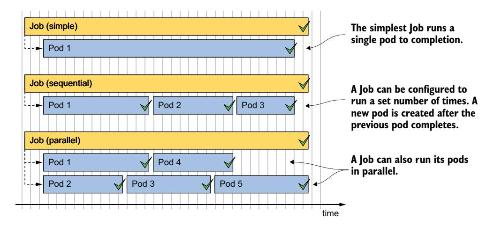
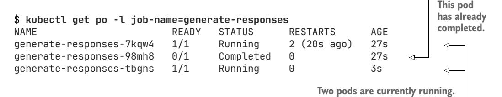
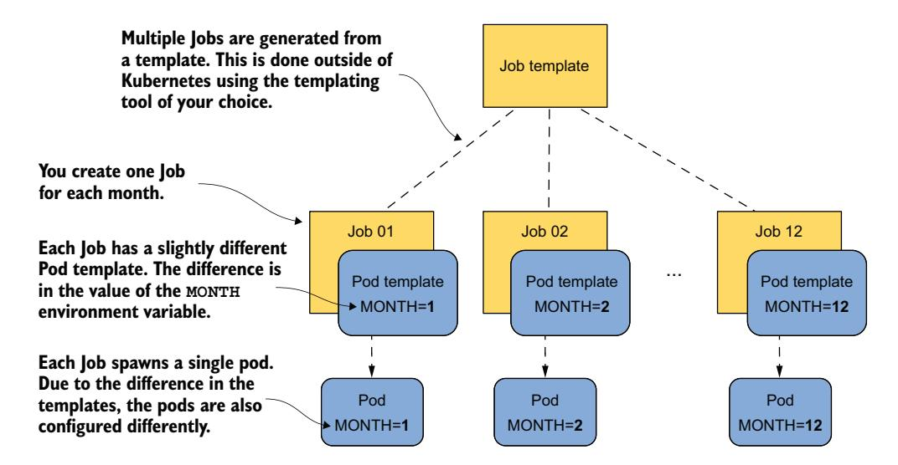
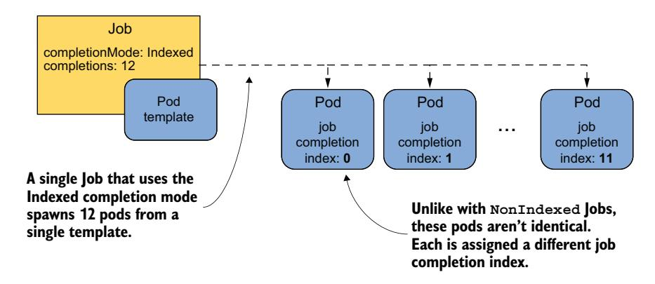
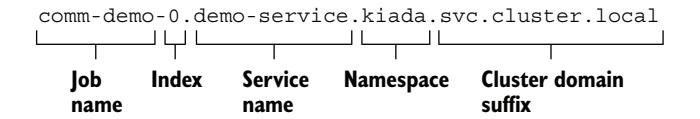
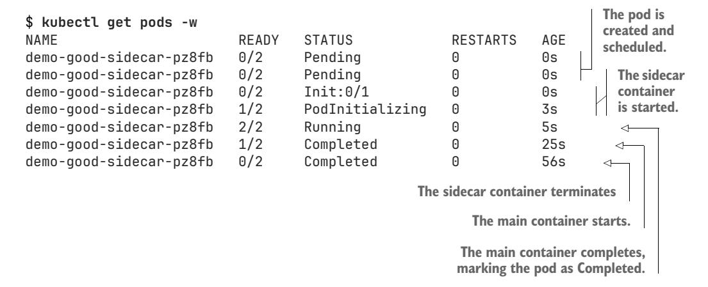
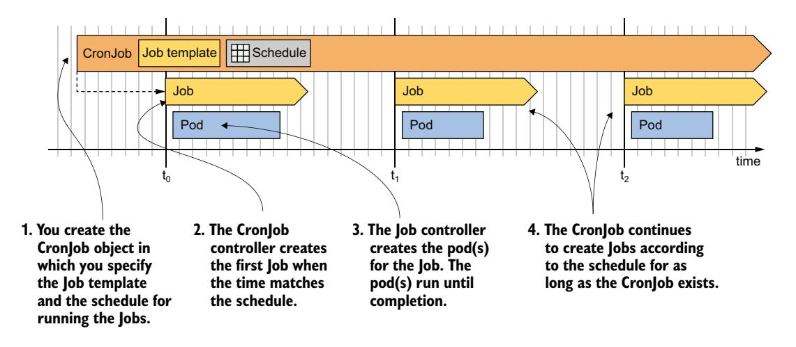
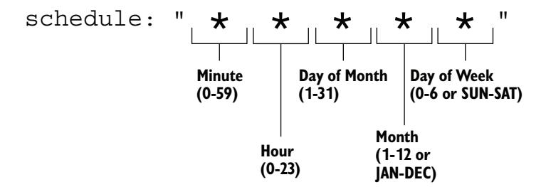

# *Batch processing with Jobs and CronJobs*

# *This chapter covers*

- Running finite tasks with Jobs
- Handling Job failures
- Parameterizing pods created through a Job
- Processing items in a work queue
- Enabling communication between a Job's Pods
- Using CronJobs to run Jobs at a specific time or at regular intervals

As you learned in the previous chapters, a pod created via a Deployment, Stateful-Set, or DaemonSet, runs continuously. When the process running in one of the pod's containers terminates, the Kubelet restarts the container. The pod never stops on its own, but only when you delete the Pod object. Although this feature is ideal for running web servers, databases, system services, and similar workloads, it's not suitable for finite workloads that only need to perform a single task.

 A finite workload doesn't run continuously but lets a task run to completion. In Kubernetes, you run this type of workload using the *Job* resource. However, a Job always runs its pods immediately, so you can't use it for scheduling tasks. For that, you need to wrap the Job in a *CronJob* object. This allows you to schedule the task to run at a specific time in the future or at regular intervals.

 In this chapter, you'll learn everything about Jobs and CronJobs. Before we begin, create the kiada Namespace, switch to the Chapter18/ directory, and apply all the manifests in the SETUP/ directory by running the following commands:

```
$ kubectl create ns kiada
$ kubectl config set-context --current --namespace kiada
$ kubectl apply -f SETUP -R
```

NOTE The code files for this chapter are available at [https://github.com/](https://github.com/luksa/kubernetes-in-action-2nd-edition/tree/master/Chapter18) [luksa/kubernetes-in-action-2nd-edition/tree/master/Chapter18.](https://github.com/luksa/kubernetes-in-action-2nd-edition/tree/master/Chapter18)

Don't be alarmed if you find that one of the containers in each quiz Pod fails to become ready. This is to be expected since the MongoDB database running in those pods hasn't yet been initialized. You'll create a Job resource to do just that.

# *18.1 Running tasks with the Job resource*

Before you create your first pod via the Job resource, let's think about the pods in the kiada Namespace. They're all meant to run continuously. When a container in one of these pods terminates, it's automatically restarted. When the pod is deleted, it's recreated by the controller that created the original pod. For example, if you delete one of the kiada pods, it's quickly recreated by the Deployment controller because the replicas field in the kiada Deployment specifies that three pods should always exist.

 Now consider a pod whose job is to initialize the MongoDB database. You don't want it to run continuously; you want it to perform one task and then exit. Although you want the pod's containers to restart if they fail, you don't want them to restart when they finish successfully. You also don't want a new pod to be created after you delete the pod that completed its task.

 You may recall that you already created such a pod in chapter 15, namely the quizdata-importer Pod. It was configured with the OnFailure restart policy to ensure that the container would restart only if it failed. When the container completed successfully, the pod was finished, and you could delete it. Since you created this pod directly and not through a Deployment, StatefulSet, or DaemonSet, it wasn't recreated. So, what's wrong with this approach, and why would you create the pod via a Job instead?

 To answer this question, consider what happens if someone accidentally deletes the pod prematurely or if the node running the pod fails. In these cases, Kubernetes wouldn't automatically recreate the pod. You'd have to do that yourself. And you'd have to watch that pod from creation to completion. That might be fine for a pod that completes its task in seconds, but you probably don't want to be stuck watching a pod for hours. So, it's better to create a Job object and let Kubernetes do the rest.

# *18.1.1 Introducing the Job resource*

The Job resource resembles a Deployment in that it creates one or more pods. However, instead of ensuring that those pods run indefinitely, it only ensures that a certain number of them complete successfully.

 As you can see in figure 18.1, the simplest Job runs a single pod to completion, whereas more complex Jobs run multiple pods, either sequentially or concurrently. When all containers in a pod terminate with success, the pod is considered completed. When all the pods have completed, the Job itself is also completed.



Figure 18.1 Three different Job examples. Each Job is completed once its pods have completed successfully.

As you might expect, a Job resource defines a Pod template and the number of pods that must be successfully completed. It also defines the number of pods that may run in parallel.

NOTE Unlike Deployments and other resources that contain a Pod template, you can't modify the template in a Job object after creating the object.

Let's look at what the simplest Job object looks like.

#### DEFINING A JOB RESOURCE

In this section, you take the quiz-data-importer Pod from chapter 15 and turn it into a Job. This pod imports the data into the Quiz MongoDB database. You may recall that before running this pod, you had to initiate the MongoDB replica set by issuing a command in one of the quiz Pods. You can do that in this Job as well, using an init container. The Job and the pod it creates are presented in figure 18.2.

 Listing 18.1 shows the Job manifest, which you can find in the file job.quizinit.yaml. The manifest file also contains a ConfigMap in which the quiz questions are stored, but this ConfigMap is not shown in the listing.


Figure 18.2 An overview of the **quiz-init** Job

command:

#### Listing 18.1 A Job manifest for running a single task

```
apiVersion: batch/v1 
kind: Job 
metadata:
 name: quiz-init
 labels:
 app: quiz
 task: init
spec:
 template: 
 metadata: 
 labels: 
 app: quiz 
 task: init 
 spec:
 restartPolicy: OnFailure 
 initContainers: 
 - name: init 
 image: mongo:5 
 command: 
 - sh 
 - -c 
 - | 
 mongosh mongodb://quiz-0.quiz-pods.kiada.svc.cluster.local \ 
 --quiet --file /dev/stdin <<EOF 
 # MongoDB code that initializes the replica set 
 # Refer to the job.quiz-init.yaml file to see the actual code 
 EOF 
 containers: 
 - name: import 
 image: mongo:5 
                             This manifest defines a Job object from 
                             the batch API group, version v1.
                              The Pod template 
                              starts here.
                                 Assign labels to the pod so 
                                 everyone knows its role in the 
                                 system. This is optional.
                                          Jobs can't use the default "Always" 
                                          restart policy. They must use either 
                                          OnFailure or Never.
                                                             The init container
                                                                  initiates the
                                                                    MongoDB
                                                                  replica set.
                                  The main container imports the quiz questions 
                                  from the questions.json file, which is mounted 
                                  into the container via a ConfigMap volume.
```

```
 - mongoimport 
 - mongodb+srv://quiz-pods.kiada.svc.cluster.local/kiada?tls=false 
 - --collection 
 - questions 
 - --file 
 - /questions.json 
 - --drop 
 volumeMounts: 
 - name: quiz-data 
 mountPath: /questions.json 
 subPath: questions.json 
 readOnly: true 
 volumes:
 - name: quiz-data
 configMap:
 name: quiz-data
                                          The main container imports the quiz
                                         questions from the questions.json file,
                                          which is mounted into the container
                                                  via a ConfigMap volume.
```

The manifest in the listing defines a Job object that runs a single pod to completion. Jobs belong to the batch API group, and you're using API version v1 to define the object. The pod that this Job creates consists of two containers that execute in sequence, as one is an init and the other a normal container. The init container makes sure that the MongoDB replica set is initialized, and then the main container imports the quiz questions from the quiz-data ConfigMap that's mounted into the container through a volume.

 The Pod's restartPolicy is set to OnFailure. A pod defined within a Job can't use the default policy of Always, as that would prevent the pod from completing.

NOTE In a Job's pod template, you must explicitly set the restart policy to either OnFailure or Never.

You'll notice that unlike Deployments, the Job manifest in the listing doesn't define a selector. While you can specify it, you don't have to, as Kubernetes sets it automatically. The Pod template in the listing does contain two labels, but they're there only for your convenience.

#### RUNNING A JOB

The Job controller creates the pods immediately after you create the Job object. To run the quiz-init Job, apply the job.quiz-init.yaml manifest with kubectl apply.

# DISPLAYING A BRIEF JOB STATUS

To get a brief overview of the Job's status, list the Jobs in the current namespace as follows:

#### \$ **kubectl get jobs** NAME STATUS COMPLETIONS DURATION AGE quiz-init Running 0/1 3s 3s

The STATUS column shows whether the Job is running, has failed, or has completed. The COMPLETIONS column indicates how many times the Job has run and how many times it's configured to complete. The DURATION column shows how long the Job has been running. Since the task the quiz-init Job performs is relatively short, its status should change within a few seconds. List the Jobs again to confirm this:

```
$ kubectl get jobs
NAME STATUS COMPLETIONS DURATION AGE
quiz-init Complete 1/1 6s 42s
```

The output shows that the Job is now complete, which took 6 seconds.

# DISPLAYING THE DETAILED JOB STATUS

To see more details about the Job, use the kubectl describe command as follows:

```
$ kubectl describe job quiz-init
Name: quiz-init
Namespace: kiada
Selector: controller-uid=98f0fe52-12ec-4c76-a185-4ccee9bae1ef 
Labels: app=quiz
 task=init
Annotations: batch.kubernetes.io/job-tracking:
Parallelism: 1
Completions: 1
Completion Mode: NonIndexed
Start Time: Sun, 02 Oct 2022 12:17:59 +0200
Completed At: Sun, 02 Oct 2022 12:18:05 +0200
Duration: 6s
Pods Statuses: 0 Active / 1 Succeeded / 0 Failed 
Pod Template:
 Labels: app=quiz 
 batch.kubernetes.io/controller-uid=98f0fe52-12ec-4c76-a185-4ccee9bae1ef
 batch.kubernetes.io/job-name=quiz-init 
 controller-uid=98f0fe52-12ec-4c76-a185-4ccee9bae1ef 
 job-name=quiz-init 
 task=init 
 Init Containers:
 init: ...
 Containers:
 import: ...
 Volumes:
 quiz-data: ...
Events:
 Type Reason Age From Message
 ---- ------ ---- ---- -------
 Normal SuccessfulCreate 7m33s job-controller Created pod: quiz-init-xpl8d 
 Normal Completed 7m27s job-controller Job completed 
                                                             Auto-generated
                                                          selector for this Job
                                                      The status of 
                                                      this Job's Pods
                                         In addition to the labels you defined in the Pod
                                           template, the controller-uid and job-name
                                                  labels were added automatically.
```

**The Job events show that a single pod was created for this Job and that the Job is complete.**

In addition to the Job name, namespace, labels, annotations, and other properties, the output of the kubectl describe command also shows the selector that was automatically assigned. The controller-uid label used in the selector was also automatically added to the Job's Pod template. The job-name label was also added to the template. As you'll see in the next section, you can easily use this label to list the pods that belong to a particular Job.

 At the end of the kubectl describe output, you see the Events associated with this Job object. Only two events were generated for this Job: the creation of the pod and the successful completion of the Job.

#### EXAMINING THE PODS THAT BELONG TO A JOB

To list the pods created for a particular Job, you can use the job-name label that's automatically added to those pods. To list the pods of the quiz-init job, run the following command:

```
$ kubectl get pods -l job-name=quiz-init
NAME READY STATUS RESTARTS AGE
quiz-init-xpl8d 0/1 Completed 0 25m
```

The pod shown in the output has finished its task. The Job controller doesn't delete the pod, so you can see its status and view its logs.

#### EXAMINING THE LOGS OF A JOB POD

The fastest way to see the logs of a Job is to pass the Job name instead of the Pod name to the kubectl logs command. To see the logs of the quiz-init Job, you could do something like the following:

```
$ kubectl logs job/quiz-init --all-containers --prefix 
[pod/quiz-init-xpl8d/init] Replica set initialized successfully! 
[pod/quiz-init-xpl8d/import] 2022-10-02T10:51:01.967+0000 connected to: ...
[pod/quiz-init-xpl8d/import] 2022-10-02T10:51:01.969+0000 dropping: 
     kiada.questions 
[pod/quiz-init-xpl8d/import] 2022-10-02T10:51:03.811+0000 6 document(s) 
     imported... 
                              Use the --all-containers option to display the logs of
                                all the Pod's containers, and the --prefix option to
                                prefix each line with the pod and container name. The init 
                                                                                container's 
                                                                                log
                                                                The import container's log
```

The --all-containers option tells kubectl to print the logs of all the pod's containers, and the --prefix option ensures that each line is prefixed with the source, that is, the pod and container names.

 The output contains both the init and the import container logs. These logs indicate that the MongoDB replica set has been successfully initialized and that the question database has been populated with data.

#### SUSPENDING ACTIVE JOBS AND CREATING JOBS IN A SUSPENDED STATE

When you created the quiz-init Job, the Job controller created the pod as soon as you created the Job object. However, you can also create Jobs in a suspended state. Let's try this out by creating another Job. As you can see in the following listing, you suspend it by setting the suspend field to true. You can find this manifest in the file job.demo-suspend.yaml.

#### Listing 18.2 The manifest of a suspended Job

```
apiVersion: batch/v1
kind: Job
metadata:
 name: demo-suspend
spec:
 suspend: true 
 template:
 spec:
 restartPolicy: OnFailure
 containers:
 - name: demo
 image: busybox
 command:
 - sleep
 - "60"
                          This Job is suspended. When you 
                          create the Job, no pods are created 
                          until you unsuspend the Job.
```

Apply the manifest in the listing to create the Job. List the pods as follows to confirm that none have been created yet:

```
$ kubectl get po -l job-name=demo-suspend
No resources found in kiada namespace.
```

The Job controller generates an Event indicating the suspension of the Job. You can see it when you run kubectl get events or when you describe the Job with kubectl describe:

```
$ kubectl describe job demo-suspend
...
Events:
 Type Reason Age From Message
 ---- ------ ---- ---- -------
 Normal Suspended 3m37s job-controller Job suspended
```

When you're ready to run the Job, you unsuspend it by patching the object as follows:

```
$ kubectl patch job demo-suspend -p '{"spec":{"suspend": false}}'
job.batch/demo-suspend patched
```

The Job controller creates the pod and generates an Event indicating that the Job has resumed.

 You can also suspend a running Job, whether you created it in a suspended state or not. To suspend a Job, set suspend to true with the following kubectl patch command:

```
$ kubectl patch job demo-suspend -p '{"spec":{"suspend": true}}'
job.batch/demo-suspend patched
```

The Job controller immediately deletes the pod associated with the Job and generates an Event indicating that the Job has been suspended. The pod's containers are shut down gracefully, as they are every time you delete a pod, regardless of how it was created. You can resume the Job at your discretion by resetting the suspend field to false.

#### DELETING JOBS AND THEIR PODS

You can delete a Job any time. Regardless of whether its pods are still running, they're deleted in the same way as when you delete a Deployment, StatefulSet, or DaemonSet. You don't need the quiz-init Job anymore, so delete it as follows:

\$ **kubectl delete job quiz-init** job.batch "quiz-init" deleted

Confirm that the pod has also been deleted by listing the pods as follows:

\$ **kubectl get po -l job-name=quiz-init** No resources found in kiada namespace.

You may recall that pods are deleted by the garbage collector because they're orphaned when their owner, in this case the Job object named quiz-init, is deleted. If you want to delete only the Job, but keep the pods, you delete the Job with the --cascade=orphan option. You can try this method with the demo-suspend Job as follows:

\$ **kubectl delete job demo-suspend --cascade=orphan**

job.batch "demo-suspend" deleted

If you now list pods, you'll see that the pod still exists. Since it's now a standalone pod, it's up to you to delete it when you no longer need it.

# AUTOMATICALLY DELETING JOBS

By default, you must delete Job objects manually. However, you can flag the Job for automatic deletion by setting the ttlSecondsAfterFinished field in the Job's spec. As the name implies, this field specifies how long the Job and its pods are kept after the Job is finished.

 To see this setting in action, try creating the Job in the job.demo-ttl.yaml manifest. The Job will run a single pod that will complete successfully after 20 seconds. Since ttlSecondsAfterFinished is set to 10, the Job and its pod are deleted 10 seconds later.

WARNING If you set the ttlSecondsAfterFinished field in a Job, the Job and its pods are deleted whether the Job completes successfully or not. If this happens before you can check the logs of the failed pods, it's hard to determine what caused the Job to fail.

# *18.1.2 Running a task multiple times*

In the previous section, you learned how to execute a task once. However, you can also configure the Job to execute the same task several times, either in parallel or sequentially. This may be necessary because the container running the task can only process a single item, so you need to run the container multiple times to process the entire input, or you may simply want to run the processing on multiple cluster nodes to improve performance.

 You'll now create a Job that inserts fake responses into the Quiz database, simulating a large number of users. Instead of having only one pod that inserts data into the database, as in the previous example, you'll configure the Job to create five such pods. However, instead of running all five pods simultaneously, you'll configure the Job to run at most two pods at a time. The following listing shows the Job manifest. You can find it in the file job.generate-responses.yaml.

Listing 18.3 A Job for running a task multiple times

```
apiVersion: batch/v1 
kind: Job 
metadata: 
 name: generate-responses 
 labels:
 app: quiz
spec:
 completions: 5 
 parallelism: 2 
 template:
 metadata:
 labels:
 app: quiz
 spec:
 restartPolicy: OnFailure
 containers:
 - name: mongo
 image: mongo:5
 command:
 ...
                                  This manifest describes the 
                                  generate-responses Job.
                           This Job runs 
                           five times.
                             This Job runs up 
                             to two pods in 
                             parallel.
```

In addition to the Pod template, the Job manifest in the listing defines two new properties, completions and parallelism, which are explained next.

#### UNDERSTANDING JOB COMPLETIONS AND PARALLELISM

The completions field specifies the number of pods that must be successfully completed for this Job to be complete. The parallelism field specifies how many of these pods may run in parallel. There is no upper limit to these values, but your cluster may only be able to run so many pods in parallel.

 You may choose to set neither of these fields, one of them, or both. If neither field is set, both values default to one. If you set only completions, this is the number of pods that run one after the other. If you set only parallelism, this is the number of pods that run, but only one must complete successfully for the Job to be complete.

NOTE You can also change the default success policy for a Job. For example, you can tell Kubernetes to count the Job successfully when pods with specific indexes complete successfully. For more information, see kubectl explain job.spec.successPolicy.

If you set parallelism higher than completions, the Job controller creates only as many pods as you specified in the completions field.

 If parallelism is lower than completions, the Job controller runs at most parallelism Pods in parallel but creates additional pods when those first pods complete. It keeps creating new pods until the number of successfully completed pods matches completions. Figure 18.3 shows what happens when completions is 5 and parallelism is 2.


Figure 18.3 Running a parallel Job with completion = 5 and parallelism = 2

As shown in the figure, the Job controller first creates two pods and waits until one of them completes. In the figure, pod 2 is the first to finish. The controller immediately creates the next pod (pod 3), bringing the number of running pods back to two. The controller repeats this process until five pods complete successfully. Table 18.1 explains the behavior for different examples of completions and parallelism.

Table 18.1 Completions and parallelism combinations

| Completions | Parallelism | Job behavior                                                                                                                                                |
|-------------|-------------|-------------------------------------------------------------------------------------------------------------------------------------------------------------|
| Not set     | Not set     | A single pod is created, same as when completions and<br>parallelism is 1.                                                                                  |
| 1           | 1           | A single pod is created. If the pod completes successfully, the Job<br>is complete. If the pod is deleted before completing, it's replaced<br>by a new pod. |

| Completions | Parallelism | Job behavior                                                                                                                                                                                                                                                                                   |
|-------------|-------------|------------------------------------------------------------------------------------------------------------------------------------------------------------------------------------------------------------------------------------------------------------------------------------------------|
| 2           | 5           | Only three pods are created, the same as if parallelism was 2.                                                                                                                                                                                                                                 |
| 5           | 2           | Two pods are created initially. When one of them completes, the<br>third pod is created. There are again two pods running. When one<br>of the two completes, the fourth pod is created. There are again<br>two pods running. When another one completes, the fifth and last<br>pod is created. |
| 5           | 5           | Five pods run simultaneously. If one of them is deleted before it<br>completes, a replacement is created. The Job is complete when<br>five pods complete successfully.                                                                                                                         |
| 5           | Not set     | Five pods are created sequentially. A new pod is created only<br>when the previous pod completes (or fails).                                                                                                                                                                                   |
| Not set     | 5           | Five pods are created simultaneously, but only one needs to com<br>plete successfully for the Job to complete.                                                                                                                                                                                 |

Table 18.1 Completions and parallelism combinations *(continued)*

In the generate-responses Job that you're about to create, the number of completions is set to 5 and parallelism is set to 2, so at most, two pods will run in parallel. The Job isn't complete until five pods complete successfully. The total number of pods may end up being higher if some of the pods fail. More on this in the next section.

#### RUNNING THE JOB

Use kubectl apply to create the Job by applying the manifest file job.generateresponses.yaml. List the pods while running the Job as follows:



List the pods several times to observe the number of pods whose STATUS is shown as Running or Completed. As you can see, at any given time, at most two pods run simultaneously. After some time, the Job completes. You can see this by displaying the Job status with the kubectl get command as follows:

| \$ kubectl get job generate-responses | It took 110<br>seconds to |             |              |      |              |
|---------------------------------------|---------------------------|-------------|--------------|------|--------------|
| NAME                                  | STATUS                    | COMPLETIONS | DURATION AGE |      | run this Job |
| generate-responses                    | Complete                  | 5/5         | 110s         | 115s | five times.  |

The COMPLETIONS column shows that this Job completed five out of the desired five times, which took 110 seconds. If you list the pods again, you should see five completed pods, as follows:

|                                                                                                                                                                                                      | These pods' container terminated<br>successfully the first time it ran.                                                                                                                                          |                                                                         |                                   |                                               |  |  |
|------------------------------------------------------------------------------------------------------------------------------------------------------------------------------------------------------|------------------------------------------------------------------------------------------------------------------------------------------------------------------------------------------------------------------|-------------------------------------------------------------------------|-----------------------------------|-----------------------------------------------|--|--|
| \$ kubectl get po -l job-name=generate-responses<br>NAME<br>generate-responses-5xtlk<br>generate-responses-7kqw4<br>generate-responses-98mh8<br>generate-responses-tbgns<br>generate-responses-vbvq8 | READY<br>0/1<br>0/1<br>0/1<br>0/1<br>0/1                                                                                                                                                                         | STATUS<br>Completed<br>Completed<br>Completed<br>Completed<br>Completed | RESTARTS<br>0<br>3<br>0<br>1<br>1 | AGE<br>82s<br>2m46s<br>2m46s<br>2m22s<br>111s |  |  |
|                                                                                                                                                                                                      | These pods' container failed once but<br>terminated successfully on the second attempt.<br>This pod's container failed three times, was restarted after<br>each failure, and eventually terminated successfully. |                                                                         |                                   |                                               |  |  |

As indicated in the Job status earlier, you should see five Completed pods. However, if you look closely at the RESTARTS column, you'll notice that some of these pods had to be restarted. The reason for this is that I hard-coded a 25% failure rate into the code running in those pods to show what happens when an error occurs.

# *18.1.3 Understanding how Job failures are handled*

As explained earlier, the reason for running tasks through a Job rather than directly through pods is that Kubernetes ensures that the task is completed even if the individual pods or their nodes fail. However, there are two levels at which such failures are handled:

- At the Pod level
- At the Job level

When a container in the pod fails, the pod's restartPolicy determines whether the failure is handled at the Pod level by the Kubelet or at the Job level by the Job controller. As shown in figure 18.4, if the restartPolicy is OnFailure, the failed container is restarted within the same pod. However, if the policy is Never, the entire pod is marked as failed and the Job controller creates a new pod.

Let's examine the difference between these two scenarios.

#### HANDLING FAILURES AT THE POD LEVEL

In the generate-responses Job you created in the previous section, the pod's restart-Policy was set to OnFailure. As discussed earlier, whenever the container is executed, there is a 25% chance that it'll fail. In these cases, the container terminates with a non-zero exit code. The Kubelet notices the failure and restarts the container.

 The new container runs in the same pod on the same node and therefore allows for a quick turnaround. The container may fail again and get restarted several times but will eventually terminate successfully, and the pod will be marked complete.

NOTE As you learned in one of the previous chapters, the Kubelet doesn't restart the container immediately if it crashes multiple times, but it adds a delay after each crash and doubles it after each restart.


Figure 18.4 How failures are handled depending on the pod's restart policy

#### HANDLING FAILURES AT THE JOB LEVEL

When the Pod template in a Job manifest sets the Pod's restartPolicy to Never, the Kubelet doesn't restart its containers. Instead, the entire pod is marked as failed and the Job controller must create a new pod. This new pod might be scheduled on a different node.

NOTE If the pod is scheduled to run on a different node, the container images may need to be downloaded before the container can run.

If you want to see the Job controller handle the failures in the generate-responses Job, delete the existing Job and recreate it from the manifest file job.generate-responses .restartPolicyNever.yaml. In this manifest, the pod's restartPolicy is set to Never.

 The Job completes in about a minute or two. If you list the pods as follows, you'll notice that it has now taken more than five pods to get the job done.

|                                                  |       |        |          | Two pods failed. Their container wasn't<br>restarted due to the restartPolicy. |  |  |
|--------------------------------------------------|-------|--------|----------|--------------------------------------------------------------------------------|--|--|
| \$ kubectl get po -l job-name=generate-responses |       |        |          |                                                                                |  |  |
| NAME                                             | READY | STATUS | RESTARTS | AGE                                                                            |  |  |
| generate-responses-2dbrn                         | 0/1   | Error  | 0        | 2m43s                                                                          |  |  |
| generate-responses-4pckt                         | 0/1   | Error  | 0        | 2m39s                                                                          |  |  |

| generate-responses-8c8wz | 0/1 | Completed | 0 | 2m43s |               |
|--------------------------|-----|-----------|---|-------|---------------|
| generate-responses-bnm4t | 0/1 | Completed | 0 | 3m10s | Five pods     |
| generate-responses-kn55w | 0/1 | Completed | 0 | 2m16s | completed     |
| generate-responses-t2r67 | 0/1 | Completed | 0 | 3m10s | successfully. |
| generate-responses-xpbnr | 0/1 | Completed | 0 | 2m34s |               |

You should see five Completed Pods and a few pods whose status is Error. The number of those pods should match the number of successful and failed pods when you inspect the Job object using the kubectl describe job command as follows:

```
$ kubectl describe job generate-responses
...
Pods Statuses: 0 Active / 5 Succeeded / 2 Failed
...
```

NOTE It's possible that the number of pods is different in your case. It's also possible that the Job isn't completed. This is explained in the next section.

To conclude this section, delete the generate-responses Job.

#### PREVENTING JOBS FROM FAILING INDEFINITELY

The two Jobs you created in the previous sections may not have completed because they failed too many times. When that happens, the Job controller gives up. Let's demonstrate this by creating a Job that always fails. You can find the manifest in the file job.demo-always-fails.yaml. Its content is shown in the following listing.

#### Listing 18.4 A Job that always fails

```
apiVersion: batch/v1
kind: Job
metadata:
 name: demo-always-fails
spec:
 completions: 10
 parallelism: 3
 template:
 spec:
 restartPolicy: OnFailure
 containers:
 - name: demo
 image: busybox
 command:
 - 'false' 
                                 This command terminates with 
                                 a non-zero exit code, causing the 
                                 container to be treated as failed.
```

When you create the Job in this manifest, the Job controller creates three pods. The container in these pods terminates with a non-zero exit code, which causes the Kubelet to restart it. After a few restarts, the Job controller notices that these pods are failing, so it deletes them and marks the Job as failed. You can see that the Job has failed by inspecting the STATUS column:

```
$ kubectl get job
```

```
NAME STATUS COMPLETIONS DURATION AGE
demo-always-fails Failed 0/10 2m48s 2m48s
```

As always, you can see more information by running kubectl describe as follows:

#### \$ **kubectl describe job demo-always-fails**

| <br>Events: |                                                                       |      |      |                                                               |
|-------------|-----------------------------------------------------------------------|------|------|---------------------------------------------------------------|
| Type        | Reason                                                                | Age  | From | Message                                                       |
|             |                                                                       |      |      |                                                               |
| Normal      | SuccessfulCreate                                                      | 5m6s |      | job-controller Created pod: demo-always-<br>fails-t9xkw       |
| Normal      | SuccessfulCreate                                                      | 5m6s |      | job-controller Created pod: demo-always-<br>fails-6kcb2       |
| Normal      | SuccessfulCreate                                                      | 5m6s |      | job-controller Created pod: demo-always-<br>fails-4nfmd       |
| Normal      | SuccessfulDelete                                                      |      |      | 4m43s job-controller Deleted pod: demo-always-<br>fails-4nfmd |
| Normal      | SuccessfulDelete                                                      |      |      | 4m43s job-controller Deleted pod: demo-always-<br>fails-6kcb2 |
| Normal      | SuccessfulDelete                                                      |      |      | 4m43s job-controller Deleted pod: demo-always-<br>fails-t9xkw |
|             | Warning BackoffLimitExceeded 4m43s job-controller Job has reached the |      |      | specified backoff limit                                       |

The Warning event at the bottom indicates that the backoff limit of the Job has been reached, which means that the Job has failed. You can confirm this by checking the Job status as follows:

```
$ kubectl get job demo-always-fails -o yaml
...
status:
 conditions:
 - lastProbeTime: "2022-10-02T15:42:39Z"
 lastTransitionTime: "2022-10-02T15:42:39Z"
 message: Job has reached the specified backoff limit 
 reason: BackoffLimitExceeded 
 status: "True" 
 type: Failed 
 failed: 3
 startTime: "2022-10-02T15:42:16Z"
 uncountedTerminatedPods: {}
                                                                   The reason why 
                                                                   the Job has failed
                                               The status of the Job's 
                                               Failed condition is True, 
                                               indicating that the Job 
                                               has failed.
```

It's almost impossible to see this, but the Job ended after six retries, which is the default backoff limit. You can set this limit for each Job in the spec.backoffLimit field in its manifest.

 Once a Job exceeds this limit, the Job controller deletes all running pods and no longer creates new pods for it. To restart a failed Job, you must delete and recreate it.

#### LIMITING THE TIME ALLOWED FOR A JOB TO COMPLETE

Another way a Job can fail is if it doesn't finish on time. By default, this time isn't limited, but you can set the maximum time using the activeDeadlineSeconds field in the Job's spec, as shown in the following listing (see the manifest file job.demo-deadline.yaml):

#### Listing 18.5 A Job with a time limit

```
apiVersion: batch/v1
kind: Job
metadata:
 name: demo-deadline
spec:
 completions: 2 
 parallelism: 1 
 activeDeadlineSeconds: 90 
 template:
 spec:
 restartPolicy: OnFailure
 containers:
 - name: demo-suspend
 image: busybox
 command:
 - sleep 
 - "60" 
                                       This Job must 
                                       complete twice.
                                          This Job's pods run 
                                          sequentially.
                                       The Job must complete 
                                       in 90 seconds.
                        Each pod completes 
                        after 60 seconds.
```

From the completions field shown in the listing, you can see that the Job requires two completions to be completed. Since parallelism is set to 1, the two pods run one after the other. Given the sequential execution of these two pods and the fact that each pod needs 60 seconds to complete, the execution of the entire Job takes just over 120 seconds. However, since activeDeadlineSeconds for this Job is set to 90, the Job can't be successful. Figure 18.5 illustrates this scenario.


Figure 18.5 Setting a time limit for a Job

To see this for yourself, create this Job by applying the manifest and wait for it to fail. When it does, the following Event is generated by the Job controller:

```
$ kubectl describe job demo-deadline
...
Events:
 Type Reason Age From Message
 ---- ------ ---- ---- -------
 Warning DeadlineExceeded 1m job-controller Job was active longer than 
 specified deadline
```

NOTE Remember that the activeDeadlineSeconds in a Job applies to the Job as a whole, not to the individual pods created in the context of that Job.

#### DEFINING CUSTOM FAILURE POLICY RULES

Instead of the default Job failure policy explained earlier, you can also specify your own set of failure policy rules in the Job's spec.podFailurePolicy field. For example, you can set a rule that marks the entire Job as failed when a specific container terminates with a specific exit code, as in the following snippet:

```
kind: Job
spec:
 podFailurePolicy:
 rules:
 - onExitCodes: 
 containerName: main 
 operator: In 
 values: [123] 
 action: FailJob 
                                   When the container named 
                                   main exits with exit code 123, the 
                                   entire Job is marked as failed.
```

Instead of failing the entire Job, you can also have the pod's specific index marked as failed, or you can ignore certain exit codes. For more information on Job failure policy rules, run kubectl explain job.spec.podFailurePolicy.

# *18.1.4 Parameterizing pods in a Job*

Until now, the tasks you performed in each Job were identical. For example, the pods in the generate-responses Job all did the same thing: they inserted a series of responses into the database. But what if you want to run a series of related tasks that aren't identical? Maybe you want each pod to process only a subset of the data? That's where the Job's completionMode field comes in.

 At the time of writing, two completion modes are supported: Indexed and Non-Indexed. The Jobs you created so far in this chapter were NonIndexed, as this is the default mode. All pods created by such a Job are indistinguishable from each other. However, if you set the Job's completionMode to Indexed, each pod is given an index number that you can use to distinguish the pods. This allows each pod to perform only a portion of the entire task. Table 18.2 shows a comparison between the two completion modes.

NOTE In the future, Kubernetes may support additional modes for Job processing, either through the built-in Job controller or through additional controllers.

Table 18.2 Supported Job completion modes

| Value      | Description                                                                                                                                                                                                                                                                                                                                                                                                                                                         |
|------------|---------------------------------------------------------------------------------------------------------------------------------------------------------------------------------------------------------------------------------------------------------------------------------------------------------------------------------------------------------------------------------------------------------------------------------------------------------------------|
| NonIndexed | The Job is considered complete when the number of successfully completed pods<br>created by this Job equals the value of the spec.completions field in the Job man<br>ifest. All pods are equal. This is the default mode.                                                                                                                                                                                                                                          |
| Indexed    | Each pod is given a completion index (starting at 0) to distinguish the pods from<br>each other. By default, the Job is considered complete when there is one success<br>fully completed pod for each index. If a pod with a particular index fails, the Job con<br>troller creates a new pod with the same index. You can also change the default<br>success policy so that the Job counts as successful when pods with specific indexes<br>complete successfully. |
|            | The completion index assigned to each pod is specified in the pod annotation<br>batch.kubernetes.io/job-completion-index and in the JOB_COMPLETION_<br>INDEX environment variable in the pod's containers.                                                                                                                                                                                                                                                          |

To better understand these completion modes, you'll create a Job that reads the responses in the Quiz database, calculates the number of valid and invalid responses for each day, and stores those results back in the database. You'll do this in two ways, using both completion modes so you understand the difference.

#### IMPLEMENTING THE AGGREGATION SCRIPT

As you can imagine, the Quiz database can get very large if many users are using the application. Therefore, you don't want a single pod to process all the responses, but rather you want each pod to process only a specific month.

 I've prepared a script that does this. The pods will obtain this script from a Config-Map. You can find its manifest in the file cm.aggregate-responses.yaml. The actual code is unimportant, but what is important is that it accepts two parameters: the *year* and *month* to process. The code reads these parameters via the environment variables YEAR and MONTH, as you can see in the following listing.

Listing 18.6 The ConfigMap with the MongoDB script for processing Quiz responses

```
apiVersion: v1
kind: ConfigMap 
metadata:
 name: aggregate-responses
 labels:
 app: aggregate-responses
data:
 script.js: |
 var year = parseInt(process.env["YEAR"]); 
 var month = parseInt(process.env["MONTH"]); 
 ...
                                                      The script reads the year and month 
                                                      from environment variables.
```

Apply this ConfigMap manifest to your cluster with the following command:

```
$ kubectl apply -f cm.aggregate-responses.yaml 
configmap/aggregate-responses created
```

Now imagine you want to calculate the totals for each month of 2020. Since the script only processes a single month, you need 12 pods to process the whole year. How should you create the Job to generate these pods, since you need to pass a different month to each pod?

#### THE NONINDEXED COMPLETION MODE

Before completionMode support was added to the Job resource, all Jobs operated in the so-called NonIndexed mode. The problem with this mode is that all generated pods are identical (figure 18.6).


Figure 18.6 Jobs using the **NonIndexed completionMode** spawn identical pods

So, if you use this completion mode, you can't pass a different MONTH value to each pod. You must create a separate Job object for each month. This way, each Job can set the MONTH environment variable in the pod template to a different value, as shown in figure 18.7.



Figure 18.7 Creating similar Jobs from a template

To create these different Jobs, you need to create separate Job manifests. You can do this manually or using an external templating system. Kubernetes itself doesn't provide any functionality for creating Jobs from templates.

 Let's return to our example with the aggregate-responses Job. To process the entire year 2020, you need to create 12 Job manifests. You could use a full-blown template engine for this task, but you can also do it with a relatively simple shell command.

 First you must create the template. You can find it in the file job.aggregateresponses-2020.tmpl.yaml. The following listing shows how it looks.

Listing 18.7 A template for creating Job manifests for the **aggregate-responses** Job

```
apiVersion: batch/v1
kind: Job
metadata:
 name: aggregate-responses-2020-__MONTH__ 
spec:
 completionMode: NonIndexed
 template:
 spec:
 restartPolicy: OnFailure
 containers:
 - name: updater
 image: mongo:5
 env:
 - name: YEAR
 value: "2020"
 - name: MONTH
 value: "__MONTH__" 
 ...
                                                    The name contains the placeholder 
                                                    "__MONTH__". When this 
                                                    template is rendered, the 
                                                    placeholder is replaced with 
                                                    the actual month number.
                                      The same placeholder is used in 
                                      the MONTH environment variable 
                                      that is passed to the container.
```

If you use Bash, you can create the manifests from this template and apply them directly to the cluster with the following command:

```
$ for month in {1..12}; do \ 
 sed -e "s/__MONTH__/$month/g" job.aggregate-responses-2020.tmpl.yaml \ 
 | kubectl apply -f - ; \ 
 done
job.batch/aggregate-responses-2020-1 created 
job.batch/aggregate-responses-2020-2 created 
... 
job.batch/aggregate-responses-2020-12 created 
                                            Executes a loop to 
                                            repeat the following 
                                            command 12 times
                                                                      Renders the template by
                                                                     replacing the placeholder
                                                                        __MONTH__ with the
                                                                              month number
                                                                      Applies the rendered 
                                                                      YAML file to the cluster
                                                         The output of the command shows 
                                                         that 12 different Job objects have 
                                                         been created.
```

This command uses a for-loop to render the template 12 times. Rendering the template simply means replacing the string \_\_MONTH\_\_ in the template with the actual month number. The resulting manifest is applied to the cluster using kubectl apply.

NOTE If you want to run this example but don't use Linux, you can use the manifests I created for you. Use the following command to apply them to your cluster: kubectl apply -f job.aggregate-responses-2020.generated.yaml.

The 12 Jobs you just created are now running in your cluster. Each Job creates a single Pod that processes a specific month. To see the generated statistics, use the following command:

```
$ kubectl exec quiz-0 -c mongo -- mongosh kiada --quiet --eval 'db.statistics.find()'
[
 { 
 _id: ISODate("2020-02-28T00:00:00.000Z"), 
 totalCount: 120, 
 correctCount: 25, 
 incorrectCount: 95 
 }, 
 ...
                                                         On February 28, 2020, there 
                                                         were a total of 120 responses, 
                                                         with 25 correct and 95 
                                                         incorrect.
```

If all 12 Jobs processed their respective months, you should see many entries like the one shown here. You can now delete all 12 aggregate-responses Jobs as follows:

#### \$ **kubectl delete jobs -l app=aggregate-responses**

In this example, the parameter passed to each Job was a simple integer, but the real advantage of this approach is that you can pass any value or set of values to each Job and its pod. The disadvantage, of course, is that you end up with more than one Job, which means more work compared to managing a single Job object. And if you create those Job objects simultaneously, they will all run simultaneously. That's why creating a single Job using the Indexed completion mode is the better option, as you'll see next.

#### INTRODUCING THE INDEXED COMPLETION MODE

As mentioned earlier, when a Job is configured with the Indexed completion mode, each pod is assigned a completion index (starting at 0) that distinguishes the pod from the other pods in the same Job, as shown in figure 18.8.



Figure 18.8 Pods spawned by a Job with the **Indexed** completion mode each get their own index number.

The number of pods is determined by the completions field in the Job's spec. The Job is considered completed when there is one successfully completed pod for each index.

 The following listing shows a Job manifest that uses the Indexed completion mode to run 12 pods, one for each month. Note that the MONTH environment variable isn't set. This is because the script, as you'll see later, uses the completion index to determine the month to process.

Listing 18.8 A Job manifest using the **Indexed** completion mode

```
apiVersion: batch/v1
kind: Job
metadata:
 name: aggregate-responses-2021
 labels:
 app: aggregate-responses
 year: "2021"
spec:
 completionMode: Indexed 
 completions: 12 
 parallelism: 3 
 template:
 metadata:
 labels:
 app: aggregate-responses
 year: "2021"
 spec:
 restartPolicy: OnFailure
 containers:
 - name: updater
 image: mongo:5
 env:
 - name: YEAR 
 value: "2021" 
 command:
 - mongosh
 - mongodb+srv://quiz-pods.kiada.svc.cluster.local/kiada?tls=false
 - --quiet
 - --file
 - /script.js
 volumeMounts:
 - name: script
 subPath: script.js
 mountPath: /script.js
 volumes:
 - name: script
 configMap: 
 name: aggregate-responses-indexed 
                                     Because the completion mode is Indexed, each 
                                     pod created for this Job is assigned an index 
                                     number, differentiating it from the other pods.
                                        Sets the number of completions 
                                        to process all 12 months
                                      Allows up to three 
                                      pods to run in parallel
                              Only the YEAR environment variable is 
                              set in the Pod template. The month is 
                              passed in through other means. This is 
                              explained later in this section.
                                                  The script that aggregates the 
                                                  responses is loaded from the 
                                                  aggregate-responses-indexed 
                                                  ConfigMap and is slightly different 
                                                  from the previous example.
```

In the listing, the completionMode is Indexed, and the number of completions is 12, as you might expect. To run three pods in parallel, parallelism is set to 3.

## THE JOB\_COMPLETION\_INDEX ENVIRONMENT VARIABLE

Unlike in the aggregate-responses-2020 example, in which you passed in both the YEAR and MONTH environment variables, here you pass in only the YEAR variable. To determine which month the pod should process, the script looks up the environment variable JOB\_COMPLETION\_INDEX, as shown in the following listing.

Listing 18.9 Using the **JOB\_COMPLETION\_INDEX** environment variable in your code

```
apiVersion: v1
kind: ConfigMap
metadata:
 name: aggregate-responses-indexed
 labels:
 app: aggregate-responses-indexed
data:
 script.js: |
 var year = parseInt(process.env["YEAR"]);
 var month = parseInt(process.env["JOB_COMPLETION_INDEX"]) + 1; 
 ...
                                                     The JOB_COMPLETION_INDEX is a
                                                      zero-based environment variable
                                                         that the Job controller sets in
                                                         pods created for a Job whose
                                                          completionMode is Indexed.
```

This environment variable isn't specified in the Pod template but is added to each pod by the Job controller. The workload running in the pod can use this variable to determine which part of a dataset to process.

 In the aggregate-responses example, the value of the variable represents the month number. However, because the environment variable is zero-based, the script must increment the value by 1 to get the month.

## THE JOB-COMPLETION-INDEX ANNOTATION

In addition to setting the environment variable, the Job controller also sets the job completion index in the batch.kubernetes.io/job-completion-index annotation of the pod. Instead of using the JOB\_COMPLETION\_INDEX environment variable, you can pass the index via any environment variable by using the Downward API, as explained in chapter 7. For example, to pass the value of this annotation to the MONTH environment variable, the env entry in the Pod template would look like this:

```
env: 
- name: MONTH 
 valueFrom: 
 fieldRef: 
 fieldPath: metadata.annotations['batch.kubernetes. 
➥io/job-completion-index'] 
                               This env entry sets the 
                               MONTH environment variable.
                                                                     The source of the 
                                                                     value is the specified 
                                                                     annotation of the pod.
```

You might think that with this approach you could just use the same script as in the aggregate-responses-2020 example, but that's not the case. Since you can't do math when using the Downward API, you'd have to modify the script to properly handle the MONTH environment variable, which starts at 0 instead of 1.

#### RUNNING AN INDEXED JOB

To run this indexed variant of the aggregate-responses Job, apply the manifest file job.aggregate-responses-2021-indexed.yaml. You can then track the created pods by running the following command:

|                                                          |       |         |          |                     | Pod with job |
|----------------------------------------------------------|-------|---------|----------|---------------------|--------------|
|                                                          |       |         |          | completion index 0. |              |
| \$ kubectl get pods -l job-name=aggregate-responses-2021 |       |         |          |                     |              |
| NAME                                                     | READY | STATUS  | RESTARTS | AGE                 |              |
| aggregate-responses-2021-0-kptfr                         | 1/1   | Running | 0        | 24s                 |              |
| aggregate-responses-2021-1-r4vfq                         | 1/1   | Running | 0        | 24s                 |              |
| aggregate-responses-2021-2-snz4m                         | 1/1   | Running | 0        | 24s                 |              |
| Pod with job completion index 2.                         |       |         |          |                     |              |
| Pod with job completion index 1.                         |       |         |          |                     |              |

Did you notice that the Pod names contain the job completion index? The Job name is aggregate-responses-2021, but the Pod names are in the form aggregateresponses-2021-<index>-<random string>.

NOTE The completion index also appears in the Pod hostname. The hostname is of the form <job-name>-<index>. This facilitates communication between pods of an indexed Job, as you'll see later.

Now check the Job status with the following command:

```
$ kubectl get jobs
NAME STATUS COMPLETIONS DURATION AGE
aggregate-responses-2021 Running 7/12 2m17s 2m17s
```

Unlike the example where you used multiple Jobs with the NonIndexed completion mode, all the work is done with a single Job object, which makes things much more manageable. Although there are still 12 pods, you don't have to care about them unless the Job fails. When you see that the Job is completed, you can be sure that the task is done, and you can delete the Job to clean everything up.

#### USING THE JOB COMPLETION INDEX IN MORE ADVANCED USE-CASES

In the previous example, the code in the workload used the job completion index directly as input. But what about tasks where the input isn't a simple number?

 For example, imagine a container image that accepts an input file and processes it in some way. It expects the file to be in a certain location and have a certain name. Suppose the file is called /var/input/file.bin. You want to use this image to process 1,000 files. Can you do that with an indexed job without changing the code in the image?

 Yes, you can! By adding an init container and a volume to the Pod template. You create a Job with completionMode set to Indexed and completions set to 1000. In the Job's Pod template, you add two containers and a volume shared by these two containers. One container runs the image that processes the file. Let's call this the main container. The other container is an init container that reads the completion index from the environment variable and prepares the input file on the shared volume.

 If the thousand files you need to process are on a network volume, you can also mount that volume in the pod and have the init container create a symbolic link named file.bin in the pod's shared internal volume to one of the files in the network volume. The init container must make sure that each completion index corresponds to a different file in the network volume.

 If the internal volume is mounted in the main container at /var/input, the main container can process the file without knowing anything about the completion index or the fact that there are a thousand files being processed. Figure 18.9 shows how all this would look.


Figure 18.9 An init container providing the input file to the main container based on the job completion index

As you can see, even though an indexed Job provides only a simple integer to each pod, there is a way to use that integer to prepare much more complex input data for the workload. All you need is an init container that transforms the integer into this input data.

# *18.1.5 Running Jobs with a work queue*

The Jobs in the previous section were assigned static work. However, often the work to be performed is assigned dynamically using a work queue. Instead of specifying the input data in the Job itself, the pod retrieves that data from the queue. In this section, you'll learn two methods for processing a work queue in a Job.

 The previous paragraph may have given the impression that Kubernetes itself provides some kind of queue-based processing, but that isn't the case. When we talk about Jobs that use a queue, the queue and the component that retrieves the work items from that queue need to be implemented in your containers. Then you create a Job that runs those containers in one or more pods. To learn how to do this, you'll now implement another variant of the aggregate-responses Job. This one uses a queue as the source of the work to be executed.

There are two ways to process a work queue: *coarse* or *fine*. Figure 18.10 illustrates the difference between these two methods.


Figure 18.10 The difference between coarse and fine parallel processing

In *coarse* parallel processing, each pod takes an item from the queue, processes it, and then terminates. Therefore, you end up with one pod per work item. In contrast, in *fine* parallel processing, typically only a handful of pods are created, and each pod processes multiple work items. They all work in parallel until the entire queue is processed. In both methods, you can run as many pods in parallel as you want, if your cluster can accommodate them.

#### **CREATING THE WORK OUEUE**

The Job you'll create for this exercise will process the Quiz responses from 2022. Before you create this Job, you must first set up the work queue. To keep things simple, you implement the queue in the existing MongoDB database. To create the queue, you run the following command:

```
$ kubectl exec -it quiz-0 -c mongo -- mongosh kiada --eval '
 db.monthsToProcess.insertMany([
 {_id: "2022-01", year: 2022, month: 1},
 {_id: "2022-02", year: 2022, month: 2},
 {_id: "2022-03", year: 2022, month: 3},
 {_id: "2022-04", year: 2022, month: 4},
 {_id: "2022-05", year: 2022, month: 5},
 {_id: "2022-06", year: 2022, month: 6},
 {_id: "2022-07", year: 2022, month: 7},
 {_id: "2022-08", year: 2022, month: 8},
 {_id: "2022-09", year: 2022, month: 9},
 {_id: "2022-10", year: 2022, month: 10},
 {_id: "2022-11", year: 2022, month: 11},
 {_id: "2022-12", year: 2022, month: 12}])'
```

NOTE This command assumes that quiz-0 is the primary MongoDB replica. If the command fails with the error message "not primary," try running the command in all three pods, or you can ask MongoDB which of the three is the primary replica with the following command: kubectl exec quiz-0 -c mongo -– mongosh –-eval 'rs.hello().primary'.

The command inserts 12 work items into the MongoDB collection named monthsTo-Process. Each work item represents a particular month that needs to be processed.

#### PROCESSING A WORK QUEUE USING COARSE PARALLEL PROCESSING

Let's start with an example of coarse parallel processing, where each pod processes only a single work item. You can find the Job manifest in the file job.aggregateresponses-queue-coarse.yaml, and it is shown in the following listing.

#### Listing 18.10 Processing a work queue using coarse parallel processing

```
apiVersion: batch/v1
kind: Job
metadata:
 name: aggregate-responses-queue-coarse
spec:
 completions: 6 
 parallelism: 3 
 template:
 spec:
 restartPolicy: OnFailure
 containers:
 - name: processor
 image: mongo:5
 command:
 - mongosh 
 - mongodb+srv://quiz-pods.kiada.svc.cluster.local/kiada?tls=false 
 - --quiet 
 - --file 
 - /script.js 
                                               This Job is configured 
                                               to process six work 
                                               items.
                                          Three work items 
                                          are processed in 
                                          parallel.
                                                       Pods spawned by this Job
                                                       run a script in MongoDB.
```

```
 volumeMounts: 
 - name: script 
 subPath: script.js 
 mountPath: /script.js 
 volumes: 
 - name: script 
 configMap: 
 name: aggregate-responses-queue-coarse 
                                              The source of the 
                                              script is a ConfigMap.
```

The Job creates pods that run a script in MongoDB that takes a single item from the queue and processes it. Note that completions is 6, meaning that this Job only processes 6 of the 12 items you added to the queue. The reason for this is that I want to leave a few items for the fine parallel processing example that comes after this one.

 The parallelism setting for this Job is 3, which means that three work items are processed in parallel by three different pods. The script that each pod executes is defined in the aggregate-responses-queue-coarse ConfigMap. The manifest for this ConfigMap is in the same file as the Job manifest. A rough outline of the script can be seen in the following listing.

## Listing 18.11 A MongoDB script processing a single work item

```
print("Fetching one work item from queue...");
var workItem = db.monthsToProcess.findOneAndDelete({}); 
if (workItem == null) { 
 print("No work item found. Processing is complete."); 
 quit(0); 
} 
print("Found work item:"); 
print(" Year: " + workItem.year); 
print(" Month: " + workItem.month); 
var year = parseInt(workItem.year); 
var month = parseInt(workItem.month) + 1; 
// code that processes the item 
print("Done."); 
quit(0); 
                                                                       Take one work 
                                                                       item from the 
                                                                       queue.
                                                                     If the queue is empty, 
                                                                     terminate with exit 
                                                                     code zero, indicating 
                                                                     that processing is done.
                                                    Process the 
                                                    work item.
                         After the item is processed, 
                         terminate successfully.
```

The script takes an item from the work queue. As you know, each item represents a single month. The script performs an aggregation query on the Quiz responses for that month that calculates the number of correct, incorrect, and total responses, and stores the result back in MongoDB.

 To run the Job, apply job.aggregate-responses-queue-coarse.yaml with kubectl apply and observe the status of the Job with kubectl get jobs. You can also check the pods to make sure that three pods are running in parallel, and that the total number of pods is six after the Job is complete.

 If all goes well, your work queue should now only contain the six months that haven't been processed by the Job. You can confirm this by running the following command:

```
$ kubectl exec quiz-0 -c mongo -- mongosh kiada --quiet --eval 'db.monthsTo-
     Process.find()'
[
 { _id: '2022-07', year: 2022, month: 7 },
 { _id: '2022-08', year: 2022, month: 8 },
 { _id: '2022-09', year: 2022, month: 9 },
 { _id: '2022-10', year: 2022, month: 10 },
 { _id: '2022-11', year: 2022, month: 11 },
 { _id: '2022-12', year: 2022, month: 12 }
]
```

You can check the logs of the six pods to see if they have processed the exact months for which the items were removed from the queue. You'll process the remaining items with fine parallel processing. Before you continue, delete the aggregate-responsesqueue-coarse Job with kubectl delete. This also removes the six pods.

#### PROCESSING A WORK QUEUE USING FINE PARALLEL PROCESSING

In fine parallel processing, each pod handles multiple work items. It takes an item from the queue, processes it, takes the next item, and repeats this process until there are no items left in the queue. As before, multiple pods can work in parallel.

 The Job manifest is in the file job.aggregate-responses-queue-fine.yaml. The Pod template is virtually the same as in the previous example, but it doesn't contain the completions field, as shown in the following listing.

#### Listing 18.12 Processing a work queue using the fine parallel processing approach

```
apiVersion: batch/v1
kind: Job
metadata:
 name: aggregate-responses-queue-fine
spec:
 parallelism: 3 
 template:
 ...
                                   Only parallelism is set for this Job. 
                                   The completions field is not set.
```

A Job that uses fine parallel processing doesn't set the completions field because a single successful completion indicates that all the items in the queue have been processed. This is because the pod terminates with success when it has processed the last work item.

 You may wonder what happens if some pods are still processing their items when another pod reports success. Fortunately, the Job controller lets the other pods finish their work. It doesn't kill them.

 As before, the manifest file also contains a ConfigMap that contains the MongoDB script. Unlike the previous script, this script processes one work item after the other until the queue is empty, as shown in listing 18.13.

#### Listing 18.13 A MongoDB script that processes the entire queue

```
print("Processing quiz responses - queue - all work items");
print("==================================================");
print();
print("Fetching work items from queue...");
print();
while (true) { 
 var workItem = db.monthsToProcess.findOneAndDelete({}); 
 if (workItem == null) { 
 print("No work item found. Processing is complete."); 
 quit(0); 
 } 
 print("Found work item:"); 
 print(" Year: " + workItem.year); 
 print(" Month: " + workItem.month); 
 // process the item 
 ... 
 print("Done processing item."); 
 print("------------------"); 
 print(); 
} 
                                                                     The script runs a 
                                                                     loop, processing the 
                                                                     items until there are 
                                                                     none left.
                                                                       Takes an item 
                                                                       from the work 
                                                                       queue
                                                                         When the 
                                                                         queue is empty, 
                                                                         terminates the 
                                                                         script with exit 
                                                                         code zero. This 
                                                                         will break the 
                                                                         loop, of course.
                                                  Processes 
                                                  the work 
                                                  item
                                             Continues the loop 
                                             after the item has 
                                             been processed.
```

To run this Job, apply the manifest file job.aggregate-responses-queue-fine.yaml. You should see three pods associated with it. When they finish processing the items in the queue, their containers terminate, and the pods show as Completed:

#### \$ **kubectl get pods -l job-name=aggregate-responses-queue-fine** NAME READY STATUS RESTARTS AGE aggregate-responses-queue-fine-9slkl 0/1 Completed 0 4m21s aggregate-responses-queue-fine-hxqbw 0/1 Completed 0 4m21s aggregate-responses-queue-fine-szqks 0/1 Completed 0 4m21s

The status of the Job also indicates that all three pods have completed:

```
$ kubectl get jobs
NAME STATUS COMPLETIONS DURATION AGE
aggregate-responses-queue-fine Complete 3/1 of 3 3m19s 5m34s
```

The last thing you need to do is check if the work queue is indeed empty. You can do this with the following command:

```
$ kubectl exec quiz-1 -c mongo -- mongosh kiada --quiet --eval 'db.monthsTo-
     Process.countDocuments()'
0 
                                          There are no documents in the monthsToProcess 
                                          collection that represents your work queue.
```

As you can see, the queue is zero, so the Job is completed.

## CONTINUOUS PROCESSING OF WORK QUEUES

To conclude this section on Jobs with work queues, let's see what happens when you add items to the queue after the Job is complete. Add a work item for January 2023 as follows:

```
$ kubectl exec -it quiz-0 -c mongo -- mongosh kiada --quiet --eval 'db.month-
     sToProcess.insertOne({_id: "2023-01", year: 2023, month: 1})'
{ acknowledged: true, insertedId: '2023-01' }
```

Do you think the Job will create another pod to handle this work item? The answer is obvious when you consider that Kubernetes doesn't know anything about the queue, as I explained earlier. Only the containers running in the pods know about the existence of the queue. So, of course, if you add a new item after the Job finishes, it won't be processed unless you recreate the Job.

 Remember that Jobs are designed to run tasks to completion, not continuously. To implement a worker Pod that continuously monitors a queue, you should run the pod with a Deployment instead. However, if you want to run the Job at regular intervals rather than continuously, you can also use a CronJob, as explained in the second part of this chapter.

# *18.1.6 Communication between Job's Pods*

Most pods that belong to a job run independently, unaware of the other pods in the same Job. However, some tasks require that these pods communicate with each other.

 In most cases, each pod needs to communicate with a specific pod or with all its peers, not just with a random pod in the group. Fortunately, it's trivial to enable this kind of communication. You only have to do three things:

- Set the completionMode of the Job to Indexed.
- Create a headless Service.
- Configure this service as a subdomain in the Pod template.

Let me explain this with an example.

## CREATING THE HEADLESS SERVICE MANIFEST

Let's first look at how the headless Service must be configured. Its manifest is shown in the following listing.

# Listing 18.14 Headless Service for communication between Job's Pods

```
apiVersion: v1
kind: Service
metadata:
 name: demo-service
spec:
 clusterIP: none 
 selector:
 job-name: comm-demo 
                                       Makes the service headless. For 
                                       more information, see chapter 11.
                                         The selector must match the pods that the 
                                         Job creates. The easiest way is to use the 
                                         "job-name" label, which is automatically 
                                         assigned to those pods.
```

```
 ports:
 - name: http
 port: 80
```

As you learned in chapter 11, you must set clusterIP to none to make the Service headless. You also need to make sure that the label selector matches the pods that the Job creates. The easiest way to do this is to use the job-name label in the selector. You learned at the beginning of this chapter that this label is automatically added to the pods. The value of the label is set to the name of the Job object, so you need to make sure that the value you use in the selector matches the Job name.

#### CREATING THE JOB MANIFEST

Now let's see how the Job manifest must be configured. Examine the following listing.

# Listing 18.15 A Job manifest enabling pod-to-pod communication

```
apiVersion: batch/v1
kind: Job
metadata:
 name: comm-demo 
spec:
 completionMode: Indexed 
 completions: 2 
 parallelism: 2 
 template:
 spec:
 subdomain: demo-service 
 restartPolicy: Never
 containers:
 - name: comm-demo
 image: busybox
 command: 
 - sleep 
 - "600" 
                                    The Job name must match the value 
                                    you used in the label Selector in the 
                                    headless Service.
                                        The completion mode 
                                        must be set to Indexed.
                                          In this demo, the Job creates two pods. They run in 
                                          parallel so they can communicate with each other.
                                             This must match 
                                             the name of the 
                                             headless Service.
                              These demo pods don't do anything. 
                              They just sleep for 10 minutes so you 
                              can experiment with them.
```

As mentioned earlier, the completion mode must be set to Indexed. This Job is configured to run two pods in parallel so you can experiment with them. You need to set their subdomain to the name of the headless Service so that the pods can find each other via DNS.

 You can find both the Job and the Service manifest in the job.comm-demo.yaml file. Create the two objects by applying the file and then list the pods as follows:

```
$ kubectl get pods -l job-name=comm-demo
NAME READY STATUS RESTARTS AGE
comm-demo-0-mrvlp 1/1 Running 0 34s
comm-demo-1-kvpb4 1/1 Running 0 34s
```

Note the names of the two pods. You need them to execute commands in their containers.

## CONNECTING TO PODS FROM OTHER PODS

Check the hostname of the first pod with the following command. Use the name of your pod.

```
$ kubectl exec comm-demo-0-mrvlp -- hostname -f
comm-demo-0.demo-service.kiada.svc.cluster.local
```

The second pod can communicate with the first pod at this address. To confirm this, try pinging the first pod from the second pod using the following command (this time, pass the name of your second pod to the kubectl exec command):

```
$ kubectl exec comm-demo-1-kvpb4 -- ping comm-demo-0.demo-ser-
     vice.kiada.svc.cluster.local
PING comm-demo-0.demo-service.kiada.svc.cluster.local (10.244.2.71): 56 data 
     bytes
64 bytes from 10.244.2.71: seq=0 ttl=63 time=0.060 ms
64 bytes from 10.244.2.71: seq=1 ttl=63 time=0.062 ms
...
```

As you can see, the second pod can communicate with the first pod without knowing its exact name, which is known to be random. A pod running in the context of a Job can determine the names of its peers according to the following pattern:



But you can simplify the address even further. As you may recall, when resolving DNS records for objects in the same namespace, you don't have to use the fully qualified domain name. You can omit the namespace and the cluster domain suffix. So, the second pod can connect to the first pod using the address comm-demo-0.demo-service, as shown in the following example:

```
$ kubectl exec comm-demo-1-kvpb4 -- ping comm-demo-0.demo-service
PING comm-demo-0.demo-service (10.244.2.71): 56 data bytes
64 bytes from 10.244.2.71: seq=0 ttl=63 time=0.040 ms
64 bytes from 10.244.2.71: seq=1 ttl=63 time=0.067 ms
...
```

If the pods know how many pods belong to the same Job (what the value of the completions field is), they can easily find all their peers via DNS. They don't need to ask the Kubernetes API server for their names or IP addresses.

# *18.1.7 Sidecar containers in Job pods*

Job pods can contain sidecar containers just like their nonjob counterparts, but there is a caveat. A job pod is considered completed when all its containers have stopped. The main container that performs the batch task typically completes when the task is finished, but sidecar containers typically run indefinitely. If you define a sidecar in your Job Pod manifest in the spec.containers list, your Pod and thus the Job itself will never complete, as you'll see in the next example.

#### HOW NOT TO RUN A SIDECAR IN A JOB POD

The Job manifest file job.demo-bad-sidecar.yaml defines a Job with two containers. Both the main and the sidecar container are defined in the spec.containers list within the Job's Pod template. When you run this Job, you'll see that it never completes, because the sidecar never stops running:

| \$ kubectl get pods -w<br>NAME                                                                                  | READY | STATUS            | RESTARTS | AGE |             |
|-----------------------------------------------------------------------------------------------------------------|-------|-------------------|----------|-----|-------------|
| demo-bad-sidecar-nfgj2                                                                                          | 0/2   | Pending           | 0        | 0s  | Pod is      |
| demo-bad-sidecar-nfgj2                                                                                          | 0/2   | Pending           | 0        | 0s  | created and |
| demo-bad-sidecar-nfgj2                                                                                          | 0/2   | ContainerCreating | 0        | 0s  | scheduled.  |
| demo-bad-sidecar-nfgj2                                                                                          | 2/2   | Running           | 0        | 3s  |             |
| demo-bad-sidecar-nfgj2                                                                                          | 1/2   | NotReady          | 0        | 22s |             |
| Main container has completed,<br>but sidecar is still running.<br>Both main and sidecar containers are running. |       |                   |          |     |             |

As you can see, when the main container completes, the pod continues to run, but is shown as NotReady, because the main container is no longer ready, since it's no longer running. The Job is shown as running and will continue to be shown like this indefinitely:

```
$ kubectl get jobs
NAME STATUS COMPLETIONS DURATION AGE
demo-bad-sidecar Running 0/1 2m46s 2m46s
```

There's nothing you can do about this but delete the Job.

#### THE CORRECT WAY TO RUN A SIDECAR IN A JOB POD

The correct way to add a sidecar to a Job's Pod is through the initContainers list, as explained in chapter 5, and shown in the following listing. You can find the Job manifest in the file job.demo-good-sidecar.yaml.

#### Listing 18.16 Adding a native sidecar to a Job

apiVersion: batch/v1

kind: Job metadata:

name: demo-good-sidecar

```
spec:
 completions: 1
 template:
 spec:
 restartPolicy: OnFailure
 initContainers: 
 - name: sidecar 
 restartPolicy: Always 
 image: busybox
 command:
 - sh
 - -c
 - "while true; do echo 'Sidecar still running...'; sleep 5; done"
 containers: 
 - name: demo 
 image: busybox 
 command: ["sleep", "20"] 
                                  The sidecar container is defined 
                                  as an init container with a 
                                  restart policy of Always.
                                    The main container 
                                    is defined as usual.
```

When you run this Job, the pod and the Job complete when the main container is finished:



As you can see in the output, the pod is marked Completed when the main container completes. The sidecar container is terminated afterward. Because the pod has completed, the Job is also complete:

```
$ kubectl get jobs
NAME STATUS COMPLETIONS DURATION AGE
demo-good-sidecar Complete 1/1 59s 2m28s
```

This concludes the first part of this chapter. Please delete any remaining Jobs before continuing.

# *18.2 Scheduling Jobs with CronJobs*

When you create a Job object, it starts executing immediately. Although you can create the Job in a suspended state and later unsuspend it, you cannot configure it to run at a specific time. To achieve this, you can wrap the Job in a CronJob object.

 In the CronJob object, you specify a Job template and a schedule. According to this schedule, the CronJob controller creates a new Job object from the template. You can set the schedule to do this several times a day, at a specific time of day, or on specific days of the week or month. The controller will continue to create Jobs according to the schedule until you delete the CronJob object. Figure 18.11 illustrates how a Cron-Job works.



Figure 18.11 The operation of a CronJob

As shown, each time the CronJob controller creates a Job, the Job controller subsequently creates the pod(s), just like when you manually create the Job object. Let's see this process in action.

# *18.2.1 Creating a CronJob*

The following listing shows a CronJob manifest that runs a Job every minute. This Job aggregates the Quiz responses received today and updates the daily Quiz statistics. You can find the manifest in the cj.aggregate-responses-every-minute.yaml file.

#### Listing 18.17 A CronJob that runs a Job every minute

apiVersion: batch/v1

kind: CronJob metadata:

name: aggregate-responses-every-minute

**CronJobs are in the batch API group, version v1.**

```
spec:
 schedule: "* * * * *" 
 jobTemplate: 
 metadata: 
 labels: 
 app: aggregate-responses-today 
 spec: 
 template: 
 metadata: 
 labels: 
 app: aggregate-responses-today 
 spec: 
 restartPolicy: OnFailure 
 containers: 
 - name: updater 
 image: mongo:5 
 command: 
 - mongosh 
 - mongodb+srv://quiz-pods.kiada.svc.cluster.local/kiada?tls=false
 - --quiet 
 - --file 
 - /script.js 
 volumeMounts: 
 - name: script 
 subPath: script.js 
 mountPath: /script.js 
 volumes: 
 - name: script 
 configMap: 
 name: aggregate-responses-today 
                            The schedule is specified in crontab format. This 
                            particular schedule runs the Job every minute.
                                                   A CronJob must
                                                 specify a template
                                                 for the Job object.
```

As you can see in the listing, a CronJob is just a thin wrapper around a Job. There are only two parts in the CronJob spec: the schedule and the jobTemplate. You learned how to write a Job manifest in the previous sections, so that part should be clear. If you know the crontab format, you should also understand how the schedule field works. If not, I explain it in section 17.2.2. First, let's create the CronJob object from the manifest and see it in action.

#### RUNNING A CRONJOB

Apply the manifest file to create the CronJob. Use the kubectl get cj command to check the object:

```
$ kubectl get cj
NAME SCHEDULE TIMEZONE SUSPEND ACTIVE LAST SCHEDULE AGE
aggregate-responses-every-minute * * * * * <none> False 0 <none> 2s
```

NOTE The shorthand for CronJob is cj.

NOTE When you list CronJobs with the -o wide option, the command also shows the container names and images used in the pod, so you can easily see what the CronJob does.

The command output shows the list of CronJobs in the current namespace. For each CronJob, the name, schedule, time zone, whether the CronJob is suspended, the number of currently active Jobs, the last time a Job was scheduled, and the age of the object are displayed.

 As indicated by the information in the columns ACTIVE and LAST SCHEDULE, no Job has yet been created for this CronJob. The CronJob is configured to create a new Job every minute. The first Job is created when the next minute starts, and the output of the kubectl get cj command then looks like this:

## \$ **kubectl get cj**

```
NAME SCHEDULE TIMEZONE SUSPEND ACTIVE LAST SCHEDULE AGE
aggregate-responses-every-minute * * * * * <none> False 1 2s 53s
```

The command output now shows an active Job that was created 2 seconds ago. Unlike the Job controller, which adds the job-name label to the pods so you can easily list pods associated with a Job, the CronJob controller doesn't add labels to the Job. So, if you want to list Jobs created by a specific CronJob, you need to add your own labels to the Job template.

 In the manifest for the aggregate-responses-every-minute CronJob, you added the label app: aggregate-responses-today to both the Job template and the Pod template within that Job template. This allows you to easily list the Jobs and pods associated with this CronJob. List the associated Jobs as follows:

#### \$ **kubectl get jobs -l app=aggregate-responses-today**

```
NAME COMPLETIONS DURATION AGE
aggregate-responses-every-minute-27755219 1/1 36s 37s
```

The CronJob has created only one Job so far. As you can see, the Job name is generated from the CronJob name. The number at the end of the name is the scheduled time of the Job in Unix Epoch Time, converted to minutes.

TIP You can manually create a Job from a CronJob manually at any time. For example, to create a Job from a CronJob named my-cronjob, run the command kubectl create job my-job --from cronjob/my-cronjob. This is a great way to test a CronJob without waiting for its scheduled time.

When the CronJob controller creates the Job object, the Job controller creates one or more pods, depending on the Job template. To list the pods, you use the same label selector as before. The command looks like this:

#### \$ **kubectl get pods -l app=aggregate-responses-today**

| NAME                                            |     | READY STATUS | RESTARTS | AGE |
|-------------------------------------------------|-----|--------------|----------|-----|
| aggregate-responses-every-minute-27755219-4sl97 | 0/1 | Completed    | 0        | 52s |

The status shows that this pod has completed successfully, but you already knew that from the Job status.

#### INSPECTING THE CRONJOB STATUS IN DETAIL

The kubectl get cronjobs command only shows the number of currently active Jobs and when the last Job was scheduled. Unfortunately, it doesn't show whether the last Job was successful. To get this information, you can either list the Jobs directly or check the CronJob status in YAML form as follows:

```
$ kubectl get cj aggregate-responses-every-minute -o yaml
...
status:
 active: 
 - apiVersion: batch/v1 
 kind: Job 
 name: aggregate-responses-every-minute-27755221 
 namespace: kiada 
 resourceVersion: "5299" 
 uid: 430a0064-098f-4b46-b1af-eaa690597353 
 lastScheduleTime: "2022-10-09T11:01:00Z" 
 lastSuccessfulTime: "2022-10-09T11:00:41Z" 
                                                              The list of currently 
                                                              running Jobs for 
                                                              this CronJob
                                                             When the last Job for 
                                                             this CronJob was 
                                   scheduled When the last Job for this
                              CronJob completed successfully
```

As you can see, the status section of a CronJob object shows a list with references to the currently running Jobs (field active), the last time the Job was scheduled (field lastScheduleTime), and the last time the Job completed successfully (field last-SuccessfulTime). From the last two fields, you can deduce whether the last run was successful.

#### INSPECTING EVENTS ASSOCIATED WITH A CRONJOB

To see the full details of a CronJob and all events associated with the object, use the kubectl describe command as follows:

```
$ kubectl describe cj aggregate-responses-every-minute
Name: aggregate-responses-every-minute
Namespace: kiada
Labels: <none>
Annotations: <none>
Schedule: * * * * *
Concurrency Policy: Allow
Suspend: False
Successful Job History Limit: 3
Failed Job History Limit: 1
Starting Deadline Seconds: <unset>
Selector: <unset>
Parallelism: <unset>
Completions: <unset>
Pod Template:
 ...
Last Schedule Time: Sun, 09 Oct 2022 11:01:00 +0200
```

Active Jobs: aggregate-responses-every-minute-27755221

| Events: |                             |     |      |                                                                                                             |
|---------|-----------------------------|-----|------|-------------------------------------------------------------------------------------------------------------|
| Type    | Reason                      | Age | From | Message                                                                                                     |
|         |                             |     |      |                                                                                                             |
|         | Normal SuccessfulCreate 98s |     |      | cronjob-controller Created job aggregate-<br>responses-every-minute-<br>27755219                            |
|         | Normal SawCompletedJob      | 41s |      | cronjob-controller Saw completed job:<br>aggregate-responses-<br>every-minute-27755219,<br>status: Complete |

...

As visible from the command output, the CronJob controller generates a Successful-Create Event when it creates a Job, and a SawCompletedJob Event when the Job completes.

# *18.2.2 Configuring the schedule*

The schedule in the CronJob spec is written in crontab format. If you're not familiar with the this syntax, you can find tutorials and explanations online, but the following section is meant as a short introduction.

#### UNDERSTANDING THE CRONTAB FORMAT

A schedule in crontab format consists of five fields and looks as follows:



From left to right, the fields are the minute, hour, day of the month, month, and day of the week when the schedule should be triggered. In the example, an asterisk (\*) appears in each field, meaning that each field matches any value.

 If you've never seen a cron schedule before, it may not be obvious that the schedule in this example triggers every minute. But don't worry. This will become clear to you as you learn what values to use instead of asterisks and as you see other examples. In each field, you can specify a value, range of values, or group of values instead of the asterisk, as explained in table 18.3.

Table 18.3 Understanding the patterns in a CronJob's schedule field

| Value   | Description                                                                                                                                                                                                                                                                      |
|---------|----------------------------------------------------------------------------------------------------------------------------------------------------------------------------------------------------------------------------------------------------------------------------------|
| 5       | A single value. For example, if the value 5 is used in the Month field, the schedule will trigger<br>if the current month is May.                                                                                                                                                |
| MAY     | In the Month and Day of week fields, you can use three-letter names instead of numeric values.                                                                                                                                                                                   |
| 1-5     | A range of values. The specified range includes both limits. For the Month field, 1-5 corre<br>sponds to JAN-MAY, in which case the schedule triggers if the current month is between<br>January and May (inclusive).                                                            |
| 1,2,5-8 | A list of numbers or ranges. In the Month field, 1,2,5-8 stands for January, February, May,<br>June, July, and August.                                                                                                                                                           |
| *       | Matches the entire range of values. For example, * in the Month field is equivalent to 1-12<br>or JAN-DEC.                                                                                                                                                                       |
| */3     | Every Nth value, starting with the first value. For example, if */3 is used in the Month field, it<br>means that every third month is included in the schedule, while the others aren't. A CronJob<br>using this schedule will be executed in January, April, July, and October. |
| 5/2     | Every Nth value, starting with the specified value. In the Month field, 5/2 causes the sched<br>ule to trigger every other month, starting in May. In other words, this schedule is triggered if<br>the month is May, July, September, or November.                              |
| 3-10/2  | The /N pattern can also be applied to ranges. In the Month field, 3-10/2 indicates that<br>between March and October, only every other month is included in the schedule. Thus, the<br>schedule includes the months of March, May, July, and September.                          |

Of course, these values can appear in different time fields, and together, they define the exact times at which this schedule is triggered. Table 18.4 shows examples of different schedules and their explanations.

Table 18.4 Cron examples

| Schedule     | Explanation                                                                                                 |
|--------------|-------------------------------------------------------------------------------------------------------------|
| * * * * *    | Every minute (at every minute of every hour, regardless of month, day of the month,<br>or day of the week). |
| 15 * * * *   | Fifteen minutes after every hour.                                                                           |
| 0 0 * 1-3 *  | Every day at midnight, but only from January to March.                                                      |
| */5 18 * * * | Every five minutes between 18:00 (6 PM) and 18:59 (6:59 PM).                                                |
| * * 7 5 *    | Every minute on May 7.                                                                                      |
| 0,30 3 7 5 * | At 3:00AM and 3:30AM on May 7.                                                                              |
| 0 0 * * 1-5  | At 0:00 AM every weekday (Monday through Friday).                                                           |

WARNING A CronJob creates a new Job when all fields in the crontab match the current date and time, except for the *Day of month* and *Day of week* fields. The CronJob will run if *either* of these fields match. You might expect the schedule "\* \* 13 \* 5" to only trigger on Friday the 13th, but it'll trigger on every 13th of the Month as well as every Friday.

Fortunately, simple schedules don't have to be specified this way. Instead, you can use one of the following special values:

- @hourly, to run the Job every hour (at the top of the hour),
- @daily, to run it every day at midnight,
- @weekly, to run it every Sunday at midnight,
- @monthly, to run it at 0:00 on the first day of each month, and
- @yearly or @annually to run it at 0:00 on January 1st of each year.

## SETTING THE TIME ZONE TO USE FOR SCHEDULING

The CronJob controller, like most other controllers in Kubernetes, runs within the Controller Manager component of the Kubernetes Control Plane. By default, the CronJob controller schedules CronJobs based on the time zone used by the Controller Manager. This can cause your CronJobs to run at times you didn't intend, especially if the Control Plane is running in another location that uses a different time zone.

 By default, the time zone isn't specified. However, you can specify it using the timeZone field in the spec section of the CronJob manifest. For example, if you want your CronJob to run Jobs at 3 AM Central European Time (CET time zone), the Cron-Job manifest should look like the following listing:

#### Listing 18.18 Setting a time zone for the CronJob schedule

```
apiVersion: batch/v1 
kind: CronJob 
metadata:
 name: runs-at-3am-cet
spec:
 schedule: "0 3 * * *" 
 timeZone: CET 
 jobTemplate:
 ...
                                 This CronJob runs 
                                 at 3:00 AM Central 
                                 European Time.
```

# *18.2.3 Suspending and resuming a CronJob*

Just as you can suspend a Job, you can suspend a CronJob. At the time of writing, there is no specific kubectl command to suspend a CronJob, so you must do so using the kubectl patch command as follows:

\$ **kubectl patch cj aggregate-responses-every-minute -p '{"spec":{"suspend": true}}'** cronjob.batch/aggregate-responses-every-minute patched

While a CronJob is suspended, the controller doesn't start any new Jobs for it, but allows all Jobs already running to finish, as the following output shows:

```
$ kubectl get cj
NAME SCHEDULE TIMEZONE SUSPEND ACTIVE LAST SCHEDULE AGE
aggregate-responses-every-minute * * * * * <none> True 1 19s 10m
```

The output shows that the CronJob is suspended, but that a Job is still active. When that Job is finished, no new Jobs will be created until you resume the CronJob. You can do this as follows:

```
$ kubectl patch cj aggregate-responses-every-minute -p '{"spec":{"suspend": false}}'
cronjob.batch/aggregate-responses-every-minute patched
```

As with Jobs, you can create CronJobs in a suspended state and resume them later.

# *18.2.4 Automatically removing finished Jobs*

Your aggregate-responses-every-minute CronJob has been active for several minutes, so several Job objects have been created in that time. In my case, the CronJob has been in existence for over 10 minutes, which means that more than 10 jobs have been created. However, when I list the jobs, I see only see four, as you can see in the following output:

|                                                     |          |             | Three completed Jobs      |      |  |  |  |
|-----------------------------------------------------|----------|-------------|---------------------------|------|--|--|--|
| \$ kubectl get job -l app=aggregate-responses-today |          |             |                           |      |  |  |  |
| NAME                                                | STATUS   | COMPLETIONS | DURATION                  | AGE  |  |  |  |
| aggregate-responses-every-minute-27755408           | Complete | 1/1         | 57s                       | 3m5s |  |  |  |
| aggregate-responses-every-minute-27755409           | Complete | 1/1         | 61s                       | 2m5s |  |  |  |
| aggregate-responses-every-minute-27755410           | Complete | 1/1         | 53s                       | 65s  |  |  |  |
| aggregate-responses-every-minute-27755411           | Running  | 0/1         | 5s                        | 5s   |  |  |  |
|                                                     |          |             | One currently running Job |      |  |  |  |

Why don't I see more Jobs? This is because the CronJob controller automatically deletes completed Jobs. However, not all of them are deleted. In the CronJob's spec, you can use the fields successfulJobsHistoryLimit and failedJobsHistoryLimit to specify how many successful and failed Jobs to keep. By default, CronJobs keeps three successful and one failed Job. The pods associated with each kept Job are also preserved, so you can view their logs.

 As an exercise, you can try setting the successfulJobsHistoryLimit in the aggregate-responses-every-minute CronJob to 1. You can do that by modifying the existing CronJob object with the kubectl edit command. After you have updated the Cron-Job, list the Jobs again to verify that all but one Job has been deleted.

# *18.2.5 Setting a start deadline*

The CronJob controller creates the Job objects at approximately the scheduled time. If the cluster is working normally, there is at most a delay of a few seconds. However, if the cluster's Control Plane is overloaded or if the Controller Manager component running the CronJob controller is offline, this delay may be longer.

 If it's crucial that the Job shouldn't start too far after its scheduled time, you can set a deadline in the startingDeadlineSeconds field, as shown in the following listing.

#### Listing 18.19 Specifying a starting deadline in a CronJob

```
apiVersion: batch/v1
kind: CronJob
spec:
 schedule: "* * * * *"
 startingDeadlineSeconds: 30 
 ...
                                               The Job is considered failed if it 
                                               doesn't start within 30 seconds 
                                               of its intended schedule.
```

If the CronJob controller can't create the Job within 30 seconds of the scheduled time, it won't create it. Instead, a MissSchedule event will be generated to inform you why the Job wasn't created.

#### WHAT HAPPENS WHEN THE CRONJOB CONTROLLER IS OFFLINE FOR A LONG TIME

If the startingDeadlineSeconds field isn't set and the CronJob controller is offline for an extended period, undesirable behavior may occur when the controller comes back online. This is because the controller will immediately create all the Jobs that should have been created while it was offline.

 However, this will only happen if the number of missing jobs is less than 100. If the controller detects that more than 100 Jobs were missed, it doesn't create any Jobs. Instead, it generates a TooManyMissedTimes event. By setting the start deadline, you can prevent this from happening.

# *18.2.6 Handling Job concurrency*

The aggregate-responses-every-minute CronJob creates a new Job every minute. What happens if a Job run takes longer than one minute? Does the CronJob controller create another Job even if the previous Job is still running?

 Yes! If you keep an eye on the CronJob status, you may eventually see the following status:

```
$ kubectl get cj
NAME SCHEDULE TIMEZONE SUSPEND ACTIVE LAST SCHEDULE AGE
aggregate-responses-every-minute * * * * * <none> True 2 5s 20m
```

The ACTIVE column indicates that two Jobs are active at the same time. By default, the CronJob controller creates new Jobs regardless of how many previous Jobs are still active. However, you can change this behavior by setting the concurrencyPolicy in the CronJob spec. Figure 18.12 shows the three supported concurrency policies.

 For easier reference, the supported concurrency policies are also explained in table 18.5.


Figure 18.12 Comparing the behavior of the three CronJob concurrency policies

Table 18.5 Supported concurrency policies

| Value   | Description                                                                                                                                                                                                                                                                                                                       |
|---------|-----------------------------------------------------------------------------------------------------------------------------------------------------------------------------------------------------------------------------------------------------------------------------------------------------------------------------------|
| Allow   | Multiple Jobs are allowed to run at the same time. This is the default setting.                                                                                                                                                                                                                                                   |
| Forbid  | Concurrent runs are prohibited. If the previous run is still active when a new run is to be<br>scheduled, the CronJob controller records a JobAlreadyActive event and skips creating<br>a new Job.                                                                                                                                |
| Replace | The active Job is canceled and replaced by a new one. The CronJob controller cancels the<br>active Job by deleting the Job object. The Job controller then deletes the pods, but they're<br>allowed to terminate gracefully. This means that two Jobs are still running at the same<br>time, but one of them is being terminated. |

If you want to see how the concurrency policy affects the execution of CronJob, you can try deploying the CronJobs in the following manifest files:

- cj.concurrency-allow.yaml,
- cj.concurrency-forbid.yaml,
- cj.concurrency-replace.yaml.

# *18.2.7 Deleting a CronJob and its Jobs*

To temporarily suspend a CronJob, you can suspend it as described in one of the previous sections. If you want to cancel a CronJob completely, delete the CronJob object as follows:

\$ **kubectl delete cj aggregate-responses-every-minute** cronjob.batch "aggregate-responses-every-minute" deleted

When you delete the CronJob, all the Jobs it created will also be deleted. When they're deleted, the pods are deleted as well, which causes their containers to shut down gracefully.

#### DELETING THE CRONJOB WHILE PRESERVING THE JOBS AND THEIR PODS

If you want to delete the CronJob but keep the Jobs and the underlying pods, you should use the --cascade=orphan option when deleting the CronJob, as in the following example:

\$ **kubectl delete cj aggregate-responses-every-minute --cascade=orphan**

NOTE If you delete a CronJob with the option –-cascade=orphan while a Job is active, the active Job will be preserved and allowed to complete the task it's executing.

# *Summary*

- A Job object is used to run workloads that execute a task to completion instead of running indefinitely.
- Running a task with the Job object ensures that the pod running the task is rescheduled in the event of a node failure.
- A Job can be configured to repeat the same task several times if you set the completions field. You can specify the number of tasks that are executed in parallel using the parallelism field.
- When a container running a task fails, the failure is handled either at the pod level by the Kubelet or at the Job level by the Job controller.
- By default, the pods created by a Job are identical unless you set the Job's completionMode to Indexed. In that case, each pod gets its own completion index. This index allows each pod to process only a certain portion of the data.
- You can use a work queue in a Job, but you must provide your own queue and implement work item retrieval in your container.
- Pods running in a Job can communicate with each other, but you need to define a headless Service so they can find each other via DNS.
- If a Job Pod requires a sidecar that never completes on its own, the sidecar must be defined as a native sidecar container (init container with a restartPolicy of Always).
- If you want to run a Job at a specific time or at regular intervals, you wrap it in a CronJob. In the CronJob, you define the schedule in the well-known crontab format.