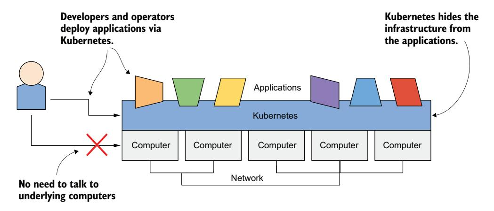
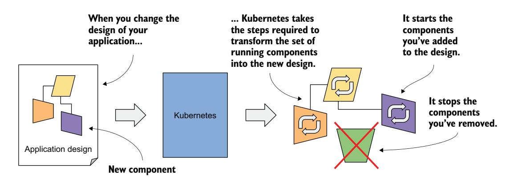
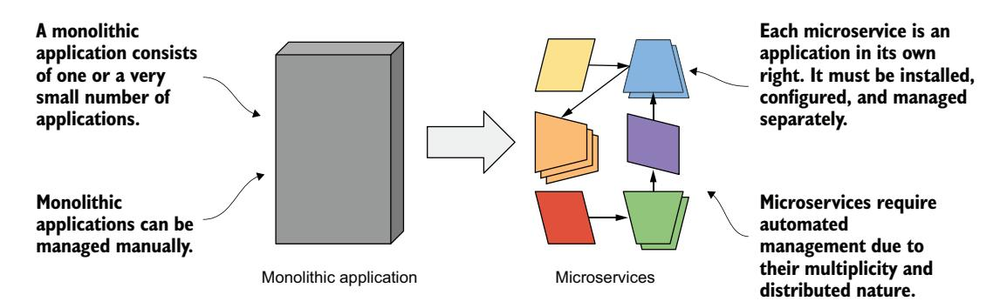
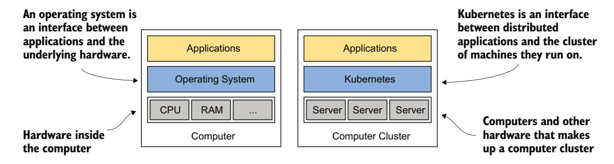
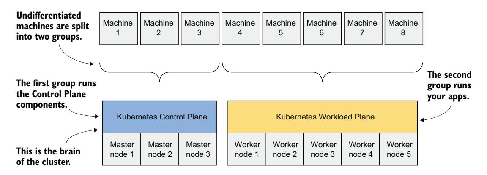
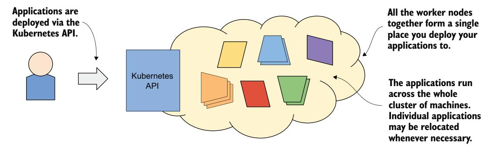
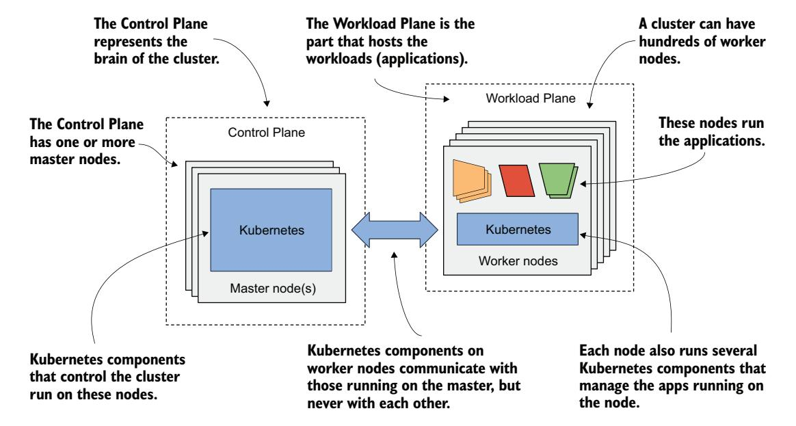

# 第 1 章 初识 Kubernetes

!!! tip "本章涵盖"

    - Kubernetes 的起源与背景
    - 为何 Kubernetes 被如此广泛地采用
    - Kubernetes 如何改造你的数据中心
    - Kubernetes 架构与运作方式概览
    - 如何以及是否应该将 Kubernetes 引入你的组织

Kubernetes 已被公认为运行现代应用的首选平台。早期的狂热已经退去，尽管现在有人觉得 Kubernetes"平淡无奇"，但事实是几乎所有人都在使用它。

乍看之下，Kubernetes 似乎很复杂——像是基础设施之上的一层不必要的累赘。但每个真正用过它的人都清楚，它带来的好处是实实在在的。而且说实话，一旦你开始上手，Kubernetes 并没有想象中那么难以理解。

从本质上讲，Kubernetes 不过是一套 API 和一组相对直截了当的控制器，它们让你的容器化应用平稳运行。它决定你的应用该在哪里运行，在出问题时重启它们，并确保它们始终可访问。如果你用过 Docker Compose、Nomad，甚至是传统的虚拟机，Kubernetes 做的事情和它们差不多，但它自动化了更多日常琐事。你定义应用的期望状态，Kubernetes 负责实现和维持这个状态所需的一切。

Kubernetes 接管了开发者和系统管理员宁愿绕道的任务——调度、网络、配置，以及保证跨环境的一致行为。当然，Kubernetes 并非适用于所有场景。运行简单应用、几乎不需要扩容的小型组织，用更简单的工具可能反而更好。即便如此，小型团队也可以使用托管 Kubernetes 服务，避开最困难的部分——管理 Kubernetes 本身。

本书的目标是通过动手实践（而非纸上谈兵）让你精通 Kubernetes。我们将从零开始构建一个小型微服务应用，并逐步部署它。在此过程中，你将学习开发者和集群管理员都必须掌握的基本概念，包括 Pod、Deployment、Service、Volume、配置等等。你不需要事先具备容器、Docker 甚至 Linux 的经验，所有需要了解的内容我们都会逐步覆盖。

虽然未来的 Kubernetes 管理员也会从中获得宝贵的见解，但本书侧重于在开发集群上开发和运行应用的基础知识。控制平面高可用、安全、集群安装和插件等主题超出了本书范围，但会在我们的后续卷中涉及。

读完本书后，你将理解 Kubernetes 的工作原理，学会打包和部署自己的应用，并掌握如何使用本地集群（通过 Kind）和云端集群（如 Google Kubernetes Engine）。最重要的是，你将拥有自信地驾驭 Kubernetes 而不感到手足无措。

## 1.1 初识 Kubernetes

单词 *Kubernetes* 源自希腊语，意为"舵手"——负责操舵的人。舵手未必等同于船长。船长对船只负责，而舵手负责操舵。

在了解 Kubernetes 的职责之后，你会发现这个名字恰如其分。舵手维持航向，执行船长的指令，并反馈船只的航向。Kubernetes 驱动你的应用并报告其状态，而你——船长——决定系统的航向。

### Kubernetes 如何发音？k8s 又是什么？

Kubernetes 的正确希腊语发音是 *kie-ver-nee-tees*，与你在技术交流中通常听到的英语发音不同。最常见的念法是 *koo-ber-netties* 或 *koo-ber-nay'-tace*，偶尔也会听到 *koo-ber-nets*。

在书面和口头交流中，它也常被称为 *Kube* 或 *K8s*（发音为 *kates*），其中数字 8 代表首尾字母之间省略的 8 个字母。

### 1.1.1 Kubernetes 概览

Kubernetes 是一个软件系统，用于自动化部署和管理由运行在容器中的计算机进程构成的复杂、大规模应用系统。下面我们来看看它做了什么以及是如何做到的。

#### 抽象掉基础设施

当软件开发者或运维人员决定部署一个应用时，他们通过 Kubernetes 来完成，而不是将应用部署到某台具体的计算机上。Kubernetes 为使用者和应用提供了一层抽象，隐藏了底层硬件。

如图 1.1 所示，底层基础设施（即计算机、网络和其他组件）对应用是不可见的，这使得开发和配置应用变得更加容易。

图 1.1 Kubernetes 提供的基础设施抽象

#### 标准化部署方式

由于底层基础设施的细节不再影响应用部署，你在公司数据中心部署应用的方式与在云端部署完全相同。一个描述应用的清单文件可以同时用于本地部署和任意云厂商的部署。所有底层基础设施的差异由 Kubernetes 处理，因此你可以专注于应用和其中包含的业务逻辑。

#### 声明式部署

Kubernetes 使用声明式模型来定义应用，如图 1.2 所示。你描述构成应用的各个组件，Kubernetes 将这个描述转化为运行中的应用。然后，它会通过按需重启或重建组件来保持应用的健康。

图 1.2 应用部署的声明式模型

每当你更改描述时，Kubernetes 会采取必要步骤重新配置运行中的应用以匹配新的描述，如图 1.3 所示。

图 1.3 描述的变更会反映到运行中的应用中

#### 接管应用的日常管理

一旦将应用部署到 Kubernetes，它就接过了对应用的日常管理。如果应用崩溃，Kubernetes 会自动重启它。如果硬件故障或基础设施拓扑发生变化，需要将应用迁移到其他机器，Kubernetes 全都能自行完成。负责操作系统运维的工程师可以专注于大局，而不用在细枝末节上浪费时间（图 1.4）。回到航海的类比：开发工程师和运维工程师是坐在扶椅中制定高层决策的"高级船员"，而 Kubernetes 是负责在系统航行的汹涌波涛中执行具体操舵任务的"舵手"。

图 1.4 Kubernetes 接管了应用的管理

Kubernetes 所做的一切及其带来的所有优势需要更长的篇幅来解释，我们将在后文中详细讨论。在此之前，了解一下它从何而来以及 Kubernetes 项目的当前状态，或许对你有所裨益。

### 1.1.2 关于 Kubernetes 项目

Kubernetes 最初由 Google 开发，Google 几乎从一开始就在容器中运行应用。早在 2014 年，据报道他们每周要启动 200 亿个容器——相当于每秒超过 3000 个容器，而今天这个数字更是远超当年。这些容器运行在分布在全球数十个数据中心的数千台计算机上。试想手工完成这一切——显然你需要自动化，而在如此巨大的规模下，自动化必须做到极致。

#### Borg 和 Omega：Kubernetes 的前身

Google 巨大的工作负载规模迫使他们开发解决方案，以便让数千个软件组件的开发和管理变得可控且经济高效。多年来，Google 开发了一个名为 *Borg*（以及之后一个名为 *Omega* 的新系统）的内部系统，帮助应用开发者和运维人员管理这数千个应用和服务。

除了简化开发和管理，这些系统还帮助他们实现了更好的基础设施利用率。这在任何组织中都很重要，但当你运营着数十万台机器时，即使微小的利用率提升也意味着数百万的成本节省——开发这样一个系统的动力不言自明。

随着时间的推移，你的基础设施在不断增长和演进。每个新建的数据中心都是当时最先进的，其基础设施与以往建造的数据中心截然不同。尽管存在差异，一个数据中心的部署方式不应该与另一个数据中心有所不同。当你在多个区域或地区部署应用以降低区域性故障导致停机的概率时，这一点尤为重要。为了有效地做到这一点，统一的应用部署方法不可或缺。

#### Kubernetes：开源项目及其衍生商业产品

基于他们在开发 Borg、Omega 和其他内部系统过程中积累的经验，Google 于 2014 年推出了 Kubernetes——一个如今可由所有人使用并持续改进的开源项目（图 1.5）。Kubernetes 一经发布，远在 1.0 版本正式发布之前，其他公司就迅速加入进来协助开发这个项目，比如一直站在开源软件前沿的 Red Hat。

图 1.5 Kubernetes 开源项目的起源和现状

Kubernetes 的发展最终远远超出了其创始人的预期，如今它可以说是全球领先的开源项目之一，有数十个组织和数千名个人为其贡献代码。此外，多家公司还在开源项目的基础上提供企业级的 Kubernetes 产品，包括 Red Hat OpenShift、Pivotal Container Service、Rancher 等等。

#### Kubernetes 如何催生了全新的云原生生态

Kubernetes 还催生了许多其他相关的开源项目。它们中的大多数现在都在 *云原生计算基金会*（CNCF）的旗下，CNCF 是 *Linux 基金会* 的一部分。

CNCF 每年在北美、欧洲和中国组织多场 KubeCon-CloudNativeCon 大会。2023 年，超过 30,000 名工程师以线下或线上的方式参加了这些大会。这一数字表明 Kubernetes 对当今全球企业部署应用的方式产生了难以置信的积极影响——若非如此，它不可能被如此广泛地采用。

### 1.1.3 理解 Kubernetes 为何如此流行

近年来，应用开发方式发生了巨大变化。这催生了 Kubernetes 等新工具的诞生，而这些工具又反过来推动了应用架构和我们开发方式的进一步变革。让我们看看具体的例子。

#### 自动化微服务管理

过去，大多数应用都是大型单体。应用的各个组件紧密耦合，全部运行在一个计算机进程中。整个应用由一个庞大的开发团队作为一个单元进行开发，部署方式也很直接——把它装到一台强大的计算机上，提供所需的少量配置即可。对应用进行水平扩缩容几乎不可能，因此每当需要提升应用容量时，你只能升级硬件（即垂直扩缩容）。

随后出现了微服务范式。单体应用被拆分成数十个、有时甚至数百个独立的进程，如图 1.6 所示。这使得组织可以将开发部门划分为更小的团队，每个团队只负责开发整个系统的一小部分——即部分微服务。

图 1.6 单体应用与微服务的对比

每个微服务现在都是一个独立的应用，拥有自己的开发和发布周期。不同微服务的依赖会随着时间推移不可避免地分化。一个微服务需要某个版本的库，而另一个微服务需要同一个库的另一个版本（可能不兼容）。在同一个操作系统中运行这两个应用变得困难。

幸运的是，容器单独解决了每个微服务需要不同环境的问题，但每个微服务现在都是一个必须独立管理的独立应用。应用数量的增加使得管理难度大大上升。

整个应用的各个部分不再需要在同一台计算机上运行，这使得整个系统的扩缩容变得更容易，但也意味着各应用需要配置为能够互相通信。对于只有少量组件的系统，通信通常可以手动完成，但如今部署上百个微服务的场景已经司空见惯。

当系统中包含大量微服务时，自动化管理至关重要。Kubernetes 提供了这种自动化。它提供的功能使得管理数百个微服务的任务变得几乎微不足道。

#### 弥合开发与运维的鸿沟

伴随着应用架构的这些变化，团队开发和运行软件的方式也发生了变化。按照过去的惯例，开发团队在孤立环境中构建软件，然后把成品"扔过墙"交给运维团队，由运维团队负责部署和后续管理。

随着 DevOps 范式的兴起，两个团队现在在软件产品的整个生命周期中紧密协作。开发团队现在更多地参与到已部署软件的日常管理中。但这也意味着他们如今需要了解软件运行所在的基础设施。

作为软件开发者，你的主要精力放在实现业务逻辑上。你不想处理底层服务器的细节。幸运的是，Kubernetes 隐藏了这些细节。

#### 标准化云端部署

在过去一二十年里，许多组织已将软件从本地服务器迁移到云端。迁移带来的好处似乎盖过了被特定云厂商锁定的担忧——这种锁定担忧源于必须依赖厂商的专有 API 来部署和管理应用。

任何希望能够在不同厂商之间迁移应用的企业，都必须额外付出努力来将底层云厂商的基础设施和 API 从应用中抽象出来。这需要消耗本来可以专注于构建核心业务逻辑的资源。

Kubernetes 在这方面也大有裨益。Kubernetes 的流行迫使所有主流云厂商将 Kubernetes 集成到自己的产品中。用户现在可以通过 Kubernetes 提供的一套标准 API 将应用部署到任何云厂商。

如果应用构建在 Kubernetes API 而非特定云厂商的专有 API 之上，它就可以相对容易地迁移到任意其他厂商。

图 1.7 Kubernetes 标准化了跨云厂商的应用部署方式

## 1.2 理解 Kubernetes

上一节介绍了 Kubernetes 的起源及其被广泛采用的原因。本节将更深入地探讨 Kubernetes 到底是什么。

### 1.2.1 理解 Kubernetes 如何改造计算机集群

让我们仔细看看，当你在服务器上部署 Kubernetes 后，你对数据中心的认知会发生怎样的变化。

#### Kubernetes——计算机集群的操作系统

可以将 Kubernetes 想象为集群的操作系统。图 1.8 展示了运行在一台计算机上的操作系统与运行在一个计算机集群上的 Kubernetes 之间的类比关系。

图 1.8 Kubernetes 之于计算机集群，正如操作系统之于一台计算机

正如操作系统支持计算机的基本功能——例如将进程调度到 CPU 上，以及充当应用与计算机硬件之间的接口——Kubernetes 将分布式应用的组件调度到底层计算机集群中的各个计算机上，并充当应用与集群之间的接口。

它将应用开发者从在应用中实现基础设施相关机制的负担中解放出来；开发者转而依赖 Kubernetes 来提供这些机制，包括：

- **服务发现**：一种让应用找到其他应用并使用它们所提供服务的机制
- **水平扩缩容**：复制你的应用以适应负载波动
- **负载均衡**：将负载分发到所有应用副本
- **自愈**：通过自动重启故障应用并在节点故障后将应用迁移到健康节点来保持系统健康
- **领导者选举**：一种决定哪个应用实例应为活跃实例、其他实例保持待命但随时准备在活跃实例故障时接管的机制

通过依赖 Kubernetes 提供这些功能，应用开发者可以专注于实现核心业务逻辑，而不是将时间浪费在应用与基础设施的集成上。

#### Kubernetes 如何融入计算机集群

图 1.9 展示了 Kubernetes 如何部署到一个计算机集群中的具体例子。

图 1.9 Kubernetes 集群中的计算机分为控制平面和工作负载平面

你会先拿到一组机器，将它们分为两组：控制平面节点和工作节点。控制平面节点是整个系统的大脑，控制着集群；而工作节点运行你的应用（即工作负载），因此构成工作负载平面。

!!! info ""

    工作负载平面有时也被称为数据平面（data plane），但这一术语可能令人困惑，因为该平面承载的不是数据而是应用。也不要被"平面"这个词迷惑——在此上下文中，你可以将其理解为应用运行的"层面"。

非生产集群可以使用单个控制平面节点，但高可用集群至少使用三台物理控制平面节点来承载控制平面。工作节点的数量取决于你计划部署的应用数量。

#### 所有集群节点如何成为一个大的部署面

在计算机上安装 Kubernetes 后，部署应用时就不再需要考虑单台计算机了。无论集群中有多少个工作节点，它们全部变成了一个统一的部署空间。你通过 Kubernetes 控制平面提供的 Kubernetes API 来完成部署（图 1.10）。

图 1.10 Kubernetes 将集群暴露为一个统一的部署面

当我说所有工作节点变成一个统一的空间时，不要以为你可以把一个巨大的应用分散到多台小型机器上部署。Kubernetes 不会施展这种魔法。每个应用都必须足够小才能适配到某一台工作节点上。

我的意思是，在部署应用时，它们最终落在哪个工作节点上并不重要。Kubernetes 可能会在之后将应用从某个节点迁移到另一个节点。你甚至可能不会察觉到这种迁移，而且你也不需要关心。

### 1.2.2 使用 Kubernetes 的好处

你已经了解了为什么全球许多组织已将 Kubernetes 引入其数据中心。现在，让我们更仔细地看看它给开发团队和 IT 运维团队带来的具体好处。

#### 应用的自助式部署

因为 Kubernetes 将其所有工作节点呈现为一个统一的部署面，你把应用部署到哪个节点上就不再重要了。这意味着开发者现在可以自己部署应用，即使他们对节点数量或每个节点的特性一无所知。

过去，系统管理员决定每个应用应该放在哪里。这个任务现在留给了 Kubernetes，它允许开发者自行部署应用而不必依赖他人。当开发者部署一个应用时，Kubernetes 会根据应用的资源需求和每个节点上的可用资源来选择最佳节点来运行该应用。

#### 通过更高的基础设施利用率降低成本

如果你不关心应用落在哪个节点上，也意味着它可以在任何时候被迁移到任何其他节点上而不需要你费心。Kubernetes 可能需要这样做来为别人想部署的一个更大的应用腾出空间。这种迁移能力使得应用可以被紧密地打包在一起，从而最大限度地利用节点资源。

寻找最优组合可能既耗时又困难，特别是当可选组合数量巨大时——比如你有很多应用组件和很多可供部署的服务器节点。计算机在执行这类任务上比人类做得更好、更快。Kubernetes 就做得非常出色。通过将不同应用组合在同一台机器上，Kubernetes 提高了硬件基础设施的利用率，让你用更少的服务器运行更多的应用。

#### 自动适应负载变化

使用 Kubernetes 管理已部署的应用还意味着运维团队不必持续监控每个应用的负载来应对突发峰值。Kubernetes 同样会处理这些。它可以监控每个应用消耗的资源和其他指标，并调整每个应用运行实例的数量以应对增加的负载或资源使用。

当你在云基础设施上运行 Kubernetes 时，它甚至可以通过云厂商的 API 动态增加集群规模，从而永远不会缺少运行额外应用实例的空间。

#### 保持应用平稳运行

Kubernetes 还竭尽全力确保你的应用平稳运行。如果你的应用崩溃，Kubernetes 会自动重启它。因此，即使你有一个会在运行几个小时后内存溢出的有缺陷应用，Kubernetes 也会通过在这种情况下自动重启它来确保你的应用持续向用户提供服务。

Kubernetes 是一个自愈系统，既能处理上述软件错误，也能处理硬件故障。随着集群规模的增长，节点故障的频率也在增加。例如，在一个有一百个节点、每个节点的 MTBF（平均故障间隔时间）为 100 天的集群中，你可以预计每天会有一个节点故障。

当一个节点故障时，Kubernetes 会自动将应用迁移到剩余的健康节点。运维团队不再需要手动迁移应用，可以转而专注于修复节点本身并将其归还到可用硬件资源池中。

如果你的基础设施有足够的空闲资源来在缺了故障节点的情况下维持系统正常运行，运维团队甚至不必立即对故障做出反应。如果故障发生在半夜，运维团队也不必从床上爬起来——他们可以安心睡觉，等到正常工作时间再处理。

#### 简化应用开发

上一节描述的改进主要涉及应用部署方面。但应用开发的流程呢？Kubernetes 是否也为之带来了好处？答案是肯定的。

如前所述，Kubernetes 提供了原本必须由应用自己实现的基础设施相关服务，包括分布式应用中服务/对等节点的发现、领导者选举、集中化应用配置等等。Kubernetes 在提供这些功能的同时保持了应用对 Kubernetes 无感知（Kubernetes-agnostic），但在需要时，应用也可以查询 Kubernetes API 来获取其环境的详细信息，还可以通过 API 来改变环境。

### 1.2.3 Kubernetes 集群的架构

如你所知，Kubernetes 集群由节点组成，分为两组：

- 一组**控制平面节点**承载**控制平面**组件，这些组件是整个系统的大脑，因为它们控制着整个集群
- 一组**工作节点**构成**工作负载平面**，这是你的工作负载（应用）运行的地方

图 1.11 展示了这两个平面及其包含的不同节点。

图 1.11 构成 Kubernetes 集群的两个平面

这两个平面——进而这两种节点——运行着不同的 Kubernetes 组件。接下来的两节将介绍它们，总结其功能而不深入细节。这些组件将在本书下一部分讲解 Kubernetes 基础概念时多次提及。对组件及其内部机制的深入探讨将在本书第三部分展开。

#### 控制平面组件

控制平面是控制集群的核心所在。它由多个组件构成，这些组件可以运行在单个节点上，也可以跨多个节点复制以保障高可用。图 1.12 展示了控制平面的组件。

图 1.12 Kubernetes 控制平面的组件

以下是这些组件及其功能：

- **Kubernetes API 服务器**暴露 RESTful Kubernetes API。使用集群的工程师和其他 Kubernetes 组件通过此 API 创建对象。
- **etcd** 分布式数据存储用于持久化通过 API 创建的对象，因为 API 服务器本身是无状态的。API 服务器是唯一与 etcd 通信的组件。
- **调度器**决定每个应用实例应该运行在哪个工作节点上。
- **控制器**将通过 API 创建的对象变为现实。其中大多数控制器只是创建其他对象，但也有一些控制器与外部系统通信（例如通过云厂商的 API）。

控制平面的组件持有并控制集群的状态，但它们并不运行你的应用。这由（工作）节点来完成。

##### 工作节点组件

工作节点是你的应用运行的计算机。它们构成集群的工作负载平面。除了应用之外，这些节点上还运行着多个 Kubernetes 组件。它们执行运行、监控和为你的应用提供连通性的任务，如图 1.13 所示。

图 1.13 每个节点上运行的 Kubernetes 组件

每个节点运行以下组件：

- **kubelet**：一个与 API 服务器通信并管理其节点上运行的应用的代理。它通过 API 报告这些应用和节点的状态。
- **容器运行时**：可以是 Docker 或任何与 Kubernetes 兼容的其他运行时。它按照 kubelet 的指令在容器中运行你的应用。
- **Kubernetes Service Proxy**（**kube-proxy**）：在应用之间进行网络流量的负载均衡。

##### 附加组件

大多数 Kubernetes 集群还包含其他若干组件——DNS 服务器、网络插件、日志采集代理等等。它们通常运行在工作节点上，但也可以配置为在控制平面节点上运行。

##### 对架构的更深入理解

目前，我只希望你大致熟悉这些组件的名称和功能，因为在后续章节中我会多次提到它们。另外，在解释某事物*如何*工作之前，我倾向于先解释它*做什么*并教会你*如何使用*它。这就像学开车——你一开始不想知道引擎盖下有什么，你只想学会如何从 A 点到 B 点。只有到那时，你才会对汽车如何做到这一点感兴趣。知道引擎盖下有什么或许有一天能帮你在汽车抛锚、路边抛锚时重新发动起来。我不想这么说，但处理 Kubernetes 的时候你会有很多这样的时刻——因为它实在太复杂了。

### 1.2.4 Kubernetes 如何运行一个应用

大致了解了构成 Kubernetes 的组件后，我终于可以解释如何部署一个应用了。

#### 定义你的应用

在 Kubernetes 中，一切皆对象。你通过 Kubernetes API 创建和获取这些对象。你的应用由多种类型的对象构成——一种类型代表整个应用部署，另一种代表应用的一个运行实例，还有一种代表由一组实例提供的服务并允许通过单个 IP 地址来访问它们，还有许多其他类型。

所有这些类型将在本书第二部分中详细讲解。目前，你只需要知道：你通过几种类型的对象来定义应用。这些对象通常定义在一个或多个 YAML 或 JSON 格式的清单文件中。

!!! info "定义：YAML"

    **YAML** 最初据说意为"Yet Another Markup Language"（另一种标记语言），但后来改为递归缩写"YAML Ain't Markup Language"（YAML 不是标记语言）。它是一种将对象序列化为人类可读文本文件的格式。

!!! info "定义：JSON"

    **JSON** 是 JavaScript Object Notation（JavaScript 对象标记法）的缩写。它是另一种序列化对象的方式，但更适合在应用程序之间交换数据。

图 1.14 展示了一个部署应用的例子——通过创建两份 Deployment 并使用两个 Service 暴露它们来部署应用。

当你部署该应用时，会发生以下操作：

1. 你将应用清单提交到 Kubernetes API。API 服务器将清单中定义的对象写入 etcd。
2. 某个控制器注意到新创建的对象，为每个应用实例创建多个新对象。
3. 调度器为每个实例分配一个节点。
4. kubelet 注意到某个实例被分配到了该 kubelet 所在的节点。它通过容器运行时运行该应用实例。
5. kube-proxy 注意到应用实例已准备好接受客户端连接，为它们配置负载均衡器。
6. kubelet 和控制器监控系统并保持应用运行。

以下各节更详细地解释了这一过程。

图 1.14 向 Kubernetes 部署一个应用

#### 向 API 提交应用

创建好 YAML 或 JSON 文件后，你通常通过 Kubernetes 命令行工具 *kubectl* 将文件提交到 API。

!!! tip "小贴士"

    kubectl 发音为 *kube-control*，但社区中温和一点的人喜欢叫它 *kube-cuddle*。也有人称它为 *kube-C-T-L*。

kubectl 将文件拆分为各个独立的对象，并通过发送 HTTP PUT 或 POST 请求到 API 来创建每个对象，这与 RESTful API 的常规做法一致。API 服务器验证这些对象并将其存储到 etcd 数据存储中。此外，它还通知所有相关组件这些对象已被创建。接下来要解释的控制器就是其中之一。

#### 关于控制器

大多数对象类型都有一个关联的控制器。控制器关注特定类型的对象。它等待 API 服务器通知有新对象被创建，然后执行操作将该对象变为现实。通常，控制器只是通过同一个 Kubernetes API 创建其他对象。例如，负责应用部署的控制器会创建一个或多个代表应用单个实例的对象。控制器创建的对象数量取决于应用部署对象中指定的副本数量。

#### 关于调度器

调度器是一种特殊类型的控制器，其唯一任务是将应用实例调度到工作节点上。它为每个新的应用实例对象选择最佳工作节点，并通过 API 修改该对象来将其分配到这个节点。

#### 关于 kubelet 和容器运行时

每个工作节点上运行的 kubelet 也是一种控制器。它的任务是等待应用实例被分配到其所在的节点，然后运行该应用。具体做法是指示容器运行时启动应用的容器。

#### 关于 kube-proxy

由于一个应用部署可能包含多个应用实例，需要负载均衡器将它们以单个 IP 地址暴露对外。kube-proxy 是另一个与 kubelet 并行运行的控制器，负责设置负载均衡器。

#### 保持应用健康

应用启动并运行后，kubelet 通过在应用终止时重启它来保持应用健康。它还通过更新代表应用实例的对象来报告应用的状态。其他控制器监控这些对象，并在应用所在的节点故障时确保应用被迁移到健康节点。

现在你对 Kubernetes 的架构和功能已经有了大致的了解。你不需要在此刻理解或记住所有细节，因为在本书第二部分学习了每种对象类型以及将其变为现实的控制器之后，内化这些知识会更容易。

## 1.3 将 Kubernetes 引入你的组织

在本章结尾，让我们看看如果你决定将 Kubernetes 引入自己的 IT 环境，有哪些可用选项。

### 1.3.1 本地部署、云端部署还是混合部署

如果你想在 Kubernetes 上运行应用，必须决定是在本地（组织自己的基础设施，即本地部署）、在主流云厂商上，还是两者兼而有之（混合云方案）。

#### 本地部署 Kubernetes

如果法规要求你必须就地运行应用，那么在自有基础设施上运行 Kubernetes 可能是你唯一的选择。这通常意味着你得自己管理 Kubernetes，这一点我们稍后会谈到。

Kubernetes 可以直接运行在裸金属机器上，也可以运行在数据中心的虚拟机上。无论是哪种情况，你都难以像在云厂商提供的虚拟机上那样轻松地扩缩容。

#### 云端部署 Kubernetes

如果你没有本地基础设施，那就别无选择，只能在云端运行 Kubernetes。这样做的好处是，你可以随时在需要时即时扩缩容。如前所述，当集群当前容量不足以运行你要部署的所有应用时，Kubernetes 可以自行通过云厂商的 API 申请额外的虚拟机。

当工作负载减少、某些工作节点没有运行工作负载时，Kubernetes 可以要求云厂商销毁这些节点的虚拟机，以降低你的运维成本。集群的这种弹性无疑是云上运行 Kubernetes 的主要优势之一。

#### 使用混合云方案

更复杂的选择是本地运行 Kubernetes，但也允许其溢出到云端。你可以配置 Kubernetes 在本数据中心的容量不足时在云端申请额外节点。这样你就兼得了两者的优势——大部分时间，你的应用在本地运行，无需支付虚拟机租赁成本；而在一年可能仅数次的短暂负载峰值期，应用可以利用云端的额外资源处理激增的负载。

如果用例需要，你还可以跨多个云厂商运行 Kubernetes 集群，或对上述选项进行组合。这可以通过单个控制平面实现，也可以在每个位置各设一个控制平面。

### 1.3.2 自己管还是让人管

如果你正在考虑将 Kubernetes 引入组织，需要回答的最重要问题是：你是自己管理 Kubernetes，还是使用"Kubernetes 即服务"类型的服务，由别人替你管理。

#### 自己管理 Kubernetes

如果你已经在本地运行应用，并且拥有足够的硬件来运行一个生产就绪的 Kubernetes 集群，你的第一反应很可能是自己部署和管理它。但如果你问 Kubernetes 社区中的任何一个人这是否是个好主意，你通常会听到一个非常响亮的"不"。

图 1.14 只是 Kubernetes 集群中部署应用时发生的事情的一个极其简化的展示。光是这幅图就足以让你感到敬畏了。Kubernetes 带来了巨大的额外复杂性。任何想运行 Kubernetes 集群的人，都必须对其内部运作机制了如指掌。

生产就绪 Kubernetes 集群的管理是一个数十亿美元的产业。在决定自己管理之前，你必须咨询已经做过这件事的工程师，了解大多数团队会遇到的问题。否则，你可能会让自己陷入失败的困境。然而，为非生产用例尝试 Kubernetes，或者使用托管 Kubernetes 集群，问题则要小得多。

#### 使用云端托管 Kubernetes 集群

使用 Kubernetes 比管理 Kubernetes 简单十倍。大多数主流云厂商现在都提供 Kubernetes 即服务。他们负责管理 Kubernetes 及其组件，而你只需要像使用云厂商提供的其他 API 一样使用 Kubernetes API。

顶级的托管 Kubernetes 服务包括：

- Google Kubernetes Engine (GKE)
- Azure Kubernetes Service (AKS)
- Amazon Elastic Kubernetes Service (EKS)
- IBM Cloud Kubernetes Service
- Red Hat OpenShift Online and Dedicated
- VMware Cloud PKS
- 阿里云容器服务 Kubernetes 版 (ACK)

本书前半部分专注于仅仅使用 Kubernetes。你将在本地开发集群和托管 GKE 集群中完成练习，因为 GKE 使用最为简便且用户体验最好。本书第二部分为你管理 Kubernetes 打下坚实基础，但要真正精通它，还需要积累更多经验。

### 1.3.3 使用原生还是扩展版 Kubernetes

最后一个问题是，使用原生的开源版 Kubernetes 还是扩展的企业级 Kubernetes 产品。

#### 使用原生版 Kubernetes

开源版 Kubernetes 由社区维护，代表 Kubernetes 开发的最前沿。这也意味着它可能不如其他选项稳定，还可能缺少良好的安全默认配置。部署原生版需要大量的调优才能做好生产就绪配置。

#### 使用企业级 Kubernetes 发行版

在生产环境中使用 Kubernetes 的更好选择是使用企业级 Kubernetes 发行版，如 OpenShift 或 Rancher。除了透过更好的默认配置带来的安全性和性能提升外，它们还在上游 Kubernetes API 提供的对象类型之外提供了额外的对象类型。例如，原生 Kubernetes 不包含代表集群用户的对象类型，而商业发行版则有。它们还提供了在 Kubernetes 上部署和管理知名第三方应用的额外软件工具。

当然，扩展和加固 Kubernetes 需要时间，因此这些商业发行版通常比上游 Kubernetes 落后一两个版本。这并不像听起来那么糟糕——收益通常大于代价。

### 1.3.4 你到底该不该用 Kubernetes？

我希望这一章已经让你对 Kubernetes 感到兴奋，迫不及待地想把它塞进你的技术栈中。但为了圆满结束本章，我们需要为"什么时候不该使用 Kubernetes"说上几句。

#### 你的工作负载真的需要自动化管理吗？

你首先需要诚实面对的问题是：你是否真的需要自动化管理你的应用。如果你的应用是一个大型单体，那绝对不需要 Kubernetes。

即使你部署的是微服务，使用 Kubernetes 也未必是最佳选择，尤其是当微服务数量非常少的时候。由于其他因素也会影响决策，很难给出一个精确的临界值。但如果你的系统由少于 5 个微服务组成，引入 Kubernetes 大概不是一个好主意；如果你的系统有超过 20 个微服务，你很可能从 Kubernetes 的集成中受益。如果你的微服务数量落在这两者之间，就应该考虑接下来描述的其他因素了。

#### 你能承受让工程师投入时间学习 Kubernetes 吗？

Kubernetes 的设计目标是让应用在不知情的情况下运行其中。虽然应用本身不需要修改就能在 Kubernetes 中运行，但开发工程师必然会花大量时间来学习如何使用 Kubernetes，即使只有运维人员才真正需要这些知识。

你很难告诉你的团队"我们要切换到 Kubernetes，但只有运维团队需要开始学习它"。开发者喜欢新鲜事物。在撰写本文时，Kubernetes 仍然是非常新鲜的事物。

#### 你准备好应对过渡期的成本增加了吗？

虽然 Kubernetes 能降低长期运维成本，但在组织中引入 Kubernetes 初期会涉及成本的增加——培训、招聘新工程师、构建和购买新工具，可能还需要额外的硬件。Kubernetes 需要应用之外的额外计算资源。

到目前为止，你只是从码头观察了这艘船。是时候登船了。但离开码头之前，你应该先检查一下船上装载的集装箱。我们接下来就做这件事。

## 本章小结

- Kubernetes 是希腊语"舵手"的意思。正如船长统管船舶而舵手负责操舵，你统管计算机集群，而 Kubernetes 执行日常管理任务。
- Kubernetes 发音为 *koo-ber-netties*。Kubernetes 命令行工具 kubectl 发音为 *kube-control*。
- Kubernetes 由 Google 开发，基于他们在 Borg 和 Omega 等大规模容器管理系统方面的经验。
- Kubernetes 将你的数据中心抽象为一个统一的部署平台，让你可以像在云端一样在本地部署应用。
- 一个 Kubernetes 集群由两部分组成：控制平面节点和工作节点。控制平面节点是集群的大脑，工作节点运行你的应用。
- 通过 Kubernetes 部署应用是基于声明式模型的：你定义期望状态，Kubernetes 负责实现并维持它。
- Kubernetes 提供自愈能力（自动重启失败应用、迁移故障节点上的应用）、自动扩缩容、服务发现、负载均衡等功能。
- 引入 Kubernetes 前需要评估你的实际需求。微服务数量较少（<5 个）时可能不需要 Kubernetes；团队需要投入大量时间学习；初期成本会上升。
