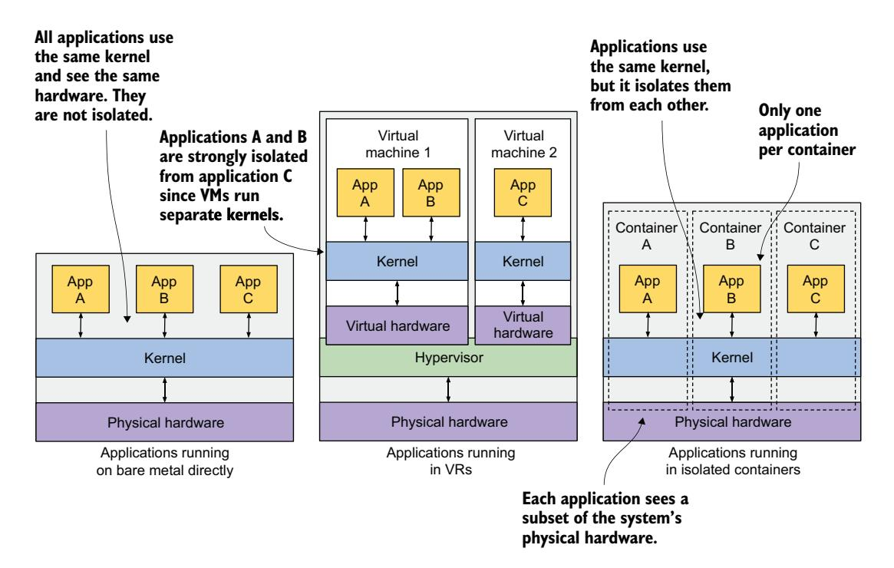
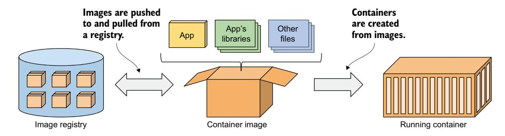
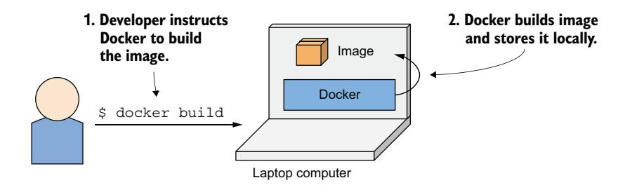
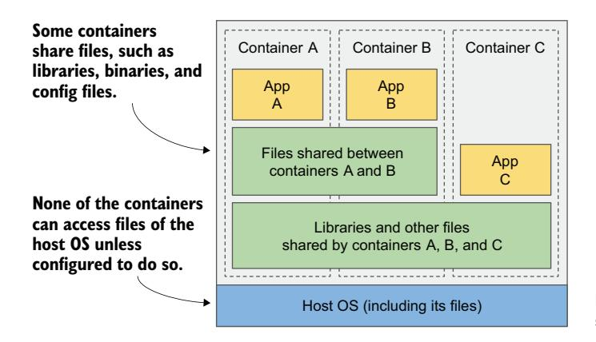
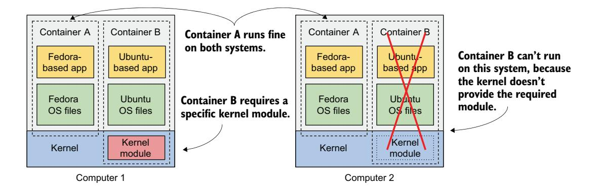
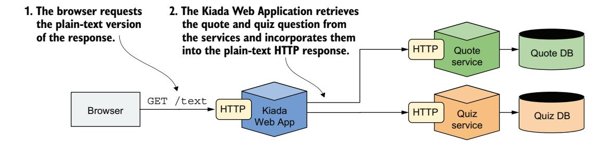
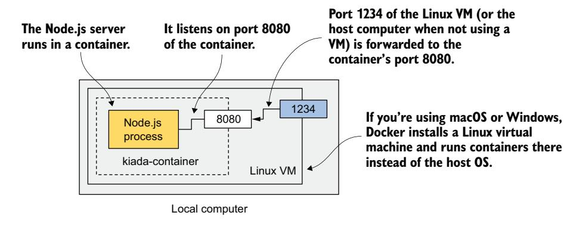
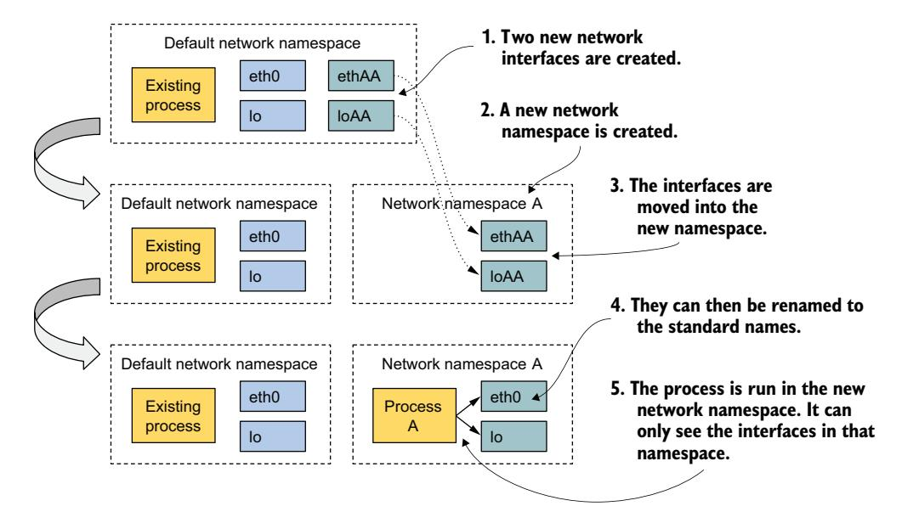
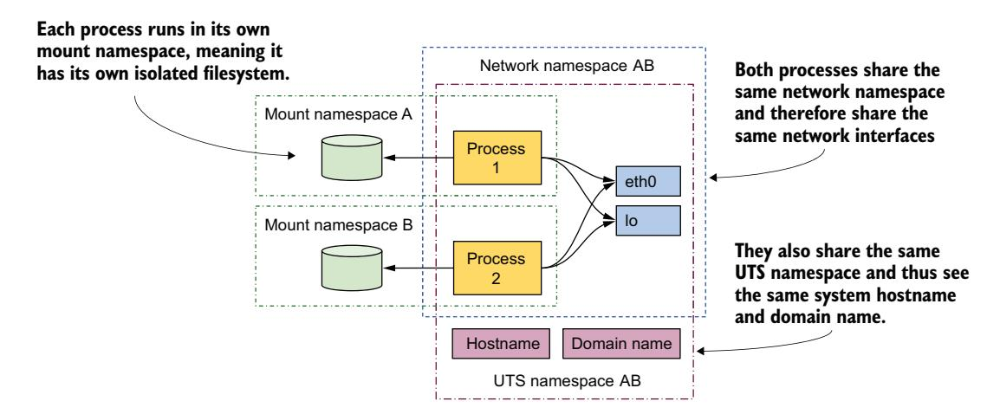

# 第 2 章 理解容器与容器化应用

!!! tip "本章涵盖"

    - 介绍容器
    - 容器与虚拟机的区别
    - 使用 Docker 创建、运行和共享容器镜像
    - 使容器成为可能的 Linux 内核特性

Kubernetes 主要管理运行在容器中的应用，因此在开始探索 Kubernetes 之前，你需要充分理解什么是容器。本章将解释典型的 Kubernetes 用户需要了解的 Linux 容器基础知识。

## 2.1 介绍容器

在第 1 章中，你了解到运行在同一操作系统中的不同微服务可能需要不同（甚至相互冲突）版本的动态链接库，或者有不同的环境需求。

当一个系统只包含少量应用或服务时，为每个应用分配一台专用的虚拟机（VM），让它们各自运行在自己的操作系统中，这是可行的。但对于运行大量应用的系统，如果你希望控制硬件成本，可能无法为每个应用或服务都分配一台独立的虚拟机。

这不仅仅是浪费硬件资源的问题——每台虚拟机通常需要单独配置和管理，这意味着运行更多的虚拟机也会导致更高的人员需求和更复杂的自动化系统。随着系统包含数百个已部署应用实例的微服务架构的转变，人们开始寻找比虚拟机更合适的替代方案。这就是容器的用武之地。

### 2.1.1 容器与虚拟机的比较

现在，大多数开发和运维团队更倾向于使用容器，而不是使用虚拟机来隔离各个微服务（或一般意义上的软件进程）的环境。它们允许在同一台宿主机上运行多个服务，同时保持彼此隔离——就像虚拟机一样，但开销更小。

与每台虚拟机都运行着独立的操作系统和多个系统进程不同，运行在容器中的进程是在现有的宿主操作系统中运行的。由于只有一个操作系统，因此不存在重复的系统进程。尽管所有应用进程都在同一操作系统中运行，但它们的运行环境是隔离的，尽管隔离程度不如在独立的虚拟机中运行。从容器中运行的进程的角度来看，这种隔离营造出一种假象，仿佛它是整个系统中唯一的进程。在后续章节中我们将探讨这一切如何实现，现在先来深入了解一下容器与虚拟机的区别。

## 开销

每台虚拟机通常运行自己的一套系统进程，除了用户应用进程本身所需的资源外，这些系统进程可能还需要大量的计算资源。相比之下，容器不过是现有宿主操作系统中运行的一个额外进程。因此，容器几乎没有任何开销。

图 2.1 比较了两台计算机，一台在两台虚拟机中运行应用，另一台则在各自的容器中运行每个应用。后者可以运行更多的容器，因为它比前者拥有更多未使用的 CPU 和内存。这是因为第二台计算机只运行一个操作系统，而第一台运行了三个（一个宿主机和两个客户机操作系统），总共消耗了更多资源。


图 2.1 在虚拟机与容器中运行应用

由于虚拟机的资源开销，多个应用常常被分组到同一台虚拟机中。你可能无法承担为每个应用都分配一整台虚拟机的成本。但由于容器没有开销，你可以自由地为每个应用创建独立的容器。事实上，你绝不应该在同一个容器中运行多个应用，因为这会大大增加管理容器中进程的难度。此外，所有现有的容器相关软件，包括 Kubernetes 本身，都是基于一个容器中只有一个应用的前提设计的。如果你的系统设计违背了这一原则，那将自找麻烦。

## 容器与虚拟机的启动时间

除了更低的运行时开销，容器的应用启动速度也更快，因为只需要启动应用进程本身。而不像启动新虚拟机时那样，需要先启动额外的系统进程。

## 容器与虚拟机的隔离

你一定会同意，在资源使用方面，容器显然更优，但这也存在一个缺点。在虚拟机中运行应用时，每台虚拟机都运行自己的操作系统和内核。在这些虚拟机之下是 Hypervisor（以及可能的一个额外的操作系统），它将物理硬件资源分割成更小的虚拟资源集，供每台虚拟机使用。如图 2.2 所示，运行在这些虚拟机中的应用向虚拟机内的客户机操作系统内核发起系统调用（*syscall*），内核在虚拟 CPU 上执行的机器指令随后通过 Hypervisor 转发到宿主机的物理 CPU。

!!! note ""
    有两种类型的 Hypervisor：类型 1 的 Hypervisor 不需要运行宿主操作系统，而类型 2 的 Hypervisor 则需要。

相比之下，容器都在宿主操作系统的单一内核上发起系统调用。


图 2.2 在虚拟机与容器中运行时，应用如何使用硬件

这个单一内核是唯一在宿主 CPU 上执行指令的内核，从而消除了对 CPU 虚拟化的需求。

来看看图 2.3，了解在裸机、两台虚拟机和三个容器中运行三个应用的区别。在第一种情况下，三个应用使用同一个内核，且完全没有隔离。在第二种情况下，应用 A 和 B 运行在同一台虚拟机中，因此共享内核，而应用 C 使用自己的内核，与另外两个隔离。



图 2.3 在裸机、虚拟机和容器中运行应用的区别

图 2.3 的第三种情况展示了在容器中运行同样的三个应用。尽管它们都使用同一个内核，但彼此隔离，且不知道其他进程的存在。这种隔离由内核本身提供。每个应用只看到一部分物理硬件，并表现得像是操作系统中唯一运行的进程——尽管它们都运行在同一个操作系统中。

## 理解容器隔离的安全影响

使用虚拟机而非容器的主要优势在于它们提供的完全隔离，因为每台虚拟机都有自己的 Linux 内核，而所有容器都共享同一个内核。这显然会带来安全风险。如果内核存在漏洞，一个容器中的应用可能会利用它来读取其他容器中应用的内存。如果应用运行在不同的虚拟机中，因此只共享硬件，那么此类攻击的概率就会低得多。当然，完全隔离只有将应用运行在独立的物理机器上才能实现。

此外，容器共享内存空间，而每台虚拟机使用自己独立的内存块。因此，如果不限制容器可以使用的内存量，可能会导致其他容器内存不足，或者使其数据被交换到磁盘。

!!! note ""
    虚拟机依赖 CPU 虚拟化支持和宿主机上的 Hypervisor 软件，而容器则由 Linux 内核支持的容器技术实现。但通常你不会直接与这些技术交互，而是依赖诸如 Docker 或 Podman 之类的工具，它们提供了用户友好的容器管理接口。

### 2.1.2 介绍 Docker 容器平台

尽管容器技术已经存在了很长时间，但直到 Docker 的兴起才被广泛认知。Docker 是第一个使容器能够在不同计算机之间轻松移植的容器系统。它简化了将应用及其依赖打包成单个软件包的过程，这个软件包可以部署在任何运行 Docker 的计算机上。

#### **容器、镜像与注册表**

Docker 是一个用于打包、分发和运行应用的平台。如前所述，它允许你将应用及其完整环境打包在一起。这可以包括应用所需的几个动态链接库，或者通常随操作系统一起提供的所有文件。Docker 允许你通过公共仓库将此软件包分发到任何其他安装了 Docker 的计算机上。图 2.4 展示了我刚才描述过程中出现的三个主要 Docker 概念。



图 2.4 Docker 的三个主要概念是镜像、注册表和容器

**容器镜像**是打包好的软件包，包含你的应用及其环境，类似于 zip 文件或 tarball。它由应用所需的完整文件系统和元数据组成，元数据包括要运行的可执行文件、应用监听的端口以及关于镜像的其他信息。

**镜像注册表**是一个仓库，用于在不同的人和计算机之间存储和共享容器镜像。构建完镜像后，你可以选择在本地运行，或者将镜像上传（*推送*）到注册表，然后下载（*拉取*）到另一台计算机。有些注册表是公开的，任何人都可以从中拉取镜像；而其他注册表是私有的，只有拥有所需认证凭证的个人、组织或计算机才能访问。

**容器**是从容器镜像创建的，作为宿主操作系统上的一个常规进程运行。然而，它的运行环境与宿主机和其他进程是隔离的。容器的文件系统源自容器镜像，但也可以将额外的文件系统挂载到容器中。容器通常受到资源限制，这意味着它们被分配特定数量的资源（如 CPU 和内存），并且不能超过这些限制。

## 构建、分发和运行容器镜像

为了理解容器、镜像和注册表之间的关系，让我们看看如何构建一个容器镜像，通过注册表分发它，以及从镜像创建运行中的容器。这三个过程如图 2.5 至图 2.7 所示。开发者首先构建镜像（图 2.5）。镜像存储在本地，直到开发者将其推送到注册表（图 2.6）。现在，任何有权访问注册表的人都可以将镜像拉取到任何其他运行 Docker 的计算机上并在那里运行（图 2.7）。



图 2.5 构建容器镜像


图 2.6 将容器镜像上传到注册表

Docker 根据镜像创建一个隔离的容器，并在其中运行指定的可执行文件。


图 2.7 在不同计算机上运行容器

之所以能在任何计算机上运行应用，是因为应用的运行环境与宿主机的环境是解耦的。

## 理解应用所看到的运行环境

当你在容器中运行应用时，它与打包到容器镜像中的文件（以及你挂载到容器中的额外文件系统中的文件）进行交互。无论应用是在你的笔记本电脑上运行还是在生产服务器上运行，它看到的文件都是一样的，即使生产服务器使用的 Linux 发行版与你的笔记本电脑完全不同。由于应用通常无法访问宿主文件系统中的文件，因此生产服务器上安装的软件库与笔记本电脑上的不同也没关系。

这与创建虚拟机镜像类似——设置一台新的虚拟机，安装操作系统和你的应用，然后将此镜像分发到不同的宿主机。然而，Docker 实现了同样的效果，却不需要包含通常出现在操作系统文件系统中的所有组件。

## 理解镜像层

与虚拟机镜像不同，容器镜像由多个薄层组成，这些层可以在多个镜像之间复用。这一特性使得镜像传输非常高效，因为如果某些层之前已经下载到宿主机上（例如，作为包含相同层的另一个镜像的一部分），那么只需下载剩下的层即可。

分层使得镜像分发非常高效，同时也有助于减少镜像的存储占用。Docker 对每一层只存储一次。如图 2.8 所示，从两个包含相同层的镜像创建的两个容器使用相同的文件。



图 2.8 容器可以共享镜像层

该图显示容器 A 和 B 共享一个镜像层，这意味着应用 A 和 B 读取了一些相同的文件。此外，它们还与容器 C 共享了底层。但如果所有三个容器都能访问相同的文件，它们又如何能够完全彼此隔离呢？应用 A 对存储在共享层中的文件所做的修改，不会对应用 B 可见吗？不会的。原因如下。

文件系统的隔离是通过写时复制（Copy-on-Write，CoW）机制实现的。容器的文件系统由来自容器镜像的只读层和一个堆叠在顶部的额外读/写层组成。当运行在容器 A 中的应用修改了某个只读层中的文件时，整个文件会被复制到容器的读/写层中，文件内容的修改在那里进行。由于每个容器都有自己的可写层，对共享文件的修改在任何其他容器中都不可见。

当你删除一个文件时，它仅在读/写层中被标记为已删除，但仍然存在于下面的一个或多个层中。然而，这意味着删除文件并不会减小镜像的大小。

!!! warning ""
    即使是看似无害的操作，如更改文件的权限或所有权，也会导致整个文件的新副本被创建在读/写层中。如果对一个大文件或大量文件执行此类操作，镜像大小可能会显著膨胀。

#### **理解容器镜像的可移植性限制**

理论上，基于 Docker 的容器镜像可以在任何运行 Docker 的 Linux 计算机上运行，但由于 Linux 内核不包含在镜像中，存在一个小问题。如果容器化应用需要特定的内核版本，它可能无法在所有计算机上运行。如果某台计算机运行的是不同版本的 Linux 内核，或者没有加载所需的内核模块，应用就无法在其上运行。图 2.9 展示了这种情况。

容器 B 需要特定的内核模块才能正常运行。这个模块在第一台计算机的内核中已加载，但在第二台计算机中没有。你可以在第二台计算机上运行容器镜像，但当它尝试使用缺失的模块时会出错。



图 2.9 如果容器需要特定的内核特性或模块，它可能无法在所有地方运行

此外，内核并非唯一可能阻碍容器与特定宿主机兼容的因素。为特定硬件架构编译的容器化应用只能在同架构的计算机上运行。你不能将一个为 x86 CPU 架构编译的应用放入容器，然后期望它在基于 ARM 的计算机上运行——仅仅因为那台计算机安装了 Docker。要做到这一点，你需要一台虚拟机来模拟 x86 架构。

### 2.1.3 安装 Docker 并运行"Hello, World!"容器

现在你已经对容器有了基本的了解，接下来让我们用 Docker 实际运行一个容器。你将安装 Docker 并运行一个"Hello, World!"容器。

!!! note ""

    除了 Docker，你也可以使用 Podman 创建和运行本节的示例容器。Podman 是一个开源容器引擎，使用体验与 Docker 相似。大多数 Docker 命令通常与 Podman 兼容，可以同样方式执行。

#### 安装 Docker

最好的方式是直接在 Linux 计算机上安装 Docker，这样就不必处理在宿主机 OS 内运行 VM 来承载容器的额外复杂性。但如果你使用 macOS 或 Windows 且不知如何设置 Linux VM，Docker Desktop 会帮你设置。你用于运行容器的 Docker 命令行（CLI）工具将安装在宿主机 OS 中，但 Docker 守护进程和它创建的所有容器将在 VM 内运行。

Docker 平台包含许多组件，但运行容器你只需要安装 Docker Engine。如果你使用 macOS 或 Windows，请安装 Docker Desktop。按照 <http://docs.docker.com/install> 上的说明操作。

!!! note ""

    Docker Desktop for Windows 可以运行 Windows 或 Linux 容器。请确保配置为使用 Linux 容器，因为本书所有示例都假设如此。

#### 运行"Hello, World!"容器

安装完成后，使用 docker CLI 工具来运行 Docker 命令。让我们尝试从 Docker Hub 拉取并运行一个已有镜像——Docker Hub 是公共镜像仓库，包含许多知名软件包的即用型容器镜像。其中之一是 busybox 镜像，你将用它运行一个简单的 `echo "Hello, World!"` 命令作为你的第一个容器。

如果你不熟悉 busybox，它是一个单一可执行文件，组合了 echo、ls、gzip 等许多标准 UNIX CLI 工具。除 busybox 镜像外，你也可以用任何其他包含 echo 可执行文件的完整 OS 容器镜像，如 Fedora、Ubuntu 等。

安装好 Docker 后，便无需再下载或安装任何东西来运行 busybox 镜像。只需一个 `docker run` 命令，指定要下载的镜像和要在其中运行的命令。运行"Hello, World!"容器的命令及其输出如下：


!!! note ""

    要用 Podman 运行此命令，将 docker 替换为 podman。这同样适用于以下所有命令。

通过这一条命令，你告诉 Docker 从哪个镜像创建容器以及要运行什么命令。这看起来可能不够震撼，但请记住——整个应用仅用一条命令就下载并执行了，你无需安装应用或其任何依赖。

本例中的应用很简单，但它也可以是一个拥有数十个库和附加文件的复杂应用。设置和运行应用的整个过程完全一样。不太明显的是，它运行在一个容器中，与计算机上的其他进程相隔离。接下来的练习中你会看到确实如此。

#### 理解运行容器时发生了什么

图 2.10 精确展示了执行 `docker run` 命令时发生的事情。docker CLI 工具向 Docker 守护进程发送运行容器的指令，守护进程检查 busybox 镜像是否已在本地缓存中存在。如果不存在，守护进程就从 Docker Hub 仓库拉取它。

将镜像下载到计算机后，Docker 守护进程从该镜像创建一个容器并在其中执行 echo 命令。该命令将文本打印到标准输出，进程随后终止，容器随之停止。

如果你的本地计算机运行 Linux，Docker CLI 工具和守护进程都在此操作系统 中运行。如果运行 macOS 或 Windows，守护进程和容器则在 Linux VM 中运行。

#### 运行其他镜像

运行其他已有容器镜像与运行 busybox 镜像大体相同。实际上往往更简单，因为你通常不需要像上例中的 echo 命令那样指定要执行的命令。要执行的命令通常已写入镜像本身，但运行时可以覆盖它。

例如，如果要运行 Redis 数据存储，可以在 <http://hub.docker.com> 或其他公共仓库找到镜像名称。对于 Redis，其中一个镜像名为 redis:alpine，运行方式如下：

```bash
$ docker run redis:alpine
```

按 Ctrl-C 停止并退出容器。

!!! note ""

    如果想从不同仓库运行镜像，必须在镜像名称中一并指定仓库地址。例如，从 Quay.io（一个与 Docker Hub 类似的公共镜像仓库）运行镜像，应使用 docker run quay.io/some/image。

#### 理解镜像标签

如果你在 Docker Hub 上搜索过 Redis 镜像，会注意到有很多镜像*标签*可选。对于 Redis，标签包括 latest、bookworm、alpine，以及 7.4.1-bookworm、7.4.1-alpine 等。

Docker 允许同一名称下拥有同一镜像的多个版本和变体。每个变体有唯一的标签。如果引用镜像时没有显式指定标签，Docker 默认你引用的是特殊的 latest 标签。上传新版本镜像时，镜像作者通常同时打上实际版本号和 latest 两个标签。如果你想运行镜像的最新版本，使用 latest 标签而非指定版本。

!!! note ""

    docker run 命令只在镜像未曾拉取过时才会拉取。使用 latest 标签确保首次运行时获取最新版本。此后将使用本地缓存的镜像。

即使是同一版本，通常也有镜像的多个变体。对于 Redis，我提到了 7.4.1-bookworm 和 7.4.1-alpine。两者包含相同版本的 Redis，但基于不同的基础镜像构建。7.4.1-bookworm 基于 Debian "Bookworm" 版本，而 7.4.1-alpine 基于 Alpine Linux 基础镜像——一个极度精简的镜像，总共仅 3 MB，只包含典型 Linux 发行版中少量二进制文件。

要运行特定版本和/或变体的镜像，在镜像名称中指定标签。例如，要运行 7.4.1-alpine 标签，执行以下命令：

```bash
$ docker run redis:7.4.1-alpine
```

如你所见，用 Docker 运行任意版本的 Redis 都极其简单。Redis 仅是一个例子——你现在只需要一条 `docker run` 命令就能运行大多数流行软件。

### 2.1.4 Open Container Initiative 与 Docker 的替代方案

Docker 是第一个让容器成为主流的容器平台。我希望我已经说清楚，Docker 本身并不是提供进程隔离的东西。容器真正的隔离发生在 Linux 内核层面，使用的是内核提供的机制。Docker 只是利用这些机制的一个工具，但绝非唯一一个。

#### Open Container Initiative

Docker 成功之后，Open Container Initiative（OCI）应运而生，旨在围绕容器格式和运行时创建开放的行业标准。Docker 参与了这一倡议，其他容器运行时和许多关注容器技术的组织也参与其中。

OCI 成员制定了 *OCI 镜像格式规范*，规定了容器镜像的标准格式；以及 *OCI 运行时规范*，定义了容器运行时的标准接口，旨在标准化容器的创建、配置和执行。

#### Container Runtime Interface、CRI-O 和 containerd

Kubernetes 最初使用 Docker 作为容器运行时。然而，Kubernetes 现在通过 Container Runtime Interface（CRI）支持不同的容器运行时，CRI 定义了一组用于创建、启动、停止和管理容器的方法。

CRI 的一个实现是 CRI-O——一个为 Kubernetes 优化的轻量级容器运行时，可以在不使用 Docker 的情况下运行容器。另一个常用的 CRI 实现是 *containerd*，由 Docker 开发的高性能容器运行时。

得益于 OCI 和 CRI，Kubernetes 集群中选择何种容器运行时变得无关紧要。你可以用 Docker 构建容器镜像，然后在采用任何其他 OCI 兼容容器运行时的集群中运行它们。

## 2.2 部署 Kubernetes in Action 演示应用

现在你有了可用的 Docker 环境，可以开始构建一个更复杂的应用。你将构建一个名为 *Kiada*（Kubernetes in Action Demo Application）的微服务应用。

在本章中，你将使用 Docker 运行此应用。在下一章及后续章节中，你将在 Kubernetes 中运行该应用。在本书的进程中，你将逐步扩展该应用，并学习能够帮助你解决运行应用时常见问题的各个 Kubernetes 特性。

### 2.2.1 Kiada 应用简介

Kiada 是一个基于 Web 的应用，展示本书中的名言警句，向你提问 Kubernetes 相关问题以帮助检查知识掌握进度，并提供指向 Kubernetes 或本书相关的外部网站超链接列表。

#### 应用的外观和运行方式

图 2.11 展示了该 Web 应用的截图。Kiada 应用的架构如图 2.12 所示。HTML 由运行在 Node.js 服务器中的 Web 应用提供。客户端 JavaScript 代码随后从 Quote 和 Quiz RESTful 服务获取名言和问答题。Node.js 应用与这些服务共同构成了完整的 Kiada 应用。


Web 浏览器直接与三个不同的服务通信。如果你熟悉微服务架构，可能会疑惑为什么系统中没有 API 网关。这是为了让我们能够展示多个不同服务部署在 Kubernetes 中时的问题和解决方案（这些服务可能并不属于同一个 API 网关）。

#### 纯文本版本的运行方式

你将在终端中花费大量时间与 Kubernetes 交互，因此你可能不想在终端和 Web 浏览器之间来回切换。为此，该应用也支持纯文本模式。

纯文本模式允许你使用 curl 等工具直接从终端使用应用。在这种情况下，应用发送的响应如下例所示：

```text
==== TIP OF THE MINUTE

Liveness probes can only be used in the pod's regular containers.
They can't be defined in init containers.

==== POP QUIZ

Third question

- 0) First answer
- 1) Second answer
- 2) Third answer

Submit your answer to /question/0/answers/<index of answer> using the POST method.

==== REQUEST INFO
```

Request processed by Kubia 1.0 running in pod "kiada-ssl" on node "kind-worker". Pod hostname: kiada-ssl; Pod IP: 10.244.2.188; Node IP: 172.18.0.2; Client IP: 127.0.0.1

HTML 版本可通过请求 URI /html 访问，文本版本则在 /text。如果客户端请求根 URI 路径 /，应用会检查 Accept 请求头来猜测客户端是图形化 Web 浏览器（这种情况重定向到 /html）还是基于文本的工具如 curl（这种情况发送纯文本响应）。

HTML 版本和纯文本版本之间存在一个重要区别。与 HTML 版本不同，纯文本响应完全在服务器端生成，如图 2.13 所示。当你请求纯文本响应时，是 Node.js 应用调用 Quote 和 Quiz 服务，而非浏览器。



从网络角度看，纯文本模式与 HTML 模式有显著差异。纯文本模式下，Quote 和 Quiz 服务在集群内部访问；而 HTML 模式下，它们从集群外部访问。为支持两种运行模式，这些服务必须同时对外和对内暴露。

!!! note ""

    应用的初始版本不会连接任何服务。你将在后续章节中构建并集成这些服务。

### 2.2.2 构建应用

了解了应用的整体概貌后，是时候开始构建应用了。我们不会直接跳到完整版本，而是从容推进、逐步构建。

#### 应用的初始版本

在本章中，你将运行的应用初始版本虽然支持 HTML 和纯文本两种模式，但不会显示名言和问答题，只显示应用和请求的相关信息。包括应用版本、处理客户端请求的服务器网络主机名以及客户端 IP。以下是其发送的纯文本响应：

```text
Kiada version 0.1. Request processed by "<server-hostname>". Client IP: 
     <client-IP>
```

应用源代码可在本书 GitHub 代码仓库中找到。初始版本代码位于 Chapter02/kiada-0.1 目录。JavaScript 代码在 app.js 文件中，HTML 和其他资源在 html 子目录中。HTML 响应的模板在 index.html 中，纯文本响应模板在 index.txt 中。

你现在可以下载并安装 Node.js，在本地直接测试应用，但这并非必需。既然已经安装了 Docker，将应用打包为容器镜像并在容器中运行更为简单。这样你无需安装任何东西，而且可以在下一章用 Kubernetes 运行同一个镜像。

#### 为容器镜像创建 Dockerfile

要将应用打包成镜像，需要一个名为 Dockerfile 的文件，它包含 Docker 在构建镜像时执行的一系列指令。以下代码清单展示了该文件的内容，你可以在 Chapter02/kiada-0.1/Dockerfile 中找到。

代码清单 2.1 构建容器镜像的最小 Dockerfile

```dockerfile
FROM node:23-alpine 
COPY app.js /app.js 
COPY html/ /html 
ENTRYPOINT ["node", "app.js"]
```

FROM 行定义了用作起点的容器镜像（你构建所基于的基础镜像）。清单中使用的基础镜像是 node 容器镜像，标签为 23-alpine。第二行将 app.js 文件从本地目录复制到镜像的根目录。第三行同理将 html 目录复制到镜像中。最后一行指定了启动容器时 Docker 应运行的命令，此处为 node app.js。

##### 选择基础镜像

你可能想知道为什么选择这个特定镜像作为基础。因为你的应用是 Node.js 应用，镜像需要包含 node 二进制文件来运行应用。你可以使用任何包含此二进制文件的镜像，甚至可以使用 fedora 或 ubuntu 等 Linux 发行版基础镜像，在构建镜像时将 Node.js 安装到容器中。但由于 node 镜像已经包含运行 Node.js 应用所需的一切，从零开始构建就毫无必要。不过，在某些组织中，使用特定的基础镜像并在构建时向其添加软件可能是强制要求。

#### 构建容器镜像

Dockerfile、app.js 文件和 html 目录中的文件是你构建镜像所需的全部内容。通过以下命令，你将构建镜像并将其标记为 kiada:latest：

```bash
$ docker build -t kiada:latest .
[+] Building 6.7s (8/8) FINISHED
 => [internal] load build definition from Dockerfile
 => => transferring dockerfile: 182B
 => [internal] load metadata for docker.io/library/node:23-alpine 
 => [internal] load .dockerignore
 => => transferring context: 2B
 => [1/3] FROM docker.io/library/node:23-alpine... 
 => => resolve docker.io/library/node:23-alpine...
 => => sha256:dd44ec6132f29f... 6.49kB / 6.49kB 
 => => sha256:18b16449d0c592... 1.93kB / 1.93kB 
 => => ... 
 => [2/3] COPY app.js /app.js 
 => [3/3] COPY html/ /html 
 => exporting to image
 => => exporting layers
 => => writing image sha256:afeb94f9465c... 
 => => naming to docker.io/library/kiada:latest
```

`-t` 选项指定所需的镜像名称和标签，末尾的点表示 Dockerfile 和构建镜像所需的构件位于当前目录。这就是所谓的**构建上下文**。

构建过程完成后，新创建的镜像即可在计算机的本地镜像存储中找到。使用以下命令列出本地镜像即可看到：

```bash
$ docker images
REPOSITORY TAG IMAGE ID CREATED VIRTUAL SIZE
kiada latest afeb94f9465c 7 minutes ago 161MB
...
```

#### 理解镜像是如何构建的

图 2.14 展示了构建过程中发生的事情。你告诉 Docker 基于当前目录的内容构建一个名为 kiada 的镜像。Docker 读取目录中的 Dockerfile，并依据文件中的指令构建镜像。


构建过程并非由 docker CLI 工具本身执行。相反，整个目录的内容被上传到 Docker 守护进程，由守护进程构建镜像。你已知道 CLI 工具和守护进程未必在同一台计算机上。如果你在 macOS 或 Windows 等非 Linux 系统上使用 Docker，客户端位于宿主机 OS 中，但守护进程运行在 Linux VM 内。此外，它也可能运行在远程计算机上。

!!! tip ""

    不要将不必要的文件添加到构建目录中，它们会拖慢构建过程——特别是当 Docker 守护进程位于远程系统时。

为构建镜像，Docker 首先从公共镜像仓库拉取基础镜像（node:23-alpine），除非该镜像已存储在本地。然后从该镜像创建一个新容器并执行 Dockerfile 中的下一条指令。该容器的最终状态产生一个具有自己 ID 的新镜像。构建过程继续处理 Dockerfile 中的其余指令，每条指令创建一个新镜像。最终镜像随后用 `docker build` 命令中 `-t` 标志指定的标签进行标记。

#### 理解镜像分层

前文提到镜像由多个层组成。你可能会想：每个镜像只包含基础镜像的层和顶层的一个新层。但并非如此。构建镜像时，Dockerfile 中的每条指令都会创建一个新层。

在构建 kiada 镜像的过程中，Docker 拉取基础镜像的所有层之后，创建一个新层并将 app.js 文件添加其中。然后添加另一个包含 html 目录文件的层，最后创建指定容器启动命令的最后一层。这最后一层随后被标记为 kiada:latest。

你可以通过运行 `docker history` 查看镜像的各层及其大小。命令和输出如下（注意最顶层最先打印）：

```bash
$ docker history kiada:latest
IMAGE          CREATED      CREATED BY                       SIZE
afeb94f9465c   13m ago      ENTRYPOINT ["node" "app.js"]     0B
<missing>      13m ago      COPY html/ /html                 533kB
<missing>      13m ago      COPY app.js /app.js              2.9kB
<missing>      17h ago      CMD ["node"]                     0B
<missing>      17h ago      ENTRYPOINT ["docker-entrypo..."] 0B
<missing>      17h ago      COPY docker-entrypoint.sh ...    388B
<missing>      17h ago      RUN /bin/sh -c set -ex...        7.18MB
<missing>      17h ago      ENV YARN_VERSION=1.22.22         0B
<missing>      17h ago      RUN /bin/sh -c ARCH=...          143MB
<missing>      17h ago      ENV NODE_VERSION=23.4.0          0B
<missing>      17h ago      RUN /bin/sh -c groupadd...       8.9kB
<missing>      9d ago       # debian.sh arch 'amd64' ...     74.8MB
```

前三个层对应 Dockerfile 中的 COPY 和 ENTRYPOINT 指令，其余来自 node:23-alpine 镜像及其基础镜像。

正如 CREATED BY 列所示，每个层通过在容器中执行一条命令创建。有些层通过 COPY 指令添加文件创建，另一些则通过 RUN 指令在容器内执行构建时命令创建。在上面的清单中，你会找到多个这样的层。要了解 RUN 和其他指令，请参阅 Dockerfile 参考文档：<https://docs.docker.com/engine/reference/builder/>。

!!! tip ""

    每条指令创建一个新层。如前所述，删除文件只是在新层中将文件标记为已删除，并不会真正从底层中移除文件。因此，必须确保用 RUN 指令运行的命令在完成前删除其创建的所有临时文件。在下一个 RUN 指令中删除这些文件是没有意义的。

### 2.2.3 运行容器

镜像构建完成后，可以用以下命令运行容器：

```bash
$ docker run --name kiada-container -p 1234:8080 -d kiada
9d62e8a9c37e056a82bb1efad57789e947df58669f94adc2006c087a03c54e02
```

这告诉 Docker 从 kiada 镜像运行一个名为 kiada-container 的新容器。容器与控制台分离（-d 标志）并在后台运行。宿主机上的端口 1234 映射到容器中的端口 8080（由 -p 1234:8080 选项指定），因此可以通过 <http://localhost:1234> 访问应用。

图 2.15 展示了各部分如何协同工作。注意 Linux VM 仅在你使用 macOS 或 Windows 时才存在。如果直接使用 Linux，则不存在 VM，描绘端口 1234 的方框位于本地计算机边缘。



#### 访问你的应用

现在通过 curl 或浏览器访问 <http://localhost:1234>：

```bash
$ curl localhost:1234
Kiada version 0.1. Request processed by "44d76963e8e1". Client IP: 
     ::ffff:172.17.0.1
```

!!! note ""

    如果 Docker 守护进程运行在其他机器上，必须将 localhost 替换为该机器的 IP。你可以通过 DOCKER_HOST 环境变量查找该 IP。

如果一切顺利，你应该看到应用发送的响应。在我的情况下，返回了 44d76963e8e1 作为主机名，你看到的可能是不同的十六进制数字——那是容器的 ID。接下来列出运行中的容器时也会显示它。

#### 列出所有运行中的容器

要列出计算机上所有运行中的容器，运行以下命令。其输出经过编辑以增强可读性——最后两行是前两行的延续：

```bash
$ docker ps
CONTAINER ID IMAGE         COMMAND        CREATED          ...
44d76963e8e1 kiada:latest  "node app.js"  6 minutes ago    ...
... STATUS        PORTS                     NAMES
... Up 6 minutes  0.0.0.0:1234->8080/tcp    kiada-container
```

Docker 打印每个容器的 ID 和名称、创建容器所用的镜像以及在容器中运行的命令。还显示容器何时创建、状态以及哪些宿主机端口映射到容器。

#### 获取容器的额外信息

`docker ps` 命令只显示容器的最基本信息。要查看更多信息，使用 `docker inspect`：

```bash
$ docker inspect kiada-container
```

Docker 打印一份很长的 JSON 文档，包含容器的诸多信息，如状态、配置和网络设置（包括 IP 地址）。

#### 检查应用日志

Docker 捕获并存储应用写入标准输出和错误流的所有内容。这通常是应用写入日志的地方。使用 `docker logs` 命令查看输出：

```bash
$ docker logs kiada-container
Kiada - Kubernetes in Action Demo Application
---------------------------------------------
Kiada 0.1 starting...
Local hostname is 44d76963e8e1
Listening on port 8080
Received request for / from ::ffff:172.17.0.1
```

现在你已知晓在容器中执行和检查应用的基本命令。接下来学习如何通过镜像仓库分发容器镜像。

### 2.2.4 分发容器镜像

你构建的镜像仅本地可用。要在其他计算机上运行它，必须首先将其推送到外部镜像仓库。让我们推送到公共 Docker Hub 仓库，这样就无需设置私有仓库。你也可以使用其他仓库，如前文提到的 Quay.io，或 Google Container Registry。

推送镜像前，必须根据 Docker Hub 的镜像命名规范重新标记。镜像名称必须包含你的 Docker Hub ID——即在 <http://hub.docker.com> 注册时选择的 ID。以下示例中我将使用我自己的 ID（luksa），自行尝试时请替换为你的 ID。

#### 用额外标签标记镜像

拥有 ID 后，你可以为镜像添加额外的标签。其当前名称为 kiada，现在将其同时标记为 yourid/kiada:0.1（将 yourid 替换为你的实际 Docker Hub ID）。这是我使用的命令：

```bash
$ docker tag kiada luksa/kiada:0.1
```

再次运行 `docker images` 确认镜像现在有两个名称：

```bash
$ docker images
REPOSITORY    TAG    IMAGE ID        CREATED              VIRTUAL SIZE
luksa/kiada   0.1    b0ecc49d7a1d   About an hour ago    161MB
kiada         latest b0ecc49d7a1d   About an hour ago    161MB
```

如你所见，kiada 和 luksa/kiada:0.1 都指向相同的镜像 ID，这意味着它们并非两个镜像，而是具有两个标签的同一镜像。

#### 将镜像推送到 Docker Hub

将镜像推送到 Docker Hub 之前，必须使用 `docker login` 命令以你的用户 ID 登录：

```bash
$ docker login -u yourid docker.io
```

该命令会要求输入 Docker Hub 密码。登录后，将 yourid/kiada:0.1 镜像推送到 Docker Hub：

```bash
$ docker push yourid/kiada:0.1
```

#### 在其他宿主机上运行镜像

现在可以通过以下命令在任何支持 Docker 的宿主机上运行此镜像：

```bash
$ docker run --name kiada-container -p 1234:8080 -d luksa/kiada:0.1
```

如果容器在你的计算机上运行正常，它应该也能在任何其他 Linux 计算机上运行。

### 2.2.5 停止、恢复和删除容器

如果在其他宿主机上运行了容器，现在可以终止它——本章剩余部分你只需要本地计算机上的那个。

#### 停止容器

使用以下命令指示 Docker 停止容器：

```bash
$ docker stop kiada-container
```

这向容器中的主进程发送终止信号，使其可以优雅关闭。如果进程不响应终止信号或未能及时关闭，Docker 会强制终止它。当容器中的顶层进程终止后，容器中没有其他进程在运行，容器便停止。

#### 恢复容器

容器不再运行，但它仍然存在，冻结在停止时的状态。你可以通过运行 `docker ps -a` 看到已停止的容器（-a 选项打印所有容器，包括运行中和已停止的）。Docker 允许恢复已停止的容器。例如，要重新启动 kiada-container，运行：

```bash
$ docker start kiada-container
```

让此容器保持运行以供后续使用。

#### 删除容器

你可以安全地删除其他宿主机上的容器，运行以下命令：

```bash
$ docker rm kiada-container
```

这将彻底删除容器。其所有状态被移除，无法再启动。不过容器镜像仍存储在宿主机上，如果决定再次创建容器将被复用。

#### 删除容器镜像

要删除容器镜像并释放磁盘空间，使用 `docker rmi` 命令：

```bash
$ docker rmi kiada:latest
```

你也可以使用 `docker image prune` 命令删除所有未使用的镜像。

## 2.3 深入理解容器

本节将探讨容器如何在不使用虚拟机的情况下实现进程隔离。Linux 内核的多项特性使这成为可能，是时候了解它们了。

### 2.3.1 使用内核命名空间定制进程环境

第一项特性称为 *Linux 命名空间*（也称*内核命名空间*），确保每个进程拥有对系统的独立视图。这意味着运行在容器中的进程只能看到系统上的部分文件、进程和网络接口，甚至看到的是不同的系统主机名——就像在一台独立的虚拟机中运行一样。

最初，Linux OS 中所有可用的系统资源——如文件系统、进程 ID、用户 ID、网络接口等——全部位于所有进程都能看到和使用的同一个容器中。但 Linux 内核允许创建额外的"桶"，称为命名空间，并将资源组织为更小的集合。你可以让每个集合仅对一个进程或一组进程可见。创建新进程时，你可以指定它属于哪个命名空间。该进程只能看到此命名空间中的资源，而看不到任何其他命名空间中的资源。

#### 可用的命名空间类型

事实上，存在多种类型的命名空间，每种对应一类资源。一个进程因此不仅使用一个命名空间，而是每种类型使用一个命名空间。

存在以下类型的命名空间：

- Mount 命名空间 (mnt) 隔离挂载点（文件系统）。
- Process ID 命名空间 (pid) 隔离进程 ID。
- Network 命名空间 (net) 隔离网络设备、协议栈、端口等。
- Inter-process communication 命名空间 (ipc) 隔离进程间通信（包括隔离消息队列、共享内存等）。
- UNIX Time-sharing System (UTS) 命名空间隔离系统主机名和网络信息服务 (NIS) 域名。
- User ID 命名空间 (user) 隔离用户和组 ID。
- Time 命名空间允许每个容器拥有自己的系统时钟偏移量。
- Cgroup 命名空间隔离 Control Groups 根目录。你将在本章稍后了解 cgroups。

#### 使用网络命名空间为容器提供独立的网络接口

进程运行所在的网络命名空间决定了进程可以看到哪些网络接口。每个网络接口恰好属于一个命名空间，但可以从一个命名空间移动到另一个。如果每个容器使用自己的网络命名空间，则每个容器只看到自己的网络接口集合。

请看图 2.16，它更好地展示了如何使用网络命名空间创建容器。假设你想运行一个容器化进程，并为其提供一组仅此进程可用的专用网络接口。



最初只存在默认的网络命名空间。然后你为容器创建两个新的网络接口和一个新的网络命名空间。接口随后可以从默认命名空间移动到新命名空间。移入后，它们可以重新命名，因为名称只需在每个命名空间内唯一。最后，进程可以在该网络命名空间中启动，使其只能看到此命名空间中的两个接口。

仅凭可见的网络接口，进程无法判断自己是在容器中、VM 中还是直接运行在裸机的 OS 上。

#### 使用 UTS 命名空间为进程提供专用的主机名

另一个让进程看起来像是在自己主机上运行的例子是 UTS 命名空间。它决定运行在该命名空间内的进程看到的主机名和域名。通过为两个不同进程分配两个不同的 UTS 命名空间，可以让它们看到不同的系统主机名。对这两个进程而言，仿佛运行在两台不同的计算机上。

#### 理解命名空间如何隔离进程

通过为所有可用的命名空间类型创建专用命名空间并将其分配给一个进程，你可以让该进程相信它运行在它自己的操作系统中。该进程只能看到和使用自己命名空间中的资源，不能使用其他命名空间中的任何资源。这就是容器如何将运行在其中的进程环境与其他容器中的进程环境隔离开来。

#### 在多个进程之间共享命名空间

在下一章中你将学到，你并不总是希望容器完全隔离。相关联的容器可能需要共享某些资源。例如，图 2.17 展示了两个共享相同网络接口和主机名/域名但使用独立文件系统的进程。



这两个进程看到并使用相同的两个网络设备（eth0 和 lo），因为它们使用相同的网络命名空间。这使得它们可以绑定到相同的 IP 地址并通过环回设备通信，如同在未使用容器的机器上运行一样。两个进程也使用相同的 UTS 命名空间，因此看到相同的系统主机名。相反，每个进程使用自己的 mount 命名空间，这意味着每个进程有自己的文件系统。

总之，进程可能希望共享部分资源但不共享其他资源。这之所以可能，正是因为命名空间类型是彼此独立的——一个进程每种类型关联一个命名空间。由于某些资源在多个进程间共享，引发了一个问题：到底什么是容器？"在容器中"运行的进程并不是真的像在 VM 中运行那样被封闭在什么东西里面；它不过是一个被分配了若干命名空间（每种命名空间类型一个）的进程而已。由于部分命名空间与其他进程共享，进程之间的边界并不总是完全重叠。

在后面的章节中，你将学习如何通过直接在宿主机 OS 上运行一个新进程来调试容器：该进程使用已有容器的网络命名空间，而其他所有资源使用宿主机的默认命名空间。这将允许你使用宿主机上可用但容器中可能不存在的工具来调试容器的网络系统。

### 2.3.2 探索运行中容器的环境

如果你想看看容器内部的环境是什么样的——系统主机名是什么？本地 IP 地址是什么？文件系统上有哪些二进制文件和库？等等。

对于 VM 的情况，你通常通过 ssh 远程连接并使用 shell 执行命令。对于容器，你在容器中运行一个 shell。

!!! note ""

    shell 的可执行文件必须存在于容器的文件系统中。这在生产环境中运行的容器并不总是成立。

#### 在已有容器内运行 shell

Node.js 镜像包含 sh shell，允许你使用以下命令在同一个容器中与 Node.js 服务器一起运行它：

```bash
$ docker exec -it kiada-container sh
root@44d76963e8e1:/#
```

此命令将 sh 作为额外进程在已有的 kiada-container 容器中运行。该进程拥有与主容器进程（运行中的 Node.js 服务器）相同的 Linux 命名空间。这样你可以从内部探索容器，查看 Node.js 和你的应用在容器中运行时看到的是怎样的系统。-it 选项是两个选项的简写：

- -i 告诉 Docker 以交互模式运行命令。
- -t 告诉它分配一个伪终端（TTY），以便正确使用 shell。

如果你想以习惯的方式使用 shell，两者都不可或缺。省略前者则无法执行任何命令；省略后者则命令提示符不会出现，且某些命令可能报 TERM 变量未设置。

#### 列出容器中的运行进程

通过在容器内运行的 shell 中执行 `ps aux` 命令来列出容器中运行的进程：

```bash
root@44d76963e8e1:/# ps aux
PID USER TIME COMMAND
 1 root 0:00 node app.js
 19 root 0:00 sh
 31 root 0:00 ps aux
```

该列表仅显示三个进程。这些是容器中运行的唯一进程。你看不到宿主机 OS 或其他容器中运行的其他进程，因为容器在自己的 Process ID 命名空间中运行。

#### 在宿主机的进程列表中查看容器进程

如果你现在打开另一个终端并列出宿主机 OS 本身的进程，你*将*同样看到容器中运行的进程。这证实容器中的进程实际上是在宿主机 OS 中运行的常规进程。命令和输出如下：

```bash
$ ps aux | grep app.js | grep -v grep
root 3175580 0.0 0.0 682968 50456 ? Ssl 15:13 0:00 node app.js
```

!!! note ""

    如果你使用 macOS 或 Windows，必须在承载 Docker 守护进程的 VM 中列出进程，因为那是容器运行的地方。在 Docker Desktop 中，可使用命令 `wsl -d docker-desktop` 进入 VM，或使用 `docker run --net=host --ipc=host --uts=host --pid=host -it --security-opt=seccomp=unconfined --privileged --rm -v /:/host alpine chroot /host`。

你是否注意到 Node.js 进程的 ID 与在容器内运行 ps 命令时显示的不同？在容器内部，进程 ID（PID）是 1，但在宿主机上是 3175580。这种差异是因为容器在自己的 Process ID 命名空间内运行，维护了独立的进程树和独立的 ID 序号。如图 2.18 所示，该进程树是宿主机完整进程树的一个子树。每个进程因此有两个 ID。


#### 理解容器文件系统隔离

与隔离的进程树类似，每个容器也有隔离的文件系统。如果你列出容器根目录的内容，只会显示容器中的文件。这包括来自容器镜像的文件以及容器运行时创建的文件（如日志文件）。以下命令列出 kiada 容器根文件目录中的文件：

```bash
root@44d76963e8e1:/# ls /
app.js boot etc lib media opt root sbin sys usr
bin dev home lib64 mnt proc run srv tmp var
```

它包含 app.js 文件以及属于 node:23-alpine 基础镜像的其他系统目录。你可以自由浏览容器的文件系统。你会看到无法访问宿主机文件系统中的文件。这非常好——它可以防止潜在攻击者通过 Node.js 服务器中的漏洞访问宿主机文件。

检查完容器内部后，通过运行 exit 命令或按 Ctrl-D 退出 shell。这将返回你的宿主机（类似于从 ssh 会话登出）。

!!! tip ""

    像这样进入运行中的容器在调试容器中运行的应用时非常有用。当出现问题时，你首先要调查的就是你的应用所看到的系统实际状态。

### 2.3.3 使用 cgroups 限制进程可用的资源

Linux 命名空间使进程只能访问部分宿主机资源，但它们不限制每个进程可以消耗的单个资源量。例如，你可以使用命名空间让进程仅能访问特定的网络接口，但无法限制该进程消耗的网络带宽。同样，你无法使用命名空间限制进程可用的 CPU 时间或内存。但你可能需要这样做，以防止一个进程消耗所有 CPU 时间而导致关键系统进程无法正常运行。为此，我们需要 Linux 内核的另一项特性。

#### cgroups 简介

使容器成为可能的第二项 Linux 内核特性称为 *Linux Control Groups*（*cgroups*）。它限制、核算并隔离 CPU、内存以及磁盘和网络带宽等系统资源。使用 cgroups 时，一个进程或一组进程只能使用分配的 CPU 时间、内存和网络带宽。这样，进程无法消耗为其他进程保留的资源。

此时你不需要了解 Control Groups 如何实现这一切，但了解如何使用 Docker 限制容器的 CPU 和内存使用量或许值得。

#### 限制容器的 CPU 使用

如果不施加任何限制，容器对宿主机上所有 CPU 核的访问不受约束。你可以使用 Docker 的 `--cpuset-cpus` 选项显式指定容器可使用的核。例如，要允许容器仅使用核 1 和核 2，运行容器时使用：

```bash
$ docker run --cpuset-cpus="1,2" ...
```

你还可以使用 `--cpus`、`--cpu-period`、`--cpu-quota` 和 `--cpu-shares` 选项限制可用 CPU 时间。例如，允许容器仅使用半个 CPU 核，运行容器时使用：

```bash
$ docker run --cpus="0.5" ...
```

#### 限制容器的内存使用

与 CPU 一样，容器可以使用所有可用的系统内存——就像任何常规 OS 进程一样，但你可能需要加以限制。Docker 提供以下选项来限制容器内存和交换空间的使用：`--memory`、`--memory-reservation`、`--kernel-memory`、`--memory-swap` 和 `--memory-swappiness`。

例如，将容器中可用的最大内存大小设置为 100 MB，运行容器时使用（m 代表兆字节）：

```bash
$ docker run --memory="100m" ...
```

这些 Docker 选项在底层做的不过是配置进程的 cgroups。真正执行限制的是内核。关于其他内存和 CPU 限制选项的更多信息，请参阅 Docker 文档。

### 2.3.4 加强容器之间的隔离

Linux 命名空间和 cgroups 隔离了容器的运行环境，并防止一个容器耗尽其他容器的计算资源。但这些容器中的进程使用的是同一个系统内核，因此不能说它们是完全隔离的。一个恶意容器可能发起有害的系统调用，影响其邻居。

设想一个 Kubernetes 节点上运行着多个容器。每个容器拥有自己的网络设备和文件，且只能消耗有限的 CPU 和内存。乍看之下，其中一个容器中的恶意程序无法对其他容器造成损害。但如果该恶意程序修改了所有容器共享的系统时钟呢？

取决于具体的应用，改变时间可能不算太大的问题，但允许程序向内核发起任意系统调用意味着它们几乎可以做任何事。系统调用允许它们修改内核内存、添加或移除内核模块，以及容许多其他容器不应当做的事情。

这引出使容器成为可能的第三类技术。全面解释它们超出了本书范围，因此请参考其他专门关注容器或容器安全技术的资料。本节仅对这些技术作简要介绍。

#### 赋予容器对系统的完全特权

操作系统内核提供一组系统调用，程序通过这些调用与操作系统和底层硬件交互。这些调用包括创建进程、操作文件和设备、建立应用之间的通信通道等。

部分系统调用是安全的，对任何进程可用；但另一些仅预留给具有提升特权的进程。回头看前面的例子，Kubernetes 节点上运行的应用应当被允许打开自己的本地文件，但不应当被允许修改系统时钟或以破坏其他容器的方式修改内核。

因此，大多数容器应该在没有提升特权的情况下运行，以增强安全性。然而，如果应用需要提升特权且你信任其提供者，它可以运行在*特权*容器中。但请记住，特权容器中的进程不受限制，可以执行任何系统调用。因此，运行特权容器应当格外谨慎，仅在绝对必要时使用。

!!! note ""

    使用 Docker 时，通过 `--privileged` 标志创建特权容器。

#### 使用 capabilities 赋予容器部分特权

如果应用只需要部分需要提升特权的系统调用，创建完全特权的容器并非理想之选。幸运的是，Linux 内核将特权分解为称为 *capabilities* 的单元。这些 capabilities 的一些例子包括：

- CAP_NET_ADMIN——允许进程执行网络相关操作
- CAP_NET_BIND_SERVICE——允许进程绑定到小于 1024 的端口号
- CAP_SYS_TIME——允许进程修改系统时钟，等等

可以在创建容器时为其添加或移除（*drop*）capabilities。每个 capability 代表容器中进程可用的一组特权。Docker 和 Kubernetes 会删除除典型应用所需的之外的所有 capabilities，但用户可以添加或删除其他 capabilities。

!!! note ""

    运行容器时始终遵循*最小权限原则*。不要赋予它们任何不需要的 capabilities，以防止攻击者利用它们获取宿主机操作系统的访问权限。

#### 使用 seccomp 配置文件过滤单个系统调用

如果你需要对程序可以发起的系统调用进行细粒度控制，可以使用 *seccomp*（Secure Computing Mode，安全计算模式）。创建一个 JSON 文件来列出容器允许发起的系统调用，从而生成自定义 seccomp 配置文件，然后在创建容器时将该文件提供给 Docker。

#### 使用 AppArmor 和 SELinux 加固容器

容器还可以通过两种额外的强制访问控制（MAC）机制进行加固：SELinux（Security-Enhanced Linux，安全增强 Linux）和 AppArmor（Application Armor，应用防护）。

使用 SELinux 时，你为文件和系统资源以及用户和进程附加标签。只有在所有相关主体和对象的标签匹配一组策略时，用户或进程才能访问某个文件或资源。AppArmor 类似，但使用文件路径而非标签，且专注于进程而非用户。SELinux 和 AppArmor 都能显著提升操作系统的安全性。

## 本章小结

- 容器允许在同一台宿主机上运行多个应用，同时保持它们彼此隔离——如同一台宿主机上运行多台虚拟机，但开销更低。
- Docker 是打包、分发和运行容器的流行平台。容器镜像由多个层组成，可在多个镜像间共享，实现高效的存储和分发。
- 可以使用 `docker run` 运行任意已有镜像，通过编写 Dockerfile 并使用 `docker build` 构建自定义镜像。
- Open Container Initiative（OCI）制定了容器镜像和运行时的开放标准，促进了 Docker 替代方案的出现，如 containerd 和 CRI-O。
- 容器由 Linux 内核的三个特性实现：Linux 命名空间隔离进程环境、cgroups 限制资源使用、以及 seccomp/SELinux/AppArmor 等安全机制加强隔离。
- 理解容器原理有助于更好地理解 Kubernetes 如何运行应用。


