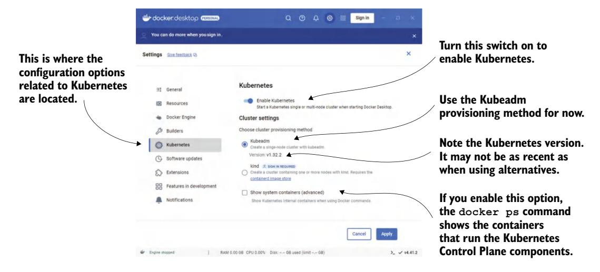
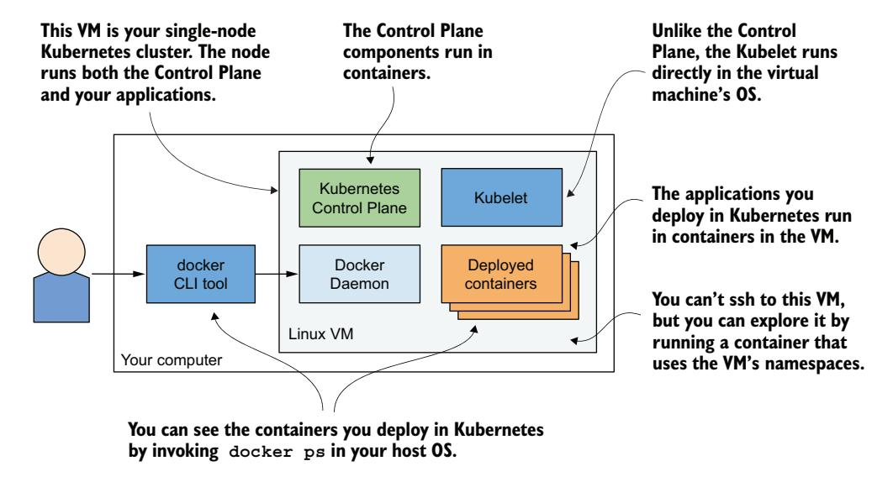
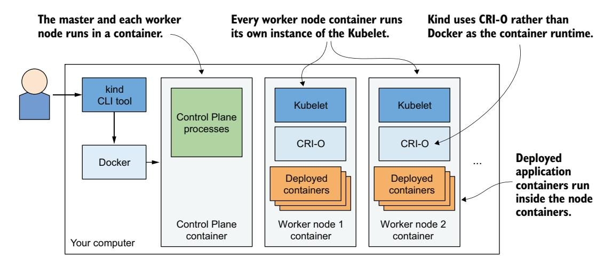
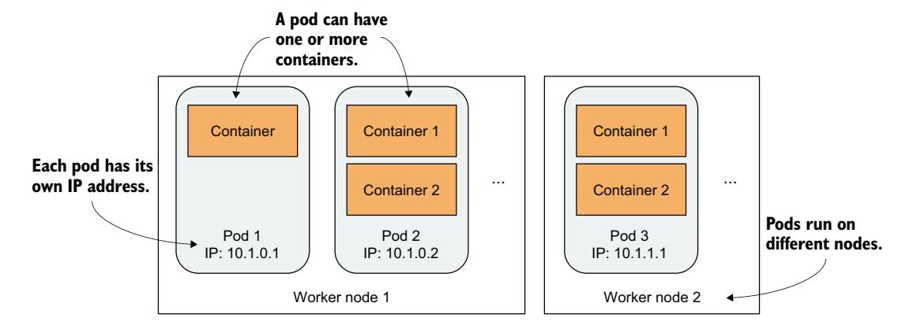
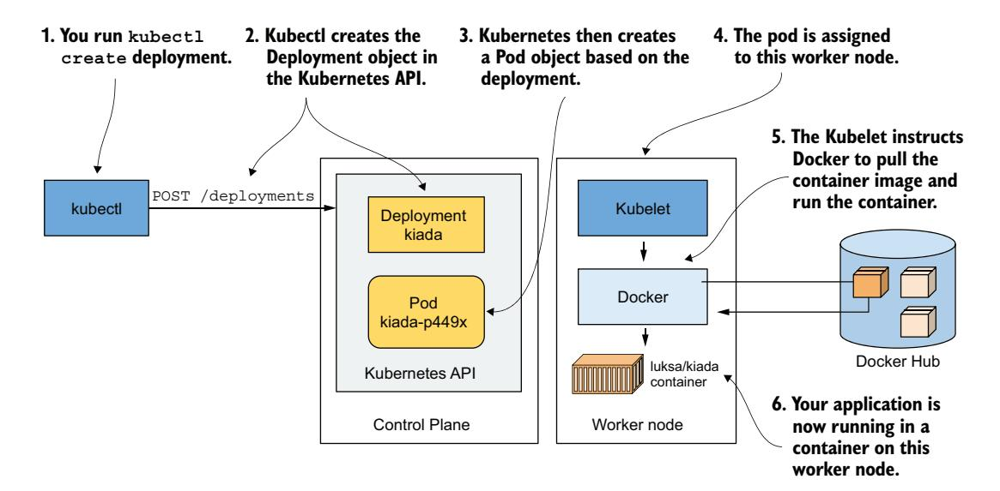
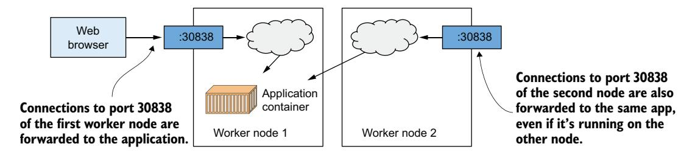
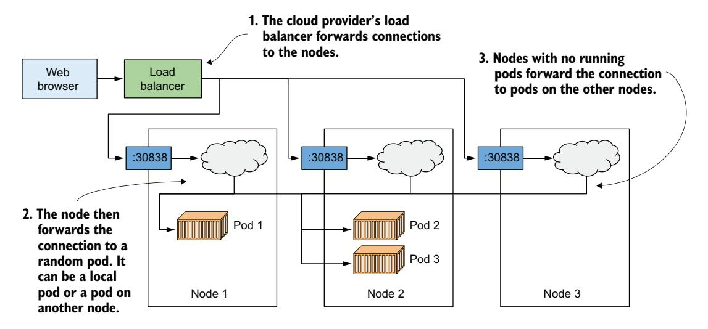

# 第 3 章 在 Kubernetes 上部署第一个应用

!!! tip "本章涵盖"

    - 运行本地 Kubernetes 集群
    - 在云端搭建 Kubernetes 集群
    - 设置和使用 kubectl
    - 在 Kubernetes 上部署和访问应用
    - 水平扩缩容应用

本章将展示如何运行本地单节点开发集群，或是在云端搭建一个正规的托管多节点集群。集群就绪后，你将用它来部署上一章中创建的容器。

!!! note ""

    本章的代码文件可在 [https://mng.bz/26xa](https://mng.bz/26xa) 找到。

## 3.1 部署 Kubernetes 集群

搭建一个完整的多节点 Kubernetes 集群并非易事——尤其是当你对 Linux 和网络管理还不太熟悉的时候。一个正规的 Kubernetes 安装跨越多个物理机或虚拟机，需要合理的网络配置才能让集群中所有容器彼此通信。

你可以在笔记本电脑、自有基础设施上安装 Kubernetes，或者让云厂商替你管理。以下是目前最大、最流行的托管 Kubernetes 选项：

- Google Kubernetes Engine (GKE)
- Amazon Elastic Kubernetes Service (EKS)
- Microsoft Azure Kubernetes Service (AKS)
- IBM Cloud Kubernetes Service
- Oracle Cloud Infrastructure Container Engine for Kubernetes
- DigitalOcean Kubernetes (DOKS)
- 阿里云容器服务

安装和管理 Kubernetes 比仅仅使用它困难得多——特别是在你熟悉其架构和操作之前。如果你是 Kubernetes 新手，我建议从以下方式中选择：

- Docker Desktop
- Minikube
- Kubernetes in Docker (kind)
- Google Kubernetes Engine

我主要使用 kind 进行日常开发，因其资源占用最小。不过我建议多尝试几种方案——每种都有其独特的优势和适用场景。另外，请访问 Kubernetes 官方网站 [kubernetes.io](http://kubernetes.io) 发现更多可用方案。

!!! note ""

    如果你已有现成集群可用，可跳过以下各节，直接进入 3.2 节学习如何与集群交互。

### 3.1.1 使用 Docker Desktop 内置的 Kubernetes 集群

如果你使用 macOS 或 Windows，你很可能已安装 Docker Desktop 来运行上一章的练习。Docker Desktop 提供了一个单节点 Kubernetes 集群，可通过其设置对话框启用。这可能是最简单的入门方式，但需注意其 Kubernetes 版本可能不如其他方案新。

!!! note ""

    虽然严格来说并非一个真正的集群，但 Docker Desktop 提供的单节点系统足以探索本书的大多数主题。涉及多节点集群的练习时我会特别说明。

#### 在 Docker Desktop 中启用 Kubernetes

假设 Docker Desktop 已安装，单击系统托盘中的鲸鱼图标，打开设置对话框。在 Kubernetes 标签页确保"Enable Kubernetes"开关已打开。控制平面的组件以 Docker 容器形式运行，但 Docker 会隐藏它们——除非你勾选"Show system containers"复选框（见图 3.1）。

!!! note ""

    集群初次安装可能需要几分钟，因为所有 Kubernetes 组件的容器镜像都必须下载。



#### 系统可视化

你已了解到 Kubernetes 包含多个组件。图 3.2 展示了这些组件在 Docker Desktop 提供的集群中的运行位置。

Docker Desktop 创建了一个 Linux 虚拟机，承载 Docker 守护进程和所有容器。此 VM 也运行 Kubelet——负责管理节点的 Kubernetes 代理。控制平面组件运行在容器中，你部署的所有应用也是如此。

要列出运行中的容器，你不需要登录到 VM——宿主机 OS 中的 docker CLI 工具即可显示它们。



##### 从内部探索虚拟机

撰写本文时，Docker Desktop 没有提供登录 VM 进行内部探索的命令。不过，你可以运行一个特殊容器，配置为使用 VM 的命名空间来运行远程 shell，等效于通过 SSH 访问远程服务器：

```bash
$ docker run --net=host --ipc=host --uts=host --pid=host --privileged \
    --security-opt=seccomp=unconfined -it --rm -v /:/host alpine chroot /host
```

这个长命令的说明如下：

- 容器从 alpine 镜像创建。
- `--net`、`--ipc`、`--uts`、`--pid` 标志使容器使用宿主机的命名空间而非被沙箱隔离；`--privileged` 和 `--security-opt` 标志赋予容器对所有系统调用的无限制访问权限。
- `-it` 标志以交互模式运行，`--rm` 确保容器终止时被删除。
- `-v` 将宿主机根目录挂载到容器的 /host，`chroot /host` 将此目录设为容器的根目录。

运行后你便进入一个与 SSH 几乎等价的 shell。用 `ps aux` 查看进程，或用 `ip addr` 查看网络接口。

### 3.1.2 使用 Minikube 运行本地集群

另一种方案是 *Minikube*——由 Kubernetes 社区维护的工具。Minikube 部署的 Kubernetes 版本通常比 Docker Desktop 更新。集群为单节点，适用于测试和学习。它通常在 Linux VM 中运行 Kubernetes；如果计算机已运行 Linux，也可通过 Docker 直接在宿主机上部署。

!!! note ""

    若配置 Minikube 使用 VM，需要 Hypervisor（如 VirtualBox）但不需要 Docker。若使用另一种方式，则需要 Docker 但不需要 Hypervisor。

#### 安装 Minikube

Minikube 支持 macOS、Linux 和 Windows，由一个二进制可执行文件组成，可在其 GitHub 仓库 <http://github.com/kubernetes/minikube> 找到。最好遵循那里的最新安装说明。大致来说：macOS 可通过 Brew 安装，Windows 有安装程序，Linux 可下载 .deb/.rpm 包或直接下载二进制文件：

```bash
$ curl -LO https://storage.googleapis.com/minikube/releases/latest/minikube-
     linux-amd64 && \
 sudo install minikube-linux-amd64 /usr/local/bin/minikube
```

关于特定操作系统的详细步骤请参考在线安装指南。

#### 使用 Minikube 启动集群

安装完成后，启动集群：

```bash
$ minikube start
minikube v1.11.0 on Fedora 31
Using the virtualbox driver based on user configuration
Downloading VM boot image ...
> minikube-v1.11.0.iso.sha256: 65 B / 65 B [-------------] 100.00% ? p/s 0s
> minikube-v1.11.0.iso: 174.99 MiB / 174.99 MiB [] 100.00% 50.16 MiB p/s 4s
Starting control plane node minikube in cluster minikube
Downloading Kubernetes v1.18.3 preload ...
> preloaded-images-k8s-v3-v1.18.3-docker-overlay2-amd64.tar.lz4: 526.01 MiB
Creating virtualbox VM (CPUs=2, Memory=6000MB, Disk=20000MB) ...
Preparing Kubernetes v1.18.3 on Docker 19.03.8 ...
Verifying Kubernetes components...
Enabled addons: default-storageclass, storage-provisioner
Done! kubectl is now configured to use "minikube"
```

整个过程可能需要几分钟——VM 镜像和 Kubernetes 组件镜像都需要下载。

!!! tip ""

    如果你使用 Linux，可通过 `minikube start --vm-driver none` 省略 VM 以减少资源占用。

#### 检查状态

`minikube start` 完成后，检查集群状态：

```bash
$ minikube status
host: Running
kubelet: Running
apiserver: Running
kubeconfig: Configured
```

输出显示 Kubernetes 宿主机、Kubelet 和 API 服务器均在运行。最后一行表明 kubectl 已配置为使用此集群。

#### 系统可视化

系统架构如图 3.3 所示，与 Docker Desktop 几乎相同。控制平面组件运行在 VM 中的容器内（若使用 `--vm-driver none` 则直接运行在宿主机 OS 中）。Kubelet 直接运行在 VM 或宿主机 OS 中，通过 Docker 守护进程运行你部署的应用。


运行 `minikube ssh` 登录到 VM 内部探索。用 `ps aux` 列出进程，或用 `docker ps` 列出运行中的容器。

!!! tip ""

    要像 Docker Desktop 那样使用本地 docker CLI 查看容器列表，运行 `eval $(minikube docker-env)`。

### 3.1.3 使用 kind（Kubernetes in Docker）运行本地集群

Minikube 的一个替代方案是 *kind*（Kubernetes in Docker）。kind 不是将 Kubernetes 运行在 VM 中或直接在宿主机上，而是将每个集群节点运行在一个容器内。与 Minikube 不同，这个特性使其可以创建多节点集群——只需启动多个容器即可。你部署到 Kubernetes 的实际应用容器随后运行在这些节点容器内。系统如图 3.4 所示。



上一章我提到，运行在容器中的进程实际上运行在宿主机 OS 中。这意味着使用 kind 时，所有 Kubernetes 组件都运行在你的宿主机 OS 中。你部署到 Kubernetes 集群的应用也是如此。

这使得 kind 成为开发与测试的绝佳工具——一切都在本地运行，你可以像调试普通进程一样调试容器中的应用。我偏好使用 kind 进行 Kubernetes 开发，因为可以用 nsenter 等工具在容器的网络命名空间内运行 Wireshark 甚至浏览器来做各种调试。

如果你是 Kubernetes 新手，最稳妥的选择是从 Minikube 开始。但如果你愿意尝试，以下是 kind 的入门方式。

#### 安装 kind

kind 由一个二进制文件组成。安装说明见 <https://kind.sigs.k8s.io/docs/user/quick-start/>。macOS 和 Linux 上的命令如下：

```bash
$ curl -Lo ./kind https://kind.sigs.k8s.io/dl/v0.11.1/kind-$(uname)-amd64
$ chmod +x ./kind 
$ mv ./kind /some-dir-in-your-PATH/kind
```

查看文档确认最新版本号，并用它替换上例中的 v0.11.1。将 /some-dir-in-your-PATH/ 替换为 PATH 中的实际目录。

!!! note ""

    使用 kind 需要系统上安装 Docker。

#### 使用 kind 启动集群

启动新集群与 Minikube 一样简单：

```bash
$ kind create cluster
```

与 Minikube 类似，kind 会自动配置 kubectl 使用该集群。

#### 使用 kind 启动多节点集群

kind 默认运行单节点集群。如需多节点，先创建一个配置文件。以下是 Chapter03/kind-multi-node.yaml 的内容。

代码清单 3.1 使用 kind 运行三节点集群的配置文件

```yaml
kind: Cluster
apiVersion: kind.sigs.k8s.io/v1alpha4
nodes:
- role: control-plane
- role: worker
- role: worker
```

文件就绪后，用以下命令创建集群：

```bash
$ kind create cluster --config kind-multi-node.yaml
```

#### 列出工作节点

kind 没有提供检查集群状态的专用命令，但你可以用 `kind get nodes` 列出集群节点：

```bash
$ kind get nodes
kind-worker2
kind-worker
kind-control-plane
```

由于每个节点运行在容器中，你也可以通过 `docker ps` 查看：

```bash
$ docker ps
CONTAINER ID   IMAGE                    ...  NAMES
45d0f712eac0   kindest/node:v1.18.2     ...  kind-worker2
d1e88e98e3ae   kindest/node:v1.18.2     ...  kind-worker
4b7751144ca4   kindest/node:v1.18.2     ...  kind-control-plane
```

#### 登录 kind 创建的集群节点

与 Minikube 使用 `minikube ssh` 不同，kind 使用 `docker exec` 进入节点：

```bash
$ docker exec -it kind-control-plane bash
```

kind 创建的节点使用 CRI-O 容器运行时（而非 Docker），这是上一章提到的 Docker 轻量级替代方案。CRI-O 使用 crictl CLI 工具交互，用法与 docker 类似。登录节点后，用 `crictl ps` 列出容器：

```bash
root@kind-control-plane:/# crictl ps
CONTAINER ID     IMAGE          CREATED        STATE    NAME
c7f44d171fb72   eb516548c180f  15 min ago     Running  coredns ...
cce9c0261854c   eb516548c180f  15 min ago     Running  coredns ...
e6522aae66fcc   d428039608992  16 min ago     Running  kube-proxy ...
6b2dc4bbfee0c   ef97cccdfdb50  16 min ago     Running  kindnet-cni ...
c3e66dfe44deb   be321f2ded3f3  16 min ago     Running  kube-apiserver ...
```

### 3.1.4 使用 Google Kubernetes Engine 创建托管集群

如果你想使用完整的多节点集群而非本地集群，可以使用托管集群方案，例如 Google Kubernetes Engine（GKE）。这样你就不必手动搭建所有集群节点和网络——对新手来说这通常太难了。

#### 设置 Google Cloud 并安装 gcloud 客户端

设置 GKE 环境的大致流程如下（具体步骤可能变化，完整说明见 <https://mng.bz/15xq>）：

1. 注册 Google 账号
2. 在 Google Cloud Platform Console 中创建项目
3. 启用结算（需要信用卡，但提供 $300 免费额度的 12 个月免费试用，试用结束后不会自动收费）
4. 下载并安装 Google Cloud SDK（包含 gcloud 工具）
5. 使用 gcloud 命令行工具创建集群

!!! note ""

    某些操作（如第 2 步）可能需要几分钟才能完成，稍安勿躁。

#### 创建三节点 GKE 集群

创建集群前需决定地理区域和可用区。可用位置列表见 <https://mng.bz/Pw9R>。以下示例使用德国法兰克福的 europe-west3 区域，可用区 europe-west3-c。

```bash
$ gcloud config set compute/zone europe-west3-c
```

创建集群：

```bash
$ gcloud container clusters create kiada --num-nodes 3
Creating cluster kiada in europe-west3-c... 
...
kubeconfig entry generated for kiada.
NAME   LOCAT.   MASTER_VER   MASTER_IP    MACHINE_TYPE   ... NODES  STATUS
kiada  eu-w3-c  1.13.11...   5.24.21.22   n1-standard-1  ... 3      RUNNING
```

!!! note ""

    我将三个工作节点全创建在同一可用区，但你也可以分布到整个区域——将 `compute/zone` 设为整个区域而非单个可用区。但请注意，`--num-nodes` 此时表示*每个可用区*的节点数。

现在你有了一个运行中的三节点集群。每个节点是 Google Compute Engine（GCE）提供的虚拟机。列出这些虚拟机：

```bash
$ gcloud compute instances list
NAME          ZONE        MACHINE_TYPE   INTERNAL_IP   EXTERNAL_IP     STATUS
...-ctlk      eu-west3-c  n1-standard-1  10.156.0.16   34.89.238.55    RUNNING
...-gj1f      eu-west3-c  n1-standard-1  10.156.0.14   35.242.223.97   RUNNING
...-r01z      eu-west3-c  n1-standard-1  10.156.0.15   35.198.191.189  RUNNING
```

!!! tip ""

    每台虚拟机都会产生费用。为降低成本，可将节点数缩减到 1 甚至 0。详见下节。

系统如图 3.5 所示。注意只有工作节点运行在 GCE 虚拟机中——控制平面运行在别处，你无法访问承载它的机器。


#### 调整节点数量

你可以轻松调整节点数。对于本书大多数练习，将其缩减到 1 个节点可以省钱。甚至可以缩减到 0：

```bash
$ gcloud container clusters resize kiada --size 0
```

缩减到零的好处是：你在集群中创建的所有对象（包括已部署的应用）都不会被删除。当然，没有节点应用无法运行，但只要将集群扩展回来，它们就会被重新部署。即使没有工作节点，你仍然可以与 Kubernetes API 交互。

#### 检查 GKE 工作节点

登录节点查看内部运行的内容：

```bash
$ gcloud compute ssh gke-kiada-default-pool-9bba9b18-4glf
```

登录后可用 `docker ps` 列出运行中的容器。你还没有运行任何应用，所以只会看到 Kubernetes 系统容器——它们是什么现在不重要，将在后续章节讲解。

### 3.1.5 使用 Amazon Elastic Kubernetes Service 创建集群

如果你偏好 Amazon 而非 Google，可以尝试 Amazon Elastic Kubernetes Service（EKS）。首先按 <https://mng.bz/JwOZ> 安装 eksctl 命令行工具。

#### 创建 EKS 集群

与 GKE 类似，创建 EKS 集群只需一条命令：

```bash
$ eksctl create cluster --name kiada --region eu-central-1 --nodes 3 --ssh-access
```

此命令在 eu-central-1 区域创建一个三节点集群。区域列表见 <https://mng.bz/wZd5>。

#### 检查 EKS 工作节点

`--ssh-access` 标志确保你的 SSH 公钥被导入到节点，之后可使用 SSH 连接。登录后可用 `docker ps` 查看运行中的容器——你会看到与之前方案类似的系统容器。

### 3.1.6 从零开始部署多节点集群

在深入了解 Kubernetes 之前，我强烈建议不要尝试从零开始安装集群。经验丰富的系统管理员或许能胜任，但大多数人最好先从前面描述的方案开始。妥善管理 Kubernetes 集群极为困难，光是安装就不容低估。

使用 kubeadm 成功部署一两个集群后，可尝试按照 Kelsey Hightower 的 *Kubernetes the Hard Way* 教程（<github.com/kelseyhightower/kubernetes-the-hard-way>）完全手动部署。这个过程中你会遇到不少问题，但寻找解决方案本身就是宝贵的学习经历。

## 3.2 与 Kubernetes 交互

现在你已了解了部署 Kubernetes 集群的几种方式，是时候学习如何使用集群了。与 Kubernetes 交互使用命令行工具 kubectl，发音为 *kube-control*、*kube-C-T-L* 或 *kube-cuddle*。

如图 3.6 所示，该工具与 Kubernetes API 服务器通信——API 服务器是 Kubernetes 控制平面的一部分。控制平面随后触发其他组件，根据你通过 API 所做的变更执行相应操作。


### 3.2.1 设置 kubectl

kubectl 是一个单可执行文件，需要下载到计算机并放入 PATH 中。它从名为 *kubeconfig* 的配置文件加载配置。使用 kubectl 之前必须安装它并准备好 kubeconfig 文件，以便 kubectl 知道与哪个集群通信。

#### 下载和安装 kubectl

Linux 上最新稳定版的下载安装命令如下：

```bash
$ curl -LO "https://dl.k8s.io/release/$(curl -L -s https://dl.k8s.io/release/
$ chmod +x kubectl
$ sudo mv kubectl /usr/local/bin/
```

macOS 上可运行相同命令（将 linux 替换为 darwin），或通过 Homebrew 安装：

```bash
$ brew install kubectl
```

Windows 上从 <https://mng.bz/qR8x> 下载 kubectl.exe。为获取最新版本，先查看 <https://mng.bz/7Q7Q> 获取最新稳定版本号，然后替换 URL 中的版本号。安装完成后运行 `kubectl --help` 确认安装成功。注意 kubectl 可能尚未配置连接到你的集群，这意味着大多数命令还无法使用。

!!! tip ""

    随时可以在任意 kubectl 命令后附加 `--help` 获取更多信息。

#### 设置 kubectl 的短别名

你会频繁使用 kubectl。每次都输入完整的命令名实在浪费时间，可以设置别名和 Tab 补全来提速。

大多数用户将 k 设为 kubectl 的别名。在 Linux 和 macOS 中，将以下行加入 `~/.bashrc` 或等效文件：

```bash
alias k=kubectl
```

Windows 命令提示符中执行 `doskey k=kubectl $*`，PowerShell 中执行 `set-alias -name k -value kubectl`。

!!! note ""

    如果你使用 gcloud 设置集群，它除了 kubectl 外还会安装 k 二进制文件，可能不需要别名。

#### 配置 kubectl 的 Tab 补全

即使有 k 这样的短别名，仍需输入很多内容。kubectl 可以输出 bash 和 zsh 的 shell 补全代码，支持命令名和对象名的 Tab 补全。例如，你稍后需要执行类似这样的命令来查看节点详情：

```bash
$ kubectl describe node gke-kiada-default-pool-9bba9b18-4glf
```

需要反复输入大量字符。有了 Tab 补全就简单多了——只需输入前几个字符然后按 TAB：

```bash
$ kubectl desc<TAB> no<TAB> gke-ku<TAB>
```

在 bash 中启用补全，先安装 bash-completion 包，再运行（可加入 `~/.bashrc` 永久生效）：

```bash
$ source <(kubectl completion bash)
```

!!! note ""

    此命令启用 bash 补全。也可为其他 shell 运行类似命令。撰写本文时支持的选项包括 bash、zsh、fish 和 powershell。

但这只能在使用完整 kubectl 命令名时补全，使用 k 别名时无效。为别名启用补全，运行：

```bash
$ complete -o default -F __start_kubectl k
```

### 3.2.2 配置 kubectl 使用特定集群

kubeconfig 文件位于 `~/.kube/config`。如果你使用 Docker Desktop、Minikube 或 GKE 部署集群，该文件已被创建。如果被授予对现有集群的访问权限，你应该已收到该文件。其他工具（如 kind）可能将文件写入不同位置。你可以不移动文件，而是通过设置 KUBECONFIG 环境变量来指向它：

```bash
$ export KUBECONFIG=/path/to/custom/kubeconfig
```

### 3.2.3 使用 kubectl

安装并配置好 kubectl 后，就可以用它来与集群通信了。

#### 验证集群正常运行

使用 `kubectl cluster-info` 命令检查集群是否正常工作：

```bash
$ kubectl cluster-info
Kubernetes master is running at https://192.168.99.101:8443
KubeDNS is running at https://192.168.99.101:8443/api/v1/namespaces/...
```

输出表明 API 服务器活跃且正在响应请求，还列出了集群中运行的各种 Kubernetes 服务。上例显示除了 API 服务器外，提供集群内域名服务的 KubeDNS 也是运行中的服务之一。

#### 列出集群节点

使用 `kubectl get nodes` 列出集群中的所有节点。以下是 kind 集群的输出：

```bash
$ kubectl get nodes
NAME               STATUS   ROLES                  AGE   VERSION
kind-control-plane Ready    control-plane,master   12m   v1.18.2
kind-worker        Ready    <none>                 12m   v1.18.2
kind-worker2       Ready    <none>                 12m   v1.18.2
```

Kubernetes 中的一切皆由对象表示，可通过 RESTful API 检索和操作。`kubectl get` 命令从 API 获取指定类型的对象列表。你会反复使用此命令，但它仅显示摘要信息。

#### 获取对象的详细详情

使用 `kubectl describe` 查看更多信息：

```bash
$ kubectl describe node gke-kiada-85f6-node-0rrx
```

此处省略实际输出，因为它非常宽且在本节无法阅读。如果你自己运行此命令，会看到节点的状态、CPU 和内存使用情况、系统信息、运行的容器等详细信息。

如果不指定资源名称运行 `kubectl describe`，会打印所有该类型对象的详细信息。

!!! tip ""

    在只有某个类型的单个对象时，省略对象名称执行 describe 非常方便——你不需要输入或复制粘贴对象名称。

本书后续章节会讲解更多的 kubectl 命令。

### 3.2.4 通过 Web 仪表板与 Kubernetes 交互

如果你更喜欢图形化的 Web 用户界面，Kubernetes 也提供了一个不错的 Web 仪表板。不过，仪表板的功能可能明显落后于 kubectl——kubectl 才是与 Kubernetes 交互的主要工具。

尽管如此，仪表板以直观的上下文方式展示不同资源，是了解 Kubernetes 主要资源类型及其关系的好起点。仪表板还提供了修改已部署对象的功能，并为每个操作显示等效的 kubectl 命令——这个功能大多数初学者都会喜欢。

图 3.7 展示了仪表板中运行着两个工作负载的截图。虽然本书不使用仪表板，但在通过 kubectl 创建对象后，你随时可以打开它快速查看集群中已部署对象的图形化视图。


#### 在 Docker Desktop 中访问仪表板

遗憾的是，Docker Desktop 默认不安装 Kubernetes 仪表板，访问也并非易事。你需要先安装它：

```bash
$ kubectl apply -f https://raw.githubusercontent.com/kubernetes/dashboard/
     v2.0.0-rc5/aio/deploy/recommended.yaml
```

请参考 <github.com/kubernetes/dashboard> 获取最新版本号。安装后，运行：

```bash
$ kubectl proxy
```

此命令启动到 API 服务器的本地代理，允许你通过它访问服务。让代理进程保持运行，在浏览器中打开以下 URL：

```
http://localhost:8001/api/v1/namespaces/kubernetes-dashboard/services/
     https:kubernetes-dashboard:/proxy/
```

你会看到认证页面。然后运行以下命令获取认证令牌（需在 Windows PowerShell 中运行）：

```powershell
PS C:\> kubectl -n kubernetes-dashboard describe secret $(kubectl -n kubernetes-
dashboard get secret | sls admin-user | ForEach-Object { $_ -Split '\s+' } | 
Select -First 1)
```

找到 kubernetes-dashboard-token-xyz 对应的令牌，将其粘贴到浏览器认证页面的令牌字段中，即可使用仪表板。使用完毕后按 Ctrl-C 终止 kubectl proxy 进程。

#### 在 Minikube 中访问仪表板

如果使用 Minikube，访问仪表板简单得多。运行以下命令即可在默认浏览器中打开仪表板：

```bash
$ minikube dashboard
```

#### 在其他环境中访问仪表板

Google Kubernetes Engine 不再提供对开源 Kubernetes Dashboard 的访问，但提供了替代的 Web 控制台。其他云厂商类似。有关访问仪表板的信息，请参考相应厂商的文档。如果你在自己的基础设施上运行集群，可按 <https://mng.bz/mZK8> 的指南部署仪表板。

## 3.3 在 Kubernetes 上运行你的第一个应用

现在终于是时候向集群部署一些东西了。通常，部署应用需要准备一个 JSON 或 YAML 文件来描述应用的所有组成部分，然后将该文件应用到集群——这是声明式的方式。

不过既然这可能是你第一次在 Kubernetes 上部署应用，我们先选一条更简单的路。我们将使用简单的一行命令——即命令式命令——来部署应用。

### 3.3.1 部署应用

部署应用的命令式方式是使用 `kubectl create deployment` 命令。顾名思义，它创建一个 *Deployment* 对象，代表集群中已部署的应用。使用命令式命令可以避免你事先了解 Deployment 对象的结构——而编写 YAML/JSON 清单则必须了解。

#### 创建 Deployment

上一章中你创建了一个名为 Kiada 的 Node.js 应用，打包为容器镜像并推送到 Docker Hub。

!!! note ""

    如果你因已熟悉 Docker 和容器而跳过了第 2 章，建议回读 2.2.1 节，该节描述了你要在此处及本书后续部署的应用。

将 Kiada 应用部署到 Kubernetes 集群：

```bash
$ kubectl create deployment kiada --image=luksa/kiada:0.1
deployment.apps/kiada created
```

这条命令指定了三件事：
- 你要创建一个 Deployment 对象
- 对象名为 kiada
- Deployment 使用容器镜像 luksa/kiada:0.1

默认从 Docker Hub 拉取镜像，但你也可以在镜像名中指定仓库地址（如 `quay.io/luksa/kiada:0.1`）。

!!! note ""

    确保镜像存储在公共仓库中，可以免认证拉取。你将在第 8 章学习如何为私有镜像提供凭据。

Deployment 对象现在已存储在 Kubernetes API 中。这个对象告诉 Kubernetes：luksa/kiada:0.1 容器必须在你的集群中运行。你已经声明了*期望*状态。Kubernetes 现在必须确保*实际*状态反映你的愿望。

#### 列出 Deployment

与 Kubernetes 的交互主要包括通过其 API 创建和操作对象。Kubernetes 存储这些对象，然后执行操作将它们变为现实。例如，创建 Deployment 对象后，Kubernetes 运行一个应用，然后通过写入同一个 Deployment 对象的 status 告知你应用的当前状态。你可以通过读回对象来查看状态：

```bash
$ kubectl get deployments
NAME    READY   UP-TO-DATE   AVAILABLE   AGE
kiada   0/1     1            0           6s
```

`kubectl get deployments` 列出集群中当前存在的所有 Deployment 对象。你只有一个 Deployment。它运行你的应用的一个实例（UP-TO-DATE 列为 1），但 AVAILABLE 列显示应用尚未可用——因为容器尚未就绪（READY 列显示 0/1）。

你可能会想：能否通过 `kubectl get containers` 列出运行中的容器？试试看：

```bash
$ kubectl get containers
error: the server doesn't have a resource type "containers"
```

命令失败，因为 Kubernetes 没有 "Container" 对象类型。这似乎很奇怪——Kubernetes 的核心就是运行容器。但其中另有玄机：容器并非 Kubernetes 部署的最小单元。那么最小单元是什么？

#### Pod 简介

在 Kubernetes 中，你不是部署单个容器，而是部署一组共置的容器——即所谓的 *pod*。pod 是一组一个或多个紧密关联的容器（类似豌豆荚中的豌豆），它们在同一工作节点上共同运行，共享某些 Linux 命名空间以便进行更紧密的交互。

上一章中我展示了两个进程使用相同命名空间的例子。通过共享网络命名空间，两个进程使用相同的网络接口、IP 地址和端口空间。通过共享 UTS 命名空间，两者看到相同的系统主机名。这正是同一 pod 中容器的运行方式——它们共享网络和 UTS 命名空间，以及其他根据 pod spec 指定的命名空间（图 3.8）。



如图所示，每个 pod 可视为一个独立的逻辑计算机，包含一个应用。该应用可以由单个进程（运行在一个容器中）组成，也可以由一个主应用进程和额外的支持进程（各自运行在独立容器中）组成。Pod 分布在集群的所有工作节点上。

每个 pod 有自己独立的 IP、主机名、进程、网络接口和其他资源。属于同一 pod 的容器认为它们是该计算机上运行的唯一进程——它们看不到任何其他 pod 的进程，即使位于同一节点。

#### 列出 Pod

由于容器不是顶层 Kubernetes 对象，你不能列出它们，但你可以列出 pod。如下列 `kubectl get pods` 命令输出所示，创建 Deployment 对象后你已部署了一个 pod：

```bash
$ kubectl get pods
NAME                     READY   STATUS    RESTARTS   AGE
kiada-9d785b578-p449x   0/1     Pending   0          16s
```

这个 pod 容纳了运行你应用的容器。准确地说，由于状态仍是 Pending，应用（容器）尚未运行。READY 列也表明 pod 有一个尚未就绪的容器。

pod 处于 Pending 状态的原因是分配到的节点必须先下载容器镜像才能运行。下载完成后，pod 的容器被创建，pod 进入 Running 状态。

如果 Kubernetes 无法从仓库拉取镜像，STATUS 列会显示相关信息。如果你使用自己的镜像，请确保其已在 Docker Hub 上标记为公开。可尝试用 `docker pull` 在另一台计算机上手动拉取验证。

如果其他问题导致 pod 无法运行，可使用 `kubectl describe pod` 查看详情。输出底部的 events 信息非常重要。对一个正常运行中的 pod，事件应类似如下：

| Type   | Reason   | Age | From                  | Message                                       |
|--------|----------|-----|-----------------------|-----------------------------------------------|
| Normal | Scheduled| 25s | default-scheduler     | Successfully assigned default/kiada-... to kind-worker2 |
| Normal | Pulling  | 23s | kubelet, kind-worker2 | Pulling image "luksa/kiada:0.1"               |
| Normal | Pulled   | 21s | kubelet, kind-worker2 | Successfully pulled image                     |
| Normal | Created  | 21s | kubelet, kind-worker2 | Created container kiada                       |
| Normal | Started  | 21s | kubelet, kind-worker2 | Started container kiada                       |

#### 理解幕后发生的事

图 3.9 可视化了你创建 Deployment 时发生的事情。


当你运行 `kubectl create` 命令时，它通过向 Kubernetes API 服务器发送 HTTP 请求在集群中创建了一个新的 Deployment 对象。Kubernetes 随后创建了新的 Pod 对象，该 pod 被分配或*调度*到某个工作节点。工作节点上的 Kubernetes 代理（Kubelet）感知到新创建的 Pod 对象，看到它被调度到自己的节点，随即指示 Docker 从仓库拉取指定镜像、创建容器并执行。

!!! info "定义：调度（Scheduling）"

    术语*调度*指的是将 pod 分配到节点的过程。Pod 立即运行，而非将来的某个时间点。就像操作系统中的 CPU 调度器选择哪个 CPU 来运行进程一样，Kubernetes 中的调度器决定哪个工作节点应该运行每个容器。与 OS 进程不同的是，一旦 pod 被分配到某个节点，它只在该节点上运行。即使发生故障，该 pod 实例也不会被迁移到其他节点——这与 CPU 进程不同；但可能会创建一个新的 pod 实例来替代它。

根据你使用的集群类型，工作节点数量可能不同。图 3.9 只展示了 pod 被调度到的那个工作节点。在多节点集群中，其他工作节点不参与此过程。

### 3.3.2 将应用暴露给外部

应用现在正在运行，下一个问题是如何访问它。我提到过每个 pod 有自己的 IP，但该地址仅在集群内部有效，无法从外部访问。要对外暴露 pod，你需要创建 Service 对象*暴露*它。

Service 对象有几种类型，取决于你的需求。有些类型仅在集群内部暴露 pod，有些则对外暴露。类型为 LoadBalancer 的 Service 会配置一个外部负载均衡器，使服务可通过公共 IP 访问。现在我们就创建这种类型。

#### 创建 Service

创建 Service 的最简单方式是使用以下命令式命令：

```bash
$ kubectl expose deployment kiada --type=LoadBalancer --port 8080
service/kiada exposed
```

之前的 `create deployment` 命令创建的是 Deployment 对象，而 `expose deployment` 命令创建的是 Service 对象。这条命令告诉 Kubernetes：

- 将属于 kiada Deployment 的所有 pod 作为一个新的 Service 暴露
- 通过负载均衡器从集群外部访问这些 pod
- 应用监听 8080 端口，你希望通过该端口访问

你没有指定 Service 对象名称，所以它继承 Deployment 的名称。

#### 列出 Service

Service 是 API 对象，与 Pod、Deployment、Node 以及 Kubernetes 中几乎所有东西一样，因此可以通过 `kubectl get services` 列出：

```bash
$ kubectl get svc
NAME         TYPE           CLUSTER-IP      EXTERNAL-IP   PORT(S)          AGE
kubernetes   ClusterIP      10.19.240.1     <none>        443/TCP          34m
kiada        LoadBalancer   10.19.243.17    <pending>     8080:30838/TCP   4s
```

!!! note ""

    注意这里使用了缩写 svc 代替 services。大多数资源类型都有短名称（如 po 代表 pods、no 代表 nodes、deploy 代表 deployments）。

列表中显示两个 Service，附带类型、IP 和暴露的端口。暂时忽略 kubernetes Service，关注 kiada Service。它还没有外部 IP——是否能分配到外部 IP 取决于你的集群部署方式。

#### 通过 kubectl api-resources 列出可用对象类型

你已使用 `kubectl get` 列出了 Nodes、Deployments、Pods 和 Services——这些都是 Kubernetes 的对象类型。运行 `kubectl api-resources` 可以显示完整列表，包括短名称以及定义 JSON/YAML 文件所需的其他信息（后续章节会涉及）。

#### 理解 LoadBalancer Service

Kubernetes 虽然允许你创建 LoadBalancer 类型的 Service，但它本身并不提供负载均衡器。如果集群部署在云端，Kubernetes 可请求云基础设施提供负载均衡器并配置其将流量转发到集群。基础设施告诉 Kubernetes 负载均衡器的 IP 地址，该地址成为 Service 的外部地址。图 3.10 展示了创建 Service 对象、配置负载均衡器以及将连接转发到集群的过程。



负载均衡器的配置需要一些时间。稍等几秒再查看 IP 是否已分配。这次只查看 kiada Service：

```bash
$ kubectl get svc kiada
NAME    TYPE           CLUSTER-IP      EXTERNAL-IP      PORT(S)          AGE
kiada   LoadBalancer   10.19.243.17    35.246.179.22    8080:30838/TCP   82s
```

外部 IP 已显示，说明负载均衡器已准备好将全球客户端请求转发到你的应用。

!!! note ""

    如果你使用 Docker Desktop 部署集群，负载均衡器的 IP 显示为 localhost（指向你的 Windows 或 macOS 机器，而非运行 Kubernetes 和应用的 VM）。如果使用 Minikube 创建集群，不会创建负载均衡器，但你可以通过其他方式访问服务——详见后文。

#### 通过负载均衡器访问应用

现在可通过 Service 的外部 IP 和端口向应用发送请求：

```bash
$ curl 35.246.179.22:8080
Kiada version 0.1. Request processed by "kiada-9d785b578-p449x". Client IP: ...
```

!!! note ""

    如果使用 Docker Desktop，服务在宿主机 OS 中可通过 localhost:8080 访问。用 curl 或浏览器访问即可。

恭喜！如果你使用 GKE，你已成功将应用发布给全球用户——任何知道其 IP 和端口的人现在都可以访问它。不算部署集群本身所需的步骤，部署应用只需两条简单命令：`kubectl create deployment` 和 `kubectl expose deployment`。

#### 通过 NodePort 访问应用

并非所有 Kubernetes 集群都具备提供负载均衡器的机制。当你创建 LoadBalancer 类型的 Service 时，Service 本身正常工作，但没有负载均衡器可以从集群外部访问它。这种情况下 kubectl 显示的外部 IP 为 `<pending>`，你需要用其他方法访问服务。如果你使用 Minikube、Docker Desktop 或 kind 运行集群，就需要这样做。

创建 LoadBalancer 类型 Service 的同时，也会被分配一个所谓的**节点端口**（node port）——即集群节点上用于将流量转发到 Service 的网络端口。图 3.11 展示了外部客户端如何通过节点端口访问应用。


要访问应用，你需要两条信息：节点端口号和某个集群节点的 IP。

创建 Service 时，Kubernetes 会自动分配一个未使用的节点端口。运行 `kubectl get services` 在 PORT(S) 列可以看到端口号：

```bash
$ kubectl get svc kiada
NAME    TYPE           CLUSTER-IP      EXTERNAL-IP   PORT(S)          AGE
kiada   LoadBalancer   10.19.243.17    <pending>     8080:30838/TCP   82s
```

上例中 8080 是内部 Service 端口，30838 是节点端口。你也可以自己指定节点端口号——将在第 11 章学习。

接下来获取集群节点的 IP 地址：

```bash
$ kubectl get nodes -o wide
NAME                 STATUS   ROLES                  AGE   VERSION   INTERNAL-IP
kind-control-plane   Ready    control-plane,master   18h   v1.21.1   172.18.0.2
kind-worker          Ready    <none>                 18h   v1.21.1   172.18.0.3
kind-worker2         Ready    <none>                 18h   v1.21.1   172.18.0.4
```

集群有三个节点，任选一个 IP 结合节点端口即可访问。例如选用 172.18.0.2 加端口 30838：

```bash
$ curl 172.18.0.2:30838
Kiada version 0.1. Request processed by "kiada-9d785b578-p449x". Client IP: ...
```

**访问 Service 的注意事项**

防火墙规则可能阻止对节点端口的访问。如果集群节点运行在本地，一般不会有此问题；但如果集群运行在云端，通常会被阻止——不过此时我建议使用负载均衡器 IP 访问。

Minikube 用户可运行 `minikube service kiada` 访问，加 `--url` 选项可打印 URL 而不打开浏览器。

Docker Desktop 用户可从宿主机 OS 通过 SSH 进入 VM（按 3.1.1 节描述的方式）访问节点端口。

### 3.3.3 水平扩缩容应用

你现在有了一个运行中的应用——由 Deployment 对象表示，通过 Service 对象对外暴露。现在来变点魔法。

在容器中运行应用的主要优势之一是可以轻松地进行扩缩容。你目前只运行应用的一个实例。假设突然有更多用户访问，单个实例无法处理负载，你需要添加额外实例来分担负载并为更多用户服务——这就叫*水平扩容*。在 Kubernetes 中这轻而易举。

#### 增加运行实例数

你的 Deployment 默认运行一个应用实例。运行更多实例只需用以下命令扩展 Deployment：

```bash
$ kubectl scale deployment kiada --replicas=3
deployment.apps/kiada scaled
```

你已告诉 Kubernetes 你想要运行 pod 的三个精确副本（*replica*）。注意你没有指示 Kubernetes *做什么*——你没让它"添加两个 pod"。你只是设置了新的期望副本数，让 Kubernetes 自行决定需要采取什么行动来达到新的期望状态。

这是 Kubernetes 最根本的原则之一：你不是告诉它做什么，而是设置系统的新期望状态，让 Kubernetes 去实现它。为此，它检查当前状态，与期望状态比较，找出差异，然后决定调和这些差异所需的操作。

#### 查看扩容结果

虽然 `kubectl scale deployment` 命令看起来是命令式的——因为它似乎直接告诉 Kubernetes"扩容你的应用"——但该命令实际上做的是修改指定的 Deployment 对象。稍后你会看到，你也可以直接编辑对象而非使用命令式命令。再次查看 Deployment 对象：

```bash
$ kubectl get deploy
NAME    READY   UP-TO-DATE   AVAILABLE   AGE
kiada   3/3     3            3           18m
```

三个实例现在是最新且可用的，三个容器已就绪。三个容器不属于同一个 pod 实例，而是有三个 pod，每个包含一个容器。通过列出 pod 确认：

```bash
$ kubectl get pods
NAME                     READY   STATUS    RESTARTS   AGE
kiada-9d785b578-58vhc    1/1     Running   0          17s
kiada-9d785b578-jmnj8    1/1     Running   0          17s
kiada-9d785b578-p449x    1/1     Running   0          18m
```

现在有三个 pod，每个 READY 列显示 1/1。全部 Running。

#### 列出 pod 时显示所在节点

如果使用单节点集群，所有 pod 都运行在同一节点。但在多节点集群中，pod 应分布在集群各处。用 `-o wide` 查看更详细的列表：

```bash
$ kubectl get pods -o wide
NAME                     IP           NODE
kiada-9d785b578-58vhc    10.244.1.5   kind-worker
kiada-9d785b578-jmnj8    10.244.2.4   kind-worker2
kiada-9d785b578-p449x    10.244.2.3   kind-worker2
```

一个 pod 调度到一个节点，另外两个 Pod 调度到另一节点。调度器通常均匀分布 pod，但取决于其配置。

**宿主机节点重要吗？**

无论运行在哪个节点，你的应用所有实例都具有相同的 OS 环境，因为它们运行在从同一容器镜像创建的容器中。你可能记得上一章提到，唯一可能的差异是 OS 内核——只有当不同节点使用不同内核版本或加载了不同模块时才会发生。

此外，每个 pod 有自己的 IP，可以以相同方式与任何其他 pod 通信——无论它们位于同一工作节点、同一机架的其他位置，还是完全不同的数据中心。

目前我们还没有设置任何资源需求，但如果设置了，每个 pod 将被分配所请求的计算资源量。只要 pod 的要求得到满足，哪个节点提供这些资源并不重要。

因此，你不应该关心 pod 被调度到哪里。这也是为什么默认的 `kubectl get pods` 不显示节点信息的原因——在 Kubernetes 的世界里，这并不那么重要。

扩容应用实在太容易了。一旦你的应用上线且有扩容需求，只需一条命令就能添加额外实例，无需手动安装、配置和运行额外副本。

!!! note ""

    应用本身必须支持水平扩缩容。Kubernetes 不会魔幻般地让你的应用可扩展，它只是让复制应用变得几乎不费力。

#### 观察请求在多个 pod 上的分布

现在有多个实例在运行，再次请求 Service URL 会发生什么？响应总是来自同一个实例吗？

```bash
$ curl 35.246.179.22:8080
Kiada version 0.1. Request processed by "kiada-9d785b578-58vhc". Client IP: ...
$ curl 35.246.179.22:8080
Kiada version 0.1. Request processed by "kiada-9d785b578-p449x". Client IP: ...
$ curl 35.246.179.22:8080
Kiada version 0.1. Request processed by "kiada-9d785b578-jmnj8". Client IP: ...
$ curl 35.246.179.22:8080
Kiada version 0.1. Request processed by "kiada-9d785b578-p449x". Client IP: ...
```

仔细查看响应，你会发现它们对应 pod 名称，每次请求随机到达不同 pod。这就是 Kubernetes Service 在有多个 pod 实例支撑时的作用——充当 pod 前面的负载均衡器。图 3.12 展示了这个系统。



如图所示，不要将 Kubernetes Service 本身提供的负载均衡机制与基础设施在 GKE 或其他云端集群中提供的额外负载均衡器混淆。即使你使用 Minikube 且没有外部负载均衡器，请求仍然由 Service 本身分发到三个 pod。如果你使用 GKE，实际上有*两个*负载均衡器在起作用：基础设施的负载均衡器将请求分发到各个节点，Service 再将请求分发到各个 pod。

我知道现在听起来可能很混乱，但在第 11 章中一切都会清晰的。

### 3.3.4 理解已部署的应用

总结本章，让我们审视一下系统的组成部分。有两种视角来看系统：逻辑视图和物理视图。你已在图 3.12 中看到了物理视图：运行在三个工作节点（Minikube 为单节点）上的三个容器，云端集群还有云基础设施创建的负载均衡器。Docker Desktop 也会创建一种本地负载均衡。Minikube 不创建负载均衡器，但你可以直接通过节点端口访问 Service。

虽然不同集群的物理视图有所差异，但无论使用小型开发集群还是包含数千节点的大型生产集群，逻辑视图始终相同。如果你不是管理集群的那个人，你甚至不需要关心物理视图。如果一切正常，你只需关注逻辑视图。

#### 理解表示应用的 API 对象

逻辑视图由你在 Kubernetes API 中创建的对象组成——直接或间接创建的。图 3.13 展示了这些对象之间的关系。



这些对象是：

- 你创建的 Deployment 对象
- 基于 Deployment 自动创建的 Pod 对象
- 手动创建的 Service 对象

三者之间还存在其他对象，但目前你无需了解它们——后续章节会涉及。

还记得第 1 章中我解释的 Kubernetes 抽象基础设施吗？你应用的逻辑视图就是最好的例子：没有节点，没有复杂的网络拓扑，没有物理负载均衡器——只有一个只包含你的应用和支持对象的简单视图。

Deployment 对象代表应用部署——指定使用哪个容器镜像以及应运行多少个副本。每个副本由 Pod 对象表示。Service 对象代表到这些副本的单一通信入口。

#### 理解 Pod

系统最核心的部分是 pod。每个 pod 定义包含组成 pod 的一个或多个容器。当 Kubernetes 将 pod 变为现实时，它运行定义中指定的所有容器。只要 Pod 对象存在，Kubernetes 会尽最大努力保持其容器运行——仅在 Pod 对象被删除时才关闭它们。

#### 理解 Deployment 的作用

当你首次创建 Deployment 对象时，只创建了一个 Pod 对象。当你增加 Deployment 的期望副本数后，Kubernetes 创建了额外的副本。Kubernetes 确保实际 pod 数始终与期望数量匹配。

如果一个或多个 pod 消失或状态未知，Kubernetes 会替换它们以恢复期望副本数。Pod 消失是被删除时；状态未知是节点因网络或节点故障不再报告状态时。

严格来说，Deployment 对象除了创建一定数量的 Pod 对象外不带来什么。你可能会问：能否直接创建 pod 而非让 Deployment 创建？当然可以。但如果你要运行多个副本，就必须手动逐一创建每个 pod 并确保每个名称唯一。还必须时刻监控 pod，在它们突然消失或所在节点故障时替换它们。这正是你几乎从不直接创建 pod 而使用 Deployment 的原因。

#### 理解为何需要 Service

系统的第三个组件是 Service 对象。通过创建它，你告诉 Kubernetes 你需要到 pod 的单一通信入口点。Service 提供一个固定的 IP 地址来与 pod 通信——无论当前部署多少副本。如果 Service 由多个 pod 支撑，它充当负载均衡器。但即使只有一个 pod，你也仍应通过 Service 暴露它。要理解其中原因，你需要了解 pod 工作方式的一个关键方面。

Pod 是短暂的。Pod 可能随时消失——当其宿主机节点故障、有人误删 pod、或 pod 被驱逐以为更重要的 pod 腾出空间时。如前所述，当 pod 通过 Deployment 创建时，缺失的 pod 立即被替换为新 pod。这个新 pod 与被替换的 pod 不同，它拥有全新的 IP 地址。

如果不使用 Service 而将客户端配置为直连原始 pod 的 IP，你现在就需要重新配置所有这些客户端以连接到新 pod 的 IP。使用 Service 就无需如此——Service 不是短暂的。当你创建 Service 时，它被分配一个在其生命周期内永不改变的静态 IP 地址。

客户端不应直接连接到 pod，而是连接到 Service 的 IP。这样能确保它们的连接始终路由到健康的 pod——即使 Service 背后的 pod 集合在持续变化。如果你决定水平扩展 Deployment，它也能确保负载均匀分布到所有 pod。

## 本章小结

- 几乎所有云厂商都提供托管 Kubernetes 方案——它们承担维护集群的负担，你只需使用 API 部署应用。
- 你也可以自己在云端安装 Kubernetes，但在全面掌握管理 Kubernetes 的各方面之前，这可能不是最佳选择。
- 你可以在本地甚至在笔记本电脑上安装 Kubernetes，使用 Docker Desktop、Minikube 或 kind 等工具。Docker Desktop 和 Minikube 在 Linux VM 中运行 Kubernetes，而 kind 将 master 和 worker 节点作为 Docker 容器运行。
- kubectl 是你与 Kubernetes 交互的主要命令行工具。也存在 Web 仪表板，但稳定性和功能不如 CLI 工具。
- 为 kubectl 创建短别名并启用 shell 补全可以大幅提升工作效率。
- 使用 `kubectl create deployment` 部署应用，使用 `kubectl expose deployment` 将其对外暴露。水平扩缩容极为简单：`kubectl scale deployment` 指示 Kubernetes 添加新副本或移除已有副本以达到指定数量。
- 部署的基本单元不是容器，而是 Pod——它可以包含一个或多个紧密关联的容器。
- Deployment、Service、Pod 和 Node 都是 Kubernetes 对象/资源。使用 `kubectl get` 列出、`kubectl describe` 检查它们。
- Deployment 对象部署期望数量的 Pod，Service 对象使它们在单一稳定 IP 地址下可访问。
- 每个 Service 在集群内部提供负载均衡。如果将 Service 类型设为 LoadBalancer，Kubernetes 会请求其所在的云基础设施创建一个额外的外部负载均衡器，使应用可在公共地址访问。

