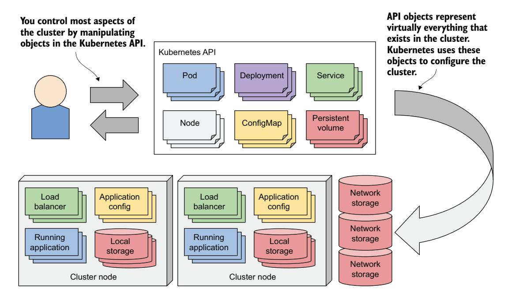
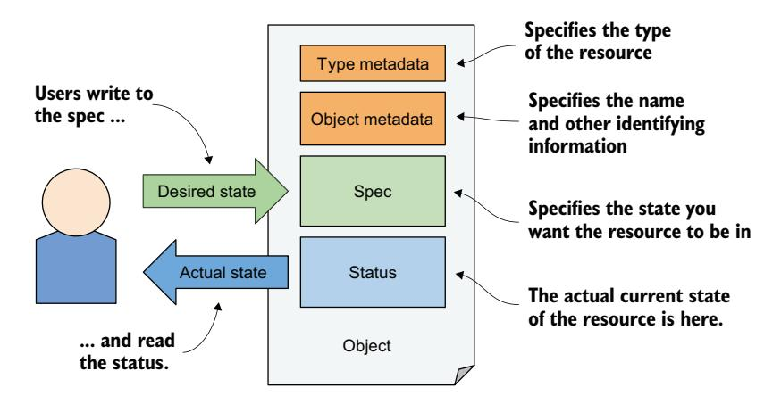
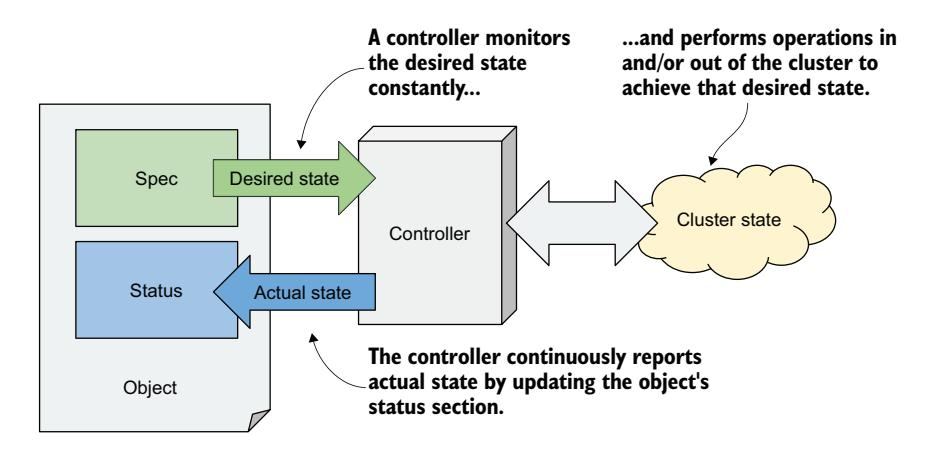
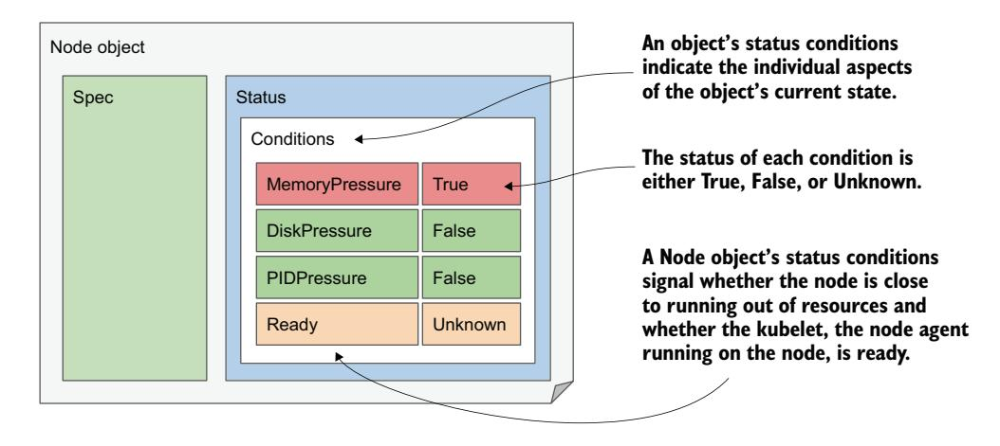
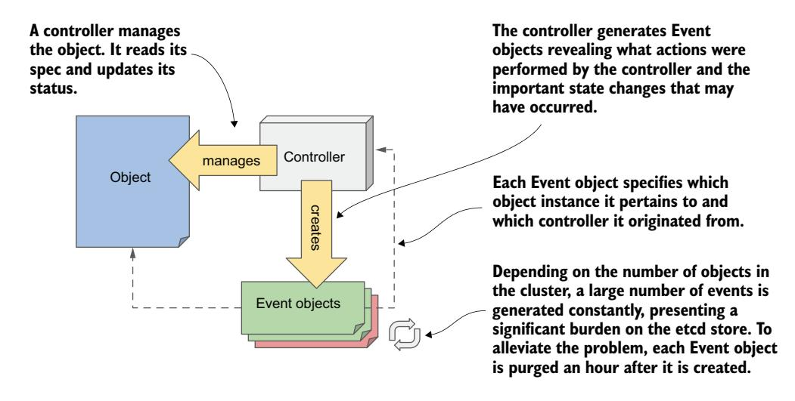

# 第 4 章 探索 Kubernetes API 和对象模型

!!! tip "本章涵盖"

    - 通过 Kubernetes API 管理集群及其承载的应用
    - Kubernetes API 对象的结构
    - 检索和理解对象的 YAML/JSON 清单
    - 通过 Node 对象检查集群节点的状态
    - 通过 Event 对象观察集群事件

上一章介绍了构成已部署应用的三种基本对象。你创建了一个 Deployment 对象，它生成了多个代表应用单个实例的 Pod 对象，并通过创建 Service 对象在它们前面部署负载均衡器将应用对外暴露。

本书第二部分各章将详细讲解这些和其他对象类型。在本章中，我们以 Node 和 Event 对象为例，展示 Kubernetes 对象的通用特性。

## 4.1 熟悉 Kubernetes API

在 Kubernetes 集群中，用户和 Kubernetes 组件都通过 Kubernetes API 操作对象来与集群交互，如图 4.1 所示。这些对象代表了整个集群的配置，包括集群中运行的应用、它们的配置、用于在集群内部或外部暴露应用的负载均衡器、底层服务器和应用使用的存储、用户和应用的安全权限，以及许多其他基础设施细节。



### 4.1.1 API 简介

Kubernetes API 是与集群交互的中心点，因此本书大部分内容都在讲解此 API。最重要的 API 对象将在后续章节中描述，这里先给出 API 的基础介绍。

#### 理解 API 的架构风格

Kubernetes API 是一个基于 HTTP 的 RESTful API，状态由*资源*（resource）表示，使用标准 HTTP 方法（POST、GET、PUT/PATCH、DELETE）对其执行 CRUD 操作（创建、读取、更新、删除）。

!!! info "定义：REST"

    REST 代表 Representational State Transfer（表述性状态转移），是一种通过使用无状态操作的 Web 服务实现计算机系统之间互操作性的架构风格，由 Roy Thomas Fielding 在其博士论文中提出。详见 <https://mng.bz/5vx7>。

正是这些资源（或对象）代表了集群的配置。管理集群的运维人员和将应用部署到集群的工程师，通过操作这些对象来影响集群配置。

在 Kubernetes 社区中，"资源"和"对象"这两个术语经常互换使用，但存在微妙的差异，值得加以解释。

#### 理解资源与对象的区别

RESTful API 中的核心概念是资源，每个资源被分配一个唯一标识它的 URI（统一资源标识符）。例如，在 Kubernetes API 中，应用部署由 deployment 资源表示。

集群中所有 deployment 的集合是一个 REST 资源，暴露在 /api/v1/deployments。当你使用 GET 方法向此 URI 发送 HTTP 请求时，会收到列出集群中所有 Deployment 实例的响应。

每个单独的 Deployment 实例也有自己唯一的 URI，可以通过它进行操作。单个 deployment 因此作为另一个 REST 资源暴露。你可以向该资源 URI 发送 GET 请求来获取 Deployment 的信息，使用 PUT 请求来修改它。

一个对象因此可以通过多个资源暴露。如图 4.2 所示，名为 mydeploy 的 Deployment 对象实例在查询 deployments 资源时作为集合中的一个元素返回，在直接查询单个资源 URI 时作为单个对象返回。


此外，如果某个对象类型存在多个 API 版本，单个对象实例也可以通过多个资源暴露。在 Kubernetes 1.15 之前，Deployment 对象在 API 中有两种不同的表示。除了暴露在 /apis/apps/v1/deployments 的 apps/v1 版本之外，API 中还有一个较旧的 extensions/v1beta1 版本，暴露在 /apis/extensions/v1beta1/deployments。这两个资源不代表两组不同的 Deployment 对象，而是以两种不同方式表示的同一组对象，对象模式有微小差异。你可以通过第一个 URI 创建 Deployment 对象实例，然后通过第二个 URI 读回它。

在某些情况下，一个资源根本不代表任何对象。例如，Kubernetes API 允许客户端验证某个主体（人或服务）是否有权执行某项 API 操作。这是通过向 /apis/authorization.k8s.io/v1/subjectaccessreviews 资源提交 POST 请求来实现的。响应指示该主体是否有权执行请求体中指定的操作。关键在于——此 POST 请求不会创建任何对象。

上述示例表明，资源与对象并不相同。如果你熟悉关系型数据库系统，可以将资源和对象类型类比为视图和表。资源是你与对象交互的视图。

!!! note ""

    由于"资源（resource）"这个术语也可以指代计算资源（如 CPU 和内存），为避免混淆，本书使用"对象（object）"一词来指代 API 资源。

#### 理解对象的表示方式

当你对某个资源发起 GET 请求时，Kubernetes API 服务器以结构化文本形式返回对象。默认数据模型是 JSON，但你也可以告诉服务器返回 YAML。使用 POST 或 PUT 请求更新对象时，你也用 JSON 或 YAML 指定新状态。

对象清单中的各个字段取决于对象类型，但通用结构和许多字段是所有 Kubernetes API 对象共享的。接下来你将学习它们。

### 4.1.2 理解对象清单的结构

在接触完整的 Kubernetes 对象清单之前，让我先解释其主要组成部分，这将帮助你在有时长达数百行的清单中找到方向。

#### 对象的主要部分

大多数 Kubernetes API 对象的清单由以下四个部分组成：

- **类型元数据（Type metadata）**——包含清单所描述的对象类型信息。它指定对象类型、该类型所属的组以及 API 版本。
- **对象元数据（Object metadata）**——保存对象实例的基本信息，包括名称、创建时间、对象所有者以及其他标识信息。对象元数据中的字段对所有对象类型都是相同的。
- **Spec**——你在其中指定对象的期望状态。其字段因对象类型而异。对于 Pod，这是指定 Pod 的容器、存储卷以及其他与运行相关的信息。
- **Status**——包含对象的当前实际状态。对于 Pod，它告诉你 Pod 的状况、每个容器的状态、IP 地址、运行所在的节点，以及其他揭示 Pod 正在发生什么的信息。

图 4.3 展示了一个对象清单及其四个部分。



!!! note ""

    虽然图中显示用户写入对象的 spec 部分并读取其 status，但 API 服务器在你执行 GET 请求时总是返回整个对象；更新对象时，你也需要在 PUT 请求中发送整个对象。

稍后的示例将展示这些部分中有哪些字段，但让我首先解释 spec 和 status 部分，因为它们代表了对象的"血肉"。

#### 理解 Spec 和 Status 部分

你可能已经注意到，对象最重要的两个部分是 spec 和 status。你用 spec 指定对象的期望状态，从 status 部分读取对象的实际状态。所以，你是写 spec、读 status 的人——但谁或什么读 spec、写 status 呢？

Kubernetes 控制平面运行着多个称为*控制器*（controller）的组件，它们管理你创建的对象。每个控制器通常只负责一种对象类型。例如，Deployment 控制器管理 Deployment 对象。

如图 4.4 所示，控制器的任务是：从对象的 spec 部分读取期望状态，执行实现此状态所需的操作，并通过写入对象的 status 部分回报对象的实际状态。



本质上，你通过创建和更新 API 对象告诉 Kubernetes 它需要做什么。Kubernetes 控制器使用相同的 API 对象告诉你它们做了什么以及工作的状态如何。请记住：几乎每种对象类型都有一个关联的控制器，正是这个控制器读取 spec 并写入 status。

**并非所有对象都有 spec 和 status 部分**

所有 Kubernetes API 对象都包含两个元数据部分，但并非所有都有 spec 和 status。那些没有的通常只包含静态数据，且没有对应的控制器，因此不需要区分对象的期望状态和实际状态。

Event 对象就是这样一个例子，它由各种控制器创建，用于提供关于控制器正在管理的对象发生情况的额外信息。Event 对象将在 4.3 节中讲解。

你现在已经了解了对象的总体轮廓，下一节将深入探索对象的各个字段。

## 4.2 检查对象的属性

为了近距离检查 Kubernetes API 对象，我们需要一个具体例子。以 Node 对象为例，它应该比较容易理解，因为它代表你可能相对熟悉的东西——集群中的一台计算机。

我的 kind 工具配置的 Kubernetes 集群有三个节点：一个 master 和两个 worker。它们在 API 中由三个 Node 对象表示。我可以使用 kubectl get nodes 查询 API 并列出这些对象：

```bash
$ kubectl get nodes
NAME                STATUS   ROLES    AGE   VERSION
kind-control-plane  Ready    master   1h    v1.18.2
kind-worker         Ready    <none>   1h    v1.18.2
kind-worker2        Ready    <none>   1h    v1.18.2
```

图 4.5 展示了三个 Node 对象以及构成集群的实际物理机器。每个 Node 对象实例代表一台宿主机。在每个实例中，spec 部分包含宿主机的（部分）配置，status 部分包含宿主机的状态。


!!! note ""

    Node 对象与其他对象略有不同，因为它们通常由 Kubelet（即在集群节点上运行的节点代理）而不是用户创建。当你添加一台机器到集群时，Kubelet 通过创建一个代表宿主机的 Node 对象来注册该节点。用户可以随后编辑 spec 部分中的（部分）字段。

### 4.2.1 探索 Node 对象的完整清单

让我们仔细查看其中一个 Node 对象。运行 `kubectl get nodes` 命令列出集群中的所有 Node 对象，选择一个想要检查的节点。然后执行 `kubectl get node <node-name> -o yaml` 命令，将 `<node-name>` 替换为节点名称：

```bash
$ kubectl get node kind-control-plane -o yaml
apiVersion: v1 
kind: Node 
metadata: 
  annotations: ...
  creationTimestamp: "2020-05-03T15:09:17Z" 
  labels: ... 
  name: kind-control-plane 
  resourceVersion: "3220054"
  selfLink: /api/v1/nodes/kind-control-plane
  uid: 16dc1e0b-8d34-4cfb-8ade-3b0e91ec838b
spec: 
  podCIDR: 10.244.0.0/24 
  podCIDRs: 
  - 10.244.0.0/24 
  taints:
  - effect: NoSchedule
    key: node-role.kubernetes.io/master
status: 
  addresses: 
  - address: 172.18.0.2 
    type: InternalIP 
  - address: kind-control-plane 
    type: Hostname 
  allocatable: ...
  capacity: 
    cpu: "8" 
    ephemeral-storage: 401520944Ki 
    hugepages-1Gi: "0" 
    hugepages-2Mi: "0" 
    memory: 32720824Ki 
    pods: "110" 
  conditions:
  - lastHeartbeatTime: "2020-05-17T12:28:41Z"
    lastTransitionTime: "2020-05-03T15:09:17Z"
    message: kubelet has sufficient memory available
    reason: KubeletHasSufficientMemory
    status: "False"
    type: MemoryPressure
  ...
  daemonEndpoints:
    kubeletEndpoint:
      Port: 10250
  images: 
  - names: 
    - k8s.gcr.io/etcd:3.4.3-0 
    sizeBytes: 289997247 
  ... 
  nodeInfo: 
    architecture: amd64 
    bootID: 233a359f-5897-4860-863d-06546130e1ff 
    containerRuntimeVersion: containerd://1.3.3-14-g449e9269 
    kernelVersion: 5.5.10-200.fc31.x86_64 
    kubeProxyVersion: v1.18.2 
    kubeletVersion: v1.18.2 
    machineID: 74b74e389bb246e99abdf731d145142d 
    operatingSystem: linux 
    osImage: Ubuntu 19.10 
    systemUUID: 8749f818-8269-4a02-bdc2-84bf5fa21700
```

!!! note ""

    使用 -o json 选项以 JSON 而非 YAML 格式显示对象。

在 YAML 清单中，对象定义的四个主要部分以及节点的重要属性一目了然。一些行已被省略以缩短清单长度。

#### 直接访问 API

你可能想尝试直接访问 API 而不是通过 kubectl。如前所述，Kubernetes API 基于 Web，因此你可以使用 Web 浏览器或 curl 命令来执行 API 操作——但 API 服务器使用 TLS，通常需要客户端证书或令牌进行认证。幸运的是，kubectl 提供了一个特殊代理来处理这些，允许你通过代理使用普通 HTTP 与 API 通信。

要运行代理，执行：

```bash
$ kubectl proxy
Starting to serve on 127.0.0.1:8001
```

现在可以通过 127.0.0.1:8001 使用 HTTP 访问 API。例如，要获取 Node 对象，打开 URL http://127.0.0.1:8001/api/v1/nodes/kind-control-plane（将 kind-control-plane 替换为你某个节点的名称）。

现在让我们更仔细地查看四个主要部分中的字段。

#### 类型元数据字段

如你所见，清单以 apiVersion 和 kind 字段开始，它们指定此清单所描述的对象的 API 版本和类型。API 版本是用于描述此对象的模式。如前所述，一个对象类型可以关联多个模式，每个模式使用不同字段描述对象。然而，通常每种类型只存在一种模式。

上述清单中的 apiVersion 是 v1，但后续章节中其他对象类型的 apiVersion 会包含不止版本号。例如，对于 Deployment 对象，apiVersion 是 apps/v1。虽然该字段最初仅用于指定 API 版本，现在也用于指定资源所属的 API 组。Node 对象属于核心 API 组，惯例是在 apiVersion 字段中省略它。

清单定义的对象类型由 kind 字段指定。上述清单中的对象 kind 是 Node。在之前的章节中，你创建了 Deployment、Service 和 Pod 类型的对象。

#### 对象元数据部分的字段

metadata 部分包含该对象实例的元数据，包括实例名称，以及 labels、annotations（将在第 10 章中讲解）、resourceVersion、managedFields 等低层字段。

#### Spec 部分的字段

接下来是 spec 部分，每种对象类型各不相同。Node 对象的 spec 相对于其他类型而言比较简短。podCIDR 字段指定分配给该节点的 Pod IP 范围。运行在此节点上的 Pod 从此范围分配 IP。taints 字段目前不重要。

通常，对象的 spec 部分包含更多用于配置对象的字段。

#### Status 部分的字段

status 部分也因对象类型而异，但其用途始终相同——包含对象所代表事物的最新观测状态。对于 Node 对象，status 显示了节点的 IP 地址、主机名、提供计算资源的能力、当前状况、已下载并缓存的容器镜像列表，以及操作系统信息及其上运行的 Kubernetes 组件版本。

### 4.2.2 理解对象字段

要了解清单中各个字段的更多信息，可以查阅 API 参考文档 <http://kubernetes.io/docs/reference/> 或使用 kubectl explain 命令。

#### 使用 kubectl explain 探索 API 对象字段

kubectl 工具有一个很实用的功能：可以从命令行查找每种对象类型每个字段的说明。通常，先运行 `kubectl explain <kind>` 获取该对象类型的基本描述：

```bash
$ kubectl explain nodes
KIND: Node
VERSION: v1

DESCRIPTION:
  Node is a worker node in Kubernetes. Each node will have a unique 
  identifier in the cache (i.e. in etcd).

FIELDS:
  apiVersion <string>
  ...
  kind <string>
  ...
  metadata <Object>
  ...
  spec <Object>
  ...
  status <Object>
  ...
```

该命令打印对象的解释并列出对象可包含的顶层字段。

#### 深入 API 对象的结构

你可以深入每个特定字段下的子字段。例如，使用以下命令查看节点 spec 字段的说明：

```bash
$ kubectl explain node.spec
KIND: Node
VERSION: v1

RESOURCE: spec <Object>

DESCRIPTION:
  Spec defines the behavior of a node.
  NodeSpec describes the attributes that a node is created with.

FIELDS:
  configSource <Object>
  ...
  podCIDR <string>
    PodCIDR represents the pod IP range assigned to the node.
```

注意顶部的 API 版本。如前所述，同一种 kind 可能存在多个版本。不同版本可能有不同字段或默认值。如果要显示不同版本，使用 --api-version 选项指定。

!!! tip ""

    如果想查看对象的完整结构（不含描述、逐级展开的完整字段列表），尝试 kubectl explain pods --recursive。

### 4.2.3 理解对象的状态状况

spec 和 status 部分中的字段集合因对象类型而异，但 conditions 字段出现在许多对象类型中。它给出了对象当前所处状况的列表。在需要排查对象问题时非常有用，因此让我们更仔细地检查它。由于以 Node 对象为例，本节也展示了如何轻松识别集群节点的问题。

#### Node 的状态状况

让我们打印一个 Node 对象的 YAML 清单，但这次只关注对象 status 中的 conditions 字段：

```bash
$ kubectl get node kind-control-plane -o yaml
...
status:
  ...
  conditions:
  - lastHeartbeatTime: "2020-05-17T13:03:42Z"
    lastTransitionTime: "2020-05-03T15:09:17Z"
    message: kubelet has sufficient memory available
    reason: KubeletHasSufficientMemory
    status: "False"
    type: MemoryPressure
  - lastHeartbeatTime: "2020-05-17T13:03:42Z"
    lastTransitionTime: "2020-05-03T15:09:17Z"
    message: kubelet has no disk pressure
    reason: KubeletHasNoDiskPressure
    status: "False"
    type: DiskPressure
  - lastHeartbeatTime: "2020-05-17T13:03:42Z"
    lastTransitionTime: "2020-05-03T15:09:17Z"
    message: kubelet has sufficient PID available
    reason: KubeletHasSufficientPID
    status: "False"
    type: PIDPressure
  - lastHeartbeatTime: "2020-05-17T13:03:42Z"
    lastTransitionTime: "2020-05-03T15:10:15Z"
    status: "True"
    type: Ready
```

!!! tip ""

    jq 工具在只想查看对象结构的一部分时非常方便。例如，要显示节点状态状况，运行 kubectl get node <name> -o json | jq .status.conditions。YAML 的等效工具是 yq。

一共有四个状况，揭示了节点的状态。每个状况都有 type 和 status 字段，status 可以是 True、False 或 Unknown，如图 4.6 所示。一个状况还可以指定最近一次状态变更的机器可读 reason 以及包含变更详情的人类可读 message。lastTransitionTime 字段指示状况何时从一种状态转变为另一种，而 lastHeartbeatTime 字段揭示控制器最近一次收到该状况更新的时间。



虽然它是列表中的最后一个状况，Ready 状况可能是最重要的，它指示节点是否已准备好接受新的工作负载（Pod）。其他状况（MemoryPressure、DiskPressure、PIDPressure）指示节点是否正在耗尽资源。如果节点开始表现异常（例如应用开始资源不足和/或崩溃），记得检查这些状况。

#### 理解其他对象类型中的状况

Node 对象中的状况列表也用于许多其他对象类型。前面讲解的状况是为什么大多数对象的状态由多个状况（而非单一字段）表示的一个好例子。

!!! note ""

    状况通常是正交的，意味着它们代表对象互不相关的方面。

如果对象的状态仅用单一字段表示，之后想要扩展为新的值将非常困难——因为这需要更新所有监控对象状态并据此执行操作的客户端。一些对象类型最初使用过这种单字段方式，有的至今仍在使用，但现在大多数已改用状况列表。

由于本章旨在介绍 Kubernetes API 对象的通用特性，我们只关注了 conditions 字段，但它远非 Node 对象 status 中的唯一字段。要探索其他字段，请按照 4.2.2 节所述使用 kubectl explain 命令。读完本书这一部分的其余章节后，那些暂时不易理解的字段应该会变得清晰。

!!! tip ""

    作为练习，使用 kubectl get <kind> <name> -o yaml 命令探索你目前创建过的其他对象（Deployment、Service 和 Pod）。

### 4.2.4 使用 kubectl describe 检查对象

为了帮助你理解 Kubernetes API 对象的完整结构，展示对象的完整 YAML 清单是必要的。虽然我个人经常使用这种方法来检查对象，但更用户友好的检查方式是使用 kubectl describe 命令，它通常显示相同甚至更多的信息。

#### 理解 Node 对象的 kubectl describe 输出

让我们对 Node 对象运行 kubectl describe 命令。为了保持趣味性，用它来描述一个 worker 节点而非 master。这是命令及输出：

```bash
$ kubectl describe node kind-worker-2
Name:               kind-worker2
Roles:              <none>
Labels:             beta.kubernetes.io/arch=amd64
                    beta.kubernetes.io/os=linux
                    kubernetes.io/arch=amd64
                    kubernetes.io/hostname=kind-worker2
                    kubernetes.io/os=linux
Annotations:        kubeadm.alpha.kubernetes.io/cri-socket: /run/contain...
                    node.alpha.kubernetes.io/ttl: 0
                    volumes.kubernetes.io/controller-managed-attach-deta...
CreationTimestamp:  Sun, 03 May 2020 17:09:48 +0200
Taints:             <none>
Unschedulable:      false
Lease:
  HolderIdentity:   kind-worker2
  AcquireTime:      <unset>
  RenewTime:        Sun, 17 May 2020 16:15:03 +0200
Conditions:
  Type             Status  ...  Reason                       Message
  ----             ------  ---  ------                       -------
  MemoryPressure   False   ...  KubeletHasSufficientMemory   ...
  DiskPressure     False   ...  KubeletHasNoDiskPressure     ...
  PIDPressure      False   ...  KubeletHasSufficientPID      ...
  Ready            True    ...  KubeletReady                 ...
Addresses:
  InternalIP: 172.18.0.4
  Hostname:    kind-worker2
Capacity:
  cpu:                8
  ephemeral-storage:  401520944Ki
  hugepages-1Gi:      0
  hugepages-2Mi:      0
  memory:             32720824Ki
  pods:               110
Allocatable:
  ...
System Info:
  ...
PodCIDR:     10.244.1.0/24
PodCIDRs:    10.244.1.0/24
Non-terminated Pods: (2 in total)
  Namespace    Name              CPU Requests  CPU Limits  ...  AGE
  ---------    ----              ------------  ----------  ...  ---
  kube-system  kindnet-4xmjh     100m (1%)     100m (1%)   ...  13d
  kube-system  kube-proxy-dgkfm  0 (0%)        0 (0%)      ...  13d
Allocated resources:
  Resource           Requests    Limits
  --------           --------    ------
  cpu                100m (1%)   100m (1%)
  memory             50Mi (0%)   50Mi (0%)
  ephemeral-storage  0 (0%)      0 (0%)
  hugepages-1Gi      0 (0%)      0 (0%)
  hugepages-2Mi      0 (0%)      0 (0%)
Events:
  Type    Reason                     Age    From                  Message
  ----    ------                     ----   ----                  -------
  Normal  Starting                   3m50s  kubelet, kind-worker2 ...
  Normal  NodeAllocatableEnforced    3m50s  kubelet, kind-worker2 ...
  Normal  NodeHasSufficientMemory    3m50s  kubelet, kind-worker2 ...
  Normal  NodeHasNoDiskPressure      3m50s  kubelet, kind-worker2 ...
  Normal  NodeHasSufficientPID       3m50s  kubelet, kind-worker2 ...
  Normal  Starting                   3m49s  kube-proxy, kind-worker2 ...
```

kubectl describe 命令以更易读的形式显示了之前在 Node 对象的 YAML 清单中看到的所有信息。你可以看到名称、IP 地址、主机名，以及状况和可用容量。

#### 检查与节点相关的其他对象

除了 Node 对象本身存储的信息外，kubectl describe 还显示了节点上运行的 Pod 以及已分配的计算资源总量。下方还有与节点相关的事件列表。

这些额外信息并不在 Node 对象本身中，而是由 kubectl 工具从其他 API 对象收集而来。例如，节点上运行的 Pod 列表是通过 pods 资源获取的。

如果你自己运行 describe 命令，可能不会显示任何事件。这是因为只显示最近发生的事件。对于 Node 对象，除非节点存在资源容量问题，否则你只会在最近（重新）启动节点时看到事件。

几乎每种 API 对象类型都有与之关联的事件。由于事件对集群调试至关重要，在开始探索其他对象之前，值得更仔细地了解它们。

## 4.3 通过 Event 对象观察集群事件

当控制器执行将对象的实际状态与 spec 字段指定的期望状态进行调谐的任务时，它们会生成事件以展示所做的操作。存在两种类型的事件：Normal 和 Warning。后者通常由控制器在遇到阻碍对象调谐的问题时产生。通过监控这些事件类型，你可以快速获知集群遇到的任何问题。

### 4.3.1 Event 对象简介

与 Kubernetes 中的一切一样，事件由 Event 对象表示，并通过 Kubernetes API 创建和读取。如图 4.7 所示，它们包含发生了什么、事件源等信息。



与其他对象不同，每个 Event 对象在创建一小时后被删除，以减轻 etcd（Kubernetes API 对象的数据存储）的负担。

!!! note ""

    事件保留时长可通过 API 服务器的命令行选项配置。

#### 使用 kubectl get events 列出事件

kubectl describe 显示的事件引用的是作为命令参数的对象。由于事件的特性以及短时间内可能为某个对象创建大量事件，它们不属于对象本身的一部分。你不会在对象的 YAML 清单中找到它们，因为它们独立存在，就像节点和之前见过的其他对象一样。

!!! note ""

    如果你想在自己的集群中完成本节的练习，可能需要重启某个节点以确保事件足够新、仍在 etcd 中存在。如果无法做到，不必担心。跳过这些练习即可，我们将在下一章的练习中继续生成和检查事件。

由于事件是独立对象，你可以使用 kubectl get events 列出它们：

```bash
$ kubectl get ev
LAST SEEN   TYPE     REASON                       OBJECT           MESSAGE
48s         Normal   Starting                     node/kind-w...   Starting kubelet.
48s         Normal   NodeAllocatableEnforced      node/kind-w...   Updated Node A...
48s         Normal   NodeHasSufficientMemory      node/kind-w...   Node kind-work...
48s         Normal   NodeHasNoDiskPressure        node/kind-w...   Node kind-work...
48s         Normal   NodeHasSufficientPID         node/kind-w...   Node kind-work...
47s         Normal   Starting                     node/kind-w...   Starting kube-...
```

!!! note ""

    上文使用了短名称 ev 来代替 events。

你会注意到清单中显示的某些事件与节点的状态状况吻合。这种情况很常见，但你也会发现额外的事件。两个原因为 Starting 的事件就是这样的例子。在当前情况下，它们表示 kubelet 和 kube-proxy 组件已在节点上启动。你现在不需要担心这些组件，它们将在本书第三部分讲解。

#### 理解 Event 对象的内容

与其他对象一样，kubectl get 命令只输出最重要的对象数据。要显示额外信息，可以使用 -o wide 选项启用附加列：

```bash
$ kubectl get ev -o wide
```

此命令的输出极其宽，此处不再列出。取而代之，表 4.1 解释了所显示的信息。

| 属性 | 描述 |
|------|------|
| Name | 此 Event 对象实例的名称。仅在从 API 获取特定对象时有用。 |
| Type | 事件类型，Normal 或 Warning。 |
| Reason | 事件发生原因的机器可读描述。 |
| Source | 报告此事件的组件，通常是某个控制器。 |
| Object | 事件引用的对象实例（例如 node/xyz）。 |
| Sub-object | 事件引用的子对象。例如，Pod 中的哪个容器。 |
| Message | 事件的人类可读描述。 |
| First seen | 此事件首次发生的时间。记住，每个 Event 对象在一段时间后被删除，因此这可能不是事件实际首次发生的时间。 |
| Last seen | 事件经常重复发生。此字段指示此事件上次发生的时间。 |
| Count | 事件已发生的次数。 |

!!! tip ""

    在完成本书的练习时，每当你对自己的对象做出更改后运行 kubectl get events 命令，对你会很有帮助。这将帮助你了解幕后发生的事情。

#### 仅显示 Warning 事件

与仅显示与所描述对象相关事件的 kubectl describe 命令不同，kubectl get events 命令会显示所有事件。如果你想检查是否存在值得关注的事件，这很有用。你可能想忽略 Normal 类型的事件，只关注 Warning。

API 提供了通过*字段选择器*（field selector）过滤对象的方法。只有指定字段匹配指定选择器值的对象才被返回。你可以用此功能仅显示 Warning 事件。kubectl get 命令允许通过 --field-selector 选项指定字段选择器。要仅列出代表警告的事件，执行以下命令：

```bash
$ kubectl get ev --field-selector type=Warning
No resources found in default namespace.
```

如果命令没有打印任何事件，如上例所示，说明最近集群中没有记录任何警告。

你可能会想：我怎么知道字段选择器中要使用的确切字段名以及确切的值（也许应该是小写？）？如果你猜到这些信息由 kubectl explain events 命令提供，那就对了。由于事件是常规的 API 对象，你可以用它查找 Event 对象结构的文档。在那里你会学到 type 字段有两个可能值：Normal 或 Warning。

### 4.3.2 检查 Event 对象的 YAML

要检查集群中的事件，kubectl describe 和 kubectl get events 命令应该足够了。与其他对象不同，你可能永远不需要显示 Event 对象的完整 YAML。但我想借此机会向你展示 API 返回的 Kubernetes 对象清单中一个令人烦恼的问题。

#### Event 对象没有 spec 和 status 部分

如果使用 kubectl explain 探索 Event 对象的结构，你会注意到它没有 spec 或 status 部分。不幸的是，这意味着其字段的组织不如 Node 对象那样清晰。

检查以下 YAML，看看你是否能轻易找到对象的 kind、metadata 和其他字段：

```yaml
apiVersion: v1 
count: 1
eventTime: null
firstTimestamp: "2020-05-17T18:16:40Z"
involvedObject:
  kind: Node
  name: kind-worker2
  uid: kind-worker2
kind: Event 
lastTimestamp: "2020-05-17T18:16:40Z"
message: Starting kubelet.
metadata: 
  creationTimestamp: "2020-05-17T18:16:40Z"
  name: kind-worker2.160fe38fc0bc3703 
  namespace: default
  resourceVersion: "3528471"
  selfLink: /api/v1/namespaces/default/events/kind-worker2.160f...
  uid: da97e812-d89e-4890-9663-091fd1ec5e2d
reason: Starting
reportingComponent: ""
reportingInstance: ""
source:
  component: kubelet
  host: kind-worker2
type: Normal
```

你肯定会同意——这个清单中的 YAML 毫无条理。字段按字母顺序排列，而不是组织成连贯的组，使得我们人类阅读非常困难。看起来如此混乱，难怪很多人讨厌处理 Kubernetes 的 YAML 或 JSON 清单——两者都有这个问题。

与此相反，之前 Node 对象的 YAML 清单相对容易阅读，因为顶层字段的顺序恰如人们所期望的：apiVersion、kind、metadata、spec、status。你会注意到，这仅仅是因为这五个字段的字母顺序碰巧合理。但这些字段下的子字段也面临同样的问题——它们同样按字母顺序排列。

YAML 的设计目标就是易读，但 Kubernetes YAML 中的字母顺序字段破坏了这一点。幸运的是，大多数对象包含 spec 和 status 部分，所以至少这些对象的顶层字段组织良好。至于其他，你只能接受处理 Kubernetes 清单时的这个不幸面。

## 本章小结

- Kubernetes 提供了一个 RESTful API 用于与集群交互。API 对象映射到构成集群的实际组件，包括应用、负载均衡器、节点、存储卷等。
- 一个对象实例可以由多个资源表示。一种对象类型可以通过多个资源暴露，这些资源只是同一事物的不同表示。
- Kubernetes API 对象用 YAML 或 JSON 清单描述。通过向 API 提交清单来创建对象。对象的状态存储在对象本身中，可通过 GET 请求从 API 获取。
- 所有 Kubernetes API 对象都包含类型元数据和对象元数据，大多数还有 spec 和 status 部分。少数对象类型没有这两个部分，因为它们只包含静态数据。
- 控制器通过持续监视 spec 的变化、更新集群状态并通过对象的 status 字段报告当前状态，将对象变为现实。
- 当控制器管理 Kubernetes API 对象时，它们发出事件来展示所执行的操作。如同一切事物，事件由对象表示，可以通过 API 获取。事件指示 Node 或其他对象正在发生什么，展示对象最近发生的事情，并可提供为何出现问题的线索。
- kubectl explain 命令提供了一种快速查找特定对象类型及其字段文档的方法。
- Node 对象的 status 包含节点的 IP 地址和主机名、资源容量、状况、缓存的容器镜像以及节点的其他信息。节点上运行的 Pod 不属于节点 status 的一部分，但 kubectl describe node 命令从 pods 资源获取这些信息。
- 许多对象类型使用状态状况来指示对象所代表组件的状态。对于节点，这些状况是 MemoryPressure、DiskPressure 和 PIDPressure。每个状况为 True、False 或 Unknown，并有关联的 reason 和 message，解释为何该状况处于特定状态。