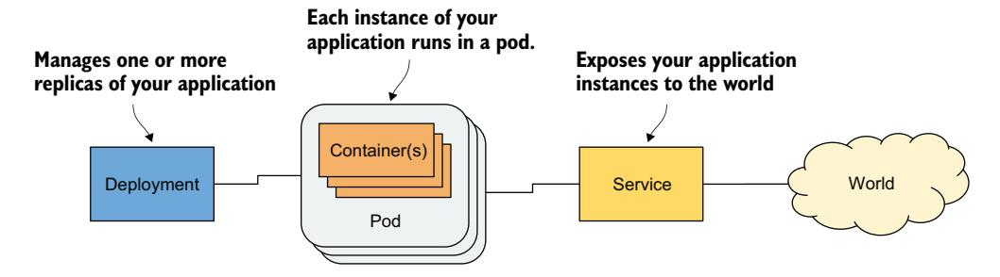
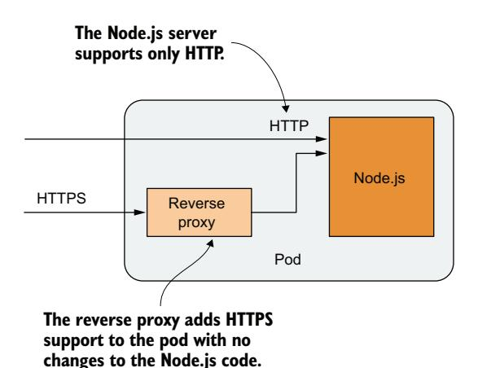
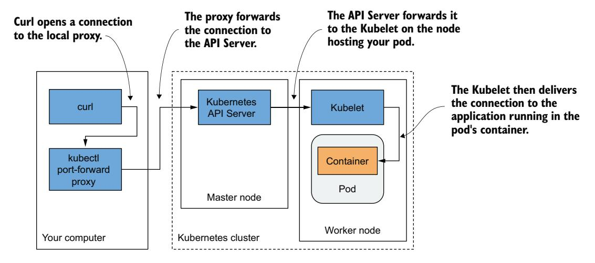
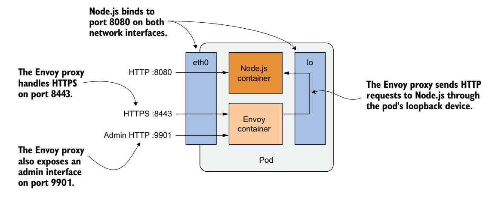

# 第 5 章 使用 Pod 运行应用

!!! tip "本章涵盖"

    - 如何以及何时将容器分组
    - 通过从 YAML 文件创建 Pod 对象来运行应用
    - 与应用通信、查看其日志并探索其环境
    - 添加 sidecar 容器以扩展 Pod 的主容器
    - 在 Pod 启动时运行 init 容器来初始化 Pod

让我们快速回顾一下第 3 章中为在 Kubernetes 上部署最小应用而创建的三种对象类型。图 5.1 展示了它们之间的关系及在系统中的功能。



图 5.1 构成已部署应用的三种基本对象类型

你现在已经对这些对象如何通过 Kubernetes API 暴露有了基本了解。在本章及后续章节中，你将学习它们以及通常用于部署完整应用的许多其他对象。让我们从 Pod 对象开始，因为它代表了 Kubernetes 中最核心、最重要的概念——应用的一个运行实例。

!!! note ""

    本章的代码文件可在 [https://mng.bz/64JR](https://mng.bz/64JR) 获取。

## 5.1 理解 Pod

你已经知道，Pod 是一组位于同一位置的容器，是 Kubernetes 中的基本构建块。你并非单独部署容器，而是将一组容器作为单个单元——Pod——进行部署和管理。虽然 Pod 可以承载多个容器，但一个 Pod 只运行一个容器的情况非常典型。当 Pod 有多个容器时，它们都运行在同一个工作节点上——单个 Pod 实例永远不会跨越多个节点。图 5.2 展示了这一信息。


图 5.2 Pod 的所有容器运行在同一节点上。Pod 永远不会跨越多个节点。

### 5.1.1 理解 Pod 的目的

让我们讨论为什么需要将多个容器运行在一起，而不是在同一容器中运行多个进程。

#### 理解为什么一个容器不应包含多个进程

想象一个由多个进程组成的应用，这些进程通过 *IPC*（Inter-Process Communication，进程间通信）或共享文件相互通信，这要求它们运行在同一台计算机上。在第 2 章中，你了解到每个容器就像一台隔离的计算机或虚拟机。一台计算机通常运行多个进程，容器也可以这样做。你可以将所有构成应用的进程运行在仅一个容器中，但这会使容器非常难以管理。

容器被*设计*为仅运行单个进程，不包括它产生的子进程。容器工具和 Kubernetes 都是围绕这一事实开发的。例如，运行在容器中的进程应该将其日志写入标准输出。你用来显示日志的 Docker 和 Kubernetes 命令只会显示从此输出捕获的内容。如果容器中只运行单个进程，它就是唯一的写入者；但如果容器中运行多个进程，它们都会写入同一个输出。它们的日志因此会交织在一起，很难分辨每行属于哪个进程。

容器通常被设计为运行单个进程的另一个原因是，容器运行时只在容器的根进程终止时重启容器。它不关心该根进程创建的任何子进程。如果根进程产生了子进程，它独自负责保持所有这些进程的运行。

为了充分利用容器运行时提供的功能，你应该考虑在每个容器中仅运行一个进程。

#### 理解 Pod 如何组合多个容器

既然我们不应该在单个容器中运行多个进程，显然需要另一种更高层次的构造来将相关进程运行在一起，即使它们被划分到多个容器中。这些进程必须能够像普通计算机中的进程一样相互通信。这就是 Pod 被引入的原因。

使用 Pod，你可以将紧密相关的进程运行在一起，为它们提供（几乎）与在单个容器中运行相同的环境。这些进程在一定程度上是隔离的，但并非完全隔离——它们共享一些资源。这给了我们两全其美的结果。你可以使用容器提供的所有特性，同时允许进程协同工作。Pod 使这些互连的容器可以作为单个单元进行管理。

在第 2 章中，你了解到容器使用自己的一组 Linux 命名空间，但它也可以与其他容器共享部分命名空间。这种命名空间共享正是 Kubernetes 和容器运行时将容器组合成 Pod 的方式。如图 5.3 所示，Pod 中所有容器共享同一个网络命名空间，因此共享属于它的网络接口、IP 地址和端口空间。


图 5.3 Pod 中的容器共享相同的网络接口。

由于共享端口空间，同一 Pod 容器中运行的进程不能绑定到相同的端口号，而其他 Pod 中的进程拥有自己的网络接口和端口空间，这消除了不同 Pod 之间的端口冲突。Pod 中所有容器也看到相同的系统主机名，因为它们共享 UTS 命名空间，并且可以通过常见的 IPC 机制进行通信，因为它们共享 IPC 命名空间。Pod 还可以配置为所有容器使用单个 PID 命名空间，使它们共享一个进程树，但你必须为每个 Pod 单独显式启用此功能。

!!! note ""

    当同一 Pod 的容器使用独立的 PID 命名空间时，它们无法看到彼此，也无法在彼此之间发送进程信号（如 SIGTERM 或 SIGINT）。

正是这种特定命名空间的共享，让运行在 Pod 中的进程产生它们在一起运行的印象，即使它们运行在独立的容器中。相反，每个容器始终拥有自己的挂载命名空间，从而拥有自己的文件系统。但当两个容器必须共享文件系统的一部分时，你可以为 Pod 添加一个*卷*并将其挂载到两个容器中。这两个容器仍然使用两个独立的挂载命名空间，但共享卷被挂载到两者。我们将在第 8 章中更多讨论卷。

### 5.1.2 将容器组织到 Pod 中

你可以将每个 Pod 视为一台独立的计算机。与通常承载多个应用的虚拟机不同，你通常在每个 Pod 中只运行一个应用。你永远不需要将多个应用组合到单个 Pod 中，因为 Pod 几乎没有资源开销。你可以拥有任意多的 Pod，因此与其将所有应用塞进单个 Pod，不如将它们分开，使每个 Pod 仅运行紧密相关的应用进程。让我用一个具体示例来说明。

#### 将多层应用栈拆分为多个 Pod

想象一个由前端 Web 服务器和后端数据库组成的简单系统。我已经解释过前端服务器和数据库不应在同一容器中运行，因为容器中内置的所有功能都是围绕"容器中只运行一个进程"的预期设计的。既然不能在单个容器中运行，那么是否应该让它们在同一个 Pod 的不同容器中运行？

虽然没有阻止我们将前端服务器和数据库运行在单个 Pod 中，但这并非最佳方法。我已经解释过，Pod 的所有容器始终运行在同一位置，但 Web 服务器和数据库必须在同一台计算机上运行吗？答案显然是否定的，因为它们可以轻松通过网络通信。因此，你不应该将它们运行在同一个 Pod 中。

如果前端和后端都在同一 Pod 中，两者都运行在同一个集群节点上。如果你有一个双节点集群但只创建一个 Pod，你只使用了单个工作节点，没有利用第二个节点上可用的计算资源。这意味着浪费了 CPU、内存、磁盘存储和带宽。将容器拆分为两个 Pod 允许 Kubernetes 将前端 Pod 放在一个节点上，后端 Pod 放在另一个节点上，从而提高硬件利用率。

#### 拆分为多个 Pod 以实现独立扩缩容

不使用单个 Pod 的另一个原因与水平扩缩容有关。Pod 不仅是部署的基本单元，也是扩缩容的基本单元。在第 2 章中你扩展了 Deployment 对象，Kubernetes 创建了额外的 Pod——应用的额外副本。Kubernetes 不会复制 Pod 中的容器，而是复制整个 Pod。

前端组件的扩缩容需求通常与后端组件不同，因此我们通常分别对它们进行扩缩容。当你的 Pod 同时包含前端和后端容器并且 Kubernetes 复制它时，你最终会得到多个前端和后端容器的实例，这并不总是你想要的。有状态的后端（如数据库）通常无法扩缩容，至少不像无状态前端那样容易。如果某个容器必须与其他组件分开扩缩容，这明确表明它必须部署在独立的 Pod 中。图 5.4 说明了这一概念。


图 5.4 将应用栈拆分为 Pod

将应用栈拆分为多个 Pod 是正确的做法。但什么时候需要在同一个 Pod 中运行多个容器呢？

#### 介绍 Sidecar 容器

将多个容器放在单个 Pod 中，仅在应用包含一个主进程和一个或多个补充主进程运行的进程时才是合适的。运行补充进程的容器被称为 *sidecar 容器*，因为它类似于摩托车的边车——使摩托车更稳定并提供搭载额外乘客的可能。但与摩托车不同，Pod 可以有多个 sidecar，如图 5.5 所示。


图 5.5 带有主容器和 sidecar 容器的 Pod

很难想象什么构成补充进程，所以我来举一些例子。在第 2 章中，你部署了运行 Node.js 应用的只有一个容器的 Pod。Node.js 应用仅支持 HTTP 协议。为了使其支持 HTTPS，我们可以添加更多 JavaScript 代码，但我们也可以在不更改现有应用的情况下，通过向 Pod 添加一个额外的容器来实现——一个将 HTTPS 流量转换为 HTTP 并转发到 Node.js 容器的反向代理。Node.js 容器是主容器，而运行代理的容器是 sidecar 容器。图 5.6 展示了此示例。



图 5.6 将 HTTPS 流量转换为 HTTP 的 sidecar 容器

!!! note ""

    你将在 5.4 节中创建此 Pod。

另一个例子（如图 5.7 所示）是这样一个 Pod：主容器运行一个 Web 服务器，从其 webroot 目录提供文件服务。Pod 中的另一个容器是一个代理，它定期从外部源下载内容并将其存储在 Web 服务器的 webroot 目录中。如前所述，两个容器可以通过共享卷来共享文件。webroot 目录将位于此卷上。


图 5.7 通过卷将内容传递给 Web 服务器容器的 sidecar 容器

其他 sidecar 容器的例子包括日志轮转器和收集器、数据处理器、通信适配器等。

与更改应用的现有代码不同，添加 sidecar 会增加 Pod 的资源需求，因为 Pod 中必须运行额外的进程。但请记住，向遗留应用添加代码可能非常困难。这可能是因为其代码难以修改、难以设置构建环境，或者源代码本身已不可用。通过添加额外进程来扩展应用，有时是更便宜、更快的选择。

#### 决定是否将容器拆分为多个 Pod

在决定是使用 sidecar 模式将容器放在单个 Pod 中，还是将它们放在独立的 Pod 中时，问自己以下问题：

- 这些容器必须在同一宿主机上运行吗？
- 我想将它们作为单个单元管理吗？
- 它们构成一个统一的整体，而非独立的组件吗？
- 它们必须一起扩缩容吗？
- 单个节点能满足它们的组合资源需求吗？

如果所有这些问题的答案都是"是"，那就将它们放在同一个 Pod 中。作为经验法则，始终将容器放在独立的 Pod 中，除非特定原因要求它们属于同一个 Pod。

## 5.2 从 YAML 或 JSON 文件创建 Pod

有了前面几节学到的信息，你现在可以开始创建 Pod 了。在第 3 章中，你使用命令式命令 `kubectl create` 创建了它们，但 Pod 和其他 Kubernetes 对象通常是通过创建 JSON 或 YAML 清单文件并将其提交到 Kubernetes API 来创建的，正如你在上一章已学到的。

!!! note ""

    使用 YAML 还是 JSON 定义对象由你决定。大多数人更喜欢使用 YAML，因为它对人类更友好，并且允许在对象定义中添加注释。

通过使用 YAML 文件定义应用的结构，你不需要 shell 脚本来使部署应用的过程可重复，并且你可以通过将这些文件存储在 VCS（版本控制系统）中来保留所有变更的历史记录，就像存储代码一样。事实上，本书练习中的应用清单都存储在 VCS 中。你可以在 GitHub 上找到它们：[github.com/luksa/kubernetes-in-action-2nd-edition](http://github.com/luksa/kubernetes-in-action-2nd-edition)。

### 5.2.1 为 Pod 创建 YAML 清单

在上一章中，你学习了如何检索和检查现有 API 对象的 YAML 清单。现在你将从头创建一个对象清单。

首先在你的计算机上创建一个名为 `pod.kiada.yaml` 的文件，位置任意。你也可以在本书代码档案的 Chapter05/ 目录中找到该文件。以下清单显示了文件内容。

```yaml
apiVersion: v1
kind: Pod
metadata:
  name: kiada
spec:
  containers:
  - name: kiada
    image: luksa/kiada:0.1
    ports:
    - containerPort: 8080
```

清单 5.1 基本的 Pod 清单文件

我相信你会同意这个 Pod 清单比上一章看到的庞大 Node 对象清单容易理解得多。但在你将此 Pod 对象清单提交到 API 然后再读回时，情况不会有太大不同。

清单 5.1 中的清单之所以简短，只是因为它尚未包含 Pod 对象通过 API 创建后获得的所有字段。例如，你会注意到 metadata 部分只包含一个字段，而 status 部分完全缺失。一旦你从此清单创建对象，情况将不再如此。但稍后我们会讲到这一点。

在创建对象之前，让我们详细检查这个清单。它使用 Kubernetes API 的 v1 版本来描述对象。对象 kind 是 Pod，对象名称是 kiada。Pod 由单个容器组成，也称为 kiada，基于 `luksa/kiada:0.1` 镜像。Pod 定义还指定了容器中的应用监听 8080 端口。

!!! tip ""

    每当你想从头创建 Pod 清单时，也可以使用以下命令创建文件，然后编辑它添加更多字段：`kubectl run kiada --image=luksa/kiada:0.1 --dry-run=client -o yaml > mypod.yaml`。`--dry-run=client` 标志告诉 kubectl 输出定义，而不是通过 API 实际创建对象。

YAML 文件中的字段不言自明，但如果你想要更多关于每个字段的信息，或想知道可以添加哪些额外字段，记得使用 `kubectl explain pods` 命令。

### 5.2.2 从 YAML 文件创建 Pod 对象

准备好 Pod 的清单文件后，你现在可以通过将文件提交到 Kubernetes API 来创建对象。

#### 通过将清单文件应用到集群来创建对象

当你将清单提交到 API 时，你是在指示 Kubernetes 将清单*应用*到集群。这就是执行此操作的 kubectl 子命令被称为 apply 的原因。让我们使用它来创建 Pod：

```bash
$ kubectl apply -f pod.kiada.yaml
pod "kiada" created
```

#### 通过修改清单文件并重新应用来更新对象

`kubectl apply` 命令既用于创建对象，也用于对现有对象进行更改。如果你后来决定对 Pod 对象进行更改，只需编辑 `pod.kiada.yaml` 文件并再次运行 `apply` 命令。Pod 的某些字段是不可变的，因此更新可能失败，但你始终可以删除 Pod 并重新创建它。你将在本章末尾学习如何删除 Pod 和其他对象。

#### 检索运行中 Pod 的完整清单

Pod 对象现在是集群配置的一部分。你可以通过以下命令从 API 读回它以查看完整的对象清单：

```bash
$ kubectl get po kiada -o yaml
```

运行此命令后，你会注意到清单相比 `pod.kiada.yaml` 文件中的内容大幅增长。你会看到 metadata 部分现在大了很多，对象有了 status 部分。spec 部分也增加了几个字段。你可以使用 `kubectl explain` 了解更多关于这些新字段的信息，但大部分字段将在本章及后续章节中解释。

### 5.2.3 检查新创建的 Pod

在开始与运行在 Pod 中的应用交互之前，让我们使用基本的 kubectl 命令查看 Pod 的运行情况。

#### 快速检查 Pod 的状态

你的 Pod 对象已创建，但如何知道 Pod 中的容器是否确实在运行？你可以使用 `kubectl get` 命令查看 Pod 的摘要：

```bash
$ kubectl get pod kiada
NAME    READY   STATUS    RESTARTS   AGE
kiada   1/1     Running   0          32s
```

你可以看到 Pod 正在运行，但除此之外信息不多。要了解更多，可以尝试上一章学过的 `kubectl get pod -o wide` 或 `kubectl describe` 命令。

#### 使用 kubectl describe 查看 Pod 详情

要显示 Pod 的更详细视图，使用 `kubectl describe` 命令：

```bash
$ kubectl describe pod kiada
```

输出中包含几乎所有你能通过 `kubectl get -o yaml` 命令打印完整对象清单获得的信息。

#### 检查事件以了解幕后发生的事情

如同上一章中你使用 `describe node` 命令检查 Node 对象一样，`describe pod` 命令在输出底部显示了多个与 Pod 相关的事件。如果你还记得，这些事件本身不是对象的一部分，而是独立的对象。让我们打印它们以了解创建 Pod 对象时发生的事情。以下是 Pod 创建后记录的事件：

```bash
$ kubectl get events
LAST SEEN   TYPE     REASON      OBJECT      MESSAGE
<unknown>   Normal   Scheduled   pod/kiada   Successfully assigned default/
                                             kiada to kind-worker2
5m          Normal   Pulling     pod/kiada   Pulling image luksa/kiada:0.1
5m          Normal   Pulled      pod/kiada   Successfully pulled image
5m          Normal   Created     pod/kiada   Created container kiada
5m          Normal   Started     pod/kiada   Started container kiada
```

这些事件按时间顺序打印。最近的事件在最下面。你可以看到 Pod 首先被分配到一个工作节点，然后容器镜像被拉取，容器被创建并最终启动。

没有显示 Warning 事件，所以一切似乎正常。如果这在你的集群中不是这种情况，你应该阅读 5.4 节了解如何排查 Pod 故障。

## 5.3 与应用和 Pod 交互

你的容器现在正在运行。在本节中，你将学习如何与应用通信、检查其日志，以及在容器中执行命令以探索应用的环境。让我们确认运行在容器中的应用是否响应你的请求。

### 5.3.1 向 Pod 中的应用发送请求

在第 2 章中，你使用 `kubectl expose` 命令创建了一个 Service，它提供了负载均衡器，以便你可以与运行在 Pod 中的应用通信。现在我们将采用不同的方法。出于开发、测试和调试目的，你可能想直接与特定 Pod 通信，而不是通过将连接转发到随机选择 Pod 的 Service。

你已经了解到每个 Pod 被分配自己的 IP 地址，集群中其他所有 Pod 都可以通过该地址访问它。此 IP 地址通常是集群内部的。你不能从本地计算机访问它，除非 Kubernetes 以特定方式部署——例如使用 kind 或 Minikube 而不使用 VM 创建集群时。

通常，要访问 Pod，你必须使用以下各节描述的方法之一。首先，让我们确定 Pod 的 IP 地址。

#### 获取 Pod 的 IP 地址

你可以通过检索 Pod 的完整 YAML 并在 status 部分搜索 `podIP` 字段来获取 Pod 的 IP 地址。或者，你可以使用 `kubectl describe` 显示 IP，但最简单的方法是使用 `kubectl get` 的 wide 输出选项：

```bash
$ kubectl get pod kiada -o wide
NAME    READY   STATUS    RESTARTS   AGE   IP           NODE      ...
kiada   1/1     Running   0          35m   10.244.2.4   worker2   ...
```

如 IP 列所示，我的 Pod IP 是 10.244.2.4。现在我需要确定应用监听的端口号。

#### 获取应用使用的端口号

如果我不是该应用的作者，将很难确定应用监听哪个端口。我可以检查其源代码或容器镜像的 Dockerfile，因为端口通常在那里指定，但我可能无法访问其中任何一个。如果其他人创建了该 Pod，我怎么知道它监听哪个端口？

幸运的是，你可以在 Pod 定义本身中指定端口列表。指定端口不是必需的，但始终这样做是个好主意。

!!! info "为什么在 Pod 定义中指定容器端口"

    在 Pod 定义中指定端口纯粹是信息性的。省略它们对客户端能否连接 Pod 端口没有影响。如果容器通过绑定到其 IP 地址的端口接受连接，任何人都可以连接到它，即使端口没有在 Pod spec 中显式指定，或者你指定了错误的端口号。

    尽管如此，始终指定端口是个好主意，这样任何有权访问你集群的人都可以看到每个 Pod 暴露了哪些端口。通过显式定义端口，你还可以为每个端口分配一个名称，这在通过 Service 暴露 Pod 时非常有用。

Pod 清单表明该容器使用端口 8080，所以你现在拥有与应用通信所需的一切。

#### 从工作节点访问应用

Kubernetes 网络模型规定每个 Pod 可以被任何其他 Pod 访问，而且每个*节点*可以到达集群中任何节点上的任何 Pod。因此，与你的 Pod 通信的一种方法是登录到你的一个工作节点，然后从那里与 Pod 通信。

你已经了解到登录节点的方式取决于你用来部署集群的工具。如果你使用 kind，运行 `docker exec -it kind-worker bash`；如果使用 Minikube，运行 `minikube ssh`。在 GKE 上，使用 `gcloud compute ssh <node-name>` 命令。对于其他集群，请参考其文档。

登录到节点后，使用带 Pod IP 和端口的 `curl` 命令访问你的应用。我的 Pod IP 是 10.244.2.4，端口是 8080，所以我运行以下命令：

```bash
$ curl 10.244.2.4:8080
Kiada version 0.1. Request processed by "kiada". Client IP: ::ffff:10.244.2.1
```

通常，你不会使用这种方法与 Pod 通信，但如果存在通信问题，你想通过首先尝试最短的通信路径来找到原因，就可能需要这样做。在这种情况下，最好登录到 Pod 所在的节点并从那里运行 curl。节点和 Pod 之间的通信发生在本地，因此这种方法成功的几率始终最高。

#### 从一次性客户端 Pod 访问应用

第二种测试应用连接性的方法是在专门为此任务创建的另一个 Pod 中运行 curl。使用此方法来测试其他 Pod 是否能够访问你的 Pod。即使网络工作正常，也不一定如此。还可以通过将 Pod 彼此隔离来锁定网络。在这样的系统中，一个 Pod 只能与它被允许的 Pod 通信。要在一次性 Pod 中运行 curl，使用以下命令：

```bash
$ kubectl run --image=curlimages/curl -it --restart=Never --rm client-pod \
    curl 10.244.2.4:8080
Kiada version 0.1. Request processed by "kiada". Client IP: ::ffff:10.244.2.5
pod "client-pod" deleted
```

此命令运行一个 Pod，其中包含一个从 `curlimages/curl` 镜像创建的容器。你也可以使用任何其他提供 curl 二进制可执行文件的镜像。`-it` 选项将你的控制台附加到容器的标准输入和输出，`--restart=Never` 选项确保当 curl 命令及其容器终止时 Pod 被视为 Completed，`--rm` 选项在结束时删除 Pod。Pod 的名称是 client-pod，在其容器中执行的命令是 `curl 10.244.2.4:8080`。

!!! note ""

    你还可以修改命令，在客户端 Pod 中运行 `sh` shell，然后从 shell 中运行 curl。

创建 Pod 只是查看它是否可以访问另一个 Pod，这在你专门测试 Pod 间连接性时很有用。如果你只想知道 Pod 是否响应请求，也可以使用下一节解释的方法。

#### 使用 kubectl port-forward 访问 Pod

在开发过程中，与运行在 Pod 中的应用通信的最简单方法是使用 `kubectl port-forward` 命令，它允许你通过绑定到本地计算机上网络端口的代理与特定 Pod 通信，如图 5.8 所示。


图 5.8 通过 kubectl port-forward 代理连接到 Pod

要打开与 Pod 的通信路径，你甚至不需要查找 Pod 的 IP，只需指定其名称和端口即可。以下命令启动一个代理，将你计算机的本地端口 8080 转发到 kiada Pod 的端口 8080：

```bash
$ kubectl port-forward kiada 8080
... Forwarding from 127.0.0.1:8080 -> 8080
... Forwarding from [::1]:8080 -> 8080
```

代理现在等待传入连接。在另一个终端中运行以下 curl 命令：

```bash
$ curl localhost:8080
Kiada version 0.1. Request processed by "kiada". Client IP: ::ffff:127.0.0.1
```

如你所见，curl 已连接到本地代理并收到来自 Pod 的响应。虽然 `port-forward` 命令是开发和故障排查过程中与特定 Pod 通信的最简单方法，但就底层发生的情况而言，它也是最复杂的方法。通信经过多个组件，因此如果通信路径中有任何故障，你将无法与 Pod 通信，即使 Pod 本身可通过常规通信渠道访问。

!!! note ""

    `kubectl port-forward` 命令也可以将连接转发到 Service 而不是 Pod，并具有其他几个有用的功能。运行 `kubectl port-forward --help` 了解更多。

图 5.9 展示了网络数据包如何从 curl 进程流向你的应用再返回。



图 5.9 使用端口转发时 curl 和容器之间的长通信路径

如图所示，curl 进程连接到代理，代理连接到 API 服务器，API 服务器再连接到托管 Pod 的节点上的 Kubelet，然后 kubelet 通过 Pod 的环回设备（换句话说，通过 localhost 地址）连接到容器。我相信你会同意通信路径特别长。

!!! note ""

    容器中的应用必须绑定到环回设备上的端口，Kubelet 才能到达它。如果它只监听 Pod 的 eth0 网络接口，你将无法使用 `kubectl port-forward` 命令到达它。

#### 通过 API 服务器访问应用

一种不太为人所知但快速的访问运行在 Pod 中的 HTTP 应用的方法是使用 `kubectl get --raw` 命令。它向 Kubernetes API 服务器发送请求，然后 API 服务器将请求代理到 Pod。无需运行任何额外的命令或设置端口转发。此方法通常由开发人员和系统管理员使用——而非最终用户或外部客户端。

要访问运行在 kiada Pod 中的 Kiada 应用，运行以下命令：

```bash
$ kubectl get --raw /api/v1/namespaces/default/pods/kiada/proxy/
Kiada version 0.1. Request processed by "kiada". Client IP: ::ffff:172.18.0.5
```

在此示例中，你请求的是根路径。如果你想请求不同的 URL 路径，将其追加到 URI 的末尾。

### 5.3.2 查看应用日志

你的 Node.js 应用将其日志写入标准输出流。容器化应用通常将日志记录到标准输出（*stdout*）和标准错误流（*stderr*），而不是将日志写入文件。这允许容器运行时截获输出，将其存储在一致的位置（通常是 /var/log/containers），并在无需知道每个应用将日志文件存储在何处的情况下提供对日志的访问。

当你在 Docker 中运行容器中的应用时，可以使用 `docker logs <container-id>` 显示其日志。当你在 Kubernetes 中运行应用时，你可以登录到托管 Pod 的节点并使用 `docker logs` 显示其日志，但 Kubernetes 提供了更简单的方法——`kubectl logs` 命令。

#### 使用 kubectl logs 检索 Pod 的日志

要查看 Pod 的日志（更具体地说，容器的日志），运行以下命令：

```bash
$ kubectl logs kiada
Kiada - Kubernetes in Action Demo Application
---------------------------------------------
Kiada 0.1 starting...
Local hostname is kiada
Listening on port 8080
Received request for / from ::ffff:10.244.2.1    # 从节点内部发送的请求
Received request for / from ::ffff:10.244.2.5    # 从一次性客户端 Pod 发送的请求
Received request for / from ::ffff:127.0.0.1     # 通过端口转发发送的请求
```

#### 使用 kubectl logs -f 流式查看日志

如果你想实时流式查看应用日志以查看每个请求的到来，可以使用 `--follow` 选项（或更短的 `-f`）运行命令：

```bash
$ kubectl logs kiada -f
```

现在向应用发送一些额外的请求并查看日志。完成后按 Ctrl-C 停止流式查看日志。

#### 显示每行日志的时间戳

你可能已经注意到我们在日志语句中忘了包含时间戳。没有时间戳的日志可用性有限。幸运的是，容器运行时为应用产生的每一行添加了当前时间戳。你可以使用 `--timestamps=true` 选项显示这些时间戳，如下所示：

```bash
$ kubectl logs kiada --timestamps=true
2020-02-01T09:44:40.954641934Z Kiada - Kubernetes in Action Demo Application
2020-02-01T09:44:40.954843234Z ---------------------------------------------
2020-02-01T09:44:40.955032432Z Kiada 0.1 starting...
...
```

!!! tip ""

    你可以只输入 `--timestamps` 而不带值来显示时间戳。对于布尔选项，仅指定选项名称就将选项设置为 true。这适用于所有接受布尔值且默认为 false 的 kubectl 选项。

#### 显示最近的日志

前一个特性在运行不包含时间戳的第三方应用时非常有用，但每行带时间戳还带来了另一个好处：按时间过滤日志行。Kubectl 提供了两种按时间过滤日志的方式。

第一种选项是只显示过去几秒、几分钟或几小时的日志。例如，要查看最近 2 分钟内产生的日志，运行：

```bash
$ kubectl logs kiada --since=2m
```

另一种选项是使用 `--since-time` 选项显示特定日期和时间之后产生的日志。时间格式使用 RFC3339。例如，以下命令用于打印 2020 年 2 月 1 日 9:50 之后产生的日志：

```bash
$ kubectl logs kiada --since-time=2020-02-01T09:50:00Z
```

#### 显示日志的最后若干行

除了使用时间限制输出外，你还可以指定要显示日志末尾的多少行。要显示最后 10 行，试试：

```bash
$ kubectl logs kiada --tail=10
```

!!! note ""

    接受值的 Kubectl 选项可以用等号或空格指定。除了 `--tail=10`，你也可以输入 `--tail 10`。

#### 理解 Pod 日志的可用性

Kubernetes 为每个容器保留单独的日志文件。它们通常存储在运行容器的节点上的 /var/log/containers 目录中。每个容器创建一个单独的文件。如果容器被重启，其日志将写入新文件。因此，如果你在使用 `kubectl logs -f` 跟踪日志时容器被重启，该命令将终止，你需要再次运行它来流式查看新容器的日志。

`kubectl logs` 命令仅显示当前容器的日志。要查看之前容器的日志，使用 `--previous`（或 `-p`）选项。

!!! note ""

    根据你的集群配置，日志文件也可能在达到一定大小时被轮转。在这种情况下，`kubectl logs` 只显示当前日志文件。流式查看日志时，你必须在日志轮转时重新启动命令以切换到新文件。

当你删除 Pod 时，其所有日志文件也会被删除。要使 Pod 的日志永久可用，你需要设置一个集中的、集群范围的日志系统。

#### 将日志写入文件的应用程序怎么办？

如果你的应用将日志写入文件而不是 stdout，你可能想知道如何访问该文件。理想情况下，你会配置集中式日志系统来收集日志，以便在中心位置查看它们，但有时你只想保持简单，不介意手动访问日志。在接下来的两节中，你将学习如何将日志和其他文件从容器复制到你的计算机，以及如何在运行中的容器中执行命令。你可以使用任一方法来显示容器中的日志文件或任何其他文件。

### 5.3.3 附加到运行中的容器

`kubectl logs` 命令显示应用写入标准输出和标准错误输出的内容。使用 `kubectl logs -f` 选项，你可以实时查看正在写入的内容。另一种查看应用输出的方式是通过 `kubectl attach` 命令连接到其标准输出和标准错误输出。但这个命令还允许你附加到应用的标准输入，从而通过此机制实现交互。

#### 使用 kubectl attach 查看应用输出到标准输出的内容

如果应用不从标准输入读取，`kubectl attach` 命令只不过是流式查看应用日志的另一种方式，因为日志通常写入标准输出和标准错误流，而 `attach` 命令就像 `kubectl logs -f` 命令一样流式传输它们。让我们看看实际效果。

通过运行以下命令附加到你的 kiada Pod：

```bash
$ kubectl attach kiada
```

如果看不到命令提示符，试试按回车键。

现在，当你在另一个终端中使用 curl 向应用发送新的 HTTP 请求时，你会看到应用记录到标准输出的行也打印在执行 `kubectl attach` 命令的终端中。

#### 使用 kubectl attach 写入应用的标准输入

Kiada 应用的 0.1 版本不从标准输入流读取，但你可以在本书的代码档案中找到执行此操作的 0.2 版本的源代码。此版本允许你通过向应用的标准输入流写入来设置状态消息。此状态消息将包含在应用的响应中。让我们在新 Pod 中部署此版本的应用，并使用 `kubectl attach` 命令设置状态消息。

你可以在 kiada-0.2/ 目录中找到构建镜像所需的工作。你也可以使用预构建的镜像 `docker.io/luksa/kiada:0.2`。Pod 清单在文件 Chapter05/pod.kiada-stdin.yaml 中，如以下清单所示。与之前的清单相比，它多了一行（此行以粗体显示）。

```yaml
apiVersion: v1
kind: Pod
metadata:
  name: kiada-stdin
spec:
  containers:
  - name: kiada
    image: luksa/kiada:0.2
    stdin: true
    ports:
    - containerPort: 8080
```

清单 5.2 为容器启用标准输入

如你所见，如果运行在 Pod 中的应用想要从标准输入读取，你必须在 Pod 清单中将容器定义中的 `stdin` 字段设置为 `true`。这告诉 Kubernetes 为标准输入流分配缓冲区——否则应用在尝试从中读取时将始终收到 EOF。使用 `kubectl apply` 命令从此清单文件创建 Pod：

```bash
$ kubectl apply -f pod.kiada-stdin.yaml
pod/kiada-stdin created
```

要启用与应用通信，再次使用 `kubectl port-forward` 命令，但因为本地端口 8080 仍被之前执行的 port-forward 命令占用，你必须终止它或选择不同的本地端口转发到新 Pod。你可以这样做：

```bash
$ kubectl port-forward kiada-stdin 8888:8080
Forwarding from 127.0.0.1:8888 -> 8080
Forwarding from [::1]:8888 -> 8080
```

命令行参数 `8888:8080` 指示命令将本地端口 8888 转发到 Pod 的端口 8080。

你现在可以通过 http://localhost:8888 访问应用：

```bash
$ curl localhost:8888
Kiada version 0.2. Request processed by "kiada-stdin". Client IP:
    ::ffff:127.0.0.1
```

让我们通过使用 `kubectl attach` 写入应用的标准输入流来设置状态消息。运行以下命令：

```bash
$ kubectl attach -i kiada-stdin
```

注意命令中使用了额外的 `-i` 选项。它指示 kubectl 将其标准输入传递给容器。

!!! note ""

    与 `kubectl exec` 命令一样，`kubectl attach` 也支持 `--tty` 或 `-t` 选项，表示标准输入是一个终端（TTY），但容器必须通过容器定义中的 `tty` 字段配置为分配终端。

你现在可以在终端中输入状态消息并按回车键。例如，输入以下消息：

```text
This is my custom status message.
```

应用将新消息打印到标准输出：

```text
Status message set to: This is my custom status message.
```

要查看应用现在是否在其 HTTP 请求响应中包含该消息，重新执行 curl 命令或在 Web 浏览器中刷新页面：

```bash
$ curl localhost:8888
Kiada version 0.2. Request processed by "kiada-stdin". Client IP:
    ::ffff:127.0.0.1
This is my custom status message.    ← 这是你通过 kubectl attach 命令设置的消息
```

你可以通过在运行 `kubectl attach` 命令的终端中输入另一行来再次更改状态消息。要退出 attach 命令，按 Ctrl-C 或等效键。

!!! note ""

    容器定义中的额外字段 `stdinOnce` 决定标准输入通道是否在 attach 会话结束时关闭。它默认为 `false`，允许你在每次 `kubectl attach` 会话中使用标准输入。如果设置为 `true`，标准输入仅在第一次会话期间保持打开。

### 5.3.4 在运行中的容器中执行命令

在调试运行在容器中的应用时，可能需要从内部检查容器及其环境。Kubectl 也提供了此功能。你可以使用 `kubectl exec` 命令执行容器文件系统中存在的任何二进制文件。

#### 在容器中调用单个命令

例如，你可以通过运行以下命令列出 kiada Pod 中容器内运行的进程：

```bash
$ kubectl exec kiada -- ps aux
USER  PID  %CPU %MEM  VSZ    RSS  TTY  STAT  START  TIME  COMMAND
root  1    0.0  1.3    812860 27356 ?   Ssl   11:54  0:00  node app.js  ← Node.js 服务器
root  120  0.0  0.1    17500  2128  ?    Rs    12:22  0:00  ps aux       ← 你刚调用的命令
```

这等同于第 2 章中你用来探索运行中容器内进程的 Docker 命令。它允许你远程在任何 Pod 中运行命令，而无需登录到托管 Pod 的节点。如果你使用过 ssh 在远程系统上执行命令，你会看到 `kubectl exec` 没有太大不同。

在 5.3.1 节中，你在一次性客户端 Pod 中执行了 curl 命令向你的应用发送请求，但你也可以在 kiada Pod 本身内部运行该命令：

```bash
$ kubectl exec kiada -- curl -s localhost:8080
Kiada version 0.1. Request processed by "kiada". Client IP: ::1
```

#### 在容器中运行交互式 shell

前两个示例展示了如何在容器中执行单个命令。当命令完成时，你返回到你的 shell。如果你想在容器中运行多个命令，可以按如下方式在容器中运行一个 shell：

```bash
$ kubectl exec -it kiada -- bash
root@kiada:/#    ← 在容器中运行的 shell 的命令提示符
```

`-it` 是两个选项 `-i` 和 `-t` 的缩写，表示你想通过将标准输入传递给容器并将其标记为终端（TTY）来交互式执行 bash 命令。

你现在可以通过在 shell 中执行命令来探索容器内部。例如，你可以通过运行 `ls -la` 查看容器中的文件，使用 `ip link` 查看其网络接口，或使用 `ping` 测试其连接性。你可以运行容器中可用的任何工具。如果容器不提供你需要的 shell 或工具，你可以将二进制文件复制到容器中，或向 Pod 添加一个额外的临时容器。我们将在接下来的两节中探讨这些选项。

### 5.3.5 向容器复制文件以及从容器复制文件

有时你可能想向运行中的容器添加文件或从中获取文件。修改运行中容器中的文件通常不是你会做的事——至少在生产环境中不是——但在开发过程中可能很有用。

#### 从容器复制文件

Kubectl 提供了 `cp` 命令，用于将文件或目录从你的本地计算机复制到任何 Pod 的容器，或从容器复制到你的计算机。例如，如果你想修改 kiada Pod 提供的 HTML 文件，可以使用以下命令将其复制到你的本地文件系统：

```bash
$ kubectl cp kiada:html/index.html /tmp/index.html -c kiada
```

此命令将 kiada Pod 中 kiada 容器的文件 /html/index.html 复制到你计算机上的 /tmp/index.html 文件。`-c` 标志用于指定要从中复制文件的容器。

!!! tip ""

    如果 Pod 只包含单个容器，或者你想从默认容器复制文件，则无需指定容器名称。默认容器可以通过 Pod 的 `kubectl.kubernetes.io/default-container` 注解指定。关于注解的内容请参考第 7 章。

复制文件后，你可以在本地编辑它，然后将其复制回容器。

#### 将文件复制到容器

要将文件复制回容器，先指定本地路径，再指定 Pod 名称和路径。如果需要，你也可以使用 `-c` 标志指定目标容器名称。例如，以下命令将本地文件 /tmp/index.html 复制到 kiada Pod 中 kiada 容器的 /html 目录：

```bash
$ kubectl cp /tmp/index.html kiada:html/ -c kiada
```

复制文件后，刷新浏览器以查看 HTML 文件的更改。

!!! note ""

    `kubectl cp` 命令要求容器中存在 `tar` 二进制文件，但此要求将来可能会改变。

你可以使用 `kubectl cp` 复制调试容器所需的二进制文件，当这些二进制文件在容器镜像中不可用时。然而，你只能在 `tar` 二进制文件存在时这样做，但这并不总是成立。此外，比复制二进制文件更好的替代方案是向你的 Pod 附加一个调试容器，如下所述。

### 5.3.6 使用临时容器调试 Pod

你部署到 Kubernetes 的容器镜像并不总是包含你可能需要的所有调试工具。有时它们甚至不包含任何 shell 二进制文件。为了保持镜像小并提高容器中的安全性，大多数生产环境中使用的容器除容器主进程所需的二进制文件外不包含任何其他二进制文件。这显著减少了攻击面，但也意味着你不能在生产容器中运行 shell 或其他工具。幸运的是，*临时容器*（ephemeral container）允许你通过向 Pod 附加调试容器来调试运行中的容器。

以 kiada 应用为例。`kiada:0.1` 容器镜像确实包含一个 shell，也确实包含一些标准工具如 curl、ping 和 ip，但不提供 netcat 或 tcpdump 等工具。

现在想象你的应用表现出一些奇怪的行为，你想捕获网络数据包以找出问题所在。你可以重建容器镜像以包含 tcpdump 工具，然后重新部署应用，但如果奇怪的行为只在应用运行数天后偶尔发生怎么办？理想情况下，你希望能够立即调试表现出异常行为的特定 Pod。

幸运的是，你可以通过向现有 Pod 附加另一个容器来实现这一点。你可以在无需重建 Pod 的情况下向 Pod 添加临时调试容器。

#### 使用 kubectl debug 添加临时容器

向现有 Pod 添加临时容器的最简单方法是使用 `kubectl debug` 命令。首先，你需要一个包含所需工具的容器镜像。`nicolaka/netshoot` 镜像是一个流行的选择。要将基于此镜像的调试容器添加到你的 kiada Pod，运行以下命令：

```bash
$ kubectl debug kiada -it --image nicolaka/netshoot
Defaulting debug container name to debugger-d6hdd.
If you don't see a command prompt, try pressing enter.
Welcome to Netshoot! (github.com/nicolaka/netshoot)
Version: 0.13
kiada > ~ $
```

如命令输出所示，名为 `debugger-d6hdd` 的调试容器已添加到你的 Pod。你可以通过在另一个终端中运行以下命令在 Pod 清单中看到此容器：

```bash
$ kubectl get pod kiada -o yaml | grep ephemeralContainers: -A 5
 ephemeralContainers:
 - image: nicolaka/netshoot
   imagePullPolicy: Always
   name: debugger-d6hdd
   resources: {}
   stdin: true
```

#### 从临时容器内部调试 Pod

`kubectl debug` 命令附加到新容器并允许你在其中运行命令。例如，你现在可以在 Pod 中运行 tcpdump 来捕获网络流量：

```bash
$ tcpdump -i any
```

现在使用 curl 向应用生成 HTTP 请求，如前所述，并观察 tcpdump 命令的输出。如你所见，临时容器是非常有用的工具，特别是在生产环境中，容器镜像被精简到最小，通常只包含应用二进制文件而没有额外的工具。

!!! note ""

    `kubectl debug` 命令还可用于创建 Pod 的副本，其中部分或全部容器镜像替换为替代版本，并且可通过创建新 Pod 并在节点的网络和其他命名空间中运行其容器来调试集群节点本身。运行 `kubectl debug --help` 了解更多。

#### 通过共享单个进程命名空间调试进程

默认情况下，Pod 中的每个容器使用自己的 PID 或进程命名空间，这意味着每个容器有自己的进程树，如第 2 章所述。这使得在临时容器中无法看到其他容器中的进程。但是，你可以通过在 Pod spec 中将 `shareProcessNamespace` 设置为 `true` 来配置 Pod 使用单个进程（PID）命名空间：

```yaml
apiVersion: v1
kind: Pod
metadata:
  name: kiada-ssl
spec:
  shareProcessNamespace: true   ← 使 Pod 中所有容器使用相同的进程命名空间并拥有单个进程树
  containers:
  ...
```

尝试在当前 Pod 的调试容器中运行 `ps aux` 命令。然后将此字段添加到你的 kiada-ssl Pod 清单中，重建 Pod 并重新运行 `kubectl debug` 命令。如果你在这个新 Pod 中运行 `ps aux` 命令，你将看到所有运行的进程。

## 5.4 在 Pod 中运行多个容器

你在 5.2 节部署的 Kiada 应用仅支持 HTTP。让我们添加 TLS 支持，使其也能通过 HTTPS 服务客户端。你可以通过向 app.js 文件添加代码来实现，但有一个更简单的选项，你完全不需要触碰代码。

你可以在 sidecar 容器中与 Node.js 应用一起运行一个反向代理，如 5.1.2 节所述，让它代表应用处理 HTTPS 请求。一个非常流行且能提供此功能的软件包是 *Envoy*。Envoy 代理是一个高性能的开源服务代理，最初由 Lyft 构建，后来贡献给了 Cloud Native Computing Foundation。让我们将其添加到你的 Pod 中。

### 5.4.1 使用 Envoy 代理扩展 Kiada Node.js 应用

让我简要解释应用的新架构。如下图所示，Pod 将有两个容器：Node.js 容器和新的 Envoy 容器。Node.js 容器将继续直接处理 HTTP 请求，但 HTTPS 请求将由 Envoy 处理。如图 5.10 所示，对于每个传入的 HTTPS 请求，Envoy 将创建一个新的 HTTP 请求，然后通过本地环回设备（即通过 localhost IP 地址）将其发送到 Node.js 应用。

显然，如果你在 Node.js 应用本身内实现 TLS 支持，应用将消耗更少的计算资源并具有更低的延迟，因为不需要额外的网络跳转。但添加 Envoy 代理可能是更快、更容易的解决方案。它还提供了一个良好的起点，你可以从中添加 Envoy 提供的许多其他特性，这些特性你可能永远不会在应用代码本身中实现。参考 [envoyproxy.io](https://envoyproxy.io) 上的 Envoy 代理文档了解更多。Envoy 还提供了一个基于 Web 的管理界面，这将在下一章的一些练习中派上用场。



图 5.10 Pod 容器和网络接口的详细视图

### 5.4.2 向 Pod 添加 Envoy 代理

在本节中，你将创建一个包含两个容器的新 Pod。你已经有了 Node.js 容器，但还需要一个运行 Envoy 的容器。

#### 创建 Envoy 容器镜像

代理的作者已在 Docker Hub 上发布了官方的 Envoy 代理容器镜像。你可以直接使用此镜像，但你需要以某种方式向容器中的 Envoy 进程提供配置、证书和私钥文件。你将在第 8 章中学习如何执行此操作。现在，我们将使用一个已包含所有三个文件的镜像。

我已经创建了该镜像并在 `docker.io/luksa/kiada-ssl-proxy:0.1` 上提供，但如果你想自己构建，可以在本书代码档案的 kiada-ssl-proxy-0.1 目录中找到文件。该目录包含 Dockerfile 以及代理用于服务 HTTPS 的私钥和证书。它还包含 envoy.yaml 配置文件。在其中，你会看到代理被配置为监听 8443 端口、终止 TLS 并将请求转发到 localhost 的 8080 端口，这正是 Node.js 应用监听的位置。代理还被配置为在 9901 端口提供管理界面，如前所述。

#### 创建 Pod 清单

构建镜像后，你必须为新 Pod 创建清单。以下清单显示了 Pod 清单文件 `pod.kiada-ssl.yaml` 的内容。

```yaml
apiVersion: v1
kind: Pod
metadata:
  name: kiada-ssl
spec:
  containers:
  - name: kiada
    image: luksa/kiada:0.2
    ports:
    - name: http
      containerPort: 8080
  - name: envoy
    image: luksa/kiada-ssl-proxy:0.1
    ports:
    - name: https
      containerPort: 8443
    - name: admin
      containerPort: 9901
```

清单 5.3 Pod kiada-ssl 的清单

这个 Pod 的名称是 kiada-ssl。它有两个容器：kiada 和 envoy。此清单仅比 5.2.1 节中的清单略复杂。唯一的新字段是端口名称，包含它们是为了让阅读清单的人能够理解每个端口号的含义。

#### 创建 Pod

使用 `kubectl apply -f pod.kiada-ssl.yaml` 命令从清单创建 Pod。然后使用 `kubectl get` 和 `kubectl describe` 命令确认 Pod 的容器已成功启动。

### 5.4.3 与双容器 Pod 交互

当 Pod 启动时，你可以开始使用 Pod 中的应用，检查其日志，并从内部探索容器。

#### 与应用通信

和之前一样，你可以使用 `kubectl port-forward` 启用与 Pod 中应用的通信。因为它暴露了三个不同的端口，你启用所有三个端口的转发如下：

```bash
$ kubectl port-forward kiada-ssl 8080 8443 9901
Forwarding from 127.0.0.1:8080 -> 8080
Forwarding from [::1]:8080 -> 8080
Forwarding from 127.0.0.1:8443 -> 8443
Forwarding from [::1]:8443 -> 8443
Forwarding from 127.0.0.1:9901 -> 9900
Forwarding from [::1]:9901 -> 9901
```

首先，通过在浏览器中打开 URL http://localhost:8080 或使用 curl 确认你可以通过 HTTP 与应用通信：

```bash
$ curl localhost:8080
Kiada version 0.2. Request processed by "kiada-ssl". Client IP: ::ffff:127.0.0.1
```

如果成功，你还可以尝试通过 HTTPS 在 https://localhost:8443 上访问应用。使用 curl，你可以这样做：

```bash
$ curl https://localhost:8443 --insecure
Kiada version 0.2. Request processed by "kiada-ssl". Client IP: ::ffff:127.0.0.1
```

成功！Envoy 代理完美地处理了任务。你的应用现在使用 sidecar 容器支持 HTTPS。

!!! info "为什么使用 --insecure 选项？"

    访问服务时使用 `--insecure` 选项有两个原因。Envoy 代理使用的证书是自签名的，并且是为域名 example.com 签发的。你通过 localhost 访问服务，而本地 kubectl 代理进程正在那里监听。因此，主机名与服务器证书中的名称不匹配。

    为了使名称匹配，你可以告诉 curl 将请求发送到 example.com，但使用 `--resolve` 标志将其解析为 127.0.0.1。这将确保证书与请求的 URL 匹配，但由于服务器证书是自签名的，curl 仍然不会接受其为有效。你可以通过使用 `--cacert` 标志告诉 curl 用于验证服务器的证书来解决此问题。整个命令如下：

    ```bash
    $ curl https://example.com:8443 --resolve example.com:8443:127.0.0.1 \
        --cacert kiada-ssl-proxy-0.1/example-com.crt
    ```

    这太繁琐了。这就是为什么我更喜欢使用 `--insecure` 选项或其更短的 `-k` 变体。

#### 显示多容器 Pod 的日志

kiada-ssl Pod 包含两个容器，因此如果你想显示日志，必须使用 `--container` 或 `-c` 选项指定容器名称。例如，要查看 kiada 容器的日志，运行以下命令：

```bash
$ kubectl logs kiada-ssl -c kiada
```

Envoy 代理在名为 envoy 的容器中运行，因此显示其日志如下：

```bash
$ kubectl logs kiada-ssl -c envoy
```

或者，你可以使用 `--all-containers` 选项显示两个容器的日志：

```bash
$ kubectl logs kiada-ssl --all-containers
```

你还可以将这些命令与 5.3.2 节中解释的其他选项组合使用。

#### 在多容器 Pod 的容器中运行命令

如果你想使用 `kubectl exec` 命令在 Pod 的某个容器中运行 shell 或其他命令，你也需使用 `--container` 或 `-c` 选项指定容器名称。例如，要在 envoy 容器内运行 shell，运行以下命令：

```bash
$ kubectl exec -it kiada-ssl -c envoy -- bash
```

!!! note ""

    如果你不提供名称，`kubectl exec` 默认使用 Pod 清单中指定的第一个容器。

## 5.5 在 Pod 启动时运行额外的容器

当 Pod 包含多个容器时，所有容器并行启动。Kubernetes 不提供指定容器是否依赖另一个容器的机制，无法确保一个容器在另一个之前启动。但是，Kubernetes 允许你在 Pod 的主容器启动之前运行一系列容器来初始化 Pod。这种特殊类型的容器将在本节中解释。

### 5.5.1 介绍 Init 容器

Pod 清单可以指定在 Pod 启动时、在 Pod 的正常容器启动之前运行的一组容器。这些容器旨在初始化 Pod，被恰当地称为 *init 容器*。如图 5.11 所示，它们一个接一个地运行，并且必须全部成功完成，然后才能启动 Pod 的主容器。


图 5.11 显示 Pod 的 init 容器和常规容器如何启动的时间序列

Init 容器类似于 Pod 的常规容器，但它们不并行运行——每次只运行一个 init 容器。

#### 理解 Init 容器可以做什么

Init 容器通常添加到 Pod 中用于：

- **初始化 Pod 主容器所用卷中的文件**——这包括从安全证书存储中获取主容器使用的证书和私钥、生成配置文件、下载数据等。
- **初始化 Pod 的网络系统**——因为 Pod 的所有容器共享相同的网络命名空间，因此共享网络接口和配置，init 容器对其所做的任何更改也会影响主容器。
- **延迟 Pod 主容器的启动，直到满足前提条件**——例如，如果主容器依赖于另一个服务在容器启动之前可用，init 容器可以阻塞直到此服务就绪。
- **通知外部服务 Pod 即将开始运行**——在特殊情况下，当新应用实例启动时必须通知外部系统，可以使用 init 容器来传递此通知。

你可以在主容器本身中执行这些操作，但使用 init 容器有时是更好的选择，并且可以带来其他优势。让我们看看为什么。

#### 理解何时将初始化代码移到 Init 容器中是合理的

使用 init 容器执行初始化任务不需要重建主容器镜像，并允许单个 init 容器镜像与许多不同的应用重用。如果你想将相同的基础设施特定初始化代码注入所有 Pod 中，这尤其有用。使用 init 容器还能确保在任何（可能多个）主容器开始之前此初始化已完成。

另一个重要原因是安全性。通过将攻击者可能用于危害你集群的工具或数据从主容器移到 init 容器，可以减少 Pod 的攻击面。

例如，想象 Pod 必须注册到外部系统。Pod 需要某种秘密令牌来对该系统进行身份验证。如果注册过程由主容器执行，此秘密令牌必须存在于其文件系统中。如果主容器中运行的应用存在允许攻击者读取文件系统上任意文件的漏洞，攻击者可能获取此令牌。通过从 init 容器执行注册，令牌只需在 init 容器的文件系统中可用，攻击者不容易危害到它。

### 5.5.2 向 Pod 添加 Init 容器

在 Pod 清单中，init 容器定义在 spec 部分的 `initContainers` 字段中，就像常规容器定义在其 `containers` 字段中一样。

#### 在 Pod 清单中定义 Init 容器

让我们看一个向 kiada Pod 添加两个 init 容器的例子。第一个 init 容器模拟一个初始化过程。它运行 5 秒，同时向标准输出打印几行文本。

第二个 init 容器执行网络连接性测试，使用 ping 命令检查特定 IP 地址是否可从 Pod 内访问。IP 地址可通过命令行参数配置，默认为 1.1.1.1。

!!! note ""

    检查特定 IP 地址是否可达的 init 容器可用于阻止应用启动，直到它所依赖的服务变得可用。

如果你想自己构建镜像，可以在本书的代码档案中找到两个镜像的 Dockerfile 和其他工件。或者，你可以使用我已经构建的镜像。

包含这两个 init 容器的 Pod 清单文件是 `pod.kiada-init.yaml`。其内容如以下清单所示。

```yaml
apiVersion: v1
kind: Pod
metadata:
  name: kiada-init
spec:
  initContainers:
  - name: init-demo
    image: luksa/init-demo:0.1
  - name: network-check
    image: luksa/network-connectivity-checker:0.1
  containers:
  - name: kiada
    image: luksa/kiada:0.2
    stdin: true
    ports:
    - name: http
      containerPort: 8080
  - name: envoy
    image: luksa/kiada-ssl-proxy:0.1
    ports:
    - name: https
      containerPort: 8443
    - name: admin
      containerPort: 9901
```

清单 5.4 在 Pod 清单中定义 init 容器

如你所见，init 容器的定义几乎很简单。只需为每个容器指定名称和镜像即可。

!!! note ""

    容器名称在所有 init 容器和常规容器的并集内必须唯一。

#### 部署带有 Init 容器的 Pod

在从清单文件创建 Pod 之前，在单独的终端中运行以下命令，以便你能看到 Pod 状态随着 init 容器和常规容器的启动如何变化：

```bash
$ kubectl get pods -w
```

你还需要在另一个终端中使用以下命令观察事件：

```bash
$ kubectl get events -w
```

准备好后，通过运行 apply 命令创建 Pod：

```bash
$ kubectl apply -f pod.kiada-init.yaml
```

#### 检查带有 Init 容器的 Pod 的启动过程

随着 Pod 启动，检查 `kubectl get events -w` 命令显示的事件。事件的顺序显示容器启动的顺序：init-demo 容器首先启动。当它完成时，network-check 容器启动，完成后，两个主容器 kiada 和 envoy 启动。

现在在另一个终端中检查 Pod 状态的转换。当 init 容器运行时，Pod 的状态显示已完成和总 init 容器数量。当所有 init 容器完成时，Pod 的状态显示为 PodInitializing。此时，主容器的镜像被拉取。当容器启动时，状态变为 Running。

### 5.5.3 检查 Init 容器

与常规容器一样，你可以使用 `kubectl exec` 在运行中的 init 容器中运行额外的命令，并使用 `kubectl logs` 显示日志。

#### 显示 Init 容器的日志

每个 init 容器可以写入的标准输出和标准错误输出，被捕获的方式与常规容器完全相同。Init 容器的日志可以使用 `kubectl logs` 命令显示，通过 `-c` 选项指定容器名称，无论容器正在运行还是已完成。要显示 kiada-init Pod 中 network-check 容器的日志，运行以下命令：

```bash
$ kubectl logs kiada-init -c network-check
Checking network connectivity to 1.1.1.1 ...
Host appears to be reachable
```

日志显示 network-check init 容器无错误运行。在下一章中，你将看到 init 容器失败时会发生什么。

#### 进入运行中的 Init 容器

你可以使用 `kubectl exec` 命令在 init 容器内运行 shell 或其他命令，方式与常规容器相同，但你只能在 init 容器终止之前执行此操作。如果你想自己尝试，从 `pod.kiada-init-slow.yaml` 文件创建一个 Pod，该文件使 init-demo 容器运行 60 秒。当 Pod 启动时，使用以下命令在容器中运行 shell：

```bash
$ kubectl exec -it kiada-init-slow -c init-demo -- sh
```

你可以使用该 shell 从内部探索容器，但只有很短的时间。当容器的主进程在 60 秒后退出时，shell 进程也被终止。

你通常只在 init 容器未能及时完成并且你想找出原因时才进入运行中的 init 容器。在正常操作期间，init 容器在你能运行 `kubectl exec` 命令之前就终止了。

### 5.5.4 Kubernetes 原生 Sidecar 容器

你之前了解到，当你想增强主容器的操作时可以运行额外的容器。并且你可以使用 init 容器在主容器和 sidecar 容器运行之前初始化 Pod。但如果 sidecar 容器提供的服务也是 init 容器所需的呢？而且如果你想确保 sidecar 容器在主容器之前启动，并且只在主容器完全停止后才停止呢？

例如，想象你希望 Pod 的所有出站流量都通过运行在 sidecar 容器中的网络代理。正如你刚学到的，init 容器在任何常规容器启动之前运行。此外，init 容器一个接一个地运行。那么，sidecar 容器如果甚至还没有启动，如何向 init 容器提供其服务呢？

#### 介绍原生 Sidecar 容器

从 1.28 版本开始，Kubernetes 原生支持 sidecar。如果你将 init 容器的 `restartPolicy` 设置为 `Always`，这将该容器标记为原生 sidecar 容器。此类容器并非真正的 init 容器，但它们确实在 Pod 的 init 阶段启动，这就是为什么它们在 `initContainers` 列表中定义。原生 sidecar 容器在轮到它时像其他 init 容器一样启动，但 Kubernetes 随后不会等待它终止。相反，它运行剩余的 init 容器，然后启动 Pod 的常规容器。Sidecar 容器在 Pod 的整个生命周期中持续运行。这允许 sidecar 容器不仅向常规容器提供服务，还向 sidecar 之后的所有 init 容器提供服务。

根据重启策略，Kubernetes 将在 sidecar 容器终止时重新启动它。这通常正是你对 sidecar 的期望，因为它应该在整个 Pod 运行期间提供其服务。

将 init 容器标记为 sidecar 也会影响 Pod 的关闭顺序。对于普通容器，Kubernetes 同时向所有容器发出终止信号，这意味着你的 sidecar 容器可能在你的其他容器之前终止。但原生 sidecar 被区别对待。当常规容器需要终止时，Kubernetes 将首先向它们发出终止信号，然后才向原生 sidecar 发出终止信号。此过程确保原生 sidecar 在它们仍被需要时不会被停止。

例如，如果 sidecar 提供网络连接，那么在所有其他容器停止之前，它显然不应该停止。另一个例子是日志处理 sidecar，它必须从头到尾处理其他容器的日志。如果此 sidecar 在其他容器之前终止，它将无法捕获它们的所有日志。

!!! note ""

    Kubernetes 按 initContainers 列表中出现的逆序终止原生 sidecar。

#### 在 Pod 清单中定义原生 Sidecar

让我们运行一个带有适当的原生 sidecar 容器的 Pod 的快速示例。该 sidecar 容器将每 10 秒记录 Pod 的入站和出站流量。如果我们将此容器作为普通容器运行，它将不会捕获 network-checker init 容器产生的流量，并且它还可能在 kiada 或 envoy 容器仍在处理请求时终止。

以下清单显示了如何定义原生 sidecar 容器。你可以在 `pod.kiada-native-sidecar.yaml` 文件中找到 Pod 清单。

```yaml
apiVersion: v1
kind: Pod
metadata:
  name: kiada-native-sidecar
spec:
  initContainers:
  - name: init-demo
    image: luksa/init-demo:0.1
  - name: traffic-meter
    image: luksa/network-traffic-meter:0.1
    restartPolicy: Always
  - name: network-check
    image: luksa/network-connectivity-checker:0.1
  containers:
  - name: kiada
    image: luksa/kiada:0.2
    stdin: true
    ports:
    - name: http
      containerPort: 8080
  - name: envoy
    image: luksa/kiada-ssl-proxy:0.1
    ports:
    - name: https
      containerPort: 8443
    - name: admin
      containerPort: 9901
```

清单 5.5 定义原生 sidecar 容器

如清单所示，traffic-meter sidecar 容器作为 `restartPolicy` 设置为 `Always` 的 init 容器定义。sidecar 需要定义为 init 容器有些奇怪，但 Kubernetes 开发者被迫采用这种别扭的方式以避免修改现有 API。

如果你通过使用 `kubectl apply` 应用清单文件 `pod.kiada-native-sidecar.yaml` 运行此 Pod，你将看到它包含三个正在运行的容器：

```bash
$ kubectl get pod kiada-native-sidecar
NAME                    READY   STATUS    RESTARTS   AGE
kiada-native-sidecar   3/3     Running   0          1m
```

你可能注意到 traffic-meter 容器定义在 network-check init 容器之前。这确保该计量器捕获网络检查器的流量，你可以通过如下检查 traffic-meter 容器的日志来看到：

```bash
$ kubectl logs -f kiada-native-sidecar -c traffic-meter
[traffic-meter] Starting traffic meter...
[traffic-meter] Inbound: 182 bytes, Outbound: 252 bytes (last 10s)
                                                    ↑ 此流量由 network-checker 容器产生
```

#### 决定将 Sidecar 作为普通容器还是原生 Sidecar 容器运行

如你所见，kiada-native-sidecar Pod 运行三个长期运行的容器。名为 kiada 的主容器运行 Kiada 应用，而另外两个容器 envoy 和 traffic-meter 作为 sidecar 运行。envoy 容器不是适当的原生 sidecar，与 traffic-meter 容器不同。那么为什么有这种区别？为什么我们不也把 envoy 容器作为原生 sidecar 运行？

你当然可以将 envoy 作为原生 sidecar 运行，但这并非真正必要，因为它不需要在 kiada 容器之前启动，也可以与 kiada 同时终止。相反，当 sidecar 容器对于 Pod 的正常工作是必需的时候，它应该被定义为适当的原生 sidecar。如果不是这种情况，那么将其作为常规容器运行是可以的。

!!! note ""

    在第 18 章中，你将学习批处理 Pod。这些 Pod 不会无限期运行，而是执行任务然后完成。向此类 Pod 添加 sidecar 时，你必须将 sidecar 作为原生 sidecar 运行，这样它才不会在主容器完成任务时阻止 Pod 完成。

## 5.6 删除 Pod 和其他对象

如果你尝试了本章和第 2 章中的练习，你的集群中现在存在多个 Pod 和其他对象。作为本章的结尾，你将学习删除它们的各种方法。删除 Pod 将终止其容器并将其从节点中移除。删除 Deployment 对象会导致其 Pod 被删除，而删除 LoadBalancer 类型的 Service 会取消负载均衡器（如果已配置）。

### 5.6.1 按名称删除 Pod

删除对象的最简单方法是按名称删除。

#### 删除单个 Pod

使用以下命令从集群中移除 kiada Pod：

```bash
$ kubectl delete po kiada
pod "kiada" deleted
```

通过删除 Pod，你声明你不再想要该 Pod 或其容器存在。Kubelet 关闭 Pod 的容器，移除所有相关资源（如日志文件），并在该过程完成后通知 API 服务器。然后 Pod 对象被移除。

!!! tip ""

    默认情况下，`kubectl delete` 命令等待直到对象不再存在。要跳过等待，使用 `--wait=false` 选项运行命令。

当 Pod 处于关闭过程中时，其状态变为 Terminating：

```bash
$ kubectl get po kiada
NAME    READY   STATUS        RESTARTS   AGE
kiada   1/1     Terminating   0          35m
```

确切了解容器如何被关闭对于让你的应用为客户端提供良好体验非常重要。这将在下一章中解释，我们将更深入地探讨 Pod 及其容器的生命周期。

!!! tip ""

    `kubectl delete Pod` 命令等待直到 Pod 被完全删除，这可能需要一些时间，具体取决于应用关闭的速度。如果你不想等待该过程完成，可以向命令添加 `--wait=false` 标志。

!!! note ""

    如果你熟悉 Docker，你可能想知道是否可以停止 Pod 并在以后再次启动它，就像你对 Docker 容器所做的那样。答案是否定的。使用 Kubernetes，你只能完全删除 Pod 并在以后再次创建它。

#### 使用单个命令删除多个 Pod

你也可以使用单个命令删除多个 Pod。如果你运行了 kiada-init 和 kiada-init-slow Pod，可以通过用空格分隔它们的名称来删除它们，如下所示：

```bash
$ kubectl delete po kiada-init kiada-init-slow
pod "kiada-init" deleted
pod "kiada-init-slow" deleted
```

### 5.6.2 删除清单文件中定义的对象

当你从文件创建对象时，也可以通过将文件传递给 delete 命令来删除它们，而不是指定 Pod 的名称。

#### 通过指定清单文件删除对象

你可以使用以下命令删除从 `pod.kiada-ssl.yaml` 文件创建的 kiada-ssl Pod：

```bash
$ kubectl delete -f pod.kiada-ssl.yaml
pod "kiada-ssl" deleted
```

在你的情况下，该文件仅包含单个 Pod 对象，但你通常会遇到包含多种不同类型对象的文件，这些对象代表一个完整的应用。这使得部署和移除应用分别只需执行 `kubectl apply -f app.yaml` 和 `kubectl delete -f app.yaml`。

#### 从多个清单文件删除对象

有时，一个应用在多个清单文件中定义。你可以用逗号分隔指定多个文件。例如：

```bash
$ kubectl delete -f pod.kiada.yaml,pod.kiada-ssl.yaml
```

!!! note ""

    你也可以使用此语法同时应用多个文件（例如，`kubectl apply -f pod.kiada.yaml,pod.kiada-ssl.yaml`）。

在我使用 Kubernetes 的许多年里，我实际上从未使用过这种方法，但我经常通过指定目录名称而不是单个文件名来部署文件目录中的所有清单文件。例如，你可以通过在本书代码档案的基目录中运行以下命令再次部署你在本章中创建的所有 Pod：

```bash
$ kubectl apply -f Chapter05/
```

这适用于目录中所有具有正确文件扩展名（.yaml、.json 等）的文件。然后你可以使用相同的方法删除 Pod：

```bash
$ kubectl delete -f Chapter05/
```

!!! note ""

    如果你的清单文件存储在子目录中，必须使用 `--recursive` 标志（或 `-R`）。

### 5.6.3 删除所有 Pod

你现在已移除除 kiada-stdin 和你在第 3 章使用 `kubectl create deployment` 命令创建的 Pod 之外的所有 Pod。根据你如何扩展 Deployment，其中一些 Pod 应该仍在运行。

我们可以使用 `--all` 选项按名称删除它们：

```bash
$ kubectl delete po --all
pod "kiada-stdin" deleted
pod "kiada-9d785b578-58vhc" deleted
pod "kiada-9d785b578-jmnj8" deleted
```

现在再次执行 `kubectl get pods` 命令确认没有 Pod 存在：

```bash
$ kubectl get po
NAME                   READY   STATUS    RESTARTS   AGE
kiada-9d785b578-cc6tk  1/1     Running   0          13s
kiada-9d785b578-h4gml  1/1     Running   0          13s
```

这出乎意料！两个 Pod 仍在运行。如果你仔细观察它们的名称，你会看到这些不是刚刚删除的那两个。AGE 列也表明这些是*新的* Pod。你可以尝试也删除它们，但你会看到无论你删除它们多少次，新的 Pod 都会被创建来替换它们。

这些 Pod 不断出现的原因在于 Deployment 对象。负责使 Deployment 对象变为现实的控制器必须确保 Pod 的数量始终与对象中指定的所需副本数匹配。当你删除与 Deployment 关联的 Pod 时，控制器立即创建一个替换 Pod。

要删除这些 Pod，你必须将 Deployment 缩容到零或完全删除该对象。这将表明你不再希望此 Deployment 或其 Pod 存在于集群中。

### 5.6.4 使用 "all" 关键字删除对象

你可以使用以下命令删除你迄今为止创建的所有内容——包括 Deployment、其 Pod 和 Service：

```bash
$ kubectl delete all --all
pod "kiada-9d785b578-cc6tk" deleted
pod "kiada-9d785b578-h4gml" deleted
service "kubernetes" deleted
service "kiada" deleted
deployment.apps "kiada" deleted
replicaset.apps "kiada-9d785b578" deleted
```

命令中的第一个 `all` 表示你想删除所有类型的对象。`--all` 选项表示你想删除每种对象类型的所有实例。我们在上一节中尝试删除所有 Pod 时使用了此选项。

删除对象时，kubectl 打印每个被删除对象的类型和名称。在之前的列表中，你应该看到它删除了 Pod、Deployment 和 Service，但也删除了一个所谓的 ReplicaSet 对象。你将在第 14 章中了解更多相关内容。

你会注意到 delete 命令也删除了内置的 kubernetes Service。不要担心这个，因为该 Service 片刻后会自动重建。

使用此方法时，某些对象不会被删除，因为关键字 `all` 不包括所有对象种类。这是一项预防措施，防止你意外删除包含重要信息的对象。Event 对象种类就是这样一个例子。

!!! note ""

    你可以在 delete 命令中指定多种对象类型。例如，你可以使用 `kubectl delete events,all --all` 来删除事件以及 `all` 中包含的所有对象种类。

!!! tip ""

    要查看哪些对象将被删除并在删除前确认，使用 `--interactive` 标志运行 `kubectl delete` 命令。

## 本章小结

- Pod 将一组位于同一位置的容器作为一个单元运行。它们是部署和水平扩缩容的基本单元。一个典型的容器只运行一个进程。Sidecar 容器补充 Pod 中的主容器。
- 只有当容器必须一起运行时，它们才应为同一个 Pod 的一部分。前端和后端进程应在独立的 Pod 中运行。这允许它们被独立扩缩容。
- 当 Pod 启动时，其 init 容器一个接一个地运行。当最后一个 init 容器完成时，Pod 的主容器被启动。你可以使用 init 容器从内部配置 Pod、在主容器启动之前延迟其启动直到满足前提条件，或通知外部服务 Pod 即将开始运行。
- kubectl 工具用于创建 Pod、查看其日志、向/从容器复制文件、在容器中执行命令，以及在开发过程中启用与单个 Pod 的通信。


