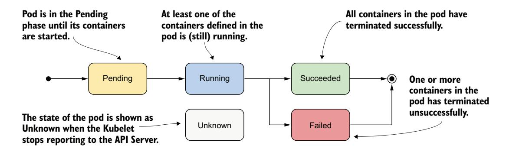
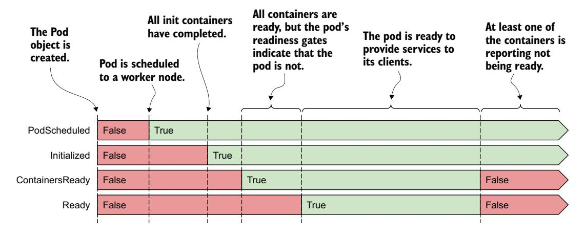
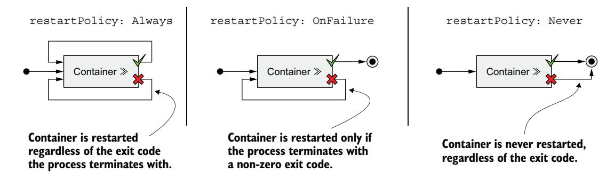
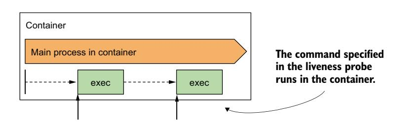
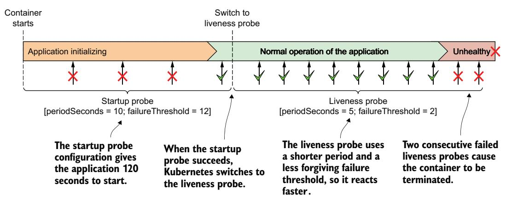
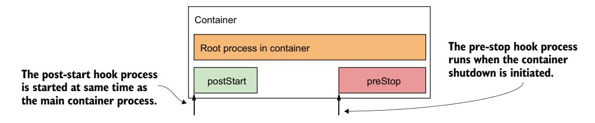
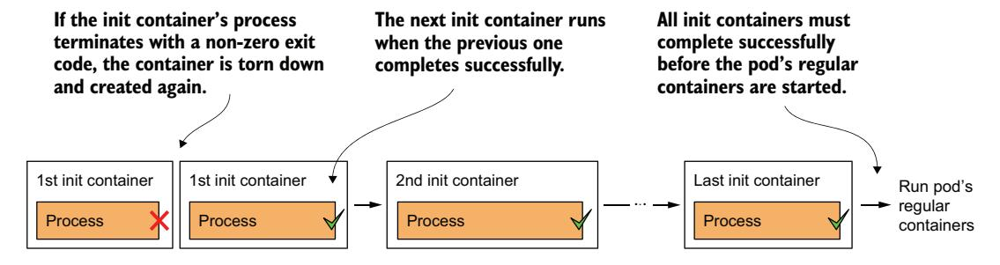
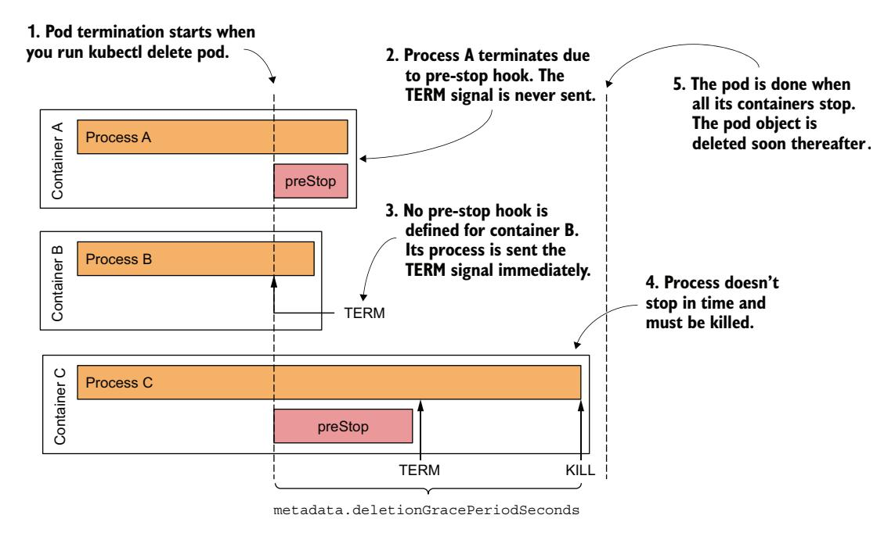
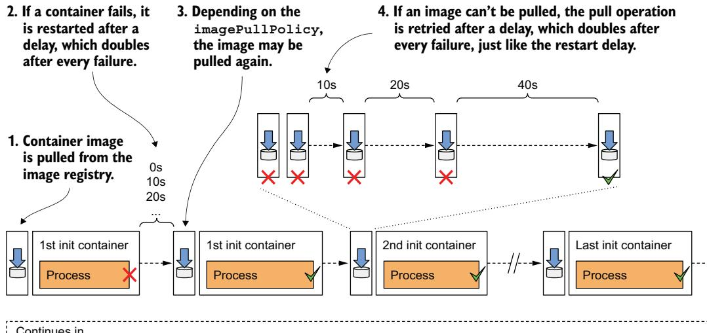

# 第 6 章 管理 Pod 生命周期和容器健康

!!! tip "本章涵盖"

    - 检查 Pod 的状态
    - 使用存活探针保持容器健康
    - 使用生命周期钩子在容器启动和关闭时执行操作
    - Pod 及其容器的完整生命周期

阅读上一章后，你应该能够部署、检查和与包含一个或多个容器的 Pod 通信。本章提供了对 Pod 及其容器如何运行的更深入理解。

!!! note ""

    本章的代码文件可在 [https://mng.bz/oZjD](https://mng.bz/oZjD) 获取。

## 6.1 理解 Pod 的状态

在你创建 Pod 对象并运行后，你可以通过从 API 读回 Pod 对象来查看 Pod 的情况。如第 4 章所述，Pod 对象清单以及大多数其他类型对象的清单都包含一个提供对象状态的部分。Pod 的 status 部分包含以下信息：

- Pod 及其宿主工作节点的 IP 地址
- Pod 启动的时间
- Pod 的服务质量（QoS）类别
- Pod 所处的阶段
- Pod 的状况
- 其各个容器的状态

IP 地址和启动时间无需进一步解释，QoS 类别现在也不相关。然而，Pod 的阶段和状况以及其容器的状态对于理解 Pod 生命周期非常重要。

### 6.1.1 理解 Pod 的阶段

在生命中的任何时刻，Kubernetes Pod 都处于图 6.1 所示的五个阶段之一。



图 6.1 Kubernetes Pod 的阶段

表 6.1 解释了每个阶段的含义。

| Pod 阶段 | 描述 |
|----------|------|
| Pending | Pod 对象创建后的初始阶段。在 Pod 被调度到节点、其容器的镜像被拉取并启动之前，它一直保持在此阶段。 |
| Running | Pod 中至少有一个容器正在运行。 |
| Succeeded | 不打算无限期运行的 Pod，在其所有容器成功完成时被标记为 Succeeded。 |
| Failed | 当 Pod 未配置为无限期运行且至少一个容器以失败终止时，Pod 被标记为 Failed。 |
| Unknown | Pod 的状态未知，因为 kubelet 已停止与 API 服务器通信。可能工作节点已故障或与网络断开。 |

Pod 的阶段提供了 Pod 正在发生什么的快速摘要。让我们再次部署 kiada Pod 并检查其阶段。通过将清单文件再次应用到集群来创建 Pod，和上一章一样（你可以在 Chapter06/pod.kiada.yaml 中找到它）：

```bash
$ kubectl apply -f pod.kiada.yaml
```

#### 显示 Pod 的阶段

Pod 的阶段是 Pod 对象 status 部分中的字段之一。你可以通过显示其清单并可选地 grep 输出来搜索该字段：

```bash
$ kubectl get po kiada -o yaml | grep phase
phase: Running
```

!!! tip ""

    还记得 jq 工具吗？你可以像这样使用它来打印 phase 字段的值：`kubectl get po kiada -o json | jq .status.phase`

你也可以使用 `kubectl describe` 查看 Pod 的阶段。Pod 的状态显示在输出的顶部附近：

```bash
$ kubectl describe po kiada
Name:    kiada
...
Status:  Running
...
```

虽然 `kubectl get pods` 显示的 STATUS 列看起来也显示阶段，但这仅对健康的 Pod 成立：

```bash
$ kubectl get po kiada
NAME    READY   STATUS    RESTARTS   AGE
kiada   1/1     Running   0          40m
```

对于不健康的 Pod，STATUS 列指示 Pod 出了什么问题。我们将在本章后面讨论这个问题。

### 6.1.2 理解 Pod 的状况

Pod 的阶段对其状况说明不了太多。你可以通过查看 Pod 的状况列表了解更多，就像在第 4 章中对 Node 对象所做的那样。Pod 的状况指示 Pod 是否已达到特定状态及其原因。

与阶段不同，一个 Pod 同时有多个状况。在撰写本文时，有四种已知的状况*类型*。它们如表 6.2 所述。

| Pod 状况 | 描述 |
|----------|------|
| PodScheduled | 指示 Pod 是否已调度到节点。 |
| Initialized | Pod 的 init 容器已全部成功完成。 |
| ContainersReady | Pod 中的所有容器都指示它们已就绪。这是整个 Pod 就绪的必要但不充分条件。 |
| Ready | Pod 已准备好为客户端提供服务。Pod 中的容器和 Pod 的就绪门控都报告它们已就绪。注意：这在第 11 章中解释。 |

每个状况要么满足，要么不满足。如图 6.2 所示，PodScheduled 和 Initialized 状况开始时为未满足，但很快被满足并在 Pod 的整个生命周期中保持如此。相反，Ready 和 ContainersReady 状况在 Pod 的生命周期中可能多次变化。



图 6.2 Pod 状况在其生命周期中的转换

你还记得 Node 对象中可以找到的状况吗？它们是 MemoryPressure、DiskPressure、PIDPressure 和 Ready。如你所见，每种对象都有自己的一组状况类型，但许多包含通用的 Ready 状况，它通常指示对象是否一切正常。

#### 检查 Pod 的状况

要查看 Pod 的状况，你可以使用 `kubectl describe`，如下所示：

```bash
$ kubectl describe po kiada
...
Conditions:
  Type              Status
  Initialized       True     ← Pod 已初始化
  Ready             True     ← Pod 及其容器已就绪
  ContainersReady   True
  PodScheduled      True     ← Pod 已调度到节点
...
```

`kubectl describe` 命令仅显示每个状况是否为 true。要找出为什么某个状况为 false，你必须在 Pod 清单中查找 `status.conditions` 字段：

```bash
$ kubectl get po kiada -o json | jq .status.conditions
[
  {
    "lastProbeTime": null,
    "lastTransitionTime": "2020-02-02T11:42:59Z",
    "status": "True",
    "type": "Initialized"
  },
  ...
]
```

每个状况都有一个 `status` 字段，指示该状况是 True、False 还是 Unknown。在 kiada Pod 的情况下，所有状况的 status 都是 True，这意味着它们全部满足。状况还可以包含一个 `reason` 字段，指定状况状态上次变更的机器可读原因，以及一个 `message` 字段详细解释变更。`lastTransitionTime` 字段显示变更发生的时间，而 `lastProbeTime` 指示上次检查此状况的时间。

### 6.1.3 理解容器状态

Pod 的 status 还包含 Pod 每个容器的状态。检查状态可以更好地了解每个单独容器的运行情况。

状态包含几个字段。`state` 字段指示容器的当前状态，而 `lastState` 字段显示先前容器终止后的状态。容器状态还指示容器的内部 ID（containerID）、容器正在运行的镜像和镜像 ID（image 和 imageID）、容器是否就绪（ready），以及它被重启的次数（restartCount）。

#### 理解容器状态

容器状态中最重要的部分是其 state。一个容器可以处于图 6.3 所示的状态之一。


图 6.3 容器的可能状态

各状态在表 6.3 中解释。

| 容器状态 | 描述 |
|----------|------|
| Waiting | 容器正在等待启动。reason 和 message 字段指示容器为何处于此状态。 |
| Running | 容器已创建，进程正在其中运行。startedAt 字段指示此容器的启动时间。 |
| Terminated | 容器中运行的进程已终止。startedAt 和 finishedAt 字段指示容器何时启动以及何时终止。主进程终止的退出码在 exitCode 字段中。 |
| Unknown | 无法确定容器的状态。 |

#### 显示 Pod 容器的状态

`kubectl get pods` 显示的 Pod 列表只显示每个 Pod 中容器的数量以及其中多少是就绪的。要查看单个容器的状态，你可以使用 `kubectl describe`：

```bash
$ kubectl describe po kiada
...
Containers:
  kiada:
    Container ID:   docker://c64944a684d57faacfced0be1af44686...
    Image:          luksa/kiada:0.1
    Image ID:       docker-pullable://luksa/kiada@sha256:3f28...
    Port:           8080/TCP
    Host Port:      0/TCP
    State:          Running       ← 容器的当前状态及启动时间
      Started:      Sun, 02 Feb 2020 12:43:03 +0100
    Ready:          True           ← 容器是否已准备好提供服务
    Restart Count:  0              ← 容器被重启的次数
    Environment:    <none>
...
```

关注清单中带注释的行，因为它们指示容器是否健康。kiada 容器处于 Running 状态并已 Ready。它从未被重启过。

!!! tip ""

    你也可以使用 jq 显示容器状态：`kubectl get po kiada -o json | jq .status.containerStatuses`。

#### 检查 Init 容器的状态

在上一章中，你了解到除常规容器外，Pod 还可以有在 Pod 启动时运行的 init 容器。与常规容器一样，这些容器的状态在 Pod 对象清单的 status 部分中可用，但在 `initContainerStatuses` 字段中。

!!! tip "检查 kiada-init Pod 的状态"

    作为额外练习，你可以自行尝试：从上一章创建 kiada-init Pod，并检查其阶段、状况以及两个常规容器和两个 init 容器的状态。使用 `kubectl describe` 命令和 `kubectl get po kiada-init -o json | jq .status` 命令在对象定义中查找信息。

## 6.2 保持容器健康

你在上一章中创建的 Pod 运行没有任何问题。但如果其中一个容器终止了呢？如果 Pod 中的所有容器都终止了呢？如何保持 Pod 健康及其容器运行？这是本节的焦点。

### 6.2.1 理解容器自动重启

当 Pod 被调度到节点时，该节点上的 kubelet 启动其容器，并从那时起只要 Pod 对象存在就保持它们运行。如果容器中的主进程因任何原因终止，Kubelet 会重启容器。如果应用中的错误导致其崩溃，Kubernetes 会自动重启它，因此即使在应用本身中不做任何特殊处理，在 Kubernetes 中运行应用也会自动赋予应用自我修复的能力。

#### 观察容器故障

在上一章中，你创建了包含 Node.js 和 Envoy 容器的 kiada-ssl Pod。再次创建该 Pod 并通过运行以下两个命令启用与 Pod 的通信：

```bash
$ kubectl apply -f pod.kiada-ssl.yaml
$ kubectl port-forward kiada-ssl 8080 8443 9901
```

现在你将使 Envoy 容器终止，以观察 Kubernetes 如何处理此情况。在单独的终端中运行以下命令，以便你能看到当某个容器终止时 Pod 的状态如何变化：

```bash
$ kubectl get pods -w
```

你还需要在另一个终端中使用以下命令观察事件：

```bash
$ kubectl get events -w
```

你可以通过向容器的主进程发送 KILL 信号来模拟其崩溃，但你不能从容器内部这样做，因为 Linux 内核不允许你杀死根进程（PID 为 1 的进程）。你必须通过 SSH 连接到 Pod 的宿主节点并从那里杀死进程。幸运的是，Envoy 的管理界面允许你通过其 HTTP API 停止进程。

要终止 envoy 容器，在浏览器中打开 URL http://localhost:9901 并点击 *quitquitquit* 按钮，或在另一个终端中运行以下 curl 命令：

```bash
$ curl -X POST http://localhost:9901/quitquitquit
OK
```

要查看容器及其所属 Pod 发生了什么，检查你之前运行的 `kubectl get pods -w` 命令的输出。这是其输出：

```bash
$ kubectl get po -w
NAME        READY   STATUS    RESTARTS   AGE
kiada-ssl   2/2     Running   0          1s
kiada-ssl   1/2     NotReady  0          9m33s
kiada-ssl   2/2     Running   1          9m34s
```

Pod 的 STATUS 从 Running 变为 NotReady，而 READY 列指示两个容器中只有一个就绪。紧接着，Kubernetes 重启容器，Pod 的 STATUS 恢复为 Running。RESTARTS 列指示一个容器已被重启。

!!! note ""

    如果 Pod 的一个容器失败，其他容器继续运行。

现在检查你之前运行的 `kubectl get events -w` 命令的输出：

```bash
$ kubectl get ev -w
LAST SEEN   TYPE     REASON   OBJECT         MESSAGE
0s          Normal   Pulled   pod/kiada-ssl  Container image already present on machine
0s          Normal   Created  pod/kiada-ssl  Created container envoy
0s          Normal   Started  pod/kiada-ssl  Started container envoy
```

事件显示新的 envoy 容器已启动。你应该能够再次通过 HTTPS 访问应用。使用浏览器或 curl 确认。

列表中的事件还揭示了一个关于 Kubernetes 如何重启容器的重要细节。第二个事件表明整个 envoy 容器已被重新创建。Kubernetes 从不重启容器，而是丢弃它并创建一个新容器。无论如何，我们称之为*重启*容器。

!!! note ""

    当容器被重新创建时，进程写入容器文件系统的任何数据都会丢失。这种行为有时是不希望出现的。要持久化数据，你必须向 Pod 添加存储卷，如下一章所述。

!!! note ""

    如果 Pod 中定义了 init 容器，并且 Pod 的一个常规容器被重启，init 容器不会再次执行。

#### 配置 Pod 的重启策略

默认情况下，无论容器中的进程以零还是非零退出码退出——即容器成功完成还是失败，Kubernetes 都会重启容器。此行为可以通过设置 Pod spec 中的 `restartPolicy` 字段来更改。

有三种重启策略，如图 6.4 所示。



图 6.4 Pod 的 restartPolicy 确定其容器是否重启

表 6.4 描述了三种重启策略。

| 重启策略 | 描述 |
|----------|------|
| Always | 无论容器中进程以何种退出码终止，容器都会被重启。这是默认的重启策略。 |
| OnFailure | 仅当进程以非零退出码（按惯例表示失败）终止时才重启容器。 |
| Never | 容器永远不会被重启，即使失败也不例外。 |

!!! note ""

    令人惊讶的是，重启策略在 Pod 级别配置并适用于其所有容器。它不能为每个容器单独配置。

#### 理解容器重启前插入的时间延迟

如果你多次调用 Envoy 的 /quitquitquit 端点，你会注意到每次容器终止后需要更长的时间才能重启。Pod 的状态显示为 NotReady 或 CrashLoopBackOff。以下是其含义。

如图 6.5 所示，容器第一次终止时，会立即重启。但下一次，Kubernetes 在重启前等待 10 秒。此延迟随后在每次终止后翻倍至 20、40、80，然后 160 秒。从那时起，延迟保持在 5 分钟。这种在每次尝试之间翻倍的延迟被称为*指数退避*（exponential back-off）。


图 6.5 容器重启之间的指数退避

在最坏的情况下，容器可能因此被阻止启动最多 5 分钟。

!!! note ""

    当容器成功运行 10 分钟后，延迟重置为零。如果容器后来需要重启，它会立即重启。

按如下方式检查 Pod 清单中的容器状态：

```bash
$ kubectl get po kiada-ssl -o json | jq .status.containerStatuses
...
"state": {
  "waiting": {
    "message": "back-off 40s restarting failed container=envoy ...",
    "reason": "CrashLoopBackOff"
...
```

如输出所示，当容器等待重启时，其状态为 Waiting，原因是 CrashLoopBackOff。message 字段告诉你容器需要多长时间才能重启。

!!! note ""

    当你告诉 Envoy 终止时，它以退出码零终止，这意味着它没有崩溃。因此 CrashLoopBackOff 状态可能具有误导性。

### 6.2.2 使用存活探针检查容器健康

在上一节中，你了解到 Kubernetes 通过在应用进程终止时重启它来保持应用健康。但应用也可能变得无响应而不终止。例如，一个有内存泄漏的 Java 应用最终开始抛出 OutOfMemoryErrors，但其 JVM 进程继续运行。理想情况下，Kubernetes 应该检测这种错误并重启容器。

应用可以自行捕获这些错误并立即终止，但如果你的应用因为进入无限循环或死锁而停止响应呢？如果应用无法检测到这一点怎么办？为了确保应用在此类情况下被重启，可能需要从外部检查其状态。

#### 介绍存活探针

Kubernetes 可以通过定义*存活探针*（liveness probe）来配置检查应用是否仍然存活。你可以为 Pod 中的每个容器指定存活探针。Kubernetes 定期运行探针以询问应用是否仍然存活且良好。如果应用没有响应、发生错误或响应为否定，容器被视为不健康并被终止。如果重启策略允许，容器随后会被重启。

!!! note ""

    存活探针只能在 Pod 的常规容器中使用。它们不能在 init 容器中定义。

#### 存活探针的类型

Kubernetes 可以使用以下三种机制之一来探测容器：

- **HTTP GET 探针**向容器的 IP 地址发送 GET 请求，使用你指定的网络端口和路径。如果探针收到响应且响应码不代表错误（即 HTTP 响应码为 2xx 或 3xx），探针被视为成功。如果服务器返回错误响应码，或未及时响应，探针被视为失败。
- **TCP Socket 探针**尝试打开到容器指定端口的 TCP 连接。如果连接成功建立，探针被视为成功。如果连接无法及时建立，探针被视为失败。
- **Exec 探针**在容器内执行命令并检查其终止的退出码。如果退出码为零，探针成功。非零退出码被视为失败。如果命令无法及时终止，探针也被视为失败。

!!! note ""

    除了存活探针，容器还可以有*启动*探针（在 6.2.6 节讨论）和*就绪*探针（在第 11 章解释）。

### 6.2.3 创建 HTTP GET 存活探针

让我们看看如何向 kiada-ssl Pod 中的每个容器添加存活探针。因为它们都运行理解 HTTP 的应用，对每个容器使用 HTTP GET 探针是有意义的。Node.js 应用不提供任何显式检查应用健康的端点，但 Envoy 代理提供。在现实世界的应用中，你会遇到这两种情况。

#### 在 Pod 清单中定义存活探针

以下清单显示了 Pod 的更新清单，为两个容器各定义了一个存活探针，具有不同级别的配置（文件 `pod.kiada-liveness.yaml`）。


清单 6.1 向 Pod 添加存活探针

这些存活探针在接下来的两节中解释。

#### 使用最小必需配置定义存活探针

kiada 容器的存活探针是基于 HTTP 应用的探针的最简版本。探针仅向端口 8080 上的路径 / 发送 HTTP GET 请求，以确定容器是否仍能处理请求。如果应用以 200 到 399 之间的 HTTP 状态响应，应用被视为健康。

该探针没有指定任何其他字段，因此使用默认设置。第一个请求在容器启动 10 秒后发送，之后每 5 秒重复一次。如果应用在 2 秒内没有响应，此次探针尝试被视为失败。如果连续三次失败，容器被视为不健康并被终止。

#### 理解存活探针配置选项

Envoy 代理的管理界面提供了特殊的 /ready 端点，通过它暴露其健康状态。envoy 容器的存活探针不是针对 8443 端口（Envoy 将 HTTPS 请求转发到 Node.js 的端口），而是针对 admin 端口（端口号 9901）上的这个特殊端点。

!!! note ""

    如你在 envoy 容器的存活探针中所见，你可以按名称（而非编号）指定探针的目标端口。

envoy 容器的存活探针还包含额外的字段。图 6.6 解释了这些字段。


图 6.6 存活探针的配置和操作

`initialDelaySeconds` 参数确定 Kubernetes 在启动容器后应延迟多长时间才执行第一次探针。`periodSeconds` 字段指定两次连续探针执行之间的时间间隔，而 `timeoutSeconds` 字段指定在探针尝试被计为失败之前等待响应的时间。`failureThreshold` 字段指定探针必须失败多少次，容器才被视为不健康并可能被重启。

### 6.2.4 观察存活探针的实际行为

要看到 Kubernetes 在存活探针失败时重启容器，使用 `kubectl apply` 从 `pod.kiada-liveness.yaml` 清单文件创建 Pod，并运行 `kubectl port-forward` 启用与 Pod 的通信。你需要停止之前练习中仍在运行的 `kubectl port-forward` 命令。确认 Pod 正在运行并响应 HTTP 请求。

#### 观察成功的存活探针

Pod 容器的存活探针在每个容器启动后不久开始触发。由于两个容器中的进程都是健康的，探针持续报告成功。由于这是正常状态，探针成功的事实不会在 Pod 状态或事件中显式指示。

Kubernetes 正在执行探针的唯一迹象可以在容器日志中找到。kiada 容器中的 Node.js 应用每次处理 HTTP 请求时都向标准输出打印一行。这包括存活探针请求，因此你可以使用以下命令显示它们：

```bash
$ kubectl logs kiada-liveness -c kiada -f
```

envoy 容器的存活探针配置为向 Envoy 的管理界面发送 HTTP 请求，该界面不会将 HTTP 请求记录到标准输出，而是记录到容器文件系统中的 /tmp/envoy.admin.log 文件。要显示该日志文件，使用以下命令：

```bash
$ kubectl exec kiada-liveness -c envoy -- tail -f /tmp/envoy.admin.log
```

#### 观察存活探针失败

成功的存活探针并不有趣，所以让我们使 Envoy 的存活探针失败。要查看幕后将发生什么，在单独的终端中执行以下命令开始观察事件：

```bash
$ kubectl get events -w
```

使用 Envoy 的管理界面，你可以配置其健康检查端点成功或失败。要使其失败，在浏览器中打开 URL http://localhost:9901 并点击 *healthcheck/fail* 按钮，或使用以下 curl 命令：

```bash
$ curl -X POST localhost:9901/healthcheck/fail
```

执行命令后，立即观察另一个终端中显示的事件。当探针失败时，会记录一个 Warning 事件，指示错误和返回的 HTTP 状态码：

```text
Warning  Unhealthy  Liveness probe failed: HTTP probe failed with code 503
```

因为探针的 `failureThreshold` 设置为 3，单次失败不足以认为容器不健康，因此它继续运行。你可以通过点击 Envoy 管理界面中的 *healthcheck/ok* 按钮，或使用 curl 使存活探针再次成功：

```bash
$ curl -X POST localhost:9901/healthcheck/ok
```

如果你足够快，容器不会被重启。

#### 观察存活探针达到失败阈值

如果你让存活探针多次失败，`kubectl get events -w` 命令应打印以下事件：

```bash
$ kubectl get events -w
TYPE      REASON      MESSAGE
Warning   Unhealthy   Liveness probe failed: HTTP probe failed with code 503
Warning   Unhealthy   Liveness probe failed: HTTP probe failed with code 503
Warning   Unhealthy   Liveness probe failed: HTTP probe failed with code 503
Normal    Killing     Container envoy failed liveness probe, will be restarted
Normal    Pulled      Container image already present on machine
```

### 6.2.5 使用 exec 和 tcpSocket 存活探针类型

对于不暴露 HTTP 健康检查端点的应用，应该使用 tcpSocket 或 exec 存活探针。

#### 添加 TCPSOCKET 存活探针

对于接受非 HTTP TCP 连接的应用，可以配置 tcpSocket 存活探针。Kubernetes 尝试打开一个到指定 TCP 端口的 socket，如果连接建立，探针被视为成功；否则，被视为失败。

以下是 tcpSocket 存活探针的示例：

```yaml
livenessProbe:
  tcpSocket:
    port: 1234
  periodSeconds: 2
  failureThreshold: 1
```

清单中的探针配置为检查容器的网络端口 1234 是否开放。每 2 秒尝试建立一次连接，单次失败即足以认为容器不健康。

#### 添加 EXEC 存活探针

不接受 TCP 连接的应用可能提供用于检查其状态的命令。对于这些应用，使用 exec 存活探针。如图 6.7 所示，命令在容器内执行，因此必须可在容器的文件系统上使用。



图 6.7 exec 存活探针在容器内运行命令

以下是每 2 秒运行一次 `/usr/bin/healthcheck` 以确定容器中运行的应用是否仍然存活的探针示例：

```yaml
livenessProbe:
  exec:
    command:
    - /usr/bin/healthcheck
  periodSeconds: 2
  timeoutSeconds: 1
  failureThreshold: 1
```

如果命令返回退出码零，容器被视为健康。如果命令返回非零退出码或未能在 `timeoutSeconds` 字段指定的 1 秒内完成，容器将立即终止，正如 `failureThreshold` 字段所配置的——该字段指示单次探针失败即足以认为容器不健康。

### 6.2.6 在应用启动缓慢时使用启动探针

默认的存活探针设置给予应用 20 到 30 秒的时间来开始响应存活探针请求。如果应用需要更长时间，它会被重启并且必须重新开始启动。如果第二次启动也同样耗时，它会被再次重启。如果这种情况持续下去，容器将永远无法达到存活探针成功的状态，并陷入无限的重启循环。

为了防止这种情况，你可以增加 `initialDelaySeconds`、`periodSeconds` 或 `failureThreshold` 设置来适应较长的启动时间，但这将对应用的正常运行产生负面影响。`periodSeconds` * `failureThreshold` 的结果越大，当应用变得不健康时，重启它所需要的时间就越长。对于需要几分钟才能启动的应用，将这些参数增加到足以防止应用被过早重启的程度可能并不是一个可行的选择。

#### 介绍启动探针

为了解决应用启动阶段和稳态运行阶段之间的差异，Kubernetes 还提供了*启动探针*（startup probe）。

如果为容器定义了启动探针，则容器启动时只执行启动探针。启动探针可以配置为适应应用的缓慢启动。当启动探针成功后，Kubernetes 切换为使用存活探针，后者被配置为快速检测应用何时变得不健康。

#### 向 Pod 清单添加启动探针

假设 Kiada Node.js 应用需要超过一分钟来预热，但你希望它在正常运行期间变得不健康时能在 10 秒内被重启。以下清单展示了如何配置启动探针和存活探针（你可以在文件 `pod.kiada-startup-probe.yaml` 中找到它们）。



清单 6.2 结合使用启动探针和存活探针

```yaml
...
  containers:
  - name: kiada
    image: luksa/kiada:0.1
    ports:
    - name: http
      containerPort: 8080
    startupProbe:
      httpGet:
        path: /
        port: http
      periodSeconds: 10
      failureThreshold: 12
    livenessProbe:
      httpGet:
        path: /
        port: http
      periodSeconds: 5
      failureThreshold: 2
```

如清单中定义的容器启动时，应用有 120 秒的时间来开始响应请求。Kubernetes 每 10 秒执行一次启动探针，最多尝试 12 次。

如图 6.8 所示，与存活探针不同，启动探针失败是完全正常的。失败仅表示应用尚未完全启动。启动探针成功表示应用已成功启动，Kubernetes 应切换至存活探针。然后，存活探针通常以更短的周期执行，从而更快地检测无响应的应用。


图 6.8 使用启动探针和存活探针的组合快速检测应用健康问题

!!! note ""

    如果启动探针失败的次数达到 failureThreshold，容器将被终止，就像存活探针失败一样。

通常，启动探针和存活探针配置为使用相同的 HTTP 端点，但也可以使用不同的端点。你还可以将启动探针配置为 exec 或 tcpSocket 探针，而非 httpGet 探针。

### 6.2.7 创建有效的存活探针处理器

你应该为所有 Pod 定义存活探针。如果没有存活探针，Kubernetes 除了检查应用进程是否终止之外，无法知道你的应用是否仍然存活。

#### 由于实现不当的存活探针处理器导致不必要的重启

当你为存活探针实现处理器时，无论是作为应用中的 HTTP 端点还是额外的可执行命令，都必须非常小心地正确实现它。如果实现不当的探针即使在应用健康时也返回否定响应，应用将被不必要地重启。许多 Kubernetes 用户都曾深刻体会到这一点。如果你能确保应用进程在变得不健康时自行终止，或许不定义存活探针会更加安全。

#### 存活探针应该检查什么

kiada 容器的存活探针没有配置为调用实际的健康检查端点，而只是检查 Node.js 服务器是否响应根 URI 的简单 HTTP 请求。这似乎过于简单，但即使是这样的存活探针也有奇效，因为如果服务器不再响应 HTTP 请求（这是其主要任务），它会导致容器重启。如果没有定义存活探针，Pod 将保持在不健康状态，不响应任何请求，必须手动重启。像这样的简单存活探针聊胜于无。

为了提供更好的存活检查，Web 应用通常暴露一个特定的健康检查端点，例如 `/healthz`。当此端点被调用时，应用会对运行在应用内的所有主要组件执行内部状态检查，以确保它们都没有死亡或不再履行其职责。

!!! tip ""

    确保 `/healthz` HTTP 端点不需要认证，否则探针将始终失败，导致你的容器不断重启。

确保应用仅检查其内部组件的运行情况，而不检查任何受外部因素影响的内容。例如，前端服务的健康检查端点绝不应在无法连接到后端服务时返回失败。如果后端服务故障，重启前端并不能解决问题。这样的存活探针在重启后会再次失败，因此容器将被反复重启，直到后端修复。如果许多服务以这种方式相互依赖，单个服务的故障可能导致整个系统的级联故障。

#### 保持探针轻量

存活探针调用的处理器不应使用过多的计算资源，也不应花费太长时间才能完成。默认情况下，探针执行频率相对较高，且只给 1 秒的时间来完成。

使用消耗大量 CPU 或内存的处理器会严重影响容器的主进程。在本书后面，你将学习如何限制容器可用的 CPU 时间和总内存。探针处理器调用消耗的 CPU 和内存计入容器的资源配额，因此使用资源密集型的处理器将减少应用主进程可用的 CPU 时间。

!!! tip ""

    在容器中运行 Java 应用时，你可能希望使用 HTTP GET 探针，而不是启动整个 JVM 的 exec 存活探针。这同样适用于需要大量计算资源的命令。

#### 避免在探针处理器中实现重试循环

你已经了解到，探针的失败阈值是可配置的。与其在探针处理器中实现重试循环，不如保持简单，将 `failureThreshold` 字段设置为更高的值，使探针必须失败多次后才认为应用不健康。在处理器中实现自己的重试机制是浪费精力，并且是另一个潜在的故障点。

## 6.3 在容器启动和关闭时执行操作

在上一章中，你了解到可以使用 init 容器在 Pod 生命周期开始时运行容器。你可能还希望在每次容器启动时以及容器停止之前运行额外的进程。你可以通过向容器添加*生命周期钩子*（lifecycle hook）来实现。目前支持两种类型的钩子：

- *Post-start 钩子*——在容器启动时执行
- *Pre-stop 钩子*——在容器停止前不久执行

这些生命周期钩子是按容器指定的，而 init 容器是按 Pod 级别指定的。图 6.9 说明了生命周期钩子如何融入容器的生命周期。



图 6.9 post-start 和 pre-stop 钩子如何融入容器的生命周期

与存活探针一样，生命周期钩子可以用来在容器内执行命令或向容器中的应用发送 HTTP GET 请求。

!!! note ""

    与存活探针一样，生命周期钩子只能应用于常规容器，不能应用于 init 容器。与探针不同，生命周期钩子不支持 tcpSocket 处理器。

让我们逐一了解这两种类型的钩子，看看它们可以用于什么场景。

### 6.3.1 使用 post-start 钩子在容器启动时执行操作

post-start 生命周期钩子在容器创建后立即调用。你可以使用 exec 类型的钩子在主进程启动时执行额外的进程，也可以使用 httpGet 钩子向容器中运行的应用发送 HTTP 请求，以执行某种初始化或预热过程。

如果你是该应用的作者，可以在应用代码本身中执行相同的操作，但如果你需要将其添加到不是你创建的现有应用中，则可能无法做到。post-start 钩子提供了一个简单的替代方案，无需更改应用或其容器镜像。

以下是 post-start 钩子如何在你将创建的新服务中使用的示例。

#### 介绍 Quote 服务

你或许还记得 2.2.1 节中提到，Kubernetes in Action 演示应用套件（Kiada 套件）的最终版本将在 Node.js 应用之外包含 Quote 和 Quiz 服务。这两个服务的数据将被用来显示书中的随机名言和多项选择测验，以帮助你测试 Kubernetes 知识。为帮助你回忆，图 6.10 展示了组成 Kiada 套件的三个组件。


图 6.10 Kubernetes in Action 演示应用套件

在我 1990 年代初次接触 Unix 时，我发现最有趣的事情之一就是每次登录高中 Sun Ultra 服务器时，`fortune` 命令显示的随机、有时很搞笑的消息。如今，你很少再看到 Unix/Linux 系统上安装 `fortune` 命令了，但你仍然可以安装它并在无聊时运行。以下是它可能显示的内容示例：

```bash
$ fortune
Dinner is ready when the smoke alarm goes off.
```

该命令从随附的文件中获取名言，但你也可以使用自己的文件。所以为什么不使用 `fortune` 来构建 Quote 服务呢？我将不使用默认文件，而是提供一个包含本书名言的文件。

但有一个问题。`fortune` 命令打印到标准输出，它无法通过 HTTP 提供名言。然而，这并非一个难以解决的问题。我们可以将 `fortune` 程序与 Web 服务器（如 Nginx）结合起来，获得我们想要的结果。

#### 使用 post-start 容器生命周期钩子在容器内运行命令

对于该服务的第一个版本，容器将在启动时运行 `fortune` 命令。输出将被重定向到 Nginx Web 根目录下的一个文件，以便 Nginx 可以提供它。虽然这意味着每个请求都会返回相同的名言，但这作为一个起点是完全可以的。稍后你将迭代改进此服务。

Nginx Web 服务器已有容器镜像可用，所以我们使用它。由于 `fortune` 命令在该镜像中不可用，你通常会构建一个新镜像，以该镜像为基础并在其上安装 `fortune` 软件包。但我们现在保持更简单的方式。

与其构建一个全新的镜像，你将使用 post-start 钩子来安装 `fortune` 软件包、下载包含本书名言的文件，最后运行 `fortune` 命令并将其输出写入 Nginx 可以提供的文件中。quote-poststart Pod 的运行方式如图 6.11 所示。


图 6.11 quote-poststart Pod 的运行方式

以下清单展示了如何定义该钩子（文件 `pod.quote-poststart.yaml`）。


清单 6.3 包含 post-start 生命周期钩子的 Pod

```yaml
apiVersion: v1
kind: Pod
metadata:
  name: quote-poststart
spec:
  containers:
  - name: nginx
    image: nginx:alpine
    ports:
    - name: http
      containerPort: 80
    lifecycle:
      postStart:
        exec:
          command:
          - sh
          - -c
          - |
            apk add fortune && \
            curl -O https://luksa.github.io/kiada/book-quotes.txt && \
            curl -O https://luksa.github.io/kiada/book-quotes.txt.dat && \
            fortune book-quotes.txt > /usr/share/nginx/html/quote
```

清单中的 YAML 并不简单，所以让我来解释一下。首先，简单的部分。Pod 名为 quote-poststart，包含一个基于 `nginx:alpine` 镜像的单独容器。容器中定义了一个端口。容器还定义了一个 postStart 生命周期钩子，指定了容器启动时要运行的命令。难点在于此命令的定义，但我会为你分解。

这是一系列作为参数传递给 `sh` 命令的命令。这是因为生命周期钩子中不能定义多个命令。解决方案是调用一个 shell 作为主命令，并让它通过在命令字符串中指定它们来运行命令列表：

```bash
sh -c "命令字符串"
```

在上述清单中，第三个参数（命令字符串）相当长，因此必须多行指定以保持 YAML 可读。YAML 中的多行字符串值可以通过键入管道符后跟适当缩进的行来定义。因此，前面清单中的命令字符串如下：

```bash
apk add fortune && \
curl -O https://luksa.github.io/kiada/book-quotes.txt && \
curl -O https://luksa.github.io/kiada/book-quotes.txt.dat && \
fortune book-quotes.txt > /usr/share/nginx/html/quote
```

如你所见，命令字符串包含四个命令。它们的作用如下：

- `apk add fortune` 命令运行 Alpine Linux 包管理工具（它是 `nginx:alpine` 所基于映像的一部分），在容器中安装 `fortune` 包。
- 第一个 `curl` 命令下载 `book-quotes.txt` 文件。
- 第二个 `curl` 命令下载 `book-quotes.txt.dat` 文件。
- `fortune` 命令从 `book-quotes.txt` 文件中随机选择一条名言并打印到标准输出。该输出被重定向到 `/usr/share/nginx/html/quote` 文件。

生命周期钩子命令与主进程并行运行。postStart 这个名称有点误导，因为钩子并不是在主进程完全启动之后执行的，而是在容器创建后立即执行，大约与主进程同时启动。

当此示例中的 postStart 钩子完成时，`fortune` 命令产生的名言存储在 `/usr/share/nginx/html/quote` 文件中，并可由 Nginx 提供服务。

使用 `kubectl apply` 命令从 `pod.quote-poststart.yaml` 文件创建 Pod，然后你应能够使用 `curl` 或浏览器在 quote-poststart Pod 的 80 端口上的 `/quote` URI 获取名言。你已经学过如何使用 `kubectl port-forward` 命令打开到容器的隧道，但你可能想参考下面的侧边栏，因为有一个注意事项。

!!! info "访问 quote-poststart Pod"

    要从 quote-poststart Pod 获取名言，你必须首先运行 `kubectl port-forward` 命令，该命令可能会失败，如下所示：

    ```bash
    $ kubectl port-forward quote-poststart 80
    ```

    ```text
    Unable to listen on port 80: Listeners failed to create with the
         following errors: [unable to create listener: Error listen tcp4
         127.0.0.1:80: bind: permission denied unable to create listener:
         Error listen tcp6 [::1]:80: bind: permission denied]
    error: unable to listen on any of the requested ports: [{80 80}]
    ```

    如果你的操作系统不允许你运行绑定到 0-1023 端口号的进程，该命令将失败。要解决此问题，你必须使用更高的本地端口号，如下所示：

    ```bash
    $ kubectl port-forward quote-poststart 1080:80
    ```

    最后一个参数告诉 kubectl 在本地使用 1080 端口并将其转发到 Pod 的 80 端口。你现在可以通过 `http://localhost:1080/quote` 访问 Quote 服务。

如果一切按预期工作，Nginx 服务器将返回本书中的一条随机名言，示例如下：

```bash
$ curl localhost:1080/quote
```

```text
The same as with liveness probes, lifecycle hooks can only be applied to
     regular containers and
not to init containers. Unlike probes, lifecycle hooks do not support tcp-
     Socket handlers.
```

Quote 服务的第一个版本现在已经完成，但你还将在下一章中改进它。现在让我们在继续之前了解使用 post-start 钩子的注意事项。

#### 理解 post-start 钩子如何影响容器

虽然 post-start 钩子与容器主进程异步运行，但它以两种方式影响容器。首先，容器保持在 Waiting 状态，原因为 ContainerCreating，直到钩子调用完成。Pod 的阶段为 Pending。如果你此时运行 `kubectl logs` 命令，它将拒绝显示日志，即使容器正在运行。`kubectl port-forward` 命令也拒绝将端口转发到 Pod。

如果你想亲眼看到这一点，请部署 `pod.quote-poststart-slow.yaml` Pod 清单文件。它定义了一个需要 60 秒才能完成的 post-start 钩子。Pod 创建后，立即检查其状态并使用以下命令显示日志：

```bash
$ kubectl logs quote-poststart-slow
```

```text
Error from server (BadRequest): container "nginx" in pod "quote-poststart-
     slow" is waiting to start: ContainerCreating
```

返回的错误消息暗示容器尚未启动，但事实并非如此。为证明这一点，使用以下命令列出容器中的进程：

```bash
$ kubectl exec quote-poststart-slow -- ps x
  PID USER TIME COMMAND
    1 root 0:00 nginx: master process nginx -g daemon off;
    7 root 0:00 sh -c apk add fortune && \ sleep 60 && \ curl...
   13 nginx 0:00 nginx: worker process
  ...
   20 nginx 0:00 nginx: worker process
   21 root 0:00 sleep 60
   22 root 0:00 ps x
```

post-start 钩子影响容器的另一种方式是，当钩子中使用的命令无法执行或返回非零退出码时。发生这种情况时，整个容器将被重启。对于失败的 post-start 钩子示例，请部署 Pod 清单 `pod.quote-poststart-fail.yaml`。

如果你使用 `kubectl get pods -w` 观察 Pod 的状态，你将看到以下状态：

```text
quote-poststart-fail 0/1 PostStartHookError: command 'sh -c echo 'Emu-
    lating a post-start hook failure'; exit 1' exited with 1:
```

它显示了执行的命令及其终止的退出码。当你查看 Pod 事件时，你将看到一个 `FailedPostStartHook` 警告事件，指示退出码以及命令打印到标准输出或错误输出的内容。事件如下：

```text
Warning FailedPostStartHook Exec lifecycle hook ([sh -c ...]) for Container
"nginx" in Pod "quote-poststart-fail_default(...)" failed - error: command '...'
exited with 1: , message: "Emulating a post-start hook failure\n"
```

相同的信息也包含在 Pod 状态字段的 `containerStatuses` 字段中，但只在短时间内可见，因为容器状态随后很快变为 CrashLoopBackOff。

!!! tip ""

    由于 Pod 的状态可以快速变化，仅检查其状态可能无法告诉你所有需要了解的信息。与其检查特定时刻的状态，不如查看 Pod 的事件通常是了解全局的更好方式。

#### 捕获 post-start 钩子调用的进程产生的输出

正如你刚刚了解到的，如果 post-start 钩子中定义的命令失败，其输出可以被检查。在命令成功完成的情况下，命令的输出不会被记录到任何地方。要查看输出，命令必须记录到文件而不是标准输出或错误输出。然后你可以通过以下方式查看文件内容：

```bash
$ kubectl exec my-pod -- cat logfile.txt
```

#### 使用 HTTP GET POST-START 钩子

在上一个示例中，你配置了 post-start 钩子在容器内执行命令。或者，你可以让 Kubernetes 在容器启动时发送 HTTP GET 请求，使用 httpGet post-start 钩子。

!!! note ""

    你不能同时为容器指定 exec 和 httpGet post-start 钩子。它们是互斥的。

你可以配置生命周期钩子将请求发送到容器本身中运行的进程、Pod 中的其他容器或完全不同的主机。

例如，你可以使用 httpGet post-start 钩子通知另一个服务有关你 Pod 的信息。以下清单展示了这样做的 post-start 钩子定义示例。你可以在文件 `pod.poststart-httpget.yaml` 中找到它。



清单 6.4 使用 httpGet post-start 钩子预热 Web 服务器

```yaml
    lifecycle:
      postStart:
        httpGet:
          host: myservice.example.com
          port: 80
          path: /container-started
```

清单中的示例展示了一个 httpGet post-start 钩子，在容器启动时调用以下 URL：`http://myservice.example.com/container-started`。

除了清单中显示的 `host`、`port` 和 `path` 字段外，你还可以指定 scheme（HTTP 或 HTTPS）以及请求中发送的 `httpHeaders`。`host` 字段默认为 Pod IP。不要将其设置为 localhost，除非你想将请求发送到 Pod 所在的节点。这是因为请求是从宿主节点发送的，而不是从容器内部发送的。

就像基于命令的 post-start 钩子一样，HTTP GET post-start 钩子与容器主进程同时执行。这正是这些类型的生命周期钩子仅适用于有限用例的原因。

如果你将钩子配置为向其所在的容器发送请求，而容器的主进程尚未准备好接受请求，那就会出问题。在这种情况下，post-start 钩子将失败，这将导致容器被重启。在下一次运行时，同样的事情将再次发生。结果就是一个不断重启的容器。

要亲自看到这一点，请尝试创建 `pod.poststart-httpgetslow.yaml` 中定义的 Pod。我让容器在启动 Web 服务器之前等待 1 秒。这确保 post-start 钩子永远不会成功。但即使没有这个暂停，同样的事情也可能发生。不能保证 Web 服务器总是启动得足够快。它可能在你自己的电脑或一台未过载的服务器上启动很快，但在生产系统中面临相当大的负载时，容器可能永远无法正常启动。

!!! warning ""

    使用 HTTP GET post-start 钩子可能导致容器进入无限重启循环。切勿将此类生命周期钩子配置为针对同一容器或同一 Pod 中的任何其他容器。

HTTP GET post-start 钩子的另一个问题是，如果 HTTP 服务器以 404 Not Found 等状态码响应，Kubernetes 不会将钩子视为失败。确保在 HTTP GET 钩子中指定正确的 URI。否则，你可能甚至不会注意到 post-start 钩子错过了目标。

### 6.3.2 使用 pre-stop 钩子在容器终止前运行进程

除了在容器启动时执行命令或发送 HTTP 请求外，Kubernetes 还允许在容器中定义*pre-stop 钩子*。pre-stop 钩子在容器即将终止之前立即执行。要终止一个进程，通常会向其发送 SIGTERM 信号。这告诉应用完成其正在做的事情并关闭。容器也是如此。每当容器需要停止或重启时，SIGTERM 信号会发送到容器中的主进程。然而，在此之前，如果容器配置了 pre-stop 钩子，Kubernetes 会首先执行 pre-stop 钩子。SIGTERM 信号在 pre-stop 钩子完成之后才会发送，除非进程已经由于 pre-stop 钩子处理器本身的调用而终止。

!!! note ""

    当容器终止启动时，存活探针和其他探针不再被调用。

pre-stop 钩子可用于启动容器的优雅关闭，或执行额外的操作，而无需在应用本身中实现它们。与 post-start 钩子一样，你可以在容器内执行命令，也可以向其中运行的应用发送 HTTP 请求。

#### 使用 pre-stop 生命周期钩子优雅地关闭容器

Quote Pod 中使用的 Nginx Web 服务器对 SIGTERM 信号的响应是立即关闭所有打开的连接并终止进程。这并不理想，因为此时正在处理的客户端请求无法完成。

幸运的是，你可以通过运行 `nginx -s quit` 命令指示 Nginx 优雅地关闭。当你运行此命令时，服务器停止接受新连接，等待所有正在处理的请求完成，然后退出。

当你在 Kubernetes Pod 中运行 Nginx 时，你可以使用 pre-stop 生命周期钩子来运行此命令，并确保 Pod 优雅地关闭。以下清单展示了此 pre-stop 钩子的定义（你可以在文件 `pod.quoteprestop.yaml` 中找到它）。


清单 6.5 为 Nginx 定义 pre-stop 钩子

```yaml
    lifecycle:
      preStop:
        exec:
          command:
          - nginx
          - -s
          - quit
```

每当使用此 pre-stop 钩子的容器被终止时，命令 `nginx -s quit` 会在容器的主进程接收到 SIGTERM 信号之前在容器中执行。

与 post-start 钩子不同，容器无论 pre-stop 钩子的结果如何都会被终止——命令执行失败或非零退出码不会阻止容器被终止。如果 pre-stop 钩子失败，你将在 Pod 事件中看到 `FailedPreStopHook` 警告事件，但如果你仅监控 Pod 的状态，可能看不到任何失败的迹象。

!!! tip ""

    如果 pre-stop 钩子的成功完成对系统的正常运行至关重要，请确保它成功运行。我曾遇到过 pre-stop 钩子根本没有运行的情况，但工程师们甚至没有意识到这一点。

与 post-start 钩子类似，你也可以将 pre-stop 钩子配置为向应用发送 HTTP GET 请求，而不是执行命令。HTTP GET pre-stop 钩子的配置与 post-start 钩子相同。更多信息请参见 6.3.1 节。

第三种可能的 pre-stop 钩子操作是让容器在终止前休眠。你无需指定 `exec` 或 `httpGet`，而是指定 `sleep` 并在其中指定容器应休眠的秒数。

!!! info "为什么我的应用没有收到 SIGTERM 信号？"

    许多开发者犯了一个错误，即定义 pre-stop 钩子仅仅是为了在 pre-stop 钩子中向其应用发送 SIGTERM 信号。他们这样做是因为他们发现应用从未收到 SIGTERM 信号。根本原因通常不是信号从未发送，而是被容器内的某些东西吞掉了。这通常发生在你在 Dockerfile 中使用 ENTRYPOINT 或 CMD 指令的 *shell* 形式时。这些指令有两种形式：

    - *exec* 形式为 `ENTRYPOINT ["/myexecutable", "1st-arg", "2nd-arg"]`。
    - *shell* 形式为 `ENTRYPOINT /myexecutable 1st-arg 2nd-arg`。

    当你使用 exec 形式时，可执行文件被直接调用。它启动的进程成为容器的根进程。当你使用 shell 形式时，一个 shell 作为根进程运行，而 shell 将可执行文件作为其子进程运行。在这种情况下，shell 进程是接收 SIGTERM 信号的那个。不幸的是，它不会将此信号传递给子进程。

    在这种情况下，与其添加 pre-stop 钩子向你的应用发送 SIGTERM 信号，正确的解决方案是使用 ENTRYPOINT 或 CMD 的 exec 形式。

    请注意，如果你在容器中使用 shell 脚本运行应用，也会出现同样的问题。在这种情况下，你必须要么拦截信号并将其传递给应用，要么在脚本中使用 `exec` shell 命令来运行应用。

pre-stop 钩子仅在容器被请求终止时调用，要么是因为其存活探针失败，要么是因为 Pod 必须关闭。当容器中运行的进程自行终止时，不会调用它们。

#### 理解生命周期钩子针对的是容器，而不是 Pod

作为关于 post-start 和 pre-stop 钩子的最后一点注意事项，我想强调这些生命周期钩子适用于容器而不是 Pod。你不应使用 pre-stop 钩子来执行在整个 Pod 关闭时需要执行的操作，因为 pre-stop 钩子在容器每次需要终止时都会运行。这在 Pod 生命周期中可能发生多次，而不仅仅是 Pod 关闭时。

## 6.4 理解 Pod 的生命周期

到目前为止，在本章中你已学到很多关于 Pod 中容器如何运行的知识。现在让我们更仔细地观察 Pod 及其容器的整个生命周期。

当你创建 Pod 对象时，Kubernetes 将其调度到一个工作节点，然后该节点运行其容器。Pod 的生命周期分为图 6.12 所示的三个阶段。

Pod 生命周期的三个阶段是：

1. 初始化阶段，在此期间 Pod 的 init 容器运行。
2. 运行阶段，在此期间 Pod 的常规容器运行。
3. 终止阶段，在此期间 Pod 的容器被终止。


图 6.12 Pod 生命周期的三个阶段

让我们看看每个阶段发生了什么。

### 6.4.1 理解初始化阶段

正如你已经学到的，Pod 的 init 容器首先运行。它们按照 Pod spec 中 `initContainers` 字段指定的顺序运行。让我解释整个过程是如何展开的。

#### 拉取容器镜像

在每个 init 容器启动之前，其容器镜像被拉取到工作节点。Pod 规范中容器定义的 `imagePullPolicy` 字段确定镜像是每次都拉取、仅第一次拉取，还是从不拉取（表 6.5）。

| 镜像拉取策略 | 描述 |
|------------|------|
| 未指定 | 如果未显式指定 imagePullPolicy，当镜像使用 `:latest` 标签时默认为 Always。对于其他镜像标签，默认为 IfNotPresent。 |
| Always | 每次容器（重新）启动时都拉取镜像。如果本地缓存的镜像与镜像仓库中的匹配，则不会重新下载，但仍需要联系镜像仓库。 |
| Never | 容器镜像从不从镜像仓库拉取。它必须事先存在于工作节点上。要么是在部署另一个使用相同镜像的容器时本地存储的，要么是在节点本身构建的，或者是被某人或某个东西下载的。 |
| IfNotPresent | 如果工作节点上尚不存在镜像，则拉取。这确保镜像仅在首次需要时拉取。 |

每当容器重启时，镜像拉取策略也会被应用，因此值得仔细研究。图 6.13 说明了这三种策略的行为。


图 6.13 三种不同镜像拉取策略概览

!!! warning ""

    如果 imagePullPolicy 设置为 Always 而镜像仓库离线，即使本地已存储相同的镜像，容器也不会运行。因此，不可用的镜像仓库可能会阻止你的应用（重新）启动。

#### 运行容器

当第一个容器镜像下载到节点后，容器启动。当第一个 init 容器完成后，拉取下一个 init 容器的镜像，然后启动该容器。这个过程重复进行，直到所有 init 容器都成功完成。失败的容器可能会被重启，如图 6.14 所示。


图 6.14 所有 init 容器必须成功完成，常规容器才能启动

#### 重启失败的 init 容器

如果 init 容器以错误终止，且 Pod 的重启策略设置为 Always 或 OnFailure，失败的 init 容器将被重启。如果策略设置为 Never，后续的 init 容器和 Pod 的常规容器将永远不会启动。Pod 的状态将无限期地显示为 Init:Error。你必须删除并重新创建 Pod 对象才能重启应用。要亲自尝试，请部署文件 `pod.kiada-init-fail-norestart.yaml`。

!!! note ""

    如果容器需要重启且 imagePullPolicy 设置为 Always，容器镜像将再次被拉取。如果容器因错误而终止，并且你推送了一个带有相同标签的修复了错误的新镜像，你无需重新创建 Pod，因为更新后的容器镜像将在容器重启前被拉取。

#### 重新执行 Pod 的 init 容器

Init 容器通常只执行一次。即使 Pod 的一个主容器稍后终止，Pod 的 init 容器也不会重新执行。然而，在特殊情况下，例如当 Kubernetes 必须重启整个 Pod 时，Pod 的 init 容器可能会再次执行。这意味着你的 init 容器执行的操作必须是*幂等的*（idempotent）。

### 6.4.2 理解运行阶段

当所有 init 容器成功完成后，Pod 的常规容器将全部并行创建。理论上，每个容器的生命周期应独立于 Pod 中的其他容器，但这并不完全正确。更多信息请参见侧边栏。

!!! info "容器的 post-start 钩子阻塞后续容器的创建"

    kubelet 不会同时启动 Pod 的所有容器。它按照 Pod spec 中定义的顺序同步创建和启动容器。如果为容器定义了 post-start 钩子，它与主容器进程异步运行，但 post-start 钩子处理器的执行会阻塞后续容器的创建和启动。

    这是一个未来可能会改变的实现细节。

    相比之下，容器的终止是并行执行的。长时间运行的 pre-stop 钩子确实会阻塞其所在容器的关闭，但不会阻塞其他容器的关闭。所有容器的 pre-stop 钩子是同时调用的。

以下序列对每个容器独立运行。首先，拉取容器镜像，然后启动容器。当容器终止时，如果 Pod 的重启策略允许，它会被重启。容器继续运行，直到 Pod 的终止被触发。接下来是对此序列的更详细解释。

#### 拉取容器镜像

在容器创建之前，其镜像根据 Pod 的 `imagePullPolicy` 从镜像仓库中拉取。镜像拉取完成后，容器被创建。

!!! note ""

    即使某个容器的镜像无法拉取，Pod 中的其他容器仍然会被启动。

!!! warning ""

    容器不一定同时启动。如果拉取镜像需要时间，该容器可能在所有其他容器已经启动很久之后才启动。如果某个容器依赖其他容器，请考虑这一点。

#### 运行容器

当主容器进程启动时，容器开始运行。如果容器中定义了 post-start 钩子，它与主容器进程并行调用。post-start 钩子异步运行，并且必须成功才能让容器继续运行。

与主容器和可能的 post-start 钩子进程一起，如果容器定义了启动探针，启动探针也将启动。当启动探针成功时，或者如果未配置启动探针，则启动存活探针。

#### 在故障时终止并重启容器

如果启动探针或存活探针失败次数达到配置的失败阈值，容器将被终止。与 init 容器一样，Pod 的 `restartPolicy` 决定容器是否随后被重启。

或许有些令人惊讶的是，如果重启策略设置为 Never 且启动钩子失败，Pod 的状态显示为 Completed，即使 post-start 钩子失败了。你可以通过创建文件 `pod.quote-poststart-failnorestart.yaml` 中定义的 Pod 来亲自验证这一点。

#### 介绍终止宽限期

如果容器必须被终止，容器的 pre-stop 钩子被调用，以便应用可以优雅地关闭。当 pre-stop 钩子完成时，或者如果未定义 pre-stop 钩子，SIGTERM 信号会发送到主容器进程。这是对应用应该关闭的另一个提示。

!!! note ""

    你可以配置 Kubernetes 在需要停止容器时向其发送不同的信号。为此，在 Pod 清单的容器定义中设置 `lifecycle.stopSignal` 字段。

应用被给予一定的时间来终止。此时间可以通过 Pod spec 中的 `terminationGracePeriodSeconds` 字段配置，默认为 30 秒。计时器在 pre-stop 钩子被调用时开始，或者如果未定义钩子，则在 SIGTERM 信号发送时开始。如果进程在终止宽限期到期后仍在运行，它将被 KILL 信号强制终止。此操作将终止容器。图 6.15 说明了容器终止序列。


图 6.15 容器的终止序列

容器终止后，如果 Pod 的重启策略允许，它将被重启。如果不允许，容器将保持 Terminated 状态，但其他容器将继续运行，直到整个 Pod 关闭或它们也失败为止。

### 6.4.3 理解终止阶段

Pod 的容器继续运行，直到你最终删除 Pod 对象。当发生这种情况时，Pod 中所有容器的终止过程被启动，其状态变为 Terminating。

#### 介绍删除宽限期

Pod 关闭时每个容器的终止遵循与容器因存活探针失败而终止时相同的序列，不同之处在于，不是使用终止宽限期，而是 Pod 的*删除宽限期*（deletion grace period）决定容器自行关闭的可用时间。

此宽限期在 Pod 的 `metadata.deletionGracePeriodSeconds` 字段中定义，该字段在你删除 Pod 时初始化。默认情况下，它从 `spec.terminationGracePeriodSeconds` 字段获取其值，但你可以在 `kubectl delete` 命令中指定不同的值。稍后你将看到如何操作。

#### 理解 Pod 的容器如何被终止

如图 6.16 所示，Pod 的容器是并行终止的。对于 Pod 中的每个容器，容器的 pre-stop 钩子被调用，然后 SIGTERM 信号被发送到主容器进程，最后，如果删除宽限期在进程自行停止之前到期，进程将被 KILL 信号强制终止。当 Pod 中的所有容器都停止运行后，Pod 对象被删除。



图 6.16 Pod 内部的终止序列

#### 检查 Pod 的缓慢关闭

让我们在你之前创建的一个 Pod 上观察 Pod 生命的最后阶段。如果 kiada-ssl Pod 未在你的集群中运行，请重新创建它。现在通过运行 `kubectl delete pod kiada-ssl` 删除该 Pod。

删除 Pod 需要出奇地长的时间，不是吗？我数了至少 30 秒。这既不正常也不可接受，所以让我们修复它。

考虑到你本节学到的内容，你可能已经知道导致 Pod 需要如此长时间才能完成的原因。如果不知道，让我帮你分析一下情况。

kiada-ssl Pod 有两个容器。两个容器都必须在 Pod 对象被删除之前停止。两个容器都没有定义 pre-stop 钩子，因此当你删除 Pod 时，两个容器都应该立即收到 SIGTERM 信号。我之前提到的 30 秒与默认的终止宽限期值相匹配，因此看起来至少有一个容器在收到 SIGTERM 信号时没有停止，而是在宽限期到期后被强制杀死。

#### 更改终止宽限期

你可以尝试将 Pod 的 `terminationGracePeriodSeconds` 字段设置为较小的值，看看它是否会更快地终止。以下清单展示了如何在 Pod 清单中添加该字段（文件 `pod.kiada-ssl-shortgraceperiod.yaml`）。

清单 6.6 设置较低的 terminationGracePeriodSeconds 以加快 Pod 关闭

```yaml
apiVersion: v1
kind: Pod
metadata:
  name: kiada-ssl-shortgraceperiod
spec:
  terminationGracePeriodSeconds: 5
  containers:
  ...
```

在上面的清单中，Pod 的 `terminationGracePeriodSeconds` 设置为 5。如果你创建然后删除此 Pod，你会看到其容器在收到 SIGTERM 信号后 5 秒内被终止。

!!! tip ""

    减少终止宽限期很少是必要的。然而，如果应用通常需要更多时间来优雅关闭，则建议延长它。

#### 在删除 Pod 时指定删除宽限期

每当你删除 Pod 时，Pod 的 `terminationGracePeriodSeconds` 决定 Pod 被允许关闭的时间，但你可以使用 `--grace-period` 命令行选项在执行 `kubectl delete` 命令时覆盖此时间。例如，要给予 Pod 10 秒的关闭时间，运行以下命令：

```bash
$ kubectl delete po kiada-ssl --grace-period 10
```

!!! note ""

    如果你将此宽限期设置为零，Pod 的 pre-stop 钩子将不会执行。

#### 修复 Kiada 应用的关闭行为

考虑到缩短宽限期导致 Pod 更快地关闭，很明显至少有一个容器在收到 SIGTERM 信号后没有自行终止。要查看是哪一个，重新创建 Pod，然后在再次删除 Pod 之前运行以下命令来流式传输每个容器的日志：

```bash
$ kubectl logs kiada-ssl -c kiada -f
$ kubectl logs kiada-ssl -c envoy -f
```

日志显示 Envoy 代理捕获了该信号并立即终止，而 Node.js 应用不响应该信号。要解决此问题，你需要将以下清单中的代码添加到 `app.js` 文件的末尾。你可以在 `Chapter06/kiada-0.3/app.js` 中找到更新后的文件。

清单 6.7 在 kiada 应用中处理 SIGTERM 信号

```js
process.on('SIGTERM', function () {
  console.log("Received SIGTERM. Server shutting down...");
  server.close(function () {
    process.exit(0);
  });
});
```

对代码进行更改后，使用标签 `:0.3` 创建一个新的容器镜像，将其推送到你的镜像仓库，并部署一个使用新镜像的新 Pod。你也可以使用我已经构建的镜像 `docker.io/luksa/kiada:0.3`。要创建 Pod，请应用清单文件 `pod.kiada-ssl-0.3.yaml`。

如果你删除这个新 Pod，你会发现它关闭的速度明显更快。从 kiada 容器的日志中，你可以看到它一收到 SIGTERM 信号就开始关闭。

!!! tip ""

    不要忘记确保你的 init 容器也处理 SIGTERM 信号，以便在 Pod 对象仍在初始化时删除它，它们能立即关闭。

### 6.4.4 可视化 Pod 容器的完整生命周期

作为对 Pod 中所发生一切的本章总结，我呈现 Pod 生命周期中发生的一切的最终概览。图 6.17 和图 6.18 总结了本章中已解释的所有内容。Pod 的初始化如下图所示。



图 6.17 Pod 初始化阶段的完整概览（续见下图）

!!! note ""

    如果 init 容器的 restartPolicy 设置为 Always，则该 init 容器是 sidecar 容器，不会预期终止。因此，下一个 init 容器在 sidecar 容器完全启动后启动。

当初始化完成时，Pod 的容器开始正常运行。如下图所示。


图 6.18 Pod 正常运行阶段的完整概览

!!! note ""

    如果 Pod 包含原生 sidecar 容器，它们将在所有常规容器终止后才被终止。sidecar 按其出现在 initContainers 列表中的相反顺序终止。

## 6.5 小结

- Pod 的状态包含 Pod 的阶段、状况以及每个容器的状态信息。你可以通过运行 `kubectl describe` 命令或使用 `kubectl get -o yaml` 命令获取完整的 Pod 清单来查看状态。
- 根据 Pod 的重启策略，其容器可以在被终止后重启。实际上，容器从未真正被重启。相反，旧容器被销毁，并在其位置创建一个新容器。
- 如果容器被反复终止，每次重启前会插入指数级增长的延迟。首次重启没有延迟，然后延迟为 10 秒，之后每次后续重启前延迟翻倍。最大延迟为 5 分钟，当容器正常运行至少两倍于此时间时重置为零。
- 每次尝试下载容器镜像失败后，也会使用指数级增长的延迟。
- 向容器添加存活探针可确保容器在停止响应时被重启。存活探针通过 HTTP GET 请求、在容器内执行命令或打开到容器某个网络端口的 TCP 连接来检查应用的状态。
- 如果应用需要较长时间才能启动，可以定义启动探针，其设置比存活探针更宽松，以防止容器被过早重启。
- 你可以为 Pod 的每个主容器定义生命周期钩子。post-start 钩子在容器启动时调用，而 pre-stop 钩子在容器必须关闭时调用。生命周期钩子可以配置为发送 HTTP GET 请求或在容器内执行命令。
- 如果容器中定义了 pre-stop 钩子且容器必须终止，则首先调用该钩子。然后向容器中的主进程发送 SIGTERM 信号。如果进程在终止序列开始后的 `terminationGracePeriodSeconds` 内没有停止，该进程将被强制终止。
- 当你删除 Pod 对象时，其所有常规容器并行终止，任何原生 sidecar 在所有常规容器停止后才被终止。Pod 的 `deletionGracePeriodSeconds` 是给容器关闭的时间。默认情况下，它设置为终止宽限期，但可以使用 `kubectl delete` 命令覆盖。
- 如果关闭 Pod 需要较长时间，很可能是其中运行的某个进程没有处理 SIGTERM 信号。添加 SIGTERM 信号处理器是比缩短终止或删除宽限期更好的解决方案。