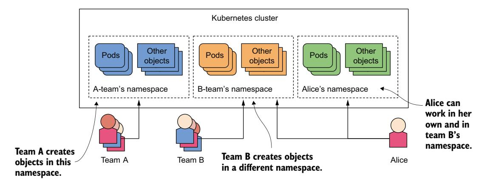
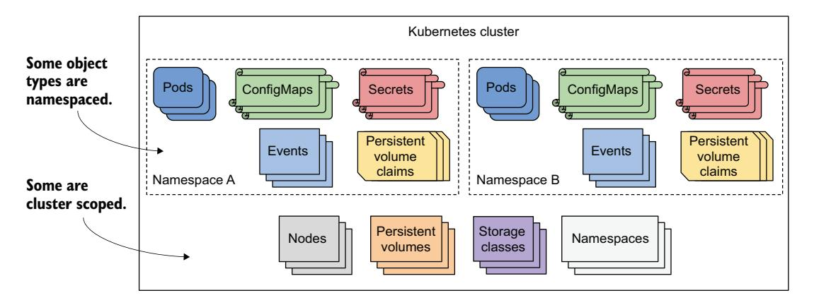
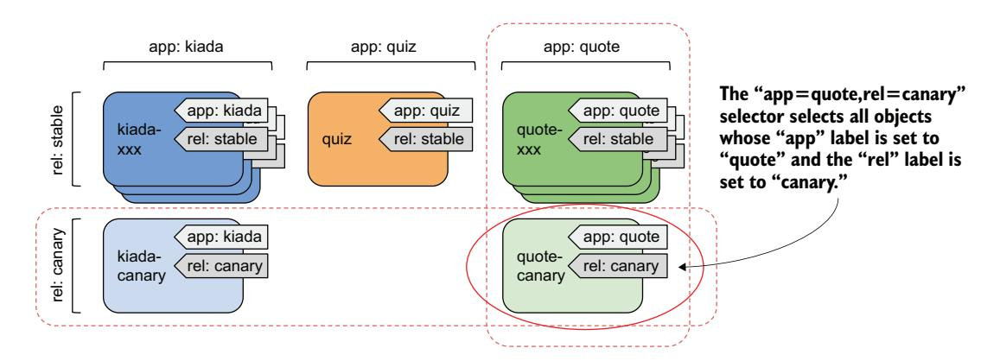
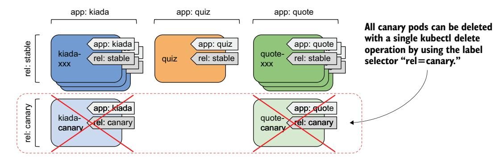

# 第 7 章 使用命名空间和标签组织 Pod 及其他资源

!!! tip "本章涵盖"

    - 使用命名空间将物理集群划分为虚拟集群
    - 使用标签组织对象
    - 使用标签选择器对对象的子集执行操作
    - 使用标签选择器将 Pod 调度到特定节点
    - 使用字段选择器根据对象属性过滤对象
    - 使用注解为对象添加额外的非标识信息

一个 Kubernetes 集群通常被多个团队使用。那么，这些团队应该如何将对象部署到同一集群并组织它们，使一个团队不会意外修改其他团队创建的对象？一个部署了数百个微服务的大型团队应该如何组织它们，使每个团队成员——即使是新加入团队的——都能快速看到每个对象属于哪里及其在系统中的角色（例如，Pod 属于哪个应用）？

这是两个不同的问题。Kubernetes 用对象命名空间解决第一个问题，用对象标签解决第二个问题。本章将解释两者。

!!! note ""

    你可以在 https://mng.bz/nZ9d 找到本章的代码文件。

## 7.1 使用命名空间组织对象

想象你的组织运行一个由多个工程团队使用的单一 Kubernetes 集群。每个团队部署整个 Kiada 应用套件以进行开发和测试。你希望每个团队只处理他们自己的应用套件实例——每个团队只想看到他们创建的对象，而不是其他团队创建的对象。这可以通过在单独的 Kubernetes 命名空间中创建对象来实现。

!!! note ""

    Kubernetes 中的命名空间有助于将 Kubernetes API 对象组织成不重叠的组。它们与 Linux 命名空间无关，后者帮助将一个容器中运行的进程与另一个容器中的进程隔离开，如第 2 章所述。

如图 7.1 所示，你可以使用命名空间将单个物理 Kubernetes 集群划分为许多虚拟集群。不是每个人都在单一位置创建对象，而是每个团队获得一个或多个命名空间的访问权限，在其中创建他们的对象。因为命名空间为对象名称提供了作用域，不同团队在各自的命名空间中创建对象时可以使用相同的名称。一些命名空间可以在不同团队或个人用户之间共享。



图 7.1 通过使用 Kubernetes 命名空间将物理集群划分为多个虚拟集群

#### 理解何时将对象组织到命名空间中

使用多个命名空间允许将具有大量组件的复杂系统划分为由不同团队管理的更小组。它们还可用于在多租户环境中分离对象。例如，你可以为每个客户创建一个单独的命名空间（或一组命名空间），并为该客户在该命名空间（或组）中部署整个应用套件。

!!! note ""

    大多数 Kubernetes API 对象类型是命名空间级别的，但有些不是。Pod、ConfigMap、Secret、PersistentVolumeClaim 和 Event 都是命名空间级别的。Node、PersistentVolume、StorageClass 和 Namespace 本身不是。要查看资源是命名空间级别还是集群级别，运行 `kubectl api-resources` 时检查 NAMESPACED 列。

没有命名空间，每个集群用户都必须为他们的对象名称添加唯一前缀，或者每个用户都必须使用自己的 Kubernetes 集群（图 7.2）。命名空间也为用户权限提供了作用域。用户可能有权管理一个命名空间中的对象，但不能管理其他命名空间中的对象。因此，命名空间在通常由许多不同用户和团队共享的生产集群中非常重要。



图 7.2 一些 Kubernetes API 类型是命名空间级别的，而其他是集群级别的。

### 7.1.1 列出命名空间及其包含的对象

你创建的每个 Kubernetes 集群都包含一些常见的命名空间。让我们看看它们是什么。

#### 列出命名空间

由于每个命名空间由 *Namespace 对象*表示，你可以像对任何其他 Kubernetes API 对象一样使用 `kubectl get` 命令显示它们。要查看集群中的命名空间，运行以下命令：

```bash
$ kubectl get namespaces
NAME                 STATUS   AGE
default              Active   1h
kube-node-lease      Active   1h
kube-public          Active   1h
kube-system          Active   1h
local-path-storage   Active   1h
```

!!! note ""

    namespace 的缩写形式是 ns。你也可以使用 `kubectl get ns` 列出命名空间。

到目前为止，你一直在 default 命名空间中工作。每次你创建对象时，它都在该命名空间中创建。类似地，当你使用 `kubectl get` 命令列出对象（如 Pod）时，该命令只显示该命名空间中的对象。你可能想知道其他命名空间中是否有 Pod。让我们看看。

!!! note ""

    以 kube- 为前缀的命名空间是为 Kubernetes 系统命名空间保留的。

#### 列出特定命名空间中的对象

要列出 kube-system 命名空间中的 Pod，使用 `--namespace` 选项运行 `kubectl get`，如下所示：

```bash
$ kubectl get pods --namespace kube-system
NAME                     READY   STATUS    RESTARTS   AGE
coredns-558bd4d5db-4n5zg 1/1    Running   0          1h
coredns-558bd4d5db-tnfws 1/1    Running   0          1h
etcd-kind-control-plane   1/1    Running   0          1h
kindnet-54ks9             1/1    Running   0          1h
...
```

!!! tip ""

    你也可以使用 `-n` 代替 `--namespace`。

你将在本书后面了解更多关于这些 Pod 的信息。如果这里显示的 Pod 与你的集群中的不完全匹配，不用担心。正如命名空间名称所暗示的，这些是 Kubernetes 系统 Pod。通过将它们放在这个单独的命名空间中，一切都保持整洁清晰。如果它们都在 default 命名空间中，与你创建的 Pod 混合在一起，将很难分辨什么属于哪里，你可能不小心删除系统对象。

#### 列出所有命名空间中的对象

除了在每个命名空间中单独列出对象外，你还可以告诉 kubectl 列出所有命名空间中的对象。通过运行以下命令列出集群中的所有 Pod：

```bash
$ kubectl get pods --all-namespaces
NAMESPACE     NAME                       READY   STATUS    RESTARTS   AGE
default       kiada-ssl                  2/2     Running   0          6m3s
kube-system   gke-metrics-agent-jqz98    2/2     Running   0          21h
kube-system   kube-dns-5f6d887967-6sg6m  4/4     Running   0          21h
```

如你所见，显示了 NAMESPACE 列以显示每个对象的命名空间。

!!! tip ""

    你也可以输入 `-A` 代替 `--all-namespaces`。

当你想查看集群中的所有对象（无论命名空间如何）或记不住对象在哪个命名空间中时，`--all-namespaces` 选项非常方便。

### 7.1.2 创建命名空间

现在你知道了集群中的其他命名空间，你将创建两个新的命名空间。

#### 使用 kubectl create namespace 创建命名空间

创建命名空间的最快方法是使用 `kubectl create namespace` 命令。按如下方式创建一个名为 kiada-test1 的命名空间：

```bash
$ kubectl create namespace kiada-test1
namespace/kiada-test1 created
```

!!! note ""

    大多数对象的名称必须符合 RFC 1123 中指定的 DNS 子域名命名规范，即它们只能包含小写字母数字字符、连字符和点，且必须以字母数字字符开头和结尾。命名空间也是如此，但不能包含点。

你刚刚创建了 kiada-test1 命名空间。现在你将使用不同的方法创建另一个。

#### 从清单文件创建命名空间

如前所述，Kubernetes 命名空间由 Namespace 对象表示。因此，你可以像之前那样使用 `kubectl get` 命令列出它们，但也可以从提交到 Kubernetes API 的 YAML 或 JSON 清单文件创建它们。

使用此方法创建另一个名为 kiada-test2 的命名空间。首先，创建一个名为 `ns.kiada-test2.yaml` 的文件，内容如下清单所示。

清单 7.1 Namespace 对象的 YAML 定义

```yaml
apiVersion: v1
kind: Namespace
metadata:
  name: kiada-test2
```

现在使用 `kubectl apply` 将文件提交到 Kubernetes API：

```bash
$ kubectl apply -f ns.kiada-test2.yaml
namespace/kiada-test2 created
```

开发者通常不这样创建命名空间，但运维人员会。例如，如果你想为一套将分布在多个命名空间中的应用创建一组清单文件，你可以将必要的 Namespace 对象添加到这些清单中，这样无需先用 `kubectl create` 创建命名空间然后再应用清单即可部署所有内容。

继续之前，你应该运行 `kubectl get ns` 再次列出所有命名空间，以查看集群现在包含你创建的两个命名空间。

### 7.1.3 管理其他命名空间中的对象

你现在已创建两个新的命名空间——kiada-test1 和 kiada-test2——但如前所述，你仍在 default 命名空间中。如果你创建对象（如 Pod）而不显式指定命名空间，该对象会在当前命名空间中创建。除非你配置了 kubectl 使用不同的命名空间，当前命名空间是名为 default 的命名空间。

#### 在特定命名空间中创建对象

在 7.1.1 节中，你了解到可以指定 `--namespace` 标志（或更短的 `-n` 选项）来列出特定命名空间中的对象。在将对象清单应用到 API 时，你可以使用相同的参数。

要在 kiada-test1 命名空间中创建 kiada-ssl Pod，运行以下命令：

```bash
$ kubectl apply -f kiada-ssl.yaml -n kiada-test1
pod/kiada-ssl created
```

你现在可以列出 kiada-test1 命名空间中的 Pod，以确认 Pod 对象是在那里创建而不是在 default 命名空间中：

```bash
$ kubectl -n kiada-test1 get pods
NAME        READY   STATUS    RESTARTS   AGE
kiada-ssl   2/2     Running   0          1m
```

#### 在对象清单中指定命名空间

对象清单可以在清单 metadata 部分的 `namespace` 字段中指定对象的命名空间。当你使用 `kubectl apply` 命令应用清单时，对象在指定的命名空间中创建。你不需要使用 `--namespace` 选项指定命名空间。

以下清单 7.2 包含与之前相同的对象，但命名空间在清单中指定。

清单 7.2 在对象清单中指定命名空间

```yaml
apiVersion: v1
kind: Pod
metadata:
  name: kiada-ssl
  namespace: kiada-test2       ← 此 Pod 对象指定了命名空间。应用清单时，此 Pod 在 kiada-test2 命名空间中创建。
spec:
  ...
```

当你使用以下命令应用此清单时，Pod 在 kiada-test2 命名空间中创建：

```bash
$ kubectl apply -f kiada-ssl.kiada-test2-namespace.yaml
pod/kiada-ssl created
```

注意这次你没有指定 `--namespace` 选项。如果你指定了，命名空间必须匹配对象清单中指定的命名空间，否则 kubectl 会显示错误，如下例：

```text
$ kubectl apply -f kiada-ssl.kiada-test2-namespace.yaml -n kiada-test1
the namespace from the provided object "kiada-test2" does not match the
namespace "kiada-test1". You must pass '--namespace=kiada-test2' to perform
this operation.
```

#### 让 kubectl 默认使用不同的命名空间

在前两个例子中，你学习了如何在 kubectl 当前默认使用的命名空间之外的命名空间中创建和管理对象。你将频繁使用 `--namespace` 选项——特别是当你想快速检查另一个命名空间中的内容时。然而，你的大部分工作将在当前命名空间中进行。

创建新命名空间后，你通常会在其中运行许多命令。为了让你的工作更轻松，你可以告诉 kubectl 切换到该命名空间。当前命名空间是当前 kubectl 上下文的属性，在 kubeconfig 文件中配置。

!!! note ""

    你在第 3 章中了解了 kubeconfig 文件。

要切换到不同的命名空间，你必须更新当前上下文。例如，要切换到 kiada-test1 命名空间，运行以下命令：

```bash
$ kubectl config set-context --current --namespace kiada-test1
Context "kind-kind" modified.
```

从现在起，你运行的每个 kubectl 命令都将使用 kiada-test1 命名空间。例如，你现在只需输入 `kubectl get pods` 即可列出此命名空间中的 Pod。

!!! tip ""

    要快速切换到不同的命名空间，你可以设置以下别名：`alias kns='kubectl config set-context --current --namespace '`。然后你可以使用 `kns some-namespace` 在命名空间之间切换。或者，你可以安装一个执行相同操作的 kubectl 插件。它可在 [https://github.com/ahmetb/kubectx](https://github.com/ahmetb/kubectx) 获取。

关于在不同命名空间中创建和管理对象，没有太多可学的了。但在结束本节之前，我需要解释 Kubernetes 在不同命名空间中运行的工作负载的隔离程度。

### 7.1.4 理解命名空间之间（缺乏）的隔离

到目前为止，你已在不同命名空间中创建了几个 Pod。你已经知道如何使用 `--all-namespaces` 选项（或简写 `-A`）列出所有命名空间中的 Pod，所以现在请这样做：

```bash
$ kubectl get pods -A
NAMESPACE       NAME        READY   STATUS    RESTARTS   AGE
default         kiada-ssl   2/2     Running   0          8h    ← 三个名为 kiada-ssl 的
default         quiz        2/2     Running   0          8h       Pod 存在于不同的
default         quote       2/2     Running   0          8h       命名空间中。
kiada-test1     kiada-ssl   2/2     Running   0          2m
kiada-test2     kiada-ssl   2/2     Running   0          1m
```

在命令的输出中，你应该看到至少两个名为 kiada-ssl 的 Pod：一个在 kiada-test1 命名空间中，另一个在 kiada-test2 命名空间中。你可能还在 default 命名空间中有另一个名为 kiada-ssl 的 Pod，来自上一章的练习。在这种情况下，你的集群中有三个同名 Pod，由于命名空间，你都能毫无问题地创建它们。同一集群的其他用户也可以部署更多这样的 Pod，而不会互相干扰。

#### 理解不同命名空间中 Pod 之间的运行时隔离

当用户在单个物理集群中使用命名空间时，就好像他们各自使用自己的虚拟集群。但这只在不遇到命名冲突的情况下创建对象这一点上成立。物理集群节点由集群中的所有用户共享。这意味着它们 Pod 之间的隔离与它们运行在不同物理集群（因此在不同物理节点）上的情况不同（见图 7.3）。

当在不同命名空间中创建的两个 Pod 被调度到同一集群节点时，它们都在相同的操作系统内核中运行。尽管它们通过容器技术相互隔离，但一个突破其容器或消耗过多节点资源的应用可能会影响另一个应用的运行。Kubernetes 命名空间在这方面不起作用。


图 7.3 不同命名空间中的 Pod 可能运行在同一集群节点上。

#### 理解命名空间之间的网络隔离

除非明确配置，Kubernetes 不提供运行在不同命名空间中 Pod 的应用之间的网络隔离。在一个命名空间中运行的应用可以与在其他命名空间中运行的应用通信。默认情况下，命名空间之间没有网络隔离。但是，你可以使用 NetworkPolicy 对象来配置特定命名空间中的哪些应用被允许连接到其他命名空间中的应用。

#### 使用命名空间分离生产、预发布和开发环境

因为命名空间不提供真正的隔离，你不应该使用它们将单个物理 Kubernetes 集群划分为生产、预发布和开发环境。将每个环境托管在单独的物理集群上是更安全的方法。

### 7.1.5 删除命名空间

让我们通过删除你创建的两个命名空间来结束本节关于命名空间的内容。当你删除 Namespace 对象时，你在该命名空间中创建的所有对象都会自动删除。你不需要先删除它们。

按如下方式删除 kiada-test2 命名空间：

```bash
$ kubectl delete ns kiada-test2
namespace "kiada-test2" deleted
```

该命令会阻塞，直到命名空间中的所有内容和命名空间本身都被删除。但是，如果你中断该命令并在删除完成之前列出命名空间，你会看到命名空间的状态为 Terminating：

```bash
$ kubectl get ns
NAME           STATUS        AGE
default        Active        2h
kiada-test1    Active        2h
kiada-test2    Terminating   2h
...
```

我展示这个的原因是你最终会遇到 delete 命令运行后永远不完成的情况。你可能会中断命令并检查命名空间列表，如此处所示。然后你会想知道为什么命名空间终止无法完成。

!!! tip ""

    你可以使用 `--wait=false` 选项使 `kubectl delete` 命令立即退出，而不是等待对象被完全删除。

#### 诊断命名空间终止卡住的原因

简而言之，命名空间无法删除的原因是因为其中创建的一个或多个对象无法删除。你可能会想，"哦，我用 `kubectl get all` 列出命名空间中的对象，看看哪个对象还在"，但这通常没有帮助，因为 kubectl 不返回任何结果。

!!! note ""

    记住，`kubectl get all` 命令只列出部分类型的对象。例如，它不列出 Secret。即使该命令没有返回任何内容，这并不意味着命名空间是空的。

在我所见的大多数（如果不是全部）命名空间以这种方式卡住的情况下，问题是由自定义对象及其自定义控制器未处理对象的删除并未从对象中移除终结器（finalizer）引起的。

这里我只想向你展示如何找出哪个对象导致命名空间卡住。提示：Namespace 对象也有 status 字段。虽然 `kubectl describe` 命令通常也显示对象的状态，但在撰写本文时，命名空间并非如此。我认为这是一个 bug，可能会在某个时候修复。在此之前，你可以按如下方式检查命名空间的状态：

```bash
$ kubectl get ns kiada-test2 -o yaml
...
status:
  conditions:
  - lastTransitionTime: "2021-10-10T08:35:11Z"
    message: All resources successfully discovered
    reason: ResourcesDiscovered
    status: "False"
    type: NamespaceDeletionDiscoveryFailure
  - lastTransitionTime: "2021-10-10T08:35:11Z"
    message: All legacy kube types successfully parsed
    reason: ParsedGroupVersions
    status: "False"
    type: NamespaceDeletionGroupVersionParsingFailure
  - lastTransitionTime: "2021-10-10T08:35:11Z"
    message: All content successfully deleted, may be waiting on finalization
    reason: ContentDeleted
    status: "False"
    type: NamespaceDeletionContentFailure
  - lastTransitionTime: "2021-10-10T08:35:11Z"
    message: 'Some resources are remaining: pods. has 1 resource instances'
    reason: SomeResourcesRemain
    status: "True"
    type: NamespaceContentRemaining
  - lastTransitionTime: "2021-10-10T08:35:11Z"
    message: 'Some content in the namespace has finalizers remaining:
      xyz.xyz/xyz-finalizer in 1 resource instances'
    reason: SomeFinalizersRemain
    status: "True"
    type: NamespaceFinalizersRemaining
  phase: Terminating
```

当你删除 kiada-test2 命名空间时，你不会看到此示例中的输出。此示例中的命令输出是假设性的。我强制 Kubernetes 产生它以展示删除过程卡住时会发生什么。如果你查看输出，你会看到命名空间中的对象都已成功标记为删除，但由于一个终结器未从 Pod 中移除，一个 Pod 仍留在命名空间中。现在不用担心终结器。你很快会了解它们。

在进入下一节之前，也请删除 kiada-test1 命名空间。

## 7.2 使用标签组织 Pod

在本书中，你将构建并部署完整的 Kiada 应用套件，它由多个服务组成。每个服务至少关联一个 Pod 对象，还关联多个其他对象。可以想象，这些对象的数量将随着本书的推进而增加。在事情变得失控之前，你需要开始组织这些对象，以便你和集群中的所有其他用户可以轻松找出哪些对象与哪个服务关联。

在其他使用微服务的系统中，服务数量可能超过 100 个或更多。其中一些服务被复制，这意味着同一 Pod 的多个副本被部署。此外，在某些时间点，多个版本的服务同时运行。这导致系统中存在数百甚至数千个 Pod。

想象你也开始复制和运行 Kiada 套件中 Pod 的多个版本。例如，假设你同时运行 Kiada 服务的稳定版本和金丝雀版本。

!!! info "定义"

    *金丝雀发布*（canary release）是一种部署模式，新版本的应用与稳定版本一起部署，只将一小部分请求导向新版本，以观察其行为，然后再将其推广到所有用户。这防止了一个糟糕的版本被提供给太多用户。

想象运行三个 Kiada 稳定版本副本和一个金丝雀实例。类似地，你运行三个 Quote 服务稳定版本的实例，以及一个金丝雀版本的 Quote 服务实例。你运行单个 Quiz 服务的稳定版本。所有这些 Pod 如图 7.4 所示。


图 7.4 Kiada 应用套件中未组织的 Pod

即使系统中只有九个 Pod，系统图也难以理解。而且它甚至没有显示 Pod 所需的任何其他 API 对象。显然你需要将它们组织成更小的组。你可以将这三个服务拆分为三个命名空间，但这并不是命名空间的真正目的。对于这种情况，更合适的机制是对象*标签*。

标签是用于组织 Kubernetes API 对象的极其强大但简单的特性。标签是附加到对象上的键值对，允许集群的任何用户识别该对象在系统中的角色。键和值都是简单的字符串，你可以根据需要指定。一个对象可以有多个标签，但标签键在该对象内必须是唯一的。你通常在创建对象时添加标签，但也可以稍后更改对象的标签。

#### 使用标签提供关于对象的额外信息

为了说明向对象添加标签的好处，让我们看图 7.4 中的 Pod。这些 Pod 运行三个不同的服务：Kiada 服务、Quote 服务和 Quiz 服务。此外，Kiada 和 Quote 服务背后的 Pod 运行每个应用的不同版本。有三个 Pod 实例运行稳定版本，一个运行金丝雀版本。

为了帮助识别每个 Pod 中运行的应用和版本，我们使用 Pod 标签。Kubernetes 不关心你为对象添加什么标签。你可以随意选择键和值。在这种情况下，以下两个标签是有意义的：

- `app` 标签表示 Pod 属于哪个应用。
- `rel` 标签表示 Pod 运行的是应用的稳定版本还是金丝雀版本。

如图 7.5 所示，所有三个 kiada-xxx Pod 和 kiada-canary Pod 的 app 标签值都设置为 kiada，因为这些 Pod 都运行 Kiada 应用。rel 标签在运行稳定版本的 Pod 和运行金丝雀版本的 Pod 之间有所不同。


图 7.5 使用 app 和 rel 标签标记 Pod

图中只显示了 kiada Pod，但想象一下也为其他 Pod 添加相同的两个标签。有了这些标签，遇到这些 Pod 的用户可以轻松地知道 Pod 中运行的是什么应用以及什么类型的版本。

#### 理解标签如何保持对象有序

如果你还没有意识到向对象添加标签的价值，请考虑通过添加 app 和 rel 标签，你已经从两个维度组织了 Pod（按应用水平组织和按版本垂直组织），如图 7.6 所示。


图 7.6 Kiada 套件的所有 Pod 按两个标准组织

除非你看到这些标签如何使通过 kubectl 管理这些 Pod 更加容易，否则这可能看起来仍然很抽象，所以让我们动手实践。

## 7.2.2 向 Pod 添加标签

本书的代码归档包含一组含前一个示例中所有 Pod 的清单文件。所有稳定版 Pod 都已标记，但金丝雀版 Pod 没有。你将手动标记它们。

#### 设置练习

首先，创建一个名为 kiada 的新命名空间，如下所示：

```bash
$ kubectl create namespace kiada
namespace/kiada created
```

配置 kubectl 使用这个新命名空间：

```bash
$ kubectl config set-context --current --namespace kiada
Context "kind-kind" modified.
```

清单文件组织在 `Chapter10/kiada-suite/` 下的三个子目录中。你可以使用以下命令一次性应用所有清单，而不是逐个应用：

```bash
$ kubectl apply -f kiada-suite/ -R
pod/kiada-001 created
...
pod/quote-003 created
pod/quote-canary created
```

你习惯应用一个清单文件，但这里你使用 `-f` 选项指定一个目录名。Kubectl 将应用它在该目录中找到的所有清单文件。

!!! note ""

    `-R` 选项（`--recursive` 的缩写）指示 kubectl 在指定目录的所有子目录中搜索清单，而不是仅搜索目录本身。

如你所见，该命令创建了几个 Pod。添加标签将有助于保持它们有序。

#### 在对象清单中定义标签

检查清单文件 `kiada-suite/kiada/pod.kiada-001.yaml`，如下面清单所示。查看 metadata 部分。除了你已经多次看到的 name 字段外，此清单还包含 labels 字段。它指定了两个标签：app 和 rel。

清单 7.3 带有标签的 Pod

```yaml
apiVersion: v1
kind: Pod
metadata:
  name: kiada-001
  labels:
    app: kiada
    rel: stable
spec:
  ...
```

所有对象类型都支持标签。你在 `metadata.labels` 映射中指定它们。

#### 显示对象标签

你可以通过运行 `kubectl describe` 命令查看特定对象的标签。按如下方式查看 Pod kiada-001 的标签：

```bash
$ kubectl describe pod kiada-001
Name:         kiada-001
Namespace:    kiada
Priority:     0
Node:         kind-worker2/172.18.0.2
Start Time:   Sun, 10 Oct 2021 21:58:25 +0200
Labels:       app=kiada
              rel=stable
Annotations:  <none>
...
```

!!! tip ""

    要仅显示对象的标签，使用命令 `kubectl get pod <name> -o yaml | yq .metadata.labels`。

`kubectl get pods` 命令默认不显示标签，但你可以使用 `--show-labels` 选项显示它们。按如下方式检查命名空间中所有 Pod 的标签：

```bash
$ kubectl get pods --show-labels
NAME            READY   STATUS    RESTARTS   AGE   LABELS
kiada-001       2/2     Running   0          12m   app=kiada,rel=stable
kiada-002       2/2     Running   0          12m   app=kiada,rel=stable
kiada-003       2/2     Running   0          12m   app=kiada,rel=stable
kiada-canary    2/2     Running   0          12m   <none>
quiz            2/2     Running   0          12m   app=quiz,rel=stable
quote-001       2/2     Running   0          12m   app=quote,rel=stable
quote-002       2/2     Running   0          12m   app=quote,rel=stable
quote-003       2/2     Running   0          12m   app=quote,rel=stable
quote-canary    2/2     Running   0          12m   <none>
```

除了使用 `--show-labels` 显示所有标签外，你还可以使用 `--label-columns` 选项（或更短的 `-L` 选项）显示特定标签。每个标签显示在自己的列中。按如下方式列出所有 Pod 及其 app 和 rel 标签：

```bash
$ kubectl get pods -L app,rel
NAME            READY   STATUS    RESTARTS   AGE   APP     REL
kiada-001       2/2     Running   0          14m   kiada   stable
kiada-002       2/2     Running   0          14m   kiada   stable
kiada-003       2/2     Running   0          14m   kiada   stable
kiada-canary    2/2     Running   0          14m
quiz            2/2     Running   0          14m   quiz    stable
quote-001       2/2     Running   0          14m   quote   stable
quote-002       2/2     Running   0          14m   quote   stable
quote-003       2/2     Running   0          14m   quote   stable
quote-canary    2/2     Running   0          14m
```

你可以看到两个金丝雀 Pod 没有标签。让我们添加它们。

#### 向现有对象添加标签

要向现有对象添加标签，你可以编辑对象的清单文件，向 metadata 部分添加标签，然后使用 `kubectl apply` 重新应用清单。你也可以使用 `kubectl edit` 直接在 API 中编辑对象定义。然而，最简单的方法是使用 `kubectl label` 命令。

使用以下命令向 kiada-canary Pod 添加 app 和 rel 标签：

```bash
$ kubectl label pod kiada-canary app=kiada rel=canary
pod/kiada-canary labeled
```

现在对 pod quote-canary 做同样的操作：

```bash
$ kubectl label pod quote-canary app=kiada rel=canary
pod/quote-canary labeled
```

你发现第二个 `kubectl label` 命令中的错误了吗？如果没有，当你在再次列出 Pod 及其标签时可能会注意到。Pod quote-canary 的 app 标签被设置为错误的值（kiada 而不是 quote）。让我们修复这个问题。

#### 更改现有对象的标签

你可以使用相同的命令更新对象标签。要更改你设置错误的标签，运行以下命令：

```bash
$ kubectl label pod quote-canary app=quote
error: 'app' already has a value (kiada), and --overwrite is false
```

为了防止意外更改现有标签的值，你必须使用 `--overwrite` 明确告诉 kubectl 覆盖标签。以下是正确的命令：

```bash
$ kubectl label pod quote-canary app=quote --overwrite
pod/quote-canary labeled
```

再次列出 Pod 以检查所有标签现在是否正确。

#### 标记某种类型的所有对象

现在，想象你想在同一命名空间中部署另一个应用套件。在做这件事之前，向所有现有 Pod 添加 suite 标签会很有用，这样你就能区分哪些 Pod 属于一个套件，哪些属于另一个。运行以下命令为命名空间中的所有 Pod 添加标签：

```bash
$ kubectl label pod --all suite=kiada-suite
pod/kiada-canary labeled
pod/kiada-001 labeled
...
pod/quote-003 labeled
```

再次使用 `--show-labels` 或 `-L suite` 选项列出 Pod，以确认所有 Pod 现在都包含这个新标签。

#### 从对象中移除标签

好吧，我撒谎了。你不会设置另一个应用套件。因此，suite 标签是多余的。要从对象中移除标签，运行 `kubectl label` 命令并在标签键后加上减号，如下所示：

```bash
$ kubectl label pod kiada-canary suite-
pod/kiada-canary unlabeled
```

要从所有其他 Pod 中移除标签，指定 `--all` 而不是 Pod 名称：

```bash
$ kubectl label pod --all suite-
pod/kiada-001 unlabeled
pod/kiada-002 unlabeled
pod/kiada-003 unlabeled
label "suite" not found.
pod/kiada-canary not labeled
...
pod/quote-canary unlabeled
```

!!! note ""

    如果你将标签值设置为空字符串，标签键不会被移除。要移除它，必须在标签键后使用减号。

## 7.2.3 标签语法规则

虽然你可以随意标记对象，但标签键和值都有一些限制。

#### 有效的标签键

在示例中，你使用了标签键 app、rel 和 suite。这些键没有前缀，被认为是对用户私有的。Kubernetes 自身应用或读取的常用标签键总是以前缀开头。这也适用于核心之外的 Kubernetes 组件使用的标签，以及其他普遍接受的标签键。

Kubernetes 使用的带前缀标签键的一个例子是 `kubernetes.io/arch`。你可以在 Node 对象上找到它，用来标识节点使用的架构类型。

```bash
$ kubectl get node -L kubernetes.io/arch
NAME                 STATUS   ROLES           AGE   VERSION   ARCH
kind-control-plane   Ready    control-plane   31d   v1.21.1   amd64
kind-worker          Ready    <none>          31d   v1.21.1   amd64
kind-worker2         Ready    <none>          31d   v1.21.1   amd64
```

标签前缀 `kubernetes.io/` 和 `k8s.io/` 是为 Kubernetes 组件保留的。如果你想为标签使用前缀，请使用你所在组织的域名以避免冲突。

为标签选择键时，前缀和名称部分都适用一些语法限制。表 7.1 提供了有效和无效标签键的示例。

表 7.1 有效和无效标签键的示例

| 有效的标签键        | 无效的标签键                               |
|---------------------|--------------------------------------------|
| foo                 | _foo                                       |
| foo-bar_baz         | foo%bar*baz                                |
| example/foo         | /foo                                       |
| example/FOO         | EXAMPLE/foo                                |
| example.com/foo     | examplecom/foo                             |
| my_example.com/foo  | my@example.com/foo                         |
| example.com/foo-bar | example.com/-foo-bar                       |
| my.example.com/foo  | a.very.long.prefix.over.253.characters/foo |

以下语法规则适用于前缀：

- 必须是 DNS 子域名（即只能包含小写字母数字字符、连字符、下划线和点）
- 长度不能超过 253 个字符（不包括斜杠字符）
- 必须以正斜杠结尾

前缀后面必须跟标签名称，标签名称：

- 必须以字母数字字符开头和结尾
- 可以包含连字符、下划线和点
- 可以包含大写字母
- 不能超过 63 个字符

#### 有效的标签值

请记住，标签用于向对象添加标识信息。与标签键一样，标签值也必须遵循某些规则。例如，标签值不能包含空格或特殊字符。表 7.2 提供了有效和无效标签值的示例。

表 7.2 有效和无效标签值的示例

| 有效的标签值 | 无效的标签值                    |
|-------------|--------------------------------|
| foo         | _foo                           |
| foo-bar_baz | foo%bar*baz                    |
| FOO         | value.longer.than.63.characters |
| ""          | value with spaces              |

标签值：

- 可以为空
- 如果不为空，必须以字母数字字符开头
- 只能包含字母数字字符、连字符、下划线和点
- 不能包含空格
- 长度不能超过 63 个字符

如果你需要添加不符合这些规则的值，可以将它们作为注解而不是标签添加。你将在本章后面了解更多关于注解的内容。

## 7.2.4 使用标准标签键

虽然你始终可以选择自己的标签键，但有一些你应该了解的标准键。其中一些由 Kubernetes 自身用于标记系统对象，而另一些已成为用户创建对象中常用的标签。

#### Kubernetes 使用的知名标签

Kubernetes 通常不会为你创建的对象添加标签。但是，它确实为系统对象（如节点）使用各种标签，特别是当集群在云环境中运行时。表 7.3 列出了一些你可能在这些对象上找到的知名标签。

!!! note ""

    除了 `kubernetes.io` 前缀之外，你也可以在旧前缀 `beta.kubernetes.io` 下找到其中一些标签。

表 7.3 节点和 PersistentVolume 上的知名标签

| 标签键                              | 示例值        | 应用对象                | 描述                       |
|-------------------------------------|--------------|------------------------|----------------------------|
| kubernetes.io/arch                  | amd64        | Node                   | 节点的架构                   |
| kubernetes.io/os                    | linux        | Node                   | 节点上运行的操作系统           |
| kubernetes.io/hostname              | worker-node1 | Node                   | 节点的主机名                 |
| topology.kubernetes.io/region       | eu-west3     | Node, PersistentVolume | 节点或持久卷所在的区域         |
| topology.kubernetes.io/zone         | eu-west3-c   | Node, PersistentVolume | 节点或持久卷所在的可用区       |
| node.kubernetes.io/instance-type    | micro-1      | Node                   | 节点实例类型                 |

云提供商可以为节点和其他对象提供额外的标签。例如，Google Kubernetes Engine 添加 `cloud.google.com/gke-nodepool` 和 `cloud.google.com/gke-os-distribution` 标签以提供关于每个节点的更多信息。你也可以在其他对象上找到更多标准标签。

#### 为已部署应用组件推荐的标签

Kubernetes 社区已经就一组标准标签达成一致，你可以将这些标签添加到对象中，以便其他用户和工具能够理解它们。表 7.4 列出了这些标准标签。

表 7.4 Kubernetes 社区推荐使用的标签

| 标签                                | 示例            | 描述                                                                                       |
|-------------------------------------|-----------------|-------------------------------------------------------------------------------------------|
| app.kubernetes.io/name              | quotes          | 应用的名称。如果应用由多个组件组成，这是整个应用的名称，而不是单个组件的名称。                   |
| app.kubernetes.io/instance          | quotes-foo      | 此应用实例的名称。如果你为不同目的创建同一应用的多个实例，此标签可帮助你区分它们。                |
| app.kubernetes.io/component         | database        | 此组件在应用架构中扮演的角色。                                                                |
| app.kubernetes.io/part-of           | kubia-demo      | 此应用所属的应用套件名称。                                                                   |
| app.kubernetes.io/version           | 1.0.0           | 应用的版本。                                                                                |
| app.kubernetes.io/managed-by        | quotes-operator | 管理此应用部署和更新的工具。                                                                  |

属于同一应用实例的所有对象应具有相同的一组标签。这样，任何使用 Kubernetes 集群的人都可以看到哪些组件属于一起，哪些不属于。此外，你可以通过使用标签选择器通过批量操作来管理这些组件，下一节将对此进行说明。

## 7.3 使用标签选择器过滤对象

在前面的练习中添加到 Pod 的标签允许你识别每个对象并理解它在系统中的位置。到目前为止，这些标签仅在你列出对象时提供了额外的信息。但标签的真正威力在于使用*标签选择器*根据标签过滤对象。

标签选择器允许你选择包含特定标签的 Pod 或其他对象的子集，并对这些对象执行操作。标签选择器是一种标准，根据对象是否包含具有特定值的特定标签键来过滤对象。

标签选择器有两种类型：

- 基于相等性的选择器，和
- 基于集合的选择器。

#### 介绍基于相等性的选择器

基于相等性的选择器可以根据特定标签的值是否等于或不等于特定值来过滤对象。例如，将标签选择器 `app=quote` 应用于我们之前示例中的所有 Pod，会选择所有 Quote Pod（所有稳定实例加上金丝雀实例），如图 7.7 所示。


图 7.7 使用基于相等性的选择器选择对象

类似地，标签选择器 `app!=quote` 选择除 Quote Pod 之外的所有 Pod。

#### 介绍基于集合的选择器

基于集合的选择器更强大，允许你指定：

- 特定标签必须具有的一组值——例如，`app in (quiz, quote)`
- 特定标签不能具有的一组值——例如，`app notin (kiada)`
- 特定标签键应存在于对象的标签中——例如，要选择具有 app 标签的对象，选择器就是 `app`
- 特定标签键不应存在于对象的标签中——例如，要选择没有 app 标签的对象，选择器是 `!app`

#### 组合多个选择器

当你过滤对象时，可以组合多个选择器。要选中，对象必须匹配所有指定的选择器。如图 7.8 所示，选择器 `app=quote,rel=canary` 选中 Pod quote-canary。



图 7.8 组合两个标签选择器

你在使用 kubectl 管理对象时使用标签选择器，但 Kubernetes 在一个对象引用其他对象的子集时也在内部使用它们。这些场景将在接下来的两节中介绍。

### 7.3.1 使用标签选择器通过 kubectl 管理对象

如果你一直在跟随本书的练习，你已经多次使用 `kubectl get` 命令来列出集群中的对象。当你在不指定标签选择器的情况下运行此命令时，它会打印特定类型的所有对象。幸运的是，你的命名空间中从未有很多对象，所以列表从未太长。然而，在真实环境中，命名空间中可能有数百个特定类型的对象。这时标签选择器就派上了用场。

#### 使用标签选择器过滤对象列表

你将使用标签选择器列出之前在 kiada 命名空间中创建的 Pod。让我们尝试图 7.7 中的示例，其中选择器 `app=quote` 被用于只选择运行 Quote 应用的 Pod。要将标签选择器应用于 `kubectl get`，使用 `--selector` 参数（或等效的简短形式 `-l`）指定它，如下所示：

```bash
$ kubectl get pods -l app=quote
NAME           READY   STATUS    RESTARTS   AGE
quote-001      2/2     Running   0          2h
quote-002      2/2     Running   0          2h
quote-003      2/2     Running   0          2h
quote-canary   2/2     Running   0          2h
```

只显示 Quote Pod。其他 Pod 被忽略。现在，作为另一个示例，尝试列出所有金丝雀 Pod：

```bash
$ kubectl get pods -l rel=canary
NAME            READY   STATUS    RESTARTS   AGE
kiada-canary    2/2     Running   0          2h
quote-canary    2/2     Running   0          2h
```

让我们也尝试图 7.8 中的示例，组合两个选择器 `app=quote` 和 `rel=canary`：

```bash
$ kubectl get pods -l app=quote,rel=canary
NAME           READY   STATUS    RESTARTS   AGE
quote-canary   2/2     Running   0          2h
```

只有 quote-canary Pod 的标签匹配标签选择器，因此只有这个 Pod 被显示。现在尝试使用基于集合的选择器。要显示所有 Quiz 和 Quote Pod，使用选择器 `'app in (quiz, quote)'`，如下所示：

```bash
$ kubectl get pods -l 'app in (quiz, quote)' -L app
NAME           READY   STATUS    RESTARTS   AGE   APP
quiz           2/2     Running   0          2h    quiz
quote-canary   2/2     Running   0          2h    quote
quote-001      2/2     Running   0          2h    quote
quote-002      2/2     Running   0          2h    quote
quote-003      2/2     Running   0          2h    quote
```

如果你使用基于相等性的选择器 `'app!=kiada'` 或基于集合的选择器 `'app notin (kiada)'`，将获得相同的结果。命令中的 `-L app` 选项显示每个 Pod 的 app 标签值（参见输出中的 APP 列）。

你尚未尝试的唯一两个选择器是只测试特定标签键是否存在（或不存在）的选择器。如果你想尝试它们，首先使用以下命令从 Quiz Pod 中移除 rel 标签：

```bash
$ kubectl label pod quiz rel-
pod/quiz labeled
```

现在你可以列出没有 rel 标签的 Pod：

```bash
$ kubectl get pods -l '!rel'
NAME   READY   STATUS    RESTARTS   AGE
quiz   2/2     Running   0          2h
```

!!! note ""

    确保在 `!rel` 周围使用单引号，这样你的 shell 就不会解释感叹号。

而要列出所有有 rel 标签的 Pod，运行以下命令：

```bash
$ kubectl get pods -l rel
```

该命令应显示除 Quiz Pod 之外的所有 Pod。

如果你的 Kubernetes 集群在云中运行并分布在多个区域或可用区，你也可以尝试列出特定类型或在特定区域或可用区的节点。表 7.3 显示了在选择器中应指定什么标签键。

你现在已经掌握了在列出对象时使用标签选择器。你有信心也使用它们删除对象吗？

#### 使用标签选择器删除对象

你的系统中目前有两个金丝雀版本在使用。结果发现它们没有按预期运行，需要被终止。你可以列出系统中的所有金丝雀版本并逐一删除它们。更快的方法是使用标签选择器在单个操作中删除它们，如图 7.9 所示。



图 7.9 使用 rel=canary 标签选择器选择并删除所有金丝雀 Pod

使用以下命令删除金丝雀 Pod：

```bash
$ kubectl delete pods -l rel=canary
pod "kiada-canary" deleted
pod "quote-canary" deleted
```

命令的输出显示 kiada-canary 和 quote-canary Pod 都已被删除。但是，由于 `kubectl delete` 命令不要求确认，你在使用标签选择器删除对象时应非常小心，尤其是在生产环境中。

### 7.3.2 在对象清单中使用标签选择器

你已经学会了如何使用标签和选择器通过 kubectl 组织对象并过滤它们，但选择器也在 Kubernetes API 对象内部使用。例如，你可以在每个 Pod 对象中指定一个节点选择器，以指定 Pod 可以调度到哪些节点。在第 11 章（介绍 Service 对象）中，你将了解到需要在此对象中定义一个 Pod 选择器，以指定 Service 将流量转发到的一组 Pod。在后面的章节中，你将看到 Deployment、ReplicaSet、DaemonSet 和 StatefulSet 等对象如何使用 Pod 选择器来定义属于这些对象的 Pod 集合。

#### 使用标签选择器将 Pod 调度到特定节点

到目前为止你创建的所有 Pod 都已随机分布在整个集群中。通常，Pod 被调度到哪个节点并不重要，因为每个 Pod 都获得它所请求的精确计算资源量（CPU、内存等）。此外，其他 Pod 可以访问此 Pod，无论它和其他 Pod 运行在哪个节点上。然而，在某些情况下，你可能希望只将某些 Pod 部署到特定的节点子集上。

一个很好的例子是当你的硬件基础设施不均匀时。如果你的一些工作节点使用机械硬盘而其他节点使用 SSD，你可能希望将需要低延迟存储的 Pod 只调度到能提供它的节点上。另一个例子是，如果你想将前端 Pod 调度到某些节点，将后端 Pod 调度到其他节点，或者如果你想为每个客户部署一组单独的应用实例，并希望每组都在自己的一组节点上运行以确保安全。

在所有这些情况下，与其将 Pod 调度到特定节点，不如让 Kubernetes 从满足所需条件的节点集合中选择一个节点。通常，你会有多个满足指定条件的节点，这样如果其中一个节点失败，运行在它上面的 Pod 可以迁移到其他节点。

用于此目的的机制是标签和选择器。

#### 向节点附加标签

Kiada 应用套件由 Kiada、Quiz 和 Quote 服务组成。让我们将 Kiada 服务视为前端，将 Quiz 和 Quote 服务视为后端服务。想象你希望 Kiada Pod 只调度到你为前端工作负载保留的集群节点上。为此，你首先将一些节点标记为如此。

首先，列出集群中的所有节点并选择一个工作节点。如果你的集群只有一个节点，就使用那个。

```bash
$ kubectl get node
NAME                 STATUS   ROLES           AGE   VERSION
kind-control-plane   Ready    control-plane   1d    v1.21.1
kind-worker          Ready    <none>          1d    v1.21.1
kind-worker2         Ready    <none>          1d    v1.21.1
```

在此示例中，我选择 kind-worker 节点作为前端工作负载的节点。选择你的节点后，向它添加 `node-role: front-end` 标签，如下所示：

```bash
$ kubectl label node kind-worker node-role=front-end
node/kind-worker labeled
```

现在使用标签选择器列出节点，以确认这是唯一的前端节点：

```bash
$ kubectl get node -l node-role=front-end
NAME          STATUS   ROLES    AGE   VERSION
kind-worker   Ready    <none>   1d    v1.21.1
```

如果你的集群有许多节点，你可以用这种方式标记多个节点。

#### 将 Pod 调度到具有特定标签的节点

要将 Pod 调度到你指定为前端节点的节点，你必须在创建 Pod 之前向 Pod 清单添加节点选择器。以下清单显示了 `pod.kiada-front-end.yaml` 清单文件的内容。节点选择器在 `spec.nodeSelector` 字段中指定。

清单 7.4 使用节点选择器将 Pod 调度到特定节点

```yaml
apiVersion: v1
kind: Pod
metadata:
  name: kiada-front-end
spec:
  nodeSelector:
    node-role: front-end
  containers:
  ...
```

在 `nodeSelector` 字段中，你可以指定一个或多个标签键和值，节点必须匹配才能有资格运行该 Pod。请注意，此字段仅支持指定基于相等性的标签选择器。标签值必须与选择器中的值匹配。你不能在 `nodeSelector` 字段中使用不等或基于集合的选择器。

当你通过 `kubectl apply` 应用清单从前面的清单创建 Pod 时，你会看到 Pod 被调度到你用标签 `node-role: front-end` 标记的节点。你可以通过使用 `-o wide` 选项显示 Pod 来确认这一点，以显示 Pod 的节点，如下所示：

```bash
$ kubectl get pod kiada-front-end -o wide
NAME              READY   STATUS    RESTARTS   AGE   IP            NODE
kiada-front-end   2/2     Running   0          1m    10.244.2.20   kind-worker
```

你可以多次删除并重新创建 Pod，以确保它始终落在前端节点上。

#### 使用基于集合的标签选择器

`nodeSelector` 字段是基于相等性的标签选择器的一个例子。基于集合的标签选择器的一个例子可以在 Pod 的 `nodeAffinity` 字段中找到，它用于类似的目的——将 Pod 放置在具有某些标签的节点上。然而，基于集合的选择器表达能力更强，因为它们还允许你排除具有某些标签的节点。

以下清单显示了将 kiada-front-end Pod 调度到具有 `node-role: front-end` 且没有 `skip-me` 标签的节点的另一种方法。你可以在文件 `pod.kiada-front-end-affinity.yaml` 中找到该清单。

清单 7.5 使用基于集合的标签选择器

```yaml
apiVersion: v1
kind: Pod
metadata:
  name: kiada-front-end-affinity
spec:
  affinity:
    nodeAffinity:
      requiredDuringSchedulingIgnoredDuringExecution:
        nodeSelectorTerms:
        - matchExpressions:
          - key: node-role
            operator: In
            values:
            - front-end
          - key: skip-me
            operator: DoesNotExist
  ...
```

正如你在清单中看到的，`nodeSelectorTerms` 字段可以接受多个节点选择器条件。节点必须匹配至少一个条件才能被选中。然而，每个条件可以指定多个 `matchExpressions`，节点的标签必须匹配条件中定义的*所有*表达式。

每个基于集合的标签选择器匹配表达式指定 `key`、`operator` 和 `values`。`key` 是选择器应用的标签键。`operator` 必须是以下之一：

- `In`——标签值必须匹配 values 字段中的一个值。
- `NotIn`——标签值不能匹配 values 字段中的任何值。
- `Exists`——标签键必须存在，但值无关紧要。
- `DoesNotExist`——标签键不能出现在对象上。
- `Lt`——标签值必须小于 values 字段中指定的单个值。
- `Gt`——标签值必须大于 values 字段中指定的单个值。

`values` 字段指定标签必须具有或不能具有的值列表。对于 `Exists` 和 `DoesNotExist` 操作符，必须省略该字段。对于 `Lt` 和 `Gt` 操作符，values 列表必须恰好包含一个数值。

要查看 `nodeAffinity` 中基于集合的标签选择器的实际效果，你将创建 kiada-front-end-affinity Pod。但在你这样做之前，运行以下命令向前端节点添加 `skip-me` 标签：

```bash
$ kubectl label nodes -l node-role=front-end skip-me=true
```

此命令向所有具有 `node-role: front-end` 标签的节点添加 `skip-me: true` 标签。

现在通过 `kubectl apply` 应用 `pod.kiada-front-end-affinity.yaml` 文件创建 Pod。与 kiada-front-end Pod 不同，这个新 Pod 不应被调度到任何节点，因为没有节点匹配选择器。你可以通过使用 `kubectl get pods` 列出 Pod 来确认这一点：

```bash
$ kubectl get pods
NAME                        READY   STATUS    RESTARTS   AGE
kiada-front-end             2/2     Running   0          5m
kiada-front-end-affinity    0/2     Pending   0          20s
```

使用 `kubectl describe pod` 检查 Pod 的事件应该会告诉你 Pod 为什么没有被调度。暂时不要管这个 Pod，因为你将在下一个练习中需要它。

## 7.4 使用字段选择器过滤对象

Kubernetes 最初只允许使用标签选择器过滤对象。然后人们清楚地认识到，用户也想通过其他属性过滤对象。一个例子是基于 Pod 运行的集群节点过滤 Pod。现在这可以通过*字段选择器*来实现。

你可以在字段选择器中使用的字段集取决于对象类型。`metadata.name` 和 `metadata.namespace` 字段始终受支持。

### 7.4.1 在 kubectl 中使用字段选择器

字段选择器可用于通过 kubectl 过滤对象。让我们看两个有用的示例。

#### 列出调度到特定节点的 Pod

作为在 kubectl 中使用字段选择器的示例，运行以下命令列出 kind-worker 节点上的 Pod（如果你的集群不是用 kind 工具配置的，请使用不同的节点名称）：

```bash
$ kubectl get pods --field-selector spec.nodeName=kind-worker
NAME              READY   STATUS    RESTARTS   AGE
kiada-front-end   2/2     Running   0          15m
kiada-002         2/2     Running   0          3h
quote-002         2/2     Running   0          3h
```

kubectl 不会显示当前命名空间中的所有 Pod，而是只显示 `spec.nodeName` 字段设置为 kind-worker 的 Pod。

你怎么知道在选择器中使用哪个字段？当然是使用 `kubectl explain` 查找字段名称。你在第 4 章中学到了这一点。例如：`kubectl explain pod.spec` 显示 Pod 对象 spec 部分的字段。它不显示哪些字段在字段选择器中受支持，但你可以尝试使用一个字段，kubectl 会告诉你它是否不受支持。

#### 列出未运行的 Pod

使用字段选择器的另一个示例是查找当前未运行的 Pod。你可以通过使用 `status.phase!=Running` 字段选择器来实现，如下所示：

```bash
$ kubectl get pods --field-selector status.phase!=Running
NAME                        READY   STATUS    RESTARTS   AGE
kiada-front-end-affinity    0/2     Pending   0          41m
```

你在前一个练习中创建的 kiada-front-end-affinity Pod 没有被调度到任何节点，所以它显然没有运行。

!!! tip ""

    运行 `kubectl get pods --field-selector status.phase!=Running -A` 来列出整个集群中未运行的 Pod。`-A` 标志是 `--all-namespaces` 的缩写，因此会显示来自所有命名空间的未运行 Pod。

### 7.4.2 在对象清单中使用字段选择器

也可以在某些对象清单中使用基于字段值的字段选择器来选择对象。例如，Pod 的 `nodeAffinity` 也可以根据节点的字段值匹配节点。为此，你使用 `matchFields` 而不是 `matchExpressions`。例如，你可以使用 `matchFields` 防止 Pod 被调度到特定节点。

清单 7.6 在 nodeAffinity 中使用字段选择器

```yaml
apiVersion: v1
kind: Pod
metadata:
  name: kiada-front-end-skip-specific-node
spec:
  affinity:
    nodeAffinity:
      requiredDuringSchedulingIgnoredDuringExecution:
        nodeSelectorTerms:
        - matchFields:
          - key: metadata.name
            operator: NotIn
            values:
            - node-a
```

## 7.5 注解对象

为对象添加标签使它们更容易管理。在某些情况下，对象必须有标签，因为 Kubernetes 使用它们来识别哪些对象属于同一集合。但正如你在本章中学到的，你不能在标签值中存储任意内容。例如，标签值的最大长度仅为 63 个字符，并且值中不能包含空格。

因此，Kubernetes 也允许你向对象添加注解。注解类似于标签，但它们在目的和用法上有所不同。

### 7.5.1 对象注解简介

与标签一样，注解也是键值对，但它们不存储标识信息，也不能用于过滤对象。与标签不同，注解值可以长得多（撰写本文时最多 256 KB），并且可以包含任何字符。

#### 理解 Kubernetes 添加的注解

如果信息无法存储在对象的某个字段中，诸如 kubectl 和在 Kubernetes 中运行的各种控制器等工具可能会向你的对象添加注解。当新特性被引入 Kubernetes 时，通常会使用注解。如果一个特性需要更改 Kubernetes API（例如，需要向对象模式添加新字段），该更改通常会推迟几个 Kubernetes 版本，直到明确该更改是合理的。毕竟，对任何 API 的更改都应非常谨慎地进行，因为在向 API 添加字段后，你不能随意删除它，否则会破坏所有使用该 API 的人。

更改 Kubernetes API 需要仔细考虑，每个更改必须首先在实践中得到验证。因此，通常首先引入新的对象注解，而不是向模式添加新字段。Kubernetes 社区有机会在实践中使用该特性。经过几个版本，当每个人都对该特性满意时，会引入一个新字段，注解被弃用。然后几个版本之后，注解被移除。

#### 添加你自己的注解

与标签一样，你可以向对象添加自己的注解。注解的一个很好的用途是向每个 Pod 或其他对象添加描述，以便所有集群用户都可以快速查看关于对象的信息，而无需在其他地方查找。

例如，将创建对象的人员姓名及联系方式信息存储在对象的注解中可以极大地促进集群用户之间的协作。

同样，你可以使用注解来提供关于 Pod 中运行的应用的更多详细信息。例如，你可以将 Git 仓库的 URL、Git 提交哈希、构建时间戳和类似信息附加到你的 Pod 上。

你也可以使用注解来添加某些工具管理或增强对象所需的信息。例如，特定的注解值设置为 true 可以向工具发出信号，表明它是否应该处理和修改该对象。

#### 理解注解键和值

适用于标签键的相同规则也适用于注解键。有关更多信息，请参阅第 7.2.3 节。另一方面，注解值没有特殊规则。注解值可以包含任何字符，最长可达 256 KB。它必须是字符串，但可以包含纯文本、YAML、JSON，甚至 Base64 编码的值。

### 7.5.2 向对象添加注解

与标签一样，注解可以添加到现有对象中，或包含在你用于创建对象的对象清单文件中。让我们看看如何向现有对象添加注解。

#### 设置对象注解

向现有对象添加注解的最简单方法是使用 `kubectl annotate` 命令。让我们向一个 Pod 添加注解。你应该仍然有本章前面练习中名为 kiada-front-end 的 Pod。如果没有，你可以使用当前命名空间中的任何其他 Pod 或对象。运行以下命令：

```bash
$ kubectl annotate pod kiada-front-end created-by='Marko Luksa <marko.luksa@xyz.com>'
pod/kiada-front-end annotated
```

此命令向 kiada-front-end Pod 添加值为 `Marko Luksa <marko.luksa@xyz.com>` 的 `created-by` 注解。

#### 在对象清单中指定注解

你也可以在创建对象之前将注解添加到对象清单文件中。以下清单显示了一个示例。你可以在 `pod.pod-with-annotations.yaml` 文件中找到该清单。

清单 7.7 对象清单中的注解

```yaml
apiVersion: v1
kind: Pod
metadata:
  name: pod-with-annotations
  annotations:
    created-by: 'Marko Luksa <marko.luksa@xyz.com>'
    contact-phone: '+1 234 567 890'
    managed: 'yes'
    revision: '3'
spec:
  ...
```

!!! warning ""

    确保将注解值用引号括起来，否则 YAML 解析器可能会将其视为非字符串类型。如果不这样做，应用清单时会出现一个神秘的错误。例如，如果注解值是数字（如 123）或可能被解释为布尔值的值（true、false，也包括 yes 和 no 等词），请将值用引号括起来（例如："123"、"true"、"yes"），以避免以下错误：`"unable to decode yaml ... ReadString: expects " or n, but found t"`。

通过执行以下命令应用前一个清单中的清单：

```bash
$ kubectl apply -f pod.pod-with-annotations.yaml
```

### 7.5.3 检查对象的注解

与标签不同，`kubectl get` 命令不提供在对象列表中显示注解的选项。要查看对象的注解，你应该使用 `kubectl describe` 或在对象的 YAML 或 JSON 定义中查找注解。

#### 使用 kubectl describe 查看对象注解

要查看你创建的 pod-with-annotations Pod 的注解，使用 `kubectl describe`：

```bash
$ kubectl describe pod pod-with-annotations
Name:         pod-with-annotations
Namespace:    kiada
Priority:     0
Node:         kind-worker/172.18.0.4
Start Time:   Tue, 12 Oct 2021 16:37:50 +0200
Labels:       <none>
Annotations:  contact-phone: +1 234 567 890
              created-by: Marko Luksa <marko.luksa@xyz.com>
              managed: yes
              revision: 3
Status:       Running
...
```

#### 在对象的 JSON 定义中显示对象注解

或者，你可以使用 `jq` 命令从 Pod 的 JSON 定义中提取注解：

```bash
$ kubectl get pod pod-with-annotations -o json | jq .metadata.annotations
{
  "contact-phone": "+1 234 567 890",
  "created-by": "Marko Luksa <marko.luksa@xyz.com>",
  "kubectl.kubernetes.io/last-applied-configuration": "...",
  "managed": "yes",
  "revision": "3"
}
```

你会注意到对象中有一个额外的注解，键为 `kubectl.kubernetes.io/last-applied-configuration`。它没有被 `kubectl describe` 命令显示，因为它只在内部由 kubectl 使用，而且也会使输出太长。在未来，这个注解可能会被弃用，然后被移除。如果你自己运行命令时没有看到它，不用担心。

### 7.5.4 更新和移除注解

如果你想使用 `kubectl annotate` 命令更改现有注解，你还必须指定 `--overwrite` 选项，就像更改现有对象标签时一样。例如，要更改 `created-by` 注解，完整命令如下：

```bash
$ kubectl annotate pod kiada-front-end created-by='Humpty Dumpty' --overwrite
```

要从对象中移除注解，在你要移除的注解键末尾添加减号：

```bash
$ kubectl annotate pod kiada-front-end created-by-
```

## 本章小结

- Kubernetes 集群中的对象通常被划分为多个命名空间。在命名空间内，对象名称必须是唯一的，但如果你在不同命名空间中创建它们，可以给两个对象取相同的名称。
- 命名空间允许不同的用户和团队使用同一集群，就好像他们在使用独立的 Kubernetes 集群一样。
- 每个对象可以有多个标签。标签是帮助识别对象的键值对。通过向对象添加标签，你可以有效地将对象组织成组。
- 标签选择器允许你根据对象的标签过滤对象。你可以轻松地过滤属于特定应用的 Pod，或者如果你之前已经向这些 Pod 添加了适当的标签，则可以根据任何其他标准进行过滤。
- 字段选择器类似于标签选择器，但它们允许根据对象清单中的特定字段来过滤对象。例如，可以使用字段选择器列出在特定节点上运行的 Pod。不幸的是，你不能使用它们过滤注解。
- 与其对每个 Pod 单独执行操作，不如使用标签选择器对匹配标签选择器的一组对象执行相同的操作。
- 标签和选择器也被某些对象类型内部使用。你可以向节点对象添加标签，并在 Pod 中定义一个节点选择器，以将该 Pod 只调度到满足指定条件的节点。
- 除了标签之外，你还可以向对象添加注解。注解可以包含更大量的数据，并且可以包含标签中不允许的空格和其他特殊字符。注解通常用于添加工具和集群用户使用的额外信息。它们也被用来推迟对 Kubernetes API 的更改。
