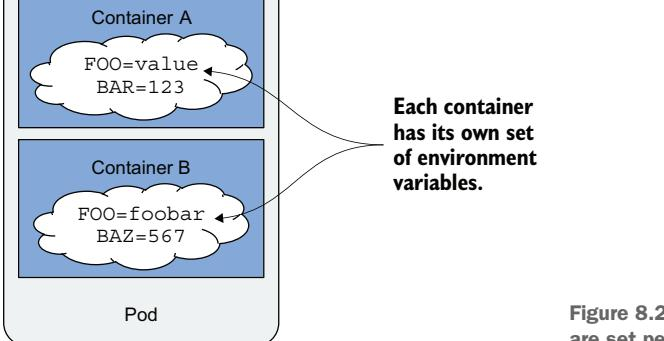
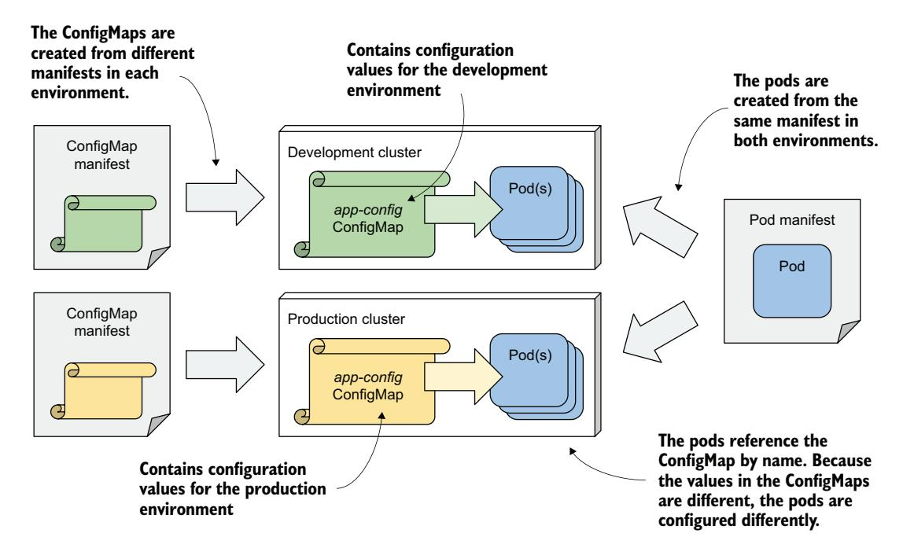

# 第 8 章 使用 ConfigMap 和 Secret 配置应用

!!! tip "本章涵盖"

    - 为容器的主进程设置命令和参数
    - 设置环境变量
    - 将配置存储在 ConfigMap 中
    - 将敏感信息存储在 Secret 中
    - 使用 Downward API 将 Pod 元数据暴露给应用

在前面的章节中，你学习了如何在 Kubernetes 中运行应用进程。现在，你将学习如何配置应用——既可以直接在 Pod 清单中配置，也可以通过 Pod 引用的解耦资源来配置。你还将学习如何将 Pod 元数据注入到 Pod 内容器的环境中。

!!! note ""

    本章的代码文件可在 [https://mng.bz/vZBa](https://mng.bz/vZBa) 获取。

## 8.1 设置命令、参数和环境变量

与常规应用一样，容器化应用可以使用命令行参数、环境变量和文件进行配置。

你已经了解到，容器中执行的命令通常定义在容器镜像中。你在容器的 Dockerfile 中使用 ENTRYPOINT 指令指定命令，使用 CMD 指令指定参数。环境变量也可以通过 ENV 指令指定。如果应用使用配置文件进行配置，这些文件可以通过 COPY 指令添加到容器镜像中。你在前几章中已经见过多个这样的例子。

让我们以 Kiada 应用为例，使其可通过命令行参数和环境变量进行配置。该应用的之前版本都监听 8080 端口。现在让我们通过 `--listen-port` 命令行参数使其可配置。同时，让初始状态消息通过名为 `INITIAL_STATUS_MESSAGE` 的环境变量进行配置。除了返回主机名之外，该应用现在还返回 Pod 名称和 IP 地址，以及它所在集群节点的名称。应用通过环境变量获取这些信息。你可以在本书的代码仓库中找到更新后的代码。这个新版本的容器镜像可在 `docker.io/luksa/kiada:0.4` 获取。

更新后的 Dockerfile（你也可以在代码仓库中找到）如以下清单所示。

清单 8.1 一个使用多种应用配置方法的示例 Dockerfile

```dockerfile
FROM node:12
COPY app.js /app.js
COPY html/ /html
ENV INITIAL_STATUS_MESSAGE="This is the default status message"      # 设置环境变量
ENTRYPOINT ["node", "app.js"]                                        # 设置容器启动时运行的命令
CMD ["--listen-port", "8080"]                                        # 设置默认的命令行参数
```

Dockerfile 中定义的环境变量、命令和参数仅是在你运行容器时不指定任何选项时的默认值。但 Kubernetes 允许你在 Pod 清单中覆盖这些默认值。让我们看看如何操作。

### 8.1.1 设置命令和参数

如前所述，容器的命令和参数使用 Dockerfile 中的 ENTRYPOINT 和 CMD 指令指定。它们各自接受一个数组值。当容器执行时，这两个数组被拼接起来以生成完整的命令。

Kubernetes 提供了两个与这两个指令类似的字段。这两个 Pod 清单字段称为 `command` 和 `args`。你在 Pod 清单的容器定义块中指定它们。与 Docker 一样，这两个字段接受数组值，容器中执行的结果命令是通过拼接这两个数组得到的，如图 8.1 所示。


图 8.1 在 Pod 清单中覆盖命令和参数

编写 Dockerfile 时，你通常使用 ENTRYPOINT 指令指定裸命令，使用 CMD 指令指定参数。这使你可以在不指定命令本身的情况下，使用不同的参数运行容器。但如果需要，你仍然可以覆盖命令。而且你可以在不覆盖参数的情况下做到这一点，因此命令和参数分别放在两个不同的 Dockerfile 指令和 Pod 清单字段中是很棒的设计。

表 8.1 展示了每个 Dockerfile 指令对应的 Pod 清单字段。

| Dockerfile 指令 | Pod 清单字段 | 描述 |
|------------|--------------|-------------------------------------------------------------------------------------------------------------------------------------|
| ENTRYPOINT | command      | 在容器中运行的可执行文件。除可执行文件外可能还包含参数，但通常不包含。 |
| CMD        | args         | 传递给由 ENTRYPOINT 指令或 command 字段指定的命令的附加参数 |

让我们看两个设置 `command` 和 `args` 字段的例子。

**设置命令**

假设你想在启用 CPU 和堆性能分析的情况下运行 Kiada 应用。在 Node.js 中，你可以通过使用 `--cpu-prof` 和 `--heap-prof` 标志运行 `node` 命令来启用性能分析。无需修改 Dockerfile 并重新构建镜像，你可以通过修改 Pod 清单来启用性能分析，如以下清单所示。

清单 8.2 指定了 command 的容器定义

```yaml
kind: Pod
spec:
  containers:
  - name: kiada
    image: luksa/kiada:0.4
    command: ["node", "--cpu-prof", "--heap-prof", "app.js"]  # 当容器启动时，执行此命令而不是容器镜像中定义的命令。
```

当你部署此清单中的 Pod 时，将运行 `node --cpu-prof --heap-prof app.js` 命令，而不是 Dockerfile 中指定的默认命令（`node app.js`）。

正如你在清单中所见，`command` 字段与其 Dockerfile 对应字段一样，接受一个表示要执行命令的字符串数组。当数组只包含少量元素时，清单中使用的数组表示法很好用，但当元素增多时，可读性会变差。在这种情况下，最好使用以下表示法：

```yaml
command:
- node
- --cpu-prof
- --heap-prof
- app.js
```

!!! tip ""

    YAML 解析器可能将某些值解释为字符串以外的类型，这些值必须用引号括起来。这包括数字值（如 1234）和布尔值（如 true 和 false）。不幸的是，YAML 还会将一些常见单词视为布尔值，因此在 `command` 数组中使用这些单词时也必须加引号：`yes`、`no`、`on`、`off`、`y`、`n`、`t`、`f`、`null` 等。

**设置命令参数**

如前所述，命令行参数也可以在 Pod 清单中覆盖。这通过在容器定义的 `args` 字段中完成，如以下清单所示。

清单 8.3 设置了 `args` 字段的容器定义

```yaml
kind: Pod
spec:
  containers:
  - name: kiada
    image: luksa/kiada:0.4
    args: ["--listen-port", "9090"]  # 这会覆盖容器镜像中设置的参数。
```

清单中的 Pod 清单使用 `--listen-port 9090` 覆盖了 Dockerfile 中设置的默认参数 `--listen-port 8080`。当你部署这个 Pod 时，容器中运行的完整命令是 `node app.js --listen-port 9090`。该命令是 Dockerfile 中的 ENTRYPOINT 与 Pod 清单中的 `args` 字段拼接而成的结果。

### 8.1.2 在容器中设置环境变量

容器化应用通常使用环境变量进行配置。与命令和参数一样，你可以为 Pod 中的每个容器设置环境变量，如图 8.2 所示。



图 8.2 环境变量按容器设置

!!! note ""

    在撰写本书时，环境变量只能为每个容器单独设置。无法为整个 Pod 设置一组全局环境变量并让所有容器继承它们。

你可以将环境变量设置为字面值、引用另一个环境变量，或从外部来源获取值。让我们看看如何操作。

**将环境变量设置为字面值**

Kiada 应用的 0.4 版本会显示 Pod 的名称，该名称从环境变量 `POD_NAME` 中读取。它还允许你使用环境变量 `INITIAL_STATUS_MESSAGE` 设置状态消息。让我们在 Pod 清单中设置这两个变量。使用 `env` 字段，如清单 8.4 所示。你可以在文件 `pod.kiada.env-value.yaml` 中找到此 Pod 清单。

清单 8.4 在 Pod 清单中设置环境变量

```yaml
kind: Pod
metadata:
  name: kiada
spec:
  containers:
  - name: kiada
    image: luksa/kiada:0.4
    env:                            # env 字段包含容器的环境变量列表
    - name: POD_NAME                # 环境变量 POD_NAME 被设置为 "kiada"
      value: kiada
    - name: INITIAL_STATUS_MESSAGE  # 这里设置了另一个环境变量
      value: This status message is set in the pod spec.
    ...
```

如清单所示，`env` 字段接受一个条目列表。每个条目指定环境变量的名称及其值。

!!! note ""

    由于环境变量的值必须是字符串，因此必须用引号将非字符串值括起来，以防止 YAML 解析器将其视为字符串以外的类型。如 8.1.1 节所述，这也适用于数字以及 `yes`、`no`、`true`、`false` 等字符串。

!!! tip ""

    你可以通过运行 `kubectl set env pod <pod-name> --list` 命令查看 Pod 中定义的环境变量列表。但这只显示 Pod 清单中定义的环境变量，而不是容器内部的实际变量。

当你部署清单中的 Pod 并向应用发送 HTTP 请求时，你应该会看到在清单中设置的 Pod 名称和状态消息。你也可以运行以下命令检查容器中的环境变量。你将在以下输出中找到这两个环境变量：

```bash
$ kubectl exec kiada -- env
PATH=/usr/local/sbin:/usr/local/bin:/usr/sbin:/usr/bin:/sbin:/bin
HOSTNAME=kiada
NODE_VERSION=12.19.1
YARN_VERSION=1.22.5
POD_NAME=kiada                                                # 在 Pod 清单中设置
INITIAL_STATUS_MESSAGE=This status message is set in the pod spec.  # 在 Pod 清单中设置
KUBERNETES_SERVICE_HOST=10.96.0.1                              # 由 Kubernetes 设置
...
KUBERNETES_SERVICE_PORT=443
```

如你所见，容器中还设置了一些其他变量。它们来自不同的来源——有些定义在容器镜像中，有些由 Kubernetes 添加，其余来自其他渠道。虽然无法知道每个变量来自哪里，但你会学会识别其中一些。例如，Kubernetes 添加的变量与 Service 对象相关，这将在第 11 章中介绍。要确定其余变量的来源，你可以检查 Pod 清单和容器镜像的 Dockerfile。

**内联其他环境变量**

在前面的例子中，你为环境变量 `INITIAL_STATUS_MESSAGE` 设置了一个固定值，但你也可以使用 `$(VAR_NAME)` 语法在值中引用其他环境变量。

例如，你可以在状态消息变量中引用 `POD_NAME` 变量，如以下清单所示，该清单展示了文件 `pod.kiada.env-valueref.yaml` 的部分内容。

清单 8.5 在一个环境变量中引用另一个环境变量

```yaml
env:
- name: POD_NAME
  value: kiada
- name: INITIAL_STATUS_MESSAGE
  value: My name is $(POD_NAME). I run NodeJS version $(NODE_VERSION).
```

**该值包含对 `POD_NAME` 和 `NODE_VERSION` 环境变量的引用。**

请注意，其中一个引用指向清单中定义的 `POD_NAME` 环境变量，而另一个引用指向容器镜像中设置的 `NODE_VERSION` 变量。你在之前容器中运行 `env` 命令时看到了这个变量。当你部署 Pod 时，它返回的状态消息如下：

```
My name is kiada. I run NodeJS version $(NODE_VERSION).
```

如你所见，对 `NODE_VERSION` 的引用未被解析。这是因为你只能使用 `$(VAR_NAME)` 语法引用同一个清单中定义的变量。被引用的变量必须在引用它的变量**之前**定义。由于 `NODE_VERSION` 定义在 Node.js 镜像的 Dockerfile 中，而不是 Pod 清单中，因此无法被解析。

!!! note ""

    如果变量引用无法解析，引用字符串将保持不变。

!!! note ""

    当你希望变量包含字面字符串 `$(VAR_NAME)` 而不希望 Kubernetes 解析它时，请使用双美元符号，即 `$$(VAR_NAME)`。Kubernetes 将移除一个美元符号并跳过变量的解析。

**在命令和参数中使用变量引用**

你不仅可以在其他变量中引用清单中定义的环境变量，还可以在上一节学到的 `command` 和 `args` 字段中引用它们。例如，文件 `pod.kiada.env-value-ref-in-args.yaml` 定义了一个名为 `LISTEN_PORT` 的环境变量并在 `args` 字段中引用它。清单 8.6 展示了该文件的相关部分。

清单 8.6 在 `args` 字段中引用环境变量

```yaml
spec:
  containers:
  - name: kiada
    image: luksa/kiada:0.4
    args:
    - --listen-port
    - $(LISTEN_PORT)  # 解析为下方设置的 LISTEN_PORT 变量
    env:
    - name: LISTEN_PORT
      value: "8080"
```

这不是最好的例子，因为没有充分的理由使用变量引用而不是直接指定端口号。但稍后你将学习如何从外部来源获取环境变量值。然后你可以使用清单中所示的引用将该值注入容器的命令或参数中。

**引用不在清单中的环境变量**

就像在环境变量中使用引用一样，你只能在 `command` 和 `args` 字段中使用 `$(VAR_NAME)` 语法引用 Pod 清单中定义的变量。例如，你无法引用容器镜像中定义的环境变量。

但是，你可以使用另一种方法。如果你通过 shell 运行命令，可以让 shell 解析变量。如果你使用 bash shell，可以使用 `$VAR_NAME` 或 `${VAR_NAME}` 语法（而不是 `$(VAR_NAME)`）来引用变量。请注意花括号和圆括号的区别。

例如，以下清单中的命令正确地打印了 `HOSTNAME` 环境变量的值，即使它不是在 Pod 清单中定义的，而是由操作系统初始化的。你可以在文件 `pod.env-var-references-in-shell.yaml` 中找到这个示例。

清单 8.7 在 shell 命令中引用环境变量

```yaml
containers:
- name: main
  image: alpine
  command:
  - sh
  - -c
  - 'echo "Hostname is $HOSTNAME."; sleep infinity'
```

**此容器中执行的顶层命令是 shell。shell 在执行 echo 和 sleep 命令之前会解析对 `HOSTNAME` 环境变量的引用。**

**设置 Pod 的完全限定域名**

趁我们讨论这个话题，现在是一个好时机来解释 Pod 的主机名和子域名可以在 Pod 清单中配置。默认情况下，主机名与 Pod 的名称相同，但你可以使用 Pod spec 中的 `hostname` 字段覆盖它。你还可以设置 `subdomain` 字段，使得 Pod 的完全限定域名（FQDN）如下：`<hostname>.<subdomain>.<pod namespace>.svc.<cluster domain>`。

这只是 Pod 的内部 FQDN。如果没有额外的步骤（将在第 11 章中解释），它无法通过 DNS 解析。你可以在文件 `pod.kiada.hostname.yaml` 中找到一个为 Pod 指定自定义主机名的示例。

## 8.2 使用 ConfigMap 将配置与 Pod 清单解耦

在上一节中，你学习了如何将配置硬编码直接写入 Pod 清单。虽然这比将配置硬编码在容器镜像中要好得多，但仍然不理想，因为这意味着你可能需要为每个部署 Pod 的环境（如开发、预发布或生产集群）准备不同版本的 Pod 清单。

要在多个环境中复用相同的 Pod 定义，最好将配置与 Pod 清单解耦。一种方法是把配置移到 ConfigMap 对象中，然后在 Pod 中引用它。这就是你接下来要做的事情。

### 8.2.1 ConfigMap 简介

ConfigMap 是一个 Kubernetes API 对象，它仅包含一组键值对。值的范围从短字符串到通常在应用配置文件中出现的大型结构化文本块。Pod 可以引用 ConfigMap 中的一个或多个键值条目。一个 Pod 可以引用多个 ConfigMap，多个 Pod 也可以使用同一个 ConfigMap。

为了保持应用的 Kubernetes 无关性，通常不会让应用通过 Kubernetes REST API 读取 ConfigMap 对象。相反，ConfigMap 中的键值对通过环境变量传递给容器，或通过 ConfigMap 卷挂载为容器文件系统中的文件，如图 8.3 所示。在本章中，我们将重点讨论前者；后者将在下一章中介绍，该章节会讲解几种不同类型的卷。

在上一节中，你学习了如何在命令行参数中引用环境变量。你可以使用这种技术将通过环境变量暴露的 ConfigMap 条目传递到命令行参数中。

无论应用如何消费 ConfigMap，将配置存储在单独的对象（而不是 Pod）中，可以让你通过维护不同的 ConfigMap 清单并将其应用到各自的目标环境，来为不同环境保持不同的配置。由于 Pod 按名称引用 ConfigMap，你可以在所有环境中部署相同的 Pod 清单，并通过使用相同的 ConfigMap 名称在不同环境中仍然拥有不同的配置，如图 8.4 所示。


图 8.3 Pod 通过环境变量和 ConfigMap 卷使用 ConfigMap



图 8.4 在不同环境中部署相同的 Pod 清单和不同的 ConfigMap 清单

### 8.2.2 创建 ConfigMap 对象

让我们创建一个 ConfigMap 并在 Pod 中使用它。下面是一个简单的示例，其中 ConfigMap 包含一个用于 kiada Pod 的环境变量 `INITIAL_STATUS_MESSAGE` 的条目。

**使用 kubectl create configmap 命令创建 ConfigMap**

与 Pod 一样，你可以从 YAML 清单创建 ConfigMap 对象，但更快捷的方法是使用 `kubectl create configmap` 命令，如下所示：

```bash
$ kubectl create configmap kiada-config \
    --from-literal status-message="This status message is set in the kiada-config ConfigMap"
configmap "kiada-config" created
```

!!! note ""

    ConfigMap 中的键只能包含字母数字字符、破折号、下划线和点号。不允许使用其他字符。

运行此命令会创建一个名为 `kiada-config` 的 ConfigMap 对象，其中包含一个条目。键和值通过 `--from-literal` 参数指定。

除了 `--from-literal` 之外，`kubectl create configmap` 命令还支持从文件中获取键值对。表 8.2 解释了可用的方法。

| 选项 | 描述 |
|------|------------------------------------------------------------------------------------------------------------------------------------------------------------------------------------------------------------------------------------------------------------------------------------------------------------------------------------------------|
| --from-literal | 向 ConfigMap 中插入一个键和一个字面值（例如 `--from-literal mykey=myvalue`）。 |
| --from-file | 将一个文件的内容插入 ConfigMap。行为取决于 `--from-file` 后面的参数。 |
| | 如果只指定文件名（例如 `--from-file myfile.txt`），文件的基本名称用作键，文件的全部内容用作值。 |
| | 如果指定 `key=file`（例如 `--from-file mykey=myfile.txt`），文件的内容存储在指定的键下。 |
| | 如果文件名表示一个目录，目录中包含的每个文件都作为单独的条目包含在内。文件的基本名称用作键，文件的内容用作值。子目录、符号链接、设备、管道以及基本名称不是有效 ConfigMap 键的文件将被忽略。 |
| --from-env-file | 将指定文件的每一行作为单独的条目插入（例如 `--from-env-file myfile.env`）。文件必须包含格式为 `key=value` 的行。 |

ConfigMap 通常包含多个条目。你可以多次重复 `--from-literal`、`--from-file` 和 `--from-env-file` 参数。你也可以组合使用 `--from-literal` 和 `--from-file`，但在撰写本书时，你无法将它们与 `--from-env-file` 组合使用。

**从 YAML 清单创建 ConfigMap**

另外，你也可以从 YAML 清单文件创建 ConfigMap。清单 8.8 展示了等效清单文件 `cm.kiada-config.yaml` 的内容，该文件可在代码仓库中获取。你可以通过使用 `kubectl apply` 应用此文件来创建 ConfigMap。

清单 8.8 一个 ConfigMap 清单文件

```yaml
apiVersion: v1            # 此清单定义了一个 ConfigMap 对象。
kind: ConfigMap
metadata:
  name: kiada-config       # 此 ConfigMap 的名称
data:                      # 键值对在 data 字段中指定。
  status-message: This status message is set in the kiada-config ConfigMap
```

**从文件创建 ConfigMap**

如表 8.2 所述，你还可以使用 `kubectl create configmap` 命令从文件创建 ConfigMap。这次，你将学习如何使用此命令来生成 ConfigMap 的 YAML 清单，而不是直接在集群中创建 ConfigMap，这样你就可以将其存储在版本控制系统中，与 Pod 清单一起管理。以下命令从 `dummy.txt` 和 `dummy.bin` 文件生成一个名为 `dummy-config` 的 ConfigMap，并将其存储在名为 `dummy-configmap.yaml` 的文件中。

```bash
$ kubectl create configmap dummy-config \
    --from-file=dummy.txt \
    --from-file=dummy.bin \
    --dry-run=client -o yaml > dummy-configmap.yaml
```

该 ConfigMap 将包含两个条目，每个文件一个。一个是文本文件，另一个只是一些随机数据，用于演示二进制数据也可以存储在 ConfigMap 中。

使用 `--dry-run` 选项时，该命令不会在 Kubernetes API 服务器中创建对象，而只是生成对象定义。`-o yaml` 选项将对象的 YAML 定义打印到标准输出，然后重定向到 `dummy-configmap.yaml` 文件。以下清单显示了该文件的内容。

清单 8.9 从两个文件创建的 ConfigMap 清单

```yaml
apiVersion: v1
binaryData:
  dummy.bin: n2VW39IEkyQ6Jxo+rdo5J06Vi7cz5...  # dummy.bin 文件的 Base64 编码内容
data:
  dummy.txt: |                                      # dummy.txt 文件的内容
    This is a text file with multiple lines
    that you can use to test the creation of
    a ConfigMap in Kubernetes.
kind: ConfigMap
metadata:
  creationTimestamp: null
  name: kiada-envoy-config                           # 此 ConfigMap 的名称
```

如清单所示，二进制文件最终出现在 `binaryData` 字段中。如果 ConfigMap 条目包含非 UTF-8 字节序列，则必须在 `binaryData` 字段中定义。`kubectl create configmap` 命令会自动确定将条目放在哪里。`binaryData` 字段中的值是 Base64 编码的，这也是 YAML 和 JSON 中表示二进制值的方式。

相比之下，`dummy.txt` 文件的内容在 `data` 字段中清晰可见。在 YAML 中，你可以使用管道字符和适当的缩进来指定多行值。有关更多方法，请参阅 YAML.org 上的 YAML 规范。

**创建 ConfigMap 清单时注意空白卫生**

从文件创建 ConfigMap 时，请确保文件中没有行尾包含尾随空白。如果任何行以空白结尾，ConfigMap 条目将被格式化为带引号的字符串，这使得阅读变得更加困难。

比较以下 ConfigMap 中两个值的格式：

```bash
$ kubectl create configmap dummy-config \
    --from-file=dummy.yaml \
    --from-file=dummy-bad.yaml \
    --dry-run=client -o yaml
apiVersion: v1
data:
  dummy-bad.yaml: dummy: \n name: dummy-bad.yaml\n note: This
    file has a space at the end of the first line.        # 从包含尾随空白的文件创建的条目
  dummy.yaml: |                                            # 从格式良好的文件创建的条目
    dummy:
    name: dummy.yaml
    note: This file is correctly formatted with no trailing spaces.
kind: ConfigMap
metadata:
  creationTimestamp: null
  name: dummy-config
```

请注意，文件 `dummy-bad.yaml` 在第一行末尾有一个多余的空格。这导致 ConfigMap 条目以不太友好的格式显示。相比之下，`dummy.yaml` 文件没有尾随空白，并以未转义的多行字符串形式显示，这使得它易于阅读和原地修改。

**列出 ConfigMap 并显示其内容**

ConfigMap 是 Kubernetes API 对象，与 Pod、节点以及你目前学到的其他资源并存。你可以使用各种 `kubectl` 命令对它们执行 CRUD 操作。例如，你可以使用以下命令列出 ConfigMap：

```bash
$ kubectl get cm
```

!!! note ""

    ConfigMap 的简写是 `cm`。

你可以通过指示 `kubectl` 打印 ConfigMap 的 YAML 清单来显示 ConfigMap 中的条目：

```bash
$ kubectl get cm kiada-config -o yaml
```

!!! note ""

    由于 YAML 字段按字母顺序输出，你会发现 `data` 字段位于输出的顶部。

!!! tip ""

    要仅显示键值对，可以将 `kubectl` 与 `jq` 结合使用——例如 `kubectl get cm kiada-config -o json | jq .data`。显示给定条目的值如下：`kubectl... | jq '.data["status-message"]'`。

### 8.2.3 将 ConfigMap 值注入环境变量

在上一节中，你创建了 `kiada-config` ConfigMap。让我们在 kiada Pod 中使用它。

**注入单个 ConfigMap 条目**

要将单个 ConfigMap 条目注入环境变量，你只需将环境变量定义中的 `value` 字段替换为 `valueFrom` 字段，并引用 ConfigMap 条目。以下清单展示了 Pod 清单的相关部分。完整的清单可以在文件 `pod.kiada.env-valueFrom.yaml` 中找到。

清单 8.10 从 ConfigMap 条目设置环境变量

```yaml
kind: Pod
...
spec:
  containers:
  - name: kiada
    env:
    - name: INITIAL_STATUS_MESSAGE        # 你正在设置环境变量 INITIAL_STATUS_MESSAGE
      valueFrom:                          # 不是使用固定值，而是从 ConfigMap 键获取值
        configMapKeyRef:
          name: kiada-config              # 包含该值的 ConfigMap 的名称
          key: status-message             # 你引用的 ConfigMap 键
          optional: true                  # 即使 ConfigMap 或键不存在，容器也可以运行
    volumeMounts:
    - ...
```

你不是为变量指定固定值，而是声明该值应从 ConfigMap 中获取。`name` 字段指定 ConfigMap 名称，`key` 字段指定该映射中的键。

从此清单创建 Pod 并使用以下命令检查其环境变量：

```bash
$ kubectl exec kiada -- env
...
INITIAL_STATUS_MESSAGE=This status message is set in the kiada-config
    ConfigMap
...
```

当你通过 curl 或浏览器访问时，状态消息也应出现在 Pod 的响应中。

**将引用标记为可选**

在上一个清单中，对 ConfigMap 键的引用被标记为可选，这样即使 ConfigMap 或键不存在，容器也可以执行。在这种情况下，环境变量不会被设置。你可以将此引用标记为可选，因为 Kiada 应用在没有它的情况下也能正常运行。你可以删除 ConfigMap 并再次部署 Pod 来确认这一点。

!!! note ""

    如果容器定义中引用的 ConfigMap 或键缺失且未标记为可选，Pod 仍将被正常调度，Pod 中的其他容器也正常启动。引用缺失 ConfigMap 键的容器将被阻止启动，直到你创建包含引用键的 ConfigMap。

**注入整个 ConfigMap**

容器定义中的 `env` 字段接受一个名称-值对列表，因此你可以根据需要设置任意数量的环境变量。但是，当你想设置多个变量时，逐个指定它们可能变得繁琐且容易出错。幸运的是，使用 `envFrom` 字段而不是 `env` 字段可以让你一次性注入 ConfigMap 中的所有条目。

这种方法的缺点是你失去了将键转换为环境变量名称的能力，因此键必须已经是合适的格式。你唯一能做的转换是在每个键前面添加一个前缀。

例如，Kiada 应用读取的环境变量是 `INITIAL_STATUS_MESSAGE`，但你在 ConfigMap 中使用的键是 `status-message`。如果你希望在使用 `envFrom` 字段时应用能读取到它，你必须将 ConfigMap 键更改为与环境变量名称匹配。我已经在 `cm.kiada-config.envFrom.yaml` 文件中完成了这一更改。除了 `INITIAL_STATUS_MESSAGE` 键之外，它还包含另外两个键，以演示它们都将被注入到容器的环境中。

通过运行以下命令将 ConfigMap 替换为文件中的版本：

```bash
$ kubectl replace -f cm.kiada-config.envFrom.yaml
```

文件 `pod.kiada.envFrom.yaml` 中的 Pod 清单使用 `envFrom` 字段将整个 ConfigMap 注入到 Pod 中。清单 8.11 展示了该清单的相关部分。

清单 8.11 使用 `envFrom` 将整个 ConfigMap 注入环境变量

```yaml
kind: Pod
...
spec:
  containers:
  - name: kiada
    envFrom:                    # 使用 envFrom 而不是 env 来注入整个 ConfigMap
    - configMapRef:             # 要注入的 ConfigMap 的名称。与之前不同，这里不指定键。
        name: kiada-config
    optional: true              # 即使 ConfigMap 不存在，容器也应运行。
```

与之前的示例不同，这里不需要同时指定 ConfigMap 名称和键，只需指定名称即可。如果你从此清单创建 Pod 并检查其环境，你会发现它包含 `INITIAL_STATUS_MESSAGE` 变量以及 ConfigMap 中定义的其他两个键。

与 `configMapKeyRef` 一样，`configMapRef` 允许你将引用标记为可选，允许容器在 ConfigMap 不存在的情况下运行。默认情况下并非如此。引用 ConfigMap 的容器会被阻止启动，直到引用的 ConfigMap 存在为止。

**注入多个 ConfigMap**

你可能在清单 8.11 中注意到，`envFrom` 字段接受一个值列表，这意味着你可以组合来自多个 ConfigMap 的条目。如果两个 ConfigMap 包含相同的键，后者优先。你也可以将 `envFrom` 字段与 `env` 字段组合使用，例如，注入一个 ConfigMap 的所有条目和另一个 ConfigMap 的特定条目。

!!! note ""

    当环境变量在 `env` 字段中配置时，它优先于在 `envFrom` 字段中设置的环境变量。

**为键添加前缀**

无论你是注入单个 ConfigMap 还是多个 ConfigMap，你都可以为每个 ConfigMap 设置一个可选的前缀。当它们的条目被注入到容器的环境中时，前缀会被添加到每个键前面以生成环境变量名称。

### 8.2.4 更新和删除 ConfigMap

与大多数 Kubernetes API 对象一样，你可以随时通过修改清单文件并使用 `kubectl apply` 重新应用到集群来更新 ConfigMap。还有一种更快捷的方法，主要在开发期间使用。

**使用 kubectl edit 原地编辑 API 对象**

当你想要快速更改 API 对象（例如 ConfigMap）时，可以使用 `kubectl edit` 命令。例如，要编辑 `kiada-config` ConfigMap，请运行以下命令：

```bash
$ kubectl edit configmap kiada-config
```

这将在你的默认文本编辑器中打开对象清单，允许你直接更改对象。当你关闭编辑器时，`kubectl` 会将你的更改提交到 Kubernetes API。

!!! tip ""

    如果你更喜欢以 JSON 格式而不是 YAML 格式编辑对象清单，请使用 `-o json` 选项运行 `kubectl edit` 命令。

**将 kubectl edit 配置为使用不同的文本编辑器**

你可以通过设置 `KUBE_EDITOR` 环境变量来告诉 `kubectl` 使用你选择的文本编辑器。例如，如果你想使用 nano 编辑 Kubernetes 资源，请执行以下命令（或将其放入 `~/.bashrc` 或等效文件中）：

```bash
export KUBE_EDITOR="/usr/bin/nano"
```

如果未设置 `KUBE_EDITOR` 环境变量，`kubectl edit` 将回退到使用默认编辑器，通常通过 `EDITOR` 环境变量配置。

**修改 ConfigMap 时会发生什么**

当你更新 ConfigMap 时，现有 Pod 中的环境变量值**不会**更新。但是，如果容器重新启动（无论是由于崩溃还是由于存活探针失败而被外部终止），新容器将使用新值。这就引发了一个问题：你是否希望这种行为。让我们看看原因。

!!! note ""

    在下一章中，你将了解到，当 ConfigMap 条目在容器中作为文件（而不是环境变量）暴露时，它们**会**在所有引用该 ConfigMap 的运行容器中更新。无需重新启动容器。

**理解更新 ConfigMap 的后果**

容器最重要的特性之一是其不可变性，这让你能够确保同一容器（或 Pod）的多个实例之间没有差异。那么，这些实例获取配置的 ConfigMap 不也应该不可变吗？

让我们花点时间思考一下。如果你更改了用于向应用注入环境变量的 ConfigMap，会发生什么？你对 ConfigMap 所做的更改不会影响任何正在运行的应用实例。但是，如果其中一些实例被重新启动，或者你创建了额外的实例，它们将使用新的配置。

你最终会得到配置不同的 Pod，这可能导致系统的某些部分行为与其他部分不同。在决定是否允许在运行中的 Pod 使用 ConfigMap 时更改其内容时，你需要考虑这一点。

**阻止 ConfigMap 被更新**

为防止用户更改 ConfigMap 中的值，你可以将 ConfigMap 标记为不可变，如以下清单所示。

清单 8.12 创建一个不可变的 ConfigMap

```yaml
apiVersion: v1
kind: ConfigMap
metadata:
  name: my-immutable-configmap
data:
  mykey: myvalue
  another-key: another-value
immutable: true   # 这可以阻止此 ConfigMap 的值被更新。
```

如果有人尝试更改不可变 ConfigMap 中的 `data` 或 `binaryData` 字段，API 服务器将阻止此操作。这确保了使用此 ConfigMap 的所有 Pod 都使用相同的配置值。如果你想运行一组使用不同配置的 Pod，通常的做法是创建一个新的 ConfigMap 并在这些新 Pod 中使用它。

不可变 ConfigMap 不仅可以防止用户意外更改应用配置，还有助于提高 Kubernetes 集群的性能。当 ConfigMap 被标记为不可变时，工作节点上的 kubelet 不需要收到 ConfigMap 对象更改的通知。这减少了 API 服务器的负载。

**删除 ConfigMap**

可以使用 `kubectl delete` 命令删除 ConfigMap 对象。引用该 ConfigMap 的运行中的 Pod 将继续不受影响地运行，但仅在其容器必须重新启动之前。如果容器定义中的 ConfigMap 引用未标记为可选，容器将无法运行。

## 8.3 使用 Secret 向容器传递敏感数据

在上一节中，你学习了如何将配置数据存储在 ConfigMap 对象中并通过环境变量提供给应用。你可能认为也可以使用 ConfigMap 来存储凭据和加密密钥等敏感数据，但这并非最佳做法。对于需要安全保管的任何数据，Kubernetes 提供了另一种对象类型——**Secret**。

### 8.3.1 Secret 简介

Secret 与 ConfigMap 并没有太大区别，它们也包含键值对，并且可以用于将环境变量和文件注入容器。那么为什么我们还需要 Secret 呢？

事实上，Secret 比 ConfigMap 引入得更早。然而，最初的 Secret 在存储纯文本数据时对用户并不友好，因为 Secret 中的值是 Base64 编码的。你甚至需要在将其放入 YAML 清单之前自己编码值。出于这个原因，ConfigMap 后来被引入。随着时间的推移，Secret 和 ConfigMap 都发展到同时支持纯文本和二进制 Base64 编码的数据。这两种对象类型提供的功能逐渐趋同。如果它们现在才被添加，我肯定它们会作为一种对象类型引入。但是，由于它们各自逐渐演变，两者之间存在一些差异。

**ConfigMap 和 Secret 之间的字段差异**

Secret 的结构与 ConfigMap 略有不同。表 8.3 展示了这两种对象类型中的字段。

| Secret 字段 | ConfigMap 字段 | 描述 |
|------------|------------|------------------------------------------------------------------------------------------------------------------------------|
| data       | binaryData | 键值对映射。值是 Base64 编码的字符串。 |
| stringData | data       | 键值对映射。值是纯文本字符串。Secret 中的 `stringData` 字段是只写的。 |
| immutable  | immutable  | 一个布尔值，指示对象中存储的数据是否可以更新。 |
| type       | 无          | 一个表示 Secret 类型的字符串。可以是任意字符串值，但几种内置类型有特殊要求。 |

表 8.3 Secret 和 ConfigMap 结构的差异

从表中可以看出，Secret 中的 `data` 字段对应于 ConfigMap 中的 `binaryData` 字段。它可以包含二进制值作为 Base64 编码的字符串。Secret 中的 `stringData` 字段等价于 ConfigMap 中的 `data` 字段，用于存储纯文本值。

!!! note ""

    `data` 字段中的值必须进行 Base64 编码，因为 YAML 和 JSON 格式本身不支持二进制数据。但是，这些二进制值仅在清单中进行编码。当你将 Secret 注入容器时，Kubernetes 会在初始化环境变量或将值写入文件之前解码这些值。因此，运行在容器中的应用程序可以读取这些值的原始未编码形式。

Secret 中的 `stringData` 字段是只写的。你可以使用它向 Secret 添加纯文本值，而无需手动编码它们。当你从 API 获取 Secret 对象时，它不包含 `stringData` 字段。你添加到该字段的任何内容现在都会以 Base64 编码字符串的形式出现在 `data` 字段中。这与 ConfigMap 中的 `data` 和 `binaryData` 字段的行为不同。无论你向 ConfigMap 的哪个字段添加键值对，它都会物理地存储在该字段中，并在你从 API 读回 ConfigMap 对象时出现在那里。

与 ConfigMap 一样，可以通过将 `immutable` 字段设置为 `true` 将 Secret 标记为不可变。虽然 ConfigMap 没有类型，但 Secret 有；它通过 `type` 字段指定。该字段主要用于对 Secret 的编程式处理。你可以将它设置为任意值，但有几种内置类型具有特定的语义。

**理解内置的 Secret 类型**

当你创建 Secret 并将其 `type` 设置为一种内置类型时，它必须满足为该类型定义的要求，因为它们被各种 Kubernetes 组件使用，这些组件期望 Secret 包含特定键下的特定格式的值。表 8.4 解释了撰写本书时存在的内置 Secret 类型。

| 内置 Secret 类型 | 描述 |
|----------------------------------------|--------------------------------------------------------------------------------------------------------------------------------------------------------------------------------------------------------------------------------------------------------------------------------------------------|
| Opaque | 此类型的 Secret 可以包含存储在任意键下的秘密数据。如果你创建 Secret 时没有设置 `type` 字段，则会创建一个 Opaque Secret。 |
| bootstrap.kubernetes.io/token | 此类型的 Secret 用于启动新集群节点时使用的令牌。 |
| kubernetes.io/basic-auth | 此类型的 Secret 存储基本认证所需的凭据。它必须包含 `username` 和 `password` 键。 |
| kubernetes.io/dockercfg | 此类型的 Secret 存储访问 Docker 镜像仓库所需的凭据。它必须包含一个名为 `.dockercfg` 的键，其值是旧版本 Docker 使用的 `~/.dockercfg` 配置文件的内容。 |
| kubernetes.io/dockerconfigjson | 与上述类型类似，此类型的 Secret 存储用于访问 Docker 仓库的凭据，但使用较新的 Docker 配置文件格式。该 Secret 必须包含一个名为 `.dockerconfigjson` 的键。其值必须是 Docker 使用的 `~/.docker/config.json` 文件的内容。 |
| kubernetes.io/service-account-token | 此类型的 Secret 存储一个用于标识 Kubernetes 服务账户的令牌。 |
| kubernetes.io/ssh-auth | 此类型的 Secret 存储用于 SSH 认证的私钥。私钥必须存储在 Secret 中键为 `ssh-privatekey` 的条目下。 |
| kubernetes.io/tls | 此类型的 Secret 存储 TLS 证书和关联的私钥。它们必须分别存储在 Secret 中键为 `tls.crt` 和 `tls.key` 的条目下。 |

**理解 Kubernetes 如何存储 Secret 和 ConfigMap**

除了 ConfigMap 或 Secret 中字段名称的微小差异外，Kubernetes 对它们的处理方式也不同。Secret 在所有 Kubernetes 组件中都以特定方式处理，以提高其安全性。例如，Kubernetes 确保 Secret 中的数据仅分发到运行需要该 Secret 的 Pod 的节点。此外，工作节点上的 Secret 始终存储在内存中，从不写入物理存储。这降低了敏感数据泄露的可能性。

因此，将敏感数据仅存储在 Secret 中而不是 ConfigMap 中非常重要。

### 8.3.2 创建 Secret

在 8.2 节中，你使用 ConfigMap 设置了 `INITIAL_STATUS_MESSAGE` 环境变量。现在假设这个值表示敏感数据。与其将其存储在 ConfigMap 中，不如将其存储在 Secret 中。

**使用 kubectl create secret 创建通用（Opaque）Secret**

与 ConfigMap 一样，你可以使用 `kubectl create` 命令创建 Secret。结果 Secret 中的条目是相同的；唯一的区别在于它的类型。以下是创建 Secret 的命令：

```bash
$ kubectl create secret generic kiada-secret-config \
    --from-literal status-message="This status message is set in the kiada-secret-config Secret"
secret "kiada-secret-config" created
```

与创建 ConfigMap 不同，你必须在 `kubectl create secret` 之后立即指定 Secret 类型。这里你创建的是一个通用 Secret。

!!! note ""

    与 ConfigMap 一样，Secret 的最大大小约为 1MB。

**从 YAML 清单创建 Secret**

`kubectl create secret` 命令直接在集群中创建 Secret，但由于 Secret 是 Kubernetes API 对象，你也可以从 YAML 清单创建它们。

出于显而易见的安全原因，为你的 Secret 创建 YAML 清单并将其存储在版本控制系统中并不是最好的主意，这与 ConfigMap 不同。因此，你将比创建 ConfigMap 更频繁地使用 `kubectl create secret` 命令来创建 Secret。但是，如果你需要创建 YAML 清单而不是直接创建 Secret，你可以再次使用在 8.2.2 节中学到的 `kubectl create --dry-run=client -o yaml` 技巧。

假设你想创建一个包含用户凭据的 Secret YAML 清单，使用键 `user` 和 `pass`。你可以使用以下命令来创建 YAML 清单：

```bash
$ kubectl create secret generic my-credentials \    # 创建一个通用 Secret
    --from-literal user=my-username \               # 将凭据存储在键 user 和 pass 中
    --from-literal pass=my-password \
    --dry-run=client -o yaml                        # 打印 YAML 清单，而不是将 Secret 提交到 API 服务器
apiVersion: v1
data:
  pass: bXktcGFzc3dvcmQ=      # Base64 编码的凭据
  user: bXktdXNlcm5hbWU=
kind: Secret
metadata:
  creationTimestamp: null
  name: my-credentials
```

使用此处所示的 `kubectl create` 技巧创建清单要比从头开始创建并手动输入 Base64 编码的凭据容易得多。另外，你还可以通过使用 `stringData` 字段来避免对条目进行编码，如下所述。

**使用 stringData 字段**

由于并非所有敏感数据都是二进制形式的，Kubernetes 还允许你通过使用 `stringData` 字段（而不是 `data` 字段）在 Secret 中指定纯文本值。以下清单展示了如何创建与前一个示例相同的 Secret。

清单 8.13 使用 `stringData` 字段向 Secret 添加纯文本条目

```yaml
apiVersion: v1
kind: Secret
stringData:             # stringData 字段用于输入纯文本值而无需编码。这些凭据没有使用 Base64 编码。
  user: my-username
  pass: my-password
```

`stringData` 字段是只写的，只能用于设置值。如果你创建此 Secret 并使用 `kubectl get -o yaml` 读回它，`stringData` 字段将不再存在。相反，你在其中指定的任何条目都将作为 Base64 编码的值显示在 `data` 字段中。

!!! tip ""

    由于 Secret 中的条目始终以 Base64 编码值的形式表示，因此处理 Secret（尤其是读取它们）不如处理 ConfigMap 那样友好，因此请尽可能使用 ConfigMap。但你永远不应该为了方便而牺牲安全性。

**创建 TLS Secret**

前几章中的 `kiada-ssl` Pod 在边车容器中运行 Envoy 代理。该代理需要 TLS 证书和私钥才能运行。证书和私钥存储在容器镜像中，正如我们已经讨论过的，这并不理想。存储证书和私钥的更好位置是 Secret。然后你可以将证书和私钥作为环境变量或文件传递给代理，正如你将在下一章中看到的。

既然我们正在讨论创建 Secret，让我们现在就学习如何创建这个 Secret，即使你要到下一章才会使用它。要创建它，请运行以下命令：

```bash
$ kubectl create secret tls kiada-tls \    # 创建一个名为 kiada-tls 的 TLS Secret
    --cert example-com.crt \               # 证书文件的路径
    --key example-com.key                  # 私钥文件的路径
```

此命令指示 `kubectl` 创建一个名为 `kiada-tls` 的 TLS Secret。证书和私钥分别从文件 `example-com.crt` 和 `example-com.key` 中读取。生成的 Secret 应该与文件 `secret.kiada-tls.yaml` 中的清单非常相似。

**创建 Docker 仓库 Secret**

你可以使用 `kubectl create secret` 命令创建的最后一个 Secret 类型是 Docker 仓库 Secret，它将允许你从私有容器仓库拉取镜像。你可能已经注意到，当你将容器镜像推送到私有容器仓库时，Kubernetes 无法启动使用该镜像的容器的 Pod。这是因为 Kubernetes 没有从仓库拉取私有镜像所需的凭据。为了允许它这样做，你必须创建一个拉取 Secret 并在 Pod 清单中引用它。

以下是创建该 Secret 的方法：

```bash
$ kubectl create secret docker-registry pull-secret \
    --docker-server=<your-container-registry-server> \
    --docker-username=<your-name> \
    --docker-password=<your-password> \
    --docker-email=<your-email>
```

你也可以从本地 `$HOME/.docker/config.json` 文件的内容创建拉取 Secret。你可以使用以下命令执行此操作：

```bash
$ kubectl create secret docker-registry \
    --from-file $HOME/.docker/config.json
```

Secret 创建后，你可以在任何需要它与容器仓库进行身份验证的 Pod 中引用它。你通过 Pod 清单中 `spec.imagePullSecrets` 字段中的名称引用该 Secret，如以下清单所示：

清单 8.14 向 Pod 添加拉取 Secret

```yaml
apiVersion: v1
kind: Pod
metadata:
  name: private-image
spec:
  imagePullSecrets:                         # 你在这里指定 Docker 仓库 Secret 的名称。
  - name: pull-secret
  containers:                               # Kubernetes 使用拉取 Secret 中的凭据来为此容器拉取私有镜像。
  - name: private
    image: docker.io/me/my-private-image
```

### 8.3.3 在容器中使用 Secret

如前所述，你可以像使用 ConfigMap 一样在容器中使用 Secret——你可以使用它们来设置环境变量或在容器的文件系统中创建文件。你将在下一章中学习后者，因此这里我们只讨论前一种方法。

**将 Secret 注入环境变量**

要将 Secret 的条目注入环境变量，请使用 `valueFrom.secretKeyRef` 字段，如以下清单所示，该清单展示了文件 `pod.kiada.env-valueFrom-secretKeyRef.yaml` 中清单的部分内容。

清单 8.15 将 Secret 中的数据作为环境变量暴露

```yaml
containers:
- name: kiada
  env:
  - name: INITIAL_STATUS_MESSAGE
    valueFrom:                       # 该值从 Secret 中获取。
      secretKeyRef:
        name: kiada-secret-config   # 包含该键的 Secret 的名称
        key: status-message          # 与你要初始化为环境变量的值关联的键
```

除了使用 `env.valueFrom`，你也可以使用 `envFrom` 来注入整个 Secret，而不是逐个注入其条目，正如你在 8.2.3 节中所做的那样。你将使用 `secretRef` 字段而不是 `configMapRef`。

**你应该将 Secret 注入环境变量吗？**

如你所见，将 Secret 注入环境变量与注入 ConfigMap 没有区别。但即使 Kubernetes 允许你以这种方式暴露 Secret，这可能不是最好的主意，因为它可能带来安全风险。应用程序通常会在错误报告中输出环境变量，甚至在启动时将环境变量写入应用程序日志，因此将 Secret 注入环境变量可能会无意中暴露它们。此外，子进程会从父进程继承所有环境变量。因此，如果你的应用程序调用第三方子进程，你的秘密信息可能会被泄露。

更好的方法是通过文件将 Secret 注入容器，如下一章所述。

!!! tip ""

    不要将 Secret 注入环境变量，而是将它们作为 Secret 卷中的文件投射到容器中。这降低了 Secret 被无意中暴露给攻击者的可能性。

### 8.3.4 理解为什么 Secret 并不总是安全的

尽管使用 Secret 存储敏感数据比将其存储在 ConfigMap 中更好，但重要的是要理解 Secret 并不像人们想象的那么安全。真正的安全挑战在于控制谁可以访问这些 Secret 以及它们如何被存储。

**Secret 清单中的值是编码的，而非加密的**

一个常见的误解是 Secret 中的值是加密的，事实并非如此。如前所述，它们是 Base64 编码的字符串——这是一种编码方法，而非加密。任何能够访问 Secret 的人都可以轻松解码并读取底层的敏感数据。

**Secret 可能以未加密的形式存储**

Secret 与其他所有资源一起存储在 etcd 中，即 Kubernetes API 服务器背后的键值存储中。除非启用加密，否则 Secret 会以未加密的形式存储在磁盘上。如果攻击者直接获得了对此磁盘或 etcd 的访问权限，他们就可以看到你的所有 Secret。

**其他用户可能通过 Kubernetes API 读取 Secret**

对 Secret 和其他 Kubernetes API 资源的访问由 RBAC（基于角色的访问控制）控制。RBAC 规则的错误配置或过于宽松的用户角色可能会无意中将 Secret 暴露给未经授权的用户。此外，一旦 Secret 被注入到 Pod 中，无论是作为环境变量还是文件，如果 Pod 中的应用被攻破，敏感数据就可能泄露。我已经提到过，应用程序将其环境变量写入日志的简单操作就很容易导致秘密信息泄露。

**Secret 不会自动轮换**

提高身份验证令牌和其他 Secret 安全性的一种方法是定期自动轮换它们。Kubernetes Secret 不提供任何此类功能，除非在关联的 Secret 被更新时自动更新 Secret 卷中的文件。你必须手动轮换 Secret 中的秘密信息。

**使用外部 Secret 管理工具增强 Secret 安全性**

针对上述问题的推荐解决方案是使用专门的外部 Secret 管理工具（如 HashiCorp Vault）来补充 Kubernetes Secret。这些系统提供强大的加密功能、细粒度的访问控制、自动的 Secret 轮换、详细的审计日志以及动态 Secret 生成。然而，这个话题超出了本书的范围，请参阅这些工具的文档以获取更多信息。

## 8.4 通过 Downward API 向容器暴露元数据

到目前为止，你学习了如何将配置数据传递给应用。但这些数据始终是静态的。这些值在你部署 Pod 之前就已知道，如果你部署多个相同 Pod 的副本，它们都会使用相同的值。

但是，对于那些在 Pod 被创建并调度到集群节点之前无法得知的数据呢？例如 Pod 的 IP 地址、集群节点的名称，甚至是 Pod 本身的名称？还有那些已在 Pod 清单中其他地方指定的数据，例如分配给容器的 CPU 和内存量呢？作为一名工程师，你通常不希望重复编写代码；Kubernetes 清单中的信息也是如此。

### 8.4.1 Downward API 简介

在本书的剩余章节中，你将学习到可以在 Pod 清单中设置的其他几个配置选项。在某些情况下，你需要将相同的信息传递给应用。你可以在定义容器的环境变量时重复这些信息，但更好的选择是使用所谓的 Kubernetes **Downward API**，它允许你通过环境变量或文件将 Pod 和容器的元数据注入到容器中。

**理解 Downward API 是什么**

Downward API 并不是你的应用需要调用以获取数据的 REST 端点。它只是一种将 Pod 清单的 `metadata`、`spec` 或 `status` 字段中的值**向下**注入到容器中的方式。名字由此而来。图 8.5 展示了 Downward API 的示意图。


图 8.5 Downward API 通过环境变量或文件暴露 Pod 元数据

如你所见，这与从 ConfigMap 和 Secret 设置环境变量或投射文件没有什么不同，只是这些值来自 Pod 对象本身。

**理解元数据是如何注入的**

在本章前面，你学习了可以使用 `valueFrom` 字段从外部来源初始化环境变量。要从 ConfigMap 获取值，使用 `configMapKeyRef` 字段；要从 Secret 获取值，使用 `secretKeyRef` 字段。要通过 Downward API 获取值，根据你想注入的信息类型，使用 `fieldRef` 或 `resourceFieldRef` 字段。`fieldRef` 用于引用 Pod 的通用元数据，而 `resourceFieldRef` 用于引用容器的计算资源约束。

另外，你也可以通过向 Pod 添加 `downwardAPI` 卷，将 Pod 元数据作为文件投射到容器的文件系统中，就像添加 `configMap` 或 `secret` 卷一样。你将在下一章中学习如何操作。让我们看看你可以注入哪些信息。

**理解哪些元数据可以注入**

你无法使用 Downward API 注入 Pod 对象中的任意字段。只有特定字段受支持。表 8.5 展示了可以通过 `fieldRef` 注入的字段，以及它们是否只能通过环境变量、文件，或两者都支持。

| 字段 | 描述 | 环境变量支持 | 卷支持 |
|-------------------------------------|-----------------------------------------------------------------------|-------------------|----------------------|
| metadata.name                       | Pod 的名称 | 是               | 是                  |
| metadata.namespace                  | Pod 的命名空间 | 是               | 是                  |
| metadata.uid                        | Pod 的 UID | 是               | 是                  |
| metadata.labels                     | Pod 的所有标签，每行一个，格式为 `key="value"` | 否                | 是                  |
| metadata.labels['key']              | 指定标签的值 | 是               | 是                  |
| metadata.annotations                | Pod 的所有注解，每行一个，格式为 `key="value"` | 否                | 是                  |
| metadata.annotations['key']         | 指定注解的值 | 是               | 是                  |
| spec.nodeName                       | Pod 运行的工作节点的名称 | 是               | 否                   |
| spec.serviceAccountName             | Pod 的服务账户名称 | 是               | 否                   |
| status.podIP 和 status.podIPs       | Pod 的 IP 地址（一个或多个） | 是               | 否                   |
| status.hostIP 和 status.hostIPs     | 工作节点的 IP 地址（一个或多个） | 是               | 否                   |

表 8.5 通过 `fieldRef` 字段注入的 Downward API 字段

如你所见，某些字段只能注入到环境变量中，而另一些只能投射到文件中，还有一些两者都支持。

关于容器计算资源约束的信息通过 `resourceFieldRef` 字段注入。它们都可以注入到环境变量中，也都可以通过 `downwardAPI` 卷注入。表 8.6 列出了这些字段。

| 资源字段 | 描述 | 环境变量支持 | 卷支持 |
|----------------------------|----------------------------------------------|-------------------|-------------------|
| requests.cpu               | 容器的 CPU 请求量 | 是               | 是               |
| requests.memory            | 容器的内存请求量 | 是               | 是               |
| requests.ephemeral-storage | 容器的临时存储请求量 | 是               | 是               |
| requests.hugepages-*       | 容器的大页请求量 | 是               | 是               |
| limits.cpu                 | 容器的 CPU 限制量 | 是               | 是               |
| limits.memory              | 容器的内存限制量 | 是               | 是               |
| limits.ephemeral-storage   | 容器的临时存储限制量 | 是               | 是               |
| limits.hugepages-*         | 容器的大页限制量 | 是               | 是               |

表 8.6 通过 `resourceFieldRef` 字段注入的 Downward API 资源字段

资源请求和限制在生产的 Kubernetes 集群中运行应用时非常有用，在这些集群中，限制 Pod 的计算资源至关重要。

接下来展示一个在 Kiada 应用中使用 Downward API 的实际示例。

### 8.4.2 将 Pod 元数据注入环境变量

在本章开头，引入了 Kiada 应用的新版本。该版本在 HTTP 响应中包含 Pod 名称、节点名称以及它们的 IP 地址。你将使用 Downward API 使这些信息对应用可用。

**注入 Pod 对象字段**

应用期望 Pod 的名称和 IP，以及节点名称和 IP，分别通过环境变量 `POD_NAME`、`POD_IP`、`NODE_NAME` 和 `NODE_IP` 传入。你可以在 `pod.kiada.downward-api.yaml` 文件中找到一个使用 Downward API 为容器提供这些变量的 Pod 清单。该文件的内容如以下清单所示。

清单 8.16 使用 Downward API 设置环境变量

```yaml
apiVersion: v1
kind: Pod
metadata:
  name: kiada
spec:
  ...
  containers:
  - name: kiada
    image: luksa/kiada:0.4
    env:                                     # 这些是此容器的环境变量。
    - name: POD_NAME                         # POD_NAME 环境变量从 Pod 对象的
      valueFrom:                              # metadata.name 字段获取其值。
        fieldRef:
          fieldPath: metadata.name
    - name: POD_IP                           # POD_IP 环境变量从 Pod 对象的
      valueFrom:                              # status.podIP 字段获取其值。
        fieldRef:
          fieldPath: status.podIP
    - name: NODE_NAME                        # NODE_NAME 变量从
      valueFrom:                              # spec.nodeName 字段获取其值。
        fieldRef:
          fieldPath: spec.nodeName
    - name: NODE_IP                          # NODE_IP 变量从
      valueFrom:                              # status.hostIP 字段初始化。
        fieldRef:
          fieldPath: status.hostIP
    ports:
    ...
```

创建此 Pod 后，你可以使用 `kubectl logs` 检查其日志。应用在启动时打印三个环境变量的值。你也可以向应用发送请求，你应该会得到类似以下的响应：

```text
Request processed by Kiada 0.4 running in pod "kiada" on node "kind-worker".
Pod hostname: kiada; Pod IP: 10.244.2.15; Node IP: 172.18.0.4. Client IP:
    ::ffff:127.0.0.1.
This is the default status message
```

将响应中的值与通过命令 `kubectl get po kiada -o yaml` 显示的 Pod 清单中的值进行比较。或者，你也可以将它们与以下命令的输出进行比较：

```bash
$ kubectl get po kiada -o wide
NAME   READY   STATUS   RESTARTS   AGE     IP           NODE ...
kiada  1/1     Running  0          7m41s   10.244.2.15  kind-worker ...
$ kubectl get node kind-worker -o wide
NAME         STATUS   ROLES   AGE   VERSION   INTERNAL-IP ...
kind-worker  Ready    <none>  26h   v1.19.1   172.18.0.4 ...
```

你也可以通过运行 `kubectl exec kiada -- env` 来检查容器的环境。

**注入容器资源字段**

即使你还没有学习如何约束容器可用的计算资源，让我们快速看一下如何将这些约束传递给应用。

你可以设置容器可以消耗的 CPU 核心数和内存量。这些设置称为 CPU 和内存资源**限制**（limits）。Kubernetes 确保容器不能使用超过分配量的资源。

某些应用需要知道它们被分配了多少 CPU 时间和内存，以便在给定约束条件下以最佳方式运行。这是 Downward API 发挥作用的另一个场景。以下清单展示了如何在环境变量中暴露 CPU 和内存限制。

清单 8.17 使用 Downward API 注入容器的计算资源限制

```yaml
env:
- name: MAX_CPU_CORES
  valueFrom:
    resourceFieldRef:
      resource: limits.cpu     # MAX_CPU_CORES 环境变量将包含 CPU 资源限制值。
- name: MAX_MEMORY_KB
  valueFrom:
    resourceFieldRef:
      resource: limits.memory  # MAX_MEMORY_KB 变量将包含以 KB 为单位的内存限制值。
      divisor: 1k
```

要注入容器资源字段，请使用 `valueFrom.resourceFieldRef`。`resource` 字段指定要注入的资源值。

每个 `resourceFieldRef` 还可以指定一个 `divisor`，用于指定值的单位。在清单中，`divisor` 设置为 `1k`。这意味着内存限制值除以 1000，然后将结果存储在环境变量中。因此，环境变量中的内存限制值将使用千字节（KB）作为单位。如果你不指定 `divisor`，如清单中 `MAX_CPU_CORES` 变量定义的情况，则值默认为 1。

内存限制/请求的 `divisor` 可以是 `1`（字节）、`1k`（千字节）或 `1Ki`（kibibyte）、`1M`（兆字节）或 `1Mi`（mebibyte），等等。CPU 的默认 `divisor` 是 `1`，表示一个完整核心，但你也可以将其设置为 `1m`，表示一个毫核，即千分之一核心。

由于环境变量定义在容器定义内部，默认使用所在容器的资源约束。在容器需要知道 Pod 中其他容器的资源限制的情况下，你可以在 `resourceFieldRef` 内使用 `containerName` 字段指定其他容器的名称。

## 本章小结

- 容器镜像中指定的默认命令和参数可以在 Pod 清单中覆盖。
- 每个容器的环境变量可以在 Pod 清单中定义。它们的值可以硬编码，也可以从其他 Kubernetes API 对象中获取。
- ConfigMap 是用于将配置数据存储为键值对的 Kubernetes API 对象。
- Secret 与 ConfigMap 类似，也是 Kubernetes API 对象，但用于存储凭据、证书和认证密钥等敏感数据。
- ConfigMap 和 Secret 中的条目都可以作为环境变量注入容器，或作为文件挂载到容器中。
- ConfigMap 和其他 API 对象可以使用 `kubectl edit` 命令原地编辑。
- Pod 清单可以指定镜像拉取 Secret，以允许从私有容器仓库拉取镜像。
- Downward API 提供了一种将 Pod 元数据暴露给运行在其中的应用的方法。与 ConfigMap 和 Secret 一样，这些数据可以注入到环境变量中。
