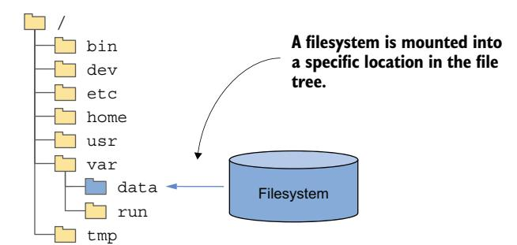
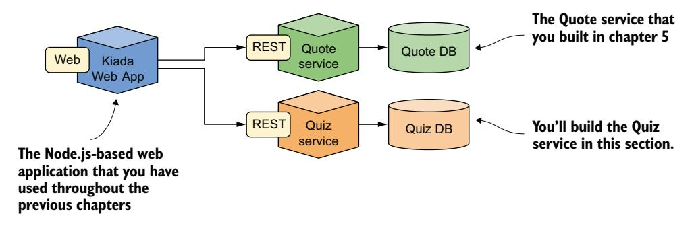
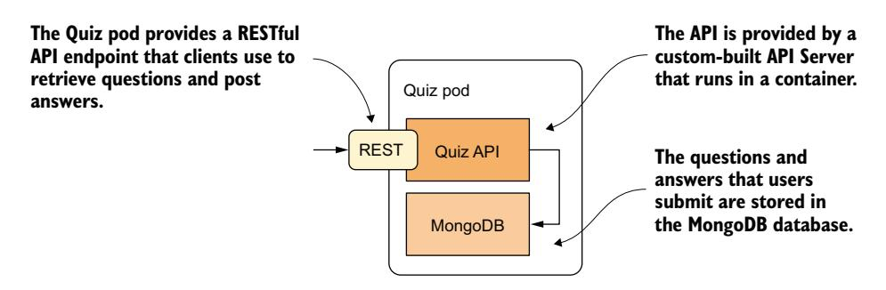
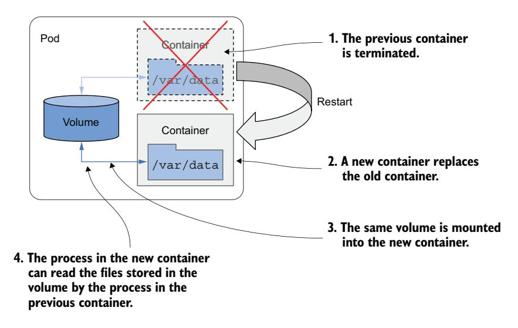
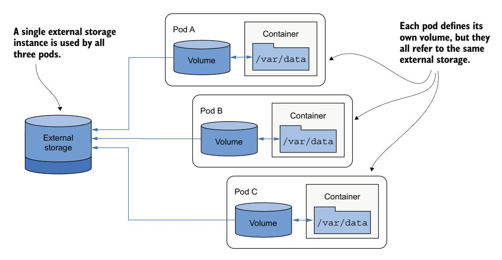
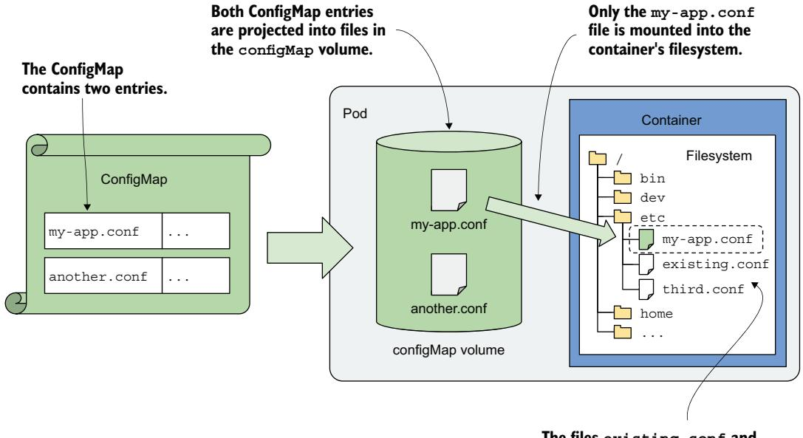
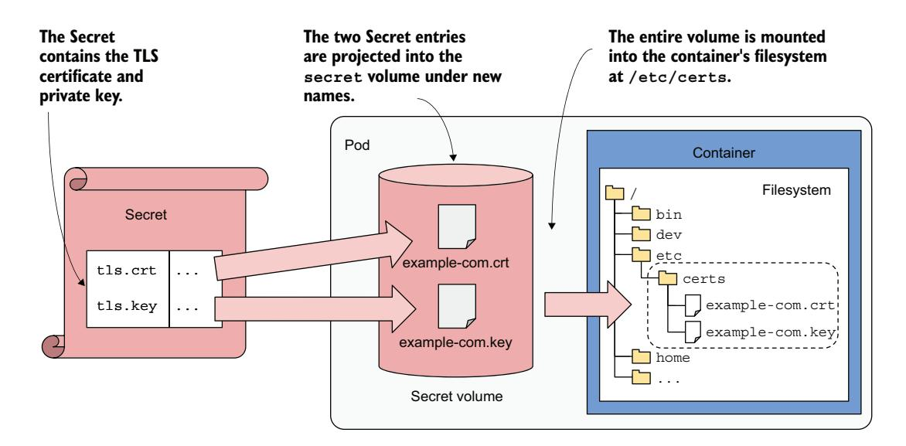

# 第 9 章 为存储、配置和元数据添加卷

!!! tip "本章涵盖"

    - 向 Pod 添加卷并将其挂载到容器中
    - 使用 emptyDir 卷在容器重启后持久化状态
    - 在同一 Pod 内的容器之间共享文件
    - 从另一个容器镜像向容器挂载文件
    - 从 Pod 内部访问宿主节点的文件系统
    - 通过卷暴露 ConfigMap、Secret 和 Pod 元数据

前几章重点讨论了 Pod 的容器，但它们只是 Pod 通常包含内容的一半。Pod 中的容器通常伴随着存储卷，这些卷允许容器在 Pod 的生命周期内或更长时间内存储数据，或者与 Pod 的其他容器共享文件，这正是本章的重点。

!!! note ""

    本章的代码文件可在 <https://mng.bz/4nxQ> 获取。

## 9.1 卷简介

Pod 就像一台运行单个应用程序的小型逻辑计算机。这个应用程序可以由一个或多个运行应用程序进程的容器组成。这些进程共享 CPU、内存、网络接口等计算资源。在典型的计算机中，进程使用同一个文件系统，但容器并非如此。相反，每个容器都有自己独立的文件系统，由容器镜像提供。

当容器启动时，其文件系统中的文件是构建时添加到镜像中的那些文件。容器中运行的进程随后可以修改这些文件或创建新文件。当容器终止并重新启动时，所有文件更改都会丢失，因为之前的容器并非真正重新启动，而是被一个新的容器实例替换，正如第 6 章讨论 Pod 生命周期时所述。因此，当容器化应用程序重新启动时，它无法从之前中断的地方恢复。虽然这对某些类型的应用程序来说可能是可接受的，但其他应用程序可能需要整个文件系统——或者至少部分文件系统——在重启后得以保留。幸运的是，这可以通过向 Pod 添加**卷**（volume）并将其**挂载**（mounting）到容器中来实现（图 9.1）。



图 9.1 将文件系统挂载到文件树中

!!! note "定义"

    **挂载**（Mounting）是将某个存储设备或卷的文件系统附加到操作系统文件树的特定位置的行为。卷的内容随后在该位置可用。

### 9.1.1 理解何时使用卷

在本章中，你将为 Kiada 应用程序构建一个新的 Quiz 服务。该服务需要持久数据存储。为了支持这一点，运行该服务的 Pod 需要包含一个卷。但在我们进入正题之前，让我们更仔细地了解一下该服务本身，并让你有机会亲身体验为什么没有卷它就无法运行。

**介绍 Quiz 服务**

本书旨在通过展示如何部署 Kubernetes in Action 演示应用程序（Kiada）套件来教你主要的 Kubernetes 概念。你已经知道组成它的三个组件。如果没有，图 9.2 应该能唤起你的记忆。



图 9.2 Quiz 服务如何融入 Kiada Suite 的架构

你已经构建了 Kiada Web 应用程序和 Quote 服务的初始版本。现在你将创建 Quiz 服务。它将提供 Kiada Web 应用程序显示的多项选择题，并且还会存储你对这些问题的回答。

Quiz 服务由一个 RESTful API 前端和一个 MongoDB 数据库作为后端组成。最初，你将在同一个 Pod 的不同容器中运行这两个组件，如图 9.3 所示。



图 9.3 Quiz API 和 MongoDB 数据库运行在同一个 Pod 中

正如第 5 章所解释的，这样创建 Pod 并不是最好的做法，因为它不允许容器单独扩缩容。我们使用单 Pod 的原因是因为你还没有学到 Pod 之间相互通信的正确方法。你将在第 11 章将两个容器拆分为单独的 Pod 时学到这一点。

**构建 Quiz API 容器**

Quiz API 容器镜像的源代码和制品位于 Chapter08/quiz-api-0.1/ 目录中。代码是用 Go 语言编写的，不仅打包到容器中，而且使用容器进行构建。这对于一些读者可能需要进一步解释。无需在你自己的计算机上安装 Go 环境就可以从 Go 源代码构建二进制文件，你可以在一个已经包含 Go 环境的容器中构建它。构建的结果是 quiz-api 二进制可执行文件，存储在 Chapter08/quiz-api-0.1/app/bin/ 目录中。

然后，该文件被单独使用 docker build 命令打包到 quiz-api:0.1 容器镜像中。如果你愿意，可以尝试自己构建二进制文件和容器镜像，也可以使用我提供的预构建镜像，地址为 docker.io/luksa/quiz-api:0.1。

**在没有卷的 Pod 中运行 Quiz 服务**

以下清单显示了 quiz Pod 的 YAML 清单。你可以在 Chapter08/pod.quiz.novolume.yaml 文件中找到它。

!!! note "清单 9.1 没有卷的 **quiz** Pod"

    ```yaml
    apiVersion: v1
    kind: Pod
    metadata:
      name: quiz
    spec:
      containers:
      - name: quiz-api
        image: luksa/quiz-api:0.1
        ports:
        - name: http
          containerPort: 8080
      - name: mongo
        image: mongo
    ```

清单显示 Pod 中定义了两个容器。quiz-api 容器运行前面解释的 Quiz API 组件，mongo 容器运行 API 组件用于存储数据的 MongoDB 数据库。

从清单创建 Pod，并使用 kubectl port-forward 打开到 Pod 的 8080 端口的隧道，以便你可以与 Quiz API 通信。要获取随机问题，向 /questions/random URI 发送 GET 请求，如下所示：

```bash
$ curl localhost:8080/questions/random
ERROR: Question random not found
```

数据库仍然是空的。你需要向其中添加问题。

**向数据库添加问题**

Quiz API 不提供向数据库添加问题的方式，因此你必须直接插入。你可以通过 mongo 容器中可用的 Mongo shell 来做到这一点。使用 kubectl exec 运行 shell：

```bash
$ kubectl exec -it quiz -c mongo -- mongosh
...
test>
```

Quiz API 从 kiada 数据库的 questions 集合中读取问题。要向该集合添加问题，请键入以下两个命令（以粗体打印）：

```bash
> use kiada
switched to db kiada
> db.questions.insertOne({
... id: 1,
... text: "What does k8s mean?",
... answers: ["Kates", "Kubernetes", "Kooba Dooba Doo!"],
... correctAnswerIndex: 1})
WriteResult({ "nInserted" : 1 })
```

!!! note ""

    无需键入所有这些命令，你可以直接在本地计算机上运行 Chapter08/insert-question.sh shell 脚本来插入问题。

欢迎添加更多问题，但不添加也可以。我们稍后会插入额外的问题。

**从数据库和 Quiz API 读取问题**

要确认你刚刚插入的问题现在已存储在数据库中，请运行以下命令：

```bash
> db.questions.find()
{ "_id" : ObjectId("5fc249ac18d1e29fed666ab7"), "id" : 1, "text" : "What does
     k8s mean?", "answers" : [ "Kates", "Kubernetes", "Kooba Dooba Doo!" ],
     "correctAnswerIndex" : 1 }
```

好的，数据库中现在至少有一个问题了。你可以通过按 Ctrl-D 或键入 exit 命令退出 Mongo shell。

现在尝试通过 Quiz API 获取一个随机问题：

```bash
$ curl localhost:8080/questions/random
{"id":1,"text":"What does k8s mean?","correctAnswerIndex":1,
"answers":["Kates","Kubernetes","Kooba Dooba Doo!"]}
```

很好。quiz Pod 提供了它应该提供的服务。但是这是否始终如此，还是该服务在数据持久性方面是脆弱的？

**重启 MongoDB 数据库**

因为 MongoDB 数据库运行在容器中，它将文件写入容器的文件系统。正如你已经学到的，如果这个容器被重新启动，其文件系统将被重置为容器镜像中定义的内容。这意味着所有问题都会丢失。你可以通过以下命令关闭数据库来确认这一点：

```bash
$ kubectl exec -it quiz -c mongo -- mongosh admin --eval "db.shutdownServer()"
```

当数据库关闭时，容器终止，Kubernetes 会在其位置启动一个新容器。因为现在是一个新容器，拥有全新的文件系统，它不包含你之前输入的问题。你可以通过以下命令确认这一点：

```bash
$ kubectl exec -it quiz -c mongo -- mongosh kiada --quiet --eval "db.questions.countDocuments()"
0
```

请记住，quiz Pod 仍然是之前那个 Pod。quiz-api 容器在此期间一直正常运行，只有 mongo 容器被重新启动了。更准确地说，它是被重新创建了，而不是重新启动了。这是由关闭 MongoDB 引起的，但可能由于任何原因发生。无论如何，像这样丢失数据是不可接受的。

为了确保数据在容器重启后能够存活，需要将数据存储在容器之外——存储在卷中。

### 9.1.2 理解卷如何融入 Pod

像容器一样，卷不是像 Pod 或节点那样的顶层资源，而是 Pod 内的一个组件，因此共享其生命周期。如图 9.4 所示，卷在 Pod 级别定义，然后挂载到容器中所需的位置。


图 9.4 卷在 Pod 级别定义，并挂载到 Pod 的容器中

卷的生命周期与整个 Pod 的生命周期绑定，与挂载它的容器的生命周期无关。因此，卷可用于在容器重启后持久化数据。

**在容器重启后持久化文件**

Pod 中的所有卷在 Pod 设置时创建——在其任何容器启动之前。它们在 Pod 关闭时被销毁。

每次容器（重新）启动时，容器配置使用的卷将被挂载到容器的文件系统中。运行在容器中的应用程序可以从卷中读取数据，如果卷和挂载配置为可写，也可以向卷写入数据。

向 Pod 添加卷的一个典型原因是在容器重启后持久化数据。如果容器中没有挂载卷，则容器的整个文件系统都是临时的。由于容器重启会替换整个容器，其文件系统也会从容器镜像重新创建。因此，应用程序写入的所有文件都会丢失。相反，如果应用程序将数据写入挂载到容器内部的卷，如图 9.5 所示，新容器中的应用程序进程可以在容器重启后访问相同的数据。



图 9.5 卷确保容器文件系统的一部分在重启后得以持久化

决定在重启后必须保留哪些文件取决于应用程序的作者。通常，你希望保留表示应用程序状态的数据，但可能不希望保留包含应用程序本地缓存数据的文件，因为这会阻止容器在重新启动时重新开始。每次重新开始可能允许应用程序在本地缓存损坏导致崩溃时自我修复。仅仅重启容器并使用相同的损坏文件可能会导致无限的崩溃循环。

!!! tip ""

    在将卷挂载到容器中以在容器重启后保留文件之前，请考虑这对容器自愈能力的影响。

**在容器中挂载多个卷**

一个 Pod 可以有多个卷，每个容器可以挂载零个、一个或多个这些卷到不同的位置，如图 9.6 所示。你可能想在一个容器中挂载多个卷的原因是这些卷可能服务于不同的目的，可以具有不同的类型和不同的性能特征。


图 9.6 一个 Pod 可以包含多个卷，一个容器可以挂载多个卷

在具有多个容器的 Pod 中，某些卷可以挂载到某些容器中，但不挂载到其他容器中。当卷包含只应对某些容器可访问的敏感信息时，这尤其有用。

**在多个容器之间共享文件**

一个卷可以挂载到多个容器中，以便运行在这些容器中的应用程序可以共享文件。正如第 5 章所讨论的，一个 Pod 可以将主应用程序容器与扩展主应用程序行为的边车容器（sidecar container）组合在一起。在某些情况下，这些容器必须读取或写入相同的文件。

例如，你可以创建一个 Pod，将一个运行 Web 服务器的容器与另一个运行内容生成代理的容器组合在一起。内容代理容器生成静态内容，Web 服务器随后将其提供给客户端。两个容器各自执行一个单独的任务，这些任务本身价值不大。然而，如图 9.7 所示，通过向 Pod 添加一个卷并将其挂载到两个容器中，你使它们能够作为一个完整的系统运行——这个系统的价值大于各部分的总和，因为它提供了一个单独容器无法提供的宝贵服务。


图 9.7 一个卷可以挂载到多个容器中

同一个卷可以根据每个容器自身的需求挂载在每个容器的不同位置。如果内容代理将内容写入 /var/data，那么将卷挂载在那里是合理的。由于 Web 服务器期望内容位于 /var/html，运行它的容器将卷挂载在此位置。

在图中你还会注意到，每个容器中的卷挂载可以配置为读/写或只读。由于内容代理需要向卷写入，而 Web 服务器只需从卷读取，因此两个挂载配置不同。出于安全考虑，建议阻止 Web 服务器向卷写入，因为如果 Web 服务器软件存在允许攻击者将任意文件写入文件系统并执行它们的漏洞，这可能使攻击者破坏系统。

单个卷由两个容器共享的其他场景还包括边车容器处理或轮转 Web 服务器日志，或者 初始化容器为主应用程序容器初始化数据。

**在 Pod 实例之间持久化数据**

卷与 Pod 的生命周期绑定，只在 Pod 存在期间存在。然而，根据卷类型的不同，卷中的文件可以在 Pod 和卷消失后保持完整，并可以稍后挂载到一个新卷中。

如图 9.8 所示，Pod 卷可以映射到 Pod 外部的持久存储。在这种情况下，表示卷的文件目录不是仅在 Pod 持续期间保留数据的本地文件目录，而是一个挂载到现有的、通常是网络附加存储卷（NAS）的卷挂载，其生命周期不绑定到任何 Pod。因此，存储在卷中的数据是持久的，即使 Pod 被替换为运行在不同工作节点上的新 Pod，应用程序仍然可以使用这些数据。


图 9.8 Pod 卷也可以映射到在 Pod 重启后依然存在的存储卷

如果 Pod 被删除并创建了一个新的 Pod 来替换它，同一个网络附加存储卷可以附加到新的 Pod 实例，以便它可以访问前一个实例存储在那里的数据。

**在 Pod 之间共享数据**

根据提供外部存储卷的技术，同一外部卷可以同时附加到多个 Pod，允许它们共享数据。图 9.9 显示了一个场景，其中三个 Pod 各自定义了一个映射到同一外部持久存储卷的卷。



图 9.9 使用卷在 Pod 之间共享数据

在最简单的情况下，持久存储卷可以是工作节点文件系统上的一个简单本地目录，三个 Pod 都有映射到该目录的卷。如果所有三个 Pod 都运行在同一个节点上，它们可以通过该目录共享文件。

如果持久存储是网络附加存储卷，即使 Pod 部署到不同节点，它们也可能能够使用它。然而，这取决于底层存储技术是否支持将网络卷同时附加到多台计算机。

像网络文件系统（NFS）这样的技术支持以读/写模式跨多台机器挂载卷。云环境中通常可用的其他技术，如 Google Compute Engine Persistent Disk，允许卷在单个集群节点上以读/写模式使用，或在许多节点上以只读模式使用。

**可用的卷类型介绍**

当你向 Pod 添加卷时，必须指定卷类型。有各种各样的卷类型可用。一些是通用的，而另一些则特定于底层使用的存储技术。以下是支持的卷类型的不完全列表：

- **emptyDir**——一个简单的目录，允许 Pod 在其生命周期内存储数据。该目录在 Pod 启动前创建，初始为空——因此得名。
- **hostPath**——用于将工作节点文件系统中的文件挂载到 Pod 中。
- **configMap**、**secret**、**downwardAPI** 以及 **projected** 卷类型——用于暴露 ConfigMap 或 Secret 中的数据，或 Pod 自身的元数据的特殊卷类型。
- **image**——用于将另一个容器镜像的文件系统作为卷挂载。
- **ephemeral**——由容器存储接口（CSI）驱动程序提供的临时卷，仅在 Pod 的生命周期内存在。
- **persistentVolumeClaim**——一种将外部存储集成到 Pod 中的可移植方式。这种卷类型不直接指向外部存储卷，而是指向一个 PersistentVolumeClaim 对象，该对象指向一个引用实际存储的 PersistentVolume 对象。这种卷类型需要更详细的解释，因此将在下一章单独讨论。

Kubernetes 曾经直接提供许多其他技术特定的卷类型，如 nfs、gcePersistentDisk、awsElasticBlockStore、azureFile/azureDisk 等。这些卷类型现在已被弃用，因为它们已被移出 Kubernetes 代码库，现在可通过 CSI 驱动程序访问。它们通常不再直接在 Pod 中定义——而是使用 persistentVolumeClaim 卷。如前所述，这是下一章的主题。在本章中，我们将重点关注仍然可以直接在 Pod 中定义的卷类型。

## 9.2 使用 emptyDir 卷

最简单的卷类型是 emptyDir。顾名思义，这种类型的卷开始时是一个空目录。当这种类型的卷挂载到容器中时，写入卷的文件在 Pod 存在期间得以保留，但不能与其他 Pod 共享。

这种卷类型用于单容器 Pod 中，当数据即使容器重新启动也必须保留时。它也用于容器的文件系统被标记为只读，但容器仍然需要一个地方临时写入数据时。在具有两个或更多容器的 Pod 中，emptyDir 卷也可用于在容器之间共享数据。

### 9.2.1 在容器重启后持久化文件

让我们向本章开头的 quiz Pod 添加一个 emptyDir 卷，以确保在 MongoDB 容器重新启动时其数据不会丢失。

**向 Pod 添加 emptyDir 卷**

你将修改 quiz Pod 的定义，使 MongoDB 进程将其文件写入卷而不是其运行的容器的文件系统，后者是易失的。Pod 的可视化表示如图 9.10 所示。


图 9.10 带有 emptyDir 卷的 quiz Pod，用于存储 MongoDB 数据文件

要实现这一目标，需要对 Pod 清单进行两处更改：

1. 必须向 Pod 添加一个 emptyDir 卷。
2. 该卷必须挂载到容器中。

以下清单显示了新的 Pod 清单，这两处更改以粗体突出显示。你将在 pod.quiz.emptydir.yaml 文件中找到该清单。

!!! note "清单 9.2 带有 emptyDir 卷的 **quiz** Pod，供 **mongo** 容器使用"

    ```yaml
    apiVersion: v1
    kind: Pod
    metadata:
      name: quiz
    spec:
      volumes:
      - name: quiz-data
        emptyDir: {}
      containers:
      - name: quiz-api
        image: luksa/quiz-api:0.1
        ports:
        - name: http
          containerPort: 8080
      - name: mongo
        image: mongo
        volumeMounts:
        - name: quiz-data
          mountPath: /data/db
    ```

清单显示，在 Pod 清单的 spec.volumes 数组中定义了一个名为 quiz-data 的 emptyDir 卷，并且它被挂载到 mongo 容器的文件系统中的 /data/db 位置。以下两个小节进一步解释了卷和卷挂载的定义。

**配置 emptyDir 卷**

一般来说，每个卷定义必须包含一个名称和一个类型，类型由嵌套字段的名称表示（当前示例中为 emptyDir）。该字段通常包含几个用于配置卷的子字段。可用的子字段集取决于卷类型。

例如，emptyDir 卷类型支持两个用于配置卷的字段，如表 9.1 所述。

| 字段 | 描述 |
|------|------|
| medium | 用于目录的存储介质类型。如果留空，则使用宿主节点的默认介质（目录在节点的一个磁盘上创建）。唯一支持的其他选项是 Memory，这会导致卷使用 tmpfs，即一种虚拟内存文件系统，文件保存在内存中而不是硬盘上。 |
| sizeLimit | 目录所需的本地存储总量，无论是在磁盘上还是在内存中。例如，要将最大大小设置为 10 mebibytes，请将此字段设置为 10Mi。 |

!!! note ""

    卷定义中的 emptyDir 字段没有定义这些属性中的任何一个。花括号 {} 是为了明确表示这一点而添加的，但它们可以省略。

**将卷挂载到容器中**

在 Pod 中定义卷只是使其在容器中可用所需工作的一半。该卷还必须挂载到容器中。这是通过在容器定义的 volumeMounts 数组中按名称引用卷来完成的。

除了名称之外，卷挂载定义还必须包含 mountPath——卷在容器内应挂载的路径。在清单 9.2 中，卷挂载在 /data/db，因为那是 MongoDB 存储其文件的位置。这确保了数据被写入卷而不是容器的文件系统。卷挂载定义中支持的字段完整列表如表 9.2 所示。

| 字段 | 描述 |
|------|------|
| name | 要挂载的卷的名称。这必须与 Pod 中定义的卷之一匹配。 |
| mountPath | 容器内挂载卷的路径。 |
| readOnly | 是否以只读方式挂载卷。默认为 false。请注意，将此设置为 true 并不确保所有子路径也是只读的，但这可以通过 recursiveReadOnly 字段配置。 |
| recursiveReadOnly | 只读挂载的卷是否真正只读，包括挂载路径下所有子路径。 |
| mountPropagation | 指定如果在卷内挂载额外的文件系统卷应该发生什么。默认为 None，这意味着容器不会收到由主机挂载的任何挂载，主机也不会收到由容器挂载的任何挂载。HostToContainer 意味着容器将接收主机挂载到此卷的所有挂载，但反过来不行。Bidirectional 意味着容器将接收主机添加的挂载，主机将接收容器添加的挂载。 |
| subPath | 默认为 ""，表示整个卷将被挂载到容器中。当设置为非空字符串时，只有卷中指定的 subPath 被挂载到容器中。 |
| subPathExpr | 与 subPath 类似，但可以使用语法 \$(ENV_VAR_NAME) 包含环境变量引用。只有容器定义中显式定义的环境变量才适用。隐式变量（如 HOSTNAME）不会被解析，如前一章所解释的。 |

在大多数情况下，你只需指定 name、mountPath 以及挂载是否应为 readOnly。如表中所述，设置 readOnly 并不总是足够的，应在需要时与 recursiveReadOnly 结合使用。mountPropagation 选项适用于高级用例，其中后续会向卷的文件树添加额外的挂载，无论是来自主机还是来自容器。subPath 和 subPathExpr 选项在需要使用单个卷的多个目录（你想将它们挂载到不同的容器而不是使用多个卷）时很有用。

subPathExpr 选项也可用于卷由多个 Pod 副本共享时。在上一章中，你学习了如何使用 Downward API 将 Pod 的名称注入环境变量。通过在 subPathExpr 中引用此变量，你可以配置每个副本使用自己的子目录。

**理解 emptyDir 卷的生命周期**

如果你用 pod.quiz.emptydir.yaml 中的 quiz Pod 替换现有的 quiz Pod 并向数据库插入问题，你会注意到即使重新启动 MongoDB 容器，你添加到数据库的问题也得以保留。使用 Chapter08/insert-question.sh 文件中的 shell 脚本，这样你就不必再次键入整个问题文档的 JSON。添加问题后，按如下方式计算数据库中的问题数量：

```bash
$ kubectl exec -it quiz -c mongo -- mongosh kiada --quiet --eval "db.questions.countDocuments()"
1
```

现在关闭 MongoDB 服务器：

```bash
$ kubectl exec -it quiz -c mongo -- mongosh admin --eval "db.shutdownServer()"
```

检查 mongo 容器是否已重新启动：

```bash
$ kubectl get po quiz
NAME   READY   STATUS    RESTARTS   AGE
quiz   2/2     Running   1          10m
```

容器重新启动后，重新检查数据库中的问题数量：

```bash
$ kubectl exec -it quiz -c mongo -- mongosh kiada --quiet --eval "db.questions.countDocuments()"
1
```

重新启动容器不再导致文件消失，因为它们不再位于容器的文件系统中。它们存储在卷中。但具体在哪里呢？让我们找出来。

**理解 emptyDir 卷中的文件存储在哪里**

如图 9.11 所示，emptyDir 卷中的文件存储在宿主节点文件系统的一个目录中。它只是一个普通的文件目录。该目录被挂载到容器中所需的位置。


图 9.11 emptyDir 是节点文件系统中的普通文件目录，挂载到容器中

该目录通常位于节点文件系统的以下位置：

```text
/var/lib/kubelet/pods/<pod_UID>/volumes/kubernetes.io~empty-dir/<volume_name>
```

pod_UID 是 Pod 的唯一 ID，你可以在 Pod 对象的 metadata 部分找到。如果你想亲自查看该目录，请运行以下命令获取 pod_UID：

```bash
$ kubectl get po quiz -o json | jq -r .metadata.uid
4f49f452-2a9a-4f70-8df3-31a227d020a1
```

volume_name 是 Pod 清单中卷的名称——在 quiz Pod 中，名称为 quiz-data。要获取运行 Pod 的节点名称，请使用 kubectl get po quiz -o wide 或以下替代方法：

```bash
$ kubectl get po quiz -o json | jq .spec.nodeName
```

现在你拥有所需的一切。尝试登录到节点并检查目录的内容。你会发现这些文件与 mongo 容器的 /data/db 目录中的文件匹配。

虽然数据在容器重启后仍然存在，但当 Pod 被删除时，数据不会保留。如果删除 Pod，目录也会被删除。要正确持久化数据，你需要使用持久卷，这将在下一章中介绍。

**在内存中创建 emptyDir 卷**

前面示例中的 emptyDir 卷在运行 Pod 的工作节点的实际驱动器上创建了一个目录，因此其性能取决于节点上安装的驱动器类型。如果你希望卷上的 I/O 操作尽可能快，可以指示 Kubernetes 使用 **tmpfs** 文件系统创建卷，该文件系统将文件保存在内存中。为此，将 medium 字段设置为 Memory，如下面的代码片段所示：

```yaml
  volumes:
  - name: content
    emptyDir:
      medium: Memory
```

当 emptyDir 卷用于存储敏感数据时，在内存中创建它也是一个好主意。因为数据不会写入磁盘，数据被泄露并比预期更长时间保留的可能性更小。如前一章所述，Kubernetes 在容器中暴露 Secret 对象类型的数据时使用相同的基于内存的方法。

**为 emptyDir 卷指定大小限制**

可以通过设置 sizeLimit 字段来限制 emptyDir 卷的大小。当 Pod 的整体内存使用受到所谓的**资源限制**（resource limits）的约束时，为基于内存的卷设置此字段尤其重要。

接下来，让我们看看如何使用 emptyDir 卷在同一 Pod 的容器之间共享文件。

### 9.2.2 初始化 emptyDir 卷

每次你创建带有 emptyDir 卷的 quiz Pod 时，MongoDB 数据库都是空的，你必须手动插入问题。让我们通过在 Pod 启动时自动填充数据库来解决这个问题。

有许多方法可以做到这一点。你可以在本地运行 MongoDB 容器，插入数据，将容器状态提交到新镜像，然后在 Pod 中使用该镜像。但是，每次发布新版本的 MongoDB 容器镜像时，你都必须重复此过程。

幸运的是，MongoDB 容器镜像提供了一种在首次启动时填充数据库的机制。在启动时，如果数据库为空，它会调用在 /docker-entrypoint-initdb.d/ 目录中找到的任何 .js 和 .sh 文件。你只需要在 MongoDB 容器启动之前将包含问题的文件放到该位置。

同样，你可以构建一个在该位置包含该文件的新 MongoDB 镜像，但你会遇到与前面描述的相同的问题。另一种解决方案是使用卷将文件注入到 MongoDB 容器文件系统的该位置。但是首先如何将文件放到卷中呢？

**使用 初始化容器初始化 emptyDir 卷**

初始化 emptyDir 卷的一种方式是使用 初始化容器。初始化容器可以从任何地方获取文件。例如，它可以使用 git clone 命令克隆一个 Git 仓库并检出其文件。然而，此操作需要 Pod 每次启动时进行网络调用以获取数据。初始化容器也可以简单地将文件存储在自己的镜像中。本节的目的在于展示如何使用 初始化容器来初始化卷，而不是详述数据本身的来源，因此我们将采用这种方法。

你将创建一个新的容器镜像，将测验问题存储在一个 JSON 文件中，并将此文件复制到共享卷，以便 MongoDB 容器在启动时可以读取它。你将把这个新容器作为 初始化容器添加，连同新卷和所需的卷挂载，添加到 quiz Pod 中，如下图所示。


图 9.12 使用 初始化容器初始化 emptyDir 卷

**理解 Pod 启动时发生了什么**

当 Pod 启动时，首先创建卷，然后启动 初始化容器。这在所有 Pod 中都是如此，无论你在 Pod 清单中将卷定义在 初始化容器之前还是之后。

在 初始化容器启动之前，initdb 卷被挂载到其中。容器镜像包含 insert-questions.js 文件，容器在运行时将其复制到卷中。当复制操作完成时，初始化容器终止，Pod 的主容器启动。initdb 卷被挂载到 mongo 容器中 MongoDB 查找数据库初始化脚本的位置。在首次启动时，MongoDB 执行 insert-questions.js 脚本，如文件名所示，这会将问题插入到数据库中。与前一版本的 Pod 一样，数据库文件存储在另一个名为 quiz-data 的卷中，以便数据在容器重启后仍然存在。

**构建 初始化容器镜像**

你可以在本书代码仓库的 Chapter08/quiz-initdb-scriptinstaller-0.1 下找到 insert-questions.js 文件和构建 初始化容器镜像所需的 Dockerfile。以下清单显示了 insert-questions.js 文件的一部分。

!!! note "清单 9.3 **insert-questions.js** 文件的内容"

    ```text
    db.getSiblingDB("kiada").questions.insertMany(
    [{
      "id": 1,
      "text": "The three sections in most Kubernetes API objects are:",
      "correctAnswerIndex": 1,
      "answers": [
        "`info`, `config`, `status`",
        "`metadata`, `spec`, `status`",
        "`data`, `spec`, `status`",
        "`pod`, `deployment`, `service`",
      ]
    },
    ...
    ```

容器镜像的 Dockerfile 显示在下一个清单中。正如你从 CMD 指令中看到的，使用一个简单的 cp 命令将 insert-questions.js 文件复制到共享卷挂载的路径。

!!! note "清单 9.4 **quiz-initdb-script-installer:0.1** 容器镜像的 Dockerfile"

    ```dockerfile
    FROM busybox
    COPY insert-questions.js /
    CMD cp /insert-questions.js /initdb.d/ \
     && echo "Successfully copied insert-questions.js to /initdb.d" \
     || echo "Error copying insert-questions.js to /initdb.d"
    ```

使用这两个文件构建镜像，或使用 docker.io/luksa/quiz-initdb-script-installer:0.1 上的预构建镜像。

**向 quiz Pod 添加卷和 初始化容器**

获得容器镜像后，修改上一节中的 Pod 清单，使其内容与下一个清单匹配，或打开文件 pod.quiz.emptydir.init.yaml，我已经在其中做了相同的更改。

!!! note "清单 9.5 使用 初始化容器初始化 **emptyDir** 卷"

    ```yaml
    apiVersion: v1
    kind: Pod
    metadata:
      name: quiz
    spec:
      volumes:
      - name: initdb
        emptyDir: {}
      - name: quiz-data
        emptyDir: {}
      initContainers:
      - name: installer
        image: luksa/quiz-initdb-script-installer:0.1
        volumeMounts:
        - name: initdb
          mountPath: /initdb.d
      containers:
      - name: quiz-api
        image: luksa/quiz-api:0.1
        ports:
        - name: http
          containerPort: 8080
      - name: mongo
        image: mongo
        volumeMounts:
        - name: quiz-data
          mountPath: /data/db
        - name: initdb
          mountPath: /docker-entrypoint-initdb.d/
          readOnly: true
    ```

清单显示 initdb 卷被挂载到 installer 初始化容器中。在此容器将 insert-questions.js 文件复制到卷中后，它终止并允许 mongo 和 quiz-api 容器启动。由于 initdb 卷被挂载到 mongo 容器的 /docker-entrypoint-initdb.d/ 目录中，MongoDB 执行该 .js 文件，从而用问题填充数据库。

你可以删除旧的 quiz Pod 并部署这个新版本的 Pod。你将看到数据库会自动填充问题。

**使用 Pod 清单中行内定义的文件内容初始化卷**

当你想用一个短文件初始化 emptyDir 卷时，可以使用一个巧妙的技巧，直接在 Pod 清单中定义文件内容，如下面的清单所示。你可以在 pod.emptydir-inline-example.yaml 文件中找到完整的清单。

!!! note "清单 9.6 从行内内容创建文件"

    ```yaml
    spec:
      initContainers:
      - name: my-volume-initializer
        image: busybox
        command:
        - sh
        - -c
        - |
          cat <<EOF > /mnt/my-volume/my-file.txt
          line 1: This is a multi-line file
          line 2: Written from an init container
          line 3: Defined inline in the Pod manifest
          EOF
        volumeMounts:
        - name: my-volume
          mountPath: /mnt/my-volume
      containers:
      ...
    ```

清单中显示的方法是将一个或两个文件添加到 Pod 中的卷的快速简便的方法。你可以使用这种方法为应用程序提供一个简短的配置文件，而无需使用任何其他资源来存储文件内容。

### 9.2.3 在容器之间共享文件

如前一节所示，emptyDir 卷可以使用 初始化容器进行初始化，然后由 Pod 的一个主容器使用。但是卷也可以由多个主容器同时使用。quiz Pod 中的 quiz-api 和 mongo 容器不需要共享文件，所以让我们使用一个不同的例子来学习如何在容器之间共享卷。

**将 Quote Pod 转换为具有共享卷的多容器 Pod**

还记得上一章中的 quote Pod 吗？那个使用启动后钩子运行 fortune 命令的 Pod？该命令将本书中的一句引文写入一个文件，然后由 Nginx Web 服务器提供服务。问题是这个 Pod 当前每次都提供相同的引文。让我们构建一个新版本的 Pod，每分钟提供一条新的引文。

你将保留 Nginx 作为 Web 服务器，但将使用一个定期运行 fortune 命令的容器来替换启动后钩子，以更新存储引文的文件。我们将这个容器称为 quote-writer。Nginx 服务器将继续驻留在 nginx 容器中。

如图 9.13 所示，Pod 现在有两个容器而不是一个。为了让 nginx 容器看到 quote-writer 创建的文件，必须在 Pod 中定义一个卷并将其挂载到两个容器中。


图 9.13 新版 Quote 服务使用两个容器和一个共享卷

quote-writer 容器的镜像可在 docker.io/luksa/quote-writer:0.1 获取，但你也可以从 Chapter08/quote-writer-0.1 目录中的文件自行构建。nginx 容器将继续使用现有的 nginx:alpine 镜像。

**更新 Quote Pod 清单**

新 quote Pod 的 Pod 清单显示在下一个清单中。你可以在 pod.quote.yaml 文件中找到它。

!!! note "清单 9.7 具有两个共享卷的容器的 Pod"

    ```yaml
    apiVersion: v1
    kind: Pod
    metadata:
      name: quote
    spec:
      volumes:
      - name: shared
        emptyDir: {}
      containers:
      - name: quote-writer
        image: luksa/quote-writer:0.1
        volumeMounts:
        - name: shared
          mountPath: /var/local/output
      - name: nginx
        image: nginx:alpine
        volumeMounts:
        - name: shared
          mountPath: /usr/share/nginx/html
          readOnly: true
        ports:
        - name: http
          containerPort: 80
    ```

该 Pod 由两个容器和一个单独的卷组成，该卷挂载在两个容器中，但在每个容器的文件系统中位于不同的位置。使用两个不同位置的原因是 quote-writer 容器写入其 /var/local/output 目录，而 nginx 容器从其 /usr/share/nginx/html 目录提供文件。

!!! note ""

    由于两个容器同时启动，可能会出现 nginx 已经运行但引文尚未生成的短暂时间窗口。确保不会发生这种情况的一种方法是使用 初始化容器生成初始引文，如第 9.2.2 节所述。

**运行 Pod 并验证其行为**

从清单文件创建 Pod。检查 Pod 的状态以确认两个容器已启动并继续运行。quote-writer 容器每分钟向文件写入一条新引文，nginx 容器提供此文件。创建 Pod 后，使用 kubectl port-forward 命令打开到 Pod 的通信隧道：

```bash
$ kubectl port-forward quote 1080:80
```

在另一个终端中，获取引文，等待至少一分钟，然后使用以下命令再次获取引文：

```bash
$ curl localhost:1080/quote
```

或者，你也可以使用以下两个命令之一显示文件的内容：

```bash
$ kubectl exec quote -c quote-writer -- cat /var/local/output/quote
$ kubectl exec quote -c nginx -- cat /usr/share/nginx/html/quote
```

如你所见，其中一个命令从 quote-writer 容器内打印文件，而另一个命令从 nginx 容器内打印文件。因为两个路径都指向共享卷上的同一个 quote 文件，命令的输出是相同的。你已经成功使用卷在同一 Pod 的两个容器之间共享文件。

## 9.3 将容器镜像作为卷挂载

容器通常需要访问预先准备好的数据。你在第 9.2.2 节中看到了一个例子，其中 quiz Pod 的数据库需要预填充问题。这是一个常见的场景。例如，AI 模型服务容器需要访问大语言模型的权重，这些权重通常存储在大型文件中。虽然可以将这些文件直接包含在模型服务容器镜像中，但更常见的做法是将模型权重和模型服务二进制文件分开打包。

在 quiz Pod 示例中，你创建了一个容器镜像，该镜像包含一个文件中的问题，并在容器启动时将其复制到一个新位置。一个卷被挂载在这个新位置，以便 Pod 中的其他容器可以访问该文件。对于一个简单的任务——使用容器镜像向另一个容器提供文件——这似乎需要做很多工作。

幸运的是，现在有一种更简单的方法可以做到这一点。然而，在撰写本文时，此功能尚未默认启用，必须通过 ImageVolume 特性门控启用。

!!! note ""

    在 Kubernetes 中，某个特性在普遍可用之前通常隐藏在特性门控（feature gate）之后。Kubernetes 集群管理员必须显式启用此特性门控。当未启用时，该特性将根本无法工作，即使与其关联的字段在 API 中可见，用户也能设置这些字段。

!!! note ""

    如果你使用 Kind 运行本书中的示例，请确保在启动集群时启用此特性门控。你可以使用 Chapter08/kind-multi-node-with-image-volume.yaml 配置文件来做到这一点。

### 9.3.1 图像卷类型简介

image 卷类型将 OCI（开放容器倡议）镜像中的文件作为卷暴露，该卷可以挂载到同一 Pod 的其他容器中。正如你可能预期的那样，其他容器可以从该卷读取，但不能写入。

!!! note ""

    在本书中，我们经常使用**容器镜像**（container image）这个术语。然而，这个术语保留给封装应用程序及其软件依赖项的镜像。**OCI 镜像**（OCI image）这个术语更广泛，因为镜像可以捆绑其他类型的文件，而不仅仅是应用程序。image 卷类型允许你将任何符合 OCI 标准的镜像用作卷。

虽然你可以使用现有的 quiz-initdb-script-installer 容器镜像来创建卷，但我创建了一个仅包含 insert-questions.js 文件的新镜像。你可以通过使用 Chapter08/quiz-questions 目录中的文件自行构建镜像，也可以使用 docker.io/luksa/quiz-questions:latest 上的现有镜像。

!!! note ""

    截至撰写本文时，仅支持镜像制品。然而，计划是最终支持所有 OCI 制品。这意味着将制品推送到注册表将更加容易，无需为此创建 Dockerfile。

**在 Pod 清单中定义 image 卷**

让我们更新 quiz Pod 清单，以便它通过 image 卷而不是由 quiz-initdb-script-installer 初始化容器初始化的 emptyDir 卷向 MongoDB 提供问题。以下清单显示了新的清单。你可以在 pod.quiz.imagevolume.yaml 文件中找到它。

!!! note "清单 9.8 在 Pod 清单中定义 image 卷"

    ```yaml
    apiVersion: v1
    kind: Pod
    metadata:
      name: quiz
    spec:
      volumes:
      - name: initdb
        image:
          reference: luksa/quiz-questions:latest
          pullPolicy: Always
      - name: quiz-data
        emptyDir: {}
      containers:
      - name: quiz-api
        image: luksa/quiz-api:0.1
        imagePullPolicy: IfNotPresent
        ports:
        - name: http
          containerPort: 8080
      - name: mongo
        image: mongo:7
        volumeMounts:
        - name: quiz-data
          mountPath: /data/db
        - name: initdb
          mountPath: /docker-entrypoint-initdb.d/
          readOnly: true
    ```

清单中的清单与使用 emptyDir 卷和 初始化容器的清单没有太大区别。如你所见，不再需要 初始化容器，emptyDir 卷已替换为 image 卷。该卷与之前完全相同的方式挂载到 mongo 容器中。

**运行并检查新的 Pod**

删除旧的 quiz Pod，并通过应用 pod.quiz.imagevolume.yaml 文件中的清单创建新版本。然后运行 kubectl describe pod quiz 查看与新 Pod 关联的事件。它们应如下所示（为简洁起见，输出经过编辑）：

```text
Events:
  Type    Reason     From      Message
  ------  ---------  --------  -------
  Normal  Scheduled  scheduler Successfully assigned kiada/quiz to node
  Normal  Pulled     kubelet   Successfully pulled image "quiz-questions:
                                latest" in 1.007s (1.007s including waiting).
                                Image size: 1816 bytes.
  Normal  Pulled     kubelet   Image "quiz-api:0.1" already present
  Normal  Created    kubelet   Created container: quiz-api
  Normal  Started    kubelet   Started container quiz-api
  Normal  Pulled     kubelet   Image "mongo:7" already present on machine
  Normal  Created    kubelet   Created container: mongo
  Normal  Started    kubelet   Started container mongo
```

你可以看到 quiz-questions 镜像是第一个被拉取的镜像。正如你已经学到的，这是因为 Pod 卷在任何 Pod 容器启动之前创建。

现在通过运行以下命令确认 insert-questions.js 文件在 mongo 容器中可用：

```bash
$ kubectl exec -it quiz -c mongo -- ls -la /docker-entrypoint-initdb.d/
total 4
drwxr-xr-x. 1 root root    0 Jul  1 08:59 .
drwxr-xr-x. 1 root root   60 Jul  1 08:59 ..
-rw-rw-r--. 1 root root 2361 Mar 14  2022 insert-questions.js
```

MongoDB 应该在启动时执行了此文件，因此存储在此文件中的问题现在应该已存储在数据库中，你可以像之前一样通过 Quiz API 获取它们：

```bash
$ curl localhost:8080/questions/random
```

!!! note ""

    不要忘记在运行 curl 命令之前使用 kubectl port-forward 打开到 quiz Pod 端口 8080 的隧道。

## 9.4 访问工作节点文件系统上的文件

大多数 Pod 不应该关心它们运行在哪个宿主节点上，也不应该访问节点文件系统上的任何文件。系统级 Pod 是例外。它们可能需要读取节点的文件或使用节点的文件系统通过文件系统访问节点的设备或其他组件。Kubernetes 通过 hostPath 卷类型使这成为可能。

### 9.4.1 hostPath 卷简介

hostPath 卷指向宿主节点文件系统中的特定文件或目录，如图 9.14 所示。运行在同一节点上并在其 hostPath 卷中使用相同路径的 Pod 可以访问相同的文件，而其他节点上的 Pod 则不能。


图 9.14 hostPath 卷将工作节点文件系统中的文件或目录挂载到容器中

hostPath 卷不是存储数据库数据的好地方，除非你确保运行数据库的 Pod 始终在同一节点上运行。因为卷的内容存储在特定节点的文件系统上，如果数据库 Pod 被重新调度到另一个节点，它将无法访问数据。通常，hostPath 卷用于 Pod 需要读取或写入节点文件系统中的文件的情况，这些文件由节点上运行的进程读取或生成，例如系统级日志。

hostPath 卷类型是 Kubernetes 中最危险的卷类型之一，通常只保留给特权 Pod 使用。如果你允许不受限制地使用 hostPath 卷，集群的用户可以在节点上做任何他们想做的事情。例如，他们可以使用它来将 Docker 套接字文件（通常为 /var/run/docker.sock）挂载到他们的容器中，然后在容器内运行 Docker 客户端以 root 用户在宿主节点上运行任何命令。

### 9.4.2 使用 hostPath 卷

为了演示 hostPath 卷有多危险，让我们部署一个 Pod，允许你从 Pod 内部探索宿主节点的整个文件系统。Pod 清单显示在以下清单中。

!!! note "清单 9.9 使用 **hostPath** 卷获取对宿主节点文件系统的访问"

    ```yaml
    apiVersion: v1
    kind: Pod
    metadata:
      name: node-explorer
    spec:
      volumes:
      - name: host-root
        hostPath:
          path: /
      containers:
      - name: node-explorer
        image: alpine
        command: ["sleep", "9999999999"]
        volumeMounts:
        - name: host-root
          mountPath: /host
    ```

如清单中所示，hostPath 卷必须指定它要挂载的主机上的路径。清单中的卷将指向节点文件系统的根目录，提供对 Pod 被调度到的节点的整个文件系统的访问。

使用 kubectl apply 从此清单创建 Pod 后，使用以下命令在 Pod 中运行 shell：

```bash
$ kubectl exec -it node-explorer -- sh
```

现在你可以通过运行以下命令导航到节点文件系统的根目录：

```bash
/ # cd /host
```

从这里，你可以探索宿主节点上的文件。由于容器和 shell 命令以 root 身份运行，你可以修改工作节点上的任何文件。请小心不要破坏任何东西。

!!! note ""

    如果你的集群有多个工作节点，Pod 会在随机选择的一个节点上运行。如果你想在特定节点上部署 Pod，请编辑 node-explorer.specific-node.pod.yaml 文件（你将在本书代码归档中找到该文件），并将 .spec.nodeName 字段设置为你希望运行 Pod 的节点名称。

现在想象一下，你是一个攻击者，已经获得了对 Kubernetes API 的访问权限，并且能够在生产集群中部署这种类型的 Pod。不幸的是，在撰写本文时，Kubernetes 并不阻止普通用户在其 Pod 中使用 hostPath 卷，因此完全不安全。

**为 hostPath 卷指定类型**

在前面的示例中，你只指定了 hostPath 卷的路径，但你也可以指定类型，以确保路径表示容器中的进程所期望的内容（文件、目录或其他内容）。表 9.3 解释了支持的 hostPath 类型。

| 类型 | 描述 |
|------|------|
| （空） | Kubernetes 在挂载卷之前不执行任何检查。 |
| Directory | Kubernetes 检查指定路径处是否存在目录。如果你想将预先存在的目录挂载到 Pod 中，并希望在该目录不存在时阻止 Pod 运行，请使用此类型。 |
| DirectoryOrCreate | 与 Directory 相同，但如果指定路径处没有任何内容，则创建一个空目录。 |
| File | 指定路径必须是一个文件。 |
| FileOrCreate | 与 File 相同，但如果指定路径处没有任何内容，则创建一个空文件。 |
| BlockDevice | 指定路径必须是一个块设备。 |
| CharDevice | 指定路径必须是一个字符设备。 |
| Socket | 指定路径必须是一个 UNIX 套接字。 |

如果指定路径与类型不匹配，则 Pod 的容器不会运行。Pod 的事件会说明 hostPath 类型检查失败的原因。

!!! note ""

    当类型为 FileOrCreate 或 DirectoryOrCreate 并且 Kubernetes 需要创建文件/目录时，文件权限分别设置为 644（rw-r--r--）和 755（rwxr-xr-x）。无论哪种情况，文件/目录都归用于运行 kubelet 的用户和组所有。

## 9.5 ConfigMap、Secret、Downward API 和 projected 卷

你在上一章中学习了 ConfigMap、Secret 和 Downward API。然而，你只学习了如何将这些来源的信息注入到环境变量和命令行参数中，但我也提到过这些信息也可以作为卷中的文件呈现。由于本章全部是关于卷的，让我们看看如何做到这一点。

在第 5 章中，你部署了 kiada Pod，其中包含一个处理 Pod 的 TLS 流量的 Envoy 边车。因为当时没有解释卷，Envoy 使用的配置文件、TLS 证书和私钥直接存储在容器镜像中，这不是正确的方法。更好的做法是将这些文件存储在 ConfigMap 和 Secret 中，并将其作为文件注入到容器中。这样，你可以更新它们而无需重新构建镜像。由于 Envoy 配置文件和证书及私钥文件由于具有不同的安全影响而必须区别对待，最好使用 ConfigMap 来存放配置，使用 Secret 来存放证书和私钥。让我们首先关注 ConfigMap。

### 9.5.1 使用 configMap 卷将 ConfigMap 条目暴露为文件

环境变量通常用于向应用程序传递小的单行值，而长的多行值最好通过文件来呈现。你可以通过使用 configMap 卷将这些较大的 ConfigMap 条目传递给容器中运行的应用程序。

!!! note ""

    ConfigMap 或 Secret 中可以容纳的信息量由 etcd（用于存储 API 对象的底层数据存储）决定。目前，最大大小在 1 兆字节左右。

configMap 卷将 ConfigMap 条目作为单独的文件提供。容器中运行的进程可以读取这些文件来获取值。此机制最常用于向容器传递大型配置文件，但也可以用于较小的值，或与 env 或 envFrom 字段结合使用，以文件形式传递大型条目，以环境变量形式传递其他条目。

**向 Pod 清单添加 configMap 卷**

要使 ConfigMap 条目作为文件在容器的文件系统中可用，你需要定义一个 configMap 卷并将其挂载到容器中，如下面的清单所示，该清单显示了 pod.kiada-ssl.configmap-volume.yaml 文件的相关部分。

!!! note "清单 9.10 在 Pod 中定义 **configMap** 卷"

    ```yaml
    apiVersion: v1
    kind: Pod
    metadata:
      name: kiada-ssl
    spec:
      volumes:
      - name: envoy-config
        configMap:
          name: kiada-ssl-config
      ...
      containers:
      ...
      - name: envoy
        image: luksa/kiada-ssl-proxy:0.1
        volumeMounts:
        - name: envoy-config
          mountPath: /etc/envoy
      ...
    ```

如你所见，envoy-config 卷是一个 configMap 卷，指向 kiada-ssl-config ConfigMap。该卷挂载在 envoy 容器的 /etc/envoy 下。

从清单文件创建 Pod 并检查其状态。你会看到以下内容：

```text
$ kubectl get po
NAME        READY   STATUS              RESTARTS   AGE
kiada-ssl   0/2     ContainerCreating   0          2m
```

因为 Pod 的 configMap 卷引用了一个不存在的 ConfigMap，并且该引用未标记为可选，所以容器无法运行。

**将 configMap 卷标记为可选**

之前，你了解到如果容器包含引用不存在 ConfigMap 的环境变量定义，容器将被阻止启动，直到该 ConfigMap 被创建。你还了解到这不会阻止其他容器启动。那么，当前的情况呢，其中缺失的 ConfigMap 是在卷中引用的？

因为所有 Pod 的卷必须在容器启动之前设置好，在卷中引用缺失的 ConfigMap 会阻止 Pod 中的所有容器启动，而不仅仅是挂载该卷的容器。会生成一个事件指示问题。你可以使用 kubectl describe pod 或 kubectl get events 命令显示它，如前几章所述。

!!! note ""

    configMap 卷可以通过在卷定义中添加 optional: true 行来标记为可选。如果卷是可选的且 ConfigMap 不存在，则不会创建该卷，容器将在不挂载该卷的情况下启动。

为了使 Pod 的容器能够启动，通过应用本书代码归档中的 cm.kiada-ssl-config.yaml 文件来创建 ConfigMap。该 ConfigMap 包含两个条目：status-message 和 envoy.yaml。使用 kubectl apply 命令。执行此操作后，Pod 应该会启动，你应该能够通过按如下方式列出 /etc/envoy 目录的内容来确认 ConfigMap 中的两个条目已作为文件挂载到容器中：

```bash
$ kubectl exec kiada-ssl -c envoy -- ls /etc/envoy
envoy.yaml
status-message
```

**ConfigMap 更新如何自动反映到文件中**

如上一章所述，更新 ConfigMap 不会更新从该 ConfigMap 注入到容器中的任何环境变量。然而，当你使用 configMap 卷将 ConfigMap 条目注入为文件时，对 ConfigMap 的更改会自动反映到文件中。尝试使用 kubectl edit 修改 kiada-ssl-config ConfigMap 中的 status-message 条目，然后通过运行以下命令验证 envoy 容器中的 /etc/envoy/status-message 文件是否已更新：

```bash
$ kubectl exec kiada-ssl -c envoy -- cat /etc/envoy/status-message
```

!!! note ""

    configMap 卷中的文件在 ConfigMap 修改后可能需要长达一分钟才能更新。

**仅投射特定的 ConfigMap 条目**

Envoy 实际上并不需要 status-message 文件，但我们不能将其从 ConfigMap 中删除，因为 kiada 容器需要它。让此文件出现在 /etc/envoy 中并不理想，所以让我们解决这个问题。

幸运的是，configMap 卷允许你指定要投射到文件中的 ConfigMap 条目。以下清单显示了如何操作。你可以在 pod.kiada-ssl.configmap-volume-clean.yaml 文件中找到该清单。

!!! note "清单 9.11 指定要在 **configMap** 卷中包含哪些 ConfigMap 条目"

    ```yaml
      volumes:
      - name: envoy-config
        configMap:
          name: kiada-ssl-config
          items:
          - key: envoy.yaml
            path: envoy.yaml
    ```

items 字段指定要包含在卷中的 ConfigMap 条目列表。每个条目必须在 path 字段中指定 key 和文件名。未在此处列出的条目不包括在卷中。这样，你可以为 Pod 拥有一个单一的 ConfigMap，其中一些条目显示为环境变量，另一些显示为文件。

### 9.5.2 configMap 卷的工作原理

在你开始在自己的 Pod 中使用 configMap 卷之前，了解它们的工作原理很重要。否则，你可能会花费大量时间排查意外行为。

你可能认为当你在容器中的某个目录挂载 configMap 卷时，Kubernetes 只是在该目录中创建一些文件，但事情比这更复杂。有两个需要注意的陷阱。一个是卷的一般挂载方式，另一个是 Kubernetes 如何使用符号链接确保文件能原子性地更新。

**理解挂载卷如何影响现有文件**

如果你将任何卷挂载到容器文件系统的某个目录中，容器镜像中原本在该目录中的任何文件将不再可访问。这包括子目录！

例如，如果你将 configMap 卷挂载到 /etc 目录——该目录在 Unix 系统上通常包含重要的配置文件——容器中运行的应用程序将只能看到 ConfigMap 提供的文件。因此，通常应该位于 /etc 中的所有其他文件将被隐藏，应用程序可能无法运行。然而，这个问题可以通过在挂载卷时使用 subPath 字段来缓解。

假设你有一个 configMap 卷，其中包含一个名为 my-app.conf 的文件，你想将其放置在 /etc 目录中，而不覆盖或隐藏该目录中的任何现有文件。你不是挂载整个卷到 /etc，而是通过结合使用 mountPath 和 subPath 字段来仅挂载特定文件，如下面的清单所示。

!!! note "清单 9.12 将单个文件挂载到容器中"

    ```yaml
    spec:
      containers:
      - name: my-container
        volumeMounts:
        - name: my-volume
          subPath: my-app.conf
          mountPath: /etc/my-app.conf
    ```

为了更好地理解这一切是如何工作的，请查看图 9.15。



图 9.15 使用 subPath 从卷中挂载单个文件

**理解 configMap 卷如何使用符号链接进行原子更新**

某些应用程序会监控其配置文件的变化，并在检测到更新时自动重新加载。然而，如果应用程序使用大文件或多个文件，它可能在所有更新完全写入之前检测到更改。如果应用程序读取部分更新的文件，它可能无法正常运行。

为了防止这种情况，Kubernetes 确保 configMap 卷中的所有文件原子性地更新，这意味着所有更新都是瞬时完成的。这是通过使用符号文件链接来实现的，如果你列出 /etc/envoy 目录中的所有文件就可以看到：

```bash
$ kubectl exec kiada-ssl -c envoy -- ls -lA /etc/envoy
total 4
drwxr-xr-x ... ..2020_11_14_11_47_45.728287366
lrwxrwxrwx ... ..data -> ..2020_11_14_11_47_45.728287366
lrwxrwxrwx ... envoy.yaml -> ..data/envoy.yaml
```

如清单所示，投射到卷中的 ConfigMap 条目是指向名为 ..data 的子目录内文件路径的符号链接，而 ..data 本身也是一个符号链接。这个 ..data 链接指向一个名称中包含时间戳的目录。因此，应用程序读取的文件路径通过两个连续的符号链接解析到实际文件。

这可能看起来不必要，但它可以实现所有文件的原子更新。每次你更改 ConfigMap 时，Kubernetes 创建一个新的带时间戳的目录，将更新后的文件写入其中，然后将 ..data 符号链接更新为指向这个新目录，从而一次性替换所有文件。

!!! note ""

    如果你在卷挂载定义中使用 subPath，则不会使用此机制。相反，文件直接写入目标目录，并且在修改 ConfigMap 时不会更新。

!!! tip ""

    为了解决 configMap 卷中的 subPath 问题，你可以将整个卷挂载到另一个目录中，并在所需位置创建一个指向另一个目录中文件的符号链接。你可以预先在容器镜像本身中创建此符号链接。

### 9.5.3 使用 Secret 卷

正如你已经知道的，Secret 与 ConfigMap 差别不大，所以如果有 configMap 卷，那么也必须有 secret 卷。情况正是如此。此外，向 Pod 添加 secret 卷与添加 configMap 卷几乎完全相同。

在上一节中，你将 envoy.yaml 配置文件从 kiada-ssl-config ConfigMap 注入到了 envoy 容器中。现在你还将注入存储在 kiada-tls Secret 中的 TLS 证书和私钥，该 Secret 是你在上一章中创建的。如果此 Secret 当前不在你的集群中，你可以通过应用 Secret 清单文件 secret.kiada-tls.yaml 来添加它。

现在配置、证书和密钥文件都来自容器镜像外部，你可以将 kiada-ssl Pod 中的自定义 kiada-ssl-proxy 镜像替换为通用的 envoyproxy/envoy 镜像。这是一个很大的改进，因为从系统中移除自定义镜像意味着你不再需要维护它们。

**在 Pod 清单中定义 Secret 卷**

要将 TLS 证书和私钥投射到 kiada-ssl Pod 的 envoy 容器中，你需要定义一个新的卷和一个新的 volumeMount，如下面的清单所示，该清单包含 pod.kiada-ssl.secret-volume.yaml 文件的相关部分。

!!! note "清单 9.13 在 Pod 中使用 **secret** 卷"

    ```yaml
    apiVersion: v1
    kind: Pod
    metadata:
      name: kiada-ssl
    spec:
      volumes:
      - name: cert-and-key
        secret:
          secretName: kiada-tls
          items:
          - key: tls.crt
            path: example-com.crt
          - key: tls.key
            path: example-com.key
      ...
      containers:
      ...
      - name: envoy
        image: envoyproxy/envoy:v1.14.1
        volumeMounts:
        - name: cert-and-key
          mountPath: /etc/certs
          readOnly: true
      ...
    ```

此清单中的卷定义应该看起来很熟悉，因为它几乎与你在上一节中添加的 configMap 卷定义相同。仅有的两个区别是卷类型是 secret 而不是 configMap，并且引用的 Secret 的名称在 secretName 字段中指定而不是 name 字段。

!!! note ""

    与 configMap 卷一样，你可以使用 defaultMode 和 mode 字段设置 secret 卷上的文件权限。此外，如果你希望 Pod 即使在引用的 Secret 不存在时也能启动，可以将 optional 字段设置为 true。如果省略该字段，Pod 在你创建 Secret 之前不会启动。

要可视化前一个清单中的 Pod、secret 卷和引用的 Secret 之间的关系，请查看图 9.16。



图 9.16 通过 secret 卷将 Secret 的条目投射到容器的文件系统中

**读取 Secret 卷中的文件**

从上一个清单部署 Pod 后，你可以使用以下命令检查 secret 卷中的证书文件：

```bash
$ kubectl exec kiada-ssl -c envoy -- cat /etc/certs/example-com.crt
-----BEGIN CERTIFICATE-----
...
```

如你所见，当你通过 secret 卷将 Secret 的条目投射到容器中时，即使 Secret 对象 YAML 中的条目是 Base64 编码的，在写入文件时该值也会被解码。因此，应用程序在读取文件时不需要解码。当 Secret 条目被注入到环境变量中时也是如此。

!!! note ""

    secret 卷中的文件存储在基于内存的文件系统（tmpfs）中，因此它们不太可能被泄露。

### 9.5.4 在 secret/configMap 卷中设置文件权限和所有权

为了增强安全性，建议限制 configMap 卷尤其是 secret 卷中的文件权限。然而，如果你更改了权限，容器中运行的进程可能无法访问文件，除非组所有权也设置正确，如下所述。

**理解默认文件权限**

secret 和 configMap 卷中的默认文件权限是 rw-r--r--（八进制表示为 0644）。

!!! note ""

    如果你不熟悉 Unix 文件权限，八进制的 0644 等同于二进制的 110100100，映射到权限三元组 rw-、r--、r--。这些表示三类用户的权限：文件所有者、所属组和其他用户。所有者可以读取（r）和写入（w）文件但不能执行（- 而不是 x），而所属组和其他用户只能读取文件（r--），没有写入或执行权限。

**更改默认文件权限**

你可以通过在卷定义中设置 defaultMode 字段来更改卷中文件的默认权限。在 YAML 中，该字段接受八进制或十进制值。例如，要将权限设置为 rwxr-----，请在卷定义中添加 defaultMode: 0740。

!!! tip ""

    在 YAML 清单中指定文件权限时，请确保包含前导零，这表示该值是八进制表示法。省略此零会导致该值被解释为十进制，可能导致意外的权限。在 JSON 清单中，你必须使用十进制表示法。

!!! warning "重要"

    当你使用 kubectl get -o yaml 显示 Pod 的 YAML 定义时，请注意文件权限表示为十进制值。例如，你经常会看到值 420。这是八进制值 0644 的十进制等价物，与默认文件权限匹配。

不要忘记 secret 或 configMap 卷中的文件是符号链接。要查看实际底层文件的权限，你必须跟随这些链接。符号链接本身始终显示权限为 rwxrwxrwx，但这些没有意义——系统使用的是目标文件的权限。

!!! tip ""

    使用 ls -lL 使 ls 命令跟随符号链接并显示目标文件的权限而不是链接的权限。

**为个别文件设置权限**

要为个别文件设置权限，请在每个条目的 key 和 path 旁边设置 mode 字段。例如，以下代码片段将前面示例中 cert-and-key 卷中的 example-com.key 文件的权限设置为 0640（rw-r-----）：

```yaml
  volumes:
  - name: cert-and-key
    secret:
      secretName: kiada-tls
      items:
      - key: tls.key
        path: example-com.key
        mode: 0640
```

**更改文件的组所有权**

默认文件权限（rw-r--r--）允许任何人读取 configMap 或 secret 卷中的文件。然而，限制这些权限可能会阻止容器中运行的进程读取文件，如果进程的 UID（用户 ID）和 GID（组 ID）与文件的用户或组所有者不匹配的话。

例如，运行在 kiada-ssl Pod 中的 Envoy 代理以 envoy 用户的 UID 运行，如下所示：

```bash
$ kubectl exec kiada-ssl -c envoy -- ps -p 1 -f
UID   PID  PPID  C STIME TTY      TIME CMD
envoy    1     0  0 06:11 ?    00:00:04 envoy -c /etc/envoy/envoy.yaml
```

envoy 用户属于 envoy 组：

```bash
$ kubectl exec kiada-ssl -c envoy -- id envoy
uid=101(envoy) gid=101(envoy) groups=101(envoy)
```

然而，卷中的文件归 root 用户和 root 组所有：

```bash
$ kubectl exec kiada-ssl -c envoy -- ls -lL /etc/certs
total 8
-rw-r--r--. 1 root root 1992 Jul  2 07:02 example-com.crt
-rw-r-----. 1 root root 3268 Jul  2 07:02 example-com.key
```

由于 envoy 用户不属于 root 组，并且显然也不是 root 用户本身，既然你已将 example-com.key 文件设置为仅文件所有者和组可读，Envoy 代理进程将无法访问该文件。只有 root 用户和 root 组成员可以读取此文件，因此如果你使用自定义文件权限运行 Pod，Envoy 代理将无法启动，因为它无法读取私钥文件。

你可以通过在 Pod spec 中设置 securityContext.fsGroup 字段来解决此问题。此字段允许你更改卷及其文件的组所有权。通过将 fsGroup 设置为 101，你为 Pod 中的所有容器设置了补充组，但它也会影响卷权限。卷及其文件将归 envoy 组所有，因为 101 是该组的 ID。以下代码片段显示了如何在 Pod 清单中设置它。

```yaml
apiVersion: v1
kind: Pod
metadata:
  name: kiada-ssl
spec:
  securityContext:
    fsGroup: 101
  volumes:
  ...
```

尝试删除 kiada-ssl Pod 并从 pod.kiada-ssl.secret-volume-permissions.yaml 清单文件重新创建它。检查 Pod 的状态以确认两个容器成功启动。如果 Pod 显示为 Running，这意味着 Envoy 代理能够读取私钥文件。你还可以再次检查文件所有权和权限，以确认卷中的文件现在归 envoy 组所有，如下所示：

```bash
$ kubectl exec kiada-ssl -c envoy -- ls -lL /etc/certs
total 8
-rw-r--r--. 1 root envoy 1992 Jul  1 14:53 example-com.crt
-rw-r-----. 1 root envoy 3268 Jul  1 14:53 example-com.key
```

你可能想知道是否可以更改卷的用户所有权。截至撰写本文时，这是不可能的；你只能更改组所有权。

### 9.5.5 使用 downwardAPI 卷将 Pod 元数据暴露为文件

与 ConfigMap 和 Secret 一样，Pod 元数据也可以使用 downwardAPI 卷类型作为文件投射到容器的文件系统中。

**向 Pod 清单添加 downwardAPI 卷**

假设你需要在容器内部的一个文件中提供 Pod 名称。以下清单显示了你要添加到 Pod 的卷和 volumeMount 定义，以将 Pod 名称写入文件 /etc/pod/name.txt。

!!! note "清单 9.14 将 Pod 元数据注入到容器的文件系统中"

    ```yaml
    ...
      volumes:
      - name: metadata
        downwardAPI:
          items:
          - path: name.txt
            fieldRef:
              fieldPath: metadata.name
      containers:
      - name: foo
        ...
        volumeMounts:
        - name: metadata
          mountPath: /etc/pod
    ```

清单中的 Pod 清单包含一个类型为 downwardAPI 的单卷。卷定义包含一个名为 name.txt 的文件，其中包含 Pod 的名称，从 Pod 对象的 metadata.name 字段读取。此卷被挂载在容器的文件系统中的 /etc/pod 处。

与 configMap 和 secret 卷一样，你可以使用 defaultMode 字段设置默认文件权限，或使用 mode 字段设置每个文件的权限，如前所述。

**投射元数据字段和资源字段**

与使用 Downward API 将环境变量注入容器时一样，在 downwardAPI 卷中投射的每个条目使用 fieldRef 来引用 Pod 对象的字段，或使用 resourceFieldRef 来引用容器的资源字段。

对于资源字段，必须指定 containerName 字段，因为卷是在 Pod 级别定义的，不清楚引用的是哪个容器的资源。与环境变量一样，可以指定 divisor 来将值转换为预期的单位。

### 9.5.6 使用 projected 卷将多个卷合并为一个

到目前为止，你已经学习了如何使用三种不同的卷类型来注入来自 ConfigMap、Secret 和 Pod 对象本身的值。除非在 volumeMount 定义中使用 subPath 字段，否则你无法将这些不同来源的文件注入到同一个文件目录中。

例如，你无法将来自不同 Secret 的 key 合并到一个单独的卷中，并将其挂载到一个单独的文件目录中。虽然 subPath 字段允许你从多个卷注入单个文件，但使用它可能并不理想，因为它会阻止文件在源值更改时更新。这就是 projected 卷的用武之地。

**projected 卷类型简介**

projected 卷允许你将来自多个 ConfigMap、Secret 和 Downward API 的信息组合到一个单独的卷中。它提供与你在本章前面章节中学到的 configMap、secret 和 downwardAPI 卷相同的功能。图 9.17 显示了一个 projected 卷，它将来自两个 Secret、一个 ConfigMap 和 Downward API 的信息聚合在一个单独的目录中。


图 9.17 使用带有多个源的 projected 卷

!!! note ""

    projected 卷还可以暴露与 Pod 的 ServiceAccount 关联的令牌。你还没有学习 ServiceAccount。然而，每个 Pod 都链接到一个 ServiceAccount，Pod 可以使用其 ServiceAccount 令牌来对 Kubernetes API 进行身份验证。你可以使用 projected 卷将此令牌挂载到容器内所需的位置。

**在 Pod 中使用 projected 卷**

为了看到 projected 卷的实际效果，你将修改 kiada-ssl Pod，在 envoy 容器中使用此卷类型。Pod 的前一个版本使用了挂载在 /etc/envoy 中的 configMap 卷来注入 envoy.yaml 配置文件，以及挂载在 /etc/certs 中的 secret 卷来注入 TLS 证书和密钥。现在你将用单个 projected 卷替换这两个卷。这将允许你将所有三个文件保存在同一个目录 /etc/envoy 中。

首先，你需要更改 kiada-ssl-config ConfigMap 中 envoy.yaml 配置文件中的 TLS 证书路径，以便证书和密钥从 /etc/envoy/certs 而不是 /etc/certs 目录读取。使用 kubectl edit configmap 命令更改这两行，使其如下所示：

```yaml
    tls_certificates:
    - certificate_chain:
        filename: "/etc/envoy/certs/example-com.crt"
      private_key:
        filename: "/etc/envoy/certs/example-com.key"
```

现在删除 kiada-ssl Pod 并从清单文件 pod.kiada-ssl.projected-volume.yaml 重新创建它。此文件的相关部分显示在下一个清单中。

!!! note "清单 9.15 使用 **projected** 卷代替 **configMap** 和 **secret** 卷"

    ```yaml
    apiVersion: v1
    kind: Pod
    metadata:
      name: kiada-ssl
    spec:
      ...
      volumes:
      - name: etc-envoy
        projected:
          sources:
          - configMap:
              name: kiada-ssl-config
              items:
              - key: envoy.yaml
                path: envoy.yaml
          - secret:
              name: kiada-tls
              items:
              - key: tls.crt
                path: example-com.crt
              - key: tls.key
                path: example-com.key
                mode: 0600
      containers:
      - name: kiada
        image: luksa/kiada:1.2
        env:
        ...
      - name: envoy
        image: envoyproxy/envoy:v1.14.1
        volumeMounts:
        - name: etc-envoy
          mountPath: /etc/envoy
          readOnly: true
        ports:
        ...
    ```

清单显示，在 Pod 中定义了一个名为 etc-envoy 的单独 projected 卷。此卷使用了两个源。第一个是 kiada-ssl-config ConfigMap。只有此 ConfigMap 中的 envoy.conf 条目被投射到卷中。第二个源是 kiada-tls Secret。它的两个条目成为卷中的文件——tls.crt 条目被投射到 example-com.crt 文件中，tls.key 条目被投射到 example-com.key 中。该卷以只读模式挂载在 envoy 容器的 /etc/envoy 处。

如你所见，projected 卷中的源定义与你在前面部分中创建的 configMap 和 secret 卷没有太大区别。因此，对 projected 卷的进一步解释是不必要的。你学到的关于其他卷的一切也适用于这种新卷类型，但你现在可以创建一个单独的卷并用来自多个源的信息填充它。

创建 Pod 后，验证它的行为与前一个版本相同，并使用以下命令检查 projected 卷的内容：

```bash
$ kubectl exec kiada-ssl -c envoy -- ls -LR /etc/envoy
/etc/envoy:
certs
envoy.yaml
/etc/envoy/certs:
example-com.crt
example-com.key
```

**关于每个 Pod 中内置的 kube-api-access 卷**

在进行本书中的练习时，你已多次使用 kubectl get pod -o yaml 命令来显示 Pod 的清单。如果你仔细观察输出，你可能已经注意到每个 Pod 都会收到一个内置的 projected 卷，挂载在其所有容器中。如果你还没有看到，运行以下命令显示 kiada-ssl Pod 中的卷：

```bash
$ kubectl get pod kiada-ssl -o yaml | yq .spec.volumes
```

你会注意到 Pod 包含两个 projected 卷，即使你只在清单文件中定义了一个。类似以下清单中所示的卷会自动添加到几乎每个 Pod 中。

!!! note "清单 9.16 几乎每个 Pod 中内置的 **kube-api-access** 卷"

    ```yaml
    volumes:
    - name: kube-api-access-gc7lf
      projected:
        defaultMode: 420
        sources:
        - serviceAccountToken:
            expirationSeconds: 3607
            path: token
        - configMap:
            items:
            - key: ca.crt
              path: ca.crt
            name: kube-root-ca.crt
        - downwardAPI:
            items:
            - fieldRef:
                apiVersion: v1
                fieldPath: metadata.namespace
              path: namespace
    ```

正如卷名 kube-api-access 所暗示的，该卷包含 Pod 访问 Kubernetes API 所需的信息。如清单所示，projected 卷包含三个文件——token、ca.crt 和 namespace——每个文件来自不同的来源。

!!! note ""

    可以通过在 Pod 的 spec 中将 automountServiceAccountToken 字段设置为 false 来为单个 Pod 禁用 kube-api-access projected 卷。

!!! tip ""

    大多数 Pod 不需要访问 Kubernetes API。遵循最小权限原则，为这些 Pod 将 automountServiceAccountToken 设置为 false 是个好主意。或者，你可以在 ServiceAccount 本身中配置此设置。

## 9.6 其他卷类型概览

如果你运行 kubectl explain pod.spec.volumes 命令，你会发现一个列表，其中包含本章未解释的许多其他卷类型。在列表中，你会发现以下卷类型：

- **persistentVolumeClaim** 允许 Pod 通过引用 PersistentVolumeClaim 资源来请求持久存储，该资源向 Kubernetes 发出信号以绑定到现有的 PersistentVolume 或创建一个新的。
- **ephemeral** 用于创建一个仅在 Pod 的生命周期内存在的临时卷。与本章前面描述的卷类型不同，ephemeral 卷定义一个 PersistentVolumeClaim 的行内模板，Kubernetes 随后使用该模板动态配置和绑定一个 PersistentVolume。从功能上讲，它的行为类似于 persistentVolumeClaim 卷，但旨在由单个 Pod 实例使用。当 Pod 被删除时，卷也会自动被删除。
- **awsElasticBlockStore**、**azureDisk**、**azureFile**、**gcePersistentDisk**、**vsphereVolume** 和其他卷类型以前用于直接引用由相应存储技术支持的卷。这些存储卷的存储驱动程序以前是在 Kubernetes 代码库中实现的。但由于不同技术的数量众多，这些卷类型中的大多数现在已被弃用。相反，这些存储卷现在应该通过 persistentVolumeClaim 和 ephemeral 卷类型来使用，然后它们使用 CSI 驱动程序来配置实际的存储卷。
- **csi** 代表容器存储接口（Container Storage Interface），指的是一种卷类型，允许你直接在 Pod 清单中配置 CSI 驱动程序，而不需要单独的 PersistentVolumeClaim 或 PersistentVolume。然而，只有某些 CSI 驱动程序支持这种用法。在大多数情况下，建议改用 persistentVolumeClaim 或 ephemeral 卷，因为它们提供更好的抽象和可移植性。

正如你可能从这个列表中所感受到的，我们只是触及了如何在 Kubernetes 中使用卷的表面。本章重点介绍了临时卷——那些在 Pod 生命周期之外不持久化的卷。持久存储是一个更广泛和更复杂的主题，值得一个专门的章节。这正是我们接下来要探讨的内容。

## 小结

- Pod 由容器和卷组成。每个卷可以挂载到容器文件系统中的所需位置。
- 卷用于在容器重启后持久化数据、在 Pod 中的容器之间共享数据，甚至在 Pod 之间共享数据。
- emptyDir 卷用于在 Pod 的生命周期内存储数据。它开始时是一个空目录，在 Pod 的容器启动之前创建，并在 Pod 终止时删除。
- 初始化容器可用于在 Pod 的常规容器启动之前向 emptyDir 卷添加文件。常规容器随后可以向卷添加额外文件或修改现有文件。
- image 卷可用于将开放容器倡议（OCI）镜像或制品挂载到容器中。这用于容器运行所需的静态（可能较大的）文件。
- hostPath 卷允许 Pod 访问宿主节点文件系统中的任何路径。此卷类型是危险的，因为它允许用户更改宿主节点的配置并在节点上运行任何进程。
- configMap、secret 和 downwardAPI 卷用于将 ConfigMap 和 Secret 条目以及 Pod 元数据投射到容器中。或者，可以使用单个 projected 卷来实现相同的效果。
- 许多其他卷类型不再设计为直接在 Pod 中配置。相反，必须使用 persistentVolumeClaim、ephemeral 或 csi 卷，这将在下一章中介绍。
