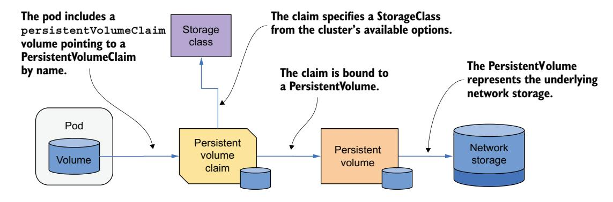
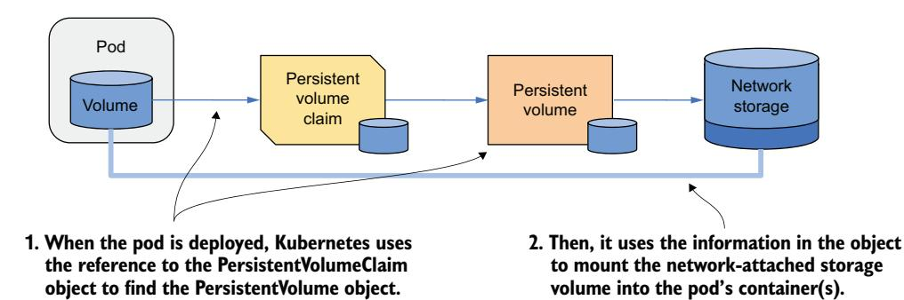
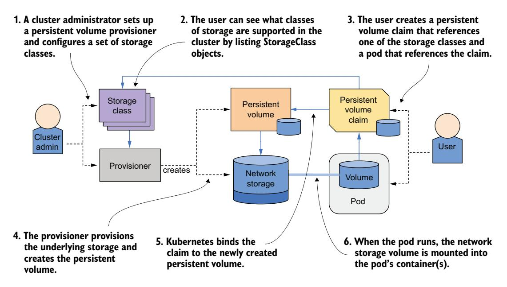
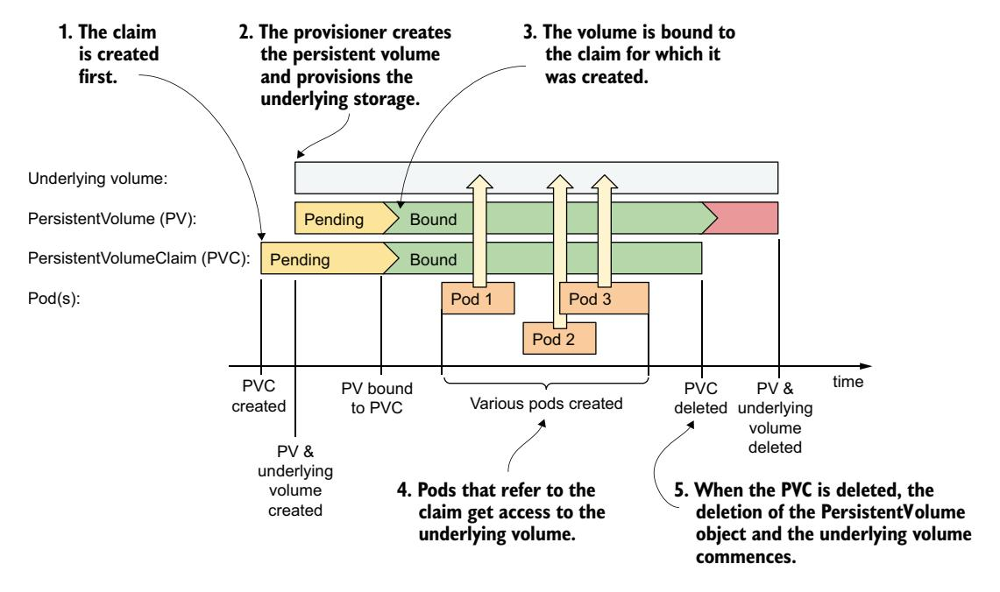
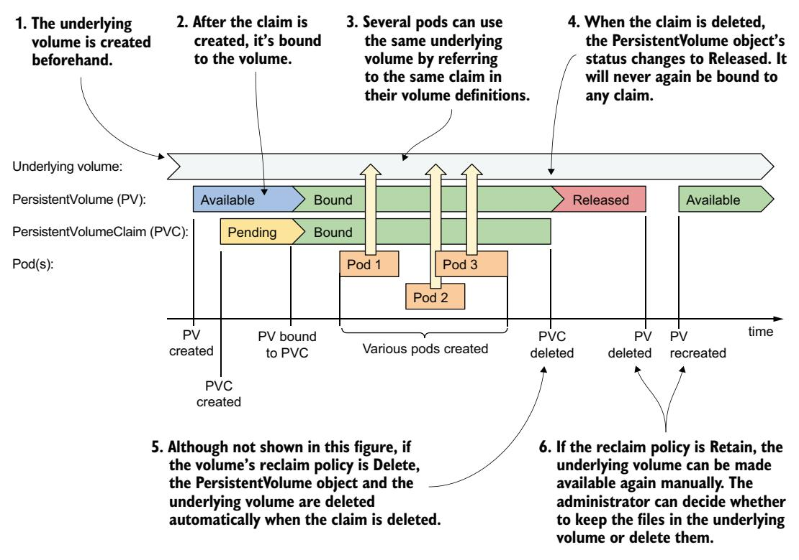

# 第 10 章 使用 PersistentVolume 持久化数据

!!! tip "本章涵盖"

    - 使用 PersistentVolume 对象表示持久存储
    - 通过 PersistentVolumeClaim 声明 PersistentVolume
    - PersistentVolume 的静态供应与动态供应
    - 节点本地存储与网络附加存储
    - 使用 VolumeSnapshot 资源对卷进行快照、克隆和恢复
    - 长期存在的 PersistentVolume 与临时 PersistentVolume

上一章教你如何将临时存储卷挂载到 Pod。在本章中，你将学习如何对持久存储卷做同样的事——持久存储卷既可以是节点本地的，也可以是网络附加的。

!!! note "注意"

    本章的代码文件可在 <https://mng.bz/Qwj4> 获取。

## 10.1 Kubernetes 中的持久存储简介

理想情况下，在 Kubernetes 上部署应用的开发人员不需要了解集群提供了何种存储技术，就像他们不需要了解运行 Pod 的物理服务器的属性一样。基础设施细节应由运维集群的人员管理。

因此，在 Kubernetes 上部署应用时，你通常不会直接引用某个特定的持久存储卷。相反，你只需指定你需要具有一定属性的持久存储，集群会找到匹配这些属性的现有卷，或供应一个新的卷。

### 10.1.1 PersistentVolumeClaim 和 PersistentVolume 简介

当你的 Pod 需要持久存储卷时，你需要创建一个 PersistentVolumeClaim 对象并在 Pod 清单中引用它。你的集群支持一个或多个存储类，由 StorageClass 对象表示。你在 PersistentVolumeClaim 中通过名称指定所需的 StorageClass。

集群会找到匹配的 PersistentVolume 对象或创建一个新对象，然后将其绑定到 PersistentVolumeClaim。PersistentVolume 对象表示底层的网络存储卷。为了更好地理解这些对象之间的关系，请查看图 10.1。



图 10.1 使用 PersistentVolume 和 PersistentVolumeClaim 将网络存储挂载到 Pod

现在让我们仔细看一下这三种 API 资源。

**介绍 PersistentVolume**

顾名思义，PersistentVolume 对象表示用于持久化应用数据的存储卷。如上图所示，PersistentVolume 对象代表底层存储。

PersistentVolume 的底层存储的供应通常由部署在 Kubernetes 集群中的 CSI（Container Storage Interface，容器存储接口）驱动处理。CSI 驱动通常由一个控制器组件（负责动态供应 PersistentVolume）和一个每节点组件（负责挂载和卸载底层存储卷）组成。

目前有许多可用的 CSI 驱动，每种驱动支持一种特定的存储技术。例如，NFS（Network File System）驱动允许 Kubernetes 访问 NFS 服务器，Azure Disk 驱动支持 Microsoft Azure Disk，GCE Persistent Disk 驱动支持 Google Compute Engine Persistent Disk，等等。

!!! tip "提示"

    CSI 驱动的列表可在 <https://mng.bz/X7BE> 查看。

**介绍 PersistentVolumeClaim**

Pod 不直接引用 PersistentVolume 对象，而是指向一个 PersistentVolumeClaim 对象，后者再指向 PersistentVolume。

如其名称所示，PersistentVolumeClaim 对象表示用户对 PersistentVolume 的声明（claim）。由于其生命周期通常不与 Pod 绑定，因此可以将 PersistentVolume 的所有权与 Pod 解耦。用户在 Pod 中使用 PersistentVolume 之前，必须先通过创建 PersistentVolumeClaim 对象来声明该卷。声明卷后，用户对该卷拥有独占权，并可在其 Pod 中使用。用户可以随时删除 Pod，而不会失去对 PersistentVolume 的所有权。当不再需要卷时，用户通过删除 PersistentVolumeClaim 对象来释放该卷。

**介绍 StorageClass**

Kubernetes 集群可以提供不同类别的持久存储，由 StorageClass 资源表示。StorageClass 定义了用于创建该类卷的供应器（provisioner），以及这些卷的附加参数。

创建 PersistentVolumeClaim 时，用户指定他们想要使用的 StorageClass 的名称。如果存储类的命名保持一致性——例如 standard、fast 等——PersistentVolumeClaim 清单就可以在不同集群之间移植，即使每个集群使用不同的底层存储技术也是如此。

!!! warning "重要"

    PersistentVolumeClaim 清单通常由应用开发人员编写，并通常与 Pod 及其他清单一起打包。PersistentVolume 则不然。

**在 Pod 中使用 PersistentVolumeClaim**

在上一章中，你学习了可以在 Pod 中使用的各种卷类型。其中一种未详细说明的类型是 persistentVolumeClaim 卷类型。既然你已经知道 PersistentVolumeClaim 是什么，那么这个 Pod 卷类型的作用应该就很明显了。

在 persistentVolumeClaim 卷定义中，你指定先前创建的 PersistentVolumeClaim 对象的名称，以将关联的 PersistentVolume 绑定到 Pod 中。例如，如果你创建了一个名为 my-nfs-share 的 PersistentVolumeClaim，它绑定到一个由 NFS 文件共享支持的 PersistentVolume，你可以通过在 Pod 中添加一个引用 my-nfs-share PersistentVolumeClaim 对象的 persistentVolumeClaim 卷定义，将 NFS 文件共享挂载到 Pod 中。卷定义不需要包含任何基础设施特定的信息，比如 NFS 服务器的 IP 地址。

如图 10.2 所示，当这个 Pod 被调度到集群节点时，Kubernetes 会找到与 Pod 中引用的声明绑定的 PersistentVolume，并使用 PersistentVolume 对象中的信息将网络存储卷挂载到 Pod 的容器中。



图 10.2 将 PersistentVolume 挂载到 Pod 的容器中

**在多个 Pod 中使用同一个 PersistentVolumeClaim**

多个 Pod 可以通过引用同一个 PersistentVolumeClaim 来使用同一个存储卷，而该 PersistentVolumeClaim 又绑定到同一个 PersistentVolume，如图 10.3 所示。


图 10.3 在多个 Pod 中使用相同的 PersistentVolumeClaim

这些 Pod 是否必须运行在同一个集群节点上，还是可以从不同节点访问底层存储，取决于存储技术。如果存储支持将卷同时附加到多个节点，则不同节点上的 Pod 都可以使用它。否则，所有 Pod 必须调度到最初挂载了该存储卷的节点上。

### 10.1.2 PersistentVolume 的动态供应与静态供应

PersistentVolume 可以通过动态供应或静态供应方式创建。目前，大多数 Kubernetes 集群使用动态供应，它按需自动创建存储卷。然而，静态供应在某些场景下仍然有用，例如管理员预先供应本地存储时。单个集群也可以同时支持两种方式。

**动态供应的工作原理**

在 PersistentVolume 的动态供应中，这些卷是按需创建的。为支持此功能，集群管理员在集群中部署一个或多个 CSI 驱动，并通过 CSIDriver 资源在 Kubernetes API 中注册。此外，还会创建一个或多个引用了各驱动的 StorageClass。当集群用户创建 PersistentVolumeClaim 时，供应器会创建 PersistentVolume 对象并供应底层存储，如图 10.4 所示。

集群管理员不需要预先供应任何 PersistentVolume 对象或底层存储。相反，它们是按需供应的，并在不再需要时自动销毁。



图 10.4 PersistentVolume 的动态供应

动态供应的 PersistentVolume 的生命周期如图 10.5 所示。用户创建 PersistentVolumeClaim 后不久，PersistentVolume 和底层存储即被供应。之后，多个 Pod 可以使用同一个 PersistentVolumeClaim，从而使用同一个 PersistentVolume。PersistentVolumeClaim 和 PersistentVolume 的生命周期不与 Pod 绑定，因此即使没有 Pod 引用 PersistentVolumeClaim，它们也会保留在原位。当 PersistentVolumeClaim 对象被删除时，PersistentVolume 和底层存储通常也会被删除，但如有必要也可以保留。



图 10.5 动态供应的 PersistentVolume、声明以及使用它们的 Pod 的生命周期

**静态供应的工作原理**

在静态供应中，集群管理员必须手动供应底层存储卷，并为每个存储卷创建相应的 PersistentVolume 对象，如图 10.6 所示。然后用户通过创建 PersistentVolumeClaim 来声明这些预先供应的 PersistentVolume。静态供应的 PersistentVolume 的生命周期如图 10.7 所示。

首先，集群管理员供应实际的存储卷。然后创建 PersistentVolume 对象。接着用户创建 PersistentVolumeClaim 对象，在其中可以通过名称引用特定的 PersistentVolume，或者指定要求——例如最小卷大小和所需的访问模式。然后 Kubernetes 尝试将 PersistentVolumeClaim 匹配到满足这些条件的可用 PersistentVolume。


图 10.6 PersistentVolume 的静态供应



图 10.7 静态供应的 PersistentVolume、声明以及使用它们的 Pod 的生命周期

一旦找到合适的匹配，PersistentVolume 就会绑定到 PersistentVolumeClaim，并变得不可用于绑定任何其他 PersistentVolumeClaim。

当引用该 PersistentVolumeClaim 的 Pod 被调度时，绑定的 PersistentVolume 中定义的存储卷会被附加到相应节点，并挂载到 Pod 的容器中。与动态供应的卷一样，多个 Pod 可以使用同一个 PersistentVolumeClaim 和关联的 PersistentVolume。每个 Pod 运行时，底层卷会挂载到 Pod 的容器中。

在所有 Pod 完成运行且不再需要 PersistentVolumeClaim 后，可以将其删除。此时，关联的 PersistentVolume 会被释放。但是，底层存储卷不会自动清理。集群管理员必须手动执行此操作，并在需要时将 PersistentVolume 重新提供给其他用户使用。

## 10.2 动态供应 PersistentVolume

现在你对 PersistentVolume、PersistentVolumeClaim 以及它们与 Pod 的关系有了基本了解，让我们重新审视上一章的 quiz Pod。你可能还记得，这个 Pod 当前使用 emptyDir 卷来存储数据。由于此卷的生命周期与 Pod 绑定，每次删除并重建 Pod 时，所有数据都会丢失。这不是你想要的。你希望你对问题的回答能够持久存储。

你将修改 quiz Pod 的清单，使其使用动态供应的 PersistentVolume。为此，你首先需要创建一个 PersistentVolumeClaim。

### 10.2.1 创建 PersistentVolumeClaim

如今大多数集群至少带有一个 StorageClass。那些包含多个 StorageClass 的集群通常会将其中的一个标记为默认类，因此在大多数集群中你应该可以在不关心存储类的情况下创建 PersistentVolumeClaim。由于这是创建 PersistentVolumeClaim 的最简单方式，我们将从这里开始。关于 StorageClass 的更多内容将在本章后面学习。

**编写 PersistentVolumeClaim 清单**

创建一个不显式指定存储类的 PersistentVolumeClaim 可以使清单尽可能简洁，并能在所有定义了默认 StorageClass 的集群之间移植。以下清单展示了来自文件 pvc.quiz-data.default.yaml 的 PersistentVolumeClaim 清单。

**清单 10.1 使用默认存储类的最小 PVC 定义**

```yaml
apiVersion: v1
kind: PersistentVolumeClaim
metadata:
  name: quiz-data
spec:
  resources:
    requests:
      storage: 1Gi
  accessModes:
    - ReadWriteOncePod
```

该清单中的 PersistentVolumeClaim 仅定义了卷的最小大小和所需的访问模式。这些是 PersistentVolumeClaim 中仅有的必需值，但 storageClassName 字段可以说是最重要的字段。

**指定 StorageClass 名称**

集群通常提供多个类别的存储。它们由 StorageClass 资源表示，这意味着你可以通过运行以下命令查看可用选项（输出因空间限制重新编排了格式）：

```bash
$ kubectl get sc
NAME                 PROVISIONER                   RECLAIMPOLICY   ...
premium-rwo          pd.csi.storage.gke.io         Delete          ...
standard             kubernetes.io/gce-pd          Delete          ...
standard-rwo (default) pd.csi.storage.gke.io       Delete          ...
...
```

!!! note "注意"

    storageclass 的简写是 sc。

在撰写本文时，GKE 提供了三个 StorageClass，其中 standard-rwo StorageClass 为默认类。由 Kind 创建的集群提供单个 StorageClass：

```bash
$ kubectl get sc
NAME                 PROVISIONER                   RECLAIMPOLICY   ...
standard (default)   rancher.io/local-path         Delete          ...
```

创建 PersistentVolumeClaim 时，你可以指定要使用的 StorageClass，如下面的清单所示；如果不指定，则使用集群的默认 StorageClass。

**清单 10.2 请求特定存储类的 PersistentVolumeClaim**

```yaml
apiVersion: v1
kind: PersistentVolumeClaim
metadata:
  name: quiz-data
spec:
  storageClassName: premium-rwo
  resources:
    requests:
      storage: 1Gi
  accessModes:
    - ReadWriteOncePod
```

!!! note "注意"

    如果 PersistentVolumeClaim 引用了不存在的 StorageClass，该声明将保持 Pending 状态。Kubernetes 会定期尝试绑定该声明，每次都会生成一个 ProvisioningFailed 事件。你可以通过运行 kubectl describe 命令查看 PersistentVolumeClaim 的事件。

**指定最小卷大小**

PersistentVolumeClaim 的 spec 中的 resources.requests.storage 字段指定了所需底层卷的最小大小。对于动态供应的 PersistentVolume，供应的卷通常正好是所请求的大小。对于静态供应的情况，Kubernetes 在选择要绑定到 PersistentVolumeClaim 的卷时，只会考虑容量等于或大于所请求大小的 PersistentVolume。

**指定访问模式**

PersistentVolumeClaim 必须指定卷必须支持的访问模式。根据底层技术的不同，PersistentVolume 可能支持也可能不支持以读/写或只读模式同时被多个节点或 Pod 挂载。

共有四种访问模式。它们及其 kubectl 显示的缩写形式在下表 10.1 中说明。

| 访问模式 | 缩写 | 说明 |
|---------|------|------|
| ReadWriteOncePod | RWOP | 整个集群中只能被单个 Pod 以读/写模式挂载。 |
| ReadWriteOnce | RWO | 卷可以被单个集群节点以读/写模式挂载。当它挂载到该节点时，其他节点无法挂载该卷。但是，该节点上的多个 Pod 都可以对该卷进行读写。 |
| ReadWriteMany | RWX | 卷可以同时以读/写模式挂载在多个工作节点上。 |
| ReadOnlyMany | ROX | 卷可以同时以只读模式挂载在多个工作节点上。 |

表 10.1 持久卷访问模式

!!! note "注意"

    ReadOnlyOnce 选项不存在。如果你在不需要写入卷的 Pod 中使用 ReadWriteOnce 卷，可以将卷以只读模式挂载。

quiz Pod 需要对卷进行读写，并且你只会运行一个 Pod 实例，因此你在 PersistentVolumeClaim 中请求 ReadWriteOncePod 访问模式。

**指定卷模式**

PersistentVolume 的底层存储卷可以是带有文件系统的格式化卷，也可以是不带文件系统的原始块设备。PersistentVolumeClaim 可以通过在 spec 中指定 volumeMode 字段来指明所需卷的类型。支持两种选项，如下表 10.2 所示。

| 卷模式 | 说明 |
|-------|------|
| Filesystem | 当 PersistentVolume 挂载到容器中时，它被挂载到容器文件树中的某个目录下。这是默认的卷模式。 |
| Block | 当 Pod 使用此模式的 PersistentVolume 时，卷作为原始块设备（无文件系统）提供给容器中的应用程序。这允许应用程序在没有文件系统开销的情况下进行数据读写。此模式通常用于特殊类型的应用程序，如数据库系统。 |

表 10.2 配置 PersistentVolume 的卷模式

前面清单中的 quiz-data PersistentVolumeClaim 清单没有指定 volumeMode 字段，因此默认请求的是文件系统卷。

**从清单创建 PersistentVolumeClaim**

通过使用 kubectl apply 应用清单文件来创建 PersistentVolumeClaim。然后通过使用 kubectl get 检查 PersistentVolumeClaim 来查看它使用了哪个 StorageClass。以下是撰写本文时在 GKE 上的输出（部分列因空间限制而省略）：

```bash
$ kubectl get pvc
NAME        STATUS    ... STORAGECLASS   ... AGE
quiz-data   Pending   ... standard-rwo  ... 20s
```

!!! tip "提示"

    使用 pvc 作为 persistentvolumeclaim 的简写。

注意输出中的 STATUS 列和 STORAGECLASS 列。以下三种情况可能发生：

- 如果 STATUS 显示为 Bound，这意味着 PersistentVolumeClaim 已经绑定到一个 PersistentVolume。
- 如果 STATUS 显示为 Pending 且 STORAGECLASS 非空，那么显然 PersistentVolumeClaim 尚未绑定，但你的集群确实提供了默认 StorageClass。
- 如果 STATUS 显示为 Pending 且 STORAGECLASS 为空，那么你的集群没有提供默认 StorageClass。请尝试使用提供默认 StorageClass 的其他 Kubernetes 集群。

PersistentVolumeClaim 在某些集群中立即绑定到 PersistentVolume 而在其他集群中不是，其原因是不同的 StorageClass 使用不同的卷绑定模式。有些会立即供应 PersistentVolume，而有些会等到第一个使用该 PersistentVolumeClaim 的 Pod 被调度时才供应。这将在后面关于 StorageClass 的小节中解释。现在，让我们先创建 Pod，以便 PersistentVolume 在尚未供应的情况下被供应。

### 10.2.2 使用 PersistentVolumeClaim

PersistentVolumeClaim 是一个独立的对象，表示对 PersistentVolume 的声明。此声明随后可用于为一个或多个 Pod 提供 PersistentVolume。

**在 Pod 清单中定义一个 persistentVolumeClaim 卷**

要在 Pod 中使用 PersistentVolume，你需要定义一个 persistentVolumeClaim 卷，该卷引用 PersistentVolumeClaim 对象。为尝试此操作，你将修改上一章的 quiz Pod，使其使用你在上一节中创建的 quiz-data PersistentVolumeClaim。Pod 清单的更改已在下列清单中高亮显示。你可以在文件 pod.quiz.yaml 中找到完整的清单。

**清单 10.3 使用 persistentVolumeClaim 卷的 Pod**

```yaml
apiVersion: v1
kind: Pod
metadata:
  name: quiz
spec:
  volumes:
  - name: quiz-data
    persistentVolumeClaim:
      claimName: quiz-data
  containers:
  - name: quiz-api
    image: luksa/quiz-api:0.1
    ports:
    - name: http
      containerPort: 8080
  - name: mongo
    image: mongo
    volumeMounts:
    - name: quiz-data
      mountPath: /data/db
```

如清单所示，向 Pod 添加 persistentVolumeClaim 卷非常简单。你只需要在 claimName 字段中指定 PersistentVolumeClaim 的名称，仅此而已。唯一可以设置的其他字段是 readOnly 字段，该字段会强制此卷的所有挂载为只读。

当你创建 Pod 时，之前创建的 PersistentVolumeClaim 应该最终绑定到一个 PersistentVolume——如果之前尚未绑定的话。让我们来检查一下：

```bash
$ kubectl get pvc quiz-data
NAME        STATUS  VOLUME                CAPACITY  ACCESS MODES  ...
quiz-data   Bound   pvc-5d9b8a8b-...      1Gi       RWOP          ...
```

现在使用以下命令检查底层的 PersistentVolume（注意：输出因空间限制重新编排了格式）：

```bash
$ kubectl get pv
NAME                CAPACITY  ACCESS MODES  RECLAIM POLICY  STATUS
pvc-5d9b8a8b-...    1Gi       RWOP          Delete           Bound
CLAIM                 STORAGECLASS   VOLUMEATTRIBUTESCLASS  REASON  AGE
default/quiz-data     standard-rwo   <unset>                        27m
```

!!! tip "提示"

    使用 pv 作为 persistentvolume 的简写。

该 PersistentVolume 是按需创建的，其属性完全匹配 PersistentVolumeClaim 和关联的 StorageClass 中指定的要求。卷容量为 1Gi，访问模式为 RWOP（ReadWriteOncePod）。

PersistentVolume 也显示为 Bound 状态。绑定的 PersistentVolumeClaim 名称也被显示出来，因此你在列出它们时总能知道每个 PersistentVolume 被用在哪里。

由于这是一个新卷，数据库是空的。运行 insert-questions.sh 脚本来初始化它，然后确保 quiz Pod 可以按如下方式从数据库返回一个随机问题：

```bash
$ kubectl get --raw /api/v1/namespaces/default/pods/quiz/proxy/questions/random
```

如果该命令以 JSON 格式显示了一个问题对象，那么一切正常。quiz Pod 使用了一个附加到 Pod 所在节点的存储卷，该卷被挂载到 mongo 容器中。图 10.8 展示了 Pod、PersistentVolumeClaim、PersistentVolume 和底层存储卷。

**分离 PersistentVolumeClaim 和 PersistentVolume**

当你删除一个通过 PersistentVolumeClaim 使用 PersistentVolume 的 Pod 时，如果它是该节点上唯一使用它的 Pod，底层存储卷会从集群节点上分离。如果其他 Pod 使用了同一个 PersistentVolumeClaim，则 PersistentVolume 保持挂载在该节点上。现在尝试删除 quiz Pod，然后检查 PersistentVolumeClaim。

即使所有使用 PersistentVolumeClaim 的 Pod 都被删除，PersistentVolumeClaim 也会继续存在，直到你删除它为止。在此之前，PersistentVolume 对象保持绑定到 PersistentVolumeClaim。这意味着你可以在另一个 Pod 中使用同一个 PersistentVolumeClaim。


图 10.8 quiz Pod 及其 PersistentVolume

**在新的 Pod 中重用持久卷声明**

当你创建另一个引用同一个 PersistentVolumeClaim 的 Pod 时，新 Pod 会访问由 PersistentVolume 所代表的相同存储及其包含的文件。通常，Pod 是否被调度到同一个节点并不重要。让我们来看实际效果。通过运行以下命令重建 quiz Pod：

```bash
$ kubectl apply -f pod.quiz.yaml
pod/quiz created
```

等待 Pod 被调度，然后检查它是否从数据库返回了一个随机问题，这意味着卷中的文件现在在新 Pod 中可用。请记住，Pod 是临时的；它们会不断被替换。quiz Pod 现在使用了 PersistentVolume，这确保了数据在 quiz Pod 的最新实例中可用，无论 Pod 在节点之间移动了多少次。

### 10.2.3 删除 PersistentVolumeClaim 和 PersistentVolume

当你不再计划部署使用某个 PersistentVolumeClaim 的 Pod 时，可以删除它以释放关联的 PersistentVolume。你可能想知道是否可以重新创建该声明并访问相同的卷和数据。让我们来一探究竟。按如下方式删除 Pod 和声明，看看会发生什么：

```bash
$ kubectl delete pod quiz
pod "quiz" deleted
$ kubectl delete pvc quiz-data
persistentvolumeclaim "quiz-data" deleted
```

现在检查 PersistentVolume 的状态：

```bash
$ kubectl get pv quiz-data
NAME        ... RECLAIM POLICY  STATUS     CLAIM               ...
quiz-data   ... Delete           Released   default/quiz-data   ...
```

STATUS 列显示卷为 Released 而非最初的 Available。CLAIM 列显示了释放此 PersistentVolume 的 quiz-data PersistentVolumeClaim。该 PersistentVolume 的 RECLAIM POLICY 设置为 Delete，这意味着 Kubernetes 将删除它。

**关于 PersistentVolume 的回收策略**

PersistentVolume 被释放后会发生什么，取决于 PersistentVolume 的回收策略（reclaim policy）。此策略使用 PersistentVolume 对象的 spec 中的 persistentVolumeReclaimPolicy 字段进行配置。回收策略也在 StorageClass 的 reclaimPolicy 字段中指定。该字段可以有以下三种值，如下表 10.3 所示。

| 回收策略 | 说明 |
|---------|------|
| Retain | 当 PersistentVolume 被释放时（当你删除绑定到它的声明时发生），Kubernetes 保留该卷。集群管理员必须手动回收该卷。这是手动创建的 PersistentVolume 的默认策略。 |
| Delete | PersistentVolume 对象和底层存储在释放时自动删除。这是动态供应的 PersistentVolume 的默认策略，将在下一节讨论。 |
| Recycle | 此选项已弃用，不应使用，因为底层卷插件可能不支持它。此策略通常会导致卷上的所有文件被删除，并使 PersistentVolume 再次可用，而无需删除和重建它。 |

!!! tip "提示"

    你可以随时更改现有 PersistentVolume 的回收策略。如果初始设置为 Delete，但你不想在删除声明时丢失数据，请在删除声明之前将卷的策略更改为 Retain。

!!! warning "警告"

    如果 PersistentVolume 处于 Released 状态，而你随后将其回收策略从 Retain 更改为 Delete，则 PersistentVolume 对象和底层存储将被删除。

### 10.2.4 理解访问模式

Kubernetes 中的 PersistentVolume 支持四种访问模式，如前面表 10.1 所列。它们值得更仔细地审视。

**ReadWriteOncePod 访问模式**

quiz Pod 中使用的 PersistentVolume 一次只被一个 Pod 实例使用，正如 PersistentVolumeClaim 中的 ReadWriteOncePod 访问模式所指定的那样。该卷被挂载到单个节点，挂载到可以对卷中的文件进行读写的单个 Pod 中。

如果你尝试运行第二个使用同一 PersistentVolumeClaim 的 quiz Pod，该 Pod 的状态将保持 Pending，如下面命令输出所示：

```bash
$ kubectl get pods
NAME   READY  STATUS    RESTARTS  AGE
quiz   2/2    Running   0         20m
quiz2  0/2    Pending   0         12m
```

!!! note "注意"

    如果你想自己尝试，请从 pod.quiz2.yaml 文件部署 Pod。

这种行为是预期中的，因为 ReadWriteOncePod 访问模式与其他访问模式不同，它不允许卷同时被多个 Pod 使用。

**ReadWriteOnce 访问模式**

ReadWriteOnce 访问模式看似与 ReadWriteOncePod 相同，但实际上并非如此；此模式允许单个**节点**而非单个 Pod 挂载卷。如果多个 Pod 运行在同一个节点上，它们都可以使用该卷。

尝试从 pvc.demo-read-write-once.yaml 文件创建 PersistentVolumeClaim。然后从 pod.demo-read-write-once.yaml 文件创建多个 Pod，如下面的清单所示。

**清单 10.4 demo-read-write-once Pod 清单**

```yaml
apiVersion: v1
kind: Pod
metadata:
  generateName: demo-read-write-once-
  labels:
    app: demo-read-write-once
spec:
  volumes:
  - name: volume
    persistentVolumeClaim:
      claimName: demo-read-write-once
  containers:
  - name: main
    image: busybox
    command:
    - sh
    - -c
    - |
      echo "I can read from the volume; these are its files:" ;
      ls /mnt/volume ;
      echo ;
      echo "Created by pod $HOSTNAME." > /mnt/volume/$HOSTNAME.txt &&
      echo "I can also write to the volume." &&
      echo "Wrote file /mnt/volume/$HOSTNAME" ;
      sleep infinity
    volumeMounts:
    - name: volume
      mountPath: /mnt/volume
```

通过多次运行 kubectl create -f pod.demo-read-write-once.yaml 命令，从此清单创建 Pod。

!!! note "注意"

    当清单使用 generateName 字段而不是指定 Pod 名称时，你不能使用 kubectl apply，而必须使用 kubectl create。

现在使用 -o wide 选项显示 Pod 列表，以便查看每个 Pod 部署在哪个节点上：

```bash
$ kubectl get pods -l app=demo-read-write-once -o wide
NAME                         READY  STATUS              NODE
demo-read-write-once-4ltgn   1/1    Running             node-36xk
demo-read-write-once-4qjqx   1/1    Running             node-36xk
demo-read-write-once-8msr4   1/1    Running             node-36xk
demo-read-write-once-w8wkj   0/1    ContainerCreating   node-334g
demo-read-write-once-5j24w   0/1    ContainerCreating   node-334g
```

!!! note "注意"

    命令输出为简洁起见进行了编辑。

如果你所有的 Pod 都位于同一个节点上，请再创建几个。然后查看这些 Pod 的 STATUS。你会发现调度到同一节点的所有 Pod 都能正常运行，而其他节点上的 Pod 都卡在 ContainerCreating 状态。

如果你使用 kubectl describe 查看其中一个 Pod 的相关事件，你会发现它无法运行，因为 PersistentVolume 无法挂载到该 Pod 所在的节点：

```bash
$ kubectl describe po data-writer-97t9j
...
  Warning  FailedAttachVolume  16m  attachdetach-controller  Multi-Attach error for
           volume "pvc-fcc8236e-dd68-466b-9fc3-96bcf96d3a21" Volume is already
           used by pod(s) demo-read-write-once-8msr4, demo-read-write-once-p92gw,
           demo-read-write-once-4qjqx, demo-read-write-once-4ltgn, demo-read-write-once-ld9k6
```

卷无法挂载的原因是它已经以读/写模式挂载到第一个节点。这意味着只有一个节点可以以读/写模式挂载该卷。当第二个节点尝试执行相同操作时，操作会失败。

第一个节点上的所有 Pod 都运行正常。检查它们的日志以确认它们都能在卷中写入文件。以下是其中一个 Pod 的日志：

```bash
$ kubectl logs demo-read-write-once-4ltgn
I can read from the volume; these are its files:
demo-read-write-once-4qjqx.txt
demo-read-write-once-8msr4.txt
I can also write to the volume.
Wrote file /mnt/volume/demo-read-write-once-4ltgn
```

你会发现第一个节点上的所有 Pod 都成功地将它们的文件写入了卷。你现在可以删除这些 Pod，但请保留 PersistentVolumeClaim，因为稍后你还会用到它。删除这些 Pod 的最简单方式是使用带标签选择器的 kubectl delete 命令：

```bash
$ kubectl delete pods -l app=demo-read-write-once
```

**ReadWriteMany 访问模式**

正如 ReadWriteMany 访问模式的名称所示，支持此模式的卷可以同时挂载到多个集群节点，并且仍然允许在卷上执行读写操作。但是，并非所有存储技术都支持此模式。

例如，在撰写本文时，Google Kubernetes Engine 中没有一个默认的 StorageClass 支持 ReadWriteMany。但当你使用以下命令启用 GcpFilestoreCsiDriver 时，将出现几个支持 ReadWriteMany 的新 StorageClass：

```bash
$ gcloud container clusters update <cluster-name> \
  --update-addons=GcpFilestoreCsiDriver=ENABLED
```

!!! note "注意"

    你还需要在 Google 控制台中启用 Cloud Filestore API。

由于此模式对可以使用 PersistentVolume 的节点或 Pod 数量没有限制，无论是读/写模式还是只读模式，因此不需要进一步解释。如果你想尝试，请在 pvc.demo-read-write-many.yaml 清单文件中设置正确的 storageClassName 并将其应用到你的集群，以部署 PersistentVolumeClaim。然后从 pod.demo-read-write-many.yaml 文件创建几个 Pod，看看它们是否都能对卷进行读写，尽管被调度到了不同的节点。

!!! tip "提示"

    你可以使用 kubectl delete pods,pvc -l app=demo-read-write-many 命令删除 Pod 和 PersistentVolumeClaim。

**ReadOnlyMany 访问模式和克隆 PersistentVolumeClaim**

我们需要介绍的最后一个访问模式是 ReadOnlyMany，它在使用动态供应时与其他模式有所不同。你显然不能对 ReadOnlyMany 卷进行写入，只能从中读取。但正如你所知，在动态供应中，会为你的 PersistentVolumeClaim 创建一个**新**的 PersistentVolume。新卷自然是空的，因此除非你能以某种方式预填充数据，否则以只读模式使用它毫无意义。这正是你在使用 ReadOnlyMany 访问模式和动态供应卷时需要做的事。

Kubernetes 允许你在 PersistentVolumeClaim 中定义一个数据源。当 PersistentVolume 被供应时，它会使用来自数据源的数据进行初始化，然后才被挂载到你的 Pod 中。支持不同类型的数据源。这里我们只关注使用另一个 PersistentVolumeClaim（或者说其关联的 PersistentVolume）作为数据源。让我们看一个例子。

你将使用 demo-read-write-once PersistentVolumeClaim 作为数据源。以下清单展示了 demo-read-only-many PersistentVolumeClaim 的清单。你可以在文件 pvc.demo-read-only-many.yaml 中找到它。

**清单 10.5 使用另一个 PersistentVolumeClaim 初始化 PersistentVolumeClaim**

```yaml
apiVersion: v1
kind: PersistentVolumeClaim
metadata:
  name: demo-read-only-many
  labels:
    app: demo-read-only-many
spec:
  resources:
    requests:
      storage: 1Gi
  accessModes:
  - ReadOnlyMany
  dataSourceRef:
    kind: PersistentVolumeClaim
    name: demo-read-write-once
```

如清单所示，使用另一个 PersistentVolumeClaim 作为数据源非常简单。你只需要在 dataSourceRef 字段中指定要用作数据源的对象的 kind 和 name。

!!! note "注意"

    你可以使用这种方法将任何 PersistentVolume 克隆到一个新的 PersistentVolume，无论它们的访问模式如何。

!!! note "注意"

    除 dataSourceRef 字段外，PersistentVolumeClaim 还有一个名为 dataSource 的类似字段，但此字段预计将来会被弃用。

要将 PersistentVolume 以只读模式挂载到 Pod 中，请在 persistentVolumeClaim 卷定义中设置 readOnly 字段，如下面清单（来自文件 pod.demo-read-only-many.yaml）所示。

**清单 10.6 以只读模式使用共享 PersistentVolume 的 Pod**

```yaml
apiVersion: v1
kind: Pod
metadata:
  generateName: demo-read-only-many-
  labels:
    app: demo-read-only-many
spec:
  volumes:
  - name: volume
    persistentVolumeClaim:
      claimName: demo-read-only-many
      readOnly: true
  containers:
  - name: main
    image: busybox
    command:
    - sh
    - -c
    - |
      echo "I can read from the volume; these are its files:" ;
      ls /mnt/volume ;
      sleep infinity
    volumeMounts:
    - name: volume
      mountPath: /mnt/volume
```

使用 kubectl create 命令创建足够多的这些 reader Pod，以确保至少有两个不同的节点运行了此 Pod 的实例。使用 kubectl get po -o wide 命令查看每个节点上有多少个 Pod。

选择一个 Pod 并检查其日志，以确认卷中包含来自用作数据源的 PersistentVolumeClaim 的文件。你应该看到由 demo-read-write-once Pod 创建的文件，如下例所示：

```bash
$ kubectl logs demo-read-only-many-2mxjp
I can read from the volume; these are its files:
demo-read-write-once-4ltgn.txt
demo-read-write-once-4qjqx.txt
...
```

你现在可以删除所有演示 Pod 和 PersistentVolumeClaim，因为你已经用完它们了。

### 10.2.5 理解 StorageClass

如前所述，storageClassName 可以说是 PersistentVolumeClaim 中最重要的属性。它指定应该供应哪种类别的持久存储。集群通常会提供多个类别，由 StorageClass 对象表示。安装额外的 CSI 驱动后，可能会有更多可用的存储类。关于 CSI 驱动将在后面详细介绍。

以下是安装 GcpFilestoreCsiDriver 附加组件后，GKE 上可用 StorageClass 的列表：

```bash
$ kubectl get sc
NAME                       PROVISIONER                     RECLAIMPOLICY
enterprise-multishare-rwx  filestore.csi.storage.gke.io    Delete
enterprise-rwx             filestore.csi.storage.gke.io    Delete
premium-rwo                pd.csi.storage.gke.io           Delete
premium-rwx                filestore.csi.storage.gke.io    Delete
standard                   kubernetes.io/gce-pd            Delete
standard-rwo (default)     pd.csi.storage.gke.io           Delete
standard-rwx               filestore.csi.storage.gke.io    Delete
zonal-rwx                  filestore.csi.storage.gke.io    Delete
```

!!! note "注意"

    storageclass 的简写是 sc。

另外三列（VOLUMEBINDINGMODE、ALLOWVOLUMEEXPANSION 和 AGE）因空间限制未显示。你已经知道 AGE；另外两个将在后面解释。

如你所见，GKE 大致提供了三组 StorageClass：standard、premium 和 enterprise。它们又进一步根据是否支持 rwx（ReadWriteMany）或 rwo（ReadWriteOnce）访问模式进行划分。不同的集群会提供不同的 StorageClass，但通常会有一个是默认类。

如图 10.9 所示，每个存储类指定了使用哪个供应器以及在供应卷时应传递给供应器的参数。用户决定为其每个 PersistentVolumeClaim 使用哪个 StorageClass。


图 10.9 StorageClass、PersistentVolumeClaim 和卷供应器之间的关系

**检查默认存储类**

让我们通过使用 kubectl get 命令检查 GKE 中 standard-rwo StorageClass 对象的 YAML 来进一步了解 StorageClass 资源：

```bash
$ kubectl get sc standard-rwo -o yaml
allowVolumeExpansion: true
apiVersion: storage.k8s.io/v1
kind: StorageClass
metadata:
  annotations:
    components.gke.io/component-name: pdcsi
    components.gke.io/component-version: 0.21.32
    components.gke.io/layer: addon
    storageclass.kubernetes.io/is-default-class: "true"
  creationTimestamp: "2025-07-07T07:31:57Z"
  labels:
    addonmanager.kubernetes.io/mode: EnsureExists
    k8s-app: gcp-compute-persistent-disk-csi-driver
  name: standard-rwo
  resourceVersion: "1751873517609007007"
  uid: 6a6a1c0c-48e7-4c10-ab3c-63ad23e0a9a3
parameters:
  type: pd-balanced
provisioner: pd.csi.storage.gke.io
reclaimPolicy: Delete
volumeBindingMode: WaitForFirstConsumer
```

!!! note "注意"

    你会注意到 StorageClass 对象没有 spec 或 status 部分。这是因为该对象只包含静态信息。由于对象的字段没有组织在这两个部分中，YAML 清单可能更难阅读。此外，YAML 中的字段通常按字母顺序显示，这意味着某些字段可能出现在 apiVersion、kind 或 metadata 字段之上。不要忽略它们。

如清单中所指定，当你在 GKE 中创建引用 standard-rwo 类的 PersistentVolumeClaim 时，供应器 pd.csi.storage.gke.io 会被调用以供应 PersistentVolume。在 StorageClass 中指定的参数会被传递给供应器，因此即使多个 StorageClass 使用同一个供应器，它们也可以通过指定不同的参数集来提供不同类型的存储。

**理解动态供应的卷实际何时被供应**

StorageClass 中的 volumeBindingMode 指示 PersistentVolume 是在 PersistentVolumeClaim 创建时立即绑定，还是只在第一个使用该声明的 Pod 被调度时才绑定。GKE 上的 standard StorageClass 使用 Immediate，而所有其他 StorageClass 都使用 WaitForFirstConsumer 卷绑定模式。这两种模式在下表 10.4 中进行了说明。

| 卷绑定模式 | 说明 |
|-----------|------|
| Immediate | PersistentVolume 的供应和绑定在 PersistentVolumeClaim 创建后立即进行。由于此时声明的使用者未知，此模式仅适用于可以从任何集群节点访问的卷。 |
| WaitForFirstConsumer | PersistentVolume 在创建引用此声明的第一个 Pod 时才被供应并绑定到 PersistentVolumeClaim。现在许多 StorageClass 使用此模式。 |

表 10.4 支持的卷绑定模式

**StorageClass 的其他字段**

StorageClass 对象还支持我们未涵盖的其他几个字段。allowVolumeExpansion 和 reclaimPolicy 将在后面解释，你可以使用 kubectl explain 了解其他字段。

**创建额外的存储类**

如前所述，多个 StorageClass 可以使用同一个供应器但不同的参数。这意味着如果你知道供应器支持的参数，通常可以向集群添加额外的 StorageClass。此外，你还可以安装供应器来为集群增添对其他存储技术的支持。这些通常是 CSI 驱动的一部分，接下来你将学习这些内容。

### 10.2.6 关于 CSI 驱动

在 PersistentVolume 的早期，Kubernetes 代码库中包含了对许多不同存储技术的支持。现在，这些代码中的大部分已经移出（"out-of-tree"），即移到核心 Kubernetes 代码之外，存在于各种 CSI 驱动中。这使得无需更改 Kubernetes 代码或 API 即可添加对新存储技术的支持。

正如引言中所解释的，每个 CSI 驱动通常由一个控制器组件（负责动态供应 PersistentVolume）和一个每节点组件（负责挂载和卸载底层存储卷）组成。

**介绍 CSIDriver 资源**

你的 Kubernetes 集群中可能安装了一个或多个 CSI 驱动。它们由 CSIDriver 资源表示，这意味着你可以轻松地使用 kubectl get 命令列出支持的驱动。例如，我的 GKE 集群当前提供了两个：

```bash
$ kubectl get csidrivers
NAME                            MODES         AGE
filestore.csi.storage.gke.io   Persistent    17h
pd.csi.storage.gke.io          Persistent    25h
```

你会注意到，CSIDriver 的名称与你之前检查的 StorageClass 中的 provisioner 字段值相匹配。

**检查 CSIDriver 对象**

让我们快速检查一下 pd.csi.storage.gke.io CSIDriver，它在所有 GKE 集群中都可用：

```bash
$ kubectl get csidriver pd.csi.storage.gke.io -o yaml
apiVersion: storage.k8s.io/v1
kind: CSIDriver
metadata:
  annotations:
    components.gke.io/component-name: pdcsi
    components.gke.io/component-version: 0.21.32
    components.gke.io/layer: addon
  creationTimestamp: "2025-07-07T07:31:55Z"
  labels:
    addonmanager.kubernetes.io/mode: Reconcile
    k8s-app: gcp-compute-persistent-disk-csi-driver
  name: pd.csi.storage.gke.io
  resourceVersion: "1751873515365679015"
  uid: 064f5216-2d7c-441a-af81-8a30982c9a7c
spec:
  attachRequired: true
  fsGroupPolicy: ReadWriteOnceWithFSType
  podInfoOnMount: false
  requiresRepublish: false
  seLinuxMount: false
  storageCapacity: false
  volumeLifecycleModes:
  - Persistent
```

CSIDriver 的 spec 部分中的信息主要用于告诉 Kubernetes 如何与驱动交互，属于非常底层的细节，因此我不再进一步解释。你可以使用 kubectl explain csidriver.spec 命令了解更多信息。

通常你不会手动创建 CSIDriver 对象。相反，每个 CSIDriver 供应商会提供相应的清单，并且它可能会在驱动安装过程中自动创建。

**关于控制器和节点级代理**

CSI 驱动通常由两个组件组成。一个是控制器，负责管理与使用该 CSI 驱动的 StorageClass 关联的 PersistentVolume 的管理；另一个是在每个集群节点上运行的代理，负责当 Pod 使用由此 CSI 驱动处理的 PersistentVolume 时，将存储卷挂载到节点和从节点卸载。

你通常可以在 kube-system 命名空间或集群中的其他命名空间内找到节点级 Pod。例如，在 GKE 中，你会为集群的每个节点找到一个名为 pdcsi-node-xyz 的 Pod。

## 10.3 静态供应 PersistentVolume

静态供应需要预先供应一个或多个持久存储卷，创建 PersistentVolume 对象来表示它们，然后让 Kubernetes 为用户创建的每个 PersistentVolumeClaim 查找合适的现有 PersistentVolume。你可以使用任何受支持的存储技术来预先供应 PersistentVolume。这类似于 StorageClasses 中引用的自动供应器所做的操作。不同之处在于，PersistentVolume 是在 PersistentVolumeClaim 之前创建的，后者随后声明它。

作为示例，本节将教你如何静态供应节点本地 PersistentVolume。这些通常使用节点自身的设备来提供存储。网络附加存储的静态供应过程类似，因此你应该能够通过大致遵循相同的说明来理解如何操作。

### 10.3.1 创建节点本地 PersistentVolume

在本章前面的小节中，你使用了 PersistentVolume 和声明来为你的 Pod 提供网络附加存储卷。然而，一些应用程序最适合使用本地附加存储，这就是节点本地 PersistentVolume 的用武之地。

在上一章中，你学习了如果希望 Pod 访问宿主机文件系统的某个部分，可以在 Pod 中使用 hostPath 卷。现在，你将学习如何使用 PersistentVolume 做同样的事。

你可能还记得，当你向 Pod 添加 hostPath 卷时，Pod 看到的数据取决于 Pod 被调度到哪个节点。换句话说，如果 Pod 被删除并重建，它可能最终落在另一个节点上，从而不再能访问相同的数据。

如果你使用本地 PersistentVolume，此问题就能得到解决。Kubernetes 调度器确保 Pod 始终被调度到本地卷所挂载的节点上。

!!! note "注意"

    本地 PersistentVolume 也比 hostPath 卷更好，因为它们提供了更好的安全性。如上一章所述，你根本不想允许普通用户使用 hostPath 卷。由于 PersistentVolume 由集群管理员管理，普通用户无法使用它们访问宿主机节点上的任意路径。

**创建本地 PersistentVolume**

假设你是一名集群管理员，你刚刚在某个集群节点中安装了一块超低延迟磁盘。如果你使用的是 GKE，可以通过在一个节点上创建一个新目录来模拟添加此磁盘。运行以下命令登录到某个节点：

```bash
$ gcloud compute ssh <node-name>
```

然后，通过在该节点上运行以下命令来创建目录：

```bash
$ mkdir /tmp/my-disk
```

如果你使用的是通过 kind 工具创建的 Kubernetes 集群来运行本练习，可以按如下方式创建目录：

```bash
$ docker exec kind-worker mkdir /tmp/my-disk
```

如果你使用的是不同的集群，创建目录的过程应该非常相似。请参考你的集群提供商的文档，了解如何通过 SSH 登录到你的某个节点。

**创建表示本地存储的存储类**

这块新磁盘代表了集群中的一种新的存储类，因此创建一个新的 StorageClass 对象来表示它是合理的。创建一个新的 StorageClass 清单，如以下清单所示。你可以在文件 sc.local.yaml 中找到它。

**清单 10.7 定义本地存储类**

```yaml
apiVersion: storage.k8s.io/v1
kind: StorageClass
metadata:
  name: local
provisioner: kubernetes.io/no-provisioner
volumeBindingMode: WaitForFirstConsumer
```

由于你将手动供应存储，如清单所示，将 provisioner 字段设置为 kubernetes.io/no-provisioner。由于此 StorageClass 表示只能在物理连接的节点内访问的本地挂载卷，因此 volumeBindingMode 设置为 WaitForFirstConsumer，这样声明的绑定会延迟到 Pod 被调度时。

**为本地文件目录创建 PersistentVolume**

将磁盘安装到某个节点后，你必须通过创建 PersistentVolume 对象来告诉 Kubernetes 关于此存储卷的信息。PersistentVolume 的清单位于文件 pv.local-disk-on-my-node.yaml 中，并在以下清单中展示。

**清单 10.8 定义本地 PersistentVolume**

```yaml
apiVersion: v1
kind: PersistentVolume
metadata:
  name: local-disk-on-my-node
spec:
  accessModes:
  - ReadWriteOnce
  storageClassName: local
  capacity:
    storage: 10Gi
  local:
    path: /tmp/my-disk
  nodeAffinity:
    required:
      nodeSelectorTerms:
      - matchExpressions:
        - key: kubernetes.io/hostname
          operator: In
          values:
          - insert-the-name-of-the-node-with-the-disk
```

PersistentVolume 对象的 spec 部分指定了卷的存储容量、支持的访问模式以及使用的底层存储技术，以及使用底层存储所需的所有信息。

由于此 PersistentVolume 表示连接到特定节点的本地磁盘，你需要为其取一个传达此信息的名称。它引用了你之前创建的本地存储类。与之前的 PersistentVolume 不同，此卷表示直接连接到节点的存储空间。因此，你将其定义为本地卷。在本地卷配置中，你还需要指定其挂载路径（/tmp/my-disk）。

在清单底部，你会找到几行指示卷的节点亲和性（node affinity）的配置。卷的节点亲和性定义了哪些节点可以访问此卷。

!!! note "注意"

    你已在第 7 章中了解了 Pod 的节点亲和性。

创建 PersistentVolume 对象后，通过运行以下命令确认它为 Available 状态：

```bash
$ kubectl get pv local-disk-on-my-node
NAME                  ... STATUS      CLAIM   STORAGECLASS   ...
local-disk-on-my-node ... Available           local          ...
```

PersistentVolume 未绑定到任何 PersistentVolumeClaim，这由空的 CLAIM 列指示。作为负责预先供应 PersistentVolume 的集群管理员，你的工作现在已完成。用户现在可以通过 PersistentVolumeClaim 对象来声明此卷。

### 10.3.2 声明预供应的 PersistentVolume

声明预供应的 PersistentVolume 与通过动态供应声明新 PersistentVolume 类似。你需要创建一个 PersistentVolumeClaim 对象。

**为本地卷创建 PersistentVolumeClaim**

作为应用开发人员，你现在可以部署你的 Pod 及其关联的 PersistentVolumeClaim。与 Pod 一样，为本地 PersistentVolume 创建声明与创建任何其他 PersistentVolumeClaim 没有什么不同。

让我们部署一个名为 quiz-data-local 的 PersistentVolumeClaim，稍后你将在你的 quiz-local Pod 中使用它。你可以在文件 pvc.quiz-data-local.yaml 中找到该清单。其内容如下面清单所示。

**清单 10.9 使用本地存储类的持久卷声明**

```yaml
apiVersion: v1
kind: PersistentVolumeClaim
metadata:
  name: quiz-data-local
spec:
  storageClassName: local
  resources:
    requests:
      storage: 1Gi
  accessModes:
  - ReadWriteOnce
```

当你创建此 PersistentVolumeClaim 时，它不会立即绑定到你之前创建的 PersistentVolume，因为 local StorageClass 指定了 WaitForFirstConsumer 卷绑定模式。你还需要创建 Pod。

**通过创建 Pod 来绑定 PersistentVolumeClaim**

你将创建一个名为 quiz-local 的 Pod，它使用 quiz-data-local PersistentVolumeClaim。Pod 定义的相关部分如下面清单所示。你可以在文件 pod.quiz-local.yaml 中找到完整的清单。

**清单 10.10 使用本地附加的 PersistentVolume**

```yaml
spec:
  volumes:
  - name: quiz-data
    persistentVolumeClaim:
      claimName: quiz-data-local
```

从清单文件创建 Pod。接下来会发生以下事件：

1. PersistentVolumeClaim 绑定到 PersistentVolume。
2. 调度器确定绑定到 Pod 中使用的声明的卷只能从特定节点访问，因此将 Pod 调度到那里。
3. Pod 的容器启动，并将本地卷挂载到其中。

再次检查 PersistentVolumeClaim，确保它现在绑定到了 PersistentVolume：

```bash
$ kubectl get pvc quiz-data-local
NAME              STATUS  VOLUME                 ...
quiz-data-local   Bound   local-disk-on-my-node  ...
```

你现在可以检查节点上的 /tmp/my-disk 目录，以确认 MongoDB 已在此处创建了文件。

**使用其他类型的预供应 PersistentVolume**

在前面的示例中，你创建了一个本地 PersistentVolume，但同样的过程也可以用于创建网络附加 PersistentVolume。你可以在 PersistentVolume 中使用任何其他受支持的卷类型（而不是 local 字段），或者使用 csi 字段通过 CSI 供应卷。你还需要创建一个不同的 StorageClass。

当用户创建使用该 StorageClass 的 PersistentVolumeClaim 时，Kubernetes 会将其绑定到你之前创建的 PersistentVolume。

### 10.3.3 释放和回收手动供应的 PersistentVolume

如你所知，删除使用 PersistentVolumeClaim 的 Pod 不会影响声明、关联的 PersistentVolume 或底层存储。但是，删除 PersistentVolumeClaim 可能会影响 PersistentVolume。

对于动态供应，PersistentVolume 通常会随 PersistentVolumeClaim 一起删除，因为供应器将 PersistentVolume 的 persistentVolumeReclaimPolicy 设置为 Delete。然而，静态供应的 PersistentVolume 通常使用 Retain 策略。我们的 local-disk-on-my-node PersistentVolume 示例也是如此。

**释放 PersistentVolume**

如果你删除 quiz-local Pod 和 quiz-data-local PersistentVolumeClaim，关联的 PersistentVolume 的状态会从 Bound 变为 Released，如下所示：

```bash
$ kubectl get pv local-disk-on-my-node
NAME                  RECLAIM POLICY  STATUS     CLAIM
local-disk-on-my-node Retain          Released   default/quiz-data-local
```

quiz-data-local PersistentVolumeClaim 仍然显示在 CLAIM 列中，但 PersistentVolume 不再绑定到它，这从其 Released 状态可以看出。让我们再次创建 PersistentVolumeClaim，看看会发生什么。

**绑定到已释放的 PersistentVolume**

如果你为已释放的 PersistentVolume 创建声明，会发生什么？运行以下命令来一探究竟：

```bash
$ kubectl apply -f pod.quiz-local.yaml -f pvc.quiz-data-local.yaml
pod/quiz-local created
persistentvolumeclaim/quiz-data-local created
$ kubectl get pod/quiz-local pvc/quiz-data-local
NAME                              READY  STATUS    RESTARTS  AGE
pod/quiz-local                    0/2    Pending   0         37s
NAME                              STATUS    VOLUME   ...
persistentvolumeclaim/quiz-data-local  Pending           ...
```

Pod 和 PersistentVolumeClaim 都处于 Pending 状态。之前，PersistentVolumeClaim 绑定到了 PersistentVolume 且 Pod 启动了，那么为什么现在不行了呢？

这背后的原因是该卷之前已被使用，可能包含需要擦除的数据，然后才能被另一个 PersistentVolumeClaim 声明。这也是为什么卷的状态是 Released 而不是 Available，以及为什么声明名称仍然显示在 PersistentVolume 上——这有助于集群管理员判断数据是否可以安全删除。

**使已释放的 PersistentVolume 可重新使用**

要使卷再次可用，你必须删除并重新创建 PersistentVolume 对象。但这会导致存储在卷中的数据丢失吗？

对于像手头这样的预供应 PersistentVolume，删除对象等同于删除一个数据指针。PersistentVolume 对象仅仅**指向**某些存储——它并不存储数据。如果你删除并重建对象，你最终会得到一个指向相同存储的新指针，从而指向相同的数据。尝试删除 PersistentVolume，然后从 pv.local-disk-on-my-node.yaml 文件再次创建它。

!!! note "注意"

    另一种使 PersistentVolume 再次可用的方法是编辑 PersistentVolume 对象并从 spec 部分中移除 claimRef。

如果你在重新创建或释放后立即检查新的 PersistentVolume，你可能可以看到 PersistentVolume 的状态显示为 Available，如下例：

```bash
$ kubectl get pv local-disk-on-my-node
NAME                  ... RECLAIM POLICY  STATUS      CLAIM   ...
local-disk-on-my-node ... Retain          Available           ...
```

由于 quiz-local Pod 和 quiz-data-local PersistentVolumeClaim 正在等待合适的 PersistentVolume 出现，PersistentVolume 的状态随后很快变为 Bound，因为它被上述声明绑定了：

```bash
$ kubectl get pv local-disk-on-my-node
NAME                  ... STATUS  CLAIM                       ...
local-disk-on-my-node ... Bound   default/quiz-data-local     ...
```

Pod 现在能够访问由之前的 Pod 在 PersistentVolume 中创建的 MongoDB 文件。

**在 PersistentVolume 绑定时删除它**

你已经完成了 quiz-local Pod、quiz-data-local PersistentVolumeClaim 和 local-disk-on-my-node PersistentVolume 的使用，因此现在将它们删除。你是否想过，如果集群管理员删除一个正在使用中的 PersistentVolume（仍然绑定到某个声明），会发生什么？让我们来一探究竟。按如下方式删除 PersistentVolume：

```bash
$ kubectl delete pv local-disk-on-my-node
persistentvolume "local-disk-on-my-node" deleted
```

此命令告诉 Kubernetes API 删除 PersistentVolume 对象，然后等待 Kubernetes 控制器完成此过程。但这在你将 PersistentVolume 从 PersistentVolumeClaim 中释放之前是无法完成的。

你可以按 Ctrl-C 取消等待。这不会取消删除，因为删除已经在进行中了。你可以按如下方式确认这一点：

```bash
$ kubectl get pv local-disk-on-my-node
NAME                  ... STATUS        CLAIM                       ...
local-disk-on-my-node ... Terminating   default/quiz-data-local     ...
```

如你所见，PersistentVolume 的状态显示它正在终止（Terminating）。它将保持此状态，直到你删除 PersistentVolumeClaim 对象。

**在 Pod 正在使用时删除 PersistentVolumeClaim**

该声明仍被 quiz-local Pod 使用，但让我们尝试删除它：

```bash
$ kubectl delete pvc quiz-data-local
persistentvolumeclaim "quiz-data-local" deleted
```

与 kubectl delete pv 命令类似，此命令也会等待删除过程完成。你可以中断命令的执行，但这不会取消删除，正如你可以使用以下命令看到的：

```bash
$ kubectl get pvc quiz-data-local
NAME              STATUS        VOLUME                  ...
quiz-data-local   Terminating   local-disk-on-my-node   ...
```

PersistentVolumeClaim 的删除被 Pod 阻塞了。不出所料，删除 PersistentVolume 或 PersistentVolumeClaim 对正在使用它的 Pod 没有直接影响。Pod 中运行的应用程序继续不受影响地运行。Kubernetes 从不会仅仅因为集群管理员想回收磁盘空间而杀死 Pod。

要允许 PersistentVolumeClaim 和 PersistentVolume 的终止过程完成，请通过运行 kubectl delete po quiz-local 来删除 Pod。

**删除底层存储**

如上一节所述，删除静态供应的 PersistentVolume 并不会删除底层存储，例如你所选节点上的 /tmp/my-disk 目录。对于基于云的存储卷，情况也可能如此。请确保手动删除存储卷，以防止产生不必要的费用。例如，在 GKE 中，使用 gcloud compute disks list 列出存储磁盘，并使用 gcloud compute disks delete <name> 删除任何不必要的磁盘。

!!! note "注意"

    动态供应的磁盘通常会在你删除关联的 PersistentVolume 对象时自动删除。

## 10.4 管理 PersistentVolume

计算机存储是一个非常广泛的主题。你已经学会了如何静态和动态地供应存储，并将其挂载到运行在 Pod 中的应用程序。你还学会了如何通过在新的 PersistentVolumeClaim 的 dataSourceRef 字段中引用现有的 PersistentVolumeClaim 来克隆存储卷。

在本节中，你将学习如何在不克隆的情况下调整现有 PersistentVolume 的大小，创建 PersistentVolume 的快照，以及从此快照创建新的 PersistentVolume。

### 10.4.1 调整 PersistentVolumeClaim 的大小

集群用户可以自助供应具有 PersistentVolumeClaim 和所引用的 StorageClass 中指定的属性和大小的存储卷。如果用户后来想为他们的卷切换到不同的 StorageClass，正如你可能预期的，他们必须创建一个新的 PersistentVolumeClaim。Kubernetes 不支持修改 PersistentVolumeClaim 中的 storageClassName 字段。如果你尝试这样做，将会收到以下错误消息：

```text
* spec: Forbidden: spec is immutable after creation except resources.requests
  and volumeAttributesClassName for bound claims
```

该错误表明，PersistentVolumeClaim 的 spec 部分中的大多数字段是不可变的。但是，决定卷大小的 spec.resources.requests 即使在 PersistentVolumeClaim 已经绑定到 PersistentVolume 之后也可以修改。

在前面 MongoDB 的示例中，你请求了 1 GiB 的存储空间。现在假设数据库大小增加了，几乎耗尽了空间。让我们看看是否可以在不重启 Pod 和应用程序的情况下调整卷的大小。

**在现有 PersistentVolumeClaim 中请求更大的卷**

还记得 kubectl get storageclasses 命令输出中的 ALLOWVOLUMEEXPANSION 列吗？正是 StorageClass 决定了 PersistentVolume 是否可以扩容。GKE 中所有可用的 StorageClass 都显示为允许扩容。

在下一个练习中，你将通过修改 quiz-data PersistentVolumeClaim 来增加卷的大小，该声明应该仍然存在于你的集群中。复制原始清单文件 pvc.quiz-data.default.yaml 并编辑它，使 spec.resources.requests.storage 字段设置为 10Gi，如下面的清单所示。你也可以在文件 pvc.quiz-data.default-10gib.yaml 中找到此清单。

**清单 10.11 请求更大的卷**

```yaml
apiVersion: v1
kind: PersistentVolumeClaim
metadata:
  name: quiz-data
spec:
  resources:
    requests:
      storage: 10Gi
  accessModes:
  - ReadWriteOncePod
```

!!! note "注意"

    卷的大小只能增加，不能减少。

当你使用 kubectl apply 命令应用此文件时，如果 StorageClass 支持卷扩容，现有 PersistentVolumeClaim 对象将被更新；否则命令将返回错误。使用 kubectl get pvc 命令查看卷的容量是否增加了：

```bash
$ kubectl get pvc quiz-data
NAME        STATUS  VOLUME          CAPACITY  ACCESS MODES  ...
quiz-data   Bound   pvc-ed36b...    1Gi       RWO           ...
```

你可能还记得，当列出声明时，CAPACITY 列显示的是绑定卷的大小，而不是声明中指定的大小要求。根据输出，这意味着卷的大小没有改变。让我们找出原因。

**确定卷未被调整大小的原因**

要找出卷大小保持不变的原因，你首先可以做的可能是使用 kubectl describe 检查 PersistentVolumeClaim。你会发现 PersistentVolumeClaim 状态中的某个条件清楚地解释了卷尚未调整大小的原因：

```bash
$ kubectl describe pvc quiz-data
...
Conditions:
  Type                      Status  ... Message
  ----                      ------  ... -------
  FileSystemResizePending   True    Waiting for user to (re-)start a
                                    pod to finish file system resize of
                                    volume on node.
```

要调整 PersistentVolume 的大小，你需要删除并重建使用该 PersistentVolumeClaim 的 Pod。执行此操作后，声明和卷将显示新的大小：

```bash
$ kubectl get pvc quiz-data
NAME        STATUS  VOLUME          CAPACITY  ACCESS MODES  ...
quiz-data   Bound   pvc-ed36b...    10Gi      RWO           ...
```

正如你可能预期的那样，在 Kubernetes 中调整 PersistentVolume 的大小非常简单。你只需要指定一个新的大小并重启你的 Pod。

### 10.4.2 创建 PersistentVolumeClaim 的快照

出于备份和克隆的目的，如果底层 CSI 驱动支持，Kubernetes 允许你创建 PersistentVolume 的快照。你可以通过创建一个 VolumeSnapshot 对象并指向其 PersistentVolume 要用作源的 PersistentVolumeClaim 来创建快照。但首先，你需要创建一个 VolumeSnapshotClass。

**创建 VolumeSnapshotClass**

VolumeSnapshotClass 与 StorageClass 类似，指定了 CSI 驱动在创建卷快照时应使用的驱动和参数。让我们创建一个可以在 GKE 集群中使用的简单的 VolumeSnapshotClass。以下清单展示了该清单。你可以在文件 vsclass.pd-csi.yaml 中找到它。

**清单 10.12 VolumeSnapshotClass 清单**

```yaml
apiVersion: snapshot.storage.k8s.io/v1
kind: VolumeSnapshotClass
metadata:
  name: pd-csi
driver: pd.csi.storage.gke.io
deletionPolicy: Delete
```

如你所见，一个简单的 VolumeSnapshotClass 并没有太多内容。它必须指定驱动，但也可以指定参数和为此快照创建的 VolumeSnapshotContent 对象的 deletionPolicy。

现在通过运行 kubectl apply -f vsclass.pd-csi.yaml 从此清单创建 VolumeSnapshotClass。

**通过创建 VolumeSnapshot 对象请求卷快照**

当你希望 CSI 驱动创建 PersistentVolume 的快照时，你需要创建一个 VolumeSnapshot 对象。以下清单展示了这样一个对象的示例，其中你请求创建 quiz-data PersistentVolumeClaim 的快照。你可以在文件 vs.quiz-data-1.yaml 中找到该清单。

**清单 10.13 通过创建 VolumeSnapshot 对象请求卷快照**

```yaml
apiVersion: snapshot.storage.k8s.io/v1
kind: VolumeSnapshot
metadata:
  name: quiz-data-1
spec:
  volumeSnapshotClassName: pd-csi
  source:
    persistentVolumeClaimName: quiz-data
```

VolumeSnapshot 必须指定 VolumeSnapshotClass 名称和表示要从中创建快照的卷的 PersistentVolumeClaim 对象名称，或指定表示现有卷快照的预先存在的 VolumeSnapshotContent 对象的名称。

正如你稍后将看到的，当 VolumeSnapshot 请求被 CSI 驱动处理时，实际快照由在快照过程中创建的 VolumeSnapshotContent 对象表示。

从此清单创建 VolumeSnapshot 对象，然后按如下方式检查其状态：

```bash
$ kubectl get vs
NAME          READYTOUSE  SOURCEPVC  RESTORESIZE  SNAPSHOTCONTENT
quiz-data-1   false       quiz-data               snapcontent-36356...
```

!!! note "注意"

    你可以使用 vs 作为 volumesnapshot 的简写。

如你所见，READYTOUSE 列指示快照尚未准备好使用。这是因为快照正在创建中。SNAPSHOTCONTENT 列显示了将表示快照的 VolumeSnapshotContent 对象的名称。

一段时间后，快照过程完成，VolumeSnapshot 对象的状态被更新：

```bash
$ kubectl get vs
NAME          READYTOUSE  ... RESTORESIZE  ... CREATIONTIME  AGE
quiz-data-1   true        ... 10Gi         ... 63s           66s
```

VolumeSnapshot 现在已准备就绪，并显示了快照的大小（RESTORESIZE 列）。CREATIONTIME 列显示了实际快照创建的时间，而 AGE 列显示了 VolumeSnapshot 请求对象的创建时间。

**理解 VolumeSnapshot 和 VolumeSnapshotContent**

如前所述，VolumeSnapshot 对象表示对快照的请求。实际的卷快照由 VolumeSnapshotContent 对象表示。这类似于 PersistentVolumeClaim（表示对存储的请求）和 PersistentVolume（表示实际存储）之间的关系。

此外，VolumeSnapshot 与 PersistentVolumeClaim 一样，是命名空间级别的对象，而 VolumeSnapshotContent 和 PersistentVolume 对象是集群级别的，因此旨在由集群管理员而非普通集群用户管理。集群管理员可以使用 kubectl get vsc 命令列出 VolumeSnapshotContent 对象。

!!! note "注意"

    vsc 是 volumesnapshotcontent 的简写。

如前所述，VolumeSnapshot 可以从 PersistentVolumeClaim 或从现有的预供应 VolumeSnapshotContent 对象创建。每个 VolumeSnapshot 关联一个 VolumeSnapshotContent。每次你想创建另一个快照时，你必须创建一个新的 VolumeSnapshot，并且你也会获得一个新的 VolumeSnapshotContent 对象。

### 10.4.3 从快照恢复 PersistentVolume

一旦你拥有了 VolumeSnapshot 和 VolumeSnapshotContent 对象，你可以使用它们从快照中恢复 PersistentVolumeClaim。你已经学会了从另一个 PersistentVolumeClaim 创建 PersistentVolumeClaim，而这个操作与此大同小异。不同之处在于，你不需要指定 PersistentVolumeClaim 作为数据源，而是指定 VolumeSnapshot。

让我们从你之前创建的快照中创建一个名为 quiz-data-from-snapshot 的新 PersistentVolumeClaim。以下清单展示了 PersistentVolumeClaim 清单。你可以在文件 pvc.quiz-data-from-snapshot.yaml 中找到它。

**清单 10.14 从 VolumeSnapshot 创建 PersistentVolumeClaim**

```yaml
apiVersion: v1
kind: PersistentVolumeClaim
metadata:
  name: quiz-data-from-snapshot
spec:
  resources:
    requests:
      storage: 1Gi
  accessModes:
  - ReadWriteOncePod
  dataSourceRef:
    apiGroup: snapshot.storage.k8s.io
    kind: VolumeSnapshot
    name: quiz-data-1
```

!!! warning "重要"

    在 PersistentVolumeClaim 的 dataSourceRef 中引用 VolumeSnapshot 时，你必须将 apiGroup 指定为 snapshot.storage.k8s.io。相反，当使用 PersistentVolumeClaim 作为源时，你可以省略 apiGroup。

尝试从此清单文件创建此 PersistentVolumeClaim。由于 PersistentVolumeClaim 没有指定 storageClassName，因此使用默认的 StorageClass。如果此 StorageClass 使用 WaitForFirstConsumer 卷绑定策略，你还需要创建一个 Pod 来启动恢复过程。应用清单文件 pod.quiz-from-snapshot.yaml 来部署此 Pod。

## 10.5 为单个 Pod 创建临时 PersistentVolume

本章的重点是不与某个特定 Pod 绑定的持久存储，而是旨在拥有独立于使用它的 Pod 的生命周期。此外，PersistentVolume 这个名称暗示底层存储是持久性的。因此，现在居然还有临时 PersistentVolume（ephemeral PersistentVolume）这样的事物，有些出乎意料。

### 10.5.1 介绍临时卷类型

在上一章中，你学习了可以在 Pod 清单中定义的几种卷类型。然后，在本章中，你学习了 persistentVolumeClaim 卷类型，它引用 PersistentVolumeClaim 并允许你将 PersistentVolume 挂载到 Pod。临时卷类型与 persistentVolumeClaim 类型很相似，但顾名思义，它是为 Pod 创建一个临时卷。

**将临时卷添加到 Pod 清单**

如下面的清单所示（你可以在文件 pod.demo-ephemeral.yaml 中找到该清单），临时卷定义必须包含一个 volumeClaimTemplate。当 Pod 被创建时，此模板用于创建一个 PersistentVolumeClaim 对象，该对象将专供此 Pod 使用，并且其生命周期与 Pod 的生命周期绑定。

**清单 10.15 在 Pod 清单中定义临时卷**

```yaml
apiVersion: v1
kind: Pod
metadata:
  name: demo-ephemeral
spec:
  volumes:
  - name: my-volume
    ephemeral:
      volumeClaimTemplate:
        spec:
          accessModes:
          - ReadWriteOnce
          resources:
            requests:
              storage: 1Gi
  containers:
  - name: main
    image: busybox
    command:
    - sh
    - -c
    - |
      echo "This is a demo of a Pod using an ephemeral volume." ;
      touch /mnt/ephemeral/file-created-by-$HOSTNAME.txt ;
      sleep infinity
    volumeMounts:
    - mountPath: /mnt/ephemeral
      name: my-volume
  terminationGracePeriodSeconds: 0
```

该清单展示了一个名为 demo-ephemeral 的 Pod 的清单。它包含一个名为 my-volume 的临时卷，带有一个 PersistentVolumeClaim 模板。该模板包含的字段与你在 PersistentVolumeClaim 清单中看到的相同。在清单中，PersistentVolumeClaim 模板请求 ReadWriteOnce 访问模式和 1Gi 的大小。它调用集群的默认 StorageClass，因为没有指定 storageClassName 字段。

**创建 Pod 并观察 PersistentVolumeClaim 的自动创建**

通过应用清单文件 pod.demo-ephemeral.yaml 来创建此 Pod。当 Kubernetes 尝试调度此 Pod 时，它会确定该 Pod 需要一个名为 demo-ephemeral-my-volume 的 PersistentVolumeClaim。你可以在 Pod 的事件中看到这一点：

```bash
$ kubectl describe pod demo-ephemeral
...
Events:
  Type     Reason            Age  From              Message
  ----     ------            ---- ----              -------
  Warning  FailedScheduling  10s  default-scheduler  0/1 nodes are available:
           waiting for ephemeral volume controller to create the
           persistentvolumeclaim "demo-ephemeral-my-volume".
           preemption: 0/1 nodes are available: 1 Preemption is not
           helpful for scheduling.
```

你可能已经注意到，为临时卷创建的 PersistentVolumeClaim 的名称由 Pod 名称和卷名称组成，如 Pod 清单中所定义。在此示例中，Pod 名称是 demo-ephemeral，卷名称是 my-volume，因此生成的 PersistentVolumeClaim 称为 demo-ephemeral-my-volume。

使用 kubectl get 命令查看此 PersistentVolumeClaim：

```bash
$ kubectl get pvc demo-ephemeral-my-volume
NAME                       STATUS  VOLUME          CAPACITY  ...
demo-ephemeral-my-volume   Bound   pvc-1856b...    1Gi       ...
```

PersistentVolumeClaim 已绑定到一个 PersistentVolume，让我们检查一下：

```bash
$ kubectl get pv pvc-1856bd99-2738-4640-bc09-ba46ca154e07
NAME          CAPACITY  ACCESS MODES  RECLAIM POLICY  STATUS  ...
pvc-1856b...  1Gi       RWO           Delete           Bound   ...
```

当 PersistentVolumeClaim 和 PersistentVolume 创建后，Pod 被调度，PersistentVolume 被挂载到主容器的 /mnt/ephemeral 路径下。Pod 中的应用程序现在可以向卷中写入文件。列出目录中的文件，以确认 Pod 能够执行此操作。使用以下命令：

```bash
$ kubectl exec demo-ephemeral -- ls /mnt/ephemeral
file-created-by-demo-ephemeral.txt
```

**删除 Pod 并观察 PersistentVolumeClaim 的自动删除**

如前所述，临时 PersistentVolumeClaim 的生命周期与 Pod 绑定，因此当你删除 Pod 时，PersistentVolumeClaim 也会被删除。转而，由于 PersistentVolume 的保留策略是 Delete，PersistentVolume 也会被删除。现在删除 Pod 并确认 PersistentVolumeClaim 和 PersistentVolume 也一并消失了。

### 10.5.2 理解使用临时卷的好处

临时卷类似于 emptyDir 卷，因为它提供了一个文件目录，Pod 对此目录拥有独占访问权，并可用于存储临时数据。Pod 运行结束后，这些数据通常会被丢弃。

那么，既然我们只需要 Pod 及其 emptyDir 卷，为什么还需要临时卷，需要费心创建 volumeClaimTemplate 以及额外的 PersistentVolumeClaim 和 PersistentVolume 对象呢？

通过 Pod 的临时卷创建的 PersistentVolume 是一个普通的 PersistentVolume，既可以是本地的，也可以是网络附加的。它还提供了标准 PersistentVolume 和 PersistentVolumeClaim 提供的所有功能。你可以从卷创建快照，以及从不同的数据源初始化卷。此外，临时卷允许你设置一个 Pod 不能超过的固定大小，而 emptyDir 卷则可能超出限制。当然，临时卷以后也可以调整大小。

至此，我们结束本章关于 PersistentVolumeClaim 和 PersistentVolume 的讨论。存储是一个很大的话题，因此我们只触及了皮毛。请使用 kubectl explain 命令或参考 Kubernetes 在线文档，了解更多关于 PersistentVolumeClaim、PersistentVolume、StorageClass、VolumeSnapshot、CSIDriver 以及其他存储相关资源的信息。

## 本章小结

- 持久存储的管理由 Kubernetes 自身和安装在集群中的容器存储接口（CSI）驱动共同完成。
- PersistentVolume 对象表示可供集群内应用程序使用的本地或网络附加存储卷。
- 用户通过创建 PersistentVolumeClaim 来声明 PersistentVolume。PersistentVolumeClaim 允许 Pod 使用 PersistentVolume 而不直接引用它，确保声明和 Pod 的生命周期彼此独立。
- 使用 PersistentVolumeClaim 作为数据源允许将现有 PersistentVolume 克隆到新的 PersistentVolume 中。
- PersistentVolume 既可以由集群管理员静态供应，也可以使用 CSI 驱动动态供应。
- 对于本地附加存储，静态供应更常用。对于网络存储，动态供应则更常见。
- PersistentVolume 一旦绑定到 PersistentVolumeClaim，就不能被其他声明使用，即使当前没有 Pod 使用它。
- PersistentVolumeClaim 和 PersistentVolume 的生命周期与 Pod 无关，但临时卷除外，其 PersistentVolumeClaim 的生命周期与 Pod 绑定。
- PersistentVolumeClaim 可以扩容，但不能缩容。
- PersistentVolume 的回收策略决定了当 PersistentVolumeClaim 被删除时，底层存储是被删除（Delete）、保留（Retain）还是回收（Recycle）。
- CSI 驱动可以创建 PersistentVolume 的快照（使用 VolumeSnapshot 对象），还可以将快照恢复到新的 PersistentVolume 中。
