# 第 11 章 通过 Service 暴露 Pod

!!! tip "本章涵盖"

- Pod 之间的通信
- 在提供相同服务的一组 Pod 之间分发客户端连接
- 通过 DNS 和环境变量发现集群中的服务
- 将服务暴露给集群外部的客户端
- 使用就绪探针将单个 Pod 加入或移出服务

人们现在通常不会运行单个 Pod 来提供特定服务，而是运行多个 Pod 副本，以便将负载分布到多个集群节点上。然而，这意味着提供相同服务的所有 Pod 副本应该能够通过一个单一地址来访问，这样客户端就可以使用这个单一地址，而不必跟踪并直接连接到各个 Pod 实例。在 Kubernetes 中，这是通过使用 Service 对象来实现的。

你正在构建的 Kiada 套件由三个服务组成：Kiada 服务、Quiz 服务和 Quote 服务。到目前为止，这三个服务是相互隔离的，你分别与它们交互，但我们的目标是让它们相互连接，如图 11.1 所示。

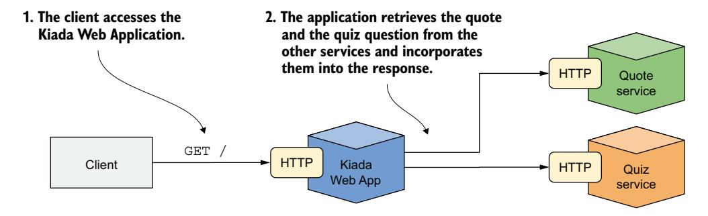

图 11.1 Kiada 套件的架构和运行方式

Kiada 服务将调用另外两个服务，并将它们返回的信息整合到发送给客户端的响应中。每个服务将由多个 Pod 副本提供，因此你需要使用 Service 对象来暴露它们。

!!! note "注意"
    你可以在 [https://github.com/luksa/kubernetes-in-action-2nd-edition/tree/master/Chapter11](https://github.com/luksa/kubernetes-in-action-2nd-edition/tree/master/Chapter11) 找到本章的代码文件。

在创建 Service 对象之前，通过应用 Chapter11/SETUP/ 目录中的清单来部署 Pod 和其他对象，如下所示：

```bash
$ kubectl apply -f SETUP/ --recursive
```

你应该还记得上一章中提到，此命令会应用指定目录及其子目录中的所有清单。应用这些清单后，你的当前 Kubernetes 命名空间中应该有多个 Pod。

## 理解 Pod 之间如何通信

你在第 5 章中学习了什么是 Pod、何时将多个容器组合到一个 Pod 中，以及这些容器如何通信。但是，不同 Pod 中的容器之间如何通信呢？

每个 Pod 都有自己的网络接口和自己的 IP 地址。集群中的所有 Pod 通过一个具有平坦地址空间的私有网络相互连接。如下图所示，即使托管 Pod 的节点在地理上分散，中间有许多网络路由器，Pod 仍然可以通过自己的扁平网络进行通信，而无需进行 NAT（网络地址转换）。这个 Pod 网络通常是一个软件定义网络，它构建在连接节点的实际网络之上。

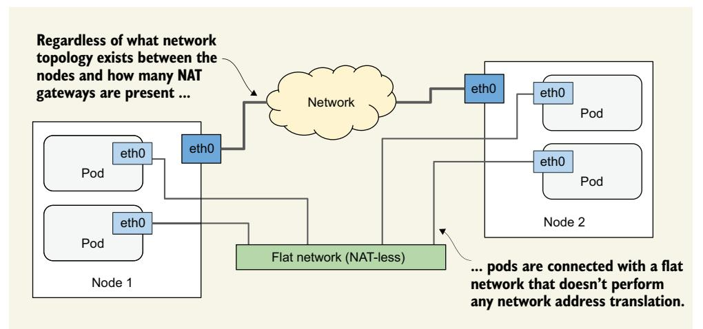

Pod 通过自己的计算机网络进行通信。

当一个 Pod 向另一个 Pod 发送网络数据包时，不会对该数据包执行 SNAT（源 NAT）或 DNAT（目标 NAT）。这意味着在 Pod 之间直接交换的数据包的源 IP 和端口、目标 IP 和端口永远不会被更改。如果发送方 Pod 知道接收方 Pod 的 IP 地址，它就可以向其发送数据包。接收方 Pod 可以将发送方的 IP 视为数据包的源 IP 地址。

尽管有许多 Kubernetes 网络插件，但它们都必须按上述方式工作。因此，两个 Pod 之间的通信始终是相同的，无论这些 Pod 是运行在同一个节点上，还是位于不同地理区域的节点上。Pod 中的容器可以通过这个扁平的、无需 NAT 的网络进行通信，就像连接到同一网络交换机的局域网 (LAN) 上的计算机一样。从应用程序的角度来看，节点之间的实际网络拓扑并不重要。

## 11.1 通过 Service 暴露 Pod

如果一个 Pod 中运行的应用程序需要连接到另一个 Pod 中运行的应用程序，它需要知道另一个 Pod 的地址。这说起来容易做起来难，原因如下：

- Pod 是**短暂的**。Pod 可能随时被移除并被新的 Pod 替换。当 Pod 被从节点驱逐以为其他 Pod 腾出空间时、当节点发生故障时、当由于更少的 Pod 副本就能处理负载而不再需要该 Pod 时，以及许多其他原因，都会发生这种情况。
- Pod 在分配到节点时获取其 IP 地址。你无法提前知道 Pod 的 IP 地址，因此你无法将其提供给将要连接它的 Pod。
- 在水平扩缩容中，多个 Pod 副本提供相同的服务。每个副本都有自己的 IP 地址。如果另一个 Pod 需要连接到这些副本，它应该能够使用指向负载均衡器的单个 IP 或 DNS 名称来实现，该负载均衡器将负载分布到所有副本上。

此外，一些 Pod 需要暴露给集群外部的客户端。到目前为止，每当你想连接到 Pod 中运行的应用程序时，你使用的都是端口转发，这仅用于开发目的。将一组 Pod 对外部可访问的正确方法是使用 Kubernetes Service。

### 11.1.1 Service 简介

Kubernetes Service 是你创建的一个对象，用于为一组提供相同服务的 Pod 提供单一、稳定的访问点。每个 Service 都有一个稳定的 IP 地址，只要 Service 存在就不会改变。客户端在该 IP 地址上开放到某个公开网络端口的连接，这些连接随后被转发到支撑该 Service 的其中一个 Pod。通过这种方式，客户端不需要知道提供该服务的各个 Pod 的地址，因此这些 Pod 可以随意扩缩容，以及从一个集群节点迁移到另一个集群节点。Service 充当前端这些 Pod 的负载均衡器。

**理解为什么需要 Service**

Kiada 套件是解释 Service 的绝佳示例。它包含三组 Pod，分别提供三种不同的服务。Kiada 服务调用 Quote 服务以获取书中的名言，以及调用 Quiz 服务以获取测验问题。

我在版本 0.5 中对 Kiada 应用程序做了必要的更改。你可以在本书代码仓库的 Chapter11/ 目录中找到更新后的源代码。你将在本章中使用这个新版本。你将学习如何配置 Kiada 应用程序以连接到另外两个服务，并将其对外部世界可见。由于每个服务中的 Pod 数量及其 IP 地址都可能变化，你将通过 Service 对象来暴露它们，如图 11.2 所示。

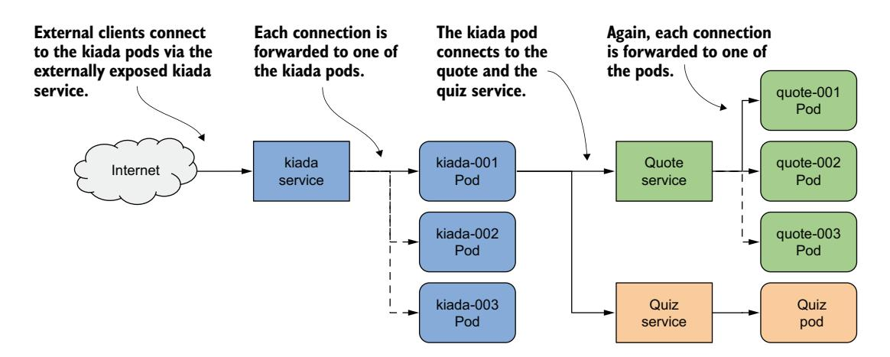

图 11.2 使用 Service 对象暴露 Pod

通过为 Kiada Pod 创建 Service 并将其配置为可从集群外部访问，你创建了一个单一、恒定的 IP 地址，外部客户端可以通过该地址连接到 Pod。每个连接被转发到一个 Kiada Pod。通过为 Quote Pod 创建 Service，你创建了一个稳定的 IP 地址，Kiada Pod 可以通过该地址访问 Quote Pod，无论任意给定时间点 Service 背后的 Pod 实例数量及其位置如何。

尽管 Quiz Pod 只有一个实例，但它也必须通过 Service 暴露，因为每次 Pod 被删除并重新创建时，Pod 的 IP 地址都会改变。如果没有 Service，你每次都必须重新配置 Kiada Pod，或者让 Pod 从 Kubernetes API 获取 Quiz Pod 的 IP。如果使用 Service，你就不必这样做，因为它的 IP 地址永远不会改变。

**理解 Pod 如何成为 Service 的一部分**

一个 Service 可以由多个 Pod 支撑。当你连接到一个 Service 时，连接会被传递到其中一个后端 Pod。但是，如何定义哪些 Pod 属于该 Service，哪些不属于呢？

在上一章中，你学习了标签和标签选择器，以及如何使用它们将一组对象组织为子集。Service 使用相同的机制。如图 11.3 所示，你为 Pod 对象添加标签，并在 Service 对象中指定标签选择器。标签与选择器匹配的 Pod 即属于该 Service。

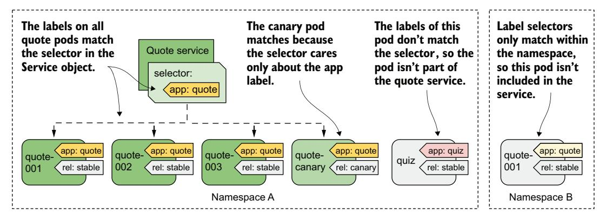

图 11.3 标签选择器决定哪些 Pod 属于该服务

quote Service 中定义的标签选择器是 `app=quote`，这意味着它会选择所有的 quote Pod，包括稳定版和金丝雀版实例，因为它们都包含标签键 `app` 和值 `quote`。Pod 上的其他标签不重要。

### 11.1.2 创建和更新 Service

Kubernetes 支持多种类型的 Service：ClusterIP、NodePort、LoadBalancer 和 ExternalName。ClusterIP 类型是你首先会学到的，它仅在集群内部使用。如果你创建 Service 对象时不指定其类型，这就是你得到的 Service 类型。Quiz 和 Quote Pod 的 Service 属于这种类型，因为它们被集群内的 Kiada Pod 使用。然而，Kiada Pod 的 Service 还必须能够被外部世界访问，因此 ClusterIP 类型不够用。

**创建 Service YAML 清单**

以下清单显示了 quote Service 对象的最小 YAML 清单。

```yaml
apiVersion: v1
kind: Service
metadata:
  name: quote
spec:
  type: ClusterIP
  selector:
    app: quote
  ports:
  - name: http
    port: 80
    targetPort: 80
```

!!! note "注意"
    由于 quote Service 对象是构成 Quote 应用程序的对象之一，你也可以向该对象添加 `app: quote` 标签。但是，由于此标签并非 Service 正常运行所必需，因此在本例中省略了它。

!!! note "注意"
    如果创建一个具有多个端口的 Service，则必须为每个端口指定一个名称。对于单端口的 Service，也最好这样做。

!!! note "注意"
    除了在 `targetPort` 字段中指定端口号之外，你也可以指定 Pod 定义中容器端口列表中定义的端口名称。这使 Service 能使用正确的目标端口号，即使 Service 后面的 Pod 使用了不同的端口号。

清单定义了一个名为 quote 的 ClusterIP Service。该 Service 在端口 80 上接受连接，并将每个连接转发给匹配 `app=quote` 标签选择器的随机选择 Pod 的端口 80，如图 11.4 所示。

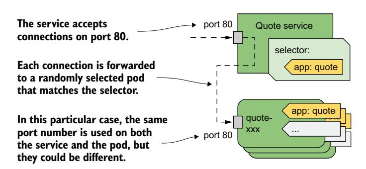

图 11.4 quote 服务及其转发流量的 Pod

要创建 Service，请使用 `kubectl apply` 将清单文件应用到 Kubernetes API。

**使用 kubectl expose 创建 Service**

通常，你像创建其他对象一样创建 Service，使用 `kubectl apply` 应用对象清单。但是，你也可以使用 `kubectl expose` 命令创建 Service，就像我们在第 3 章中所做的那样。

按如下方式为 Quiz Pod 创建 Service：

```bash
$ kubectl expose pod quiz --name quiz
service/quiz exposed
```

此命令创建一个名为 quiz 的 Service，暴露 quiz Pod。为此，它检查 Pod 的标签并创建一个 Service 对象，其标签选择器匹配该 Pod 的所有标签。

!!! note "注意"
    在第 3 章中，你使用 `kubectl expose` 命令来暴露 Deployment 对象。在这种情况下，该命令从 Deployment 中获取选择器并在 Service 对象中使用它来暴露所有 Pod。你将在第 15 章中学习更多关于 Deployment 的内容。

你现在已经创建了两个 Service。第 11.1.3 节描述了如何连接它们，但首先让我们看看它们是否配置正确。

**列出 Service**

当你创建一个 Service 时，它会被分配一个内部 IP 地址，集群中运行的任何工作负载都可以使用该地址连接到属于该 Service 的 Pod。这是 Service 的 ClusterIP 地址。你可以通过 `kubectl get services` 命令列出 Service 来查看它。如果你想查看每个 Service 的标签选择器，请使用 `-o wide` 选项，如下所示：

```bash
$ kubectl get svc -o wide
```

| NAME  | TYPE      | CLUSTER-IP    | EXTERNAL-IP | PORT(S)  | AGE | SELECTOR   |
|-------|-----------|---------------|-------------|----------|-----|------------|
| quiz  | ClusterIP | 10.96.136.190 | <none>      | 8080/TCP | 15s | app=quiz,  |
|       |           |               |             |          |     | rel=stable |
| quote | ClusterIP | 10.96.74.151  | <none>      | 80/TCP   | 23s | app=quote  |

!!! note "注意"
    Service 的简写是 `svc`。

命令的输出显示了创建的两个 Service。对于每个 Service，显示了类型、IP 地址、暴露的端口和标签选择器。

!!! note "注意"
    你也可以使用 `kubectl describe svc` 命令查看每个 Service 的详细信息。

你会注意到 quiz Service 使用的标签选择器选择了具有 `app: quiz` 和 `rel: stable` 标签的 Pod。这是因为这些是创建 Service 时所基于的 quiz Pod 的标签。

让我们考虑一下。你希望 quiz Service 只包含稳定版 Pod 吗？可能不是。也许你以后决定与稳定版并行部署 quiz Service 的金丝雀版本。在这种情况下，你希望流量被导向到两个 Pod。

关于 quiz Service 我不喜欢的另一点是端口号。由于该 Service 使用 HTTP，我更希望它使用端口 80 而不是 8080。幸运的是，你可以在创建 Service 后更改它。

**更改 Service 的标签选择器**

要更改 Service 的标签选择器，你可以使用 `kubectl set selector` 命令。要修复 quiz Service 的选择器，运行以下命令：

```bash
$ kubectl set selector service quiz app=quiz
service/quiz selector updated
```

使用 `-o wide` 选项再次列出 Service 以确认选择器已更改。这种更改选择器的方法在你部署多个版本的应用程序并希望将客户端从一个版本重定向到另一个版本时很有用。

**更改 Service 暴露的端口**

要更改 Service 转发到 Pod 的端口，你可以使用 `kubectl edit` 命令编辑 Service 对象，或更新清单文件然后将其应用到集群。在继续之前，运行 `kubectl edit svc quiz` 并将端口从 8080 更改为 80，确保只更改 `port` 字段并将 `targetPort` 保持为 8080，因为这是 quiz Pod 监听的端口。

**配置基本的 Service 属性**

表 11.1 列出了你可以在 Service 对象中设置的基本字段。其他字段将在本章的其余部分中解释。

| 字段 | 字段类型 | 描述 |
|------|---------|------|
| type | string | 指定此 Service 对象的类型。允许的值有<br>ClusterIP、NodePort、LoadBalancer 和 ExternalName。<br>默认值为 ClusterIP。这些<br>类型之间的区别将在本章<br>后面的小节中解释。 |
| clusterIP | string | Service 在集群内部可用的内部 IP 地址。<br>通常，你将此字段留空，让 Kubernetes<br>分配 IP。如果将其设置为 None，则该 Service 是无头<br>Service。这些将在第 11.4 节中解释。 |
| selector | map[string]string | 指定 Pod 必须具备的标签键和值，<br>以便此 Service 将流量转发给它。如果不设置此<br>字段，你负责管理 Service 端点。<br>这将在第 11.3 节中解释。 |

| 字段 | 字段类型 | 描述 |
|------|---------|------|
| ports | []Object | 此 Service 暴露的端口列表。每个条目可以指定<br>`name`、`protocol`、`appProtocol`、`port`、`nodePort` 和<br>`targetPort`。 |

表 11.1 Service 对象的 spec 中用于配置 Service 基本属性的字段

**IPv4/IPv6 双栈支持**

Kubernetes 同时支持 IPv4 和 IPv6。当你创建 Service 对象时，可以通过 `ipFamilyPolicy` 字段指定你希望该 Service 是单栈还是双栈。默认值是 `SingleStack`，这意味着无论集群是配置为单栈还是双栈网络，只分配一个 IP 族给该 Service。如果你希望当集群支持双栈时 Service 接收两个 IP 族，当集群支持单栈网络时接收一个 IP 族，请将该值设置为 `PreferDualStack`。如果你的 Service 同时需要 IPv4 和 IPv6 地址，请将该值设置为 `RequireDualStack`。Service 的创建仅会在双栈集群上成功。

创建 Service 对象后，其 `spec.ipFamilies` 数组指示已分配哪些 IP 族给它。两个有效值是 `IPv4` 和 `IPv6`。你也可以自己设置此字段来指定在提供双栈网络的集群中为 Service 分配哪个 IP 族。`ipFamilyPolicy` 必须相应设置，否则创建将失败。

对于双栈 Service，`spec.clusterIP` 字段仅包含其中一个 IP 地址，但 `spec.clusterIPs` 字段包含 IPv4 和 IPv6 两个地址。`clusterIPs` 字段中 IP 的顺序与 `ipFamilies` 字段中的顺序相对应。

### 11.1.3 访问集群内部 Service

你在上一节中创建的 ClusterIP Service 只能在集群内部访问，来自其他 Pod 和集群节点。你无法从自己的机器访问它们。要检查 Service 是否真正工作，你必须要么通过 ssh 登录到其中一个节点并从那里连接到 Service，要么使用 `kubectl exec` 命令在现有 Pod 中运行 `curl` 之类的命令并让它连接到 Service。

!!! note "注意"
    你也可以使用 `kubectl port-forward svc/my-service` 命令连接到支撑该 Service 的其中一个 Pod。但是，此命令不会连接到 Service。它只是使用 Service 对象来找到要连接的 Pod，然后直接连接到该 Pod，绕过 Service。

**从 Pod 连接到 Service**

要从 Pod 使用 Service，在 quote-001 Pod 中运行 shell，如下所示：

```bash
$ kubectl exec -it quote-001 -c nginx -- sh
/ #
```

现在检查你是否可以访问这两个 Service。使用 `kubectl get services` 显示的 Service 的 ClusterIP 地址。在我的例子中，quiz Service 使用 ClusterIP 10.96.136.190，而 quote Service 使用 IP 10.96.74.151。从 quote-001 Pod，我可以按如下方式连接到两个 Service：

```bash
/ # curl http://10.96.136.190
This is the quiz service running in pod quiz
/ # curl http://10.96.74.151
This is the quote service running in pod quote-canary
```

!!! note "注意"
    你不需要在 `curl` 命令中指定端口，因为你的 Service 端口设置为 80，这是 HTTP 的默认端口。

如果你多次重复最后一条命令，你会看到 Service 每次将请求转发到不同的 Pod：

```bash
/ # while true; do curl http://10.96.74.151; done
This is the quote service running in pod quote-canary
This is the quote service running in pod quote-003
This is the quote service running in pod quote-001
...
```

Service 充当负载均衡器。它将请求分发到它背后的所有 Pod。

**在 Service 上配置会话亲和性**

你可以配置 Service 是否将每个连接转发到不同的 Pod，还是将来自同一客户端的所有连接转发到同一个 Pod。你通过 Service 对象中的 `spec.sessionAffinity` 字段来实现。只支持两种类型的 Service 会话亲和性：`None` 和 `ClientIP`。

默认类型是 `None`，这意味着没有关于每个连接将被转发到哪个 Pod 的保证。但是，如果你将该值设置为 `ClientIP`，来自同一 IP 的所有连接将被转发到同一个 Pod。在 `spec.sessionAffinityConfig.clientIP.timeoutSeconds` 字段中，你可以指定会话持续的时间。默认值为 3 小时。

你可能会惊讶于 Kubernetes 不提供基于 Cookie 的会话亲和性。然而，考虑到 Kubernetes Service 运行在 OSI 网络模型的传输层（UDP 和 TCP）而不是应用层（HTTP），它们根本不理解 HTTP Cookie。

**通过 DNS 解析 Service**

Kubernetes 集群通常运行一个内部 DNS 服务器，集群中的所有 Pod 都配置为使用它。在大多数集群中，这个内部 DNS 服务由 CoreDNS 提供，而一些集群使用 kube-dns。你可以通过列出 `kube-system` 命名空间中的 Pod 来查看你的集群部署了哪个。

无论集群运行的是哪种实现，它都允许 Pod 通过名称解析 Service 的 ClusterIP 地址。因此，使用集群 DNS，Pod 可以像这样连接到 quiz Service：

```bash
/ # curl http://quiz
This is the quiz service running in pod quiz
```

Pod 可以通过在 URL 中指向 Service 的名称来解析与 Pod 在同一命名空间中定义的任何 Service。如果 Pod 需要连接到不同命名空间中的 Service，它必须在 URL 中追加 Service 对象的命名空间。例如，要连接到 `kiada` 命名空间中的 quiz Service，Pod 可以使用 URL `http://quiz.kiada/`，无论它在哪个命名空间中。

从你运行 shell 命令的 quote-001 Pod，你也可以按如下方式连接到该 Service：

```bash
/ # curl http://quiz.kiada
This is the quiz service running in pod quiz
```

一个 Service 可通过以下 DNS 名称解析：

- `<service-name>`，如果该 Service 与执行 DNS 查找的 Pod 在同一命名空间中
- `<service-name>.<service-namespace>`，来自任何命名空间，以及
- `<service-name>.<service-namespace>.svc`，和
- `<service-name>.<service-namespace>.svc.cluster.local`

!!! note "注意"
    默认域后缀是 `cluster.local`，但可以在集群级别更改。

你在通过 DNS 解析 Service 时不需要指定完全限定域名（FQDN）的原因是 Pod 的 `/etc/resolv.conf` 文件中的搜索行。对于 quote-001 Pod，该文件如下所示：

```text
/ # cat /etc/resolv.conf
search kiada.svc.cluster.local svc.cluster.local cluster.local localdomain
nameserver 10.96.0.10
options ndots:5
```

当你尝试解析 Service 时，搜索字段中指定的域名会被追加到名称后面，直到找到匹配项。如果你想知道 `nameserver` 行中的 IP 地址是什么，你可以列出集群中的所有 Service 来找出答案：

```bash
$ kubectl get svc -A
```

| NAMESPACE   | NAME         | TYPE      | CLUSTER-IP    | EXTERNAL-IP | PORT(S) |
|-------------|--------------|-----------|---------------|-------------|---------|
| default     | kubernetes   | ClusterIP | 10.96.0.1     | <none>      | 443/TCP |
| kiada       | quiz         | ClusterIP | 10.96.136.190 | <none>      | 80/TCP  |
| kiada       | quote        | ClusterIP | 10.96.74.151  | <none>      | 80/TCP  |
| kube-system | kube-dns     | ClusterIP | 10.96.0.10    | <none>      | 53/UDP  |

Pod 的 `resolv.conf` 文件中的 nameserver 指向 `kube-system` 命名空间中的 `kube-dns` Service。这是 Pod 使用的集群 DNS 服务。作为练习，请尝试找出此 Service 将流量转发到哪个（些）Pod。

**配置 Pod 的 DNS 策略**

Pod 是否使用内部 DNS 服务器可以通过 Pod 的 `spec` 中的 `dnsPolicy` 字段来配置。默认值是 `ClusterFirst`，这意味着 Pod 首先使用内部 DNS，然后使用为集群节点配置的 DNS。其他有效值有 `Default`（使用为节点配置的 DNS）、`None`（Kubernetes 不提供 DNS 配置；你必须使用下一段中解释的 `dnsConfig` 字段来配置 Pod 的 DNS 设置）和 `ClusterFirstWithHostNet`（用于使用主机网络而不是自身网络的特殊 Pod，这将在本书后面解释）。

设置 `dnsPolicy` 字段会影响 Kubernetes 如何配置 Pod 的 `resolv.conf` 文件。你可以通过 Pod 的 `dnsConfig` 字段进一步自定义此文件。本书代码仓库中的 `pod-with-dns-options.yaml` 文件演示了此字段的使用。

**通过环境变量发现 Service**

如今，几乎每个 Kubernetes 集群都提供集群 DNS 服务。在早期，情况并非如此。那时，Pod 使用环境变量来查找 Service 的 IP 地址。今天这些变量仍然存在。

当容器启动时，Kubernetes 为 Pod 所在命名空间中存在的每个 Service 初始化一组环境变量。让我们通过探索一个正在运行的 Pod 的环境来看看这些环境变量是什么样子。由于你是在 Service 之前创建 Pod 的，因此除了存在于 `default` 命名空间中的 `kubernetes` Service 的环境变量外，你不会看到任何与 Service 相关的环境变量。

!!! note "注意"
    `kubernetes` Service 将流量转发到 Kubernetes API 服务器。

要查看你创建的两个 Service 的环境变量，你必须按如下方式重启容器：

```bash
$ kubectl exec quote-001 -c nginx -- kill 1
```

当容器重启时，其环境变量包含 quiz 和 quote Service 的条目。使用以下命令显示它们：

```bash
$ kubectl exec -it quote-001 -c nginx -- env | sort
...
QUIZ_PORT_80_TCP_ADDR=10.96.136.190
QUIZ_PORT_80_TCP_PORT=80
QUIZ_PORT_80_TCP_PROTO=tcp
QUIZ_PORT_80_TCP=tcp://10.96.136.190:80
QUIZ_PORT=tcp://10.96.136.190:80
QUIZ_SERVICE_HOST=10.96.136.190
QUIZ_SERVICE_PORT=80
QUOTE_PORT_80_TCP_ADDR=10.96.74.151
QUOTE_PORT_80_TCP_PORT=80
QUOTE_PORT_80_TCP_PROTO=tcp
QUOTE_PORT_80_TCP=tcp://10.96.74.151:80
QUOTE_PORT=tcp://10.96.74.151:80
QUOTE_SERVICE_HOST=10.96.74.151
QUOTE_SERVICE_PORT=80
```

环境变量可真不少，不是吗？对于具有多个端口的 Service，变量的数量会更多。在容器中运行的应用程序可以使用这些变量来查找特定 Service 的 IP 地址和端口。

!!! note "注意"
    在环境变量名称中，Service 名称中的连字符被转换为下划线，所有字母都大写。

如今，应用程序通常通过 DNS 获取此信息，因此这些环境变量不如早期那么有用了。它们甚至可能导致问题。如果一个命名空间中的 Service 数量过多，你在该命名空间中创建的任何 Pod 都将无法启动。容器以退出码 1 退出，你会在容器的日志中看到以下错误信息：

```text
standard_init_linux.go:228: exec user process caused: argument list too long
```

为防止这种情况，你可以通过将 Pod 的 `spec` 中的 `enableServiceLinks` 字段设置为 `false` 来禁用将 Service 信息注入环境变量。

**理解为什么你不能 ping 一个 Service IP**

你已经学会了如何验证一个 Service 是否正在将流量转发到你的 Pod。但如果它没有呢？在这种情况下，你可能想尝试 ping Service 的 IP。为什么不现在试试呢？从 quote-001 Pod ping quiz Service，如下所示：

```bash
$ kubectl exec -it quote-001 -c nginx -- ping quiz
PING quiz (10.96.136.190): 56 data bytes
^C
--- quiz ping statistics ---
15 packets transmitted, 0 packets received, 100% packet loss
command terminated with exit code 1
```

等待几秒钟，然后按 Ctrl-C 中断进程。正如你所见，IP 地址被正确解析，但没有任何数据包通过。这是因为 Service 的 IP 地址是虚拟的，只有在与 Service 中定义的某个端口结合时才有意义。你不能 ping Service 的 IP 地址。

**在 Pod 中使用 Service**

现在你知道了 Quiz 和 Quote Service 可以从 Pod 中访问，你可以部署 Kiada Pod 并配置它们使用这两个 Service。应用程序期望在环境变量 `QUIZ_URL` 和 `QUOTE_URL` 中获取这些 Service 的 URL。这些不是 Kubernetes 自己添加的环境变量，而是你手动设置的变量，以便应用程序知道在哪里找到这两个 Service。因此，`kiada` 容器的 `env` 字段必须按以下清单中的方式配置。

```yaml
...
 env:
 - name: QUOTE_URL
   value: http://quote/quote
 - name: QUIZ_URL
   value: http://quiz
 - name: POD_NAME
...
```

环境变量 `QUOTE_URL` 被设置为 `http://quote/quote`。主机名与你在上一节中创建的 Service 名称相同。类似地，`QUIZ_URL` 被设置为 `http://quiz`，其中 `quiz` 是你创建的另一个 Service 的名称。

通过使用 `kubectl apply` 将清单文件 `kiada-stable-and-canary.yaml` 应用到集群来部署 Kiada Pod。然后运行以下命令，为刚刚创建的其中一个 Pod 打开一个隧道：

```bash
$ kubectl port-forward kiada-001 8080 8443
```

你现在可以在 `http://localhost:8080` 或 `https://localhost:8443` 测试应用程序。如果使用 `curl`，你应该看到类似以下的响应：

```text
$ curl http://localhost:8080
==== TIP OF THE MINUTE

Kubectl options that take a value can be specified with an equal sign or with a space.
Instead of --tail=10, you can also type --tail 10.

==== POP QUIZ
First question
0) First answer
1) Second answer

2) Third answer

Submit your answer to /question/1/answers/<index of answer> using the POST method.

==== REQUEST INFO
Request processed by Kiada 1.0 running in pod "kiada-001" on node "kind-worker2".

Pod hostname: kiada-001; Pod IP: 10.244.1.90; Node IP: 172.18.0.2; Client IP: ::ffff:127.0.0.1

HTML version of this content is available at /html
```

如果你在 Web 浏览器中打开该 URL，你会看到如图 11.5 所示的网页。

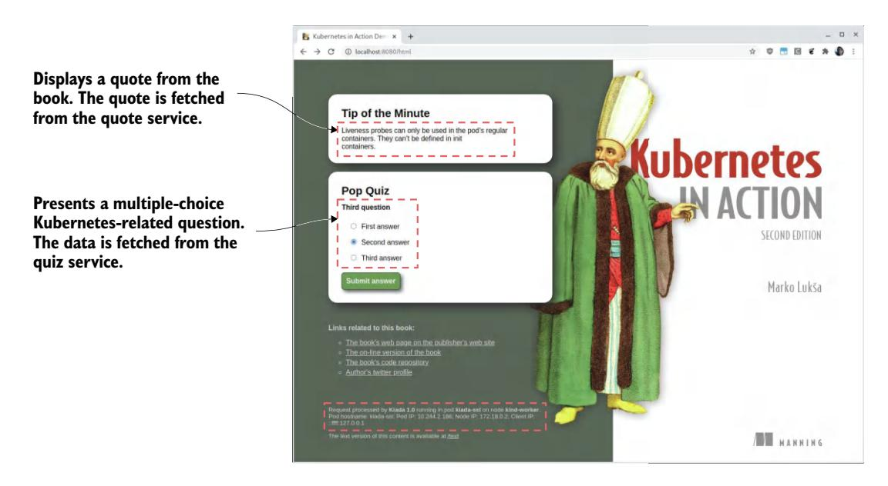

图 11.5 在浏览器中访问 Kiada 应用

如果你能看到名言和测验问题，这意味着 kiada-001 Pod 能够与 quote 和 quiz Service 通信。如果你检查支撑这些 Service 的 Pod 的日志，你会看到它们正在接收请求。对于由多个 Pod 支撑的 quote Service，你会看到每个请求被发送到不同的 Pod。

## 11.2 对外暴露 Service

像你在上一节中创建的 ClusterIP Service 只能在集群内部访问。由于客户端必须能够从集群外部访问 Kiada Service，如图 11.6 所示，创建 ClusterIP Service 是不够的。

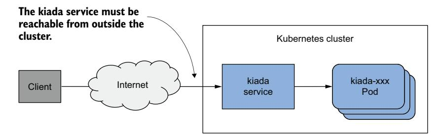

图 11.6 对外暴露服务

如果你需要将 Service 对外部世界可用，你可以执行以下操作之一：

- 为节点分配一个额外的 IP，并将其设置为 Service 的 `externalIPs` 之一
- 将 Service 的 `type` 设置为 `NodePort`，通过节点的端口访问 Service
- 通过将 `type` 设置为 `LoadBalancer`，让 Kubernetes 为你配置一个负载均衡器
- 通过 Ingress 对象暴露 Service

一种很少使用的方法是在 Service 对象的 `spec.externalIPs` 字段中指定一个额外的 IP。通过这样做，你告诉 Kubernetes 将所有目标为该 IP 地址的流量视为应由该 Service 处理的流量。当你确保这些流量到达某个节点且该节点上该 Service 的 `externalIPs` 中存在该地址时，Kubernetes 会将其转发到支撑该 Service 的其中一个 Pod。

一种更常见的对外暴露 Service 的方式是将其 `type` 设置为 `NodePort`。Kubernetes 使该 Service 在所有集群节点上的某个网络端口（所谓的节点端口，此 Service 类型由此得名）上可用。与 ClusterIP Service 一样，该 Service 获得一个内部 ClusterIP，但它也可以通过每个集群节点上的节点端口访问。通常，你需要配置一个外部负载均衡器，将流量重定向到这些节点端口。客户端可以通过负载均衡器的 IP 地址连接到你的 Service。

Kubernetes 也可以替你完成这项任务，而不必手动使用 NodePort Service 和设置负载均衡器，只需将 Service 的 `type` 设置为 `LoadBalancer` 即可。然而，并非所有集群都支持这种 Service 类型，因为负载均衡器的配置取决于集群所在的底层基础设施。大多数云提供商在其集群中支持 LoadBalancer Service，而本地部署的集群则需要安装附加组件，例如 MetalLB，这是一个用于裸金属 Kubernetes 集群的负载均衡器实现。

最后一种在外部暴露一组 Pod 的方式与此截然不同。你可以使用 Ingress 对象，而不是通过节点端口和负载均衡器将 Service 暴露到外部。此对象如何暴露 Service 取决于底层的 Ingress 控制器，但它允许你通过一个单一的外部可访问 IP 地址暴露许多 Service。你将在下一章中学到更多相关内容。

### 11.2.1 通过 NodePort Service 暴露 Pod

使 Pod 对外部客户端可访问的一种方法是通过 NodePort Service 暴露它们。当你创建这样的 Service 时，匹配其选择器的 Pod 可通过集群中所有节点上的特定端口访问，如图 11.7 所示。因为这个端口在节点上是开放的，所以被称为节点端口 (node port)。

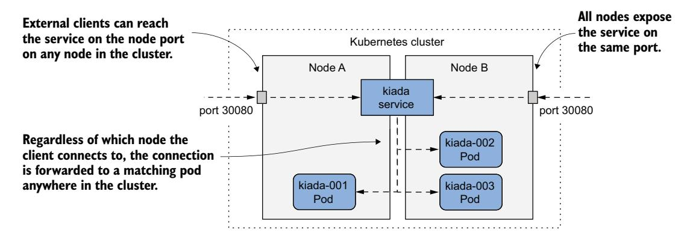

图 11.7 通过 NodePort 服务暴露 Pod

与 ClusterIP Service 一样，NodePort Service 可通过其内部 ClusterIP 访问，但也可通过每个集群节点上的节点端口访问。在图中所示的例子中，Pod 可通过端口 30080 访问。如你所见，此端口在两个集群节点上都开放。

客户端连接到哪个节点并不重要，因为所有节点都会将连接转发到属于该 Service 的一个 Pod，无论该 Pod 运行在哪个节点上。当客户端连接到节点 A 时，无论是节点 A 还是节点 B 上的 Pod 都可以接收该连接。当客户端连接到节点 B 上的端口时也是如此。

**创建 NodePort Service**

要通过 NodePort Service 暴露 Kiada Pod，你从以下清单中创建 Service。你可以在文件 `svc.kiada.nodeport.yaml` 中找到它。

```yaml
apiVersion: v1
kind: Service
metadata:
  name: kiada
spec:
  type: NodePort
  selector:
    app: kiada
  ports:
  - name: http
    port: 80
    targetPort: 8080
    nodePort: 30080
  - name: https
    port: 443
    targetPort: 8443
    nodePort: 30443
```

与你之前创建的 ClusterIP Service 相比，清单中的 Service 类型是 `NodePort`。与之前的 Service 不同，此 Service 暴露两个端口，并为每个端口定义了 `nodePort` 号。

!!! note "注意"
    你可以省略 `nodePort` 字段，让 Kubernetes 分配端口号。这可以防止不同 NodePort Service 之间的端口冲突。

该 Service 指定了六个不同的端口号，这可能让它难以理解，但图 11.8 应该能帮助你理清。

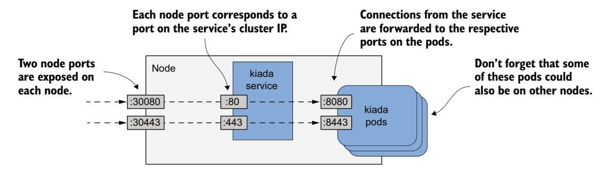

图 11.8 通过 NodePort 服务暴露多个端口

**检查你的 NodePort Service**

创建 Service 后，使用 `kubectl get` 命令检查它，如下所示：

```bash
$ kubectl get svc
```

| NAME  | TYPE      | CLUSTER-IP    | EXTERNAL-IP | PORT(S)                    | AGE |
|-------|-----------|---------------|-------------|----------------------------|-----|
| kiada | NodePort  | 10.96.226.212 | <none>      | 80:30080/TCP,443:30443/TCP | 1m  |
| quiz  | ClusterIP | 10.96.173.186 | <none>      | 80/TCP                     | 3h  |
| quote | ClusterIP | 10.96.161.97  | <none>      | 80/TCP                     | 3h  |

比较你到目前为止创建的 Service 的 TYPE 和 PORT(S) 列。与两个 ClusterIP Service 不同，kiada Service 是一个 NodePort Service，除了在 Service 的 ClusterIP 上可用的端口 80 和 443 之外，它还暴露了节点端口 30080 和 30443。

**访问 NodePort Service**

要找出 Service 可用的所有 IP:端口组合，你不仅需要节点端口号，还需要节点的 IP。你可以通过运行 `kubectl get nodes -o wide` 并查看 INTERNAL-IP 和 EXTERNAL-IP 列来获取这些信息。在云中运行的集群通常为节点设置了外部 IP，而在裸金属上运行的集群可能只设置了节点的内部 IP。如果没有防火墙阻挡，你应该能够使用这些 IP 访问节点端口。

!!! note "注意"
    在使用 GKE 时，要允许流量访问节点端口，请运行 `gcloud compute firewall-rules create gke-allow-nodeports --allow=tcp:30000-32767`。如果你的集群运行在其他云提供商上，请查看提供商的文档，了解如何配置防火墙以允许访问节点端口。

在我使用 kind 工具配置的集群中，节点的内部 IP 如下：

```bash
$ kubectl get nodes -o wide
```

| NAME                 | STATUS | ROLES                  | INTERNAL-IP | EXTERNAL-IP |
|----------------------|--------|------------------------|-------------|-------------|
| kind-control-plane   | Ready  | control-plane,master   | 172.18.0.3  | <none>      |
| kind-worker          | Ready  | <none>                 | 172.18.0.4  | <none>      |
| kind-worker2         | Ready  | <none>                 | 172.18.0.2  | <none>      |

kiada Service 在所有这些 IP 上都可用，即使是运行 Kubernetes 控制平面的节点的 IP。我可以通过以下任何 URL 访问该 Service：

- `10.96.226.212:80` 在集群内部（这是 ClusterIP 和内部端口）。
- `172.18.0.3:30080` 从节点 `kind-control-plane` 可达的任何位置，这是该节点的 IP 地址；端口是 kiada Service 的节点端口之一。
- `172.18.0.4:30080`（第二个节点的 IP 地址和节点端口）。
- `172.18.0.2:30080`（第三个节点的 IP 地址和节点端口）。

!!! note "注意"
    在 macOS 上，集群节点可能无法从宿主机操作系统访问。请参考你用于部署 Kubernetes 集群的工具的文档，看看是否有解决方法。

!!! tip "提示"
    如果你无法通过节点端口访问 Service，请如前面所述，检查是否可以从集群内部通过其内部 ClusterIP 访问。

该 Service 还可以在集群内部通过 HTTPS 在端口 443 上访问，并通过节点端口 30443 访问。如果我的节点也有外部 IP，该 Service 还可以通过这些 IP 上的两个节点端口访问。如果你使用的是 Minikube 或其他单节点集群，你应该使用该节点的 IP。

!!! tip "提示"
    如果你使用的是 Minikube，可以通过运行 `minikube service <service-name> [-n <namespace>]` 在浏览器中轻松访问你的 NodePort Service。

使用 `curl` 或你的 Web 浏览器访问该 Service。选择一个节点并找到其 IP 地址。向该 IP 的端口 30080 发送 HTTP 请求。检查响应末尾以查看哪个 Pod 处理了该请求以及该 Pod 运行在哪个节点上。例如，以下是我收到的一个请求的响应：

```bash
$ curl 172.18.0.4:30080
```

```text
...
==== REQUEST INFO
Request processed by Kiada 1.0 running in pod "kiada-001" on node "kind-worker2".
Pod hostname: kiada-001; Pod IP: 10.244.1.90; Node IP: 172.18.0.2; Client IP:
     ::ffff:172.18.0.4
```

请注意，我向 `172.18.0.4`（即 `kind-worker` 节点的 IP）发送了请求，但处理该请求的 Pod 却运行在 `kind-worker2` 节点上。第一个节点将连接转发到了第二个节点，正如在 NodePort Service 介绍中所解释的那样。

你还注意到 Pod 认为请求来自哪里了吗？看看响应末尾的 Client IP。那不是我发送请求的计算机的 IP。你可能注意到那是**发送请求的目标节点的 IP**。我将在第 11.2.3 节中解释为什么会发生这种情况以及如何防止它。

尝试向其他节点也发送请求。你会看到它们都将请求转发到一个随机的 Kiada Pod。如果你的节点可以从互联网访问，那么该应用程序现在对全世界的用户都可用。你可以使用轮询 DNS 将传入的连接分布到各节点，或在节点前放置一个真正的四层负载均衡器，并将客户端指向它。或者，你可以让 Kubernetes 来做这件事，下一节将对此进行解释。

### 11.2.2 通过外部负载均衡器暴露 Service

在上一节中，你创建了一个类型为 `NodePort` 的 Service。另一种 Service 类型是 `LoadBalancer`。顾名思义，这种 Service 类型使你的应用程序通过负载均衡器可访问。虽然所有 Service 都充当负载均衡器，但创建 LoadBalancer Service 会导致配置一个实际的负载均衡器。

如图 11.9 所示，这个负载均衡器位于节点前面，处理来自客户端的连接。它通过将每个连接转发到其中一个节点上的节点端口来路由到该 Service。这是可能的，因为 LoadBalancer Service 类型是 NodePort 类型的扩展，使 Service 可以通过这些节点端口访问。通过将客户端指向负载均衡器而不是直接指向某个特定节点的节点端口，客户端永远不会尝试连接到不可用的节点，因为负载均衡器仅将流量转发到健康节点。此外，负载均衡器确保连接均匀分布到集群中的所有节点。

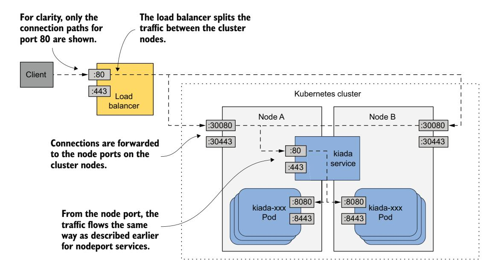

图 11.9 暴露 LoadBalancer 服务

并非所有 Kubernetes 集群都支持这种类型的 Service，但如果你的集群运行在云中，它几乎肯定支持。如果你的集群在本地部署，安装了附加组件后也会支持 LoadBalancer Service。如果集群不支持这种类型的 Service，你仍然可以创建此类型的 Service，但该 Service 只能通过其节点端口访问。

**创建 LoadBalancer Service**

以下清单显示了一个类型为 `LoadBalancer` 的 Service 的 YAML 清单，你可以在文件 `svc.kiada.loadbalancer.yaml` 中找到。

```yaml
apiVersion: v1
kind: Service
metadata:
  name: kiada
spec:
  type: LoadBalancer
  selector:
    app: kiada
  ports:
  - name: http
    port: 80
    nodePort: 30080
    targetPort: 8080
  - name: https
    port: 443
    nodePort: 30443
    targetPort: 8443
```

此清单与你之前部署的 NodePort Service 的清单仅在一行上有所不同——指定 Service 类型的行。选择器和端口与之前相同。指定节点端口只是为了不让 Kubernetes 随机选择它们。如果你不关心节点端口号，可以省略 `nodePort` 字段。

使用 `kubectl apply` 应用清单。你不必先删除现有的 kiada Service。这种方法确保 Service 的内部 ClusterIP 保持不变。

**通过负载均衡器连接到 Service**

创建 Service 之后，云基础设施可能需要几分钟来创建负载均衡器并将其 IP 地址更新到 Service 对象中。此 IP 地址随后将显示为你的 Service 的外部 IP 地址：

```bash
$ kubectl get svc kiada
```

| NAME  | TYPE         | CLUSTER-IP    | EXTERNAL-IP    | PORT(S)                      | AGE |
|-------|--------------|---------------|----------------|------------------------------|-----|
| kiada | LoadBalancer | 10.96.226.212 | 172.18.255.200 | 80:30080/TCP,443:30443/TCP   | 10m |

在我的例子中，负载均衡器的 IP 地址是 `172.18.255.200`，我可以通过此 IP 的端口 80 和 443 访问该 Service。在负载均衡器创建之前，EXTERNAL-IP 列中会显示 `<pending>` 而不是 IP 地址。这可能是因为配置过程尚未完成，或者因为集群不支持 LoadBalancer Service。

!!! note "注意"
    如果你的集群在虚拟机中运行（如在 macOS 上通常如此），负载均衡器 IP 可能无法从宿主操作系统访问，而只能从虚拟机内部访问。请参考你用于部署集群的工具的文档，了解是否有从宿主机访问该 IP 的方法。或者，尝试从虚拟机内部访问该 IP。

**使用 MetalLB 添加对 LoadBalancer Service 的支持**

如果你的集群在裸金属上运行，你可以安装 MetalLB 来支持 LoadBalancer Service。你可以在 metallb.universe.tf 找到它。如果你使用 kind 工具创建了集群，可以使用本书代码仓库中的 `install-metallb-kind.sh` 脚本安装 MetalLB。如果你使用其他工具创建了集群，可以查看 MetalLB 文档了解如何安装。

添加对 LoadBalancer Service 的支持是可选的。你始终可以直接使用节点端口。负载均衡器只是额外的一层。

**调整 LoadBalancer Service**

LoadBalancer Service 很容易创建。你只需将 `type` 设置为 `LoadBalancer`。但是，如果你需要对负载均衡器进行更多控制，可以使用表 11.2 中解释的 Service 对象 `spec` 中的额外字段进行配置。

| 字段 | 字段类型 | 描述 |
|------|---------|------|
| loadBalancerClass | string | 如果集群支持多个类别的负载<br>均衡器，你可以指定此 Service 使用<br>哪一个。可能的值取决于集群中安装的<br>负载均衡器控制器。 |
| loadBalancerIP | string | 如果云提供商支持，此字段可<br>用于指定负载均衡器<br>的期望 IP。 |

| 字段 | 字段类型 | 描述 |
|------|---------|------|
| loadBalancerSourceRanges | []string | 限制允许通过负载均衡器访问<br>此 Service 的客户端 IP。并非<br>所有负载均衡器控制器都支持。 |
| allocateLoadBalancerNodePorts | boolean | 指定是否为此<br>LoadBalancer 类型的 Service 分配节点端口。某些负载<br>均衡器实现可以不依赖节点端口<br>而将流量转发到 Pod。 |

表 11.2 Service spec 中可用于配置 LoadBalancer Service 的字段

### 11.2.3 为 Service 配置外部流量策略

你已经了解到，当外部客户端通过节点端口直接或通过负载均衡器连接到 Service 时，连接可能会被转发到一个与接收连接的节点不同的节点上的 Pod。在这种情况下，必须额外进行一跳网络才能到达 Pod，导致延迟增加。

此外，如前所述，当以这种方式将连接从一个节点转发到另一个节点时，源 IP 必须替换为最初接收连接的节点的 IP。这掩盖了客户端的 IP 地址。因此，Pod 中运行的应用程序无法看到连接来自哪里。例如，Pod 中运行的 Web 服务器无法在其访问日志中记录真实的客户端 IP。

节点需要更改源 IP 的原因是为了确保返回的数据包发回最初接收连接的节点，以便它能将它们返回给客户端。

**Local 外部流量策略的优缺点**

通过阻止节点将流量转发到不在同一节点上运行的 Pod，可以解决额外的网络跳数和源 IP 掩盖问题。这可以通过将 Service 对象 `spec` 字段中的 `externalTrafficPolicy` 字段设置为 `Local` 来实现。这样，节点仅将外部流量转发到接收连接的节点上运行的 Pod。

但是，将外部流量策略设置为 `Local` 也会导致其他问题。首先，如果接收连接的节点上没有本地 Pod，连接将挂起。因此，你必须确保负载均衡器仅将连接转发到至少有一个此类 Pod 的节点。这是通过 `healthCheckNodePort` 字段实现的。外部负载均衡器使用此节点端口来检查节点是否包含该 Service 的端点。这种方法使负载均衡器能够仅将流量转发到有此类 Pod 的节点。

将外部流量策略设置为 `Local` 时遇到的第二个问题是流量在 Pod 之间分布不均匀。如果负载均衡器在节点之间均衡地分发流量，但每个节点运行不同数量的 Pod，则具有较少 Pod 的节点上的 Pod 将收到更高比例的流量。

**比较 Cluster 和 Local 外部流量策略**

考虑图 11.10 所示的情况。节点 A 上运行一个 Pod，节点 B 上运行两个 Pod。负载均衡器将一半流量路由到节点 A，另一半路由到节点 B。

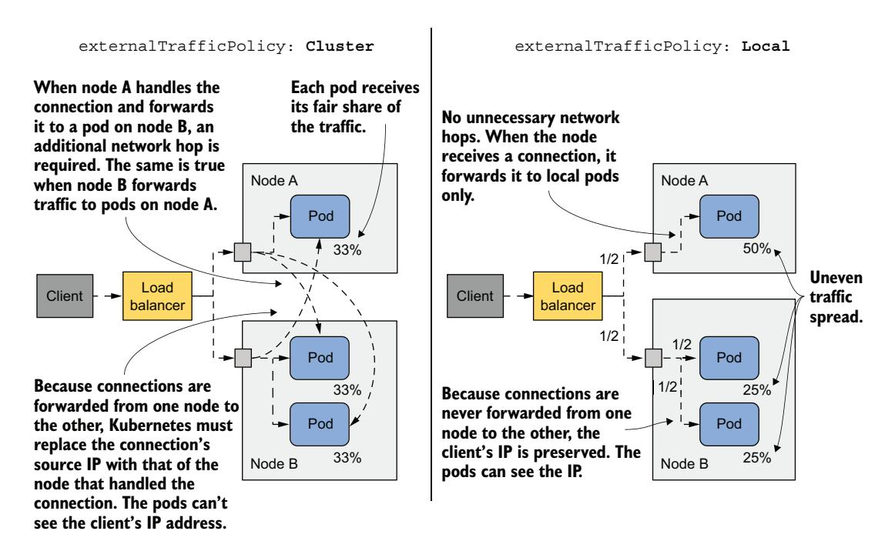

图 11.10 NodePort/LoadBalancer 的两种外部流量策略

当 `externalTrafficPolicy` 设置为 `Cluster` 时，每个节点将流量转发到系统中的所有 Pod。流量在 Pod 之间均匀分配。需要额外的网络跳数，并且客户端 IP 被掩盖。

当 `externalTrafficPolicy` 设置为 `Local` 时，到达节点 A 的所有流量被转发到该节点上的唯一 Pod。这意味着这个 Pod 接收了全部流量的 50%。到达节点 B 的流量在两个 Pod 之间分配。每个 Pod 接收负载均衡器处理的总流量的 25%。没有不必要的网络跳数，源 IP 是客户端的 IP。

与你作为工程师所做的大多数决策一样，每个 Service 使用哪种外部流量策略取决于你愿意做出什么权衡。

## 11.3 管理 Service 端点

到目前为止，你已经了解到 Service 由 Pod 支撑，但情况并非总是如此。Service 将流量转发到的端点可以是任何具有 IP 地址的事物。

### 11.3.1 Endpoints 对象简介

Service 通常由一组 Pod 支撑，这些 Pod 的标签与 Service 对象中定义的标签选择器匹配。除了标签选择器，Service 对象的 `spec` 或 `status` 部分不包含属于该 Service 的 Pod 列表。但是，如果你使用 `kubectl describe` 检查 Service，你会在 Endpoints 下看到 Pod 的 IP，如下所示：

```bash
$ kubectl describe svc kiada
Name: kiada
...
Port: http 80/TCP
TargetPort: 8080/TCP
NodePort: http 30080/TCP
Endpoints: 10.244.1.7:8080,10.244.1.8:8080,10.244.1.9:8080 + 1 more...
...
```

`kubectl describe` 命令收集的这些数据不是来自 Service 对象，而是来自一个名称与服务名称匹配的 Endpoints 对象。kiada Service 的端点在 kiada Endpoints 对象中指定。

**列出 Endpoints 对象**

你可以按如下方式检索当前命名空间中的 Endpoints 对象：

```bash
$ kubectl get endpoints
```

```text
NAME    ENDPOINTS                                              AGE
kiada   10.244.1.7:8443,10.244.1.8:8443,10.244.1.9:8443 + 5 more... 25m
quiz    10.244.1.11:8080                                       66m
quote   10.244.1.10:80,10.244.2.10:80,10.244.2.8:80 + 1 more... 66m
```

!!! note "注意"
    Endpoints 的简写是 `ep`。此外，对象类型是 Endpoints（复数形式），而不是 Endpoint。运行 `kubectl get endpoint` 会失败并报错。

如你所见，命名空间中有三个 Endpoints 对象。每个 Service 对应一个。每个 Endpoints 对象包含一个 IP 和端口的组合列表，代表该 Service 的端点。

**更详细地检查 Endpoints 对象**

要查看哪些 Pod 代表这些端点，使用 `kubectl get -o yaml` 检索 Endpoints 对象的完整清单，如下所示：

```bash
$ kubectl get ep kiada -o yaml
```

```yaml
apiVersion: v1
kind: Endpoints
metadata:
  name: kiada
  namespace: kiada
...
subsets:
- addresses:
    - ip: 10.244.1.7
      nodeName: kind-worker
      targetRef:
        kind: Pod
        name: kiada-002
        namespace: kiada
        resourceVersion: "2950"
        uid: 18cea623-0818-4ff1-9fb2-cddcf5d138c3
      ...
  ports:
    - name: https
      port: 8443
      protocol: TCP
    - name: http
      port: 8080
      protocol: TCP
```

如你所见，每个 Pod 被列为 `addresses` 数组的一个元素。在 kiada Endpoints 对象中，所有端点都在同一个端点子集中，因为它们都使用相同的端口号。但是，如果一组 Pod 使用端口 8080，而另一组使用端口 8088，则 Endpoints 对象将包含两个子集，每个子集有自己的端口。

**理解谁管理 Endpoints 对象**

你没有创建这三个 Endpoints 对象中的任何一个。它们是在你创建关联的 Service 对象时由 Kubernetes 创建的。这些对象完全由 Kubernetes 管理。每次出现或消失一个与 Service 的标签选择器匹配的新 Pod 时，Kubernetes 都会更新 Endpoints 对象以添加或删除与该 Pod 关联的端点。你也可以手动管理 Service 的端点。你将在后面学习如何做到这一点。

### 11.3.2 EndpointSlice 对象简介

可以想象，当 Service 包含非常大量的端点时，Endpoints 对象的大小会成为一个问题。每次发生更改时，Kubernetes 控制平面组件都需要将整个对象发送到所有集群节点。在大型集群中，这会导致明显的性能问题。为了解决这个问题，引入了 EndpointSlice 对象，Endpoints 对象已被弃用。EndpointSlice 对象将单个 Service 的端点拆分成多个切片 (slice)，提高了这些端点的处理性能。

虽然一个 Endpoints 对象包含多个端点子集，但每个 EndpointSlice 只包含一个。如果两组 Pod 在不同的端口上暴露 Service，它们会出现在两个不同的 EndpointSlice 对象中。此外，一个 EndpointSlice 对象最多支持 1000 个端点，但默认情况下 Kubernetes 只向每个切片添加最多 100 个端点。切片中的端口数量也限制为 100。因此，一个有数百个端点或多个端口的 Service 可以关联多个 EndpointSlice 对象。

与 Endpoints 一样，EndpointSlice 是自动创建和管理的。

**列出 EndpointSlice 对象**

除了 Endpoints 对象，Kubernetes 还为你的三个 Service 创建了 EndpointSlice 对象。你可以通过 `kubectl get endpointslices` 命令查看它们：

```bash
$ kubectl get endpointslices
```

| NAME         | ADDRESSTYPE | PORTS     | ENDPOINTS                                         | AGE |
|--------------|-------------|-----------|---------------------------------------------------|-----|
| kiada-m24zq  | IPv4        | 8080,8443 | 10.244.1.7,10.244.1.8,10.244.1.9 + 1 more         | 80m |
| quiz-qbckq   | IPv4        | 8080      | 10.244.1.11                                       | 79m |
| quote-5dqhx  | IPv4        | 80        | 10.244.2.8,10.244.1.10,10.244.2.9 + 1 more        | 79m |

!!! note "注意"
    截至撰写本文时，`endpointslices` 没有简写。

你会注意到，与 Endpoints 对象（其名称与各自 Service 对象的名称匹配）不同，每个 EndpointSlice 对象在 Service 名称后包含一个随机生成的后缀。这样，每个 Service 可以存在多个 EndpointSlice 对象。

**列出特定 Service 的 EndpointSlice**

要仅查看与特定 Service 关联的 EndpointSlice 对象，你可以在 `kubectl get` 命令中指定标签选择器。要列出与 kiada Service 关联的 EndpointSlice 对象，请使用标签选择器 `kubernetes.io/service-name=kiada`，如下所示：

```bash
$ kubectl get endpointslices -l kubernetes.io/service-name=kiada
```

```text
NAME          ADDRESSTYPE PORTS      ENDPOINTS                                         AGE
kiada-m24zq   IPv4        8080,8443  10.244.1.7,10.244.1.8,10.244.1.9 + 1 more...     88m
```

**检查 EndpointSlice**

要更详细地检查 EndpointSlice 对象，使用 `kubectl describe`。由于 `describe` 命令不需要完整的对象名称，且与 Service 关联的所有 EndpointSlice 对象都以 Service 名称开头，你可以通过仅指定 Service 名称来查看它们全部：

```bash
$ kubectl describe endpointslice kiada
```

```text
Name: kiada-m24zq
Namespace: kiada
Labels: endpointslice.kubernetes.io/managed-by=endpointslice-
    controller.k8s.io
    kubernetes.io/service-name=kiada
Annotations: endpoints.kubernetes.io/last-change-trigger-time: 2021-10-
    30T08:36:21Z
AddressType: IPv4
Ports:
  Name Port Protocol
  ---- ---- --------
  http 8080 TCP
```

!!! note "注意"
    如果多个 EndpointSlice 匹配你提供给 `kubectl describe` 的名称，该命令将打印所有 EndpointSlice。

`kubectl describe` 命令的输出信息与你之前看到的 Endpoints 对象中的信息没有太大区别。EndpointSlice 对象包含一个端口和端点地址的列表，以及代表这些端点的 Pod 的信息。这包括 Pod 的拓扑信息，用于拓扑感知的流量路由。你将在本章后面了解更多相关内容。

### 11.3.3 手动管理 Service 端点

当你创建带有标签选择器的 Service 对象时，Kubernetes 会自动创建和管理 Endpoints 和 EndpointSlice 对象，并使用选择器确定 Service 端点。但是，你也可以通过创建不带标签选择器的 Service 对象来手动管理端点。在这种情况下，你必须自己创建 Endpoints 对象。你不需要创建 EndpointSlice 对象，因为 Kubernetes 会镜像 Endpoints 对象来创建相应的 EndpointSlice。

通常，当你希望使现有的外部服务以不同的名称对集群中的 Pod 可访问时，你会以这种方式管理 Service 端点。这样，该服务可以通过集群 DNS 和环境变量被发现。

**创建不带标签选择器的 Service**

以下清单显示了一个没有定义标签选择器的 Service 对象清单的示例。你可以在文件 `svc.external-service.yaml` 中找到此清单。创建 Service 后，你将为其手动配置端点。

```yaml
apiVersion: v1
kind: Service
metadata:
  name: external-service
spec:
  ports:
  - name: http
    port: 80
```

清单定义了一个名为 `external-service` 的 Service，它在端口 80 上接受传入连接。正如本章第一部分所解释的，集群中的 Pod 可以通过其 ClusterIP 地址（在创建 Service 时分配）或通过其 DNS 名称使用该 Service。

**创建 Endpoints 对象**

如果 Service 没有定义 Pod 选择器，就不会自动为其创建 Endpoints 对象。你必须自己创建。以下清单显示了为你在上一节中创建的 Service 的 Endpoints 对象的清单。

```yaml
apiVersion: v1
kind: Endpoints
metadata:
  name: external-service
subsets:
- addresses:
  - ip: 1.1.1.1
  - ip: 2.2.2.2
  ports:
  - name: http
    port: 88
```

Endpoints 对象必须与 Service 具有相同的名称，并包含目标地址和端口的列表。在清单中，IP 地址 1.1.1.1 和 2.2.2.2 代表该 Service 的端点。

!!! note "注意"
    你不必创建 EndpointSlice 对象。Kubernetes 会从 Endpoints 对象创建它。

Service 及其关联的 Endpoints 对象的创建允许 Pod 按照与集群中定义的其他 Service 相同的方式使用此 Service。如图 11.11 所示，发送到 Service 的 ClusterIP 的流量被分发到 Service 的端点。这些端点在集群外部，但也可以在集群内部。

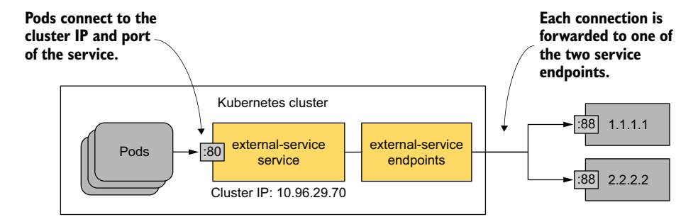

图 11.11 Pod 消费具有两个外部端点的服务

如果你以后决定将外部服务迁移到运行在 Kubernetes 集群内部的 Pod，你可以向 Service 添加一个选择器，以将流量重定向到这些 Pod，而不是你手动配置的端点。这是因为在向 Service 添加选择器后，Kubernetes 会立即开始管理 Endpoints 对象。

你也可以做相反的操作：如果你想将现有 Service 从集群迁移到外部位置，请从 Service 对象中删除选择器，这样 Kubernetes 将不再更新关联的 Endpoints 对象。从那时起，你可以手动管理 Service 的端点。

你不需要删除 Service 来做到这一点。通过更改现有的 Service 对象，Service 的 ClusterIP 地址保持不变。使用该 Service 的客户端甚至不会注意到你已经迁移了该服务。

## 11.4 理解 Service 对象的 DNS 记录

Kubernetes Service 的一个重要方面是能够通过 DNS 查找它们。对此需要进行更深入的研究。

你已经知道 Service 会被分配一个内部 ClusterIP 地址，Pod 可以通过集群 DNS 解析。这是因为每个 Service 在 DNS 中都会获得一个 A 记录（或 IPv6 的 AAAA 记录）。但是，Service 还会为其提供的每个端口获取一个 SRV 记录。

让我们更详细地查看这些 DNS 记录。首先，运行一个一次性 Pod，如下所示：

```bash
$ kubectl run -it --rm dns-test --image=giantswarm/tiny-tools
/ #
```

此命令运行一个名为 `dns-test` 的 Pod，其中包含一个基于容器镜像 `giantswarm/tiny-tools` 的容器。此镜像包含 `host`、`nslookup` 和 `dig` 工具，你可以使用它们来检查 DNS 记录。当你运行 `kubectl run` 命令时，你的终端将连接到容器中运行的 shell 进程（`-it` 选项的作用）。当你退出 shell 时，Pod 将被删除（通过 `--rm` 选项）。

!!! note "注意"
    确保你在与 Kiada 套件相同的命名空间中运行 Pod，如有需要请使用 `-n` 选项。

### 11.4.1 检查 Service 在 DNS 中的 A 记录和 SRV 记录

你首先检查与你的 Service 关联的 A 和 SRV 记录。

**查找 Service 的 A 记录**

要确定 quote Service 的 IP 地址，在 dns-test Pod 容器的 shell 中运行 `nslookup` 命令：

```bash
/ # nslookup quote
Server: 10.96.0.10
Address: 10.96.0.10#53
Name: quote.kiada.svc.cluster.local
Address: 10.96.161.97
```

!!! note "注意"
    你可以使用 `dig` 代替 `nslookup`，但必须使用 `+search` 选项或指定 Service 的完全限定域名，DNS 查找才能成功（运行 `dig +search quote` 或 `dig quote.kiada.svc.cluster.local`）。

现在查找 kiada Service 的 IP 地址。尽管此 Service 的类型是 `LoadBalancer`，因此既有内部 ClusterIP 也有外部 IP（负载均衡器的 IP），但 DNS 只返回 ClusterIP。这是预期的，因为 DNS 服务器是内部的，仅在集群内部使用。

**查找 SRV 记录**

一个 Service 提供一个或多个端口。每个端口在 DNS 中都会获得一个 SRV 记录。使用以下命令检索 kiada Service 的 SRV 记录：

```bash
/ # nslookup -query=SRV kiada
Server: 10.96.0.10
Address: 10.96.0.10#53
kiada.kiada.svc.cluster.local service = 0 50 80
    kiada.kiada.svc.cluster.local.
kiada.kiada.svc.cluster.local service = 0 50 443
    kiada.kiada.svc.cluster.local.
```

!!! note "注意"
    截至撰写本文时，GKE 仍然运行 kube-dns 而不是 CoreDNS。kube-dns 不支持本节中显示的所有 DNS 查询。

Pod 中运行的智能客户端可以查找 Service 的 SRV 记录来找出 Service 提供了哪些端口。如果你在 Service 对象中为这些端口定义了名称，它们甚至可以按名称查找。SRV 记录具有以下形式：

```text
 _port-name._port-protocol.service-name.namespace.svc.cluster.local
```

kiada Service 中两个端口的名称是 `http` 和 `https`，两者都定义了 TCP 作为协议。要获取 `http` 端口的 SRV 记录，请运行以下命令：

```bash
/ # nslookup -query=SRV _http._tcp.kiada
Server: 10.96.0.10
Address: 10.96.0.10#53
_http._tcp.kiada.kiada.svc.cluster.local service = 0 100 80
    kiada.kiada.svc.cluster.local.
```

!!! tip "提示"
    要列出 `kiada` 命名空间中的所有 Service 及其暴露的端口，你可以运行命令 `nslookup -query=SRV any.kiada.svc.cluster.local`。要列出集群中的所有 Service，使用名称 `any.any.svc.cluster.local`。

你可能永远不需要查找 SRV 记录，但某些互联网协议（如 SIP 和 XMPP）依赖于它们才能工作。

!!! note "注意"
    请保持 dns-test Pod 中的 shell 运行，因为在下一节学习无头 Service 时需要用到它。

### 11.4.2 使用无头 Service 直接连接到 Pod

Service 将一组 Pod 暴露在一个稳定的 IP 地址下。到该 IP 地址的每个连接被转发到一个随机的 Pod 或支撑该 Service 的其他端点。到 Service 的连接会自动分发到其端点。但是，如果你希望客户端进行负载均衡呢？如果客户端需要决定连接到哪个 Pod 呢？或者它需要连接到支撑该 Service 的所有 Pod 呢？如果属于某个 Service 的 Pod 都需要直接相互连接呢？通过 Service 的 ClusterIP 连接显然不是实现这一点的方法。在这种情况下你该怎么办？

客户端可以从 Kubernetes API 获取 Pod IP，而不是连接到 Service IP，但最好让它们与 Kubernetes 无关，使用 DNS 这样的标准机制。幸运的是，你可以配置内部 DNS 来返回 Pod IP 而不是 Service 的 ClusterIP，通过创建**无头** (headless) Service。

对于无头 Service，集群 DNS 不仅返回一个指向 Service ClusterIP 的 A 记录，而是返回多个 A 记录，每个属于该 Service 的 Pod 对应一个。因此，客户端可以查询 DNS 来获取 Service 中所有 Pod 的 IP。有了这些信息，客户端就可以直接连接到 Pod，如图 11.12 所示。

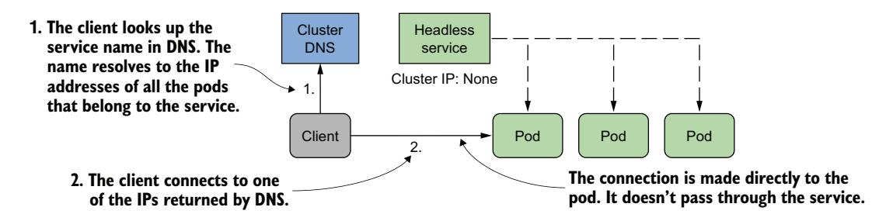

图 11.12 无头服务下客户端直接连接到 Pod

**创建无头 Service**

要创建无头 Service，将 `clusterIP` 字段设置为 `None`。为 quote Pod 创建另一个 Service，但这次使其为无头。你可以在文件 `svc.quote-headless.yaml` 中找到 Service 清单。以下清单显示了此文件的内容。

```yaml
apiVersion: v1
kind: Service
metadata:
  name: quote-headless
spec:
  clusterIP: None
  selector:
    app: quote
  ports:
  - name: http
    port: 80
    targetPort: 80
    protocol: TCP
```

使用 `kubectl apply` 创建 Service 后，你可以用 `kubectl get` 检查它。你会看到它没有 ClusterIP：

```bash
$ kubectl get svc quote-headless -o wide
```

```text
NAME             TYPE        CLUSTER-IP   EXTERNAL-IP   PORT(S)  AGE   SELECTOR
quote-headless   ClusterIP   None         <none>        80/TCP   2m    app=quote
```

因为该 Service 没有 ClusterIP，所以当你尝试解析 Service 名称时，DNS 服务器无法返回它。相反，它返回 Pod 的 IP 地址。在继续之前，列出匹配该 Service 标签选择器的 Pod 的 IP，如下所示：

```bash
$ kubectl get po -l app=quote -o wide
```

| NAME         | READY | STATUS  | RESTARTS | AGE | IP          | NODE         |
|--------------|-------|---------|----------|-----|-------------|--------------|
| quote-canary | 2/2   | Running | 0        | 3h  | 10.244.2.9  | kind-worker2 |
| quote-001    | 2/2   | Running | 0        | 3h  | 10.244.2.10 | kind-worker2 |
| quote-002    | 2/2   | Running | 0        | 3h  | 10.244.2.8  | kind-worker2 |
| quote-003    | 2/2   | Running | 0        | 3h  | 10.244.1.10 | kind-worker  |

注意这些 Pod 的 IP 地址。

**理解无头 Service 返回的 DNS A 记录**

要查看当你解析该 Service 时 DNS 返回什么，在你上一节创建的 dns-test Pod 中运行以下命令：

```bash
/ # nslookup quote-headless
Server: 10.96.0.10
Address: 10.96.0.10#53
Name: quote-headless.kiada.svc.cluster.local
Address: 10.244.2.9
Name: quote-headless.kiada.svc.cluster.local
Address: 10.244.2.8
Name: quote-headless.kiada.svc.cluster.local
Address: 10.244.2.10
Name: quote-headless.kiada.svc.cluster.local
Address: 10.244.1.10
```

DNS 服务器返回了匹配 Service 标签选择器的四个 Pod 的 IP 地址。这与 DNS 为常规（非无头）Service（如 quote Service）返回的内容不同，在常规 Service 中名称解析为 Service 的 ClusterIP：

```bash
/ # nslookup quote
Server: 10.96.0.10
Address: 10.96.0.10#53
Name: quote.kiada.svc.cluster.local
Address: 10.96.161.97
```

**理解客户端如何使用无头 Service**

希望直接连接到属于某个 Service 的 Pod 的客户端可以通过从 DNS 检索 A（或 AAAA）记录来实现。然后，客户端可以连接到一个、部分或所有返回的 IP 地址。

不自己执行 DNS 查找的客户端可以像使用常规非无头 Service 一样使用该 Service。因为 DNS 服务器会轮转返回的 IP 地址列表，简单地在连接 URL 中使用 Service 的 FQDN 的客户端每次都会获得不同的 Pod IP。因此，客户端请求会被分发到所有 Pod。

你可以通过从 dns-test Pod 使用 `curl` 向 `quote-headless` Service 发送多个请求来尝试这一点：

```bash
/ # while true; do curl http://quote-headless; done
This is the quote service running in pod quote-002
This is the quote service running in pod quote-001
This is the quote service running in pod quote-002
This is the quote service running in pod quote-canary
...
```

每个请求由不同的 Pod 处理，就像使用常规 Service 一样。区别在于，使用无头 Service 时，你直接连接到 Pod IP，而使用常规 Service 时，你连接到 Service 的 ClusterIP，然后你的连接被转发到其中一个 Pod。你可以通过使用 `--verbose` 选项运行 `curl` 并检查它连接的 IP 来看到这一点：

```bash
/ # curl --verbose http://quote-headless
* Trying 10.244.1.10:80...
* Connected to quote-headless (10.244.1.10) port 80 (#0)
...
/ # curl --verbose http://quote
* Trying 10.96.161.97:80...
* Connected to quote (10.96.161.97) port 80 (#0)
...
```

**没有标签选择器的无头 Service**

作为本节的结束，我想提一下，具有手动配置端点的 Service（没有标签选择器的 Service）也可以是无头的。如果你省略标签选择器并将 `clusterIP` 设置为 `None`，DNS 将为每个端点返回一个 A/AAAA 记录，就像 Service 端点是 Pod 时一样。要自己测试这一点，应用 `svc.external-service-headless.yaml` 文件中的清单，并在 dns-test Pod 中运行以下命令：

```bash
/ # nslookup external-service-headless
```

### 11.4.3 为现有 Service 创建 CNAME 别名

在前面的章节中，你学会了如何在集群 DNS 中创建 A 和 AAAA 记录。要做到这一点，你创建指定标签选择器以找到 Service 端点的 Service 对象，或使用 Endpoints 和 EndpointSlice 对象手动定义它们。

还有一种方法可以向集群 DNS 添加 CNAME 记录。在 Kubernetes 中，你通过创建 Service 对象来将 CNAME 记录添加到 DNS，就像为 A 和 AAAA 记录所做的那样。

!!! note "注意"
    CNAME 记录是一种 DNS 记录，它将别名映射到现有的 DNS 名称，而不是像 A 记录那样将其映射到 IP 地址。

**创建 ExternalName Service**

要创建一个用作现有 Service 别名的 Service（无论是内部 Service 还是集群外部的 Service），你创建一个 Service 对象，其 `type` 字段设置为 `ExternalName`。以下清单显示了这种类型 Service 的示例。你可以在文件 `svc.time-api.yaml` 中找到该清单。

```yaml
apiVersion: v1
kind: Service
metadata:
  name: time-api
spec:
  type: ExternalName
  externalName: worldtimeapi.org
  ports:
  - name: http
    port: 80
```

除了将 `type` 设置为 `ExternalName` 之外，Service 清单还必须在 `externalName` 字段中指定此 Service 解析到的外部名称。ExternalName Service 不需要 Endpoints 或 EndpointSlice 对象。

**从 Pod 连接到 ExternalName Service**

创建 Service 后，Pod 可以使用域名 `time-api.<namespace>.svc.cluster.local`（或者如果它们在相同的命名空间中，则使用 `time-api`）连接到外部服务，而不需使用外部服务的实际 FQDN，如下例所示：

```bash
$ kubectl exec -it kiada-001 -c kiada -- curl http://time-api/api/timezone/CET
```

**在 DNS 中解析 ExternalName Service**

因为 ExternalName Service 是在 DNS 级别实现的（仅为该 Service 创建一个 CNAME 记录），客户端不会像非无头 ClusterIP Service 那样通过 ClusterIP 连接到 Service。它们直接连接到外部服务。与无头 Service 一样，ExternalName Service 没有 ClusterIP，如下输出所示：

```bash
$ kubectl get svc time-api
```

```text
NAME       TYPE           CLUSTER-IP   EXTERNAL-IP       PORT(S)  AGE
time-api   ExternalName   <none>       worldtimeapi.org  80/TCP   4m51s
```

作为本节关于 DNS 的最后一个练习，你可以尝试在 dns-test Pod 中解析 `time-api` Service，如下所示：

```bash
/ # nslookup time-api
Server: 10.96.0.10
Address: 10.96.0.10#53
time-api.kiada.svc.cluster.local canonical name = worldtimeapi.org.
Name: worldtimeapi.org
Address: 213.188.196.246
Name: worldtimeapi.org
Address: 2a09:8280:1::3:e
```

你可以看到 `time-api.kiada.svc.cluster.local` 指向 `worldtimeapi.org`。这结束了关于 Kubernetes Service DNS 记录的本节内容。你现在可以通过输入 `exit` 或按 Ctrl-D 退出 dns-test Pod 中的 shell。Pod 会被自动删除。

## 11.5 配置 Service 以将流量路由到附近的端点

当你部署 Pod 时，它们分布到集群中的各个节点上。如果集群节点跨越不同的可用区或区域，并且部署在这些节点上的 Pod 相互交换流量，网络性能和流量成本可能会成为问题。在这种情况下，让 Service 将流量转发到距离流量来源 Pod 不远的 Pod 是有意义的。

在其他情况下，Pod 可能只需要与位于同一节点上的 Service 端点通信——不是因为性能或成本原因，而是因为只有节点本地的端点才能在适当的上下文中提供服务。让我解释一下我的意思。

### 11.5.1 使用 internalTrafficPolicy 仅在相同节点内转发流量

如果 Pod 提供的服务在某种程度上与 Pod 所在的节点相关，你必须确保在特定节点上运行的客户端 Pod 仅连接到同一节点上的端点。你可以通过创建一个 `internalTrafficPolicy` 设置为 `Local` 的 Service 来实现这一点。

!!! note "注意"
    你之前学习了 `externalTrafficPolicy` 字段，它用于防止外部流量进入集群时节点之间发生不必要的网络跳跃。Service 的 `internalTrafficPolicy` 字段类似，但服务于不同的目的。

如图 11.13 所示，如果 Service 配置了 `Local` 内部流量策略，来自给定节点上 Pod 的流量仅被转发到同一节点上的 Pod。如果没有节点本地的 Service 端点，连接将失败。

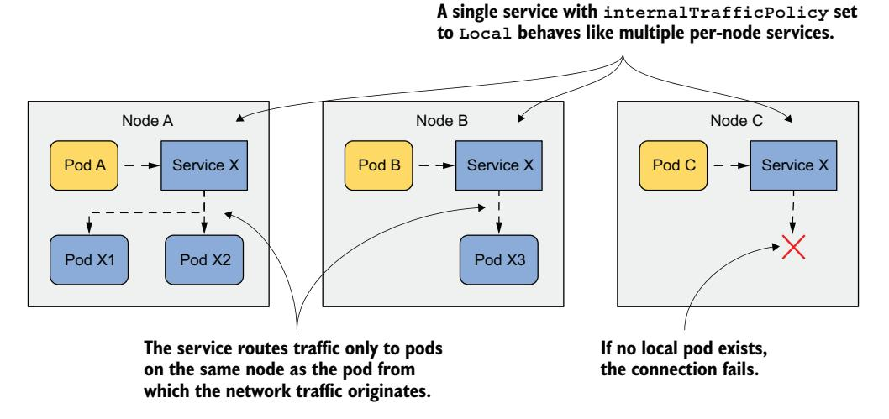

图 11.13 internalTrafficPolicy=Local 时的行为

设想每个集群节点上运行一个系统 Pod，该 Pod 管理与连接到该节点的设备通信。这些 Pod 不直接使用设备，而是与系统 Pod 通信。由于 Pod IP 是可替换的，而 Service IP 是稳定的，Pod 通过 Service 连接到系统 Pod。为了确保 Pod 只连接到本地系统 Pod 而不是其他节点上的，Service 被配置为仅将流量转发到本地端点。你的集群中没有这样的 Pod，但你可以使用 quote Pod 来尝试这个特性。

**创建具有 Local 内部流量策略的 Service**

以下清单显示了一个名为 `quote-local` 的 Service 的清单，该 Service 仅将流量转发到与客户端 Pod 在同一节点上运行的 Pod。你可以在文件 `svc.quote-local.yaml` 中找到该清单。

```yaml
apiVersion: v1
kind: Service
metadata:
  name: quote-local
spec:
  internalTrafficPolicy: Local
  selector:
    app: quote
  ports:
  - name: http
    port: 80
    targetPort: 80
    protocol: TCP
```

如你在清单中所见，该 Service 将把流量转发到所有具有标签 `app: quote` 的 Pod，但由于 `internalTrafficPolicy` 设置为 `Local`，它不会将流量转发到集群中的所有 quote Pod，而只会转发到与客户端 Pod 位于同一节点上的 Pod。通过使用 `kubectl apply` 应用清单来创建该 Service。

**观察节点本地流量路由**

在你能看到该 Service 如何路由流量之前，你需要找出客户端 Pod 和作为该 Service 端点的 Pod 位于何处。使用 `-o wide` 选项列出 Pod，以查看每个 Pod 运行在哪个节点上。

选择一个 Kiada Pod 并记下它的集群节点。使用 `curl` 从该 Pod 连接到 `quote-local` Service。例如，我的 `kiada-001` Pod 运行在 `kind-worker` 节点上。如果我在其中多次运行 `curl`，所有请求都由同一节点上的 quote Pod 处理：

```bash
$ kubectl exec kiada-001 -c kiada -- sh -c "while :; do curl -s quote-local; done"
This is the quote service running in pod quote-002 on node kind-worker
This is the quote service running in pod quote-canary on node kind-worker
This is the quote service running in pod quote-canary on node kind-worker
This is the quote service running in pod quote-002 on node kind-worker
```

没有请求被转发到其他节点上的 Pod。如果我删除 `kind-worker` 节点上的两个 Pod，下一次连接尝试将失败：

```bash
$ kubectl exec -it kiada-001 -c kiada -- curl http://quote-local
curl: (7) Failed to connect to quote-local port 80: Connection refused
```

在本节中，你学会了当 Service 的语义需要时，如何仅将流量转发到节点本地端点。在其他情况下，你可能希望流量优先转发到靠近客户端 Pod 的端点，仅在需要时才转发到更远的 Pod。你将在下一节中学习如何做到这一点。

### 11.5.2 拓扑感知提示

想象 Kiada 套件运行在一个集群中，节点分布在不同区域和地区的多个数据中心，如图 11.14 所示。你不希望一个区域中运行的 Kiada Pod 连接到另一个区域中的 Quote Pod，除非本地区域中没有 Quote Pod。理想情况下，你希望连接在同一区域内进行，以减少网络流量和相关成本。

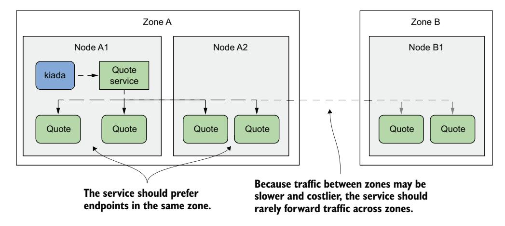

图 11.14 跨可用区路由服务流量

该图说明了所谓的**拓扑感知流量路由**。Kubernetes 通过向 EndpointSlice 对象中的每个端点添加拓扑感知提示来支持它。

**理解拓扑感知提示如何计算**

首先，你的所有集群节点必须包含 `kubernetes.io/zone` 标签以指示每个节点位于哪个区域。要指示 Service 应使用拓扑感知提示，你必须将 `service.kubernetes.io/topology-aware-hints` 注解设置为 `Auto`。如果 Service 有足够数量的端点，Kubernetes 会将提示添加到 EndpointSlice 对象中的每个端点。如下清单所示，`hints` 字段指定了该端点应从哪些区域被消费。

```yaml
apiVersion: discovery.k8s.io/v1
kind: EndpointSlice
endpoints:
- addresses:
  - 10.244.2.2
  conditions:
    ready: true
  hints:
    forZones:
    - name: zoneA
  nodeName: kind-worker
  targetRef:
    kind: Pod
    name: quote-002
    namespace: default
    resourceVersion: "944"
    uid: 03343161-971d-403c-89ae-9632e7cd0d8d
  zone: zoneA
...
```

清单只显示了一个端点。该端点代表 Pod `quote-002`，运行在节点 `kind-worker` 上，该节点位于 `zoneA` 中。因此，此端点的提示表明它应由 `zoneA` 中的 Pod 消费。在这个特定情况下，只有 `zoneA` 应该使用此端点，但 `forZones` 数组可以包含多个区域。

这些提示由 EndpointSlice 控制器计算，该控制器是 Kubernetes 控制平面的一部分。它根据区域中可分配的 CPU 核心数将端点分配到每个区域。如果一个区域具有更多的 CPU 核心数，它将被分配比 CPU 核心数较少的区域更多的端点。在大多数情况下，提示确保流量保持在同一个区域内，但为了确保更均衡的分配，情况并非总是如此。

**理解拓扑感知提示在哪里使用**

每个节点确保发送到 Service ClusterIP 的流量被转发到该 Service 的端点之一。如果 EndpointSlice 对象中没有拓扑感知提示，所有端点，无论它们位于哪个节点上，都将接收来自特定节点的流量。但是，如果 EndpointSlice 对象中的所有端点都包含提示，每个节点仅处理在提示中包含该节点所在区域的端点，而忽略其余端点。因此，源自节点上 Pod 的流量仅转发到部分端点。

目前，除了开启或关闭拓扑感知路由之外，你无法影响它，但将来可能会改变。

## 11.6 管理 Pod 在 Service 端点中的包含关系

关于 Service 和端点还有一件事尚未涉及。你了解到，如果 Pod 的标签与 Service 的标签选择器匹配，则该 Pod 会被包含为 Service 的端点。一旦出现具有匹配标签的新 Pod，它就成为 Service 的一部分，连接会被转发到该 Pod。但是，如果 Pod 中的应用程序没有立即准备好接受连接呢？

可能是应用程序需要时间来加载配置或数据，或者需要预热以使第一个客户端连接能够尽可能快地处理，而不因应用程序刚启动而产生不必要的延迟。在这种情况下，你不希望 Pod 立即接收流量，尤其是当现有 Pod 实例可以处理流量时。在 Pod 变得就绪之前不向刚启动的 Pod 转发请求是有意义的。

### 11.6.1 就绪探针简介

在第 6 章中，你学习了如何通过让 Kubernetes 重启存活探针失败的容器来保持应用程序健康。一种称为**就绪探针** (readiness probe) 的类似机制允许应用程序发出信号，表明它已准备好接受连接。

与存活探针一样，Kubelet 也会定期调用就绪探针以确定 Pod 的就绪状态。如果探针成功，Pod 被认为就绪。如果失败，则相反。与存活探针不同，就绪探针失败的容器不会被重启；它只会被从它所属的 Service 的端点中移除。

如图 11.15 所示，如果一个 Pod 未通过就绪探针，即使其标签匹配 Service 中定义的标签选择器，Service 也不会将连接转发给该 Pod。

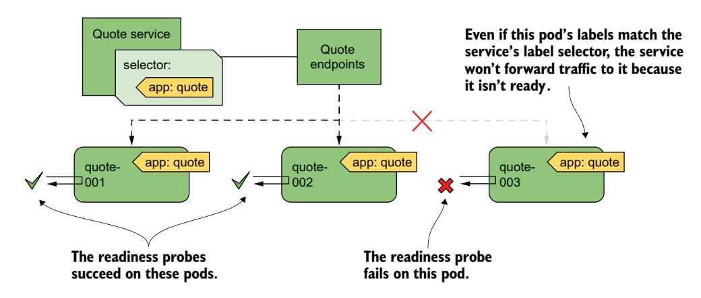

图 11.15 未通过就绪探针的 Pod 从服务中移除

就绪的概念对每个应用程序来说都是特定的。应用程序开发者决定就绪在应用程序上下文中意味着什么。为此，他们暴露一个端点，Kubernetes 通过该端点询问应用程序是否就绪。根据端点的类型，必须使用正确的就绪探针类型。

**理解就绪探针类型**

与存活探针一样，Kubernetes 支持三种类型的就绪探针：

- **exec 探针**在容器中执行一个进程。用于终止进程的退出码决定了容器是否就绪。
- **httpGet 探针**通过 HTTP 或 HTTPS 向容器发送 GET 请求。响应码决定了容器的就绪状态。
- **tcpSocket 探针**打开到容器指定端口的 TCP 连接。如果连接建立，容器被认为就绪。

**配置探针的执行频率**

你可能还记得，你可以使用以下属性配置存活探针为给定容器运行的时间和频率：`initialDelaySeconds`、`periodSeconds`、`failureThreshold` 和 `timeoutSeconds`。这些属性也适用于就绪探针，但它们还支持额外的 `successThreshold` 属性，该属性指定探针必须成功多少次才能使容器被认为就绪。

这些设置最好用图形来解释。图 11.16 显示了各个属性如何影响就绪探针的执行以及容器的就绪状态结果。

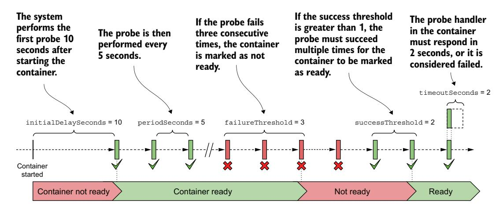

图 11.16 就绪探针的执行过程及容器的就绪状态

!!! note "注意"
    如果容器定义了启动探针，则就绪探针的初始延迟从启动探针成功后开始计算。启动探针在第 6 章中解释。

当容器就绪时，Pod 成为其标签选择器匹配的 Service 的端点。当它不再就绪时，它会被从这些 Service 中移除。

### 11.6.2 向 Pod 添加就绪探针

要查看就绪探针的实际效果，创建一个新的 Pod，其中包含一个你可以随意从成功切换到失败的探针。这不是如何配置就绪探针的真实示例，但它允许你看到探针的结果如何影响 Pod 在 Service 中的包含关系。

以下清单显示了 Pod 清单文件 `pod.kiada-mock-readiness.yaml` 的相关部分，你可以在本书代码仓库中找到它。

```yaml
apiVersion: v1
kind: Pod
...
spec:
  containers:
  - name: kiada
    ...
    readinessProbe:
      exec:
        command:
        - ls
        - /var/ready
      initialDelaySeconds: 10
      periodSeconds: 5
      failureThreshold: 3
      successThreshold: 2
      timeoutSeconds: 2
    ...
```

就绪探针在 kiada 容器中定期运行 `ls /var/ready` 命令。`ls` 命令在文件存在时返回退出码零，否则为非零。由于零被认为是成功，因此如果文件存在，就绪探针就成功。

定义这样一个奇特的就绪探针的原因是，你可以通过创建或删除相关文件来改变其结果。当你创建 Pod 时，文件还不存在，因此 Pod 未就绪。在创建 Pod 之前，删除除 `kiada-001` 之外的所有其他 Kiada Pod。这样可以更轻松地看到 Service 端点的变化。

**观察 Pod 的就绪状态**

从清单文件创建 Pod 后，按如下方式检查其状态：

```bash
$ kubectl get po kiada-mock-readiness
NAME                  READY   STATUS    RESTARTS   AGE
kiada-mock-readiness  1/2     Running   0          1m
```

READY 列显示 Pod 的容器中只有一个就绪。这是 envoy 容器，它没有定义就绪探针。没有就绪探针的容器在启动后即被认为就绪。

由于 Pod 的容器并非全部就绪，该 Pod 不应接收发送到 Service 的流量。你可以通过向 Kiada Service 发送多个请求来检查这一点。你会注意到所有请求都由 `kiada-001` Pod 处理，它是该 Service 唯一的活跃端点。这可以从与 Service 关联的 Endpoints 和 EndpointSlice 对象中看出。例如，`kiada-mock-readiness` Pod 出现在 Endpoints 对象的 `notReadyAddresses` 而不是 `addresses` 数组中：

```yaml
$ kubectl get endpoints kiada -o yaml
apiVersion: v1
kind: Endpoints
metadata:
  name: kiada
  ...
subsets:
- addresses:
  ...
  notReadyAddresses:
  - ip: 10.244.1.36
    nodeName: kind-worker2
    targetRef:
      kind: Pod
      name: kiada-mock-readiness
      namespace: default
    ...
```

在 EndpointSlice 对象中，端点的 `ready` 条件为 `false`：

```yaml
$ kubectl get endpointslices -l kubernetes.io/service-name=kiada -o yaml
apiVersion: v1
items:
- addressType: IPv4
  apiVersion: discovery.k8s.io/v1
  endpoints:
  - addresses:
    - 10.244.1.36
    conditions:
      ready: false
    nodeName: kind-worker2
    targetRef:
      kind: Pod
      name: kiada-mock-readiness
      namespace: default
    ...
```

!!! note "注意"
    在某些情况下，你可能希望忽略 Pod 的就绪状态。如果你希望一组中的所有 Pod 即使未就绪也获得 A、AAAA 和 SRV 记录，可能会这样做。如果你将 Service 对象的 `spec` 中的 `publishNotReadyAddresses` 字段设置为 `true`，未就绪的 Pod 在 Endpoints 和 EndpointSlice 对象中都会被标记为就绪。集群 DNS 等组件会将其视为就绪。

要使就绪探针成功，按如下方式在容器中创建 `/var/ready` 文件：

```bash
$ kubectl exec kiada-mock-readiness -c kiada -- touch /var/ready
```

`kubectl exec` 命令在 `kiada-mock-readiness` Pod 的 kiada 容器中运行 `touch` 命令。`touch` 命令创建指定的文件。容器的就绪探针现在将成功。所有 Pod 的容器现在都应该显示为就绪。按如下方式验证：

```bash
$ kubectl get po kiada-mock-readiness
NAME                  READY   STATUS    RESTARTS   AGE
kiada-mock-readiness  1/2     Running   0          10m
```

令人惊讶的是，Pod 仍然未就绪。是出了什么问题还是这是预期结果？使用 `kubectl describe` 更仔细地查看 Pod。在输出中，你会找到以下行：

```text
Readiness: exec [ls /var/ready] delay=10s timeout=2s period=5s #success=2 #failure=3
```

Pod 中定义的就绪探针配置为每 5 秒检查一次容器的状态。但是，它还配置为在将容器状态设置为就绪之前需要两次连续的探针尝试成功。因此，在你创建 `/var/ready` 文件后，大约需要 10 秒 Pod 才会就绪。

当这发生时，Pod 应成为 Service 的活跃端点。你可以通过检查与 Service 关联的 Endpoints 或 EndpointSlice 对象，或者只需多次访问 Service 并查看 `kiada-mock-readiness` Pod 是否接收到你发送的任何请求来验证这一点。

如果你想再次从 Service 中移除 Pod，运行以下命令从容器中删除 `/var/ready` 文件：

```bash
$ kubectl exec kiada-mock-readiness -c kiada -- rm /var/ready
```

这个就绪探针的模拟只是为了展示就绪探针如何工作。在现实世界中，不应以这种方式实现就绪探针。如果你想手动从 Service 中移除 Pod，你可以通过删除 Pod 或更改 Pod 的标签来实现，而不是操纵就绪探针的结果。

!!! tip "提示"
    如果你想手动控制 Pod 是否包含在 Service 中，可以向 Pod 添加一个标签键（如 `enabled`）并将其值设置为 `true`。然后将标签选择器 `enabled=true` 添加到你的 Service。从 Pod 中删除该标签即可将 Pod 从 Service 中移除。

### 11.6.3 实现真实世界的就绪探针

如果你没有在 Pod 中定义就绪探针，它会在创建后立即成为 Service 端点。这意味着每次创建新的 Pod 实例时，Service 转发到该新实例的连接都会失败，直到 Pod 中的应用程序准备好接受它们。为防止这种情况，你应该始终为 Pod 定义一个就绪探针。

在上一节中，你学习了如何向容器添加模拟就绪探针，以手动控制 Pod 是否是 Service 端点。在现实世界中，就绪探针的结果应反映容器中运行的应用程序接受连接的能力。

**定义最小的就绪探针**

对于运行 HTTP 服务器的容器，定义一个简单的就绪探针（检查服务器是否响应简单的 GET / 请求，如下代码片段所示）比根本没有就绪探针要好得多：

```yaml
readinessProbe:
  httpGet:
    port: 8080
    path: /
    scheme: HTTP
```

当 Kubernetes 调用此就绪探针时，它向容器的端口 8080 发送 GET / 请求，并检查返回的 HTTP 响应码。如果响应码大于或等于 200 且小于 400，则探针成功，Pod 被认为就绪。如果响应码是其他值（例如 404 或 500）或连接尝试失败，则就绪探针被认为失败，Pod 被标记为未就绪。

这个简单探针确保 Pod 仅在其能实际处理 HTTP 请求时才成为 Service 的一部分，而不是在 Pod 启动后立即成为。

**定义更好的就绪探针**

像上一节中展示的简单就绪探针并不总是足够的。以 Quote Pod 为例。你可能还记得它运行两个容器。quote-writer 容器从本书中选择一个随机名言并将其写入两个容器共享的卷中名为 `quote` 的文件。nginx 容器从此共享卷提供文件服务。因此，名言本身在 URL 路径 `/quote` 上可用。

Quote Pod 的目的显然是提供来自本书的随机名言。因此，在它能提供这个名言之前，不应被标记为就绪。如果你将就绪探针指向 URL 路径 `/`，即使 quote-writer 容器尚未创建 `quote` 文件，它也会成功。因此，Quote Pod 中的就绪探针应按 `pod.quote-readiness.yaml` 文件中的以下片段配置：

```yaml
readinessProbe:
  httpGet:
    port: 80
    path: /quote
    scheme: HTTP
  failureThreshold: 1
```

如果你将此就绪探针添加到你的 Quote Pod，你会看到 Pod 只有在 `quote` 文件存在时才就绪。尝试按如下方式从 Pod 中删除文件：

```bash
$ kubectl exec quote-readiness -c quote-writer -- rm /var/local/output/quote
```

现在使用 `kubectl get pod` 检查 Pod 的就绪状态，你会看到其中一个容器不再就绪。当 quote-writer 重新创建文件时，容器再次变得就绪。你还可以使用 `kubectl get endpoints quote` 检查 quote Service 的端点，以查看 Pod 被移除然后重新添加。

**实现专用的就绪端点**

正如你在前面的例子中看到的，将就绪探针指向 HTTP 服务器提供的现有路径可能就足够了，但应用程序提供一个专用端点（如 `/healthz/ready` 或 `/readyz`）也很常见，通过它来报告其就绪状态。当应用程序在此端点上收到请求时，它可以执行一系列内部检查来确定其就绪状态。

让我们以 Quiz Service 为例。Quiz Pod 同时运行一个 HTTP 服务器和一个 MongoDB 容器。如下清单所示，quiz-api 服务器实现了 `/healthz/ready` 端点。当它收到请求时，检查是否可以成功连接到另一个容器中的 MongoDB。如果可以，它响应 200 OK。如果不能，返回 500 Internal Server Error。

```go
func (s *HTTPServer) ListenAndServe(listenAddress string) {
    router := mux.NewRouter()
    router.Methods("GET").Path("/").HandlerFunc(s.handleRoot)
    router.Methods("GET").Path("/healthz/ready").HandlerFunc(s.handleReadiness)
    ...
}
func (s *HTTPServer) handleReadiness(res http.ResponseWriter, req *http.Request) {
    conn, err := s.db.Connect()
    if err != nil {
        res.WriteHeader(http.StatusInternalServerError)
        _, _ = fmt.Fprintf(res, "ERROR: %v\n", err.Error())
        return
    }
    defer conn.Close()
    res.WriteHeader(http.StatusOK)
    _, _ = res.Write([]byte("Readiness check successful"))
}
```

Quiz Pod 中定义的就绪探针确保 Pod 提供服务所需的一切都已存在并可正常工作。随着向 quiz-api 应用程序添加更多组件，可以在就绪检查代码中添加进一步的检查。一个例子是添加内部缓存。就绪端点可以检查缓存是否已预热，以便 Pod 仅在那时才暴露给客户端。

**在就绪探针中检查依赖项**

在 Quiz Pod 中，MongoDB 数据库是 quiz-api 容器的内部依赖项。另一方面，Kiada Pod 依赖于 Quiz 和 Quote Service，它们是外部依赖项。Kiada Pod 中的就绪探针应该检查什么？它应该检查是否可以访问 Quote 和 Quiz Service 吗？

这个问题的答案值得讨论，但每当你在就绪探针中检查依赖项时，必须考虑如果暂时性问题（如网络延迟的暂时增加）导致探针失败会发生什么。

请注意，就绪探针定义中的 `timeoutSeconds` 字段限制了探针可以响应的时间。默认超时仅为 1 秒。容器必须在此时间内响应就绪探针。

如果 Kiada Pod 在其就绪检查中调用另外两个 Service，但由于暂时性网络中断而导致它们的响应仅略有延迟，其就绪探针就会失败，Pod 将被从 Service 端点中移除。如果这同时发生在所有 Kiada Pod 上，将没有 Pod 剩余来处理客户端请求。中断可能只持续一秒钟，但 Pod 可能要等到数十秒后才能重新添加到 Service，这取决于 `periodSeconds` 和 `successThreshold` 属性的配置方式。

当你在就绪探针中检查外部依赖项时，应该考虑当这些类型的暂时性网络问题发生时会发生什么。然后相应地设置周期、超时和阈值。

!!! tip "提示"
    试图过于智能的就绪探针可能导致的问题多于它们解决的问题。作为经验法则，就绪探针不应测试外部依赖项，但可以测试同一 Pod 内的依赖项。

Kiada 应用程序也实现了 `/healthz/ready` 端点，而不是让就绪探针使用 `/` 端点来检查其状态。此端点简单地以 HTTP 响应码 200 OK 和响应正文中的单词 "Ready" 进行响应，这确保就绪探针只检查应用程序本身是否在响应，而不连接到 Quiz 或 Quote Service。你可以在 `pod.kiada-readiness.yaml` 文件中找到 Pod 清单。

**理解 Pod 关闭上下文中的就绪探针**

在结束本章之前最后一点说明。如你所知，就绪探针在 Pod 启动时最重要，但它们也确保当某些原因导致 Pod 在正常运行期间不再就绪时，Pod 会被移出服务。但是，当 Pod 正在终止时呢？正在关闭过程中的 Pod 不应属于任何 Service。在实现就绪探针时需要考虑这一点吗？

幸运的是，当你删除 Pod 时，Kubernetes 不仅向 Pod 的容器发送终止信号，还会从所有 Service 中移除该 Pod，这意味着你不需要在就绪探针中为终止中的 Pod 做任何特殊处理。你不必确保当你的应用程序收到终止信号时探针失败。

## 小结

- Pod 通过一个扁平网络进行通信，该网络允许集群中的任何 Pod 访问任何其他 Pod，无论连接集群节点的实际网络拓扑如何。
- Kubernetes Service 使一组 Pod 在一个单一的 IP 地址下可用。虽然 Pod 的 IP 可能会变化，但 Service 的 IP 保持不变。
- Service 的 ClusterIP 可从集群内部访问，但 NodePort 和 LoadBalancer Service 也可以从集群外部访问。
- Service 端点要么由 Service 对象中指定的标签选择器确定，要么手动配置。这些端点存储在 Endpoints 和 EndpointSlice 对象中。
- 客户端 Pod 可以使用集群 DNS 或环境变量来查找 Service。根据 Service 的类型，可以创建以下 DNS 记录：A、AAAA、SRV 和 CNAME。
- Service 可以配置为仅将外部流量转发到接收外部流量的同一节点上的 Pod，或转发到集群中任意位置的 Pod。它们还可以配置为仅将内部流量路由到与流量来源 Pod 位于同一节点上的 Pod。拓扑感知路由确保当本地 Pod 可以提供所请求的服务时，流量不会跨可用区路由。
- Pod 在就绪之前不会成为 Service 端点。通过在应用程序中实现就绪探针处理程序，你可以定义就绪在该特定应用程序上下文中的含义。

