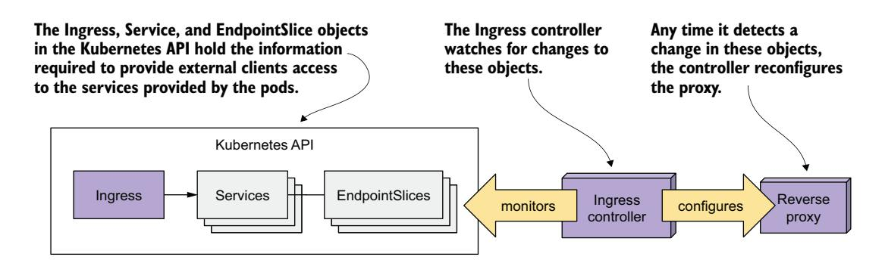
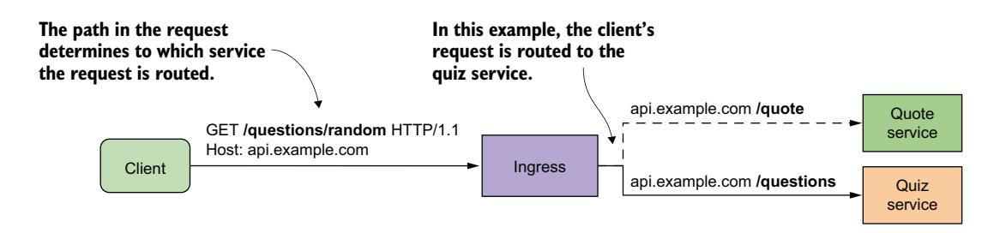
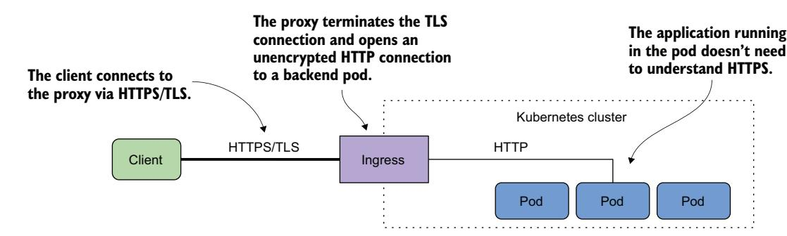
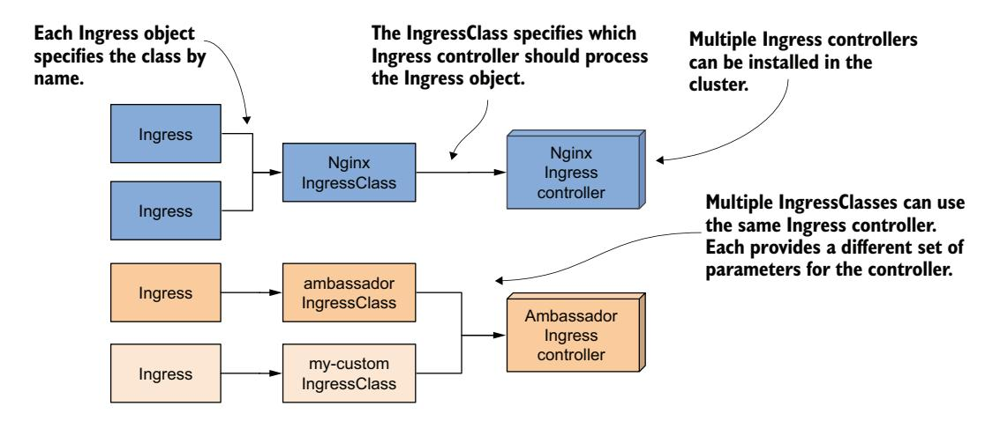

# 第 12 章 使用 Ingress 将流量路由到 Service

!!! tip "本章内容"

    - 创建 Ingress 对象
    - Ingress 控制器及其部署方式
    - 使用传输层安全（TLS）保护 Ingress
    - 为 Ingress 添加额外配置
    - 安装多个控制器时使用 IngressClass
    - 使用非 Service 后端

在上一章中，你学习了如何使用 Service 对象将一组 Pod 暴露在一个稳定的 IP 地址上。如果你使用 LoadBalancer 类型的 Service，该 Service 会通过负载均衡器对集群外部的客户端可用。当只需要对外暴露一个 Service 时，这种方式没有问题，但当 Service 数量很多时就会变得麻烦，因为每个 Service 都需要自己的公网 IP 地址。

幸运的是，当通过 **Ingress** 对象来暴露这些 Service 时，你只需要一个 IP 地址。此外，Ingress 还提供其他 Service 对象无法提供的功能，如 HTTP 认证、基于 Cookie 的会话亲和性、URL 重写等。

!!! note "说明"

    本章的代码文件可在 [https://github.com/luksa/kubernetes-in-action-2nd-edition/tree/master/Chapter12](https://github.com/luksa/kubernetes-in-action-2nd-edition/tree/master/Chapter12) 获取。

## 12.1 Ingress 简介

在解释 Kubernetes 中 Ingress 的含义之前，我们先定义一下 **ingress** 这个通用英语词汇，这对于正在学习该术语的读者可能会有帮助。

!!! info "定义"

    **Ingress**（名词）——进入或驶入的行为；进入的权利；进入的方式或场所；入口。

在 Kubernetes 中，Ingress 是外部客户端访问集群中运行的应用服务的一种方式。Ingress 功能由以下三个组件组成：

- **Ingress API 对象**——用于定义和配置 Ingress
- **L7 负载均衡器或反向代理**——将流量路由到后端 Service
- **Ingress 控制器**——监控 Kubernetes API 中的 Ingress 对象，并部署和配置负载均衡器或反向代理

!!! note "说明"

    L4 和 L7 分别指 OSI（开放系统互连）模型的第 4 层（传输层；TCP、UDP）和第 7 层（应用层；HTTP）。

!!! note "说明"

    正向代理（forward proxy）路由和过滤出站流量，通常位于所服务的客户端附近；而反向代理（reverse proxy）处理入站流量并将其路由到一个或多个后端服务器，通常位于这些服务器附近。

在大多数网络资料中，术语 **Ingress 控制器** 常常被用来泛指负载均衡器/反向代理和实际控制器这一整体，但它们其实是两个不同的组件。因此，我在本章中将它们分开讨论。

此外，我将 L7 负载均衡器称为 **代理（proxy）**，以便将其与处理 LoadBalancer 类型 Service 流量的 L4 负载均衡器区分开来。请注意，如果 Ingress 仅将流量路由到单个后端 Pod，则不存在负载均衡。

### 12.1.1 Ingress 对象类型简介

当你需要向外部暴露一组 Service 时，可以创建一个 Ingress 对象并在其中引用 Service 对象。Kubernetes 使用这个 Ingress 对象来配置一个 L7 负载均衡器（HTTP 反向代理），使外部客户端能够通过一个统一的入口访问这些 Service。

!!! note "说明"

    如果通过 Ingress 暴露一个 Service，通常可以将 Service 的类型保持为 ClusterIP。但是，某些 Ingress 实现要求 Service 类型为 NodePort。请参考相应 Ingress 控制器的文档以确认。

#### 通过 Ingress 对象暴露 Service

虽然 Ingress 对象可以用于暴露单个 Service，但通常它被用于组合多个 Service 对象，如图 12.1 所示。图中展示了单个 Ingress 对象如何使 Kiada 套件中的所有三个 Service 都能被外部客户端访问。


图 12.1 Ingress 将外部流量转发到多个 Service。

Ingress 对象包含基于 HTTP 请求中的信息将流量路由到三个 Service 的规则。这些 Service 的公共 DNS 条目都指向同一个 Ingress。Ingress 根据请求本身决定哪个 Service 应该接收该请求。如果客户端请求指定了主机 kiada.example.com，Ingress 会将其转发到属于 kiada Service 的 Pod；而指定主机 api.example.com 的请求则根据请求路径转发到 quote 或 quiz Service。

#### 在集群中使用多个 Ingress 对象

一个 Ingress 对象通常处理特定 Kubernetes 命名空间中所有 Service 对象的流量，但也可以使用多个 Ingress。通常，每个 Ingress 对象都会获得自己的 IP 地址，但某些 Ingress 实现会为你创建的所有 Ingress 对象使用一个统一的入口。

### 12.1.2 Ingress 控制器和反向代理简介

并非所有 Kubernetes 集群都默认支持 Ingress。该功能由 Ingress 控制器这一集群附加组件提供。该控制器是 Ingress 对象与实际物理入口（反向代理）之间的桥梁。通常，控制器和代理作为两个进程运行在同一个容器中，或作为两个容器运行在同一个 Pod 中。这就是人们用 **Ingress 控制器** 这个术语来统指两者的原因。

有时控制器或代理位于集群外部。例如，Google Kubernetes Engine 提供了自己的 Ingress 控制器，使用 Google Cloud Platform 的 L7 负载均衡器为集群提供 Ingress 功能。

如果集群部署在多个可用区中，单个 Ingress 可以处理所有区域的流量。例如，它可以根据客户端的位置将每个 HTTP 请求转发到最优的区域。

可供选择的 Ingress 控制器种类繁多。Kubernetes 社区维护了一份列表，位于 [https://kubernetes.io/docs/concepts/services-networking/ingress-controllers/](https://kubernetes.io/docs/concepts/services-networking/ingress-controllers/)。其中最流行的包括 Nginx Ingress 控制器、Ambassador、Contour 和 Traefik。这些 Ingress 控制器大多使用 Nginx、HAProxy 或 Envoy 作为反向代理，但也有一些使用自己实现的代理。

##### 理解 Ingress 控制器的角色

Ingress 控制器是让 Ingress 对象发挥作用的软件组件。如图 12.2 所示，控制器连接到 Kubernetes API 服务器并监控 Ingress、Service 以及 Endpoints 或 EndpointSlice 对象。当你创建、修改或删除这些对象时，控制器会收到通知。它利用这些对象中的信息来为 Ingress 配置和部署反向代理。



图 12.2 Ingress 控制器的角色

当你创建 Ingress 对象时，控制器会读取其 spec 部分，并将其与引用的 Service 和 EndpointSlice 对象中的信息相结合。控制器将这些信息转换为反向代理的配置。然后，它会使用此配置设置一个新的代理，并执行其他步骤以确保代理可从集群外部访问。如果代理运行在集群内部的 Pod 中，这通常意味着会创建一个 LoadBalancer 类型的 Service 来将代理对外暴露。

当你修改 Ingress 对象时，控制器会更新代理的配置；当你删除 Ingress 时，控制器会停止并删除代理以及与之一起创建的其他对象。

#### 理解代理如何将流量转发到 Service

反向代理（或 L7 负载均衡器）是处理传入 HTTP 请求并将其转发到 Service 的组件。代理配置通常包含一个虚拟主机列表，以及每个虚拟主机对应的端点 IP 列表。这些信息来自 Ingress、Service 和 Endpoints/EndpointSlice 对象。当客户端连接到代理时，代理使用这些信息根据请求路径和头部将请求路由到某个端点（如 Pod）。

图 12.3 展示了客户端如何通过代理访问 Kiada Service。客户端首先对 kiada.example.com 进行 DNS 查询。DNS 服务器返回反向代理的公共 IP 地址。然后，客户端向代理发送一个 HTTP 请求，其中 Host 头部包含值 kiada.example.com。代理将该主机映射到某个 Kiada Pod 的 IP 地址，并将 HTTP 请求转发给它。请注意，代理不会将请求发送到 Service IP，而是直接发送到 Pod。这是大多数 Ingress 实现的工作方式。


图 12.3 通过 Ingress 访问 Pod

### 12.1.3 安装 Ingress 控制器

在开始创建 Ingress 之前，你需要确保集群中运行着 Ingress 控制器。正如上一节所述，并非所有 Kubernetes 集群都默认带有 Ingress 控制器。

如果你使用的是主流云提供商提供的托管集群，Ingress 控制器通常已经就位。在 Google Kubernetes Engine 中，Ingress 控制器是 GLBC（GCE L7 Load Balancer）；在 AWS 中，Ingress 功能由 AWS Load Balancer Controller 提供；而 Azure 则提供 AGIC（Application Gateway Ingress Controller）。请查阅你的云提供商文档，了解是否提供了 Ingress 控制器以及是否需要启用它。或者，你也可以自行安装 Ingress 控制器。

如你所知，有许多不同的 Ingress 实现可供选择。它们都提供上一节所述的基本流量路由功能，但各自提供不同的附加功能。在本章的所有示例中，我使用的是 Nginx Ingress 控制器。我建议你也使用它，除非你的集群提供了其他选择。

!!! note "说明"

    Nginx Ingress 控制器有两种实现。一种由 Kubernetes 维护者提供，另一种由 Nginx 作者本人提供。如果你是 Kubernetes 新手，应该从前一种开始。这也是我使用的版本。

#### 安装 Nginx Ingress 控制器

无论你如何运行 Kubernetes 集群，都应该能够按照 [https://kubernetes.github.io/ingress-nginx/deploy/](https://kubernetes.github.io/ingress-nginx/deploy/) 上的说明安装 Nginx Ingress 控制器。

如果你使用 kind 工具创建集群，请使用 Chapter12/createkind-cluster.sh 脚本，而不是 Chapter04/ 中的脚本，因为 Ingress 控制器需要不同的集群配置文件（参见 Chapter12/kind-multinode.yaml 文件）。更新后的配置确保端口 80 和 443 映射到宿主机，并将标签 `ingress-ready=true` 添加到控制平面节点，以便 Ingress 控制器可以调度到该节点上。要安装控制器，运行以下命令：

```bash
$ kubectl apply -f https://raw.githubusercontent.com/kubernetes/ingress-nginx/main/deploy/static/provider/kind/deploy.yaml
```

如果你使用 Minikube 运行集群，可以按如下方式安装控制器：

```bash
$ minikube addons enable ingress
```

你可能还需要运行 `minikube tunnel` 命令，以便从宿主机操作系统访问 LoadBalancer Service 和 Ingress。

## 12.2 创建和使用 Ingress 对象

上一节介绍了 Ingress 对象和 Ingress 控制器的基础知识，以及如何安装 Nginx Ingress 控制器。在本节中，你将学习如何使用 Ingress 来暴露 Kiada 套件中的 Service。

在创建第一个 Ingress 对象之前，你必须先部署 Kiada 套件的 Pod 和 Service。如果你已经完成了上一章的练习，它们应该已经就位。如果没有，你可以先创建 kiada 命名空间，然后使用以下命令应用 Chapter12/SETUP/ 目录中的所有清单：

```bash
$ kubectl apply -f SETUP/ --recursive
```

### 12.2.1 通过 Ingress 暴露 Service

Ingress 对象引用一个或多个 Service 对象。你的第一个 Ingress 对象将暴露在上一章中创建的 kiada Service。在创建 Ingress 之前，先通过以下清单回顾一下该 Service 的清单。

**清单 12.1 kiada Service 清单**

```yaml
apiVersion: v1
kind: Service
metadata:
  name: kiada
spec:
  type: ClusterIP
  selector:
    app: kiada
  ports:
  - name: http
    port: 80
    targetPort: 8080
  - name: https
    port: 443
    targetPort: 8443
```

该 Service 的类型为 ClusterIP，因为 Service 本身不需要对集群外部的客户端直接可见——Ingress 会处理这个问题。虽然该 Service 暴露了端口 80 和 443，但 Ingress 只会将流量转发到端口 80。

#### 创建 Ingress 对象

Ingress 对象的清单如下所示。你可以在本书代码仓库的 Chapter12/ing.kiada-example-com.yaml 文件中找到它。

清单 12.2 将 **kiada** Service 暴露在 **kiada.example.com** 的 Ingress 对象

```yaml
apiVersion: networking.k8s.io/v1
kind: Ingress
metadata:
  name: kiada-example-com
spec:
  rules:
  - host: kiada.example.com
    http:
      paths:
      - path: /
        pathType: Prefix
        backend:
          service:
            name: kiada
            port:
              number: 80
```

清单中定义了一个名为 kiada-example-com 的 Ingress 对象。你可以为对象起任何名称，但建议名称能够反映 Ingress 规则中指定的主机和/或路径。

!!! warning "警告"

    在 Google Kubernetes Engine 中，Ingress 名称不能包含点号（`.`），否则与该 Ingress 对象关联的事件中会显示以下错误信息：`Error syncing to GCP: error running load balancer syncing routine: invalid loadbalancer name`。

!!! note "说明"

    如果你在部署 Ingress 控制器后很快应用此清单，操作可能会因错误 `failed calling webhook` 而失败。如果发生这种情况，请等待几秒钟后重试。

清单中的 Ingress 对象定义了一条规则。该规则规定，无论请求的路径如何（如 path 和 pathType 字段所示），所有针对主机 kiada.example.com 的请求都应转发到 kiada Service 的端口 80。这如图 12.4 所示。


图 12.4 kiada-example-com Ingress 对象如何配置外部流量路由

##### 通过查看 Ingress 对象获取其公网 IP 地址

使用 `kubectl apply` 创建 Ingress 对象后，你可以通过以下方式列出当前命名空间中的 Ingress 对象来查看其基本信息：

```bash
$ kubectl get ingresses
```

| NAME              | CLASS | HOSTS             | ADDRESS     | PORTS | AGE |
|-------------------|-------|-------------------|-------------|-------|-----|
| kiada-example-com | nginx | kiada.example.com | 11.22.33.44 | 80    | 30s |

!!! note "说明"

    你可以使用 `ing` 作为 `ingress` 的简写。

要查看 Ingress 对象的详细信息，使用 `kubectl describe` 命令：

```text
$ kubectl describe ing kiada-example-com
Name:             kiada-example-com
Namespace:        default
Address:          11.22.33.44
Default backend:  default-http-backend:80 (172.17.0.15:8080)
Rules:
  Host              Path  Backends
  ----              ----  --------
  kiada.example.com
                    /     kiada:80 (172.17.0.4:8080,172.17.0.5:8080,172.17.0.9:8080)
Annotations:       <none>
Events:
  Type    Reason  Age                  From                      Message
  ----    ------  ----                 ----                      -------
  Normal  Sync    5m6s (x2 over 5m28s) nginx-ingress-controller  Scheduled for sync
```

如你所见，`kubectl describe` 命令列出了 Ingress 对象中的所有规则。对于每条规则，不仅显示了目标 Service 的名称，还显示了其端点。

!!! note "说明"

    输出中可能显示与默认后端相关的以下错误信息：`<error: endpoints "default-http-backend" not found>`。你将在本章后面学习默认后端。目前暂且忽略该错误。

`kubectl get` 和 `kubectl describe` 都会显示 Ingress 的 IP 地址。这是客户端应发送请求的 L7 负载均衡器或反向代理的 IP 地址。在示例输出中，IP 地址为 11.22.33.44，端口为 80。

!!! note "说明"

    通常，处理 Ingress 流量的代理仅监听端口 80 和 443，但某些 Ingress 实现允许你配置端口号。

!!! note "说明"

    地址可能不会立即显示，尤其是当集群在云端运行时。如果几分钟后地址仍未显示，这意味着没有 Ingress 控制器处理该 Ingress 对象。请检查控制器是否正在运行。由于一个集群可以运行多个 Ingress 控制器，如果你未指定应由哪个控制器处理该 Ingress 对象，它们可能会全部忽略它。请查阅你所选 Ingress 控制器的文档，了解是否需要添加 `kubernetes.io/ingress.class` 注解或在 Ingress 对象中设置 `spec.ingressClassName` 字段。你将在后面了解更多关于该字段的内容。

你也可以在 Ingress 对象的 `status` 字段中找到 IP 地址，如下所示：

```bash
$ kubectl get ing kiada-example-com -o yaml
```

...

```yaml
status:
  loadBalancer:
    ingress:
    - ip: 11.22.33.44
```

!!! note "说明"

    有时显示的地址可能会产生误导。例如，如果你使用 Minikube 并在 VM 中启动集群，Ingress 地址将显示为 localhost，但这只在 VM 的视角下成立。实际的 Ingress 地址是 VM 的 IP 地址，你可以通过 `minikube ip` 命令获取。

#### 将 Ingress IP 添加到 DNS

在将 Ingress 添加到生产集群后，下一步是向你的互联网域名的 DNS 服务器添加一条记录。在这些示例中，我们假设你拥有域名 example.com。为了让外部客户端能够通过 Ingress 访问你的 Service，你需要配置 DNS 服务器将域名 kiada.example.com 解析为 Ingress 的 IP 地址 11.22.33.44。

在本地开发集群中，你无需处理 DNS 服务器。因为你只从自己的计算机上访问 Service，所以可以通过其他方式让计算机解析该地址。下面将介绍这一点，以及如何通过 Ingress 访问 Service。

#### 通过 Ingress 访问 Service

由于 Ingress 使用虚拟主机来确定将请求转发到何处，仅仅向 Ingress 的 IP 地址和端口发送 HTTP 请求并不会得到你想要的结果。你需要确保 HTTP 请求中的 Host 头部与 Ingress 对象中的某条规则匹配。

为此，你必须告诉 HTTP 客户端将请求发送到主机 kiada.example.com。然而，这需要将主机名解析为 Ingress 的 IP 地址。如果你使用 curl，可以在不配置 DNS 服务器或本地 `/etc/hosts` 文件的情况下做到这一点。假设 Ingress IP 为 11.22.33.44，你可以通过以下命令通过 Ingress 访问 kiada Service：

```bash
$ curl --resolve kiada.example.com:80:11.22.33.44 http://kiada.example.com -v
* Added kiada.example.com:80:11.22.33.44 to DNS cache
* Hostname kiada.example.com was found in DNS cache
* Trying 11.22.33.44:80...
* Connected to kiada.example.com (11.22.33.44) port 80 (#0)
> GET / HTTP/1.1
> Host: kiada.example.com
> User-Agent: curl/7.76.1
> Accept: */*
...
```

`--resolve` 选项将主机名 kiada.example.com 添加到 DNS 缓存中，确保 kiada.example.com 解析为 Ingress 的 IP。然后 curl 向 Ingress 打开连接并发送 HTTP 请求。请求中的 Host 头部被设置为 kiada.example.com，这使得 Ingress 能够将请求转发到正确的 Service。

当然，如果你想使用 Web 浏览器，就无法使用 `--resolve` 选项。相反，你可以在 `/etc/hosts` 文件中添加以下条目：

```text
11.22.33.44 kiada.example.com
```

!!! note "说明"

    在 Windows 上，hosts 文件通常位于 `C:\Windows\System32\Drivers\etc\hosts`。

现在你可以通过 Web 浏览器或 curl 在 `http://kiada.example.com` 访问该 Service，无需使用 `--resolve` 选项将主机名映射到 IP。

### 12.2.2 基于路径的 Ingress 流量路由

Ingress 对象可以包含多条规则，因此可以将多个主机和路径映射到多个 Service。你已经为 kiada Service 创建了一个 Ingress。现在，你将为 quote 和 quiz Service 创建一个 Ingress。

这两个 Service 的 Ingress 对象使它们通过同一个主机可用：api.example.com。HTTP 请求中的路径决定了哪个 Service 接收请求。如图 12.5 所示，所有路径为 `/quote` 的请求会转发到 quote Service，所有路径以 `/questions` 开头的请求会转发到 quiz Service。



图 12.5 基于路径的 Ingress 流量路由

以下清单展示了该 Ingress 清单。

**清单 12.3 将请求路径映射到不同 Service 的 Ingress**

```yaml
apiVersion: networking.k8s.io/v1
kind: Ingress
metadata:
  name: api-example-com
spec:
  rules:
  - host: api.example.com
    http:
      paths:
      - path: /quote
        pathType: Exact
        backend:
          service:
            name: quote
            port:
              name: http
      - path: /questions
        pathType: Prefix
        backend:
          service:
            name: quiz
            port:
              name: http
```

在清单所示的 Ingress 对象中，定义了一条包含两个路径的规则。该规则匹配主机为 api.example.com 的 HTTP 请求。在这条规则中，`paths` 数组包含两个条目。第一个条目匹配请求 `/quote` 路径的请求，并将其转发到 quote Service 对象中名为 http 的端口。第二个条目匹配所有第一个路径元素为 `/questions` 的请求，并将其转发到 quiz Service 的 http 端口。

!!! note "说明"

    默认情况下，Ingress 代理不会执行 URL 重写。如果客户端请求路径 `/quote`，代理向后端 Service 发送的请求路径也是 `/quote`。在某些 Ingress 实现中，你可以通过在 Ingress 对象中指定 URL 重写规则来改变这一行为。

从上述清单创建 Ingress 对象后，你可以按如下方式访问它所暴露的两个 Service（将 IP 替换为你的 Ingress 的 IP）：

```bash
$ curl --resolve api.example.com:80:11.22.33.44 api.example.com/quote
$ curl --resolve api.example.com:80:11.22.33.44 api.example.com/questions/random
```

如果你想使用 Web 浏览器访问这些 Service，请将 api.example.com 添加到之前你在 `/etc/hosts` 文件中添加的那一行中。现在它应该如下所示：

```text
11.22.33.44 kiada.example.com api.example.com
```

#### 理解路径匹配方式

你是否注意到了上面清单中两个条目的 `pathType` 字段之间的区别？`pathType` 字段指定了请求中的路径如何与 Ingress 规则中的路径进行匹配。表 12.1 总结了支持的三种取值。

表 12.1 **pathType** 字段支持的取值

| 路径类型               | 描述                                                             |
|------------------------|------------------------------------------------------------------|
| Exact                  | 请求的 URL 路径必须与 Ingress 规则中指定的路径完全匹配。        |
| Prefix                 | 请求的 URL 路径必须按元素逐一匹配 Ingress 规则中指定的路径前缀。 |
| ImplementationSpecific | 路径匹配取决于 Ingress 控制器的实现。                             |

如果 Ingress 规则中指定了多个路径，且请求中的路径匹配规则中的多个路径，则优先匹配 `Exact` 类型的路径。

##### 使用 Exact 路径类型的匹配方式

表 12.2 展示了当 `pathType` 设置为 `Exact` 时的匹配示例。匹配方式如你所预期的那样：区分大小写，请求中的路径必须与 Ingress 规则中指定的路径完全匹配。

表 12.2 **pathType** 为 Exact 时匹配的请求路径

| 规则中的路径 | 匹配的请求路径 | 不匹配的路径              |
|-------------|---------------|--------------------------|
| /           | /             | /foo<br>/bar             |
| /foo        | /foo          | /foo/<br>/bar            |
| /foo/       | /foo/         | /foo<br>/foo/bar<br>/bar |
| /FOO        | /FOO          | /foo                     |

##### 使用 Prefix 路径类型的匹配方式

当 `pathType` 设置为 `Prefix` 时，情况可能不像你想象的那样。请看表 12.3 中的示例。

表 12.3 **pathType** 为 **Prefix** 时匹配的请求路径

| 规则中的路径          | 匹配的请求路径                                  | 不匹配的路径     |
|-----------------------|-------------------------------------------------|------------------|
| /                     | 所有路径；例如：<br>/<br>/foo<br>/foo/          |                  |
| /foo<br>或<br>/foo/   | /foo<br>/foo/<br>/foo/bar                       | /foobar<br>/bar  |
| /FOO                  | /FOO                                            | /foo             |

请求路径并不会被当作字符串来检查是否以指定的前缀开头。相反，规则中的路径和请求路径都会被 `/` 分割，然后逐一比较请求路径和前缀中的每个元素。以路径 `/foo` 为例，它匹配请求路径 `/foo/bar`，但不匹配 `/foobar`。它也不匹配请求路径 `/fooxyz/bar`。

在匹配时，规则中的路径或请求中的路径是否以斜杠结尾并不重要。与 `Exact` 路径类型一样，匹配是区分大小写的。

##### 使用 ImplementationSpecific 路径类型的匹配方式

顾名思义，`ImplementationSpecific` 路径类型依赖于 Ingress 控制器的实现。对于这种路径类型，每个控制器可以设定自己的请求路径匹配规则。例如，在 GKE 中你可以在路径中使用通配符。与其使用 `Prefix` 类型并将路径设置为 `/foo`，你可以将类型设置为 `ImplementationSpecific` 并将路径设置为 `/foo/*`。

### 12.2.3 在 Ingress 对象中使用多条规则

在前面几节中，你创建了两个 Ingress 对象来访问 Kiada 套件的 Service。在大多数 Ingress 实现中，每个 Ingress 对象都需要自己的公网 IP 地址，因此你现在可能使用了两个公网 IP 地址。由于这可能会带来额外的成本，最好将这些 Ingress 对象合并为一个。

#### 创建包含多条规则的 Ingress 对象

由于一个 Ingress 对象可以包含多条规则，将多个对象合并为一个非常简单。你只需要将这些规则放入同一个 Ingress 对象中，如下所示。你可以在 ing.kiada.yaml 文件中找到该清单。

**清单 12.4 在不同主机上暴露多个 Service 的 Ingress**

```yaml
apiVersion: networking.k8s.io/v1
kind: Ingress
metadata:
  name: kiada
spec:
  rules:
  - host: kiada.example.com
    http:
      paths:
      - path: /
        pathType: Prefix
        backend:
          service:
            name: kiada
            port:
              name: http
  - host: api.example.com
    http:
      paths:
      - path: /quote
        pathType: Exact
        backend:
          service:
            name: quote
            port:
              name: http
      - path: /questions
        pathType: Prefix
        backend:
          service:
            name: quiz
            port:
              name: http
```

这个单一的 Ingress 对象可以处理 Kiada 套件中所有 Service 的流量，却只需要一个公网 IP 地址。

该 Ingress 对象使用虚拟主机将流量路由到后端 Service。如果请求中 Host 头部的值为 kiada.example.com，请求将被转发到 kiada Service。如果头部的值为 api.example.com，请求将根据请求路径路由到另外两个 Service 中的一个。该 Ingress 及关联的 Service 对象如图 12.6 所示。


图 12.6 涵盖 Kiada 套件所有服务的 Ingress 对象

你可以删除之前创建的两个 Ingress 对象，并用上述清单中的 Ingress 对象替换它们。然后，你可以尝试通过这个 Ingress 访问所有三个 Service。由于这是一个新的 Ingress 对象，它的 IP 地址很可能与之前不同。因此，你需要更新 DNS、`/etc/hosts` 文件，或者再次运行 curl 命令时更新 `--resolve` 选项。

##### 在 host 字段中使用通配符

Ingress 规则中的 `host` 字段支持使用通配符。这允许你捕获所有发往匹配 `*.example.com` 的主机的请求并将其转发到你的 Service。表 12.4 展示了通配符匹配的工作方式。

表 12.4 在 Ingress 规则的 host 字段中使用通配符的示例

| Host              | 匹配的请求主机                                          | 不匹配的主机                                             |
|-------------------|---------------------------------------------------------|----------------------------------------------------------|
| kiada.example.com | kiada.example.com                                       | example.com<br>api.example.com<br>foo.kiada.example.com  |
| *.example.com     | kiada.example.com<br>api.example.com<br>foo.example.com | example.com<br>foo.kiada.example.com                     |

看一下使用通配符的示例。如你所见，`*.example.com` 匹配 kiada.example.com，但不匹配 foo.kiada.example.com 或 example.com。这是因为通配符只覆盖 DNS 名称中的单个元素。与规则路径类似，与请求中的主机完全匹配的规则优先于使用主机通配符的规则。

!!! note "说明"

    你也可以完全省略 `host` 字段，使规则匹配任何主机。

### 12.2.4 设置默认后端

如果客户端请求不匹配 Ingress 对象中定义的任何规则，通常会返回 404 Not Found 响应。然而，你也可以定义一个默认后端 Service，当没有匹配的规则时，Ingress 会将请求转发到该 Service。默认后端充当"兜底"规则。

图 12.7 显示了默认后端在 Ingress 对象其他规则中的上下文。一个名为 fun404 的 Service 被用作默认后端，让我们将其添加到 kiada Ingress 对象中。


图 12.7 默认后端处理不匹配任何 Ingress 规则的请求

#### 在 Ingress 对象中指定默认后端

你可以在 `spec.defaultBackend` 字段中指定默认后端，如下所示（完整清单可在 ing.kiada.defaultBackend.yaml 文件中找到）。

**清单 12.5 在 Ingress 对象中指定默认后端**

```yaml
apiVersion: networking.k8s.io/v1
kind: Ingress
metadata:
  name: kiada
spec:
  defaultBackend:
    service:
      name: fun404
      port:
        name: http
  rules:
  ...
```

如清单所示，设置默认后端与在规则中设置后端没有太大区别。就像在每条规则中指定后端 Service 的名称和端口一样，你也在 `spec.defaultBackend` 下的 `service` 字段中指定默认后端 Service 的名称和端口。

!!! note "说明"

    某些 Ingress 实现会使用 kube-system 命名空间中的 `default-http-backend` Service 作为默认后端，前提是 Ingress 对象中没有显式指定。这个 Service 可能存在于你的集群中，也可能不存在，但你随时可以创建它。

#### 为默认后端创建 Service 和 Pod

现在，kiada Ingress 对象已配置为将不匹配任何规则的请求转发到名为 fun404 的 Service。你需要创建这个 Service 及其底层 Pod。你可以在 all.fun404.yaml 文件中找到一个包含这两种对象定义的清单。该文件的内容如下所示。

清单 12.6 默认 Ingress 后端的 Pod 和 Service 对象清单

```yaml
apiVersion: v1
kind: Pod
metadata:
  name: fun404
  labels:
    app: fun404
spec:
  containers:
  - name: server
    image: luksa/static-http-server
    args:
    - --listen-port=8080
    - --response-code=404
    - --text=This isn't the URL you're looking for.
    ports:
    - name: http
      containerPort: 8080
---
apiVersion: v1
kind: Service
metadata:
  name: fun404
  labels:
    app: fun404
spec:
  selector:
    app: fun404
  ports:
  - name: http
    port: 80
    targetPort: http
```

应用了 Ingress 对象清单以及 Pod 和 Service 对象清单后，你可以通过发送一个不匹配 Ingress 中任何规则的请求来测试默认后端。例如：

```bash
$ curl api.example.com/unknown-path --resolve api.example.com:80:11.22.33.44
This isn't the URL you're looking for.
```

正如预期的那样，响应文本与你之前在 fun404 Pod 中配置的一致。当然，除了用默认后端返回自定义 404 状态码之外，你也可以用它来将所有请求转发到你选择的任何 Service。

你甚至可以创建一个只有默认后端而没有规则的 Ingress 对象，将所有外部流量转发到单个 Service。如果你想知道为什么要用 Ingress 对象而不是简单地将 Service 类型设置为 LoadBalancer 来实现这一点，那是因为 Ingress 可以提供 Service 无法提供的额外 HTTP 功能。其中一个例子是使用传输层安全（TLS）保护客户端与 Service 之间的通信，这将在下一节介绍。

## 12.3 为 Ingress 配置 TLS

到目前为止在本章中，你一直在使用 Ingress 对象允许外部 HTTP 流量到达你的 Service。然而，如今的实践中，你通常希望至少通过 SSL/TLS 保护所有外部流量。

你可能还记得 kiada Service 同时提供了 HTTP 和 HTTPS 端口。当你创建 Ingress 时，你只配置了将其 HTTP 流量转发到该 Service，但并未配置 HTTPS。现在你将完成这一配置。

添加 HTTPS 支持有两种方式。你可以允许 HTTPS 穿透（passthrough）Ingress 代理，让后端 Pod 终止 TLS 连接；或者让代理终止 TLS 连接，然后通过 HTTP 连接到后端 Pod。

### 12.3.1 为 Ingress 配置 TLS 穿透

你可能会惊讶地发现，Kubernetes 并未提供在 Ingress 对象中配置 TLS 穿透的标准方法。如果 Ingress 控制器支持 TLS 穿透，你通常可以通过为 Ingress 对象添加注解来进行配置。以 Nginx Ingress 控制器为例，你需要添加如下所示的注解。

清单 12.7 在使用 Nginx Ingress 控制器时启用 SSL 穿透

```yaml
apiVersion: networking.k8s.io/v1
kind: Ingress
metadata:
  name: kiada-ssl-passthrough
  annotations:
    nginx.ingress.kubernetes.io/ssl-passthrough: "true"
spec:
  ...
```

Nginx Ingress 控制器的 SSL 穿透支持默认未启用。要启用它，必须以 `--enable-ssl-passthrough` 标志启动控制器。

由于这是一项非标准特性，高度依赖于你所使用的 Ingress 控制器，我们就不再深入探讨了。有关如何在你的场景中启用穿透的更多信息，请参阅你所使用控制器的文档。

相反，让我们专注于在 Ingress 代理处终止 TLS 连接。这是大多数 Ingress 控制器提供的标准特性，因此值得更深入地了解。

### 12.3.2 在 Ingress 处终止 TLS

大多数（即便不是全部）Ingress 控制器实现都支持在 Ingress 代理处终止 TLS。代理终止客户端与自身之间的 TLS 连接，并将未加密的 HTTP 请求转发到后端 Pod，如图 12.8 所示。

要终止 TLS 连接，代理需要一个 TLS 证书和一个私钥。你通过一个 Secret 提供它们，并在 Ingress 对象中引用该 Secret。



图 12.8 使用 TLS 保护通往 Ingress 的连接

#### 为 Ingress 创建 TLS Secret

对于 kiada Ingress，你可以从本书代码仓库中的 secret.tls-example-com.yaml 清单文件创建 Secret，也可以使用以下命令生成私钥、证书和 Secret：

```bash
$ openssl req -x509 -newkey rsa:2048 -keyout example.key -out example.crt \
  -sha256 -days 7300 -nodes \
  -subj '/CN=*.example.com' \
  -addext 'subjectAltName = DNS:*.example.com'
$ kubectl create secret tls tls-example-com --cert=example.crt --key=example.key
secret/tls-example-com created
```

证书和私钥现在存储在名为 tls-example-com 的 Secret 中，分别位于键 `tls.crt` 和 `tls.key` 下。

#### 将 TLS Secret 添加到 Ingress

要将 Secret 添加到 Ingress 对象，可以用 `kubectl edit` 编辑该对象并添加如下清单中高亮显示的行，或者使用 `kubectl apply` 应用 ing.kiada.tls.yaml 文件。

**清单 12.8 将 TLS Secret 添加到 Ingress**

```yaml
apiVersion: networking.k8s.io/v1
kind: Ingress
metadata:
  name: kiada
spec:
  tls:
  - hosts:
    - kiada.example.com
    - api.example.com
    secretName: tls-example-com
  rules:
  ...
```

如清单所示，`tls` 字段可以包含一个或多个条目。每个条目指定了存储 TLS 证书-密钥对的 `secretName`，以及该密钥对适用的主机列表。

!!! warning "警告"

    `tls.hosts` 中指定的主机必须与 Secret 中证书所使用的名称匹配。

#### 通过 TLS 访问 Ingress

更新 Ingress 对象后，你可以通过 HTTPS 访问该 Service，如下所示：

```bash
$ curl https://kiada.example.com --resolve kiada.example.com:443:11.22.33.44 \
     -k -v
* Added kiada.example.com:443:11.22.33.44 to DNS cache
* Hostname kiada.example.com was found in DNS cache
* Trying 11.22.33.44:443...
* Connected to kiada.example.com (11.22.33.44) port 443 (#0)
...
* Server certificate:
*  subject: CN=*.example.com
*  start date: Dec  5 09:48:10 2021 GMT
*  expire date: Nov 30 09:48:10 2041 GMT
*  issuer: CN=*.example.com
...
> GET / HTTP/2
> Host: kiada.example.com
```

命令的输出显示服务器证书与你为 Ingress 配置的证书一致。

通过将 TLS Secret 添加到 Ingress，你不仅保护了 kiada Service，还保护了 quote 和 quiz Service，因为它们都包含在这个 Ingress 对象中。尝试通过 HTTPS 访问这些 Service。请记住，提供这两个 Service 的 Pod 本身并不提供 HTTPS——是 Ingress 替它们完成了这项工作。

## 12.4 其他 Ingress 配置选项

希望你没有忘记可以使用 `kubectl explain` 命令来了解某个特定 API 对象类型，并且你会定期使用它。如果还没有，现在正是一个好时机，用它来看看 Ingress 对象的 `spec` 字段中还可以配置哪些内容。查看以下命令的输出：

```bash
$ kubectl explain ingress.spec
```

看一下这个命令显示的字段列表。你可能会惊讶地发现，除了前面几节中介绍的 `defaultBackend`、`rules` 和 `tls` 字段之外，只支持另一个字段，即 `ingressClassName`。这个字段用于指定哪个 Ingress 控制器应该处理该 Ingress 对象。你将在后面了解更多关于它的内容。现在，我想关注的是 HTTP 代理通常提供的额外配置选项的缺失。

你看不到其他用于指定这些选项的字段，原因在于：几乎不可能在 Ingress 对象的 schema 中包含所有可能的 Ingress 实现的全部配置选项。因此，这些自定义选项通过注解或在单独的自定义 Kubernetes API 对象中进行配置。

每种 Ingress 控制器实现都支持自己的一套注解或对象。我之前提到过，Nginx Ingress 控制器使用注解来配置 TLS 穿透。注解也用于配置 HTTP 认证、会话亲和性、URL 重写、重定向、跨域资源共享（CORS）等。Nginx Ingress 控制器支持的注解列表可在 [https://kubernetes.github.io/ingress-nginx/user-guide/nginx-configuration/annotations/](https://kubernetes.github.io/ingress-nginx/user-guide/nginx-configuration/annotations/) 找到。

我不想逐一介绍这些注解，因为它们都是实现相关的，但我想通过一个示例向你展示如何使用它们。

### 12.4.1 使用注解配置 Ingress

在上一章中你了解到，Kubernetes Service 仅支持基于客户端 IP 的会话亲和性。基于 Cookie 的会话亲和性不受支持，因为 Service 运行在 OSI 网络模型的第 4 层，而 Cookie 是第 7 层（HTTP）的一部分。但是，由于 Ingress 工作在 L7，它们可以支持基于 Cookie 的会话亲和性。以下示例中使用的 Nginx Ingress 控制器就支持这一点。

#### 使用注解在 Nginx Ingress 中启用基于 Cookie 的会话亲和性

以下清单展示了一个使用 Nginx Ingress 特定注解来启用基于 Cookie 的会话亲和性并配置会话 Cookie 名称的示例。该清单可在 ing.kiada.nginx-affinity.yaml 文件中找到。

清单 12.9 使用注解在 Nginx Ingress 中配置会话亲和性

```yaml
apiVersion: networking.k8s.io/v1
kind: Ingress
metadata:
  name: kiada
  annotations:
    nginx.ingress.kubernetes.io/affinity: cookie
    nginx.ingress.kubernetes.io/session-cookie-name: SESSION_COOKIE
spec:
  ...
```

在清单中，你可以看到注解 `nginx.ingress.kubernetes.io/affinity` 和 `nginx.ingress.kubernetes.io/session-cookie-name`。第一个注解启用基于 Cookie 的会话亲和性，第二个设置 Cookie 名称。注解键的前缀表明这些注解是 Nginx Ingress 控制器特有的，其他实现会忽略它们。

#### 测试基于 Cookie 的会话亲和性

如果你想观察会话亲和性的效果，首先应用该清单文件，等待 Nginx 配置更新，然后按如下方式获取 Cookie：

```bash
$ curl -I http://kiada.example.com --resolve kiada.example.com:80:11.22.33.44
HTTP/1.1 200 OK
Date: Mon, 06 Dec 2021 08:58:10 GMT
Content-Type: text/plain
Connection: keep-alive
Set-Cookie: SESSION_COOKIE=1638781091; Path=/; HttpOnly
```

现在，你可以通过指定 `Cookie` 头部，在请求中包含这个 Cookie：

```bash
$ curl -H "Cookie: SESSION_COOKIE=1638781091" http://kiada.example.com \
  --resolve kiada.example.com:80:11.22.33.44
```

如果你多次运行此命令，你会发现 HTTP 请求始终被转发到同一个 Pod，这表明会话亲和性正在使用 Cookie。

### 12.4.2 使用额外的 API 对象配置 Ingress

某些 Ingress 实现不使用注解来进行额外的 Ingress 配置，而是提供自己的对象类型。在上一节中，你看到了如何在使用 Nginx Ingress 控制器时通过注解配置会话亲和性。在本节中，你将学习如何在 Google Kubernetes Engine 中实现同样的功能。

#### 使用 BackendConfig 对象类型在 GKE 中启用基于 Cookie 的会话亲和性

在 GKE 上运行的集群中，可以在 Kubernetes API 中找到类型为 BackendConfig 的自定义对象。你需要创建该对象的一个实例，并在想要应用该对象的 Service 对象中按名称引用它。你使用 `cloud.google.com/backend-config` 注解来引用该对象，如下所示。

**清单 12.10 在 GKE 的 Service 对象中引用 BackendConfig**

```yaml
apiVersion: v1
kind: Service
metadata:
  name: kiada
  annotations:
    cloud.google.com/backend-config: '{"default": "kiada-backend-config"}'
spec:
  ...
```

你可以使用 BackendConfig 对象配置许多功能。由于该对象超出了本书的范围，你可以使用 `kubectl explain backendconfig.spec` 进一步了解它，或者参阅 GKE 文档。

作为如何使用自定义对象配置 Ingress 的快速示例，我将向你展示如何使用 BackendConfig 对象配置基于 Cookie 的会话亲和性。你可以在以下清单中看到该对象清单。

**清单 12.11 使用 GKE 特定的 BackendConfig 对象配置会话亲和性**

```yaml
apiVersion: cloud.google.com/v1
kind: BackendConfig
metadata:
  name: kiada-backend-config
spec:
  sessionAffinity:
    affinityType: GENERATED_COOKIE
```

在清单中，会话亲和性类型被设置为 `GENERATED_COOKIE`。由于该对象在 kiada Service 中被引用，每当客户端通过 Ingress 访问该 Service 时，请求总是被路由到同一个后端 Pod。

最后两节介绍了如何为 Ingress 对象添加自定义配置。由于方法取决于你使用的 Ingress 控制器类型，请参阅其文档以获取更多信息。

## 12.5 使用多个 Ingress 控制器

由于不同的 Ingress 实现提供不同的附加功能，你可能希望在集群中安装多个 Ingress 控制器。在这种情况下，每个 Ingress 对象需要指明应由哪个 Ingress 控制器处理它。最初，这是通过在 Ingress 对象的 `kubernetes.io/ingress.class` 注解中指定控制器名称来实现的。这种方法现在已经弃用，但某些控制器仍在使用。

指定控制器的正确方式是通过 IngressClass 对象，而不是使用注解。当你安装 Ingress 控制器时，通常会创建一个或多个 IngressClass 对象。

当你创建 Ingress 对象时，通过在 Ingress 对象的 `spec` 字段中指定 IngressClass 对象的名称来指定 Ingress 的类。每个 IngressClass 指定控制器的名称以及可选参数。因此，你在 Ingress 对象中引用的类决定了哪个 Ingress 代理被配置以及如何配置。如图 12.9 所示，不同的 Ingress 对象可以引用不同的 IngressClass，后者再引用不同的 Ingress 控制器。



图 12.9 Ingress、IngressClass 和 Ingress 控制器之间的关系

### 12.5.1 IngressClass 对象类型简介

如果 Nginx Ingress 控制器正在你的集群中运行，安装控制器时就已经创建了一个名为 nginx 的 IngressClass 对象。如果集群中还部署了其他 Ingress 控制器，你可能还会发现其他 IngressClass。

#### 查找集群中的 IngressClass

要查看集群提供了哪些 Ingress 类，你可以使用 `kubectl get` 列出它们：

```bash
$ kubectl get ingressclasses
```

| NAME  | CONTROLLER           | PARAMETERS | AGE |
|-------|----------------------|------------|-----|
| nginx | k8s.io/ingress-nginx | <none>     | 10h |

命令的输出显示集群中存在一个名为 nginx 的 IngressClass。使用该类的 Ingress 由 `k8s.io/ingress-nginx` 控制器处理。你还可以看到该类未指定任何控制器参数。

#### 查看 IngressClass 对象的 YAML 清单

让我们通过查看 nginx IngressClass 对象的 YAML 定义来进一步了解它：

```yaml
apiVersion: networking.k8s.io/v1
kind: IngressClass
metadata:
  name: nginx
spec:
  controller: k8s.io/ingress-nginx
```

这个 IngressClass 对象仅指定了控制器的名称。稍后你将看到如何为控制器添加参数。

### 12.5.2 在 Ingress 对象中指定 IngressClass

创建 Ingress 对象时，你可以使用 Ingress 对象 `spec` 部分中的 `ingressClassName` 字段指定 Ingress 的类，如下所示。

**清单 12.12 引用特定 IngressClass 的 Ingress 对象**

```yaml
apiVersion: networking.k8s.io/v1
kind: Ingress
metadata:
  name: kiada
spec:
  ingressClassName: nginx
  rules:
  ...
```

清单中的 Ingress 对象表明它的类应为 nginx。由于此 IngressClass 指定 `k8s.io/ingress-nginx` 作为控制器，此清单中的 Ingress 将由 Nginx Ingress 控制器处理。

#### 设置默认 IngressClass

如果集群中安装了多个 Ingress 控制器，则应该有多个 IngressClass 对象。如果 Ingress 对象未指定类，Kubernetes 会应用默认的 IngressClass，其特点是在注解中将 `ingressclass.kubernetes.io/is-default-class` 设置为 `"true"`。

### 12.5.3 向 IngressClass 添加参数

除了使用 IngressClass 来指定特定 Ingress 对象使用哪个 Ingress 控制器之外，如果单个 Ingress 控制器能提供不同的 Ingress 风格，IngressClass 也可以与单个控制器配合使用。这是通过在每个 IngressClass 中指定不同的参数来实现的。

#### 在 IngressClass 对象中指定参数

IngressClass 对象本身没有提供用于设置参数字段，因为每个 Ingress 控制器都有自己的特性，需要不同的字段集。相反，IngressClass 的自定义配置通常存储在特定的自定义 Kubernetes 对象类型中，该类型每种 Ingress 控制器实现各不相同。你需要创建此自定义对象类型的实例，并在 IngressClass 对象中引用它。

例如，AWS 在 API 组 `elbv2.k8s.aws`、版本 `v1beta1` 中提供了一个 kind 为 IngressClassParams 的对象。要配置 IngressClass 对象中的参数，你需要引用 IngressClassParams 对象实例，如清单 12.13 所示。

**清单 12.13 在 IngressClass 中引用自定义参数对象**

```yaml
apiVersion: networking.k8s.io/v1
kind: IngressClass
metadata:
  name: custom-ingress-class
spec:
  controller: ingress.k8s.aws/alb
  parameters:
    apiGroup: elbv2.k8s.aws
    kind: IngressClassParams
    name: custom-ingress-params
```

在清单中，包含此 IngressClass 参数的 IngressClassParams 对象实例名为 custom-ingress-params。对象的 kind 和 apiGroup 也被指定。

#### 用于存放 IngressClass 参数的自定义 API 对象类型示例

以下清单展示了一个 IngressClassParams 对象的示例。

**清单 12.14 IngressClassParams 对象清单示例**

```yaml
apiVersion: elbv2.k8s.aws/v1beta1
kind: IngressClassParams
metadata:
  name: custom-ingress-params
spec:
  scheme: internal
  ipAddressType: dualstack
  tags:
  - key: org
    value: my-org
```

有了 IngressClass 和 IngressClassParams 对象之后，集群用户就可以创建 `ingressClassName` 设为 custom-ingress-class 的 Ingress 对象。这些对象由 `ingress.k8s.aws/alb` 控制器（AWS Load Balancer 控制器）处理。控制器从 IngressClassParams 对象读取参数，并使用它们来配置负载均衡器。

Kubernetes 不关心 IngressClassParams 对象的内容，因为它仅由 Ingress 控制器使用。由于每种实现都使用自己的对象类型，你应该参考控制器的文档或使用 `kubectl explain` 来进一步了解每种类型。

## 12.6 使用自定义资源替代 Service 作为后端

在本章中，Ingress 中引用的后端始终是 Service 对象。然而，一些 Ingress 控制器允许你使用其他资源作为后端。

理论上，Ingress 控制器可以允许使用 Ingress 对象来暴露 ConfigMap 或 PersistentVolume 的内容，但更常见的是，控制器使用资源后端来提供通过自定义资源配置高级 Ingress 路由规则的选项。

### 12.6.1 使用自定义对象配置 Ingress 路由

Citrix Ingress 控制器提供了 HTTPRoute 自定义对象类型，允许你配置 Ingress 应将 HTTP 请求路由到何处。如下所示，你不需要指定 Service 对象作为后端，而是指定包含路由规则的 HTTPRoute 对象的 kind、apiGroup 和 name。

**清单 12.15 使用资源后端的 Ingress 对象示例**

```yaml
apiVersion: networking.k8s.io/v1
kind: Ingress
metadata:
  name: my-ingress
spec:
  ingressClassName: citrix
  rules:
  - host: example.com
    http:
      paths:
      - pathType: ImplementationSpecific
        backend:
          resource:
            apiGroup: citrix.com
            kind: HTTPRoute
            name: my-example-route
```

清单中的 Ingress 对象指定了一条规则。它表明 Ingress 控制器应根据名为 my-example-route 的 HTTPRoute（来自 API 组 citrix.com）对象中指定的配置来转发目的主机为 example.com 的流量。由于 HTTPRoute 对象不属于 Kubernetes API，其内容超出了本书的范围，但你大概可以猜到它包含类似于 Ingress 对象中的规则，但方式不同且附带更多配置选项。

在撰写本文时，支持自定义资源后端的 Ingress 控制器还比较少见，但也许你想自己实现一个。当你读完这本书时，你就会知道如何做了。

## 本章小结

- Ingress 控制器根据 Ingress 对象中的配置来设置 L7 负载均衡器或反向代理。
- 如果说 Service 是对一组 Pod 的抽象，那么 Ingress 就是对一组 Service 的抽象。
- 无论暴露多少个 Service，一个 Ingress 只需要一个公网 IP，而每个 LoadBalancer Service 都需要自己的公网 IP。
- 外部客户端必须将 Ingress 对象中指定的主机名解析为 Ingress 代理的 IP 地址。为此，你必须在负责该主机所属域名的 DNS 服务器上添加必要的记录。或者，在开发环境中，你可以修改本地机器上的 `/etc/hosts` 文件。
- Ingress 工作在 OSI 模型的第 7 层，因此可以提供第 4 层的 Service 无法提供的 HTTP 相关功能。
- Ingress 代理通常直接将 HTTP 请求转发到后端 Pod，而不经过 Service IP，但这取决于 Ingress 实现。
- Ingress 对象包含若干规则，这些规则指定了根据请求中的主机和路径，Ingress 代理收到的 HTTP 请求应转发到哪个 Service。每条规则可以指定一个确切的主机或带有通配符的主机，以及一个确切路径或路径前缀。
- 默认后端是一条"兜底"规则，确定了哪个 Service 应处理不匹配任何规则的请求。
- 可以配置 Ingress 通过 TLS 暴露 Service。Ingress 代理可以终止 TLS 连接，并将 HTTP 请求以未加密的形式转发到后端 Pod。部分 Ingress 实现支持 TLS 穿透。
- 特定于某种 Ingress 实现的 Ingress 配置选项通过 Ingress 对象的注解或控制器提供的自定义 Kubernetes 对象类型来设置。
- Kubernetes 集群可以同时运行多个 Ingress 控制器实现。创建 Ingress 对象时，你需要指定 IngressClass。IngressClass 对象指定了哪个控制器应处理该 Ingress 对象，还可以选择性地为控制器指定参数。
