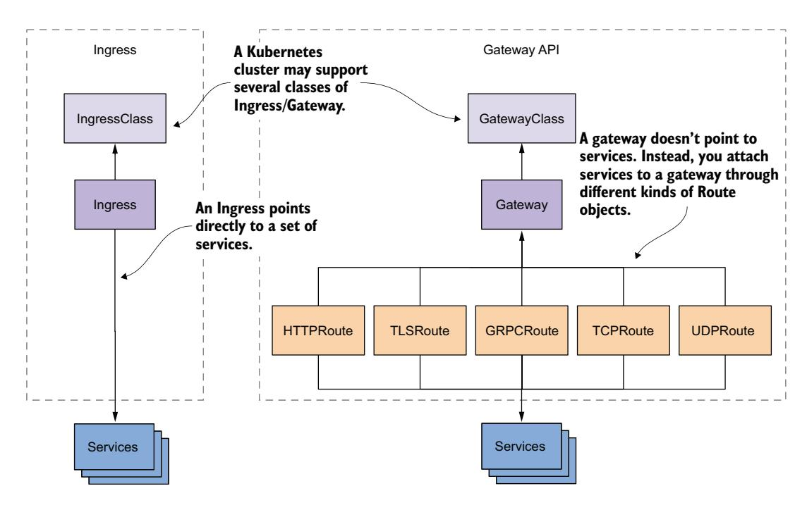
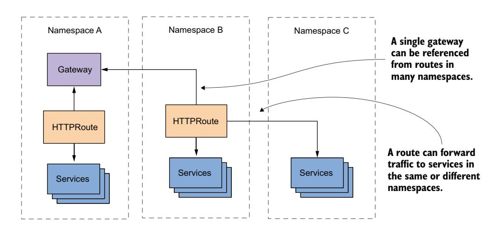

# 第 13 章 使用 Gateway API 路由流量

!!! tip "本章内容"

    - Ingress 与 Gateway API 的区别
    - 使用 Istio 作为 Gateway API 提供者
    - 对外暴露 HTTP 和 TLS 服务
    - 对外暴露 TCP、UDP 和 gRPC 服务
    - 流量路由、镜像和分流

在上一章中，你学习了如何使用 Ingress 资源对外暴露 Service。然而，标准 Ingress API 所支持的功能是有限的。对于真实世界的应用，你必须依赖所选择的 Ingress 实现提供的非标准扩展。作为替代方案，一个新的 API 应运而生——**Gateway API**。

Gateway API 为用户提供了一组更广泛的能力，通过一个或多个网关代理将 Kubernetes Service 暴露给外部世界。这些代理不仅支持 HTTP 和 TLS，还支持通用的 TCP 和 UDP 服务。因此，如果说 Ingress 是一个 L7 代理，那么 Gateway API 支持的代理可以下探到 L4。在本章中，你将进一步了解这个新的 API。

在开始之前，创建 kiada 命名空间，切换到 Chapter13/ 目录，并通过运行以下命令应用 SETUP/ 目录中的所有清单：

```bash
$ kubectl create ns kiada
$ kubectl config set-context --current --namespace kiada
$ kubectl apply -f SETUP -R
```

!!! note "说明"

    本章的代码文件可在 [https://github.com/luksa/kubernetes-in-action-2nd-edition/tree/master/Chapter13](https://github.com/luksa/kubernetes-in-action-2nd-edition/tree/master/Chapter13) 获取。

## 13.1 Gateway API 简介

Gateway API 由一组 Kubernetes 资源组成，允许你设置网关代理并使用它将集群外部的流量定向到你的服务。这些服务不必是 NodePort 或 LoadBalancer 类型，可以是标准的 ClusterIP Service，这与 Ingress 的情况相同。

### 13.1.1 Gateway API 与 Ingress 的对比

既然你在上一章学习了 Ingress，介绍 Gateway API 的最佳方式就是将其与之对比。图 13.1 展示了每种 API 中包含的 Kubernetes 对象类型以及它们之间的关系。



图 13.1 Ingress 与 Gateway API 资源的对比

要使用 Ingress API 对外暴露一组服务，你需要创建一个 Ingress 对象。类似地，在 Gateway API 中，你需要创建一个 Gateway 对象。每个 Gateway 都属于某个特定的 GatewayClass，就像每个 Ingress 对象都属于某个特定的 IngressClass 一样。集群可以提供其中一个或多个类别，因此你可以为每个创建的网关选择提供者。

到目前为止，除了对象类型的名称外，两个 API 之间没有区别。但是，当谈到将 Service 连接到 Ingress 或 Gateway 对象时，情况就不同了。在 Gateway API 中，你需要创建一个特定类型的 Route 对象来做到这一点，具体取决于你想要暴露的服务类型。在 Ingress API 中，你是直接在 Ingress 对象中指定服务的。

#### 理解为何将路由规则分离为独立对象更好

将流量路由规则提取到单独的对象中的一个优势是 Gateway 对象保持小巧。所有规则分散在代表路由性质的不同 Route 对象中，而不是全部放在单个大对象中。Ingress 仅支持 HTTP，而 Gateway API 也直接支持 TLS、gRPC、TCP 和 UDP 流量。

然而，分离 Gateway 和 Route 的最大优势在于，你可以在不同的用户角色之间划分这些对象的管理职责。每个角色都可以被赋予自己的权限。例如，Gateway 通常由集群管理员管理，而 Route 通常由应用开发者创建。在 Ingress API 中，你无法分离这些职责，因此要么开发者必须自己管理网关，要么集群管理员必须为他们代劳。如果你使用 Gateway API，就可以很好地划分这些职责。

路由的最后一个优势是，Gateway 对象可以跨命名空间共享，如图 13.2 所示。一个命名空间中的 Route 可以引用另一个命名空间中的 Gateway，也可以引用另一个命名空间中的 Service。这个特性使 Gateway API 比 Ingress 强大得多，因为你可以使用单个 Gateway 和单个公网 IP 地址来暴露多个命名空间中的服务。



图 13.2 跨命名空间使用 Gateway 和 HTTPRoute

### 13.1.2 理解 Gateway API 的实现

Gateway API 顾名思义，是一个应用程序编程接口（API），即一组定义系统行为的规则。这些规则必须由特定方法来实现。与 Ingress 一样，Kubernetes 本身不提供 Gateway API 的实现，而是有多种第三方实现可供选择。

你可能知道，同一个 API 的多种实现不可避免地会导致不同实现在行为和可用功能上的差异。我们在上一章中看到了这一点，不同的 Ingress 提供者使用不同的注解来配置非标准功能。负责监管 Kubernetes 网络并制定了 Gateway API 的 Kubernetes Network 特别兴趣小组（SIG）非常小心地避免重蹈 Ingress API 的覆辙。为此，他们组织 API 以确保不同实现之间的一致性。他们为每个功能关联了以下属性：

- **发布渠道**（**标准** 或 **实验性**）
- **支持级别**（**核心**、**扩展** 或 **实现特定**）

接下来的几节将解释这些属性。

#### 实验性 vs 稳定发布渠道

你无法使用 Gateway API，除非你安装了 Gateway API 资源的自定义资源定义（CRD）。每个 Gateway API 资源以及该资源中的每个字段都属于两个发布渠道之一。当你安装 Gateway API CRD 时，必须决定使用哪个发布渠道：

- **标准（standard）** 渠道仅包含被认为稳定且在未来 API 版本中不会改变的资源和字段。
- **实验性（experimental）** 渠道包含额外的资源和字段，顾名思义，它们是实验性的，未来可能会发生变化。

例如，在本文编写时，只有 HTTPRoute 类型在标准渠道中可用，而所有其他路由类型仍然是实验性的。当 Network SIG 确信这些路由类型的 API 已经最优地覆盖了所有用例时，它们将被移至标准渠道。

#### 核心 vs 扩展 vs 实现特定功能

Gateway API 功能出现在标准渠道中，仅仅意味着该 API 的这一部分在未来不会改变，但这并不表示所有实现都支持该功能。这是因为 Gateway API 功能，无论是稳定的还是实验性的，也被分为以下三个支持级别：

- **核心（Core）**功能是所有 Gateway API 实现都必须支持的标准功能。这些功能是可移植的。因此，如果你只使用这些功能，应该能够无问题地在不同 Gateway API 实现之间切换。
- **扩展（Extended）**功能是可移植的，但可能并非所有实现都支持。也就是说，如果某个实现支持这样的功能，你可以假定其行为对于所有其他实现都是相同的。如果另一个 Gateway API 实现支持你使用的所有功能，你应该能够切换到该实现而不用担心语义会发生变化。
- **实现特定（Implementation-specific）**功能是不可移植的，其行为和语义取决于 Gateway API 实现。你无法在不修改配置的情况下切换到不同的实现。

这听起来可能让人担忧，但你不需要担心某个特定功能属于哪个支持级别。在实践中，你很少会切换到不同的 Gateway API 提供者，所以一个功能是核心、扩展还是实现特定并不重要。

#### 可用的 Gateway API 实现

如前所述，Gateway API 由一组用于配置网关的 Kubernetes API 资源组成。这个 API 的实现取决于集群中安装了哪个 Gateway API 提供者。你可以从多个提供者中选择，甚至可以在同一个集群中安装多个。我不想列出当前存在的所有提供者，因为这个列表在本书出版后一定会发生变化。所以，以下是本书编写时最流行的 Gateway API 提供者列表：

- Contour（[https://projectcontour.io/](https://projectcontour.io/)）
- Cilium（[https://cilium.io/](https://cilium.io/)）
- Google Kubernetes Engine，提供自己的 Gateway API 实现（[https://cloud.google.com/kubernetes-engine/docs/concepts/gateway-api](https://cloud.google.com/kubernetes-engine/docs/concepts/gateway-api)）
- Istio（[https://istio.io/latest/docs/tasks/traffic-management/ingress/gateway-api/](https://istio.io/latest/docs/tasks/traffic-management/ingress/gateway-api/)）
- Kong（[https://konghq.com/](https://konghq.com/)）
- NGINX Kubernetes Gateway（[https://github.com/nginxinc/nginx-kubernetes-gateway](https://github.com/nginxinc/nginx-kubernetes-gateway)）

我无法给你一个关于使用哪个提供者的确切答案，因为这取决于你的需求并且也可能随时间而变化。如果你使用 Google Kubernetes Engine 或其他云提供的集群，并且它们有自己的 Gateway API 实现，你可能希望使用它而不是安装一个额外的实现。如果你的集群没有开箱即用的实现，上面提到的某个提供者肯定能满足你的需求。

在本书中，我将展示如何使用 **Istio** 作为 Gateway API 提供者。你可能听说过 Istio 是一种服务网格，但它也实现了 Gateway API。即使你不想使用服务网格功能，你也可以将 Istio 用作 Gateway API 提供者。

!!! note "说明"

    服务网格（Service Mesh）是一个基础设施层，用于促进（微）服务之间的通信。它允许运维团队在不修改代码的情况下提高这些服务之间的可观测性、流量管理和安全性。你可以在 Christian E. Posta 和 Rinor Maloku 合著的优秀书籍 *Istio in Action*（2022，Manning）中了解更多关于 Istio 服务网格的信息。

### 13.1.3 部署 Istio 作为 Gateway API 提供者

在开始使用 Gateway API 之前，你必须确保你的集群允许你创建 Gateway API 资源并且这些资源由控制器管理。为此，你必须安装 Gateway API 自定义资源定义（CRD）和控制器本身。

#### 检查 Gateway API 资源是否已安装

首先，检查你的集群是否已经知道 Gateway API 资源。你可以通过运行以下命令来检查：

```bash
$ kubectl get crd gateways.gateway.networking.k8s.io
Error from server (NotFound): customresourcedefinitions.apiextensions.k8s.io
     "gateways.gateway.networking.k8s.io" not found
```

该服务器错误表明 Gateway 资源尚不受支持。当它被支持时，命令输出如下所示：

```bash
$ kubectl get crd gateways.gateway.networking.k8s.io
NAME                                    CREATED AT
gateways.gateway.networking.k8s.io     2023-02-19T11:43:50Z
```

这是 Gateway 对象类型的自定义资源定义（CRD）。

如果你的集群已经包含此 CRD，你可以跳过下一步。

#### 安装 Gateway API 资源

如果你的集群尚不支持 Gateway API，可以从 GitHub 安装自定义资源，如下所示：

```bash
$ kubectl apply -k github.com/kubernetes-sigs/gateway-api/config/crd/experimental
customresourcedefinition/gatewayclasses.gateway.networking.k8s.io created
customresourcedefinition/gateways.gateway.networking.k8s.io created
...
```

!!! note "说明"

    你必须使用 `-k` 选项，而不是之前章节中使用的 `-f` 选项。这两个选项之间的区别将在侧边栏中解释。

此命令使用实验性渠道来安装资源。如果你想尝试本章中的所有示例，必须使用此渠道。

#### 关于 Kustomize

当你使用 `-k` 选项调用 `kubectl apply` 而不是 `-f` 时，文件在被应用到集群之前会由 Kustomize 工具处理。

Kustomize 最初是一个独立工具，后来被集成到 kubectl 中。顾名思义，你使用该工具来自定义 Kubernetes 清单。

自定义过程从一个 `kustomization.yaml` 文件开始，该文件包含一个清单文件列表以及一个要应用于这些清单的补丁列表。补丁可以使用 JSON Patch 格式（RFC 6902：[https://datatracker.ietf.org/doc/html/rfc6902](https://datatracker.ietf.org/doc/html/rfc6902)）或作为部分 YAML 或 JSON 清单来指定。当你运行 `kubectl apply -k` 命令时，会生成一个经过补丁处理的清单列表，然后应用到集群中。

当你需要为每个 Kubernetes 集群对清单进行细微更改时，Kustomize 非常有用。例如，假设你需要根据 Pod 是部署在开发、预发布还是生产集群中来对其进行不同的配置。你不需要有三个不同的 Pod 清单，只需要一个通用清单和三个针对每个环境的补丁。这样，就不会有重复，而且差异一目了然。

要了解关于 Kustomize 的更多信息，请参阅 [https://kustomize.io/](https://kustomize.io/)。

安装 CRD 后，你可以开始创建 Gateway API 资源，但它们目前还不能执行任何操作。如你所知，Kubernetes 资源只是元数据。你需要一个控制器来赋予它们生命。为此，你需要安装 Istio 或其他 Gateway API 提供者。

#### 安装 Istio 作为 Gateway API 提供者

安装 Istio 最简单的方法是使用命令行工具 `istioctl`。要了解如何下载和安装它，请参阅 [https://istio.io/latest/docs/ops/diagnostic-tools/istioctl/](https://istio.io/latest/docs/ops/diagnostic-tools/istioctl/) 上的说明。在本书编写时，你可以在 Linux 或 macOS 上使用以下命令安装 `istioctl`：

```bash
$ curl -sL https://istio.io/downloadIstioctl | sh -
```

此命令下载 `istioctl` 并将其保存到主目录的 `.istioctl/bin/` 中。将此目录添加到你的 PATH，然后按如下方式安装 Istio：

```bash
$ istioctl install -y --set profile=minimal
```

如果一切顺利，Istio 现在应该已安装在 `istio-system` 命名空间中。列出此命名空间中的 Pod 来确认这一点，如下所示：

```bash
$ kubectl get pods -n istio-system
NAME                     READY   STATUS    RESTARTS   AGE
istiod-7448594799-fwd44  1/1     Running   0          54s
```

这是 Istiod 守护进程 Pod。

你应该看到一个名为 `istiod` 的单个 Pod，其中包含一个容器。这是管理 Gateway API 资源的控制器运行的地方，因此请确保该容器已就绪。现在你可以部署你的第一个 Gateway 了。

!!! warning "警告"

    除了作为 Gateway API 一部分的 Gateway 资源外，Istio 还会安装另一个你应该忽略的 Gateway 资源。Gateway API 中的 Gateway 位于 API 组/版本 `gateway.networking.k8s.io/v1`，而另一个位于 `networking.istio.io/v1`。

#### 在 Google Kubernetes Engine 中启用 Gateway API

如果你使用 GKE，则不需要安装 Istio。而是需要通过以下命令启用 Gateway API 支持：

```bash
$ gcloud container clusters update <cluster-name> --gateway-api=standard --region=<region>
```

有关更多信息，请参阅 GKE 文档 [https://cloud.google.com/kubernetes-engine/docs/how-to/deploying-gateways](https://cloud.google.com/kubernetes-engine/docs/how-to/deploying-gateways)。

## 13.2 部署 Gateway

在本章开头，你了解到一个 Kubernetes 集群可以提供多个 Gateway 类。当你创建 Gateway 对象时，需要指定其类。因此，在深入讨论 Gateway 之前，让我们先讨论 Gateway 类。

### 13.2.1 理解 Gateway 类

集群中可用的每个 Gateway 类都由一个 GatewayClass 对象表示，正如每个 Ingress 类由一个 IngressClass 对象表示一样。当你将 Istio 安装为 Gateway API 提供者时，`istio` GatewayClass 会自动创建。你可以通过以下命令列出这些类来查看它：

```bash
$ kubectl get gatewayclasses
NAME    CONTROLLER                    ACCEPTED   AGE
istio   istio.io/gateway-controller   True       2m
```

这是 Istio 在启动时安装的 Istio Gateway 类。

!!! note "说明"

    如果你的集群原生支持 Gateway API，该命令将显示另一个 Gateway 类，甚至不止一个。

如下所示查看此 GatewayClass 对象的 YAML 定义：

```bash
$ kubectl get gatewayclass istio -o yaml
apiVersion: gateway.networking.k8s.io/v1
kind: GatewayClass
...
spec:
  controllerName: istio.io/gateway-controller
  description: The default Istio GatewayClass
```

`controllerName` 是处理与此类关联的 Gateway 的控制器的名称。`description` 是此 GatewayClass 的描述。

如你所见，对象的 `spec` 包含一个描述和控制器名称（`controllerName`），该控制器负责管理此类的 Gateway。虽然在 `istio` GatewayClass 中未出现，但清单还可以包含对一个对象的引用，该对象包含控制器用于创建此类 Gateway 的额外参数。

当集群中存在多个 GatewayClass 时，它们通常指向不同的控制器或包含参数的对象。无论集群中有一个还是多个 GatewayClass，你必须在创建的每个 Gateway 对象中引用该类，因此请记住类名。

### 13.2.2 创建 Gateway 对象

一旦你知道了类名，就可以创建该类的一个 Gateway 对象。让我们从你可以创建的最简单的 Gateway 开始。

#### 创建 Gateway 对象清单

要创建一个用于暴露 HTTP 服务的 Gateway，你必须首先为该 Gateway 对象创建一个 YAML 清单，如下方清单所示。你可以在文件 `gtw.kiada.yaml` 中找到这个清单。

**清单 13.1 定义一个具有单个监听器的 Gateway**

```yaml
apiVersion: gateway.networking.k8s.io/v1
kind: Gateway
metadata:
  name: kiada
spec:
  gatewayClassName: istio
  listeners:
  - name: http
    port: 80
    protocol: HTTP
    hostname: "*.example.com"
```

该清单定义了一个名为 `kiada` 的 Gateway。你将使用它来暴露 Kiada 应用套件中的所有服务。你将 `gatewayClassName` 字段设置为 `istio`，因为这是集群中唯一的 GatewayClass。如果你使用了不同的 Gateway API 提供者，则必须指定不同的类名。

Gateway 还必须指定一个监听器列表。监听器是网关接受网络连接的逻辑端点。你只需要一个 HTTP 监听器来暴露你的服务。清单中的监听器绑定到端口 80 并匹配 `example.com` 域中的所有主机名。

Gateway 对象还可以指定一个地址列表。如果可能，Gateway API 实现会将这些地址分配给 Gateway，以便外部客户端可以使用它们连接到 Gateway。

#### 从清单创建 Gateway

使用 `kubectl apply` 命令从 `gtw.kiada.yaml` 文件中的清单创建 Gateway：

```bash
$ kubectl apply -f gtw.kiada.yaml
gateway.gateway.networking.k8s.io/kiada created
```

由于你未在 Gateway 中指定地址，它会被自动分配。使用 `kubectl get` 命令显示地址和 Gateway 的状态，如下所示：

```bash
$ kubectl get gtw
NAME    CLASS   ADDRESS         PROGRAMMED   AGE
kiada   istio   172.18.255.200  True         14s
```

!!! note "说明"

    Gateway 的简写形式为 `gtw`。

!!! warning "警告"

    小心不要将 `gtw` 与 `gw` 混淆。后者是 Istio 自身 Gateway 资源的简写形式，如前所述，应该忽略它。

输出显示了 Gateway 的类和地址。`ADDRESS` 列显示了已绑定到 Gateway 的地址。如果集群配置正确，该地址应该可以从集群外部访问。

#### 检查 Gateway

当你创建 Gateway 对象时，负责赋予该对象生命的控制器通常会创建一个 LoadBalancer 类型的 Service 并将其与 Gateway 关联。要查看此 Service，请如下使用 `kubectl get` 命令：

```bash
$ kubectl get services
NAME          TYPE           CLUSTER-IP     EXTERNAL-IP     PORT(S)
kiada-istio   LoadBalancer   10.96.155.20   172.18.255.200  15021:31961/TCP,80:32313/TCP
kubernetes    ClusterIP      10.96.0.1      <none>          443/TCP
```

如你所见，控制器创建了 `kiada-istio` Service。这是一个 LoadBalancer Service，已被分配了一个外部 IP `172.18.255.200`。这就是前面 `kubectl get gtw` 命令显示的 IP 地址。该 Service 的端口 80 与你在 Gateway 监听器列表中定义的端口相匹配。

好了，你现在有了一个可从外部访问的 Service，但是这个 Service 将流量转发到哪里呢？正如你在之前章节中学到的，Service 将流量转发到匹配其标签选择器的一个或多个 Pod。你可以通过在使用 `kubectl get service` 时加上 `-o wide` 选项来显示此选择器，如下所示：

```bash
$ kubectl get service kiada-istio -o wide
NAME          TYPE           ...   AGE   SELECTOR
kiada-istio   LoadBalancer   ...   14m   istio.io/gateway-name=kiada
```

`kiada-istio` Service 将流量发送给带有标签 `istio.io/gateway-name=kiada` 的 Pod。

使用 `kubectl get pods` 命令找到匹配此选择器的 Pod，如下所示：

```bash
$ kubectl get pods -l istio.io/gateway-name=kiada
NAME                          READY   STATUS    RESTARTS   AGE
kiada-istio-86c59d8dd6-jfrnv  1/1     Running   0          16m
```

如你所见，该 Service 将流量转发到一个名为 `kiada-istio-xxxxx` 的 Pod。这个 Pod 运行着 Envoy 代理，它作为网络网关承载所有流向你 Kiada Pod 的外部流量。就像该 Service 一样，它也是在创建 Gateway 对象时由 Istio 创建的。

该 Pod 和 Service 部署在你创建 Gateway 对象的同一命名空间中。因此，对于你创建的每个 Gateway 对象，你将获得一个专用的、可从外部访问的代理，仅用于你的应用流量。它不是整个集群使用的系统级代理。

!!! note "说明"

    虽然 Istio 为你的 Gateway 创建了一个 Pod 和一个 Service，但这只是一个实现细节。其他 Gateway API 提供者可能以不同方式创建 Gateway。

### 13.2.3 探索 Gateway 的状态

大多数时候，你可以将 Gateway 对象视为一个黑盒。你使用 `spec` 字段配置它，然后检查其 `status` 字段以确认它是否就绪。要查看状态，你可以使用 `kubectl describe` 命令，或者如下使用 `kubectl get -o yaml` 命令：

```bash
$ kubectl get gtw kiada -o yaml
```

由于输出很长，我将分节解释，首先从 `status.addresses` 字段开始。

#### Gateway 的地址

Gateway 状态中最重要的部分是 Gateway 可访问的地址列表：

```yaml
status:
  addresses:
  - type: IPAddress
    value: 172.18.255.200
```

这是分配给 Gateway 的地址列表。这些地址可能与你在对象 `spec` 中指定的地址匹配，也可能不匹配。

状态中的 `addresses` 字段可能与你在 `spec` 中设置的 `addresses` 字段不一致。正如你已经看到的，你根本不需要指定 `spec.addresses` 字段。

每个地址都有一个 `type` 和一个 `value`。类型可以是 `IPAddress`、`Hostname` 或任何实现特定的字符串。`value` 字段包含地址的值，取决于地址类型。它可以是 IPv4 或 IPv6 地址、主机名或任何其他实现特定的字符串。

#### Gateway 条件

下一个状态部分显示了 Gateway 对象的条件。与所有其他 Kubernetes 对象一样，这很难阅读。我的策略是首先找到 `type` 字段，然后检查 `status` 以查看条件是 `True` 还是 `False`。如果条件是 `False`，我会进一步检查 `reason` 和 `message` 字段以找出原因。

例如，让我们以 `Accepted` 条件为例。YAML 如下所示：

```yaml
  conditions:
  - lastTransitionTime: "2023-02-19T16:42:56Z"
    message: Gateway was successfully reconciled
    observedGeneration: 1
    reason: Accepted
    status: "True"
    type: Accepted
```

除了 `Accepted` 条件外，Gateway 还会暴露 `Programmed` 条件类型，指示是否已经为 Gateway 生成了某种配置，使其最终可达。条件类型 `Ready` 是为将来使用保留的，而条件类型 `Scheduled` 已被弃用。

!!! note "说明"

    你可以在 [https://github.com/kubernetes-sigs/gateway-api/tree/main/apis](https://github.com/kubernetes-sigs/gateway-api/tree/main/apis) 的代码注释中了解更多关于每种条件类型的信息。

#### 每个监听器的状态

Gateway 状态的最后一部分是监听器列表及其条件。现在让我们忽略条件，只关注其余部分：

```yaml
  listeners:
  - attachedRoutes: 0
    conditions:
    - ...
    name: http
    supportedKinds:
    - group: gateway.networking.k8s.io
      kind: HTTPRoute
```

在 Gateway 的 `spec.listeners` 数组中定义的每个监听器在 `status.listeners` 数组中都有一个对应的条目，显示该监听器的状态。在该数组中，每个条目包含一个 `attachedRoutes` 字段，指示与该监听器关联的路由数量；一个 `supportedKinds` 字段，指示该监听器接受的路由类型；以及一个 `conditions` 字段，指示该监听器的详细状态。这些条件在表 13.1 中进行了说明。

**表 13.1 Gateway 监听器条件**

| 条件类型 | 描述 |
|---------|------|
| Accepted | 指示该监听器是否有效并可以在 Gateway 中配置。如果为 True，原因为 `Accepted`。如果为 False，原因可以是 `PortUnavailable`（端口已被占用或不受支持）、`UnsupportedProtocol`（协议类型不受支持）或 `UnsupportedAddress`（请求的地址已被占用或地址类型不受支持）。如果状态为 Unknown，原因为 `Pending`，意味着 Gateway 尚未完成协调。 |
| Conflicted | 指示控制器无法为该监听器解决相互冲突的规范要求。在这种情况下，该监听器的端口不会在任何网络组件上配置。如果为 True，原因可以是 `HostnameConflict`（表示该监听器中配置的主机名与其他监听器冲突）或 `ProtocolConflict`（表示在同一端口号上配置了多个相互冲突的协议）。如果条件为 False，原因为 `NoConflicts`。 |
| Programmed | 指示该监听器是否已创建了预期将就绪的配置。如果为 True，原因为 `Programmed`。如果为 False，原因可以是 `Invalid`（表示监听器配置无效）或 `Pending`（表示监听器尚未配置，可能是因为控制器尚未对其协调，或因为 Gateway 尚未上线并准备好接受流量）。如果状态为 Unknown，原因为 `Pending`。 |
| Ready | 指示该监听器已在 Gateway 上配置完毕，流量已准备好通过它流动。如果为 True，原因为 `Ready`。如果为 False，原因可以是 `Invalid`（表示监听器配置无效）或 `Pending`（表示监听器尚未被协调，或尚未上线并准备好接收流量）。如果条件状态为 Unknown，原因也是 `Pending`。 |
| ResolvedRefs | 指示控制器能否为监听器解析所有引用。如果为 True，原因为 `ResolvedRefs`。如果为 False，原因可以是以下几种：`InvalidCertificateRef`（监听器配置了 TLS 但至少一个证书引用无效或不存在）、`InvalidRouteKinds`（监听器中指定了无效或不受支持的路由类型）或 `RefNotPermitted`（监听器的 TLS 配置引用了不同命名空间中的对象且没有相应权限）。 |

!!! tip "提示"

    如果你无法通过 Gateway 连接到某个服务，除了检查 Gateway 状态外，还要检查对应监听器的状态。

`kiada` Gateway 定义了一个监听器。如果你检查 Gateway 对象状态中该监听器的条件，会发现没有发现任何错误。`Accepted`、`Programmed`、`ResolvedRefs` 和 `Ready` 条件为 `True`，而 `Conflicted` 条件为 `False`，这是正常的情况。这意味着该监听器没有问题。

然而，根据 `attachedRoutes` 字段，没有路由与该监听器关联，因此当你连接到 Gateway 时，你将收到 404 Not Found 错误消息。在下一节中，你将创建你的第一个 Route 来解决此错误。

## 13.3 使用 HTTPRoute 暴露 HTTP 服务

在本章前面，你学习了 Gateway API 支持多种类型的路由，这些路由由不同类型的 Route 对象配置。最常见的类型是 HTTPRoute，它允许你将 HTTP 服务连接到一个或多个 Gateway。

### 13.3.1 创建一个简单的 HTTPRoute

下方清单展示了最简单的 HTTPRoute 的清单。该清单定义了一个名为 `kiada` 的 HTTPRoute，它将 `kiada` Service 连接到你在前面创建的 `kiada` Gateway。你可以在文件 `httproute.kiada.yaml` 中找到此清单。

!!! note "说明"

    虽然 `kiada` HTTPRoute、Gateway 和 Service 都有相同的名称，但这并非强制要求。

**清单 13.2 使用 HTTPRoute 对象将 HTTP 服务附加到 Gateway**

```yaml
apiVersion: gateway.networking.k8s.io/v1
kind: HTTPRoute
metadata:
  name: kiada
spec:
  parentRefs:
  - name: kiada
  hostnames:
  - kiada.example.com
  rules:
  - backendRefs:
    - name: kiada
      port: 80
```

在本文编写时，HTTPRoute 是唯一被认为是稳定状态的路由类型，因此是 v1 API 版本的一部分。稍后你会看到，所有其他类型的路由都使用 `v1alpha2` 版本。

如前面的清单以及图 13.3 所示，HTTPRoute（与所有其他路由类型一样）将一个或多个 Gateway 连接到一个或多个 Service，分别通过在 `parentRefs` 和 `backendRefs` 字段中引用它们。示例中的 `kiada` HTTPRoute 将 `kiada` Gateway 连接到 `kiada` Service。由 `kiada` Gateway 接收到的所有匹配主机名 `kiada.example.com` 的 HTTP 流量都将被转发到 `kiada` 后端服务。


图 13.3 HTTPRoute 将一个或多个 Gateway 连接到一个或多个 Service。

#### 创建并测试 HTTPRoute

通过应用清单文件创建 HTTPRoute，如下所示：

```bash
$ kubectl apply -f httproute.kiada.yaml
httproute.gateway.networking.k8s.io/kiada created
```

使用 `kubectl get` 检查该路由：

```bash
$ kubectl get httproutes
NAME    HOSTNAMES                AGE
kiada   ["kiada.example.com"]    18s
```

再次使用 `kubectl get gtw` 命令显示 Gateway 的地址，然后使用 curl 连接到它：

```bash
$ curl --resolve kiada.example.com:80:172.18.255.200 http://kiada.example.com
KUBERNETES IN ACTION DEMO APPLICATION v0.5
...
```

!!! note "说明"

    请将 IP 地址 `172.18.255.200` 替换为你 Gateway 的 IP 地址。

如果你希望通过网页浏览器访问应用，你必须确保 `kiada.example.com` 解析为 Gateway 的 IP 地址。你可以通过在 `/etc/hosts` 或等效文件中添加相应的条目来实现。

#### 检查 HTTPRoute 的 spec

你创建的 HTTPRoute 是一个不错但很简单的示例，并未展示 HTTPRoute 的全部潜力。实际上，多个字段被初始化为其默认值，因此为了更好地理解这个基本路由示例，你应该检查 HTTPRoute 对象的 YAML。让我们首先关注对象的 `spec`。使用 `kubectl get` 命令显示 YAML，如下所示：

```bash
$ kubectl get httproute kiada -o yaml
...
spec:
  hostnames:
  - kiada.example.com
  parentRefs:
  - group: gateway.networking.k8s.io
    kind: Gateway
    name: kiada
  rules:
  - backendRefs:
    - group: ""
      kind: Service
      name: kiada
      port: 80
      weight: 1
    matches:
    - path:
        type: PathPrefix
        value: /
```

在你的清单中，你只指定了名称，但当你创建对象时，`group` 和 `kind` 字段被初始化为指向一个 Gateway。在你的清单中，你只指定了名称和端口，但当你创建对象时，`group` 和 `kind` 被初始化为指向一个 Service。每个后端引用还会获得一个 `weight` 值，你将在第 13.3.2 节中了解其含义。每个规则还会获得一个过滤器，用于确定哪些 HTTP 请求匹配此规则。默认情况下，规则匹配所有请求，无论请求路径如何。

回想一下此 HTTPRoute 的原始清单。它不包含任何以粗体显示的字段。这些字段都初始化为其默认值。看到这些信息应该能帮助你更好地理解 HTTPRoute。

让我们从 `parentRefs` 部分开始。在原始清单中，你只指定了 Gateway 的名称，但现在引用明确说明它引用的是来自 `gateway.networking.k8s.io` API 组的 Gateway。你可能已经猜到，这意味着 HTTPRoute 也可以引用其他类型的资源，这正是 Gateway API 如此强大和可扩展的原因。你会发现这种模式在整个 Gateway API 中反复出现。每当一个对象引用另一个对象时，该引用不必指向特定的对象类型，但会默认为来自 Gateway API 或 Kubernetes 核心的最常见类型。

在原始清单的 `backendRefs` 部分，你也只指定了 Service 的名称。在对象本身中，后端引用现在明确指向来自核心 Kubernetes API 组的 Service（按照惯例，空字符串表示该组）。后端引用还包含一个新的 `weight` 字段，用于在多个后端之间分配流量。你将在第 13.3.2 节中详细了解这一点。

你的原始清单包含一个单一规则，该规则不加区分地将所有流量转发到单个 Service，但一个规则通常会定义它应匹配哪些请求。这就是新的 `matches` 字段的用途。如你所见，它指定匹配所有请求路径以反斜杠开头的 HTTP 请求，这适用于每一个请求。在第 13.3.3 节中，当介绍流量路由时，你将学习更多关于请求匹配的内容。

#### 检查 HTTPRoute 状态

无论 `kiada` HTTPRoute 是否按预期工作，你同样应检查其状态，以了解当你开始创建自己的路由时，它如何帮助确定流量流动不正常的原因。

让我们再次显示 YAML 来检查状态：

```bash
$ kubectl get httproute kiada -o yaml
...
status:
  parents:
  - conditions:
    - ...
    controllerName: istio.io/gateway-controller
    parentRef:
      group: gateway.networking.k8s.io
      kind: Gateway
      name: kiada
```

状态是针对每个父级分别报告的。每个父级显示一组条件，稍后将详细解释。`controllerName` 字段指示处理该父级的控制器。此值来自与父级 Gateway 关联的 GatewayClass。`parentRefs` 字段指示该状态条目适用于哪个父级的名称和类型。

由于 HTTPRoute 可以附加到多个 Gateway，该对象不会报告单一状态，而是分别在 `parents` 数组中的各项中报告每个父级的状态。

每个条目关联的 Gateway 在 `parentRefs` 字段中指定。此外，`controllerName` 字段指示处理该特定 Gateway 或其他类型父级的控制器。你可能还记得，`controllerName` 是在 GatewayClass 对象中指定的；因此，此状态字段的值来自与父级 Gateway 关联的 GatewayClass。实际上，正是此控制器为这个父级写入了整个状态条目。

HTTPRoute 在每个父级上下文中的状态在 `conditions` 数组中指定。该数组可能如下所示：

```yaml
  conditions:
  - lastTransitionTime: "2023-02-19T17:04:09Z"
    message: Route was valid
    observedGeneration: 1
    reason: Accepted
    status: "True"
    type: Accepted
  - lastTransitionTime: "2023-02-19T17:04:09Z"
    message: All references resolved
    observedGeneration: 1
    reason: ResolvedRefs
    status: "True"
    type: ResolvedRefs
```

`Accepted` 条件指示此 HTTPRoute 是否被父级 Gateway 接受。`ResolvedRefs` 条件指示此 HTTPRoute 中的所有引用是否已针对该 Gateway 成功解析。

HTTPRoute 状态在每个父级上下文中暴露两个条件。表 13.2 解释了这两种条件类型以及每种条件可能的原因。

!!! tip "提示"

    当你在 HTTPRoute 上遇到问题时，首先检查其状态。然而，由于此状态可能不包含全部信息，请记得同时检查父级 Gateway 的状态。

**表 13.2 Route 条件**

| 条件类型 | 描述 |
|---------|------|
| Accepted | 指示该路由是否已被 Gateway 或其他父级接受或拒绝。如果为 True，原因为 `Accepted`。如果为 False，原因可以是 `NotAllowedByListeners`（路由因 Gateway 没有 `allowedRoutes` 条件接受该路由的监听器而未被接受）、`NoMatchingListenerHostname`（Gateway 没有主机名匹配该路由的监听器）、`NoMatchingParent`（例如没有父级匹配端口）或 `UnsupportedValue`（不支持某个值）。如果状态为 Unknown，原因为 `Pending`，表示路由尚未被协调。 |
| ResolvedRefs | 指示控制器是否能够为该路由解析所有引用。如果为 True，原因为 `ResolvedRefs`。如果为 False，原因可以是 `RefNotPermitted`（路由的某个规则的 `backendRef` 引用了其他命名空间中的对象且没有相应权限）、`InvalidKind`（路由的某个规则引用了未知或不受支持的组或类型）以及 `BackendNotFound`（路由的某个规则引用了不存在的对象，例如 Service）。 |

如果你已成功部署此简单的 HTTPRoute 示例，现在可以继续学习更复杂的用例，其中路由将流量转发到不同的后端服务。

### 13.3.2 在多个后端之间分流流量

HTTPRoute 可以配置为基于权重将流量分配到多个后端服务。例如，你可以将 1% 的请求转发到金丝雀 Service，以测试应用的新版本。如果新版本行为异常，只有 1% 的请求受到影响。

#### 部署金丝雀 Pod 和 Service

部署一个名为 `kiada-new` 的 Pod 和一个仅将流量转发到该 Pod 的 Service。然而，由于你当前的 `kiada` Service 会同时将流量转发到现有的稳定 `kiada` Pod 以及 `kiada-new` Pod，你还需要创建一个仅将流量转发到稳定 Pod 的 Service，以便你可以按照所需的权重恰当地将流量路由到这些服务。

要部署 `kiada-new` Pod 以及 `kiada-new` 和 `kiada-stable` Service，使用 `kubectl apply` 应用清单文件 `pod.kiada-new.yaml`。确认 Pod 已就绪，并且使用 `kubectl get endpoints` 命令确认稳定 Pod 和新 Pod 作为端点出现在两个 Service 中。

#### 配置 HTTPRoute 规则以在两个后端之间分流流量

出于演示目的，让我们配置 HTTPRoute 以将 10% 的流量转发到新 Service，将 90% 的流量转发到稳定 Service。下方清单显示了 HTTPRoute 清单的相关部分，你可以在文件 `httproute.kiada.splitting.yaml` 中找到它。

**清单 13.3 使用权重分流 HTTP 流量**

```yaml
spec:
  rules:
  - backendRefs:
    - name: kiada-stable
      port: 80
      weight: 9
    - name: kiada-new
      port: 80
      weight: 1
```

此 HTTPRoute 中引用了两个后端服务。90% 的请求被发送到 `kiada-stable` Service。10% 的请求被发送到 `kiada-new` Service。

如图所示，你可以通过在 `backendRefs` 列表中列出多个 Service 来在 HTTPRoute 中分配流量。如果省略 `weight` 字段，流量将均匀分布到所有列出的 Service 中。如果在 `backendRefs` 条目中指定 `weight`，该条目将接收按比例的请求份额。在示例中，`kiada-stable` Service 的权重为 9，而 `kiada-new` Service 的权重为 1。所有权重的总和是 10，这意味着 `kiada-stable` 获得十分之九的请求，而 `kiada-new` 获得十分之一。

尝试循环运行 curl 并观察两个 Service 各自处理了多少请求。

### 13.3.3 将 HTTP 请求路由到不同的后端

除了上一节中介绍的基于权重的流量分流之外，你还可以配置 HTTPRoute，根据 HTTP 请求中的数据将流量路由到不同的 Service。你可以根据 HTTP 方法、请求头、请求路径和查询参数来路由流量。

如果一个请求匹配 `spec.rules.backendRefs.matches` 列表中的**任意**条目，它就会被转发到特定的后端。每个条目可以指定 HTTP 方法、请求头、请求路径和查询参数的条件。如果请求满足其中指定的**所有**条件，则匹配该条目。

#### 基于请求方法的路由

要根据 HTTP 请求方法路由 HTTP 请求，请如下方清单所示指定 `method` 字段。

**清单 13.4 基于 HTTP 方法路由请求**

```yaml
spec:
  rules:
  - matches:
    - method: POST
    backendRefs:
    - name: kiada-new
      port: 80
  - backendRefs:
    - name: kiada-stable
      port: 80
```

使用 POST 方法的请求被路由到 `kiada-new` Service。所有其他请求被路由到 `kiada-stable` Service。

清单中的 HTTPRoute 包含两个规则，每个规则关联到一个不同的后端服务。第一个规则匹配使用 POST 方法的请求并将它们转发到 `kiada-new` Service。第二个规则不包含特定的请求匹配条件，因此充当兜底规则。因此，任何非 POST 请求都被转发到 `kiada-stable` Service。

如果你现在使用 curl 发送使用不同 HTTP 方法的请求到 `kiada.example.com`，你应该看到 POST 请求由 `kiada-new` Pod 接收，而其余的由 `kiada-stable` Pod 接收。

#### 基于请求头的路由

要根据 HTTP 请求头转发请求，可以在 `headers` 列表中指定要匹配的请求头列表。对于该列表中的每个条目，你需要指定请求头名称、匹配类型和值。例如，要匹配包含值为 `new` 的 `release` 请求头的请求，你需要如下方清单所示指定规则。

**清单 13.5 基于 HTTP 请求头匹配请求**

```yaml
spec:
  rules:
  - matches:
    - headers:
      - type: Exact
        name: Release
        value: new
    backendRefs:
    - name: kiada-new
      port: 80
  - backendRefs:
    - name: kiada-stable
      port: 80
```

如果请求包含值为 `new` 的 HTTP 请求头 `Release`，该请求被路由到 `kiada-new` Service。所有其他请求被路由到 `kiada-stable` Service。

与之前的示例一样，HTTPRoute 中定义了两个规则。第一个规则基于 HTTP 请求头匹配请求，而第二个匹配所有其他请求。第一个规则匹配如下所示的请求：

```text
GET / HTTP/1.1
Host: kiada.example.com
Release: new
```

在请求头匹配规则中，`type` 设置为 `Exact`，因此请求头的值必须完全匹配。不过，你同样可以使用正则表达式来匹配：

```yaml
  matches:
  - headers:
    - type: RegularExpression
      name: Release
      value: new.*
```

使用正则表达式来匹配 HTTP 请求头。`name` 是请求头名称。`value` 是用于匹配请求头值的正则表达式。

与之前的示例不同，`value` 字段现在指定用于匹配请求头值的正则表达式。确切的语法取决于 Gateway API 实现，因此在使用此方法之前请查阅文档。

在这两个示例中，都只使用了一个请求头匹配规则，但你可以在 `headers` 字段中指定多个规则。当你这样做时，请求必须匹配**所有**指定的规则。

#### 基于路径的路由

HTTPRoute 可以基于请求路径来匹配请求，如下方清单所示。

**清单 13.6 根据请求路径匹配请求**

```yaml
spec:
  rules:
  - matches:
    - path:
        type: Exact
        value: /quote
    backendRefs:
    - name: quote
      port: 80
```

此规则将包含确切的 `/quote` 路径的请求路由到 `quote` Service。

清单中的规则匹配所有包含精确路径 `/quote` 的 HTTP 请求，并将它们路由到 `quote` Service。

除了精确路径匹配外，你还可以通过将 `type` 设置为 `PathPrefix` 来使用基于前缀的匹配：

```yaml
  - matches:
    - path:
        type: PathPrefix
        value: /quiz
    backendRefs:
    - name: quiz
      port: 80
```

如果请求路径以指定的前缀开头，请求就匹配。

在这种情况下，如果路径以前缀 `/quiz` 开头，HTTP 请求就匹配。

`Exact` 和 `PathPrefix` 类型应该被所有 Gateway API 实现完全支持，但有些实现也支持基于正则表达式的路径匹配，如下所示：

```yaml
  - path:
      type: RegularExpression
      value: .*\.(css|js|png|ico)
```

如果请求路径匹配指定的正则表达式，请求就匹配。

同样，正则表达式语法取决于 Gateway API 实现，因此在使用此类型之前务必查阅文档。

#### 基于查询参数的路由

HTTPRoute 中请求路由的最后一种方法是使用请求的查询参数。下方清单展示了当请求包含 `release=new` 查询参数时，如何将请求路由到 `kiada-new` Service。

**清单 13.7 基于查询参数路由请求**

```yaml
spec:
  rules:
  - backendRefs:
    - name: kiada-new
      port: 80
    matches:
    - queryParams:
      - type: Exact
        name: release
        value: new
  - backendRefs:
    - name: kiada-stable
      port: 80
```

如果请求包含查询参数 `release=new`，它被路由到 `kiada-new` Service。否则，它被路由到 `kiada-stable` Service。

在清单中，`queryParams` 字段用于匹配查询参数 `release` 的值为 `new` 的请求。这个示例与使用请求头匹配的示例非常相似。它使用精确匹配，但如果你希望使用正则表达式匹配查询参数值，也可以将 `type` 设置为 `RegularExpression`：

```yaml
  - queryParams:
    - type: RegularExpression
      name: release
      value: new.*
```

将 `type` 设置为 `RegularExpression` 来将查询参数值与正则表达式进行匹配。`name` 是要匹配的查询参数名称。`value` 是用于匹配的正则表达式。

就像请求头匹配一样，你可以在每个规则中指定多个查询参数，在这种情况下，它们必须**全部**匹配。

#### 在规则中组合多个条件

在前面所有的例子中，每个规则只使用了一种匹配类型。然而，你可以组合这些条件。例如，你可以仅在请求路径以 `/some-prefix` 开头、带有 `Release: new` 请求头并且存在 `specialCookie` cookie 时，将请求路由到 `kiada-new`。规则将如下所示：

```yaml
  rules:
  - backendRefs:
    - name: kiada-new
      port: 80
    matches:
    - path:
        type: PathPrefix
        value: /some-prefix
      headers:
      - type: Exact
        name: Release
        value: new
      - type: RegularExpression
        name: Cookie
        value: .*specialCookie.*
```

请求路径必须以此前缀开头。请求必须包含值为 `new` 的请求头 `Release`。请求必须包含指定的 cookie。

此外，你可以通过指定多个后端引用以及所需的权重，将匹配此规则的流量分配到多个后端服务，正如你在第 13.3.2 节中学到的那样。

### 13.3.4 使用过滤器增强 HTTP 流量

除了将 HTTP 请求路由到不同的后端之外，你还可以修改请求、同时将其发送到多个后端、在不实际将请求路由到后端的情况下重定向客户端，甚至修改后端服务发送回客户端的响应。你可以通过在 `spec.rules.filters` 字段中定义过滤器来实现这些功能。

#### 修改请求头

要添加、移除或修改请求头，可以向 HTTPRoute 规则添加 `RequestHeaderModifier` 过滤器，如下方清单所示。

**清单 13.8 修改请求头**

```yaml
spec:
  rules:
  - backendRefs:
    - name: kiada-stable
      port: 80
    filters:
    - type: RequestHeaderModifier
      requestHeaderModifier:
        add:
        - name: added-by-gateway
          value: some-value
        remove:
        - RemoveMe
        set:
        - name: set-by-gateway
          value: new-value
```

清单中的示例向请求添加了一个名为 `added-by-gateway` 的请求头，移除了 `RemoveMe` 请求头，并更改了 `set-by-gateway` 请求头的值。`add` 和 `set` 之间的区别是，前者将指定的值附加到请求头中，而后者替换该值。如果请求已经包含具有指定名称的请求头，`add` 会将指定的值追加到请求头值中。

#### 修改响应头

正如你可以修改请求头一样，你也可以修改响应头。你可以通过分别使用 `add`、`set` 和 `remove` 字段来追加到现有请求头的值、覆盖值或者完全移除请求头。不过，你需要将这些字段添加到 `responseHeaderModifier` 下而不是 `requestHeaderModifier` 下，并将过滤器类型设置为 `ResponseHeaderModifier`，如下方清单所示。

**清单 13.9 修改响应头**

```yaml
spec:
  rules:
  - backendRefs:
    - name: kiada-stable
      port: 80
    filters:
    - type: ResponseHeaderModifier
      responseHeaderModifier:
        add:
        - name: added-by-gateway
          value: some-value
        remove:
        - RemoveMe
        set:
        - name: set-by-gateway
          value: new-value
```

`add` 和 `set` 字段都会向发送回客户端的响应中添加一个请求头。如果 Gateway 接收到的响应不包含该请求头，两者都会添加。但如果请求头已经存在，`add` 会将指定的值追加到请求头值中，而 `set` 会覆盖该值。

#### 重写请求 URL

你还可以使用过滤器在请求发送到后端之前重写请求 URL。当 HTTPRoute 匹配的特定请求路径与后端期望的路径不同时，这特别有用。

目前，你可以替换完整的请求路径，也可以仅替换匹配的前缀。下方清单展示了前者的示例。

**清单 13.10 替换完整请求路径**

```yaml
spec:
  rules:
  - backendRefs:
    - name: kiada-stable
      port: 80
    matches:
    - path:
        type: PathPrefix
        value: /foo
    filters:
    - type: URLRewrite
      urlRewrite:
        hostname: newhost.kiada.example.com
        path:
          type: ReplaceFullPath
          replaceFullPath: /new/path
```

请求被发送到 `kiada-stable` Service。此规则仅匹配请求路径以指定前缀开头的请求。过滤器类型在此指定。过滤器配置在此字段下指定。请求的 Host 请求头被替换为此主机名。完整请求路径被替换为 `/new/path`。

如清单所示，任何路径以 `/foo` 开头的请求被发送到 `kiada-stable` Service，但 `Host` 请求头和请求路径会被重写。发送到后端服务的请求如下所示：

```text
GET /new/path HTTP/1.1
Host: newhost.kiada.example.com
```

因此，无论客户端请求中的路径是 `/foo`、`/foo/bar` 还是任何以前缀 `/foo` 开头的其他路径，服务收到的请求路径都将是 `/new/path`。主机也始终是 `newhost.kiada.example.com`。

!!! note "说明"

    请求路径 `/foobar` 不匹配本清单中的规则。

或者，你可以仅替换匹配的前缀，而不是替换完整路径。下方清单展示了一个示例，其中前缀 `/foo` 被重写为 `/new/path`。

**清单 13.11 替换匹配的前缀**

```yaml
...
  matches:
  - path:
      type: PathPrefix
      value: /foo
  filters:
  - type: URLRewrite
    urlRewrite:
      path:
        type: ReplacePrefixMatch
        replacePrefixMatch: /new/path
```

当请求路径以 `/foo` 开头时，前缀被重写为 `/new/path`。

如果客户端请求路径 `/foo`，发送到 Service 的请求中的路径是 `/new/path`。如果客户端请求路径 `/foo/bar`，Service 收到的路径是 `/new/path/bar`。

#### 重定向请求

如果你希望将客户端的请求重定向到不同的 URL，可以使用 `RequestRedirect` 过滤器类型。这使你能够将客户端指向不同的位置，而无需在应用中实现重定向。例如，你可以使用下方清单所示的过滤器配置将客户端从 HTTP 重定向到 HTTPS。

**清单 13.12 重定向请求**

```yaml
  rules:
  - filters:
    - type: RequestRedirect
      requestRedirect:
        scheme: https
        port: 443
        statusCode: 302
```

你在 `type` 字段中指定过滤器的类型。

!!! note "说明"

    使用 `RequestRedirect` 过滤器时，你不需要在规则中指定任何 `backendRefs`，因为 Gateway 根本不会路由该请求。

在清单中，`scheme` 和 `port` 分别设置为 `https` 和 `443`。`statusCode` 设置为 `302 Moved Permanently`。你还可以设置新的主机名和路径，但由于你想重定向到相同的主机名和路径，可以省略这些字段。当你省略某个字段时，将使用原始请求中的相应值。

!!! note "说明"

    `path` 字段的行为与前一节中介绍的 `URLRewrite` 过滤器一样。你将 `type` 设置为 `ReplaceFullPath` 或 `ReplacePrefixMatch`，具体取决于你想要替换完整路径还是仅替换匹配的前缀。

你可以通过 `statusCode` 字段配置重定向中发送的 HTTP 状态码。如果省略此字段，Gateway 会发送状态码 `302 Found`。

#### 将流量镜像到另一个服务

到目前为止介绍的所有过滤器都有其用武之地，但最有趣的过滤器是 `RequestMirror`。此过滤器允许你将请求的副本发送到另一个后端，同时仍将原始请求路由到规则中定义的后端。客户端仅接收来自规则中定义的后端的响应，而来自另一个服务的响应会被丢弃。

这对于在生产环境中观察服务的新版本行为而不影响客户端来说非常有用。下方清单展示了如何配置规则以将流量路由到 `kiada-stable` Service，但同时将其镜像到 `kiada-new` Service。

**清单 13.13 将流量镜像到另一个服务**

```yaml
  rules:
  - backendRefs:
    - name: kiada-stable
      port: 80
    filters:
    - type: RequestMirror
      requestMirror:
        backendRef:
          name: kiada-new
          port: 80
```

请求被路由到 `kiada-stable` Service，其响应发送回客户端。请求的副本被发送到 `kiada-new` Service，但其响应被丢弃。

该规则的后端是 `kiada-stable` Service，但规则还指定了一个过滤器，将请求镜像到 `kiada-new` Service。尝试应用清单文件并向 `http://kiada.example.com` 发送几个请求。检查响应以确认它来自哪个 Pod。同时检查 `kiada-new` Pod 的日志以确认它也收到了每个请求：

```bash
$ curl --resolve kiada.example.com:80:172.18.255.200 http://kiada.example.com
    ... Request processed by Kiada 0.5 running in pod "kiada-001"...
$ kubectl logs kiada-001 -c kiada
    ... 2023-03-12T12:40:32.930Z Received request for / from ::ffff:10.244.1.9
$ kubectl logs kiada-new -c kiada
    ... 2023-03-12T12:40:32.931Z Received request for / from ::ffff:10.244.1.9
```

向 Gateway 发送请求。响应来自 `kiada-001` Pod。检查发送了响应的 Pod 的日志。这是你刚刚发送的请求。检查 `kiada-new` Pod 的日志。由于请求镜像，`kiada-new` Pod 收到了相同的请求。

#### 使用实现特定的过滤器

到目前为止介绍的过滤器都被证明是足够通用的，因此被纳入了 Gateway API 中。然而，每个 Gateway API 的实现者也可以提供自己的实现特定的过滤器。要使用这样的过滤器，将过滤器类型设置为 `ExtensionRef`，并在 `extensionRef` 字段中指定包含过滤器配置的对象，如下方清单所示。

**清单 13.14 使用实现特定的过滤器**

```yaml
spec:
  rules:
  - backendRefs:
    - name: kiada-stable
      port: 80
    filters:
    - type: ExtensionRef
      extensionRef:
        group: networking.example.com
        kind: SomeCustomFilter
        name: kiada-filter
```

要应用实现特定的过滤器，使用 `ExtensionRef` 类型。过滤器配置在 Gateway API 实现提供的自定义对象中指定。你必须在此引用该对象。`group` 指定对象的 API 组。`kind` 指定自定义对象的类型。`name` 指定对象的名称。该对象必须与 HTTPRoute 在同一命名空间中。

与其他过滤器不同，实现特定的过滤器的配置不是直接在 HTTPRoute 中定义的，而是在一个单独的对象中定义的。Gateway API 实现必须将该对象类型注册到 Kubernetes API 中。要使用自定义过滤器，你需要创建这样一个类型的对象并在 `extensionRef` 字段中引用它。在清单中，HTTPRoute 引用了 `networking.example.com` API 组中名为 `kiada-filter`、类型为 `SomeCustomFilter` 的对象中的过滤器配置。

在本文编写时，大多数 Gateway API 实现尚未提供自己的自定义过滤器。然而，最终它们肯定会提供，其中一些实现可能会提供几乎相同的过滤器类型。当同一类型的过滤器由多个实现提供时，它可能会成为 Gateway API 中的标准过滤器之一。

## 13.4 为 Gateway 配置 TLS

在前面几节中，你通过纯文本、不安全的 HTTP 暴露了 `kiada` Service。由于这是绝不应该公开发布服务的方式，现在让我们看看如何使用 Gateway API 通过 TLS 安全地暴露服务。你有两种选择：

- 在 Gateway 处终止 TLS 会话，从 Gateway 到后端使用纯 HTTP。
- 让 TLS 会话透过 Gateway，由后端终止。

尽管这两个选项可能看似相似，但它们非常不同，因为当 Gateway 终止 TLS 会话时，它可以理解底层流量，而在 TLS 透传的情况下，Gateway 不解密流量，因此对 TLS 会话中发送的 HTTP 请求一无所知。它唯一知道的是接收者的主机名，这得益于 TLS 协议中的服务器名称指示（SNI）扩展。

`kiada` Gateway 当前尚未配置为提供这两种 TLS 选项中的任何一种。你无法使用 HTTPS 连接到 `kiada` Service：

```bash
$ curl --resolve kiada.example.com:443:172.18.255.200 https://kiada.example.com -k
curl: (7) Failed to connect to kiada.example.com port 443 after 3082 ms: No
route to host
```

你将在接下来的两节中处理这个问题。

### 13.4.1 在 Gateway 处终止 TLS 会话

当后端服务不支持 TLS 时，你会希望让 Gateway 终止 TLS 会话并在连接到后端时使用未加密的 HTTP。你可能记得每个 `kiada` Pod 都运行一个处理 HTTPS 的边车容器，但现在让我们假设它不处理。

#### 在 Gateway 监听器中配置 TLS 终止

要配置 Gateway 终止 TLS 流量，请在 Gateway 对象内的监听器中设置 `tls.mode` 为 `Terminate`。然而，为了让 Gateway 解密 TLS 数据包，它需要知道使用什么 TLS 证书。你已将 TLS 证书和私钥存储在 `kiada-tls` Secret 中。这是 `kiada` Pod 中边车容器使用的证书，但现在你同样会在 Gateway 中使用它。

下方清单展示了启用了 TLS 终止的完整 Gateway 清单。你可以在文件 `gtw.kiada.tls-terminate.yaml` 中找到此清单。

**清单 13.15 配置 Gateway 以终止 TLS**

```yaml
apiVersion: gateway.networking.k8s.io/v1
kind: Gateway
metadata:
  name: kiada
spec:
  gatewayClassName: istio
  listeners:
  - name: http
    port: 80
    protocol: HTTP
  - name: https
    port: 443
    protocol: HTTPS
    tls:
      mode: Terminate
      certificateRefs:
      - kind: Secret
        name: kiada-tls
```

除了 HTTP 监听器，此 Gateway 还包含一个用于 HTTPS 的第二个监听器。`mode: Terminate` 告诉 Gateway 终止 TLS 会话。用于解密 TLS 数据包的证书指定在一个 Secret 中，且在 `certificateRefs` 字段中被引用。

如清单所示，`kiada` Gateway 中现在配置了两个监听器：一个用于 HTTP，一个用于 HTTPS。HTTPS 监听器配置为使用 `kiada-tls` Secret 中的 TLS 证书和私钥来终止 TLS 流量。

!!! note "说明"

    当你的 TLS 证书存储在 Secret 中时，你只需在 `certificateRefs` 中指定 Secret 的名称。你可以省略 `kind` 字段，因为它默认为 `Secret`。

将 Gateway 清单应用到集群后，如果主机名 `kiada.example.com` 仍然解析为 Gateway 的 IP 地址，你应该能够通过 `https://kiada.example.com` 访问 `kiada` Service。你可以使用以下 curl 命令访问该服务：

```bash
$ curl --resolve kiada.example.com:443:172.18.255.200 https://kiada.example.com -k
```

!!! note "说明"

    请记得把 `172.18.255.200` 替换为你 Gateway 的 IP。

#### 指定额外的 TLS 配置选项

在 Gateway 处终止 TLS 非常简单。你只需设置 TLS 模式并指定包含 TLS 证书的 Secret 名称。然而，如果需要的话，你同样可以指定额外的 TLS 配置选项，例如最低 TLS 版本或支持的密码套件。你可以在 `tls` 下的 `options` 字段中进行设置，如下所示：

```yaml
  tls:
    mode: Terminate
    certificateRefs:
    - kind: Secret
      name: kiada-tls
    options:
      example.com/my-custom-option: my-value
      example.com/my-other-custom-option: my-other-value
```

在此设置 TLS 选项。这里使用的键取决于你使用的 Gateway API 实现。

你可以在此设置的选项取决于你使用的 Gateway API 实现，但某些选项可能会成为标准。

#### 将 HTTPRoute 附加到终止 TLS 的 Gateway

当你配置 Gateway 终止 TLS 时，它知道底层使用的是什么协议。对于 TLS 上的 HTTP，你因此可以使用 HTTPRoute 将流量路由到你的后端，就像纯 HTTP 一样，因为这是 Gateway 用于连接到后端的协议。这就是为什么你在第 13.3.1 节创建的 `kiada` HTTPRoute 现在无论你使用 HTTP 还是 HTTPS 向 Gateway 发送请求，都会将你的请求路由到 `kiada` Pod。

请求到达 Gateway 时可能加密也可能未加密，但 Gateway 发送给后端服务的请求始终是未加密的，这可能不太理想。为了更高的安全性，你可能希望请求始终保持加密直到到达后端服务。下一节将介绍如何实现这一点。

### 13.4.2 使用 TLSRoute 和 TLS 透传实现端到端加密

如前所述，每个 `kiada` Pod 都运行一个边车容器，可以终止 TLS 流量并将其发送到 Pod 中的主容器。这意味着 Gateway 不需要终止 TLS 会话，而是可以让 TLS 数据包穿透 Gateway 一直到后端服务。这是一种更安全的方法，因为未加密的 HTTP 仅在 Pod 内的回环设备上发送，而从不通过网络发送。

然而，由于现在流量从客户端到后端都是加密的，Gateway 对此一无所知，除非是流量要送达的主机名。这意味着你不能使用 HTTPRoute 来路由此流量。相反，你必须使用 TLSRoute 对象。稍后你将学习如何创建它，但首先你必须为 TLS 透传配置 Gateway。

#### 在 Gateway 中配置 TLS 透传

要在 Gateway 中配置一个透传 TLS 的监听器，请将 `tls.mode` 设置为 `Passthrough`，如下方清单所示。你可以在文件 `gtw.kiada.tls-passthrough.yaml` 中找到此清单。

**清单 13.16 为 TLS 透传配置 Gateway**

```yaml
apiVersion: gateway.networking.k8s.io/v1
kind: Gateway
metadata:
  name: kiada
spec:
  gatewayClassName: istio
  listeners:
  - name: http
    port: 80
    protocol: HTTP
  - name: tls
    port: 443
    protocol: TLS
    tls:
      mode: Passthrough
```

你在 Gateway 中同样定义了两个监听器——一个用于 HTTP，另一个用于 TLS。与 TLS 终止示例不同，这次协议必须设置为 `TLS` 而不是 `HTTPS`，这是合理的，因为此监听器现在可以用于任何类型的 TLS 流量，而不管底层协议是什么。Gateway 不关心（也不知道）底层使用的是何种协议，因为 TLS 模式已设置为 `Passthrough`。

如果你尝试在应用新的清单后访问 `kiada` Service，你会发现无法再访问该服务：

```bash
$ curl --resolve kiada.example.com:443:172.18.255.200 https://kiada.example.com -k
curl: (7) Failed to connect to kiada.example.com port 443 after 0 ms:
     Connection refused
```

!!! note "说明"

    再次提醒，不要忘记使用你的 Gateway 的 IP 地址，而不是 `172.18.255.200`。

连接现在被拒绝了。这是因为 Gateway 不知道将其路由到哪里，因为你尚未创建 TLSRoute 对象。你现在就来创建它。

#### 创建 TLSRoute

当 Gateway 配置为 TLS 透传时，你必须使用 TLSRoute 将流量路由到你的后端。下方清单展示了一个将流量路由到你的 `kiada` Service 的 TLSRoute 清单。你可以在文件 `tlsroute.kiada.yaml` 中找到此清单。

**清单 13.17 创建 TLSRoute**

```yaml
apiVersion: gateway.networking.k8s.io/v1alpha2
kind: TLSRoute
metadata:
  name: kiada
spec:
  parentRefs:
  - name: kiada
  hostnames:
  - kiada.example.com
  rules:
  - backendRefs:
    - name: kiada-stable
      port: 443
```

TLSRoute 属于 `gateway.networking.k8s.io` API 组。目前它们仍是实验性的，因此使用 `v1alpha2` API 版本。与 HTTPRoute 一样，TLSRoute 必须引用一个或多个父级。父级通常是 Gateway 对象。TLSRoute 可以指定一个主机名列表，TLS 连接必须匹配这些主机名才能路由到指定的后端。与 HTTPRoute 一样，你为 TLSRoute 指定一个或多个规则。与 HTTPRoute 不同，TLSRoute 中的每个规则仅指定后端和一个可选的权重。

清单中的 TLSRoute 将 `kiada` Gateway 连接到 `kiada-stable` 后端服务。如你所见，规则中或 TLSRoute 整体上没有指定特殊条件。这是因为 Gateway 对 TLS 数据包中的信息一无所知，因为其中大部分是加密的。Gateway 可以从 TLS 数据包中读取的唯一未加密信息是接收者的主机名。它能够做到这一点是因为 TLS 协议的服务器名称指示（SNI）扩展。

因此，使用 TLSRoute 时，你只能基于主机名进行路由。即使底层协议是 HTTP，你也不能像使用 HTTPRoute 那样使用基于请求路径或请求头的路由。而且，正如你之前看到的，在使用 TLS 透传时，你不能使用 HTTPRoute。

!!! note "说明"

    你无法基于接收者主机名之外的任何信息路由 TLS 流量，但你可以通过为每个后端定义权重来将流量分配到不同的后端服务，就像 HTTPRoute 一样。

要查看 TLSRoute 的实战效果，请使用 `kubectl apply` 应用清单，然后使用 curl 或你的网页浏览器访问 `kiada` Service。当你发送请求时，它会被封装到 TLS 数据包中，数据包从你的 Web 客户端流经 Gateway 到达某个 `kiada` Pod 中的 Envoy 边车。Envoy 解密 TLS 数据包并将 HTTP 请求代理到同一 Pod 中运行的主容器。然后响应被加密并通过 Gateway 发送回客户端。

## 13.5 暴露其他类型的服务

与你在上一章学到的 Ingress API 不同，Gateway API 通过 TCPRoute 和 UDPRoute 支持通用 TCP 和 UDP 服务。此外，由于许多服务现在使用 gRPC 协议，该 API 还通过 GRPCRoute 资源为这类服务提供了专门的支持。让我们快速浏览一下这三种类型。

在继续之前，使用 `kubectl apply` 应用清单文件 `podsvc.test.yaml`。该文件包含一个服务和 Pod 的清单，该 Pod 运行 TCP、UDP 和 gRPC 服务器。

### 13.5.1 使用 TCPRoute 暴露 TCP 服务

当你需要对外暴露任何非 HTTP 或非 TLS 的 Service 时，可以通过 Gateway API 来实现。只需向 Gateway 添加适当的监听器并创建一个 TCPRoute 对象。

#### 向 Gateway 添加 TCP 监听器

要启用通过 Gateway 暴露 TCPRoute，你需要添加一个协议设置为 `TCP` 的监听器，如下方清单所示（监听器以粗体显示）。你可以在文件 `gtw.kiada.tcp-udp-grpc.yaml` 中找到完整清单。

**清单 13.18 向 Gateway 添加 TCP 监听器**

```yaml
apiVersion: gateway.networking.k8s.io/v1
kind: Gateway
metadata:
  name: test-gtw
spec:
  gatewayClassName: istio
  listeners:
  - name: tcp200
    port: 200
    protocol: TCP
```

为监听器选择一个名称。选择一个网络端口。将协议设置为 `TCP`。

在清单中，一个名为 `tcp200` 的监听器绑定到 TCP 端口 `200`。当你应用该清单时，Gateway 被配置为在该端口上接受 TCP 连接，但在你创建 TCPRoute 对象之前，它不知道该将它们路由到哪里。

#### 创建 TCPRoute

要将流量从 Gateway 路由到后端服务，你必须通过创建 TCPRoute 对象来将两者链接起来。下方清单展示了一个将 `kiada` Gateway 链接到 `test` Service 的 TCPRoute。

**清单 13.19 创建 TCPRoute**

```yaml
apiVersion: gateway.networking.k8s.io/v1alpha2
kind: TCPRoute
metadata:
  name: test
spec:
  parentRefs:
  - name: test-gtw
  rules:
  - backendRefs:
    - name: test
      port: 2000
```

TCPRoute 属于 `gateway.networking.k8s.io` API 组。它们仍是实验性的，因此处于 `v1alpha2` API 版本。与所有 Route 一样，TCPRoute 必须引用至少一个 Gateway 或其他类型的父级。TCPRoute 还包含一个后端列表，通常是 Service。你必须指定 Service 上的 TCP 端口。

!!! note "说明"

    与其他类型的路由一样，你可以指定多个后端以在它们之间分流流量。为不同后端指定不同的权重，可以根据需要按任意比例分配流量。

TCPRoute 非常简单。与 TLSRoute 类似，它仅仅将一组父级链接到一组后端。清单中的 TCPRoute 将 TCP 连接路由到名为 `test` 的后端 Service 的端口 `2000`。

当你定义了多个后端时，你可以为每个后端分配权重，以任何你希望的方式分配流量，但你无法执行任何内容感知的路由。你其实也不能期望如此，因为 Gateway 对流经它的 TCP 数据包的内容一无所知。

将此清单应用到集群后，你可以使用 `nc` 工具查看 TCPRoute 的实战效果，如下所示：

```bash
$ nc 172.18.255.200 200
```

!!! note "说明"

    请将 `172.18.255.200` 替换为你 Gateway 的 IP。

此命令在端口 `200` 上与 Gateway 建立一个 TCP 连接。Gateway 随后建立到后端端口 `2000` 的新连接。在此示例中，后端是 `test` Service，它由单个同样名为 `test` 的 Pod 支持。该 Pod 也运行着 `nc` 工具，但处于监听模式。

运行 `nc` 工具后，你在控制台中输入的任何内容都会被发送到该 Pod。该 Pod 随后会回复 "You said:" 以及你输入的文本。按 Ctrl-C 终止连接。

### 13.5.2 UDPRoute

要通过 Gateway API 暴露 UDP 服务，你必须向 Gateway 添加一个 UDP 监听器并创建一个 UDPRoute 对象，以在 Gateway 和后端服务之间建立链接。

#### 向 Gateway 添加 UDP 监听器

Gateway 中 UDP 监听器的定义如下所示：

```yaml
  - name: udp300
    port: 300
    protocol: UDP
```

在示例中，定义了一个名为 `udp300` 的监听器。它监听 UDP 端口 `300`。如果你在上一节尚未应用清单文件 `gtw.test.yaml`，现在请应用。

#### 创建 UDPRoute

配置 Gateway 后，你必须创建下方清单所示的 UDPRoute。你可以在文件 `udproute.test.yaml` 中找到该清单。

**清单 13.20 定义 UDPRoute**

```yaml
apiVersion: gateway.networking.k8s.io/v1alpha2
kind: UDPRoute
metadata:
  name: test
spec:
  parentRefs:
  - name: test-gtw
  rules:
  - backendRefs:
    - name: test
      port: 3000
```

与所有其他 Route 一样，UDPRoute 属于 `gateway.networking.k8s.io` API 组。由于目前是实验性的，它们处于 `v1alpha2` API 版本。此 UDPRoute 引用 `test-gtw` Gateway 作为父级。此路由的后端是名为 `test` 的 Service 的 UDP 端口 `3000`。

要测试此路由，请使用以下命令：

```bash
$ nc --udp 172.18.255.200 300
```

!!! note "说明"

    请将 `172.18.255.200` 替换为你 Gateway 的 IP。

如果一切正常，运行此命令后你输入的任何内容都会被 `test` Pod 回显。然而，在本文编写时，Istio 尚不支持 UDPRoute，因此你不会收到任何回复。

但你如何知道你选择的 Gateway API 实现是否支持 UDPRoute 呢？你可以在创建对象后检查 UDPRoute 对象的状态。你会注意到，与 `test` TCPRoute 不同，`test` UDPRoute 没有设置状态。这表明没有控制器处理过此对象。

### 13.5.3 GRPCRoute

我们要介绍的最后一种 Route 类型是 GRPCRoute。顾名思义，它专门用于路由 gRPC 消息。在本文编写时，Istio 尚不支持 GRPCRoute，因此我只做简要概述。

#### 在 Gateway 中定义 gRPC 监听器

要向 Gateway 添加 gRPC 监听器，向 `listeners` 列表中添加如下条目：

```yaml
...
spec:
  listeners:
  - name: grpc
    port: 900
    protocol: HTTP
    hostname: 'test.example.com'
```

监听器的唯一名称。TCP 端口号。对于 gRPC，将协议设置为 `HTTP`。设置主机名。

对于 gRPC，将协议设置为 `HTTP`，选择一个端口号，并可选地设置主机名。

#### 创建 GRPCRoute

向 Gateway 添加 gRPC 监听器后，创建如下方清单所示的 GRPCRoute 对象。你可以在 `grpcroute.test.yaml` 文件中找到该清单。

**清单 13.21 定义 GRPCRoute**

```yaml
apiVersion: gateway.networking.k8s.io/v1alpha2
kind: GRPCRoute
metadata:
  name: test
spec:
  parentRefs:
  - name: test
  hostnames:
  - test.example.com
  rules:
  - matches:
    - method:
        service: yages.Echo
        method: Ping
        type: Exact
    backendRefs:
    - name: test
      port: 9000
```

GRPCRoute 属于标准的 `gateway.networking.k8s.io` API 组。它们属于 `v1alpha2` API 版本，因为仍是实验性的。GRPCRoute 必须引用至少一个父级，通常是 Gateway。与 HTTPRoute 和 TLSRoute 一样，GRPCRoute 可以指定一个要匹配的主机名列表。你必须在每个规则中指定 gRPC 服务和/或方法以及匹配类型。你必须指定接收 gRPC 消息的后端。

清单中的 GRPCRoute 应用到集群后，每当客户端调用 `yages.Echo` gRPC 服务上的 `Ping` 方法时，Gateway 会将调用路由到 `test` Service 的端口 `9000`。

!!! note "说明"

    在本文编写时，Istio 尚不支持 GRPCRoute。请在应用 GRPCRoute 对象清单后检查状态，以查看它是否已被接受。

要执行 gRPC 调用，你可以使用 `grpcurl` 工具，如下所示：

```bash
$ grpcurl -proto yages-schema.proto --plaintext test.example.com:900 yages.Echo.Ping
{
  "text": "pong"
}
```

#### 匹配规则与传入的 gRPC 请求

从上面的示例可以看出，GRPCRoute 与 HTTPRoute 一样，允许你在 `matches` 字段中指定条件，以便将每个规则与传入的 gRPC 请求进行匹配。你可以匹配 gRPC 请求头以及 gRPC 服务和/或方法，正如你在上一示例中看到的那样。服务/方法匹配规则类型可以是 `Exact`（所有实现都支持）或 `RegularExpression`（仅部分实现支持）。

#### 使用过滤器修改 gRPC 请求

与 HTTPRoute 一样，你可以向 GRPCRoute 的规则添加过滤器。目前，以下过滤器可用：

- `RequestHeaderModifier` 用于修改从客户端发送到服务器的请求头。
- `ResponseHeaderModifier` 用于修改从服务器发送回客户端的响应头。
- `RequestMirror` 用于将 gRPC 请求镜像到另一个服务。
- `ExtensionRef` 用于自定义的、实现特定的过滤器。

这些过滤器的行为与 HTTPRoute 中的过滤器一样，因此请参阅第 13.3.4 节了解更多信息。

## 13.6 跨命名空间使用 Gateway API 资源

在前面的示例中，Gateway、Route 和后端 Service 始终位于同一个 Kubernetes 命名空间中。然而，Gateway API 允许 Route 引用不同命名空间中的 Gateway 和后端 Service，但这只能在给予显式权限的情况下才能实现。这两种情况的授权方式不同。

### 13.6.1 跨命名空间共享 Gateway

默认情况下，Gateway 只能被同一命名空间中的 Route 引用。不过，你同样可以创建一个在多个命名空间之间共享的 Gateway。

#### 允许其他命名空间中的 Route 使用 Gateway

Gateway 中定义的每个监听器都可以通过 `allowedRoutes.namespaces` 字段指定哪些命名空间允许引用它。

例如，在下方清单中，`http` 监听器可以在**所有**命名空间中使用，而 `tcp` 监听器只能在带有 `part-of: kiada` 标签的命名空间中使用。

**清单 13.22 允许 Route 引用此 Gateway 的命名空间**

```yaml
apiVersion: gateway.networking.k8s.io/v1
kind: Gateway
metadata:
  name: shared
  namespace: gateway-namespace
spec:
  gatewayClassName: istio
  listeners:
  - name: http
    port: 80
    protocol: HTTP
    allowedRoutes:
      namespaces:
        from: All
  - name: tcp
    port: 200
    protocol: TCP
    allowedRoutes:
      namespaces:
        from: Selector
        selector:
          matchLabels:
            part-of: kiada
```

`http` 监听器可以被任何命名空间的任何 Route 绑定。`tcp` 监听器只能被带有指定标签的命名空间中的 Route 绑定。

默认情况下，`allowedRoutes.namespaces.from` 字段设置为 `Same`，但你也可以如清单所示，将其设置为 `All` 或 `Selector`。当使用选择器时，你可以使用简单的基于等式的 `matchLabels` 选择器，或者更具表现力的基于集合的 `matchExpressions` 选择器，如第 10 章所述。

!!! tip "提示"

    要按名称指定命名空间，在标签选择器中使用键 `kubernetes.io/metadata.name`。对于单个命名空间，你可以使用 `matchLabels` 字段。对于多个命名空间，使用 `matchExpressions` 字段，将操作符设置为 `In`，并在 `values` 字段中指定命名空间名称。

#### 引用其他命名空间中的 Gateway

当你想让一个 Route 引用来自不同命名空间的 Gateway 时，你必须在 Route 的 `parentRefs` 中指定 `namespace` 字段，如下方清单所示。你可以在文件 `httproute.cross-namespace-gateway.yaml` 中找到该清单。

**清单 13.23 引用另一个命名空间中的 Gateway**

```yaml
apiVersion: gateway.networking.k8s.io/v1
kind: HTTPRoute
metadata:
  name: cross-namespace-gateway
spec:
  parentRefs:
  - name: shared
    namespace: gateway-namespace
  ...
```

当引用另一个命名空间中的 Gateway 时，在父级引用中指定命名空间。

你可以在 `kiada` 命名空间中创建清单中定义的 HTTPRoute。它将被绑定到 `gateway-namespace` 命名空间中的 `shared` Gateway。

如果你尝试对 `tcproute.cross-namespace-gateway.yaml` 文件中定义的 TCPRoute 做同样的操作，你会发现它不会被绑定到 `shared` Gateway，即使它与 HTTPRoute 一样引用了该 Gateway。TCPRoute 对象的状态将针对 `Accepted` 条件显示以下消息：

```bash
$ kubectl get tcproute cross-namespace-gateway -o yaml
...
status:
  parents:
  - conditions:
    - lastTransitionTime: "2023-03-12T17:02:54Z"
      message: kind gateway.networking.k8s.io/v1alpha2/TCPRoute is not
          allowed; hostnames matched parent hostname "", but namespace
          "kiada" is not allowed by the parent
      observedGeneration: 1
      reason: NotAllowedByListeners
      status: "False"
      type: Accepted
```

查找 `Accepted` 条件。

要解决此问题，将标签 `part-of=kiada` 添加到 `kiada` 命名空间，如下所示：

```bash
$ kubectl label ns kiada part-of=kiada
namespace/kiada labeled
```

### 13.6.2 将流量路由到不同命名空间中的 Service

虽然你可以在 Gateway 对象中允许来自其他命名空间的 Route 引用该 Gateway，但要允许 Route 引用另一个命名空间中的 Service，你不是在 Service 对象中操作，而是在一个独立的、类型为 **ReferenceGrant** 的对象中操作。让我们看看如果你在 `service-namespace` 命名空间中创建一个名为 `some-service` 的 Service，并将其作为 `kiada` 命名空间中 HTTPRoute 的后端，会发生什么。应用清单文件 `httproute.cross-namespace-backend.yaml`。它包含 HTTPRoute、Service 和 Namespace 对象。如下方清单所示，HTTPRoute 包含一个引用不同命名空间中后端的单一规则。

**清单 13.24 引用另一个命名空间中的后端**

```yaml
spec:
  rules:
  - backendRefs:
    - name: some-service
      namespace: service-namespace
      port: 80
```

此后端引用指向不同命名空间中的 Service。

如果你检查 HTTPRoute 的状态，会看到 `ResolvedRefs` 条件为 `False`：

```bash
$ kubectl get httproute cross-namespace-backend -o yaml
...
status:
  parents:
  - conditions:
    - ...
    - lastTransitionTime: "2023-03-12T17:23:59Z"
      message: backendRef some-service/service-namespace not accessible to a
          route in namespace "kiada" (missing a ReferenceGrant?)
      observedGeneration: 1
      reason: RefNotPermitted
      status: "False"
      type: ResolvedRefs
```

条件消息表明，由于缺少 ReferenceGrant，后端不可访问，所以让我们创建它。

#### 允许 Route 跨命名空间引用后端

要允许 `kiada` 命名空间中的 HTTPRoute 引用 `service-namespace` 中的 Service `some-service`，你必须在被引用方（本例中是 Service）的命名空间中创建 ReferenceGrant。下方清单展示了该对象的清单。你可以在文件 `referencegrant.from-httproutes-in-kiada-to-some-service.yaml` 中找到它。

**清单 13.25 允许来自另一个命名空间的 HTTPRoute 引用一个 Service**

```yaml
apiVersion: gateway.networking.k8s.io/v1alpha2
kind: ReferenceGrant
metadata:
  name: allow-kiada-routes
  namespace: service-namespace
spec:
  from:
  - group: gateway.networking.k8s.io
    kind: HTTPRoute
    namespace: kiada
  to:
  - group: ""
    kind: Service
    name: some-service
```

快速浏览清单可以知道，ReferenceGrant 指定了引用者列表（在 `from` 字段中）和被引用者列表（在 `to` 字段中）。清单中的 ReferenceGrant 允许 `kiada` 命名空间中的**所有** HTTPRoute 引用 ReferenceGrant 所在命名空间（即 `service-namespace`）中名为 `some-service` 的 Service。

对于 `from` 列表中的每个条目，你必须指定 API 组、类型和命名空间。你不能指定引用者的名称。对于 `to` 列表中的每个条目，你必须指定 API 组和类型，而名称是可选的。

!!! note "说明"

    如果你在 `to` 部分中省略 `name` 字段，你允许引用者引用指定类型的任何对象。

在你创建了清单中的 ReferenceGrant 后，`cross-namespace-backend` HTTPRoute 中 `ResolvedRefs` 条件的状态字段应变为 `True`。如果 Service 有端点，HTTPRoute 将成功地将流量路由到这些端点。

## 13.7 从入口网关到服务网格

你已经学习了如何使用 Gateway API 将服务暴露给集群外部的客户端，这也被称为南北向流量。这正是 Gateway API 最初设计的目的。然而，后来人们意识到，同样的 API 只需稍作改动，也可以用来管理集群内服务之间的通信。你将看到这被称为东西向流量。服务间通信的管理是**服务网格**的一个关键方面。

!!! info "定义"

    **服务网格（Service Mesh）** 是一个专用的基础设施层，用于促进服务之间的通信。

服务网格使你能够管理服务之间的通信，而无需重新配置或重新部署网格中运行的应用程序。相反，服务间通信受服务网格本身配置的影响。

最初，每个服务网格实现都提供了自己设置此配置的方式，但后来服务网格接口（SMI）规范旨在标准化服务网格的配置方式。然后，随着意识到 Gateway API 可以扩展以提供相同的通用方式来配置服务网格，标准化配置的工作转移到了 Gateway API 中的 Gateway API Mesh Management and Administration（GAMMA）倡议。

对服务网格的全面解释以及如何从该角度来看待 Gateway API 已超出本书的范畴。要了解关于服务网格的更多信息，我强烈建议阅读 *Istio in Action*。要了解关于 GAMMA 倡议的更多信息，请参阅 [https://gateway-api.sigs.k8s.io/concepts/gamma/](https://gateway-api.sigs.k8s.io/concepts/gamma/)。

如果你已经熟悉服务网格，你可能会想知道 Gateway API 是如何用于配置服务间流量的，因为本章中的所有示例都将 Route 与一个或多个 Gateway 组合在一起，而对于服务间流量，你希望流量直接在服务之间流动，而不是通过额外的 Gateway。GAMMA 倡议是这样解决的。

你可能还记得，不同的 Route 对象（如 HTTPRoute 和 TLSRoute）有一个 `parentRefs` 字段，通常引用 Gateway 对象。然而，除了 `name` 字段外，你还可以在每个 `parentRefs` 条目中指定 `group` 和 `kind`，从而使你可以将 Service 设置为父级，如下例所示：

```yaml
kind: HTTPRoute
metadata:
  name: my-interservice-route
spec:
  parentRefs:
  - name: destination-service
    kind: Service
    group: core
    port: 80
  rules:
  - ...
```

示例中的 HTTPRoute 影响源自属于 `from-service` Service 的 Pod 的流量。与来自 Gateway 的流量一样，来自这些 Pod 的流量会与 HTTPRoute 中指定的规则进行匹配，然后路由到指定的后端，在此示例中是 `to-service` Service。此流量可以使用第 13.3.4 节中介绍的 `filters` 字段中指定的过滤器来增强。

## 小结

- Gateway API 替代并改进了上一章介绍的 Ingress API。它更具表现力，更易于多角色管理。
- Gateway API 需要集群中安装一个 Gateway API 实现。Kubernetes 默认不包含实现。
- 集群管理员创建一个或多个 Gateway 对象。每个对象代表外部客户端和集群中服务之间的一个网络入口点，通常由一个反向代理支持。一个 Gateway 可以在多个 Kubernetes 命名空间之间共享。
- 每个集群提供一个或多个由 GatewayClass 对象表示的 Gateway 类。每个类指定负责为每个 Gateway 对象供应代理的控制器。GatewayClass 对象还可以指定代理配置的参数。
- 要通过 Gateway 暴露 HTTP 服务，需使用 HTTPRoute 对象。它指定父级 Gateway 对象以及一组规则，匹配指定条件的 HTTP 请求应路由到哪个服务或其他后端。
- HTTPRoute 可以基于主机名、HTTP 方法、请求路径、请求头和查询参数来路由流量。流量也可以通过基于权重的流量分配在多个服务之间分流，或镜像到另一个服务。
- HTTPRoute 还可以修改 HTTP 流量。它可以添加、移除和修改 HTTP 请求头，重写请求 URL，重定向请求以及修改响应头。
- Gateway 可以在自身处终止 TLS 加密，或将 TLS 流量原样透传到后端服务。TLSRoute 对象用于路由此流量。
- GRPCRoute 用于路由 gRPC 消息。与 HTTPRoute 一样，GRPCRoute 可以根据 gRPC 消息的属性将 gRPC 消息转发到不同的后端，并同样可以修改它们。
- Gateway 还支持原始的 TCP 和 UDP 流量。TCPRoute 对象用于配置 TCP 流量路由，而 UDPRoute 对象用于 UDP。
