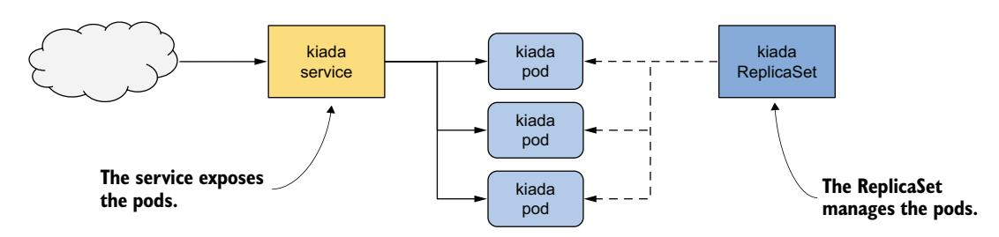
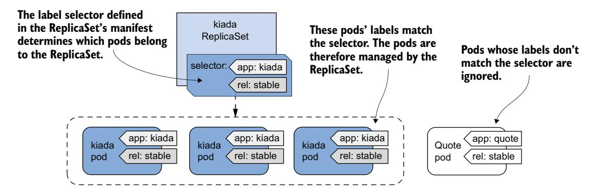
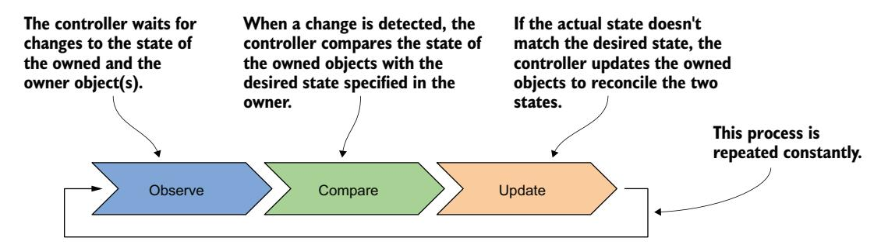
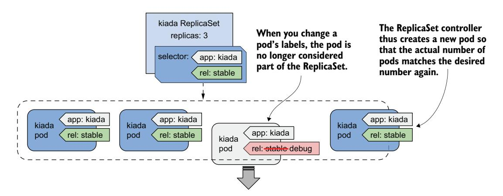

# 第 14 章 使用 ReplicaSet 扩缩容和维护 Pod

!!! tip "本章内容"

    - 使用 ReplicaSet 对象复制 Pod
    - 在集群节点故障时保持 Pod 运行
    - Kubernetes 控制器中的协调控制循环
    - API 对象所有权与垃圾回收

到目前为止，你一直通过直接创建 Pod 对象来部署工作负载。在生产集群中，你可能需要部署数十甚至数百个相同 Pod 的副本，因此直接创建和管理这些 Pod 将会非常困难。幸运的是，在 Kubernetes 中，你可以使用 ReplicaSet 对象来自动化 Pod 副本的创建和管理。

!!! note "说明"

    在 ReplicaSet 出现之前，类似的功能由 ReplicationController 对象类型提供，该类型现已弃用。ReplicationController 的行为与 ReplicaSet 完全相同，因此本章讲解的所有内容同样适用于 ReplicationController。

在开始之前，请确保 Kiada 套件中的 Pod、Service 和其他对象已存在于你的集群中。如果你完成了上一章的练习，它们应该已经就位。如果没有，你可以通过创建 kiada 命名空间并应用 Chapter14/SETUP/ 目录下的所有清单来创建它们，运行以下命令：

```bash
$ kubectl apply -f SETUP -R
```

!!! note "说明"

    本章的代码文件可在 [https://github.com/luksa/kubernetes-in-action-2nd-edition/tree/master/Chapter14](https://github.com/luksa/kubernetes-in-action-2nd-edition/tree/master/Chapter14) 获取。

## 14.1 ReplicaSet 简介

ReplicaSet 代表一组 Pod 副本（Pod 的精确拷贝）。你无需逐个创建 Pod，而是可以创建一个 ReplicaSet 对象，在其中指定 Pod 模板和所需的副本数量，然后让 Kubernetes 创建这些 Pod，如图 14.1 所示。


图 14.1 ReplicaSet 一览

ReplicaSet 允许你将 Pod 作为单个单元来管理，但也仅限于此。如果你希望将这些 Pod 作为一个整体对外暴露，你仍然需要一个 Service 对象。如图 14.2 所示，提供特定服务的每组 Pod 通常同时需要一个 ReplicaSet 和一个 Service 对象。



图 14.2 Service、ReplicaSet 和 Pod 之间的关系

与 Service 一样，ReplicaSet 的标签选择器和 Pod 标签决定了哪些 Pod 属于该 ReplicaSet。如图 14.3 所示，ReplicaSet 只关心与其标签选择器匹配的 Pod，而忽略其他 Pod。



图 14.3 ReplicaSet 只关心与其标签选择器匹配的 Pod

基于以上信息，你可能认为 ReplicaSet 仅用于创建 Pod 的多个副本，但事实并非如此。即使你只需要创建单个 Pod，通过 ReplicaSet 来创建也比直接创建更好，因为 ReplicaSet 能确保该 Pod 始终存在以完成其工作。

想象一下，你为一个重要的服务直接创建了一个 Pod，然后在你不在的时候运行该 Pod 的节点发生故障。你的服务将一直不可用，直到你重新创建该 Pod。如果你通过 ReplicaSet 部署了该 Pod，它会自动重建该 Pod。显然，通过 ReplicaSet 创建 Pod 比直接创建要好。

然而，尽管 ReplicaSet 非常有用，但它并不能提供长期运行工作负载所需的一切。在某些时候，你会想要将工作负载升级到新版本，而这正是 ReplicaSet 的短板所在。因此，应用程序通常不是通过 ReplicaSet 部署的，而是通过 Deployment 来部署的，后者允许你以声明式方式更新它们。这就引出了一个问题：如果你不打算直接使用 ReplicaSet，为什么还需要学习它们？原因是 Deployment 提供的大部分功能实际上是由 Kubernetes 在其底层创建的 ReplicaSet 来提供的。Deployment 负责处理更新，但其他所有事情都由底层的 ReplicaSet 处理。因此，理解它们的功能和工作原理非常重要。

### 14.1.1 创建 ReplicaSet

让我们首先为 Kiada 服务创建 ReplicaSet 对象。该服务目前运行在三个 Pod 中，这些 Pod 是你之前从三个独立的 Pod 清单直接创建的，现在你将用一个 ReplicaSet 清单来替代它们。在创建清单之前，让我们先看看需要在 spec 部分指定哪些字段。

#### REPLICASET SPEC 简介

ReplicaSet 是一个相对简单的对象。表 14.1 解释了你在 ReplicaSet 的 spec 部分需要指定的三个关键字段。

`selector` 和 `template` 字段是必需的，但你可以省略 `replicas` 字段。如果省略，则只创建一个副本。

表 14.1 ReplicaSet 规格中的主要字段

| 字段名 | 描述 |
|------|------|
| replicas | 所需的副本数。当你创建 ReplicaSet 对象时，Kubernetes 会从 Pod 模板创建此数量的 Pod。在删除 ReplicaSet 之前，会一直保持相同数量的 Pod。 |
| selector | 标签选择器，可以在 `matchLabels` 子字段中包含一个标签映射，也可以在 `matchExpressions` 子字段中包含一个标签选择器要求列表。与标签选择器匹配的 Pod 被视为该 ReplicaSet 的一部分。 |
| template | ReplicaSet Pod 的 Pod 模板。当需要创建新 Pod 时，将使用此模板创建该对象。 |

#### 创建 REPLICASET 对象清单

为 Kiada Pod 创建一个 ReplicaSet 对象清单。以下清单显示了其内容。你可以在文件 `rs.kiada.yaml` 中找到该清单。

!!! note "清单 14.1 Kiada ReplicaSet 对象清单"

    ```yaml
    apiVersion: apps/v1
    kind: ReplicaSet
    metadata:
      name: kiada
    spec:
      replicas: 5
      selector:
        matchLabels:
          app: kiada
          rel: stable
      template:
        metadata:
          labels:
            app: kiada
            rel: stable
        spec:
          containers:
          - name: kiada
            image: luksa/kiada:0.5
            imagePullPolicy: IfNotPresent
            env:
            - name: QUOTE_URL
              value: http://quote/quote
            - name: QUIZ_URL
              value: http://quiz
            - name: POD_NAME
              valueFrom:
                fieldRef:
                  fieldPath: metadata.name
            - name: POD_IP
              valueFrom:
                fieldRef:
                  fieldPath: status.podIP
            - name: NODE_NAME
              valueFrom:
                fieldRef:
                  fieldPath: spec.nodeName
            - name: NODE_IP
              valueFrom:
                fieldRef:
                  fieldPath: status.hostIP
            ports:
            - name: http
              containerPort: 8080
            readinessProbe:
              httpGet:
                port: 8080
                path: /healthz/ready
                scheme: HTTP
          - name: envoy
            image: envoyproxy/envoy:v1.31-latest
            command: [ "envoy", "-c", "/etc/config/envoy.yaml" ]
            volumeMounts:
            - name: etc-envoy
              mountPath: /etc/config
              readOnly: true
            ports:
            - name: https
              containerPort: 8443
            - name: admin
              containerPort: 9901
            readinessProbe:
              httpGet:
                port: admin
                path: /ready
          volumes:
          - name: etc-envoy
            projected:
              sources:
              - configMap:
                  name: kiada-ssl-config
              - secret:
                  name: kiada-tls
                  items:
                  - key: tls.crt
                    path: example-com.crt
                  - key: tls.key
                    path: example-com.key
                    mode: 0600
    ```

ReplicaSet 属于 `apps` API 组，版本为 `v1`。如表 14.1 所述，`replicas` 字段指定此 ReplicaSet 应使用 `template` 字段中的模板创建五个 Pod 副本。

你会注意到 Pod 模板中的标签与 `selector` 字段中的标签匹配。如果不匹配，Kubernetes API 将拒绝该 ReplicaSet，因为使用模板创建的 Pod 不会计入所需的副本数，这将导致创建无限数量的 Pod。

你是否注意到模板中没有 Pod 名称？这是因为 Pod 名称是由 ReplicaSet 名称生成的。

模板的其余部分与你之前章节中创建的 Kiada Pod 清单完全一致。要创建 ReplicaSet，请使用你已多次使用的 `kubectl apply` 命令：

```bash
$ kubectl apply -f rs.kiada.yaml
replicaset.apps/kiada created
```

### 14.1.2 检查 ReplicaSet 及其 Pod

要显示刚创建的 ReplicaSet 的基本信息，请使用 `kubectl get` 命令：

```bash
$ kubectl get rs kiada
NAME    DESIRED   CURRENT   READY   AGE
kiada   5         5         5       1m
```

!!! note "说明"

    对于 replicaset，可以使用缩写 `rs`。

命令输出显示了所需数量、当前数量以及就绪探针报告的就绪副本数量。这些信息分别从 ReplicaSet 对象的 `replicas`、`fullyLabeledReplicas` 和 `readyReplicas` 状态字段中读取。另一个状态字段 `availableReplicas` 表示有多少副本可用，但其值不会在 `kubectl get` 命令中显示。

如果你使用 `-o wide` 选项运行 `kubectl get replicasets` 命令，会显示一些非常有用的附加信息。运行以下命令查看：

```bash
$ kubectl get rs -o wide
NAME    ... CONTAINERS   IMAGES                          SELECTOR
kiada   ... kiada,envoy  luksa/kiada:0.5,               app=kiada,rel=stable
                           envoyproxy/envoy:v1.14.1
```

除了之前显示的列之外，这个扩展输出不仅显示了标签选择器，还显示了 Pod 模板中使用的容器名称和镜像。考虑到这些信息的重要性，令人惊讶的是在列出 Pod 时 `kubectl get pods` 并不显示这些信息。

!!! tip "提示"

    要查看容器和镜像名称，请使用 `-o wide` 选项列出 ReplicaSet，而不是试图从 Pod 中获取这些信息。

要查看 ReplicaSet 的所有信息，请使用 `kubectl describe` 命令：

```bash
$ kubectl describe rs kiada
```

输出显示了 ReplicaSet 中使用的标签选择器、Pod 的数量及其状态，以及用于创建这些 Pod 的完整模板。

#### 列出 REPLICASET 中的 POD

kubectl 不提供直接列出 ReplicaSet 中 Pod 的方法，但你可以获取 ReplicaSet 的标签选择器，并在 `kubectl get pods` 命令中使用它，如下所示：

```bash
$ kubectl get po -l app=kiada,rel=stable
NAME          READY   STATUS    RESTARTS   AGE
kiada-001     2/2     Running   0          12m
kiada-002     2/2     Running   0          12m
kiada-003     2/2     Running   0          12m
kiada-86wzp   2/2     Running   0          8s
kiada-k9hn2   2/2     Running   0          8s
```

在创建 ReplicaSet 之前，你有三个来自前几章的 Kiada Pod，现在你有五个，这与 ReplicaSet 中定义的所需副本数一致。三个已有 Pod 的标签与 ReplicaSet 的标签选择器匹配，因此被 ReplicaSet 接管。另外创建了两个 Pod，以确保集合中的 Pod 数量与所需的副本数匹配。

#### 理解 REPLICASET 中 POD 的命名方式

正如你所见，两个新 Pod 的名称包含五个随机字母数字字符，而不是延续你在 Pod 名称中使用的数字序列。Kubernetes 通常为它创建的对象分配随机名称。

甚至有一个特殊的元数据字段，允许你在不提供完整名称的情况下创建对象。替代 `name` 字段，你在 `generateName` 字段中指定名称前缀。你在第 9 章中首次使用了该字段，当时你多次运行 `kubectl create` 命令来创建 Pod 的多个副本并为每个副本赋予唯一的名称。当 Kubernetes 为 ReplicaSet 创建 Pod 时，使用了相同的方法。

当 Kubernetes 为 ReplicaSet 创建 Pod 时，它将 `generateName` 字段设置为与 ReplicaSet 名称一致。Kubernetes API 服务器随后生成完整名称并将其放入 `name` 字段。要查看这一点，请选择一个额外创建的 Pod 并检查其 metadata 部分，如下所示：

```bash
$ kubectl get po kiada-86wzp -o yaml
apiVersion: v1
kind: Pod
metadata:
  generateName: kiada-
  labels:
  ...
  name: kiada-86wzp
  ...
```

`generateName` 字段的值与 ReplicaSet 的名称匹配。此字段的存在告诉 Kubernetes API 使用此字段的值作为前缀为该 Pod 生成名称。Pod 的名称由 Kubernetes API 生成。

对于 ReplicaSet Pod 而言，给 Pod 赋予随机名称是合理的，因为这些 Pod 彼此完全相同，因此是可替代的。这些 Pod 之间也没有顺序的概念，因此使用序列号是没有意义的。即使 Pod 名称现在看起来合理，想象一下如果你删除了其中的一些会怎样。如果你无序地删除它们，编号就不再连续了。然而，对于有状态的工作负载，按顺序为 Pod 编号可能是有意义的。这就是你使用 StatefulSet 对象创建 Pod 时的情况。你将在第 16 章中了解更多关于 StatefulSet 的信息。

#### 查看 REPLICASET POD 的日志

ReplicaSet Pod 的随机名称使它们在某种程度上难以操作。例如，要查看这些 Pod 中某个容器的日志，在运行 `kubectl logs` 命令时输入 Pod 名称是相当繁琐的。如果 ReplicaSet 只包含单个 Pod，输入完整名称似乎没有必要。幸运的是，在这种情况下，你可以使用以下命令打印 Pod 的日志：

```bash
$ kubectl logs rs/kiada -c kiada
```

因此，你不是指定 Pod 名称，而是输入 `rs/kiada`，其中 `rs` 是 ReplicaSet 的缩写，`kiada` 是 ReplicaSet 对象的名称。`-c kiada` 选项告诉 kubectl 打印 `kiada` 容器的日志。只有当 Pod 有多个容器时，你才需要使用此选项。

如果 ReplicaSet 有多个 Pod（如同你的情况），则只会显示其中一个 Pod 的日志，但你可以通过指定 `--all-pods` 标志来显示所有 Pod 的日志。例如，要流式传输所有 kiada Pod 中 envoy 容器的日志，请运行：

```bash
$ kubectl logs rs/kiada --all-pods -c envoy
```

要显示所有容器的日志，请使用 `--all-containers` 选项，而不是指定容器名称：

```bash
$ kubectl logs rs/kiada --all-pods --all-containers
```

当流量在 Pod 之间分配时，查看多个 Pod 的日志非常有用，你可以查看每个接收到的请求，无论它由哪个 Pod 处理。例如，尝试使用以下命令流式传输日志：

```bash
$ kubectl logs rs/kiada --all-pods -c kiada -f
```

现在在你的 Web 浏览器中或使用 curl 打开应用程序。使用 Ingress、Gateway 或 LoadBalancer 或 NodePort Service，如同前三章中所解释的那样。

### 14.1.3 理解 Pod 所有权

Kubernetes 根据你在 ReplicaSet 对象中指定的模板创建了两个新 Pod。它们由 ReplicaSet 拥有和控制，就像你手动创建的三个 Pod 一样。当你使用 `kubectl describe` 命令检查 Pod 时可以看到这一点。例如，检查 `kiada-001` Pod，如下所示：

```bash
$ kubectl describe po kiada-001
Name:         kiada-001
Namespace:    kiada
...
Controlled By:  ReplicaSet/kiada
...
```

此 Pod 现在由 `kiada` ReplicaSet 控制。

`kubectl describe` 命令从 Pod 清单的 `metadata` 部分获取此信息。让我们更仔细地看看。运行以下命令：

```bash
$ kubectl get po kiada-001 -o yaml
apiVersion: v1
kind: Pod
metadata:
  labels:
    app: kiada
    rel: stable
  name: kiada-001
  namespace: kiada
  ownerReferences:
  - apiVersion: apps/v1
    blockOwnerDeletion: true
    controller: true
    kind: ReplicaSet
    name: kiada
    uid: 8e19d9b3-bbf1-4830-b0b4-da81dd0e6e22
  resourceVersion: "527511"
  uid: d87afa5c-297d-4ccb-bb0a-9eb48670673f
spec:
  ...
```

对象的 `metadata` 部分有时包含 `ownerReferences` 字段，其中包含对该对象所有者的引用。此字段可以包含多个所有者，但大多数对象只有一个所有者，就像 `kiada-001` Pod 一样。对于此 Pod，`kiada` ReplicaSet 是**所有者**，而 Pod 是所谓的**从属对象**。

Kubernetes 有一个垃圾收集器，当所有者被删除时会自动删除从属对象。如果对象有多个所有者，当所有所有者都被删除时，该对象才会被删除。如果你删除了拥有 `kiada-001` 和其他 Pod 的 ReplicaSet 对象，垃圾收集器也会删除这些 Pod。

所有者引用还可以指示哪个所有者是该对象的控制器。`kiada-001` Pod 由 `kiada` ReplicaSet 控制，如清单中的 `controller: true` 行所示。这意味着你不再应直接控制这三个 Pod，而应通过 ReplicaSet 对象来控制它们。

## 14.2 更新 ReplicaSet

在 ReplicaSet 中，你需要指定所需的副本数、一个 Pod 模板和一个标签选择器。选择器是不可变的，但你可以更新其他两个属性。通过更改所需的副本数，你可以对 ReplicaSet 进行扩缩容。让我们看看当你这样做时会发生什么。

### 14.2.1 扩缩容 ReplicaSet

在 ReplicaSet 中，你将所需副本数设置为 5，这也是当前 ReplicaSet 拥有的 Pod 数量。然而，你现在可以更新 ReplicaSet 对象来更改这个数字。这可以通过更改清单文件中的值并重新应用来完成，也可以通过 `kubectl edit` 命令直接编辑对象来完成。然而，扩缩容 ReplicaSet 最简单的方法是使用 `kubectl scale` 命令。

#### 使用 KUBECTL SCALE 命令扩缩容 REPLICASET

让我们将 Kiada Pod 的数量增加到 6。为此，请执行以下命令：

```bash
$ kubectl scale rs kiada --replicas 6
replicaset.apps/kiada scaled
```

现在再次检查 ReplicaSet，确认它现在有 6 个 Pod：

```bash
$ kubectl get rs kiada
NAME    DESIRED   CURRENT   READY   AGE
kiada   6         6         5       10m
```

这些列表明 ReplicaSet 现在配置为 6 个 Pod，这也是当前的 Pod 数量。其中一个 Pod 尚未就绪，但这只是因为它刚刚被创建。再次列出 Pod，确认已创建了一个额外的 Pod 实例：

```bash
$ kubectl get po -l app=kiada,rel=stable
NAME          READY   STATUS    RESTARTS   AGE
kiada-001     2/2     Running   0          22m
kiada-002     2/2     Running   0          22m
kiada-003     2/2     Running   0          22m
kiada-86wzp   2/2     Running   0          10m
kiada-dmshr   2/2     Running   0          11s
kiada-k9hn2   2/2     Running   0          10m
```

`AGE` 列表明这个 Pod 刚刚被创建。

正如预期的那样，一个新 Pod 被创建，使 Pod 总数达到所需的 6 个。如果此应用程序为实际用户提供服务，并且由于流量增加你需要扩展到 100 个或更多 Pod，你可以使用相同的命令瞬间完成。然而，你的集群可能无法处理那么多 Pod。

#### 缩容

正如你可以扩容 ReplicaSet 一样，你也可以使用相同的命令进行缩容。你还可以通过 `kubectl edit` 编辑清单来扩缩容 ReplicaSet。让我们使用此方法将其缩容到 4 个副本。运行以下命令：

```bash
$ kubectl edit rs kiada
```

该命令应在你的文本编辑器中打开 ReplicaSet 对象清单。找到 `replicas` 字段并将值更改为 4。保存文件并关闭编辑器，以便 kubectl 将更新后的清单提交到 Kubernetes API。验证你现在有 4 个 Pod：

```bash
$ kubectl get pods -l app=kiada,rel=stable
NAME          READY   STATUS        RESTARTS   AGE
kiada-001     2/2     Running       0          28m
kiada-002     2/2     Running       0          28m
kiada-003     2/2     Running       0          28m
kiada-86wzp   0/2     Terminating   0          16m
kiada-dmshr   2/2     Terminating   0          125m
kiada-k9hn2   2/2     Running       0          16m
```

有两个 Pod 被标记为删除，当它们的容器中的所有进程停止运行后就会消失。

正如预期的那样，有两个 Pod 正在被终止，当它们的容器中的所有进程停止运行后就会消失。但是 Kubernetes 如何决定删除哪些 Pod 呢？它只是随机选择的吗？

#### 理解缩容时先删除哪些 Pod

当缩容 ReplicaSet 时，Kubernetes 会遵循一些精心设计的规则来决定首先删除哪个/哪些 Pod。它按以下顺序删除 Pod：

1. 尚未分配到节点的 Pod
2. 阶段为 Unknown 的 Pod
3. 未就绪的 Pod
4. 删除成本（deletion cost）较低的 Pod
5. 与较多相关副本并置的 Pod
6. 就绪时间较短的 Pod
7. 容器重启次数较多的 Pod
8. 创建时间晚于其他 Pod 的 Pod

这些规则确保尚未调度和有缺陷的 Pod 首先被删除，而运行良好的 Pod 则被保留。你还可以通过在 Pod 上设置注解 `controller.kubernetes.io/pod-deletion-cost` 来影响首先删除哪个 Pod。该注解的值必须是一个可以解析为 32 位整数的字符串。没有此注解的 Pod 以及值较低的 Pod 将先于值较高的 Pod 被删除。

Kubernetes 还尝试使 Pod 在集群节点上均匀分布。图 14.4 展示了一个例子，其中 ReplicaSet 从五个副本缩容到三个副本。由于第三个节点比其他两个节点多运行了两个并置的副本，因此第三个节点上的 Pod 首先被删除。如果没有这条规则，你可能会在单个节点上得到三个副本。


图 14.4 Kubernetes 使相关 Pod 均匀分布在集群节点上

#### 缩容至零

在某些情况下，将副本数缩容至零是很有用的。由 ReplicaSet 管理的所有 Pod 将被删除，但 ReplicaSet 对象本身将保留，并且可以随时扩容回来。你现在可以尝试运行以下命令：

```bash
$ kubectl scale rs kiada --replicas 0
replicaset.apps/kiada scaled
$ kubectl get pods -l app=kiada
No resources found in kiada namespace.
```

正如你将在下一章中看到的，当 ReplicaSet 由 Deployment 对象拥有时，缩容到零的 ReplicaSet 非常常见。

!!! tip "提示"

    如果你需要临时关闭工作负载的所有实例，请将所需副本数设置为零，而不是删除 ReplicaSet 对象。

### 14.2.2 更新 Pod 模板

在下一章中，你将学习 Deployment 对象，它与 ReplicaSet 的区别在于如何处理 Pod 模板更新。这个区别就是为什么你通常使用 Deployment 而不是 ReplicaSet 来管理 Pod。因此，了解 ReplicaSet 不做什么是很重要的。

#### 编辑 REPLICASET 的 POD 模板

Kiada Pod 当前具有指示应用程序名称和发布类型（是稳定版本还是其他版本）的标签。如果有一个标签指示确切的版本号，那么在同时运行不同版本时，你就可以轻松地区分它们，那就更好了。

为了向 ReplicaSet 创建的 Pod 添加标签，你必须将该标签添加到其 Pod 模板中。你不能使用 `kubectl label` 命令来添加标签，因为那样标签会被添加到 ReplicaSet 本身，而不是 Pod 模板。没有 kubectl 命令可以做到这一点，因此你必须像之前一样使用 `kubectl edit` 编辑清单。找到 `template` 字段，将键为 `ver`、值为 `0.5` 的标签添加到模板中的 `metadata.labels` 字段，如以下清单所示。

!!! note "清单 14.2 向 Pod 模板添加标签"

    ```yaml
    apiVersion: apps/v1
    kind: ReplicaSet
    metadata:
      ...
    spec:
      replicas: 2
      selector:
        matchLabels:
          app: kiada
          rel: stable
      template:
        metadata:
          labels:
            app: kiada
            rel: stable
            ver: '0.5'
        spec:
          ...
    ```

请确保在正确的位置添加标签。不要将其添加到 `selector` 中，因为它是不可变的，这会导致 Kubernetes API 拒绝你的更新。版本号必须用引号括起来；否则，YAML 解析器会将其解释为十进制数字，更新将失败，因为标签值必须是字符串。保存文件并关闭编辑器，以便 kubectl 将更新后的清单提交到 API 服务器。

!!! note "说明"

    你是否注意到 Pod 模板中的标签和选择器中的标签并不完全相同？它们不必完全相同，但选择器中的标签必须是模板中标签的子集。

#### 理解 REPLICASET POD 模板的使用方式

你已更新了 Pod 模板。现在检查更改是否反映在 Pod 中。按如下方式列出 Pod 及其标签：

```bash
$ kubectl get pods -l app=kiada --show-labels
NAME          READY   STATUS    RESTARTS   AGE     LABELS
kiada-dl7vz   2/2     Running   0          10m     app=kiada,rel=stable
kiada-dn9fb   2/2     Running   0          10m     app=kiada,rel=stable
```

由于 Pod 仍然只有原始 Pod 模板中的两个标签，很明显 Kubernetes 没有更新这些 Pod。但是，如果你现在将 ReplicaSet 扩容一个副本，新 Pod 应包含你添加的标签：

```bash
$ kubectl scale rs kiada --replicas 3
replicaset.apps/kiada scaled
$ kubectl get pods -l app=kiada --show-labels
NAME          READY   STATUS    RESTARTS   AGE     LABELS
kiada-dl7vz   2/2     Running   0          14m     app=kiada,rel=stable
kiada-dn9fb   2/2     Running   0          14m     app=kiada,rel=stable
kiada-z9dp2   2/2     Running   0          47s     app=kiada,rel=stable,ver=0.5
```

新创建的 Pod 包含额外的标签。

你应该将 Pod 模板视为一个饼干模具，Kubernetes 用它来切出新的 Pod。当你更改 Pod 模板时，只有饼干模具会改变，这只会影响之后创建的 Pod。

## 14.3 理解 ReplicaSet 控制器的运作

在前面的章节中，你看到更改 ReplicaSet 对象中的 `replicas` 和 `template` 会导致 Kubernetes 对属于该 ReplicaSet 的 Pod 执行某些操作。执行这些操作的 Kubernetes 组件称为**控制器**。你通过集群 API 创建的大多数对象类型都有一个关联的控制器。例如，在前几章中你学习了 Ingress 控制器，它管理 Ingress 对象。还有管理 Endpoints 对象的 Endpoints 控制器、管理 Namespace 对象的 Namespace 控制器，等等。

毫不奇怪，ReplicaSet 由 ReplicaSet 控制器管理。你对 ReplicaSet 对象所做的任何更改都会被此控制器检测到并处理。当你扩缩容 ReplicaSet 时，控制器就是创建或删除 Pod 的那个组件。每次它这样做时，还会创建一个 Event 对象，通知你它做了什么。正如你在第 4 章中学到的，你可以通过 `kubectl describe` 命令的底部看到与对象关联的事件，如下一个代码片段所示，或者使用 `kubectl get events` 命令专门列出 Event 对象。

```bash
$ kubectl describe rs kiada
...
Events:
  Type    Reason            Age   From                   Message
  ----    ------            ----  ----                   -------
  Normal  SuccessfulDelete  34m   replicaset-controller  Deleted pod: kiada-k9hn2
  Normal  SuccessfulCreate  30m   replicaset-controller  Created pod: kiada-dl7vz
  Normal  SuccessfulCreate  30m   replicaset-controller  Created pod: kiada-dn9fb
  Normal  SuccessfulCreate  16m   replicaset-controller  Created pod: kiada-z9dp2
```

这些事件表明 ReplicaSet 控制器创建了三个 Pod。

要理解 ReplicaSet，你必须理解其控制器的运作。

### 14.3.1 协调控制循环简介

如图 14.5 所示，控制器观察所有者对象和从属对象的状态。在每次状态发生变化后，控制器将从属对象的状态与所有者对象中指定的期望状态进行比较。如果这两种状态存在差异，控制器会对从属对象进行更改，以协调这两种状态。这就是你在所有控制器中都会发现的所谓的**协调控制循环**。



图 14.5 控制器的协调控制循环

ReplicaSet 控制器的协调控制循环包括观察 ReplicaSet 和 Pod。每次 ReplicaSet 或 Pod 发生变化时，控制器会检查与 ReplicaSet 关联的 Pod 列表，并确保实际的 Pod 数量与 ReplicaSet 中指定的期望数量一致。如果实际 Pod 数量少于期望数量，它会从 Pod 模板创建新的副本。如果 Pod 数量多于期望数量，它会删除多余的副本。图 14.6 中的流程图解释了整个过程。


图 14.6 ReplicaSet 控制器的协调循环

### 14.3.2 理解 ReplicaSet 控制器如何响应 Pod 变化

你已经看到控制器如何立即响应 ReplicaSet 的 `replicas` 字段的变化。然而，这并不是期望数量和实际 Pod 数量可能产生差异的唯一方式。如果没有人触碰 ReplicaSet，但实际 Pod 数量发生了变化呢？ReplicaSet 控制器的职责是确保 Pod 数量始终与指定的数量一致。因此，在这种情况下它也应该发挥作用。

#### 删除由 REPLICASET 管理的 POD

让我们看看如果你删除一个由 ReplicaSet 管理的 Pod 会发生什么。选择一个并使用 `kubectl delete` 删除它：

```bash
$ kubectl delete pod kiada-z9dp2
pod "kiada-z9dp2" deleted
```

请将 Pod 名称替换为你自己的 Pod 名称。

现在再次列出 Pod：

```bash
$ kubectl get pods -l app=kiada
NAME          READY   STATUS    RESTARTS   AGE
kiada-dl7vz   2/2     Running   0          34m
kiada-dn9fb   2/2     Running   0          34m
kiada-rfkqb   2/2     Running   0          47s
```

新创建的 Pod

你删除的 Pod 已消失，但出现了一个新 Pod 来替代缺失的 Pod。Pod 数量再次与 ReplicaSet 对象中设置的期望副本数一致。和之前一样，ReplicaSet 控制器立即做出响应，将实际状态与期望状态协调一致。

即使你删除所有 Kiada Pod，三个新 Pod 也会立即出现，以便它们可以为你的用户提供服务。你可以通过运行以下命令来观察这一点：

```bash
$ kubectl delete pod -l app=kiada
```

#### 创建匹配 REPLICASET 标签选择器的 POD

正如 ReplicaSet 控制器在发现 Pod 少于所需数量时会创建新的 Pod 一样，当它发现 Pod 过多时，也会删除 Pod。你已经在减少所需副本数量时看到过这种情况，但如果你手动创建一个匹配 ReplicaSet 标签选择器的 Pod 呢？从控制器的角度来看，其中一个 Pod 必须消失。

让我们创建一个名为 `one-kiada-too-many` 的 Pod。该名称与控制器为 ReplicaSet Pod 分配的前缀不匹配，但该 Pod 的标签与 ReplicaSet 的标签选择器匹配。你可以在文件 `pod.one-kiada-too-many.yaml` 中找到 Pod 清单。使用 `kubectl apply` 应用该清单来创建 Pod，然后立即列出 kiada Pod，如下所示：

```bash
$ kubectl get po -l app=kiada
NAME                 READY   STATUS        RESTARTS   AGE
kiada-dl7vz          2/2     Running       0          11m
one-kiada-too-many   0/2     Terminating   0          3s
kiada-dn9fb          2/2     Running       0          11m
kiada-z9dp2          2/2     Running       0          11m
```

尽管 Pod 刚刚才被创建，但它已经在被删除了。

正如预期的那样，ReplicaSet 控制器一旦检测到该 Pod 就会将其删除。当你创建与 ReplicaSet 的标签选择器匹配的 Pod 时，控制器就会介入。如你所见，Pod 的名称并不重要。只有 Pod 的标签是重要的。

#### 当运行 REPLICASET POD 的节点故障时会发生什么？

在前面的例子中，你看到了当有人干预 ReplicaSet 的 Pod 时，ReplicaSet 控制器如何响应。虽然这些例子有效地展示了 ReplicaSet 控制器的工作方式，但它们并没有真正展示使用 ReplicaSet 运行 Pod 的真正好处。通过 ReplicaSet 而不是直接创建 Pod 的最大原因在于，当你的集群节点发生故障时，Pod 会被自动替换。

!!! warning "警告"

    在下一个例子中，会导致一个集群节点故障。在配置不当的集群中，这可能会导致整个集群故障。因此，只有在必要时愿意从头重建集群的情况下，才应执行此练习。

要查看节点停止响应时会发生什么，你可以禁用其网络接口。如果你使用 `kind` 工具创建了集群，可以使用以下命令禁用 `kind-worker2` 节点的网络接口：

```bash
$ docker exec kind-worker2 ip link set eth0 down
```

!!! note "说明"

    选择一个至少运行了一个 Kiada Pod 的节点。使用 `-o wide` 选项列出 Pod，查看每个 Pod 运行在哪个节点上。

!!! note "说明"

    如果你使用的是 GKE，可以使用 `gcloud compute ssh` 命令登录节点，并使用 `sudo ifconfig eth0 down` 命令关闭其网络接口。SSH 会话将停止响应，因此你需要按 Enter 键，然后输入 `~.`（波浪号和句点，不带引号）来关闭它。

很快，代表该集群节点的 Node 对象的状态变为 `NotReady`：

```bash
$ kubectl get node
NAME                 STATUS     ROLES                  AGE     VERSION
kind-control-plane   Ready      control-plane,master   2d3h    v1.21.1
kind-worker          Ready      <none>                 2d3h    v1.21.1
kind-worker2         NotReady   <none>                 2d3h    v1.21.1
```

此节点不再在线。

此状态表示运行在该节点上的 kubelet 已经有一段时间没有联系 API 服务器了。由于这不一定是节点宕机的明确信号（可能只是临时的网络故障），因此这不会立即影响运行在该节点上的 Pod 的状态。它们仍将显示为 `Running`。然而，几分钟后，Kubernetes 意识到该节点已宕机，并将这些 Pod 标记为删除。

!!! note "说明"

    从节点不可用到其 Pod 被删除之间的时间间隔可以通过**污点与容忍（Taints and Tolerations）**机制来配置。

一旦 Pod 被标记为删除，ReplicaSet 控制器就会创建新的 Pod 来替换它们，如以下输出所示。

```bash
$ kubectl get pods -l app=kiada -o wide
NAME          READY   STATUS        RESTARTS   AGE     IP             NODE
kiada-ffstj   2/2     Running       0          35s     10.244.1.150   kind-worker
kiada-l2r85   2/2     Terminating   0          37m     10.244.2.173   kind-worker2
kiada-n98df   2/2     Terminating   0          37m     10.244.2.174   kind-worker2
kiada-vnc4b   2/2     Running       0          37m     10.244.1.148   kind-worker
kiada-wkpsn   2/2     Running       0          35s     10.244.1.151   kind-worker
```

故障节点上的两个 Pod

`kind-worker2` 节点上的两个 Pod 被标记为 `Terminating`，并已由调度到健康节点 `kind-worker` 上的两个新 Pod 替换。同样，三个 Pod 副本正在运行，正如 ReplicaSet 中所指定的那样。

正在被删除的两个 Pod 会保持 `Terminating` 状态，直到节点恢复上线。实际上，这些 Pod 中的容器仍在运行，因为该节点上的 kubelet 无法与 API 服务器通信，因此不知道它们应该被终止。然而，当节点的网络接口恢复上线时，Kubelet 会终止这些容器，Pod 对象也会被删除。以下命令恢复节点的网络接口：

```bash
$ docker exec kind-worker2 ip link set eth0 up
$ docker exec kind-worker2 ip route add default via 172.18.0.1
```

你的集群可能使用不同于 `172.18.0.1` 的网关 IP。要查找它，请运行以下命令：

```bash
$ docker network inspect kind -f '{{ (index .IPAM.Config 0).Gateway }}'
```

!!! note "说明"

    如果你使用的是 GKE，必须使用 `gcloud compute instances reset <node-name>` 命令远程重置节点。

#### POD 何时不会被替换？

前面的章节已经证明，ReplicaSet 控制器确保始终有与 ReplicaSet 对象中指定数量相同的健康 Pod。但情况总是如此吗？是否可能进入一种状态，即 Pod 数量与期望副本数一致，但这些 Pod 无法为客户端提供服务？

还记得存活探针和就绪探针吗？如果容器的存活探针失败，容器会被重启。如果探针多次失败，在容器被重启之前会有显著的延迟时间。这种情况源于第 6 章中解释的指数退避机制。在退避延迟期间，容器不处于运行状态。然而，系统假定容器最终会恢复服务。如果容器失败的是就绪探针而不是存活探针，同样假定问题最终会被修复。

因此，即使 ReplicaSet 控制器可以轻松地将其替换为可能正常运行的新 Pod，那些容器持续崩溃或探针失败的 Pod 永远不会被自动删除。因此，请注意，ReplicaSet 并不保证你始终拥有与 ReplicaSet 对象中指定数量相同的健康副本。

你可以通过以下命令使某个 Pod 的就绪探针失败来亲自验证这一点：

```bash
$ kubectl exec rs/kiada -c kiada -- curl -X POST localhost:9901/healthcheck/fail
```

!!! note "说明"

    如果你在运行 `kubectl exec` 命令时指定的是 ReplicaSet 而不是 Pod 名称，指定的命令将在其中一个 Pod 中运行，而不是所有 Pod，这与 `kubectl logs` 一样。

大约 30 秒后，`kubectl get pods` 命令会指示某个 Pod 的某个容器不再就绪：

```bash
$ kubectl get pods -l app=kiada
NAME          READY   STATUS    RESTARTS   AGE
kiada-78j7m   1/2     Running   0          21m
kiada-98lmx   2/2     Running   0          21m
kiada-wk99p   2/2     Running   0          21m
```

`READY` 列显示该 Pod 中只有一个容器是就绪的。

该 Pod 不再接收来自客户端的任何流量，但 ReplicaSet 控制器不会删除和替换它，即使它知道三个 Pod 中只有两个是就绪且可访问的，如 ReplicaSet 状态所示：

```bash
$ kubectl get rs
NAME    DESIRED   CURRENT   READY   AGE
kiada   3         3         2       2h
```

三个 Pod 中只有两个是就绪的。

!!! note "说明"

    ReplicaSet 只确保所需的 Pod 数量是存在的。它不确保它们的容器实际上正在运行且准备好处理流量。

如果这种情况发生在真实的生产集群中，且剩余的 Pod 无法处理所有流量，你将不得不自己删除有问题的 Pod。但如果你想先找出 Pod 出了什么问题呢？你如何在不删除 Pod 的情况下快速替换故障 Pod 以便调试呢？

你可以将 ReplicaSet 扩容一个副本，但在完成对故障 Pod 的调试后，你需要再缩容回来。幸运的是，有一种更好的方法。下一节将对此进行说明。

### 14.3.3 将 Pod 从 ReplicaSet 的控制中移除

你已经知道，ReplicaSet 控制器持续确保与 ReplicaSet 标签选择器匹配的 Pod 数量也与期望副本数一致。因此，如果你将一个 Pod 从匹配选择器的 Pod 集合中移除，控制器就会替换它。为此，你只需更改故障 Pod 的标签，如图 14.7 所示。



图 14.7 更改 Pod 的标签将其从 ReplicaSet 中移除

ReplicaSet 控制器会用一个新的 Pod 替换该 Pod，从那时起，它就不再关注故障 Pod。你可以按自己的节奏排查问题，而新 Pod 则接管流量。

让我们用上一节中就绪探针失败的那个 Pod 来试试。要使 Pod 匹配 ReplicaSet 的标签选择器，它必须具有标签 `app=kiada` 和 `rel=stable`。没有这些标签的 Pod 不被视为 ReplicaSet 的一部分。因此，要将故障 Pod 从 ReplicaSet 中移除，你需要删除或更改这两个标签中的至少一个。一种方法是将 `rel` 标签的值更改为 `debug`，如下所示：

```bash
$ kubectl label po kiada-78j7m rel=debug --overwrite
```

由于现在只有两个 Pod 匹配标签选择器（比期望副本数少一个），控制器立即创建了另一个 Pod，如以下输出所示：

```bash
$ kubectl get pods -l app=kiada -L app,rel
NAME          READY   STATUS    RESTARTS   AGE     APP     REL
kiada-78j7m   1/2     Running   0          60m     kiada   debug
kiada-98lmx   2/2     Running   0          60m     kiada   stable
kiada-wk99p   2/2     Running   0          60m     kiada   stable
kiada-xtxcl   2/2     Running   0          9s      kiada   stable
```

该 Pod 是为了替换故障 Pod 而创建的。

如 `APP` 和 `REL` 列中的值所示，有三个 Pod 匹配选择器，而故障 Pod 不匹配。此 Pod 不再由 ReplicaSet 管理。因此，当你完成对该 Pod 的检查后，你需要手动删除它。

!!! note "说明"

    当你将 Pod 从 ReplicaSet 中移除时，对该 ReplicaSet 对象的引用会从 Pod 的 `ownerReferences` 字段中删除。

现在你已经看到 ReplicaSet 控制器如何响应本章和前几节中展示的所有事件，你已经了解了关于此控制器需要知道的一切。

## 14.4 删除 ReplicaSet

ReplicaSet 代表作为单元管理的一组 Pod 副本。通过创建 ReplicaSet 对象，你表明你希望在集群中基于特定 Pod 模板拥有特定数量的 Pod 副本。通过删除 ReplicaSet，你表明你不再需要那些 Pod 存在。因此，当你删除 ReplicaSet 时，属于它的所有 Pod 也会被删除。这是由垃圾回收器完成的，正如本章前面所解释的那样。

### 14.4.1 删除 ReplicaSet 及其所有关联的 Pod

要删除 ReplicaSet 及其控制的所有 Pod，请运行以下命令：

```bash
$ kubectl delete rs kiada
replicaset.apps "kiada" deleted
```

正如预期的那样，这也会删除 Pod：

```bash
$ kubectl get pods -l app=kiada
NAME          READY   STATUS        RESTARTS   AGE
kiada-2dq4f   0/2     Terminating   0          7m29s
kiada-f5nff   0/2     Terminating   0          7m29s
kiada-khmj5   0/2     Terminating   0          7m29s
```

但在某些情况下，你不想这样做。那么如何防止垃圾收集器删除这些 Pod 呢？在我们讨论这一点之前，请通过重新应用 `rs.kiada.versionLabel.yaml` 文件来重新创建 ReplicaSet。

### 14.4.2 删除 ReplicaSet 但保留 Pod

在本章开头，你了解到 ReplicaSet 中的标签选择器是不可变的。如果你想更改标签选择器，必须删除 ReplicaSet 对象并创建一个新的。然而，在这样做时，你可能不希望 Pod 被删除，因为那会使你的服务不可用。幸运的是，你可以告诉 Kubernetes 将 Pod 作为孤儿保留，而不是删除它们。

要在删除 ReplicaSet 对象时保留 Pod，请使用以下命令：

```bash
$ kubectl delete rs kiada --cascade=orphan
replicaset.apps "kiada" deleted
```

`--cascade=orphan` 选项确保只有 ReplicaSet 被删除，而 Pod 被保留。

现在，如果你列出 Pod，你会发现它们已被保留。如果你查看它们的清单，你会注意到 ReplicaSet 对象已从 `ownerReferences` 中移除。这些 Pod 现在是孤立的，但如果你创建一个具有相同标签选择器的新 ReplicaSet，它会将这些 Pod 纳入其管辖范围。再次应用 `rs.kiada.versionLabel.yaml` 文件即可亲自验证。

## 本章小结

- ReplicaSet 代表一组作为单元管理的相同 Pod。在 ReplicaSet 中，你需要指定一个 Pod 模板、所需的副本数和一个标签选择器。
- 几乎所有 Kubernetes API 对象类型都有一个关联的控制器来处理该类型的对象。在每个控制器中，持续运行的协调控制循环会将实际状态与期望状态进行协调。
- ReplicaSet 控制器确保实际的 Pod 数量始终与 ReplicaSet 中指定的期望数量一致。当这两个数字偏离时，控制器会立即通过创建或删除 Pod 对象来进行协调。
- 你可以随时更改副本数量，控制器将采取必要步骤来满足你的请求。然而，当你更新 Pod 模板时，控制器不会更新已有的 Pod。
- 由 ReplicaSet 创建的 Pod 归该 ReplicaSet 所有。如果你删除所有者，从属对象将被垃圾收集器删除，但你可以告诉 kubectl 将它们作为孤儿保留。
