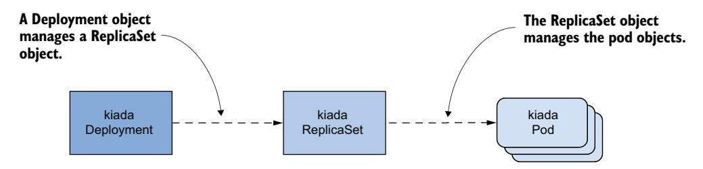
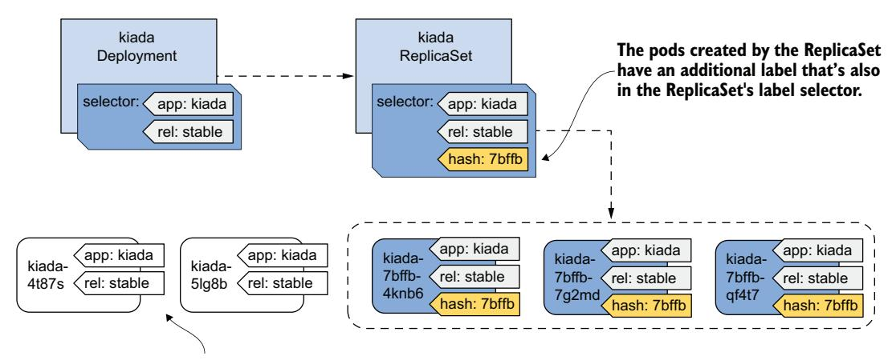
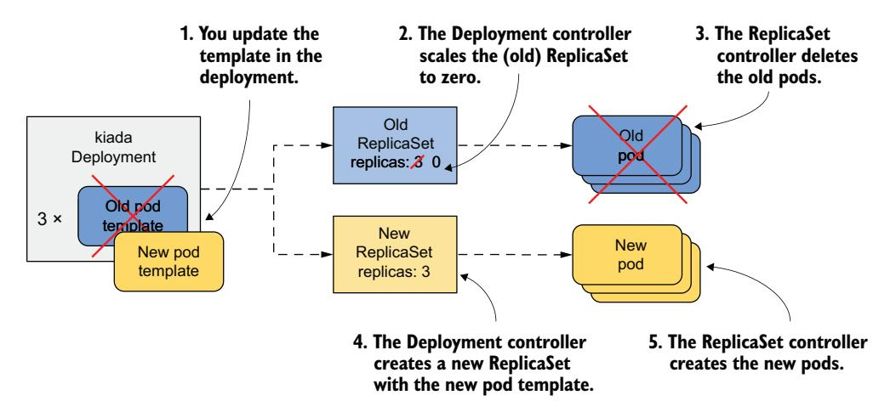
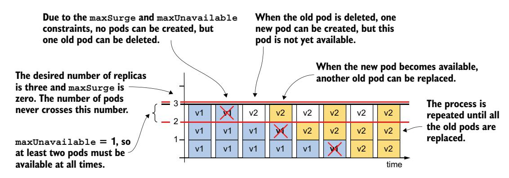
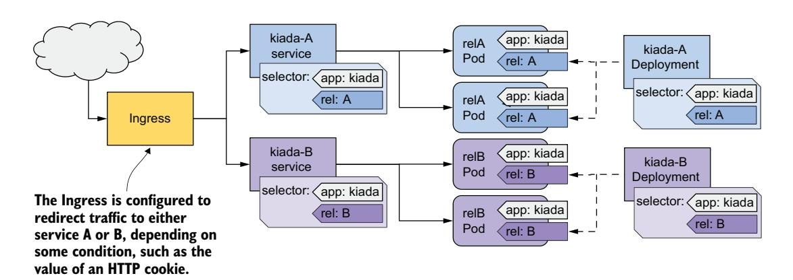
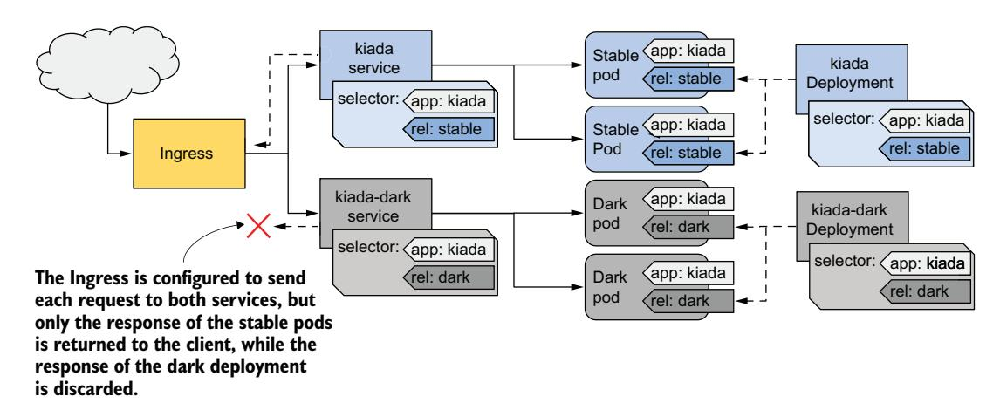

# 第 15 章 使用 Deployment 自动化应用更新

!!! tip "本章涵盖"

    - 使用 Deployment 对象部署无状态工作负载
    - Deployment 的水平扩缩容
    - 如何声明式地更新工作负载
    - 防止发布有缺陷的工作负载
    - 各种部署策略

在前一章中，你学习了如何通过 ReplicaSet 部署 Pod。然而，工作负载很少以这种方式部署，因为 ReplicaSet 不提供无缝更新 Pod 的功能。这个功能由 Deployment 对象类型提供。在本章结束时，Kiada 套件中的三个服务都将拥有各自的 Deployment 对象。

在开始之前，请确保 Kiada 套件的 Pod、Service 和其他对象已经存在于你的集群中。如果你完成了前一章中的练习，它们应该已经存在了。如果没有，你可以通过创建 kiada 命名空间并应用 Chapter15/SETUP/ 目录下的所有清单文件来创建它们，使用以下命令：

```bash
$ kubectl apply -f SETUP -R
```

!!! note ""

    本章的代码文件可在 https://github.com/luksa/kubernetes-in-action-2nd-edition/tree/master/Chapter15 获取。

## 15.1 介绍 Deployment

工作负载通常通过创建 Deployment 对象来部署到 Kubernetes。Deployment 对象并不直接管理 Pod 对象，而是通过在创建 Deployment 时自动生成的 ReplicaSet 对象来进行管理。如图 15.1 所示，Deployment 控制 ReplicaSet，而 ReplicaSet 又控制各个 Pod。



图 15.1 Deployment、ReplicaSet 和 Pod 之间的关系

Deployment 允许你以声明方式更新应用程序，这意味着你不再需要手动执行一系列操作来将一组 Pod 替换为运行更新版应用程序的 Pod，只需更新 Deployment 对象中的配置，然后让 Kubernetes 自动完成更新即可。

与 ReplicaSet 一样，你在 Deployment 中指定 Pod 模板、期望的副本数和标签选择器。基于此 Deployment 创建的 Pod 彼此完全相同，是可以互换的。出于这个和其他原因，Deployment 主要用于无状态工作负载，但你也可以使用它来运行有状态工作负载的单个实例。然而，由于没有内置方法来防止用户将 Deployment 扩展到多个实例，当多个副本同时运行时，应用程序本身必须确保只有一个实例处于活动状态。

!!! note ""

    要运行多副本的有状态工作负载，**StatefulSet** 是更好的选择。你将在下一章中学习它们。

### 15.1.1 创建 Deployment

在本节中，你将用 Deployment 替换 kiada ReplicaSet。使用以下命令删除 ReplicaSet 但保留 Pod：

```bash
$ kubectl delete rs kiada --cascade=orphan
```

让我们看看你需要在 Deployment 的 spec 部分中包含哪些内容，以及它与 ReplicaSet 的 spec 有何不同。

#### 介绍 Deployment 的 Spec

Deployment 对象的 spec 部分与 ReplicaSet 的没有太大区别。如表 15.1 所示，主要字段与 ReplicaSet 中的相同，只多了一个字段。

表 15.1 Deployment spec 部分需要指定的主要字段

| 字段名 | 描述 |
|--------|------|
| replicas | 期望的副本数。当你创建 Deployment 对象时，Kubernetes 会根据 Pod 模板创建此数量的 Pod。在删除 Deployment 之前，将保持相同数量的 Pod。 |
| selector | 标签选择器，包含 matchLabels 子字段中的标签映射或 matchExpressions 子字段中的标签选择器要求列表。匹配标签选择器的 Pod 被视为该 Deployment 的一部分。 |
| template | Deployment Pod 的 Pod 模板。当需要创建新的 Pod 时，将使用此模板创建对象。 |
| strategy | 更新策略，定义当你更新 Pod 模板时，如何替换此 Deployment 中的 Pod。 |

replicas、selector 和 template 字段的作用与 ReplicaSet 中的作用相同。在额外的 strategy 字段中，你可以配置 Kubernetes 在更新此 Deployment 时将采用的更新策略。

#### 从零开始创建 Deployment 清单

创建新的 Deployment 清单时，我们大多数人通常会复制现有的清单文件并进行修改。但是，如果你手头没有现成的清单文件，有一种巧妙的方法可以从零开始创建清单文件。

你可能还记得，在第 3 章中你首次使用以下命令创建了一个 Deployment：

```bash
$ kubectl create deployment kiada --image=luksa/kiada:0.1
```

但由于此命令直接创建对象而不是清单文件，因此并不完全是你想要的。不过，你可能还记得在第 5 章中提到，如果你想创建对象清单而不将其提交到 API，可以向 `kubectl create` 命令传递 `--dry-run=client` 和 `-o yaml` 选项。因此，要创建 Deployment 清单文件的粗略版本，你可以使用：

```bash
$ kubectl create deployment my-app --image=my-image \
  --dry-run=client -o yaml > deploy.yaml
```

然后可以编辑清单文件进行最后的修改，例如添加其他容器和卷，或更改现有容器的定义。不过，由于你已经有了 kiada ReplicaSet 的清单文件，最快的选择是将其转换为 Deployment 清单。

#### 从 Pod 或 ReplicaSet 清单创建 Deployment 清单

如果你已经有了 ReplicaSet 清单，创建 Deployment 清单就很简单了。你只需要将 `rs.kiada.versionLabel.yaml` 文件复制到 `deploy.kiada.yaml`，然后编辑它将 `kind` 字段从 ReplicaSet 改为 Deployment。顺便也将副本数从两个改为三个。你的 Deployment 清单应如下所示。

清单 15.1 kiada Deployment 对象清单

```yaml
apiVersion: apps/v1
kind: Deployment                          # 对象类型是 Deployment，而不是 ReplicaSet
metadata:
  name: kiada
spec:
  replicas: 3                             # 你希望 Deployment 运行三个副本
  selector:
    matchLabels:                          # 标签选择器与你在前一章
      app: kiada                          # 创建的 kiada ReplicaSet
      rel: stable                         # 中的选择器相匹配
  template:
    metadata:
      labels:                             # Pod 模板也与
        app: kiada                        # ReplicaSet 中
        rel: stable                       # 的模板相匹配
        ver: '0.5'
    spec:
      ...
```

#### 创建和查看 Deployment 对象

要从清单文件创建 Deployment 对象，使用 `kubectl apply` 命令。你可以使用常用命令如 `kubectl get deployment` 和 `kubectl describe deployment` 来获取你创建的 Deployment 的信息。例如：

```bash
$ kubectl get deploy kiada
NAME    READY   UP-TO-DATE   AVAILABLE   AGE
kiada   3/3     3            3           25s
```

!!! note ""

    deployment 的简写是 deploy。

`kubectl get` 命令显示的 Pod 数量信息是从 Deployment 对象 status 部分中的 `readyReplicas`、`replicas`、`updatedReplicas` 和 `availableReplicas` 字段读取的。使用 `-o yaml` 选项可以查看完整状态。

!!! note ""

    使用 `kubectl get deploy` 的宽输出选项（`-o wide`）可以显示标签选择器以及 Pod 模板中使用的容器名称和镜像。

如果你只想知道 Deployment 发布是否成功，也可以使用以下命令：

```bash
$ kubectl rollout status deployment kiada
```

```text
Waiting for deployment "kiada" rollout to finish: 0 of 3 updated replicas are available...
Waiting for deployment "kiada" rollout to finish: 1 of 3 updated replicas are available...
Waiting for deployment "kiada" rollout to finish: 2 of 3 updated replicas are available...
deployment "kiada" successfully rolled out
```

如果在创建 Deployment 后立即运行此命令，你可以跟踪 Pod 部署的进度。根据命令的输出，该 Deployment 已成功发布了三个 Pod 副本。

!!! tip ""

    如果你在 shell 脚本中创建 Deployment 并且需要等待它就绪后再运行其他命令，可以使用命令 `kubectl wait --for condition=Available deployment/deployment-name`。

现在列出属于该 Deployment 的 Pod。它使用的选择器与前一章的 ReplicaSet 相同，所以你应该能看到三个 Pod，对吗？要验证这一点，使用标签选择器 `app=kiada,rel=stable` 列出 Pod，如下所示：

```bash
$ kubectl get pods -l app=kiada,rel=stable
```

```text
NAME                                   READY   STATUS      RESTARTS   AGE
kiada-4t87s                            2/2     Running     0          16h
kiada-5lg8b                            2/2     Running     0          16h
kiada-7bffb9bf96-4knb6                 2/2     Running     0          6m
kiada-7bffb9bf96-7g2md                 2/2     Running     0          6m
kiada-7bffb9bf96-qf4t7                 2/2     Running     0          6m
```

令人惊讶的是，匹配选择器的 Pod 有五个。前两个是由前一章的 ReplicaSet 创建的，而后三个是由 Deployment 创建的。虽然 Deployment 中的标签选择器匹配了这两个已有的 Pod，但它们并没有像你预期的那样被接管。为什么？

在本章开头，我解释了 Deployment 不直接控制 Pod，而是将此任务委托给底层的 ReplicaSet。让我们快速查看一下这个 ReplicaSet：

```bash
$ kubectl get rs
NAME                 DESIRED   CURRENT   READY   AGE
kiada-7bffb9bf96     3         3         3       17m
```

你会注意到 ReplicaSet 的名称不仅仅是 `kiada`——它还包含一个字母数字后缀（`-7bffb9bf96`），类似于 Pod 的名称，似乎是随机生成的。让我们搞清楚它是什么。让我们更仔细地查看一下 ReplicaSet：

```bash
$ kubectl describe rs kiada
```

```text
Name:         kiada-7bffb9bf96
Namespace:    kiada
Selector:     app=kiada,pod-template-hash=7bffb9bf96,rel=stable       # ReplicaSet 的标签选择器与 Deployment 中的不完全相同
Labels:       app=kiada
              pod-template-hash=7bffb9bf96                            # 在 ReplicaSet 和 Pod 的标签中都出现了
              rel=stable                                              # 一个额外的 pod-template-hash 标签
              ver=0.5
Annotations:  deployment.kubernetes.io/desired-replicas: 3
              deployment.kubernetes.io/max-replicas: 4
              deployment.kubernetes.io/revision: 1
Controlled By:  Deployment/kiada                                      # 此 ReplicaSet 由 kiada Deployment 拥有和控制
Replicas:       3 current / 3 desired
Pods Status:    3 Running / 0 Waiting / 0 Succeeded / 0 Failed
Pod Template:
  Labels:       app=kiada
                pod-template-hash=7bffb9bf96
                rel=stable
                ver=0.5
  Containers:
   ...
```

`Controlled By` 行表示此 ReplicaSet 是由 kiada Deployment 创建并拥有和控制的。你会注意到 Pod 模板、选择器和 ReplicaSet 本身包含一个额外的标签键 `pod-template-hash`，你从未在 Deployment 对象中定义过它。此标签的值与 ReplicaSet 名称的最后部分匹配。这个额外的标签就是为什么两个已有 Pod 没有被此 ReplicaSet 接管的原因。列出所有 Pod 及其所有标签，看看它们有何不同：

```bash
$ kubectl get pods -l app=kiada,rel=stable --show-labels
```

```text
NAME                           ...   LABELS
kiada-4t87s                    ...   app=kiada,rel=stable,ver=0.5     # 之前存在的两个 Pod
kiada-5lg8b                    ...   app=kiada,rel=stable,ver=0.5     # 没有 pod-template-hash 标签
kiada-7bffb9bf96-4knb6         ...   app=kiada,pod-template-
                                        hash=7bffb9bf96,rel=stable,ver=0.5
kiada-7bffb9bf96-7g2md         ...   app=kiada,pod-template-          # Deployment 创建的三个 Pod
                                        hash=7bffb9bf96,rel=stable,ver=0.5
kiada-7bffb9bf96-qf4t7         ...   app=kiada,pod-template-          # 有 pod-template-hash 标签
                                        hash=7bffb9bf96,rel=stable,ver=0.5
```

如图 15.2 所示，当 ReplicaSet 被创建时，ReplicaSet 控制器找不到任何匹配标签选择器的 Pod，因此它创建了三个新的 Pod。如果你在创建 Deployment 之前将 `pod-template-hash` 标签添加到了两个已有 Pod 上，它们会被 ReplicaSet 接管。

`pod-template-hash` 标签的值不是随机的，而是根据 Pod 模板的内容计算出来的。由于 ReplicaSet 的名称使用了相同的值，因此名称取决于 Pod 模板的内容。由此可知，每次更改 Pod 模板时，都会创建一个新的 ReplicaSet。你将在第 15.2 节中了解更多相关内容，该节将解释 Deployment 的更新。



图 15.2 Deployment、ReplicaSet 中的标签选择器以及 Pod 中的标签

!!! warning ""

    虽然这些 Pod 的标签与 Deployment 中定义的标签选择器匹配，但由于它们不匹配 ReplicaSet 的标签选择器，所以被忽略了。

你现在可以删除不属于 Deployment 的两个 Kiada Pod。要做到这一点，使用 `kubectl delete` 命令，配合一个只选择具有 `app=kiada` 和 `rel=stable` 标签且不带 `pod-template-hash` 标签的 Pod 的标签选择器。完整的命令如下所示：

```bash
$ kubectl delete po -l 'app=kiada,rel=stable,!pod-template-hash'
```

#### 排查无法产生任何 Pod 的 Deployment

在某些情况下，创建 Deployment 时 Pod 可能不会出现。如果知道在哪里查找，这种情况下排查问题很容易。要亲自尝试，请应用清单文件 `deploy.where-are-the-pods.yaml`，它将创建一个名为 `where-are-the-pods` 的 Deployment 对象。你会发现此 Deployment 没有创建任何 Pod，尽管期望的副本数是三个。要排查问题，你可以使用 `kubectl describe` 查看 Deployment 对象。Deployment 的事件没有显示任何有用的信息，但其状态条件有：

```bash
$ kubectl describe deploy where-are-the-pods
```

```text
...
Conditions:
  Type            Status   Reason
  ----            ------   ------
  Progressing     True     NewReplicaSetCreated
  Available       False    MinimumReplicasUnavailable
  ReplicaFailure  True     FailedCreate            # ReplicaFailure 条件表示副本创建失败
```

`ReplicaFailure` 条件为 `True`，表示存在错误。错误的原因是 `FailedCreate`，这并没有太多含义。但是，如果你查看 Deployment 的 YAML 清单 status 部分中的条件，你会注意到 `ReplicaFailure` 条件的 `message` 字段会告诉你究竟发生了什么。另外，你也可以查看 ReplicaSet 及其事件来看到相同的消息，如下所示：

```bash
$ kubectl describe rs where-are-the-pods-67cbc77f88
```

```text
...
Events:
  Type     Reason        Age                   From                   Message
  ----     ------        ----                  ----                   -------
  Warning  FailedCreate  61s (x18 over 11m)    replicaset-controller  Error creating: pods
           "where-are-the-pods-67cbc77f88-" is forbidden: error looking up service account
           default/missing-service-account: serviceaccount "missing-service-account" not found
```

ReplicaSet 控制器无法创建 Pod 的原因有很多，但通常与用户权限有关。在这个例子中，ReplicaSet 控制器无法创建 Pod 是因为缺少 ServiceAccount。从这个练习中得出的最重要的结论是：如果在创建（或更新）Deployment 后 Pod 没有出现，你应该在底层的 ReplicaSet 中查找原因。

### 15.1.2 扩缩 Deployment

扩缩 Deployment 与扩缩 ReplicaSet 没有什么不同。当你扩缩 Deployment 时，Deployment 控制器所做的只是扩缩底层的 ReplicaSet，剩下的工作由 ReplicaSet 控制器完成，如图 15.3 所示。


图 15.3 扩缩 Deployment

#### 扩缩 Deployment

你可以通过使用 `kubectl edit` 命令编辑对象并更改 `replicas` 字段的值、更改清单文件中的值并重新应用，或者使用 `kubectl scale` 命令来扩缩 Deployment。例如，如下所示将 kiada Deployment 扩缩到五个副本：

```bash
$ kubectl scale deploy kiada --replicas 5
deployment.apps/kiada scaled
```

如果你列出 Pod，你会看到现在有五个 kiada Pod。如果你使用 `kubectl describe` 命令检查与 Deployment 关联的事件，你会看到 Deployment 控制器已经扩缩了 ReplicaSet。

```bash
$ kubectl describe deploy kiada
```

```text
Events:
  Type    Reason             Age   From                   Message
  ----    ------             ----  ----                   -------
  Normal  ScalingReplicaSet  4s    deployment-controller  Scaled up replica set kiada-
                                                          7bffb9bf96 to 5
```

如果你使用 `kubectl describe rs kiada` 查看与 ReplicaSet 关联的事件，你会看到确实是 ReplicaSet 控制器创建了 Pod。

你学到的关于 ReplicaSet 扩缩容以及 ReplicaSet 控制器如何确保实际 Pod 数量始终等于期望副本数的所有知识，同样适用于通过 Deployment 部署的 Pod。

#### 扩缩由 Deployment 拥有的 ReplicaSet

你可能想知道当你扩缩一个由 Deployment 拥有和控制的 ReplicaSet 对象时会发生什么。让我们来找出答案。首先，通过运行以下命令开始观察 ReplicaSet：

```bash
$ kubectl get rs -w
```

现在在另一个终端中运行以下命令来扩缩 `kiada-7bffb9bf96` ReplicaSet：

```bash
$ kubectl scale rs kiada-7bffb9bf96 --replicas 7
replicaset.apps/kiada-7bffb9bf96 scaled
```

如果你查看第一个命令的输出，你会看到期望的副本数上升到七，但很快又恢复到五。这是因为 Deployment 控制器检测到 ReplicaSet 中的期望副本数不再与 Deployment 对象中的匹配，因此将其改回。

!!! note ""

    如果你对由另一个对象拥有的对象进行更改，你应该预料到你的更改会被管理该对象的控制器撤销。

根据 ReplicaSet 控制器是否在 Deployment 控制器撤销更改之前注意到了该更改，它可能已经创建了两个新的 Pod。但是当 Deployment 控制器随后将期望的副本数重置回五时，ReplicaSet 控制器删除了这些 Pod。

正如你所预期的，Deployment 控制器会撤销你对 ReplicaSet 所做的任何更改，而不仅仅是在扩缩时。即使你删除了 ReplicaSet 对象，Deployment 控制器也会重新创建它。你随时可以尝试一下。

#### 无意中扩缩 Deployment

在我们结束关于 Deployment 扩缩的这一节时，我需要警告你一种可能会无意中扩缩 Deployment 的情况。在你应用到集群的 Deployment 清单中，期望的副本数是三个。然后你使用 `kubectl scale` 命令将其更改为五个。想象一下在生产集群中做同样的事情（例如，因为你需要五个副本来处理应用程序正在接收的所有流量）。

然后你注意到忘记将 `app` 和 `rel` 标签添加到 Deployment 对象了。你把它们添加到了 Deployment 对象内部的 Pod 模板中，但没有添加到对象本身。这不会影响 Deployment 的运行，但你希望所有对象都有清晰的标签，所以你决定现在添加这些标签。你可以使用 `kubectl label` 命令，但你更愿意修复原始清单文件并重新应用它。这样，当你将来使用该文件创建 Deployment 时，它会包含你想要的标签。

要看看这种情况会发生什么，请应用清单文件 `deploy.kiada.labelled.yaml`。与原始清单文件 `deploy.kiada.yaml` 的唯一区别是添加到 Deployment 上的标签。如果在应用清单后列出 Pod，你会发现 Deployment 中不再有五个 Pod。有两个 Pod 已经被删除：

```bash
$ kubectl get pods -l app=kiada
```

```text
NAME         READY   STATUS        RESTARTS   AGE
kiada-...    2/2     Running       0          46m
kiada-...    2/2     Running       0          46m
kiada-...    2/2     Terminating   0          5m
kiada-...    2/2     Running       0          46m     # 有两个 Pod 正在被删除
kiada-...    2/2     Terminating   0          5m
```

要了解原因，请检查 Deployment 对象：

```bash
$ kubectl get deploy
NAME    READY   UP-TO-DATE   AVAILABLE   AGE
kiada   3/3     3            3           46m
```

Deployment 现在被配置为只有三个副本，而不是你应用清单之前的五个。然而，你从未打算更改副本数，只想向 Deployment 对象添加标签。那么，发生了什么？

应用清单文件更改了期望副本数的原因是，清单文件中的 `replicas` 字段被设置为 3。你可能会认为从更新的清单中删除此字段可以防止该问题，但事实上，这会使问题更糟。尝试应用不包含 `replicas` 字段的 `deploy.kiada.noReplicas.yaml` 清单文件，看看会发生什么。

如果你应用该文件，你将只剩下一个副本。这是因为当省略 `replicas` 字段时，Kubernetes API 会将该值设置为 1。即使你显式地将值设置为 `null`，效果也是一样的。

想象一下这种情况发生在你的生产集群中，当应用程序的负载非常高，需要几十个或数百个副本来处理负载时。像这个例子中的无害更新将严重中断服务。

你可以通过在创建 Deployment 对象时不在原始清单中指定 `replicas` 字段来防止这种情况。如果你忘记这样做，仍然可以通过运行以下命令来修复现有的 Deployment 对象：

```bash
$ kubectl apply edit-last-applied deploy kiada
```

此命令在文本编辑器中打开 Deployment 对象的 `kubectl.kubernetes.io/last-applied-configuration` 注解的内容，允许你删除 `replicas` 字段。当你保存文件并关闭编辑器时，Deployment 对象中的注解会被更新。从那时起，只要你不包含 `replicas` 字段，使用 `kubectl apply` 更新 Deployment 就不会再覆盖期望的副本数。

!!! note ""

    当你使用 `kubectl apply` 时，`kubectl.kubernetes.io/last-applied-configuration` 的值被用于计算需要对 API 对象进行的更改。

!!! tip ""

    为了避免每次重新应用清单文件时无意中扩缩 Deployment，请在创建对象时省略清单中的 `replicas` 字段。最初你只会得到一个副本，但你可以根据需要轻松扩缩 Deployment。

### 15.1.3 删除 Deployment

在我们讨论 Deployment 更新——Deployment 最重要的方面——之前，让我们快速看一下当你删除 Deployment 时会发生什么。在了解删除 ReplicaSet 时会发生什么之后，你可能已经知道，当你删除 Deployment 对象时，底层的 ReplicaSet 和 Pod 也会被删除。

#### 删除 Deployment 时保留 ReplicaSet 和 Pod

如果你想保留 Pod，可以使用 `kubectl delete` 命令并带上 `--cascade=orphan` 选项，就像对 ReplicaSet 一样。如果你对 Deployment 使用此方法，你会发现这不仅保留了 Pod，还保留了 ReplicaSet。Pod 仍然属于该 ReplicaSet 并由其控制。

#### 接管现有的 ReplicaSet 和 Pod

如果你重新创建 Deployment，它会接管现有的 ReplicaSet，前提是你在此期间没有更改 Deployment 的 Pod 模板。这是因为 Deployment 控制器发现已存在的 ReplicaSet 的名称与控制器本来会创建的 ReplicaSet 名称匹配。

## 15.2 更新 Deployment

在上一节中，你学习了 Deployment 的基础知识，可能没有看到使用 Deployment 而不是 ReplicaSet 的任何优势。这个优势只有在你更新 Deployment 中的 Pod 模板时才会显现。你可能还记得，对于 ReplicaSet，更新模板没有立竿见影的效果。更新后的模板只有在 ReplicaSet 控制器创建新 Pod 时才会使用。然而，当你更新 Deployment 中的 Pod 模板时，Pod 会立即被替换。

Kiada Pod 当前运行的是应用程序的 0.5 版本，你现在将其更新到 0.6 版本。你可以在目录 `Chapter15/kiada-0.6` 中找到此新版本的文件。你可以自己构建容器镜像，也可以使用我创建的镜像 `luksa/kiada:0.6`。

#### 介绍可用的更新策略

当你更新 Pod 模板以使用新的容器镜像时，Deployment 控制器会停止运行旧镜像的 Pod，并将其替换为新的 Pod。Pod 的替换方式取决于 Deployment 中配置的更新策略。在撰写本文时，Kubernetes 支持表 15.2 中描述的两种策略。

表 15.2 Deployment 支持的更新策略

| 策略类型 | 描述 |
|----------|------|
| Recreate | 在 Recreate 策略中，所有 Pod 同时被删除，然后，当它们的所有容器都结束后，新 Pod 同时被创建。在旧 Pod 正在终止而新 Pod 尚未就绪的短暂时间内，服务不可用。如果你的应用程序不允许同时运行旧版本和新版本，并且服务停机不是问题，请使用此策略。 |
| RollingUpdate | RollingUpdate 策略使旧 Pod 逐渐被移除并被新 Pod 替换。当一个 Pod 被删除时，Kubernetes 等待新 Pod 就绪，然后再删除下一个 Pod。这样，Pod 提供的服务在整个升级过程中保持可用。这是默认策略。 |

图 15.4 说明了两种策略之间的区别。它展示了每种策略下 Pod 随时间被替换的过程。

Recreate 策略没有配置选项，而 RollingUpdate 策略允许你配置 Kubernetes 一次替换多少个 Pod。你将在后面了解更多相关内容。


图 15.4 Recreate 与 RollingUpdate 策略的区别

### 15.2.1 Recreate 策略

Recreate 策略比 RollingUpdate 简单得多，所以我们首先介绍它。由于你没有在 Deployment 对象中指定策略，它默认为 RollingUpdate，因此你需要在触发更新之前更改它。

#### 配置 Deployment 使用 Recreate 策略

要配置 Deployment 使用 Recreate 更新策略，你必须在 Deployment 清单中包含以下清单中高亮显示的行。你可以在 `deploy.kiada.recreate.yaml` 文件中找到此清单。

清单 15.2 在 Deployment 中启用 Recreate 更新策略

```yaml
spec:
  strategy:
    type: Recreate          # 这是你在 Deployment 中启用 Recreate 更新策略的方式
  replicas: 3
  ...
```

你可以通过使用 `kubectl edit` 命令编辑 Deployment 对象，或者使用 `kubectl apply` 应用更新后的清单文件来添加这些行。由于此更改不影响 Pod 模板，因此不会触发更新。更改 Deployment 的标签、注解或期望的副本数也不会触发更新。

#### 使用 kubectl set image 更新容器镜像

要将 Pod 更新到新版本的 Kiada 容器镜像，你需要更新 Pod 模板中 kiada 容器定义内的 `image` 字段。你可以通过 `kubectl edit` 或 `kubectl apply` 更新清单来实现，但对于简单的镜像更改，你也可以使用 `kubectl set image` 命令。通过此命令，可以更改任何包含容器的 API 对象中任何容器的镜像名称。这适用于 Deployment、ReplicaSet，甚至 Pod。例如，你可以使用以下命令将 kiada Deployment 中的 kiada 容器更新为使用 `luksa/kiada:0.6` 容器镜像：

```bash
$ kubectl set image deployment kiada kiada=luksa/kiada:0.6
```

但是，由于你的 Deployment 中的 Pod 模板还在 Pod 标签中指定了应用程序版本，更改镜像而不更改标签值会导致不一致。

#### 使用 kubectl patch 更新容器镜像和标签

要同时更改镜像名称和标签值，你可以使用 `kubectl patch` 命令，它允许你更新多个清单字段，而无需手动编辑清单或应用整个清单文件。要更新镜像名称和标签值，你可以运行以下命令：

```bash
$ kubectl patch deploy kiada --patch '{"spec": {"template": {"metadata":
{"labels": {"ver": "0.6"}}, "spec": {"containers": [{"name": "kiada",
"image": "luksa/kiada:0.6"}]}}}}'
```

这个命令你可能难以解析，因为补丁是以单行 JSON 字符串的形式给出的。在这个字符串中，你会找到一个只包含你想更改字段的部分 Deployment 清单。如果你以多行 YAML 字符串指定补丁，会更加清晰。完整的命令如下所示：

```bash
$ kubectl patch deploy kiada --patch '
spec:
  template:
    metadata:
      labels:
        ver: "0.6"
    spec:
      containers:
      - name: kiada
        image: luksa/kiada:0.6'     # 注意此行末尾的单引号
```

!!! note ""

    你也可以将这个部分清单写入文件，并使用 `--patch-file` 代替 `--patch`。

现在运行其中一个 `kubectl patch` 命令来更新 Deployment，或者应用清单文件 `deploy.kiada.0.6.recreate.yaml` 以获得相同的结果。

#### 观察更新过程中 Pod 状态的变化

更新 Deployment 后，立即重复运行以下命令以观察 Pod 发生的情况：

```bash
$ kubectl get po -l app=kiada -L ver
```

此命令列出 kiada Pod 并在 VER 列中显示其版本标签的值。你会注意到所有这些 Pod 的状态同时变为 Terminating：

```text
NAME                   READY   STATUS        RESTARTS   AGE     VER
kiada-7bffb9bf96-7w92k 0/2     Terminating   0          3m38s   0.5
kiada-7bffb9bf96-h8wnv 0/2     Terminating   0          3m38s   0.5
kiada-7bffb9bf96-xgb6d 0/2     Terminating   0          3m38s   0.5
```

Pod 很快消失，但立即被运行新版本的 Pod 替换：

```text
NAME                   READY   STATUS              RESTARTS   AGE   VER
kiada-5d5c5f9d76-5pghx 0/2     ContainerCreating   0          1s    0.6
kiada-5d5c5f9d76-qfkts 0/2     ContainerCreating   0          1s    0.6
kiada-5d5c5f9d76-vkdrl 0/2     ContainerCreating   0          1s    0.6    # 这些 Pod 运行新版本的应用程序
```

几秒钟后，所有新 Pod 就绪。整个过程非常快，但你可以根据需要重复多次。通过应用 `deploy.kiada.recreate.yaml` 文件中先前版本的清单来回滚 Deployment，等待 Pod 被替换，然后通过再次应用 `deploy.kiada.0.6.recreate.yaml` 文件更新到 0.6 版本。

#### 理解使用 Recreate 策略的更新如何影响服务可用性

除了观察 Pod 列表外，你还可以在更新进行时尝试通过 Ingress 或 Gateway 在你的 web 浏览器中访问服务，如第 12 章和第 13 章所述。

你会注意到短暂的时间间隔内，Ingress 代理返回状态码 `503 Service Temporarily Unavailable`。如果你尝试使用集群内部 IP 直接访问服务，你会发现在这段时间内连接被拒绝。

#### 理解 Deployment 与其 ReplicaSet 之间的关系

当你列出 Pod 时，你会注意到运行 0.5 版本的 Pod 的名称与运行 0.6 版本的 Pod 不同。旧 Pod 的名称以 `kiada-7bffb9bf96` 开头，而新 Pod 的名称以 `kiada-5d5c5f9d76` 开头。你可能还记得，由 ReplicaSet 创建的 Pod 的名称来自该 ReplicaSet。名称的变化表明这些新 Pod 属于一个不同的 ReplicaSet。列出 ReplicaSet 以确认这一点，如下所示：

```bash
$ kubectl get rs -L ver
```

```text
NAME                 DESIRED   CURRENT   READY   AGE   VER
kiada-5d5c5f9d76     3         3         3       13m   0.6    # 这是管理运行新应用程序版本 Pod 的 ReplicaSet
kiada-7bffb9bf96     0         0         0       16m   0.5    # 这是管理旧版本 Pod 的 ReplicaSet，现在没有 Pod
```

!!! note ""

    你在 Deployment 的 Pod 模板中指定的标签也会应用于 ReplicaSet。因此，如果你添加了一个包含应用程序版本号的标签，你可以在列出 ReplicaSet 时看到版本。这样，你可以轻松区分不同的 ReplicaSet，因为通过名称无法做到这一点。

当你最初创建 Deployment 时，只创建了一个 ReplicaSet，所有 Pod 都属于它。当你更新 Deployment 时，创建了一个新的 ReplicaSet。现在，此 Deployment 的所有 Pod 都由这个 ReplicaSet 控制，如图 15.5 所示。



图 15.5 更新 Deployment

#### 理解 Deployment 的 Pod 如何从一个 ReplicaSet 过渡到另一个

如果你在触发更新时一直在观察 ReplicaSet，你会看到以下进程。一开始，只有旧的 ReplicaSet 存在：

```text
NAME              DESIRED   CURRENT   READY   AGE   VER
kiada-7bffb9bf96  3         3         3       16m   0.5    # 这是唯一的 ReplicaSet，所有三个 Pod 都是它的一部分
```

然后 Deployment 控制器将该 ReplicaSet 的副本数缩减到零，导致 ReplicaSet 控制器删除所有 Pod：

```text
NAME              DESIRED   CURRENT   READY   AGE   VER
kiada-7bffb9bf96  0         0         0       16m   0.5    # 所有 Pod 计数都为零
```

接下来，Deployment 控制器创建新的 ReplicaSet 并将其配置为三个副本：

```text
NAME              DESIRED   CURRENT   READY   AGE   VER
kiada-5d5c5f9d76  3         0         0       0s    0.6    # 期望副本数是三个，但还没有 Pod
kiada-7bffb9bf96  0         0         0       16m   0.5    # 旧的 ReplicaSet 仍然在这里，但没有 Pod
```

ReplicaSet 控制器创建三个新 Pod，如 CURRENT 列中的数字所示。当这些 Pod 中的容器启动并开始接受连接时，READY 列中的值也变为三：

```text
NAME              DESIRED   CURRENT   READY   AGE   VER
kiada-5d5c5f9d76  3         3         0       1s    0.6    # 有三个副本，但还没有就绪
kiada-7bffb9bf96  0         0         0       16m   0.5    # 它们片刻之后就会就绪
```

!!! note ""

    你可以通过查看与 Deployment 对象和两个 ReplicaSet 关联的事件来了解 Deployment 控制器和 ReplicaSet 控制器做了什么。

更新现已完成。如果你在 web 浏览器中打开 Kiada 服务，你应该会看到更新后的版本。在右下角，你会看到四个框，指示处理浏览器对每个 HTML、CSS、JavaScript 和主图片文件请求的 Pod 的版本。当你执行下一节中到 0.7 版本的滚动更新时，这些框将会很有用。

### 15.2.2 RollingUpdate 策略

与 Recreate 策略相关的服务中断通常是不可接受的。这就是为什么 Deployment 中的默认策略是 RollingUpdate。当你使用此策略时，Pod 会逐渐被替换，通过缩减旧 ReplicaSet 并同时将新 ReplicaSet 扩展相同数量的副本。Service 永远不会没有 Pod 来转发流量（图 15.6）。


图 15.6 滚动更新期间 ReplicaSet、Pod 和 Service 的变化

#### 配置 Deployment 使用 RollingUpdate 策略

要配置 Deployment 使用 RollingUpdate 更新策略，你必须设置其 `strategy` 字段，如下面的清单所示。你可以在文件 `deploy.kiada.0.7.rollingUpdate.yaml` 中找到此清单。

清单 15.3 在 Deployment 中启用 **RollingUpdate** 策略

```yaml
apiVersion: apps/v1
kind: Deployment
metadata:
  name: kiada
spec:
  strategy:
    type: RollingUpdate              # 通过此字段启用 RollingUpdate 策略
    rollingUpdate:
      maxSurge: 0                    # 策略的参数在此处配置
      maxUnavailable: 1              # 这两个参数将在后面解释
  minReadySeconds: 10
  replicas: 3
  selector:
    ...
```

在 `strategy` 部分中，`type` 字段将策略设置为 `RollingUpdate`，而 `rollingUpdate` 子部分中的 `maxSurge` 和 `maxUnavailable` 参数配置了更新应如何执行。你可以省略整个子部分并只设置 `type`，但由于 `maxSurge` 和 `maxUnavailable` 参数的默认值使得更新过程难以解释，你将它们设置为清单中所示的值，以便更容易理解更新过程。现在不必担心这两个参数，因为它们稍后会被解释。

你可能注意到清单 15.3 中 Deployment 的 spec 还包含了 `minReadySeconds` 字段。虽然此字段不是更新策略的一部分，但它会影响更新的进展速度。通过将此字段设置为 10，你将能够更好地跟踪滚动更新的进程。你将在本章末尾了解这个属性的作用。

#### 在清单中更新镜像名称

除了在 Deployment 清单中设置策略和 `minReadySeconds` 外，我们还将镜像名称设置为 `luksa/kiada:0.7` 并更新版本标签，这样当你应用此清单文件时，更新会立即触发。这是为了表明你可以在一次 `kubectl apply` 操作中更改策略并触发更新。你不需要事先更改策略才能使其在更新中被使用。

#### 触发更新并观察新版本的发布

要启动滚动更新，请应用清单文件 `deploy.kiada.0.7.rollingUpdate.yaml`。你可以使用 `kubectl rollout status` 命令跟踪发布进度，但它只显示以下内容：

```bash
$ kubectl rollout status deploy kiada
```

```text
Waiting for deploy "kiada" rollout to finish: 1 out of 3 new replicas have been updated...
Waiting for deploy "kiada" rollout to finish: 2 out of 3 new replicas have been updated...
Waiting for deploy "kiada" rollout to finish: 2 of 3 updated replicas are available...
deployment "kiada" successfully rolled out
```

要确切了解 Deployment 控制器如何执行更新，最好查看底层 ReplicaSet 的状态如何变化。首先，版本 0.6 的 ReplicaSet 运行所有三个 Pod。版本 0.7 的 ReplicaSet 尚不存在。先前版本 0.5 的 ReplicaSet 也在那里，但让我们忽略它，因为它不参与此次更新。0.6 ReplicaSet 的初始状态如下：

```text
NAME              DESIRED   CURRENT   READY   AGE   VER
kiada-5d5c5f9d76  3         3         3       53m   0.6    # 所有三个 Pod 都由 0.6 ReplicaSet 管理
```

当更新开始时，运行版本 0.6 的 ReplicaSet 被缩减一个 Pod，而版本 0.7 的 ReplicaSet 被创建并配置为运行一个副本：

```text
NAME              DESIRED   CURRENT   READY   AGE   VER
kiada-58df67c6f6  1         1         0       2s    0.7    # 版本 0.7 的副本出现，配置为运行一个副本
kiada-5d5c5f9d76  2         2         2       53m   0.6    # 版本 0.6 的副本现在运行两个副本
```

因为旧 ReplicaSet 已经被缩减，ReplicaSet 控制器已将其中一个旧 Pod 标记为删除。此 Pod 正在终止且不再被视为就绪，而另外两个旧 Pod 接管了所有服务流量。属于新 ReplicaSet 的 Pod 刚刚启动，因此尚未就绪。Deployment 控制器等待此新 Pod 就绪后再继续更新过程。当这发生时，ReplicaSet 的状态如下：

```text
NAME              DESIRED   CURRENT   READY   AGE   VER
kiada-58df67c6f6  1         1         1       6s    0.7    # 新 Pod 已就绪并正在接收流量
kiada-5d5c5f9d76  2         2         2       53m   0.6
```

此时，流量再次由三个 Pod 处理。两个仍在运行版本 0.6，一个运行版本 0.7。因为你将 `minReadySeconds` 设置为 10，Deployment 控制器在继续更新之前等待这些秒数。然后它将旧 ReplicaSet 缩减一个副本，同时将新 ReplicaSet 扩展一个副本。现在 ReplicaSet 如下所示：

```text
NAME              DESIRED   CURRENT   READY   AGE   VER
kiada-58df67c6f6  2         2         1       16s   0.7    # 新 ReplicaSet 被扩展一个
kiada-5d5c5f9d76  1         1         1       53m   0.6    # 旧 ReplicaSet 被缩减一个
```

服务负载现在由一个旧 Pod 和一个新 Pod 处理。第二个新 Pod 尚未就绪，因此尚未接收流量。Pod 就绪十秒后，Deployment 控制器对两个 ReplicaSet 进行最终更改。再次将旧 ReplicaSet 缩减一个，将期望副本数降为零。新 ReplicaSet 被扩展，使期望副本数为三：

```text
NAME              DESIRED   CURRENT   READY   AGE   VER
kiada-58df67c6f6  3         3         2       29s   0.7    # 新 ReplicaSet 被扩缩到最终副本数
kiada-5d5c5f9d76  0         0         0       54m   0.6    # 旧 ReplicaSet 现在被缩放到零
```

最后一个剩余的旧 Pod 被终止，不再接收流量。所有客户端流量现在由新版本的应用程序处理。当第三个新 Pod 就绪时，滚动更新完成。

在任何时候，服务都没有不可用。始终有至少两个副本处理流量。你可以通过回滚到旧版本并再次触发更新来直接观察此行为。要做到这一点，重新应用 `deploy.kiada.0.6.recreate.yaml` 清单文件。由于此清单使用 Recreate 策略，所有 Pod 都会立即被删除，然后版本 0.6 的 Pod 同时启动。

在你再次触发到 0.7 的更新之前，运行以下命令从客户端的角度跟踪更新过程：

```bash
$ kubectl run -it --rm --restart=Never kiada-client --image curlimages/curl \
    - sh -c \
  'while true; do curl -s http://kiada | grep "Request processed by"; done'
```

当你运行此命令时，你创建了一个名为 `kiada-client` 的 Pod，它使用 curl 持续向 kiada 服务发送请求。它不打印整个响应，而只打印带有版本号以及 Pod 和节点名称的那一行。

当客户端正在向服务发送请求时，通过重新应用清单文件 `deploy.kiada.0.7.rollingUpdate.yaml` 触发另一个更新。观察 curl 命令的输出在滚动更新期间如何变化。以下是一个简短的摘要：

```text
Request processed by Kiada 0.6 running in pod "kiada-5d5c5f9d76-qfx9p"     # 最初，所有请求都由运行版本 0.6 的 Pod 处理
Request processed by Kiada 0.6 running in pod "kiada-5d5c5f9d76-22zr7"
...
Request processed by Kiada 0.6 running in pod "kiada-5d5c5f9d76-22zr7"
Request processed by Kiada 0.7 running in pod "kiada-58df67c6f6-468bd"     # 然后，一些请求由运行版本 0.7 的 Pod 处理，
Request processed by Kiada 0.6 running in pod "kiada-5d5c5f9d76-6wb87"     # 一些由运行旧版本的 Pod 处理
Request processed by Kiada 0.7 running in pod "kiada-58df67c6f6-468bd"
Request processed by Kiada 0.7 running in pod "kiada-58df67c6f6-468bd"
...
```

```text
Request processed by Kiada 0.7 running in pod "kiada-58df67c6f6-468bd"
Request processed by Kiada 0.7 running in pod "kiada-58df67c6f6-fjnpf"     # 最终，所有请求都由运行新版本的 Pod 处理
Request processed by Kiada 0.7 running in pod "kiada-58df67c6f6-lssdp"
```

在滚动更新期间，一些客户端请求由运行版本 0.7 的新 Pod 处理，而其他则由运行版本 0.6 的 Pod 处理。由于新 Pod 的份额不断增加，越来越多的响应来自新版本的应用程序。当更新完成时，响应仅来自新版本。

### 15.2.3 配置一次替换多少个 Pod

在上一节所示的滚动更新中，Pod 被逐个替换。你可以通过更改滚动更新策略的参数来改变这一点。

#### 介绍 maxSurge 和 maxUnavailable 配置选项

影响滚动更新期间 Pod 替换速度的两个参数是 `maxSurge` 和 `maxUnavailable`，我在介绍 RollingUpdate 策略时简要提到过它们。你可以在 Deployment 的 `strategy` 字段的 `rollingUpdate` 子部分中设置这些参数，如下面的清单所示。

清单 15.4 指定 **rollingUpdate** 策略的参数

```yaml
spec:
  strategy:
    type: RollingUpdate
    rollingUpdate:
      maxSurge: 0
      maxUnavailable: 1      # 滚动更新策略的参数
```

表 15.3 解释了每个参数的作用。

表 15.3 关于 **maxSurge** 和 **maxUnavailable** 配置选项

| 属性 | 描述 |
|------|------|
| maxSurge | 滚动更新期间 Deployment 可以拥有的超出期望副本数的最大 Pod 数量。该值可以是绝对数字，也可以是期望副本数的百分比。 |
| maxUnavailable | 滚动更新期间相对于期望副本数可以不可用的最大 Pod 数量。该值可以是绝对数字，也可以是期望副本数的百分比。 |

关于这两个参数最重要的一点是，它们的值是相对于期望副本数的。例如，如果期望副本数是三，`maxUnavailable` 是一，当前 Pod 数是五，则必须可用的 Pod 数是二，而不是四。

让我们看看这两个参数如何影响 Deployment 控制器执行更新。通过分别讨论可能的组合来进行说明是最佳方式。

#### maxSurge=0, maxUnavailable=1

当你在上一节中执行滚动更新时，期望副本数是三，`maxSurge` 是零，`maxUnavailable` 是一。图 15.7 显示了 Pod 随时间更新的过程。



图 15.7 maxSurge 为 0、maxUnavailable 为 1 时的 Pod 替换过程

因为 `maxSurge` 被设置为 0，Deployment 控制器不被允许添加超出期望副本数的 Pod。因此，与 Deployment 关联的 Pod 从未超过三个。因为 `maxUnavailable` 被设置为 1，Deployment 控制器必须保持可用副本数在两个以上，因此一次只能删除一个旧 Pod。它不能删除下一个 Pod，直到替换被删除 Pod 的新 Pod 变得可用。

#### maxSurge=1, maxUnavailable=0

如果你将两个参数反过来，将 `maxSurge` 设置为 1，`maxUnavailable` 设置为 0，会发生什么？如果期望副本数是三，在整个过程中必须至少有 3 个副本可用。因为 `maxSurge` 参数设置为 1，总的 Pod 数不应超过四个。图 15.8 显示了更新如何展开。

首先，Deployment 控制器不能缩减旧 ReplicaSet，因为这会导致可用 Pod 数量低于期望副本数。但控制器可以将新 ReplicaSet 扩展一个 Pod，因为 `maxSurge` 参数允许 Deployment 拥有超出期望副本数的一个 Pod。

此时，Deployment 有三个旧 Pod 和一个新 Pod。当新 Pod 可用时，流量由所有四个 Pod 处理片刻。Deployment 控制器现在可以将旧 ReplicaSet 缩减一个 Pod，因为仍然有三个 Pod 可用。然后控制器可以扩展新 ReplicaSet。重复此过程，直到新 ReplicaSet 有三个 Pod 而旧 ReplicaSet 为零。


图 15.8 maxSurge 为 1、maxUnavailable 为 0 时的 Pod 替换过程

在整个更新过程中，期望数量的 Pod 始终可用，且总 Pod 数量从未超过期望副本数一个以上。

!!! note ""

    你不能将 `maxSurge` 和 `maxUnavailable` 都设置为零，因为这将不允许 Deployment 超过期望副本数或删除 Pod，因为一个 Pod 将不可用。

#### maxSurge=1, maxUnavailable=1

如果你将 `maxSurge` 和 `maxUnavailable` 都设置为 1，Deployment 中的总副本数最多可以是四个，且必须始终有两个可用。图 15.9 显示了随时间的进展。


图 15.9 maxSurge 和 maxUnavailable 都为 1 时的 Pod 替换过程

Deployment 控制器立即将新 ReplicaSet 扩展一个副本，将旧 ReplicaSet 缩减相同的量。一旦旧 ReplicaSet 报告它已将一个旧 Pod 标记为删除，Deployment 控制器将新 ReplicaSet 再扩展一个 Pod。

每个 ReplicaSet 现在配置了两个副本。旧 ReplicaSet 中的两个 Pod 仍在运行且可用，而两个新 Pod 正在启动。当一个新 Pod 可用时，另一个旧 Pod 被删除，另一个新 Pod 被创建。此过程持续到所有旧 Pod 被替换。总的 Pod 数量从未超过四个，且在任何给定时间至少有 2 个 Pod 可用。

!!! note ""

    由于 Deployment 控制器不自己统计 Pod，而是从底层 ReplicaSet 的状态获取 Pod 数量信息，并且由于 ReplicaSet 从不计算正在终止的 Pod，如果你计算正在终止的 Pod，则总的 Pod 数量实际上可能超过四个。

#### 使用更高的 maxSurge 和 maxUnavailable 值

如果 `maxSurge` 设置为大于一的值，Deployment 控制器被允许一次添加更多的 Pod。如果 `maxUnavailable` 大于一，控制器被允许删除更多的 Pod。

#### 使用百分比

你可以将 `maxSurge` 和 `maxUnavailable` 设置为期望副本数的百分比，而不是绝对数字。控制器通过向上取整计算绝对 `maxSurge` 数，通过向下取整计算 `maxUnavailable`。

考虑 `replicas` 设置为 10，`maxSurge` 和 `maxUnavailable` 设置为 25% 的情况。如果你计算绝对值，`maxSurge` 变为 3，`maxUnavailable` 变为 2。因此，在更新过程中，Deployment 最多可以有 13 个 Pod，其中至少有 8 个始终可用并处理流量。

!!! note ""

    `maxSurge` 和 `maxUnavailable` 的默认值是 25%。

### 15.2.4 暂停发布过程

滚动更新过程是完全自动化的。一旦你更新 Deployment 对象中的 Pod 模板，发布过程就会开始，直到所有 Pod 被替换为新版本才结束。但是，你可以随时暂停滚动更新。你可能想这样做是为了在应用程序的两个版本都在运行时检查系统的行为，或者在替换其他 Pod 之前查看第一个新 Pod 的行为是否符合预期。

#### 暂停发布

要在滚动更新过程中暂停更新，请使用：

```bash
$ kubectl rollout pause deployment kiada
deployment.apps/kiada paused
```

此命令将 Deployment 的 spec 部分中的 `paused` 字段设置为 `true`。Deployment 控制器在对底层 ReplicaSet 进行任何更改之前都会检查此字段。

尝试再次执行从版本 0.6 到版本 0.7 的更新，并在第一个 Pod 被替换时暂停 Deployment。在你的 web 浏览器中打开应用程序并观察其行为。阅读下面的侧边栏以了解需要注意的内容。

!!! warning "对 Web 应用程序使用滚动更新时要小心"

    如果你在 Deployment 同时运行旧版本和新版本应用程序时暂停更新，并通过 web 浏览器访问它，你会注意到使用此策略处理 Web 应用程序时可能出现的一个问题。

    多次刷新浏览器中的页面，观察右下角四个框中显示的颜色和版本号。你会注意到某些资源得到版本 0.6，而某些资源得到版本 0.7。这是因为你的浏览器发送的一些请求被路由到运行版本 0.6 的 Pod，而另一些被路由到运行版本 0.7 的 Pod。对于 Kiada 应用程序，这没有关系，因为两个版本之间的 CSS、JavaScript 和图片文件没有重大更改。但是，如果存在重大更改，HTML 可能会被错误渲染。

    为了防止这种情况，你可以使用会话亲和性，或者分两步更新应用程序。首先，将新功能添加到 CSS 和其他资源中但保持向后兼容。在完全发布此版本后，你可以发布包含 HTML 更改的版本。或者，你可以使用蓝绿部署策略，本章后面会解释。

#### 恢复发布

要恢复暂停的发布，执行以下命令：

```bash
$ kubectl rollout resume deployment kiada
deployment.apps/kiada resumed
```

#### 使用暂停功能阻止发布

暂停 Deployment 也可以用于防止对 Deployment 的更新立即触发更新过程。这使你可以对 Deployment 进行多次更改，而不会在你做出所有必要更改之前启动发布过程。一旦你准备好让更改生效，你可以恢复 Deployment，发布过程就会开始。

### 15.2.5 更新到有缺陷的版本

当你发布应用程序的新版本时，你可以使用 `kubectl rollout pause` 命令在恢复发布之前验证运行新版本的 Pod 是否按预期工作。你也可以让 Kubernetes 为你自动完成此操作。

#### 理解 Pod 可用性

在第 11 章中，你了解了 Pod 及其容器被认为就绪的含义。但是，当你使用 `kubectl get deployments` 列出 Deployment 时，你既会看到有多少 Pod 就绪，也会看到有多少 Pod 可用。例如，在滚动更新期间，你可能会看到以下输出：

```bash
$ kubectl get deploy kiada
```

```text
NAME    READY   UP-TO-DATE   AVAILABLE   AGE
kiada   3/3     1            2           50m      # 有三个 Pod 就绪，但只有两个可用
```

虽然有三个 Pod 就绪，但并非所有三个都可用。要使 Pod 可用，它必须就绪达到一定的时间。这个时间可以通过 `minReadySeconds` 字段进行配置，我在介绍 RollingUpdate 策略时简要提到过它。

!!! note ""

    一个就绪但尚未可用的 Pod 包含在你的 Service 中，因此会接收客户端请求。

#### 使用 minReadySeconds 延迟 Pod 可用性

当滚动更新中创建新 Pod 时，Deployment 控制器会等待 Pod 可用后再继续发布过程。默认情况下，Pod 在就绪时被认为可用（由 Pod 的就绪探针指示）。如果你指定了 `minReadySeconds`，则 Pod 在就绪后经过指定的时间量才会被认为可用。如果 Pod 的容器在此期间崩溃或未通过就绪探针，计时器会重置。

在之前的一节中，你将 `minReadySeconds` 设置为 10 以减慢发布速度，以便更容易跟踪。在实践中，你可以将此属性设置为更大的值，以便在创建新 Pod 后自动将发布暂停更长时间。例如，如果你将 `minReadySeconds` 设置为 3600，你可以确保更新不会继续，直到第一个使用新版本的 Pod 证明它们可以正常运行一整个小时而没有问题。

虽然你显然应该在将应用程序移到生产环境之前在测试和预发布环境中对其进行测试，但使用 `minReadySeconds` 就像一个安全气囊，有助于避免在有缺陷的版本通过所有测试但仍有问题时造成灾难。缺点是会减慢整个发布过程，而不仅仅是第一阶段。

#### 部署一个有问题的应用程序版本

要查看就绪探针和 `minReadySeconds` 的组合如何帮助你避免发布有缺陷的应用程序版本，你将部署 Kiada 服务的 0.8 版本。这是一个特殊版本，在进程启动后的一段时间内返回 500 Internal Server Error 响应。此时间可通过 `FAIL_AFTER_SECONDS` 环境变量配置。

要部署此版本，请应用 `deploy.kiada.0.8.minReadySeconds60.yaml` 清单文件。清单的相关部分如清单 15.5 所示。

清单 15.5 带有就绪探针和 **minReadySeconds** 的 Deployment 清单

```yaml
apiVersion: apps/v1
kind: Deployment
...
spec:
  strategy:
    type: RollingUpdate
    rollingUpdate:
      maxSurge: 0
      maxUnavailable: 1
  minReadySeconds: 60                # 每个 Pod 必须就绪 60 秒后才被认为可用
  ...
  template:
    ...
    spec:
      containers:
      - name: kiada
        image: luksa/kiada:0.8       # 版本 0.8 的 Kiada 服务是一个特殊版本，在给定时间后会失败
        env:
        - name: FAIL_AFTER_SECONDS   # 应用程序读取此环境变量，并在启动后此秒数时失败
          value: "30"
        ...
        readinessProbe:              # 就绪探针配置为在启动时运行，然后每 10 秒运行一次
          initialDelaySeconds: 0
          periodSeconds: 10
          failureThreshold: 1
          httpGet:
            port: 8080
            path: /healthz/ready
            scheme: HTTP
```

正如你在清单中看到的，`minReadySeconds` 设置为 60，而 `FAIL_AFTER_SECONDS` 设置为 30。就绪探针每 10 秒运行一次。在滚动更新过程中创建的第一个 Pod 在前 30 秒运行顺畅。它被标记为就绪，因此接收客户端请求。但在 30 秒后，这些请求以及就绪探针的请求都失败了。Pod 被标记为未就绪，并且由于 `minReadySeconds` 设置，从未被认为可用。这导致滚动更新停止。

最初，客户端收到的一些响应将由新版本发送。然后，一些请求会失败，但很快，所有响应将再次来自旧版本。

将 `minReadySeconds` 设置为 60 最大限度地减少了有缺陷版本的负面影响。如果你没有设置 `minReadySeconds`，新 Pod 会被立即认为可用，发布会用新版本替换所有旧 Pod。所有这些新 Pod 很快会失败，导致完全的服务中断。如果你想亲自看到这一点，你可以稍后尝试应用 `deploy.kiada.0.8.minReadySeconds0.yaml` 清单文件。但首先，让我们看看当发布长时间卡住时会发生什么。

#### 检查发布是否在进行中

Deployment 对象通过 `Progressing` 条件指示发布过程是否正在推进，你可以在对象的 `status.conditions` 列表中找到它。如果 10 分钟内没有进展，此条件的状态将变为 `false`，原因将变为 `ProgressDeadlineExceeded`。你可以通过运行 `kubectl describe` 命令看到这一点，如下所示：

```bash
$ kubectl describe deploy kiada
```

```text
...
Conditions:
  Type           Status    Reason
  ----           ------    ------
  Available      True      MinimumReplicasAvailable
  Progressing    False     ProgressDeadlineExceeded     # 部署过程没有进展
```

!!! note ""

    你可以通过设置 Deployment 对象中的 `spec.progressDeadlineSeconds` 字段来配置不同的进度期限。如果你将 `minReadySeconds` 增加到超过 600，你必须相应地设置 `progressDeadlineSeconds` 字段。

如果你在触发更新后运行 `kubectl rollout status` 命令，它会打印一条消息，说明进度期限已被超过，然后终止：

```bash
$ kubectl rollout status deploy kiada
```

```text
Waiting for "kiada" rollout to finish: 1 out of 3 new replicas have been
     updated...
error: deployment "kiada" exceeded its progress deadline
```

除了报告发布已经停滞之外，Kubernetes 不采取进一步行动。发布过程永远不会完全停止。如果 Pod 变得就绪并保持就绪状态达到 `minReadySeconds` 的持续时间，发布过程将继续。如果 Pod 不再变得就绪，发布过程就不会继续。你可以按下一节所述取消发布。

### 15.2.6 回滚 Deployment

如果你更新了 Deployment 但更新失败，你可以使用 `kubectl apply` 命令重新应用先前版本的 Deployment 清单，或告诉 Kubernetes 回滚上一次更新。

#### 回滚 Deployment

你可以通过运行 `kubectl rollout undo` 命令将 Deployment 回滚到先前的版本，如下所示：

```bash
$ kubectl rollout undo deployment kiada
deployment.apps/kiada rolled back
```

运行此命令的效果类似于应用先前版本的对象清单文件。回滚过程遵循与正常更新相同的步骤。它通过遵守 Deployment 对象中指定的更新策略来实现。因此，如果使用 RollingUpdate 策略，Pod 会逐渐回滚。

!!! tip ""

    `kubectl rollout undo` 命令可以在发布过程运行期间用于取消发布，也可以在发布完成后用于撤销它。

!!! note ""

    当 Deployment 使用 `kubectl pause` 命令暂停时，`kubectl rollout undo` 命令不会执行任何操作，直到你使用 `kubectl rollout resume` 恢复 Deployment。

#### 显示 Deployment 的发布历史

你不仅可以使用 `kubectl rollout undo` 命令回滚到先前的版本，还可以回滚到先前的某个版本。当然，你可能想先看看那些版本是什么样的。你可以使用 `kubectl rollout history` 命令来做到这一点。不幸的是，在我撰写本文时，此命令几乎毫无用处。要理解我的意思，请查看它的输出：

```bash
$ kubectl rollout history deploy kiada
```

```text
deployment.apps/kiada
REVISION  CHANGE-CAUSE
1         <none>
2         <none>
11        <none>
```

我们从此命令中能得到的唯一信息是 Deployment 经历了两个修订版本。`CHANGE-CAUSE` 列为空，因此我们看不到每个更改的原因是什么。

如果你在运行修改 Deployment 的 `kubectl` 命令时使用 `--record` 选项，此列中的值会被填充。然而，此选项现在已弃用并将被移除。希望将来会引入另一种机制，允许 `rollout history` 命令显示有关每个更改的更多信息。

目前，你可以通过运行带有 `--revision` 选项的 `kubectl rollout history` 命令来单独查看每个修订版本。例如，要查看第二个修订版本，请运行：

```bash
$ kubectl rollout history deploy kiada --revision 2
```

```text
deployment.apps/kiada with revision #2
Pod Template:
  Labels:       app=kiada
                pod-template-hash=7bffb9bf96
                rel=stable
                ver=0.5
  Containers:
   kiada:
    Image:      luksa/kiada:0.6
   ...
```

你可能想知道修订历史存储在哪里。你不会在 Deployment 对象中找到它。取而代之的是，Deployment 的历史由与 Deployment 关联的 ReplicaSet 表示，如图 15.10 所示。每个 ReplicaSet 表示一个修订版本。这就是 Deployment 控制器在更新过程完成后不删除旧 ReplicaSet 对象的原因。


图 15.10 Deployment 的修订历史

!!! note ""

    修订历史的大小，即 Deployment 控制器为给定 Deployment 保留的 ReplicaSet 数量，由 Deployment spec 中的 `revisionHistoryLimit` 字段决定。默认值为 10。

作为练习，尝试找到 Kiada 服务 0.6 版本部署所在的修订版本号。在下一节中你将需要此修订版本号。

!!! tip ""

    与其使用 `kubectl rollout history` 来查看 Deployment 的历史，不如使用 `-o wide` 列出 ReplicaSet 是更好的选择，因为它显示了 Pod 中使用的镜像标签。要找到每个 ReplicaSet 的修订版本号，请查看 ReplicaSet 的注解。

#### 回滚到特定的 Deployment 修订版本

你使用了 `kubectl rollout undo` 命令从有缺陷的版本 0.8 回滚到版本 0.7。但用户界面中"每日提示"和"趣味问答"部分的黄色背景不如版本 0.6 中的白色背景好看，所以让我们回滚到此版本。

你可以通过在 `kubectl rollout undo` 命令中指定修订版本号来回滚到特定修订版本。例如，如果你想回滚到第一个修订版本，请运行：

```bash
$ kubectl rollout undo deployment kiada --to-revision=1
```

如果你找到了包含 Kiada 服务 0.6 版本的修订版本号，请使用 `kubectl rollout undo` 命令回滚到它。

#### 理解回滚与应用旧版本清单文件之间的区别

你可能认为使用 `kubectl rollout undo` 回滚到先前版本的 Deployment 清单等同于应用先前的清单文件，但情况并非如此。`kubectl rollout undo` 命令只回滚 Pod 模板，并保留你对 Deployment 清单所做的任何其他更改。这包括对更新策略和期望副本数的更改。然而，`kubectl apply` 命令会覆盖这些更改。

!!! info "使用 kubectl rollout restart 重新启动 Pod"

    除了本节和前面各节中解释的 `kubectl rollout` 命令之外，还有一个命令我应该提到。在某些时候，你可能需要重新启动属于 Deployment 的所有 Pod。你可以使用 `kubectl rollout restart` 命令来做到这一点。此命令使用与更新相同的策略来删除和替换 Pod。

    如果 Deployment 配置了 RollingUpdate 策略，Pod 会逐渐重新创建，以便在整个过程中保持服务可用性。如果使用 Recreate 策略，所有 Pod 会同时被删除和重新创建。

## 15.3 实现其他部署策略

在前面的小节中，你学习了 Recreate 和 RollingUpdate 策略的工作原理。虽然这些是 Deployment 控制器支持的唯一策略，但你也可以实现其他著名的策略，但需要稍多一些努力。你可以手动完成，也可以让更高级别的控制器自动化该过程。在撰写本文时，Kubernetes 不提供此类控制器，但你可以在诸如 Flagger（[github.com/fluxcd/flagger](http://github.com/fluxcd/flagger)）和 Argo Rollouts（[argoproj.github.io/argo-rollouts](http://argoproj.github.io/argo-rollouts)）等项目中找到它们。

在本节中，我将仅概述最常见的部署策略是如何实现的。表 15.4 解释了这些策略，而后续小节解释了它们在 Kubernetes 中是如何实现的。

表 15.4 常见部署策略

| 策略 | 描述 |
|------|------|
| Recreate | 停止所有运行先前版本的 Pod，然后创建所有使用新版本的 Pod。 |
| 滚动更新 | 逐渐将旧 Pod 替换为新 Pod，可以逐个替换，也可以一次替换多个。此策略也称为渐进式或增量式。 |
| 金丝雀 | 创建一个或极少量的新 Pod，并将少量流量重定向到这些 Pod，以确保它们的行为符合预期。然后替换所有剩余的 Pod。 |
| A/B 测试 | 创建少量新 Pod，根据某些条件将一部分用户重定向到这些 Pod。单个用户始终被重定向到相同版本的应用程序。通常，你使用此策略来收集有关每个版本在实现某些目标方面有效性的数据。 |
| 蓝绿部署 | 将新版本的 Pod 与旧版本并行部署。等待新 Pod 就绪，然后切换所有流量到新 Pod。接着删除旧 Pod。 |

表 15.4 常见部署策略（续）

| 策略 | 描述 |
|------|------|
| 流量镜像 | 将新版本的 Pod 与旧版本并排部署。将每个请求转发给两个版本，但只将旧版本的响应返回给用户，同时丢弃新版本的响应。这样，你可以看到新版本的行为而不影响用户。此策略也称为流量镜像或暗启动。 |

如你所知，Recreate 和 RollingUpdate 策略由 Kubernetes 直接支持，但你也可以认为金丝雀策略得到部分支持。这在以下小节中解释。

### 15.3.1 金丝雀部署策略

如果你将 `minReadySeconds` 参数设置为足够高的值，更新过程类似于金丝雀部署，因为该过程会暂停，直到第一批新 Pod 证明其价值。与真正的金丝雀部署的区别在于，此暂停不仅适用于第一批 Pod，而且适用于更新过程的每一步。

或者，你可以在创建第一批 Pod 后使用 `kubectl rollout pause` 命令，并手动检查那些金丝雀 Pod。当你确信新版本按预期工作时，你可以使用 `kubectl rollout resume` 命令继续更新。

实现相同目标的另一种方法是为金丝雀 Pod 创建一个单独的 Deployment，并将期望副本数设置为远低于稳定版本 Deployment 中的数量。你配置 Service 将流量转发到两个 Deployment 中的 Pod。由于 Service 在 Pod 之间均匀分配流量，并且由于金丝雀 Deployment 的 Pod 数量远少于稳定 Deployment，因此只有少量流量发送到金丝雀 Pod，而大部分流量发送到稳定 Pod。图 15.11 说明了这种方法。


图 15.11 使用两个 Deployment 实现金丝雀部署策略

当你准备好更新其他 Pod 时，你可以对旧 Deployment 执行常规的滚动更新，并删除金丝雀 Deployment。

### 15.3.2 A/B 策略

如果你想实现 A/B 部署策略，仅根据特定条件（如位置、语言、用户代理、HTTP cookie 或标头）向特定用户发布新版本，你可以创建两个 Deployment 和两个 Service。你配置 Ingress 对象根据所选条件将流量路由到一个 Service 或另一个 Service，如图 15.12 所示。



图 15.12 使用两个 Deployment、Service 和 Ingress 实现 A/B 策略

在撰写本文时，Kubernetes 不提供实现此部署策略的原生方式，但一些 Ingress 实现提供了。请参阅你选择的 Ingress 实现的文档以获取更多信息。

### 15.3.3 蓝绿部署策略

在蓝绿策略中，另一个 Deployment（称为 Green Deployment）与第一个 Deployment（称为 Blue Deployment）一起创建。Service 被配置为仅将流量转发到 Blue Deployment，直到你决定将所有流量切换至 Green Deployment。这样，两组 Pod 使用不同的标签，Service 中的标签选择器一次匹配一组。你通过更新 Service 中的标签选择器将流量从一组切换到另一组，如图 15.13 所示。

如你所知，Kubernetes 提供了实现此策略所需的一切。不需要额外的工具。


图 15.13 使用标签和选择器实现蓝绿部署

### 15.3.4 流量镜像

有时，你不太确定应用程序的新版本在实际生产环境中是否能正常工作，或者是否能处理负载。在这种情况下，你可以通过创建另一个 Deployment 对象并配置 Pod 标签，使该 Deployment 的 Pod 不匹配 Service 中的标签选择器，从而将新版本与现有版本并排部署。

你配置 Pod 前面的 Ingress 或代理，将流量发送到现有 Pod，但同时也将其镜像到新 Pod。代理将来自现有 Pod 的响应发送给客户端，并丢弃来自新 Pod 的响应，如图 15.14 所示。



图 15.14 实现流量镜像

与 A/B 测试一样，Kubernetes 本身不提供实现流量镜像所需的功能，但一些 Ingress 实现提供了。

## 总结

- Deployment 是 ReplicaSet 之上的抽象。除了 ReplicaSet 提供的所有功能外，Deployment 还允许你声明式地更新 Pod。当你修改 Pod 模板时，旧 Pod 会被使用更新后模板创建的新 Pod 替换。
- 在更新期间，Deployment 控制器根据 Deployment 中配置的策略替换 Pod。在 Recreate 策略中，所有 Pod 一次性替换，而在 RollingUpdate 策略中，它们被逐渐替换。
- 由 ReplicaSet 创建的 Pod 归该 ReplicaSet 所有。ReplicaSet 通常由 Deployment 拥有。如果拥有者被删除，依赖项会被垃圾收集器删除，但你可以告诉 kubectl 将其设为孤儿。
- 其他部署策略不受 Kubernetes 直接支持，但可以通过适当配置 Deployment、Service 和 Ingress 来实现。
