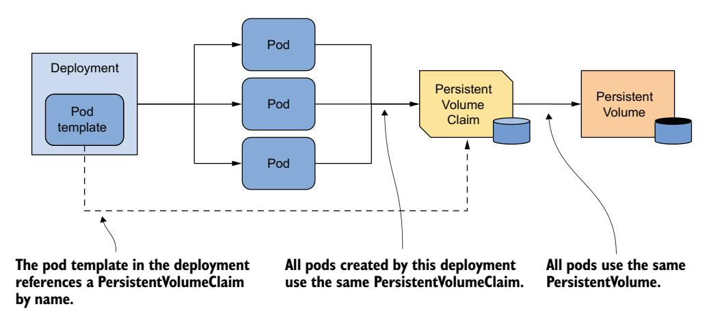
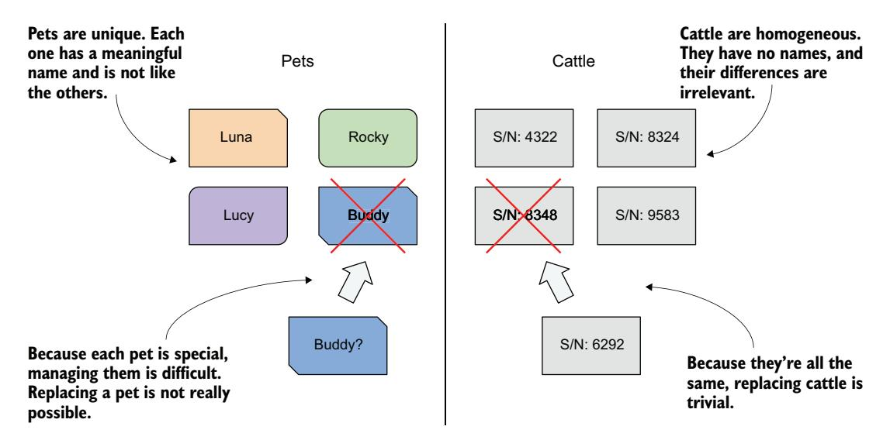
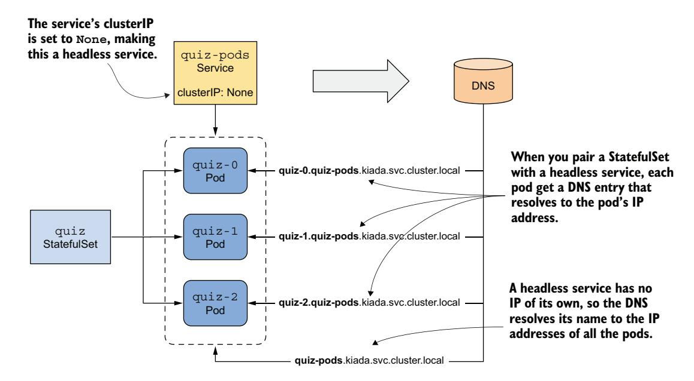
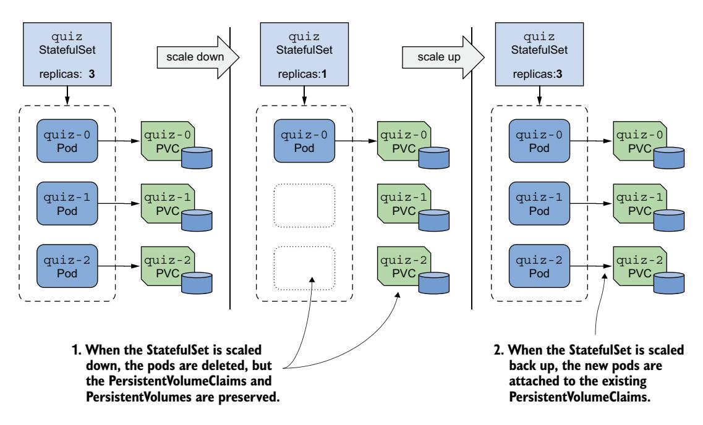
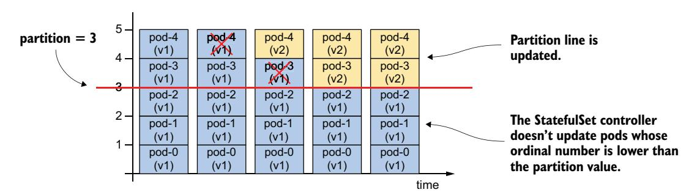
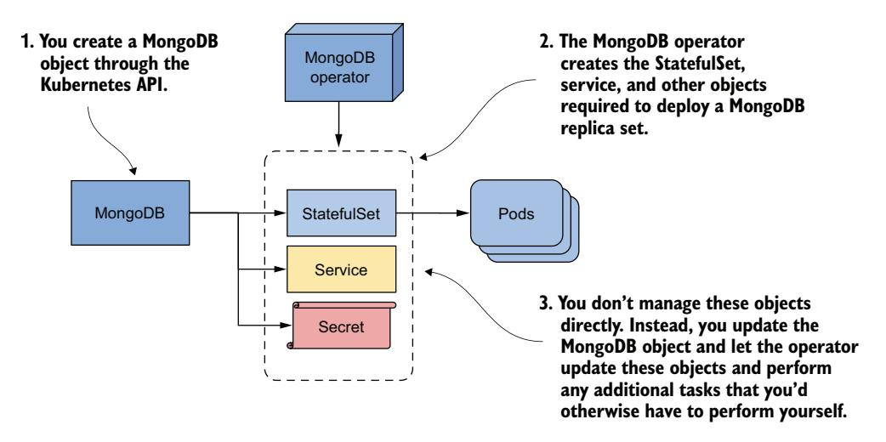

# 第 16 章 使用 StatefulSet 处理有状态应用

!!! tip "本章涵盖"

    - 通过 StatefulSet 对象管理有状态工作负载
    - 通过无头 Service 暴露单个 Pod
    - Deployment 与 StatefulSet 的区别
    - 使用 Kubernetes Operator 自动化有状态工作负载管理

Kiada 套件中的三个服务现在都通过 Deployment 对象部署。Kiada 和 Quote 服务各有三个副本，而 Quiz 服务只有一个，因为其数据无法轻易扩展。本章将讨论如何使用 **StatefulSet** 正确部署和扩展有状态工作负载（例如 Quiz 服务）。

在开始之前，请创建 kiada 命名空间，切换到 Chapter16/ 目录，并使用以下命令应用 SETUP/ 目录中的所有清单：

```bash
$ kubectl apply -n kiada -f SETUP -R
```

!!! warning "重要"

    本章示例假设对象创建在 kiada 命名空间中。如果你在其他位置创建它们，则必须在多处更新 DNS 域名。

!!! note ""

    本章的代码文件可在 https://github.com/luksa/kubernetes-in-action-2nd-edition/tree/master/Chapter16 获取。

## 16.1 介绍 StatefulSet

在了解 StatefulSet 及其与 Deployment 的区别之前，让我们先看看有状态工作负载的需求与无状态工作负载有何不同。

### 16.1.1 理解有状态工作负载的需求

有状态工作负载是一类必须存储和维护状态才能正常运行的软件。这些状态必须在工作负载重启或迁移时保持不变，这使得有状态工作负载的操作难度大大增加。

与无状态工作负载相比，有状态工作负载也更难扩展，因为不能简单地添加和删除副本而不考虑其状态。如果副本可以通过读写相同的文件来共享状态，那么添加新副本就不成问题。然而，要实现这一点，底层存储技术必须支持这种操作。另一方面，如果每个副本将其状态存储在自己的文件中，则需要为每个副本分配单独的卷。使用你目前所了解的 Kubernetes 资源，这说起来容易做起来难。让我们看看这两种方案，理解它们各自面临的问题。

#### 跨多个 Pod 副本共享状态

在 Kubernetes 中，你可以使用 ReadWriteMany 访问模式的 PersistentVolume 在多个 Pod 之间共享数据。然而，在大多数云环境中，底层存储技术通常仅支持 ReadWriteOnce 和 ReadOnlyMany 访问模式，而不支持 ReadWriteMany，这意味着你无法以读写模式将卷挂载到多个节点上。因此，不同节点上的 Pod 无法读写同一个 PersistentVolume。

让我们用 Quiz 服务来演示这个问题。你能将 quiz Deployment 扩展到三个副本吗？让我们看看会发生什么。kubectl scale 命令如下：

```bash
$ kubectl scale deploy quiz --replicas 3
deployment.apps/quiz scaled
```

现在检查 Pod：

```bash
$ kubectl get pods -l app=quiz
NAME                    READY   STATUS             RESTARTS   AGE
quiz-6f4968457-2c8ws    2/2     Running            0          10m
quiz-6f4968457-cdw97    0/2     CrashLoopBackOff   1 (14s ago) 22s
quiz-6f4968457-qdn29    0/2     Error              2 (16s ago) 22s
```

第一个 Pod 运行正常，而刚刚创建的两个 Pod 正在崩溃。

如你所见，只有扩缩前的那个 Pod 在运行，而两个新 Pod 没有。根据你使用的集群类型，这两个 Pod 可能根本无法启动，也可能启动后立即报错终止。例如，在 Google Kubernetes Engine 的集群中，Pod 中的容器无法启动，因为 PersistentVolume 无法挂载到新 Pod——其访问模式为 ReadWriteOnce，无法同时挂载到多个节点。在 kind 配置的集群中，容器可以启动，但 mongo 容器会失败并显示如下错误消息：

```bash
$ kubectl logs quiz-6f4968457-cdw97 -c mongo
..."msg":"DBException in initAndListen, terminating","attr":{"error":"DBPathInUse: Unable to lock the lock file: /data/db/mongod.lock (Resource temporarily unavailable). Another mongod instance is already running on the /data/db directory"}}
```

该错误消息表明你不能在多个 MongoDB 实例中使用同一数据目录。三个 quiz Pod 使用同一目录是因为它们都使用相同的 PersistentVolumeClaim，进而使用相同的 PersistentVolume，如图 16.1 所示。



图 16.1 Deployment 的所有 Pod 使用相同的 PersistentVolumeClaim 和 PersistentVolume

由于此方法不可行，另一种方案是为每个 Pod 副本使用单独的 PersistentVolume。让我们看看这意味着什么，以及是否可以用单个 Deployment 对象来实现。

#### 为每个副本使用专用 PersistentVolume

如上一节所述，MongoDB 默认仅支持单个实例。如果要使用相同数据部署多个 MongoDB 实例，则必须创建 MongoDB **副本集**（replica set），在多个实例之间复制数据（这里的"副本集"是 MongoDB 专用术语，并非指 Kubernetes 的 ReplicaSet 资源）。每个实例需要自己的存储卷和稳定地址，以便其他副本和客户端可以通过该地址连接它。因此，要在 Kubernetes 中部署 MongoDB 副本集，你需要确保：

- 每个 Pod 拥有自己的 PersistentVolume
- 每个 Pod 可通过自己的唯一地址进行访问
- 当 Pod 被删除并替换时，新 Pod 被分配相同的地址和 PersistentVolume

你无法通过单个 Deployment 和 Service 来实现这一点，但可以通过为每个副本创建单独的 Deployment、Service 和 PersistentVolumeClaim 来实现，如图 16.2 所示。


图 16.2 为每个副本提供自己的卷和地址

每个 Pod 拥有自己的 Deployment，因此 Pod 可以使用自己的 PersistentVolumeClaim 和 PersistentVolume。每个副本关联的 Service 为其提供稳定的地址，该地址始终解析为 Pod 的 IP 地址，即使 Pod 被删除并在其他地方重新创建也是如此。这是必要的，因为 MongoDB 与许多其他分布式系统一样，必须在初始化副本集时指定每个副本的地址。除了这些针对每个副本的 Service 之外，你可能还需要另一个 Service 来使所有 Pod 在单一地址上对客户端可访问。因此，整个系统看起来令人望而生畏。

更糟糕的是，如果需要增加副本数，你不能使用 kubectl scale 命令；必须创建额外的 Deployment、Service 和 PersistentVolumeClaim，这增加了复杂性。

尽管这种方法是可行的，但它非常复杂，操作起来也很困难。幸运的是，Kubernetes 提供了更好的方法，通过单个 Service 和单个 StatefulSet 对象来实现。

!!! note ""

    你不再需要 quiz Deployment 和 quiz-data PersistentVolumeClaim，请使用 `kubectl delete deploy/quiz pvc/quiz-data` 删除它们。

### 16.1.2 比较 StatefulSet 与 Deployment

StatefulSet 类似于 Deployment，但专门针对有状态工作负载进行了定制。然而，这两个对象的行为存在显著差异。这种差异最好用你可能听说过的**宠物 vs. 牲畜**类比来解释。如果没听过，让我来解释。

!!! note ""

    StatefulSet 最初被称为 PetSet。这个名字正是来源于"宠物 vs. 牲畜"这个类比。

#### 宠物 vs. 牲畜类比

我们曾经像对待宠物一样对待我们的硬件基础设施和工作负载。我们给每台服务器起名字，并单独照顾每个工作负载实例。然而，事实证明，如果像对待牲畜一样对待硬件和软件，将它们视为无法区分的实体，管理起来会容易得多。这使得替换每个单元变得容易，无需担心替换品是否与原来的完全一样——就像农场主对待牲畜一样（图 16.3）。



图 16.3 像对待宠物一样对待实体 vs. 像对待牲畜一样

通过 Deployment 部署的无状态工作负载就像牲畜。如果一个 Pod 被替换，你甚至可能不会注意到。然而，有状态工作负载就像宠物。如果宠物走丢了，你不能随便找一只新的来代替。即使你给替代的宠物起同样的名字，它的行为也不会和原来完全一样。但在硬件/软件领域，如果你能给替代品赋予与被替代实例相同的网络标识和状态，这是可能的。而这正是你通过 StatefulSet 部署应用时所发生的情况。

#### 使用 StatefulSet 部署 Pod

与 Deployment 一样，在 StatefulSet 中你需要指定 Pod 模板、期望副本数和标签选择器。但是，你还可以指定 PersistentVolumeClaim 模板。每当 StatefulSet 控制器创建新副本时，它不仅创建新的 Pod 对象，还创建一个或多个 PersistentVolumeClaim 对象。

StatefulSet 创建的 Pod 并非彼此的精确副本（这与 Deployment 的情况不同），因为每个 Pod 指向不同的 PersistentVolumeClaim 集合。此外，Pod 的名称不是随机的。相反，每个 Pod 被赋予唯一的序号（ordinal number），每个 PersistentVolumeClaim 也是如此。当 StatefulSet Pod 被删除并重新创建时，它会获得与被替换 Pod 相同的名称。此外，具有特定序号的 Pod 始终与相同序号的 PersistentVolumeClaim 关联。这意味着与特定副本关联的状态始终保持不变，无论 Pod 被重新创建多少次（图 16.4）。


图 16.4 StatefulSet、其 Pod 和 PersistentVolumeClaim

Deployment 和 StatefulSet 之间的另一个显著区别是，默认情况下，StatefulSet 的 Pod 不会并发创建。相反，它们一次创建一个，类似于 Deployment 的滚动更新。当你创建 StatefulSet 时，最初只创建第一个 Pod。然后 StatefulSet 控制器等待该 Pod 就绪之后，再创建下一个。

StatefulSet 可以像 Deployment 一样扩缩容。当扩容 StatefulSet 时，会根据各自的模板创建新的 Pod 和 PersistentVolumeClaim。缩容时，Pod 会被删除，但 PersistentVolumeClaim 要么保留要么删除，具体取决于你在 StatefulSet 中配置的策略。

### 16.1.3 创建 StatefulSet

在本节中，你将用 StatefulSet 替换 quiz Deployment。每个 StatefulSet 必须有一个关联的无头 Service 来单独暴露 Pod，因此你首先要做的是创建这个 Service。

#### 创建治理 Service

与 StatefulSet 关联的无头 Service 赋予 Pod 其网络标识。你可能还记得第 11 章中讲过，无头 Service 没有集群 IP 地址，但你仍然可以使用它与匹配其标签选择器的 Pod 进行通信。无头 Service 的 DNS 记录不是指向 Service IP 的单个 A 或 AAAA 记录，而是指向属于该 Service 的所有 Pod 的 IP。

如图 16.5 所示，当与 StatefulSet 配合使用无头 Service 时，会为每个 Pod 创建额外的 DNS 记录，以便可以通过 Pod 名称解析每个 Pod 的 IP 地址。这就是有状态 Pod 保持其稳定网络标识的方式。如果无头 Service 未与 StatefulSet 关联，这些 DNS 记录不会存在。



图 16.5 与 StatefulSet 配合使用的无头 Service

你已经有了一个在前几章中创建的名为 quiz 的 Service。你可以将其改为无头 Service，但我们还是创建一个额外的 Service，因为新 Service 将暴露所有 quiz Pod，无论它们是否就绪。

这个无头 Service 将允许你解析单个 Pod，因此我们称之为 quiz-pods。使用 kubectl apply 命令创建此 Service。你可以在 svc.quiz-pods.yaml 文件中找到 Service 清单，其内容如以下清单所示。

!!! note "清单 16.1 quiz StatefulSet 的无头 Service"

    ```yaml
    apiVersion: v1
    kind: Service
    metadata:
      name: quiz-pods
    spec:
      clusterIP: None
      publishNotReadyAddresses: true
      selector:
        app: quiz
      ports:
      - name: mongodb
        port: 27017
    ```

    此 Service 的名称为 quiz-pods，因为它允许你解析单个 quiz Pod。通过将 `clusterIP` 字段设为 `None`，该 Service 变为无头 Service。通过将 `publishNotReadyAddresses` 设为 `true`，无论 Pod 是否就绪，都会为每个 Pod 创建 DNS 记录。标签选择器匹配所有 quiz Pod。该 Service 还为 Pod 提供 SRV 记录，MongoDB 客户端使用这些记录连接到每个独立的 MongoDB 服务器。

在清单中，clusterIP 字段设置为 None，这使得该 Service 成为无头 Service。如果你将 publishNotReadyAddresses 设置为 true，则每个 Pod 的 DNS 记录会在 Pod 创建时立即创建，而不是仅在 Pod 就绪时才创建。这样，quiz-pods Service 将包含所有 quiz Pod，无论其就绪状态如何。

#### 创建 StatefulSet

创建无头 Service 后，你可以创建 StatefulSet。你可以在 sts.quiz.yaml 文件中找到对象清单。清单中最重要的部分如以下清单所示。

!!! note "清单 16.2 StatefulSet 的对象清单"

    ```yaml
    apiVersion: apps/v1
    kind: StatefulSet
    metadata:
      name: quiz
    spec:
      serviceName: quiz-pods
      podManagementPolicy: Parallel
      replicas: 3
      selector:
        matchLabels:
          app: quiz
      template:
        metadata:
          labels:
            app: quiz
            ver: "0.1"
        spec:
          volumes:
          - name: db-data
            persistentVolumeClaim:
              claimName: db-data
          containers:
          - name: quiz-api
            ...
          - name: mongo
            image: mongo:5
            command:
            - mongod
            - --bind_ip
            - 0.0.0.0
            - --replSet
            - quiz
            volumeMounts:
            - name: db-data
              mountPath: /data/db
      volumeClaimTemplates:
      - metadata:
          name: db-data
          labels:
            app: quiz
        spec:
          resources:
            requests:
              storage: 1Gi
          accessModes:
          - ReadWriteOnce
    ```

    StatefulSet 属于 `apps/v1` API 组和版本。`serviceName` 字段指定治理该 StatefulSet 的无头 Service 的名称。`podManagementPolicy` 设为 `Parallel` 告诉 StatefulSet 控制器同时创建所有 Pod。`replicas` 字段配置创建三个副本。标签选择器确定哪些 Pod 属于该 StatefulSet，它必须与 Pod 模板中的标签匹配。Pod 通过此模板创建。Pod 中定义了一个卷，该卷引用具有指定名称的 PersistentVolumeClaim。MongoDB 必须以这些选项启动才能启用复制。PersistentVolumeClaim 卷挂载在此处。`volumeClaimTemplates` 是用于创建 PersistentVolumeClaim 的模板。

该清单定义了一个来自 API 组 apps、版本 v1 的 StatefulSet 类型对象，名称为 quiz。在 StatefulSet spec 中，你会找到一些与 Deployment 和 ReplicaSet 相同的字段，如 replicas、selector 和 template（在前一章中已解释），但该清单还包含其他特定于 StatefulSet 的字段。例如，在 serviceName 字段中，你需要指定治理该 StatefulSet 的无头 Service 的名称。

通过将 podManagementPolicy 设置为 Parallel，StatefulSet 控制器会同时创建所有 Pod。由于某些分布式应用无法处理同时启动多个实例，控制器的默认行为是一次创建一个 Pod。然而，在此示例中，Parallel 选项使初始扩容更加简单。

在 volumeClaimTemplates 字段中，你为控制器为每个副本创建的 PersistentVolumeClaim 指定模板。与 Pod 模板不同（你需要省略 name 字段），你必须在 PersistentVolumeClaim 模板中指定名称。此名称必须与 Pod 模板 volumes 部分中的名称匹配。

通过应用清单文件创建 StatefulSet，如下所示：

```bash
$ kubectl apply -f sts.quiz.yaml
statefulset.apps/quiz created
```

### 16.1.4 检查 StatefulSet、Pod 和 PersistentVolumeClaim

创建 StatefulSet 后，你可以使用 kubectl rollout status 命令查看其状态：

```bash
$ kubectl rollout status sts quiz
Waiting for 3 pods to be ready...
```

!!! note ""

    StatefulSet 的简写是 sts。

kubectl 打印此消息后就不会继续了。按 Ctrl-C 中断执行，并检查 StatefulSet 状态以调查原因。

```bash
$ kubectl get sts
NAME    READY   AGE
quiz    0/3     22s
```

!!! note ""

    与 Deployment 和 ReplicaSet 一样，你可以使用 `-o wide` 选项显示 StatefulSet 中使用的容器名称和镜像。

READY 列中的值显示没有副本就绪。使用 kubectl get pods 列出 Pod，如下所示：

```bash
$ kubectl get pods -l app=quiz
NAME      READY   STATUS    RESTARTS   AGE
quiz-0    1/2     Running   0          56s
quiz-1    1/2     Running   0          56s
quiz-2    1/2     Running   0          56s
```

!!! note ""

    注意到 Pod 的名称了吗？它们不包含模板哈希或随机字符。相反，每个 Pod 名称由 StatefulSet 名称后跟一个序号组成，如引言中所述。

!!! tip ""

    默认情况下，序号从零开始。但是，你可以通过在 StatefulSet 清单中设置 `spec.ordinals.start` 字段来指定自定义起始值。

你会注意到每个 Pod 中两个容器只有一个就绪。如果你使用 kubectl describe 命令检查一个 Pod，你会看到 mongo 容器就绪了，但 quiz-api 容器没有，因为它的就绪探针检查失败。这是因为就绪探针调用的端点（/healthz/ready）检查 quiz-api 进程是否能查询 MongoDB 服务器。失败的就绪探针表明这是不可能的。如果你检查 quiz-api 容器的日志（如下所示），就会看到原因：

```bash
$ kubectl logs quiz-0 -c quiz-api
... INTERNAL ERROR: connected to mongo, but couldn't execute the ping
command: server selection error: server selection timeout, current topology:
{ Type: Unknown, Servers: [{ Addr: 127.0.0.1:27017, Type: RSGhost, State:
Connected, Average RTT: 898693 }, ] }
```

如错误消息所示，与 MongoDB 的连接已建立，但服务器不允许执行 ping 命令。原因在于服务器使用 --replSet 选项启动，配置为使用复制，但 MongoDB 副本集尚未被初始化。为此，请运行以下命令：

```bash
$ kubectl exec -it quiz-0 -c mongo -- mongosh --quiet --eval 'rs.initiate({
    _id: "quiz",
    members: [
        {_id: 0, host: "quiz-0.quiz-pods.kiada.svc.cluster.local:27017"},
        {_id: 1, host: "quiz-1.quiz-pods.kiada.svc.cluster.local:27017"},
        {_id: 2, host: "quiz-2.quiz-pods.kiada.svc.cluster.local:27017"}]})'
```

!!! note ""

    你也可以运行 initiatemongo-replicaset.sh shell 脚本（位于本章代码目录中），而不必输入这条长命令。

如果 MongoDB shell 给出以下错误消息，你可能忘记了事先创建 quiz-pods Service：

```text
MongoServerError: replSetInitiate quorum check failed because not all proposed
set members responded affirmatively: ... caused by :: Could not find address
for quiz-2.quiz-pods.kiada.svc.cluster.local:27017: SocketException: Host not
found
```

如果副本集初始化成功，该命令会打印如下消息：

```text
{ ok: 1 }
```

副本集初始化后，三个 quiz Pod 应该很快就会就绪。如果你再次运行 kubectl rollout status 命令，将看到以下输出：

```bash
$ kubectl rollout status sts quiz
partitioned roll out complete: 3 new pods have been updated...
```

#### 使用 kubectl describe 检查 StatefulSet

如你所知，你可以使用 kubectl describe 命令详细检查对象。以下是它对 quiz StatefulSet 显示的内容：

```bash
$ kubectl describe sts quiz
Name:               quiz
Namespace:          kiada
CreationTimestamp:  Sat, 12 Mar 2022 18:05:43 +0100
Selector:           app=quiz
Labels:             app=quiz
Annotations:        <none>
Replicas:           3 desired | 3 total
Update Strategy:    RollingUpdate
  Partition:        0
Pods Status:        3 Running / 0 Waiting / 0 Succeeded / 0 Failed
Pod Template:
  ...
Volume Claims:
  Name:          db-data
  StorageClass:  standard
  Labels:        app=quiz
  Annotations:   <none>
  Capacity:      1Gi
  Access Modes:  [ReadWriteOnce]
Events:
  Type    Reason             Age   From                    Message
  ----    ------             ----  ----                    -------
  Normal  SuccessfulCreate   10m   statefulset-controller  create Claim db-data-quiz-0 Pod quiz-0 in StatefulSet quiz successful
  Normal  SuccessfulCreate   10m   statefulset-controller  create Pod quiz-0 in StatefulSet quiz successful
  ...
```

如你所见，输出与 ReplicaSet 和 Deployment 非常相似。最显著的区别是存在 PersistentVolumeClaim 模板，这在其他两种对象类型中是不存在的。输出底部的事件显示了 StatefulSet 控制器的具体操作。每当它创建 Pod 或 PersistentVolumeClaim 时，也会创建一个 Event 来告知你所做的事情。

#### 检查 Pod

让我们更仔细地看看第一个 Pod 的清单，以了解它与 ReplicaSet 创建的 Pod 有何不同。使用 kubectl get 命令打印 Pod 清单：

```yaml
$ kubectl get pod quiz-0 -o yaml
apiVersion: v1
kind: Pod
metadata:
  labels:
    app: quiz
    controller-revision-hash: quiz-7576f64fbc
    statefulset.kubernetes.io/pod-name: quiz-0
    ver: "0.1"
  name: quiz-0
  namespace: kiada
  ownerReferences:
  - apiVersion: apps/v1
    blockOwnerDeletion: true
    controller: true
    kind: StatefulSet
    name: quiz
spec:
  containers:
    ...
  volumes:
  - name: db-data
    persistentVolumeClaim:
      claimName: db-data-quiz-0
status:
  ...
```

标签包括你在 StatefulSet 的 Pod 模板中设置的标签，以及 StatefulSet 控制器添加的两个额外标签。此 Pod 对象由 StatefulSet 拥有。容器与 StatefulSet 的 Pod 模板中指定的容器匹配。由于每个 Pod 实例获得自己的 PersistentVolumeClaim，模板中指定的 claimName 被替换为与此特定 Pod 实例关联的 claim 名称。

你在 StatefulSet 清单的 Pod 模板中定义的唯一标签是 app，但 StatefulSet 控制器向 Pod 添加了两个额外的标签：

- 标签 `controller-revision-hash` 的作用与 ReplicaSet Pod 上的 `pod-template-hash` 标签相同。它允许控制器确定特定 Pod 属于 StatefulSet 的哪个修订版本。
- 标签 `statefulset.kubernetes.io/pod-name` 指定 Pod 名称，允许你通过在该 Service 的标签选择器中使用此标签来为特定 Pod 实例创建 Service。

由于此 Pod 对象由 StatefulSet 管理，ownerReferences 字段表明了这一点。与 Deployment 不同（其中 Pod 由 ReplicaSet 拥有，而 ReplicaSet 又由 Deployment 拥有），StatefulSet 直接拥有 Pod。StatefulSet 同时负责 Pod 的复制和更新。

Pod 的容器与 StatefulSet 的 Pod 模板中定义的容器匹配，但 Pod 的卷则不然。在模板中，你将 claimName 指定为 db-data，但在这里的 Pod 中，它被更改为 db-data-quiz-0。这是因为每个 Pod 实例获得自己的 PersistentVolumeClaim。claim 的名称由 claimName 和 Pod 名称组成。

#### 检查 PersistentVolumeClaim

连同 Pod 一起，StatefulSet 控制器会为每个 Pod 创建 PersistentVolumeClaim。列出它们如下：

```bash
$ kubectl get pvc -l app=quiz
NAME              STATUS   VOLUME          CAPACITY   ACCESS MODES   STORAGECLASS   AGE
db-data-quiz-0    Bound    pvc1bf8ccaf     1Gi        RWO            standard       10m
db-data-quiz-1    Bound    pvcc8f860c2     1Gi        RWO            standard       10m
db-data-quiz-2    Bound    pvc2cc494d6     1Gi        RWO            standard       10m
```

你可以检查这些 PersistentVolumeClaim 的清单，确保它们与 StatefulSet 中指定的模板匹配。每个 claim 都绑定到一个为其动态供应的 PersistentVolume。这些卷尚未包含任何数据，因此 Quiz 服务当前不会返回任何内容。你将在接下来导入数据。

### 16.1.5 理解无头 Service 的作用

分布式应用的一个重要需求是对等发现（peer discovery）——每个集群成员能够找到其他成员。如果通过 StatefulSet 部署的应用需要找到 StatefulSet 中的所有其他 Pod，它可以通过从 Kubernetes API 获取 Pod 列表来实现。然而，由于我们希望应用保持对 Kubernetes 无感知，因此更好的做法是让应用使用 DNS，而不是直接与 Kubernetes 通信。

例如，连接到 MongoDB 副本集的客户端必须知道所有副本的地址，以便在需要写入数据时找到主副本。你必须将这些地址指定在传递给 MongoDB 客户端的连接字符串中。对于你的三个 quiz Pod，可以使用以下连接 URI：

```text
mongodb://quiz-0.quiz-pods.kiada.svc.cluster.local:27017,quiz-1.quiz-pods.kiada.svc.cluster.local:27017,quiz-2.quiz-pods.kiada.svc.cluster.local:27017
```

如果 StatefulSet 配置了额外的副本，你还需要将它们的地址添加到连接字符串中。幸运的是，还有更好的办法。

#### 通过 DNS 单独暴露有状态 Pod

在第 11 章中你了解到，Service 对象不仅通过稳定 IP 地址暴露一组 Pod，还使集群 DNS 将 Service 名称解析为该 IP 地址。而使用无头 Service 时，名称会解析为属于该 Service 的 Pod 的 IP。然而，当无头 Service 与 StatefulSet 关联时，每个 Pod 还会获得自己的 A 或 AAAA 记录，直接解析到该 Pod 的 IP。例如，由于你将 quiz StatefulSet 与 quiz-pods 无头 Service 结合使用，quiz-0 Pod 的 IP 可以通过以下地址解析：

```text
quiz-0.quiz-pods.kiada.svc.cluster.local
```

StatefulSet 创建的所有其他副本也可以以相同的方式解析。

#### 通过 SRV 记录暴露有状态 Pod

除了 A 和 AAAA 记录外，每个有状态 Pod 还会获得 SRV 记录。MongoDB 客户端可以使用这些记录查找每个 Pod 使用的地址和端口号，因此你无需手动指定它们。但是，你必须确保 SRV 记录具有正确的名称。MongoDB 要求 SRV 记录以 `_mongodb` 开头。为了确保这一点，你必须在 Service 定义中将端口名称设置为 `mongodb`，就像清单 16.1 中所做的那样。这样可以确保 SRV 记录如下：

```text
_mongodb._tcp.quiz-pods.kiada.svc.cluster.local
```

使用 SRV 记录可以使 MongoDB 连接字符串变得简单得多。无论副本集中有多少个副本，连接字符串始终如下：

```text
mongodb+srv://quiz-pods.kiada.svc.cluster.local
```

mongodb+srv 方案告诉客户端通过执行 SRV 查找域名 `_mongodb._tcp.quiz-pods.kiada.svc.cluster.local` 来发现地址，而不是单独指定每个地址。你将在接下来使用此连接字符串将 quiz 数据导入 MongoDB。

#### 将 Quiz 数据导入 MongoDB

在前面的章节中，使用了 init 容器将 quiz 数据导入 MongoDB 存储。由于现在数据被复制了，init 容器的方法不再适用，如果仍然使用它，数据将被多次导入。相反，让我们将导入操作移到一个专用 Pod 中。

你可以在 pod.quiz-data-importer.yaml 文件中找到 Pod 清单。该文件还包含一个 ConfigMap，其中包含要导入的数据。以下清单显示了清单文件的内容。

!!! note "清单 16.3 quiz-data-importer Pod 的清单"

    ```yaml
    apiVersion: v1
    kind: Pod
    metadata:
      name: quiz-data-importer
    spec:
      restartPolicy: OnFailure
      volumes:
      - name: quiz-questions
        configMap:
          name: quiz-questions
      containers:
      - name: mongoimport
        image: mongo:5
        command:
        - mongoimport
        - mongodb+srv://quiz-pods.kiada.svc.cluster.local/kiada?tls=false
        - --collection
        - questions
        - --file
        - /questions.json
        - --drop
        volumeMounts:
        - name: quiz-questions
          mountPath: /questions.json
          subPath: questions.json
          readOnly: true
    ---
    apiVersion: v1
    kind: ConfigMap
    metadata:
      name: quiz-questions
      labels:
        app: quiz
    data:
      questions.json: ...
    ```

    此 Pod 的容器只需完成一次运行即可。客户端使用 SRV 查找方法找到 MongoDB 副本。

quiz-questions ConfigMap 通过 configMap 卷挂载到 quiz-data-importer Pod 中。当 Pod 的容器启动时，它运行 mongoimport 命令，该命令连接到主 MongoDB 副本并从卷中的文件导入数据。然后数据被复制到从副本中。

由于 mongoimport 容器只需运行一次，Pod 的 restartPolicy 设置为 OnFailure。如果导入失败，容器将根据需要重新启动，直到导入成功为止。使用 kubectl apply 命令部署 Pod 并验证其是否成功完成。你可以通过以下方式检查 Pod 的状态：

```bash
$ kubectl get pod quiz-data-importer
NAME                  READY   STATUS      RESTARTS   AGE
quiz-data-importer    0/1     Completed   0          50s
```

如果 STATUS 列显示值为 Completed，则表示容器无错误退出。容器的日志将显示导入的文档数量。现在你应该能够通过 curl 或 Web 浏览器访问 Kiada 套件，并看到 Quiz 服务返回了你导入的问题。你可以随时删除 quiz-data-importer Pod 和 quiz-questions ConfigMap。

现在回答几个 quiz 问题，并使用以下命令检查你的答案是否存储在 MongoDB 中：

```bash
$ kubectl exec quiz-0 -c mongo -- mongosh kiada --quiet --eval 'db.responses.find()'
```

运行此命令时，Pod quiz-0 中的 mongosh shell 连接到 kiada 数据库，并以 JSON 形式显示 responses 集合中存储的所有文档。每个文档都代表你提交的一个答案。

!!! note ""

    此命令假设 quiz-0 是 MongoDB 主副本，除非你偏离了创建 StatefulSet 的说明，否则应该如此。如果命令失败，请尝试在 quiz-1 和 quiz-2 Pod 中运行该命令。你也可以通过在任意 quiz Pod 中运行 MongoDB 命令 `rs.hello().primary` 来找到主副本。

## 16.2 理解 StatefulSet 行为

在上一节中，你创建了 StatefulSet 并看到了控制器如何创建 Pod。你使用为无头 Service 创建的集群 DNS 记录将数据导入 MongoDB 副本集。现在你将测试 StatefulSet 并了解其行为。首先，你将看到它如何处理丢失的 Pod 和节点故障。

### 16.2.1 理解 StatefulSet 如何替换丢失的 Pod

与 ReplicaSet 创建的 Pod 不同，StatefulSet 的 Pod 命名方式不同，每个 Pod 都有自己的 PersistentVolumeClaim（如果 StatefulSet 包含多个 claim 模板，则有一套 PersistentVolumeClaim）。如引言中所述，如果 StatefulSet Pod 被删除并由控制器用新实例替换，副本将保留相同的标识并与相同的 PersistentVolumeClaim 关联。尝试按以下方式删除 quiz-1 Pod：

```bash
$ kubectl delete po quiz-1
pod "quiz-1" deleted
```

在其位置创建的 Pod 具有相同的名称，如你所见：

```bash
$ kubectl get po -l app=quiz
NAME      READY   STATUS    RESTARTS   AGE
quiz-0    2/2     Running   0          94m
quiz-1    2/2     Running   0          5s
quiz-2    2/2     Running   0          94m
```

AGE 列表明这是一个新 Pod，但它的名称与前一个 Pod 相同。

新 Pod 的 IP 地址可能不同，但这并不重要，因为 DNS 记录已更新为指向新地址。使用 Pod 主机名与之通信的客户端不会注意到任何差异。

一般来说，如果绑定到 PersistentVolumeClaim 的 PersistentVolume 是网络附加卷而非本地卷，则此新 Pod 可以调度到任何集群节点。如果卷是节点本地的，则 Pod 始终被调度到此节点。

与 ReplicaSet 控制器类似，其 StatefulSet 对应物确保始终存在 replicas 字段中配置的期望 Pod 数量。然而，StatefulSet 提供的保证与 ReplicaSet 有一个重要区别。此区别将在下文解释。

### 16.2.2 理解 StatefulSet 如何处理节点故障

StatefulSet 提供的并发 Pod 执行保证比 ReplicaSet 严格得多。这会影响 StatefulSet 控制器处理节点故障的方式，因此应先解释一下。

#### 理解 StatefulSet 的至多一个语义

StatefulSet 为其 Pod 保证至多一个（at-most-one）语义。由于两个同名的 Pod 不能同时存在于同一命名空间中，StatefulSet 基于序号的命名方案足以防止两个具有相同标识的 Pod 同时运行。

还记得当你通过 ReplicaSet 运行一组 Pod，而其中一个节点停止向 Kubernetes 控制平面报告时会发生什么吗？几分钟后，ReplicaSet 控制器会判定该节点和 Pod 已消失，并在剩余节点上创建替代 Pod，即使原节点上的 Pod 可能仍在运行。如果 StatefulSet 控制器在此场景下也替换 Pod，你将有两个具有相同标识的副本同时运行。让我们看看是否会发生这种情况。

#### 断开节点与网络的连接

与第 14 章一样，你将导致其中一个节点的网络接口失效。如果你的集群有多个节点，可以尝试此练习。找到运行 quiz-1 Pod 的节点名称。假设是节点 kind-worker2。如果你使用 kind 配置的集群，请按以下方式关闭该节点的网络接口：

```bash
$ docker exec kind-worker2 ip link set eth0 down
```

如果你使用 GKE 集群，请使用以下命令连接到节点：

```bash
$ gcloud compute ssh gke-kiada-default-pool-35644f7e-300l
```

在节点上运行以下命令关闭其网络接口：

```bash
$ sudo ifconfig eth0 down
```

!!! note ""

    关闭网络接口会使 ssh 会话挂起。你可以按 Enter 键，然后按 "~."（波浪号和点号，不含引号）来结束会话。

由于节点的网络接口已关闭，运行在该节点上的 kubelet 无法再联系 Kubernetes API 服务器，也无法告知它该节点及其所有 Pod 仍在运行。Kubernetes 控制平面很快将该节点标记为 NotReady，如下所示：

```bash
$ kubectl get nodes
NAME                  STATUS     ROLES                  AGE   VERSION
kind-control-plane    Ready      control-plane,master   10h   v1.23.4
kind-worker           Ready      <none>                 10h   v1.23.4
kind-worker2          NotReady   <none>                 10h   v1.23.4
```

该节点因停止与 Kubernetes API 通信而不再就绪。

几分钟后，运行在该节点上的 quiz-1 Pod 的状态变为 Terminating，如 Pod 列表中所示：

```bash
$ kubectl get pods -l app=quiz
NAME      READY   STATUS        RESTARTS   AGE
quiz-0    2/2     Running       0          12m
quiz-1    2/2     Terminating   0          7m39s
quiz-2    2/2     Running       0          12m
```

此 Pod 正在被终止，因为其节点已关闭。

当你使用 kubectl describe 命令检查该 Pod 时，会看到一个带有消息 "Node is not ready" 的 Warning 事件，如下所示：

```bash
$ kubectl describe po quiz-1
...
Events:
  Type     Reason         Age   From            Message
  ----     ------         ----  ----            -------
  Warning  NodeNotReady   11m   node-controller Node is not ready
```

NodeNotReady 事件表明该 Pod 运行的节点不再响应。

#### 理解为什么 StatefulSet 控制器不替换该 Pod

此时我想指出，Pod 中的容器仍在运行。节点并没有关闭，只是失去了网络连接。如果运行在节点上的 kubelet 进程失效，但容器继续运行，也会发生同样的情况。

这是一个重要的事实，因为它解释了为什么 StatefulSet 控制器不应该删除并重新创建 Pod。如果 StatefulSet 控制器在 kubelet 关闭时删除并重新创建 Pod，新 Pod 将被调度到另一个节点，Pod 的容器将启动。这样就会有两个相同标识的工作负载实例同时运行。这就是 StatefulSet 控制器不这样做的原因。

#### 手动删除 Pod

如果你希望 Pod 在其他地方重新创建，需要手动干预。集群运维人员必须确认节点确实已经故障，然后手动删除 Pod 对象。然而，Pod 对象已经被标记为删除，如其状态所示（显示 Pod 为 Terminating）。使用通常的 kubectl delete pod 命令删除 Pod 没有效果。

Kubernetes 控制平面等待 kubelet 报告 Pod 中的容器已终止。只有当 Pod 对象删除完成时，删除才真正生效。然而，由于负责此 Pod 的 kubelet 无法工作，这永远不会发生。要在不等待确认的情况下删除 Pod，你必须按以下方式删除它：

```bash
$ kubectl delete pod quiz-1 --force --grace-period 0
warning: Immediate deletion does not wait for confirmation that the running
    resource has been terminated. The resource may continue to run on the
    cluster indefinitely.
pod "quiz-1" force deleted
```

注意警告：Pod 的容器可能继续运行。这就是为什么在以这种方式删除 Pod 之前你必须确保节点确实已经故障。

#### 重新创建 Pod

删除 Pod 后，它会被 StatefulSet 控制器替换，但 Pod 可能无法启动。有两种可能的情况，具体取决于副本的 PersistentVolume 是本地卷（如 kind），还是网络附加卷（如 GKE）。

如果 PersistentVolume 是故障节点上的本地卷，则 Pod 无法被调度，其 STATUS 保持为 Pending，如下所示：

```bash
$ kubectl get pod quiz-1 -o wide
NAME      READY   STATUS    RESTARTS   AGE     IP       NODE     NOMINATED NODE
quiz-1    0/2     Pending   0          2m38s   <none>   <none>   <none>
```

Pod 尚未被调度到任何节点。

Pod 的事件显示 Pod 无法调度的原因。使用 kubectl describe 命令显示它们：

```bash
$ kubectl describe pod quiz-1
...
Events:
  Type     Reason             Age   From               Message
  ----     ------             ----  ----               -------
  Warning  FailedScheduling   21s   default-scheduler  0/3 nodes are available:
    1 node had taint {node-role.kubernetes.io/master: }, that the pod didn't tolerate,
    1 node had taint {node.kubernetes.io/unreachable: }, that the pod didn't tolerate,
    1 node had volume node affinity conflict.
```

调度器找不到合适的节点来调度 Pod。控制平面节点仅接受 Kubernetes 系统工作负载，不接受像此 Pod 这样的常规工作负载。kind-worker2 节点不可达。Pod 无法调度到 kind-worker 节点，因为 PersistentVolume 无法挂载到那里。

事件消息提到了污点（taints）。在此不做详细说明，我只想说 Pod 无法调度到三个节点中的任何一个，因为一个节点是控制平面节点，另一个节点不可达（当然，你刚刚让它变得不可达），但警告消息中最重要的部分是关于亲和性冲突（affinity conflict）的部分。新的 quiz-1 Pod 只能调度到与前一个 Pod 实例相同的节点，因为其卷位于该节点。而由于该节点不可达，Pod 无法被调度。

如果你在 GKE 或其他使用网络附加卷的集群上运行此练习，Pod 将被调度到另一个节点，但如果卷无法从故障节点分离并挂载到该其他节点，则可能无法运行。在这种情况下，Pod 的 STATUS 如下：

```bash
$ kubectl get pod quiz-1 -o wide
NAME      READY   STATUS              RESTARTS   AGE   IP        NODE
quiz-1    0/2     ContainerCreating   0          38s   1.2.3.4   gke-kiada-...
```

Pod 已被调度，但其容器尚未启动。

Pod 的事件表明 PersistentVolume 无法分离。使用 kubectl describe 显示：

```bash
$ kubectl describe pod quiz-1
...
Events:
  Type     Reason              Age   From                      Message
  ----     ------              ----  ----                      -------
  Warning  FailedAttachVolume  77s   attachdetach-controller   Multi-Attach
    error for volume "pvc-8d9ec7e7-bc51-497c-8879-2ae7c3eb2fd2" Volume is already
    exclusively attached to one node and can't be attached to another
```

#### 删除 PersistentVolumeClaim 以使新 Pod 运行

如果 Pod 无法挂载到同一卷怎么办？如果 Pod 中运行的工作负载可以从头重建其数据，例如通过从其他副本复制数据，则可以删除 PersistentVolumeClaim，以便创建新的 claim 并绑定到新的 PersistentVolume。然而，由于 StatefulSet 控制器仅在创建 Pod 时才创建 PersistentVolumeClaim，你还必须删除 Pod 对象。你可以按以下方式删除这两个对象：

```bash
$ kubectl delete pvc/db-data-quiz-1 pod/quiz-1
persistentvolumeclaim "db-data-quiz-1" deleted
pod "quiz-1" deleted
```

新的 PersistentVolumeClaim 和新的 Pod 被创建。绑定到该 claim 的 PersistentVolume 是空的，但 MongoDB 会自动复制数据。

#### 修复节点

当然，如果你能修复节点，就可以省去所有这些麻烦。如果你在 GKE 上运行此示例，系统会在节点离线几分钟后自动重新启动节点。使用 kind 工具时，运行以下命令来恢复节点：

```bash
$ docker exec kind-worker2 ip link set eth0 up
$ docker exec kind-worker2 ip route add default via 172.18.0.1
```

你的集群可能使用不同的 IP 网关，你可以使用 `docker inspect network` 命令找到它，如第 14 章所述。

当节点恢复在线后，Pod 的删除完成，新的 quiz-1 Pod 被创建。在 kind 集群中，由于卷是本地卷，Pod 被调度到同一节点。

### 16.2.3 扩缩容 StatefulSet

就像 ReplicaSet 和 Deployment 一样，你也可为 StatefulSet 进行扩缩容。当扩容 StatefulSet 时，控制器会同时创建新的 Pod 和新的 PersistentVolumeClaim。但是缩容时会发生什么？PersistentVolumeClaim 会随 Pod 一起被删除吗？

#### 缩容

要扩缩容 StatefulSet，你可以使用 kubectl scale 命令或更改 StatefulSet 对象清单中 replicas 字段的值。使用第一种方法，将 quiz StatefulSet 缩容到单个副本：

```bash
$ kubectl scale sts quiz --replicas 1
statefulset.apps/quiz scaled
```

如预期的那样，现在有两个 Pod 正在终止：

```bash
$ kubectl get pods -l app=quiz
NAME      READY   STATUS        RESTARTS   AGE
quiz-0    2/2     Running       0          1h
quiz-1    2/2     Terminating   0          14m
quiz-2    2/2     Terminating   0          1h
```

这些 Pod 正在被删除。

与 ReplicaSet 不同，缩容 StatefulSet 时，具有最高序号的 Pod 首先被删除。你将 quiz StatefulSet 从三个副本缩容到一个副本，因此具有最高序号的两个 Pod（quiz-2 和 quiz-1）被删除。这种扩缩容方法确保 Pod 的序号始终从零开始，并以小于副本数的数字结束。

但是 PersistentVolumeClaim 会发生什么？列出它们：

```bash
$ kubectl get pvc -l app=quiz
NAME              STATUS   VOLUME          CAPACITY   ACCESS MODES   STORAGECLASS   AGE
db-data-quiz-0    Bound    pvc1bf8ccaf     1Gi        RWO            standard       1h
db-data-quiz-1    Bound    pvcc8f860c2     1Gi        RWO            standard       1h
db-data-quiz-2    Bound    pvc2cc494d6     1Gi        RWO            standard       1h
```

与 Pod 不同，其 PersistentVolumeClaim 被保留。这是因为删除 claim 会导致绑定的 PersistentVolume 被回收或删除，从而导致数据丢失。保留 PersistentVolumeClaim 是默认行为，但你可以通过 persistentVolumeClaimRetentionPolicy 字段配置 StatefulSet 来删除它们，稍后你会学到。另一种选择是手动删除 claim。

值得注意的是，如果你将 quiz StatefulSet 缩容到仅一个副本，quiz Service 将不再可用，但这与 Kubernetes 无关。这是因为你用三个副本配置了 MongoDB 副本集，所以至少需要两个副本才能达到法定人数（quorum）。单个副本没有法定人数，因此必须拒绝读取和写入。这导致 quiz-api 容器中的就绪探针失败，进而导致 Pod 从 Service 中移除，Service 没有 Endpoints。要确认，请列出 Endpoints：

```bash
$ kubectl get endpoints -l app=quiz
NAME        ENDPOINTS            AGE
quiz                             1h
quiz-pods   10.244.1.9:27017     1h
```

quiz Service 没有 endpoints。quiz-pods Service 仍然有 quiz-0 作为 endpoint，因为该 Service 配置为包含所有 endpoints，无论其就绪状态如何。

缩容 StatefulSet 后，你需要重新配置 MongoDB 副本集以适应新的副本数，但这超出了本书的范围。相反，让我们重新扩容 StatefulSet 以恢复法定人数。

#### 扩容

由于缩容 StatefulSet 时 PersistentVolumeClaim 被保留，它们可以在重新扩容时重新挂载，如图 16.6 所示。每个 Pod 根据其序号与之前的相同 PersistentVolumeClaim 关联。



图 16.6 StatefulSet 缩容时不删除 PersistentVolumeClaim，扩容时重新挂载

按以下方式将 quiz StatefulSet 重新扩容到三个副本：

```bash
$ kubectl scale sts quiz --replicas 3
statefulset.apps/quiz scaled
```

现在检查每个 Pod，看它们是否与正确的 PersistentVolumeClaim 关联。法定人数恢复，所有 Pod 就绪，Service 再次可用。使用你的 Web 浏览器确认。

现在将 StatefulSet 扩容到五个副本。控制器创建了两个额外的 Pod 和 PersistentVolumeClaim，但 Pod 未就绪。确认如下：

```bash
$ kubectl get pods quiz-3 quiz-4
NAME      READY   STATUS    RESTARTS   AGE
quiz-3    1/2     Running   0          4m55s
quiz-4    1/2     Running   0          4m55s
```

每个副本中只有一个容器就绪。

如你所见，每个副本中两个容器只有一个就绪。这些副本没有什么问题，只是它们尚未被添加到 MongoDB 副本集中。你可以通过重新配置副本集来添加它们，但这超出了本书的范围，如前所述。

你可能开始意识到，在 Kubernetes 中管理有状态应用不仅仅是创建和管理 StatefulSet 对象。这就是为什么你通常会使用 Kubernetes Operator 来进行管理，如本章最后一部分所述。

在结束关于 StatefulSet 扩缩容的这一节之前，我想再指出一点。quiz Pod 由两个 Service 暴露：常规的 quiz Service（仅寻址就绪的 Pod）和无头 quiz-pods Service（包含所有 Pod，无论其就绪状态如何）。kiada Pod 连接到 quiz Service，因此发送到该 Service 的所有请求都是成功的，因为这些请求仅转发到三个健康 Pod。

除了添加 quiz-pods Service，你也可以将 quiz Service 设为无头，但那样你就必须选择该 Service 是否应发布未就绪 Pod 的地址。从客户端角度来看，未就绪的 Pod 不应属于该 Service。从 MongoDB 的角度来看，必须包含所有 Pod，因为这是副本找到彼此的方式。使用两个 Service 解决了这个问题。因此，StatefulSet 通常同时关联一个常规 Service 和一个无头 Service。

### 16.2.4 更改 PersistentVolumeClaim 保留策略

在上一节中，你了解到 StatefulSet 在缩容时默认保留 PersistentVolumeClaim。但是，如果 StatefulSet 管理的工作负载永远不需要保留数据，你可以通过设置 persistentVolumeClaimRetentionPolicy 字段来配置 StatefulSet 自动删除 PersistentVolumeClaim。在此字段中，你可以指定缩容时和 StatefulSet 删除时要使用的保留策略。

例如，要将 quiz StatefulSet 配置为在缩容时删除 PersistentVolumeClaim，但在删除时保留它们，你必须按以下清单所示设置策略，该清单显示了 sts.quiz.pvcRetentionPolicy.yaml 清单文件的一部分。

!!! note "清单 16.4 在 StatefulSet 中配置 PersistentVolumeClaim 保留策略"

    ```yaml
    apiVersion: apps/v1
    kind: StatefulSet
    metadata:
      name: quiz
    spec:
      persistentVolumeClaimRetentionPolicy:
        whenScaled: Delete
        whenDeleted: Retain
      ...
    ```

    当 StatefulSet 缩容时，PersistentVolumeClaim 被删除。当 StatefulSet 被删除时，PersistentVolumeClaim 被保留。

whenScaled 和 whenDeleted 字段不言自明。每个字段可以是 Retain（默认值）或 Delete。使用 kubectl apply 应用此清单文件以更改 quiz StatefulSet 中的 PersistentVolumeClaim 保留策略：

```bash
$ kubectl apply -f sts.quiz.pvcRetentionPolicy.yaml
```

#### 扩缩容 StatefulSet

quiz StatefulSet 中的 whenScaled 策略现在设置为 Delete。将 StatefulSet 缩容到三个副本，以删除两个不健康的 Pod 及其 PersistentVolumeClaim。

```bash
$ kubectl scale sts quiz --replicas 3
statefulset.apps/quiz scaled
```

列出 PersistentVolumeClaim，确认只剩下三个。

#### 删除 StatefulSet

现在让我们看看 whenDeleted 策略是否被遵循。你的目标是删除 Pod，但不删除 PersistentVolumeClaim。你已将 whenDeleted 策略设置为 Retain，因此可以按以下方式删除 StatefulSet：

```bash
$ kubectl delete sts quiz
statefulset.apps "quiz" deleted
```

列出 PersistentVolumeClaim，确认三个都在。MongoDB 数据文件因此被保留。

!!! note ""

    如果你想删除 StatefulSet 但保留 Pod 和 PersistentVolumeClaim，可以使用 `--cascade=orphan` 选项。在这种情况下，即使保留策略设置为 Delete，PersistentVolumeClaim 也会被保留。

#### 确保数据永不丢失

在结束本节之前，我想提醒你不要将任一保留策略设置为 Delete。考虑一下前面的例子。你将 whenDeleted 策略设置为 Retain，以便在 StatefulSet 被意外删除时数据得以保留，但由于 whenScaled 策略设置为 Delete，如果在删除 StatefulSet 之前将 StatefulSet 缩容到零，数据仍然会丢失。

!!! tip ""

    仅当与 StatefulSet 关联的 PersistentVolume 中的数据在其他地方有保留或不需要保留时，才将 persistentVolumeClaimRetentionPolicy 设置为 Delete。你始终可以手动删除 PersistentVolumeClaim。确保数据保留的另一种方法是在 PersistentVolumeClaim 模板引用的 StorageClass 中将 reclaimPolicy 设置为 Retain。

### 16.2.5 使用 OrderedReady Pod 管理策略

使用 quiz StatefulSet 一直很轻松。但是，你可能还记得在 StatefulSet 清单中，你将 podManagementPolicy 字段设置为 Parallel，这会指示控制器同时创建所有 Pod 而不是一次一个。虽然 MongoDB 同时启动所有副本没有问题，但某些有状态工作负载则不是。

#### 介绍两种 Pod 管理策略

当 StatefulSet 首次引入时，Pod 管理策略不可配置，控制器始终按顺序部署 Pod。为了保持向后兼容性，在引入此字段时，这种工作方式必须保持不变。因此，默认的 podManagementPolicy 是 OrderedReady，但你可以通过将策略更改为 Parallel 来放宽 StatefulSet 的顺序保证。图 16.7 显示了每种策略下 Pod 随时间创建和删除的方式。


图 16.7 OrderedReady 与 Parallel Pod 管理策略对比

表 16.1 更详细地解释了两种策略之间的差异。

表 16.1 支持的 **podManagementPolicy** 值

| 值 | 描述 |
|------|------|
| OrderedReady | Pod 按照升序逐个创建。创建每个 Pod 后，控制器等待 Pod 就绪后再创建下一个。扩缩容和替换 Pod（当 Pod 被删除或其节点故障时）使用相同的流程。缩容时，Pod 按逆序删除。控制器等待每个被删除的 Pod 完成后再删除下一个。 |
| Parallel | 所有 Pod 同时创建和删除。控制器不等待单个 Pod 就绪。 |

当工作负载要求每个副本完全启动后才能创建下一个，和/或每个副本完全关闭后才能要求下一个副本退出时，OrderedReady 策略很方便。但是，此策略也有其缺点。让我们看看在 quiz StatefulSet 中使用它时会发生什么。

#### 理解 OrderedReady Pod 管理策略的缺点

通过应用清单文件 sts.quiz.orderedReady.yaml 重新创建 StatefulSet，其中 podManagementPolicy 设置为 OrderedReady，如下面的清单所示。

!!! note "清单 16.5 在 StatefulSet 中指定 **podManagementPolicy**"

    ```yaml
    apiVersion: apps/v1
    kind: StatefulSet
    metadata:
      name: quiz
    spec:
      podManagementPolicy: OrderedReady
      minReadySeconds: 10
      serviceName: quiz-pods
      replicas: 3
      ...
    ```

    此 StatefulSet 的 Pod 按顺序创建。每个 Pod 必须在下一个 Pod 创建之前就绪。Pod 必须就绪这么多秒后，下一个 Pod 才会创建。

除了设置 podManagementPolicy，minReadySeconds 字段也设置为 10，以便你更好地看到 OrderedReady 策略的效果。此字段与 Deployment 中的作用相同，但不仅用于 StatefulSet 更新，也用于 StatefulSet 扩缩容时。

!!! note ""

    在撰写本文时，podManagementPolicy 字段是不可变的。如果要更改现有 StatefulSet 的策略，必须删除并重新创建它，就像你刚才所做的那样。你可以使用 `--cascade=orphan` 选项防止 Pod 在此操作期间被删除。

使用 --watch 选项观察 quiz Pod，看看它们是如何创建的。运行 kubectl get 命令：

```bash
$ kubectl get pods -l app=quiz --watch
NAME      READY   STATUS    RESTARTS   AGE
quiz-0    1/2     Running   0          22s
```

如你从前几章所回忆的，--watch 选项告诉 kubectl 监视指定对象的更改。该命令首先列出对象，然后等待。当现有对象的状态更新或新对象出现时，该命令会打印关于该对象的更新信息。

!!! note ""

    当你使用 `--watch` 选项运行 kubectl 时，它使用与控制器相同的 API 机制来等待所观察对象的更改。

你会惊讶地发现，当你使用 OrderedReady 策略重新创建 StatefulSet 时，只创建了一个副本，尽管 StatefulSet 配置了三个副本。下一个 Pod quiz-1 无论等待多久都不会出现。原因是 Pod quiz-0 中的 quiz-api 容器永远不会就绪，就像你将 StatefulSet 缩容到单个副本时一样。由于第一个 Pod 永远不会就绪，控制器永远不会创建下一个 Pod。受配置的策略限制，它不能这样做。

和之前一样，quiz-api 容器未就绪是因为与之并排运行的 MongoDB 实例没有法定人数。由于 quiz-api 容器中定义的就绪探针依赖于 MongoDB 的可用性（而 MongoDB 需要至少两个 Pod 才能达到法定人数），并且由于 StatefulSet 控制器在第一个 Pod 就绪之前不启动下一个 Pod，StatefulSet 现在陷入了死锁。

有人可能认为 quiz-api 容器中的就绪探针不应该依赖于 MongoDB。这值得讨论，但问题可能出在 OrderedReady 策略的使用上。无论如何，我们还是继续使用此策略，因为你已经看到了 Parallel 策略的行为。相反，让我们重新配置就绪探针，将调用端点从 /healthz/ready 改为根 URI。这样，探针只检查 HTTP 服务器是否在 quiz-api 容器中运行，而不连接 MongoDB。

#### 更新使用 OrderedReady 策略的卡住 StatefulSet

使用 kubectl edit sts quiz 命令更改就绪探针定义中的路径，或使用 kubectl apply 命令应用更新后的清单文件 sts.quiz.orderedReady.readinessProbe.yaml。以下清单显示了就绪探针应如何配置：

!!! note "清单 16.6 在 **quiz-api** 容器中设置就绪探针"

    ```yaml
    apiVersion: apps/v1
    kind: StatefulSet
    metadata:
      name: quiz
    spec:
      ...
      template:
        ...
        spec:
          containers:
          - name: quiz-api
            ...
            readinessProbe:
              httpGet:
                port: 8080
                path: /
                scheme: HTTP
            ...
    ```

    将路径从 `/healthz/ready` 更改为 `/`。

更新 StatefulSet 中的 Pod 模板后，你期望 quiz-0 Pod 被删除并使用新的 Pod 模板重新创建，对吗？列出 Pod 如下以检查是否如此。

```bash
$ kubectl get pods -l app=quiz
NAME      READY   STATUS    RESTARTS   AGE
quiz-0    1/2     Running   0          5m
```

Pod 的年龄表明这仍然是旧 Pod。从 Pod 的年龄可以看出，它仍然是同一个 Pod。为什么 Pod 没有被更新？当你在 ReplicaSet 或 Deployment 中更新 Pod 模板时，Pod 会被删除并重新创建，那为什么这里不行？

原因可能是使用默认 Pod 管理策略 OrderedReady 的 StatefulSet 最大的缺点。当你使用此策略时，StatefulSet 在 Pod 就绪之前什么都不做。如果你的 StatefulSet 陷入与这里所示相同的状态，你将不得不手动删除不健康的 Pod。

现在删除 quiz-0 Pod 并观察 StatefulSet 控制器逐个创建三个 Pod，如下所示：

```bash
$ kubectl get pods -l app=quiz --watch
NAME      READY   STATUS            RESTARTS   AGE
quiz-0    0/2     Terminating       0          20m
quiz-0    0/2     Pending           0          0s
quiz-0    0/2     ContainerCreating 0          0s
quiz-0    1/2     Running           0          3s
quiz-0    2/2     Running           0          3s
quiz-1    0/2     Pending           0          0s
quiz-1    0/2     ContainerCreating 0          0s
quiz-1    2/2     Running           0          3s
quiz-2    0/2     Pending           0          0s
quiz-2    0/2     ContainerCreating 0          1s
quiz-2    2/2     Running           0          4s
```

你删除了 Pod，因此它正在被终止。这是一个具有新就绪探针定义的新 Pod 实例，其两个容器很快就绪。第二个副本仅在第一个副本就绪后才创建并启动。第三个副本在第二个副本就绪后创建。

如你所见，Pod 按升序逐个创建。你可以看到 Pod quiz-1 在 Pod quiz-0 的两个容器都就绪之后才创建。由于 minReadySeconds 设置，控制器在创建 Pod quiz-1 之前额外等待了 10 秒。同样，Pod quiz-2 在 Pod quiz-1 中的容器就绪 10 秒后才创建。在整个过程中，最多有一个 Pod 正在启动。对于某些工作负载，这是避免竞争条件所必需的。

#### 使用 OrderedReady 策略扩缩容 StatefulSet

当扩缩容配置了 OrderedReady Pod 管理策略的 StatefulSet 时，Pod 逐个创建/删除。将 quiz StatefulSet 缩容到单个副本，观察 Pod 被移除。首先，具有最高序号的 Pod quiz-2 被标记为删除，而 Pod quiz-1 保持不变。当 Pod quiz-2 的终止完成后，Pod quiz-1 被删除。缩容时不使用 minReadySeconds 设置，因此没有额外的延迟。

与并发启动一样，某些有状态工作负载不喜欢你一次移除多个副本。使用 OrderedReady 策略，你可以让每个副本在触发下一个副本关闭之前完成其关闭过程。

#### 阻塞的缩容操作

OrderedReady Pod 管理策略的另一个特性是，如果不是所有副本都就绪，控制器会阻塞缩容操作。要亲自验证这一点，请应用清单文件 sts.demo-ordered.yaml 创建一个新的 StatefulSet。此 StatefulSet 使用 OrderedReady 策略部署三个副本。在 Pod 创建后，通过运行以下命令使 Pod demo-ordered-0 中的就绪探针失败：

```bash
$ kubectl exec demo-ordered-0 -- rm /tmp/ready
```

运行此命令会删除就绪探针检查的 /tmp/ready 文件。如果文件存在，就绪探针成功。运行此命令后，demo-ordered-0 Pod 不再就绪。现在将 StatefulSet 缩容到两个副本：

```bash
$ kubectl scale sts demo-ordered --replicas 2
statefulset.apps/demo-ordered scaled
```

如果你列出带有 app=demo-ordered 标签选择器的 Pod，你会看到 StatefulSet 控制器什么也没做。不幸的是，控制器不会生成任何 Events 或更新 StatefulSet 对象的状态来告诉你为什么没有执行缩容操作。

当 Pod 就绪时，控制器完成扩缩容操作。你可以通过重新创建 /tmp/ready 文件使 demo-ordered-0 Pod 的就绪探针成功：

```bash
$ kubectl exec demo-ordered-0 -- touch /tmp/ready
```

我建议你进一步研究此 StatefulSet 的行为，并将其与清单文件 sts.demo-parallel.yaml 中的 StatefulSet（使用 Parallel Pod 管理策略）进行比较。使用前面所示的 rm 和 touch 命令影响不同副本中就绪探针的结果，看看它如何影响两个 StatefulSet。

#### 删除 StatefulSet 时 Pod 的有序移除

OrderedReady Pod 管理策略影响 StatefulSet Pod 的初始部署、扩缩容以及节点故障后 Pod 的替换方式。但是，删除 StatefulSet 时此策略不适用。如果要按顺序终止 Pod，应该先将 StatefulSet 缩容到零，等待最后一个 Pod 完成，然后再删除 StatefulSet。

## 16.3 更新 StatefulSet

除了声明式扩缩容外，StatefulSet 还提供声明式更新，类似于 Deployment。当你更新 StatefulSet 中的 Pod 模板时，控制器会使用更新后的模板重新创建 Pod。

你可能还记得 Deployment 控制器可以根据 Deployment 对象中指定的策略以两种方式执行更新。你也可以在 StatefulSet 清单 spec 部分的 updateStrategy 字段中指定更新策略，但可用的策略与 Deployment 中的不同，如表 16.2 所示。

| 值 | 描述 |
|------|------|
| RollingUpdate | 在此更新策略中，Pod 逐个替换。具有最高序号的 Pod 首先被删除，替换为使用新模板创建的 Pod。当此新 Pod 就绪后，替换具有次高序号的 Pod。该过程持续进行，直到所有 Pod 都被替换。这是默认策略。 |
| OnDelete | StatefulSet 控制器等待每个 Pod 被手动删除。当你删除 Pod 时，控制器用使用新模板创建的 Pod 替换它。使用此策略，你可以按任何顺序和任何速度替换 Pod。 |

图 16.8 显示了每种更新策略下 Pod 随时间更新的方式。RollingUpdate 策略在 Deployment 和 StatefulSet 中都存在，


图 16.8 不同更新策略下 Pod 随时间更新

在两种对象之间相似，但可设置的参数不同。OnDelete 策略让你可以按自己的节奏和任意顺序替换 Pod。它与 Deployment 中的 Recreate 策略不同，后者一次性自动删除并替换所有 Pod。

### 16.3.1 使用 RollingUpdate 策略

StatefulSet 中的 RollingUpdate 策略的行为类似于 Deployment 中的 RollingUpdate 策略，但一次只替换一个 Pod。你可能还记得，你可以使用 maxSurge 和 maxUnavailable 参数配置 Deployment 一次替换多个 Pod。StatefulSet 中的滚动更新策略没有这样的参数。

你可能还记得，你可以通过在 Deployment 中设置 minReadySeconds 字段来减慢滚动更新，这会使控制器在新 Pod 就绪后等待一段时间再替换其他 Pod。你已经了解到 StatefulSet 也提供此字段，并且它不仅影响 StatefulSet 的更新，还影响扩缩容。

让我们将 quiz StatefulSet 中的 quiz-api 容器更新到版本 0.2。由于 RollingUpdate 是默认的更新策略类型，你可以在清单中省略 updateStrategy 字段。要触发更新，使用 kubectl edit 将 ver 标签的值和 quiz-api 容器中的镜像标签更改为 0.2。你也可以使用 kubectl apply 应用清单文件 sts.quiz.0.2.yaml。

你可以像前一章一样使用 kubectl rollout status 命令跟踪滚动更新。完整命令及其输出如下：

```bash
$ kubectl rollout status sts quiz
Waiting for partitioned roll out to finish: 0 out of 3 new pods have been updated...
Waiting for 1 pods to be ready...
Waiting for partitioned roll out to finish: 1 out of 3 new pods have been updated...
Waiting for 1 pods to be ready...
...
```

由于 Pod 一次替换一个，控制器等待每个副本就绪后再继续下一个，quiz Service 在整个过程中保持可访问。如果在 Pod 更新时列出它们，你会看到具有最高序号 quiz-2 的 Pod 首先更新，然后是 quiz-1，如下所示：

```bash
$ kubectl get pods -l app=quiz -L controller-revision-hash,ver
NAME      READY   STATUS        RESTARTS   AGE   CONTROLLER-REVISION-HASH   VER
quiz-0    2/2     Running       0          50m   quiz-6c48bdd8df            0.1
quiz-1    2/2     Terminating   0          10m   quiz-6c48bdd8df            0.1
quiz-2    2/2     Running       0          20s   quiz-6945968d9             0.2
```

这是正在更新的 Pod。具有最低序号的 Pod 尚未更新。具有最高序号的 Pod 最先更新。

当具有最低序号 quiz-0 的 Pod 更新后，更新过程完成。此时，kubectl rollout status 命令报告以下状态：

```bash
$ kubectl rollout status sts quiz
partitioned roll out complete: 3 new pods have been updated...
```

#### Pod 未就绪时的更新

如果 StatefulSet 配置了 RollingUpdate 策略，且你在所有 Pod 就绪之前触发更新，则滚动更新会被阻止。kubectl rollout status 会指示控制器正在等待一个或多个 Pod 就绪。

如果在更新期间新 Pod 无法变为就绪，更新也会暂停，就像 Deployment 更新一样。当 Pod 再次就绪时，滚动更新将恢复。因此，如果你部署了一个有缺陷的版本，其就绪探针永远不会成功，则在第一个 Pod 被替换后更新将被阻塞。如果 StatefulSet 中的副本数足够，StatefulSet 中的 Pod 提供的服务不受影响。

#### 显示修订历史

你可能还记得 Deployment 会保留最近修订的历史记录。每个修订由该修订处于活动状态时 Deployment 控制器创建的 ReplicaSet 表示。StatefulSet 也保留修订历史。你可以使用 kubectl rollout history 命令显示它：

```bash
$ kubectl rollout history sts quiz
statefulset.apps/quiz
REVISION  CHANGE-CAUSE
1         <none>
2         <none>
```

你可能想知道此历史记录存储在哪里，因为与 Deployment 不同，StatefulSet 直接管理 Pod。如果你查看 quiz StatefulSet 的对象清单，你会注意到它仅包含当前的 Pod 模板，没有之前的修订。那么 StatefulSet 的修订历史存储在哪里？

StatefulSet 和 DaemonSet（你将在下一章中学习）的修订历史存储在 ControllerRevision 对象中。ControllerRevision 是一个通用对象，表示对象在特定时间点的不可变状态快照。你可以按以下方式列出 ControllerRevision 对象：

```bash
$ kubectl get controllerrevisions
NAME               CONTROLLER               REVISION   AGE
quiz-6945968d9     statefulset.apps/quiz     2          1m
quiz-6c48bdd8df    statefulset.apps/quiz     1          50m
```

由于这些对象是内部使用的，你不需要了解它们更多。但是，如果你想了解更多，可以使用 kubectl explain 命令。

#### 回滚到之前的修订

如果更新 StatefulSet 时滚动更新挂起，或者滚动更新成功了但你想回退到之前的修订，你可以使用 kubectl rollout undo 命令，如前一章所述。你将在下一节再次更新 quiz StatefulSet，因此请按以下方式将其重置为之前的版本：

```bash
$ kubectl rollout undo sts quiz
statefulset.apps/quiz rolled back
```

你也可以使用 --to-revision 选项返回特定修订。与 Deployment 一样，Pod 使用 StatefulSet 中配置的更新策略进行回滚。如果策略是 RollingUpdate，则 Pod 将逐个回退。

### 16.3.2 使用分区滚动更新

StatefulSet 没有 pause 字段，你无法像 Deployment 那样防止滚动更新被触发或在半途暂停。如果尝试使用 kubectl rollout pause 命令暂停 StatefulSet，你会收到以下错误消息：

```bash
$ kubectl rollout pause sts quiz
error: statefulsets.apps "quiz" pausing is not supported
```

在 StatefulSet 中，你可以通过 RollingUpdate 策略的 partition 参数实现相同的效果，甚至更多。此字段的值指定 StatefulSet 应在哪个序号处分区。如图 16.9 所示，序号低于分区值的 Pod 不会被更新。



图 16.9 分区滚动更新

如果你适当设置分区值，可以实现金丝雀部署、手动控制滚动更新或在触发前暂存更新。

#### 暂存更新

要在不实际触发的情况下暂存 StatefulSet 更新，请将分区值设置为等于或大于副本数，如下面清单中的 sts.quiz.0.2.partition.yaml 清单文件所示。

!!! note "清单 16.7 使用 partition 字段暂存 StatefulSet 更新"

    ```yaml
    apiVersion: apps/v1
    kind: StatefulSet
    metadata:
      name: quiz
    spec:
      updateStrategy:
        type: RollingUpdate
        rollingUpdate:
          partition: 3
      replicas: 3
      ...
    ```

    分区值等于副本数。

应用此清单文件并确认即使 Pod 模板已更新，滚动更新也不会启动。如果以这种方式设置分区值，你可以在不触发滚动更新的情况下对 StatefulSet 进行多次更改。现在让我们看看如何触发单个 Pod 的更新。

#### 部署金丝雀

要部署金丝雀，请将分区值设置为副本数减一。由于 quiz StatefulSet 有三个副本，你将分区值设置为 2。你可以按以下方式使用 kubectl patch 命令：

```bash
$ kubectl patch sts quiz -p '{"spec": {"updateStrategy": {"rollingUpdate": {"partition": 2 }}}}'
statefulset.apps/quiz patched
```

如果现在查看 quiz Pod 列表，你会看到只有 Pod quiz-2 被更新到版本 0.2，因为只有其序号大于或等于分区值。

```bash
$ kubectl get pods -l app=quiz -L controller-revision-hash,ver
NAME      READY   STATUS    RESTARTS   AGE   CONTROLLER-REVISION-HASH   VER
quiz-0    2/2     Running   0          8m    quiz-6c48bdd8df            0.1
quiz-1    2/2     Running   0          8m    quiz-6c48bdd8df            0.1
quiz-2    2/2     Running   0          20s   quiz-6945968d9             0.2
```

只有 quiz-2 Pod 被更新，因为只有其序号大于或等于分区值。

Pod quiz-2 是你用来在将更改扩展到剩余 Pod 之前检查新版本是否按预期运行的金丝雀。

此时，我想提请你注意 StatefulSet 对象的 status 部分。它包含有关副本总数、就绪和可用副本数、当前和已更新副本数及其修订哈希的信息。要显示状态，请运行以下命令：

```bash
$ kubectl get sts quiz -o yaml
...
status:
  availableReplicas: 3
  collisionCount: 0
  currentReplicas: 2
  currentRevision: quiz-6c48bdd8df
  observedGeneration: 8
  readyReplicas: 3
  replicas: 3
  updateRevision: quiz-6945968d9
  updatedReplicas: 1
```

存在三个副本，三个都已就绪且可用。两个副本属于当前修订。一个副本已更新。

从状态中可以看出，StatefulSet 现在分为两个分区。如果此时删除一个 Pod，StatefulSet 控制器将使用正确的模板创建它。例如，如果删除一个版本为 0.1 的 Pod，替换 Pod 将使用之前的模板创建，并再次运行版本 0.1。如果删除已经更新的 Pod，它将使用新模板重新创建。你可以自行尝试，不会出什么问题的。

#### 完成分区更新

当你确信金丝雀没问题后，可以通过将分区值设置为零来让 StatefulSet 更新剩余的 Pod：

```bash
$ kubectl patch sts quiz -p '{"spec": {"updateStrategy": {"rollingUpdate": {"partition": 0 }}}}'
statefulset.apps/quiz patched
```

当 partition 字段设置为零时，StatefulSet 更新所有 Pod。首先更新 Pod quiz-1，然后是 quiz-0。如果你有更多 Pod，也可以使用 partition 字段分阶段更新 StatefulSet。在每个阶段中，你决定要更新多少个 Pod，并相应地设置分区值。

在撰写本文时，partition 是 RollingUpdate 策略的唯一参数。你已经看到如何使用它来控制滚动更新。如果你想要更多控制，可以使用 OnDelete 策略，这将在接下来尝试。在继续之前，请按以下方式将 StatefulSet 重置为之前的修订：

```bash
$ kubectl rollout undo sts quiz
statefulset.apps/quiz rolled back
```

### 16.3.3 OnDelete 策略

如果你想完全控制滚动更新过程，可以使用 OnDelete 更新策略。要配置 StatefulSet 使用此策略，请使用 kubectl apply 应用清单文件 sts.quiz.0.2.onDelete.yaml。以下清单显示了如何设置更新策略。

!!! note "清单 16.8 设置 OnDelete 更新策略"

    ```yaml
    apiVersion: apps/v1
    kind: StatefulSet
    metadata:
      name: quiz
    spec:
      updateStrategy:
        type: OnDelete
      ...
    ```

    要启用 OnDelete 策略，请按所示设置 type 字段。此策略没有参数。

此清单将 Pod 模板中的 quiz-api 容器更新为使用 :0.2 镜像标签。但是，由于将更新策略设置为 OnDelete，应用清单时不会发生任何事情。

如果使用 OnDelete 策略，滚动更新是半自动的。你手动删除每个 Pod，然后 StatefulSet 控制器创建具有新模板的替换 Pod。使用此策略，你可以决定更新哪个 Pod 以及何时更新。你不必先删除具有最高序号的 Pod。尝试删除 Pod quiz-0。当其容器退出后，将出现一个具有版本 0.2 的新 quiz-0 Pod：

```bash
$ kubectl get pods -l app=quiz -L controller-revision-hash,ver
NAME      READY   STATUS    RESTARTS   AGE    CONTROLLER-REVISION-HASH   VER
quiz-0    2/2     Running   0          53s    quiz-6945968d9             0.2
quiz-1    2/2     Running   0          11m    quiz-6c48bdd8df            0.1
quiz-2    2/2     Running   0          12m    quiz-6c48bdd8df            0.1
```

你删除了此 Pod，控制器用来自更新模板的 Pod 替换了它。

要完成滚动更新，你需要删除剩余的 Pod。你可以按工作负载所需的顺序，或按你想要的顺序执行此操作。

#### OnDelete 策略的回滚

由于更新策略也适用于你使用 kubectl rollout undo 命令时，回滚过程也是半自动的。你必须自己删除每个 Pod 才能将其回滚到之前的修订。

#### Pod 未就绪时的更新

由于你控制滚动更新，且控制器替换你删除的任何 Pod，Pod 的就绪状态无关紧要。如果删除未就绪的 Pod，控制器会更新它。

如果删除一个 Pod 而新 Pod 未就绪，但你仍然删除下一个 Pod，控制器也会更新那第二个 Pod。你有责任考虑 Pod 的就绪状态。

## 16.4 使用 Kubernetes Operator 管理有状态应用

在本章中，你看到管理有状态应用可能涉及 StatefulSet 对象提供的更多内容。对于 MongoDB 而言，每次扩缩容 StatefulSet 都需要重新配置 MongoDB 副本集。如果不这样做，副本集可能失去法定人数并停止工作。此外，如果集群节点发生故障，需要手动干预才能将 Pod 移动到剩余的节点上。

管理有状态应用很困难。StatefulSet 在自动化一些基本任务方面做得很好，但许多工作仍然需要手动完成。如果你想部署一个完全自动化的有状态应用，你需要比 StatefulSet 所能提供的更多。这就是 Kubernetes **Operator** 发挥作用的地方。我指的不是运行 Kubernetes 集群的人，而是为他们做这件事的软件。

**Kubernetes Operator** 是一个特定于应用的控制器，用于自动化部署和管理运行在 Kubernetes 上的应用。Operator 通常由构建该应用的同一组织开发，因为他们最了解如何管理它。Kubernetes 不自带 Operator。相反，你必须单独安装它们。

每个 Operator 通过其自己的一组自定义对象类型扩展 Kubernetes API，你使用这些对象类型来部署和配置应用。你使用 Kubernetes API 创建此自定义对象类型的实例，并让 Operator 创建 Deployment 或 StatefulSet 来创建运行应用的 Pod，如图 16.10 所示。



图 16.10 通过自定义资源和 Operator 管理应用

在本节中，你将学习如何使用 MongoDB Community Operator 来部署 MongoDB。由于我不知道本书出版后 Operator 会如何变化，我不会讲得太详细，但我会列出在撰写本书时安装 Operator 和部署 MongoDB 所需的所有步骤，以便你能即使不亲自尝试也能了解所需内容。

如果你确实想亲自尝试，请参阅 MongoDB 社区 Operator 的 GitHub 仓库文档：https://github.com/mongodb/mongodb-kubernetes-operator。

### 16.4.1 部署 MongoDB 社区 Operator

Operator 本身是一个应用，你通常将其部署在与其要管理的应用相同的 Kubernetes 集群中。在撰写本文时，MongoDB Operator 文档指示你首先克隆 GitHub 仓库：

```bash
$ git clone https://github.com/mongodb/mongodb-kubernetes-operator.git
```

然后进入 mongodb-kubernetes-operator 目录，在这里你可以找到 Operator 的源代码和一些 Kubernetes 对象清单。你可以忽略源代码。你只对清单文件感兴趣。

你可以决定是否要将 Operator 和 MongoDB 部署在同一命名空间中，或者是否要部署 Operator 以便集群中的每个用户都可以部署自己的 MongoDB 实例。为简单起见，我将使用单个命名空间。

#### 使用 MongoDBCommunity 对象类型扩展 API

首先，创建一个 CustomResourceDefinition 对象，用额外的对象类型扩展集群的 Kubernetes API。为此，按以下方式应用对象清单：

```bash
$ kubectl apply -f config/crd/bases/mongodbcommunity.mongodb.com_mongodbcommunity.yaml
customresourcedefinition/mongodbcommunity.mongodbcommunity.mongodb.com created
```

使用你集群的 API，你现在可以创建 kind 为 MongoDBCommunity 的对象。稍后你将创建此对象。

!!! note ""

    不幸的是，对象类型是 MongoDBCommunity，这使得难以理解此对象表示 MongoDB 部署而非社区。之所以称为 MongoDBCommunity，是因为你使用的是社区版的 Operator。如果你使用企业版，命名会更合适。企业版中的对象类型是 MongoDB，这清楚地表明该对象表示 MongoDB 部署。

#### 创建支持对象

接下来，通过应用其清单创建各种其他安全相关对象。这里你需要指定这些对象应在哪个命名空间中创建。让我们使用命名空间 mongodb。按以下方式应用清单：

```bash
$ kubectl apply -k config/rbac/ -n mongodb
serviceaccount/mongodb-database created
serviceaccount/mongodb-kubernetes-operator created
role.rbac.authorization.k8s.io/mongodb-database created
role.rbac.authorization.k8s.io/mongodb-kubernetes-operator created
rolebinding.rbac.authorization.k8s.io/mongodb-database created
rolebinding.rbac.authorization.k8s.io/mongodb-kubernetes-operator created
```

#### 安装 Operator

最后一步是通过创建 Deployment 来安装 Operator：

```bash
$ kubectl create -f config/manager/manager.yaml -n mongodb
deployment.apps/mongodb-kubernetes-operator created
```

通过列出 mongodb 命名空间中的 Pod 来验证 Operator Pod 是否存在并正在运行：

```bash
$ kubectl get pods -n mongodb
NAME                                            READY   STATUS    RESTARTS   AGE
mongodb-kubernetes-operator-648bf8cc59-wzvhx    1/1     Running   0          9s
```

这并不难，对吧？Operator 现在正在运行，但你还没有部署 MongoDB。Operator 只是你用来执行此操作的工具。

### 16.4.2 通过 Operator 部署 MongoDB

要部署 MongoDB 副本集，你需要创建 MongoDBCommunity 对象类型的实例，而不是创建 StatefulSet 和其他对象。

#### 创建 MongoDBCommunity 对象类型的实例

首先编辑文件 config/samples/mongodb.com_v1_mongodbcommunity_cr.yaml，将字符串 `<your-password-here>` 替换为你选择的密码。该文件包含 MongoDBCommunity 和 Secret 对象的清单。以下清单显示了前者的清单。

!!! note "清单 16.9 MongoDBCommunity 自定义对象清单"

    ```yaml
    apiVersion: mongodbcommunity.mongodb.com/v1
    kind: MongoDBCommunity
    metadata:
      name: example-mongodb
    spec:
      members: 3
      type: ReplicaSet
      version: "4.2.6"
      security:
        authentication:
          modes: ["SCRAM"]
      users:
      - name: my-user
        db: admin
        passwordSecretRef:
          name: my-user-password
      roles:
      - name: clusterAdmin
        db: admin
      - name: userAdminAnyDatabase
        db: admin
      scramCredentialsSecretName: my-scram
      additionalMongodConfig:
        storage.wiredTiger.engineConfig.journalCompressor: zlib
    ```

    此对象类型是 MongoDBCommunity，这是一种自定义对象类型，是核心 Kubernetes API 的扩展。对象名称在 metadata 部分指定，就像在所有其他 Kubernetes 对象类型中一样。这告诉 Operator 创建一个有三个副本的 MongoDB 副本集。在这里你可以指定要部署的 MongoDB 版本。你还可以为 MongoDB 部署指定许多其他配置选项。

如你所见，此自定义对象与 Kubernetes API 核心对象具有相同的结构。apiVersion 和 kind 字段指定对象类型，metadata 部分中的 name 字段指定对象名称，spec 部分指定 MongoDB 部署的配置，包括类型和版本、期望的副本集成员数以及安全相关配置。

!!! note ""

    如果自定义资源定义做得好的话（就像这个例子一样），你可以使用 kubectl explain 命令了解更多关于此对象类型支持的字段。

要部署 MongoDB，请使用 kubectl apply 应用此清单文件：

```bash
$ kubectl apply -f config/samples/mongodb.com_v1_mongodbcommunity_cr.yaml
mongodbcommunity.mongodbcommunity.mongodb.com/example-mongodb created
secret/my-user-password created
```

#### 检查 MongoDBCommunity 对象

然后你可以使用 kubectl get 命令查看你创建的对象：

```bash
$ kubectl get mongodbcommunity
NAME               PHASE     VERSION
example-mongodb    Running   4.2.6
```

与其他 Kubernetes 控制器一样，你创建的对象现在在运行于 Operator 中的协调循环（reconciliation loop）中被处理。基于 MongoDBCommunity 对象，Operator 创建了几个对象：一个 StatefulSet、两个 Service 和一些 Secret。如果你检查这些对象中的 ownerReferences 字段，你会发现它们都由 example-mongodb MongoDBCommunity 对象拥有。如果你直接更改这些对象（例如扩缩容 StatefulSet），Operator 将立即撤销你的更改。

在 Operator 创建 Kubernetes 核心对象后，核心控制器执行它们的部分。例如，StatefulSet 控制器创建 Pod。使用 kubectl get 列出它们：

```bash
$ kubectl get pods -l app=example-mongodb-svc
NAME                 READY   STATUS    RESTARTS   AGE
example-mongodb-0    2/2     Running   0          3m
example-mongodb-1    2/2     Running   0          2m
example-mongodb-2    2/2     Running   0          1m
```

MongoDB Operator 不仅创建 StatefulSet，还确保 MongoDB 副本集自动初始化。你可以立即使用它。无需额外的手动配置。

#### 管理 MongoDB 部署

你通过 MongoDBCommunity 对象控制 MongoDB 部署。每次你更新此对象时，Operator 都会更新配置。例如，如果要调整 MongoDB 副本集的大小，你可以更改 example-mongodb 对象中 members 字段的值。然后 Operator 会扩缩容底层的 StatefulSet 并重新配置 MongoDB 副本集。这使得扩缩容 MongoDB 变得极其简单。

!!! note ""

    在撰写本文时，你不能使用 kubectl scale 命令扩缩容 MongoDBCommunity 对象，但我相信 MongoDB Operator 的开发人员很快就会修复这个问题。

### 16.4.3 清理

要卸载 MongoDB，请按以下方式删除 MongoDBCommunity 对象：

```bash
$ kubectl delete mongodbcommunity example-mongodb
mongodbcommunity.mongodbcommunity.mongodb.com "example-mongodb" deleted
```

如你所料，这将使底层的 StatefulSet、Service 和其他对象成为孤儿。垃圾回收器随后会删除它们。要移除 Operator，你可以按以下方式删除整个 mongodb 命名空间：

```bash
$ kubectl delete ns mongodb
namespace "mongodb" deleted
```

最后一步，你还需要删除 CustomResourceDefinition，以从 API 中移除自定义对象类型：

```bash
$ kubectl delete crd mongodbcommunity.mongodbcommunity.mongodb.com
customresourcedefinition "mongodbcommunity.mongodbcommunity.mongodb.com" deleted
```

## 本章小结

- 有状态工作负载比无状态工作负载更难管理，因为状态管理很困难。但是，使用 StatefulSet，管理有状态工作负载变得容易得多，因为 StatefulSet 控制器自动化了大部分工作。
- 使用 StatefulSet 你可以像对待宠物一样管理一组 Pod，而 Deployment 像对待牲畜一样对待 Pod。StatefulSet 中的 Pod 使用序号而不是随机名称。
- StatefulSet 确保每个副本获得自己的稳定标识和自己的 PersistentVolumeClaim。这些 claim 始终与相同的 Pod 关联。
- 与 StatefulSet 结合使用时，无头 Service 确保每个 Pod 获得一个 DNS 记录，该记录始终解析为 Pod 的 IP 地址，即使 Pod 移动到另一个节点并获得新 IP 地址也是如此。
- StatefulSet Pod 按升序创建，按逆序删除。
