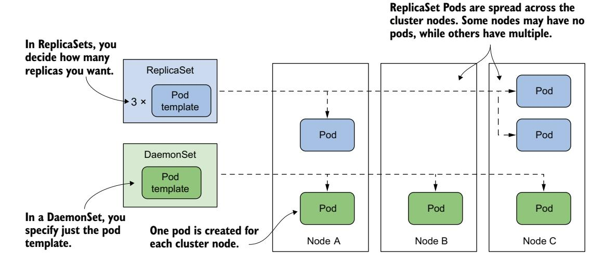
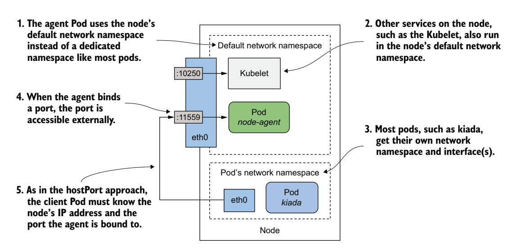

# 第 17 章 使用 DaemonSet 部署每节点工作负载

!!! tip "本章涵盖"

    - 在每个集群节点上运行代理 Pod
    - 在部分节点上运行代理 Pod
    - 允许 Pod 访问主机节点的资源
    - 为 Pod 分配优先级类
    - 与本地代理 Pod 通信

在前面的章节中，你学习了如何使用 Deployment 或 StatefulSet 将工作负载的多个副本分散到集群的各个节点上。但是，如果你希望每个节点恰好运行一个副本呢？例如，你可能希望每个节点运行一个代理或守护进程，为该节点提供系统级服务，例如指标收集或日志聚合。为了在 Kubernetes 中部署这类工作负载，我们使用 **DaemonSet**。

在开始之前，请创建 kiada 命名空间，切换到 Chapter17/ 目录，并使用以下命令应用 SETUP/ 目录中的所有清单：

```bash
$ kubectl create ns kiada
$ kubectl config set-context --current --namespace kiada
$ kubectl apply -f SETUP -R
```

!!! note ""

    本章的代码文件可在 https://github.com/luksa/kubernetes-in-action-2nd-edition/tree/master/Chapter17 获取。

## 17.1 介绍 DaemonSet

DaemonSet 是一个 API 对象，它确保每个集群节点上恰好运行一个 Pod 副本。默认情况下，守护 Pod 会部署在每个节点上，但你可以使用节点选择器将部署限制在部分节点上。

### 17.1.1 理解 DaemonSet 对象

DaemonSet 包含一个 Pod 模板，并使用它来创建多个 Pod 副本，就像 Deployment、ReplicaSet 和 StatefulSet 一样。然而，与 DaemonSet 不同的是，你不需要像其他对象那样指定所需的副本数量。相反，DaemonSet 控制器会根据集群中的节点数量创建相应数量的 Pod。它确保每个 Pod 被调度到不同的节点，而不像 ReplicaSet 部署的 Pod 那样可以将多个 Pod 调度到同一个节点，如图 17.1 所示。



图 17.1 DaemonSet 在每个节点运行一个 Pod，而 ReplicaSet 将其散布在集群中

#### 哪些类型的工作负载通过 DaemonSet 部署及其原因

DaemonSet 通常用于部署为每个集群节点提供某种系统级服务的基础设施 Pod。这包括节点系统进程及其 Pod 的日志收集、监控这些进程的守护进程；提供集群网络和存储的工具；管理软件包的安装和更新；以及为连接到节点的各种设备提供接口的服务。

Kube Proxy 组件负责为你集群中创建的 Service 对象路由流量，通常通过在 kube-system 命名空间中的 DaemonSet 进行部署。为 Pod 之间提供通信网络的容器网络接口（CNI）插件通常也通过 DaemonSet 部署。

虽然你可以使用传统方法（如 init 脚本或 systemd）在集群节点上运行系统软件，但使用 DaemonSet 可以确保你以相同的方式管理集群中的所有工作负载。

#### 理解 DaemonSet 控制器的运行方式

与 ReplicaSet 和 StatefulSet 一样，DaemonSet 包含一个 Pod 模板和一个标签选择器，用于确定哪些 Pod 属于该 DaemonSet。在其协调循环的每一轮中，DaemonSet 控制器查找与标签选择器匹配的 Pod，检查每个节点是否恰好有一个匹配的 Pod，并创建或删除 Pod 以确保满足这一条件。如图 17.2 所示。


图 17.2 DaemonSet 控制器的协调循环

当你向集群中添加节点时，DaemonSet 控制器会创建一个新的 Pod 并将其与该节点关联。当你移除节点时，DaemonSet 会删除与之关联的 Pod 对象。如果其中一个守护 Pod 消失（例如被手动删除），控制器会立即重新创建它。如果出现额外的 Pod（例如你创建了一个与 DaemonSet 中标签选择器匹配的 Pod），控制器会立即将其删除。

### 17.1.2 使用 DaemonSet 部署 Pod

DaemonSet 对象的清单看起来与 ReplicaSet、Deployment 或 StatefulSet 的清单非常相似。让我们看一个名为 demo 的 DaemonSet 示例，你可以在本书的代码仓库中的 `ds.demo.yaml` 文件中找到它。以下清单展示了完整的清单内容。

**清单 17.1 DaemonSet 清单示例**

```yaml
apiVersion: apps/v1                  # DaemonSet 属于 apps/v1
kind: DaemonSet                      # API 组和版本。
metadata:
  name: demo                         # 这个 DaemonSet 名为 demo。
spec:
  selector:                          # 标签选择器定义了哪些 Pod
    matchLabels:                     # 属于这个 DaemonSet。
      app: demo
  template:                          # 这是用于创建此 DaemonSet
    metadata:                        # Pod 的 Pod 模板。
      labels:
        app: demo
    spec:
      containers:
      - name: demo
        image: busybox
        command:
        - sleep
        - infinity
```

DaemonSet 对象类型属于 `apps/v1` API 组/版本。在对象的 `spec` 中，你指定标签选择器和 Pod 模板，就像 ReplicaSet 一样。模板中的 `metadata` 部分必须包含与选择器匹配的标签。

!!! note ""

    选择器是不可变的，但你可以更改标签，只要它们仍然与选择器匹配。如果需要更改选择器，必须删除 DaemonSet 并重新创建。你可以使用 `--cascade=orphan` 选项在替换 DaemonSet 时保留 Pod。

如清单所示，demo DaemonSet 部署的 Pod 除了执行 `sleep` 命令外什么都不做。这是因为本次练习的目的是观察 DaemonSet 本身的行为，而不是其 Pod。在本章后面，你将创建一个 Pod 执行有意义工作的 DaemonSet。

#### 快速检查 DaemonSet

使用 `kubectl apply` 应用 `ds.demo.yaml` 清单文件来创建 DaemonSet，然后按如下方式列出当前命名空间中的所有 DaemonSet：

```bash
$ kubectl get ds
NAME   DESIRED   CURRENT   READY   UP-TO-DATE   AVAILABLE   NODE SELECTOR   AGE
demo   2         2         2       2            2           <none>          7s
```

!!! note ""

    DaemonSet 的简写是 `ds`。

命令输出显示此 DaemonSet 创建了两个 Pod。在你的环境中，数量可能不同，因为它取决于集群中节点的数量和类型，我将在本节后面解释。

与 ReplicaSet、Deployment 和 StatefulSet 一样，你可以使用 `-o wide` 选项运行 `kubectl get` 来同时显示容器的名称和镜像以及标签选择器。

```bash
$ kubectl get ds -o wide
NAME   DESIRED   CURRENT   ...   CONTAINERS   IMAGES    SELECTOR
demo   2         2         ...   demo         busybox   app=demo
```

#### 详细检查 DaemonSet

`-o wide` 选项是查看每个 DaemonSet 创建的 Pod 中运行内容的最快方式。但如果你想查看 DaemonSet 的更详细信息，可以使用 `kubectl describe` 命令，其输出如下：

```yaml
$ kubectl describe ds demo
Name:           demo
Selector:       app=demo
Node-Selector:  <none>
Labels:         <none>
Annotations:    deprecated.daemonset.template.generation: 1
Desired Number of Nodes Scheduled: 2
Current Number of Nodes Scheduled: 2
Number of Nodes Scheduled with Up-to-date Pods: 2
Number of Nodes Scheduled with Available Pods: 2
Number of Nodes Misscheduled: 0
Pods Status:    2 Running / 0 Waiting / 0 Succeeded / 0 Failed
Pod Template:
  Labels:       app=demo
  Containers:
   demo:
    Image:      busybox
    Command:
      sleep
      infinity
Events:
  Type    Reason            Age   From                  Message
  ----    ------            ----  ----                  -------
  Normal  SuccessfulCreate  15s   daemonset-controller  Created pod: demo-w8tgm
  Normal  SuccessfulCreate  15s   daemonset-controller  Created pod: demo-wqd22
```

`kubectl describe` 命令的输出包括对象的标签和注解信息、用于查找此 DaemonSet Pod 的标签选择器、这些 Pod 的数量和状态、用于创建它们的模板以及与此 DaemonSet 关联的事件。

#### 理解 DaemonSet 的状态

在每次协调过程中，DaemonSet 控制器会将 DaemonSet 的状态报告在对象的 `status` 部分。让我们查看 demo DaemonSet 的状态。运行以下命令打印对象的 YAML 清单：

```bash
$ kubectl get ds demo -o yaml
```

```yaml
...
status:
  currentNumberScheduled: 2
  desiredNumberScheduled: 2
  numberAvailable: 2
  numberMisscheduled: 0
  numberReady: 2
  observedGeneration: 1
  updatedNumberScheduled: 2
```

如你所见，DaemonSet 的状态由多个整数字段组成。表 17.1 解释了这些字段中数字的含义。

**表 17.1 DaemonSet 状态字段**

| 值 | 描述 |
|---|---|
| currentNumberScheduled | 运行至少一个与此 DaemonSet 关联的 Pod 的节点数量。 |
| desiredNumberScheduled | 应该运行守护 Pod 的节点数量，无论它们是否实际运行了该 Pod。 |
| numberAvailable | 运行至少一个可用守护 Pod 的节点数量。 |
| numberMisscheduled | 正在运行守护 Pod 但不应该运行它的节点数量。 |
| numberReady | 至少有一个守护 Pod 运行且就绪的节点数量。 |
| updatedNumberScheduled | 其守护 Pod 相对于 DaemonSet 中的 Pod 模板是最新的节点数量。 |

状态中还包含 `observedGeneration` 字段，它与 DaemonSet Pod 无关。你可以在几乎所有具有 `spec` 和 `status` 的对象中找到此字段。

你会注意到前表中解释的所有状态字段都表示节点数量，而不是 Pod 数量。有些字段描述还暗示一个节点上可能运行多个守护 Pod，即使 DaemonSet 本应在每个节点上只运行一个 Pod。原因是当你更新 DaemonSet 的 Pod 模板时，控制器会在旧 Pod 旁边运行一个新 Pod，直到新 Pod 可用。当你观察 DaemonSet 的状态时，你关心的不是集群中 Pod 的总数，而是 DaemonSet 服务的节点数量。

#### 理解为什么守护 Pod 数量少于节点数量

在上一节中，你看到 DaemonSet 状态显示有两个 Pod 与 demo DaemonSet 关联。这出乎意料，因为我的集群有三个节点，而不仅仅是两个。

我提到过你可以使用节点选择器将 DaemonSet 的 Pod 限制在某些节点上。然而，demo DaemonSet 没有指定节点选择器，所以在有三个节点的集群中，你会期望创建三个 Pod。这是怎么回事？让我们通过使用 DaemonSet 中定义的相同标签选择器列出守护 Pod 来揭开这个谜底。

!!! note ""

    不要将标签选择器与节点选择器混淆；前者用于将 Pod 与 DaemonSet 关联，而后者用于将 Pod 与节点关联。

DaemonSet 中的标签选择器是 `app=demo`。使用 `-l`（或 `--selector`）选项将其传递给 `kubectl get` 命令。此外，使用 `-o wide` 选项显示每个 Pod 的节点。完整的命令及其输出如下：

```bash
$ kubectl get pods -l app=demo -o wide
NAME         READY   STATUS    RESTARTS   AGE   IP            NODE          ...
demo-w8tgm   1/1     Running   0          80s   10.244.2.42   kind-worker   ...
demo-wqd22   1/1     Running   0          80s   10.244.1.64   kind-worker2  ...
```

现在列出集群中的节点并比较两个列表：

```bash
$ kubectl get nodes
NAME                  STATUS   ROLES                  AGE   VERSION
kind-control-plane    Ready    control-plane,master   22h   v1.23.4
kind-worker           Ready    <none>                 22h   v1.23.4
kind-worker2          Ready    <none>                 22h   v1.23.4
```

看起来 DaemonSet 控制器只在工作节点上部署了 Pod，而没有在运行集群控制平面组件的 master 节点上部署。这是为什么呢？

事实上，如果你使用的是多节点集群，那么很可能你在前面章节中部署的 Pod 都没有被调度到托管控制平面的节点上，例如使用 kind 工具创建的集群中的 `kind-control-plane` 节点。顾名思义，此节点仅用于运行控制集群的 Kubernetes 组件。在第 2 章中，你了解到容器有助于隔离工作负载，但这种隔离不如使用多台独立的虚拟机或物理机那样好。在控制平面节点上运行的异常工作负载可能会对整个集群的运行产生负面影响。因此，Kubernetes 仅在你明确允许时才会将工作负载调度到控制平面节点。此规则也适用于通过 DaemonSet 部署的工作负载。

#### 在控制平面节点上部署守护 Pod

阻止常规 Pod 调度到控制平面节点的机制称为**污点和容忍**。这里，你只会学习如何让 DaemonSet 在所有节点上部署 Pod。如果守护 Pod 提供了需要在集群所有节点上运行的关键服务，则可能需要这样做。Kubernetes 本身至少有一个这样的服务——Kube Proxy。在当今的大多数集群中，Kube Proxy 是通过 DaemonSet 部署的。你可以通过列出 kube-system 命名空间中的 DaemonSet 来检查集群中是否属于这种情况：

```bash
$ kubectl get ds -n kube-system
NAME         DESIRED   CURRENT   READY   UP-TO-DATE   AVAILABLE   NODE SELECTOR            AGE
kindnet      3         3         3       3            3           <none>                   23h
kube-proxy   3         3         3       3            3           kubernetes.io/os=linux   23h
```

如果你像我一样使用 kind 工具运行集群，你会看到两个 DaemonSet。除了 kube-proxy DaemonSet，你还会发现一个名为 kindnet 的 DaemonSet。这个 DaemonSet 部署的 Pod 通过 CNI（容器网络接口）为集群中所有 Pod 提供网络。

上一个命令的输出中的数字表明，这些 DaemonSet 的 Pod 部署在所有集群节点上。它们的清单揭示了它们是如何做到这一点的。按如下方式显示 kube-proxy DaemonSet 的清单，并查找我高亮显示的行：

```bash
$ kubectl get ds kube-proxy -n kube-system -o yaml
apiVersion: apps/v1
kind: DaemonSet
...
spec:
  template:
    spec:
      ...
      tolerations:                      # 这告诉 Kubernetes，使用此模板
      - operator: Exists                # 创建的 Pod 容忍所有节点污点。
      volumes:
      ...
```

高亮显示的行并非不言自明，不深入探讨污点和容忍的细节很难解释清楚。简而言之，某些节点可能指定了污点，Pod 必须容忍节点上的污点才能被调度到该节点。前面示例中的两行允许 Pod 容忍所有可能的污点，因此可以将其视为在所有节点上部署守护 Pod 的一种方式。

如你所见，这些行是 Pod 模板的一部分，而不是 DaemonSet 的直接属性。尽管如此，DaemonSet 控制器会考虑它们，因为创建一个被节点拒绝的 Pod 是没有意义的。

#### 检查守护 Pod

现在让我们回到 demo DaemonSet，进一步了解它创建的 Pod。取出其中一个 Pod 并按如下方式显示其清单：

```bash
$ kubectl get po demo-w8tgm -o yaml     # 将 Pod 名称替换为你集群中的 Pod。
apiVersion: v1
kind: Pod
metadata:
  creationTimestamp: "2022-03-23T19:50:35Z"
  generateName: demo-
  labels:
    app: demo                           # 一个标签来自 Pod 模板，另外两个
    controller-revision-hash: 8669474b5b # 由 DaemonSet 控制器添加。
    pod-template-generation: "1"
  name: demo-w8tgm
  namespace: bookinfo
  ownerReferences:                      # 守护 Pod 直接由
  - apiVersion: apps/v1                 # DaemonSet 拥有。
    blockOwnerDeletion: true
    controller: true
    kind: DaemonSet
    name: demo
    uid: 7e1da779-248b-4ff1-9bdb-5637dc6b5b86
  resourceVersion: "67969"
  uid: 2d044e7f-a237-44ee-aa4d-1fe42c39da4e
spec:
  affinity:
    nodeAffinity:                       # 每个 Pod 都有对特定
      requiredDuringSchedulingIgnoredDuringExecution: # 节点的亲和性。
        nodeSelectorTerms:
        - matchFields:
          - key: metadata.name
            operator: In
            values:
            - kind-worker
  containers:
  ...
```

DaemonSet 中的每个 Pod 都会获得你在 Pod 模板中定义的标签，以及 DaemonSet 控制器自身添加的一些额外标签。你可以忽略 `pod-template-generation` 标签，因为它已经过时了。它已被 `controller-revision-hash` 标签所取代。你可能还记得在上一章的 StatefulSet Pod 中看到过这个标签。它的作用相同——允许控制器在更新期间区分使用旧 Pod 模板和新 Pod 模板创建的 Pod。

`ownerReferences` 字段表明守护 Pod 直接属于 DaemonSet 对象，就像有状态 Pod 属于 StatefulSet 对象一样。DaemonSet 和 Pod 之间没有中间对象，这与 Deployment 及其 Pod 的情况不同。

在守护 Pod 的清单中，我要提请注意的最后一项是 `spec.affinity` 部分。你应该能看出 `nodeAffinity` 字段指示此特定 Pod 需要被调度到 `kind-worker` 节点。这部分清单不包含在 DaemonSet 的 Pod 模板中，而是由 DaemonSet 控制器添加到它创建的每个 Pod 中。每个 Pod 的节点亲和性配置不同，以确保 Pod 被调度到特定的节点。

在 Kubernetes 的旧版本中，DaemonSet 控制器在 Pod 的 `spec.nodeName` 字段中指定目标节点，这意味着 DaemonSet 控制器直接调度 Pod 而不涉及 Kubernetes 调度器。现在，DaemonSet 控制器设置 `nodeAffinity` 字段并保留 `nodeName` 字段为空。这将调度工作留给调度器，调度器还会考虑 Pod 的资源需求和其他属性。

### 17.1.3 使用节点选择器部署到部分节点

DaemonSet 将 Pod 部署到所有没有 Pod 不兼容污点的集群节点上，但你可能希望某个特定的工作负载只在部分节点上运行。例如，如果只有部分节点具有特殊硬件，你可能希望只在那些节点上运行相关软件，而不是在所有节点上。使用 DaemonSet，你可以通过在 Pod 模板中指定节点选择器来实现这一点。请注意节点选择器和 Pod 选择器之间的区别。DaemonSet 控制器使用前者来过滤符合条件的节点，而使用后者来知道哪些 Pod 属于该 DaemonSet。如图 17.3 所示，DaemonSet 仅在节点标签与节点选择器匹配时才为该节点创建 Pod。


图 17.3 使用节点选择器在部分节点上部署 DaemonSet Pod

图中显示了一个 DaemonSet，它仅在包含 CUDA 加速 GPU 且标记有 `gpu: cuda` 标签的节点上部署 Pod。DaemonSet 控制器仅在节点 B 和 C 上部署 Pod，而忽略节点 A，因为它的标签与 DaemonSet 中指定的节点选择器不匹配。

!!! note ""

    CUDA（Compute Unified Device Architecture，统一计算设备架构）是一种并行计算平台和 API，允许软件使用兼容的图形处理单元（GPU）进行通用计算。

#### 在 DaemonSet 中指定节点选择器

你在 Pod 模板的 `spec.nodeSelector` 字段中指定节点选择器。以下清单显示了你之前创建的同一个 demo DaemonSet，但配置了节点选择器，使 DaemonSet 仅将 Pod 部署到具有 `gpu: cuda` 标签的节点上。你可以在 `ds.demo.nodeSelector.yaml` 文件中找到此清单。

**清单 17.2 带有节点选择器的 DaemonSet**

```yaml
apiVersion: apps/v1
kind: DaemonSet
metadata:
  name: demo
  labels:
    app: demo
spec:
  selector:
    matchLabels:
      app: demo
  template:
    metadata:
      labels:
        app: demo
    spec:
      nodeSelector:             # 此 DaemonSet 的 Pod 仅部署
        gpu: cuda               # 在具有此标签的节点上。
      containers:
      - name: demo
        image: busybox
        command:
        - sleep
        - infinity
```

使用 `kubectl apply` 命令使用此清单文件更新 demo DaemonSet。使用 `kubectl get` 命令查看 DaemonSet 的状态：

```bash
$ kubectl get ds
NAME   DESIRED   CURRENT   READY   UP-TO-DATE   AVAILABLE   NODE SELECTOR   AGE
demo   0         0         0       0            0           gpu=cuda        46m
```

如你所见，现在 demo DaemonSet 没有部署任何 Pod，因为没有节点的标签与 DaemonSet 中指定的节点选择器匹配。你可以通过如下方式使用节点选择器列出节点来确认这一点：

```bash
$ kubectl get nodes -l gpu=cuda
No resources found
```

#### 通过更改节点标签使节点进入和退出 DaemonSet 的范围

现在假设你刚在 `kind-worker2` 节点上安装了 CUDA 加速 GPU。你按如下方式向节点添加标签：

```bash
$ kubectl label node kind-worker2 gpu=cuda
node/kind-worker2 labeled
```

DaemonSet 控制器不仅监视 DaemonSet 和 Pod，还监视 Node 对象。当它检测到 `kind-worker2` 节点的标签发生变化时，它会运行协调循环并为此节点创建一个 Pod，因为现在它匹配了节点选择器。列出 Pod 以确认：

```bash
$ kubectl get pods -l app=demo -o wide
NAME         READY   STATUS    RESTARTS   AGE   IP            NODE           ...
demo-jbhqg   1/1     Running   0          16s   10.244.1.65   kind-worker2   ...
```

当你从节点移除标签时，控制器会删除该 Pod：

```bash
$ kubectl label node kind-worker2 gpu-     # 从节点移除 gpu 标签。
node/kind-worker2 unlabeled
$ kubectl get pods -l app=demo             # DaemonSet 控制器删除该 Pod。
NAME         READY   STATUS        RESTARTS   AGE
demo-jbhqg   1/1     Terminating   0          71s
```

#### 在 DaemonSet 中使用标准节点标签

Kubernetes 会自动向每个节点添加一些标准标签。使用 `kubectl describe` 命令查看它们。例如，我的 `kind-worker2` 节点的标签如下：

```bash
$ kubectl describe node kind-worker2
Name:               kind-worker2
Roles:              <none>
Labels:             gpu=cuda
                    kubernetes.io/arch=amd64
                    kubernetes.io/hostname=kind-worker2
                    kubernetes.io/os=linux
```

你可以在 DaemonSet 中使用这些标签，根据每个节点的属性来部署 Pod。例如，如果你的集群包含使用不同操作系统或架构的异构节点，你可以通过在节点选择器中使用 `kubernetes.io/arch` 和 `kubernetes.io/os` 标签来配置 DaemonSet 以目标特定的操作系统和/或架构。

假设你的集群包含基于 AMD 和 ARM 的节点。你的节点代理容器镜像有两个版本。一个为 AMD CPU 编译，另一个为 ARM CPU 编译。你可以创建一个 DaemonSet 将基于 AMD 的镜像部署到 AMD 节点，另一个 DaemonSet 将基于 ARM 的镜像部署到其他节点。第一个 DaemonSet 将使用以下节点选择器：

```yaml
nodeSelector:
  kubernetes.io/arch: amd64
```

另一个 DaemonSet 将使用以下节点选择器：

```yaml
nodeSelector:
  kubernetes.io/arch: arm
```

如果两种 Pod 类型的配置不仅在容器镜像上不同，而且在你希望为每个容器提供的计算资源量上也不同，那么这种多 DaemonSet 方法就是理想的选择。

!!! note ""

    如果你只想让每个节点运行与节点架构对应的正确变体的容器镜像，并且 Pod 之间没有其他差异，则不需要多个 DaemonSet。在这种情况下，使用单个 DaemonSet 配合多架构容器镜像是更好的选择。

#### 更新节点选择器

与 Pod 标签选择器不同，节点选择器是可变的。你可以随时更改它以更改 DaemonSet 应该目标的节点集合。更改选择器的一种方法是使用 `kubectl patch` 命令。在第 15 章中，你学习了如何通过指定要更新的清单部分来修补对象。但是，你还可以通过使用 JSON patch 格式指定一系列修补操作来更新对象。你可以在 [jsonpatch.com](http://jsonpatch.com) 了解有关此格式的更多信息。这里我展示一个示例，说明如何使用 JSON patch 从 demo DaemonSet 的对象清单中删除 `nodeSelector` 字段：

```bash
$ kubectl patch ds demo --type='json' -p='[{
"op": "remove",
"path": "/spec/template/spec/nodeSelector"}]'
daemonset.apps/demo patched
```

此命令中的 JSON patch 不是提供对象清单的更新部分，而是指定应删除 `spec.template.spec.nodeSelector` 字段。

### 17.1.4 更新 DaemonSet

与 Deployment 和 StatefulSet 一样，当你更新 DaemonSet 中的 Pod 模板时，控制器会自动删除属于该 DaemonSet 的 Pod，并用使用新模板创建的 Pod 替换它们。你可以在 DaemonSet 对象清单中的 `spec.updateStrategy` 字段中配置要使用的更新策略，但 `spec.minReadySeconds` 字段也会产生影响，就像 Deployment 和 StatefulSet 一样。在撰写本文时，DaemonSet 支持表 17.2 中列出的策略。

**表 17.2 支持的 DaemonSet 更新策略**

| 值 | 描述 |
|---|---|
| RollingUpdate | 在此更新策略中，Pod 被逐个替换。当 Pod 被删除并重新创建后，控制器会等待直到新 Pod 就绪。然后它会额外等待 `spec.minReadySeconds` 字段中指定的时间，再更新其他节点上的 Pod。这是默认策略。 |
| OnDelete | DaemonSet 控制器以半自动方式执行更新。它等待你手动删除每个 Pod，然后用更新后的模板中的新 Pod 替换它。使用此策略，你可以按照自己的节奏替换 Pod。 |

`RollingUpdate` 策略类似于 Deployment 中的策略，而 `OnDelete` 策略就像 StatefulSet 中的策略。与 Deployment 一样，你可以使用 `maxSurge` 和 `maxUnavailable` 参数配置 `RollingUpdate` 策略，但这些参数在 DaemonSet 中的默认值不同。下一节解释了原因。

#### RollingUpdate 策略

要更新 demo DaemonSet 的 Pod，请使用 `kubectl apply` 命令应用 `ds.demo.v2.rollingUpdate.yaml` 清单文件。其内容如下面的清单所示。

**清单 17.3 在 DaemonSet 中指定 RollingUpdate 策略**

```yaml
apiVersion: apps/v1
kind: DaemonSet
metadata:
  name: demo
spec:
  minReadySeconds: 30                   # 每个 Pod 必须就绪 30 秒后才被认为可用。
  updateStrategy:
    type: RollingUpdate                 # 使用 RollingUpdate 策略，并指定参数。
    rollingUpdate:
      maxSurge: 0
      maxUnavailable: 1
  selector:
    matchLabels:
      app: demo
  template:
    metadata:
      labels:
        app: demo
        ver: v2                         # 更新后的 Pod 模板为 Pod 添加了版本标签。
    spec:
      ...
```

在清单中，`updateStrategy` 的类型是 `RollingUpdate`，`maxSurge` 设置为 0，`maxUnavailable` 设置为 1。

!!! note ""

    这些是默认值，因此你也可以完全删除 `updateStrategy` 字段，更新会以相同的方式执行。

当你应用此清单时，Pod 的替换过程如下：

```bash
$ kubectl get pods -l app=demo -L ver
NAME         READY   STATUS        RESTARTS   AGE   VER
demo-5nrz4   1/1     Terminating   0          10m
demo-vx27t   1/1     Running       0          11m         # 首先，删除一个节点上的一个 Pod。
```

```bash
$ kubectl get pods -l app=demo -L ver
NAME         READY   STATUS        RESTARTS   AGE   VER
demo-k2d6k   1/1     Running       0          36s   v2
demo-vx27t   1/1     Terminating   0          11m         # 第一个节点上的替换 Pod 就绪 30 秒后，删除下一个节点上的 Pod。
```

```bash
$ kubectl get pods -l app=demo -L ver
NAME         READY   STATUS    RESTARTS   AGE    VER
demo-k2d6k   1/1     Running   0          62s    v2
demo-s7hsc   1/1     Running   0          126s   v2         # 第二个节点上的替换 Pod 就绪 30 秒后，更新完成。
```

由于 `maxSurge` 设置为零，DaemonSet 控制器首先停止现有的守护 Pod，然后再创建新的。巧合的是，零也是 `maxSurge` 的默认值，因为这是守护 Pod 最合理的行为，考虑到这些 Pod 中的工作负载通常是节点代理和守护进程，同一时间只应运行一个实例。

如果你将 `maxSurge` 设置为大于零的值，则在更新期间，Pod 的两个实例会在节点上同时运行，持续时间为 `minReadySeconds` 字段中指定的时间。大多数守护进程不支持此模式，因为它们使用锁来防止多个实例同时运行。如果你尝试以这种方式更新这样的守护进程，新 Pod 将永远无法就绪，因为它无法获取锁，更新将失败。

`maxUnavailable` 参数设置为 1，这意味着 DaemonSet 控制器每次只更新一个节点。在前一个节点上的 Pod 就绪并可用之前，它不会开始更新下一个节点上的 Pod。这样，如果新版本的工作负载在新 Pod 中无法启动，只有一个节点会受到影响。

如果你希望 Pod 以更快的速度更新，可以增大 `maxUnavailable` 参数。如果你将其设置为大于集群节点数的值，守护 Pod 将在所有节点上同时更新，就像 Deployment 中的 `Recreate` 策略一样。

!!! tip "提示"

    要在 DaemonSet 中实现 `Recreate` 更新策略，请将 `maxSurge` 参数设置为 0，将 `maxUnavailable` 设置为 10000 或更高，以确保此值始终大于集群中的节点数。

DaemonSet 滚动更新的一个重要注意事项是：如果现有守护 Pod 的就绪探针失败，DaemonSet 控制器会立即删除该 Pod 并用更新后模板的 Pod 替换它。在这种情况下，`maxSurge` 和 `maxUnavailable` 参数将被忽略。

同样，如果你在滚动更新期间删除一个现有的 Pod，它会被新 Pod 替换。如果你将 DaemonSet 配置为 `OnDelete` 更新策略，也会发生同样的情况。让我们也快速了解一下此策略。

#### OnDelete 更新策略

`RollingUpdate` 策略的替代方案是 `OnDelete`。正如你从上一章 StatefulSet 中了解到的，这是一种半自动策略，允许你与 DaemonSet 控制器配合，按自己的判断替换 Pod，如以下练习所示。以下清单显示了 `ds.demo.v3.onDelete.yaml` 清单文件的内容。

**清单 17.4 在 DaemonSet 中指定 OnDelete 策略**

```yaml
apiVersion: apps/v1
kind: DaemonSet
metadata:
  name: demo
spec:
  updateStrategy:
    type: OnDelete                 # 使用 OnDelete 更新策略。此策略没有可设置的参数。
  selector:
    matchLabels:
      app: demo
  template:
    metadata:
      labels:
        app: demo
        ver: v3                    # Pod 模板更新为将版本标签设置为 v3。
    spec:
      ...
```

`OnDelete` 策略没有任何可以设置以影响其工作方式的参数，因为控制器只更新你手动删除的 Pod。使用 `kubectl apply` 应用此清单文件，然后检查 DaemonSet，如下所示，可以看到 DaemonSet 控制器没有采取任何行动：

```bash
$ kubectl get ds
NAME   DESIRED   CURRENT   READY   UP-TO-DATE   AVAILABLE   NODE SELECTOR   AGE
demo   2         2         2       0            2           <none>          80m
```

`kubectl get ds` 命令的输出显示此 DaemonSet 中没有任何 Pod 是最新的。这在意料之中，因为你更新了 DaemonSet 中的 Pod 模板，但 Pod 尚未更新，如你在列出它们时所看到的：

```bash
$ kubectl get pods -l app=demo -L ver
NAME         READY   STATUS    RESTARTS   AGE   VER
demo-k2d6k   1/1     Running   0          10m   v2       # 两个 Pod 都仍然是 v2，但
demo-s7hsc   1/1     Running   0          10m   v2       # Pod 模板中的版本标签是 v3。
```

要更新 Pod，你必须手动删除它们。你可以删除任意数量的 Pod，以任何顺序，但现在让我们只删除一个。选择一个 Pod 并按如下方式删除：

```bash
$ kubectl delete po demo-k2d6k --wait=false       # 将 Pod 名称替换为你集群中的 Pod。
pod "demo-k2d6k" deleted
```

你可能还记得，默认情况下，`kubectl delete` 命令在对象删除完成之前不会退出。如果你使用 `--wait=false` 选项，该命令会将对象标记为删除并退出，而不等待 Pod 实际被删除。这样，你可以通过多次列出 Pod 来跟踪幕后发生的事情，如下所示：

```bash
$ kubectl get pods -l app=demo -L ver
NAME         READY   STATUS        RESTARTS   AGE   VER
demo-k2d6k   1/1     Terminating   0          10m   v2       # 你删除的 Pod 正在被终止。
demo-s7hsc   1/1     Running       0          10m   v2

$ kubectl get pods -l app=demo -L ver
NAME         READY   STATUS    RESTARTS   AGE   VER
demo-4gf5h   1/1     Running   0          15s   v3       # 你删除的 Pod 被一个 v3 版本的 Pod 替换了，
demo-s7hsc   1/1     Running   0          11m   v2       # 但另一个 Pod 仍然是 v2。
```

如果你按如下方式使用 `kubectl get` 命令列出 DaemonSet，你会看到只有一个 Pod 被更新：

```bash
$ kubectl get ds
NAME   DESIRED   CURRENT   READY   UP-TO-DATE   AVAILABLE   NODE SELECTOR   AGE
demo   2         2         2       1            2           <none>          91m
                                                             # 一个 Pod 已被更新。
```

删除剩余的 Pod 以完成更新。

#### 考虑对关键的守护 Pod 使用 OnDelete 策略

使用此策略，你可以以更多的控制力（尽管需要更多的努力）更新对集群关键的 Pod。这样，你可以确保更新不会破坏整个集群，而在完全自动化的更新中，如果守护 Pod 中的就绪探针无法检测到所有可能的问题，就可能会发生这种情况。

例如，DaemonSet 中定义的就绪探针可能不会检查同一节点上的其他 Pod 是否仍然正常工作。如果更新后的守护 Pod 在 `minReadySeconds` 时间内就绪，控制器将继续在下一个节点上执行更新，即使第一个节点的更新导致该节点上的所有其他 Pod 失败。故障的级联效应可能会使整个集群瘫痪。然而，如果你使用 `OnDelete` 策略执行更新，你可以在更新每个守护 Pod 之后、删除下一个 Pod 之前验证其他 Pod 的运行情况。

### 17.1.5 删除 DaemonSet

在结束对 DaemonSet 的介绍之前，按如下方式删除 demo DaemonSet：

```bash
$ kubectl delete ds demo
daemonset.apps "demo" deleted
```

正如你所预期的，这样做也会删除所有 demo Pod。要确认这一点，按如下方式列出 Pod：

```bash
$ kubectl get pods -l app=demo
NAME         READY   STATUS        RESTARTS   AGE
demo-4gf5h   1/1     Terminating   0          2m22s
demo-s7hsc   1/1     Terminating   0          6m53s
```

到此为止，关于 DaemonSet 本身的解释就结束了。但是，通过 DaemonSet 部署的 Pod 与通过 Deployment 和 StatefulSet 部署的 Pod 不同，因为它们通常需要访问主机节点的文件系统、网络接口或其他硬件。你将在下一节中学习相关内容。

## 17.2 运行节点代理和守护进程的 Pod 的特殊功能

与通常与运行的节点隔离的常规工作负载不同，节点代理和守护进程通常需要更高级别的节点访问权限。如你所知，运行在 Pod 中的容器无法访问节点的设备和文件，也无法对节点内核进行所有系统调用，因为它们生活在自己的 Linux 命名空间中（参见第 2 章）。如果你希望运行在 Pod 中的守护进程、代理或其他工作负载免受此限制，则必须在 Pod 清单中指定这一点。

为了说明如何做到这一点，让我们看看 kube-system 命名空间中的 DaemonSet。如果你通过 kind 运行 Kubernetes，你的集群应该包含以下两个 DaemonSet：

```bash
$ kubectl get ds -n kube-system
NAME         DESIRED   CURRENT   READY   UP-TO-DATE   AVAILABLE   NODE SELECTOR            AGE
kindnet      3         3         3       3            3           <none>                   23h
kube-proxy   3         3         3       3            3           kubernetes.io/os=linux   23h
```

如果你不使用 kind，kube-system 中的 DaemonSet 列表可能看起来不同，但在大多数集群中你应该能找到 kube-proxy DaemonSet，所以我会重点讨论这个。

### 17.2.1 赋予容器访问操作系统内核的权限

操作系统内核提供系统调用，程序可以使用这些调用来与操作系统和硬件交互。其中一些调用是无害的，而其他调用可能会对节点或在其上运行的其他容器产生负面影响。因此，容器不允许执行这些调用，除非明确允许。这可以通过两种方式实现。你可以为容器赋予对内核的完全访问权限，或者通过指定要赋予容器的能力来获取对特定系统调用组的访问权限。

#### 运行特权容器

如果你希望为容器中运行的进程赋予对操作系统内核的完全访问权限，可以将容器标记为特权容器。你可以通过检查 kube-proxy DaemonSet 中的 Pod 模板来了解如何做到这一点：

```bash
$ kubectl -n kube-system get ds kube-proxy -o yaml
apiVersion: apps/v1
kind: DaemonSet
spec:
  template:
    spec:
      containers:
      - name: kube-proxy
        securityContext:              # kube-proxy 容器
          privileged: true            # 被标记为特权容器。
        ...
```

kube-proxy DaemonSet 运行只有一个容器的 Pod，也称为 kube-proxy。在此容器定义的 `securityContext` 部分中，`privileged` 标志被设置为 `true`。这为运行在 kube-proxy 容器中的进程提供了对主机内核的 root 访问权限，并允许它修改节点的网络数据包过滤规则。这就是 Kubernetes Service 的实现方式。

#### 赋予容器访问特定能力的权限

特权容器绕过所有内核权限检查，因此对内核具有完全访问权限，而节点代理或守护进程通常只需要访问内核提供的系统调用的一个子集。从安全角度来看，将此类工作负载作为特权容器运行远非理想。相反，你应该只授予工作负载访问其完成任务所需的最小系统调用集的权限。你可以通过在容器定义中指定它所需的能力来实现这一点。

kube-proxy DaemonSet 不使用能力，但 kube-system 命名空间中的其他 DaemonSet 可能会使用。一个例子是 kindnet DaemonSet，它在 kind 配置的集群中设置 Pod 网络。Pod 模板中列出的能力如下：

```bash
$ kubectl -n kube-system get ds kindnet -o yaml
apiVersion: apps/v1
kind: DaemonSet
spec:
  template:
    spec:
      containers:
      - name: kindnet-cni
        securityContext:
          capabilities:
            add:                      # 将 NET_RAW 和
            - NET_RAW                 # NET_ADMIN 能力
            - NET_ADMIN               # 添加到容器中。
          privileged: false           # 容器不是特权容器。
```

容器没有被赋予完全特权，而是添加了 `NET_RAW` 和 `NET_ADMIN` 能力。根据能力手册页（你可以使用 Linux 系统上的 `man capabilities` 命令查看），`NET_RAW` 能力允许容器使用特殊套接字类型并绑定到任何地址，而 `NET_ADMIN` 能力允许各种特权网络相关操作，例如接口配置、防火墙管理、更改路由表等等——这些正是你期望从一个为节点上所有其他 Pod 设置网络的容器中看到的功能。

### 17.2.2 访问节点的文件系统

节点代理或守护进程可能需要访问主机节点的文件系统。例如，通过 DaemonSet 部署的节点代理可以用于在所有集群节点上安装软件包。

你已经在第 8 章中学习了如何通过 hostPath 卷为 Pod 的容器赋予对主机节点文件系统的访问权限，所以我不会再详细讨论，但看看在守护 Pod 的上下文中如何使用这种卷类型会很有趣。

让我们再看看 kube-proxy DaemonSet。在 Pod 模板中，你会发现两个 hostPath 卷，如下所示：

```bash
$ kubectl -n kube-system get ds kube-proxy -o yaml
apiVersion: apps/v1
kind: DaemonSet
spec:
  template:
    spec:
      volumes:
      - hostPath:
          path: /run/xtables.lock         # 此卷允许容器中的进程
          type: FileOrCreate              # 访问节点的 xtables.lock 文件。
        name: xtables-lock
      - hostPath:
          path: /lib/modules              # 此卷允许访问包含
          type: ""                        # 内核模块的目录。
        name: lib-modules
```

第一个卷允许 kube-proxy 守护 Pod 中的进程访问节点的 `xtables.lock` 文件，该文件由进程用来操作节点 IP 数据包过滤的 iptables 或 nftables 工具使用。另一个 hostPath 卷允许进程访问节点上安装的内核模块。

### 17.2.3 使用节点的网络和其他命名空间

如你所知，每个 Pod 都有自己的网络接口。但是，你可能希望某些 Pod（特别是那些通过 DaemonSet 部署的 Pod）使用节点的网络接口而不是它们自己的。通过 kube-proxy DaemonSet 部署的 Pod 使用了这种方法。你可以通过检查 Pod 模板来了解这一点：

```bash
$ kubectl -n kube-system get ds kube-proxy -o yaml
apiVersion: apps/v1
kind: DaemonSet
spec:
  template:
    spec:
      dnsPolicy: ClusterFirst
      hostNetwork: true                  # kube-proxy Pod 使用节点的网络接口
      ...                                # 而不是它们自己的。
```

在 Pod 的 `spec` 中，`hostNetwork` 字段被设置为 `true`。这使得 Pod 使用主机节点的网络环境（设备、协议栈和端口），而不是拥有自己的，就像所有其他直接在节点上运行而非在容器中运行的进程一样。这意味着 Pod 甚至不会获得自己的 IP 地址，而是使用节点的地址。如果你使用 `-o wide` 选项列出 kube-system 命名空间中的 Pod，如下所示，你会看到 kube-proxy Pod 的 IP 与其各自主机节点的 IP 匹配。

```bash
$ kubectl -n kube-system get po -o wide
NAME               READY   STATUS    RESTARTS   AGE   IP           ...
kube-proxy-gj9pd   1/1     Running   0          90m   172.18.0.4   ...
kube-proxy-rhjqr   1/1     Running   0          90m   172.18.0.2   ...
kube-proxy-vq5g8   1/1     Running   0          90m   172.18.0.3   ...
                                                # 每个 Pod 的 IP 与
                                                # 它所在节点的 IP 匹配。
```

将守护 Pod 配置为使用主机节点的网络在 Pod 中运行的进程需要能通过节点 IP 地址的网络端口被访问时非常有用。

!!! note ""

    另一种选择是 Pod 使用自己的网络，但通过使用容器端口列表中的 `hostPort` 字段将一个或多个主机端口转发到容器。你将在后面学习如何做到这一点。

配置了 `hostNetwork: true` 的 Pod 中的容器继续使用其他命名空间类型，因此它们在其他方面与节点保持隔离。例如，它们使用自己的 IPC 和 PID 命名空间，因此它们无法看到其他进程或通过进程间通信与它们通信。如果你希望守护 Pod 使用节点的 IPC 和 PID 命名空间，可以使用 Pod `spec` 中的 `hostIPC` 和 `hostPID` 属性进行配置。

### 17.2.4 将守护 Pod 标记为关键

一个节点可以运行一些系统 Pod 和许多常规工作负载 Pod。你不希望 Kubernetes 对这两类 Pod 一视同仁，因为系统 Pod 可能比非系统 Pod 更重要。例如，如果系统 Pod 因为节点已满而无法调度到节点上，Kubernetes 应该驱逐一些非系统 Pod 以为系统 Pod 腾出空间。

#### 介绍优先级类

默认情况下，通过 DaemonSet 部署的 Pod 并不比通过 Deployment 或 StatefulSet 部署的 Pod 更重要。要将你的守护 Pod 标记为更重要或不太重要，你可以使用 Pod 优先级类。它们由 PriorityClass 对象表示。你可以按如下方式列出它们：

```bash
$ kubectl get priorityclasses
NAME                      VALUE        GLOBAL-DEFAULT   AGE
system-cluster-critical   2000000000   false            9h
system-node-critical      2000001000   false            9h
```

每个集群通常带有两个优先级类——`system-cluster-critical` 和 `system-node-critical`——但你也可以创建自己的。顾名思义，`system-cluster-critical` 类中的 Pod 对集群的运行至关重要。`system-node-critical` 类中的 Pod 对单个节点的运行至关重要，这意味着它们不能被移动到其他节点。

你可以通过使用 `kubectl describe priorityclasses` 命令了解集群中定义的优先级类的更多信息：

```bash
$ kubectl describe priorityclasses
Name:           system-cluster-critical
Value:          2000000000
GlobalDefault:  false
Description:    Used for system critical pods that must run in the cluster,
                but can be moved to another node if necessary.
Annotations:    <none>
Events:         <none>

Name:           system-node-critical
Value:          2000001000
GlobalDefault:  false
Description:    Used for system critical pods that must not be moved from
                their current node.
Annotations:    <none>
Events:         <none>
```

如你所见，每个优先级类都有一个值。值越高，优先级越高。每个类中的抢占策略确定在将具有该类的 Pod 调度到超额的节点时，是否应驱逐具有较低优先级的 Pod。

你通过在 Pod `spec` 部分的 `priorityClassName` 字段中指定类名来指定 Pod 属于哪个优先级类。例如，kube-proxy DaemonSet 将其 Pod 的优先级类设置为 `system-node-critical`。你可以按如下方式查看：

```bash
$ kubectl -n kube-system get ds kube-proxy -o yaml
apiVersion: apps/v1
kind: DaemonSet
spec:
  template:
    spec:
      priorityClassName: system-node-critical    # kube-proxy Pod 属于
      ...                                        # system-node-critical 优先级类。
```

kube-proxy Pod 的优先级类确保 kube-proxy Pod 比其他 Pod 具有更高的优先级，因为没有 kube-proxy Pod，节点将无法正常运行（节点上的 Pod 将无法使用 Kubernetes Service）。

当你创建自己的 DaemonSet 来运行对节点运行至关重要的其他节点代理时，请记得适当设置 `priorityClassName`。

## 17.3 与本地守护 Pod 通信

守护 Pod 通常为运行在同一节点上的其他 Pod 提供服务。在这些 Pod 中运行的工作负载必须连接到本地运行的守护进程，而不是运行在其他节点上的守护进程。在第 11 章中，你学习了 Pod 通过 Service 进行通信。然而，当 Service 从客户端 Pod 接收流量时，它会将其转发到一个随机 Pod，该 Pod 可能运行在与客户端相同的节点上，也可能不在。

如何确保 Pod 始终连接到运行在同一节点上的守护 Pod，如图 17.4 所示？在本节中，你将学习几种实现这一点的方法。


图 17.4 如何让客户端 Pod 只与本地运行的守护 Pod 通信？

在以下示例中，你将使用一个用 Go 编写的演示节点代理，它允许客户端通过 HTTP 检索系统信息，例如运行时间和平均节点利用率。这允许像 Kiada 这样的 Pod 从代理检索信息，而不是直接从节点检索。

节点代理的源代码可以在 `Chapter17/node-agent-0.1/` 目录中找到。你可以自己构建容器镜像，也可以使用预构建的镜像 `luksa/node-agent:0.1`。

在 `Chapter17/kiada-0.9` 中，你将找到版本 0.9 的 Kiada 应用程序。此版本连接到节点代理，检索节点信息，并将其与先前版本中显示的其他 Pod 和节点信息一起显示。

### 17.3.1 直接绑定到主机端口

确保客户端能够连接到给定节点上的本地守护 Pod 的一种方法是，将主机节点上的网络端口转发到守护 Pod 上的端口，并配置客户端连接到该端口。为此，你在 Pod 清单的端口列表中使用 `hostPort` 字段指定所需的主机节点端口号，如下面的清单所示。你可以在 `ds.node-agent.hostPort.yaml` 文件中找到此示例。

**清单 17.5 将主机端口转发到容器**

```yaml
apiVersion: apps/v1
kind: DaemonSet
metadata:
  name: node-agent
  ...
spec:
  template:
    spec:
      containers:
      - name: node-agent
        image: luksa/node-agent:0.1
        args:                               # Pod 容器中运行的节点代理进程
        - --listen-address                  # 可通过 Pod 网络接口的
        - :80                               # 端口 80 访问。
        ...
        ports:                              # 此 DaemonSet 创建的 Pod 暴露的端口列表。
        - name: http
          containerPort: 80                 # Pod 容器中运行的节点代理进程可通过 Pod 网络接口的
          hostPort: 11559                   # 端口 80 访问。
                                            # 这使得 Pod 也可以通过主机节点网络接口的
                                            # 端口 11559 访问。
```

清单定义了一个 DaemonSet，它部署监听在 Pod 网络接口端口 80 上的节点代理 Pod。但是，在端口列表中，容器的端口 80 也可以通过主机节点的端口 11559 访问。容器中的进程仅绑定到端口 80，但 Kubernetes 确保主机节点在端口 11559 上接收的流量被转发到节点代理容器内的端口 80，如图 17.5 所示。


图 17.5 通过主机端口暴露守护 Pod

如图所示，每个节点将来自主机端口的流量仅转发到本地代理 Pod。这与第 11 章中解释的 NodePort Service 不同，在 NodePort Service 中，客户端到节点端口的连接会被转发到集群中一个随机的 Pod，可能运行在其他节点上。这也意味着如果某个节点上没有部署代理 Pod，尝试连接到主机端口将会失败。

#### 部署代理并检查其连通性

通过应用 `ds.node-agent.hostPort.yaml` 清单来部署 node-agent DaemonSet。验证 Pod 数量是否与集群中的节点数量匹配，以及所有 Pod 是否正在运行。

检查节点代理 Pod 是否响应请求。选择一个节点，找到其 IP 地址，并向其端口 11559 发送 GET / 请求。例如，如果你使用 kind 配置集群，你可以按如下方式找到 `kind-worker` 节点的 IP：

```bash
$ kubectl get node kind-worker -o wide
NAME          STATUS   ROLES    AGE   VERSION   INTERNAL-IP   EXTERNAL-IP   ...
kind-worker   Ready    <none>   26m   v1.23.4   172.18.0.2    <none>        ...
```

在我的例子中，节点的 IP 是 `172.18.0.2`。为了发送 GET 请求，我运行 curl 如下：

```bash
$ curl 172.18.0.2:11559
kind-worker uptime: 5h58m10s, load average: 1.62, 1.83, 2.25, active/total
     threads: 2/3479
```

如果防火墙阻止了对节点的访问，你可能需要通过 SSH 连接到节点并通过 localhost 访问端口，如下所示：

```bash
root@kind-worker:/# curl localhost:11559
kind-worker uptime: 5h59m20s, load average: 1.53, 1.77, 2.20, active/total
     threads: 2/3521
```

HTTP 响应显示 node-agent Pod 正在工作。你现在可以部署 Kiada 应用并让它连接到代理。但是，如何告诉 Kiada 在哪里找到本地 node-agent Pod？

#### 通过节点的 IP 地址将 Kiada 应用指向代理

Kiada 使用环境变量 `NODE_AGENT_URL` 搜索节点代理 URL。为了让应用连接到本地代理，你必须在此变量中传递主机节点的 IP 和端口 11559。当然，这个 IP 取决于每个 Kiada Pod 调度到哪个节点，因此你不能只在 Pod 清单中指定一个固定的 IP 地址。相反，你使用 Downward API 获取本地节点 IP，如第 7 章所学。以下清单显示了 `deploy.kiada.0.9.hostPort.yaml` 清单中设置 `NODE_AGENT_URL` 环境变量的部分。

**清单 17.6 使用 Downward API 设置 NODE_AGENT_URL 变量**

```yaml
apiVersion: apps/v1
kind: Deployment
metadata:
  name: kiada
spec:
  template:
    spec:
      containers:
      - name: kiada
        image: luksa/kiada:0.9
        imagePullPolicy: Always
        env:
        ...
        - name: NODE_IP                        # 主机节点 IP 通过 Downward API
          valueFrom:                           # 暴露在 NODE_IP 环境变量中。
            fieldRef:
              fieldPath: status.hostIP
        - name: NODE_AGENT_URL                 # NODE_IP 变量在
          value: http://$(NODE_IP):11559       # NODE_AGENT_URL 变量中被引用。
        ...
```

如清单所示，环境变量 `NODE_AGENT_URL` 引用了变量 `NODE_IP`，后者通过 Downward API 初始化。代理绑定的主机端口 11559 是硬编码的。

应用 `deploy.kiada.0.9.hostPort.yaml` 清单并调用 Kiada 应用，查看它是否从本地节点代理检索并显示节点信息，如下所示：

```bash
$ curl http://kiada.example.com
...
Request processed by Kiada 0.9 running in pod "kiada-68fbb5fcb9-rp7hc" on
     node "kind-worker2".
...
Node info: kind-worker2 uptime: 6h17m48s, load average: 0.87, 1.29, 1.61,
 active/total threads: 5/4283                          # 应用从本地 node-agent
...                                                     # 守护 Pod 检索此信息。
```

响应显示请求由一个运行在 `kind-worker2` 节点上的 Kiada Pod 处理。Node info 行表明节点信息是从同一节点上的代理检索的。每当你在浏览器中按刷新或运行 curl 命令时，Node info 行中的节点名称应始终与 `Request processed by` 行中的节点匹配。这表明每个 Kiada Pod 从本地代理获取节点信息，而永远不会从其他节点上的代理获取。

### 17.3.2 使用节点的网络栈

与上一节类似的一种方法是让代理 Pod 直接使用节点的网络环境，而不是拥有自己的网络环境，如 17.2.3 节所述。在这种情况下，代理可以通过其绑定的端口经由节点 IP 地址被访问。当代理绑定到端口 11559 时，客户端 Pod 可以通过节点网络接口上的此端口连接到代理，如图 17.6 所示。



图 17.6 使用主机节点的网络命名空间暴露守护 Pod

以下清单显示了 `ds.node-agent.hostNetwork.yaml` 清单，其中 Pod 被配置为使用主机节点的网络环境而不是自己的。代理被配置为监听端口 11559。

**清单 17.7 通过让 Pod 使用主机节点网络来暴露节点代理**

```yaml
apiVersion: apps/v1
kind: DaemonSet
metadata:
  name: node-agent
  ...
spec:
  template:
    spec:
      hostNetwork: true                 # 此 Pod 使用主机节点的网络
      ...                               # 而不是自己的。
      containers:
      - name: node-agent
        image: luksa/node-agent:0.1
        imagePullPolicy: Always
        args:
        - --listen-address
        - :11559                        # node-agent 进程监听端口 11559。
        ...
        ports:                          # 不需要使用 hostPort，因为
        - name: http                    # 容器的端口和主机的端口是
          containerPort: 11559          # 完全相同的。
        readinessProbe:
          failureThreshold: 1
          httpGet:
            port: 11559
            scheme: HTTP
```

由于节点代理通过 `--listen-address` 参数配置为绑定到端口 11559，因此代理可以通过此端口在节点的网络接口上被访问。从客户端的角度来看，这与上一节中使用 `hostPort` 字段完全相同，但从代理的角度来看，则有所不同，因为代理之前绑定到端口 80，来自节点端口 11559 的流量被转发到容器的端口 80，而现在它直接绑定到端口 11559。

使用 `kubectl apply` 命令更新 DaemonSet 以查看实际操作。由于从客户端的角度来看没有任何变化，因此你在上一节中使用的 Kiada 应用应该仍然能够从代理获取节点信息。你可以通过在浏览器中重新加载应用或使用 curl 命令发起新请求来检查这一点。

### 17.3.3 使用本地 Service

前几节中描述的两种连接到本地守护 Pod 的方法并不理想，因为它们要求守护 Pod 可以通过节点的网络接口访问，这意味着客户端 Pod 必须查找节点的 IP 地址。这些方法也不能阻止外部客户端访问代理。

如果你不希望守护进程对外部世界可见，或者你希望客户端 Pod 按照访问集群中其他 Pod 的方式访问守护进程，你可以通过 Kubernetes Service 使守护 Pod 可访问。但是，如你所知，这会导致连接被转发到一个随机的守护 Pod，不一定运行在客户端所在的同一节点上。幸运的是，如第 11 章所学，你可以通过将 Service 清单中的 `internalTrafficPolicy` 设置为 `Local`，将 Service 配置为仅在同一节点内转发流量。

图 17.7 显示了如何使用此类型的 Service 暴露 node-agent Pod，以便它们的客户端始终连接到与客户端运行在同一节点上的代理。


图 17.7 通过 internal traffic policy 设为 Local 的服务暴露守护 Pod

如第 11 章所述，`internalTrafficPolicy` 设置为 `Local` 的 Service 的行为类似于多个按节点划分的 Service，每个仅由运行在该节点上的 Pod 提供后盾。例如，当节点 A 上的客户端连接到 Service 时，连接仅被转发到节点 A 上的 Pod。节点 B 上的客户端仅连接到节点 B 上的 Pod。对于 node-agent Service，每个节点上仅有一个这样的 Pod。

!!! note ""

    如果部署代理 Pod 的 DaemonSet 使用了节点选择器，某些节点可能没有代理在运行。如果使用 `internalTrafficPolicy` 设置为 `Local` 的 Service 来暴露本地代理，客户端在该节点上对 Service 的连接将会失败。

要尝试此方法，请更新你的 node-agent DaemonSet，创建 Service，并配置 Kiada 应用使用它，如下所述。

#### 更新 node-agent DaemonSet

在 `ds.node-agent.yaml` 文件中，你会找到一个 DaemonSet 清单，它部署的是不使用 `hostPort` 或 `hostNetwork` 字段的普通 Pod。代理在 Pod 中简单地绑定到容器 IP 地址的端口 80。

当你将此清单应用到集群时，Kiada 应用将无法再访问节点代理，因为它不再绑定到节点的端口 11559。要解决此问题，你需要创建一个名为 node-agent 的 Service，并重新配置 Kiada 应用以通过此 Service 访问代理。

#### 创建 internal traffic policy 设为 Local 的 Service

以下清单显示了 Service 清单，你可以在 `svc.node-agent.yaml` 文件中找到它。

**清单 17.8 使用 Local 内部流量策略通过 Service 暴露守护 Pod**

```yaml
apiVersion: v1
kind: Service
metadata:
  name: node-agent
  labels:
    app: node-agent
spec:
  internalTrafficPolicy: Local          # 此 Service 配置为仅将流量转发到
  selector:                             # 接收 Service 流量的节点上运行的 Pod。
    app: node-agent                     # Service 的标签选择器匹配 node-agent
  ports:                                # DaemonSet 部署的 Pod。
  - name: http
    port: 80                            # Service 暴露端口 80。由于未指定目标端口，它默认为相同
                                        # 数字。这也是守护 Pod 监听的端口。
```

Service 清单中的选择器配置为匹配带有 `app: node-agent` 标签的 Pod。这对应于 DaemonSet Pod 模板中分配给代理 Pod 的标签。由于 Service 的 `internalTrafficPolicy` 设置为 `Local`，该 Service 仅将流量转发到同一节点上具有此标签的 Pod。其他节点上的 Pod 即使标签匹配选择器也会被忽略。

#### 配置 Kiada 连接到 node-agent Service

创建 Service 后，你可以重新配置 Kiada 应用使用它，如下面的清单所示。完整的清单可以在 `deploy.kiada.0.9.yaml` 文件中找到。

**清单 17.9 配置 Kiada 应用通过本地 Service 访问节点代理**

```yaml
apiVersion: apps/v1
kind: Deployment
metadata:
  name: kiada
spec:
  template:
    spec:
      containers:
      - name: kiada
        image: luksa/kiada:0.9
        env:
        ...
        - name: NODE_AGENT_URL              # 节点代理 URL 指向
          value: http://node-agent          # node-agent Service。
        ...
```

环境变量 `NODE_AGENT_URL` 现在设置为 `http://node-agent`。这是之前在 `svc.node-agent.local.yaml` 清单文件中定义的 Service 名称。应用该 Service 和更新后的 Deployment 清单，确认每个 Kiada Pod 使用本地代理来显示节点信息，就像前面的方法一样。

#### 决定使用哪种方法

你可能想知道这三种方法中该使用哪一种。本节中描述的第三种方法——使用本地 Service——是最干净且侵入性最小的，因为它不会影响节点的网络，也不需要特殊权限。仅当你需要从集群外部访问代理时，才使用 `hostPort` 或 `hostNetwork` 方法。

如果代理暴露多个端口，你可能会认为使用 `hostNetwork` 比 `hostPort` 更容易，因为不必单独转发每个端口，但从安全角度来看，这并不理想。如果 Pod 被配置为使用主机网络，攻击者可以利用该 Pod 绑定到节点上的任何端口，从而可能实施中间人攻击。

## 总结

- DaemonSet 对象表示一组分布在集群节点上的守护 Pod，每个节点恰好运行一个守护 Pod 实例。
- DaemonSet 用于部署守护进程和代理，这些守护进程和代理提供系统级服务，如日志收集、进程监控、节点配置以及每个集群节点所需的其他服务。
- 当你向 DaemonSet 添加节点选择器时，守护进程仅部署在所有集群节点的一个子集上。
- DaemonSet 不会将 Pod 部署到控制平面节点，除非你将 Pod 配置为容忍节点的污点。
- DaemonSet 控制器确保当新节点添加到集群时会创建新的守护 Pod，并在节点被移除时将其删除。
- 守护 Pod 根据 DaemonSet 中指定的更新策略进行更新。RollingUpdate 策略以滚动方式自动更新 Pod，而 OnDelete 策略要求你手动删除每个 Pod 才能进行更新。
- 如果通过 DaemonSet 部署的 Pod 需要扩展访问节点的资源，例如文件系统、网络环境或特权系统调用，你可以在 DaemonSet 的 Pod 模板中配置这些。
