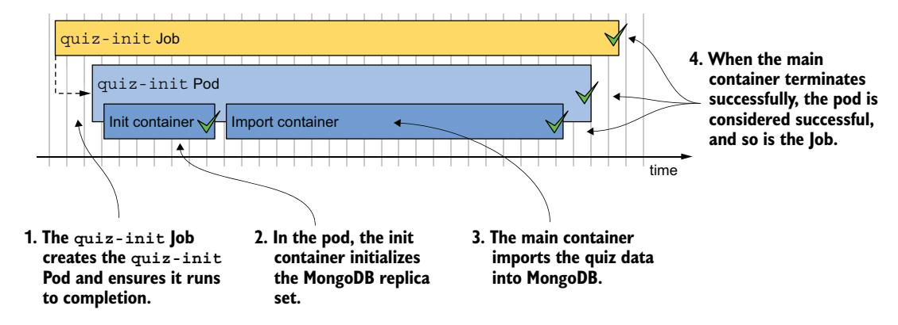
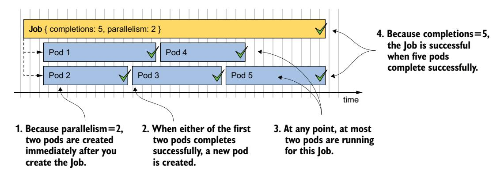
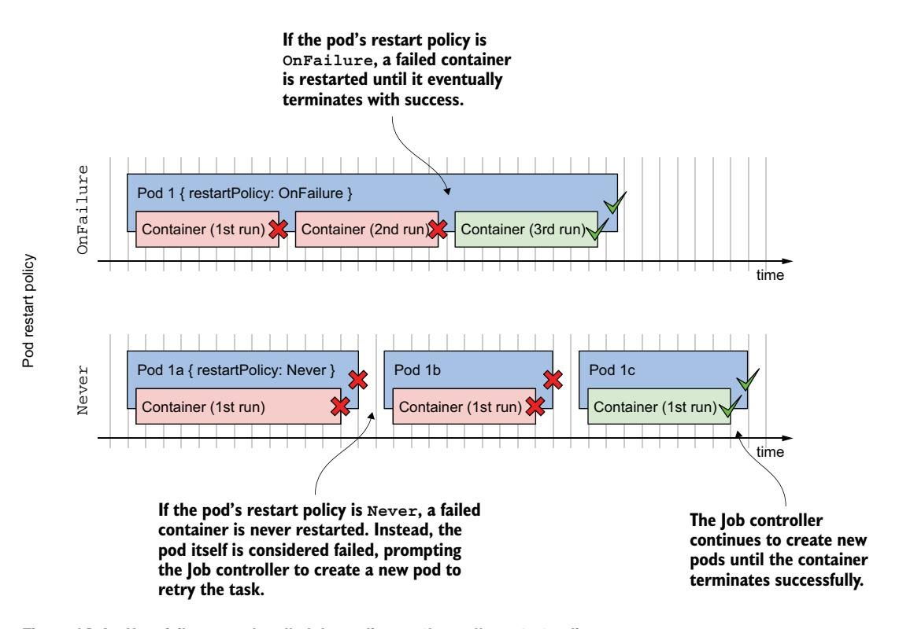
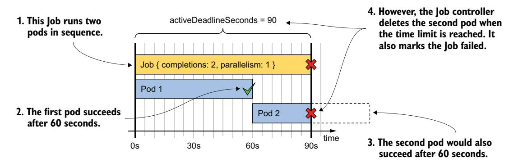
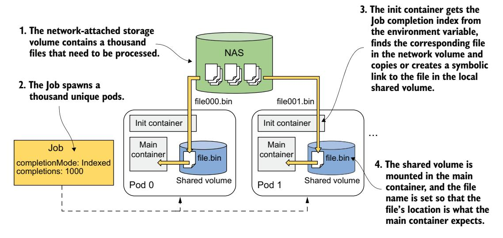
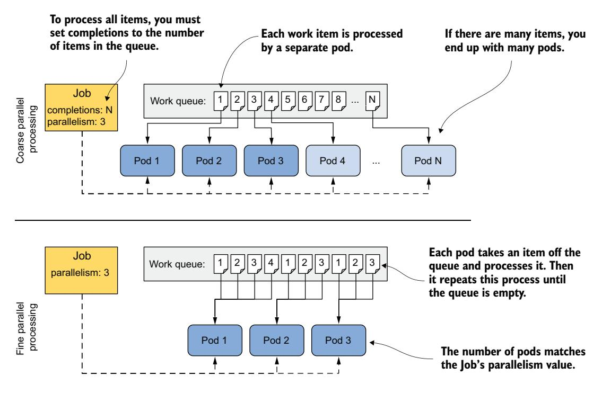
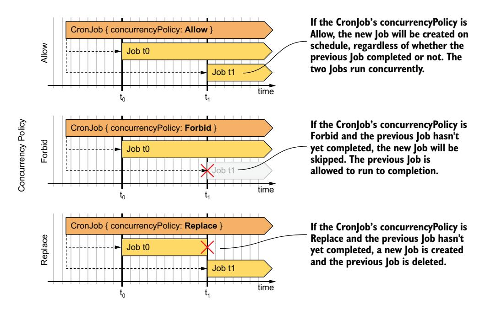

# 第 18 章 使用 Job 和 CronJob 进行批处理

!!! tip "本章涵盖"

    - 使用 Job 运行有限任务
    - 处理 Job 失败
    - 参数化通过 Job 创建的 Pod
    - 处理工作队列中的条目
    - 启用 Job 的 Pod 之间的通信
    - 使用 CronJob 在特定时间或定期运行 Job

正如你在前面章节中学到的，通过 Deployment、StatefulSet 或 DaemonSet 创建的 Pod 会持续运行。当 Pod 中某个容器内的进程终止时，kubelet 会重启该容器。Pod 本身永远不会自行停止，只有当你删除 Pod 对象时它才会停止。虽然这一特性非常适合运行 Web 服务器、数据库、系统服务及类似工作负载，但对于仅需执行单次任务的有限工作负载而言，它并不合适。

有限工作负载不会持续运行，而是让任务运行至完成。在 Kubernetes 中，你可以使用 **Job** 资源来运行此类工作负载。然而，Job 总是立即运行其 Pod，因此你无法用其调度任务。为此，你需要将 Job 包装在 **CronJob** 对象中。这使你可以将任务调度到未来的特定时间或定期执行。

在本章中，你将学习有关 Job 和 CronJob 的所有内容。在开始之前，请创建 kiada 命名空间，切换到 Chapter18/ 目录，并运行以下命令应用 SETUP/ 目录中的所有清单：

```bash
$ kubectl create ns kiada
$ kubectl config set-context --current --namespace kiada
$ kubectl apply -f SETUP -R
```

!!! note ""

    本章的代码文件可在 https://github.com/luksa/kubernetes-in-action-2nd-edition/tree/master/Chapter18 获取。

请不要惊讶于发现 quiz Pod 中都有一个容器无法变为就绪状态。这是预期的，因为这些 Pod 中运行的 MongoDB 数据库尚未初始化。你将创建一个 Job 资源来完成初始化。

## 18.1 使用 Job 资源运行任务

在通过 Job 资源创建第一个 Pod 之前，先思考一下 kiada 命名空间中的 Pod。它们都是为持续运行而设计的。当这些 Pod 中的某个容器终止时，它会自动重启。当 Pod 被删除时，它会被创建原始 Pod 的控制器重新创建。例如，如果你删除了其中一个 kiada Pod，Deployment 控制器会迅速重新创建它，因为 kiada Deployment 的 replicas 字段指定了应该始终存在三个 Pod。

现在考虑一个负责初始化 MongoDB 数据库的 Pod。你不希望它持续运行，而是希望它执行一个任务然后退出。虽然你希望 Pod 中的容器在失败时重启，但不希望它们在成功完成时重启。你也不希望在删除已完成任务的 Pod 后重新创建新 Pod。

你可能还记得在第 15 章中已经创建过这样的 Pod，即 quizdata-importer Pod。它配置了 OnFailure 重启策略，以确保容器仅在失败时重启。当容器成功完成后，Pod 便告完成，你可以将其删除。由于你是直接创建此 Pod 而不是通过 Deployment、StatefulSet 或 DaemonSet，它不会被重新创建。那么，这种方式有什么问题，为什么要通过 Job 来创建 Pod？

为了回答这个问题，想象一下如果有人意外提前删除了 Pod，或者运行 Pod 的节点发生了故障。在这种情况下，Kubernetes 不会自动重新创建 Pod。你必须自己来完成。你还必须从创建到完成全程监控该 Pod。对于几秒钟内就能完成任务的 Pod 来说，这可能还行，但你大概不想花几个小时盯着一个 Pod。因此，更好的做法是创建一个 Job 对象，让 Kubernetes 来处理其余的事情。

### 18.1.1 介绍 Job 资源

Job 资源类似于 Deployment，它创建一个或多个 Pod。然而，Job 不是确保这些 Pod 无限期地运行，而是确保其中一定数量的 Pod 成功完成。

如图 18.1 所示，最简单的 Job 运行单个 Pod 至完成，而更复杂的 Job 则按顺序或并行运行多个 Pod。当 Pod 中的所有容器以成功状态终止时，该 Pod 被认为已完成。当所有 Pod 都已完成时，Job 本身也被视为完成。


图 18.1 三个不同的 Job 示例，每个 Job 在其 Pod 成功完成后即告完成

正如你可能想到的，Job 资源定义了 Pod 模板和必须成功完成的 Pod 数量。它还定义了可以并行运行的 Pod 数量。

!!! note ""

    与 Deployment 及其他包含 Pod 模板的资源不同，你无法在创建 Job 对象后修改其模板。

让我们看看最简单的 Job 对象长什么样。

#### 定义 Job 资源

在本节中，你将把第 15 章中的 quiz-data-importer Pod 转换为 Job。此 Pod 将数据导入 Quiz MongoDB 数据库。你可能还记得，在运行此 Pod 之前，你必须通过在其中某个 quiz Pod 中执行命令来初始化 MongoDB 副本集。在本 Job 中，你也可以通过使用初始化容器来完成此操作。Job 及其创建的 Pod 如图 18.2 所示。

清单 18.1 展示了 Job 清单，你可以在 `job.quizinit.yaml` 文件中找到它。该清单文件还包含一个存储 quiz 问题的 ConfigMap，但该清单未显式展示。



图 18.2 quiz-init Job 概览

**清单 18.1 用于运行单个任务的 Job 清单**

```yaml
apiVersion: batch/v1
kind: Job
metadata:
  name: quiz-init
  labels:
    app: quiz
    task: init
spec:
  template:
    metadata:
      labels:
        app: quiz
        task: init
    spec:
      restartPolicy: OnFailure
      initContainers:
      - name: init
        image: mongo:5
        command:
        - sh
        - -c
        - |
          mongosh mongodb://quiz-0.quiz-pods.kiada.svc.cluster.local \
            --quiet --file /dev/stdin <<EOF
          # 初始化副本集的 MongoDB 代码
          # 请参见 job.quiz-init.yaml 文件了解实际代码
          EOF
      containers:
      - name: import
        image: mongo:5
        command:
        - mongoimport
        - mongodb+srv://quiz-pods.kiada.svc.cluster.local/kiada?tls=false
        - --collection
        - questions
        - --file
        - /questions.json
        - --drop
        volumeMounts:
        - name: quiz-data
          mountPath: /questions.json
          subPath: questions.json
          readOnly: true
      volumes:
      - name: quiz-data
        configMap:
          name: quiz-data
```

清单中定义了一个 Job 对象，该对象运行单个 Pod 至完成。Job 属于 batch API 组，你使用 v1 版本的 API 来定义该对象。此 Job 创建的 Pod 包含两个按顺序执行的容器，因为一个是初始化容器，另一个是普通容器。初始化容器确保 MongoDB 副本集已初始化，然后主容器通过挂载到容器中的 quiz-data ConfigMap 卷导入 quiz 问题。

Pod 的 restartPolicy 设置为 OnFailure。在 Job 中定义的 Pod 不能使用默认的 Always 策略，因为这会导致 Pod 无法完成。

!!! note ""

    在 Job 的 Pod 模板中，你必须显式将重启策略设置为 OnFailure 或 Never。

你会注意到，与 Deployment 不同，清单中没有定义选择器（selector）。虽然你可以指定，但不必如此，因为 Kubernetes 会自动设置它。清单中的 Pod 模板确实包含两个标签，但它们仅为了方便你使用。

#### 运行 Job

Job 控制器在你创建 Job 对象后会立即创建 Pod。要运行 quiz-init Job，使用 `kubectl apply` 应用 `job.quiz-init.yaml` 清单。

**查看 Job 简要状态**

要获取 Job 状态的简要概览，按如下方式列出当前命名空间中的 Job：

```bash
$ kubectl get jobs
NAME        STATUS    COMPLETIONS   DURATION   AGE
quiz-init   Running   0/1           3s         3s
```

STATUS 列显示 Job 是运行中、已失败还是已完成。COMPLETIONS 列指示 Job 已运行多少次以及配置为完成多少次。DURATION 列显示 Job 已运行多长时间。由于 quiz-init Job 执行的任务相对较短，其状态应在几秒内变化。再次列出 Job 以确认：

```bash
$ kubectl get jobs
NAME        STATUS     COMPLETIONS   DURATION   AGE
quiz-init   Complete   1/1           6s         42s
```

输出显示 Job 现在已完成，耗时 6 秒。

**查看 Job 详细状态**

要查看有关 Job 的更多详细信息，请使用 `kubectl describe` 命令：

```bash
$ kubectl describe job quiz-init
Name:            quiz-init
Namespace:       kiada
Selector:        controller-uid=98f0fe52-12ec-4c76-a185-4ccee9bae1ef
Labels:          app=quiz
                 task=init
Annotations:     batch.kubernetes.io/job-tracking:
Parallelism:     1
Completions:     1
Completion Mode: NonIndexed
Start Time:      Sun, 02 Oct 2022 12:17:59 +0200
Completed At:    Sun, 02 Oct 2022 12:18:05 +0200
Duration:        6s
Pods Statuses:   0 Active / 1 Succeeded / 0 Failed
Pod Template:
  Labels:  app=quiz
           batch.kubernetes.io/controller-uid=98f0fe52-12ec-4c76-a185-4ccee9bae1ef
           batch.kubernetes.io/job-name=quiz-init
           controller-uid=98f0fe52-12ec-4c76-a185-4ccee9bae1ef
           job-name=quiz-init
           task=init
  Init Containers:
   init: ...
  Containers:
   import: ...
  Volumes:
   quiz-data: ...
Events:
  Type    Reason            Age    From           Message
  ----    ------            ----   ----           -------
  Normal  SuccessfulCreate  7m33s  job-controller  Created pod: quiz-init-xpl8d
  Normal  Completed         7m27s  job-controller  Job completed
```

除了 Job 名称、命名空间、标签、注解和其他属性之外，`kubectl describe` 命令的输出还显示了自动分配的选择器。选择器中使用的 controller-uid 标签也被自动添加到 Job 的 Pod 模板中。job-name 标签也被添加到了模板中。正如你将在下一节看到的，你可以使用此标签轻松列出属于特定 Job 的 Pod。

在 `kubectl describe` 输出的末尾，你可以看到与此 Job 对象关联的事件。此 Job 只生成了两个事件：Pod 的创建和 Job 的成功完成。

#### 检查属于 Job 的 Pod

要列出为特定 Job 创建的 Pod，你可以使用自动添加到这些 Pod 的 job-name 标签。要列出 quiz-init Job 的 Pod，运行以下命令：

```bash
$ kubectl get pods -l job-name=quiz-init
NAME              READY   STATUS      RESTARTS   AGE
quiz-init-xpl8d   0/1     Completed   0          25m
```

输出中的 Pod 已完成其任务。Job 控制器不会删除该 Pod，因此你可以查看其状态并检查其日志。

#### 检查 Job Pod 的日志

查看 Job 日志的最快方法是将 Job 名称而非 Pod 名称传递给 `kubectl logs` 命令。要查看 quiz-init Job 的日志，你可以执行如下操作：

```bash
$ kubectl logs job/quiz-init --all-containers --prefix
[pod/quiz-init-xpl8d/init] Replica set initialized successfully!
[pod/quiz-init-xpl8d/import] 2022-10-02T10:51:01.967+0000 connected to: ...
[pod/quiz-init-xpl8d/import] 2022-10-02T10:51:01.969+0000 dropping:
     kiada.questions
[pod/quiz-init-xpl8d/import] 2022-10-02T10:51:03.811+0000 6 document(s)
     imported...
```

`--all-containers` 选项告诉 kubectl 打印 Pod 所有容器的日志，`--prefix` 选项确保每行以来源（Pod 名称和容器名称）为前缀。

输出包含初始化容器和 import 容器的日志。这些日志表明 MongoDB 副本集已成功初始化，并且问题数据库已填充数据。

#### 暂停活动 Job 和以暂停状态创建 Job

当你创建 quiz-init Job 时，Job 控制器在创建 Job 对象后立即创建了 Pod。不过，你也可在暂停状态下创建 Job。让我们通过创建另一个 Job 来尝试。如下清单所示，你通过将 suspend 字段设置为 true 来暂停它。你可以在 `job.demo-suspend.yaml` 文件中找到此清单。

**清单 18.2 暂停的 Job 清单**

```yaml
apiVersion: batch/v1
kind: Job
metadata:
  name: demo-suspend
spec:
  suspend: true
  template:
    spec:
      restartPolicy: OnFailure
      containers:
      - name: demo
        image: busybox
        command:
        - sleep
        - "60"
```

应用清单中的清单以创建 Job。按如下方式列出 Pod 以确认尚未创建任何 Pod：

```bash
$ kubectl get po -l job-name=demo-suspend
No resources found in kiada namespace.
```

Job 控制器会生成一个事件来表示 Job 的暂停。当你运行 `kubectl get events` 或使用 `kubectl describe` 描述 Job 时可以看到：

```bash
$ kubectl describe job demo-suspend
...
Events:
  Type    Reason     Age    From           Message
  ----    ------     ----   ----           -------
  Normal  Suspended  3m37s  job-controller  Job suspended
```

当你准备运行 Job 时，通过如下方式修补对象来取消暂停：

```bash
$ kubectl patch job demo-suspend -p '{"spec":{"suspend": false}}'
job.batch/demo-suspend patched
```

Job 控制器创建 Pod 并生成一个表示 Job 已恢复的事件。

你也可以暂停正在运行的 Job，无论它是以暂停状态创建还是非暂停状态创建。要暂停 Job，使用以下 `kubectl patch` 命令将 suspend 设置为 true：

```bash
$ kubectl patch job demo-suspend -p '{"spec":{"suspend": true}}'
job.batch/demo-suspend patched
```

Job 控制器立即删除与 Job 关联的 Pod，并生成一个表示 Job 已暂停的事件。Pod 的容器会优雅地关闭，与每次删除 Pod 时一样，无论它是如何创建的。你可以在合适的时候通过将 suspend 字段重置为 false 来恢复 Job。

#### 删除 Job 及其 Pod

你可以随时删除 Job。无论其 Pod 是否仍在运行，它们都会以删除 Deployment、StatefulSet 或 DaemonSet 时相同的方式被删除。你不再需要 quiz-init Job，因此按如下方式删除它：

```bash
$ kubectl delete job quiz-init
job.batch "quiz-init" deleted
```

通过按如下方式列出 Pod 来确认 Pod 也已被删除：

```bash
$ kubectl get po -l job-name=quiz-init
No resources found in kiada namespace.
```

你可能还记得，Pod 是由垃圾收集器删除的，因为当它们的所有者（在本例中为 quiz-init Job 对象）被删除时，它们变成了孤儿。如果你只想删除 Job 但保留 Pod，可以使用 `--cascade=orphan` 选项删除 Job。你可以对 demo-suspend Job 尝试此方法：

```bash
$ kubectl delete job demo-suspend --cascade=orphan
job.batch "demo-suspend" deleted
```

如果现在列出 Pod，你会看到 Pod 仍然存在。由于它现在是独立的 Pod，需要你自行在不需要时将其删除。

**自动删除 Job**

默认情况下，你必须手动删除 Job 对象。但是，你可以通过在 Job 的 spec 中设置 `ttlSecondsAfterFinished` 字段来标记 Job 为自动删除。顾名思义，此字段指定 Job 完成后，Job 及其 Pod 保留多长时间。

要查看此设置的实际效果，请尝试创建 `job.demo-ttl.yaml` 清单中的 Job。该 Job 将运行一个 Pod，该 Pod 将在 20 秒后成功完成。由于 `ttlSecondsAfterFinished` 设置为 10，Job 及其 Pod 将在 10 秒后被删除。

!!! warning ""

    如果你在 Job 中设置了 `ttlSecondsAfterFinished` 字段，无论 Job 是否成功完成，Job 及其 Pod 都会被删除。如果这发生在你检查失败 Pod 的日志之前，将很难确定 Job 失败的原因。

### 18.1.2 多次运行任务

在上一节中，你学习了如何执行一次任务。然而，你也可以将 Job 配置为多次执行同一任务，无论是并行还是按顺序。这可能是因为运行任务的容器只能处理单个条目，因此你需要多次运行该容器以处理整个输入，或者你可能只是想利用多个集群节点来提升性能。

现在你将创建一个向 Quiz 数据库插入模拟答案的 Job，模拟大量用户。与上一个例子中只有一个 Pod 向数据库插入数据不同，你将把 Job 配置为创建五个这样的 Pod。然而，你并不会同时运行所有五个 Pod，而是将 Job 配置为最多同时运行两个 Pod。以下清单显示了 Job 的清单。你可以在 `job.generate-responses.yaml` 文件中找到它。

**清单 18.3 用于多次运行任务的 Job**

```yaml
apiVersion: batch/v1
kind: Job
metadata:
  name: generate-responses
  labels:
    app: quiz
spec:
  completions: 5
  parallelism: 2
  template:
    metadata:
      labels:
        app: quiz
    spec:
      restartPolicy: OnFailure
      containers:
      - name: mongo
        image: mongo:5
        command:
        ...
```

除了 Pod 模板之外，清单中的 Job 清单还定义了两个新属性：`completions` 和 `parallelism`，下面进行解释。

#### 理解 Job 的完成数和并行度

`completions` 字段指定此 Job 必须成功完成的 Pod 数量。`parallelism` 字段指定这些 Pod 中有多少个可以并行运行。这些值没有上限，但你的集群可能只能并行运行有限数量的 Pod。

你可以选择不设置这两个字段之一或两者都不设置。如果两个字段都不设置，则两个值都默认为 1。如果只设置 completions，则这是依次运行的 Pod 数量。如果只设置 parallelism，则这是运行的 Pod 数量，但只需一个成功完成，Job 就算完成。

!!! note ""

    你还可以为 Job 更改默认的成功策略。例如，你可以告诉 Kubernetes 当具有特定索引的 Pod 成功完成时就算 Job 成功。有关更多信息，请参见 `kubectl explain job.spec.successPolicy`。

如果 parallelism 设置得比 completions 高，Job 控制器只会创建 completions 字段中指定的数量。如果 parallelism 低于 completions，Job 控制器最多并行运行 parallelism 个 Pod，但当第一批 Pod 完成时，它会创建额外的 Pod。它会一直创建新 Pod，直到成功完成的 Pod 数量达到 completions。图 18.3 显示了当 completions 为 5、parallelism 为 2 时的情况。



图 18.3 运行 completions=5、parallelism=2 的并行 Job

如图所示，Job 控制器首先创建两个 Pod，等待其中一个完成。在图中，Pod 2 是第一个完成的。控制器立即创建下一个 Pod（Pod 3），使运行中的 Pod 数量恢复为两个。控制器重复此过程，直到五个 Pod 成功完成。表 18.1 解释了不同 completions 和 parallelism 组合的行为。

**表 18.1 completions 和 parallelism 组合**

| completions | parallelism | Job 行为 |
|-------------|-------------|----------|
| 未设置 | 未设置 | 创建单个 Pod，与 completions 和 parallelism 均为 1 时相同。 |
| 1 | 1 | 创建单个 Pod。如果 Pod 成功完成，Job 完成。如果 Pod 在完成前被删除，将被新 Pod 替换。 |
| 2 | 5 | 仅创建两个 Pod，与 parallelism 为 2 时相同。 |
| 5 | 2 | 初始创建两个 Pod。当其中一个完成时，创建第三个 Pod，再次有两个 Pod 运行。当其中一个完成时，创建第四个 Pod，再次有两个 Pod 运行。当又一个完成时，创建第五个（最后一个）Pod。 |
| 5 | 5 | 五个 Pod 同时运行。如果一个 Pod 在完成前被删除，会创建替换 Pod。当五个 Pod 成功完成时，Job 完成。 |
| 5 | 未设置 | 五个 Pod 按顺序创建。仅当前一个 Pod 完成（或失败）时才创建新 Pod。 |
| 未设置 | 5 | 五个 Pod 同时创建，但只需一个 Pod 成功完成，Job 即算完成。 |

在你即将创建的 generate-responses Job 中，completions 设置为 5，parallelism 设置为 2，因此最多两个 Pod 将并行运行。Job 直到五个 Pod 成功完成才算完成。如果某些 Pod 失败，Pod 总数可能更多。下一节将详细介绍这一点。

#### 运行 Job

使用 `kubectl apply` 通过应用 `job.generate-responses.yaml` 清单文件来创建 Job。在 Job 运行时按如下方式列出 Pod：

```text
$ kubectl get pods -l job-name=generate-responses -w
NAME                       READY   STATUS      RESTARTS   AGE
generate-responses-5xtlk   0/1     Completed   0          82s
generate-responses-7kqw4   0/1     Completed   3          2m46s
generate-responses-98mh8   0/1     Completed   0          2m46s
generate-responses-tbgns   0/1     Completed   1          2m22s
generate-responses-vbvq8   0/1     Completed   1          111s
```

多次列出 Pod，观察其 STATUS 显示为 Running 或 Completed 的 Pod 数量。如你所见，在任何给定时间，最多同时运行两个 Pod。一段时间后，Job 完成。你可以通过使用 `kubectl get` 命令显示 Job 状态来确认：

```bash
$ kubectl get job generate-responses
NAME                  STATUS     COMPLETIONS   DURATION   AGE
generate-responses    Complete   5/5           110s       115s
```

COMPLETIONS 列显示此 Job 完成了 5 次（目标为 5 次），耗时 110 秒。如果再次列出 Pod，你应该看到五个已完成的 Pod，如上所示。

正如之前 Job 状态所指示的，你应该看到五个 Completed Pod。然而，如果你仔细查看 RESTARTS 列，会注意到其中一些 Pod 不得不重启。原因是作者将 25% 的失败率硬编码在这些 Pod 中运行的代码中，以展示当错误发生时的行为。

### 18.1.3 理解 Job 失败的处理方式

如前所述，通过 Job 而非直接通过 Pod 运行任务的原因是 Kubernetes 确保即使个别 Pod 或其节点失败，任务也能完成。但是，失败处理有两个层级：

- Pod 级别
- Job 级别

当 Pod 中的容器失败时，Pod 的 restartPolicy 决定失败是在 Pod 级别由 kubelet 处理，还是在 Job 级别由 Job 控制器处理。如图 18.4 所示，如果 restartPolicy 是 OnFailure，失败的容器会在同一 Pod 内重启。然而，如果策略是 Never，整个 Pod 被标记为失败，Job 控制器会创建一个新 Pod。

让我们看看这两种场景的区别。



图 18.4 根据 Pod 重启策略处理失败的方式

#### 在 Pod 级别处理失败

在上一节创建的 generate-responses Job 中，Pod 的 restartPolicy 被设置为 OnFailure。如前所述，容器每次执行时都有 25% 的概率失败。在这些情况下，容器以非零退出代码终止。kubelet 注意到失败并重启容器。

新容器在同一节点上的同一 Pod 中运行，因此可以快速恢复。容器可能再次失败并被多次重启，但最终会成功终止，Pod 被标记为完成。

!!! note ""

    正如你在前几章中学到的，如果容器多次崩溃，kubelet 不会立即重启容器，而是会在每次崩溃后添加延迟，并在每次重启后将延迟加倍。

#### 在 Job 级别处理失败

当 Job 清单中的 Pod 模板将 Pod 的 restartPolicy 设置为 Never 时，kubelet 不会重启其容器。取而代之的是，整个 Pod 被标记为失败，Job 控制器必须创建一个新 Pod。这个新 Pod 可能被调度到不同的节点上。

!!! note ""

    如果 Pod 被调度到不同的节点上运行，容器镜像可能需要在容器运行之前下载。

如果你想查看 Job 控制器如何处理 generate-responses Job 中的失败，删除现有 Job 并从 `job.generate-responses.restartPolicyNever.yaml` 清单文件重新创建它。在此清单中，Pod 的 restartPolicy 被设置为 Never。

Job 大约在一两分钟内完成。如果按如下方式列出 Pod，你会注意到现在需要超过五个 Pod 才能完成工作：

```bash
$ kubectl get po -l job-name=generate-responses
NAME                       READY   STATUS      RESTARTS   AGE
generate-responses-2dbrn   0/1     Error       0          2m43s
generate-responses-4pckt   0/1     Error       0          2m39s
generate-responses-8c8wz   0/1     Completed   0          2m43s
generate-responses-bnm4t   0/1     Completed   0          3m10s
generate-responses-kn55w   0/1     Completed   0          2m16s
generate-responses-t2r67   0/1     Completed   0          3m10s
generate-responses-xpbnr   0/1     Completed   0          2m34s
```

你应该看到五个 Completed Pod 和一些状态为 Error 的 Pod。当你使用 `kubectl describe job` 命令检查 Job 对象时，Error Pod 的数量应该与成功和失败 Pod 的数量匹配：

```bash
$ kubectl describe job generate-responses
...
Pods Statuses:  0 Active / 5 Succeeded / 2 Failed
...
```

!!! note ""

    你的环境中 Pod 数量可能不同。Job 也可能未完成，下一节会解释原因。

最后，删除 generate-responses Job。

#### 防止 Job 无限期失败

你之前创建的两个 Job 可能没有完成，因为它们失败了太多次。当这种情况发生时，Job 控制器会放弃。让我们通过创建一个始终失败的 Job 来演示。你可以在 `job.demo-always-fails.yaml` 文件中找到清单，其内容如下。

**清单 18.4 一个始终失败的 Job**

```yaml
apiVersion: batch/v1
kind: Job
metadata:
  name: demo-always-fails
spec:
  completions: 10
  parallelism: 3
  template:
    spec:
      restartPolicy: OnFailure
      containers:
      - name: demo
        image: busybox
        command:
        - 'false'
```

当你创建此清单中的 Job 时，Job 控制器创建三个 Pod。这些 Pod 中的容器以非零退出代码终止，导致 kubelet 重启它。经过几次重启后，Job 控制器注意到这些 Pod 一直在失败，因此删除它们并将 Job 标记为失败。你可以通过检查 STATUS 列看到 Job 已失败：

```bash
$ kubectl get job
NAME                STATUS  COMPLETIONS   DURATION   AGE
demo-always-fails   Failed  0/10          2m48s      2m48s
```

和往常一样，你可以通过运行 `kubectl describe` 查看更多信息：

```bash
$ kubectl describe job demo-always-fails
...
Events:
  Type     Reason                Age    From           Message
  ----     ------                ----   ----           -------
  Normal   SuccessfulCreate      5m6s   job-controller  Created pod: demo-always-fails-t9xkw
  Normal   SuccessfulCreate      5m6s   job-controller  Created pod: demo-always-fails-6kcb2
  Normal   SuccessfulCreate      5m6s   job-controller  Created pod: demo-always-fails-4nfmd
  Normal   SuccessfulDelete      4m43s  job-controller  Deleted pod: demo-always-fails-4nfmd
  Normal   SuccessfulDelete      4m43s  job-controller  Deleted pod: demo-always-fails-6kcb2
  Normal   SuccessfulDelete      4m43s  job-controller  Deleted pod: demo-always-fails-t9xkw
  Warning  BackoffLimitExceeded  4m43s  job-controller  Job has reached the specified backoff limit
```

底部的 Warning 事件表明 Job 已达到回退限制，这意味着 Job 已失败。你可以通过检查 Job 状态来确认：

```bash
$ kubectl get job demo-always-fails -o yaml
...
status:
  conditions:
  - lastProbeTime: "2022-10-02T15:42:39Z"
    lastTransitionTime: "2022-10-02T15:42:39Z"
    message: Job has reached the specified backoff limit
    reason: BackoffLimitExceeded
    status: "True"
    type: Failed
  failed: 3
  startTime: "2022-10-02T15:42:16Z"
  uncountedTerminatedPods: {}
```

很难看出来，但 Job 在 6 次重试后结束，这是默认的回退限制。你可以在清单中的 `spec.backoffLimit` 字段中为每个 Job 设置此限制。

一旦 Job 超过此限制，Job 控制器将删除所有正在运行的 Pod，并不再为其创建新 Pod。要重新启动失败的 Job，你必须删除并重新创建它。

#### 限制 Job 完成所允许的时间

Job 可能失败的另一种方式是它未在指定时间内完成。默认情况下，此时间没有限制，但你可以使用 Job spec 中的 `activeDeadlineSeconds` 字段设置最大时间，如下清单所示（请参见 `job.demo-deadline.yaml` 清单文件）：

**清单 18.5 带有时间限制的 Job**

```yaml
apiVersion: batch/v1
kind: Job
metadata:
  name: demo-deadline
spec:
  completions: 2
  parallelism: 1
  activeDeadlineSeconds: 90
  template:
    spec:
      restartPolicy: OnFailure
      containers:
      - name: demo-suspend
        image: busybox
        command:
        - sleep
        - "60"
```

从清单中的 completions 字段可以看出，Job 需要两次完成才算完成。由于 parallelism 设置为 1，两个 Pod 依次运行。考虑到这两个 Pod 按顺序执行，以及每个 Pod 需要 60 秒完成，整个 Job 的执行需要略超过 120 秒。然而，由于此 Job 的 `activeDeadlineSeconds` 设置为 90，Job 无法成功。图 18.5 说明了这种情况。



图 18.5 为 Job 设置时间限制

要自己查看这一点，通过应用清单创建此 Job，等待其失败。失败时，Job 控制器会生成以下事件：

```bash
$ kubectl describe job demo-deadline
...
Events:
  Type     Reason            Age   From           Message
  ----     ------            ----  ----           -------
  Warning  DeadlineExceeded  1m    job-controller  Job was active longer than
                                                   specified deadline
```

!!! note ""

    请记住，Job 中的 `activeDeadlineSeconds` 适用于整个 Job，而不是针对该 Job 上下文中创建的个别 Pod。

#### 定义自定义失败策略规则

除了之前介绍的默认 Job 失败策略之外，你还可以在 Job 的 `spec.podFailurePolicy` 字段中指定自定义的失败策略规则。例如，你可以设置一条规则，当特定容器以特定退出代码终止时将整个 Job 标记为失败，如下面的代码段所示：

```yaml
kind: Job
spec:
  podFailurePolicy:
    rules:
    - onExitCodes:
        containerName: main
        operator: In
        values: [123]
      action: FailJob
```

除了使整个 Job 失败之外，你还可以将 Pod 的特定索引标记为失败，或者忽略特定的退出代码。有关 Job 失败策略规则的更多信息，请运行 `kubectl explain job.spec.podFailurePolicy`。

### 18.1.4 参数化 Job 中的 Pod

到目前为止，你在每个 Job 中执行的任务都是相同的。例如，generate-responses Job 中的 Pod 都做同样的事情：它们向数据库插入一系列答案。但是，如果你希望运行一系列相关但不相同的任务呢？也许你想让每个 Pod 只处理数据的一个子集？这就是 Job 的 `completionMode` 字段派上用场的地方。

撰写本文时，支持两种完成模式：Indexed 和 NonIndexed。到目前为止，你在本章中创建的 Job 都是 NonIndexed 的，因为这是默认模式。此类 Job 创建的所有 Pod 彼此无法区分。但是，如果你将 Job 的完成模式设置为 Indexed，每个 Pod 会被赋予一个索引号，你可以使用该索引号来区分 Pod。这使得每个 Pod 能够只执行整个任务的一部分。表 18.2 展示了两种完成模式的对比。

!!! note ""

    将来，Kubernetes 可能通过内置的 Job 控制器或额外的控制器为 Job 处理提供更多模式支持。

**表 18.2 支持的 Job 完成模式**

| 值 | 描述 |
|----|------|
| NonIndexed | 当此 Job 创建的成功完成 Pod 数量等于清单中 `spec.completions` 字段的值时，Job 被认为完成。所有 Pod 都是相等的。这是默认模式。 |
| Indexed | 每个 Pod 被分配一个完成索引（从 0 开始），以区分彼此。默认情况下，当每个索引都有一个成功完成的 Pod 时，Job 被认为完成。如果具有特定索引的 Pod 失败，Job 控制器将创建一个具有相同索引的新 Pod。你还可以更改默认成功策略，以使具有特定索引的 Pod 成功完成时 Job 即算成功。分配给每个 Pod 的完成索引在 Pod 注解 `batch.kubernetes.io/job-completion-index` 和 Pod 容器中的 `JOB_COMPLETION_INDEX` 环境变量中指定。 |

为了更好地理解这些完成模式，你将创建一个 Job，读取 Quiz 数据库中的答案，计算每天有效和无效答案的数量，并将结果存回数据库。你将使用两种完成模式，以便理解它们的区别。

#### 实现聚合脚本

可以想象，如果有很多用户使用应用程序，Quiz 数据库可能会变得非常大。因此，你不希望单个 Pod 处理所有答案，而是希望每个 Pod 仅处理特定月份。

作者准备了一个脚本。Pod 将从一个 ConfigMap 获取此脚本。你可以在 `cm.aggregate-responses.yaml` 文件中找到其清单。实际代码不重要，重要的是它接受两个参数：要处理的**年份**和**月份**。代码通过环境变量 YEAR 和 MONTH 读取这些参数，如下清单所示。

**清单 18.6 包含处理 Quiz 答案的 MongoDB 脚本的 ConfigMap**

```yaml
apiVersion: v1
kind: ConfigMap
metadata:
  name: aggregate-responses
  labels:
    app: aggregate-responses
data:
  script.js: |
    var year = parseInt(process.env["YEAR"]);
    var month = parseInt(process.env["MONTH"]);
    ...
```

使用以下命令将此 ConfigMap 清单应用到集群：

```bash
$ kubectl apply -f cm.aggregate-responses.yaml
configmap/aggregate-responses created
```

现在假设你想计算 2020 年每个月的汇总。由于该脚本只处理一个月，你需要 12 个 Pod 来处理一整年。你应该如何创建 Job 来生成这些 Pod，因为你需要向每个 Pod 传递不同的月份？

#### NonIndexed 完成模式

在 completionMode 支持被添加到 Job 资源之前，所有 Job 都以所谓的 NonIndexed 模式运行。这种模式的问题在于所有生成的 Pod 都是相同的（图 18.6）。


图 18.6 使用 NonIndexed completionMode 的 Job 生成相同的 Pod

因此，如果你使用此完成模式，你无法向每个 Pod 传递不同的 MONTH 值。你必须为每个月创建单独的 Job 对象。这样，每个 Job 可以在 Pod 模板中将 MONTH 环境变量设置为不同的值，如图 18.7 所示。


图 18.7 从模板创建相似的 Job

要创建这些不同的 Job，你需要创建单独的 Job 清单。你可以手动完成，也可以使用外部模板系统来完成。Kubernetes 本身并不提供从模板创建 Job 的功能。

回到我们的 aggregate-responses Job 示例。要处理整个 2020 年，你需要创建 12 个 Job 清单。你可以使用全功能的模板引擎来完成此任务，但你也可以使用相对简单的 shell 命令来完成。

首先，你必须创建模板。你可以在 `job.aggregate-responses-2020.tmpl.yaml` 文件中找到它。以下清单显示了其内容。

**清单 18.7 用于创建 aggregate-responses Job 清单的模板**

```yaml
apiVersion: batch/v1
kind: Job
metadata:
  name: aggregate-responses-2020-__MONTH__
spec:
  completionMode: NonIndexed
  template:
    spec:
      restartPolicy: OnFailure
      containers:
      - name: updater
        image: mongo:5
        env:
        - name: YEAR
          value: "2020"
        - name: MONTH
          value: "__MONTH__"
        ...
```

如果你使用 Bash，可以从此模板生成清单并使用以下命令将它们直接应用到集群：

```bash
$ for month in {1..12}; do \
    sed -e "s/__MONTH__/$month/g" job.aggregate-responses-2020.tmpl.yaml \
    | kubectl apply -f - ; \
  done
job.batch/aggregate-responses-2020-1 created
job.batch/aggregate-responses-2020-2 created
...
job.batch/aggregate-responses-2020-12 created
```

此命令使用 for 循环渲染模板 12 次。渲染模板的含义就是用实际的月份数替换模板中的字符串 `__MONTH__`。生成的清单通过 `kubectl apply` 应用到集群。

!!! note ""

    如果你想运行此示例但不使用 Linux，可以使用作者为你创建的清单。使用以下命令将它们应用到集群：`kubectl apply -f job.aggregate-responses-2020.generated.yaml`。

你刚刚创建的 12 个 Job 正在集群中运行。每个 Job 创建一个 Pod，处理特定月份的数据。要查看生成的统计信息，使用以下命令：

```bash
$ kubectl exec quiz-0 -c mongo -- mongosh kiada --quiet --eval 'db.statistics.find()'
[
  {
    _id: ISODate("2020-02-28T00:00:00.000Z"),
    totalCount: 120,
    correctCount: 25,
    incorrectCount: 95
  },
  ...
]
```

如果所有 12 个 Job 都处理了各自的月份，你应该看到类似上述的许多条目。现在你可以按如下方式删除所有 12 个 aggregate-responses Job：

```bash
$ kubectl delete jobs -l app=aggregate-responses
```

在此示例中，传递给每个 Job 的参数是一个简单的整数，但这种方法的真正优势在于你可以向每个 Job 及其 Pod 传递任何值或值集。当然，缺点是最终会产生多个 Job，这意味着相比管理单个 Job 对象，工作量更大。而且如果你同时创建这些 Job 对象，它们将全部同时运行。这就是为什么使用 Indexed 完成模式创建单个 Job 是更好的选择，你将在接下来看到。

#### 介绍 Indexed 完成模式

如前所述，当 Job 配置为 Indexed 完成模式时，每个 Pod 被分配一个完成索引（从 0 开始），区分该 Pod 和同一 Job 中的其他 Pod，如图 18.8 所示。


图 18.8 Indexed 完成模式生成的 Pod 各自获得索引号

Pod 的数量由 Job 的 spec 中的 completions 字段确定。当每个索引都有一个成功完成的 Pod 时，Job 被认为已完成。

以下清单显示了一个使用 Indexed 完成模式运行 12 个 Pod（每个月一个）的 Job 清单。请注意，MONTH 环境变量未设置。这是因为脚本（你将在后面看到）使用完成索引来确定要处理的月份。

**清单 18.8 使用 Indexed 完成模式的 Job 清单**

```yaml
apiVersion: batch/v1
kind: Job
metadata:
  name: aggregate-responses-2021
  labels:
    app: aggregate-responses
    year: "2021"
spec:
  completionMode: Indexed
  completions: 12
  parallelism: 3
  template:
    metadata:
      labels:
        app: aggregate-responses
        year: "2021"
    spec:
      restartPolicy: OnFailure
      containers:
      - name: updater
        image: mongo:5
        env:
        - name: YEAR
          value: "2021"
        command:
        - mongosh
        - mongodb+srv://quiz-pods.kiada.svc.cluster.local/kiada?tls=false
        - --quiet
        - --file
        - /script.js
        volumeMounts:
        - name: script
          subPath: script.js
          mountPath: /script.js
      volumes:
      - name: script
        configMap:
          name: aggregate-responses-indexed
```

在清单中，completionMode 为 Indexed，completions 数量为 12。为了同时运行三个 Pod，parallelism 设置为 3。

**JOB_COMPLETION_INDEX 环境变量**

与 aggregate-responses-2020 示例不同，在该示例中你同时传入了 YEAR 和 MONTH 环境变量，而这里你只传入了 YEAR 变量。为了确定 Pod 应处理哪个月份，脚本查找 `JOB_COMPLETION_INDEX` 环境变量，如下清单所示。

**清单 18.9 在代码中使用 JOB_COMPLETION_INDEX 环境变量**

```yaml
apiVersion: v1
kind: ConfigMap
metadata:
  name: aggregate-responses-indexed
  labels:
    app: aggregate-responses-indexed
data:
  script.js: |
    var year = parseInt(process.env["YEAR"]);
    var month = parseInt(process.env["JOB_COMPLETION_INDEX"]) + 1;
    ...
```

此环境变量并未在 Pod 模板中指定，而是由 Job 控制器添加到每个 Pod 中。在 Pod 中运行的工作负载可以使用此变量来确定要处理数据集的哪一部分。

在 aggregate-responses 示例中，变量的值表示月份数。但是，由于环境变量是从零开始的，脚本必须将值加 1 才能获得月份。

**JOB-COMPLETION-INDEX 注解**

除了设置环境变量外，Job 控制器还在 Pod 的 `batch.kubernetes.io/job-completion-index` 注解中设置完成索引。除了使用 `JOB_COMPLETION_INDEX` 环境变量外，你还可以通过 Downward API（如第 7 章所述）将索引通过任何环境变量传递。例如，要将此注解的值传递给 MONTH 环境变量，Pod 模板中的 env 条目应如下所示：

```yaml
env:
- name: MONTH
  valueFrom:
    fieldRef:
      fieldPath: metadata.annotations['batch.kubernetes.io/job-completion-index']
```

你可能认为通过这种方法，可以直接使用 aggregate-responses-2020 示例中的相同脚本，但事实并非如此。由于使用 Downward API 时无法进行数学运算，你必须修改脚本以正确处理从 0 开始而非从 1 开始的 MONTH 环境变量。

#### 运行 Indexed Job

要运行 aggregate-responses Job 的这一 Indexed 变体，应用 `job.aggregate-responses-2021-indexed.yaml` 清单文件。然后可以通过运行以下命令来跟踪创建的 Pod：

```bash
$ kubectl get pods -l job-name=aggregate-responses-2021
NAME                            READY   STATUS    RESTARTS   AGE
aggregate-responses-2021-0-kptfr  1/1    Running   0          24s
aggregate-responses-2021-1-r4vfq  1/1    Running   0          24s
aggregate-responses-2021-2-snz4m  1/1    Running   0          24s
```

你是否注意到 Pod 名称中包含完成索引？Job 名称为 aggregate-responses-2021，但 Pod 名称的形式为 `aggregate-responses-2021-<index>-<random string>`。

!!! note ""

    完成索引也出现在 Pod 的主机名中。主机名的形式为 `<job-name>-<index>`。这有助于 Indexed Job 的 Pod 之间进行通信，你将在后面看到。

现在使用以下命令检查 Job 状态：

```bash
$ kubectl get jobs
NAME                         STATUS     COMPLETIONS   DURATION   AGE
aggregate-responses-2021     Running    7/12          2m17s      2m17s
```

与你使用多个 NonIndexed 完成模式 Job 的示例不同，所有工作都通过单个 Job 对象完成，这使得管理变得更加容易。虽然仍然有 12 个 Pod，但除非 Job 失败，你无需关心它们。当你看到 Job 完成时，你可以确信任务已完成，并且可以删除 Job 以清理一切。

#### 在更高级的用例中使用 Job 完成索引

在前面的示例中，工作负载中的代码直接使用完成索引作为输入。但如果任务的输入不是简单的数字呢？

例如，假设有一个容器镜像，接受输入文件并以某种方式处理它。它期望文件位于某个位置并具有特定名称。假设文件名为 `/var/input/file.bin`。你想使用此镜像处理 1,000 个文件。你能在不更改镜像中代码的情况下使用 Indexed Job 完成吗？

是的，可以！通过向 Pod 模板添加一个初始化容器和一个卷。你创建一个 completionMode 为 Indexed 且 completions 为 1000 的 Job。在 Job 的 Pod 模板中，添加两个容器和这两个容器共享的卷。一个容器运行处理文件的镜像，我们称之为主容器。另一个容器是初始化容器，它从环境变量读取完成索引，并在共享卷上准备输入文件。

如果你需要处理的一千个文件位于网络卷上，你也可以将该网络卷挂载到 Pod 中，让初始化容器在 Pod 的共享内部卷中创建一个名为 `file.bin` 的符号链接，指向网络卷中的某个文件。初始化容器必须确保每个完成索引对应网络卷中的不同文件。

如果内部卷挂载在主容器的 `/var/input` 目录下，则主容器可以处理文件，完全无需了解完成索引或有一千个文件正在被处理。图 18.9 显示了这一切。



图 18.9 初始化容器根据完成索引为主容器提供输入文件

如你所见，尽管 Indexed Job 仅为每个 Pod 提供一个简单的整数，但有办法利用该整数为工作负载准备更复杂的输入数据。你所需要的只是一个将整数转换为输入数据的初始化容器。

### 18.1.5 使用工作队列运行 Job

上一节中的 Job 被分配了静态工作。然而，通常要执行的工作是通过工作队列动态分配的。Pod 不是接收 Job 本身指定的输入数据，而是从队列中检索这些数据。在本节中，你将学习两种在 Job 中处理工作队列的方法。

上一段可能给人印象是 Kubernetes 本身提供了某种基于队列的处理机制，但事实并非如此。当我们谈论使用队列的 Job 时，队列和从队列中检索工作项的组件需要在你的容器中实现。然后你创建一个 Job，在一个或多个 Pod 中运行这些容器。为了学习如何做到这一点，你现在将实现 aggregate-responses Job 的另一个变体。这个变体使用队列作为要执行工作的来源。

处理工作队列有两种方式：**粗粒度**和**细粒度**。图 18.10 说明了这两种方法的区别。



图 18.10 粗粒度与细粒度并行处理的区别

在**粗粒度**并行处理中，每个 Pod 从队列中取出一个工作项，处理它，然后终止。因此，最终每个工作项对应一个 Pod。相比之下，在**细粒度**并行处理中，通常只创建少量 Pod，每个 Pod 处理多个工作项。它们并行工作，直到整个队列被处理完毕。在两种方法中，只要集群能容纳，你可以并行运行任意多的 Pod。

#### 创建工作队列

你将为此练习创建的 Job 将处理 2022 年的 Quiz 答案。在创建此 Job 之前，你必须首先设置工作队列。为简单起见，你在现有的 MongoDB 数据库中实现队列。要创建队列，请运行以下命令：

```bash
$ kubectl exec -it quiz-0 -c mongo -- mongosh kiada --eval '
  db.monthsToProcess.insertMany([
    {_id: "2022-01", year: 2022, month: 1},
    {_id: "2022-02", year: 2022, month: 2},
    {_id: "2022-03", year: 2022, month: 3},
    {_id: "2022-04", year: 2022, month: 4},
    {_id: "2022-05", year: 2022, month: 5},
    {_id: "2022-06", year: 2022, month: 6},
    {_id: "2022-07", year: 2022, month: 7},
    {_id: "2022-08", year: 2022, month: 8},
    {_id: "2022-09", year: 2022, month: 9},
    {_id: "2022-10", year: 2022, month: 10},
    {_id: "2022-11", year: 2022, month: 11},
    {_id: "2022-12", year: 2022, month: 12}])'
```

!!! note ""

    此命令假设 quiz-0 是主 MongoDB 副本。如果命令失败并显示 "not primary" 错误消息，请尝试在所有三个 Pod 中运行该命令，或者你可以使用以下命令询问 MongoDB 三者中哪一个是主副本：`kubectl exec quiz-0 -c mongo -- mongosh --eval 'rs.hello().primary'`。

该命令将 12 个工作项插入到名为 monthsToProcess 的 MongoDB 集合中。每个工作项代表一个需要处理的特定月份。

#### 使用粗粒度并行处理工作队列

让我们从一个粗粒度并行处理的示例开始，其中每个 Pod 只处理一个工作项。你可以在 `job.aggregate-responses-queue-coarse.yaml` 文件中找到 Job 清单，如下所示。

**清单 18.10 使用粗粒度并行处理工作队列**

```yaml
apiVersion: batch/v1
kind: Job
metadata:
  name: aggregate-responses-queue-coarse
spec:
  completions: 6
  parallelism: 3
  template:
    spec:
      restartPolicy: OnFailure
      containers:
      - name: processor
        image: mongo:5
        command:
        - mongosh
        - mongodb+srv://quiz-pods.kiada.svc.cluster.local/kiada?tls=false
        - --quiet
        - --file
        - /script.js
        volumeMounts:
        - name: script
          subPath: script.js
          mountPath: /script.js
      volumes:
      - name: script
        configMap:
          name: aggregate-responses-queue-coarse
```

此 Job 创建 Pod，运行 MongoDB 中的一个脚本，该脚本从队列中取出一个工作项并处理它。请注意，completions 为 6，这意味着此 Job 仅处理你添加到队列中的 12 个工作项中的 6 个。这是因为作者希望将一些工作项留给后面的细粒度并行处理示例。

此 Job 的 parallelism 设置为 3，这意味着三个工作项由三个不同的 Pod 并行处理。每个 Pod 执行的脚本定义在 `aggregate-responses-queue-coarse` ConfigMap 中。此 ConfigMap 的清单与 Job 清单位于同一文件中。脚本的大致轮廓如下所示。

**清单 18.11 处理单个工作项的 MongoDB 脚本**

```js
print("Fetching one work item from queue...");
var workItem = db.monthsToProcess.findOneAndDelete({});
if (workItem == null) {
    print("No work item found. Processing is complete.");
    quit(0);
}
print("Found work item:");
print("  Year: " + workItem.year);
print("  Month: " + workItem.month);
var year = parseInt(workItem.year);
var month = parseInt(workItem.month) + 1;
// 处理工作项的代码
print("Done.");
quit(0);
```

该脚本从工作队列中取出一个工作项。如你所知，每个工作项代表一个月。该脚本对当月的 Quiz 答案执行聚合查询，计算正确、错误和总回答数，并将结果存回 MongoDB。

要运行该 Job，使用 `kubectl apply` 应用 `job.aggregate-responses-queue-coarse.yaml`，并通过 `kubectl get jobs` 观察 Job 的状态。你还可以检查 Pod，确保有三个 Pod 并行运行，并且在 Job 完成时 Pod 总数为六个。

如果一切顺利，你的工作队列现在应该只包含尚未被 Job 处理的六个月份。你可以通过运行以下命令确认：

```bash
$ kubectl exec quiz-0 -c mongo -- mongosh kiada --quiet --eval 'db.monthsToProcess.find()'
[
  { _id: '2022-07', year: 2022, month: 7 },
  { _id: '2022-08', year: 2022, month: 8 },
  { _id: '2022-09', year: 2022, month: 9 },
  { _id: '2022-10', year: 2022, month: 10 },
  { _id: '2022-11', year: 2022, month: 11 },
  { _id: '2022-12', year: 2022, month: 12 }
]
```

你可以检查六个 Pod 的日志，看看它们是否处理了从队列中移除的对应月份。你将使用细粒度并行处理来处理剩余的工作项。在继续之前，使用 `kubectl delete` 删除 aggregate-responses-queue-coarse Job，这也会删除六个 Pod。

#### 使用细粒度并行处理工作队列

在细粒度并行处理中，每个 Pod 处理多个工作项。它从队列中取出一个工作项、处理它、取出下一个工作项，并重复此过程直到队列中没有剩余的工作项。与之前一样，多个 Pod 可以并行工作。

Job 清单位于 `job.aggregate-responses-queue-fine.yaml` 文件中。Pod 模板与上一个示例几乎相同，但它不包含 completions 字段，如下清单所示。

**清单 18.12 使用细粒度并行处理方法处理工作队列**

```yaml
apiVersion: batch/v1
kind: Job
metadata:
  name: aggregate-responses-queue-fine
spec:
  parallelism: 3
  template:
    ...
```

使用细粒度并行处理的 Job 不设置 completions 字段，因为一次成功完成就表示队列中的所有工作项都已处理完毕。这是因为 Pod 在处理完最后一个工作项后以成功状态终止。

你可能想知道，如果某个 Pod 报告成功时其他 Pod 仍在处理其工作项会发生什么。幸运的是，Job 控制器允许其他 Pod 完成其工作，而不会终止它们。

与之前一样，清单文件还包含一个含有 MongoDB 脚本的 ConfigMap。与上一个脚本不同，此脚本会逐个处理工作项直到队列为空，如清单 18.13 所示。

**清单 18.13 处理整个队列的 MongoDB 脚本**

```js
print("Processing quiz responses - queue - all work items");
print("==================================================");
print();
print("Fetching work items from queue...");
print();
while (true) {
    var workItem = db.monthsToProcess.findOneAndDelete({});
    if (workItem == null) {
        print("No work item found. Processing is complete.");
        quit(0);
    }
    print("Found work item:");
    print("  Year: " + workItem.year);
    print("  Month: " + workItem.month);
    // 处理工作项
    ...
    print("Done processing item.");
    print("------------------");
    print();
}
```

要运行此 Job，应用 `job.aggregate-responses-queue-fine.yaml` 清单文件。你应该看到三个与之关联的 Pod。当它们处理完队列中的工作项后，其容器终止，Pod 显示为 Completed：

```bash
$ kubectl get pods -l job-name=aggregate-responses-queue-fine
NAME                                READY   STATUS      RESTARTS   AGE
aggregate-responses-queue-fine-9slkl 0/1    Completed   0          4m21s
aggregate-responses-queue-fine-hxqbw 0/1    Completed   0          4m21s
aggregate-responses-queue-fine-szqks 0/1    Completed   0          4m21s
```

Job 的状态也表明所有三个 Pod 已完成：

```bash
$ kubectl get jobs
NAME                               STATUS     COMPLETIONS   DURATION   AGE
aggregate-responses-queue-fine     Complete   3/1 of 3      3m19s      5m34s
```

你需要做的最后一件事是检查工作队列是否确实为空。你可以使用以下命令执行此操作：

```bash
$ kubectl exec quiz-1 -c mongo -- mongosh kiada --quiet --eval 'db.monthsToProcess.countDocuments()'
0
```

如你所见，队列为零，因此 Job 已完成。

**工作队列的持续处理**

为了结束关于工作队列 Job 的这一节，让我们看看在 Job 完成后向队列添加工作项时会发生什么。按如下方式添加 2023 年 1 月的工作项：

```bash
$ kubectl exec -it quiz-0 -c mongo -- mongosh kiada --quiet --eval 'db.monthsToProcess.insertOne({_id: "2023-01", year: 2023, month: 1})'
{ acknowledged: true, insertedId: '2023-01' }
```

你认为 Job 会创建另一个 Pod 来处理此工作项吗？当你考虑到 Kubernetes 对此队列一无所知时（正如我之前解释的那样），答案显而易见。只有在 Pod 中运行的容器才知道队列的存在。因此，如果在 Job 完成后添加新工作项，它将不会被处理，除非你重新创建该 Job。

请记住，Job 的设计目的是将任务运行至完成，而不是持续运行。要实现一个持续监控队列的工作 Pod，你应该改用 Deployment 来运行 Pod。但是，如果你希望定期而非持续地运行该 Job，你也可以使用 CronJob，正如本章第二部分所述。

### 18.1.6 Job 的 Pod 之间的通信

大多数属于 Job 的 Pod 是独立运行的，不感知同一 Job 中的其他 Pod。但是，某些任务需要这些 Pod 之间相互通信。

在大多数情况下，每个 Pod 需要与特定的 Pod 或所有对等 Pod 通信，而不仅仅与组中的随机 Pod 通信。幸运的是，启用此类通信非常简单。你只需要做三件事：

- 将 Job 的 completionMode 设置为 Indexed。
- 创建一个无头 Service。
- 在 Pod 模板中将此 Service 配置为子域名。

让我通过一个示例来说明。

**创建无头 Service 清单**

首先看看无头 Service 必须如何配置。其清单如下所示。

**清单 18.14 用于 Job 的 Pod 之间通信的无头 Service**

```yaml
apiVersion: v1
kind: Service
metadata:
  name: demo-service
spec:
  clusterIP: none
  selector:
    job-name: comm-demo
  ports:
  - name: http
    port: 80
```

正如你在第 11 章中学到的，你必须将 clusterIP 设置为 none 以使 Service 成为无头 Service。你还需要确保标签选择器匹配 Job 创建的 Pod。最简单的方法是在选择器中使用 job-name 标签。你在本章开头了解到此标签会自动添加到 Pod 上。该标签的值被设置为 Job 对象的名称，因此你需要确保在选择器中使用的值与 Job 名称匹配。

**创建 Job 清单**

现在让我们看看 Job 清单必须如何配置。请检查以下清单。

**清单 18.15 启用 Pod 到 Pod 通信的 Job 清单**

```yaml
apiVersion: batch/v1
kind: Job
metadata:
  name: comm-demo
spec:
  completionMode: Indexed
  completions: 2
  parallelism: 2
  template:
    spec:
      subdomain: demo-service
      restartPolicy: Never
      containers:
      - name: comm-demo
        image: busybox
        command:
        - sleep
        - "600"
```

如前所述，完成模式必须设置为 Indexed。此 Job 配置为并行运行两个 Pod，以便你可以对它们进行实验。你需要将它们的 subdomain 设置为无头 Service 的名称，以便 Pod 可以通过 DNS 找到彼此。

你可以在 `job.comm-demo.yaml` 文件中找到 Job 和 Service 清单。通过应用该文件创建这两个对象，然后按如下方式列出 Pod：

```bash
$ kubectl get pods -l job-name=comm-demo
NAME                  READY   STATUS    RESTARTS   AGE
comm-demo-0-mrvlp     1/1     Running   0          34s
comm-demo-1-kvpb4     1/1     Running   0          34s
```

注意这两个 Pod 的名称。你需要它们来在容器中执行命令。

**从其他 Pod 连接到 Pod**

使用以下命令检查第一个 Pod 的主机名。使用你的 Pod 名称。

```bash
$ kubectl exec comm-demo-0-mrvlp -- hostname -f
comm-demo-0.demo-service.kiada.svc.cluster.local
```

第二个 Pod 可以通过此地址与第一个 Pod 通信。要确认这一点，尝试使用以下命令从第二个 Pod ping 第一个 Pod（这次将第二个 Pod 的名称传递给 `kubectl exec` 命令）：

```bash
$ kubectl exec comm-demo-1-kvpb4 -- ping comm-demo-0.demo-service.kiada.svc.cluster.local
PING comm-demo-0.demo-service.kiada.svc.cluster.local (10.244.2.71): 56 data bytes
64 bytes from 10.244.2.71: seq=0 ttl=63 time=0.060 ms
64 bytes from 10.244.2.71: seq=1 ttl=63 time=0.062 ms
...
```

如你所见，第二个 Pod 可以与第一个 Pod 通信，而无需知道它的确切名称（该名称是随机的）。在 Job 上下文中运行的 Pod 可以根据以下模式确定其对等 Pod 的名称：

```text
<pod-name> = <job-name>-<completion-index>
<pod-fqdn> = <job-name>-<completion-index>.<subdomain>.<namespace>.svc.<cluster-domain>
```

但你还可以进一步简化地址。你可能记得，在解析同一命名空间中对象的 DNS 记录时，不必使用完全限定域名。你可以省略命名空间和集群域名后缀。因此，第二个 Pod 可以使用地址 `comm-demo-0.demo-service` 连接到第一个 Pod，如下所示：

```bash
$ kubectl exec comm-demo-1-kvpb4 -- ping comm-demo-0.demo-service
PING comm-demo-0.demo-service (10.244.2.71): 56 data bytes
64 bytes from 10.244.2.71: seq=0 ttl=63 time=0.040 ms
64 bytes from 10.244.2.71: seq=1 ttl=63 time=0.067 ms
...
```

如果 Pod 知道有多少 Pod 属于同一 Job（即 completions 字段的值），它们可以轻松通过 DNS 找到所有对等 Pod。它们不需要向 Kubernetes API 服务器查询其名称或 IP 地址。

### 18.1.7 Job Pod 中的边车容器

Job Pod 可以像非 Job Pod 一样包含边车容器，但有一个注意事项。Job Pod 在所有容器停止时才被认为完成。执行批处理任务的主容器通常在任务完成时完成，但边车容器通常无限期运行。如果你在 Job Pod 清单的 `spec.containers` 列表中定义边车，你的 Pod（从而 Job 本身）将永远不会完成，你将在接下来的示例中看到。

#### 如何在 Job Pod 中错误地运行边车

Job 清单文件 `job.demo-bad-sidecar.yaml` 定义了一个带有两个容器的 Job。主容器和边车容器都定义在 Job Pod 模板的 `spec.containers` 列表中。当你运行此 Job 时，你会看到它永远不会完成，因为边车永远不会停止运行：

```text
$ kubectl get pods -w
NAME                    READY   STATUS             RESTARTS   AGE
demo-bad-sidecar-nfgj2  0/2     Pending            0          0s
demo-bad-sidecar-nfgj2  0/2     Pending            0          0s
demo-bad-sidecar-nfgj2  0/2     ContainerCreating  0          0s
demo-bad-sidecar-nfgj2  2/2     Running            0          3s
demo-bad-sidecar-nfgj2  1/2     NotReady           0          22s
```

如你所见，当主容器完成时，Pod 继续运行，但显示为 NotReady，因为主容器不再运行，因此不再处于就绪状态。Job 显示为运行中，并将继续无限期显示：

```bash
$ kubectl get jobs
NAME                STATUS    COMPLETIONS   DURATION   AGE
demo-bad-sidecar    Running   0/1           2m46s      2m46s
```

你对此无能为力，只能删除 Job。

#### 在 Job Pod 中正确运行边车

向 Job 的 Pod 添加边车的正确方法是通过 `initContainers` 列表，如第 5 章所述，并如下清单所示。你可以在 `job.demo-good-sidecar.yaml` 文件中找到 Job 清单。

**清单 18.16 向 Job 添加原生边车**

```yaml
apiVersion: batch/v1
kind: Job
metadata:
  name: demo-good-sidecar
spec:
  completions: 1
  template:
    spec:
      restartPolicy: OnFailure
      initContainers:
      - name: sidecar
        restartPolicy: Always
        image: busybox
        command:
        - sh
        - -c
        - "while true; do echo 'Sidecar still running...'; sleep 5; done"
      containers:
      - name: demo
        image: busybox
        command: ["sleep", "20"]
```

当你运行此 Job 时，Pod 和 Job 在主容器完成后立即完成：

```text
$ kubectl get pods -w
NAME                    READY   STATUS      RESTARTS   AGE
demo-good-sidecar-xxx   2/2     Running     0          3s
demo-good-sidecar-xxx   1/2     NotReady    0          22s
demo-good-sidecar-xxx   0/2     Completed   0          24s
```

如输出所示，当主容器完成时，Pod 被标记为 Completed。边车容器随后被终止。因为 Pod 已完成，Job 也已完成：

```bash
$ kubectl get jobs
NAME                 STATUS     COMPLETIONS   DURATION   AGE
demo-good-sidecar    Complete   1/1           59s        2m28s
```

本章第一部分到此结束。请在继续之前删除所有剩余的 Job。

## 18.2 使用 CronJob 调度 Job

当你创建 Job 对象时，它会立即开始执行。虽然你可以以暂停状态创建 Job 并稍后取消暂停，但你无法将其配置为在特定时间运行。为此，你可以将 Job 包装在 CronJob 对象中。

在 CronJob 对象中，你指定一个 Job 模板和一个调度计划。根据此调度计划，CronJob 控制器从模板创建新的 Job 对象。你可以设置调度计划为每天多次、每天特定时间或每周/每月特定日期。控制器将持续根据调度计划创建 Job，直到你删除 CronJob 对象。图 18.11 说明了 CronJob 的工作原理。


图 18.11 CronJob 的运行方式

如图所示，每次 CronJob 控制器创建 Job 时，Job 控制器随后创建 Pod，就像你手动创建 Job 对象时一样。让我们看看此过程的实际操作。

### 18.2.1 创建 CronJob

以下清单显示了一个每分钟运行一次 Job 的 CronJob 清单。此 Job 汇总今天收到的 Quiz 答案并更新每日 Quiz 统计信息。你可以在 `cj.aggregate-responses-every-minute.yaml` 文件中找到此清单。

**清单 18.17 每分钟运行一次 Job 的 CronJob**

```yaml
apiVersion: batch/v1
kind: CronJob
metadata:
  name: aggregate-responses-every-minute
spec:
  schedule: "* * * * *"
  jobTemplate:
    metadata:
      labels:
        app: aggregate-responses-today
    spec:
      template:
        metadata:
          labels:
            app: aggregate-responses-today
        spec:
          restartPolicy: OnFailure
          containers:
          - name: updater
            image: mongo:5
            command:
            - mongosh
            - mongodb+srv://quiz-pods.kiada.svc.cluster.local/kiada?tls=false
            - --quiet
            - --file
            - /script.js
            volumeMounts:
            - name: script
              subPath: script.js
              mountPath: /script.js
          volumes:
          - name: script
            configMap:
              name: aggregate-responses-today
```

如清单所示，CronJob 只是 Job 的一个薄包装。CronJob spec 中只有两个部分：schedule 和 jobTemplate。你已在前几节学习了如何编写 Job 清单，因此这部分应该很清晰。如果你了解 crontab 格式，你也应该理解 schedule 字段的工作原理。如果不了解，我将在第 18.2.2 节中解释。首先，让我们从清单创建 CronJob 对象并观察其运行。

#### 运行 CronJob

应用清单文件以创建 CronJob。使用 `kubectl get cj` 命令检查该对象：

```bash
$ kubectl get cj
NAME                                  SCHEDULE      TIMEZONE   SUSPEND   ACTIVE   LAST SCHEDULE   AGE
aggregate-responses-every-minute      * * * * *     <none>     False     0        <none>          2s
```

!!! note ""

    CronJob 的简写是 `cj`。

!!! note ""

    当你使用 `-o wide` 选项列出 CronJob 时，该命令还会显示 Pod 中使用的容器名称和镜像，因此你可以轻松看到 CronJob 的功能。

命令输出显示当前命名空间中的 CronJob 列表。对于每个 CronJob，显示名称、调度计划、时区、是否暂停、当前活动的 Job 数量、上次调度 Job 的时间以及对象的年龄。

从 ACTIVE 和 LAST SCHEDULE 列的信息可以看出，此 CronJob 尚未创建任何 Job。CronJob 配置为每分钟创建一个新 Job。第一个 Job 在下一分钟开始时创建，此时 `kubectl get cj` 命令的输出如下所示：

```bash
$ kubectl get cj
NAME                                  SCHEDULE      TIMEZONE   SUSPEND   ACTIVE   LAST SCHEDULE   AGE
aggregate-responses-every-minute      * * * * *     <none>     False     1        2s              53s
```

命令输出现在显示一个 2 秒前创建的活动 Job。与 Job 控制器不同，Job 控制器会添加 job-name 标签到 Pod 上，以便你可以轻松列出与 Job 关联的 Pod，而 CronJob 控制器并不会向 Job 添加标签。因此，如果你想列出由特定 CronJob 创建的 Job，你需要向 Job 模板添加自己的标签。

在 aggregate-responses-every-minute CronJob 的清单中，你向 Job 模板和该 Job 模板中的 Pod 模板添加了标签 `app: aggregate-responses-today`。这使你可以轻松列出与此 CronJob 关联的 Job 和 Pod。按如下方式列出关联的 Job：

```bash
$ kubectl get jobs -l app=aggregate-responses-today
NAME                                          COMPLETIONS   DURATION   AGE
aggregate-responses-every-minute-27755219     1/1           36s        37s
```

到目前为止，CronJob 只创建了一个 Job。如你所见，Job 名称是从 CronJob 名称生成的。名称末尾的数字是 Job 的调度时间（Unix 纪元时间），转换为分钟。

!!! tip ""

    你可以随时从 CronJob 手动创建 Job。例如，要从名为 my-cronjob 的 CronJob 创建 Job，运行命令 `kubectl create job my-job --from cronjob/my-cronjob`。这是在不等待调度时间的情况下测试 CronJob 的好方法。

当 CronJob 控制器创建 Job 对象时，Job 控制器会根据 Job 模板创建一个或多个 Pod。要列出 Pod，你使用与之前相同的标签选择器。命令如下：

```bash
$ kubectl get pods -l app=aggregate-responses-today
NAME                                                READY   STATUS      RESTARTS   AGE
aggregate-responses-every-minute-27755219-4sl97     0/1     Completed   0          52s
```

状态显示此 Pod 已成功完成，但你已经从 Job 状态得知了这一点。

#### 详细检查 CronJob 状态

`kubectl get cronjobs` 命令仅显示当前活动 Job 的数量以及上次调度 Job 的时间。不幸的是，它不显示上次 Job 是否成功。要获取此信息，你可以直接列出 Job，或按如下方式以 YAML 形式检查 CronJob 状态：

```bash
$ kubectl get cj aggregate-responses-every-minute -o yaml
...
status:
  active:
  - apiVersion: batch/v1
    kind: Job
    name: aggregate-responses-every-minute-27755221
    namespace: kiada
    resourceVersion: "5299"
    uid: 430a0064-098f-4b46-b1af-eaa690597353
  lastScheduleTime: "2022-10-09T11:01:00Z"
  lastSuccessfulTime: "2022-10-09T11:00:41Z"
```

如你所见，CronJob 对象的 status 部分显示了当前运行 Job 的引用列表（字段 active）、上次调度 Job 的时间（字段 lastScheduleTime）以及上次 Job 成功完成的时间（字段 lastSuccessfulTime）。从最后两个字段，你可以推断上次运行是否成功。

#### 检查与 CronJob 关联的事件

要查看 CronJob 的完整详细信息以及与该对象关联的所有事件，使用 `kubectl describe` 命令：

```bash
$ kubectl describe cj aggregate-responses-every-minute
Name:                          aggregate-responses-every-minute
Namespace:                     kiada
Labels:                        <none>
Annotations:                   <none>
Schedule:                      * * * * *
Concurrency Policy:            Allow
Suspend:                       False
Successful Job History Limit:  3
Failed Job History Limit:      1
Starting Deadline Seconds:     <unset>
Selector:                      <unset>
Parallelism:                   <unset>
Completions:                   <unset>
Pod Template:
  ...
Last Schedule Time:            Sun, 09 Oct 2022 11:01:00 +0200
Active Jobs:                   aggregate-responses-every-minute-27755221
Events:
  Type    Reason              Age   From                Message
  ----    ------              ----  ----                -------
  Normal  SuccessfulCreate    98s   cronjob-controller  Created job aggregate-responses-every-minute-27755219
  Normal  SawCompletedJob     41s   cronjob-controller  Saw completed job: aggregate-responses-every-minute-27755219, status: Complete
...
```

从命令输出中可以看出，CronJob 控制器在创建 Job 时生成 SuccessfulCreate 事件，在 Job 完成时生成 SawCompletedJob 事件。

### 18.2.2 配置调度计划

CronJob spec 中的调度计划使用 crontab 格式编写。如果你不熟悉此语法，可以在线查找教程和说明，但以下内容旨在提供一个简短介绍。

#### 理解 crontab 格式

crontab 格式的调度计划由五个字段组成，如下所示：

```text
* * * * *
| | | | |
| | | | +---- 星期几（0 - 7）（星期日 = 0 或 7）
| | | +------ 月份（1 - 12）
| | +-------- 日期（1 - 31）
| +---------- 小时（0 - 23）
+------------ 分钟（0 - 59）
```

从左到右，字段分别是：分钟、小时、日期、月份和星期几，表示调度计划应触发的时间。在示例中，每个字段中都有一个星号（*），表示每个字段匹配任何值。

如果你以前从未见过 cron 调度计划，可能不会明显看出此示例中的调度计划是每分钟触发一次。但别担心，当你了解各字段可以使用哪些值而不是星号，并看到其他示例时，这就会变得清晰起来。在每个字段中，你可以指定单个值、值范围或值组来代替星号，如表 18.3 所述。

**表 18.3 理解 CronJob schedule 字段中的模式**

| 值 | 描述 |
|----|------|
| 5 | 单个值。例如，如果在 Month 字段中使用值 5，则调度计划将在当前月份为 5 月时触发。 |
| MAY | 在 Month 和 Day of week 字段中，你可以使用三字母名称代替数值。 |
| 1-5 | 值范围。指定范围包含两个边界。对于 Month 字段，1-5 对应于 JAN-MAY，在这种情况下，如果当前月份在 1 月到 5 月之间（含），调度计划将触发。 |
| 1,2,5-8 | 数字或范围的列表。在 Month 字段中，1,2,5-8 代表 1 月、2 月、5 月、6 月、7 月和 8 月。 |
| * | 匹配整个值范围。例如，Month 字段中的 * 等同于 1-12 或 JAN-DEC。 |
| */3 | 从第一个值开始的每第 N 个值。例如，如果在 Month 字段中使用 */3，这意味着每三个月中有一个月包含在调度计划中，其余月份不包含。使用此调度计划的 CronJob 将在 1 月、4 月、7 月和 10 月执行。 |
| 5/2 | 从指定值开始的每第 N 个值。在 Month 字段中，5/2 使调度计划每隔一个月触发一次，从 5 月开始。换句话说，如果月份为 5 月、7 月、9 月或 11 月，此调度计划会触发。 |
| 3-10/2 | /N 模式也可应用于范围。在 Month 字段中，3-10/2 表示在 3 月到 10 月之间，只有每隔一个月份包含在调度计划中。因此，调度计划包括 3 月、5 月、7 月和 9 月。 |

当然，这些值可以出现在不同的时间字段中，它们共同定义了此调度计划触发的确切时间。表 18.4 显示了不同调度计划的示例及其说明。

**表 18.4 Cron 示例**

| 调度计划 | 说明 |
|----------|------|
| * * * * * | 每分钟（每小时每分钟，不论月份、日期或星期几）。 |
| 15 * * * * | 每小时的第 15 分钟。 |
| 0 0 * 1-3 * | 每天午夜，但仅限于 1 月到 3 月。 |
| */5 18 * * * | 18:00（下午 6 点）至 18:59（下午 6:59）之间每 5 分钟。 |
| * * 7 5 * | 5 月 7 日的每分钟。 |
| 0,30 3 7 5 * | 5 月 7 日凌晨 3:00 和 3:30。 |
| 0 0 * * 1-5 | 每个工作日（周一至周五）凌晨 0:00。 |

!!! warning ""

    当 crontab 中的所有字段匹配当前日期和时间时，CronJob 会创建新 Job，但**日期**和**星期几**字段除外。如果**其中任何一个**字段匹配，CronJob 就会运行。你可能以为调度计划 `* * 13 * 5` 仅在 13 号星期五触发，但它同时会在每个 13 号以及每个星期五触发。

幸运的是，简单的调度计划不必以这种方式指定。相反，你可以使用以下特殊值：

- `@hourly` 每小时运行一次 Job（在整点），
- `@daily` 每天午夜运行一次，
- `@weekly` 每周日午夜运行一次，
- `@monthly` 每月第一天的 0:00 运行一次，
- `@yearly` 或 `@annually` 每年 1 月 1 日的 0:00 运行一次。

**设置调度使用的时区**

CronJob 控制器，与 Kubernetes 中的大多数其他控制器一样，在 Kubernetes 控制平面的 Controller Manager 组件中运行。默认情况下，CronJob 控制器根据 Controller Manager 使用的时区来调度 CronJob。这可能导致你的 CronJob 在你预期之外的时间运行，尤其是在控制平面运行在使用不同时区的其他位置时。

默认情况下，时区未指定。但是，你可以使用 CronJob 清单 spec 部分的 `timeZone` 字段来指定时区。例如，如果你希望 CronJob 在中欧时间（CET 时区）凌晨 3 点运行 Job，CronJob 清单应如下所示：

**清单 18.18 为 CronJob 调度设置时区**

```yaml
apiVersion: batch/v1
kind: CronJob
metadata:
  name: runs-at-3am-cet
spec:
  schedule: "0 3 * * *"
  timeZone: CET
  jobTemplate:
    ...
```

### 18.2.3 暂停和恢复 CronJob

正如你可以暂停 Job 一样，你也可以暂停 CronJob。撰写本文时，没有特定的 `kubectl` 命令来暂停 CronJob，因此你必须使用 `kubectl patch` 命令：

```bash
$ kubectl patch cj aggregate-responses-every-minute -p '{"spec":{"suspend": true}}'
cronjob.batch/aggregate-responses-every-minute patched
```

当 CronJob 暂停时，控制器不会为其启动任何新 Job，但允许所有已在运行的 Job 完成，如下输出所示：

```bash
$ kubectl get cj
NAME                                  SCHEDULE      TIMEZONE   SUSPEND   ACTIVE   LAST SCHEDULE   AGE
aggregate-responses-every-minute      * * * * *     <none>     True      1        19s             10m
```

输出显示 CronJob 已暂停，但仍有一个 Job 处于活动状态。当该 Job 完成后，在你恢复 CronJob 之前不会创建新 Job。你可以按如下方式恢复：

```bash
$ kubectl patch cj aggregate-responses-every-minute -p '{"spec":{"suspend": false}}'
cronjob.batch/aggregate-responses-every-minute patched
```

与 Job 一样，你可以以暂停状态创建 CronJob 并稍后恢复。

### 18.2.4 自动删除已完成的 Job

你的 aggregate-responses-every-minute CronJob 已经运行了几分钟，因此在此期间已创建了多个 Job 对象。以我的情况为例，CronJob 已存在超过 10 分钟，这意味着已创建了超过 10 个 Job。但是，当我列出 Job 时，我只看到四个，如下输出所示：

```bash
$ kubectl get job -l app=aggregate-responses-today
NAME                                          STATUS     COMPLETIONS   DURATION   AGE
aggregate-responses-every-minute-27755408     Complete   1/1           57s        3m5s
aggregate-responses-every-minute-27755409     Complete   1/1           61s        2m5s
aggregate-responses-every-minute-27755410     Complete   1/1           53s        65s
aggregate-responses-every-minute-27755411     Running    0/1           5s         5s
```

为什么我没有看到更多 Job？这是因为 CronJob 控制器会自动删除已完成的 Job。然而，并非所有 Job 都会被删除。在 CronJob 的 spec 中，你可以使用 `successfulJobsHistoryLimit` 和 `failedJobsHistoryLimit` 字段来指定要保留多少成功和失败的 Job。默认情况下，CronJob 保留三个成功 Job 和一个失败 Job。与每个保留的 Job 关联的 Pod 也会被保留，因此你可以查看它们的日志。

作为练习，你可以尝试将 aggregate-responses-every-minute CronJob 中的 `successfulJobsHistoryLimit` 设置为 1。你可以使用 `kubectl edit` 命令修改现有的 CronJob 对象。更新 CronJob 后，再次列出 Job 以验证除一个 Job 外所有 Job 均已被删除。

### 18.2.5 设置启动截止时间

CronJob 控制器大约在调度时间创建 Job 对象。如果集群正常工作，最多会有几秒的延迟。但是，如果集群的控制平面过载或运行 CronJob 控制器的 Controller Manager 组件离线，此延迟可能会更长。

如果 Job 不应在其调度时间之后过晚启动很重要，你可以在 `startingDeadlineSeconds` 字段中设置一个截止时间，如下清单所示。

**清单 18.19 在 CronJob 中指定启动截止时间**

```yaml
apiVersion: batch/v1
kind: CronJob
spec:
  schedule: "* * * * *"
  startingDeadlineSeconds: 30
  ...
```

如果 CronJob 控制器无法在调度时间的 30 秒内创建 Job，则不会创建它。相反，会生成一个 MissSchedule 事件，通知你未创建 Job 的原因。

**当 CronJob 控制器长时间离线时会发生什么**

如果未设置 `startingDeadlineSeconds` 字段，且 CronJob 控制器长时间离线，当控制器重新上线时可能会发生不良行为。这是因为控制器会立即创建本应在离线期间创建的所有 Job。

然而，这只会在缺失的 Job 数量少于 100 时发生。如果控制器检测到缺失了超过 100 个 Job，则不会创建任何 Job。相反，它会生成一个 TooManyMissedTimes 事件。通过设置启动截止时间，你可以防止这种情况发生。

### 18.2.6 处理 Job 并发

aggregate-responses-every-minute CronJob 每分钟创建一次新的 Job。如果一次 Job 运行时间超过一分钟会发生什么？即使前一个 Job 仍在运行，CronJob 控制器会创建另一个 Job 吗？

是的！如果你留意 CronJob 的状态，你最终可能会看到以下状态：

```bash
$ kubectl get cj
NAME                                  SCHEDULE      TIMEZONE   SUSPEND   ACTIVE   LAST SCHEDULE   AGE
aggregate-responses-every-minute      * * * * *     <none>     True      2        5s              20m
```

ACTIVE 列表示同时有两个 Job 处于活动状态。默认情况下，CronJob 控制器创建新 Job 时不考虑有多少前一个 Job 仍在运行。但是，你可以通过在 CronJob spec 中设置 `concurrencyPolicy` 来更改此行为。图 18.12 显示了支持的三种并发策略。



图 18.12 三种 CronJob 并发策略的行为对比

为便于参考，表 18.5 中也解释了支持的并发策略。

**表 18.5 支持的并发策略**

| 值 | 描述 |
|----|------|
| Allow | 允许多个 Job 同时运行。这是默认设置。 |
| Forbid | 禁止并发运行。如果在新运行计划时上一个运行仍处于活动状态，CronJob 控制器会记录一个 JobAlreadyActive 事件并跳过创建新 Job。 |
| Replace | 活动 Job 被取消并由新 Job 替换。CronJob 控制器通过删除 Job 对象来取消活动 Job。然后 Job 控制器删除 Pod，但允许它们优雅地终止。这意味着两个 Job 仍在同时运行，但其中一个正在被终止。 |

如果你想查看并发策略如何影响 CronJob 的执行，可以尝试部署以下清单文件中的 CronJob：

- `cj.concurrency-allow.yaml`，
- `cj.concurrency-forbid.yaml`，
- `cj.concurrency-replace.yaml`。

### 18.2.7 删除 CronJob 及其 Job

要临时暂停 CronJob，你可以按上一节所述将其暂停。如果你希望完全取消 CronJob，按如下方式删除 CronJob 对象：

```bash
$ kubectl delete cj aggregate-responses-every-minute
cronjob.batch "aggregate-responses-every-minute" deleted
```

当你删除 CronJob 时，它创建的所有 Job 也将被删除。当它们被删除时，Pod 也会被删除，这会导致其容器优雅地关闭。

#### 删除 CronJob 同时保留 Job 及其 Pod

如果你希望删除 CronJob 但保留 Job 和底层 Pod，应在删除 CronJob 时使用 `--cascade=orphan` 选项，如下例所示：

```bash
$ kubectl delete cj aggregate-responses-every-minute --cascade=orphan
```

!!! note ""

    如果在活动 Job 正在运行时使用 `--cascade=orphan` 选项删除 CronJob，活动 Job 将被保留并允许完成其正在执行的任务。

## 本章小结

- Job 对象用于运行执行任务至完成而非无限期运行的工作负载。
- 使用 Job 对象运行任务可确保在节点故障时重新调度运行该任务的 Pod。
- 如果设置 completions 字段，Job 可配置为多次重复同一任务。你可以使用 parallelism 字段指定并行执行的任务数量。
- 当运行任务的容器失败时，失败要么在 Pod 级别由 kubelet 处理，要么在 Job 级别由 Job 控制器处理。
- 默认情况下，Job 创建的 Pod 是相同的，除非你将 Job 的 completionMode 设置为 Indexed。在那种情况下，每个 Pod 会获得自己的完成索引。此索引允许每个 Pod 仅处理数据的一部分。
- 你可以在 Job 中使用工作队列，但必须提供你自己的队列并在容器中实现工作项检索。
- 在 Job 中运行的 Pod 可以互相通信，但你需要定义一个无头 Service，以便它们通过 DNS 找到彼此。
- 如果 Job Pod 需要一个从不自行完成的边车容器，该边车必须定义为原生边车容器（带有 Always 重启策略的初始化容器）。
- 如果你希望 Job 在特定时间或定期运行，可以将其包装在 CronJob 中。在 CronJob 中，你使用众所周知的 crontab 格式定义调度计划。
